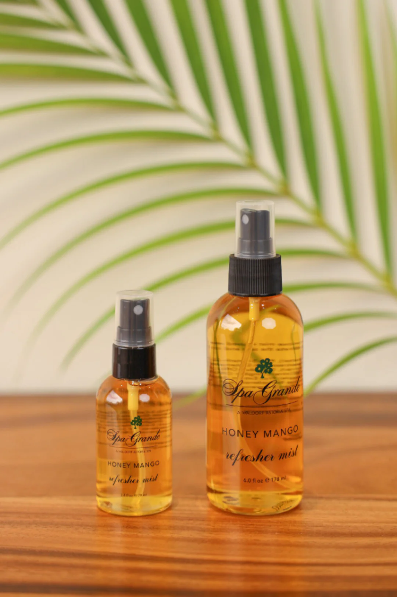
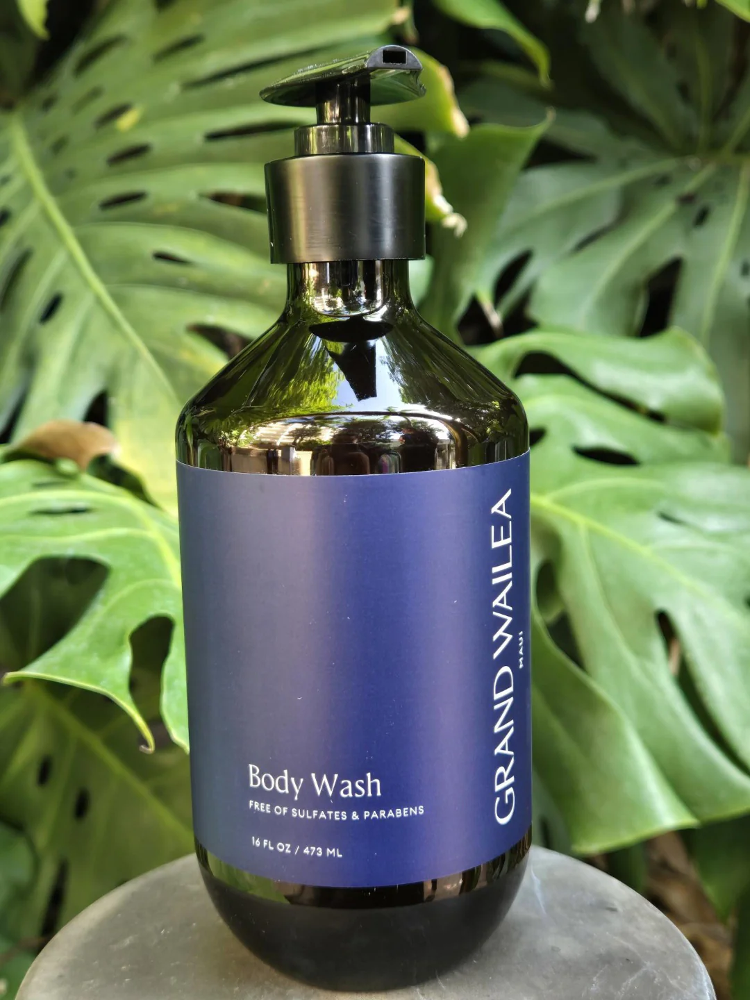

+++
title = "The Fall of a Great Product"
date = 2026-01-03T13:00:00-08:00
[extra]
type = "post"
+++

Many years ago, my family discovered a secret about the [Grand Wailea]:
amongst all their wonderful amenities, none managed to surpass the
quality of their in-room body wash. A good product and a great one are
worlds apart, and until recently, the [Honey Mango scrub] was one of
the best. I want to take a moment to appreciate what it was and honor a
beautiful work by observing its passing.

<!-- more -->

Three things made the body wash an excellent product: it smelled
phenomenal, it [lathered] well, and it had a shining amber color.
Combined, these qualities made the exclusive wash not just the best
in terms of performance—cleaning dirt and imbuing scent—but also in
terms of operation. It was fun. I have fond memories of carrying the
nuclear-orange bottle home from the package center and watching it glint
in the sun. I enjoyed smelling like Maui every day.

This was the deal—quality for inconvenience. For half a decade, we
would trade money (in literal cost) and time (in slow shipping to the
mainland) for a superior product from [their online store]. We were
happy with the arrangement; not compromising on little, [day-to-day
experiences] compounds and happiness is a good deal at any price. I am
grateful for the years of excellent body wash in a way that most readers
will likely find ridiculous.

It wasn't to last. Last year, the product line suffered a refresh.
Each of its finest aspects was decimated: the smell was less sweet,
the lather unimpressive, and the color—now hidden behind dark blue
plastic—approached transparent. But the consultants who had made a
mockery of this wonderful soap did not stop there. They found new
insults. The 32oz size, the most economical option, was eliminated.
And the new pump was designed with a sharp edge that sliced my fingers
repeatedly. This last offense in particular seemed an omen. I conferred
with my dad, who revealed that he had also cut his fingers on a bottle
of the scrub, and we came to a solemn conclusion: it was time to move
on.

I do not expect I will find something quite as magical as the original
soap anytime soon. But I have found [a replacement]: a lather as good—if
not better—than the original, a slightly inferior scent and color, and a
much improved retail experience. It will do.

A soap may seem too trivial a thing to memorialize. But what is a life
but a compendium of little wonders? This was one of mine.

[Grand Wailea]: https://www.grandwailea.com/
[Honey Mango scrub]: https://shopatgrandwailea.com/collections/honey-mango/products/honey-mango-body-wash-1
[lathered]: https://www.merriam-webster.com/dictionary/lather#dictionary-entry-2
[their online store]: https://shopatgrandwailea.com/
[day-to-day experiences]: https://www.amazon.com/dp/B07NDLKQC5/
[a replacement]: https://www.treehutshea.com/collections/body-washes/products/coco-colada-foaming-gel-wash
