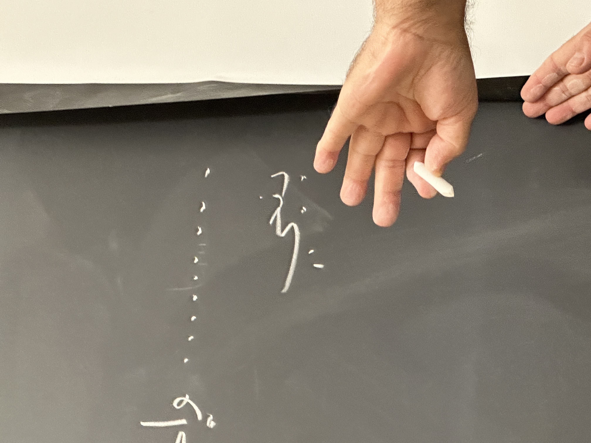

+++
title = "Stanford Quarterly Reflection (Y1Q1)"
date = 2024-01-09
+++

Life changes slowly and then all at once. I started at Stanford
University on September 19th, 2023, an "all at once" day that began the
rest of my life. It is no small thing to leave the home you've known all
your life for a place as strange as Stanford. I am profoundly grateful
for the opportunity to do so and for the people who have made that
possible. It turns out to be a wonderful kind of strange.

<!-- more -->

This past quarter felt like being thrown onto a bucking horse, breaking
it, and immediately turning it toward the racetrack and joining a heat
that was already underway.[^1] It was immediately fun.

### General Philosophizing on the Subject of People
People are supremely important. Having people you care about to eat with
when the evening comes—this one thing can make anywhere feel like home.
This is not a profound realization, but it is one that I have come to
through my time here.

I have been extremely lucky to be joined at Stanford by one of my best
friends from high school. It's completely cheating: I am certain that
the transition would have been far more difficult on my own. To leave
home and be totally alone is an experience I still have not had: when I
moved to Stanford I had Vivek.

I have been further showered with folks who I am grateful for, new
friends that—as anyone who has gone off to college will tell you—I
already feel like I've known all my life. What I most want to say is
this: when I went off to college, it was my most sincere hope that I
would meet remarkable people. I have found this sort of person at
Stanford in abundance, and nowhere more than with you, my friends.

Thank you Jack, for welcoming me into your home—and giving me a potato
for my shelf. Thank you Josh, for debating with me the linguistic
intricacies of Hebrew curse words. Thank you Daniel, Riya, and Amalia,
for hanging out with me in far-flung cities; it's remarkable to land
somewhere strange and have friends there to welcome you. And thank you
Kelly, for introducing me to [Corner], and more importantly being
everything for everyone in difficult times.

And to all those with whom I shared food, ran around in the cold, stayed
up into the wee hours of the night, and woke up for in the early morning
to go lift; it's been a lifetime these few short months and I am amazed
I have been able to spend it with you.

### Specific Commentary on the Subject of Academics
I took six classes, which I found after a confused two-week sprint where
I picked up and quickly dropped, among others, a three-hour long
comparative literature class.[^2] My schedule eventually settled into
the following:

1. CS 106B: Programming Abstractions
2. ARABLANG 1A: Accelerated First Year Arabic
3. HISTORY 81B: Contemporary Middle East
4. CS 7: Personal Finance for Engineers
5. PHYSICS 59: Frontiers of Physics Research
6. ECON 3: Big Ideas Lecture Series

I loved this schedule, and am quite lucky to have stumbled into it.
Sean, my 106B professor, is wonderful and an endless well of millennial,
self-deprecating positive energy. I hope nothing ever stays that spirit.
My Arabic professor Khaled has an incredible tendency to launch off on
half-hour long tangents in the middle of a lesson. It was in his class
that I saw my name for the first time:

We had already learned the alphabet when Khaled used my name as an
example. I looked up at the chalkboard in amazement.[^3] When did I
first see my name in English or Hebrew? This time, I snapped a picture.

HISTORY 81B fell into the trap of most Middle Eastern history courses:
it taught the same old Arab-centric narrative, depriving all characters
of agency and giving the state of the region an air of inevitability. I
took it to hang out with Vedant and Hassan—which I did! Our post-class
coffee routine caused me to be late to Arabic on many an occasion. I
also enjoyed our final project, which [I published here][war-of-return]
as stylistic practice for an eventual submission to the ACX book review
contest.[^4]

The final three classes were all speaker series. Whenever I tell this to
upperclassmen, they universally respond with a shoulder pat and a
wistful gaze as they reflect back on when they were young and naive and
took speaker series. I hope I never come to adopt this position: I think
they're the greatest. In PHYSICS 59 I heard the sound of a single atom
moving. CS 7 filled a huge gap in my knowledge and helped me
contextualize my finances.[^5] And ECON 3 is one of those classes that
can only exist with the unique resources found here.

### Other Rattlings of the Mind
The observation of change is a difficult thing. I find it almost
impossible to embody the version of myself that was once living so
differently.

The blank slate of college is a canvas for personal change. I'm trying
to use it to live as intentionally as possible.[^6] When you are in
control of all the facets of your life, why not design it?

The amount of distinct events that occur each day in my life on this
campus is incredible. Perhaps one of the things I appreciate most about
Stanford is this compression of time and space. There are so many people
doing so many things here, that each day doesn't truly feel complete
until something unique and memorable has occurred. Last night, for
example, I spontaneously dropped in on a class in the law school a
friend of mine is taking that just so happens to be taught by the father
of a high school friend.[^7] How glorious!

### Looking Forward
The second quarter is already upon us. This time around there will be a
lot more writing of papers. And yet, I am sure it will be—as this last
quarter has been—genuinely exceptional.

עם ישראל חי

---

[^1]: I have never done anything remotely like this. It is a metaphor.
Your horse-wrangling mileage may vary.

[^2]: *COMPLIT 214: Shipwrecks and Backlands*, mostly
inspired by an excellent course on surreal Latin American literature in
high school; thalassic Iberian literature seemed like a good next step.
Ultimately, I thought the discussion format combined with the extended
duration made it not a good fit for what I would like to do at Stanford.
I was also briefly in *SYMSYS 1: Minds and Machines*, but was
told that I would receive several zeroes on the first week's work and my
grade would suffer. I believe that's not how the shopping period is
supposed to work, so I dropped out in search of classes excited to have
me.

[^3]: I know, right? Chalkboard! I'd never really seen one of those
before. Amusing that in the middle of Silicon Valley, the chalkboard is
alive and well in the depths of Main Quad.

[^4]: *War of Return* was not assigned specifically, we were just tasked
with writing a book review. The review I will eventually submit to the
ACX contest will likely have decreased usage of "Ibid."

[^5]: Let it also be known that the lecturer, Adam Nash, is extremely
cool, has nice hair, and writes [a blog of his own][nash-blog].

[^6]: Sleep well, be jacked.

[^7]: Because, it seems, taking law school classes as an undergraduate
freshman is something you can do. If you're insane.

[corner]: https://www.corner.inc/clouds
[war-of-return]: @/reading/war-of-return/index.md
[nash-blog]: https://adamnash.blog
