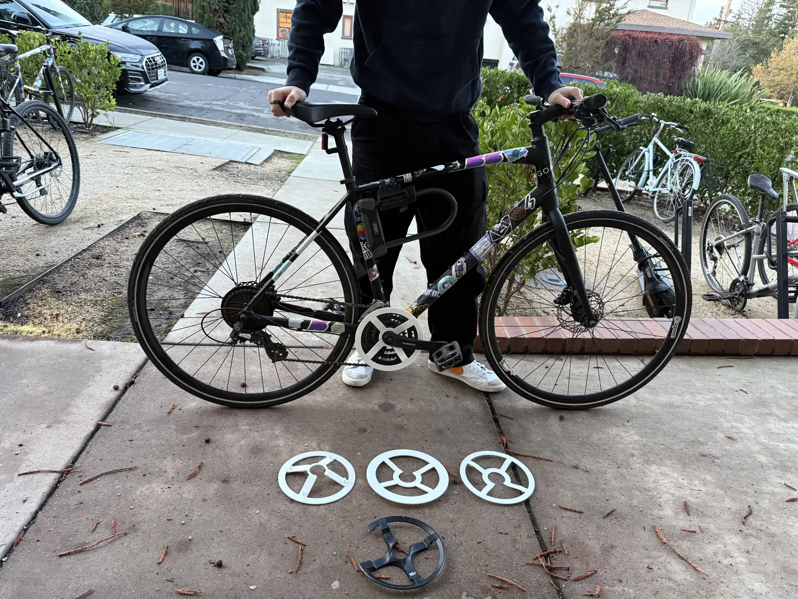
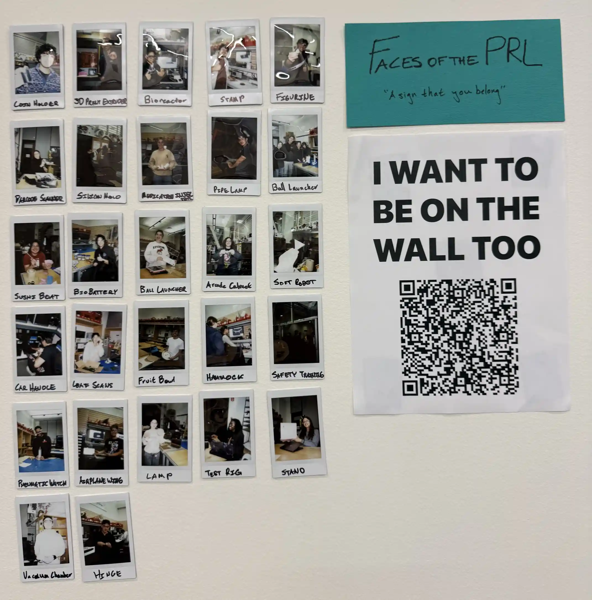
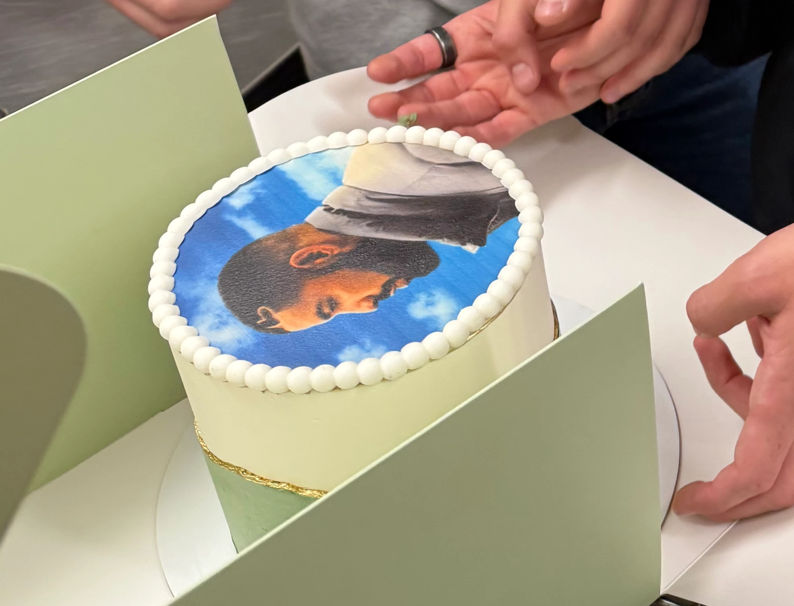

+++
title = "Stanford Quarterly Reflection (Y3Q1)"
date = 2026-03-30T15:45:00-07:00
[extra]
type = "post"
+++

Welcome back to our regularly scheduled programming! Junior year has
been downright blissful. Let me tell you about it.

<!-- more -->

## Academics

I discovered two important things about scheduling this quarter:

1. If you plan things right—or just get lucky and stumble into it, I'll
   let you guess how I found out—you can have no finals at all. This may
   be the consequence of a necessarily project-focused physical major,
   but while we're picking poisons I'm going to drink this one.
2. Advanced courses with low unit counts are the greatest! You cover
   exciting and fresh material in a relaxed environment. Ideally every
   class would work like that—one can dream.

### ME102: Foundations of Product Realization

This course was the cornerstone of my quarter. I learned heaps about
rapid manufacturing, interfacing between parts, how hardware—which
contextually, I have learned, basically means screws—works, and more.

Most importantly, though, it just got me making things. When [Vivek] and I
bought a couch but couldn't get it flush against the wall because of an
inconveniently located pipe, we opened [Shapr] and made new legs to lift
it over the obstacle and into the position we had initially imagined.
When the gear guard on my bike cracked and started stabbing my pant
legs, I rapidly iterated a replacement. This course helped reinforce for
me how malleable the world around us can be.

Of course, the major [tangible outcomes] of this course were the projects:
I've posted about [both][vault] [already][launcher] elsewhere on this
site. I'm proud of the results and how much I learned in making them.
Working with my design partners, Vivek and [Trun], was a joy. But I do
expect the attitude change to be far more productive than any physical
output in the long run.

### DESIGN1: Introduction to Design

I tried to avoid this course entirely, but the bureaucracy won out and
I enrolled. The first project centered on a PSA to induce impossible
behavioral change rather than addressing the root issue via a relatively
simple systemic change. The second project was decently fun: my
lovely group and I built an escape room entitled _Jank Ass Spaceship_,
designed at least one totally novel puzzle, and used [a simple val]
to remote-control a laptop. The third project I commandeered to hang
an unauthorized photo collage of folks in the [PRL] outside of AMPS as a
means of community building. It's still up! I may expand it soon.

### POLISCI114D: Democracy, Development, and the Rule of Law

The incomparable [Professor Sallam] described this course as "PoliSci
Coachella." He wasn't kidding: we learned about nationalism from [renown
motorcycle enthusiast Frank Fukuyama][frank], democracy and it's tumult
from Larry Diamond, the unique case of Latin America from Alberto
Díaz-Cayeros, the international promotion of democracy from Mike McFaul,
and numerous other subjects from Didi Kuo and Sallam themselves. How
fortunate I am to be in a place where these are normal opportunities.
The sessions I enjoyed the most were, of course, case studies, and it
was generally wonderful to have an island of writing and analysis in my
otherwise technical quarter. Also, with the overlap in material and the
more engaging teaching style, I think this course should take the place
of POLISCI1.

### BIO81: Introduction to Ecology

Three good things came from this class:

1. It satisfied the first third of my Domain Focus for the Design major.
2. I learned that palm trees are, in fact, a grass.
3. We had one awesome class where we talked about The Winds. I don't
   think anyone else in class was sufficiently appreciative of the fact
   that the products of Hadley Cells and the Coriolis effect were the
   stuff of myth, discussion by pirates, and the primary drivers of the
   economy and globalism up until fairly recently.

My general knowledge of natural ecosystems has increased by a
mild-to-notable amount, and I am now perhaps 0.5% more likely to read
_Braiding Sweetgrass_.

### DESIGN160R: Design Formation

Portfolio building class! Awesome that there's time carved out for this
in the program. It probably doesn't need a teaching team of six. If,
however, it manages to get me a job at LoveFrom I will sing its praises
until the end of time.

## All the Rest

I spent this quarter as the only president of JSA on-campus, which was
a rewarding endeavour. The community is thriving: Grupo Benji continues
to be the bane of the Coupa Cafe line, and Special Drake was not only
super fun but a widely congratulated theme for our Fall Quarter party
(surpassing my expectation that I would be the only person truly
enthused about it). We've also adopted [Basecamp], which I hope will
help us stay organized, democratize participation even further, and
leave a trail of documentation for those that come after us to help them
take up the torch. The [formal establishment][president] of the [Israel
Studies Program][isp] this quarter has similarly helped to formalize the
legacy and continued existence/stability of Jewish life on campus. I was
honored to be invited to its inauguration, and I'm excited for where the
program will go in the future.

I got up to plenty of shenanigens with my friends as well. Daniel's
FLiCKS was yet again a raging success, with a screening of [Austin
Powers] followed by an evening of discussion with Jay Roach himself.
Daniel also starred, along with Henry, Carter, Jack, Odin, and myself,
on The Quambos intramural indoor volleyball team. I don't know that I've
ever had more fun than playing our first game, winning through spirit
rather than skill, and designing our preposterous kits. The league
will certainly fall to us next quarter. Living in French with Vivek
has been awesome: it seems it's really as simple as liking the same
snacks (and perhaps videogames). And Nageena and I went on a whole host of
adventures—from [kayak camping] in Point Reyes, to [Smuggler's Cove][sc]
and the Little Red Window, to Tahoe with no snow.

Of course, many other people helped make this quarter so beautiful: my
family, Dani, Tommy, Lulu, Aaron, Yoni, Miles, Omry, and perhaps you,
dear reader, as well.

I love you all!

[vivek]: https://vivekvivek.com/
[shapr]: https://www.shapr3d.com/
[tangible outcomes]: @/posts/tangible-deliverables.md
[vault]: @/projects/vault/index.md
[launcher]: @/projects/ping-pong-launcher/index.md
[trun]: https://trunramteke.com/
[a simple val]: https://www.val.town/x/figbert/jank-ass-spaceship
[prl]: https://productrealization.stanford.edu/
[professor sallam]: https://cddrl.fsi.stanford.edu/people/hesham_sallam
[frank]: https://x.com/fukuyamafrancis/status/1552497332960120833
[basecamp]: https://basecamp.com/
[president]: https://www.youtube.com/watch?v=f2flWFN3AAI
[isp]: https://cddrl.fsi.stanford.edu/israel
[austin powers]: https://www.youtube.com/watch?v=tvc_7QGnUFQ
[kayak camping]: https://www.nps.gov/pore/planyourvisit/tomales-bay-boat-in-camping.htm
[sc]: https://www.smugglerscovesf.com/
