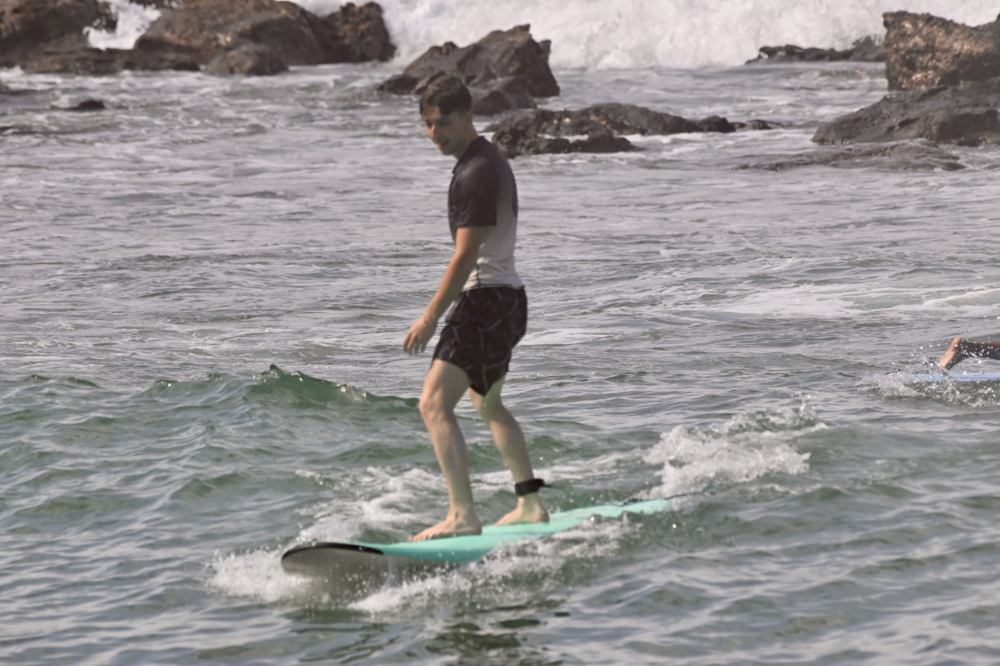

+++
title = "Stanford Quarterly Reflection (Y3Q2)"
date = 2026-07-03T01:30:00-04:00
[extra]
type = "post"
location = "the sky between Austin and the Hamptons"
+++

I continue to insist that winter is the best quarter at Stanford. And
that late is better than never.

<!-- more -->

## Academics
Classes were sort of hit-or-miss. I don't know how that should translate
into my enrollment practices going forward but I will certainly consider
my options.

### ME103: Product Realization (Design and Making)
Woah! As it turns out, metal is a big leap up from [plastics]. To quote
a dazzlingly handsome fella's [project writeup] for the course:

> I have never worked as hard as I worked on ME163* ever in my life.
> The stress alone has taken years off my life, and that’s not even
> factoring in the grease and aluminum shavings I’ve eaten.

ME103 dominated my life in the winter. After careening my way through
the experimental process-exploration phase of stool design, I had
only three weeks to do the actual fabrication. Vivek had finished his
[sundial watch] by the end of week 8. During finals period—just over
two weeks later—I think his [vicarious] stress had outpaced anything he
felt during his own project. But at the end of the day, [Andy] said that
I was "wonderfully stubborn" so I suppose that's worth all those [7AM to
11PM] days in the PRL.

All the while, though, there was a parallel profound joy to the heavy
load of the course. I learned an incomparable amount, gained profound
experience in making robust physical products, experienced a whole
[underbelly of America] that I had never seen before, and of course made
[new] [friends]. It is too early to judge definitively but I think this
is likely to be the most significant course of my Stanford career.

### DESIGN141: Design Methods
My proposal for how to make DESIGN141 great: throw out the current
syllabus, assign [The Design of Everyday Things] instead, and run class
periods as Socratic seminars on the readings. If we need some of that
IDEO flair, we can keep the foam prototype assessments (they were neat).
It's not enough to mean well at a place like Stanford. I urge those in
charge to do the educational design work to realize the potential of
this course to teach students about making human-centered products (or,
better, to copy the work I just did for you free of charge).

Vivek did observe in this class, productively, that I design overly
thick handles. I still think his are too thin but somewhere in between
our natural diametric tendencies is the perfect grip.

### ME80: Mechanics of Materials
ME80 was genuinely bizarre. I can't speak to the reality behind the
scenes, but it sure seemed like the teacher did not want to be there.
Indeed, for the last few weeks, she wasn't! The TAs taught the class
instead. Further: we received _one_ grade back the entire quarter, out
of twelve assignments. I literally have no idea what I received on the
second midterm, worth 30% of our grade (if memory serves), because it
was never returned to us.

But it all turned out alright in the end, the math was actually kind of
fun, and we now use the cantilevered stair model we built as a stand for
a small clock in our dorm room.

### BIOE122: BioSecurity and Pandemic Resilience
I've come out of this course jingoistic about vaccines and a lot more
nervous about the potential use and proliferation of bioweapons. The
main things preventing this at present are a social taboo and an innate
human preference for weapons that explode. These do not strike me as
effective detterence for a class of arms that can be extremely deadly
and readily manufacturable. Perhaps the Hoover [biosecurity magazine]
sitting on my desk will have a better solution.

### ARTHIST129: Fashion
Every quarter must have at least one class for the heart. Would it
surprise you to hear that this winter that was [ARTHIST129]? And what a
class it was!

[Emanuele Lugli] is incredible. My notes on his lectures on the
development of fashion take up a full [memo book]: he's an electric,
hilarious presence at the front of the classroom. Though I initially
enrolled in the course hoping for a more practical breakdown of
clothes—what materials exist, how pants are sewn together, the formal
definition of a chemise—I was happily diverted into a seminar that
focused more on the cultural role of the industry. We started with an
analysis of some of the tensions/contradictions inherint to fashion:
pricing justified through "exclusivity" of mass-manufactured items,
labels as artist signatures, etc. By the end of the course we were
analogizing all of capitalism through the lens of fashion. Somewhere
in between a wrote a kickin' [review of a Public School catwalk].

I find myself thinking about this class [way more often] than I would
have thought. For the final you get to have a 1:1 conversation with
Lugli, outside in the Rodan Sculpture Garden. I don't think I could
possibly encourage you to take it enough.

## All the Rest
I bought new glasses. They're green circular-ish wireframes. Nageena
convinced me to like the Warriors, and we went to several incredible
games. I took my grandparents in their first Waymo. Daniel ran another
legendary FLiCKS, this time screening [F1] with director Joe Kosinski.

After many years of wondering, I finally took a [Zero Motorcycle]
out for a spin. The electrification of motorcycles is in many ways
a much bigger leap than it is for cars: unlike the modern internal
combustion four-wheeler, gas motorcycles all sport manual transmissions.
Despite this radical improvement I found the Zero SR/S—their sportiest
model!—pretty boring. The [Verge Motorcycle], by contrast, was the most
terrifying and awesome vehicle experience I have ever had. My test drive
began _inside the walls [of the mall]_ as we navigated the bikes out to
the streets. The sexy bike, with its hub motor straight out of [Tron],
doesn't feel like it does 0-60 in X seconds: it feels fucking instant.
I am highly skeptical of their solid state battery claims for the next
generation, but as soon as I save up the funds I think I have to buy
this death machine.

Living with Vivek continues to be extremely awesome. I hand-wove a large
net last year, and I finally finished it: we hung it on our ceiling
to make the room more pirate-y. We also (re)started playing [Sea of
Thieves] an irresponsible amount. Keep a wary eye on the horizon for
the _Jolly Mon_ or the _Tea for One_.

And, right after the quarter's end, Nageena and I took a baby step
toward [removing "aspirational" from my business card][surf]:

As always, I offer my endless thanks to [everyone] who made this quarter
so wonderful. My heart goes out to you!

[plastics]: @/posts/stanford-quarterly-reflection-06/index.md#me102-foundations-of-product-realization
[project writeup]: @/projects/me163/index.md
[sundial watch]: https://vivekvivek.com/sundial-watch/
[vicarious]: https://music.apple.com/us/album/vicarious/1474250650?i=1474250658
[Andy]: https://productrealization.stanford.edu/people/andrew-switky
[7AM to 11PM]: https://music.apple.com/us/album/since-ive-been-loving-you/580708279?i=580708284
[underbelly of America]: https://maps.apple/p/oTGoFaW2aPH031
[new]: https://www.tiktok.com/@emilioxfarrell
[friends]: https://www.linkedin.com/in/zelarson/
[The Design of Everyday Things]: https://www.amazon.com/dp/0465050654/
[biosecurity magazine]: https://www.hoover.org/research/biosecurity-really-strategy-victory
[ARTHIST129]: https://music.apple.com/us/album/fashion-is-danger/335064254?i=335064377
[Emanuele Lugli]: https://brightlightsfilm.com/tear-that-dress-off-cinderella-1950-and-disneys-critique-of-postwar-fashion/
[memo book]: https://fieldnotesbrand.com/
[review of a Public School catwalk]: review.pdf
[way more often]: @/reading/rule-the-world/index.md
[F1]: https://letterboxd.com/figbert/film/f1/1/
[Zero Motorcycle]: https://zeromotorcycles.com/
[Verge Motorcycle]: https://www.vergemotorcycles.com/
[of the mall]: https://maps.apple/p/93~IE_Xw3GWFIT
[Tron]: https://letterboxd.com/film/tron-legacy/
[Sea of Thieves]: https://www.seaofthieves.com/
[surf]: @/reading/sweetness-and-blood.md
[everyone]: mammoth.jpg
