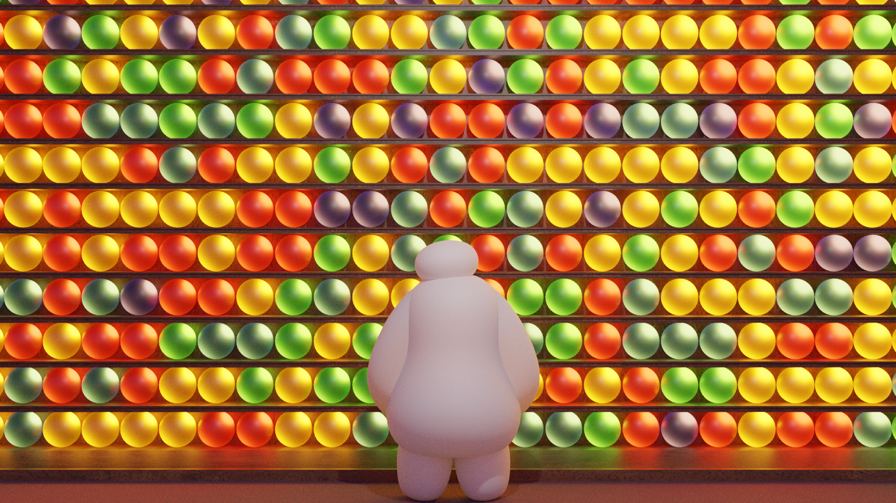
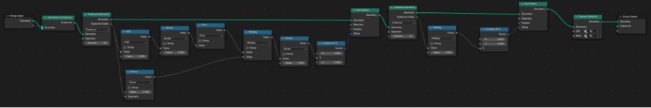
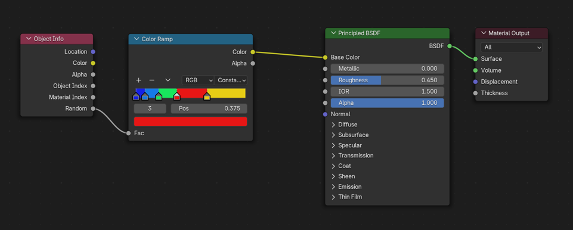

+++
title = "Baymax on Memory Lane"
description = "A 3D scene leveraging advanced graphical techniques in Blender"
date = 2024-12-14T17:31:45-08:00
+++

The above image was created as my final project for [CS148], under the
auspices of renown bodybuilder and occasional professor [Ron Fedkiw].
Everything in the scene was made from scratch in Blender, while the
final image was rendered with the Cycles engine. All my work in the
class was done in collaboration with my good friend Naama.

The scene was inspired by the movie Inside Out, in particular when the
character Joy ventures into the annals of her host’s memory. We
appropriated the concept of a colorful shelf of memory orbs, and then
brought another charismatic Pixar character into the scene, Baymax. We
would like to think that he’s having a happy moment perusing good times
past.

The stars of the show when it comes to this 3D model are the memory
orbs. Most impressively, there's actually only one canonical orb in the
scene! The rest are procedurally generated duplicates (same with the
shelves). There is some simple math to figure out how to place them, and
then a color is randomly selected from a weighted list of options:

The most notable benefit we get from ray tracing in our scene is once
again in the memory orbs lining the shelves. These orbs glow many
different colors: yellow, red, green, blue, and purple. However, the
light source for each orb is actually the same—a bright white light in
the center of the ball. The light source is surrounded by the material
of the orbs, which is transparent but tinted, and thus changes the color
of the light ray after emission and before it hits the camera. Other
benefits include the slight light penetration through Baymax's
inflatable body as well as area and sky lighting.

On a more personal tack: making this scene vindicated a lot of the
philosophies that I've picked up in Stanford's Design program. During my
[first forays into Blender], I was paralyzed to the point of inaction by
the fear that any step I took—extruding a face, tweaking a texture—would
mess up what I'd built so far or would build going forward. I was
limited to following tutorials, which restored some of the structure I
was familiar with from programming to the complex world of modeling
things that looked good (technical term). But the d.school has [changed
my perspective]. The will force you to spend hours and hours sitting in
the in-between phases, acting first and iterating, abandoning ideal
perfections to make something real. With practice, you get comfortable
in this space. That willingness to screw up and `CMD-Z` was crucial on
this project.

[CS148]: https://cs148.stanford.edu
[Ron Fedkiw]: https://physbam.stanford.edu/~fedkiw/
[first forays into Blender]: @/posts/i-wrote-this-two/index.md#making-a-doughnut-in-blender
[changed my perspective]: https://fosstodon.org/@FIGBERT/113553595653702641
