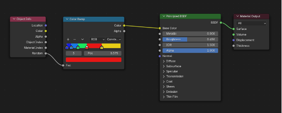

+++
title = "Baymax on Memory Lane"
description = "A 3D scene leveraging advanced graphical techniques in Blender."
date = 2024-12-14T17:31:45-08:00
[extra]
icon = """<svg viewBox="0 0 3412 1828" xmlns="http://www.w3.org/2000/svg" fill="currentColor"><g fill-rule="evenodd"><path d="m813.5 890h-1.5l.5-1h1.5z"/><path d="m109 870h-1.5l-.5-.5v-.5h2z"/><path d="m107 869h-.5l-.5-.5v-.5h1z"/><path d="m378 684h-1v-1h1z"/><path d="m256 574h-.5l-.5-.5v-.5h1z"/><path d="m255 573h-.5l-.5-.5v-.5h1z"/><path d="m1902 590h-1v-1h1z"/><path d="m1903 589h-1v-1h1z"/><path d="m1024 576 1 .5-1 .5z"/><path d="m1871 563h-1v-1h1z"/><path d="m1872 561h-.5l-.5-.5 1-.5z"/><path d="m1065 525h-1v-1h1z"/><path d="m1145 403h-1v-1h1z"/><path d="m1144 401h-1v-1h1z"/><path d="m1779 342-.5 1-.5-1z"/><path d="m1207 328h.5l.5-.5v-.5l1 .5v1l-2 1.5z"/><path d="m1898 106h-1v-1h1z"/><path d="m1900 103h-1v-1h1z"/><path d="m1901 102h-1v-1h1z"/><path d="m1902 100h-1v-1h1z"/><path d="m1903 97-.5 1-.5-1z"/><path d="m1904 95v-1h1v.5l-.5.5z"/><path d="m926 364h-1v-1h1z"/><path d="m1996 831h-1v-1h1z"/><path d="m2722 687h-1v-1h1z"/><path d="m2478 673h-1v-1h1z"/><path d="m2479 672h-1v-1h1z"/><path d="m2479.5 671-.25-1.25 1.25-.75.5.5z"/><path d="m2483 668-.5 1-.5-1z"/><path d="m2483 667h.5l.5-.5v-.5h1v1.5l-.5.5h-1.5z"/><path d="m2485 666v-1h1v.5l-.5.5z"/><path d="m2183 665h-1v-1h1z"/><path d="m2187 661h-1v-1h1z"/><path d="m2190 657-.5 1-.5-1z"/><path d="m2193 655v-1h1v.5l-.5.5z"/><path d="m2194 654v-1h1v.5l-.5.5z"/><path d="m2495 848.25-9 1.25-4-.75-50-5.25-24-7-5-2-22.5-12.5-8-6-3-2-11.5-11.5-2-3-3-4-3.5-5.5-3.5-6.5-2.5-3.5-1.5-2.5-3-3-.625-2.5-6.875-18-3-15-1.125-11-1.125-5-3.5-9-1.125-6 .125-14 .75-4 4.5-13.5 2-2 1-2 4.5-6.5 10.75-12.75 15.25-11.25 12.5-6.370117 10-4 24-5.129883 17-2.25h2l10 2.379883 7 2.75 3.5.620117 1 1 1-1 4.5-.5 16-3 5.5-.5 5 5 2 1 5.5 3.5 1.5.5 3.5 3.5.5 1.5 2.879883 6 .120117 4-1.120117 3-.379883 1.5 7.5 7.5h1l15.5 15.5v1l4.5 4.5h1l4.5 4.5 1 2 11 17 3 4 5.379883 9.5 12.120117 30 1 4 .879883 6v13l-3.879883 19-2 5-6.5 12.5-15.5 15.5-8 6-8.5 5.5zm-126.5-192.25 7.5-4.5 8-3.870117 33-11.129883 10.5-1.5.5-1h-.5l-37.5 5.5-20 8-11.5 7.5-2 1-11.5 11.5-2 3-3 4-3.5 5.5-1.875 4-3.125 9-.5 2.5 1 .5v-.5l.5-1.5 8.5-14.5 1.5-1.5zm120.25-5.25.25-2.25-4.5-4.5-3.5-.620117-1.75-.629883-.25-1.25-1.5-1.5-3-1-3-3h-4l-1.5 1.5.5.5 1.5.5 18.5 11.5zm-157.75 48.25v-1h-1v1zm154-38v-1h-1v1zm-1 1v-1h-1v1zm-2 3v-1h-1v1zm-4 2v-1h-1v1zm-1 1v-1h-1v1zm5 0h-2.5l-4.5 4.5-3.5 6.5-.5 1.5-1 1 .5.5h1l.5.5-1.5 1.5h-3l-.5-.5 1-1-.25-1.25-1.5-.5.129883-1.75.620117-2.5 2-2 2.5-4.5.5-1.5 3.5-3.5 4-2 2.5-2.5v-2l-1.5-1.5-1.5-.5-11-7-1.5-.5-2-2-2.5-.620117-4-1.879883-7-2.870117-4-1.129883-3-.120117-14 3.120117-11 2-4 1-34 13-13.5 8.5-2 1-6.5 6.5v1l-6.5 6.5h-1l-5.5 5.5-.5 1.5-3 5-1.875 4-1 3-2 12-.625 12.5 3 3 2 3 3 4 1.5 2.5.5 1.5-2.5 2.5h-2l-4-4-.5.5 2.5 11.5 7 18 1.5 2.5 5 7 3.5 6.5 3.5 5.5 1 2 16.5 16.5 12 8 15.5 8.5 5 2 24 7 57 4.75 2-.75 6-3 7-3 11.5-6.5 3.5-2.5 16.5-14.5 3.5-3.5 4.5-8.5 2.879883-7 1.120117-4 1.75-11v-17l-.75-4-9.120117-23-6.379883-12.5-7-10-2.5-4.5-3.5-5.5-20-22-2.5-2.5-12-10-1-1-.5.5v1l-1 .5-.5-1-.5.5v.5h-.5l-.5.5v.5h-.5l-.5.5v.5h-.5l-.5.5zm-6 1v-1h-1v1zm-1 1v-1h-1v1zm-2 3v-1h-1v1zm-1 2v-1h-1v1zm-1 1v-1h-1v1zm-1 2v-1h-1v1zm-1 3v-1.5l-1-.5v1zm1 2v-1h-1v1zm-125 57v-1h-1v1z"/><path d="m2742 373h-1v-1h1z"/><path d="m2484 368-1-.5v-5.5l1 .5z"/><path d="m2213.75 359.75h-1.5v-1.5h1.5z"/><path d="m2891 275h-1v-1h1z"/><path d="m2491 41h-1v-1h1z"/><path d="m2492 38v1.5l-.5.5-.5-.5v-1.5z"/><path d="m2492 38v-1h1v.5l-.5.5z"/><path d="m1919 605-1-1v-1l1 .5z"/><path d="m2007 833.25-11-.25.5-1 1.25-.25v-1.5l-1.5-.5v-1.5l3.75-1.620117 3.5-.629883 2-2 1.5-.5 4.5-2.5 16.5-14.5 1.5-.5 1.5-1.5 6.5-8.5 6-13 2.75-10 1.625-12-3.875-66-1 .5-.75 8.5-.5 1.879883h-4.5l-.5-1.879883-.25-7 3-17 1-4-.25-5-1.5-4.75-1.25-.25-2.5-2.5v-1l-1.5-1.5-8.5-6.5-6-3-1.5-.5-2-2-7.5-.75-12-2.75-10-4-10-2.620117-22-3.629883-3.5-1.25-2-2-2.5-.5-22-6.120117-15-6.879883-5.5-3.5-3.5-3.5-.25-1.25-1.25-.25-2.5-2.5-.375-1.5-1.125-3-.5-3.5 1-1-1-1v-2l4.5-4.5h1l1-1 .5.5v1l.5.5 3-3 6.25.129883 3.75 5.870117.875 2 1 3 .625 5.5-.5.5-2-2-1.25-.25-.75-1.75-3-6-.75-1.75-3.25-.25-2.5 2.5v1l-2 2 .25 3.25 1.25.25 1.5 1.5 2.25 4.25 5.25 3.25 2 2 2.5.629883 9 4 24 6.870117 3 1.129883 1.5.370117 2 2 23.5 2.879883 10 2.620117 10 3.75 5 1.25 14 2.25 11.5 6.25 11.5 9.5 5.75 4.25.75-1.75 5.5-8.5 1-2 9.5-9.5 2.5-1.5 7.5-5.5 25.5-13.370117 5-2.129883 6-2.870117 8-2.129883 34-4.870117 32 .870117 21 3 8 2 13 5 10.5 5.5 14.5 9.5 17.75 13.75 16.25 18.25 15.5 20.5 5 8 7 16 1.875 6 .875 5v17l-.75 5-3.5 12.5-2 2-.5 1.5-6.5 10.5-9 12-2.5 2.5-13 10-19.5 12.5-29 13-3 .879883-51.5 4.620117-1 1-1-1-30.5-1.75-3-.75-6.5-2.5-2-2-2.5-.5-10-3-5-2-20-9-2.5-1.5-19-15-1.5-1.5-1-2-3.5-5.5-7.875-18-.625-2.5v-.5l-1 .5-.75 15.5-3.875 14-6.875 14-3.5 5.5-7.5 7.5-3.25 1.25-.25 1.25-9.5 9.5-5.5 3.5-6 3zm-101-241.25v-1h-1v1zm-7 1v-1h-1v1zm6 0v-1h-1v1zm-1 1v-1h-1v1zm7 0v-1h-1v1zm1 1v-1h-1v1zm1 2v-1h-1v1zm1 3v-1.5l-1-.5v1zm1 2v-1.5l-1-.5v1zm1 2v-1h-1v1zm258 64v-1h-1v1zm-1 1v-1h-1v1zm-1 1v-1h-1v1zm-1 1v-1h-1v1zm-1 1v-1h-1v1zm-2 2v-1h-1v1zm26-26v-1h-1v1zm-1 1v-1h-1v1zm-1 3v-1h-1v1zm-3 2v-1h-1v1zm-1 1v-1h-1v1zm-1 1v-1h-1v1zm-1 1v-1h-1v1zm3 0-3.5 3h-1l-15 15h-3l-.5 1h.5l1.25.25.25 1.25-.5.5-1-1h-1l-1.5-1.5.25-1.25 1.25-.25 1.5-1.5-1-1 .5-.5 1.25-.25.25-1.25 7.5-7.5 1.25-.25.25-1.25 4.5-4.5 8.25-6.25 1.625-3.75.625-3.5 1-1-.5-.5-15.5-.620117-2-.75-4-.879883h-11l-4 .75-3 1-3.5.5-3 3-3 1-2 2-6.5.629883-14 5.75-9 3.25-2 .870117-2.5 1.5-12 9-3 2-10.5 10.5-9 11-5.5 9.5-2 5-3 19v11l2 15 1.125 4 8.875 20 .5 1.5 10.5 10.5 2.5 1.5 8 6 2 1 8 3.129883 9 4.75 5 2 7 2.120117 6.5 1.5 2 2h1l2 2 23.5 2.5 62-4.25 3-.870117 25-10.879883 19.5-12.5 9.5-7.5 3.75-2.75 7.75-9.75 9-15 2-5 1.625-7v-21l-.625-3-6-15-4-7-12.5-16.5-2-3-6-8-16.5-16.5-17.5-12.5-17-10-10-3.870117-7-2.129883-26-4-19-1.120117-40 5.25-8 2-27 12.870117-8 5-12.5 9.5-1.5 1.5-9.5 13.5-4 8-.25 2 1.125 9 1.625 31.5 1 .5v-.5l2.5-12.5 1.875-5 .625-2.5 2-2 .5-1.5 1-2 3.5-5.5 11.5-13.5 2.5-3.5 1.5-1.5 3-2 14.5-11.5 8-4.870117 23-9.129883 9-2.25 6-3.75 5-2 12-3h5l7 1.129883 4 1 5-.25 5 1.370117 5 2.629883 2.5.620117 3.5 3.5-1 10-2 2v2l-1 .5-.5-1-.5.5v.5h-.5l-.5.5v.5l-1 .5.5.5h.5l-3 2-.5-1-.5.5zm-5 1v-1h-1v1zm-1 1v-1h-1v1zm-1 1v-1h-1v1zm-1 1v-1h-1v1zm-1 1v-1h-1v1zm-1 1v-1h-1v1zm-1 1v-1h-1v1zm-1 1v-1h-1v1zm-1 1v-1h-1v1zm-1 1v-1h-1v1zm-134 37v-1h-1v1z"/><path d="m1903 90v-2.5l-1-.5v2.5zm3-1v-1h-1v1zm-5 5v-1h-1v1zm-1 2v-1h-1v1zm-1 1v-1h-1v1zm3 0-.75.25-1.25 2.25-9.5 11.5-1.875 4-.625 3.5-1 1 .5.5h1l.5.5-1.5 1.5h-1l-1 1-1.5-1.5v-1l1-1-.5-.5-1.25-.25.25-2.75 2-5 2-4 8.5-10.5 2-3 1.375-2.5.625-3.5 1-1-1-1-5-33-1.5-1.5-15.5 1.5-28 8.129883-8 3.870117-17.5 10.5-7.5 5.5-11 9-2.5 1.5-3.5 3.5-.5 1.5-3 5-5.875 16-2.875 14v19l.75 5 3 10 3.125 8 9.875 17 3 4 1.5 2.5 14.5 14.5 11.5 6.5 1.5.5 2 2 2.5.629883 6 2.620117 5 1.25 64 5.879883 29-5 21-5.879883 12-2 13-4 8-3 3-.75 9-1.5 4.5-1.25 6-6 4.5-2.5 1.5-.5 2.5-2.5-7-9-3.375-6.5-4-10-2-8-1.125-9 1.125-19 .875-6 3.125-12 5.875-15 1.875-4 .625-2.5 2-2 .5-1.5 4.5-8.5-2.5-2.5h-1l-2.5 2.5-1 2-7 10-5.375 10.5-2 5-3.375 14 .75 10.75-1.5.25-1 1-1-1h-1l-1.5-1.5-1.5-11.5v-6l2-11 2.875-7 .625-2.5 2-2 .5-1.5 9.5-14.5 3-3v-2l-1.5-1.5-3-2-17-13-34.5-18.370117-31-10.129883-23-2.870117-31 .870117-6 1-30 8-15 6-15.5 7.5-12.5 12.5-2 3-3 4-5.5 10.5-3.875 6-1.125 3-.75 3-2 12.879883h-4.5l-.375-1.879883-.25-14 1.375-8.5 2-2v-1l2-2 .625-2.5 2.875-6 1.5-2.5 2.5-3.5 1.5-2.5 17.5-17.5 1.5-.5 36-15 29-7 52 .129883 13 2.870117 32 11.129883 2 .870117 26.5 14.5 9.5 6.5 14.5 11.5 7.5-2.5 7-6 6.5-4.5 12.5-6.370117 18-6.25 2-.879883 2.5-1.5 11.5-8.5 11-5.870117 17-7.129883 11-5 13-3.870117 7-1.129883 10.5-.5 4 4h1l3.5 3.5.25 1.5.25 5-1.125 5-4 11-2.375 4.5-1 1 1.5 1.5 3.5.5 25 9.129883 10 4.870117 39.5 21.5 23 15 15.5 12.5 4.75 3.25.75-2.75 2-5 11-21 .5-1.5 7.5-7.5 16.5-13.5 19.5-13.5 2.5-1.5 7-3 16-8 5.5-3.5 2-2 2.5-.370117 5-1.379883 9 .129883 4-.879883 37-9.75 16 .129883 30 6.620117 30 11.129883 2 .870117 23 14 8 6 2.5 1.5 13.5 13.5 2 3 7 9 8.5 12.5 9.879883 19 1.120117 3 3 13v5l-2 11-1 4-2 5-6.5 11.5-2.5 3.5-1.5 2.5-9.5 9.5-2.5 1.5-13.5 9.5-15.5 8.379883-3 1-6.5.620117-2 2-1.5.5-6 4-2 .879883-24 4.75-59-.75-4-.879883h-6l-12 2-4 .129883-42-5.129883-4-1.120117-33-12.879883-4.5-2.5-5.5-3.5-2-1-1.5-.5-1.5 1.5-1 2-6 8-10.5 10.5-2 1-14.5 9.5-1.5.5-2 2-2.5.629883-19 8.870117-18 4.75-9 1.5-11 2.75h-87l-25-4.120117-26-9.879883-19-9-8-5-9-7-3-1-9.5 6.5-8.5 6.379883-5 1.870117-9 1.5-3 .75-21 7-17 3.129883-21 5.870117-23 3.75-51-1.870117-5-.879883-4-1-12-2-4-1.120117-7-2.879883-13-7-3-2-13.75-11.75-11.25-14.25-3.5-5.5-6.875-13-6.125-18-2-14v-8l3-18 2-7 5-13 5-9 .5-1.5 4.5-4.5 1.5-.5 3.5-2.5 14-11 14.5-9.5 16-7.870117 32-9 7-1.129883 11.5.5 4.5 4.5 1.5 5.5.5 5.5-1 1 1 1 .625 11.5 1.75 11v8l-1.375 4-.5-1-.5.5v.5l-1 .5.5.5h.5v1.5l-.5.5h-.5l-.5-1-.5.5zm-4 2v-1h-1v1zm-1 1v-1h-1v1zm-1 2v-1h-1v1zm-1 1v-1h-1v1zm-1 1v-1h-1v1zm-2 2v-1h-1v1zm-1 1v-1h-1v1zm-1 1v-1h-1v1zm-1 2v-1h-1v1zm-1 2v-1h-1v1zm-1 3v-1.5l-1-.5v1zm-1 3v-1.5l-1-.5v1zm1 3v-1h-1v1zm270.5-82 .5-.5.5-1.5 2-4 2.875-7 1.125-4 .5-4.5-2.5-2.5-4-1-1-1-1 1-1.5.379883h-5l-11 3.120117-14 6-17 7.129883-4.5 2.370117-.5 1 45 2.75zm80.5 184.5 11-3 9-4 1.5-.5 2-2 2.5-.620117 8-3.879883 11.5-7.5 8-6 1.5-1.5 8.5-10.5 1.5-2.5 1-1-5.5-5.5h-1l-2.5-2.5-6-8-1.375-2.5-3.125-8-.875-3-1-6v-15l1.375-10.5-8.5-8.5-13.5-10.5-23.5-15.5-45.5-24.5-2-.870117-25-9.129883-3.5-.5-1-1-.5.5v3l-1 .5v-3.5l-1-.5v.5l-.625 4.5.25 3 .375 1.5-1.5 1.5-2.25-.25-.5-3.5-1.5-.5v-1.75l.75-4.5 1-1-1.5-1.5-43.5-3.620117-28.5 3.620117-2 2-3 2-15.5 13.5-2.5 1.5-6.5 6.5-2 3-3.5 4.5 4 8 6.5 7.5 5 7 6.5 11.5 2.875 7 1.125 4 .75 5v21l-1.875 8-8.375 15.5-11 14-7 7 1.5 1.5 2.5 1.5 7.5 5.5 2.5 1.5 1.5.5 2 2 2.5.629883 14 6.870117 23 9 14 3 48 5.25 47-3.370117 4-.879883 3-1zm-187-162.5v-1h-1v1zm-1 1v-1h-1v1zm-2 1v-1h-1v1zm109-12v-1.5l-1-.5v1zm-1 5v-1.5l-1-.5v1zm1 2v-1h-1v1zm332-21v-1h-1v1zm2 1-5 4.5-.5 1.5-2.870117 5-2 5 .120117 4.75-1.75.75-1.75.25-.5-3.5-1.25-.25-.5-.5 1-1 .629883-2.5.75-2 .620117-3.5 2-2 2.5-4.5.5-1.5 4-4-.5-.5h-2l-2-2-1.5-.5-5-3-2-.75-27-5.120117-7-.129883-8 1.25-3 .75-7 2.75-13 2.379883-11 2.870117-9 4-5.5 3.5-2 1-2 2-2.5.5-5 2-22.5 13.5-3.5 3.5-6.5 10.5-.5 1.5-2 2-.625 2.5-1.875 4-2 5-3.5 14.5-1.5 1.5h-1l-1 1-1-1-1.25-.25-.875-2.75-.125-2 2.25-15 1.125-4 3.875-9 3.5-5.5 1-2 1-1-.5-.5-1.5.5-3.5 2.5-17 14-1.5 1.5-3.5 5.5-8 15-5.125 13-.125 1.75 1.25.25 9.5 9.5 6 8 3.5 6.5 4 10 .75 4 .125 13-1 5-1 3-.125 1.75 1.75.75 2 1 5.5 3.5 2.5 1.379883 33 13 4 1.120117 45 3.879883 5-.629883h14l4 .5 53 1 23.5-4.25 2-2 2-1 5.5-3.5 2-.75 9-2.25 3-1.120117 7-3.879883 14.5-9.5 2-1 13.5-13.5.5-1.5 5-8 2.879883-7 1.120117-4 .879883-5v-10l-1.879883-8-1.120117-3-7.879883-15-7.5-11.5-10-13-2-3-8.5-8.5-2.5-1.5-9-7-13.5-8.5-12.5-6.5-7-2.870117-2.5-.629883-1-1-.5.5v2l-1 .5-.5-1-.5.5v.5h-.5l-.5.5zm-4 1v-1h-1v1zm-1 1v-1h-1v1zm-1 2v-1.5l-1-.5v1zm-1 2v-1.5l-1-.5v1zm-1 1v-1h-1v1zm-1 1v-1h-1v1zm-1 3v-2.5l-1-.5v2.5zm-1 2v-1h-1v1zm-1 3v-1.5l-1-.5v1zm-1 2v-1.5l-1-.5v1zm1 3v-1h-1v1zm-432 4.5-.5-.5-6 6h-1l-3.5 3.5 2.5 2.5.5-.5 2-3.5zm1 115 7-9 1.5-2.5 5.875-12 1-3 1-5v-13l-1-6-3-9-3.875-7-7.5-11.5-1-2-7.5-7.5h-1l-1.5 1.5-.5 1.5-5 10-5 13-3.875 14-.875 7v20l.875 5 .875 3 4.125 11 3.375 6.5 5.5 5.5zm260.5-6.5.5-.5 1.5-8.5v-5l-1.125-5-3-8-4.375-8.5-9.5-9.5-.5.5-.75 12.5 2.25 11 4.5 10z"/><path d="m3017 694-1-1v-1l1 .5z"/><path d="m3007 842.379883-42-4-12-2.879883-18-6.120117-9-3.879883-18.5-10.5-10.5-7.5-19.5-17.5-1.5-1.5-1-2-2.5-3.5-1.5-2.5-3-3-.620117-2.5-5.879883-13-.870117-3-.879883-6v-20l2.879883-16 3.870117-13 5-12 8.5-15.5 17.5-17.5 2-1 5.5-3.5 40-17 11-3 3.5-.5h.5l-.5-1-12.5-.620117-15 2.120117-25 6-9 3.129883-10 4.870117-5 2.879883-8 2.370117-2 .75-2 1-27.5 24.5-15 15-3.25-.25-.75-1.75v-2l2.5-4.5 2-3 1-2 21.5-21.5h1l5.5-5.5v-1l4.5-4.5 6.5-3.5 2-.75 8-2.370117 19-8.879883 35-8.870117h41l19 3 3 1 8 3.870117 2.5 1.5 10.5 7.5 12 8 8 6 29 26 4.5 3.5 1.5 1.5 2 3 18 24 1.379883 2.5 6.120117 16 3.75 19v19l-2.870117 13-2.879883 7-10 16-5.5 7.5-8.5 8.5h-1l-2.5 2.5v1l-3.5 3.5-1.5.5-2 1-2 .75-8 1.379883-4 1-16 4.870117zm2-10.129883 25-3.75 12-3.870117 3-.879883 9-1.5 12.5-10.25 1.5-1.5 7-9 8.5-13.5 3.879883-8 3-13 .120117-10-2-14-4-14-4-9-3.5-5.5-12-16-2-3-8.5-8.5-3-2-23-21-11.5-8.5-2.5-1.5-2-2-.5.5 4.129883 6.5.120117 12-2.25 17.5-1 .5v-2.5l-1-.5v.5l-.5 3.5-1.120117 4 .120117 2 .5 1.5-1.5 1.5-2.25-.25-.75-3.75v-5l3.129883-18-.629883-8.5-2.5-2.5-1.25-.25-.75-1.75-4.5-8.5-4.5-4.5-1.5-.5-9-5-2-.75-8-.25-12 2-19 5-37 15.879883-2.5.620117-2 2-15 13-3.5 3.5-7.5 13.5-5 12-3 10-2.75 13 .129883 26 .620117 3 1.129883 3 6.370117 12.5 2.5 3.5 1.5 2.5 5.5 5.5h1l5.5 5.5v1l3.5 3.5 3 2 12 9 7.5 4.5 18 8.879883 21 7 23 4.120117zm4-139.25v-1.5l-1-.5v1zm1 4v-1h-1v1zm-1 1v-1h-1v1z"/><path d="m153 1467-.5 1-1.5-1z"/><path d="m143.5 1467h-3.5l.5-1h3.5z"/><path d="m671 1224 1 .5-1 .5z"/><path d="m366 1250 1 .5-1 .5z"/><path d="m412 972h-1v-1h1z"/><path d="m639 940h-1v-1h1z"/><path d="m642 938h-1v-1h1z"/><path d="m643 936-.5 1-.5-1z"/><path d="m628 953-.5 1-.5-1z"/><path d="m636 942h-1v-1h1z"/><path d="m638 941h-1v-1h1z"/><path d="m1828 1614h-1v-1h1z"/><path d="m1463 1537v-1h1.5l.5.5v.5z"/><path d="m1863.5 1455h-1.5l.5-1h1.5z"/><path d="m1866 1454h-1v-1h1z"/><path d="m1869 1452-.5 1-1.5-1z"/><path d="m1850 1430-.75-.25.75-2.75z"/><path d="m1850 1427v-.5l.5-.5h.5v.5l-.5.5z"/><path d="m1851 1426v-.5l.5-.5h.5v.5l-.5.5z"/><path d="m1852 1425 .25-.75 2.75.75z"/><path d="m1050.5 1459h-1.5l.5-1h1.5z"/><path d="m980 1684.5h-5l-6-1.25-4 .629883-21-2.5-19-4.129883-2-.75h-2l-2 .629883-24 .120117-26-1.620117-3 .620117-18 1.25-20-2.370117-2 .25-3 .870117-179 3.129883-6-.879883-235 3.129883-153 6.620117-9 2-105 8.5-6 1.629883-6.5.620117-5 5h-2l-1 1-1-1-2.5 2.5v1l-2.5 2.5h-2l-1 1-1-1-2.25.25-.5 1.5h-1.5l-.5-1.5-1.5-.5v-1.5l3.25-.25.5-.5-1-1 2.5-2.5h1l6-6 2.5-.620117 7-4.629883 9-2.25 3-1.120117 2-.5 417.5-22.879883 1 1 1-1 84.5 1.5 109 2.879883 73-5.129883 4-.75 4-.25 24 2.5 14-2 25 1 4 .5h21l4-.75 4 .129883 2 .75 4 1 7 1.25 7 1.75 32 3.25 3-.25 2-.879883h2l1.75.75.625 1.75.625 3.5-3.5 3.5zm6-4.5v-1h-1v1z"/><path d="m972 1623.629883-4-.129883-3-.870117-4.5-.629883-1-1-1 1-11.5 1.629883-5-.129883-4-.870117-9-.129883-22.5 2.5-2-2-132.5-3.5-14-2.120117-7-1.879883-6-1-4-1-262-4.870117-4 .5-217 7.370117-15 2.879883-57 4.370117-20 2.5-34.5.75-1-1-1 1-5.5 1.25-19 1.5-45-4.620117-2 .25-4 .120117-5-1.75-9-1.370117-14.5.620117-1 1-1-1-7.5.75-3.5 1.25-1.5 1.5v1l-1.5 1.5-1.25-.25-.25-1.25-1.5-1.5-1 1-.5-.5v-1l-5-5v-2l2.5-2.5 4 1 2 2h2l4-4 8.5 1.629883h3l11.5-1.629883 1-1 1 1 10.5.75 3 .879883 2 .75h3l2-.25 58 3.25 6-1 3-.75 44-1.129883 7-1.120117 3-.75 63-5.25 15-3.129883 215-7.120117 3-.379883 256.5 4.25 1 1 1-1 7.5.629883 62 8.870117 102.5.5 2 2 16.5-2.370117 27-.5 2-.629883 2-.870117h4l2 .620117 19.5 3.75 2.5 2.5v2l-1.5 1.5-1-1-3.5 1.25zm-962 4.370117v-1.5l-1-.5v1z"/><path d="m895 1215h-1v-1h1z"/><path d="m917 1143h-1v-1h1z"/><path d="m2561 1572-1-1-1-1.5.5-.5 1.25.25z"/><path d="m2472 1301h-1v-1h1z"/><path d="m2474 1299-.5 1-.5-1z"/><path d="m2738 1250-.5 1-.5-1z"/><path d="m2206 1258v-1.5l.5-.5 2.5 2.5-.5.5h-1.5v-.5l-.5-.5z"/><path d="m2206 1255h-1v-1h1z"/><path d="m2716 1022-.5 1-1.5-1z"/><path d="m2492 962-1-.5v-2.5l1 .5z"/><path d="m1936 1156h-1v-1h1z"/><path d="m1943 1155h-1v-1h1z"/><path d="m2195 942h-1v-1h1z"/><path d="m2194 941h-1v-1h1z"/><path d="m2192 938 1 .5-1 .5z"/><path d="m3265 1192-1-1v-1l1 .5z"/><path d="m2987 977-1-1v-1l1 .5z"/><path d="m2957 1693.5-171-.870117-13-2.129883-7-1.75-653-9.370117-11-1.629883-138-3.370117-7 1.120117-90-2.620117-3-.379883-24-6.75-7-.120117-5.5 1.370117-1 1-1-1-.5.5v1l1 1-1.5 1.5-2.25-.25-.5-3.5-1.25-.25-.5-.5 1-1v-2l2.5-2.5 2.5-.370117 7-1.879883 5-.25 4 1.129883 6 2 4-.129883 2 .75 5 1.25 4 .629883 92 3.5 6-1 142 2.120117 11 1.629883 598.5 4.620117 1-1 1 1 14.5.75 39 3.879883 4 .870117 3 1 4 .75 126 1.25 13 2 69.5.5 1-1 2 2 4 1 1.5 1.5-2.5 2.5zm34-3.5v-1h-1v1zm3 1v-1h-1v1z"/><path d="m830.5 44 .5-1h-1.5l-.5 1zm-40.5 24.5 26.5-17.5 10.5-5.5 1.5-.5.5-1h-3.5l-1 1-1-1-3.5.629883-23.5 16.370117-2 1-7.5 7.5.5.5zm168 153.129883 5-2.129883 19.5-11.5 14-11 .5-.5-1-1-.5-1.5-2.875-5-1.25-3-2-7-4.875-35v-6l3.25-13 2.625-6 5-14 4.125-15 1-6 .5-8.5-4-4-.25-1.25-15.25-13.25-5-4-5.5-3.5-18-8.870117-17-6.129883-3-.620117-35-1.129883-3 .5-.875 10.75-.625 2-5 10-3.5 5.5-3.5 3.5-1-1-.5.5-1 7-1.5 1.5-1.25.25-.5 1.5-1.25.25-1.5-1.5v-3l2-2 .375-2.5 1.375-5 3.25-5.5 1.5-1.5 1.25-.25 1.5-3.75 2-7v-5l-.5-2-9.75.629883-12 2.870117-40 18-19.5 12.5-14 10-3 2-10.5 10.5-7.5 11.5-.5 1.5-3.5 3.5h-1l-2.5-2.5.625-3.5 3-7 3.875-7 3.5-5.5 9.5-9.5h1l3.5-3.5-.5-.5-2 1-22 20-2.5 2.5-2 3-3 4-13 20-4.5 9.5-3.875 9-3.125 11-.75 5v21l.875 6 5.875 15 3.5 5.5 3 4 2 3 11.5 11.5 10.5 5.5 12 5.129883h12l5 1.120117 2 .75 2 1 2 .75 10 2.25 33 4 67-7 44-12zm-121.5-180.629883.5-1h-1.5l-.5 1zm-2 1 .5-1h-1.5l-.5 1zm-2 1 .5-1h-1.5l-.5 1zm45.5 25v-1.5l-1-.5v1zm-3 5v-1h-1v1zm-509 198v-1h-1v1zm273 264.5 8-2.120117 11-4.879883 5-2 7-2 9-4 5-2.120117 14.5-8.379883 14.5-10.5 2.5-1.5 18.5-18.5 9-12 1.5-2.5 4.875-10 3.375-16v-2l-2.25-15-2-8-3-7-3.5-5.5-7-9-2-3-9.5-9.5-21.5-16.5-12-8-16-12-3-2-23-12-20-8-8-1.870117-34-.879883-6 1-30 12.75-8 5-13 10-2 1-1.5.5-1.5 1.5-2.5 4.5-12 25-.5 1.5.5.5 5-5 22-18 18-13 11.5-6.5 13-5 5-2.870117 3-1.129883 4-1 12.5-1.5 1-1 1 1 14.5.5 8 2h7l9.75 2.75.25 1.25 1.5 1.5 1.5.5 6 4 1.5.5 2.5 2.5 2.25 8.5.25 11-1.875 14-.875 19 .25 1.5-1.5 1.5-.5-.5v-1l-1-.5v1.5l-1 .5-.25-2.75-1.75-.5-.75-12.75 2.125-16-.25-12-1.125-4.5-1.5-1.5h-2l-4-4-3-1-3-3-2.5-.5-9-.25-5-1.5-21-1.25-6 1-5 1.25-2 .75-6 3-10 3.879883-2.5.620117-2 2-1.5.5-6.5 3.5-14.5 10.5-27.5 22.5-15.5 15.5-.25 1.25-1.25.25-1.5 1.5-10.5 12.5-8 12-.875 2-1 3-2.5 16 .125 2 3.375 15 1.875 6 8 18 2 3 19.5 22.5 2.5 2.5 2 1 3 2 4.5 2.5 5.5 3.5 6.5 3.5 5 2 25 7 5 .75 25 .129883zm-130-152.5v-1h-1v1zm449 154.5 6.5-3.5 3.5-3.5v-1l3.5-3.5h1l5.5-5.5v-1l2.5-2.5 3.25-.25.75-1.75 4-7 2.875-6 3.125-9 .625-4 .125-26-.75-5-6.125-23-9-22-25.875-47-2.875-6-.625-2.5-6.5-6.5-11-9-2.5-1.25-5.5-.75-.5.5 1 1 1.25 4.5.75 13.5-1 .5v-2.5l-1-.5-1 12.75 1.75.5v2.5l-1.75.75-1.75.25-.5-2.5-1.5-.5-.625-2.75-.125-6 1-6-.125-7-.625-2.870117-5.5-.25-1.25-3.379883-5.5-5.5h-1l-1 1-1-1-10.5.879883-2 .620117-5.5 3.5-19.5 10.5-3 2-13.5 10.5-5 3-24 20-4.5 4.5-1.5 2.5-20 26-2 3-.5 1.5-2 2-.625 2.5-7.875 15-2 5-.5 2.5-1.5 1.5h-3l-1.5-1.5.625-5.5 4-13 5-12 1.375-2.5 21.5-28.5 1.5-2.5 9.5-9.5 14.5-12.5 8.5-6.5 5.5-3.5 13.5-10.5 19.5-10.5 5.5-3.5 4.5-2.5 1.5-.5.5-1-15 .75-3 .629883-33.5 2.620117-3 3-3.5 1.25h-7l-14 2.5-15 6.75-3 2-4.5 3.5-3 2-1.5 1.5-2 3-3.5 4.5-2 3-6 15-2.125 7-2.625 7-1.125 8-.125 17 2 16 5.125 18 7.875 17 5 13 .5 1.5 3.5 3.5 1.25.25 7.25 9.25 3.5 3.5 6.5 3.5 13 10 11.5 6.5 7.5 5.5 3 2 5 2 17 4.879883 33 5.120117 35 1.879883zm-704 25.5v-1h-1v1zm0 7v-1h-1v1zm4.5-8 .5-1h-2.5l-.5 1zm2 1 .5-1h-1.5l-.5 1zm12.5 64v-1h-1v1zm57 206.379883 23-2.879883 38-10.120117 33-14.879883 13.5-8.5 10-8 3-2 2-1 4.5-4.5 10-13 10-15 1.375-2.5 8.125-20 2-7 2-14v-7l-2.25-14-.75-2-7.5-14.5-16.5-16.5-10.5-6.370117-4-1.129883-8-3.120117-5-2.75-3-1.129883-20-6-5-.75-14 .129883-11-1.379883-23-1-18 2.25-7 1.75-16 6.129883-25.5 13.370117-7.5 5.5-2.5 1.5-14.5 14.5-4.5 11.5-.5 1.5.5.5 4-4h1l3.5-3.5v-1l8.5-8.5 12-10 2.5-1.5 15-7 2-.75 17-2.5 5 .25 4-.75 21-1 2 .5 11.5-.25 1 1 1-1 1.5-.370117 6.75.120117.25-1.25 2.5-2.5h5l1.5 1.5v4l-2 2-.5 1.5-1 2-5 7-2.875 7-2.125 7-.5 2.5-1 .5v-1.5l-1-.5v.5l-1.5 6.5-.5 3.5-1 1 2 2-1.5 1.5-3.25-.25-.75-2.75v-4l1-5 5.875-18 .375-3.870117-19.25-.129883-2-2-1 1-38.5 3.75-3 .879883-8 3.870117-5 2.129883-7.5 5.370117-31.5 31.5.5 3.5 2.5 9.5 7 7-.25 3.25-1.75.75h-2l-6.75-4.75-1.25-2.25-4-6-1-2-1-.5v1.5l-1.5 1.5-4 2-2.5 2.5-3.5 6.5-9 14-2.879883 6-2.120117 8-2 12 .120117 7 .879883 4 5 13 3.5 5.5 10.5 10.5 2 1 6 4 10.5 5.5 22 9 8 2 5 .879883zm171-124.379883v-.5l7-12 5.5-7.5 6.5-10.5 8.5-11.5 1.5-2.5 6.5-6.5 1.5-.5 4-2 11.5-8.5 2-1 7.5-7.5.25-1.25 2.25-1.25 7-5 2-1 1.5-1.5-.5-.5-136 5-.5 1h.5l1.5.5 6 3 5 2 4 1.129883 4 1.870117 5.5 3.5 4 3 3 2 11.5 11.5 2 3 3 4 3 5 5.375 11.5 1 4 1.125 9 .5 9.5zm147.75-57.25 1.75-9.75-.25-6-.25-1.5-2.5-2.5h-6l-3-3-1.5-.370117-3-1.25-2-.5-29 .870117-3 .879883-5 1.870117-8 2.25-2 .75-11.5 8.5-2 1-6.5 6.5v1l-2.5 2.5-1.5.5-2.5 1.5-8.5 6.5-3 2-2 1-1.5.5-7.5 7.5-2 3-6 8-1.5 2.5-.5 1.5.5.5 9-9 4.5-2.5 7-3 3-2 8-6 3-1.870117 3-1.129883 21-6 45-6.25zm245.625 69.25 4.125-11 .5-3.5 4-4 .5-4.5 1.125-4 2-5 6.75-9 1.25-4 .875-2 4-7 .5-1.5 2.5-2.5h1l1.5-1.5 10-13 4-6 1-2 2-2-3.5-3.5-19-2-1-1-1 1-9 1-1-1-.5.5-1 3-1.5 1.5-1.5.379883h-3l-2-.75-2.5-.629883-1-1-1 1-1.25.25-.5 1.5-3.25 1.25-1 1-1-1-10.5.629883-5 1.120117-3.5 1.25-2 2-5.5.5-4 1-10.5 1.5-4 4-2.25.25-1.25 3.25-1.5 1.5-3 1-3 3-10.5.75-11 2.879883-2 .870117-6 3.879883-7.75 2.870117-.5 1.5-5.25 4.25-8 7-4.25 3.25-1.25 3.25-1.5 1.5-1.25.25-1.25 3.25-1.5 1.5-1.25.25-1.25 3.25-3 3-.625 2.5-4.375 6.5-2 2-.625 2.5-2.375 3.5-3.5 4.5-1 3 4 10 2 8 .75 5v18l-.75 6-1 4-8 19v2l3.75 8.75 2.25.25 1-1 1 1h2l1.5 1.5.5 1.5 1 2 .5 1.5 4.5 4.5 6 1 5 5 1.5.5 4.5 2.5 2 2 13.5.879883 2-.25 3-1.129883 3 .129883 8 3.870117 1.5.5 1.5 1.5v1l2.5 2.5h1l.5.5-1 1 1 1-.25 2.25-4.25 1.25-.5.5 3.5 3.5h4l2-2 7.25-.870117.25 1.370117 1.5 1.5 1.25-.25 5.875-17.75.375-1.5 2-2 .625-2.5 2.875-5 .875-2 .625-2.5 2-2 .5-1.5 9-17 2.875-6 2.375-8 2.75-5 .875-2 1.25-4 .875-2 .5-1.5 2-2v-3l5-5 .375-1.5 3.125-8 4-7zm-513.375-49v-1h-1v1zm-1 4v-1.5l-1-.5v1zm-4 2v-1h-1v1zm3 1v-1.5l-1-.5v1zm-4 2v-1h-1v1zm-1 5v-2.5l-1-.5v2.5zm-1 5v-2.5l-1-.5v2.5zm1 3v-1.5l-1-.5v1zm331 143.379883 4.5-.379883 3.5-3.5 2-3 3-4 6-9 7-13 2-2-.625-4.5-1-3-2.75-6-.875-4-.75-37.5 2-2 .25-2.5 1.5-8 2.75-5 .5-1.5 2-2v-2l-2-2-1-2-5-8-6-8-13.5-13.5-2.5-1.5-9-7-9.5-6.5-16.5-8.5-10-3.870117-13-2.129883-27-.75-33 4.75-21 6-2.5.5-3 3-2.5 1.5-4 3-2.5 1.5-2 2-2.5.5-3 1.129883-4.5 2.370117-8.5 8.5-1.5 2.5-7 10-1.875 4-10.125 28-.5 2.5-1.5 1.5h-3l-1.5-1.5 4.625-24.5 1.875-6 .5-2.5-1-.5v.5l-.5 1.5-5 9-2 5-3.75 18 2.75 51 2 8 12 26 5 8 11.5 13.5 2.5 2.5h1l3 3zm-179-148.379883v-1h-1v1zm129-36v-2.5l-1-.5v2.5zm-141 54v-1h-1v1zm-1 2v-1h-1v1zm227 81v-.5l.625-2.5 3.875-10 2-11-.25-11-4.5-17.75h-1.5l-2 9.75-1.5 4-.25 25 1.25 9 .875 3.5zm-5 44.5 15-1.870117 12.5-.629883.5-1h-.5l-1.5-.5-4.5-2.5-3.5-3.5v-1l-1.5-1.5-3.5-.620117-2-.879883-1.5-.5-3.5-3.5-1.25-5.25h-1.5l-5.75 10.75-6.5 9.5-1 2-1 1 .5.5zm-630 28.5v-1h-1v1zm6 4v-1h-1v1zm528 .5 6-1 31-9.120117 5-2 15-7.75 2.5-.629883 1.5-1.5-.5-.5-146 16-.5 1 17 1.75 9 2.75 4 .879883 29 3.370117zm165.5-27.5.5-1h-1.5l-1-1-1 1h-1l-.5 1zm2 1 .5-1h-1.5l-.5 1zm3 3 .5-.5v-1l-1.5-1.5h-1l-.5.5zm7.5-1v-1h-1v1zm-6 2v-1h-1v1zm1 1v-1h-1v1zm111-487v-1h-1v1zm-1 11v-6.5l-1-.5v6.5zm2 2v-1h-1v1zm533-331v-7.5l-1-.5v7.5zm72 20v-1h-1v1zm-1 1v-1h-1v1zm-505.5 103 7.875-16 1-4 1.25-7v-4l-2.125-13-11-24-.5-1.5-8.5-8.5-1.5 1.5-.5 4.5-3 12-8 21-.75 2-1.25 5-.875 5 .375 16.5 2 2 .625 12.5 3.375 16.5 2 2 .25 1.25 1.25.25 2.5-2.5 1-2 2-3zm253.5-53v-1h-1v1zm253-48v-1h-1v1zm4.5 2 .5-1h-1.5l-.5 1zm8.5 0v-1h-1v1zm-2.5 1 .5-1h-4.5l-.5 1zm124 179 .5-1h-1.5l-.5 1zm-502.5 30.5 6.75-1.75-.25-1.75-.875-2-.875-3.870117-13.75 1.370117-49.5 1.5-.5 1 26 3.129883zm2.5 17.5.5-1h-4.5l-.5 1zm438.5-38v-1h-1v1zm-394 68v-1h-1v1zm-66 83v-1h-1v1zm1 4v-1.5l-1-.5v1zm-82 116v-1h-1v1zm-37 50 1 1.5-1.5 1.5-15.5 2.5-21.5-.5-1.5 1.5-2.375 4.5-1.625 6.5-2 2-.5 1.5-1 2-.5 1.5-2 2-.625 3.5-4.875 10-5.5 8.5-15 19-8 12-14.5 17.5-2.875 5-1.625 6.5-4 4-1.25 3.25-1.5.5-4.625 14.75-.625 2.5-2 2-6.625 16.5-11.875 23-.875 2-1.125 4-1.125 3-1.375 2.5-5.5 8.5-5 11-.5 1.5-2 2-.625 4.5-.875 3-1.125 3-15.875 30-.5 1.5-2 2-1 4-2 2-.5 2.5-5.125 15-.125 1.75 3.25 1.25 4.5 4.5-.25 2.25-3.25.25-.5 1h1.5l.5 1h-2.5l-1-1-1 1h-1l-1-1-1 1-1.25.25-2.625 9.75-4.625 32.5.5.5 1-1h4l2 2h3l2.5 2.5.25 1.25 1.5.5.5 1.75v5l-.25 1.5-2.5 2.5-4 1-1-1-.5.5-.25 1.25-1.25.25-2.5 2.5v1l-2 2v2l1 1-1.5 1.5h-1l-1.5-1.5v-1l1-1-.5-.5-1.25.25-.75 3.75 9.125 120 12.875 50 2.75 14.75 1.25.25 1.5 1.5.25 1.5 2.75 9.5 2 2v3l2 2 .5 1.5.875 2 .625 3.5 1.5 1.5 1-1 6.5-.620117 15-3.129883 8-2.870117 7-3.629883 8.5-.75 1-1 1 1 2.25.25.25 1.25 1 1-.5.5-3 1-.5.5 1 1-.5.5-1.5.5-4 2-6 3.879883-11 4-3 .870117-16.75 2.879883 1.75 3.370117 3.5 4.5 1.5 2.5 2.5 2.5 1-1 3 1 1.5 1.5.5 1.5 3.75 5.75 4.25 1.25 1.5 1.5v1l1.5 1.5 1.25.25 2.5 4.5 6.75 2 3 1.75 24.75 19.75 2.25 4.25 4 4 .25 2.25 7.5 5.5.25 1.25 2.5 2.5h1l6.5 6.5v1l2.5 2.5 1.5-1.5.5-3.5 1.25-5 .75-2 2.5-4.5 2-2v-2l2-2 .5-1.5 7.5-14.5 2-2 1-6 2-2 .625-2.5 2.875-5 .875-2 .625-2.5 2-2 .5-1.5 8.75-15.75 1.5-.5 2.75-4.75.5-1.5 4-4v-2l2-2 .5-1.5 10-19 .5-1.5 3.5-3.5 1.25-.25.875-3.75 2.75-6 .625-2.5 4-4 2-9 2-2 .5-1.5.875-2 6.25-23 .75-2 4-14 .625-4.5 1.5-1.5h1l1.5-1.5 3-14 2-2 6.5-27.5 1.125-3 2.125-7 .25-1.5 2-2 .5-4.5 1.125-5 1.625-5 4.125-20 3.25-46 2.625-13-2.125-52 1.375-10-.125-10 1.25-7-.625-14.5 1-1-1-1v-8l-1-1 1-1 .875-18.5 1.375-7 2.75-42.5-1-1 1-1 8.75-199.5 1.75-8 5-35 1.125-4 1.875-5 3.5-12.5 3-3 2.625-10.5.75-2 1.125-4 3.5-22.5-.5-.5-2 2h-1l-14.5 14.5v1l-1.5 1.5-3 1-1.5 1.5v1l-1.5 1.5h-1l-1.5 1.5v1l-2.5 2.5h-1l-2.5 2.5v1l-1.5 1.5-1.5.5-9 7-2.5 1.5-17.5 17.5-6 8-6.5 6.5-1.25.25-.5 1.5-1.25.25-6.5 6.5-1 4-2 2-.25 1.25-1.25.25-2.5 2.5-5 7-2 2 .25 2.25 2.25.25 2.5 2.5 1.25 3.25 9.75 2.75 3 .129883 14-3 5.5-.629883.5.5-1.5 1.5h-1l-.5 1h3.5l.5.5-2.5 2.5-1.5.379883-3 1.25-5 2.75-7 1.870117-8 .129883-4-.879883-6-2.120117-3.5-2.379883-4.5-3.5-2.5-1.5-2.5 2.5-7.5 13.5-6.125 15-3.875 7-2.125 5-.375 1.5-4 4 .5.5h31l1.5 1.5v.5h-1.5l-.5.5.5.5zm-216 313v-1h-1v1zm-360 218.629883 3-1.129883 2.5-.5 2-2 3.25-1.25 2.25-3.25 15.5-17.5 10.5-14.5 1.375-2.5.125-4-.625-4-.125-32 .75-6 5-20-.125-3-1.375-2.5-4.5-6.5-1.5-2.5-8.5-8.5-2-1-14-10-28.5-15.5-8-3.120117-7-2.129883-1.5-.25-.5.5 3 3 .25 1.5.125 7-3.875 10-.5 1.5-.5.5-1-1-5.5 5.5-1.5 5.5-.5 3.5 1 1-1.5 1.5h-2l-1.5-1.5 1-1-.25-1.5-.25-5 .5-3.5 2-2 4.5-6.5 1.875-4 1-3 .5-5.75-4.375-1.25-5.5-5.5v-1l-.5-.5-1 1-4.5-1.25-8-1.25-25 2-20 4-29 11.129883-7 3.870117-3 2-8.5 6.5-24 21-1.5 1.5-.5 1.5-3 6-.5 1.5-2.5 2.5h-2l-2.5-2.5.620117-2.5 4.879883-10 4.5-6.5 18.5-18.5 11.5-8.5 10-6 22-9 16-4.870117 22.5-3.629883.5-.5-1.5-1.5-8.5-3.5-1.5-.5-2-2-11 2-3 3-3.5 1.25-5 1.5-21 11.75-40 29-32 29-2.5 1.5-25.5 25.5-7.5 12.5-.880005 2-.869995 3-1.380005 8 .130005 5 1.119995 4 .75 2 .630005 2.5 2 2 6.5 8.5 3 5 10.5 14.5 4 7 10.5 10.5 2 1 7 5 2.5 1.5 26 12.879883 11 4 7 2 6 .870117h57l41-11.75 15-7 8-3.120117 18-9.379883zm71.5-148.629883 3.5-4.5 7.5-7.5 6-4 7.5-7.5 5-7 2.5-2.5 3-2 16.5-13.5 2-1 1.5-.5.5-1-216.5 5-.5 1h.5l4 1 1.5 1.5.25 1.25 6.75 2.629883 2.5.620117 2 2 1.5-.5 2-.870117 4-.129883 9 2.25 1.5.25 1.5 1.5v1l2.5 2.5h1l3 3 5.5.5 19 4 8 3.129883 32 16.870117 18 13 2.5 1.5 4.5 4.5 2 3 3 4 1 2 1.5 1.5 1.5-1.5 6-10.5zm-104.5-1v-1h-1v1zm223-23v-1h-1v1zm-2 1v-1h-1v1zm-1 1v-1h-1v1zm-2 1v-1h-1v1zm-1 2v-1h-1v1zm-1 1v-1h-1v1zm-1 2v-1h-1v1zm-1 1v-1h-1v1zm-1 3v-1.5l-1-.5v1zm-1 2v-1h-1v1zm12-15v-1h-1v1zm3 1h-1.5l-3 3-3.25 1.25-3.75 5.75-.875 2-.375 2.75 1.25.25.5.5-1.5 1.5h-1.5l-.5-1-.5.5v.5l-1.5-3 .125-4 3.375-6.5 4.5-4.5h1l.5-1-14-.370117-12 1.870117-26 7.129883-7.5 4.370117-6.5 4.5-15 8-5.5 3.5-10 8-6.5 6.5-2.5 4.5-4.5 6.5-1.5 2.5-3.875 8-2.125 8-.5 4.5-1.5 1.5h-3l-1.5-1.5.625-8.5.875-4 5-15 8.5-14.5 3.5-3.5 11-9 3.5-2.5 4.5-2.5 2-2 2.5-.620117 4-1.879883 19-12 4-1.870117 9-3.129883 27-5.75 33.5.25 5-5h2l1.5-1.5v-2l-3.5-3.5-4-1-2-2-4-1-2-2-17.5-2.620117-3-.129883-14 2.5-4 1.629883-8 2.120117-13 6-5 2.129883-14.5 11.370117-3 2-8.5 8.5-3 5-3.5 3.5-6 4-14.5 14.5-10 12-7.5 11.5-1.875 4v3l1.875 5 2 8 .75 5 .125 17-2.125 13-8.625 19-.125 3 11.125 36 8.875 20 .5 1.5 5.5 5.5 7.5 5.25 149-2.120117 4-.75 11-5.879883 1.5-.5 3.5-3.5v-1l7.5-7.5 1.5-.370117 3-1.25 9.5-7.379883 2.5-2.5-.5-1.5-.875-2-.625-3.5-2-2-1-4-2-2-.5-1.5-5-11-3-7v-2l.25-2-1.125-6 .375-14.5 1-1-1-1 7.75-53.5 2.875-13 2.375-4.5-5.5-5.5-2.5-1.5-4-3-12.5-8.5-8.5-4.5-7-2.870117-4-1.129883-13-5-15-4-6 .129883-2 .370117-.5-1-.5.5zm211 215.25 1.5-.25 1.5-1.5-1-1v-2l-2-2v-1l-2-2-.625-2.5-3-8-2.75-5-1-3-2.125-13-9.75-34-2.875-13-3.125-20-3.25-30-3.875-68 3.375-26.5-2.5-2.5-1.5-.370117-3.5-.629883-2.5 2.5v1l-1.5 1.5-5.5-.75-5 .25-2.5-.5-3 3-1.5.5-8 6-8 5-1.5.5-1.5 1.5v2l-1.5 1.5-10 1-3 3-4.25 1.25-1.5 4.5-1.75.75-2 1-1.5.5-1.5 1.5-.5 1.5-1 2-7 11-.5 1.5-3 3 4 4 1 2 9.5 14.5 7.875 20 3.125 12 .75 5v25l-.875 5-.875 3-10 26-8.5 13.5-1.375 2.5v3l.625 1.75 6.5 2.5 1.5 3.5 6.75 4.75 5 2.129883 5 2.75 3 1.120117 4 1.129883 2 .75 3 .370117 35-4.25 11-.25 2 .25 1.5.5 1.5 1.5.375 1.5v3l-.375 1.5-1.5 1.5-4.5 1.25h-6l-2-.620117-4-.25-8.5.620117-.5.5 1.5 1.5h3l2 2 2.5.5 5 2 1.5.5 2 2 7 1 1-1 1 1h2l4 4 3.25 1.25.25 1.25 1.5 1.5 1.5-.25zm-21.5-224.25 4.5-4.5-.25-1.25-1.75-.620117-2.875-.379883-.125 6.25zm7.5-4v-1h-1v1zm-1 1v-1h-1v1zm3 1v-1h-1v1zm-4 1v-1h-1v1zm-6 3v-1h-1v1zm2 1v-1h-1v1zm-1 2v-1h-1v1zm0 4v-1h-1v1zm-415 26v-1h-1v1zm-1 2v-1h-1v1zm-1 3v-1.5l-1-.5v1zm-4 1v-1h-1v1zm-3 3v-1h-1v1zm-1 1v-1h-1v1zm-1 2v-1h-1v1zm-1 5v-2.5l-1-.5v2.5zm-1 2v-1h-1v1zm1 2v-1h-1v1zm92 66v-.5l.5-1.5 1-2 .75-2 2.25-14-.5-13.5-1.5-1.5-.5.5-3 34zm237 47v-.5l5.5-9.5 5.875-12 6-18 1-6v-16l-1.875-11-7.875-23-.625-2.5-2-2-1-2-6-9-1-2-1.5-1.5-1.25.25-1.75 6.75-6.875 47-1.125 12 1.5 23.5 2 2 .625 2.5 1.75 4 .625 2.5 2 2 .5 1.5 3.875 8 .625 2.5zm-216.5 41 .5-.5-6-6-2.5-4.5-3.875-9-12.125-34-.75-3.75-1.25-.25-1.5 1.5-2 3-16 19-4 5-4.5 4.5-4.5 2.5-5 2-2.5.5-2 2-9.5 5.5-28 13-1.5.5-.5 1zm-420.5 0v-1h-1v1zm481 17.379883 61.5-8.379883.5-1h-85.5l-.5 1h.5l2.5.629883 10 3.870117 6 3.75zm159-23 16.5-1.379883.5-1h-.5l-4-1-5-5-5.5-3.5-1.5-.5-5.5-5.5-.25-1.25-3.25 1.75-10.5 8.379883-2.5.620117-8.5 8.5.5.5zm62.5 4.620117.5-1h-1.5l-.5 1zm-454.5 84.629883 18.75-1.75v-2.629883l-1.75-.75-2-1-1.5-.5-2-2-1 1h-6l-2 2-2 1-5.5 3.5-1.5.5-.5 1zm540-32.629883v-1h-1v1zm2 1v-1h-1v1zm1 1v-1h-1v1zm-3 1v-1h-1v1zm-547.5 31 .5-1h-1.5l-.5 1zm28.5 29-.25 2.75h-3.5l-.25-2.25-.5-.5-1 1-.5-.5-.379883-2.5-.25-5 1.379883-8v-3l-33.75.879883-15 3.75-2.5.370117-2 2-5 3-4.5 4.5-3 5-4.5 4.5-1.5.5-5 3-13.5 10.5-3.5 2.379883-3 1.120117-2.5.5-6.5 6.5-2 3-36.5 41.5-2.5 3.5-7.5 13.5-.5 1.5-5 5-4.5 19.5-.75 5 .119995 23 .630005 2 9 16 .5 1.5 6.5 6.5 2 1 10.5 7.5 3 2 17 8 5 2 40 10.75 13 .25 31-4 5-1.25 12-4.75 6-1.75 17-2.25 43-11 10-4.120117 21.5-11.379883 1.5-1.5-2-2-1-3-2-2-.5-2.5-1.875-6-1-7 .125-19 2-15 .875-3 5-12 5.375-10.5 6.5-8.5 5.5-9.5 6-8 8.5-8.5h1l7.5-7.5v-1l1.5-1.5h1l4.5-4.5-1-1-4-6-9.5-9.5-2.5-1.5-3.5-2.5-19.5-11.5-10-4.870117-29-10.129883-3-.620117-46.5-1.879883-1.5 1.5-1 16.5-1 .5.5.5zm-1 1v-1h-1v1zm148.5 16 48-35 2-1 3.5-3.5-.5-.5-125 4-.5 1h.5l2.5.5 6 2.129883 21 10.870117 17 11 2.5 1.5 4.5 4.5 6 8 3.5 3.5zm143.25-21.25.75-1.75 6-12 .5-1.5 2-2v-2l-3.5-3.5h-3l-1-1-1 1-1-1h-3l-1-1-1 1-53.5 2.75-8 1-3 .879883-2 .870117-9.5 5.5-13.5 10.5-2.5 1.5-.5 1h.5l14.5-3.5 11-2 53 1 16 4zm-98.75 1.25v-1h-1v1zm144 185.379883 5-1.75 5.5-.629883 1 1 1-1 1.25-.25.25-1.25 9.5-9.5h1l5.5-5.5 2.5-4.5v-2l-3.5-5.5-1.375-2.5-1-3-1-5v-11l.875-6 .5-42.5 1-1-1-1 .75-13.5.875-4-1.125-3-11.5-15.5-1.5-1.5-2.5-1.5-15-11-12.5-8.5-21.5-11.5-5-2-20-6-14-2-28-.870117-16 2-27 6.870117-20 9-5.5 3.5-2 1-4.5 4.5-1.5 2.5-2.5 3.5-1 2-4 4 1 1 5.5 10.5 2 5 3.125 19-.125 5-4 20-3.125 10-6.375 12.5-8 10-14.5 14.5-5.5 3.5-2 .879883-2.5.620117-14.5 14.5v1l9.5 9.5 3 2 4 3 17.5 9.5 5 2 17 5 3 .629883 150-7 20-4.75 5-1.879883zm-35-208.379883v-1h-1v1zm4 0v5.5l-2 2-.5 1.5-5 9-.5 1.5-1.5 1.5h-3l-.5 1h2.5l.5.5-1 1 .5.5 2.5.5 7 2.879883 2.5.620117 2 2 1.5.5 12.5 6.5 30.5 21.5 2.5 1.5 6.5 6.5 4 6 .5.5 1.5-1.5.375-2.5 2.625-9.5 1.5-1.5 1.25-.25.25-2.25 2-2 1.5-2.5 7-9 2-3 2.125-5 .375-1.5 1.5-1.5 1.5-.5 8-6 4-2 5.5-3.5 2.5-1.370117 2.5-.629883 2-2 3-2 4-3 6.5-4.370117 2.5-.629883 4-4 6.5-.75 4.5-1.25 2-2 1.5-.5 4-1.870117 6-2.129883 2.5-.5 3-3 9.5-5.370117 10-3.25 4-1.75 2.5-.629883 2-2h1l1-1 1 1h2l2 2 5.5-1.5 3.5-.5 2 2h1l2.5 2.5v2l1.5 1.5 1.25.25 1.25 3.25 2.5 2.5 1-1 1.5-.5 1.75-.25.75 1.75.25 1.75-1.25.25-.5 1h.5l1.25.25v1.5l-4.75 1.75-2.5.5-2-2-3-1-6-6h-3l-1-1-1 1-7-1-1-1-1 1-2.5.629883-4 1.75-6 2.120117-2.5.5-3 3h-2l-2 2-5.5 3.379883-3 1.120117-4 1-3 1.129883-6 3.870117-2 .879883-6 1.870117-4.5.75-2 2-1.5.5-5 3-6.5 4.5-5 5-3.5.629883-1.5.370117-4 4-2.5.629883-6.5 3.370117-5.5 5.5-.375 1.5-1.875 4.75-1.5.5-5.25 7.25-1 2-3 3-.625 2.5-1.625 3.75-1.25.25-1.5 1.5-.625 4.5-1.75 6 .125 7 1.25 2.5 4.5 6.5 4 8 5 8 .875 2 6.125 17 .625 3 .125 20-2.875 12-.875 2-8.5 13.5-1 2-3 3 .5.5 4 1 7.5 7.5v1l1.5 1.5h5l1-1 1 1h2l4 4 1.5.5 2 1 1.5.5 1.5 1.5.25 1.25 1.75.629883h4l2-.629883h6l7 2.75 1.5.5 2 2 26.5 3.629883 8 2 18 2.620117 16 .25 11 1.879883 8-.129883 2-.5 14.5-1.75 1 1 1-1 2.5-.5 5-2 6-3.870117 2.5-.629883 2-2 6.5-4.5 2.5-1.5 14.5-10.5 2.5-1.5 2.5-2.5v-1l1.5-1.5h1l2.5-2.5.25-1.25 1.25-.25 1.5-1.5 6-8 2-2-1-1-.5-1.5-3-6-.75-2-1.75-9.5-3-3-.375-1.5-1.125-3-3.875-14-2.875-20-1.25-29 6.125-42 1.375-4.5 1-1-1-1 .5-1.5.25-1.75-4.25-1.25-3.5-3.5v-1l-15.5-15.5h-1l-3.5-3.5-.5-1.5-3.5-5.5-2.5-2.5-3.5-2.5-16.5-13.5-2-2-5-1-1-1-1 1-3-1-1.5-1.5-.5-1.5-1-2-.75-1.75-2.25-1.25-2.25-.75-.25 1.25-.5.5-1-1-.5.5.25 1.25 1.25.25.5.5-1.5 1.5-3.5-.5-6-.25-122 17.25-84.5 9.5-.5.5 1 1v1.5l-1 .5.5.5zm-3 1v-1h-1v1zm1 1v-1h-1v1zm0 3v-1h-1v1zm-1 1v-1h-1v1zm-1 3v-2.5l-1-.5v2.5zm-1 1v-1h-1v1zm-1 2v-1.5l-1-.5v1zm-1 2v-1.5l-1-.5v1zm-1 1v-1h-1v1zm-1 3v-1.5l-1-.5v1zm-4 5v-1h-1v1zm234.5-32 .5-1h-2.5l-.5 1zm-653.5 71v-1h-1v1zm260 7v-1h-1v1zm-40.5 114 1-1h1l4.5-4.5v-1l2.5-2.5 8.5-6.370117 3-1.25 6.5-4.379883 8.5-8.5 10-12 3.5-6.5 3.875-10 4-19 .125-10-2.125-13-1-3-3.375-6.5-1.5-1.5-.5.5-.5 1.5-4 9-2.75 7-3 12.75-1.25.25-1 1-1-1-1.5-.25.5-10.75 2.125-13 1-3 1.75-4 .625-2.5-.5-.5-3.5 3.5v1l-1.5 1.5-8 6-2.5 2.5-7 9-5 9-6 8-2 3-2.5 4.5-5.75 14-3.125 19-.125 9 2 13 3 7.5zm284-7 2.5-2.5 1-2 5-8 1.375-2.5 1.875-8-.125-21-.625-3-5.125-14-1.375-2.5-2-3-1-2-2-2-.625-2.5-.875-2-.5-1.5-1-.5-1.125 70 1.125 2.5 1.5 2.5.75 1.75zm-607.5 61v-1h-1v1zm7.5 1 .5-1h-4.5l-.5 1zm2.5 0v-1h-1v1zm13.5 2 .5-1h-1.5l-.5 1zm12.5 1v-1h-1v1zm3.5 1 .5-1h-2.5l-.5 1zm5 1 .5-1h-2.5l-.5 1zm8 1 .5-1h-5.5l-.5 1zm78-4 .5-1h-15.5l-.5 1zm-18 1 .5-1h-8.5l-.5 1zm-10 1 .5-1h-5.5l-.5 1zm-26.5 2.75 20.5-1.75.5-1-25.5 2-.5 1zm61.5-5.75.5-1h-1.5l-.5 1zm177.5-10.75 4-.620117 46.5-.629883.5-1h-.5l-2.5-.620117-21-10.879883-3-2-12.5-10.5-4.5-4.5-.25-1.25-2.25-.25-2 2-1.5.5-21 11-10 4-31 8-16 3.75-13 1.5-10.75 3.5v1.75zm-102 3.75v-1h-1v1zm8.5 5 .5-1h-1.5l-.5 1zm58-4 .5-1h-11.5l-.5 1zm33 0 .5-1h-16.5l-.5 1zm-19 1 .5-1h-11.5l-.5 1zm30-3 .5-1h-1.5l-.5 1zm-6 1 .5-1h-1.5l-.5 1zm190-12 .5-1-32.5 1-.5 1zm-33 2 .5-1h-8.5l-.5 1zm-11 1 .5-1h-5.5l-.5 1zm-11 1 .5-1h-2.5l-.5 1zm50.5 1.5 5-1 4.5-.5.5-1-72.5 4-.5 1 38-.370117 4 .620117h12l3-.870117 2-.75zm58.5-3.5.5-1h-1.5l-.5 1zm7 1 .5-1h-3.5l-.5 1zm159 6 .5-1-22-1.870117-4-1.379883-9-2.25-26.5-3.5-3-3-2.5-.620117-2-.75-2.5-.629883-2 2-13-2-1.5-1.5v-1l-2.5-2.5-3-1-2-2-6.5-.620117-5.5-1.379883-2.5-2.5-1-3-2.5-2.5-6.5-3.5-1.75-.25-.25 1.25-10.5 10.5h-1l-5.5 5.5-2.25 4.25-4.75 1.5-11.5 1.75-.5 1h.5l3.5.5 4 1 22 3.129883 13 .120117 5 1.629883 18 3.75 21.5.870117 1 1 1-1 9-1 1-1 1 1zm-153-5 .5-1h-3.5l-.5 1zm4 1 .5-1h-2.5l-.5 1zm4 1 .5-1h-2.5l-.5 1zm11 1 .5-1h-8.5l-.5 1zm5 1 .5-1h-1.5l-.5 1zm289 3 .5-.5v-2l-2-2v-1l-1.5-1.5-1.5-.370117-3.5-.629883-1.5-1.5-.5-1.5-1-2-.5-1.5-1.5-1.5-6.5-4.5-1.5-.5-2.5-2.5v-1l-1.5-1.5-1.25-.25-1.5-3.5-1.25-.25-1.5-1.5-4-6-1.5-1.5-1.25-.25-.25-1.25-2-2-.625-3.5-.375-1.5-1.5-1.5h-4l-1.5 1.5v1l-16.5 16.5-2 1-11 8-4.5 2.5-7.5 5.5-2.5 1.379883-2.5.620117-4 4h-2l-.5 1 22.5 2 1-1 1 1 14.5-.75 4-.620117 50 4.120117 5.5 1.25 1-1zm-19.5-125v-1h-1v1zm-33.5 122 .5-1h-4.5l-.5 1zm6 0 .5-1h-4.5l-.5 1zm-12.5 1v-1h-1v1zm20.5 0 .5-1h-4.5l-.5 1zm7 1 .5-1h-4.5l-.5 1zm8 1 .5-1h-2.5l-.5 1zm25 3 .5-1h-.5l-7.5-1.370117-15.5-.629883-.5 1 15 .629883zm831.5-34 7.5-1 1 1 1.5-1.5.625-2.5 2-5 2.625-5 2.5-13 1.25-4.5 2-2 .5-4.5 3.75-18 1.5-58 1-8-.25-3 6.375-82v-2l-7.25-46-1.25-31-4.125-22-2.625-6-4.875-14-1.375-6-1.75-5-.625-2.5-2-2-.5-1.5-2.875-6-.625-2.5-2-2-2.625-6.5-.375-1.5-2-2-.625-2.5-1.875-4-.5-1.5-2-2-1-5-2.5-2.5h-2l-3.5-3.5-.625-2.5-2.75-5-1.625-6.5-2-2-.5-1.5-4.875-9-1-3-.625-4.5-2-2-2-4-2-2-.625-2.5-3.875-10-4-7-2-5-9.125-33-.75-2-5.875-23-3.875-26-1.625-16-.75-4-9.5-95.5-2-2-2.75-14.5-2.625-5-1-4-1.25-7-2-8-.75-2-.875-4-8.25-90-3.75-14-1.25-10 2.25-39-3-14-2.875-17-1.625-19 .625-6-10.625-89-1.75-5-2.25-9-2.625-6-.625-2.5-1.5-1.5h-2l-3.5-3.5v-2l-2-2-2.5-4.5-.5-1.5-2.5-2.5-2-1-9-7-1.5-1.5-2.25-4.25-1.75-.75-5-2.870117-5-2.129883-6.5-4.5-2.5-1.5-1.5-.5-1.5-1.5v-1l-3.5-3.5-1.5-.5-2-1-5.5-3.5-6.5-3.5-5.5-3.5-2.5-1.370117-3-1.129883-30-7.870117-7-1.25-5-1.75-4-1.129883-27-10.120117-2.5-1.379883-4-3-3.5-2.370117-8-3.25-15-7.879883-1.5-.5-2-2-1 1-1.5.25-7 .129883-15 4.870117-22.5.75-1 1-1-1h-2l-3-3-11.5-1.5-45-.75-3 .75h-3l-3-.75h-14l-18-2.25-33-1.870117-5 .870117-24 8-13 3.75-5.5.75-1-1-1 1h-7l-1-1-1 1-5.5 1.379883-8.5.620117-1-1-1 1-16 2-1 1-1-1-1 1-29.5 5.75-3.5 1.25-1.5 1.5-.5 2.5-1 3-.5 2.5-3 3v1l-2.5 2.5h-3l-2 2-1-1-1 1-1.25.25-.5 1.5-5.75 2.629883-10.75 3.870117-.25 1.25-1.5 1.5-1.5.25-6.75 2-.25 1.25-3.5 3.5-1.5.5-2 .879883-2.5.620117-1.5 1.5-3 5-2.5 2.5h-1l-1.5 1.5-1 2-5.5 8.5-.5 1.5-3 3-1 4-5 5-.625 3.5-.875 2-.125 2 1.125 3 .75 2.75 1.25.25 1.5 1.5v2l-1.5 1.5-1-1h-3l-1.5-1.5v-3l-.5-.5-1.5 1.5-1.5 6.5-5.125 28-.75 2-2.625 11.5-2 2v1l-2 2-.5 2.5-3.75 12-8 47-4.5 112 .375 3v5l.25 2-7.625 124-1.875 8-.375 50.5 1 1-1 1 1 56 1 1-1 1-3.25 25.5-2.25 38-5.25 28-1.5 4-2.375 9-3.75 10-8.625 35.5-3 3-.5 4.5-1.125 4-1.875 4-.5 1.5-2 2-8.5 31.5-3.125 10-.375 1.5-2 2-.5 2.5-4 10-3.5 5.5-1.25 2.5-1.5 5-.25 1.5-4.5 4.5-1.25.25-2.75 4.75-.875 2-.625 2.5-2 2v2l-2 2-.5 1.5-4.5 8.5-5 7-1.5 2.5-.75 1.75-1.5.5-.75 1.75-5 8-.875 2-.625 2.5-2 2-.375 1.5-1.25 3-.375 1.5-3 3-3.5 10.5-.5 2.5-3 3v1l-2 2-.625 2.5-9.875 18-.75 2-2.25 9-.25 2.75 1.25.25 2 2 3.5.5 3 1 2.5.5 2.5 2.5v2l-2.5 2.5-4.5-1.25-7-1.5h-1.875l-.875 4.75-1.75 7-4 23 .125 44 6.125 29 2.75 5 .875 2 1 3 1.625 7.5 2.5 2.5.5-.5.5-1.5 2.875-6 1.125-4 7-18 1.125-4 1.875-4 2-5 2.5-11.5 2.5-2.5 3.25 1.25 1.5 4.75v8l-.75 3-3.875 9-1.125 4-5.875 15-1.125 4-3.125 8-3.875 7-.5 1.5-3 3 .5.5h1l3.5 3.5v2l2 2 .375 1.5.625 3.5 7 7 4.25 6.25 1.25.25 1.5 1.5v1l1.5 1.5 4 2 8.5 8.5.25 1.25 1.25.25 2 2h2l2.5 2.5 2.5 4.5.875 2 .875 2.75 5.75 3.5 6.5.75.5 1h-4.5l-.5 1 10.75 1 .25 1.5-1.5 1.5h-6l-.5.5 1 1v1l3.5 3.5 1.5.5 9 7 5 3 1.5.5 2 2 5 1 3 3 6.5.629883 3 .75 6.5.620117 1-1 1 1h2l1 1 1-1 3 1 2 2 2.5.5 5 2 1.5.5 2 2 3.5.629883 2 .75 3.5.620117 1-1 1 1h1l2 2 7.5-1.5 7 .129883 2.5.370117 1 1 1-1h2l1 1 2-2 6-1 3 3h1l1 1 1-1 4 1 1 1 1-1 3.5.629883 11 3.5 17.5 2.870117 2 2h3l3-3 5-1 3 3 1.5.5 2 1 1.5.5 2 2h2l4-4h2l1-1 1 1h1l2.5 2.5v2l1.5 1.5 3 1 3 3 9-1 3 3 18.5.379883 8-1.129883 5-1.870117 2 .120117 2 .75 8.5 1.75 2 2 6-1 3-3 7-1 1.5 1.5.25 1.25 1.75.75 4 2 1.75.75.25 1.25.5.5 5-5h4l3 3 3.5.629883 2 .620117 5.5.75 3-3 1.5-.25 6-.25 11 1.879883 22-1 8-1.629883 10-.25 7 1.25 2-.120117 2.875-.879883 1.125-10.25 2.5-2.5 4 1 1.5 1.5 1.25 5.25 4.25 1.25 2 2h3l1 1 1-1h4l3 3h8l2-2 1.5-.370117 3-1.129883 4 .129883 2 .5 13 1.620117 3-.25 15-4 61-8.25 2-.620117 13-.129883 13-2 11 .25 5-1.120117 36-4.379883 4 .379883 2-.129883 2-.75 22-3.870117 31.5-2.879883 1 1 1-1 9.5.5 3-.75 15.5-1.75 2 2 4-1 2-2 19-2 2-2 1.5-.25 16-.370117 8.75-1.5-.25-2.879883-1.125-3-2.125-7-.25-1.5-2-2-.875-8.25 3.875-1.620117 2.5-.629883 3.5 3.5.625 3.5.375 1.5 2 2 .5 3.5 2.5 8.5.5.5 1-1 4.5-2.5 4-1.870117h3l2.5-.629883 2.25-1.25.25-1.25 2.5-2.5 5.5-1.5 7-2.870117 3.75-.879883-.125-1.75-1.125-3-1-4-.5-3.5 2.5-2.5 4.5-.620117 4.75.370117.75-1.75 4-6 .5-1.5 1.5-1.5 1.25-.25 1.25-2.25.75-2.25-1.25-.25-2-2h-3l-1.5-2 2-1.5v-1l1.5-1.5h1zm-9.5 27 .5-1h-2.5l-.5 1zm-6.5 4v-1.5l-1-.5v1zm6.5-1 .5-1h-2.5l-.5 1zm-3 1 .5-1h-1.5l-.5 1zm-2.5 5v-3.5l-1-.5v3.5zm81.5-25 .5-1h-6.5l-.5 1zm-8 1 .5-1h-2.5l-.5 1zm-11.5 1v-1h-1v1zm-4 1v-1h-1v1zm-37.5 10 1-1 12.25-4.25.25-1.25-2.5-2.5-1.5-.5h-2l-1.5.5-2.5 2.5zm34.5-9v-1h-1v1zm87.5 14 4-1 2-2 3.5-.620117 9-3.75 4-1.25 2.5-1.379883 3-2 2-1 5.5-5.5-.5-.5-94.5 3.629883-23.5 3.370117-1.5 1.5.5.5 5.5 1.5 3 1.129883 15 4.120117 4 1.629883 3 1 14 3.370117 5 2.5 10 1.379883 5-.379883 7-2.75 3-.75 7.5-.75zm-105-8 .5-1h-1.5l-.5 1zm-3 1 .5-1h-2.5l-.5 1zm-4 1 .5-1h-1.5l-.5 1zm-2.5 1v-1h-1v1zm-2.5 1 .5-1h-1.5l-.5 1zm-3 1 .5-1h-1.5l-.5 1zm8.5 0v-1h-1v1zm-11.5 1 .5-1h-2.5l-.5 1zm-580.5 355.5 7-2.120117 7-4.879883h5l9-2.870117 18-4.129883 4.5-.5 2-2 3.5-.620117 1.5-.379883 4-4 5-1 3.5-3.5v-1l3.5-3.5 3.25-1.25 2.75-4.75.5-1.5 5.5-5.5 3-2 5-4 3-2 3.5-3.5 1.25-3.25 6.75-4.75 1.5-.5 2.5-2.5 1.5-2.5 2.5-3.5 1-2 6-6 1.5-8.5 2.875-9 .625-6.5 2-2 .375-1.5 1.125-3 5.125-18 1.75-4 9.125-30 .5-3.5 2-2 2-16-1-1 1-1-1-45-1-1 1-1-.75-13.5-.75-5-2.75-10-1.875-13.75-5.875.129883-2-.629883-8.5-.75-1-1-2 2-26.5 2.629883-6-.379883-2-.370117-11.5-.879883-2 2-12.5.25-4-1.5-4.5-.75-2 2-9 1-5-5-4-1-2 2h-15l-2-2-7-1-1-1-2 2-7.5.629883-4 .870117-14-.120117-8-2-7 .120117-4-1.120117-7-4.879883-2-1-2-.25-12.5-.25-4-4h-1l-1-1-2 2-11 1-4-4-3.5-.620117-11-.129883-1.5-.25-2-2-5.5-.5-14-3.25-2-.75-2-.370117-20 .370117-5 1-5.5.5-3-3-1.5.379883h-4l-1.5-.379883-2-2-2.5-.620117-5-2.75-3-1.129883-7-2-3.5-.5-1 1-1-1-5.5-.75-8-2-2 .25h-2l-1.5-.5-3-3-.5.5-.5 2.5-1.75 4.75-3.5 1.5-7.5 57.75-3.5 129 2.5 18 1.75 6 3.125 14 2.875 9 .5 3.5 2 2 3.75 21.5 4.75 17 .5 2.5 5 5 .25 1.25 2.25.25 5 5h2l2.5 2.5.25 1.25 4.75 2.75 1.5.5 2 2 14 2 2 2h2l4-4 4.5.75 11.5 3.25 1 1 3-3h4l3 3 1.5.5 4 2h2l4-2 2-.120117 8 2.870117 9 2.129883 13.5 1.620117 2 2 2.5-.620117 2-.75 4-.25 7.75.5.25-1.379883 3.5-3.5 3.5.629883 1.5.370117 2 2 3.5.5h3l3.5-.5 2-2 21.5-.75 4-.620117 14-.129883zm186-270.5 2 1.5-.25 3.25-2.25.25-1-1-1 1-1.5-.5-2-1-1.75-.25-.25 1.25-2 2-1.25 4.5-1.125 5v13l2 10 6.75 21 6.75 29 2.875 25.5 2 2 .5 2.5 1.875 5 .625 2.5 2 2 1 2 3.5 5.5 3 4 1.875 3 4.25 11 2.75 5 2.875 8.75 3.5 1.5 1.25 3.25 2.5 2.5 5 1 7.5 7.5.5 1.5 5.5 9.5 1.5 1.5h1l2.5 2.5 1 4 2 2v1l2 2 .25 2.379883 4.75.870117 1.75.5 1.25 4.25 2 2 1 4 1.5 1.5h3l2.5 2.5 2.25 7.25 3.75.879883 4.75 2.620117.25 1.25 3.5 3.5 4.5.75 1.75.5 2.25 4.25.5.5 1-1h2l1-1 1 1 4 1 2 2h5l2 2 1.5.379883 6 .25 9 3.75 3 1 17.5-.379883 1 1 1-1 5.5-1.370117 6.5-.629883 5-5 4.5.5 5 1.25 2-.25 2-1 2-.75 18-4.120117 18-3.129883 5.5-.5 2-2 3-1 1-1 1 1 4.5-.75 2-.5 9-1.5 13-3.620117 4-1.129883 3-1.120117 1.5-.379883 2-2 3.5-.620117 4-1.629883 11-2.370117 4-1.879883 8.75-3.75.25-1.25 2.5-2.5 6-1 7.5-7.5.5-1.5 1-2 .5-1.5 2-2 .625-2.5 1.75-4 1-3 1.875-9 2.5-30-1.625-12 .5-78-3.875-28-.5-58-.875-4-3.625-8.75-1.25-.25-1.5-1.5-.25-1.370117-18.75 2.620117-3-.120117-4.5-.629883-2 2-20.5 2.75-4.5 1.25-3 3h-1l-1 1-1-1h-2l-3-3-2.5.25-8 1.5-4 1.5-4.5.75-2-2-54.5 5.629883-21 2.25-14 2.620117-9-.120117-6 1.120117-10-.25-23.5 3.75-1 1-1-1h-1l-1-1-1 1-41.5 6.379883-13 .120117-22 4.75-22.5-.25-1-1-1 1h-1l-2 2h-5l-.5.5 3 3v.5l-1 .5.5.5h.5l1 2.5 1 .5zm1 4v-1h-1v1zm354.5 69 .5-1h-1.5l-.5 1zm1.5 1v-1h-1v1zm2 1v-1h-1v1zm3 0v-1h-1v1zm-166-1326v-1h-1v1zm2 0v-1h-1v1zm255 14v-1h-1v1zm-156 144v-1h-1v1zm168 112v-1.5l-1-.5v1zm6 2v-1h-1v1zm-12 40v-1h-1v1zm1 3v-1h-1v1zm505-70.5 7-1.120117 8-2 25-9.879883 11.5-8.5 2.5-1.370117 3-1.129883 2.5-.5 2-2 1.5-.5 5-3 10.5-8.5 3.5-2.5 1.5-.5 3.5-3.5 1-2 4-6 3.5-6.5.5-1.5 2-2 .5-2.5 6-16 1-4 3.379883-24-2.5-20-5.879883-22-10-22-8.5-13.5-3-4-2-3-5.5-5.5-3-2-4-3-4.5-2.5-12-4.870117-4-.75-33.5.120117-.5 1 18 .75 8 1.879883 4 1.870117 1.5.5 3.5 3.5 2.5 4.5 2 5 .75 3 2.129883 14-.379883 18.75 1.75.5.25 1.25-1.5 1.5-.5-.5v-1l-1-.5v1.5l-1 .5-.25-2.75-1.5-.5-4.25-31.25-2-2v-2l-3-3v-1l-1.5-1.5-3.5-1.25-9-2-23-.5-20 3.379883-3 1-4 1.870117-2 .75-5 1.129883-13.5 1.620117-2 2-1.5.5-8.5 5.5-16 14-5 4-3.5 3.5-2 3-3.5 4.5-2 3-1.875 4-.625 2.5 16 16 1 2 6 9 5.5 10.5 2 5 .875 3 .875 5 .125 14-1 6-3 8-9.375 17.5-13 18-6.5 6.5-2 1-6.5 4.5-2.5 1.5-1.5 1.5v1l2.5 2.5 26.5 15.5 2 .879883 4 .870117 26 .879883 5-1.5 7-1.379883zm-127.5-14.5 4.5-2.5 1.5-.5 1.5-1.5-1-1-12.5-22.5-2-5-3-11-.875-5-.75-40 .625-5 5-20 .5-3.5 2-2 5.5-7.5 1-2 3.5-5.5 1-2 3-3-.25-2.25-2.25-1.25-12.5-8.5-9-5-31-15-2-.75-5-1-34-1.75v9.5l-1 .5v-6.5l-1-.5-1 12.5-2 2v1l-1 .5-1-18.75h-3l-36 7.25-21 8.129883-25.5 13.370117-9.5 7.5-3.5 2.5-15.5 15.5-3.5 5.5-5 9-.625 2-.875 10.5-2.5 2.5h-1l-2.5-2.5-.5-9.5 2-9 1.125-3 4.375-8.5 9-11 5.5-5.5 3.5-2.5 6-5 11.5-8.5 22.5-11.5 9-3.870117 14-5.129883 11.75-2.75v-1.75l-21.75.5-19 6.129883-5 2.75-5 1.870117-6 1.379883-14 4.870117-16 4.129883-25.5 15.370117-15 12-9 5-8 6-3 2-1.5 1.5 4.5 20.5 1.5 13.5 1 1-1 1-.625 7.5-6.875 31-2.75 7-1.375 5-.375 2.5 2 2 11 13 11.5 11.5 2.5 1.5 3.5 2.5 16.5 9.5 10 4 18 5 10 1.75 69 4.129883 8 1.120117 11-.120117 48-6.879883 23-6 32-13zm-118.5-180.5 5-1 12.5-1.5.5-1-10-.5-5 1.25-4 1.629883-2.5.620117-.5 1zm28 15.5v-1h-1v1zm-1 6v-1h-1v1zm140-4v-1h-1v1zm-1 1v-1h-1v1zm-1 1v-1h-1v1zm-2 1v-1h-1v1zm-1 1v-1h-1v1zm-1 1v-1h-1v1zm-14.25 18.75.75-1.75 2.5-4.5 2.5-3.5 1.5-2.5 6-6-.5-.5h-1l-15.5 15.5v1l2.5 2.5zm-11.25 129.25 2-2 2.5-1.5 9.75-6.75 7.75-9.75 7.5-10.5 5.5-9.5 2.875-6 2.125-6 2-9v-6l-2-9-2-5-8.5-14.5-3-4-2-3-10.5-10.5-.5.5-1.375 6.5.375 12.5-2.5 2.5h-2l-1.5-1.5-1.75-13.5.125-3 1.625-10.5-5.5-5.5-2.5 2.5-1 2-4.5 6.5-2 4-.5 1.5-1.5 1.5h-1l-1.5 1.5-.375 1.5-1.125 3-4.875 20v38l2.875 14 3.125 8 5.875 11 5 8 .75 1.75zm160.5-137v-4.5l-1-.5v4.5zm335.5 160 5-3 7.25-5.25 10.75-12.75 4.5-6.5 5.5-10.5 2.879883-7 1.120117-4 2-12-1-17-3-15-1.120117-3-12.379883-23.5-5-7-1-2-19.5-19.5-3-2-8-6-17.5-9.5-5-2-26-8-3.5-.5-1-1-.5.5-.5 1.5-3.5 6.5-2 2-1 12 1 1-1.5 1.5h-1l-1.5-1.5-.25-1.25-1.620117-.5-.75-5.75.620117-8.5 3-3 1-3 2-2-.5-.5-26.5-3.5-17-.75-3 .75-21 8-25.5 15.5-28.5 21.5-3.5 2.5-17.5 17.5-1 2-2 3-5.5 10.5-5 12-3 10-2.870117 17 .120117 19 .75 6 1.129883 4 4.870117 10 4.5 6.5 7.5 7.5 12 9 17.5 9.5 1.5.5 2 2 7.5 2.379883 38 7 86-.879883 20-5.120117 18-7zm-82-189 .5-1h-1.5l-2-2-1 1h-3l-.5.5 1.5 1.5zm4 1 .5-1h-3.5l-.5 1zm5 1 .5-1h-1.5l-.5 1zm-2.5 26v-1h-1v1zm-2 6v-1h-1v1zm1 2v-1h-1v1zm-721 98v-.5l1.25-3.5 4.25-16 3-18v-7l-3.5-19.5-1.5-1.5-2.5 2.5-1 2-2 3-1.375 2.5-1.125 3-1 4-.75 5v21l1.75 13 1.125 4 1.875 4.5zm894.5 122 .5-1-59.5-1-.5 1zm7 1 .5-1h-3.5l-.5 1zm198 11 .5-.5-1-1-1.25-4.25h-1.75l-8 1-43 1.129883-11-2.5-118.5-4.879883-.5 1zm-1115.5 263 .5 4 3 10 .125 6 .5 2 .875 14.5 1.5 1.5 1.25.25 1.75 5.75.5 3.5 4 4 2.75 17.5-.25 4 3 41 .75 21-3.625 15-.875 4v19l-1.5 10-.75 2-1 2-9 21-.75 2-2 7.75-1.25.25-1.5 1.5-.25 1.5-1.375 5-.375 2.5-3 3-.375 1.5-.625 3.5-2 2-.625 2.5-.875 2-.5 1.5-2 2v2l-2 2-3.25 8.25-4.75 2.75-1.5.5-2.5 2.5-.5 3.5-1.125 3-.375 1.5-1.5 1.5h-2l-1 1-1-1-2.5 2.5.5.5 390-9 .5-1h-.5l-3.5-.5-10-3.120117-3-1.879883-17.75-14.75-9.75-14.75-3.875-8-2.125-7-.75-4 .25-22.5-1-.5v.5l-1 2-2 3-17 21-10.5 10.5-15.5 11.5-2.5 1.5-3 3-2.5.629883-4 1.620117-5 1.5-7 2.75-28 8-12 1.879883-35 .870117-17-2.75-4-1-3-1.120117-20-10.879883-6.5-4.5-13.5-13.5-9-15-3-3-.5-2.5-1-3-3.875-16-6-35-1.125-21 2-15 4.125-16 5-13 .375-1.5-.5-.5-7.5 7.5-1.5 2.5-2.5 3.5-8.375 13.5-4.125 10-3.875 13-1 6 .375 20.5-1.5 1.5h-3l-2.5-2.5-2.375-11.5-.125-10 1.125-7 1.875-7 8-20 8.5-13.5 1-2 15.5-15.5 3-2 4-3 5.5-3.5 1.5-.5 1.5-1.5 1-2 2.5-3.5 1.5-2.5 14.5-14.5h1l3.5-3.5-.5-.5-91.5 5.75-4 .879883-1.75.620117-.25 1.25-1.5 1.5h-4l-1.5-1.5-.5-2.5.125-3 .375-1.5 1.5-1.5h3l1 1 1-1 10.5-1.25 98-5.620117 2-.5 5-2 3-.879883 24-.25 5.5 1.5 1.5 1.5.25 1.5 801.25-26 .5-1-10-.5-13-2-226-5-37-3.25-7-2.75-2-.620117-318-2.379883-18 2.629883-122.5 2.870117-1-1-1 1-15.5 1.379883-101 2.5-9 1.620117-81.5 4.5-1 1-1-1h-1l-1 1-1.5-1.5v-2zm1103.5-269 .5-1h-2.5l-.5 1zm14 4 .5-.5v-1l-1.5-1.5-.5 1zm1.5 1v-1h-1v1zm1 1v-1h-1v1zm-1208 600v-1h-1v1zm846-354.75 12-2.75 3-1.120117 11-5.879883 5.5-3.5 4-3 3-2 10.5-10.5 11.5-13.5 5-8 4.879883-10 1-3 3-16v-13l-2.879883-15-4.120117-11-11.379883-21.5-4.5-6.5-14-17-2.5-3.5-15.5-15.5-15.5-13.5-14.5-11.5-31.5-18.5-5-2-22-5.870117-7-.879883h-20l-17 3.75-10 4-7 3-17.5 10.5-6.5 4.5-19.75 16.75-6.25 8.25-4 6-1.370117 2.5-3.129883 8-1 4-1.5 12.5 1 .5v-.5l.5-1.5 3-5 3-7 5.5-7.5 3.5-3.5 2.5-1.5 4-3 3-2 2-.870117 26-9 4-1 8.5-.629883 2-2h1l6-6 2.5-.5 6-2 6.5-1.5 2-2 4.5-1.120117 64-3 3 .75 4 1.870117 1.75.75 1.629883 3.75v4l-.379883 1.5-2.5 2.5h-4l-1-1-2.5 2.5v1l-2.5 2.5h-2l-1 1-1-1-.5.5v1l-2 2-.5 2.5-.370117 17 .370117 2 .5 1.5-1.5 1.5-2.25-.25-.5-1.5-1.75-.5-.5-10.75-1.25-8 .25-3 1.129883-4 .870117-2 .5-1.5 4.5-4.5h2l3.5-3.5-.5-.5-55.5 3.5-10 4-7 2-3 1.129883-9 6.870117-5 2-6-.120117-20 7.120117-4 1-7 3-5.5 3.5-8.5 8.5-.620117 2.5-5.75 11-.879883 4-.120117 20 1.870117 14 6 23 8.129883 21 1.370117 2.5 5 8 4.5 6.5 1.5 2.5 14.5 14.5 1.5.5 7.5 4.5 32.5 15.5 12 5.129883 4.5 2.370117 2 2zm-741.5 17.75.5-1h-6.5l-.5 1zm0 3 .5-1h-7.5l-.5 1zm1157 5 .5-.5-1.5-1.5h-13l-.5 1zm-1093.5 77v-1h-1v1zm37-34.370117 24-8.129883 12-2.870117 9.5-.629883.5-.5-1.5-1.5-28.5.879883-2.5 1.120117-4 3-9 6-2.5 2.5.5.5zm72 15.370117v-1h-1v1zm1 2 1 5.5 1 .5v-1.5l.5-.5 1.5 1.5-2.5 2.5-1.25-.25-.5-1.5-2.25-.25-1.5-1.5-.5-1.5-1-2-5.5-8.5-3.5-6.5-.5-1.5-2.5-2.5-13.5-1.870117-2 .120117-42 13.25-15 9-1.5.5-3.5 3.5-.5 1.5-3 6-.5 1.5-2 2-.625 2.5-1.75 4-4 11-3 10-1.125 7-.875 27 9.875 53 1.125 3 9.375 15.5 16.5 16.5 15.5 8.5 1.5.5 2 2 9.5 2.5 11 1.75 40-.870117 10-1.879883 31-9.870117 4-1.129883 5-2 13-9 11.5-9.5 3.5-3.5 18-22 2-3 8.375-10.5 4.125-11v-4l-3-11-2-22 2.25-12-.25-2-6-11-5-8-4-5-16-18-3.75-4.75-1.75-.75-5-2.870117-14-6-9-3.129883-4-.75-36-4.120117-14.75-.629883-.25 3.5 2 2 1 2 2 3 2.5 4.5.5 2-1 .5.5.5zm127.5 88 2.5-2.5 2-3 16-19 11.5-11.5 2.5-1.5 62.5-49.5 2-2 8.5-1.75 19-8.75 1.5-.5.5-.5-1.5-1.5-23.5-3.370117h-10l-5 .870117-30 8-2.5.5-2 2-1.5.5-23 12-8.5 5.5-14.5 12.5-2 1-1.5.5-2.5 2.5-.625 2.5-3.75 9-1 3 .125 6 1.75 5 2.75 13-.125 19.5zm238.5 60.5 8.379883-14.5 3.120117-8 3-12 1.879883-12 .120117-10-2-13-1.120117-4-8.879883-19-10-15-9.5-11.5-4.5-4.5-18-13-14.5-8.5-5-2-8-2-5.75-.370117.25 2.870117 3.129883 13-.129883 8 .75 3.75 1.25.25.5.5-2.5 2.5h-1l-1.5-1.5-.25-1.25-1.5-.5-4.75-21.75-3.75-9.75-11.75-4.870117-2 .120117-2 .879883-6.5 1.620117-3 3h-1l-2 2-2.5.629883-17 7.75-8 2.25-69.5 55.370117-1.5 1.5-18.5 21.5-11 15-2 4-3.875 9-2.125 8-.875 6 .125 13 1.75 7 3 8 6 10 .5 1.5 7.5 7.5 10 8 3 3 2.5.5 3 1 26 6.25 2-.120117 3-1.129883 3-.75 8-1.370117 5 .120117 4 1 4 .629883 41 .120117 46-6.870117 17-6.879883 4-1 18-8 12.5-8zm-68-131.5v-1h-1v1zm-548 195v-1h-1v1zm3.5 50 .5-1h-4.5l-.5 1zm3 1 .5-1h-2.5l-.5 1zm12 231 .5-1h-1.5l-.5 1zm-5 1 .5-1h-4.5l-.5 1zm-16 1 .5-1h-15.5l-.5 1zm371.5-414v-8.5l-1-.5v8.5zm177-60v-1h-1v1zm1 5v-1h-1v1zm2 1v-1h-1v1zm105 52v-1h-1v1zm122 0v-1h-1v1zm-6 2v-1h-1v1zm-1 1v-1h-1v1zm3 0h-.5l-2.5 2.5-.5 1.5-1 2-.75 1.75-1.25.25h-.5l.5 1h1l.5.5-1.5 1.5h-2l-1.5-1.5 1-1-.5-1.5.5-2.5 2.5-4.5.5-1.5 3.5-3.5 1.25-.25.75-1.75 3.5-5.5 3.5-3.5h1l1.5-1.5.629883-2.5 2.870117-5 6-15 .879883-4-.379883-14.5-1.5-1.5-16.5 3.5-12 3.25-2 .75-20 8-4 2-12 8-2 .879883-2.5.620117-2 2-2 1-11.5 8.5-2.5 1.5-5.5 5.5-2.5 3.5-7.5 9.5-6.370117 12.5-10.129883 25-2.370117 17 .120117 2 2.25 11 4 10 2.5 4.5 2 3 1 2 11.5 11.5 2 1 5.5 3.5 2 1 1.5.5 2 2 3.5.5 3 1 2.5.5 2 2 1.5.379883 10 3.120117 9 2.129883 4 1.620117 7 .25 14-2 22-6 27-10.870117 2.5-.629883 3-3 2.5-1.5 9.5-6.5 4-3 3-2 13.5-13.5 2-3 3.5-4.5 2-3 6.879883-13 3.120117-10 2.879883-17 .120117-13-2-14-4-14-5.120117-13-11.379883-19.5-10.5-10.5-2-1-14.5-9.5-17-7-15-3.870117-38-.879883-7 1-2 .75-9 4.129883-2 .620117-14 2.5-3 .879883-22 8.870117-2.5 1.5-10 8-8.5 8.5-4 7-8.5 10.5-.870117 2-1 4-.129883 7 2.129883 14 3.870117 12 .5 2.5-1.5 1.5-4.25-.120117-3.75-9.879883-.5-2.5-2-2-.370117-1.5-1.129883-3-.870117-3-1-6 .120117-12 .879883-4 1.870117-4 2.5-4.5 2.5-2.5h1l1.5-1.5 5-9 14.5-14.5 3-2 4-3 8.5-4.370117 21-8.129883 13-2.25 3-.75 5-2 4-2 2-.75 5-1.120117h41l6 .870117 17 5 12 4.879883 2.5.620117 2 2 2 1 11.5 7.5 1.5.5 14.5 14.5 1 2 11.5 19.5 9 27 2 12 .5 8.5 1 1-1 1-.620117 12.5-1.879883 11-3 11-2 5-8.5 15.5-3 4-2 3-18.5 18.5-2.5 1.5-9.5 6.5-8 6-2.5 1.5-33 13-17.5 4.5h-.5l.5 1 281.5-2-.5-1-4.5-.5-11-3-20-8-21-10-5.5-3.5-9-7-23-21-2.5-2.5-2-3-12-15-9-13-7.370117-14.5-1.879883-5-1.25-5-2.120117-15v-4l2.120117-13 6.129883-17 1.870117-4 1.5-2.5 5-7 1-2 17.5-17.5 2.5-1.5 3.5-2.5 9.5-5.5 1.5-.5 2-2 2.5-.620117 26-9.75 29-6 14 .25 2-.25 4-.129883 2.5.5 1-1 1 1h2l6 6h1l1.5 1.5.25 1.5v10l-.75 3-1.870117 5-.629883 2.5-2 2-.5 1.5-5.870117 12-.629883 2.5v.5l-1-.5v-1.5l-1 .5 1 5v.5l-1-.5v-1.5l-1 .5-1 4-1 1 .5.5h1l.5.5-1.5 1.5-3.25-1.25-.25-1.25 1-1-.5-.5-1.25-.25.129883-1.75 1.120117-3 1-4 2-5 8-17 1-4 .5-5.5-2.5-2.5h-1l-2-2-31.5 1.5-17 4.129883-22 8-8 3.870117-10.5 6.5-3.5 2.5-2.5 1.5-6.5 6.5v1l-2.5 2.5h-1l-1.5 1.5-2 3-3 4-4 6-1.370117 2.5-6 17-.879883 5-.120117 14 1.870117 11 4 10 5 9 12.5 17.5 4.5 5.5 2.5 3.5 19.5 19.5 18 14 2.5 1.379883 5 2.120117 26 12 19 6 22 3.75h30l5-.75 4-1.120117 10-5.75 4-1.25 2-.879883 3-2 12-9 2.75-1.75 9.25-12.25 4.379883-8.5 1.120117-3 3.879883-13 .870117-7v-23l-2.75-16-5-17-7-17-8.5-15.5-14-21-16.5-16.5-18.5-16.5-4.5-3.5-11-7-2.5-1.370117-7-3-27-7.129883-6-.75-23 .129883-7 1.620117-9 2.879883-9 2.120117-7 2.879883-2.5.620117-2 2-1.5.5-5 3-1.5.5-2 2-5 1-6.5 6.5-2.5 3.5-14 17-10 15-10.75 23.75-2.75-.370117-2-.629883.629883-8.75.870117-4 3.129883-9 2.870117-6 12.5-18.5 15.5-18.5 1.5-2.5 1.5-1.5 6.5-4.370117 5-2.129883 4.5-2.5 5.5-3.5 12-5 25-6.870117 8-1 14-.129883 13 2 24 6 10 4 11.5 6.5 7 5 30 27 4.5 4.5 12 16 10.5 16.5 13 29 7 26 2 30-2.120117 13-3.879883 13-3.120117 8-1.379883 2.5-7.5 10.5-1.5 2.5-6.5 6.5-2.5 1.5-11.5 8.5-6.5 3.379883-5 2.120117-7 4-1.5.5h-.5l.5 1 88.5 5.75 17 2.879883 4 1 2 .75 2.5.620117 1.5 1.5 2 4-1.5 1.5-1175.5-11.370117-21 3h-6l-2 .75-3.5.620117-6.5 6.5-8.5 10.5-.75 1.75-1.25.25-1.5 1.5v2l-3 3 .625 2.5 1.625 3.75 9.75 3.75 3.5.5 2 2 2.5.629883 2 .870117 1.5.5 2 2 3.5-.5 3 .129883 1.5.370117 1.5 1.5v1l2.5 2.5 26.5 2.75 2 .5 7 .25 393-6.370117 2-.629883 9-4 12-3 13-1.870117 27 .870117 17 3.129883 9 3 8 3.620117 25 3.5 309-18.75-.5-1-43.5.5-16-1.5.5 1h4.5l-.5 1-12.5.25-1.5-.25-1.5-1.5v-3l2.5-2.5 2.5.5 3 .25 44-1.5 5-.870117h3l51.5 3.620117 1 1 1-1 14.5.5 11.5 1.5 1-1 1 1 21.5 3.25 285 12.129883 17-2.879883 11-2.870117 13.5-1.629883 2-2 9-1 1.5 1.5-1.5 1.5-8 1-1.5 1.5.5.5 1.5-.370117h6l2.5-.629883h.5l-.5 1-1.5.25-12 3.129883-13 2.25-23 4.75-200-6.379883.5 1 2.5.5 3 1 2.5.5 2 2 1.5.5 20 10.879883 5 2.120117 3 2 8.5 6.5 10.5 10.5 15 19 8.5 13.5 15.879883 30 2.120117 5 5 12 7 27 .879883 23-.879883 6-1 4-4 10-9.5 17.5-10.5 10.5-2.5 1.5-6.5 4.5-6.5 3.379883-19 5.120117-25 3.25-10 2.5-36-.870117-33-5.879883-4-1.120117-4-1.629883-5-1.25-10-.120117-15-5.879883-5-2.870117-4-1.129883-4.5-.5-5.5-5.5-4.5-8.5-.5-1.5-2.5-2.5-1.25-.25-7.25-9.25-3.5-5.5-2.5-4.5-8.370117-10.5-7.129883-19-2.870117-35 .870117-6 3.129883-14 3.870117-10 1-2 6-8 2.5-4.5 10.5-10.5 12.5-10.5 12.5-8.5 2.5-1.370117 3-1.129883 2.5-.5 1-1 1 1 10.5-1.5 8-1.75 14-1.620117 4.5-2.129883 2-2 18-1 1-1 1 1h3l2 2 1.5.5 2 1 7 4.879883 2.5.620117 2.5 2.5.5 1.5 3 7 .5 2.5 2 2v4l-3.5 3.5h-1l-3 3-5.5.75-3.5 1.25-2.5 2.5-.5 1.5-3.120117 7-.629883 2-.75 4.5-2.5 2.5h-3l-1.5-1.5 1.5-9.5 1-4 2-5 1-2 .5-1.5 4.5-4.5 1.5-.370117 7.75-2.879883-.25-2.75-.75-2.75-4.25-1.25-2.5-2.5v-2l-2.5-2.5-1.5-.5-2-1-2-.620117-15.5.120117-2 2h-1l-2 2-4.5 1.25-11 .25-26.5 4.5-2 2-2 1-6 4-14 12-2 1-5.5 5.5-6.5 9.5-3 4-1.870117 3-2.879883 8-3 14-.120117 22 2 13 5 14 1.870117 4 7.5 9.5 6.5 10.5 11 13 2 4 .5 1.5 4.5 4.5 3.5.5 5 2 13 6.129883 2 .5 16 1.75 2 .620117 4 1.879883 4 1.120117 52 7.129883 11-.379883 4-.75 9-2.75 22-2.25 18-5 3-1.120117 2.5-1.379883 3.5-2.5 2.5-1.5 12.5-12.5.5-1.5 6.879883-13 3.120117-9 .75-4v-21l-.870117-7-7-24-2.879883-7-22.5-42.5-4-6-7-9-2-3-18.5-18.5h-1l-4-4-2.5-.620117-14-6.879883-12-7-23-7-11-2-16-3h-9l-17 3-11 3-10 4-4.5 2.5-6.5 4.5-10 6-5 2.129883-2.5 1.370117-3 2-4 3-18.5 16.5-4 3-2.75 1.75-17.25 20.25-5.5 5.5-3.370117-1.25.620117-4.75 1.25-2.5 6.5-9.5 6-8 1.5-2.5 6.5-6.5 2-1 4.5-3.5 18-16 6.5-4.5 6.5-3.370117 2.5-.629883 2-2 1.5-.5 14-9 17-7 3.5-.5h.5l-.5-1-14.5-.75-20-2.620117-387 21.370117.5 1h1l9.5 9.5 2 3 6 8 9.5 14.5 18 46 7 36 .75 40-.870117 5-6 17-10.379883 17.5-2.5 3.5-1.5 2.5-8 8 .5.5 23.5.25 4-.75h6l17 2.629883 50 1.75 4 1.370117 24.5-.25.5-.5-1.5-1.5-1.5-.5-5.5-3.5-2-1-19.5-19.5-2-3-3-4-10.5-18.5-4-10-3-11-1.75-5-1-8v-27l1.879883-11-.25-3-.5-2-.25-13 1.870117-12 1-4 2-5 3.5-6.5 8-12 8-10 1.5-1.5 13.5-10.5 8-5 4-1.870117 7-2.129883 12-4.870117 3-.75 40 .870117 4 .879883 7 2.870117 5.5 3.5 2 1 1 1 .5-.5.25-1.25 2.25-.25 1-1 1 1h1l2.5 2.5v2l2.5 2.5 1.5.5 6.5 3.5 3 2 18 15 3 2 2.5 2.5 1 2 9 13 8 14 4.379883 6.5 3 9 8.870117 41v23l-.75 6-1 4-.5 3.5-2 2v1l-2 2-.620117 2.5-.75 2-1.129883 4-2 5-2.5 4.5-6.5 8.5-1.5 2.5-9.5 9.5-1.5.5-7 3-7 3.879883-5 2.120117-2 1-2 .75-8 2.379883-2 .870117-4.5 2.5-1.5 1.5 1.5 1.5 55.5 5.5 7.5 1.5 2 2 398.5 15.129883 3-.379883 24.5-.75 2.5 2.5-1.25 3.25-1.75.379883-20 .370117-4 .879883-33 2.5-314-12.379883-20-3h-13l-21-2.25-3-.870117-5-1.75-81-8-5 .75-8-.129883-11-2.75-59-3.75-3 .75h-3l-4-1.120117-2-.75-3-.879883-19-1.25-6 1h-19l-7-1.75-10-1.25-46.5.5-2 2h-1l-3.5 3.5-4.25 6.25-14.75 7.629883-3 1.120117-11 3.129883-2 .870117-5.5 3.5-2.5 1.379883-3 1-5 1-20 1-4-1-5-1.879883-7-2-3-1.120117-1.5-.379883-3-3-10.5-.870117-2-.629883-11-5.870117-3-1.129883-3.5-.5-1.5-1.5-1.5-2.5-2.5-3.5-1.25-2.370117-6.75.5-22 3.120117h-2l-5-1.120117-22-.879883-100 6.879883-51-3.379883-6-1.5-12-2.25h-4l-3.5.5-1 1-1-1h-125.25l-2.25 4.5-4.5 4.5-1.25.25-.25 1.25-2.5 2.5-3 1-4 4-2.5.379883-5 1.370117-2 .75-6 2.879883-4 1.25-4 1.870117-1.5.5-2 2-14 2-4 4-1.5.379883-4 .120117-3-.75-11.5-.75-2-2h-2l-2-2-2.5-.5-5-1.75-7-1.370117-29-8.129883-3-1.75-3.5-2.5-4.5-2.5-2-.120117-12 4.120117-3 .5-1.75-.75-.25.75-5 1.379883-4.5.620117h-.5l.5 1h1.5l-.5 1-2.25.25-2.25 4.25-3.5 3.5-1.25.25-1.25 4.25-2 2v1l-3.5 3.5h-4l-4 4h-4l-1-1-1 1-5 3-1.5 1.5-1 3-1.5 1.5h-6l-2-2-2 2h-1l-1.5 1.5 1 1 .5 1.5 2.875 5 3 8 1 7 .125 56 2.625 21 9.875-.620117 54-6.879883 530-3 135-12 11.5 1.5h.5l-.5 1h-2.5l.5 1h1l1.5 1.5v1l1 1-.5.5h-1l-1 1-1-1-9.5-.620117-119 11.120117-564 6.129883-42.5 6.370117-2.5 2.5.125 7.25 1.875.75 2.5 1.5 2.5.5 1.75-.25.25 2.25-1.5 1.5h-1l-1-1-.5.5-.25 1.25-4.75-1.5-.625 99.75-2.875 16-1 4-.5 3.5-3 3-.5 1.5-4 7-.5 1.5-4.5 4.5h-1l-1.5 1.5-.25 1.25-1.25.25-1.5 1.5v1l-1.5 1.5h-1l-3 3-3.5.629883-2 .870117-1.5.5-1-1-1 1h-2l-2 2-1.5.379883-3 1.25-1.5.370117-2 2h-6l-1-1-1 1-1.5.5-12 5-4 1.129883-34 8.75-3 1.120117-4 1-10.5 1.5-1-1-1 1-27.5 6.25-10.5-.25-3 3-4.5 2.25-8 .25-2.75.75-.25 1.25-1.5 1.5h-5l-2-2-11.5.75-3-.25-12-4-5 .25-2-.25-3-2-3-1-2 1h-2l-1.5-.5-2.5-2.5v-1l-.5-.5-1 1-2.5.5-3-.120117-1.5-.379883-2.5-2.5v-1l-2.5-2.5-4-1-7-7h-2l-2-2-3.25-1.25-2.5-6.5-5.25-3.25-2.5-2.5-1-4-1.5-1.5h-1l-8.5-8.5-.625-2.5-2.875-5-.75-1.75-1.25-.25-2.5-2.5-3.375-5.5-.625-2.5-2-2-3-5-1.5-1.5-2.5-.620117-5.75-2.629883-.25-1.25-2.5-2.5h-1l-3.5-3.5v-1l-2-2-.5-2.5-8-20-.5-2.5-3-3v-1l-4-4v-2l-3-3-.5-1.5-2.875-6-.625-3.5-2-2-2.375-9.5-3.125-26-3-13-3.875-14-6.125-20-.75-5v-21l.875-4 4.375-11.5 1-1-2.5-2.5-5.5-.5-5-1.25-1.5-.25-1.5 1.5.875 13.5 1.375 4 1.875 9 1.125 78-.75 5-1.125 4-19.375 62.5-2 2-.5 5.5-1 4-.5 3.5-2 2-.5 4.5-1 4-.5 3.5-3.5 3.5h-1l-3.5 3.5-1 2-5 7-1.25 2.25-4.75 1.879883-1.5.370117-1.5 1.5-1 3-1.5 1.5-8 6-2 1-8.5 8.5-1 2-2 3-1.25 2.25-3.25 1.25-4.5 4.5v1l-3.5 3.5-4.5.75-1.75.5-.25 1.25-1.5 1.5-1.5.5-2 .879883-9 2.870117-8 1.5-5 1.629883-9 2.120117-7 2-5.5.5-4 4-1.5.25-21 5.25h-12l-27 2.879883-6 1.370117-2-.120117-3-1-4.5-.629883-2 2-13.5.75-4.5 1.25-2 2h-4l-3.5-3.5-.25-1.25-3.25-1.25-1 1-1-1-1 1h-6l-2-2-6.5-1.5-3-1-15.5-.5-2-2h-2l-1-1-1 1-11-1-2-2h-6l-2 2-2.25.25-.25 1.25-1.5 1.5-1.5.5-2 .129883-2.5-.629883-3.5-3.5-.25-1.25-3.75-.75-7-.120117-8.5-6.379883-4.5-2.5-6.5-4.5-1 1-1-1h-2l-1.5-1.5-.375-1.5-1.875-4.75-1.25-.25-2.5-2.5-.25-1.5-1.5-5-1.5-4-5.25-26-.5-5.5-2-2-.25-1.5-5.25-18-1-6-1-4-1.75-5-1.875-14 2.625-140 8.25-60 1.25-3.5 1.5-1.5 2.25-.25-1.75-3.25-2.25-3.25-10.75-7.75-2.5-1.5-2.5-2.5-.5-1.5-3.5-5.5-2.5-2.5-2-1-2.5-.75-14.5-.25-1-1-1 1-73.5-2.5-12-1.870117-124 3.120117-3 .5-29-1-7-1.75-11-2.120117-5-1.75-25-1.25-6-1-20-3.879883h-5l-9 2-19 6-24 5.25-5 1.879883-2 .5-13 .120117-4-.5-58-.25-26-3.120117-11-2.75-6 .120117-5 1.379883-54 .5-214 11-56 2.620117-25.5-3.25-.5-.5 1-1-.5-.5h-4.5l-1.75-.75-.25.75-.75-.25-.5-1.5-2.25-.25-1 1-1-1-11.5.75-3-.370117-1.75-.629883-.25-1.25-1-1 1-1 .25-1.25 1.75-.620117 4-.379883 54 7 39-.870117 48-4.379883-.5-1-22.5-5.5-9-3.120117-9-3.879883-9.5-4.5-5-3-14-10-2-1-3.5-3.5-13.5-22.5-.75-2-1.25-5v-19l5.119995-26 1-3 .880005-2 5-7 11.5-19.5 4-4 .5-3.5 6-15 4.5-7.5 3-4 2-3 12.5-12.5 12.5-10.5 13-9 22.5-14.5 2-1 2-2h2.5l-.5-1-11.5.5-179 2.75-49.5-3.25-2 2-3.5-.620117-2-.75-9.75.25-.25-1.379883-3-3v-4l2.5-2.5 4.25.129883.25 1.370117.5.5 1-1h2l1 1 1-1 55.5 2.879883 3 .370117 95 .379883 6 .75 106-4.129883 2-.75 15.5-8.5 2-2 2.5-.620117 2.5-1.379883 6-4 2.5-1.370117 3-1 12.5-1.629883 2.5 2.5v1l1.5 1.5h1l2 2h2l2.5 2.5.120117 7.5 21.879883.75 16 2.379883 172-4.75 7-1 11-2.879883 13-1.870117 17.5.370117 1 1 2-2 77.5-3.5 46-6 8-2 89-12.870117 28.75.25-.25-1.879883-.5-1.5-2.5-2.5h-2l-3-3h-1l-2.5-2.5-.5-1.5-3.5-5.5-8.5-8.5-8.5 1.5-10 .25-2 .5-5.5.75-2.5-2.5-1-3-2.5-2.5-1.5-.25-8-2.25-3-1.120117-5-2.75-4-1.25-4-1.629883-15-3.5-7-2.75-3-.75-86 4.75-6 1.25-10 3.75-8 2-86 12.75-13.5-.25-4-4-1.5-.370117-21-8.129883-5-2.870117-3-.75-113 .620117-249 4-8-1-37-1.25-12-1.870117h-4l-8 1.25-4-.25-1.5-.379883-3-3h-5l-2.5-2.5-.5-1.5v-2l.75-1.75 1.25-.25 2.5-2.5v-1l1.5-1.5h2l2 2h1l2.5 2.5-.25 1.25-1.25.25h-.5l.5 1h1l2 2 1-1 10-1 1-1 1 1 49.5 2.5 112 3.5-.5-1h-2l-2-2-1.5-.5-17.5-8.5-15-10-2-1-5.5-5.5-6-8-8.5-12.5-3-4-5-8-.5-1.5-1.5-1.5h-1l-1.5-1.5-3.5-5.5-2.880005-7-.869995-3v-16l.75-4 1.869995-5 .630005-2.5 2-2 1-2 4-6 1-2 29.5-29.5 4-2 9.5-9.5v-1l5.5-5.5 3-2 11.5-9.5 10.5-7.5 14-11 16-11 20.5-11.5 2-.75 5-1.5 6-3.620117 8-2.379883 3.5-1.25h.5l-.5-1-168.5 4.75-110 8.75-4 .75-13 1.5-14 2.879883-5 1.620117-5.75.879883-.5 1.620117-1.75-.120117-3-1-4.75-.75-1.25-4.379883 2.5-2.5 13.5-1.620117 3-.879883 3-1.120117 1.5-.379883 1 1 1-1 65.5-8.5 459-15 32-3.25 81-10.870117 9-2.879883 4-.620117 84.5-.879883 1-1 1 1 21.5 5.379883 4.5.620117.5.5-1 1 .25 1.25 1.25.25 1.5 1.5-1.5 1.5h-1l-1 1-1-1-8.5-.5-14-2.25-2-.620117-4-.129883-3 .75-79 .629883-4 .620117-9 2.879883-33.5 5.620117h-.5l.5 1h1l2 2 6 1 1.5 1.5.25 1.25 1.25.25 2.5 2.5v2l1 1-1 1-.625 4.5-1.375 4.5-1.5 1.5h-2l-1 1-1-1-1 1h-1.5l.5 1 11.5 3.5 13 5 4 1.129883 7 2.870117 15.5 8.5 11 8 2 1 6 6h2l1.5-1.5 3.5-6.5 7-11 1-2 .5-1.5 1.5-1.5h2l3.5-3.5v-1l2.5-2.5 4.5-.75 5-2.75 2-.120117 2.5.620117 2-2 1.5-.5 2-1 6-4 1.5-.5 4.5-4.5 1-4 2.5-2.5 2.5.5 3.75.25.25-1.25 2.5-2.5 3.5.629883 1.5.370117 2 2h2l1.5-1.5.25-1.25 7.75-2.75 3 .129883 2 .870117 1.5.5 1 1 .5-.5 5.5-38.5 1-3 .5-3.5-1.5-1.5-1.5.25-8 .25-7.5-1.5-2.5-2.5-.25-1.25-6.25-4.25-1-1-1 1-1-1-3.5-.5-5-2-2-1-6-4-4-2-2-.620117-34 .620117-26.5 2.5-2.5 2.5v1l-4.5 4.5-2 1-5.5 3.5-6 3-1.5.5-2 2-2.5.629883-14 5.870117-33 9-23 2.879883-34-1.879883-7-1.120117-9-2.879883-2.5-.5-1-1-1 1-11.5-.870117-2-.629883-7-3-9-4.75-371.5 7.25-1-1-1 1-13.5 1.5-4 1-3.5.5-1-1-1 1-16.5-.620117-8-1-4-1-2-1.379883h1.5l.5-.5-.5-.5h-1.5v-.5l-.5-.5h-1.5l-.5-1-.5.5v.5l-1-.25-5.75-.870117-.75-1.879883v-2l.5-1.5 1.5-1.5 7 1 3 3 1.5.5 2 .879883 3 .870117 11 1.379883 398.5-10.629883.5-.5-3-3-11-13-3.5-5.5-7.875-15-6.125-15-4-20-2.5-34-1 .5-.625 2.5-.875 2-14 21-8.5 10.5-2 3-2.5 2.5-1.5.5-5.5 3.5-11 9-12.5 7.5-1.5.5-2 2-2.5.629883-29 12.75-42 11-34 3.25-26-3.129883-8-2-23-9.120117-11.5-6.379883-5.5-3.5-1.5-.5-15.5-15.5-4.379883-8.5-4.120117-11-.75-4v-16l.75-5 3-12 1.120117-3 5.379883-9.5 4.5-6.5 4-7 .5-1.5 6.5-6.5h1l5.5-5.5v-1l2-2 .620117-8.5 1-5 1-3 4.879883-12 1-2 5.5-7.5 8.5-8.5 2.5-1.5 8.5-6.5 26.5-14.5 1.5-.5h.5l-.5-1-30.5.879883-4 .620117-15.5-.5-2.5-2.5 1-1v-2l2.5-2.5h2l1 1 1-1 1 1 .5-.5.25-2.25h3.5l.25 2.25 1.5 1.5 59.5-2.75 66-2.620117 15 2.620117 178-6.120117 3-.629883 13-3.620117h19l3 .620117 10 3h6l200-6.25 12.5-1.25 1 1 1-1 29.25-1 .25 1.5 1 1-1.5 1.5h-9.5l.5 1h8.5l-.5 1-234.25 8 .375 4 1.75 4 .125 3-2.375 16.75 8.875 2 7 2.75 12 5.879883 2.5.620117 2 2 1.5.5 12 8 12.5 9.5 3 2 5.5 5.5 11 13 7.5 11.5.75 1.75 1.25.25 3.5-3.5 1-5 6-6 .625-2.5 8.375-12.5 1.25-2.25 1.25-.25 1.5-1.5 2.25-4.25 21.75-17.620117 5-2.129883 2-1 1.5-.5 2-2h2l2-2 16.5-3.5 4.5-.5 2-2h1l1.5-1.5 1-3 3.5-3.5 4.5-.75 7-1.75 6-1 4-1 4.5-.5 2-2 9.5-2.370117 12.5-1.629883 2-2 3.5-.5 3-1.120117h5l2-.879883 5-2.870117h3l2 .75 3.5.620117 2-2h5l2 2 7.5.629883 5-.379883 2 .129883 2.5.620117 1 1 1.5-1.5v-3l2.5-2.5h2l2.5 2.5 1 3 .5.5 5.5-5.5 8.375-16.5 1.125-3 .5-2.5 3-3 .5-1.5 4.5-11.5 1-1-.5-.5-5.5-.5-23-5.120117-2-.629883h-7l-2 .5-8 .25-68-6.870117-5 1.120117-33-.25-6-.75-34 .75-304.5 7.5-1-1-1 1-210-4-2 2-3-1-.5.5 1 1-.5.5-4.5-1h2.5l.5-.5-.5-.5h-2.5v-.5l-.5-.5h-.5l-.5-1-.5.5v.5l-.75-.25-1.25-3.25-2-2v-3l1.5-1.5 4.5-1.370117 4.5-.629883 1.5 1.5v2l-2 2-.25 1.25-1.25.25h-.5l.5 1h2l2-2 10.5-1.370117 159 5 6 .870117 29-.25 4-.620117 299-7.129883 39-3.370117 47 1.25 9-1.129883h2l6 1.25 62 5.75 2-.5h9l4 1.5 9 2.25 18 3.25 2.5-.75 2-1 1.5-1.5 3.5-5.5.875-2 .625-2.5 2-2 1-3 2-2 .625-2.5 3.875-10 6.5-12.5 3.5-5.5.5-1.5 3.5-3.5 1.25-.25-.75-5.25-3-3-.5-1.5-.875-2-1-3-1.625-9.5v-.5l-1 .5-.5 3.5-3.125 9-4.875 10-3 5-.5 1.5-4.5 4.5h-2l-17 17-1.5.5-8 3.879883-3 1-26 4.120117h-5l-39-4-24-4-22.5-6.5-2-2-2-1-7.5-5.5-11.5-6.5-3.5-2.5-10-8-4-2-1.5-.5-9.5-9.5v-1l-6.5-6.5h-1l-1.5-1.5-.5-1.5-4-9-2.125-6-9.875-22-.5-3.5-.5-.5-1.5 1.5-.5 3.5-1.125 4-2.875 7-6 10-9 11-2.5 3.5-12.5 12.5-3 2-16.5 12.5-3 2-26 13.879883-8 2.120117-10 4-9 4-16 4-30 4.75-37-.120117-5-.629883-25-7-5-2-8.5-4.5-5.5-3.5-4-2-5.5-3.5-12.5-12.5-13.5-16.5-10.875-24-3.875-18v-15l1.875-10 1-3 1.875-4 7.5-11.5 8-10 10-10 1.5-8.5 3-10 5-12 7-15 .5-1.5 6.5-6.5 2.5-.620117 13.5-10.379883 5.5-3.5 32-14.120117 7-1.879883 7-.870117 30 1 12 2.870117 20 8 6 2.879883 2.5.620117 2 2 1.5.5 15.5 8.5 16 12 12.5 8.5 20.5 15.5 14.5 14.5 2 3 6 8 3.5 5.5.5 1.5 1.5 1.5.5-.5.5-7.5 1.125-6 1-3 1.75-4 2.125-7 6-15 1-2 2-3 3-4 1.5-2.5 6.5-6.5 3-2 4-3 12.5-6.370117 7-2.879883 22.5-2.75 3-3 1.5-.25 5-1.25 50-3.75 10 2.879883 7 3.870117 1.5.5 2 2 9.5.75 13 3 3 1.75 14.5 11.5 1.5 1.5v1l6 6 .625 2.5.75 2 .625 2.5 2 2 .5 1.5 23.875 43 8.25 21 .375 1.5v.5l1-.5-.125-30.5-.625-4 2.25-14 2.125-7 .875-2 5.5-8.5 7-9 4.5-7.5.75-1.75 1.25-.25 2.5-2.5v-1l2.5-2.5 5-3 3.5-3.5.25-1.25 9.75-5.75 9-7 3-1.870117 2.75-.879883 1.5-3.5 6.75-4.620117 3.5-.629883 2 2 12.5-1.75 2-.620117 3-.25 4.5.620117h.5l-.5-1-28.5-1.370117-6 1.620117-124-1.75-17-2.75-488 3.5-72-10.620117-30.75.370117-1.25-4.5 1.5-1.5 7-1 1 1 1-1 17.5-.5 95 12.129883 9-.129883 6-1h4l5 .75 448-5.5 9 1.379883 94.5 2.870117 1 1 1-1 27.5.879883 3-.379883 6-1.870117 5.5-.629883 1-1 1 1 30.5 1.5 17-3.25 7-2.75h36l2.75.75.5 1.5 3.25.25 3.5 3.5.25 1.379883 7.25.120117 2.5 2.5.25 1.25 3.75.879883 4.75 2.620117 3.25 5.25 1 1-1 1v2l1 1-2.5 2.5-1.5.379883h-3l-1.5-.379883-1.5-1.5-1.25-4.25-1.75-.5-4.5-.75-2-2h-5l-6-6h-2l-1-1-2 2-2.5.5-3-.120117-4-1.629883h-8l-5.5 1.25-2 2-1.5.25-23 5.25-6 1.879883-4.5.620117-2 2-8-1-3 3-2.5-.620117-2-.879883-2-.120117-3 1.25h-2l-2.5-.629883-1 1-1-1-2.25.25-.75 1.75-1 2-.5 1.5-1.5 1.5-4 1-1-1-7 7-9 5-10 8-2.5 2.5-2.25 7.25-4.5 1.5-.75 1.75-4.5 6.5-1.5 1.5-1.25.25-1.25 2.25-2 3-1 2-2 2-.5 2.5-2.5 9.5-1 1 1 1-.25 74.5 1.875 10 1 3 3.75 9 .625 3.5 1 1-1 1 1 1 1 9 4.5 4.5.5-.5 8.5-10.5 1-2 .5-1.5 11.5-11.5h1l2.5-2.5 12-15 1.5-1.5 23.5-19.5 2.5-1.5 12.5-12.5v-1l1.5-1.5 3-1 5.5-5.5v-1l3.5-3.5 3.5-2.5 11-9 2.5-1.5 3.5-3.5.25-1.25 1.5-.5 3.25-9.25 1.5-1.5h1l1.5-1.5.5-1.5 12-18 .5-1.5 2.5-2.5h1l2.5-2.5v-1l3-3 1.25-4.25 1.75-.620117 3.5-.629883 1 1 6-6h2l1-1 1 1h2l3-3 2.5-.5 6-2 2.5-.5 3-3h2l1.5-1.5.25-1.25 1.75-.75 2-.5 3 .5 2.5-.5 1.5-1.5.5-2.5.25-2.75-2.25-.25-1-1-1.5 1.5v1l-2 2v.5h-.5l-.5.5v.5l-1.75-.25v-1.5l1.25-.25h.5l-.5-1h-2l-.5-.5 2-2v-1l-2-2 1-1v-1l2.5-2.5 1 1 .5-.5v-1l1.5-1.5 1.25-.25.25-2.25 1.5-1.5h2l2.5 2.5v1l.5.5 4-4h2l1.5 1.5v1l1.5 1.5 8.5-.620117 12-2.879883 6-1.870117 12-2.75 19-1.75 5-1.379883 10-.25 3.5-.5 1 1 1-1 6.5-1.5 7-2.120117 4-1.629883 5-1.5 12-4.620117 13-2.129883 25.5 1.5 1 1 1-1 5.5 1.25 15 1.629883 2-.379883 2-.870117 4-.25 9 1.120117 52 1 15.5 2.5 2 2 6-1 1-1 1 1h10l1 1 1-1 3.5-.5 4-1.120117 2-.879883 1.5-.5h.5l-.5-1-1.5-.370117-8-3.129883-4-1.120117-18-6-6-2.629883-8-.25-7.5 1.5-2 2h-2l-2.5 2.5v2l-2.5 2.5h-2l-1.5-1.5.75-5.5 2.5-6.75 2.25-1.25 3-2 2.5-1.25 5-1 16 .129883 5 2.5 11 3.25 7 2.75 4 1.120117 13 5 6 2.879883 3 .120117 3-1.120117 2-.5 14.5-.879883 2-2 6 1 1-1 1 1h2l2-2 1.5-.25 9-.370117 6-3.629883 9-1.5 2.5-1.25 4-3 3-2 2.5-2.5.25-1.25 3.5-1.5 2.75-6.75.875-3 .5-5.75-2.875.25-4 1-3 1.129883-1.5.370117h-.5l.5 1 1.25.25.25 2.25-1.5 1.5h-1l-1.5-1.5v-2.5l-1 .5v1l-.5.5-1-1h-1l-3.5-3.5v-3l2.5-2.5 2.5.5 4-.120117 2-.75 9.875-2.879883-.375-5.75-1.25-5-.75-2-1.875-4-1.125-4-2-5-1.875-4-2.25-8-2-5-7.875-12-6-8-2.5-4.5-9-12-7.375-12.5-.625-2.5-2-2-.5-1.5-2.125-5-1.375-2.5-5.5-7.5-3-6-.75-1.75-1.25-.25-1.5-1.5-.5-1.5-4-8-.5-1.5-7.5-7.5-1.5-.5-2.5-1.5-13.5-11.5-1.5-.5-1.5-1.5-1-4-2-2-.25-1.25-3.25-.25-2-2h-2l-2-2-7 1-2-2-1.5-.5-2-1-1.5-.5-2-2-22.5-3.75-2-.620117-27 .120117-1.5.25-2 2h-2l-1 1-1-1-8.5-.75-2 .129883-2.5.620117-2 2-4.5 1.25-34-1.120117-23 3.370117-5 1.25-3.5 1.25-4 4-13.5 1.879883-4.5 1.120117-2 2-25.5 2.75-7 1.879883-5 1.75-6 1.25-4.75 1.620117-.5 1.75v9l.5 2.75 1.75-.25h2l1.75.75 1.25 2.25.5 2.5-.75 1.75-3.75.879883-2 .620117-5.5.75-2.5-2.5-.5-1.5-.875-2-1-3-.625-6.5-1-1 1-1v-1l-.5-.5-3 3-1.5.5-2 1-6.5 4.5-7.5 7.5v1l-2.5 2.5-3 2-4 3-4.5 2.5-1.75.75-.25 1.25-4.5 4.5h-1l-3.5 3.5-.5 1.5-12 14-2.875 5-1.25 3-.375 1.5-2 2-4 22-2.5 2.5-1.25.25-1.25 5.25-2 2-.5 1.5-.875 2-1 3-2.75 13-.875 21.5-2 2-.5 3.5-.75 3-.75 15.879883 5.5.120117 1 1 1-1 101.5 4.129883 3-.5 5 .120117 1.5.25.5.5-1 1 1 1-2.5 2.5-4.5 1.379883-5 .75-70-1.629883-13-2-21.5.5-.5.5 1 1 .375 1.5.625 3.5.5.5 1-1 31-3 2.5 2.5-1 1v1l-1.5 1.5-3.5.5-4 1.129883-4 1.75-4 1.120117-3.5.5-.5.5 1.5 1.5 4.5.629883 6 1.75 12.5-.379883 2 2h1l4.5 4.5 1 5-1 1 1 1v1l-.5.5-1-1-.5.5v1l1 1-.5.5h-3l-1.5-1.5v-1l-4.5-4.5-1.5.25-10 .379883-22.5-6.629883-5-5-16.5 2.629883-5-.379883-2-.5-10-1.5-8.5.75-1-1-1 1-4.5-.75-2-.620117-25-4.25-11-3.129883-1.5-.25-2-2-2.5-.620117-2-.879883-1.5-.5-2-2-118.5-2.870117-2 .25-3 .870117-22 1.25-129.5-5.5-1-1-1 1-4.5 1.129883-53.5-2.129883-2 2-107.5-1.620117-4 1.120117-19-1.120117-7-1-4-1-2 .120117-1.5.5-2 2-34 1-1-1-1 1-4.5 2.129883-12 1.75-6-1.129883-56-6.5-4 .379883-2 .5-24 3.370117-19 4.75-28 2.129883-19-3-3-.879883-8.5.5-1 1-1-1-1.5 1.5v1l-1.5 1.5-2-2-.5.5-.25 1.25-1.75-.25-1.5-.5-1 1-2-2h-1l-2.5-2.5v-2l1.5-1.5 1.5-.5 2-.120117 3 .25 11-2 10 .120117 20.5 3.25 1 1 1-1 6.5-.75 2-.370117 11.5-.879883 1 1 1-1 11.5-2.620117 4-1.629883 29-4.25 3-1 3-.25 67 7.25 7-1.25 4-1.5 36.5-1.75 2-2 2.5-.620117 2 .120117 2 .75 12 2 124.5 1.75 2-2 1.5-.25 53 1.379883 6-1.629883 4 .129883 2 .620117 146 3.879883 97 1.25 6-1.129883 2-.120117 11 .870117-.5-1-1.5-.5-2.5-1.5-10.5-8.5-3-2-2-1-16-12-3-2-1.5-.5-4.5-4.5-.5-1.5-1-2-.5-1.5-2.5-2.5h-1l-2.5-2.5-1-4-8-8v-2l-1.5-1.5-4 4-12 9-21.5 12.5-18 7-32 8-26 4-4 1-66-.120117-16-2.879883-7-1.870117-3-1.25-2-.5-16-1.629883-3-.75-5-2-14-7-1.5-.5-16.5-16.5-2-3-3-4-1.5-2.5-.5-1.5-2-2-.5-2.5-4.875-13-2.125-12 1.125-22 1.875-8 2.125-7 2.875-7 5-11 11.5-18.5 5.5-7.5 1.5-2.5 10.5-10.5 1.25-.25.25-1.25 7.5-7.5 22-18 15-10 7.5-5.5 2-.75 11-2.370117 4-1.75 3-1 6.5-.629883 4-4 15.5-4.5 6 .25 1.5.25 3 3 10.5.5 11-1.75h35l8 1 22.5 7.25 2 2 1.5.5 16.5 8.5 3 2 15 12 9 9 .5-.5.5-1.5 1-2 .5-1.5 1.5-1.5h3l2-2 1.5-.5 6.5-4.5 2-2h2l2-2 4-1 2-2 3-1 2-2 3.5-.5 3-1.120117 4.5-2.379883 3-3 5.5.75 2-.25 6-3 2-.25 5 .129883 7-2 11-4.75 7-2.129883 3-1.120117 2-.5 24.5.120117 1-1 1 1 1.5.5 2 .879883 3 1 8 1.870117 6.5.75 2 2 20.5.75 5 .879883 3 1 9 3.870117 2.5 1.5 6.5 4.5 2 1 14.5 10.5 8 5 4 4h2l2 2h1l3.5 3.5v1l2.5 2.5h1l2.5 2.5.25 1.25 6.25-.75 1.5 1.5.5 1.5v2l-.5 1.5-4.5 4.5-7 1-3-3h-1l-1.5 1.5v1l1 1-.5.5h-1l-2 2h-2l-1.5-1.5-.375-1.5v-3l.625-1.75 3.5-1.5-.125-1.75-.625-2.5-3.5-3.5-4-1-1.5-1.5v-1l-1.5-1.5-2-1-6.5-4.5-2.5-1.5-14.5-10.5-5.5-3.5-2-1-2-2-3.5-.620117-1.5-.379883-2-2-4.5-.620117-3-.75-17 .120117-2-.25-2-.870117-16-4.129883-4.5-.5-2-2-1 1-1-1-11.5-.5-9 1.25-10 2.879883-7 2.870117-4 1.879883-6 1.870117-6 1.25-4.5.5-2 2-11 1-2 2-1.5.5-6 2.879883-4 1.25-13 6.870117-8 6-5.75 3.75-.75 1.75-1 2 6 8 7.5 8.5 9.375 18.5 4.125 10 1.875 11-.125 14-.75 5-1.125 4-2.875 7-8.5 15.5-14.5 18.5-2 3 .5 2.5 2 3 1.25 2.25 1.25.25 1.5 1.5 3.5 5.5.75 1.75 2.25.25 2.5 2.5.5 1.5 1.875 4 .875 2.75 1.75.75 2 1 17.5 13.5 9 6 21.5 17.129883 68-.629883 13-2.25 2-.5-.75-10.75 4.25-21 .125-13 5.375-22.5 2-2 .5-1.5 3.75-8.75 1.5-.5 1.75-6.75 2.125-11 1-3 3.875-8 4-7 .5-1.5 8.5-8.5 1.25-.25.75-1.75 3.5-5.5 3.5-3.5h1l1.5-1.5v-1l4.5-4.5h4l2-2 18.25-16.25.25-1.25 1.5-1.5 4-1 3-3 4.5-2.5 1.5-.5 2-2 2.25-.25 3.875-11.75 5.875-12 10.5-16.5 1-2 2-2 .625-2.5.875-2 2-3 3-4 1.5-2.5 5.5-5.5 7.5-5.370117 3-1.129883 2.5-.5 2-2 4-1 1-1 1 1 2.25-.25.5-1.5 1.75-.5 4.5-.75 1 1 1-1 5.5-1.370117 14.5-1.629883 2-2 15-1 2-2h10l4 4 1-1 1 1 6 1 1.5 1.5.25 1.25 1.75.379883h12l2 .25 3 1.120117 11 3.129883 2 .75 3.5.620117 2 2 1.5.5 2 .879883 3 1 12.5 1.620117 2 2 5-1 1-1 1 1 1.5.5 2 1 1.5.5 4.5 4.5v3l-2.5 2.5h-3l-1-1-1 1-2.375.25-1.125 8.25.5.5 1-1h1l.5.5-1 1-.25 1.25-1.25.25-1 1-1.5-1.5-.25-2.25-1.625-.5.625-8.620117-4.75-.879883-4-1.620117-3-.129883-2.5.5-1 1-1-1h-1l-3-3-2.5-.620117-4-1.75-4-1.25-4-1.75-11-3-14-.379883-4.5-1.25-3-3-1 1-1.5.379883h-3l-1.75-.629883-1.5-3.5-1.75-.620117h-4l-2 .75-3.5.620117-1-1-1 1h-8l-2 2-8.5.629883-11.5 2.370117-2 2h-3l-1-1-4 4-6-1-3 3-7.25 1.25-.25 1.25-1.5 1.5-4.25 2.25-1.75 2.75-3 4-1.5 2.5-2 2-.625 2.5-.875 2-6.5 10.5-2 2v2l-2 2v1l-3 3-.625 2.5-2.875 5-.875 2-1.625 5.5.5.5 1-1 5.5-.75 14-3.620117 24.5-3.629883 2-2 7-1 1 1 1-1h3l2-2 1.5-.5 7-3.75 18-3 28-.370117 6-.879883 4 .129883 2 .620117h5l2-.75 4-2 1.5-.5 2-2 5 1 2 2h4l2-2 11.5-1.75 12-.120117 22.5 3.870117 1 1 1-1 11.5 1.75 6 3.379883 11.5.870117 4 4 3.5.629883 4.75 2.620117 2.75 4.75.5 1.5 2.5 2.5h1l4.5 4.5v1l2.5 2.5 1.25.25.5 1.5 1.75.75 2.5 1.5 3.5 2.5 2.5 1.5 1.5 1.5 5.5 7.5 11.5 19.5 2.5 3.5 1.5 2.5 3 3 .5 2.5 1.125 3 8.875 16 2 3 8.5 11.5 16.5 24.5 4 10 1.125 4 2.75 6 2.375 8 2.625 5 .875 4 .75 10.75 2 .5 6 .25 34-4 8-1.75 16.5-.75 5-5 1.5-.5 5-2.870117 9-3.25 11.5-6.379883 2.5-2.5 1-3 2-2 .5-2.5 1.125-3 13.75-18 3-9 3.625-22.5 2-2 2.375-8.5 1.125-7-.125-7-1.75-8-2.5-34-.625-2-3-6-.5-1.5-1.5-1.5-17.5-10.5-1.5-.5-2-2-3.5-.620117-1.5-.379883-2.5-2.5-1.5-5.5-1.125-3-.375-1.5-1.5-1.5-4.5-.5-4-1-5-1.870117-21-5.379883-2-.75-13-7-6-4-12-6-1.5-.5-2-2h-2l-1-1-1 1-12.5.629883-11 1.870117-21.5 5.5-2 2-10.5 2.5-7 2.129883-2 .75-9.5 2.620117-11.5 11.5-.25 1.25-1.5.5-2.75 4.75-.5 1.5-4 4v2.5l1-.5.25-1.25 1.25-.25 1.5 1.5-.25 2.25-2.5.5-.5 1.629883-4.75-.5-3-1-5.875-2.629883-.125-4.25 2.5-2.5h4l2.5-2.5.5-1.5 2.5-4.5 3-4 2-3 1.5-1.5h1l1.5-1.5.25-1.25 1.25-.25 1.5-1.5v-1l2.5-2.5 1.5-.5 5-2.75 8-2.120117 3-1.129883 3.5-.5 2-2 5.5-.620117 3-1 7-2.879883 31-6.870117 12-1.25 5 .370117 4.5 1.25 2 2 3.5.629883 11 5.870117 9.5 6.5 2.5 1.379883 7 3 14 3.370117 6 1.75 5 1.75 9.5.75 6.5 6.5.625 2.5 1.875 4 .5 1.5 1.5 1.5h2l2 2 1.5.5 19 12 1.75.75 3.625 5.75.625 2.5 2 2 1.25 4.5 1 8 1.5 25 1.5 9v15l-.875 5-2.125 8-.75 2-1 2-.75 2-3.375 19-3 9-.875 2-2.5 4.5-2.5 2.5-1.25.25-1.25 4.25-6 6-.625 2.5-2.875 6-2.5 4.5-2.5 2.5-2 1-3 2-2.5 1.379883-2.5.620117-3 3-5 1h-.5l.5 1 30.5-.620117 6 1.25 3 .25 29-2.5 71 6.25 4 .75 17 2.120117 5 1.25 67-.5 4-.75h6l18.5 2.5 2 2h21l1-1 1 1 16.5 2.629883 3 .870117 3-.120117 2-.25 131 10.370117 5-1.120117h3l19 2.75 21.5.870117 1-1 1 1 18 1 2 2 1.5.379883 4 .5 164 .5 17 2.370117 3 .879883 2 .75 3 .5 27-1.5 26 3.370117 116.5 1.25 1 1 1-1 87 1 1 1 1-1 2.5-.5 3-1 4-.75 55-7.25 27-4 88 1.129883 13 2 4 1 5-.129883 2.5.5 1.5 1.5.25 1.25 1.75.75 2 1 1.5.5 1.5 1.5v1l1.5 1.5 2.25.25.25 1.25-2.5 2.5-3.5-.620117-2-.879883-1.5-.5-2-2-7-1-1 1-1-1-121.5-1.370117-67 10-6 1.5-18 1.620117-4 .75-3 .129883-243-7.379883-4-1.5-17-2.620117-168-.75-2.5-.379883-2-2-39.5-1.870117-17-2.629883h-4l-5 1h-20l-4-.75-54-3.25-37.5-5.5-1-1-1 1-20.5-1.75-15-2.5-22 .129883-2-.25-9-2.879883-14-2.25h-4l-4 .75-90-3-83-6.870117-25 1.120117-6-1.25-40 1.629883-5 .870117-4 1.629883-3.5.620117-2 2-3.5.629883-21 8.75-19 6.25-5 2.620117-8.5.75-2-2h-1l-1.5-1.5 1-1v-2l2.5-2.5 2.5.629883 2-.129883 5-2.870117 9-3.25 4-1.75 8-2.25 2-.879883 1.5-.5h.5l-.5-1-2.5.379883h-8l-16 2.120117-12 .5-.75 9-1.875 7-3.875 7-.5 1.5-1.5 1.5h-1l-1.5 1.5v1l-2.5 2.5h-1l-2 2h-3l-2 2-3.5 1.25-10 2.379883-2 .870117-1.5.5-5 5-4.5-.75-3.5-1.25-3 3h-5l-2-2-3.5.5-4 1h-4l-3.5-.5h-.5l.5 1 1.5.5 5 3 15 6.129883 1.5.370117 6 6 2.5.629883 35 11.870117 21 5 14 4 5 2 20 11.879883 3 1.25 1.5.370117 2.5 2.5v1l3.5 3.5 2 1 3 2 2.5 1.379883 3 1.25 4.5 2.370117 2 2h2l2 2 1.25.25 1.25 3.25 4.5 4.5 3 2 4.5 3.5 2.5 1.5 2.5 2.5 1 4 2 2v1l3.5 3.5h1l1.5 1.5 3.5 5.5 3 6 .75 2 3.375 13 .75 2 1.125 4 6 47v13l2 10 2.375 29-.375 8 3 12-.25 5 3 13v24l-1.625 11v8l2.875 17 4 15 3.125 52 4.25 34 .5 2 1.125 3 2.125 11 .375 3.5 2 2 2.5 10.5.5 5.5 2 2 1.375 4.5 11.5 113 3.75 26 4.875 19 .5 4.5 2 2 .5 4.5 8 29 1.125 3 1.375 2.5 2 3 1.375 2.5 4.25 11 5.75 10 1.125 4 2 5 5.875 11 3.625 9.5 1.5 1.5h1l5.5 5.5.5 1.5 3 7 6.875 14 .625 2.5 3 3 .375 1.5.625 3.5 2 2 1 4 2 2 .5 1.5 1.875 4 1 3 1.375 7 3.875 11 2.75 5 .875 3 1.75 11.5 2 2 .5 8.5 1 6 .25 26 .875 5 .75 3 5 33-6.625 154-2.125 14-2 8-2.125 11-1.125 3-.375 1.5-2 2-.5 7.5-1.25 6-.75 2-3 5-2 5-.5 2.5 1.5 1.5h1l3 3 3.5.629883 2 .870117 5 3h2l2-.870117 3-1 30-4 62-3.379883 7-1 27.75.75 3.75-7 3.875-6 3.25-9 3.625-9 1.75-9.5 2-2 .25-1.5 1.25-5-.25-5-1.5-3.75-3.25-1.25-2.5-2.5-.5-1.5-4-10-1-4-.75-5-.125-16 .875-6 3-11v-5l-2.5-20.5-2-2-1.5-2.5-2.5-3.5-1.25-2.5-2.25-10-2-7-1-6-1-4-.5-3.5-2-2v-1l-2-2-1-5-2.5-2.5-1.5-.5-5-3-1.5-.5-4-4-3.5-.620117-2-.879883-6.5-4.5-2-2-4.5-.75-5-1.870117-1.5-.379883-3.5-3.5-.25-2.5-9.75.629883-5-.379883-7-1.870117-2.5-.379883-1 1-1-1h-3l-2.5-2.5v-5l1-1-4.5-4.5h-1l-1-1-.5.5-1 8-1.5 1.5-1.5.5-9 6.879883-3.5.620117-1.5-1.5v-3l1.5-1.5h1l1.5-1.5 1.625-5.5.875-2 .5-1.5 2-2 .5-2.5 1.125-3 2.375-4.5 2-2 .625-3.5 2.875-5 5.5-7.5 1-2 2.5-2.5h1l1.5-1.5v-1l4-4-1.5-1.5-9.5 1.75-5.5-.75-1.5-1.5-1-3 2.5-2.5h3l2 2h2l1-1 1 1 2.5-.25 8-1.5 2.5-.25 2-2 1.25-.25 1.25-3.25 6.5-6.5 2.25-.25.875-2.75 2.375-4.5 4.5-4.5h2l1.5-1.5.625-2.5 3.875-7 .5-1.5 2-2 .625-2.5 4.375-11.5 2-2 .625-3.5.875-2 2.875-5 1.25-4 1.75-4 .625-2.5 2-2 .375-1.5 5.875-15 1.25-5 .25-21 .75-5 3.75-16v-18l-1.75-12-.5-10.5-1-1 1-1-2-35-4-4-1-6-4-4-3.75-30.5-2.75-10-3.25-10-.25-1.5-2-2v-2l-2-2-.625-6.5-.625-2.75-1.25-.25-2.5-2.5-.25-1.5-1.5-6-1.75-3-3-4-1.875-3-1.25-4-.875-2-2.875-5-4.125-11-.5-3.5-2-2v-1l-3-3-1.25-5.25-5.25-3.25-1.5-1.5-1-5-2-2-1-2-4.5-6.5-5.125-15-1.75-4-8.125-25-.5-2.5-3-3-1-3-3-3-.625-2.5-1.375-2.5-6-8-1.375-2.5-2.125-5-1.875-4-8.125-25-.5-2.5-2-2-.375-1.5-1.125-3-.5-2.5-4-4-.375-1.5-2.125-5-2.875-5-2.125-5-5-13-1-4-1.875-5-5-18-2.125-5-2-4-4-6-1-2-20.5-26.5-1.5-2.5-.5-1.5-2-2-.625-2.5-2.875-6-3.5-5.5-1.5-1.5h-1l-1.5-1.5-.375-1.5-1.125-3-.5-2.5-3-3-.25-1.25-1.25-.25-2.5-2.5-8-10-2-3-3.5-3.5-1.5-.5-20-15-4.5-2.5-2.5-2.5-.5-1.5-1-2-.5-1.5-3.5-3.5-3-1-3.5-3.5-1-5-3-3-.5-1.5-2.125-5-2.625-5-.75-4.5 2-2 .5-5.5 1.125-6 1-3 3-7 1.375-2.5 27.5-33.5 2.125-5 .375-1.5 2-2 .625-2.5 1.75-4 1-4-.125-8-1.25-4.5-1.5-1.5h-2l-2-2-3.5-1.25-5-.75-.5-1-.5.5v.5l-.75-.25-.25-2.25-1.5-1.5-2.5-.5-3-1.120117-1.5-.379883-2-2-2.5-.620117-11-4.879883-2.5-.5-1-1-1 1-6-1-4-4-5.5-.5-8.5-1.5-1-1-1 1-22.5.25-16-2.620117-10 .120117-10-1.5-9-2.75-3.5-.5-2.5-2.5.75-4.5 1.5-4.75 3.75.379883 1.75.620117.25 2.75 1-.5v-2.5l1 .5v3l-1 1 .5.5 5.5 1.379883 7 1.120117 13 .129883 17 2.620117h15l4-.620117h7l16.5 3.370117 3 3 6.5.629883 3 .870117 5 2 16 7 3.75.75.5 1.629883 5.75-.5 4.5-1.379883 2-2 15-2 1 1 1-1 4.5-.620117 3-1 4-1.879883 1.5-.5 4-4 6-1 2-2h1l2-2 13.5-2.75 2-.75 2-1 1.5-.5 2-2 15.5-3.620117 9-2.879883 3.5-.5h.5l-.5-1-34.5.129883-23-1.75-48 .75-2 .25-4 1-16 2.25-4 1-2 .25-43 .620117-30.5-4.5-1-1-1 1-1-1-3.5-.620117-2-.75-4-1.129883-3-.25-7.5.75-2.5-2.5v-3l5.5-5.5h2l2.5 2.5.25 1.379883 4.75.620117 7 1.75 31 5.129883h16l32-1.879883 19-3 5-1.25 72 .5 3 .629883 6 .370117 492 5.379883 5-.629883 166 1 12 1.879883 20-1.129883 3-.620117 38-.129883 65-5.25 6-1.5 101-3.120117 4 .870117 3 1 25 1.25 14 2.5 15.5.75 3-3 2.5-.370117 5 .120117 2 .379883 15 1.620117 22-2.620117 5-1.5 6-.129883 45 6.129883 27 6.870117 3.5.5 2.5 2.5v1l1 1-2.5 2.5-77.5-11.620117-4 .25-2 .870117-2 .629883-18 2.370117-24.5-1.5-1-1-2 2h-1l-2 2-20.5-.870117-6-1.5-24-2.5-9 .25-6-1.629883-10-1.25-89 4.379883-5 1.370117-85 6.379883-15-1.379883-4 .25-3 .75-22 1.129883-20-2.629883-592-6.75.5 1h1l2 2 2.5.629883 2 .75 9 .120117 6 1 13.5 3.5 2 2 9 1 2 2 5 3 1 1 1-1 4.5.75 5 2.75 7.5 5.5 2 1 5.5 5.5.5 1.5 4 8 .5 1.5 2 2 .625 2.5 4 10 2.75 5 2.25 8 3.75 8 1.25 4 1.75 4 .625 2.5.5.5 4-4 5-3 2-2 2.5-.620117 2-.879883 3-2 12.5-10.5 27.5-16.5 2-.870117 3-1 13-3.129883 14-4.870117 6-1.379883 2-.75 11-5 15-4.75 25-1 2.5-.75 2.5-1.25 6-1.120117 24.5 1.370117 1.5 1.5 1.25 5.5 33.75 1.75 10.5 2.25 2 2 1.5.5 19 8.879883 2.5.620117 2 2 1.5.5 15.5 8.5 13 9 2 1 2.5-2.5v-1l11.5-11.5 3-2 20.5-15.5 2-.870117 3-.879883 10-1.5 6-1.75 5-2 27-12 27-7 15-1.870117 20 .120117 5 .75 4 1 12 5 6.5 3.5 3.5 2.5 2.5 1.5 10.5 10.5 1.5 2.5 11 17 11.879883 26 3.120117 12 1.129883 3 .370117 1.5v.5l1-.5 3-5 14.5-14.5 2-1 16.5-10.5 15-7.870117 37-14.129883 33-5.870117 41-.5 4.5-2.129883 2-2 12.5-2.5 7 .25 1.5.25 2 2 8-1 3.5 3.5v9.25l32 9.75 12 5 15.5 9.5 16 13 9.5 9.5 9 12 5.5 8.5 4 7 3 7 4 9 2 8 1.879883 14-.129883 18-.75 6-2.120117 8-4 10-6.379883 11.5-2.5 3.5-7.5 9.5-8.5 8.5-2.5 1.5-6.5 4.5-19.5 10.379883-18 7-31 7h-75l-40-6.879883-4-1-8-3.120117-5-2.879883-1.5-.5-2-2-2.5-.620117-2-.879883-12.5-7.5-14-11-2.5-2.5-2-3-3.5-4.5-3.5-5.5-1.370117-2.5-4-10-.879883-5 .75-35 3-13 3.129883-9 3.870117-9 6.5-12.5 4.5-6.5 1.5-2.5 10.5-10.5 21.5-17.5 20.5-14.5 24.5-14.5 1.5-.5h.5l-.5-1-25.5 3.5-12 3-22 8.129883-9 3.870117-9.5 4.5-23 14-11 9-8.5 8.5v1l-1.5 1.5h-1l-1.5 1.5-.620117 34.5-.879883 6-2 8-8 21-9.5 16.5-7.5 7.5-2 1-13.5 10.5-8 5-5 2-2.5.5-3 3-5 3-4 4-2.5.629883-25 9.75-7 2-30 4.120117-16 .129883-6 1.5-32-.879883-6.5-1.25-2-2-17.5-9.5-6.5-4.5-2-1-6-6-1 1-1.5.5-16 8.879883-27 10.120117-28 7-42 5.75-88-3.870117-17-2.879883-18-5-10-4-18-10-3-2-8.5-6.5-5.5-5.5-5-7-4.5-4.5h-1l-1.5-1.5-.25-1.25h-1.5l-.75 1.75-5 11-2.125 6-1.875 4-3 5-.875 2-.625 2.5-6.5 6.5h-1l-2.5 2.5v1l-3.5 3.5h-2l-2 2h-3l-2 2h-1l-3.5 3.5.5.5 443.5 11.629883 32 4.870117 547.5 21.5 1-1 1 1 50.5 3.75 11 2.629883 37.75.620117.5 1.75 1.75.129883 10.75-.879883v1.879883l-4.75.120117.5 1h4l2 2 .5-.5v-1l.5-.5 5.5 5.5v6l-1.5 1.5-1162.5-9.25-18-3.25-6-2-3.5-.5-3-3h-1l-1 1-.5-.5v-1.5l-1 .5.625 3.5.375 1.5.5.5 1-1 .5.5-.25 2.25-1.25.25-1 1-2-2-1 1-1.5-1.5-.625-3.5-.75-2v-4l.625-1.75 1.75-.5h8l1.5.25 3 3 3.5.5 6 1.879883 842-.379883-.5-1-343.5-18.5-327-9-7-1.120117-154-4.629883-5 1.879883-5 2.870117-8 3-10 2.25-4 1.5-5 .379883-10-1.75-11-.129883-3 .629883h-6l-6-1.879883-2.5-.5-2-2-1.5-.370117-3-1.25-1.5-.379883-.5-.5 1-1v-2.5h1.5l.5-.5-.5-.5h-1.5l.25-.75 3.75-.75 4 .129883 1.5.370117 2 2 6 1 1 1 1-1 13.5-1.620117 4 .25 4 1.620117h8l8-1.75 4.5-.5 1.5-1.5-.5-.5h-1l-2-2-1 1-2.25-.25-.25-2.75-1 .5-.25 1.25h-1.5l-.75-1.75-1-2v-2l.75-1.75 1.75-.620117 3-.129883 5.5 1.5 3 3 14.5-.870117 2-.629883 2-1 1.5-.5 3-3 4.5.75 2-.25 2-.870117 2.5-.629883 10-10h5l10.5-10.5.5-1.5 2-4 .5-1.5 2-2 .625-2.5 5-13 2.625-5 2.375-8-.625-2.5-5.375-10.5-1.125-3-3-16-.875-23 .875-6 2-8 2-5 1-2 2-3 6.5-8.5 4-4-.5-3.5-3-8-1.5-5.5-2-2-.625-2.5-.75-2-1.625-6.5-2-2-.375-1.5-3.25-9-3.875-8-3-5-.875-2-.625-2.5-1.5-1.5-4.5-2.5-1.5-.5-1.5-1.5v-1l-1.5-1.5-3.5-1.25-9.5-.75-2.5-2.5v-1l-1.5-1.5-4.5-.620117-3-.879883-7-2.870117-4-1.129883-6-.120117-1.5-.379883-2-2-4.5.5-5 1.25-2-.25-6-4-2-.25-5 .129883-2.5-.379883-2-2-7.5-.75-14 1.5-4 .75-22 6.25-2 .75-4 2-1.5.5-3 3-4.5-.620117-3 .120117-3.5.5-2 2h-1l-3 3-5.25.129883-.25 1.370117-3.5 3.5-5.5.629883-6 1.620117-16 1.5-6.75 1.5v1.5l3.25 1.25 3.5 3.5v1l2 2 1.375 6.5-.125 9-1.75 6-2 5-6 13-.5 1.5-2.5 2.5h-1l-1.5 1.5-2.5 3.5-16 19-2.5 3.5-5.375 10.5-2.125 6-.25 3.75 1.5.5 2.25 8.25-1 1 1 1 4.5 8.5.5 1.5 2.5 2.5h2l5.5 5.5 1 3 3.5 3.5h2l4 4 2.5 1.5 14.5 10.5 9.5 9.5 2 4 1.5 1.5 1.25.25 7.75 9.75 1.875 3 .625 2.5 2 2v1l6 6 .625 2.5 5.875 12 22.5 29.5 5 8 1.375 2.5 4 10 3 11 .625 4.5 2 2 .5 3.5 2 7 4 10 6 12 4 6 3 7 10 28 .5 3.5 2 2 .625 2.5.75 2 .625 2.5 2 2v1l1.5 1.5 1.25.25 1.25 2.25 5 8 1 2 4 4 1.5 6.5 2 7 2.875 7 2.125 7 3 8 3.5 12.5 2 2 3.5 5.5.5 1.5 3 3 .25 2.25 4.25 1.25 2.5 2.5.5 3.5 1.125 3 .375 1.5 1.5 1.5 1.25.25 2.75 9.75 3.125 8 .375 1.5 2 2 .625 2.5 1.75 4 .625 3.5 1.5 1.5h2l1.5 1.5.375 1.5 2 5 .875 3.75 2.25.25 2.5 2.5 1 13 3 3 .625 3.5 2.75 9 1.625 3 .375-1 .625-2.5 1.5-1.5 3-1 1-1 4 4 11.5-.75 5 .379883 35.5-2.629883 1 1 1-1 26.5-2.620117 4-.879883 67-.120117 176-8.25 16-2.5 301 .370117-.5-1-1.5-.5-30-14-7.5-4.5-8-6-2.5-2.5-11-13-10.5-16.5-9-23-7-28-2-16 .129883-13 1.370117-8.5-.5-.5-2 2h-2l-2.5-2.5-.5-13.5 1-6 1-4 2-5 5.5-9.5 3-4 2-3 13.5-13.5 3-2 13-10 23.5-13.5 7-3 4-1.870117 28-6.129883 20 1.129883 6 .870117 25 7 5 2 33.5 20.5 9.5 7.5 25.5 22.5 2.5 2.5 24.5 29.5 11 17 3 7 5 11 4 14 .75 5v23l-1.75 10-1 4-2 5-7.5 14.5-2.5 3.5-15.5 18.5-4.5 4.5-12 9-8 5-2 1h-.5l.5 1 160.5 8.629883 259 7.870117 46 6 122-6 28.75-3.620117.25-1.379883 1.5-1.5h4l3.5 3.5v2l-2 2-.25 1.25-8.75 2.75-117 9.5.5 1 20.5 3.629883 9.5 2.370117 3.5 3.5v2l-1.5 1.5-4.5-.5-45-7.25-4-1.5-17-3.870117-91-1.379883-980.5 22.5-.5.5 2.5 2.5 27.5 1.629883 6 .870117 4 1 5 .75 13.5.75 1-1 1 1 3.5.5 10 3 19 8 6.5 3.5 5.5 5.5 3.5 4.5 15.5 17.5 3 4 3.5 5.5 2 4 .5 1.5v.5l1-.5.375-1.5 3.25-8 .375-1.5 5.5-5.5 1.5-.5 17-14 8-5 28-14.870117 33-9.129883 5-.75h17l34 5.629883 8-.129883 2-.620117 3-.129883 3.5.5 3.5 3.5 1 3 2.5 2.5 5.5 1.379883 7 1.25 7 1.870117 5 2 10.5 5.5 19.5 13.5 2.5 1.5 11.5 11.5 9 11 7.5 11.5 11 23 2.75 15v19l-2.75 16-2 7-4 10-7.5 12.5-7 9-5.5 5.5-3 2-8 6-5.5 3.5-22 10-4 1-10 4-7 3-13 3-5 .5.5 1 190.5 6-.5-1-4.5-.620117-9-3-9-3.879883-4-1.120117-2-.879883-12.5-7.5-14.5-14.5-3.5-5.5-6.870117-15-1.129883-4-.75-6v-18l.75-5 1-4 11.879883-29 .620117-2.5 2-2 .5-1.5 2.5-4.5 6-8 2-3 11.5-11.5 2.5-1.5 13.5-9.5 2.5-1.370117 3-1.25 2.5-1.379883 6.5-4.5 2.5-1.5 2-2 2.5-.620117 15-5.879883 2.5-.5 2-2 2.5-.620117 2-.75 24-6 7.5-.629883 2-2 3.5.629883 1.5.370117 2.5 2.5 1.379883 10.5-.129883 15-1.75 6-2 5-5 9-5 7-.5 1.5-2.5 2.5h-1l-2.5 2.5-3.5 5.5-.5 1.5-2 1.5-1.75-.75zm-4 1v-1h-1v1zm-111 6v-1.5l-1-.5v1zm110-4v-1h-1v1zm-1 2v-1h-1v1zm-1 2v-1h-1v1zm0 3v-1h-1v1zm-348.5 108 .5-1h-2.5l-.5 1zm-308 147 8-13 5.5-7.5 12.5-12.5 37-29 13-8 20.5-11.5 7-3 1.5-.5.5-1-147.5 12-1 1-1-1-6.5-.620117-3-.629883-8.5-.75-.5.5 1.5 1.5h1l3 3 6.25.129883.25 1.370117 2.5 2.5 12 8 2.25 1.25 3.75 6.75.5 1.5 3 3 7.75 33.5.25 1.5 4 4v2l2 2 2.375 8.5.625 6.5 1 .5v-.5l1.5-3zm402-87 .5-1h-10.5l-.5 1zm-11 1 .5-1h-7.5l-.5 1zm72.5 10v-1h-1v1zm261.5-29 .5-1h-2.5l-.5 1zm17 0 .5-1h-1.5l-.5 1zm2.5 0v-1h-1v1zm-26.5 3 .5-1h-3.5l-.5 1zm-569.5 62v-1h-1v1zm4 6v-1.5l-1-.5v1zm-2 3v-1h-1v1zm6 3 5 5.5 2 4 6.5 6.5h1l2 2 .5-.5v-1l.5-.5 1.5 1.5-.25 2.25-3.75.879883-2-.129883-1.5-.5-9.5-9.5-9-11-1.5-2.5-.5-1.5-3-3 .5-3.5 2.75-9 2.25-14 .5-8.5 1-1-.5-.5-32.5 7.5-11 5-5.5 3.5-2 1-5.5 5.5-12.5 20.5-4 9-.75 1.75-3.25.25-1.5-1.5.625-4.5 1.75-5 2.25-8 7.875-15 3.5-5.5 3.5-3.5 5.5-3.5 13-7 5-2 36.75-8.75.25-1.25-1.5-1.5-1 1-13.5.5-6 1-5-.25-2-.75-3 1-3 2-6 3-14 6-29.5 17.5-31 24-19.5 19.5-7 12-9 12-4 6-2.5 4.5-.5 1.5-2 2 2.5 9.5 1.5 9.5 2 2 1.25 5.5 3.75 33.5 8.5 8.5 19.5 12.5 6 2.879883 21 7.120117 30 6.879883 50 6h15l29-3.879883 4-1.120117 5-1.879883 6-1.75 14-2.25 12-3.870117 9-2.129883 4.5-.5 2-2 18.25-15.25.75-1.75 5-9 .5-1.5 1.5-1.5h1l2.5-2.5.5-1.5 3-5 4-9 .75-2 1.25-5 1.75-10 .125-15-1-7-3.875-13-4-9-3.5-5.5-5.5-10.5-15-24-3.5-5.5-4.5-4.5-2-1-8-6-12-8-2-1-2-2-14.5-3.5-3-1.120117-7-1.879883-6-.75-19.5-.75-1-1-1.5 1.5-8.625 32.5.625 2.5 1 2 1 1-.5.5h-1l-.5.5 2 2 .25 1.25.75.25v.5l.5.5zm-3 1v-1h-1v1zm1 1v-1h-1v1zm2 2v-1h-1v1zm1 1v-1h-1v1zm1 1v-1h-1v1zm1 1v-1h-1v1zm1 2v-1h-1v1zm1 1v-1h-1v1zm1 1v-1h-1v1zm1 2v-1h-1v1zm1 1v-1h-1v1zm1 1v-1h-1v1zm1 1v-1h-1v1zm1 1v-1h-1v1zm1.5 1 .5-1h-1.5l-.5 1zm2 1 .5-1h-1.5l-.5 1zm3.5 0v-1h-1v1zm463-52.5 7-1.870117 14-2.129883 8.75-.5v-2l-29.75.879883-2 .5-7 3-9 3.120117-2.5.5-2 2-1.5.5-5.5 3.5-4 3-3 2-10.5 10.5-1.5 2.5-4.5 6.5-1 2 .5.5 3-3 4.25-2.25 3.25-5.25 7.5-7.5 19.5-10.5 9-3.870117zm-54 35.5v-1h-1v1zm-1 2v-1.5l-1-.5v1zm-1 1v-1h-1v1zm-1 2v-1.5l-1-.5v1zm-1 1v-1h-1v1zm98.5-46 .5-1h-1.5l-.5 1zm8.5 29-3.5 1-1.5-1.5.25-1.25 1.25-.25.5-.5-1-1 .5-2.5 3.879883-9 .370117-4-24.75-.370117-14 2-15 4-17 7.870117-8 5-1.5.5-3.5 3.5-3 5-4.5 4.5h-1l-6.5 6.5-3.5 5.5-.5 1.5-5 5-6.5 31.5-1 23 1.379883 11 .5 2 1.120117 3 3 11 4 10 10.5 17.5 6 8 14.5 14.5 2 1 3 2 6.5 3.5 10 4 10 3 20 3.25 6 1.5 10 .129883 19.5-4.379883 2-2 8.5-4.5 2-.75 6-1.5 20-9.620117 2.5-.629883 5.5-5.5 2-3 7-9 1.5-2.5 2-5 1.129883-4 2.870117-7 .5-1.5 2-2 2.379883-13.5-1.879883-27-3-12-4.120117-18-1.879883-6-.5-2.5-3-3-6.5-11.5-9.5-14.5-1-2-5.5-5.5-2.5-1.5-14.5-12.5-7.5-4.5-2-.75-4.5-.75-1-1-1 1h-1l-2.5 2.5-2 4-2 2-.5 2.5-1 3-.5 2.5-1 .5-.5-1-.5.5zm-694 111v-.5l-2.5-18.5-1.125-3-.375-1.5-1-.5.75 12 .75 4 2.125 6.5zm301-80v-1h-1v1zm-1 1v-1h-1v1zm133 12v-1h-1v1zm-1 3v-1h-1v1zm-2 2h-2.5l-1 1-.5-.5v-1l-1-1 1-1 .629883-2.5 1.870117-5 1.129883-4 2.870117-6 .5-1.5 1-1-.5-.5-5-1-2.5-2.5-.5-1.5-5.5-7.5-1.5-1.5-1.5-.5-6-2.870117-3-.129883-3 .879883-4.5.620117-2-2-17-1-1-1-1 1-2.5.629883-4 1.75-2.5.620117-2 2-1.5.5-2 1-8.5 6.5-7.5 7.5-6.370117 8.5-3.129883 7-2 5-4 13-2.875 16-1.25 21 4.125 32 8.879883 25 .620117 2.5 2 2 .5 1.5 1 2 7 11 .5 1.5 1.5 1.5 63.5-1.25 5 .879883 50-3.25 6-1.129883 2-.75 2-1 1.5-.5 9.5-9.5 2-3 3-4 7.5-12.5 3.879883-8 4-12 .870117-5-.75-33-7-37-16-42-10.5-16.5-3-4-2-3-13.5-13.5-12.5-7.5-2-.620117-83-1-2 .620117-12 6-5.5 3.5-13.5 10.5-2.5 1.5-5.5 5.5-.5 1.5-17 32-4.125 10-.375 1.5-2.5 2.5h-2l-1.5-1.5-.5-1.5-.25-2 3.375-13 3-7 13.875-26 3.5-5.5 2.5-2.5 2.5-1.5 16.5-12.5 2-1 .5-1-14-.620117-13-1.629883-146.75-5.75.125 2 .875 2.75 28.75 2.75 4 1.129883 5 1.870117 12 3 3 1.129883 2.5 1.370117 26 18 2 1 2.5 2.5 1.5 2.5 2.5 3.5 25.5 42.5 3.875 8 4.25 13 .75 2 .75 4 .125 25-4.25 19.5-2 2-.625 2.5-2.875 6-3.5 5.5-1 2-1.5 1.5h-1l-1.5 1.5-.5 1.5-4 7-.5 1.5-7.5 7.5-15 12-2.5 1.379883-4 1.120117-6 1-4 1.129883-5 1.870117-7 2-17 3-11 3.879883-6 1.120117-33 4-48-5-41-8.120117-24-8-17.5-9.379883-7-5-2-1-7-7-.5.5-.5 2.5-1.875 5-2.375 8-3.625 9-3.125 9-.5 2.5-2 2-3 5-1 1 .5.5 3.5-.5 4 .129883 1.5.370117 1-1 1 1 1-1 14.5-.620117 9-1.129883 5 .5 93 1.75 15 2.75 49 3.379883 102-6.879883 22 1.129883 2 .370117 21-1 8.5-2.25.5-.5-1-1-1-2-4-6-2.5-4.5-9.875-26-2.125-8-1-6-1-50 4-19 7.125-19 4.375-8.5 16.5-16.5 6.5-4.5 5-3 9-3.870117 3-.879883 7.5-.75 1 1 1-1 16 2 1 1 2-2 5.5.629883 5.5 1.370117 2 2 4 1 2 2h1l1.5 1.5 1 3 5.5 5.5 2 1 3 2 2 1 1.5 1.5v1l3 3-.620117 3.5-.629883 1.75-3.25 1.25-2.5 2.5-2.370117 4.5-3.25 9-.379883 1.5-1 .5-.5-1-.5.5zm-431 136v-1h-1v1zm91.5-2 .5-1h-11.5l-.5 1zm5 1 .5-1h-2.5l-.5 1zm7.5 0v-1h-1v1zm150.5 2 .5-1h-5.5l-.5 1zm38.5-4v-1h-1v1zm-2.5 1 .5-1h-1.5l-.5 1zm-3 1 .5-1h-6.5l-.5 1zm-10 1 .5-1h-16.5l-.5 1zm89.5-2v-1h-1v1zm12.5 0 .5-1h-2.5l-.5 1zm75.5 8.379883 11-4.879883 1.5-.5 3.5-3.5v-1l1-1-.5-.5-95.5 4.5-7-.120117-3-.75-6.5-.629883-.5.5 1.5 1.5 5 1 2 2 1.5.5 7 3.879883 3 1.25h7l3 1 5 2.870117 5 2 10 3 3.5.5 1 1 1-1 10.5-.620117 6-1.129883 2-.75 2-1 5.5-3.5 2.5-1.370117 3-1zm-80.5-7.379883.5-1h-4.5l-.5 1zm16-2 .5-1h-1.5l-.5 1zm884.5-535v-1h-1v1zm-333 76v-1h-1v1zm-1 3v-1h-1v1zm182.5 186 .5-1h-1.5l-.5 1zm85 33 .5-1h-3.5l-.5 1zm-6.5 1v-1h-1v1zm-18 266v-1h-1v1zm7 0v-1h-1v1zm12.5 0 .5-1h-2.5l-.5 1zm-22.5 1v-1h-1v1zm-13 1v-1h-1v1z"/></g></svg>"""
+++

The above image was created as my final project for [CS148], under the
auspices of renown bodybuilder and occasional professor [Ron Fedkiw].
Everything in the scene was made from scratch in Blender, while the
final image was rendered with the Cycles engine. All my work in the
class was done in collaboration with my good friend Naama.

The scene was inspired by the movie Inside Out, in particular when the
character Joy ventures into the annals of her host’s memory. We
appropriated the concept of a colorful shelf of memory orbs, and then
brought another charismatic Pixar character into the scene, Baymax. We
would like to think that he’s having a happy moment perusing good times
past.

The stars of the show when it comes to this 3D model are the memory
orbs. Most impressively, there's actually only one canonical orb in the
scene! The rest are procedurally generated duplicates (same with the
shelves). There is some simple math to figure out how to place them, and
then a color is randomly selected from a weighted list of options:

The most notable benefit we get from ray tracing in our scene is once
again in the memory orbs lining the shelves. These orbs glow many
different colors: yellow, red, green, blue, and purple. However, the
light source for each orb is actually the same—a bright white light in
the center of the ball. The light source is surrounded by the material
of the orbs, which is transparent but tinted, and thus changes the color
of the light ray after emission and before it hits the camera. Other
benefits include the slight light penetration through Baymax's
inflatable body as well as area and sky lighting.

On a more personal tack: making this scene vindicated a lot of the
philosophies that I've picked up in Stanford's Design program. During my
[first forays into Blender], I was paralyzed to the point of inaction by
the fear that any step I took—extruding a face, tweaking a texture—would
mess up what I'd built so far or would build going forward. I was
limited to following tutorials, which restored some of the structure I
was familiar with from programming to the complex world of modeling
things that looked good (technical term). But the d.school has [changed
my perspective]. The will force you to spend hours and hours sitting in
the in-between phases, acting first and iterating, abandoning ideal
perfections to make something real. With practice, you get comfortable
in this space. That willingness to screw up and `CMD-Z` was crucial on
this project.

[CS148]: https://cs148.stanford.edu
[Ron Fedkiw]: https://physbam.stanford.edu/~fedkiw/
[first forays into Blender]: @/posts/i-wrote-this-two/index.md#making-a-doughnut-in-blender
[changed my perspective]: https://fosstodon.org/@FIGBERT/113553595653702641
