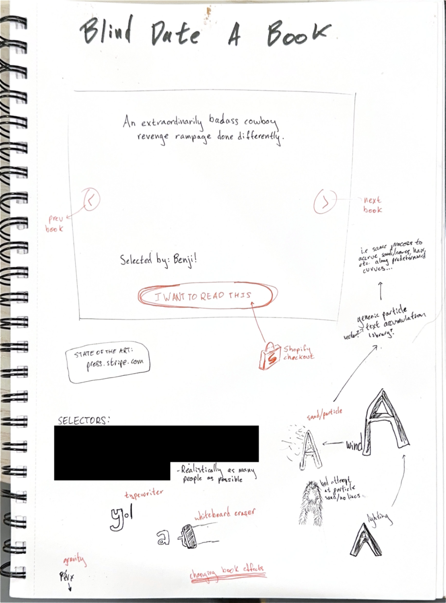

+++
title = "Blind Date A Book"
description = "A website to help you find your next read, with a charming twist."
date = 2025-01-19T17:20:00-08:00
updated = 2025-09-17T19:19:00-04:00
[extra]
icon = """<svg viewBox="0 0 3348 3409" xmlns="http://www.w3.org/2000/svg" fill="currentColor"><g fill-rule="evenodd"><path d="m701 855h-1v-1h1z"/><path d="m515 849h-1v-1h1z"/><path d="m511 849v-.5l.5-.5h.5v.5l-.5.5z"/><path d="m516 848h-1v-1h1z"/><path d="m515 846-.5 1-.5-1z"/><path d="m527 840-.5 1-.5-1z"/><path d="m533 838-.5 1-.5-1z"/><path d="m540 838h-1v-1h1z"/><path d="m547 835h-1v-1h1z"/><path d="m550 834h-1v-1h1z"/><path d="m548 833h-1v-1h1z"/><path d="m557 832h-1v-1h1z"/><path d="m550.5 832h-1.5l.5-1h1.5z"/><path d="m561 831h-1v-1h1z"/><path d="m485 880h-1v-1h1z"/><path d="m473 876-.5 1-.5-1z"/><path d="m464 874h-1v-1h1z"/><path d="m455 868h-1v-1h1z"/><path d="m499 858h-1v-1h1z"/><path d="m500 857h-1v-1h1z"/><path d="m505 856h-1v-1h1z"/><path d="m501 856h-1v-1h1z"/><path d="m506 855h-1v-1h1z"/><path d="m503 855h-1v-1h1z"/><path d="m504 853-.5 1-.5-1z"/><path d="m504 853v-1h2v.5l-.5.5z"/><path d="m506 852v-1h1v.5l-.5.5z"/><path d="m469 831 1 .5-.25 1.25-1.75-.75h.5l.5-.5z"/><path d="m468 832h-.5l-.5-.5 1-.5z"/><path d="m468 831v-.5l.5-.5.5 1z"/><path d="m688.5 821h-1.5l.5-1h1.5z"/><path d="m685 820h-1v-1h1z"/><path d="m681.5 819h-1.5l.5-1h1.5z"/><path d="m673 818h-1v-1h1z"/><path d="m584 826h-1v-1h1z"/><path d="m575 826h-1v-1h1z"/><path d="m582 825h-1v-1h1z"/><path d="m596 824h-1v-1h1z"/><path d="m588.5 824h-1.5l.5-1h1.5z"/><path d="m603 823h-1v-1h1z"/><path d="m594 823h-1v-1h1z"/><path d="m602 822h-1v-1h1z"/><path d="m599.5 822h-1.5l.5-1h1.5z"/><path d="m614 821h-1v-1h1z"/><path d="m617 820h-1v-1h1z"/><path d="m622 778h-1v-1h1z"/><path d="m636.5 777h-4.5l.5-1h4.5z"/><path d="m557 830h-1v-1h1z"/><path d="m571 827h-1v-1h1z"/><path d="m510.5 806-.25-1.25 1.25-.75.5.5z"/><path d="m515 804h-1v-1h1z"/><path d="m517 803h-1v-1h1z"/><path d="m518.5 802h-1.5l.5-1h1.5z"/><path d="m520 801h-1v-1h1z"/><path d="m521.5 801-.25-1.25 2.25-.75h.5l-.5 1h-1z"/><path d="m526 799h-1v-1h1z"/><path d="m529.5 798h-3.5l.5-1h3.5z"/><path d="m531.5 797h-1.5l.5-1h1.5z"/><path d="m533.5 796h-1.5l.5-1h1.5z"/><path d="m536.5 795h-1.5l.5-1h1.5z"/><path d="m539.75 794.75-1.25.25-1.5-1.5.5-.5 2.25.25z"/><path d="m545.5 792h-1.5l.5-1h1.5z"/><path d="m557 789h-1v-1h1z"/><path d="m473 830h-1v-1h1z"/><path d="m472 829h-1v-1h1z"/><path d="m477 827h-1v-1h1z"/><path d="m480 823h-1v-1h1z"/><path d="m484 820h-1v-1h1z"/><path d="m488 819h-1v-1h1z"/><path d="m489 817h-1v-1h1z"/><path d="m494 815h-1v-1h1z"/><path d="m492 815h-1v-1h1z"/><path d="m493 814h-1v-1h1z"/><path d="m497 813h-1v-1h1z"/><path d="m494 813h-1v-1h1z"/><path d="m498 812-1-1v-1l1 .5z"/><path d="m501.5 810h-1.5l.5-1h1.5z"/><path d="m505.5 809h-3.5l.5-1h3.5z"/><path d="m508 808h-1v-1h1z"/><path d="m692 390h-1v-1h1z"/><path d="m1573 893h-1v-1h1z"/><path d="m1572 879h-1v-1h1z"/><path d="m1564 871h-1v-1h1z"/><path d="m1563 870h-1v-1h1z"/><path d="m1561 868-1-1v-1l1 .5z"/><path d="m1557 867v-.5l.5-.5.5 1z"/><path d="m1560 866h-1v-1h1z"/><path d="m1556 864 1 .5-1 .5z"/><path d="m1555 863h.5l.5.5v.5h-.5l-.5-.5z"/><path d="m1557 862h-1v-1h1z"/><path d="m1556 861h-1v-1h1z"/><path d="m1554 863v-.5l-.5-.5h-.5v-2h.5l1.5 1.5v1.5z"/><path d="m1552 859h.5l.5.5v.5h-.5l-.5-.5z"/><path d="m1553 857h-1v-1h1z"/><path d="m1551 855h-1v-1h1z"/><path d="m1549 852h-1v-1h1z"/><path d="m1549 850h-1v-1h1z"/><path d="m1545 845h-1v-1h1z"/><path d="m1543.5 841h-1.5l.5-1h1.5z"/><path d="m1543 839h-1v-1h1z"/><path d="m1541 838h-1v-1h1z"/><path d="m1540 836h-1v-1h1z"/><path d="m1539 831h-1v-1h1z"/><path d="m1509 860h-.5l-.5-.5 1-.5z"/><path d="m1506 855h-.5l-.5-.5 1-.5z"/><path d="m1538 829-1-1v-1l1 .5z"/><path d="m1536 824h-1v-1h1z"/><path d="m1536.5 822h-1.5l.5-1h1.5z"/><path d="m1534 820 1 .5-1 .5z"/><path d="m1536 818h-1v-1h1z"/><path d="m1537 817-1-.5v-2.5l1 .5z"/><path d="m1536 811h-1v-1h1z"/><path d="m1534 805 1 .5-1 .5z"/><path d="m1534 795h1.5l.5.5-.5.5h-1.5z"/><path d="m1537 779h-1v-1h1z"/><path d="m1535.5 777h-1.5l.5-1h1.5z"/><path d="m1534 805-.75-.25.75-1.75z"/><path d="m1534 803-.5-1 .5-3 2 1.5v1z"/><path d="m1497 800h-.5l-.5-.5 1-.5z"/><path d="m1534 799h-.5l-.5-.5v-2.5h1z"/><path d="m1537.5 768-1.25-.25-.25-3.75 1 .5v2l1 1z"/><path d="m1540 758h-1v-1h1z"/><path d="m1539 757h-1v-1h1z"/><path d="m1541 755h-1v-1h1z"/><path d="m1540 754h-1v-1h1z"/><path d="m1540 752h-1v-1h1z"/><path d="m1542 746-1-.5v-2l1.5-1.5.5.5-1 3z"/><path d="m1544 742h-1v-1h1z"/><path d="m1546 736h-1v-1h1z"/><path d="m1548 733h-1v-1h1z"/><path d="m1549 730h-1v-1h1z"/><path d="m1550 729h-1v-1h1z"/><path d="m1553 723h-1v-1h1z"/><path d="m1550 723v-2h1v1.5l-.5.5z"/><path d="m1554 722-1-1v-1l1 .5z"/><path d="m1555 720h-1v-1h1z"/><path d="m1565 706h-1v-1h1z"/><path d="m1517 709h-1v-1h1z"/><path d="m1519 706-1-1v-1l1 .5z"/><path d="m1599 660h-1v-1h1z"/><path d="m1601 654 1 .5-1 .5z"/><path d="m1606 652h-1v-1h1z"/><path d="m1603 651 1 .5-1 .5z"/><path d="m1607 648h-1v-1h1z"/><path d="m1615 643h-1v-1h1z"/><path d="m1610 643v-1h1v.5l-.5.5z"/><path d="m1611 641h1.5l.5.5-.5.5h-1.5z"/><path d="m1613 639-.5 1-.5-1z"/><path d="m1613 639v-1h1v.5l-.5.5z"/><path d="m1567 700h-1v-1h1z"/><path d="m1565 701-1-.5v-2l1.5-1.5h1l.5.5-2 2z"/><path d="m1574 693h-1v-1h1z"/><path d="m1569 693v-2h1l1 1.5v1l-.5.5z"/><path d="m1575 691h-1v-1h1z"/><path d="m1570 691v-1h1v.5l-.5.5z"/><path d="m1576 690h-1v-1h1z"/><path d="m1571 690v-.5l2.5-2.5h.5v1.5l-1.5 1.5z"/><path d="m1585 678h-1v-1h1z"/><path d="m1586 677h-1v-1h1z"/><path d="m1587 676-1-1v-1l1 .5z"/><path d="m1577 681h.5l1.5-1.5v-1.5h1.5l.5-.5v-1.5h.5l2-2h.5v1.5l-2 2v1l-3 3 1 1-.5.5-2.25.25-.5 2.5-2.75 1.25v-1.5l2-2v-1z"/><path d="m1587 672-.5 1-.5-1z"/><path d="m1584 674v-2h1v1.5l-.5.5z"/><path d="m1587 671 1 .5-1 .5z"/><path d="m1585 672v-1h1v1z"/><path d="m1590 671h-1v-1h1z"/><path d="m1594 667h-1v-1h1z"/><path d="m1596 664h-1v-1h1z"/><path d="m1597 663h-1v-1h1z"/><path d="m1547 658h-1v-1h1z"/><path d="m1524 697h-1v-1h1z"/><path d="m1525 695h-1v-1h1z"/><path d="m1526 693h-1v-1h1z"/><path d="m1529 688h-1v-1h1z"/><path d="m1534 680h-1v-1h1z"/><path d="m1671 575h-1v-1h1z"/><path d="m1614 637 1 .5-1 .5z"/><path d="m1625 628h-1v-1h1z"/><path d="m1623 626 1 .5-1 .5z"/><path d="m1632 617-.5 1-.5-1z"/><path d="m1632 616 1 .5-1 .5z"/><path d="m1621 575v-.5l.5-.5h.5v1z"/><path d="m1678 567h-1v-1h1z"/><path d="m1685 557v-1h1v.5l-.5.5z"/><path d="m1684 556v-1h1v1z"/><path d="m1689 554h-1v-1h1z"/><path d="m1689.5 552h-1.5l.5-1h1.5z"/><path d="m1691 551-1-1v-1l1 .5z"/><path d="m1692 549h-1v-1h1z"/><path d="m1692.5 548-.25-1.25 1.25-.75.5.5z"/><path d="m1694.5 545-.25-1.25 1.25-.75.5.5z"/><path d="m1697 542h-1v-1h1z"/><path d="m1698 540-.5 1-.5-1z"/><path d="m1698 540v-1.5l.5-.5h.5v1.5l-.5.5z"/><path d="m1703 532v-.5l.5-.5h.5v.5l-.5.5z"/><path d="m1665 522h-1v-1h1z"/><path d="m1668 518-1-1v-1l1 .5z"/><path d="m1713 517v-1.5l.5-.5h.5l1 1.5-.5.5z"/><path d="m1669 515h-1v-1h1z"/><path d="m1671 514h-.5l-.5-.5 1-.5z"/><path d="m1671 513v-1.5l.5-.5h.5v2z"/><path d="m1714 513h.5l1.5-1.5v-1.5l1 .5v2l-3 2.5z"/><path d="m1647 544h-1v-1h1z"/><path d="m1651 539h-1v-1h1z"/><path d="m1656 533h-1v-1h1z"/><path d="m1655 532h-1v-1h1z"/><path d="m1659 527h-1v-1h1z"/><path d="m1662 525h-1v-1h1z"/><path d="m1727 488v1.5l-.5.5-.5-.5v-1.5z"/><path d="m1727 488v-3h1v2.5l-.5.5z"/><path d="m1728 485v-2h1v1.5l-.5.5z"/><path d="m1729 483v-4h1v3.5l-.5.5z"/><path d="m1732 467 1 .5-1 3.5z"/><path d="m1734 466-1-.5v-4.5l1 .5z"/><path d="m1736 451h-1v-1h1z"/><path d="m1718 510h-1v-1h1z"/><path d="m1672 511 .25-1.75 1.75.75h-.5l-1 1z"/><path d="m1719 509-1-1v-1l1 .5z"/><path d="m1675 508h-1.5l-.5-.5 2-1.5z"/><path d="m1720 507-1-1v-1l1 .5z"/><path d="m1675 506v-.5l1.5-1.5h.5v2z"/><path d="m1721 504h-1v-1h1z"/><path d="m1676 504h-1v-1h1z"/><path d="m1722 500v2.5l-.5.5-.5-.5v-2.5z"/><path d="m1680 500h-1v-1h1z"/><path d="m1681 499h-.5l-.5-.5v-.5h1z"/><path d="m1722 498h.5l.5-.5v-1.5h1v2.5l-1.5 1.5h-.5z"/><path d="m1724 493 1 .5-1 2.5z"/><path d="m1726 493h-1v-1h1z"/><path d="m1683 493v-.5l.5-.5h.5v1z"/><path d="m1684 492v-.5l.5-.5h.5v.5l-.5.5z"/><path d="m1685 491v-.5l-1-1 1-1v-1l.5-.5 1.5 1.5-1 1v1.5z"/><path d="m1688 487h-.5l-.5-.5 1-.5z"/><path d="m1688 485-1-1v-1l1 .5z"/><path d="m1689 483-1-1v-1l1 .5z"/><path d="m1690 481-1-.5v-2.5l1 .5z"/><path d="m1690.5 478-.5-1 1.5-2 .5.5v1z"/><path d="m1693 473-1-1v-1l1 .5z"/><path d="m1694 470-1-1v-1l1 .5z"/><path d="m1694 467h-1v-1h1z"/><path d="m1695 466-1-.5v-2.5l1 .5z"/><path d="m1696 463-1-.5v-2.5l1 .5z"/><path d="m1696 458h-1v-1h1z"/><path d="m1697 455-1-.5v-4.5l1 .5z"/><path d="m1698 450h-1v-1h1z"/><path d="m1063 455h-1v-1h1z"/><path d="m1698 443h-.5l-.5-.5 1-.5z"/><path d="m1697 437-1-1v-1l1 .5z"/><path d="m1696 434h-1v-1h1z"/><path d="m1690 428h-1v-1h1z"/><path d="m1687 425-.5 1-.5-1z"/><path d="m1683 424h-1v-1h1z"/><path d="m1634 407h-1v-1h1z"/><path d="m1630 406h-1v-1h1z"/><path d="m1618.5 404h-1.5l.5-1h1.5z"/><path d="m1616 404h-1v-1h1z"/><path d="m1609 403h-1v-1h1z"/><path d="m1603 403h-1v-1h1z"/><path d="m1540.5 414h-1.5l.5-1h1.5z"/><path d="m1478 437h-1v-1h1z"/><path d="m1491 431-.5 1-.5-1z"/><path d="m1491 429 2 1.5-.5.5h-1.5z"/><path d="m1496 430-1-1v-1l1 .5z"/><path d="m1493.5 429h-1.5l.5-1h1.5z"/><path d="m1498 428h-1v-1h1z"/><path d="m1512 425h-1v-1h1z"/><path d="m1518 423h-1v-1h1z"/><path d="m1520.5 420h-1.5l.5-1h1.5z"/><path d="m1524.5 419h-1.5l.5-1h1.5z"/><path d="m1528.5 418h-1.5l.5-1h1.5z"/><path d="m1531 416-.5 1-1.5-1z"/><path d="m1534.5 416h-1.5l.5-1h1.5z"/><path d="m1531 415 1 .5-1 .5z"/><path d="m1471 410h-.5l-.5-.5 1-.5z"/><path d="m1471 408h-1v-1h1z"/><path d="m1475 404h-1v-1h1z"/><path d="m1480 401h-1v-1h1z"/><path d="m1051 400-.5 1-.5-1z"/><path d="m1612 366 .25-.75 1.75.75z"/><path d="m1026.5 192h-2.5l.5-1h2.5z"/><path d="m1029.5 191h-1.5l.5-1h1.5z"/><path d="m1006 200v-.5l.5-.5.5 1z"/><path d="m1015 196h-1v-1h1z"/><path d="m1017 195h-1v-1h1z"/><path d="m1019 194h-1v-1h1z"/><path d="m1022.5 193h-1.5l.5-1h1.5z"/><path d="m1098.5 174h-3.5l.5-1h3.5z"/><path d="m1113 171h-1v-1h1z"/><path d="m1034 189 .25-.75 1.75.75z"/><path d="m1040 187v-.5l.5-.5h3.5v1z"/><path d="m913 250h-1v-1h1z"/><path d="m915 249h-1v-1h1z"/><path d="m917 248h-1v-1h1z"/><path d="m919 247h-1v-1h1z"/><path d="m921 246h-1v-1h1z"/><path d="m923 245h-1v-1h1z"/><path d="m925 244h-1v-1h1z"/><path d="m927 243h-1v-1h1z"/><path d="m930 242h-1v-1h1z"/><path d="m932 241h-1v-1h1z"/><path d="m934 240h-1v-1h1z"/><path d="m936 239h-1v-1h1z"/><path d="m938 238h-1v-1h1z"/><path d="m940 236-.5 1-.5-1z"/><path d="m946 234h-1v-1h1z"/><path d="m954 229-.5 1-.5-1z"/><path d="m956 228v-1h1v.5l-.5.5z"/><path d="m797 316v-1h-1v1zm-2 1v-1h-1v1zm-2 1v-1h-1v1zm-92 57v-1h-1v1zm-3 4v-1h-1v1zm68-47v-1h-1v1zm-1 1v-1h-1v1zm-2 1v-1h-1v1zm-1.5 1 .5-1h-1.5l-.5 1zm-1.5 1v-1h-1v1zm-1.5 1 .5-1h-1.5l-.5 1zm-1.5 1v-1h-1v1zm-1.5 1 .5-1h-1.5l-.5 1zm-1.5 1v-1h-1v1zm-1 1v-1h-1v1zm-1 1v-1h-1v1zm-1 1v-1h-1v1zm-3 2v-1h-1v1zm-16 9v-1h-1v1zm-8 5v-1h-1v1zm-5 2v-1h-1v1zm-3 2v-1h-1v1zm-2 1v-1h-1v1zm-2 1v-1h-1v1zm-4 3v-1h-1v1zm83-49v-1h-1v1zm-2 1v-1h-1v1zm-2 1v-1h-1v1zm-3 1v-1h-1v1zm-2 1v-1h-1v1zm-2 1v-1h-1v1zm-3 1v-1h-1v1zm-2 1v-1h-1v1zm-2 1v-1h-1v1zm-2 1v-1h-1v1zm-1 1v-1h-1v1zm-1 1v-1h-1v1zm-1 1v-1h-1v1zm-75 53v-1h-1v1zm-1 2v-1h-1v1zm259-155v-1h-1v1zm-9 4v-1h-1v1zm-41 20v-1h-1v1zm-2 1v-1h-1v1zm181-78.5 3.5-.5.5-1h-.5l-8 1-.5 1zm-5.5 1.5.5-1h-3.5l-.5 1zm-4 1 .5-1h-1.5l-.5 1zm-3 1 .5-1h-1.5l-.5 1zm-3 1 .5-1h-3.5l-.5 1zm-5 1 .5-1h-1.5l-.5 1zm-3 1 .5-1h-1.5l-.5 1zm-3 1 .5-1h-1.5l-.5 1zm-2.5 1v-1h-1v1zm57.5-16 .5-1h-2.5l-.5 1zm-96.5 28v-1h-1v1zm-2 1v-1h-1v1zm-3 1 1-.5v-1l1.5-1.5 1.5-.5 4 .125 8-3 9.5-2.625h.5l-.5-1h-1l-.5-.5.5-.5h2.5l1.5 1 .5-1h3l-.5-1h-1l-.5-.5.5-.5h2.5l3.5 1 .5-1h3.5l.5-.5-.5-.5h-3.5l.25-.75 3.75-.875 58-16.625 5.5-.75 1.5 1.5-2.5 2.5h-3l-3 3-4-1h-.5l.5-1 4.25-.125v-1.625h-1.75l-10 2.25-6 2-2.5.5h-.5l.5 1 3.5-.5 3-1 3.5-.5h.5l-.5 1-2.5.5-6 1.875-13 3.125-52 16.125-11.5 5.375-8.5 4.5-1.5.5-2 2-2.5.625-7 2.875-4 2-2 .75-4.5.75-2 2-1.5.5-7 4-5 2.125-1.5.375-2 2h-1.5l-.5-1-.5.5v.5l-1 .5.5.5h.5v.5l-.5.5h-1.5l-.5-1-.5.5v.5l-.75.25-.25 1.25-1.5 1.5h-1l-1-1-.5.5v1l-.5.5-1-1-3 1-.5.5 1 1-.5.5-3.5 1-.5-1-.5.5v.5l-2 .5-26.75 12.75-.25 1.25-.5.5-1-1-.5.5v1l-.5.5-1-1-.5.5v1l-.5.5-1-1-.5.5v1l-.5.5-1-1-.5.5v1l-1.5 1.5-1.5.5-8.5 4.5-6.5 4.5-26.5 14.5-22.5 17.5-24 14-12 5-6 3-1.5.5-2 2-2.5.5-3 1.125-1.5.375-2 2-3.5.625-2 .875-3 2-10.5 7.5-2.5 1.5-7.5 5.5-3 3-2.5.625-3 1.875-4 3-2.5 1.5-2 2h-2l-2 2-1.5.5-5 2.875-2.5.625-2 2-1.5.5-4 2-5.75 3.75-.5 1.5-1.25.25-3.5 3.5v1l-5.5 5.5h-1l-1.5 1.5v2l-2.5 2.5h-1l-2 2-3.25.25-.5 1.5-1.25.25-1 1-1.5-1.5.25-2.25 2.25-.25.5-.5-1-1 .5-.5 1.5-.375 4.75-1.875 1.25-3.25 2.5-2.5h1l2.5-2.5v-1l9.5-9.5 5.5-3.5 6.5-3.5 1 1 .5-.5.25-1.25 1.25-.25 3-3h2l2-2 4-1 3-3 6.5-4.5 4-2 8.5-6.5 9-6 7.5-5.5 5-2 2.5-.5 2-2 5-1 2-2 1.5-.5 20-9 24.5-14.5 18.5-14.5 8-5 10.5-5.5 2-2 2.5-.625 2-.875 8.5-5.5 2-1 2-2h2l2-2 1.5-.5 11-5.875 5-2.125 38.5-18.5 6-4 2.5-1.375 5-2.125 13-6.875 4-1.25 13-5.75 2.5-.625 2-2 1.5-.5 4-2 2-.5.5 1zm-2 2v-1h-1v1zm-2 1v-1h-1v1zm-36 19v-1h-1v1zm-2 1v-1h-1v1zm-5 2v-1h-1v1z"/><path d="m2703 886h-.5l-.5-.5v-.5h.5l.5.5z"/><path d="m2703 886 1-.5.5-2.5 1-3 1.5-3-.5 4-1 3-.5 2.5-1.5 1.5-.5-.5z"/><path d="m2706 875v-1l1.75.25-.75 2.75v-1.5l-.5-.5z"/><path d="m2713 868h-1v-1h1z"/><path d="m2708 868 1.75-.25 1.25-1.75-1 5.5-1.5 1.5-.5-.5v-1.5l1-1.5z"/><path d="m2717 864h-1v-1h1z"/><path d="m2711 866v-2.5l.5-.5h.5v2.5l-.5.5z"/><path d="m2716 861h-1v-1h1z"/><path d="m2712 863v-2.5l1.5-1.5h.5v2.5l-1.5 1.5z"/><path d="m2719 859h-1v-1h1z"/><path d="m2717 859h-1v-1h1z"/><path d="m2718 856h-1v-1h1z"/><path d="m2721 850h-1v-1h1z"/><path d="m2722 847h-1v-1h1z"/><path d="m2723 845h-1v-1h1z"/><path d="m2724 842h-1v-1h1z"/><path d="m2725 840h-1v-1h1z"/><path d="m2726 838h-1v-1h1z"/><path d="m2665 841h-1v-1h1z"/><path d="m2755 789h-1v-1h1z"/><path d="m2751 786v-2h1v1.5l-.5.5z"/><path d="m2752 784v-1h1v.5l-.5.5z"/><path d="m2753 783v-1h1v.5l-.5.5z"/><path d="m2754 782v-2h1v1.5l-.5.5z"/><path d="m2755 778h.5l.5-.5v-.5h1v1.5l-1.5 1.5h-.5z"/><path d="m2757 775h1.5l.5.5-2 1.5z"/><path d="m2759.5 774-.5-1 1.5-2 .5.5v1z"/><path d="m2762 771-1-1v-1l1 .5z"/><path d="m2763 768h-1v-1h1z"/><path d="m2764 767h-1v-1h1z"/><path d="m2730 830h-1v-1h1z"/><path d="m2731 829h-1v-1h1z"/><path d="m2732 827h-1v-1h1z"/><path d="m2733 826h-1v-1h1z"/><path d="m2733 824h-1v-1h1z"/><path d="m2735 823h-1v-1h1z"/><path d="m2736 821-1-1v-1l1 .5z"/><path d="m2738 818h-1v-1h1z"/><path d="m2738 816-1-1v-1l1 .5z"/><path d="m2740 814h-1v-1h1z"/><path d="m2747 802h-1v-1h1z"/><path d="m2687 800h-1v-1h1z"/><path d="m2688 799-1-1v-1l1 .5z"/><path d="m2745 796v-2h1v1.5l-.5.5z"/><path d="m2691 793h-1v-1h1z"/><path d="m2692 791h-1v-1h1z"/><path d="m2693 789h-1v-1h1z"/><path d="m2695 786h-1v-1h1z"/><path d="m2696 784h-1v-1h1z"/><path d="m2697 782h-1v-1h1z"/><path d="m2699 779h-1v-1h1z"/><path d="m2678 818h-1v-1h1z"/><path d="m2679 817-1-1v-1l1 .5z"/><path d="m2680 814-1-1v-1l1 .5z"/><path d="m2681 811h-1v-1h1z"/><path d="m2682 808v-1.5l.5-.5 1.5 2z"/><path d="m2684 806-1-1v-1l1 .5z"/><path d="m2685 804h-1v-1h1z"/><path d="m2686 802h-1v-1h1z"/><path d="m2766 764h-1v-1h1z"/><path d="m2767 762h-1v-1h1z"/><path d="m2774 747 1 .5-1 .5z"/><path d="m2780 742h-1v-1h1z"/><path d="m2784 736h-1v-1h1z"/><path d="m2787 731h-1v-1h1z"/><path d="m2791 725h-1v-1h1z"/><path d="m2793 722h-1v-1h1z"/><path d="m2749 703h-1v-1h1z"/><path d="m2814 683 1 .5-1 .5z"/><path d="m2821 676h-1v-1h1z"/><path d="m2822 674h-1v-1h1z"/><path d="m2824 671h-1v-1h1z"/><path d="m2827 667h-1v-1h1z"/><path d="m2829 664h-1v-1h1z"/><path d="m2830 663h-1v-1h1z"/><path d="m2833 659h-1v-1h1z"/><path d="m2838 652h-1v-1h1z"/><path d="m2839 651-1-1v-1l1 .5z"/><path d="m2840 649h-1v-1h1z"/><path d="m2842 646h-1v-1h1z"/><path d="m2843 644h-1v-1h1z"/><path d="m2845 641h-1v-1h1z"/><path d="m2754 695h-1v-1h1z"/><path d="m2807 693 1 .5-1 .5z"/><path d="m2755 693h-.5l-.5-.5 1-.5z"/><path d="m2755 692v-.5l.5-.5.5 1z"/><path d="m2809 691v-1h1v.5l-.5.5z"/><path d="m2810 689 1 .5-1 .5z"/><path d="m2809 689v-1h1v1z"/><path d="m2812 686 1 .5-1 .5z"/><path d="m2811 686v-1h1v1z"/><path d="m2760 685h-1v-1h1z"/><path d="m2763 680h-1v-1h1z"/><path d="m2765 677h-.5l-.5-.5 1-.5z"/><path d="m2767 674h.5l.5.5v.5h-.5l-.5-.5z"/><path d="m2765 676v-1.5l.5-.5h.5v1.5l-.5.5z"/><path d="m2770 674h-.5l-.5-.5 1-.5z"/><path d="m2766 674v-.5l.5-.5.5 1z"/><path d="m2769 671h-1v-1h1z"/><path d="m2773 668v-.5l.5-.5h.5v1z"/><path d="m2772 666h-1v-1h1z"/><path d="m2776 665h-.5l-.5-.5 1-.5z"/><path d="m2776 664v-.5l.5-.5.5 1z"/><path d="m2773 665-1-1v-1l1 .5z"/><path d="m2774 663h-1v-1h1z"/><path d="m2771 663h-1v-1h1z"/><path d="m2775 662h-1v-1h1z"/><path d="m2776 661h-1v-1h1z"/><path d="m2777 659h-1v-1h1z"/><path d="m2779 656h-1v-1h1z"/><path d="m2780 655h-1v-1h1z"/><path d="m2782 652h-1v-1h1z"/><path d="m2783 651-1-1v-1l1 .5z"/><path d="m2784 649h-1v-1h1z"/><path d="m2786 648v-.5l.5-.5h.5v1z"/><path d="m2790 641h-1v-1h1z"/><path d="m2851 632h-1v-1h1z"/><path d="m2861 615h-1v-1h1z"/><path d="m2861 609h1.5l.5.5-.5.5h-1.5z"/><path d="m2864 609h-1v-1h1z"/><path d="m2868 605h-1v-1h1z"/><path d="m2870 601h-1v-1h1z"/><path d="m2868 600h-1v-1h1z"/><path d="m2869 598h-1v-1h1z"/><path d="m2818 597h-1v-1h1z"/><path d="m2870 593h-1v-1h1z"/><path d="m2820 592h-1v-1h1z"/><path d="m2821 590h-1v-1h1z"/><path d="m2873 589h-1v-1h1z"/><path d="m2823 587h-1v-1h1z"/><path d="m2875 584h-1v-1h1z"/><path d="m2824 585-1-1v-1l1 .5z"/><path d="m2874 583h-1v-1h1z"/><path d="m2876 581h-1v-1h1z"/><path d="m2824.5 583v-1.5l.5-2v-.5l1 .5v2z"/><path d="m2877 579h-1v-1h1z"/><path d="m2876 578h-1v-1h1z"/><path d="m2878 577-1-1v-1l1 .5z"/><path d="m2826.5 579v-1.5l.5-2v-.5l1 .5v2z"/><path d="m2793 636h-1v-1h1z"/><path d="m2794 635h-1v-1h1z"/><path d="m2796 632h-1v-1h1z"/><path d="m2879 574-1-1v-1l1 .5z"/><path d="m2880 571h-1v-1h1z"/><path d="m2881 568-1-1v-1l1 .5z"/><path d="m2882 565h-1v-1h1z"/><path d="m2883 561-1-1v-1l1 .5z"/><path d="m2884 557-1-.5v-2.5l1 .5z"/><path d="m2884 553h-1v-1h1z"/><path d="m2885 549-1-.5v-9.5l1 .5z"/><path d="m2884 533h-1v-1h1z"/><path d="m2883 529-1-1v-1l1 .5z"/><path d="m2882 526-1-1v-1l1 .5z"/><path d="m2881 523h-1v-1h1z"/><path d="m2880 521h-1v-1h1z"/><path d="m2829 575-1-.5v-2.5l1 .5z"/><path d="m2830 572h-1v-1h1z"/><path d="m2831 568h-1v-1h1z"/><path d="m2832 567-1-1v-1l1 .5z"/><path d="m2833 564h-1v-1h1z"/><path d="m2834 562h-1v-1h1z"/><path d="m2836 557h-1v-1h1z"/><path d="m2837 553h-1v-1h1z"/><path d="m2839 549h-1v-1h1z"/><path d="m2837 544h-1v-1h1z"/><path d="m2878 517h-1v-1h1z"/><path d="m2877 515h-1v-1h1z"/><path d="m2876 514h-1v-1h1z"/><path d="m2874 511h-1v-1h1z"/><path d="m2800.5 529h-1.5l.5-1h1.5z"/><path d="m2791.5 528h-1.5l.5-1h1.5z"/><path d="m2787 527h-1v-1h1z"/><path d="m2784.5 527h-1.5l.5-1h1.5z"/><path d="m2778 527h-1v-1h1z"/><path d="m2777 526h-1v-1h1z"/><path d="m2773.5 526h-4.5l.5-1h4.5z"/><path d="m2758.5 526h-1.5l.5-1h1.5z"/><path d="m2753 526h-1v-1h1z"/><path d="m2753 523-.5 1-.5-1z"/><path d="m2688 530h-1v-1h1z"/><path d="m2692.5 529h-1.5l.5-1h1.5z"/><path d="m2696.5 528h-1.5l.5-1h1.5z"/><path d="m2705 527h-1v-1h1z"/><path d="m2702 527h-1v-1h1z"/><path d="m2750.5 526h-1.5l.5-1h1.5z"/><path d="m2718 526h-1v-1h1z"/><path d="m2716 526h-1v-1h1z"/><path d="m2683 531h-1v-1h1z"/><path d="m2686 530h-1v-1h1z"/><path d="m2587 538-.5 1-.5-1z"/><path d="m2586 538h-.5l-.5-.5v-.5h1z"/><path d="m2585 537h-.5l-.5-.5 1-.5z"/><path d="m2583 536h-1v-1h1z"/><path d="m2582 533-.5 1-.5-1z"/><path d="m2581 533-.75-.25.75-1.75z"/><path d="m2580 530h-1v-1h1z"/><path d="m2579 529h-1v-1h1z"/><path d="m2578 526-1-.5v-2.5l1 .5z"/><path d="m2578 522-1-1v-1l1 .5z"/><path d="m2578 519-1-1v-1l1 .5z"/><path d="m2579 516-1-.5v-2.5l1 .5z"/><path d="m2580 513h-1v-1h1z"/><path d="m2873 510h-1v-1h1z"/><path d="m2871 508h-1v-1h1z"/><path d="m2870 507h-1v-1h1z"/><path d="m2869 506h-1v-1h1z"/><path d="m2868 505h-1v-1h1z"/><path d="m2865.5 503h-1.5l.5-1h1.5z"/><path d="m2863 501h-1v-1h1z"/><path d="m2858 498h-1v-1h1z"/><path d="m2850 494h-1v-1h1z"/><path d="m2847 493h-1v-1h1z"/><path d="m2842 491h-1v-1h1z"/><path d="m2843 490h-1v-1h1z"/><path d="m2831 488h-1v-1h1z"/><path d="m2827 487h-1v-1h1z"/><path d="m2792.5 480h-1.5l.5-1h1.5z"/><path d="m2785 479h-1v-1h1z"/><path d="m2781.5 479h-1.5l.5-1h1.5z"/><path d="m2711 481h-1v-1h1z"/><path d="m2731 478h-1v-1h1z"/><path d="m2728.5 478h-2.5l.5-1h2.5z"/><path d="m2584 509v-.5l.5-.5h.5v1z"/><path d="m2583 508h-1v-1h1z"/><path d="m2588 504h-1v-1h1z"/><path d="m2610 501v-.5l.5-.5h2.5v1z"/><path d="m2600.5 500h-1.5l.5-1h1.5z"/><path d="m2598 500h-1v-1h1z"/><path d="m2612 499h-1v-1h1z"/><path d="m2314 244-1-1v-1l1 .5z"/><path d="m2350.5 230h-2l-2-2h-1l-2.5-2.5v-1l-1.5-1.5h-2l-6.5-6.5v-1l-9.5-9.5-1.5-.5-23.75-15.75-.5-1.5-4.25-1.25-2-2-7.5-1.625-18-6.875-4.5-2.5-10-8-2.5-1.25-25-4.25-5-1.875-4-1.125-10-4-6-3-1.5-.5-1 1-1-1-5.5-.75-2-.5-14-.5-13-2.875-3-1-7-2.875-4-1-5-2-11-5.875-8-3.125-7-4-2-.875-3.5-.625-2.5-2.5v-2l2.5-2.5 3.25.25.25 1.25 1.5 1.5 1.5.375 3 1.25 5 2.75 4 1.125 5 2 11 6 2 .75 10.5 2.75 2 2 9.5 1.625 6 1.75 13 .25 12 2.125 7 2.75 9 4 4 1.125 5 1.875 3 .75 19.5 2.75 1-1 1 1 4.5 2.5 9.5 7.5 2 1 2 2 2.5.625 15 5.75 8 2.25 6 2.875 3 2 8 6 2.5 1.5 6.5 4.5 5 3 6.5 4.5 7.5 7.5v1l1.5 1.5.5-.5 1-2 5.5-7.5 4-10 8.5-12.5 6.5-8.5.875-2 .625-3.5-1.5-1.5h-1l-2 2-.5-.5v-4l1.5-1.5h1l1-1 2 2h1l2.5 2.5.25 1.5v5l-.75 2-1 2-11 16-3 5-4 10-1 2-.5 1.5-1.5 1.5-6 4-.5.5 1.5 1.5h1l4 4 3.5.625 1.75.625.25 3.25zm-236.5-110v-1h-1v1zm250 44v-1h-1v1z"/><path d="m2095.5 122-1.25-.25-1.625-4.75-.125-5 1-6 1-4 5-34 3-13 3-10 2.125-13 .125-3.875-4.25-.125-1.5-1.5 2.5-2.5 4.25-2.25v-1.625l-24.75-2.625-4-.875-135-2.125-10-1.375-115 .375-4 .75-96.5 1.75-1-1-1 1-80.5.375-7 .875-20.5.75-1 1-1-1-5.5 1.375-404-6-26-3.875-5.5-1.5-1-1-1 1-4.25-1.25v-3.5l1.25-.25 1.5-1.5v-1l.5-.5 1 1 1-1 .5.5v1l-1 1 .5.5 3.5.5 4 1 428 8.875 6.5-1.375 1 1 1-1 20.5-.75 87.5-1.25 1-1 1 1 95.5-1.625 9-1.125 114 .125 142 3.125 21 3 9.5.5 1 1 1-1 1 1h1l3.5 3.5-1 4-1.5 1.5h-1l-1.5 1.5-3.625 24.5-6.875 35-4.125 27 .125 3 .5 3.5zm.5-1v-1h-1v1z"/><path d="m687 1499 1 .5-1 .5z"/><path d="m666 1487v-1h-1v1zm-12 4v-1h-1v1zm28 3v-1h-1v1zm1 1v-1h-1v1zm1 1v-1h-1v1zm1 1v-1h-1v1zm2 3 .5 1 1.375.25-.5 4.75-1.375 4.5-2.5 2.5-9 1-2.5 2.5v1l-3.5 3.5-1.5.25-6 .129883-3-1-4.75-2.629883-.75-1.75-1-2-.75-1.75-1.25-.25-.5-.5 1-1-.5-.5h-1l-.5-.5 1-1-.5-.5-1.25-.25-.25-1.25 1-1-1-1v-1l-1-1 1-1 .120117-6.25 1.379883-.25 1.5-1.5-1-1 3.5-3.5h1l1-1 1 1 .5-.5v-1l.5-.5 1 1 1.25-.25.25-1.25.5-.5 1 1 1-1 2.5-.620117 1.75-.129883.5 1.629883 6.25.120117 2 2h1l2 2 4 1 1.5 1.5.25 1.25 1.5.5.75 1.75.5 2-1 .5.5.5z"/><path d="m639 1306h-1v-1h1z"/><path d="m562 1287-.5 1-.5-1z"/><path d="m561 1287h-.5l-.5-.5 1-.5z"/><path d="m559 1285-.5 1-.5-1z"/><path d="m558 1285h-.5l-.5-.5v-.5h1z"/><path d="m557 1284h-.5l-.5-.5 1-.5z"/><path d="m654 1274v-.5l.5-.5.5 1z"/><path d="m631 1265h-1v-1h1z"/><path d="m623 1264h-1v-1h1z"/><path d="m621 1264h-1v-1h1z"/><path d="m606 1262h-1v-1h1z"/><path d="m596.5 1260h-1.5l.5-1h1.5z"/><path d="m588 1256h1.5l1.5 1.5-.5.5h-1.5v-.5l-1-1z"/><path d="m592 1158h-1v-1h1z"/><path d="m596 1151h-1v-1h1z"/><path d="m531 1190h-1v-1h1z"/><path d="m529 1188h-1v-1h1z"/><path d="m530 1185-1-.5v-2.5l1 .5z"/><path d="m531 1182h-1v-1h1z"/><path d="m533 1181-.75-.25.75-1.75z"/><path d="m533 1179v-1.5l.5-.5h.5v2z"/><path d="m533 1176h-1v-1h1z"/><path d="m535 1175h-1v-1h1z"/><path d="m533 1174h-1v-1h1z"/><path d="m536 1173h-1v-1h1z"/><path d="m534 1173h-1v-1h1z"/><path d="m535 1171h-1v-1h1z"/><path d="m536 1169-1-1v-1l1 .5z"/><path d="m537 1167h-1v-1h1z"/><path d="m540 1164h-.5l-.5-.5 1-.5z"/><path d="m538 1164-1-1v-1l1 .5z"/><path d="m541 1161h-1v-1h1z"/><path d="m542 1159h-1v-1h1z"/><path d="m545 1153h-1v-1h1z"/><path d="m599 1146h-1v-1h1z"/><path d="m600 1144h-1v-1h1z"/><path d="m601 1143h-1v-1h1z"/><path d="m602 1141h-1v-1h1z"/><path d="m605 1136h-1v-1h1z"/><path d="m607 1133h-1v-1h1z"/><path d="m609 1128-.5 1-.5-1z"/><path d="m609 1127 1 .5-1 .5z"/><path d="m608 1127v-1h.5l.5.5v.5z"/><path d="m613.5 1121h-1.5l.5-1h1.5z"/><path d="m615 1115 1 .5-1 .5z"/><path d="m618 1113h-1v-1h1z"/><path d="m620 1112h-1v-1h1z"/><path d="m622 1109h-1v-1h1z"/><path d="m621 1107-.5 1-.5-1z"/><path d="m621 1106h1.5l.5.5-.5.5h-1.5z"/><path d="m574 1106v-.5l.5-.5.5 1z"/><path d="m623 1104-.5 1-.5-1z"/><path d="m623 1103 1 .5-1 .5z"/><path d="m625 1101-.5 1-.5-1z"/><path d="m625 1100 1 .5-1 .5z"/><path d="m575 1101h-1v-1h1z"/><path d="m628 1100h-1v-1h1z"/><path d="m627 1098-.5 1-.5-1z"/><path d="m627 1097 1 .5-1 .5z"/><path d="m578 1096h-1v-1h1z"/><path d="m580 1093h-1v-1h1z"/><path d="m631 1092v-1h1v.5l-.5.5z"/><path d="m635 1086 1 .5-1 1.5z"/><path d="m547 1151h-1.5l-.5-.5 1-1 1-1.5v.5l.5.5h.5v1h-.5l-.5.5z"/><path d="m553 1142h-1v-1h1z"/><path d="m554 1140h-2.5l-.5-.5.5-.5h2.5z"/><path d="m554 1136h-1v-1h1z"/><path d="m556 1136-1-1v-1l1 .5z"/><path d="m557 1134h-1v-1h1z"/><path d="m558 1132h-1v-1h1z"/><path d="m556 1132h-1v-1h1z"/><path d="m559 1131-1-1v-1l1 .5z"/><path d="m560 1129h-1v-1h1z"/><path d="m562 1126h-1v-1h1z"/><path d="m561 1124h-1v-1h1z"/><path d="m563 1121h-1v-1h1z"/><path d="m569 1115h-1v-1h1z"/><path d="m567 1114h-1v-1h1z"/><path d="m568 1113h-1v-1h1z"/><path d="m569 1111h-1v-1h1z"/><path d="m570 1110h-1v-1h1z"/><path d="m571 1108h-1v-1h1z"/><path d="m572 1106h-1v-1h1z"/><path d="m574 1103h-1v-1h1z"/><path d="m663 1046v-1h1v.5l-.5.5z"/><path d="m664 1044 1 .5-1 .5z"/><path d="m670 1038h-1v-1h1z"/><path d="m671 1036h-1v-1h1z"/><path d="m587 1083h-1v-1h1z"/><path d="m590 1078h-1v-1h1z"/><path d="m591 1076h-1v-1h1z"/><path d="m593 1074h-1v-1h1z"/><path d="m594 1073-1-1v-1l1 .5z"/><path d="m598 1069v-.5l.5-.5h.5v1z"/><path d="m596 1069h-1v-1h1z"/><path d="m599 1068v-.5l.5-.5h.5v1z"/><path d="m597 1068h-1v-1h1z"/><path d="m598 1066h-1v-1h1z"/><path d="m601 1065v-.5l.5-.5h.5v1z"/><path d="m599 1065h-1v-1h1z"/><path d="m600 1064h-1v-1h1z"/><path d="m601 1063-1-1v-1l1 .5z"/><path d="m605 1061h-1v-1h1z"/><path d="m602 1061h-1v-1h1z"/><path d="m606 1059h-.5l-.5-.5 1-.5z"/><path d="m603 1060-1-1v-1l1 .5z"/><path d="m606 1058v-.5l.5-.5h.5v1z"/><path d="m604 1058h-1v-1h1z"/><path d="m607 1057v-.5l.5-.5.5 1z"/><path d="m605 1057-1-1v-1l1 .5z"/><path d="m606 1055h-1v-1h1z"/><path d="m607 1054-1-1v-1l1 .5z"/><path d="m608 1052h-1v-1h1z"/><path d="m609 1050h-1v-1h1z"/><path d="m610 1048h-1v-1h1z"/><path d="m614 1047h-1v-1h1z"/><path d="m611 1047-1-1v-1l1 .5z"/><path d="m615 1045h-1v-1h1z"/><path d="m612 1045h-1v-1h1z"/><path d="m617 1042h-.5l-.5-.5 1-.5z"/><path d="m617 1041v-.5l.5-.5.5 1z"/><path d="m612.5 1044-.5-.5.25-3.25 1.25-.25 1.5-1.5v-1.5l1 .5v2l-2 2v1z"/><path d="m618.75 1035.75-1.25.25-.5-.5 1-1 .25-1.25 1.25-.25.5.5-1 1z"/><path d="m626 1029h-1v-1h1z"/><path d="m626 1026h-1v-1h1z"/><path d="m624 1026h-1v-1h1z"/><path d="m627 1024h-1v-1h1z"/><path d="m704 978h-1v-1h1z"/><path d="m705 976h-1v-1h1z"/><path d="m703 974 1 .5-1 .5z"/><path d="m710 967h-1v-1h1z"/><path d="m683 1015h-1v-1h1z"/><path d="m684.5 1014h-1.5l.5-1h1.5z"/><path d="m687 1010h-1v-1h1z"/><path d="m687 1008h-1v-1h1z"/><path d="m689 1006h-1v-1h1z"/><path d="m689 1004h-1v-1h1z"/><path d="m640 1005-1-1v-1l1 .5z"/><path d="m641 1003-1-1v-1l1 .5z"/><path d="m691 1001h-1v-1h1z"/><path d="m642 1001h-1v-1h1z"/><path d="m693 1000h-1v-1h1z"/><path d="m643 999h-1v-1h1z"/><path d="m693 996-.5 1-.5-1z"/><path d="m644 997h-1v-1h1z"/><path d="m693 995 1 .5-1 .5z"/><path d="m695 994h-1v-1h1z"/><path d="m646 994h-1v-1h1z"/><path d="m696 992h-1v-1h1z"/><path d="m647 992h-1v-1h1z"/><path d="m697 990h-1v-1h1z"/><path d="m700 985h-1v-1h1z"/><path d="m702 981h-1v-1h1z"/><path d="m660 972h-1v-1h1z"/><path d="m662 968h-1v-1h1z"/><path d="m628 1022h-1v-1h1z"/><path d="m631 1018h-1v-1h1z"/><path d="m632 1016h-1v-1h1z"/><path d="m633 1015h-1v-1h1z"/><path d="m634 1014h-1v-1h1z"/><path d="m635 1013-1-1v-1l1 .5z"/><path d="m636 1011h-1v-1h1z"/><path d="m637 1009h-1v-1h1z"/><path d="m637.5 1008-.5-1 1.5-2 .5.5v1z"/><path d="m727 930h-1v-1h1z"/><path d="m668 958h-1v-1h1z"/><path d="m669 956h-1v-1h1z"/><path d="m676 945h-.5l-.5-.5 1-.5z"/><path d="m678 942h-1v-1h1z"/><path d="m682 933h-1v-1h1z"/><path d="m681 932h-1v-1h1z"/><path d="m683 931h-1v-1h1z"/><path d="m684 930-1-1v-1l1 .5z"/><path d="m685 927h-1v-1h1z"/><path d="m683 928-1-1v-1l1 .5z"/><path d="m686 924h-1v-1h1z"/><path d="m687 922h-1v-1h1z"/><path d="m686 921h-1v-1h1z"/><path d="m687.5 920-1.5-2 .5-1 1.5 1.5v1z"/><path d="m689 917h-1v-1h1z"/><path d="m688 916h-1v-1h1z"/><path d="m692 908v-1.5l.5-.5h.5v1.5l-.5.5z"/><path d="m694 899v-1.5l.5-.5 1.5 1v2h-.5l-1-1z"/><path d="m696 895-1-1v-1l1 .5z"/><path d="m561.5 790 .5-.5-1.5-1.5-.5.5.25 1.25zm6-1 .5-1h-2.5l-.5 1zm-18.5 4v-1h-1v1zm90.5-13 .5-1h-3.5l-.5 1zm-11 1 .5-1h-3.5l-.5 1zm2.5 0v-1h-1v1zm-13.5 1 .5-1h-1.5l-.5 1zm-32.5 4v-1h-1v1zm31 31v-1h-1v1zm-13 2v-1h-1v1zm-15.5 1 .5-1h-2.5l-.5 1zm8.5 0v-1h-1v1zm-14.5 1 .5-1h-1.5l-.5 1zm8.5 0v-1h-1v1zm-6 1v-1h-1v1zm-6 1v-1h-1v1zm86-43v-1h-1v1zm29 42v-1h-1v1zm2 2v-1h-1v1zm1 1v-1h-1v1zm1 1v-1h-1v1zm2 5v-3.5l-1.5-1.5-.5.5 1 4zm25-29v-1h-1v1zm9 16v-1h-1v1zm-277 24v-1h-1v1zm-5 7v-1h-1v1zm57 1v-1h-1v1zm-11 5v-1h-1v1zm-2 2v-1h-1v1zm-41 7v-1h-1v1zm10 7v-1h-1v1zm6 3v-1h-1v1zm60-36v-1h-1v1zm-6 3v-1h-1v1zm-5 3v-1h-1v1zm183-6v-.5l-1-6-1-.5v.5l1 6zm0 2v-1h-1v1zm1 4-.25-2.75-1.25-.25-.5.5 1 1.5zm-3 40v-1h-1v1zm0 9v-1h-1v1zm37-59v-1.5l-1-.5v1zm1 2v-1h-1v1zm0 2v-1h-1v1zm0 2v-1h-1v1zm1 3v-1.5l-1-.5v1zm-35 3v-1h-1v1zm-1 3v-2.5l-1-.5v2.5zm37 2v-1h-1v1zm-36 3v-1h-1v1zm36 0v-1h-1v1zm-35 1v-1h-1v1zm35 1v-1h-1v1zm-35 7v-1h-1v1zm0 7v-1h-1v1zm35 0v-1h-1v1zm0 4v-1.5l-1-.5v1zm-3 18v-1h-1v1zm-38 4v-1h-1v1zm-1 2v-1.5l-1-.5v1zm-4 5v-1h-1v1zm2 2v-1.5l-1-.5v1zm-5 6v-1h-1v1zm.5 3 1.5-1.5v-1l-.5-.5-1.5 2zm-1.5-1v-1h-1v1zm43-7v-1h-1v1zm-31 71v-1h-1v1zm-1 1v-1h-1v1zm-6 10v-1h-1v1zm-2 5v-1h-1v1zm-1 1v-1h-1v1zm-4 8v-1h-1v1zm-9 13v-1h-1v1zm1 1v-1h-1v1zm1 1v-1h-1v1zm-2 1v-1h-1v1zm2 1v-1h-1v1zm-2 2v-1.5l-1-.5v1zm-2 0v-1h-1v1zm1 1v-1h-1v1zm-80 50v-1h-1v1zm-2 3v-1h-1v1zm42 1v-1h-1v1zm-45 3v-1h-1v1zm41 2v-1h-1v1zm-43 1v-1h-1v1zm85.75-56.25.25-2.25-1-.5v1.5l-1 1 .5.5zm-3.75-.75v-1h-1v1zm1 1v-1h-1v1zm.75 2.75v-1.5h-1.5v1.5zm-1.75 2.25v-1.5l-1-.5v1zm-2 0v-1h-1v1zm1 1v-1h-1v1zm-6 9v-1h-1v1zm-20 23v-1h-1v1zm-2 3v-1h-1v1zm-3 5v-1h-1v1zm-2 3v-1h-1v1zm-68 38v-1h-1v1zm-17 31v-1h-1v1zm-1 1v-1h-1v1zm34-57v-1h-1v1zm-2 3v-1h-1v1zm2 1v-1h-1v1zm-4 2v-1h-1v1zm2 1v-1h-1v1zm44 0v-1h-1v1zm-51 7v-1h-1v1zm-1 2v-1h-1v1zm23 36v-1h-1v1zm-4 2v-1h-1v1zm-1 2v-1h-1v1zm2 0v-1h-1v1zm-3 2v-1h-1v1zm-1 1v-1h-1v1zm-46 8v-1h-1v1zm-5 10v-1h-1v1zm-1 2v-1h-1v1zm-2 1v-1h-1v1zm0 4v-1h-1v1zm-4 11v-1h-1v1zm-2 3v-1h-1v1zm57-34v-1h-1v1zm0 4v-1h-1v1zm-10 15v-1h-1v1zm-10 52v-1.5l-1-.5v1zm0 2v-1h-1v1zm1 7v-1.5l-1-.5v1zm-39 1v-1.5l-1-.5v1zm40 2v-1h-1v1zm-39 4v-1h-1v1zm40 0v-1h-1v1zm1 3v-1h-1v1zm-30 26v-1h-1v1zm37-15v-1h-1v1zm12 8v-1h-1v1zm68 17v-1h-1v1zm-100 8v-.5l-.5-.5h-1.5v-.5l-.5-.5h-.5v-.5l-.5-.5h-.5v-.5l-1.5-1.5-1.25-.25-.5-1.5-1.25-.25-1-1-1 1-.5-.5v-2l-3-3v-1l-.5-.5-1 1-.5-.5v-3l-.5-.5-1 1-.5-.5-1-3 1-1-.5-.5-1.25-.25-1.5-4.5-1.25-.25-1.5-1.5v-2l1-1-.5-.5h-1l-1.5-1.5-.5-3.5-1-3-.5-2.5-1-1 1-1-1-1-2-7 1-1-1-1-1-18-1-1 2-2-1-1-.379883-1.5-.620117-3.5 1-1-1-1v-2l.5-.5 1 1 .5-.5v-1l-1-1 1-1-1-1 1-1v-1l-1-1 1-1-1-1 3-3-.25-1.25-1.25-.25h-.5l.5-1h1l.5-.5-1-1v-2l.5-.5 1 1 .5-.5v-2.5h.5l.5-.5v-1.5l1-1.5-1-.5.25-.75 1.5-.5.870117-2.75.879883-2v-4l.5-1.5.5-.5 1 1 .5-.5v-1.5l1-.5-1-.5.25-.75 1.5-.5.25-1.25.5-.5 1 1 .5-.5-.5-1.5.5-2.5 3-5.5h.5l.5-.5v-.5h2.5l.5-.5-.5-.5h-2.5v-.5l-.5-.5h-.5l.25-.75 1.25-.25 1 1 1.5-1.5-1-1v-1l1.5-1.5 3-1 .5-.5-1-1.5 1-.5-1-.5v-1.5l.5-.5 1 1h1l.5-.5-1-1 .5-.5h1l1.5-1.5 1.25-4.25 1.25-.25.5-.5-1-1 1-1 .25-1.25 1.5-.5v-1.5l-1.25-.25-.5-.5 1.5-1.5 1 1h1l.5-.5-1-1 .5-.5 1.25-.25-.25-1.75-.5-1.5.5-.5 1 1 .5-.5.25-1.25 1.5-.5-.5-4.5 1.25-.25 1 1 .5-.5v-1l-1-1 2-2 1-1.5.5 1 .5-1 1-.5-.25-1.25-1.25-.25-.5-.5 3-3 18.5-28.5 2.5-3 .5 1 .5-1h.5l.5-.5v-.5l1-.5-1-.5v-1.5l.5-.5h.5l.5 1 .5-1 1-.5-1-.5v-1.5l.5-.5 1 1 2.5-2.5v-1.5h.5l.5-.5v-.5h.5l.5-.5v-.5l1-.5.5-1.5 2.5-4.5 1-1-1-1 .5-.5h1l1.5-1.5v-1l2-2v-1.5h.5l.5-.5v-.5l1-.5 1-2 11.5-17.5.75-1.75 1.5-.5 7.75-13.75.5-1.5 4-4-1-1 .5-.5 1.25-.25 1.25-3.25 2-2 1.25-4.25 1.5-.5.25-2.25 2-2 2-4 1-1-1-1 4-4v-1l1-1-1-1 .5-.5h1l1.5-1.5.625-3.5.375-1.5.5-.5 1 1 .5-.5.5-1.5 2.125-5 .375-1.5 2-2-1-1 .5-.5h1l1.5-1.5.5-1.5 1-2 .5-2 1-.5-1-.5.25-.75 1.25-.25 1.5-1.5v-1l1-1-1-1v-1l.5-.5 1 1 .5-.5-.5-1.5-.25-1.75 1.25-.25 2.5-2.5 1-3 2-2 .625-3.5.375-1.5 2-2 1-5-.5-.5-1 1-1.5-1.5v-2l4-3.5.25 1.75h1.5l1.25-4.25-.5-.5-1.5 1-.375-1-.125-3 1.5-3v1.5l1.5 1.5.5-.5v-1.5l1-1.5-1-.5 1-5.5-1-1 2-2-1-1 1-1-1-1 .5-.5h1l.5-.5-1-1 .375-1.5.625-3.5 1-1-1-1 .5-.5h1l.5-.5-1-1 1-6 1-1-1-1 1-4-1-1 1-1v-3l-1-1 1-1-.25-3.25-1.25-.25-.5-.5 1-1-1-1 1-1v-1l-1-1 1-1-.5-.5h-1l-.5-.5 1-1v-2l-1-1 1-1-1-1-1-8-2-2-2-4-4-4 1-1-.5-.5-4.25-1.25-.25-1.25-.5-.5-1 1-2.5-.5-3-.120117-4.5.620117h-.5l.5-1h2.5l-.5-1-10 1-1-1-2 2-.5-.5v-1l1-1-.5-.5h-2l-1 1-1-1-1 1h-5l-1 1-.5-.5v-1l-.5-.5-1 1h-3l-1 1-1-1h-3l-2 2-1-1-1 1-1-1-6.25.129883-.25 1.370117-.5.5-1-1h-1l-1 1-1-1h-2l-1 1-1-1-1 1h-2l-1-1-1 1-1-1-3 1-1-1-1 1h-1l-1 1-1-1-1.25.25-.25 1.25-.5.5-1-1-12 1-1 1-1-1-1 1-10 1-1 1-1-1-1 1h-4l-1-1-.5.5-.25 1.379883-6.25 1.120117-1 1-.5-.5v-1.5l-1 .5-.25 1.25-13.75 3.75-3 1.129883-1.5.370117-.5.5 1 1-.5.5h-1l-1-1-1 1h-2l-.5.5 1 1-.5.5-1.5-.5h-2l-1.75.75-1.25 1.75-.5-1-.5.5v.5l-1.75.25-.25 1.25-.5.5-1-1-1.5 1-.5-1-.5.5v.5h-.5l-3 3h-2l-2 2-3.5 1 1-1.5-.5-.5-1.25.25-.25 1.75-.75.25-1.25 1.75-1.75-.75v1.5l.75.25-.5 1-3.5 1-.5-1-.5.5v.5h-1.5l-.5.5v.5h-.5l-.5.5v.5h-1.5l-2 2h-1l-1.5 1.5.25 2.25 1.25.25.5.5-1 1 1 1v1l-1 1 1 1-.75 5.5-1.5 3.75-1.25.25-1.5 1.5v1l-.5.5-1-1-1 1-13.25-1.120117-.25-1.379883-.5-.5-1 1-3.5 1-.5-1-.5.5v.5h-1.5l-2-2-1.5-.370117-3-1.129883-3.5-.5-.5-.5 1-1-.5-.5h-2l-7-7h-1l-.5-.5 1-1-.5-.5h-1l-.5-.5 1-1-.5-.5-1.25-.25-.25-3.25 1-1-1-1 .75-5.5.75-2 1-2 .5-1.5 2.5-2.5 1 1 .5-.5v-1l1.5-1.5 5.25-1.25.25-1.25.5-.5 1 1h2l.5-.5-1-1 1.5-1.5 1 1h2l2-2 2.5-1.5 21-15 5-2.870117 2.5-.629883 2-2 4-1 2-2 1.5-.370117 21.75-8.879883.25-1.25.5-.5 1 1 2.5-.620117 2-.75 3.5-.629883h.5l-.5-1h-1l-1.5-1.5.5-.5 1.5.5 2 1 1.75.25.25-1.25 2.5-2.5 1 1 1.5.5 1.75.25v-1.5l-2.75-.25.5-1 3.5.629883 2.5-.629883 2.5-1.370117h3l1.5.370117.5-.5-1-1 .5-.5 1.5.5 1.75.25.25-1.25v-.5l1 .5v1l.5.5 1-1 3.5-.620117 1.5-.379883 1-1 1 1 1-1 6.25-.120117.25-1.379883.5-.5 1 1 1-1 1 1h1l1-1 1 1 1-1h4l1-1 1 1 .5-.5v-1l.5-.5 1 1 1-1 1 1 7.25-1.25.25-1.25v-.5l1 .5v1.5l1-.5.25-1.25 1.75.25 1.5.5 1 1 2-2 1 1h4l.5-.5-1-1 .5-.5h4l2 2 1-1 21-1 1-1 1 1h10l1 1 1-1 1 1h1l1-1 1 1 6.5.75 6-.120117 1.5.370117 1 1 1-1 1 1h3l1 1 1-1 1 1 1.5.5 2 .879883 2.5.620117 1 1 1-1 2 2 1.5.5 5 2.129883 1.5.370117 2 2 1-1 .5.5.25 1.25 3.25 1.25 3.5 3.5.25 1.25 1.25.25 1.5 1.5v2l4 4 1.25 3.25 1.5.5 1.25 5.25 2 2 .625 2.5.75 2 2.125 8 1.625 11.75 1.625.5-.25 3.75-.5 2.5 2 2-.625 2.5-.25 2 .125 23-1.75 12-3.5 14.5-1 1 1 1-1 1-.375 1.5-3.875 11.75-1.5.5-1.5 6.5-1.25.25-.5.5 1 1-2 2v2l-2 2-1 5-.5.5-1-1-.5.5.25 1.25 1.25.25h.5l-.5 1-1.25.25-.25 2.25-1 1 1 1-.5.5-1.25.25-.25 1.25-2 2-1 5-.5.5-1-1-.5.5v3l-1.5 1.5h-1l-.5.5 1 1-2.5 4.5-.5 1.5-2 2-1.25 4.25-1.75 1.25-1 .5.5.5h.5l-1 3.5-1.5 1.5-1-1-1.5 1.5.5.5h1l.5.5-1 1-3 5-2 2 1 1-1 1-1 3.5h-.5l-.5.5v.5l-.75.25-.25 1.25-1.5 1.5h-1l-.5.5 1 1v1l-2 2v2l-2 2v1l-1 1 2 2-.5.5h-1l-1-1-1 1h-1l-.5.5 1 1-1 1 .375 1.5v3l-.375 1.5-3 3v2l-2 2-2.5 4.5-.75 1.75-1.25.25-1-1-1.5 1.5-1 3 1 1-.5.5h-2l-.5.5 1 1v1l-1.5 1.5-1.5 1h-.5l-.5.5v.5l-1 .5.5.5h.5l-1 1.5-.25 1.25-1.25.25-.5.5 1 1-2 2v1l-2.5 2.5h-1l-.5.5 1 1-1 1v1l-5 5v2l-3 3-.25 2.25-1.5.5-.25 2.25-3 3-.25 1.25-1.5.5-1.629883 3.75-.620117 2.5-.5.5-1-1-1.5 1-2 1.5.5.5h1.5l-.5 1h-1l-.5.5 1 1-.5.5h-1.5l-.5-1-.5.5v.5l-1 .5.5.5h.5v1.5l-2.5 2.5-1.5 1h-.5l-.5.5v.5h-.5l-.5.5v1.5h-.5l-.5.5v.5h-.5l-.5.5v1.5h-.5l-.5.5v.5h-.5l-.5.5v1.5h-.5l-.5.5v.5l-.75.25-4.25 7.75-1 .5.5.5h.5l-.5 1h-1l-1.5 1.5-1 3-1 1 1 1-.5.5h-1l-1.5 2-1 .5.5.5h.5v1l-1.75.25-.75 1.75-4 8-.5 1.5-3 3v2l-3 3-.5 1.5-16.879883 33-4.120117 11-.879883 3-.870117 5-.75 14.5 1 1-1 1 1 1 .620117 9.5 1.379883 7.5-1 1 .5.5 1.25.25-.5 3.5 1.25.25.5.5-2 2 .5.5h1l1.5 1.5.25 2.25 1.5.5.25 1.25 4.5 4.5 2.5.629883 2 1.370117h-2.5l-.5.5.5.5 1.25.25.25 1.25.5.5 1-1h.5l.5 1 2.25-.25.25-1.25.5-.5 1 1h1.5l-.5 1h-1l-.5.5 2.5 2.5h1l2-2 1 1 1-1h1l.5.5-1 1 .5.5 3.5.5 3 .879883 29.5 4.620117 1 1 1-1 .5.5.25 1.25 1.25.25 1-1 1 1 4.5 1.25 4.75.879883 1.25 1.870117.5 1 .5-1 1.75.25.25 1.25.5.5 1-1 1 1 4.25 2.25.75 1.75 1 2 .75 1.75 1.5.5.25 1.25 1 1-1 1 1 1-.75 7.5-2.5 4.75-1.25.25-3 3-.5-.5v-1.5l-1 .5v1l-1.5 1.5h-1l-1 1-1-1-7 1-1-1-1 1h-1l-2-2-1 1-1.5-.25-7-.120117-2.5.370117-.5-.5 1-1-.5-.5-1.5.379883-4 .25-21-3.129883-21-5-8-3.120117-1.5-.379883-.5-.5 1-1-.5-.5-1.5.5-2 .129883-3-1.25-1.5-.379883-2-2h-2.5v-.5l-.5-.5zm16 6v-1h-1v1zm3 1v-1h-1v1zm8 3v-1h-1v1zm5 1v-1h-1v1zm2 0v-1h-1v1zm8.5 2 .5-1h-2.5l-.5 1zm5.5 1v-1h-1v1zm2 1v-1h-1v1zm2 0v-1h-1v1zm9.5 1 .5-1h-4.5l-.5 1zm5 1 .5-1h-1.5l-.5 1zm16.5-1v-1h-1v1zm19 0v-1h-1v1zm-15 1v-1h-1v1zm3.5 1 .5-1h-2.5l-.5 1zm2.5 0v-1h-1v1zm-8 1v-1h-1v1z"/><path d="m158.5 972h-3l-2.5-2.5 1-4 1.5-1.5 1.5-.25.620117-8.75.879883-4-1.129883-112-8.75-68 5-106 1.129883-10-1.129883-18 .629883-3-1.129883-22 .25-2 .879883-3 2.25-76-4.5-97.5 3-3 .25-1.370117h6.5l.620117 1.870117.379883 2.75-4.5 1.5-.25 1.25 1 1-1 1v2l-1 1 1 1 .75 57.5 3.75 59-2.5 51.5-1 1 1 1 .370117 21.5-.870117 4-.129883 6 1.379883 11-5.129883 128 8.879883 66v102l-1.5 13.5-2 2-1 4z"/><path d="m1113 1485-.5 1-.5-1z"/><path d="m1596 1064h-1v-1h1z"/><path d="m1596 1062-1-.5v-2.5l1 .5z"/><path d="m1595 1059h-1v-1h1z"/><path d="m1579 1087.25h-6l-3.5-1.25-4.5-4.5v-1l-2-2 1-1-3-3-1.375-4.5.125-7 .75-2 3.5-5.5 1.5-1.5 4-2 1-1 1 1 1-1h2l1-1 1 1 1-1 1 1 1-1 3 1 1-1 2 2 4 1 2.5 2.5 1.375 4.5.625 4.5 2 2-.5.5h-1l-.5.5 1 1-2 2 1 1-.5.5-1.25.25-.5 1.5-3.25 1.25-1.5 1.5-.625 2.5-.875 2-2.75 4.75zm7-10.25v-1h-1v1z"/><path d="m1556 906h-1v-1h1z"/><path d="m1562 905h-1v-1h1z"/><path d="m1595 369v-1h-1v1zm3 0v-1h-1v1zm-15 1v-1h-1v1zm6 0v-1h-1v1zm-11.5 1 .5-1h-2.5l-.5 1zm-6 1 .5-1h-1.5l-.5 1zm-6 1 .5-1h-1.5l-.5 1zm-3.5 1v-1h-1v1zm-5 1v-1h-1v1zm-3 1v-1h-1v1zm51-9v-1h-1v1zm5.75.75v-1.5h-1.5v1.5zm-7.75.25v-1h-1v1zm5 0v-1h-1v1zm13.5 0 .5-1h-2.5l-.5 1zm-21.5 1v-1h-1v1zm14 0v-1h-1v1zm4.5 0 .5-1h-1.5l-.5 1zm10.25.75.25-1.25-.5-.5-1.5 1.5.5.5zm2.25-.75v-1h-1v1zm-9 1v-1h-1v1zm14 0v-1h-1v1zm-3 1v-1h-1v1zm6 0v-1h-1v1zm5 1v-1h-1v1zm2 1v-1h-1v1zm4 1v-1h-1v1zm4.5 1 .5-1h-1.5l-.5 1zm4 1 .5-1h-1.5l-.5 1zm3 1 .5-1h-1.5l-.5 1zm4 1 .5-1h-1.5l-.5 1zm3.5 1v-1h-1v1zm3.5 1 .5-1h-2.5l-.5 1zm3 1 .5-1h-1.5l-.5 1zm3 1 .5-1h-1.5l-.5 1zm-146.5 1v-1h-1v1zm-3 1v-1h-1v1zm-1 2v-1h-1v1zm-11 2v-1h-1v1zm2 1v-1h-1v1zm-4 1v-1h-1v1zm-4 1v-1h-1v1zm-7.5 1 .5-1h-1.5l-.5 1zm4.5 0v-1h-1v1zm-3 1v-1h-1v1zm-8 1v-1h-1v1zm-3 1v-1h-1v1zm-4 2v-1h-1v1zm-14 9v-1h-1v1zm34.5 16 .5-1h-1.5l-.5 1zm-8 3 1-1 4-1 .5-1h-.5l-3.5.629883-1.75 1.120117zm-5.5 1v-1h-1v1zm-10 7v-1h-1v1zm94-32v-1h-1v1zm-5.5 1 .5-1h-1.5l-.5 1zm12.5 0v-1h-1v1zm-16.5 1 .5-1h-2.5l-.5 1zm-4.5 1v-1h-1v1zm-6 1v-1h-1v1zm-3 1v-1h-1v1zm-11 3v-1h-1v1zm6 0v-1h-1v1zm-7 2v-1.5l-1-.5v1zm-2 1v-1h-1v1zm56-11v-1h-1v1zm11 0v-1h-1v1zm4 0v-1h-1v1zm12 2v-1h-1v1zm17 5v-1h-1v1zm37.5-25 .5-1h-1.5l-.5 1zm2.5 1v-1h-1v1zm2 1v-1h-1v1zm3 1v-1h-1v1zm2.5 1 .5-1h-1.5l-.5 1zm8.5 4v-1h-1v1zm2 1v-1h-1v1zm8 5v-1h-1v1zm6 4v-1h-1v1zm2 2v-1h-1v1zm-21 29v-1h-1v1zm3 14v-1h-1v1zm28-31v-1h-1v1zm5 14v-1h-1v1zm1 7v-1h-1v1zm1 4v-1h-1v1zm-51 56v-1h-1v1zm-1 2v-1.5l-1-.5v1zm1 2v-1h-1v1zm-1 2v-1h-1v1zm-1 2v-1h-1v1zm-3 4v-1h-1v1zm-1 2v-1h-1v1zm56-53v-1.5l-1-.5v1zm-3 17v-1.5l-1-.5v1zm-94 86v-1h-1v1zm-11 12v-1h-1v1zm82.5-49 1.5-1.5 1-3-.5-.5-1.5 1.5-.5 2zm-.5-3v-1h-1v1zm0 4v-1h-1v1zm-1.25 1.75.25-1.25-.5-.5-1.5 1.5.5.5zm-3.75 1.25v-1h-1v1zm-1 6v-1h-1v1zm-1 2v-1.5l-1-.5v1zm-1 1v-1h-1v1zm-17 21v-1h-1v1zm-5 6v-1h-1v1zm-1 1v-1h-1v1zm-1 1v-1h-1v1zm-3 4v-1h-1v1zm-57 14v-1h-1v1zm-2 2v-1h-1v1zm-85 108v-1h-1v1zm-2 4v-1h-1v1zm-1 2v-1h-1v1zm-2 3v-1h-1v1zm65-35v-1h-1v1zm-1 1v-1h-1v1zm-11 11v-1h-1v1zm-4 5v-1h-1v1zm-50 20v-1h-1v1zm-1 2v-1h-1v1zm-1 2v-1h-1v1zm-2 3v-1h-1v1zm-1 2v-1h-1v1zm-1 2v-1h-1v1zm-3 7v-1h-1v1zm-2 4v-1h-1v1zm47-19v-1h-1v1zm-5 8v-1h-1v1zm-1 1v-1h-1v1zm-1 2v-1h-1v1zm-5 10v-1h-1v1zm-13 46v-1h-1v1zm-.25 11.75.25-1.25-.5-.5-1.5 1.5.5.5zm-.75 8.25v-1.5l-1-.5v1zm-33 25v-2.5l-1-.5v2.5zm0 2v-1h-1v1zm1 11v-3.5l-1-.5v3.5zm34-62v-1.5l-1-.5v1zm0 3v-1h-1v1zm-33 64v-1h-1v1zm2 7v-1.5l-1-.5v1zm1 3v-1h-1v1zm2 5v-1h-1v1zm2 3v-1h-1v1zm2 4v-1h-1v1zm2 4v-1.5l-1-.5v1zm1 1v-1h-1v1zm2 4v-1.5l-1-.5v1zm2 3v-1h-1v1zm3 7v-1h-1v1zm2 0v-1h-1v1zm1 1v-1h-1v1zm1 2v-1h-1v1zm3 3v-1h-1v1zm7-53v-1h-1v1zm1 2v-1h-1v1zm1 2v-1h-1v1zm1 3v-1h-1v1zm1 2v-1h-1v1zm1 3v-1.5l-1-.5v1zm1 1v-1h-1v1zm1 2v-1.5l-1-.5v1zm2.5 5 .5-.5v-1l-1.5-1.5-.5 1zm1.5 2v-1h-1v1zm5 6v-1h-1v1zm7 8 2 1.5v1l1.5 1.5 5.25 3.25 2.75 4.75.75 2 .75 5.5 1 1-1 1-.75 4.5-2.25 4.5-3.5 3.5h-1l-2 2-1-1-1 1-3 1-1-1-1 1-5.5-1.5-5-1.870117-2.5-.629883-1-1-1 1-3-3h-1l-3.5-3.5-3-5 1-1-.5-.5-1.25-.25-.5-1.5-2.5-.5-3.5-5.5-1.25-.25-1.5-1.5-1.25-3.25-1.25-.25-1.5-1.5-1-4-2-2-1-3-2-2v-1.5l1-.5-1-.5v-1.5l-.5-.5-1 1-.5-.5-1-2.5 1-.5-1-.5-.25-.75-1.5-.5-.25-1.25 1-1-2-2-.5-1.5-.875-2-1.625-5.5-1-1 1-1-.25-1.25-1.25-.25-.5-.5 1-1-1-10 1-1-2-2v-9l-1-1 .5-.5h1l.5-.5-1.5-1.5h-1.5l.5-1h1l.5-.5-1-1 2-2v-1l-1-1 1-1-1-1.5 1-.5-1-.5v-.5l-1-1 .5-.5h1.5l-.5-1h-1l-.5-.5 2-2-.5-.5h-1.5l.5-1 1.25-.25.25-2.25-1-1 1-1v-4l-1-1 1-1-1-1 1-1v-1l-1-1 1-1v-1l1-1-1-1 1-1 .625-7.5 5.875-26 4-12 .5-2.5 2-2 .625-2.5 2.875-7 2-4 .5-1.5 2-2v-2l2-2-1-1v-1l.5-.5 1 1 .5-.5 6.5-11.5.5-1.5 3-3v-2l2-2 1.5-2.5 9-12 1.75-2.75 1.5-.5 4.25-6.25 7.5-9.5 1.75-2.75 1.5-.5 2.75-3.75 8-10 .75-1.75 1.5-.5 1.25-2.25 4.25-6.25 1.5-.5 1.75-2.75 4-5 15-17 2.75-3.75 1.5-.5 4.5-6.5 1.25-.25 1.5-1.5.25-1.25 2.25-.25.5-.5-1-1 3-2.5.5 1 .5-1 1-.5-1-.5.5-1 .5-1.5 1.5-1.5 1.25-.25 14.5-16.5 1.5-.5.25-1.25 1.5-1.5 1.25-.25 1.75-2.75 24-31 .5-2h.5l.5-.5v-.5h.5l1.5-1.5v-1.5h.5l.5-.5v-1.5h.5l1.5-1.5v-.5l1-1.5-1-.5v-1.5l.5-.5 1 1 .5-.5.25-1.25 1.5-.5.25-1.75 1-.5-1-.5-.5-1-.5.5v.5l-.75-.25-.25-1.25 1.5-1.5 1.25-.25 1.25-1.75.5 1 .5-1h1.5l.5-.5v-1.5h.5l1.5-1.5v-2.5l1-.5-1-.5.25-.75 1.25-.25 1.5-1.5 2-8 2-2 .5-3.5 2-7 .5-3.5 1-1-1-1 1-5 1-1-.5-.5h-1l-.5-.5 2-2-2-2v-1l1-1-1-1.5 1-.5-1-.5.75-5v-1.75l-1.5-.5-2.25-4.25-1.5-1.5-6.5-4-.5-1-.5.5v.5h-1.5l-.5-.5 1-1-.5-.5h-1l-2-2-1 1-1.25-.25-.25-1.25-.5-.5-1 1h-1l-2-2-2.25-.25-.25-1.25-.5-.5-1 1h-1l-2-2-1 1-1-1-5-1-2-2-5.25-.120117-.25-1.379883-.5-.5-1 1-1.25-.25-.5-1.5-3.25-.25-1-1-1 1-1.25-.25-.25-1.25-1.5-1.5-1 1-1.25-.25-.5-1.5-1.25-.25-.5.5 1 1-.5.5h-1l-1.5-1.5-.25-1.25-2.25-.25-1 1-2-2-4 1-.5-.5 1-1-.5-.5-2.5.629883-2-.129883-1.5-.5h-.5l.5-1h3.5l-.5-1-4.5.5-4 1-3.5.5-2-2h-4l-1 1-1-1-20 2-1 1-1-1-1 1-15.5 2.5-15 4-5 2h-2l-1.5-.5-1-1-1 1-1.25.25-.25 1.25 1 1-.5.5h-2l-.5-.5 1-1-.5-.5h-3l-1.5 2h-1.5l-.5.5v.5h-1.5l-1-1-1 1-4 1-1 1-1-1-1 1-6 1-1.5 1.5.5.5 6-1h.5l-.5 1-2.5.5-9 3.129883-4 1.870117-1.75.25.25-1.75.5-1.5-.5-.5-4 4h-1l-1-1-1 1-2.25.25-.25 1.75h-1.5l-.5.5 1 1v.5h-.5l-3 3h-1l-1 1-1-1-.5.5v1l-.5.5-1-1h-6l-1-1-.5.5v1.5l-1-.5-.25-1.25-1.25-.25-2.5-2.5v-2l-2-2-1-4-1-1 1-1 2-8 3-3.5 1-.5-1-.5v-.5l5.5-5.5 1.5-.5 2-1 1.75-.75.25-1.25.5-.5 1 1 .5-.5.25-1.25 1.25-.25 1-1 1 1 .5-.5v-1l1.5-1.5h1l1 1 .5-.5v-1l1.5-1.5 5-1 2-2 1 1 1-1 4-1 1-1 .5.5.25 1.25 1.25.25.5-.5-1-1 1.5-1.5.5.5.25 1.25h1.5l.5-2.5 6.25-1.25 1-1 .5.5v1.5l1-.5.25-1.25 2.25-.25 2-2 2.5-.5 6-2.125 4-1.625 19-5.25 23-4 8.5-.5 1-1 1 1 1-1 9.5-.75 2-.75 1.75-.25.25 1.25v.5l1-.5.25-1.25 4.75.75 1.5 1 .5-1 1.5 1 1-1h5l1 1 1-1 .5.5v1l.5.5 1-1h3l1 1 1-1 1.25.25.25 1.25.5.5 1-1 4.5.5 32.5 8.5 1 1 1-1 2 2 3.5.625 5 1.875 4 1.125 9 3.875 2 1 1.5.5 2 2 2.25.25.5 1.5 2.25.25 3 3h1l2 2h2l9.5 9.5 7.375 12.5 2.125 6 .5 3.5 1 1-.5.5-1.25.25-.25 2.75 1-.5v-1.5l1 .5 1 14-2 2v1l1 1-2 2 .25 1.25 1.625.5v5.5l-1.625.5-.5 1.75-.75 6-.75 3.75.75.25-.5 4-1.5 4v-2.5l-.5-.5-.5.5v2.5h-.5l-.5.5v3.5h-.5l-.5.5v1.5h-.5l-.5.5v2.5l-.75.25-.625 1.75-.625 3h-.5l-.5.5v2.5h-.5l-.5.5v1.5h-.5l-.5.5v1.5l-.75.25-.75 1.75-3 6-.5 2h-.5l-1.5 1.5v1.5l-2 1.5-1 3 .5.5 1-1h.5l-.5 2-2.5 4.5-2.5 3.5-1.5 2.5-2 1.5 1-3.5-.5-.5-1.5 1.5-.5 1.5-.25 1.75.75.25-1 3.5-3 2.5-1.5-1-1.5 1.5 1 1v.5l-1.75.25-.5 1.5-1.5.5-.5 2.5-1.25.25-2.5 2.5-.25 2.25-1.25.25-1.5 1.5 1 1-1 3.5v-.5l-.5-.5h-.5l-.5-1-.5.5v.5l-1 .5.5.5h.5v.5l.5.5h.5l-.5 1h-2l-.5.5 1 1-2 2v1l-.5.5-1-1-1.5 1.5v1l-1.5 1.5h-2.5l.5 1h1.5l-.5 1h-1l-.5.5 1 1-.5.5h-3l-1.5 1.5-.25 1.25-1.25.25-.5.5 1 1-.5.5h-2l-.5.5 1 1-1.5 1.5-1-1-.5.5v3l-1.5 1.5-1.25.25-.25 1.25-.5.5-1-1-.5.5-.25 2.25-1.25.25-1.5 1.5v1l-1.5 1.5-1.25.25-.5 2.5-1.25.25-1.5 1.5-.25 1.25-1.25.25-3.5 3.5-.25 2.25-4.5 2.5-.5 2.5-1.5.5-3.25 5.25-3 3.5h-.5l-.5.5v.5h-.5l-2.5 2.5-.25 1.25-1.5.5-.25 3.25-.5.5-1-1-1.5 2-1 .5.5.5h.5l-.5 1-1.25.25-.5 1.5-1.25.25-3.5 3.5v1l-2 2.5h-.5l-.5.5v.5h-.5l-.5.5v.5h-.5l-.5.5v1.5h-.5l-.5.5v.5l-1 .5.5.5h.5l-.5 1h-1l-.5.5 1 1-.5.5h-2l-1.5 1.5v1l-2 2.5-1 .5.5.5h.5l-.5 1-1.5 1-1 .5.5.5h.5l-1.5 2-1.25.25-.5 1.5-1.25.25-2.5 2.5-.25 2.25-1.5.5-.5 1.5-1.5.5-.5 2.5-1.25.25-1.5 2h-1v-1.5l-.5-.5-.5.5v1.5h-.5l-.5.5v.5h-.5l-2.5 2.5v1.5h-.5l-1.5 1.5v.5h-.5l-1.5 1.5v1.5l-1.75.25-2.25 4.25-3 3v1.5h-.5l-.5.5v.5l-2 1.5.5.5h1.5v3.5l-.5.5-1-1-1.25-.25-.25-1.25v-.5l-1 .5-3.5 6.5-.75 1.75-1.5.5-.25 1.25.5.5 1-1 2.25-.25.25-2.75 1 .5-.25 3.25-2.5.5-.25 1.25-1.5 1.5h-1l-1-1-.5.5v2l-1 1 1 1v1l1 1-.5.5h-1l-1.5 1.5-1.5 2.5-2.5 3v-1.5l-.5-.5-.5.5v1.5l-2 1.5.5.5h1.5l-.5 2-2.875 5-.625 2.5-2 2-.5 1.5-.25 1.75 1.25.25h.5l-.5 1-2.25.25-1.625 3.75-3.125 11v3l.5 3.5 1 1-.5.5-1.25-.25-.25-3.75-1 .5-.5 3.5v6l1.25 5 .25 1.5-.5.5-1-1-1 1-1.25.25v2.5l1.5.5.25 3.75-1-.5v-1.5l-1 .5.25 2.25 1.5.5.25 1.25 1 1-1 1 1 1v2.5l-1-.5-.25-1.25-1.25-.25-1-1-.5.5v3l.5.5 1-1 .5.5.25 1.25 1.25.25h.5l-.5 1-1.25.25-.25 1.75h-.5l-.5.5v.5l-1 12.5 1 .5.25-2.75.75-.25 1 1.5v1l-1.5 1.5h-1.5l.5 1h2l.5.5-1 1v2l1 1-2 2 1 2.5-1 .5.5.5h.5l-1 4.5.5.5 1-1 .5.5 1 6 2 2v3l2 2 .5 1.5 6 11 .5 1.5 2 2-.5.5h-1l-.5.5 1.5 1.5 1-1h1l1.5 1.5v1.5l-1 1.5 1.5 1.5h.5v.5l.5.5h.5v1.5l.5.5h1.5v1.5l.5.5h.5l.5 1zm11 16v-1.5l-1-.5v1zm-2 13v-1h-1v1zm-1 1v-1h-1v1z"/><path d="m2260 1493h-1v-1h1z"/><path d="m2252.5 1491h-1.5l.5-1h1.5z"/><path d="m2317 1453v-1h1v.5l-.5.5z"/><path d="m2335 1452h-1v-1h1z"/><path d="m2318 1451 1 .5-1 .5z"/><path d="m2337 1449h-1v-1h1z"/><path d="m2700 1221-1-.5v-2.5l1 .5z"/><path d="m2700 1217h-1v-1h1z"/><path d="m2698 1215 1 .5-1 .5z"/><path d="m2677 1199v-1h-1v1zm2 0v-1h-1v1zm3 1v-1h-1v1zm5 2v-1h-1v1zm-17 19v-1h-1v1zm11.5 6 .5-1h-1.5l-.5 1zm16.5-11v9.5l-1 1 1 1-.5.5-5.5 3.25h-5l-9-4.620117-2.5-.629883-2-2-1.5-.370117-6.75-2.879883-.25-1.25-3-3v-4l-1-1 1-1-1-1 .629883-2.5.870117-2 2.75-4.75 1.25-.25 2-2 5-1 1-1 1 1 1-1 5.5 1.5 3 1.129883 1.5.370117 4.5 4.5v1l2 2v3l1.5 1.5 1.25.25.5 2.5 1.75 1.25-1 .5.5.5z"/><path d="m2653 1034h-1v-1h1z"/><path d="m2652 1031-1-.5v-3.5l1 .5z"/><path d="m2651 1024h-1v-1h1z"/><path d="m2652 1018h-1v-1h1z"/><path d="m2652 1014h-1v-1h1z"/><path d="m2654 1013h-1v-1h1z"/><path d="m2653 1012h-1v-1h1z"/><path d="m2654 1010h-1v-1h1z"/><path d="m2655 1008h-.5l-.5-.5 1-.5z"/><path d="m2689 956h-1v-1h1z"/><path d="m2689 954h-1v-1h1z"/><path d="m2688 952h-1v-1h1z"/><path d="m2689 939h-1v-1h1z"/><path d="m2688 938h-1v-1h1z"/><path d="m2689 935-1-.5.129883-4.25 2.870117-.25-.5 1-1.25.25z"/><path d="m2692 927-1-1v-1l1 .5z"/><path d="m2694 917h-1v-1h1z"/><path d="m2692 917h-1v-1h1z"/><path d="m2691 914h.5l.5-.5v-2.5l1.5-1 1.5 1v3l-1-.5v-1.5l-1 .5v3l-.5.5z"/><path d="m2695 911 .629883-3v-5l.370117-1.5.5-.5 1 1 .5-.5v-2.5h1l-.5 4-2.120117 6zm2-6v-1.5l-1-.5v1z"/><path d="m2697 897h.5l.5.5v1.5h-.5l-.5-.5z"/><path d="m2699 899v-3h1v2.5l-.5.5z"/><path d="m2698 895h.5l.5.5v.5h-.5l-.5-.5z"/><path d="m2700 896v-1.5l.5-.5h.5v1.5l-.5.5z"/><path d="m2641 953h-1v-1h1z"/><path d="m2641 951-1-.5v-3.5l1 .5z"/><path d="m2641 946-1-.5v-2.5l1 .5z"/><path d="m2641 942h-1v-1h1z"/><path d="m2641 940h-1v-1h1z"/><path d="m2641 938h-1v-1h1z"/><path d="m2642 932-1-.5v-2.5l1 .5z"/><path d="m2642 928h-1v-1h1z"/><path d="m2643 927h-1v-1h1z"/><path d="m2642 926h-1v-1h1z"/><path d="m2700 890h1.5l1-1 .5.5-.370117 1.5-1.629883 3v-2.5l-1-1z"/><path d="m2620.5 498 .5-1h-2.5l-.5 1zm5 1 .5-1h-4.5l-.5 1zm-6 1 .5-1h-2.5l-.5 1zm-3.5 1v-1h-1v1zm-19.5 2 .5-1h-1.5l-.5 1zm2.5 0v-1h-1v1zm9 0v-1h-1v1zm-19 4v-1h-1v1zm95-18v-1h-1v1zm-13.5 2 .5-1h-2.5l-1-1-.5.5.25 1.25zm8-1 .5-1h-2.5l-.5 1zm-12.5 1v-1h-1v1zm-2 1v-1h-1v1zm-10 1v-1h-1v1zm2 0v-1h-1v1zm3.5 0 .5-1h-2.5l-.5 1zm-19.5 1v-1h-1v1zm10 0v-1h-1v1zm2.5 0 .5-1h-1.5l-.5 1zm-18 1 .5-1h-1.5l-.5 1zm12 0 .5-1h-3.5l-.5 1zm-16.5 1v-1h-1v1zm6 1v-1.5l-1-.5v1zm5.5-1 .5-1h-3.5l-.5 1zm-16.5 1v-1h-1v1zm8 0v-1h-1v1zm-3.5 1 .5-1h-2.5l-.5 1zm99-17 .5-1h-2.5l-.5 1zm-12.5 1v-1h-1v1zm-25 4v-1h-1v1zm-107 26v-1h-1v1zm-3 9v-1.5l-1-.5v1zm0 2v-1h-1v1zm0 2v-1h-1v1zm1 3v-1h-1v1zm1 2v-1h-1v1zm1 2v-1h-1v1zm5 5v-1h-1v1zm8 4v-1h-1v1zm2 1v-1h-1v1zm2 0v-1h-1v1zm84-16v-1h-1v1zm-6 1v-1h-1v1zm-8 2v-1h-1v1zm2.5 0 .5-1h-1.5l-.5 1zm-7.5 1v-1h-1v1zm-20 1v-1h-1v1zm-3 1v-1h-1v1zm-7.5 1 .5-1h-1.5l-.5 1zm3.5 0v-1h-1v1zm-6.5 1 .5-1h-2.5l-.5 1zm-3.5 1v-1h-1v1zm9 0v-1h-1v1zm-6.5 1 .5-1h-1.5l-.5 1zm-5.5 1v-1h-1v1zm107-16v-1h-1v1zm6 0v-1h-1v1zm3 0v-1h-1v1zm-23 1v-1h-1v1zm-19 1v-1h-1v1zm5.5 0 .5-1h-1.5l-.5 1zm19 1 1.5-1.5-.5-.5h-3l-.5.5 1.5 1.5zm-29.5 0v-1h-1v1zm15 0v-1h-1v1zm2 0v-1h-1v1zm-20.5 2 .5-.5-.25-1.25-1.25-.25-.5.5zm8-1 .5-1h-3.5l-.5 1zm-4.5 1v-1h-1v1zm-6 1v-1h-1v1zm192 8v-1h-1v1zm-72 85v-1h-1v1zm-3 2v-1h-1v1zm1 1v-1h-1v1zm-3 2v-1h-1v1zm2 0v-1h-1v1zm-1 1v-1h-1v1zm-3 2v-1h-1v1zm2 0v-1h-1v1zm-4 3v-1h-1v1zm1 2v-1h-1v1zm-3 1v-1h-1v1zm1 1v-1h-1v1zm-6 6v-1h-1v1zm0 3v-1h-1v1zm-2 3v-1h-1v1zm-4 6v-1h-1v1zm-3 2v-1h-1v1zm-3 5v-1.5l-1-.5v1zm-9 12v-1h-1v1zm-3 5v-1h-1v1zm-1 2v-1h-1v1zm-3 2v-1h-1v1zm2 0v-1h-1v1zm-1 1v-1h-1v1zm-2 3v-1h-1v1zm-1 1v-1h-1v1zm-1 2v-1h-1v1zm-1 2v-1h-1v1zm-1 1v-1h-1v1zm-1 2v-1.5l-1-.5v1zm-1.5 2 .5-1h-1.5l-.5 1zm47.5 0v-1h-1v1zm-2 3v-1h-1v1zm-49 4v-1h-1v1zm64-26v-1h-1v1zm-68 30v-1h-1v1zm-1 2v-1h-1v1zm-1 1v-1h-1v1zm-1 3v-1.5l-1-.5v1zm-4 7v-2.5l-1-.5v2.5zm-6 4v-1h-1v1zm2 0v-1h-1v1zm-3 4v-1h-1v1zm-3 6v-1h-1v1zm-1 1v-1h-1v1zm2 0v-1h-1v1zm-4 4v-1h-1v1zm-1 2v-1.5l-1-.5v1zm0 3v-1h-1v1zm-3 1v-1h-1v1zm-5 8v-1h-1v1zm-2 3v-1h-1v1zm33-52v-1h-1v1zm48 0v-1h-1v1zm-2 6v-1h-1v1zm-121 114v-1.5l-1-.5v1zm2-1v-1h-1v1zm-3 6v-3.5l-1-.5v3.5zm74-40v-1h-1v1zm-2 3v-1.5l-1-.5v1zm-1 1v-1h-1v1zm-4 7v-1h-1v1zm-2 3v-1h-1v1zm-67 31v-1h-1v1zm-4 5v-1h-1v1zm-8 26v-1h-1v1zm-3 3v-1h-1v1zm2 0v-1h-1v1zm-1 3v-1h-1v1zm-1 3v-1.5l-1-.5v1zm-1 2v-1.5l-1-.5v1zm-1 2v-1h-1v1zm-1 3v-1h-1v1zm-1 3v-1.5l-1-.5v1zm-1 3v-1.5l-1-.5v1zm-1 3v-1h-1v1zm-1 4v-2.5l-1-.5v2.5zm70-54v-1h-1v1zm-2 3v-1h-1v1zm0 3v-1.5l-1-.5v1zm-2 2v-1.5l-1-.5v1zm-1.25 3.75.25-1.25 1-1-.5-.5-1.25.25-.25 1.25-1 1 .5.5zm-1 3v-1.5h-1.5v1.5zm-64.75 42.25v-1.5l-1-.5v1zm-1 2v-1h-1v1zm-1 4v-1.5l-1-.5v1zm-1 5v-3.5l-1-.5v3.5zm-1 3v-1.5l-1-.5v1zm-1 5v-3.5l-1-.5v3.5zm-1 1v-1h-1v1zm47 5v-1.5l-1-.5v1zm-33 71v-1h-1v1zm1 10v-1h-1v1zm-5 5 1-3.5 3-3v-2l1-1-1-1v-1l1-1-.5-.5-1.25-.25-1.870117-4.75-1.379883-2.5-3.5-5.5-5.125-11-1.875-7-.75-6v-29l1.25-11-1 .5-1 7v.5l-1-.5v-4l1-1-1-1 1-1 1-7 1-1-1-1 1-1 2-9 1-1-1-1v-1l2-2 1-6 1-1-1-1 2-2 1-4 1-1-1-1 2-2 .25-3.25 1.25-.25.5-.5-1-1 1-1 .629883-3.5 1.620117-4.75 1.25-.25.5-.5-1-1 .629883-2.5 4.620117-11.75 1.25-.25.5-.5-1-1 .5-1.5 2.129883-5 .370117-1.5.5-.5 1 1 .5-.5v-1l-1-1 1-1v-1l.5-.5 1 1 .5-.5-.5-1.5v-2l3.129883-7 .370117-1.5.5-.5 1 1h1l.5-.5-1-1 .5-.5 1.25-.25.25-2.25 2-2-1-1 .5-.5h1l.5-.5-2-2 1-1.5 1.5 2 .5-.5v-1.5l1-.5.5-1.5 2.5-4.5 2-2v-2l2-2v-1l2-2-1-1 .5-.5 1.25-.25.25-1.25 1-1-1-1 .5-.5 1.25-.25.879883-2.75 1.620117-3.75 1.25-.25.5-.5-1-1 4-4-1-1 9.5-15.5 2.5-3.5 1-2 2-2v-2l3-3 .5-1.5 1.5-2.5 4.5-6.5 3.5-6.5 2.5-2.5h1l.5-.5-1-1 1-1 1.25-3.25 1.5-.5 1.25-3.25 1.5-1.5h1l.5-.5-1-1 .5-.5h1l1.5-1.5-1-1 .5-.5h1l1.5-1.5-1-1 .5-.5h1l.5-.5-1-1 .5-.5h1l2.5-2.5v-1l1-1-1-1 1-1v-1l.5-.5 1 1 .5-.5v-1l2-2v-1.5h.5l.5-.5v-.5l1-.5 1.25-4.25 1.5-.5.75-1.75 2.5-4.5 2-2v-1.5h1.5l1.5-1.5v-.5h1.5l.5-.5v-.5l1-.5-1-.5v-1.5l2-2 1-1.5.5 1 .5-1 1-.5-1-.5.25-.75 1.75-1.25h.5l.5-.5v-.5l1-.5v-1l-1-1 2-2 .25-2.25 1.5-.5 1.25-4.25.5-.5 1 1 1.5-1.5 1-3.5.5 1 .5-1 1-.5-1-.5.25-.75 1.5-.5.5-3.5 1.5-.5.25-2.25 3-3 .5-1.5 5-7 19-29 18-40 2.879883-9 .620117-6.5-1-1 1-1v-1l1-1-.5-.5-5.5-3.5-1.5-.5-2-2-2.5-.620117-2-.75-2.5-.629883-1-1-1 1-3-1-1-1-1 1-1-1-11.5-2.620117-4 .25-2.5-.629883-1-1-1 1-1-1-1 1-1-1-1 1-1-1h-1l-1-1-1 1-35.5-2-.5-1-.5.5v.5h-4.5l-1 1-1-1-1 1-1-1h-1l-1 1-1-1h-1l-1 1-1-1h-10l-2 2-25.5.629883-5 .870117-4 1h-5l-3.5-.5h-.5l.5 1h1.5l-.5 1-3.25-.25-.25-1.25v-.5l-1 .5v1l-1.5 1.5-1-1-1 1-1-1-1 1h-4l-1-1-.5.5-.25 1.25-3.25.25-1-1-2 2h-4l-1-1-2 2-5.25-.75-.5 1.629883-4.5.25-.25 1.370117-.5.5-1-1-4.5.5-11 2.25-4.5 1.25-1.5 1.5v1l-2.5 2.5-1.5.25-12.75-.370117-.5-1.629883-6.75.25-3.5-.5-1.5-1.5 1-1-.5-.5-1.25.25-.25 1.25-.5.5-1-1h-1l-.5-.5 1-1-.5-.5h-1.5v-.5l-.5-.5h-.5v-.5l-.5-.5h-.5v-.5l-2.5-2.5h-.5v-1.5l-.5-.5h-.5l-1.125-4v-11l.625-2 1-2 .5-1.5 2-1.5.5 1 .5-1 1-.5-1-.5.5-1 .5-1.5.5-.5 1 1 .5-.5.25-1.25 1.75-.75 2-1 2-.75 6.5-.75.5.5-1 1 .5.5 2.25-.25.25-2.75 1 .5v1l.5.5 2-2 3.5 1 2.5 1 .5-1 1-.5-1-.5v-1.5l.5-.5 1 1h1l.5-.5-1-1 .5-.5 21-4 1-1 1 1 1-1h4l1-1 1 1 1-1 30-4 1-1 1 1 1-1 32-4 1-1 1 1 .5-.5.25-1.25 1.75.25h2l1.5-.5 1 1 1-1 1 1h2l.5-.5-1-1 .5-.5h9l1 1 1-1h2l1 1 1-1 1 1 3.5-.5 5.75.25.25-1.25v-.5l1 .5.25 1.25 1.25.25 1-1 1 1 1-1 1 1 3.5-.5 9.5.5 1-1 1 1h10l1 1 1-1 1 1 14.5 1.629883 4 .75 7.5.620117 2 2h1l1-1 1 1 4.5.75 17 4.879883 6 2 11 4.75 2.5.620117 2 2 4 2 10.5 10.5v1l3 3 .629883 2.5 2.75 6 2 8 .620117 8.5-1 1 1 1-.120117 7.25-1.379883.25-.5.5 1 1-2 11 1 1-.5.5-1.25.25-.25 2.25 1 1-.5.5-1.25.25-5.870117 14.75-.379883 1.5 1 1-.5.5h-1l-.5.5 1 1-.5.5-1.25.25-3.25 8.25-1 1 2 2-.5.5h-1l-1-1-.5.5v1l-1 1 1 1-.5.5h-1l-.5.5 1 1-.5.5-1.25.25-.25 1.75-1 .5.5.5h.5l-.5 1-1.25.25-1.25 4.25-2 2 1 1-.5.5h-1l-.5.5 1 1-.5.5h-1l-1.5 1.5-1.25 4.25-1.5.5-.5 2.5-1.25.25-.5.5 1 1-4 4-.5 1.5-19.5 29.5 1 1-.5.5h-2l-1.5 1.5-.25 1.25-1.25.25-.5.5 1 1-1 1v1l-2 2-.25 2.25-1.25.25-.5.5 1 1-.5.5h-1l-1.5 2-1 .5.5.5h.5v.5l-.5.5h-1.5l-.5-1-.5.5v.5l-1 .5.5.5h.5v.5l.5.5h.5v.5l-.5.5h-1.5l-.5-1-.5.5v.5l-1 .5.5.5h.5v1l-1 .5.5.5h.5l-.5 1-1.5 1-1 .5.5.5h.5l-.5 1h-1l-.5.5 1 1-.5.5h-1l-1.5 1.5 1 1-1 1-.5 1.5-4 7-.5 1.5-3 3v2l-2 2-.5 1.5-12 19-.75 1.75-1.5.5-.25 2.25-2 2-.25 1.25-1.75 1.25-1 .5.5.5h.5l-1 1.5-.25 1.25-1.25.25-2.5 2.5v1l1 1-.5.5-1.25.25-.5 1.5-1.5.5-.75 1.75-2.5 4.5-3.5 5.5-2.5 5h-.5l-.5.5v1.5h-.5l-.5.5v.5h-.5l-.5.5v1.5h-.5l-.5.5v1.5h-.5l-.5.5v.5h-.5l-.5.5v.5l-.75 1.75.75.25-.5 2-2.5 4.5-2 1.5-.5-1-.5.5v.5l-.75 1.75.75.25v1.5l-2 2-.5 1.5-15 27-.5 1.5-2.5 2.5h-1l-.5.5 1 1-.5.5h-1.5l.5 1h1.5l-.5 1h-1.5l.5 1h1l.5.5-2 2-.620117 3.5-4.879883 11-.5 1.5-.5.5-1-1h-1l-.5.5 2 2-1 1.5-1.5-2-.5.5-.370117 1.5-3.629883 9-.5 2 .5 1-.75.25-1.25 2.75-1 .5.5.5h.5l-1.5 2h-1l-.5.5 1 1-.5 1.5-.870117 2-.629883 3-.75.25-1.25 4.75h-1.5l-.5.5 1 1-2 2 1 1v.5h-1.5l-.5.5 1 1v.5l-1.620117 3-1.879883 5-1.5 6h-.5l-.5.5v2.5l-.75.25-.75 3.75-.5 6 1-.5v-4l1.5-1.5 1.25.25v3.5l-1.25.25-.5.5 1 1-2 2v2l1 1-.5.5-1.25-.25-.25-3.75-1 .5-1.25 7.5-.75 15 1-.5v-8.5l1 .5 1 3-1 1 1 1v1l-1 1 1 1-1 1v1l-.5.5-1-1-.5.5.5 3.5 1.129883 4 2.75 5 2.620117 6.5-1 1 1 1 .629883 2.5 4.870117 11 .75 4 .75 19.5-2 2-1 5-2 2-3.5 5.5-.5 1.5-1.5 1.5h-1l-1-1-2 2-1.25.25-2.25 4.25-7.5 7.5-1.5.5-2 .879883-3 1h-6l-4.5-1.379883-2.5-2.5-1-3-2-2 1-1-.125-4.25-1.375-.25h-.5l.5-1 1.25-.25-.25-5.75 1-3 .5-2.5 2-2-.5-.5h-1l-.5-.5 1-1v-1.5l1-.5zm3 5v-1h-1v1zm-1 1v-1h-1v1zm-1 3v-1h-1v1zm-1 2v-1.5l-1-.5v1zm-1 2v-1h-1v1zm0 2v-1h-1v1zm45-23v-1h-1v1zm0 7v-1h-1v1zm-2 5v-1h-1v1zm-2 4v-1h-1v1zm-2 3v-1h-1v1zm-1 2v-1h-1v1zm-2 4v-1.5l-1-.5v1z"/><path d="m2237.375 1439-.625 19.75-1.25.25-1 1-1-1h-1l-1.5-1.5.5-17.5-3.75-28-.25-50-1.125-6v-3l3.5-32-.375-92 3-17 1-4 2-11 1-4 7.25-51 1.75-7 12.5-145.5-1-1 1-1 2.5-67.5 2.375-15-.25-13 .625-5 10.25-213 6.125-169 9-80 13.875-95 4.125-31 1.125-47 2.25-8.5 1-1-1-1 .5-.5h1l1-1 .5.5-.375 1.5v16l.625 4-1.875 52-1.875 12-1 4-11 82-1 4-1 6-1 4-14.125 242-11.125 219-.625 5v16l-3 21-1.625 58.5-1 1 1 1-3.625 64.5-7.875 76-11.125 69-.75 3-5.125 28 .125 7 .375 2.5 1 1-1 1-.25 81.5-2.75 30.5-1 1 1 1 1.375 60.5z"/><path d="m2302.625 1428-2.25 7-1.625 3.75-1.75.629883-3.5.620117-1.5-1.5 1-1-1-1 .25-1.25 1.5-.5 4.75-14.75 1.875-10 2.375-36-1.5-15-.875-3-1.625-4-2.375-11-1-3-1.75-4-1-4-3.875-28 14.125-339 36.75-295 5.125-35 .5-2 11.125-63 .625-10.5 1-1-1-1 3.5-50.5 6-111 9.5-215.5 1.5-1.5h3l1.5 1.5.5 1.5.25 2-7.25 190-9.375 129-3.125 54.5 1 1-1 1-.625 11.5-4.875 29-6.25 34-.5 2-17.5 152-24.375 179-17 263 3.875 84 3.25 20.5 2 2 3.5 14.5 1.75 5 1 5-.875 53-3.125 14z"/><path d="m3063 1591h-1v-1h1z"/><path d="m3062 1590h-1v-1h1z"/><path d="m474.75 2898.75-2.25.25-.5-.5 1-1-2-2-1-6-2.5-2.5-5.5.5-11.5 2.5-2 2-1.5.5-6 2.879883-28 9.120117-4 .75h-12l-3-.75-5-1.75-6-1.25-8.5-.5-1.5-1.5-.5-1.5-4-8-.75-2-.75-5.5-1-1 1-1-2.25-16.25-1.5-.5v-2.75l4.25-22v-12l3.120117-20-.620117-8.5 1-1-1-1v-3l2-2 .25-2.25h3.5l.25 1.25 1 1-1 1 .5 16.5-3.25 20 .120117 12-.870117 6-1.75 7-.75 8.5 2 2 1 16-1 1 1 1v2l2 2 .5 1.5 2 4 .75 1.879883 6.25 1.120117 1 1 1-1h3l2 2 1.5.5 2 1 2 .629883 11 .120117 4-.75 11-3 17-6.120117 4-1.879883 1.5-.5 3-3 3.5-.5 5-2h2l2 .25h8l1.5.25 4.5 4.5.25 1.5v9z"/><path d="m791 2666h-1v-1h1z"/><path d="m783 2649h-1v-1h1z"/><path d="m783 2647h-1v-1h1z"/><path d="m826 2643 1 .5-1 .5z"/><path d="m812 2616h-1v-1h1z"/><path d="m811 2613h-1v-1h1z"/><path d="m807 2610 1 .5 1 3-.5.5-1.5-1z"/><path d="m806 2610v-1.5l.5-.5.5.5v1.5z"/><path d="m771 2607h-.5l-.5-.5 1-.5z"/><path d="m806 2607-1-.5v-2.5l1 .5z"/><path d="m757 2558-.5 1-.5-1z"/><path d="m789 2550 1 .5-1 .5z"/><path d="m786 2529-1-.5v-4.5l1 .5z"/><path d="m785 2521-1-.5v-11.5l1 .5z"/><path d="m784 2504h-1v-1h1z"/><path d="m784 2502h-1v-1h1z"/><path d="m784 2500-1-1v-1l1 .5z"/><path d="m755 2551-1-1v-1l1 .5z"/><path d="m753 2536h-1v-1h1z"/><path d="m753 2534-1-1v-1l1 .5z"/><path d="m751 2530h-1v-1h1z"/><path d="m752 2529-1-.5v-3.5l1 .5z"/><path d="m751 2520h-1v-1h1z"/><path d="m750 2518h-1v-1h1z"/><path d="m866 2437h-1v-1h1z"/><path d="m861 2435-1-1v-1l1 .5z"/><path d="m787 2458h-1v-1h1z"/><path d="m788 2440 1 .5-1 .5z"/><path d="m750 2480h-1v-1h1z"/><path d="m750 2475h-1v-1h1z"/><path d="m751 2465h-1v-1h1z"/><path d="m751 2462h-1v-1h1z"/><path d="m751 2460h-1v-1h1z"/><path d="m755 2442h-1v-1h1z"/><path d="m753 2442h-1v-1h1z"/><path d="m754 2436h-1v-1h1z"/><path d="m834 2416h-1v-1h1z"/><path d="m833 2415h-1v-1h1z"/><path d="m831 2414h-1v-1h1z"/><path d="m892 2411h-1v-1h1z"/><path d="m890 2408 1 .5-1 .5z"/><path d="m884 2403h-1v-1h1z"/><path d="m872.5 2396h-1.5l.5-1h1.5z"/><path d="m869.5 2395-1.5-1.5.5-.5 1.25.25.25 1.25z"/><path d="m868 2393h-1v-1h1z"/><path d="m863 2390h-1v-1h1z"/><path d="m862 2389h-1v-1h1z"/><path d="m860 2388h-1v-1h1z"/><path d="m858 2387h-1v-1h1z"/><path d="m856.5 2386h-1.5l.5-1h1.5z"/><path d="m854.5 2385-1.25-.25-.25-1.25.5-.5 1.5 1.5z"/><path d="m852 2383h-1v-1h1z"/><path d="m851 2382h-1v-1h1z"/><path d="m850 2381h-1v-1h1z"/><path d="m848.5 2380h-1.5l.5-1h1.5z"/><path d="m846.5 2379h-1.5l.5-1h1.5z"/><path d="m844 2378h-1v-1h1z"/><path d="m840 2376h-1v-1h1z"/><path d="m834 2374h-1v-1h1z"/><path d="m826 2411h-1v-1h1z"/><path d="m768 2386h-1v-1h1z"/><path d="m771 2384v-.5l.5-.5h.5v1z"/><path d="m775 2376h-1v-1h1z"/><path d="m830 2372h-1v-1h1z"/><path d="m828 2371h-1v-1h1z"/><path d="m825 2370h-1v-1h1z"/><path d="m821 2369h-1v-1h1z"/><path d="m814 2367h-1v-1h1z"/><path d="m758 2424-1-1v-1l1 .5z"/><path d="m759 2420-1-1v-1l1 .5z"/><path d="m757 2419h-1v-1h1z"/><path d="m760 2416h-1v-1h1z"/><path d="m758 2415h-1v-1h1z"/><path d="m760 2414h-1v-1h1z"/><path d="m762 2408h-1v-1h1z"/><path d="m765 2400h-1v-1h1z"/><path d="m790 2366h-1v-1h1z"/><path d="m806.5 2365h-1.5l.5-1h1.5z"/><path d="m387.5 2828-2.25-1.25-.75-1.75-1-2-.25-2 1.120117-5 1.379883-12 .75-3 .120117-3-1.370117-5-.25-34.5 1-1-1-1 .75-7.5 1.75-5 .5-3.5 1-1-1-1 1-7-1-1 1-1 .620117-4.5 1.879883-9v-4l-2.25-8 .120117-2 .879883-3 .75-8.5 1-1-1-1-1-12 2-2 2.870117-54.5-.370117-3-1-4-.25-3 2.25-19 1.120117-5 .129883-20 .370117-3 .879883-48.5-1-1 1-1-1.5-129.5 1.120117-9 1-22 1.879883-12 1-19 2.120117-18 .75-4 .629883-6.5-1-1 1-1 2.5-47.5 1.620117-30 1.129883-6 6.25-104 10.5-162.5 2.5-2.5 3.370117 1.25-.870117 11.25 1 1-1 1-8.5 143.5-7.5 115.5-1 1 1 1-9.5 127.5-3.25 24 .75 147.5-1 1 1 1v19l-1 1 1 1-1.5 51.5-3.379883 23 .25 2 1.129883 4-2.5 60.5-2 2 1.620117 9.5.129883 3-1.75 11.5-1 1 1 1 .5 3.5.870117 3 .129883 6-2.5 12.5-1 1 1 1-1 7 1 1-1 1-.5 3.5-1.75 7-.75 5.5 1 1-1 1 .370117 34.5 1 3 .129883 5-1 5-.5 4.5 1 1-1 1-1 11 1 1-1 1-.25 1.25-1.25.25z"/><path d="m582 1925.379883-6-.129883h-2l-25 5.25-40.5 2.5-1 1-1-1-27.5.129883-7-1.879883-8.5.75-1 1-1-1h-2l-2-2h-5l-1 1-1-1-3.5.5-3-.120117-11.75-4.629883v-2.5l2.25-.25 1-1 1 1 7 1 2 2 1-1 10.5-.5 4 .879883h11l8 1.870117 68-2.75 11-2.75 14-2.370117h8l102-12.879883 60-1 11-1.370117 5-1.5 30-.129883 12.5-1.5 2-2 1.5-.370117 3-1.25 2-.25 156-3.879883 3-.370117 93-5.75 123 1.620117 5 .629883 95-.5 3 .370117 41 1.5 79 1.5 4-.75 157-1.25 4-.75 3-.25 9 1.5 9-.25 2-.75 5-.120117 10 2.5 18 1.620117h39l3 .879883 2 .120117 9-1.370117 5 .120117 5 1 22.5.5 1-1 1 1 66.5 3.75 88-2.870117 3 .75 2 .120117 9-1.370117 5 .120117 3.5.5 1 1 1-1 2.5-.5h4l4 1 3-.120117 1.5-.379883 1-1 1 1 3.5-.5 6 .25 1.5.25 3.5 3.5.375 1.5.375 3.75-2.25.25-2-2h-1l-2-2-9.5 1.5-7-.120117-2.5-.379883-1-1-1 1-3.5.5h-3l-4-1-3-.25-9 1.379883-4-.129883-3-.620117-48-1.129883-44 4-61.5-3.75-1-1-1 1-24.5-.75-3-.75-4-.120117-9 1.25-4-.129883-3-.75-57-1.620117-11-2.75-2 .120117-2 .879883-19.5-.379883-1-1-1 1-158.5 1.129883-6 1.120117-76-.870117-46-2.129883-3-.370117-95 .5-378.5 8.620117-1-1-1 1-1.5.5-2 1-2 .75-13 2-26-.120117-4 .5-2 .75-3 .870117-92 3.5-78 10.879883z"/><path d="m169 448v-1h-1v1zm883-49v-1.5l-1-.5v1zm17.875 119.75 1.125-28.25 1-1-1-1-.5-10.5-2-13-1.5-5.5 1-1-1-1-.25-1.25-3.25-.25-.5-1h1.5l.5-.5-1-1 .5-.5h2l3 3 .5-.5-3.75-21.5-.875-3-.875-2v-4l-.875-2-.625-2.5-1-.5-2 78.5-1 1 1 1v9l1 .5.75-9 .5-1.75 3.25-.25 2.5 2.5v3l1 1-1 1v12.25zm-2.875-63.75v-1h-1v1zm-3 105-1.875-36-1.125-4.5-1-.5v8.5l1 1-1 1 3 30zm41.5 437 .5-.5-2-52 1-1-1-1 2.75-16.5v-7l-10.5-125-1.5-7-2.5-38-3.75-25-.5-4.5-1-1 1-1-12.5-117.5-.5-54.5 1-1-1-1v-18l-1-.5v4.5l-2.5 2.5-2.5.25 10.5 148.75 2.625 81 .875 8.5-2.5 2.5-1.375.25 12 133.5 1.375.25 2.5 2.5 9 86zm-27.5-251.25-5.125-69.5h-1.75l4.875 69.5zm-4 61.25v-25.5l-1-.5v25.5zm2 77 1-58.5-1-.5v.5l-1.375 10.5-.625 13.5-1 1 1 1 1 32zm7 83-.375-27 2.5-14-2.125-42.5-1-.5-.5 5-1.125 5-1 3-.875 2-.5 1.5-2 2 1.5 7.5.5 4.5-1 1 1 1 3.875 50zm50 48 6-190.5-1-1 1-1 2.5-62.5.875-144 1.125-7-8.375-109 .5-5-3.125-17 1.25-54-2.25-24-1.375-25 .25-2 1-4 .875-7-2.25-56.5-1-.5-4.25 179-2.375 17 .375 8-1.125 8 9.875 334-3 21 2 58-.5 3.5-1 1 1 1-.375 1.5 2.375 77.5zm-44-60v-6.5l-1-.5v6.5zm5 23v-.5l.25-1.25 2.5-.5-1.75-17.25-1-.5-1 19.5zm-4 65 2.5-51 .5-11.5-1-.5v.5l-2.5 12.5-1.125 3-1.875 7 2.5 39.5zm16-34v-8.5l-1-.5v8.5zm-8 59-1-46.5-1-.5 1 46.5zm-7-11v-7.5l-1-.5v7.5zm18 119v-.5l1.25-8.5-4.75-57-.5-9.5 1.5-1.5 1 1 1.5-.25v-30.25l-1-.5-.625 14-1.375 10.5-2.5 2.5-3.25-.25-.5-1.75-.875-4.75-1.375-.25-3.5 3.5.5 9.5 7.75 43 2.875 27.75 2.625.5.25 2.25zm11-52v-4.5l-1-.5v4.5zm-13 122v-.5l.5-3.5 1-4 2.875-18 1.625-37.5-1-.5-.5 6-1.75 6.75-3.75.5v50.25zm0 8v-3.5l-1-.5v3.5zm0 17v-7.5l-1-.5v7.5zm-1 28v-26.5l-1-.5v26.5zm950.75 188 .875-3 2.875-7 .5-2.5 2-2 .625-5.5 5.875-15 .5-1.5 3-3 4.375-15.5 3.125-7 .75-2 1.5-5 .25-1.5-1-1 1-1-.25-2.370117-7.75-.879883-2 .25-2 .879883-2.5.620117-1 1-2-2h-3l-2-2-7.5-1.25-14-.25-13-2.25-3-.75h-10l-32-4.120117-9-2h-3l-6 1.120117h-5l-6-1.25h-2l-9 2.25-3-.120117-1.5-.379883-2-2-5.5.75-7 1.75-4 .25-22-1.5-5 .5-2-.25-2-.75-6-1.25-4-.120117-7 1.120117-5-.25-1.5-.25-2-2h-5l-1-1-2 2h-19l-2 2-7.5 1.5-52.5.5-1 1-1-1h-30l-1-1-1 1-24.5-2.75-74-1.75-9 1.25-3-.120117-14.5-2.629883-2 2-15.5.379883-12-2.129883-2 .25-2 .75-9 1.379883-4-.129883-3-.75-8-1.120117-49-1.379883-3 .379883-1.5.370117-2 2-24.5.129883-2 .370117-2 .879883-3 1-5 1.120117-117 .629883-10-1.879883h-3l-8 1.25-19 .129883-6 .870117-19.5.5-1-1-1 1-19.5.5-6-1.25-2 .129883-8 2.120117-3.5.5-2-2-5.5.75-2 .629883-3.5.620117-2 2-12.5-.25-8 1.629883-34 2.120117-6-.870117-34-2-5 .870117-4 1-9.875-.370117.875 16.370117 2 2 .5 3.5.75 3 4 43 12.25 1 1 1 1-1 1 1h1l1.5 1.5v1l.5.5 1-1h3l2 2 5.5-.75 10-2.75 3-1.120117 1.5-.379883 2-2h4l2 2 1-1 11-1 2-2 4.25 1.25.5 1.5 1.75.629883 8 .370117 2 .5 7 1.25 9-.25 2-.620117 3-.129883 3.5.5 1-1 1 1 1.5.25 19 .5 9-1.5h2l11.5 1.75 2-2 20.5.75 2 .5 12.5 1.75 1 1 1-1 4.5.75 7 1.75 12 2 8-.120117 5-.879883 4-1 4.5-.5 1-1 1 1 8.5-1.370117 27-.25 8 1 19-.129883 4-.75 4.5-.5 2 2 11 1 3 3 7-1 2 2 18-1 2-2 3 1 2 2 10-1 1-1 1 1h2l2 2h3l1 1 1-1 8.5.75 3 .879883 15-.129883 9 1.25 5-.620117 51-2.879883 4-.870117 2-.129883 5.5.75 2-2 2.5-.5 3-1 10-.120117 6-1.879883 41 .25 5 1h7l5 1.75h3l2.5-.5 1 1 1-1 39 4 2 2 3.5.5 7 1.75 7.5.75 1 1 1-1 14.5-1.75 7-1.75 3-1.120117 2-.25h34l2-.5 8-.379883 9-2.620117h3l2 .620117h7l2-.5 10-1.25 32-1.870117 7-1.129883 53.5-.5 1-1 1 1 10.5-1.620117h13l8.5-1.379883 2 2 12 1 2 2 7.5.75 2 .379883 37.5.870117 2 2zm-944.75-2-5.75-.120117v-1.629883l1.25-.25 1 1 .5-.5.25-1.25 4.5-1.5-3.5-45.75-2.5-9-1.25-8-.5-8.75-1.5-.25-1.5-1.5.25-3.25 1.625-.5-3.875-49.75-1 .5-2 4-1.5 1.5h-2l-1 1-2.5-2.5 1-4 1.5-1.5h1l.5-.5-1-1 .5-.5 1.25-.25 2.875-7.75.875-2 .5-1.5-1-1 1-1 .75-146.5-4.5-45-6.75-35-10.25-113-.75-3 .25-5-1.25-5-5-63-1.125-6 .25-6-1.125-6-.5-4.5-2-2-1.875-145.5-1.5-11-1.5-119-9.125-92.5 1-1-1-1 .875-10.5-1.75-19 2.125-84-1.875-9-1-3-1.375-2-.5-1-.5.5v.5h-1.5l-.5-.5 1-1-1-1v-1l.5-.5 1 1 .5-.5-.5-3.5-.125-7 1.375-4.875-5.75.375-9 1.75-87 7.5-4 .75-4-.125-2-.875-7-.25-6 1.25-7.5.5-1-1-1 1-139 12-1 1-1-1-4.5.5-10 2.25-8.5-.75-1-1-2 2-19.5 1.75-12 2.5-57 6.5-37 5.879883-145 6-7 .870117-77 2-11 2-14 .129883-8 1.75-41 4.370117-76 1.879883-8 1.120117-4-.620117-53-.379883-3 .879883-4 1.870117-5.5 3.5-1-1-1 1-2.5-2.5 1.25-5.370117 5.75-.879883 2-.75 8-4 2-.25 15 2 37.5-.25 1 1 1-1 105.5-4.5 20-2.25 7-1.5 15-.25 11-2 9 .25 8-1.120117 60-1.129883 6-.870117 143.5-6.629883 1 1 1-1 29.5-3.620117 6-1.629883 63-7.370117 8-1.75 13-1.25 5-1.129883 2-.75 2-.375 15 .125 3-.625 5.5-.625 1 1 1-1 39.5-1.75 54-7.625 43-2.5 2-.625 2-.25 7 .25 5-1 10 .125 2 .875 2 .25 5-1 75-6.5 3-.875 8 .125 8-1.75 17-1.5 3-.875h2l2.5.625h.5l-.5 1h-1.5l.5 1 1.25.25v1.5l-1.25.25-2 2-9 1-.5.5 1 1 .375 1.5.625 3.5-1 1 1 1v6l1 1-1 1 .375 1.5 1.875 5 1.25 5 .5 5 1-.5.25-2.370117 4.25-.129883 2.5 2.5-.5 2.5.125 3 1.875 5 .5 2.5-1 1 1 1 1.375 5.5 8.625 109.5 1 1-1 1 .625 54.5 19.125 186 1.5 8 10.5 124v9l-1.5 10-1.25 5.5 1 1-1 1 2 33 1 1-1 1 3.875 88.5 2.875 33 .25 13.5.5.5 1.5-1.5 1.625-30.5 2.5-19-1.75-131 1.125-4-.5-19.5 1-1-1-1-1.5-36.5 3.25-25-3.75-142.5 1-1-1-1-1.75-33.5-1.125-6-.75-44-2.75-101 1.125-8-.25-9 1-8 .5-8.5 1-1-1-1 3.5-194.5-3.5-109.5 1-1-1-1 1-1-2-8-1-1 3.5-3.5 2.5 2.5 1 10-1 1 1 1-.375 1.5-.25 4 1.875 14 2.25 84 1 7 .5 10 1-.5.625-2.5v-2l-.375-3-.125-11 9.375-124 1-4 .5-5.5 1-1-1-1-1-19.5-1 .5-8 40 .5.5 1-1h2l1.5 1.5-2 4-2.5 2.5-3.5-.625-1.5-.375-1.5-1.5 2.625-19.5.75-3 2.125-12 5.875-29-.375-10.5-1-1 1-1v-2l1.5-1.5 1.375-.25 5.125-68.25 1-1-.5-.5h-2l-2.5-2.5 2.5-2.5h1l1-1 2 2 1.25.25.625 1.75.625 17.5 1 1-1 1-4 55-1 1 1 1v3l-2 2 4 44 1 1-1 1-.625 6.5-3.625 24-5.25 92-1.375 11 .125 11 3 74-.75 6-1.125 4-.25 2v13l3.375 37-.5 6.5 1 1-1 1-.5 43.5 3 17-.125 4-.25 2 8.375 110-1.25 6-.75 145-8.125 249-4 33-.625 3-.75 13.5-2 2-1 22-2 2-8.875 89.5-.625 3-.25 3 1.75 14.5-2 2-4.5 41.5-.75 4-2.5 67-4.5 28 3 54 1.375 10.879883 9.875.75 9-1.879883 36 1.879883 6 .870117 32-2.120117 8-1.5 10.5-.879883 1 1 1-1 1.5-.370117 5-1.879883 17-.5 3-.75 4-.120117 7 1.370117 17.5-.75 1-1 1 1 19.5-.5 5-.75h19l9-1.370117h4l23 3 107.5-2.379883 3-3h27l2-2 1.5-.25 55 .879883 8 1.120117 3 .75 3 .25 8-1.5 2-.620117 4-.25 12 2 12.5-.379883 2-2 5.5.5 11 2.129883h3l7-1.129883 77 1.75 23.5 2.75 1-1 1 1h30l1 1 1-1 25.5 1.5 18-2.120117 7 .370117 6-1.5 1.5-.25 2-2 15.5.5 4-1.120117 2-.75 3-.25 8.5 1.620117 2 2 1-1 13.5-.5 37 3.379883 3-.379883 5-1.75h9l3 .629883 5 .120117 4-1 4-.120117 7 1.370117h2l7-1.25h5l41 6 9-.120117 19.5 3.620117 2-2 4.5.5 19 4.25h1.75l.5-1.5 1.75-.75h2l1.5.5 2 2 11.25-1.120117 1.375-4.879883.125-13-.875-4-.625-2-1-8-.75-24.5 1-1-1-1 1.75-11.5-3.75-147.5 1-1-1-1-.75-16.5-9-70-1.875-83-1.875-69-2-15-5.125-140-1.875-12-1-4-2-14 6.5-179.5 1-1-1-1 3-51 1-1-1-1 1-60 1-1-1-1 4.5-405.5-2.875-23-.625-15.5-2-2v-1l1.5-1.5h4l1.5 1.5 6 95-1 1 1 1-.5 284.5-5.375 61 .75 7-11.375 294 2 13 3.5 15.5-1 1 1 1 4.5 139.5 2 15 1.25 63 .625 5 2.625 94.5 1 1-1 1 4.5 36.5 3.75 20 3.25 143 1.5 12.5 1 1-1 1-.5 2.5.125 7-1.25 7 .125 4 .375 3-.125 23 .75 6 1.625 7 .25 16-1.625 7.75-2.25.25-1-1-.5.5-4.5 18.5-1.875 5-.625 2.5-2 2-.625 4.5-.875 3-1.875 5-.625 2.5-4 4-.625 3.5-2.75 6-1 3-1.375 6-1.875 6-1.75 4-.625 3.5-2 2-2.25 4.25-2.75-.370117h-10l-1.5-.379883-2-2-2 2-5-1-1-1-1 1-3.5.5-3 .129883-5-1h-11l-4-1.25-2-.879883-2-.25-4.5.75-2-2-14-2-2-2-1 1-18.5.379883-5 .870117-60 1-7 1.25-41 3.25-2 .5-15 .25-3.5.5-2 2-11.5.5-2.5.5-1 1-1-1-34.5.879883-4 .620117-3 .75-18 2.5-15-3.25-9-3-4-.75-28-2.5-3 .379883-1.5.370117-1-1-1 1-4.5-.5-4-1.120117-2-.879883-2-.25-5 .25-4-1-39-.120117-2.5.620117-3 3-13-1-3 3-1.5.5-2 .25-40.5 1.25-2 2-49.5-1.5-4-1h-10l-6-1.75-13-.5-1.5-.25-1-1-1 1-22 1-2-2-1.5.25-5 .129883-2.5-.379883-2-2-7.5-.75-3-.620117-28-.25-8-1.129883-24 .379883-10.5 1.370117-1-1-1 1-13.5 2.379883-16 .120117-3.5-.5-1-1-1 1h-3l-3-3-3.5.629883-2-.129883-2-.870117-3-.879883-9.5-.75-2-2-3.5.629883-2 .75-4 .120117-3-.870117-4.5-.629883-3 3-5.5-1.25-20.5.25-1-1-1 1-10.5.75-6-1.25-8 .25-2 .629883-4 .120117-5-1-5 .25-2-.25-1.5-.5-2-2-2.5.379883h-5l-4.5-1.379883-1-1-1 1-12.5 1.629883h-7l-5 1.870117-10 2.75-8.5.75-1 1-1-1-1.5-.370117-5-2-2.5-.629883-3-3h-8.25l-.125 2 2.75 46 .625 5 1.75 7 2.625 22-.75 4 3.5 33 8.875 61 1 4 5.5 52.5 1.5 1.5h3l1.5 1.5-1 4-3.5 3.5-12.5-.25-1.5.25-3 3-2.25.25-.25 1.25-6.5 6.5-5.25 3.25-.25 1.25-2.5 2.5-4.25 2.25-1.25 2.25-17 19-2 3-4.5 4.5-5 3-6.5 6.5-2 4 1 1-4 4v1l-1 1 .5.5 4.5-.75 7-1.75 7-1.120117 3 .25 1.5.370117 1-1 .5.5v2l-1.5 1.5-4.5.629883-15.5 5.370117-1 1-1-1-15.5-.75-46-4.75-6.5-1.5-1-1-2 2h-11l-1 1-1-1-12.5.75-9 1.75-5.5.5-2-2-17.5 1.75-10-1.5-2 .25-2 .629883-130.5 10.870117-1 1-1-1-13.5.75-3 .5-11 .25-7-1.25-2 .25-2 .75-6 1.25-8-.120117-4-.75h-7l-3 .620117-21 .25-13.5 1.5-1-1-1 1h-36l-1-1-2 2-18.5.879883-10 1.870117-25 .629883-2-.25-40 1.370117-20 3-22 6.129883-5 1.75-16.5 3.620117-1 1-1-1-1.5-.5h-2l-2 .75-5 1.5-2 .75-4.5 2.5-1 1-1-1-5 1-2 2-1.5.379883-32 9.370117-4 1.629883-2.5.620117-3 3-5.5 1.5-5 1.879883-4 1.120117-4.5.5-2 2-1.5.5h-4l-1.5.5-1 1-1-1-2 2-19-2-2-2-4.5-1.25-48 .5-2-.620117-3.5-.629883-1 1-1-1-5.5-.75-2-.75-4-2-2-.75-5-1.5-2-.75-2-.120117-3 .25-6.5-.629883-1.5-1.5-.25-1.25-1.75-.5-4.5-.75-2-2-1.5-.5-25-12.120117-1.75-.629883-.75-1.75-4.5-6.5-2-2-1-4-4-4 .120117-5.370117 4.379883-.129883 2.5 2.5v2l2 2 .5 1.5 1.5 2.5 3 4 2 3 1.5 1.5 3 1 2 2h2l2 2 1.5.5 7 3 9 4.75 5.5.75 2 2h1l1 1 1-1h2l2 2 1-1h3l2 2 1.5.379883 9 3.25 4 1.620117 5 .25 3.5-.5 2 2 7 1 2-2 1 1 39.5-.25 5.5 1.25 2 2 5.5.75 4-.5 4.5.75 2-2h3l1 1 .5-.5v-1l1.5-1.5h3l1 1 1-1 7.5-.75 12.75-4.5.5-1.5 5.75-1.870117 4-1.75 13-3.379883 3.5-1.25 1-1 1 1 1-1 6.5-1.5 3-1.120117 1.5-.379883 2-2 2.5-.5 7-2.120117 10.5-4.379883 1 1 3-3 1.5.379883 3 1.120117 2.5.5 2-2 7.5-.620117 5-1.129883 32-8.620117 14-2 42-1.5 5 .620117 10-1.25 9.5-.5 1 1 1-1 6.5-.75 2-.370117 19-1.75 2-.5 3-.25 7 1.120117 28.5-.5 1-1 1 1 33.5-1.870117 2-.379883 9-.25 6 1h6l7-1.870117 4-.25 7 1.120117 9-.25 52-4 59-3 38-5.120117 2-.5 32 .120117 2 .75 2 .25 10-2 24-1.620117 2-.379883h5l10 2.5 49.75 4.629883-.25-1.879883v-2l.875-2 1.875-5.75 1.25-.25 3.5-3.5v-1l1.5-1.5 7-5 9.5-9.5 5-7 4.5-4.5h1l3.5-3.5 1-2 2-3 1.25-2.25 1.75-.75 8.5-6.5 1.5-1.5-.25-1.370117-4.75.620117-7 2-1.5.25-1-1-1 1-5.5.629883-11 3-5 2h-2l-3.5-.629883-2 2h-2l-2 2-13-1-1 1-1-1-9.5-1.370117-63.5 3.370117-1-1-1 1h-3l-1-1-1 1-1.5.25-5 1.25-5.5.5-1-1-1 1-6.5.629883-7 1.75-14 2.25-20 3.75-12.5.620117-2 2-7.5 1.25-20.5.75-3 3-9.5.75-9 1.879883-3-.25-1.5-.379883-2 2-4.5.629883-3 .75-70-.75-58 5.870117-4 .879883-6.5.620117-1-1-1 1-13.5 1.5-45 6.379883-11-1.75-2 .25-3 .870117-7.5.75-1 1-1-1h-1l-2-2-5.5-.75-2 .25-2 .75-9 1.379883-70 .620117-4-.75-22.5-.5-1-1-1 1-61.5-.75-7-.870117-3-.129883-16.5 1.75-1-1-1 1-7.5.629883-8 2-2 .75-3 .370117-11 .129883-2 .5-3 1.120117-4 1-30 4-13-.120117-5-1-10.5.620117-2-2-19.5.629883-17 5-18 6.870117-21 5-7 2.129883-5 2.870117-1.5.5-1.5 1.5-.129883 7.25-1.370117.25-.5.5 2 2-.5.5h-2l-2.5-2.5v-2l-.5-.5-3 3-4-1-1.5-1.5.25-2.25 3.5-.5 2.25-4.25 2-2 .5-16.5-.5-2.5-2-2v-3l2-2-1.5-5.5.120117-3 .629883-2 .25-5-1-4-.129883-4 1.129883-7 2-49 .5-2.5-1-1 1-1v-8l1-1-1-1-1.75-9.5-.629883-2v-14l-.870117-3-2.379883-15 .129883-21 1.25-10-.129883-2-1.25-4v-2l.629883-2.5-1-1 1-1 1.75-41.5-1.379883-7-1.620117-80 .25-1.5-1-1 1-1 3.870117-45.5 1.75-9-.25-6 .379883-3-1.379883-10 .129883-10-1.25-9-.75-103-4.25-38-3.25-24.5-2-2-1-9-1-1 1-1-.75-7.5-1.75-9v-5l1-4-.25-11-.25-1.5-1-1 1-1-2.25-63.5-9.379883-79-.870117-4-1.879883-6-1.120117-5-.629883-5.75h-1.620117l-.25 1.25-1.5 1.5h-1l-1.5 1.5-.379883 1.5-1.120117 3-1.129883 4-7 20-1.620117 4-1.5 5-1.25 3.5-2 2v3l-2 2-.379883 1.5-1.120117 3-3.25 12-.75 2-1.879883 4-.870117 3-1.5 10-2.629883 7-2.370117 14-.75 3-4 10-1 4-2 5-9 20-4 7-4 10-.5 2.5-2 2-.5 1.5-3 7-1.129883 4-5.75 10-.620117 2.5-2 2v1l-3 3-1.629883 6.5-3.870117 9-1 2-.75 2-2.25 11-2 5-1 2-.75 2-3.25 11-2 5-1.879883 4-1.120117 4-1.75 5-2.25 11-2.879883 11-9.370117 56 .25 7-4.5 17.5-1 1 1 1-.379883 1.5-2.870117 7-4.25 16-3 10-5.129883 32-1 4-.75 2-.870117 3-1.5 14-2.629883 12-1.120117 23-1 6v4l1 6v5l-1 6-1.75 7-1.5 14-3.5 16-2.75 28.5-1 1 1 1-.629883 39.5-4.620117 37-2.379883 182 9.129883 74 5 28 6 22 5.120117 42 4.629883 24 2.5 23 11.870117 67 1.629883 5 .120117 9 2.75 13 7.5 61 1 4 .879883 2 .620117 2 1.629883 11 .75 3 2.5 6.5 2 2 .5 3.5 1.870117 7 2.129883 5 2 4 5.5 7.5 1.370117 2.5.629883 2.5 2 2 .5 1.5 6.870117 14 .629883 2.5 2 2 1 2 3.5 5.5 3 7 8.870117 17 3.25 9 6 15 9.75 17 3.129883 8 1 2 7 11 3 7 1 4 1.120117 3 4.879883 8 4.5 6.5 1.370117 2.5 3.129883 8 7.5 15.5 1.5 2.5 3 7 1.870117 4 2.129883 7 .5 3.5 4 4 3.370117 6.5 1.129883 3 2 8 .5 3.5 2 2 1 2 2.5 3.5 1.5 2.5 2 2 .5 2.5 1.870117 5 1.129883 4 1.120117 3 1.379883 2.5 3 4 2.370117 3.5 2.129883 5 3.870117 8 .629883 3.5 2 2 .620117 2.5 7.879883 24 .5 3.5 2 2 .5 1.5 5 12 2 4 5 7 6.870117 12 .629883 2.5 2 2 .5 1.5 1.870117 4 .629883 2.5 4 4v1l2 2 .620117 2.5 3.879883 11 .5 2.5 3 3 2.370117 4.5 3.25 9 1.879883 4 .5 1.5 1.5 1.5 1.25.25 5.25 7.25 3.370117 6.5.629883 2.5 3 3 1 2 2 3 1.370117 2.5 1.25 3 .379883 1.5 8 8 1 6 2 2 .25 1.25 1.25.25 4.5 4.5.5 1.5 2 4 3.5 5.5 5 5v2l3 3v1l3.5 3.5 2.25.25 1.5 3.5 5.25 3.25 4 4h2l1.5 1.5.5 1.5 1 2 .75 1.75 1.25.25 3.5 3.5.370117 1.5.629883 3.5 2 2v4l2 2 1 9-1.5 1.5-3.25-.25-5.629883-15.75-.620117-3.5-6-6v-1l-3.5-3.5h-1l-1.5-1.5-.25-1.25-1.75-.75-8.75-6.75-.5-1.5-1.5-.5-4.25-6.25-6-8-1-2-3-3-.629883-2.5-.870117-2-.5-1.5-1.5-1.5h-1l-4.5-4.5-.5-1.5-.879883-2-.620117-3.5-4-4-4-6-2-2-.629883-2.5-.870117-2-4.5-6.5-1.379883-2.5-.620117-2.5-2-2v-2l-4-4-6-8-1.379883-2.5-3.25-9-1.370117-2.5-3.5-5.5-3-8-.5-3.5-2-2-1-4-4-4-.5-1.5-.879883-2-.620117-2.5-2-2v-2l-3-3v-3l-2-2-3.5-6.5-5.5-7.5-1.5-2.5-5.129883-13-2.870117-5-.75-2-4.379883-15-4-11-8.75-20-.620117-2.5-4-4-2-4-2-2-.5-3.5-1.129883-4-2-5-1.370117-2.5-6.5-9.5-.879883-2-3.25-12-1.870117-4-4.5-6.5-1.379883-2.5-2.120117-7-.5-3.5-2-2-.629883-2.5-8.870117-19-.5-1.5-2-2-.629883-2.5-2.870117-7-2.5-4.5-5-7-3.379883-6.5-1.120117-3-1.129883-4-2-5-1.370117-2.5-4.5-6.5-2.879883-5-3.120117-8-9-16-11-28-6.879883-12-2-5-.620117-2.5-2-2-1-2-3.5-5.5-6-13-6-11-5.5-7.5-1.5-2.5-3.879883-9-2.370117-9-.75-2-4-9-2.25-8 .75-5.5-2-2-5.75-46.5-3.75-24-1-4-1-6-.129883-9-.75-2-.870117-3-10.379883-61-1.620117-6-5.25-39-1-4-7.129883-51-4.75-17-14.25-102 .629883-17.5-1-1 1-1 1.75-164.5 4.620117-36 .629883-39.5-1-1 1-1 3.620117-34.5 2.629883-11 1.620117-15 2.629883-11 .120117-4-1.120117-7v-5l1.120117-6 1-23 .879883-5 1.75-7 1.5-13 .870117-4 .75-2 1-4 6.379883-38 3.75-10 2.5-12.5 2-2 .5-4.5 5-19-.25-6 9.5-58 3.5-13 1.5-9 1.620117-4 1.129883-4 2-5 3-7 3.120117-11 2.629883-5 2.5-13 2.620117-5 4-10 .629883-4.5 2-2 3.5-5.5 6.870117-13 2.629883-8.5 2-2v-2l2-2 .620117-2.5 3.75-9 .629883-2.5 3-3 .370117-1.5 3.25-9 1.879883-4 2.870117-5 2-5 2.629883-9.5 2-2 .620117-3.5.629883-2 2.370117-14 1.379883-5.5 2-2 .620117-8.5.879883-4 2.870117-7 3.129883-11 5.5-13.5 2-2 .75-4.5 2.870117-8 1.75-4 6.129883-19 .5-2.5 5-5v-4l2-2 1-6 1-1-1-1 1-1-.129883-5.25-1.370117-.25-1.5-1.5 2.5-2.5 1 1h3l2.5 2.5.620117 12.5 1.879883 12 2.25 10 1.620117 5 10.379883 83 1.75 59 1.5 14.5-1 1 1 1-.5 4.5-1 4v4l1.75 8 .75 8.5-1 1 1 1 .25 1.5 2 8 9 166 1.370117 10-.25 10 1.25 9-.120117 12-1.629883 8-.870117 12.5 1 1-1 1-3.75 39.5 1.620117 52 .379883 3 .75 16.5-1 1 1 1 .75 10.5-1.75 38.5-1 1 1 1-.629883 2.5.129883 2 .75 2 .370117 5-1.25 10 1.25 25 1.129883 9 .75 3-.25 6 .75 5.5-1 1 1 1 1.620117 9.5 1 3 .25 2-.870117 13.5-1 1 1 1-2.5 47.5-1.129883 6 .129883 3 1 4v6l-.5 3.5-1 1 1 1 .370117 2.5.25 8 .629883 2-.129883 13.75 1.379883.25 3-3 3.5-.5 8-2.75 19-4.25 8-3 4-1.120117 6-2.75 11-3.129883 5-1.75h23l2 .5 10 .25 5 .879883 12 .120117 29-4 4-1.120117 2-.75 3-.879883 21-2.370117 12-2.129883 6 .5 11-1.370117 69 1.75 3-.629883 3-.120117 7 1.120117 15-.120117 6 1 67-.629883 9-1.5 2-.620117 4-.129883 8 1.75h8l3-.75 3-.25 10.5.75 1 1 1-1 6.5-.75 2-.370117 10.5-.879883 1-1 1 1 35.5-5.620117 7 .120117 82-8.120117 48 2.5 3-.379883 4-1 5-1.870117 3.5-.629883 1 1 1-1 5.5-.620117 3-.629883 8.75-.75.5-1.75 1.75-.370117 26.5-1.879883 2-2 23.5-2.620117 30-6 2-.629883 8.5-.75 1-1 1 1 5.5-.620117 3-.879883 3-1.120117 71-2.75 5 .75 20-.129883 4-1.5 19-4.370117 2-.629883 9.5-1.75 1 1 1-1h3l2-2 10.5-.870117 5-2.5 2.5-.629883 3-3 1 1h8.25l-.75-2.5-1.375-2.5-3.625-50.5-2-2-12-98 1-1-1-1-.75-14.5-3.375-19-2.625-44-1.25-3-.5-1-.5.5zm978-78v-1h-1v1zm1 1v-1h-1v1z"/><path d="m1283.5 2529h-1.5l.5-1h1.5z"/><path d="m1281 2529h-1v-1h1z"/><path d="m1287 2528h-1v-1h1z"/><path d="m1290 2527h-1v-1h1z"/><path d="m1293 2526h-1v-1h1z"/><path d="m1301 2522h-1v-1h1z"/><path d="m1303 2521h-1v-1h1z"/><path d="m1305 2518-.5 1-.5-1z"/><path d="m1305 2518v-1h1v.5l-.5.5z"/><path d="m1309 2516h-1v-1h1z"/><path d="m1315 2511h-1v-1h1z"/><path d="m1316 2510h-1v-1h1z"/><path d="m1321 2499h-1v-1h1z"/><path d="m1322 2496h-1v-1h1z"/><path d="m1235 2532v1.5l-.5.5-.5-.5v-1.5z"/><path d="m1262 2532h-1v-1h1z"/><path d="m1258.5 2532h-4.5l.5-1h4.5z"/><path d="m1269 2531h-1v-1h1z"/><path d="m1225.5 2498h-1.5l.5-1h1.5z"/><path d="m1215 2497h-1v-1h1z"/><path d="m1230 2496h-1v-1h1z"/><path d="m1227.5 2496h-1.5l.5-1h1.5z"/><path d="m1240 2495h-1v-1h1z"/><path d="m1237.5 2495h-2.5l.5-1h2.5z"/><path d="m1150 2504v-.5l.5-.5.5 1z"/><path d="m1154 2503h-1v-1h1z"/><path d="m1152 2503h-1v-1h1z"/><path d="m1162.5 2502h-1.5l.5-1h1.5z"/><path d="m1174.5 2501h-1.5l.5-1h1.5z"/><path d="m1171 2501h-1v-1h1z"/><path d="m1168 2501h-1v-1h1z"/><path d="m1180 2500v-.5l.5-.5.5 1z"/><path d="m1180 2501-2.75-.25-.25-1.25.5-.5 1 1h1.5z"/><path d="m1194.5 2499h-1.5l.5-1h1.5z"/><path d="m1186.5 2500-1-1-1 1h-1l-.5-.5 1.5-1.5h3l.5.5z"/><path d="m1202.5 2498h-1.5l.5-1h1.5z"/><path d="m1192.5 2498h-1.5l.5-1h1.5z"/><path d="m1200 2498-1-1v-1l1 .5z"/><path d="m1142 2547h-1v-1h1z"/><path d="m1147 2546h-1v-1h1z"/><path d="m1090 2516v-.5l.5-.5.5 1z"/><path d="m1093.5 2515h-1.5l.5-1h1.5z"/><path d="m1096 2514h-1v-1h1z"/><path d="m1115 2512h-1v-1h1z"/><path d="m1122.5 2512-1.5-1.5.5-.5 1.25.25.25 1.25z"/><path d="m1148.5 2504h-1.5l.5-1h1.5z"/><path d="m1052 2549h-1v-1h1z"/><path d="m1037 2544h-1v-1h1z"/><path d="m1085 2517h-1v-1h1z"/><path d="m1078 2517h-1v-1h1z"/><path d="m1077 2516h-1v-1h1z"/><path d="m1072 2516 .25-1.75 1.25-.25.5.5-1 1.5z"/><path d="m1069 2515v-1.5l.5-.5.5.5v1.5z"/><path d="m1066.5 2513h-1.5l.5-1h1.5z"/><path d="m1063 2512h-1v-1h1z"/><path d="m1056 2510h-1v-1h1z"/><path d="m1053 2509 1 .5-1 .5z"/><path d="m1049 2510h-1v-1h1z"/><path d="m1051 2509 .25-.75 1.75.75z"/><path d="m1051 2508h-1v-1h1z"/><path d="m1048 2507h-1v-1h1z"/><path d="m1041 2505h-1v-1h1z"/><path d="m1034 2504 1 .5-1 .5z"/><path d="m1037.5 2505-1.25-.25-.25-1.25.5-.5 1.5 1.5z"/><path d="m1038 2502h-1v-1h1z"/><path d="m1028 2500h3.5l.5.5v1.5l-2-.5z"/><path d="m1034 2500h-1v-1h1z"/><path d="m1023 2498h-.5l-.5-.5v-.5h1z"/><path d="m1023 2497v-.5l.5-.5.5 1z"/><path d="m1026 2496h-1v-1h1z"/><path d="m1021 2538h-1v-1h1z"/><path d="m1003 2532h-1v-1h1z"/><path d="m1478 2451h-1v-1h1z"/><path d="m1483 2445h-1v-1h1z"/><path d="m1486 2438h-1v-1h1z"/><path d="m1321 2490 1 .5-1 .5z"/><path d="m1301 2468h-1v-1h1z"/><path d="m1308 2463v-.5l.5-.5.5 1z"/><path d="m1258 2494h-1v-1h1z"/><path d="m1255.5 2494h-1.5l.5-1h1.5z"/><path d="m1251.5 2494h-1.5l.5-1h1.5z"/><path d="m1248.5 2494h-2.5l.5-1h2.5z"/><path d="m1244.5 2494h-2.5l.5-1h2.5z"/><path d="m1020 2493h-1v-1h1z"/><path d="m1017 2491h-1v-1h1z"/><path d="m1014.5 2490h-1.5l.5-1h1.5z"/><path d="m1013 2489h-1v-1h1z"/><path d="m1010.5 2488h-1.5l.5-1h1.5z"/><path d="m1005 2487v-1.5l.5-.5.5.5v1.5z"/><path d="m1002.5 2483h-1.5l.5-1h1.5z"/><path d="m1001 2482h-1v-1h1z"/><path d="m998 2481h-1v-1h1z"/><path d="m995 2480h-1v-1h1z"/><path d="m988 2478v-.5l.5-.5.5 1z"/><path d="m987 2477h-1v-1h1z"/><path d="m984 2475 1 .5-1 .5z"/><path d="m983 2475v-.5l.5-.5.5 1z"/><path d="m981 2473 1 .5-1 .5z"/><path d="m980 2473v-.5l.5-.5.5 1z"/><path d="m979 2472h-1v-1h1z"/><path d="m975 2470v-.5l.5-.5.5 1z"/><path d="m973 2468 1 .5-1 .5z"/><path d="m972 2468v-1.5l.5-.5.5.5v1.5z"/><path d="m968 2465h-1v-1h1z"/><path d="m963 2462h-1v-1h1z"/><path d="m961 2461h-1v-1h1z"/><path d="m1471 2414-.75-.25v-1.5l1.75-.25v1h-.5l-.5.5z"/><path d="m1472 2412v-.5l.5-.5.5 1z"/><path d="m1468 2420v-1h-1v1zm4-7h.5l.5-.5v-.5l1.5-1h1l2-2 1 1h5l3.5 3.5 1 6 1 1-1 1-1 6 .5.5 1-1 .5.5-.5 1.5-4.875 9-2.125 5-1 2-.5 1.5-3.5 3.5-4 1-1 1-1-1-1 1-1-1h-4l-2-2h-1l-3.5-3.5-1-8-1-1 1-1-1-1 1-1v-2l2-2 .25-1.25 1.5-.5 1.5-3.5 1.5-.5.75-1.75 2-4 .5-1.5v-.5l1 .5v2.5l1-.5.5-1.5 1.5-3h.5l.5-.5zm15 17v-1.5l-1-.5v1zm-1 1v-1h-1v1z"/><path d="m1469 2416h-1v-1h1z"/><path d="m895 2461h-.5l-.5-.5 1-.5z"/><path d="m950 2454h-1v-1h1z"/><path d="m907 2424h-1v-1h1z"/><path d="m900 2420v-1h.5l.5.5v.5z"/><path d="m896 2413h-1v-1h1z"/><path d="m895 2412h-1v-1h1z"/><path d="m798 2368v-1h-1v1zm4.5 0 .5-1h-3.5l-.5 1zm-10.5 1v-1h-1v1zm17.5 0 .5-1h-1.5l-.5 1zm-20.5 1v-1h-1v1zm10 0v-1h-1v1zm5 0v-1h-1v1zm8.5 0 .5-1h-1.5l-.5 1zm-4.5 1v-1h-1v1zm8 0v-1h-1v1zm-27 1v-1h-1v1zm-1 1v-1h-1v1zm35 0v-1h-1v1zm-41 1v-1h-1v1zm4 0v-1h-1v1zm41 0v-1h-1v1zm-43 1v-1h-1v1zm45 0v-1h-1v1zm-47 2v-1h-1v1zm-6 3v-1h-1v1zm-7 12v-1h-1v1zm36.5 8 .5-1h-1.5l-.5 1zm19.5 7v-1h-1v1zm3 1v-1h-1v1zm2 1v-1h-1v1zm1-33v-1h-1v1zm2 1v-1h-1v1zm2.5 1 .5-1h-1.5l-.5 1zm2.5 1v-1h-1v1zm2 1v-1h-1v1zm4 2v-1h-1v1zm2 1v-1h-1v1zm7 5v-1h-1v1zm5 3v-1h-1v1zm2 1v-1h-1v1zm6 4v-1h-1v1zm8 4v-1.5l-1-.5v1zm2 1v-1h-1v1zm-44 9v-1h-1v1zm1 1v-1h-1v1zm1 1v-1h-1v1zm1 1v-1h-1v1zm2 1v-1h-1v1zm2 1v-1h-1v1zm1 1v-1h-1v1zm2 1v-1h-1v1zm-55 14v-1h-1v1zm-1 5v-1h-1v1zm-2 29v-1h-1v1zm0 5v-2.5l-1-.5v2.5zm-1 14v-7.5l-1-.5v7.5zm0 6v-4.5l-1-.5v4.5zm0 6v-2.5l-1-.5v2.5zm-28 30v-1h-1v1zm1 21v-1h-1v1zm31-6v-1h-1v1zm0 10v-1h-1v1zm2 2v-1h-1v1zm-30 9v-1h-1v1zm1 9v-2.5l-1-.5v2.5zm1 5v-1.5l-1-.5v1zm1 4v-1.5l-1-.5v1zm2 7v-1h-1v1zm1 3v-1.5l-1-.5v1zm1 2v-1h-1v1zm23-33v-1h-1v1zm0 2v-1h-1v1zm1 7v-1h-1v1zm1 3v-1.5l-1-.5v1zm1 4v-1h-1v1zm1 3v-1.5l-1-.5v1zm1 3v-1h-1v1zm1 2v-1.5l-1-.5v1zm2 4v-1h-1v1zm1 3v-1h-1v1zm1 3v-1h-1v1zm1 3v-1h-1v1zm-32 2v-1.5l-1-.5v1zm34-1v-1h-1v1zm-1 2v-1h-1v1zm-32 1v-1h-1v1zm34 0v-1h-1v1zm-33 3v-1.5l-1-.5v1zm33 0v-1.5l-1-.5v1zm-30 6v-1h-1v1zm37 11v-1h-1v1zm15 28v-1h-1v1zm-3 4v-1h-1v1zm-2 4v-1h-1v1zm-21 10v-1h-1v1zm103-244v-1h-1v1zm1 1v-1h-1v1zm5 4v-1h-1v1zm1 1v-1h-1v1zm2 2v-1h-1v1zm-3 39v-1h-1v1zm3 2v-1h-1v1zm1 1v-1h-1v1zm6 4v-1h-1v1zm3 2v-1h-1v1zm76 7v-1h-1v1zm8 4v-1h-1v1zm3 0v-1h-1v1zm-1 1v-1h-1v1zm1 1v-1h-1v1zm1 1v-1h-1v1zm2.5 1 .5-1h-1.5l-.5 1zm1.5 1v-1h-1v1zm286-21v-1h-1v1zm-282.5 23 .5-.5-1.5-1.5h-2l-.5 1h.5zm8 4 .5-1h-1.5l-.5 1zm1.5 1v-1h-1v1zm16.5 6 .5-1h-1.5l-.5 1zm-2.5 1v-1h-1v1zm4 1v-1h-1v1zm2 1v-1h-1v1zm12 4v-1h-1v1zm3 1v-1h-1v1zm-24 26v-1h-1v1zm2 1v-1h-1v1zm3 1v-1h-1v1zm3 1v-1h-1v1zm3 1v-1h-1v1zm3 1v-1h-1v1zm3 1v-1h-1v1zm4 1v-1h-1v1zm4 1v-1h-1v1zm4 1v-1h-1v1zm7 2v-1h-1v1zm2 0v-1h-1v1zm71-45v-1h-1v1zm-2 1v-1h-1v1zm-4 1v-1h-1v1zm2 0v-1h-1v1zm3 0v-1h-1v1zm-15 2.5 4.75-.620117.25-1.379883-.5-.5-1 1-7 1-.5 1zm9-1.5v-1h-1v1zm-34 5v-1.5l-1-.5v1zm5.5-1 .5-1h-3.5l-.5 1zm11 0 .5-1h-1.5l-.5 1zm-6 1 .5-1h-3.5l-.5 1zm-6.5 1v-1h-1v1zm2 0v-1h-1v1zm-23 2v-1h-1v1zm5 0v-1h-1v1zm52 25v-1h-1v1zm-5 1v-1h-1v1zm69-44v-1h-1v1zm3.5 0 .5-1h-2.5l-.5 1zm-12 1 .5-1h-2.5l-.5 1zm5.5 0v-1h-1v1zm-15 1v-1h-1v1zm4.5 0 .5-1h-3.5l-.5 1zm2.5 0v-1h-1v1zm-13 1v-1h-1v1zm-24 1v-1h-1v1zm8 0v-1h-1v1zm9.5 0 .5-1h-1.5l-.5 1zm2.5 0v-1h-1v1zm-22 1v-1h-1v1zm-7.5 2 1.5-1.5-.5-.5-1.25.75zm5.5-1v-1h-1v1zm3.5 0 .5-1h-1.5l-.5 1zm49.5 28v-1h-1v1zm-13.5 1 .5-1h-1.5l-.5 1zm2.5 0v-1h-1v1zm-9.5 1 .5-1h-1.5l-.5 1zm-18.5 2v-1h-1v1zm50-39v-1h-1v1zm8 0v-1h-1v1zm-14 1v-1h-1v1zm33.5 28 .5-1h-1.5l-.5 1zm2.5 0v-1h-1v1zm-35 5v-1h-1v1zm2 0v-1h-1v1zm7.5 0 .5-1h-1.5l-.5 1zm4.5 0v-1h-1v1zm-11 1v-1h-1v1zm99-36v-1h-1v1zm-1 2v-1h-1v1zm2 1v-1h-1v1zm-5 7v-1h-1v1zm-4 1v-1h-1v1zm1 2v-1h-1v1zm-1 1v-1h-1v1zm-8 6v-1h-1v1zm2 0h-.5l-2 2-4 2-.5.5 1 1-.5.5-1.5.5-4-.120117-3 1.25-1.5.370117-1-1-.5.5-.25 1.379883-5.75.620117-3.75.75-.25 1.25-.5.5-1-1h-2l-1-1-1 1h-2l-2 2-14-1-.5.5 1 1-.5.5h-6.5l.5-1h4.5l-.5-1h-7.5l.5 1h1.5l-.5 1h-2l-2-2-1 1h-1.5l.5 1h1.5l-.5 1-4.5-1-.5-1-.5.5v.5l-1.75.25-.5 1.5-2.25.25-2-2-.5.5-.25 1.25-3.75.879883-1.75.120117-.25-1.25v-.5l-1 .5-.25 1.25-3.25.25-2-2-.5.5v1l-1.5 1.5h-2l-1-1-1 1-1-1-1 1h-2l-1-1-.5.5-.25 1.379883-16.25 2.120117-1-1-.5.5v1l-.5.5-1-1h-1l-1 1-1-1-1 1-1-1-1 1h-1l-1-1-1 1h-2l-1 1-1-1h-2l-2 2-1-1h-4l-2 2-1-1h-1l-1 1-1-1-1 1-8.5 1.5-5.75-.25-.25 1.25-.5.5-1-1h-1l-2 2-1-1-2 2-1-1-1 1-3 1-1-1-1 1-15 2-1-1-1 1h-2l-1-1-1 1-4.5 1.129883-18.5.870117-1 1-1-1-1 1-1-1-8.5-.75-6-1.75-3.5-.5-1 1-.5-.5-.25-1.25-1.25-.25-1 1-.5-.5-.25-1.25-2.75-.75-3 .129883-1.5.370117-.5-.5 1-1-.5-.5h-2l-1 1-.5-.5v-1l-.5-.5-1 1h-1l-.5-.5 1-1-.5-.5h-1l-1 1-.5-.5-.25-1.25-4.25-1.25-1 1-.5-.5-.25-1.25-7.75-2.75-2.5-.5-2-2-1.5-.5-10-5-1.5-.5-2-2-2.5-.620117-4-1.879883-8-5-14-7.870117-3-1.25-38.5-23.379883-7.5-5.5-4-1.870117-2.5-.629883-2-2-2-1-6-4-2.25-1.25-.25-1.25-.5-.5-1 1-4-4-1.5-.5-5.5-3.5-1.5-2 1-.5-1-.5-.25-.75-2.25-.25-5-5-1.25-.25-.5-1.5-1.5-.5-.5-1.5-3.25-2.25-18.5-16.370117-3-1.25-2.5-1.379883-3-2-2.25-1.25-.5-1.5-1.75-.75-4.5-2.5-3-3h-2l-2-2-2.5-1.5-6.5-4.5-2.5-1.5-7-3-4-1.870117-5.75-1.879883-.25-1.25-.5-.5-1 1-3.5-.620117-1.75-.629883-.5-1.5h-1.5l-.5 1.5-1.5.5-.75 2.75-2.875 7-6.125 24-.5 6-1 .5.5.5h.5l-1 1.5.5 1.5v2l-.75 2-.75 5.5 1 1-1 1-.5 1.5-.25 2-.25 24.5-1 1 1 1-1 11.25-2 .5v9.25l1 1-1 1 .5 1.5v2l-.25 2 1.75 8.5-1 1 1 1 1 10.5 1-.5v-3.5l1 .5-.125 4.25-1.375.25-.5.5 1 1v1l.5.5 1-1 .5.5-1 8v.5l1-.5v-1l.5-.5.5.5v4.5l-1 .5.5.5h.5l1 1.5 1 6-1 1 2 2 1.625 9.5 4 13 .75 2 .625 2.5 2 2-1 4 .5.5 1-1 .5.5.375 1.5 2.25 6 .125 1.75-1.5.5.25 1.75 1 2 1.5 2v2.5l.5.5h.5l1 4.5v.5l1-.5v-2.5l1 .5v2l1.5 1.5.5-.5v-1l.5-.5 1 1 1-1 7 1 4.5 4.5 1 14.25 1.75.5-.375 2.75-.625 1.75-1.75 1.25-1 .5.5.5h.5l1 1.5-1 1-3 5-1 1 1 1-.5.5-1.25.25-.75 1.75-1 2-.75 1.75-1.25.25-2.5 2.5-.25 1.25-2.25.25-3 3h-4l-1 1-1-1h-1l-1 1-1-1h-1l-1 1-3-3-1 1-7.5-7.5v-3l-2-2 1-1-1-1-1.75-8.5-.75-2-1-2-.5-1.5 1-1-1-1v-2l-2-2v-1l-1-1 1-1-2-2-1.625-5.5-1.875-4-.5-1.5-1-1 1-1-2-2v-4.5l1-.5-1-.5v-1.5l-.5-.5-1 1-.5-.5-.375-1.5-6.125-16-1-4-1.75-5-3.375-16-.125-1.75 1.5-.5-.75-1.75v-1.5l-.5-.5-.5.5v1.5l-.75-.25v-2.5l1.5-.5v-1.5l-1.25-.25h-.5l.5-1h1l.5-.5-1-1-1-2-.625-2.5.625-2.5-.5-.5-1 1-.5-.5v-2l.5-.5 1 1 .5-.5v-2l-1-1 1-1-1-1-2-28-1-1 1-1-1-1 .5-1.5.125-2-.625-2.5 1-1-.5-.5-1.25-.25v-1.5l1.25-.25.5-.5-1-1-1-4 2-2-1-1v-4l1-1-1-1v-13l2-2-1-1v-2l1-1-1-1 .125-4.25 1.625-.5.25-2.25-1-1 1-1v-1l-1-1 1-1 1-4-1-1 1-1 1-4-1-1 1-1-1-1 .25-1.25 2.25-.25.5-.5-1-1v-3l-1-1 .5-.5 1.25-.25.875-3.75.875-2 .5-1.5-1-1 1-1 1-9 2-2v-2l-1-1 .5-.5h1.5l-.5-1h-1l-.5-.5 4-4v-4l2-2-.5-1.5v-2l.5-1.5 2-2 1-2.5v1.5l.5.5.5-.5v-1.5l1-.5-1-.5v-1.5l.5-.5 1 1 .5-.5v-3l1.5-1.5h1l1.5-1.5.25-1.25 1.5-.5.5-1.5 1.75-.75 6-3 2-.75 5-1.120117h10l8 1.870117 15 4.129883 9 3.870117 9 4.129883 3.5 2.370117 4 3 3 2 2.5 1.379883 2.5.620117 1.5 1.5.25 1.25 2.5.5.5 1.5 4.25 1.25.5.5-1 1 .5.5 2.5-.620117 2 .120117 2 1 1.5.5h.5l-.5 1h-1l-.5.5 2.5 2.5 1-1 .5.5v1l.5.5 1-1 1 1 3 1h.5l-.5 1h-1.5l.5 1h1l1 1 1-1 1.5 1-1 .5.5.5h.5v1.5l1.5 1.5 1.25.25.5 1.5 1.25.25.5.5-1 1 .5.5h1l1-1 .5.5.25 2.25 1.25.25 1-1 .5.5v1.5l-1 .5.5.5h.5l.5 1 .5-1h1.5l2.5 2.5v1l1.5 1.5 3.25 1.25 2.5 4.5 1.25.25 2.5 2.5.25 1.25 1.25.25 1-1 .5.5v1l1.5 1.5 1.25.25.25 1.25.5.5 1-1 3 3 5.5 3.5 1.5.5 3 3h2l2 2h1l1-1 .5.5v1l1.5 1.5 1.5.5 4.5 2.5 2 2h2l3 3 4.5 2.5 1.5.5 1 1 1-1 .5.5v1l2.5 2.5 3.5 1v.5l.5.5h.5v.5l.5.5h1.5l.5 1 .5-1 1 .5v1l1.5 1.5h1.5v.5l.5.5h.5v.5l.5.5h1.5v.5l.5.5h.5l.5 1 3.5 1 .5 1 .5-1 1 .5v1l.5.5 1-1h1l1.5 1.5.25 1.25 1.25.25 1-1 1 1 1.25.25.25 2.25.5.5 1-1 1.25.25.5 1.5 2.75 1.25.5 1 .5-1h1.5l1.5 1.5.25 1.25 4.5 1.5.5 1.5 5.25 1.25 2.5 3-4.5-1-.5 1h.5l1.5.5 2 1 1.5.5.5-1h.5l.5-.5v-.5l2 .5 1.75.75.25 1.75-.75 1.75 2.25 1.25 2.25.75.25-1.75 1.5-1 .5.5v2.5l-1 .5.5.5h.5l.5 1 2.5.629883 2-.129883 2-.870117 3.5-.629883.5.5-1 1v1l.5.5 1-1 .5.5v1l2.5 2.5 1.25-.25 1.25-1.75v1.5l.5.5 1-1h.5l1.5 2h3l1 1 .5-.5v-1l-1-1 .5-.5h1l1.5 1.5-1 1 .5.5 4 1 1 1 1-1 1 1h1.5l.5 1 .5-1h.5l1 1h.5l.5 1 .5-1 1.5 1 2.5.629883 1.75.120117.5-1.5 3.75-.25-.5 1h-2.5l.5 1h5l2-2h2.5l.5 1 .5-1 4.5 1h.5l-.5-1h-1.5l.5-1 2.25-.25.25-1.25v-.5l1 .5.25 2.25 1.25.25.5-.5-1-1 .5-.5h3.5l-.5-1h-2.5l.5-1h4l1 1 1-1 5.5.5 6.5 1.5h.5l-.5-1h-1l-1.5-1.5.5-.5 1.5.379883 3.5.620117 2 2 1-1h1.5l-.5-1h-1l-.5-.5 1-1-1-1 .5-.5 1.5.5 2 .129883 3.75-.879883.5-1.5 1.75.25 1.5.5.5-.5-1-1 .5-.5h1l1 1 2-2 .5.5.25 1.25 1.25.25 2-2 1 1 1-1 4.5-1 .5 1 .5-1h3.5l1 1 1-1 2-1 2.5-.620117 2.5.620117.5.5-1 1 .5.5h2l.5-.5-1-1v-1l.5-.5 1 1 1-1 2.5.629883 3.75-.379883.5 1.5 1.25.25.5-.5-1-1 .5-.5 4.5-1h.5l.5-.5v-.5l1.5 1 36.25-2.25.5-1.5 3.25-.25.5.5-1 1 .5.5 4.25-.120117.5-1.629883 7.5.629883.25-1.379883.5-.5 1 1 1-1 1 1h4l1-1 1 1 .5-.5v-1l.5-.5 2 2h1l2-2 1 1h9l1-1 1 1 1.25-.25.5-1.5 3.75.25 2.5.5 2-2 1 1h1l1-1 1 1 2-2h1l1-1 1 1 .5-.5v-1l2.5-2.5 5-3 1.5-1.5v-1l.5-.5 1 1 .5-.5.625-2.5 3-7 .375-1.5 1.5-1.5 1 1 8.5-8 .5 1 .5-1 3.5-1 1-1 1 1 6 1 4.5 4.5.25 10.5-1.25 4.5-2 2-1 5.5-1 .5.5.5h.5l-.5 2-.75 1.75-1.25.25h-.5l.5 1h1l.5.5-1 1 1 3-2.5 2.5h-1.5l.5 1h1l.5.5-1.5 1.5-1.25.25-1.5 3.5-1.25.25-1.5 1.5-.25 2.25-2.25.25-1.5 1.5-1 1.5-.5-1-.5.5v.5h-.5l-.5.5zm-3 1v-1h-1v1zm-5 5v-1h-1v1z"/><path d="m2501 2751h-1v-1h1z"/><path d="m2496 2746h-1v-1h1z"/><path d="m2496 2709h-1v-1h1z"/><path d="m2497 2708h-1v-1h1z"/><path d="m2509.5 2703h-1.5l.5-1h1.5z"/><path d="m2492 2736h-1v-1h1z"/><path d="m2491 2735-1-1-1-1.5.5-.5 1.25.25z"/><path d="m2490 2731-1-1v-1l1 .5z"/><path d="m2489 2724h-1v-1h1z"/><path d="m2516 2752.25h-8l-3.5-1.25-7.5-7.5-.5-1.5-1.875-4-.625-2.5-1-1 1-1-1-1-1.25-3.5-.75-6.5 1-1-1-1v-1l1-1-1-1 .5-.5h1l1.5-1.5.25-2.25 5.25-3.25.5-.5-1-1 .5-.5 4.5-.75 2-.5 4.5-.75 1-1 1 1h1l1-1 1 1h2l1 1 1-1 1 1h1l1 1 1-1 .5.5.25 1.25 1.25.25 2.5 2.5 1 4 2 2v2l1 1-1 1-.5 3.5-1.125 3-.375 1.5-5 5-.375 2.5v5l.375 2.5-.5.5-1-1-.5.5v3l-4.5 4.5zm13-25.25v-1h-1v1z"/><path d="m2490 2718-1-.5v-2.5l1 .5z"/><path d="m2491 2714h-1v-1h1z"/><path d="m2492 2713h-1v-1h1z"/><path d="m2495 2564-1-1v-1l1 .5z"/><path d="m2479 2616-.5 1-.5-1z"/><path d="m2479 2615 1 .5-1 .5z"/><path d="m2484 2610h-1v-1h1z"/><path d="m2456 2607h-1v-1h1z"/><path d="m2491 2588h-1v-1h1z"/><path d="m2454 2587h-.5l-.5-.5 1-.5z"/><path d="m2492 2585h-1v-1h1z"/><path d="m2493 2578-1-.5v-2.5l1 .5z"/><path d="m2494 2574h-1v-1h1z"/><path d="m2457 2545h-1v-1h1z"/><path d="m2493 2525h-1v-1h1z"/><path d="m2491 2519h-1v-1h1z"/><path d="m2490 2516h-1v-1h1z"/><path d="m2483 2504 1 .5-1 .5z"/><path d="m2475 2495v-2h1.5l.5.5-1 1.5z"/><path d="m2474 2493v-2l1.5-1 .5.5-1 2.5z"/><path d="m2434 2488h-1v-1h1z"/><path d="m2436 2486h-1v-1h1z"/><path d="m2474 2484 1 .5-1 .5z"/><path d="m2431 2480h-1v-1h1z"/><path d="m2476 2480-1-.5v-2.5l1 .5z"/><path d="m2433 2479-1-1v-1l1 .5z"/><path d="m2473 2474 1 .5-1 1.5z"/><path d="m2474 2465h-1v-1h1z"/><path d="m2474 2463h-1v-1h1z"/><path d="m2433 2463-1-.5v-2.5l1 .5z"/><path d="m2476 2459-1.25-1.5-.75-7.5 1 .5 1 4-1 1 1 1z"/><path d="m2477 2449h-1v-1h1z"/><path d="m2476 2447-1-1v-1l1 .5z"/><path d="m2476.5 2440h-1.5l.5-1h1.5z"/><path d="m2478 2436h-1v-1h1z"/><path d="m2478 2431h-1v-1h1z"/><path d="m2481 2421-.5 1-.5-1z"/><path d="m2481 2421v-3h1v2.5l-.5.5z"/><path d="m2451 2390h-1v-1h1z"/><path d="m2453 2386h-1v-1h1z"/><path d="m2458 2375v-.5l.5-.5.5 1z"/><path d="m2561 2308h.5l.5-.5v-.5h1v1.5l-.5.5h-1.5z"/><path d="m2503 2312h-1v-1h1z"/><path d="m2504 2310h-.5l-.5-.5 1-.5z"/><path d="m2503 2309h-1v-1h1z"/><path d="m2507 2304h-1v-1h1z"/><path d="m2508 2303h-1v-1h1z"/><path d="m2469 2357h-.5l-.5-.5 1-.5z"/><path d="m2471 2353v-.5l.5-.5h.5v1z"/><path d="m2568 2301v-1h1v.5l-.5.5z"/><path d="m2569 2300v-1h1v.5l-.5.5z"/><path d="m2576 2296h-1v-1h1z"/><path d="m2577 2295h-1v-1h1z"/><path d="m2578 2294h-1v-1h1z"/><path d="m2588 2283h-1v-1h1z"/><path d="m2589 2282h-1v-1h1z"/><path d="m2591 2280h-1v-1h1z"/><path d="m2589 2280h-1v-1h1z"/><path d="m2593 2278h-1v-1h1z"/><path d="m2607 2260h-1v-1h1z"/><path d="m2609 2257h-1v-1h1z"/><path d="m2613 2254h-1v-1h1z"/><path d="m2612 2252-.5 1-.5-1z"/><path d="m2612 2251 1 .5-1 .5z"/><path d="m2563 2249h-.5l-.5-.5 1-.5z"/><path d="m2616 2248h-1v-1h1z"/><path d="m2617 2247h-1v-1h1z"/><path d="m2563 2248v-1.5l.5-.5.5.5v1.5z"/><path d="m2566 2246h-.5l-.5-.5 1-.5z"/><path d="m2566 2245v-.5l.5-.5h.5v1z"/><path d="m2618 2244v-1h1v.5l-.5.5z"/><path d="m2567 2244v-.5l.5-.5h.5v1z"/><path d="m2619 2242 1 .5-1 .5z"/><path d="m2568 2243v-.5l.5-.5h.5v1z"/><path d="m2621 2239 1 .5-1 .5z"/><path d="m2511 2302h-1v-1h1z"/><path d="m2514 2298h-1v-1h1z"/><path d="m2518 2293h-1v-1h1z"/><path d="m2520 2291h-1v-1h1z"/><path d="m2521 2290h-1v-1h1z"/><path d="m2525 2288h-1v-1h1z"/><path d="m2524 2287h-1v-1h1z"/><path d="m2525 2286h-1v-1h1z"/><path d="m2529 2285h-.5l-.5-.5 1-.5z"/><path d="m2529 2284v-.5l.5-.5.5 1z"/><path d="m2534 2280h-1v-1h1z"/><path d="m2537 2277h-1v-1h1z"/><path d="m2540 2275h-1v-1h1z"/><path d="m2538 2276-1-1v-1l1 .5z"/><path d="m2543 2270-1-1v-1l1 .5z"/><path d="m2547 2266h-.5l-.5-.5 1-.5z"/><path d="m2544 2266h-1v-1h1z"/><path d="m2547 2265v-.5l.5-.5.5 1z"/><path d="m2555 2258h-.5l-.5-.5 1-.5z"/><path d="m2555 2257v-.5l.5-.5.5 1z"/><path d="m2558 2254h-1v-1h1z"/><path d="m2625 2235v-1h1v.5l-.5.5z"/><path d="m2626 2234v-.5l.5-.5h.5v.5l-.5.5z"/><path d="m2664 2181 1 .5-1 .5z"/><path d="m2666 2181-1-1v-1l1 .5z"/><path d="m2667 2179h-1v-1h1z"/><path d="m2668 2177h-1v-1h1z"/><path d="m2670 2175h-1v-1h1z"/><path d="m2575 2234v-.5l.5-.5h.5v1z"/><path d="m2582 2226h-.5l-.5-.5 1-.5z"/><path d="m2582 2225v-.5l.5-.5h.5v1z"/><path d="m2586 2220v-.5l.5-.5h.5v1z"/><path d="m2584 2220h-1v-1h1z"/><path d="m2588 2217v-.5l.5-.5h.5v1z"/><path d="m2589 2216v-.5l.5-.5.5 1z"/><path d="m2591 2214h-.5l-.5-.5 1-.5z"/><path d="m2591 2213v-.5l.5-.5h.5v1z"/><path d="m2589 2213h-1v-1h1z"/><path d="m2592 2212v-.5l.5-.5.5 1z"/><path d="m2595 2208v-.5l.5-.5h.5v1z"/><path d="m2596 2207v-.5l.5-.5.5 1z"/><path d="m2598 2205h-.5l-.5-.5 1-.5z"/><path d="m2598 2204v-.5l.5-.5h.5v1z"/><path d="m2596 2204h-1v-1h1z"/><path d="m2599 2203v-.5l.5-.5.5 1z"/><path d="m2598 2201h-1v-1h1z"/><path d="m2604 2198h-1v-1h1z"/><path d="m2600.5 2198h-1.5l.5-1h1.5z"/><path d="m2602 2196h-1v-1h1z"/><path d="m2606 2195h-1v-1h1z"/><path d="m2603 2195h-1v-1h1z"/><path d="m2602 2194h-1v-1h1z"/><path d="m2605 2192-1-1v-1l1 .5z"/><path d="m2606 2190h-1v-1h1z"/><path d="m2607 2189h-1v-1h1z"/><path d="m2608.75 2186.75-1.25.25-.5-.5 1.5-1.5.5.5z"/><path d="m2617 2176h-1v-1h1z"/><path d="m2688 2139h-1v-1h1z"/><path d="m2689 2137h-1v-1h1z"/><path d="m2691 2136h-1v-1h1z"/><path d="m2692 2134h-1v-1h1z"/><path d="m2691 2133h-1v-1h1z"/><path d="m2690 2129-.5 1-.5-1z"/><path d="m2690 2128 1 .5-1 .5z"/><path d="m2694 2126h-1v-1h1z"/><path d="m2694 2119 1 .5-1 .5z"/><path d="m2698 2113h-1v-1h1z"/><path d="m2671 2173h-1v-1h1z"/><path d="m2672 2171h-1v-1h1z"/><path d="m2673 2170h-1v-1h1z"/><path d="m2672 2169h-1v-1h1z"/><path d="m2674 2168h-1v-1h1z"/><path d="m2675 2166-1-1v-1l1 .5z"/><path d="m2676 2164h-1v-1h1z"/><path d="m2677 2163h-1v-1h1z"/><path d="m2678 2161h-1v-1h1z"/><path d="m2627 2161h-1v-1h1z"/><path d="m2679 2159h-1v-1h1z"/><path d="m2628 2159h-1v-1h1z"/><path d="m2629 2158h-1v-1h1z"/><path d="m2631 2155h-1v-1h1z"/><path d="m2682 2154h-1v-1h1z"/><path d="m2632 2153h-1v-1h1z"/><path d="m2633 2151h-1v-1h1z"/><path d="m2634 2150h-1v-1h1z"/><path d="m2636 2146h-1v-1h1z"/><path d="m2684 2141v-1h1v.5l-.5.5z"/><path d="m2685 2139 1 .5-1 .5z"/><path d="m2640 2139h-1v-1h1z"/><path d="m2620 2172h-1v-1h1z"/><path d="m2622 2169h-1v-1h1z"/><path d="m2665 2089h-1v-1h1z"/><path d="m2667 2083-1-1v-1l1 .5z"/><path d="m2666 2081h-1v-1h1z"/><path d="m2668 2079h-1v-1h1z"/><path d="m2669 2075h-1v-1h1z"/><path d="m2668 2074-1-1v-1l1 .5z"/><path d="m2670 2073-1-1-1-1.5.5-.5 1.25.25z"/><path d="m2671 2069-1-1v-1l1 .5z"/><path d="m2670 2067-1-.5v-2.5l1 .5z"/><path d="m2672 2066-1-.5v-2.5l1 .5z"/><path d="m2671 2063-1-.5v-2.5l1 .5z"/><path d="m2673 2060-1-.5v-2.5l1 .5z"/><path d="m2672 2055h-1v-1h1z"/><path d="m2672 2050-1-1v-1l1 .5z"/><path d="m2672 2047h-.5l-.5-.5 1-.5z"/><path d="m2671 2041h-1v-1h1z"/><path d="m2668 2034h-.5l-.5-.5 1-.5z"/><path d="m2640 2011h-1v-1h1z"/><path d="m2637 2007h-2.5l-1.5-1.5v-.5h2l.5 1z"/><path d="m2631 2003-.5 1-1.5-1z"/><path d="m2626 2001-.5 1-1.5-1z"/><path d="m2624 2001h-.5l-.5-.5 1-.5z"/><path d="m2621 2000h-1v-1h1z"/><path d="m2618.5 1999h-1.5l.5-1h1.5z"/><path d="m2616 1998h-1v-1h1z"/><path d="m2612.5 1997h-1.5l.5-1h1.5z"/><path d="m2609.5 1996h-1.5l.5-1h1.5z"/><path d="m2606 1995h-1v-1h1z"/><path d="m2580 1988h-1v-1h1z"/><path d="m2560 1985h-1v-1h1z"/><path d="m2545 1983h-1v-1h1z"/><path d="m2422 1997-.5 1-.5-1z"/><path d="m2396.5 1995h-1.5l.5-1h1.5z"/><path d="m2542 1982h-1v-1h1z"/><path d="m2538 1982h-1v-1h1z"/><path d="m2532.5 1981h-1.5l.5-1h1.5z"/><path d="m2530 1981h-1v-1h1z"/><path d="m2499 1981h-1v-1h1z"/><path d="m2529 1980h-1v-1h1z"/><path d="m2497 1980h-1v-1h1z"/><path d="m2522 1978-.5 1-.5-1z"/><path d="m2516 1979h-1v-1h1z"/><path d="m2511 1979h-1v-1h1z"/><path d="m2507.5 1979h-1.5l.5-1h1.5z"/><path d="m2553.5 1942h-1.5l.5-1h1.5z"/><path d="m2540 1940 .25-.75 1.75.75z"/><path d="m2492 1981h-1v-1h1z"/><path d="m2442 1949h-1v-1h1z"/><path d="m2445 1948h-1v-1h1z"/><path d="m2455 1947h-1v-1h1z"/><path d="m2452 1947h-1v-1h1z"/><path d="m2463 1945h-1v-1h1z"/><path d="m2475 1944h-1v-1h1z"/><path d="m2482 1943h-1v-1h1z"/><path d="m2476.5 1943h-1.5l.5-1h1.5z"/><path d="m2409 1956h-1v-1h1z"/><path d="m2396 1961v-1h-1v1zm-9 4v-1h-1v1zm1 1v-1h-1v1zm-4 14v-1h-1v1zm108-38v-1h-1v1zm-3 1v-1h-1v1zm-19 5v-1h-1v1zm-6 1v-1h-1v1zm-9 2v-1h-1v1zm37 26v-1h-1v1zm2 1v-1h-1v1zm-34 3v-1h-1v1zm69-41v-1h-1v1zm-34 2v-1h-1v1zm3 1v-1h-1v1zm46 1v-1h-1v1zm6 1v-1h-1v1zm7.5 1 .5-1h-2.5l-.5 1zm-52.5 29v-1h-1v1zm5 0v-1h-1v1zm2 0v-1h-1v1zm-15 1v-1h-1v1zm28 1v-1h-1v1zm3 0v-1h-1v1zm37-30v-1h-1v1zm6 1v-1h-1v1zm5 1v-1h-1v1zm4 1v-1h-1v1zm5 1v-1h-1v1zm49 14v-1h-1v1zm16 7v-1h-1v1zm3 2v-1h-1v1zm4 2v-1h-1v1zm2.5 1 .5-1h-2.5l-.5 1zm1.5 1v-1h-1v1zm1.5 1 .5-1h-1.5l-.5 1zm5 3 .5-1h-1.5l-.5 1zm-261 11 .5-1h-1.5l-.5 1zm4.5 1v-1h-1v1zm-2 1v-1h-1v1zm10 1v-1h-1v1zm5 0v-1h-1v1zm5 1v-1h-1v1zm147.5-11 .5-1h-1.5l-.5 1zm37.5 9v-1h-1v1zm8 3v-1h-1v1zm47-15v-1h-1v1zm4.5 3 .5-1h-1.5l-.5 1zm1.5 1v-1h-1v1zm2 1v-1h-1v1zm4 3v-1h-1v1zm1 1v-1h-1v1zm1 1v-1h-1v1zm3.5 3 .5-1h-1.5l-.5 1zm-53.5 7v-1h-1v1zm11.75 6.75v-1.5l-1.75-.75-1.75-.25v1.5zm2.25.25v-1h-1v1zm-1 1v-1h-1v1zm2 1v-1h-1v1zm2.5 1 .5-1h-2.5l-.5 1zm3 2 .5-.5-1.5-1.5h-1l-.5.5 1.5 1.5zm6 5 .5-.5-1.5-1.5h-1l-.5.5 1.5 1.5zm2.5 2v-1h-1v1zm2 2v-1h-1v1zm-2 1v-1h-1v1zm4.5 1 .5-1h-1.5l-.5 1zm3.5 4v-1h-1v1zm4 9v-1h-1v1zm1 6v-1.5l-1-.5v1zm14-47v-1h-1v1zm1 1v-1h-1v1zm1 1v-1h-1v1zm2 2v-1h-1v1zm2 3v-1h-1v1zm3 4v-1h-1v1zm3 5v-1h-1v1zm3 5v-1.5l-1-.5v1zm2 4v-1h-1v1zm3 9v-1h-1v1zm1 5v-1h-1v1zm1 7v-1h-1v1zm0 2v-1h-1v1zm-36 7v-1.5l-1-.5v1zm36-3v-1h-1v1zm0 5v-1h-1v1zm-2 7v-1h-1v1zm1 3v-1.5l-1-.5v1zm-1 6v-1h-1v1zm-2 3v-1h-1v1zm-1 8v-1h-1v1zm-4 15v-1h-1v1zm-1 4v-2.5l-1-.5v2.5zm-1 2v-1h-1v1zm-40 8v-1h-1v1zm23 34v-2.5l-1-.5v2.5zm-6 9v-1h-1v1zm-2 3v-1h-1v1zm-4 7v-1h-1v1zm-3 5v-1h-1v1zm-1 2v-1h-1v1zm26-50v-1h-1v1zm-1 2v-1h-1v1zm-112 107v-1h-1v1zm2 1v-1h-1v1zm-4 5v-1h-1v1zm-4 2v-1h-1v1zm91-61v-1h-1v1zm-3 2v-1h-1v1zm-1 4v-1h-1v1zm-4 4v-1h-1v1zm2 0v-1h-1v1zm-3 4v-1h-1v1zm-1 2v-1h-1v1zm-1 1v-1h-1v1zm-3 4v-1h-1v1zm-4 6v-1h-1v1zm-2 3v-1h-1v1zm-6 4v-1h-1v1zm-3.5 4 .5-1h-1.5l-.5 1zm-1.5 2v-1h-1v1zm-1 2v-1.5l-1-.5v1zm4 0v-1h-1v1zm-5 1v-1h-1v1zm-3 4v-1h-1v1zm-2 3v-1h-1v1zm-2 2v-1h-1v1zm-2.5 3 1.5-1.5-.5-.5-1.25.75zm-102.5 62v-1h-1v1zm-1 2v-1h-1v1zm-4 5v-1h-1v1zm58-62v-1h-1v1zm39 10v-1h-1v1zm-3 4v-1h-1v1zm-1 1v-1h-1v1zm-1 1v-1h-1v1zm-4 1v-1h-1v1zm3 0v-1h-1v1zm-2 3v-1h-1v1zm-2 3v-1h-1v1zm-9 9v-1h-1v1zm-5 6v-1h-1v1zm2 0v-1h-1v1zm-3 1v-1h-1v1zm-4 4v-1h-1v1zm-1 1v-1h-1v1zm3 0v-1h-1v1zm-5 2v-1h-1v1zm-1 1v-1h-1v1zm-1 1v-1h-1v1zm-1 1v-1h-1v1zm3 0v-1h-1v1zm-5 2v-1h-1v1zm3 0v-1h-1v1zm-7 5v-1h-1v1zm-3 3v-1h-1v1zm-1 4v-1h-1v1zm-88 43v-1h-1v1zm-3 4v-1h-1v1zm-8 11v-1h-1v1zm42-53v-1h-1v1zm47 3v-1h-1v1zm-37 44v-1h-1v1zm-5 7v-1h-1v1zm-1 1v-1h-1v1zm48-57v-1h-1v1zm-68 87v-1h-1v1zm-2 3v-1h-1v1zm-41 1v-1h-1v1zm37 3v-1h-1v1zm-1 2v-1h-1v1zm-38 2v-1h-1v1zm39 0v-1h-1v1zm-1 1v-1h-1v1zm-2 1v-1h-1v1zm-1 2v-1h-1v1zm-37 1v-1h-1v1zm38 0v-1h-1v1zm-1 3v-1h-1v1zm-1 4v-2.5l-1-.5v2.5zm-2 1v-1h-1v1zm-39 7v-1h-1v1zm37 3v-1.5l-1-.5v1zm-38 1v-1h-1v1zm36 0v-1h-1v1zm33-59v-1h-1v1zm-2 3v-1h-1v1zm-1 1v-1h-1v1zm-1 2v-1h-1v1zm-1 1v-1h-1v1zm-1 1v-1h-1v1zm-1 2v-1.5l-1-.5v1zm2-1v-1h-1v1zm-3 2v-1h-1v1zm-2 3v-1h-1v1zm-1 2v-1h-1v1zm-1 1v-1h-1v1zm-1 2v-1h-1v1zm-1 2v-1h-1v1zm-56 43v-1h-1v1zm-1 5v-1h-1v1zm-1 7v-2.5l-1-.5v2.5zm-1 6v-1h-1v1zm-1 19v-1h-1v1zm37.5 1 .5-1h-1.5l-.5 1zm-37.5 1v-1h-1v1zm36 12v-3.5l-1-.5v3.5zm1 7v-1.5l-1-.5v1zm4 10v-1.5l-1-.5v1zm1 1v-1h-1v1zm4 2v-1h-1v1zm-1 2v-1h-1v1zm1 2v-1h-1v1zm7 77v-1h-1v1zm-33 10v-1h-1v1zm0 2v-1h-1v1zm22 20-.75.25-.5 1.5-4.75 1.629883-4 .120117-2.5-.5-2-2h-1l-2.5-2.5-2-4-2-2 1-1-1-10-.5-.5-1 1-.5-.5v-4l-1-1 1-1-.5-1.5.5-3 1-.5-1-.5 3.5-24 .5-11.5 1-1-1-1-1.625-14.5-1-4-1.875-4-5.5-7.5-6.375-12.5-3-9-1.625-8.5-1-1 1-1v-1l-1-1 1-1-2-2 .75-8.25-1.625-.5v-6.5l1.625-.5.25-1.25-.5-.5-1 1-.5-.5v-2l1-1-1-1 1-1 .625-14.5 1.375-8.5 1-1-1-1 1-1 .5-4.5 2.875-11 1.875-4.75 1.25-.25.5-.5-1-1 1.625-5.5 1.875-5 1.125-4 1.75-4 .625-2.5 2-2-1-1 2-2 1.25-5.25 1.5-.5.25-1.25 1-1-1-1 1-1.5.5 1 .5-1 1-.5v-1l-1-1 .5-.5h1l.5-.5-1-1 .5-.5 1.25-.25 2.25-4.25-1-1 1-1v-1l.5-.5 1 1 .5-.5v-3l1.5-1.5 1.5-1 1-.5-1-.5v-1.5l1.5-1.5h.5l.5 1 .5-1 1-.5-1-.5 1.5-3 3.75-5.75 1.5-.5.5-2.5 1.5-.5.5-2.5 1.25-.25 1.5-1.5v-2l4-4 .25-1.25 1.5-.5 1.5-3.5 1.5-.5.25-1.25 1.5-1.5 1.25-.25.5-1.5 1.5-.5.75-1.75 1-2 .5-1.5.5-.5 1 1 2.5-2.5v-1.5l1-.5-1-.5.25-.75 3.25-1.25 1.5-1.5v-3.5l1 .5v1l.5.5 1-1h1l.5-.5-1-1 3-3 1.25-3.25 1.5-.5.25-1.25 1.5-1.5 1.25-.25.25-1.25.5-.5 1 1h1l.5-.5-1-1v-1l.5-.5 1 1 1.25-.25.5-2.5 2.75-1.25h.5l.5-.5v-.5l2-1.5-1-1 1.5-1.5 1 1 1.25-.25.25-1.25 1.5-1.5 1.25-.25.5-1.5 1.25-.25 3.5-3.5v-2l.5-.5 1 1 .5-.5.25-2.25 1.5-.5.25-1.75h.5l.5-.5v-.5l2.5-2 1.25-.25.25-1.25 3-3.5h.5l.5-.5v-.5l1-.5.25-1.25 1.25-.25 1.5-1.5.25-2.25 1.25-.25 1.5-2h.5l.5-.5v-.5h.5l1.5-1.5v-.5h.5l.5-.5v-.5h.5l.5-.5v-.5h.5l.5-.5v-.5l1-.5-1-.5 3.25-5.75 1.5-.5 1.25-1.75.5 1 .5-1 1-.5-1-.5v-.5l2-2 1.25-3.25 2.75-1.25h.5l.5-.5v-.5l1-.5-1-.5v-.5l2-2 1-1.5.5 1 .5-1 1-.5-1-.5v-1.5l.5-.5h.5l.5 1 .5-1h.5l.5-.5v-.5h.5l.5-.5v-1.5h.5l.5-.5v-.5h.5l.5-.5v-.5l2-1.5-.5-.5h-1l-.5-.5 2-1.5.5 1 .5-1h.5l.5-.5v-.5h.5l.5-.5v-1.5h.5l.5-.5v-.5h.5l.5-.5v-.5l2-1.5 1.5-2.5 21.5-30.5 4-7 4.5-6.5 11.875-20 1.25-3 3.875-7 .5-1.5 2-2v-3l2-2 .5-1.5 1-2 .5-1.5 1-1-1-1 1-1v-2l3-3v-1l1-1-1-1 2-2 .379883-1.5 1.120117-3 1.129883-4 1.870117-5 3.5-12.5 1-1-1-1 1-1 .379883-1.5 1.120117-3 .5-2.5-1-1 1-1v-3l-2-2 .5-.5h2.5l-.5-1-1.370117-.25-1.129883-6.75 1-.5-1-.5v-.5l1-1-.5-.5-1.25-.25.379883-3.75-.879883-2.75-1.25-.25-.5-.5 1-1-.5-.5-1.5-1 1-.5-1-.5-.5-1-.5-1.5-4.5-4.5h-1l-1.5-1.5v-1l-4.5-4.5h-1l-3-3h-2l-1.5-1.5-.25-1.25-2.25-.25-2-2h-1l-2-2h-2l-1.5-2h1.5l1 1 .5-.5v-1l-1.5-1.5h-1l-1-1-1.5 1-1.75-.75-.25.75-.75-.25-1.25-1.75-.25-1.75h-1.5l-.25 1.75h-1.5l-.5-.5 1-1v-1l-.5-.5-1.5 1v-.5l-.5-.5h-1.5l-.25-.75-13.5-4.5-.25-1.25-.5-.5-1 1-3-1-1 1-.5-.5-.25-1.25-4.25-1.25-1 1-.5-.5-.25-1.25-1.25-.25-1 1-.5-.5-.25-1.25-3.75-.75h-3l-2.5.5-.5-.5 1-1-.5-.5-1.5.379883-2.75.370117-.5-1.5-1.25-.25-2 2-1-1-1 1-.5-.5-.25-1.25-2.25-.25-1-1-1 1-1-1-7-1-1 1-.5-.5-.25-1.370117-7.5.620117-.25-1.25-.5-.5-1 1-1-1-2.5.629883-1.75.120117-.5-1.5-2.75-.75-3.5-.5-1 1-1-1-6.5-1.5-5.5-.5-1 1-1-1h-1.5l-.5-1-.5.5v.5l-2 .5-1.75.25-.5-1.5-2.25-.25-1 1-1-1-1.5-.5-2-.120117-3.5.620117-1-1-.5.5-.25 2.25h-1.5l-.25-1.25-.5-.5-1 1h-4l-1 1-1-1-1 1-23 3-1-1-.5.5-.25 1.25-2.25.25-1-1-2 2-1-1-1 1-1-1-7.25 2.25-1.25 4.25-4.5 4.5-4.5 1.25-8.5.75-1-1-.5.5v1l-1.5 1.5-5 1h-.5l.5-1h1.5l-.5-1h-3l-1 1-1.5-1-.5-1-.5.5v.5l-3-.5-4-1-13 .5.5-1h5.5l-.5-1-8.5-.5-6-1.120117-4.5-1.379883-1.5-1.5-.25-1.25-1.5-.5-2.625-4.75-1.125-4 .125-6 1.375-5.5 2-2v-1l1.5-1.5 1.25-.25.25-1.25.5-.5 1 1 .5-.5.25-1.25 2.75-.870117 2-.879883h2l1.5.5 1-1 1 1h3l1-1 1 1 1-1 1 1 3.5-.5 10-3 6-1 46.5-9.5 1-1 1 1 3.25-1.25.25-2.75 1 .5.25 1.25 4.25 1.25.5-.5-1-1 2.5-2.5.5.5v1.5l1-.5.25-1.25 1.25-.25 1-1 1 1h1l1 1 .5-.5v-1l.5-.5 1 1 1-1h2l1-1 1 1 1-1 1.5.25 15 .5 1.5.25 1-1 1 1 1.5-.5 1.75-.25.25 1.25v.5l1-.5v-1l.5-.5 1 1 4-1 .5.5-1 1 .5.5h3l1-1 1 1h4.5l1.5 1 .5-1 1.5 1h2l1-1 2 2 1-1 .5.5v1l.5.5 1-1 1 1 10.5-1-.5 1h-2.5l.5 1 10 1 1-1 1 1 3.5 1.25 4.5.75 1 1 1-1 1 1 3.5.629883 2 .620117 16 3.5 3.5 1.25 1 1 1-1 2 2 1-1 2 2 3.5.5 25 9.879883 2.5.620117 2 2 1.5.5 10 5 1.5.5 1 1 1-1 .5.5v1l1.5 1.5h1l1 1 1-1 .5.5v1l1.5 1.5 3.25 1.25.25 1.25.5.5 1-1 .5.5.25 1.25 2.25.25 5 5 7.25 5.25.5 1.5 1.5.5 9.25 12.25 5.379883 10.5 2 5 1 4 2.620117 17.5-1 1 1 1-3.5 23.5-2.75 10.75-1.25.25-.5.5 1 1-1 1v3l-2 2 1 1-.25 1.25-1.25.25-.5.5 1 1-.5 2.5-1.75 5.75-1.5.5-.25 1.25-1 1 1 1-2 2 1 1-.5.5-1.25.25-2.25 7.75-1 .5.5.5h.5v1.5l-3 3-1 3.5h-.5l-.5.5v.5l-.75.25-.25 1.25 1 1-1 1 1 1-1.5 1.5-1-1-.5.5.5 1.5.25 1.75-1.75 1.25h-.5l-.5.5v.5l-1 .5.5.5h.5l1 1.5-1 1-1 3-.5.5-1-1-.5.5v1l-1 1 1 1-.5.5-1.25.25-.25 1.25 1 1-3 3v2l-2 2v1l-.5.5-1-1-.5.5v1l1 1-1 1v3l-.5.5-1-1h-1l-.5.5 1 1-1 1v1l-4 4 1 1-1 1v1l-1.5 1.5h-1l-.5.5 1 1v1.5l-1 .5.5.5h.5l-.5 1h-1l-.5.5 1 1-.5.5-2.25.25-.75 1.75-1 2-.75 1.75-1.5.5-1.5 5.5-1.25.25-3.5 3.5 1 1-4 4v1l-3 3 1 1-1.5 1.5-1.25.25-.25 1.25-2 2-.25 2.25-1.5.5-2.5 4.5-1.5.5-1.25 3.25-1.5 1.5-1.25.25-.5 2.5-1.5.5-1.25 1.75v-1.5l-.5-.5-1.5 1.5v1.5l-1 .5.5.5h.5l-.5 1-2.25.25-1.25 2.75-1 .5.5.5h.5l-.5 1-1.5 1h-.5l-.5.5v.5l-1 .5.5.5h.5l-.5 1-2.25.25-3.25 5.75h-.5l-.5.5v.5l-.75.25-2.25 3.25-8.5 10.5-1.75 2.75-1.5.5-.25 1.25-3.5 3.5-1.25.25-.25 2.25-1.5 1.5h-1l-2.5 2.5 1 1-2.5 2.5h-2l-1.5 1.5v2l-6 6v1l-5 4.5-.5-1-.5.5v.5h-.5l-.5.5v.5l-1 .5.5.5h.5v1.5l-1.5 1.5-1.25.25-.25 1.25-2 1.5-.5-1-.5.5v.5h-.5l-.5.5v.5l-1 .5.5.5h.5l-4.5 5-1.25.25-37.75 45.75-6.5 9.5-6 8-1 2-4 4-.25 2.25-1.25.25-1.5 1.5-.5 1.5-9 16-3.875 10-1.625 3v-1.5l-.5-.5-.5.5v1.5h-.5l-.5.5v2.5l-.75.25v1.5l1.25.25.5.5-1 1-1 4v.5l-1-.5v-1.5l-1 .5-1 5 1 1-.5.5-1.25.25-.25 2.25 1 1-.5.5-1.375.25-.125 4.25 1 1-1 1-1 5-1 1 1 1-1 1v10l1 1-1 1 .25 1.25 1.25.25.5.5-1 1 .5.5 1.25.25.25 2.25-1.5 1.5h-1l-.5.5 1 1.5-.75 1.75.75.25 1 1.5v4l-1 1 1 1.5-1 .5.5.5h.5l.5 2v2l-.5 2-.75 1.75.75.25v1.5l.5.5h.5v1.5l.5.5.5-.5v-1.5l1.75.25 1.25 3.25 4 4v1.5l-1 .5.5.5h.5l.5 1 1.25.25.25 1.25 1 1-1 1 1 1v1l1.5 1.5h1l.5.5-1 1 .375 1.5 1.125 3 .75 2.75 1.25.25.5.5-1 1 1.25 6.25 1.5.5.25 1.25-1 1 1 1-1 1 .25 1.25 1.5.5.25 1.25-2 2 .5.5 1.25.25-.75 5.25 1 1-1 1v4l1 1-1 1v1l1 1-1 1 1 1-2 2 1 1-1 1v4l1 1-2 2 .5.5 1.25.25.25 1.25-.5.5-1-1-.5.5v1l1 1-1 1-3.375 15.5-.625 7-1-.5v-3.5l-1 .5v4l1 1-1 1v5.5l-1-.5v-10.5l-1 .5-1 8 1 1-1 1-.5 3.5-1.125 3-.375 1.5-2 2v1.5h-.5l-.5.5z"/><path d="m2412 1955h-1v-1h1z"/><path d="m1954.5 1943h-1.5l.5-1h1.5z"/><path d="m2869 3107v-.5l.5-.5.5 1z"/><path d="m2868 3107h-1v-1h1z"/><path d="m2870 3107 1 .5v5l-1.5 1.5-18.5 2.5-13 .129883-2.5.370117-1 1-1-1-39.5-2.620117-11-3.129883-8 .129883-2.5-.379883-3-3-3.5.5-6-.120117-2.5-.379883-2-2-5.5-.75-5 .25-7-1.870117-9-2.879883-21-2.620117-2-.5-3-1.129883-40-7.120117-3-.75-6-.129883-3.5.5-1-1-1 1-1.5-1.5v-2l2-2 .25-1.25 3.25-1.25 1-1 1 1 1.5.25 36.5 6.75h.5l-.5-1-1.5-.370117-3-1.25-1.5-.379883-2-2-1 1-2.5-.5-11-4-3-.120117-7 1.25-3-.25-1.5-.379883-3-3-17.5-.620117-1.5-.379883-2-2-16-2-2-2-3.5-.5-6-1.75-31.5-2.75-2-2-10-1-2-2-17-2-2-2-30.5-4.75-2-.75-4-1.870117-3-1-12.5-2.629883-3-3-9.5-2.370117-7.5-.629883-4-4-5.5-1.5-6-1-7-1.870117-3-1.129883-37-9.120117-2-.75-7-2-14.5-2.629883-2-2-2.5-.5-34-10.870117-9-2.129883-21-6.870117-20-4-11 .120117-3 .879883-2-.129883-4-1.870117-4-1.129883-3.5-.5-1-1-1 1-15.5.25-14-2.75h-3l-3 1-4 .25-56-8.5-15.5-3.25-1 1-1-1-13.5-1.5-10-2.120117-3-1-2-.25-11 .370117-61-9-27-7-4.5-.5-1 1-1-1-1.5 1.5v1l-.5.5-1-1h-1.5l.5-1h1l.5-.5-1-1 1-4 2.5-2.5 3.5.5 34 9 57 8h13l8 2 18.5 2.5 1 1 1-1 4.5.5 67 11.25 3-.25 3-.870117 5-.129883 13 2.629883h12l2-.5 4-.129883 4 1 5.5.5 2 2 16.5-.370117 23 4.870117 22 7 19 5.129883 20 6.870117 3.5.5 3 3 13.5 1.75 11 3.629883 24 5.370117 10 2.75 10 3 7 1.25 7.5 2.25 1.5 1.5.25 1.379883 12.75 1.870117 2 .75 2 1 1.5.5 2 2 3.5.629883 2 .870117 5 .129883 7 3 1.5.370117 2 2 5.5.5 25 4.25 2 .5 13 2.25 18 4.75 31 3.5 12 3.75 13 2.129883 5.5 1.370117 2 2 1-1 17 1 3 3 13.5-.370117 8 3 1.5.370117 1 1 1-1 2.5.629883 16 7 5.75 3.620117.5 3.5 24.75 3.75 3 1.129883 1.5.370117 1-1 3 3 4.5.629883h8l2.5-.629883 3 3 2.5.5h3l3.5-.5 2-2 1 1 2.25.25 2.5 4.5 6.75-.5 7.5.75 2 2 2.5.5h13l7 1 15.5-.5 2 2h1l1 1 1-1 5.5-1.5 4.5-.5 2 2 19.25-1 .25-1.5 2-1.5.5 1z"/><path d="m2174 3341.5-3 1-14 4-5 1.879883-2.5.620117-2 2-3.5 1.25-17 3.5-11 3.879883-5 2.620117-17 3.5-10 2.879883-4 1.620117-8.5.75-1 1-1-1-5.5.629883-7 1.75-34 5.120117-4 1-7 2.75-9 1.25-8-.120117-3 1-8 1.75-15.5-.129883-1-1-1 1-10.5 1.379883-17-.129883-92.5 9.75-1-1-1 1-3.5.5-9 .129883-1.5.370117-1 1-1-1-123 10-1-1-1 1-2.5.5-11-.120117-2-.75-3-.25-7 .870117-77-.5-3 .629883-6 .25-12.5-1.629883-1-1-1 1-8.5.75-2 .629883h-4l-2-.629883-9-1.25h-13l-68.5-5.5-1 1-1-1-4.5-.5-5-1.25-5 .379883-70-10.129883-23-4.120117-7-1.879883-14-2.120117h-11l-11-2.75-5.5-.629883-1-1-1 1-6 1-2-2-3.5-.620117-4-1.629883-27-4.370117-11-3-5-1.75-6-1.379883-17-6.75-8-2.120117-7-.129883-11.5-3.25-3-3-1.5.25-15.5.75-2-2-7-1-3-3-13-1-2-2-4-1-3-3-4.5-.620117-7-2-9-3.75-12-3.129883-5-1.870117-8-2.25-7-2.879883-17-6.870117-8-2.129883-4.5-.5-2-2-2.5-.620117-3.75-1.629883-.5-1.5-3.75-.75-14.5-4.5-2-2-1.5-.370117-5-1.879883-5.5-.75-2-2-1.5-.5-19-10.870117-10.5-3.629883-3-3-2.5-.5-6.5-2.5-1 1-1-1-2.5-.620117-6-2.75-2.5-.629883-3-3-3.5-.620117-2-.75-4-.129883-3.5.5-2-2-2-1-5.5-3.5-1.5-.5-2-2-2.5-.5-10-4-2.5-.5-2-2-1.5-.5-4-2-1.5-.5-5-5-2.5-.620117-12-4.879883-15-7-6-2.120117-13-5.75-4-1.25-2-.879883-5-3-5-2-2.5-.5-2-2-1.5-.370117-5-1.879883-5-1.5-2.5-1.25-5.5-3.5-2-.75-5-1.5-6-3.75-2-.75-5-1.5-2.5-1.25-16.5-9.5-7-4.870117-2.5-.629883-2-2-4.5-2.370117-5-2.129883-2.5-1.5-6.5-4.370117-10-4.129883-2-1-2-.75-4.5-.75-3-3-1.5-.5-13-5.75-7.75-2-.25-1.25-1.5-1.5h-1l-5.5-5.5-.25-1.25-4.25-2.25-2-2h-2l-3-3h-1l-1.5-1.5-2.5-4.5-.75-1.75-3.75-1.5-5-1.5-6.5-4.25-1.5-1.5-1-3-1.5-1.5h-1l-2-2-2.5-.620117-7-2.879883-2.5-1.5-10.5-8.5-6.75-3.75-.5-1.5-3.25-1.25-1.5-1.5-3-5-2.5-2.5h-1l-2-2h-2l-2-2h-1l-3.5-3.5v-1l-3.5-3.5-4-2-5.5-5.5v-1l-1.5-1.5-3-1-2-2h-3l-15-15-4.5-2.5-13.5-8.5-8.5-6.5-2.5-1.5-4-4h-2l-2-2-4-1-5-5-10.5-8.5-1.5-.5-2.5-2.5-2.25-4.25-1.25-.25-11-11h-2l-4.5-4.5-.5-1.5-5.5-7.5-1.5-1.5h-2l-2-2-3.25-1.25-2.629883-4.75-.870117-2.75-1.25-.25-1.5-1.5v-1l-3.5-3.5h-1l-2.5-2.5-.629883-2.5-1.870117-4-.5-1.5-4-4v-2l-2-2-.5-1.5-.879883-2-1.620117-6.5-1.5-1.5h-2l-1.5-1.5v-1l-1.5-1.5-16 1-1.5-1.5.25-2.25 2.25-.25 2-2h1l2 2 6.25-1.25.5-2.5 3.25-.25 1 1 1-1 1.5.5 2 1 2 .629883 18 .620117 1.5.25 1 1 1-1 22.5-.5 91-7 8 1 6 .129883 10-1.25 4-1h2l3 .370117 20-2.25 53-8 116-.370117 2-.379883 50 .75 10 1.379883 71-.379883 13-1.75 22.5.25 1 1 1-1 13.5-.870117 2-.379883 29 1.75 7 1.25 105 3.75 3.5.5 1 1 1-1 164.5-1.75 7.5-1.25 1-1 1 1 28.5.379883 24-3 12 .120117 4-.870117 84-4.25 6-1.129883 2-.120117 17 1.75 12-1.5 15.5.620117 1 1 1-1 88-8 1-1 1 1 7.5.75 3 .629883 14 .120117 6 1.129883h3l9-1.879883 21-.370117 65-5.879883 6 .879883 29 .25 12-1.879883 51-1.120117 7-2 3-.25 7 1.120117 8-.25 2-.620117 3-.129883 18 3.25 5-.5 9 1.129883 24 .120117 5 1 5.75.629883v2.620117l-4.75 1.75-30-.120117-9-1.129883-5 .5-18.5-2.75-1-1-1 1h-18l-1-1-1 1-1.5.25-5 1.25-52 1.379883-11 1.620117-31-.120117-5-.879883-33 1.25-32 4.629883-19.5-.379883-2 2-12.5.5-5-1h-7l-5 1.25-2-.120117-2.5-.629883-2-2h-6l-1-1-1 1-82.5 7.629883-4 .870117-4 .129883-9-1.25-35.5.620117-1-1-1 1-79.5 3.5-13 2-27 1.25-9 1.629883-54 1-6-.75-146 2.870117-3.5-.5-1-1-1 1-102.5-4.25-29-3.370117-5 .370117-2 .379883-15.5.870117-1 1-1-1-21.5-.25-14 1.75-73 .25-10-1.370117-46-.75-3 .5-32.5-.129883-1-1-1 1-93.5 1.5-64.5 9.5-1-1-1 1-22.5 1.5-6-1-37 1.25-81 5.5-2.5-.25-1-1-1 1h-8.25l.120117 2 1.629883 5.5 3 3 1 5 3 3v2l2 2 1 4 2.5 2.5 1.25.25 6.75 8.75 1 2 .5 1.5 1.5 1.5 4 1 7.5 7.5 2 4 4.5 4.5 10 8 6.5 6.5 1.25 3.25 2.25.25 8 8 5 3 2 2h2l3 3 1.5.5 3 2 15.5 11.5 16 10 2 1 2.5 2.5v1l2.5 2.5h1l1.5 1.5.25 1.25 6.75 4.75 6 3 1.5.5 1.5 1.5 1 3 2.5 2.5 5.5 3.5 1.5.5 2.5 2.5v1l4.5 4.5 1.5.5 5 3 1.75.75 4.25 6.25 1.5 1.5h1l5 5h2l2 2 8.5 6.5 3 2 11 4.879883 2.5.620117 2.5 2.5 1 3 3.5 3.5h1l2 2h4l2 2 3 1 2.5 2.5 1 3 3.5 3.5 9.5 5.5 1.5.5 1.5 1.5 1 3 1.5 1.5h1l3 3 4.5.75 3.5 1.25 2 2 2.5.629883 7 2.870117 2 1 1.75.75.5 1.629883 4.75.870117 2 .75 15 7 7 4.879883 3 1.120117 2.5.5 2 2 4.5 2.379883 2.5.620117 4 4h1l2 2 2.5.629883 15 8.75 4 1.25 6 2.870117 1.5.5 2 2 3.5.5 3 1.129883 4.5 2.370117 3 3 4.5.629883 3 1 40 17.870117 6 2 2.5.5 2 2 1.5.5 14 6 2.5.5 2 2 3.5.629883 8.5 6.370117 6.5 3.379883 4 1.25 11.5 5.370117 6.5 3.5 1.5.5 2 2 8.5.75 2 .629883 3.5.620117 2 2 4.5 2.379883 5 1.870117 6 1.5 8 2.879883 6 3.870117 2 .879883 4 1.25 2 .870117 1.5.5 2 2 2.5.629883 12 6.870117 1.5.5 2 2 4.5.75 6 1.879883 5 2.870117 2 .75 10 3.129883 4.5.620117 4 4 16.5 4.629883 2.5.370117 2 2 2.5.5 6 2.129883 23 8.75 15 4.120117 22.75 7.75.5 1.5 2.75.879883 2 .870117 1.5.5 1 1 1-1 9.5 1.75 5 2.5 7 2.129883 17 .25 2 .870117 1.5.5 2 2 2.5.379883 5 1.370117 2 .75h6l8 2 17 6.75 9 2.25 22 5.75 18 2.5 9.5 3.25 1 1 1-1 1.5-.370117 3-.25 7 1.25 12 2.870117h9l21.5 3.5 1 1 1-1 5.5 1.379883 12 2.120117 73 11 5-.25 5 1 66 4.629883 10 1.870117 13-.25 11.5 1.5 1 1 2-2 9.5-.75 3 .25 3 .75 10 1.379883 4-.129883 4-.75h15l5 .629883 68.5-1.379883 2 2 2.5-.5 6 .129883 3-1.25h2l3 .370117 88-5.370117 35-4.879883 10-.120117 3-.879883h7l112-10.25 3-.75 3.5-.5 2 2 11.5-.75 11-2.75 8 .129883 10.5-1.629883 2-2 41.5-6.5 7-1.75 16-1.620117 2-.5 12-3.879883 9-1.5 8.5-2.25 2-2 2.5-.5 6-2.120117 4-1.629883 17.5-2.75 2-2 1.5-.5 7-2.870117 30-9.129883 40-13.75 6-1.370117 13.5-4.379883 2-2 3.5-.5 3-1 3.5-.5 2-2 1.5-.5 30-12 13-6 1.5-.5 3-3 5.5-.75 22-8.5 8-1.370117 4-1 7-4.75 5-2.129883 10-4 3.5-.5 2-2 1.5-.370117 9-3.25 9-3.879883 2.5-1.5 14.5-11.370117 3.5-.629883 1 1 1-1 1.5-.5 2-.870117 3.5-.629883 4-4 1.5-.5 9-4 9-2 4.5-.5 1.5-1.5.25-1.25 21.25-11.25 3-3 2.5-.620117 5.5-3.379883 1-1 1 1 2-2 8-6 2-1 2-2h2l2-2 4-1 1.5-1.5.25-1.25 14.75-7.620117 2.5-.629883 2-2 1.5-.370117 5-2.129883 5-2.870117 2.5-.629883 2-2 1.5-.5 3-2 26.5-21.5 8.5-5.5 1.75-.75.25-1.25 2.5-2.5 1.5-.5 2-1 1.5-.5 2-2h2l3-3 9.5-7.5 3-2 1.75-.75.25-1.25 4.5-4.5 4.25-2.25.25-1.25 4.5-4.5 5-3 1-1 1 1 1-1 3 1 1.5 1.5v1l-1.5 1.5h-3l-1.5 1.5v1l-1.5 1.5-3 1-1.5 1.5v2l-2.5 2.5h-2l-2 2h-1l-1.5 1.5v2l-1.5 1.5-4 1-7 7-5 3-2 2h-2l-3 3-3 1-5 5h-2l-2 2-2 1-3 2-2.25 1.25-.25 1.25-2.5 2.5-2 1-16 13-7 5-11.5 6.379883-3 1.25-5 2.75-8 3.120117-5 3-7 5-12.75 6.75-.25 1.25-3.5 3.5-3 1-2 2-4 1-2 2h-2l-2 2-1.5.5-6 4-12 6-7 4.75-11 2.379883-3 1-4 1.75-2.5.620117-4 4-1.5.5-2 .879883-4 1.25-4 1.620117-4.5.75-3 3-8 6-2.5 1.5-1.5.5-2 2-3.5.629883-9 3.870117-3.5.5-2 2h-1l-2 2-4.5.629883-3 .870117-5 2-6 3-1.5.5-4 4-13.5 2.629883-7.5 2.370117-2 2-3.5.5-10 3.879883-4.5.620117-2 2-1.5.5-27 11.879883-2.5.620117-2 2-1.5.25-9.5 2.75-2 2-1.5.5-2 .879883-7 2.120117-7 2.879883-4 1.120117-8 2.879883-6 1.370117zm-1719-426.5v-1h-1v1z"/><path d="m1993.75 2946.75-2.25.25-1.5-1.5.625-7.5 1.875-11 .5-9.5 1-1-1-1 1-1 6.375-46.5v-8l5.25-47 1.625-6 1.5-9 1.75-7 1-6 1-4 4-31 .125-21 6.75-44 2.375-43 7.75-64 12-85 .75-3 5.25-35 42-291 4.25-21 4.75-18 .5-5.5 2-2 21-287.5-1 .5-9.5 57.5-6.125 33-1 4-.375 14.5-1 1 1 1-.625 18.5-9.25 57 .5 6-11.125 86-4 18-4 15-5.125 43-2.875 18-.75 3-6.25 51-2.125 8 .375 4-10.25 57-10 46-6 22-1 6-9 43-28 217v14l-2.625 16-2.375 41-8.125 52v10l-.625 3-1.75 17.5-2 2-.75 7.5-1.75 6-.625 4.75-1.375.25-1 1-3.5-3.5v-1.5l-1 .5.125 60.5-.75 3-.875 2-.5 1.5-1.5 1.5-3.25-.25-.625-1.75-.125-3 .5-3.5 2-2 2-121-1-1 1-1-8.5-179.5-8.125-198-4.375-119.5 1-1-1-1-1.5-26.5-6.125-149-5.25-156-1.125-5.5-1.5-1.5h-1l-5.5-5.5v-2l3.5-3.5 1.25-.25.25-1.25.5-.5 1 1h1l.5.5-1 1v1l-1 1 2 2 .25 1.25 1.25.25 3.5 3.5.5 1.5.875 2 1 4 .625 9.5 1 1-1 1 1 57.5 1-.5v-54l2.5-2.5 1.25-.25 2-7.75-.25-2-1-2-.5-1.5-1-1 3.5-3.5 1.25.25 2.5 10.5 1.25.25 1 1 1-1 .5.5v1l-1.5 1.5-1-1-2.25.25-2 7.75-1.25 3.5 1 1-1 1 .625 232.5 3.375 23.5v.5l1-.5-3-122 1.5-1.5h1l1.5 1.5 4.5 166.5 3.875 30 10.125 229 2.125 14 2.75 10 .875 5 1.25 48 .875 7-7.375 171.5.5.5 1-1 .5.5-4 59 .5.5 1.5-1.5.75-4.5.5-2 4.25-29 1.125-21 7.75-51 1.5-30 2.625-16 1.125-26 21-172 4.75-24 3.125-24 11-47 6.875-25 4.25-25 1.875-6 8.125-47 .75-3 .625-5.5 1-1-1-1 .375-2.5 2-8 3.5-36 2.875-16 1.5-6 8.25-63 8.875-39 6.25-54 3-20-.5-6 9.125-57 .75-18.5-1-1 1-1 .5-15.5.75-3 5.25-30 1.75-7 7.25-48 6-24 7-53 26-190 4.875-29-2.375-70.5 1-1-1-1 1-1-1-1v-1l1.5-1.5h3l1.5 1.5 2.375 75.5-2 17-15.375 122.5v.5l1-.5.25-1.25 3.25-.25 1-1 1.5 1.5-.25 1.5-1.25 5-1.125 7-.875 3-.5 3.5-2 2-5.75 31.5-4.75 16-2.875 8-5.875 47-6.25 143-14.125 170-1 4-.75 2-5.25 21-.75 2-1 4-2.125 12-8.5 50.5-1 1 1 1-1 1-.5 8.5-20.25 164-7.75 46-2 8-2 11-1 4-5.25 35-1.5 6-20.25 162-.5 14.5-1 1 1 1-2.5 21.5-4.875 32-.125 21-10 61-.875 3-9.125 85-2.5 15.5-1 1 1 1-4 27-2 2zm-48.75-995.75v-1h-1v1zm-3 99v-9.5l-1-.5v9.5zm7 150v-1h-1v1zm0 10v-.5l1-6-.5-.5-1.5 1.5v5zm24 471-17-421.5-.5-.5-1 1-.5-.5-4-47-1-.5 3.25 34 4.25 134 11 223 4.5 77.5zm-13-393v-2.5l-1-.5v2.5zm-3 0v-1.5l-1-.5v1zm5 43v-5.5l-1-.5v5.5zm3 57v-7.5l-1-.5v7.5zm-2 4v-7.5l-1-.5v7.5zm3 30v-30.5l-1-.5v30.5zm-2 13v-20.5l-1-.5v20.5zm1 39v-34.5l-1-.5v34.5zm11 157 1.375-33-.75-6-1.375-48-.75-5-3-11-.875-6-3.625-67.5-1-.5-1 36.5 1 .5v-7.5l1-.5-1 30.5 1 .5v-5.5l1-.5-1 18.5 1 .5v-3.5l1-.5-1 15.5 1 .5v-2.5l1-.5-1 15.5 1 .5v-1.5l1-.5 4 80.5zm-2 80v-4.5l-1-.5v4.5z"/><path d="m2313.5 1453 .5-1h-3.5l-.5 1zm3.5 0-.5 1-10-1-.5.5 1 1-1 1 1.25 4.379883 4.75.620117h4l40-7 70-10.870117 24-.629883-.5-1-45.5-1.620117-13.5-2.379883-1-1-1 1-13.5-.75-60-5.5-2.5.25-2.5-2.5-1-3 1.5-1.5 60.5 5.629883 12 2.120117 10-.25 11 1.879883 68 4.120117 13 1.75h11l4-.870117h2l3 1 9 1.870117 20 .379883 100 15.870117h7l7 2 45 7.129883 22 7 13 4.870117 26 7 14 2.25 14 3.75h13l8.5 1.5 1 1 1-1 15.5-.5 9 1.25 44 .75 9 1.879883 11-.129883 22 2.629883 10 2.75 10 3.870117 8 2 7-.120117 17 3.25 3.5.370117 2 2 6.5.75 2 .75 5 3 2 .879883 11 3 10 1.370117 5 1.5 5.5.75 2 2 1.5.25 5 1.25 13.5 1.5 1.5-1.5 1.5-36.5 1.25-10-.25-20-.370117-3 4.5-111 .75-6 .620117-12.5 1-1-1-1 1.25-127.5-.75-4 9.25-154 3.629883-28 3.620117-73.5 1-1-1-1 2.629883-116.5 1.870117-10-.25-7.75 1.25-.25 1.5-1.5-1.370117-10.5-.629883-12.5-1-1 1-1v-5l1-1-1-1 .629883-4.5.870117-3 2-46-1.5-13.5-1-1 1-1-.870117-10.5.620117-67 1.25-5.5-1-1 1-1 1.75-29.5 2.75-17 5.379883-31 .870117-28 2.25-12.5 1-1-1-1 .25-1.5 2.25-9 1.25-10-1.620117-23 .870117-12.5-1-1 1-1 2.379883-101.5 1.5-12-2.5-64-.75-6 .120117-16 .5-3v-12l-.5-3.875-27.75-2.875-9-1.875h-12l-1.5-.375-2-2-17.5-2.75-13-3.75-9.5-1.5-1-1-1 1-3.5-1.25-6-1.125-40-3.375-4-.75-220-12.625-37 2.625-50-4.375-10 1.375h-8l-8-1.25-10 .25-14-2.125-68-1.75-12.5-1.625-1-1-1 1-87.5-2.625-19-2.875-7-2-6-1-4-1.125-2-.75-2.5-.625-2-2h-1l-5-5-2.25-.25-1.25-3.25 1.5-1.5 6 1 1.5 1.5v1l1.5 1.5 1.5.5 4 1.875 4 1.125 55 7.875 62 .75 2-.5 3-.25 12 2.125h4l3.5-.5 1-1 1 1 42.5 1.625 8 1 9-.125 13 2 11-.125 7 1.125h8l10-1.25 61 4.25 246 10 45 4.125 7.5 1.375 1 1 1-1 1 1 10.5 1.5 12 3.125 2 .75 3 .875 14 2.5 8 2 7-.25 9 1.75 47.5 4.75 1 1 1-1 3.5.625 2 .625 8.5 1.75 2.5 2.5-1 4-2.5 2.5-1.5.5-1.75.25.5-4.625-6.25-.125-2-2-1.5.375-10 .25-5.5-1.625-.5.5 2 2v2l-2 2-1.5 253.5-2.5 13.5-1 1 1 1-3.25 15.5-1.120117 30-4.129883 25-1 4-2.75 17-3.370117 93-.25 2 .370117 80-1 4 1 37-1.870117 10 .120117 9-.25 2-.5 1.5-2 2-2 124-1 1 1 1-16.5 240.5.75 5-1.870117 142-5.25 118 .25 2-2.379883 70.5.5.5 1-1 1.25.25.25 1.25 2 2-1.5 1.5-1.5-.370117-3.75-.379883-.870117 2.75-1.879883 4-.5 1.5-2.5 2.5-1.5-1.5.75-9.5-8.75-.620117-5-1-8.5.620117-2 2-1.5.379883-3 1.120117-2.5.5-2 2-1.5.5-7.5 5.5-2 2h-2l-2 2-2 1-3 2-9 7-7 4-5.5 5.5v1l-1.5 1.5-6 4-.5.5 1.5 1.5 19.5 1.75 8 1.5 14 .129883 18 3.120117 4 1.129883 2 .75 4 1.120117 19.5 2.5 1 1 1-1h2l2 2h2l2-2 2.25.25.25 1.25-1 1 .5.5 6.5.629883 6.5 1.370117 1.5 1.5v1l-1.5 1.5h-14l-1-1-.5.5-.25 1.25-1.5.5-.370117 1.75-.379883 12 1.129883 61-3.629883 30.5-1 1 1 1-3.5 100.5-6 42-2.870117 11-2.25 16 .120117 8-5.120117 82-6.879883 38-34.25 370 .5 5-1.120117 5-1.629883 27.5 1 1-1 1-.5 8.5-.75 6-8.75 99.5-1 1 1 1-2.870117 127.5.370117 2 .129883 2-.379883 3 .75 11.5-1 1 1 1v2l-1 1 1 1-6.370117 67.5-.629883 2.5.5.5 1.5-1.5v-1l6.5-6.5 1.5-.5 2-1 1.75-.75 3.5-5.5 1.5-.5 14.5-18.5 1.25-.25 5.5-5.5v-2l6-6v-2l4.5-4.5h1l3.5-3.5.25-1.25 4.5-2.5 10.75-14.75 3-6 .75-1.75 1.25-.25 2.5-2.5.5-1.5 2.5-4.5 10.5-15.5 5.5-7.5 1.5-1.5h1l1.5-1.5 3.5-6.5.5-1.5 1.5-1.5h1l3.5-3.5.629883-2.5 2.370117-4.5 3.5-3.5h1l1.5-1.5v-2l4-4v-2l1.5-1.5h1l1.5-1.5 1-2 2-3 1-2 5-5v-2l4-4v-1l2.5-2.5h1l3.5-3.5 7.5-11.5 2-5 .5-2.5 2-2 .629883-2.5 9.370117-14.5 7.5-9.5 2-4 .75-1.75 1.25-.25 1.5-1.5 2.379883-4.5 1.870117-4.75 1.25-.25 1.5-1.5.5-1.5 2.879883-5 .870117-2.75 1.5-.5 1.25-4.25 3-3 .5-1.5 4.5-9.5 1.5-2.5 3.879883-10 .620117-2.5 2-2 .379883-1.5 3.25-9 .870117-2 3-5 .879883-2 .620117-2.5 3-3 .379883-1.5 2.120117-5 4.879883-10 2.120117-7 .5-3.5 4-4 .5-3.5 3.129883-10 1.620117-4 2.75-10.5 2-2v-5l1-1-1-1 1-1v-2l2-2 .379883-1.5 1.120117-3 4.25-15 1.629883-4 3.120117-10 .5-2.5 2-2 .5-2.5 3.129883-9 1.75-4 3.620117-13.5 2-2 .5-2.5 4.129883-12 1.75-4 .870117-2.75 1.5-.5.879883-2.75 3.75-8 .620117-2.5 2-2 .5-1.5.879883-2 1-3 2.25-9 1.75-5 3.25-18 2.870117-10 1.129883-3 2.870117-5 .879883-2 1.870117-7 7.25-39 4.25-17 1.5-4 1.5-7 1.629883-5 6.25-39 2.870117-10 1-6 1.75-6 13.25-64 2.879883-9 11.620117-182.5-1-1 1-1 1.75-29.5 2.5-20-1.75-97-11-112-4-16-6-41-1-4-3.25-19-1.620117-6-11.379883-71-.870117-3-2.879883-7-15-58-1.870117-5-.629883-2.5-2-2v-3l-2-2-1.5-6.5-3.120117-9-2.879883-7-1.120117-4-27.379883-81.5-2-2-.5-2.5-4-13-4-10-1.120117-4-11.75-30-4.629883-18.5-3-3-2.5-11.5-2.120117-7-1.75-4-2.25-8-.379883-2.5-2-2-1.5-6.5-3.120117-9-3.879883-10-1.120117-4-1.629883-4.75-1.5-.5-.75-1.75-1.870117-4-2.25-8-1.879883-4-.5-1.5-2-2-.5-3.5-2.120117-7-.75-2-8.129883-25-2-4-.5-1.5-2-2-.5-3.5-1.120117-4-1.879883-4-.5-1.5-2-2-.620117-2.5-5.879883-12-.5-1.5-2-2-.5-4.5-1.120117-4-.75-2-1.629883-6.5-3-3-1-3-2-2-.620117-2.5-6.879883-12-2.870117-7-.629883-2.5-2-2-.5-1.5-7.5-16.5-5-9-4-4v-2l-2-2-5.370117-10.5-.629883-2.5-2-2-1-4-2-2v-2l-1-1 1-1-1-1-1.25-4.25-1.25-.25-1.5-1.5v-1l-7-7 1-1v-1l.5-.5 3 3 7 5 1.5 1.5.379883 1.5 2 5 .620117 2.5 2 2 .5 1.5 6 11 .5 1.5 3 3v2l2 2 .5 1.5 4.5 6.5 1.379883 2.5.620117 2.5 3 3 .379883 1.5 4 10 .620117 2.5 2 2 2.379883 4.5 2.120117 5 6.5 12.5 2 2 .629883 2.5 1.370117 2.5 3.5 5.5.879883 2 4.120117 14 2 5 4 8 .5 1.5 2 2 .629883 2.5.870117 2 .5 1.5 2 2 .629883 2.5.75 2 1.120117 4 2 5 4 9 1 4 10.129883 30 3.75 8 2.620117 9.5 3 3 .379883 1.5 5.25 15 4.620117 12 1.5 5 2.629883 7 2.25 8 3.75 11 2.25 9 2.75 5 1.120117 3 4.129883 16 7 19 4.75 11 1.120117 4 6 16 1.129883 4 3.75 9 25.25 76 1.75 4 1.120117 4 6 16 1.129883 4 2.870117 7 2.879883 6 11.120117 45 5.5 19.5 2 2 .25 1.5 1.25 5 11.25 71 1.75 6 11.129883 68 2.870117 11 11.879883 220-3.379883 39.5-1 1 1 1-.620117 93.5-8.879883 80-3 13-16.120117 73-.629883 2-2.25 11-1.870117 6-6.629883 42.5-2 2-.620117 6.5-7.879883 30-5.25 30-1.870117 7-.75 2-.629883 2.5-2 2-.5 1.5-2 5-6 28-1.75 5-2.25 9-1.120117 3-4.75 9-2.129883 5-1 2-.5 1.5-2 2v2l-2 2-.5 2.5-4.120117 12-2.879883 7-2.120117 8-9.879883 26-1 4-7.120117 22-1.75 4-1 3-1.25 6-10 31-.879883 2-2.870117 5-1.129883 3-1 4-1.120117 3-.379883 1.5-2 2-1 4-2 2-.620117 2.5-.879883 2-2.870117 5-.629883 2.5-2 2-.5 1.5-5.870117 14-.629883 2.5-2 2-.370117 1.5-3.25 9-.879883 2-2.870117 5-1.25 3-1.379883 2.5-3.5 5.5-1 2-.5 1.5-2 2v2l-3 3-.620117 2.5-4.879883 7-1 2-3.5 5.5-3 3v2l-2 2v1l-2.5 2.5h-1l-1.5 1.5-.5 1.5-5.5 8.5-1 2-3 3-.620117 2.5-5.629883 13.75-1.5.5-.75 1.75-3.5 5.5-1 2-5.5 5.5h-1l-3.5 3.5-.5 1.5-1 2-7.5 9.5-1.5 2.5-5.5 7.5-1.5 2.5-.5 1.5-3.5 3.5h-1l-3.5 3.5-.620117 2.5-.879883 2-.5 1.5-3.5 3.5h-1l-1.5 1.5-.5 1.5-1 2-11 13-.5 1.5-3 3-.620117 2.5-5.879883 8-.5 1.5-2 2v3l-4.5 4.5-1.25.25-1.620117 3.75-.629883 2.5-3 3-1.5 2.5-6.5 8.5-4.5 4.5h-1l-1.5 1.5v1l-2.5 2.5-2.25.25-.25 1.25-2 2v2l-6 6-5 7-1.5 1.5-1.25.25-17.75 21.75-.5 1.5-1.5 1.5h-2l-2 2-5.25 3.25-3.75 5.75-2 4-.5 1.5-2 2-1.25 4.5-1.75 12.5-1 1 1 1-3.5 21.5-3.25 12-1.25 3.5 2 2-1 5-3.5 3.5h-2l-3-3-.5.5-3.120117 19.5-4.5 75-3 25-.879883 4-1.25 34-1 6 .379883 6-5 40-.129883 12-5.870117 23-4 12-4.379883 27-4.25 15.5-2.5 2.5h-2l-1.5-1.5v-1l-2-2-1-14 1.5-1.5 2.5 2.5 1 4v.5l1-.5 3-18-1-1 1-1 .5-3.5 5-18 3-10 1-6 1.129883-4 .75-2 .620117-3.5 1-1-1-1 .629883-10.5 5.120117-40-.370117-5 2.120117-41 11-120 .75-4-.25-16.5-1-1 1-1-1-3 1-1-1-1 1-1-.370117-1.5-.629883-3.5-1-1 1-1 2.379883-4.5 2.120117-5 4-6 .879883-2 .620117-2.5 2.5-2.5h1l1.5-1.5 1-3 2-2 4.629883-44.5 3.870117-31-.25-9 .379883-4-.379883-3-.25-13.5 1-1-1-1 2.75-127.5-.5-5 12.75-147.5 1-1-1-1 6-79 1-1-1-1 6.75-123.5 17.879883-151 10.75-57 4.120117-75 1.129883-7-.25-7 3.25-21 2.620117-10 3.5-29 1.75-9 4.379883-59-1.629883-44 1.25-5 3.25-94 1.25-6.5 1-1-1.5-1.5-22.5-3.5-14-3.75-14-2.370117-16-.25-7-1.379883-14.5-.75-1.5 1.5v2l-1.5 1.5-1.5.5-2 .129883-2.5-.629883-1-1-1 1-9.5-.75-5-1.870117-7-.129883-2 .25-2 1-1.5.5-2.5 2.5v2l-2.5 2.5-4 1-2.5-2.5v-3l1.5-1.5 2.25-.25 1.25-3.25 1-1-1.5-1.5-9-1-2-2-3-1-1-1-1 1-9-1-2-2-11-1-2-2-37.5-4.5-24-4.75-26.5-2.75-1 1-1-1-10.5-.75-46.5-6.25-1-1-1 1-13.5-1.5-4-1-16.5.5-2-2-8.5-1.75h-17l-24-2.75-37-9.120117-5-1.879883-4-.75-43-4.370117-14-2.129883-4-1.5-10-2.25-27-6.870117-8-1-19.5-.629883-2-2-22.5-2.75-4-1.5-8-2.25-7 .129883-35-4.379883h-10l-7-1.5-19-1.620117-9-1.629883-8 .25-14-2.25-67.5-7.5-3 3-1-1h-2.5l.5-1h1.5l-.5-1-2.5-.5h-4l-2.5.5-.5-.5 1-1-.5-.5-6 1-2-2-12.5-.25-1.5.25-4.5 4.5-1 4-2.5 2.5h-2l-2.5-2.5.5-3.5 1.75-4.75 1.25-.25 1.5-1.5-.5-.5-5.5-1.25-16-1.5-3-.620117-6.5-.629883-2-2-5-1-3.5-3.5-.25-1.5v-6l.5-1.75 4.25-2.25 1.5 1.5-.25 2.25-1.25.25-1.5 1.5 1.25 3.25 6.75 2.5 38.5 5.75 5-5 4-1 4-4h1l3.5-3.5 10.25-12.25 2.25-1.25 8.5-6.5 2.75-1.75.25-1.25 2.5-2.5 7.5-5.5 11-4.870117 3.875-.379883.125 4.25-1.5 1.5-1.5.5-7 3-2.5 1.5-18 15-2 1-11.5 11.5-2 4-1.5 1.5-2 1-3.5 2.5-2.5 1.5-1.5 1.5.5.5 3.5-.620117 2-.75 3-.879883h11l66 10.5 64 2 7 1 72 4.5 20 3.75 6.5.5 1 1 1.5-1.5-.5-.5-17-2-2.5-2.5 1.25-3.25 3.75-1.620117 4-1.129883 21-3 17 .5-.5-1-208.5-2.5-2.75-.75-1.25-4.25 1.5-1.5 9.5-1.75 132-21.75 14-4 3.5-.5.5-.5-1.5-1.5-58.5 2.5-80 14-4 1-6 1h-5l-3.5-.5-1-1-1 1-1-1h-1l-1.5-1.5v-4l-2-2v-2l3.5-3.5 12-1 2-2h16l2.5 2.5-.5.5-1.5-.5-2-.120117-3.5.620117h-.5l.5-1h2.5l-.5-1h-4l-1 1-1-1h-3.5l.5 1h2.5l-.5 1-3.5-.5-3 .5h-.5l-.5.5v.5l-1 .5.5.5zm-12 2v-1h-1v1zm701.5 81 2-2 7-1 1.5-1.5-.5-.5h-3l-2-2-2.5-.620117-4 .370117-17-4.370117-2-.75-2.5-.629883-2-2-3.5-1.25-6.5-.75-2-2-12-1-2-2h-5l-1-1-1 1-4.5-.5-13-3.120117-6-2.75-11-2.879883-20.5-1.75-1-1-1 1-8.5-.620117-10-2-45-.879883-7-1-15.5.5-1 1-1-1-9.5-1.5-12-.120117-2.5-.379883-1 1-1-1-2.5-.620117-5-1.879883-3-.75-13-2.25-15-4-9-2.120117-38-12.75-49-8.129883-3-1.120117-7 .120117-101-16-19-.25-9-1.75-19.5.5-.5.5 1 1v1l-2.5 2.5-8.5.75-3 .879883-5 1.870117-14 3.879883-106.5 17.620117-.5 1 306.5 9 1 1 1-1 1 1h1l1.5 1.5v3l-1.5 1.5-154.5-.5-9.5 1.5-.5 1 384 30.379883 11.5.620117 1.5 1.5-.120117 4.25-1.879883.5-19 .379883-17.5 2.370117-.5 1 61 1.25 21 2.629883 2-.25h3l1.879883.620117.120117 4.25-2.5 2.5-10.5-1.620117-3 .120117-3 1-33.5.5-.5.5 3.5 3.5 1.25.25.25 2.25-1.5 1.5-5.5-3.5-2-1-1.5-.5-3.5-3.5v-2l1-1-1.5-1.5-133.5-1.370117-4 .620117-27 1.5-1.5.25-.5 1h.5l66.5 10.75 2-.120117 24.5 2.370117 1 1 1-1 1.5-.370117 3.5-.629883 2 2 67.5 10.5 4.5.5 2 2 7-1 1 1 2-2 26.5 3.75h8l7 1.75 13.5 1.5 3-3 1.5-.5 6-4 1.75-.75.25-1.25 5.5-5.5 2-1 6-4 8-6 3-2 2-1 3-3h3l2-2 3-2 4-3zm-526-91 .5-1h-1.5l-.5 1zm2.5 1v-1h-1v1zm-143.5 32 .5-1h-4.5l-.5 1zm51 21 .5-1h-4.5l-.5 1zm24 1 .5-1h-2.5l-.5 1zm267.5 44.129883 1.5-.129883.5-1h-.5l-19.5-2.620117-6-1.75-34.5-5.629883-2-2-3.5-.5-4-1-16-2.370117-2 .25-4 .120117-5-1.75-22-5.25-20-3.25-5-1.620117-30-5.379883-2-.620117-11.5-2.629883-1-1-1 1-2.5.629883-2 .120117-28-5-42.5-2.75-.5 1h.5l10.5 1.629883h8l13 3.620117 22.5 2.75 2 2 17.5.629883 9 1.120117 27 6.75 9 2.129883 5 1.620117 57 6.5 8 1.879883 4 1.75 4 1 6.5.620117 2 2 4.5.629883 11 2.870117zm20.5-2.129883.5-.5-1-1v-2l2-2 .25-1.25 4.75-1.75 3-.870117 6-1 133.5-2.629883.5-1-147-17.370117-204.5-9.629883-.5 1 5 .5 7 1.879883 29 5.25 5 1.620117 44 9.25 3 1.129883h2l3-.379883 13 1.5 4 .75 12 3.75 27 4.25 11 2.879883 20 3.370117 6 1.75zm-3.5 6v-1h-1v1zm214 30v-1h-1v1zm7.5 1 .5-1h-3.5l-.5 1zm10.5 2.5 3.5-.5.5-1h-.5l-3.5-.620117-2-.75-4-.129883-3.5.5-.5 1h.5l3.5.5 3 1zm20.75 3.379883v-1.629883l-3.75.379883-1.5.370117-.5 1zm5.25.120117v-1h-1v1zm7 1v-1h-1v1zm111 12v-1h-1v1zm13-778v-1h-1v1zm-133 2006v-.5l2.629883-13.5 1.870117-6 3.25-22v-1.75h-1.5l-5.620117 9.75-.629883 2.5.5.5 1-1 2.25.25.25 1.25-1.5 1.5h-1l-4.5 4.5v1l-1.5 1.5h-1l-.5.5 4 4 1 17z"/></g></svg>"""
+++

[Blind Date A Book] is part ecommerce website and part art project. I
first encountered its physical counterpart at a Barnes and Noble some
five years ago: I remember thinking to myself even then that it was a
perfect candidate for digitization. At long last, using the approach to
making I picked up [in DESIGN11], I've hacked together a boutique
version of this experience accessible for anyone with an internet
connection. And at the [Recurse Center], I overhauled the site for a
more fun, correct, and cost-effective developer experience. This is the
story of how I became the proprietor of my very own bookshop.

At first I was confused by the lack of digital equivalent to the
physical stands. Surely ordering books online is a solved problem. I
mean, that's what Amazon was founded for—and a custom frontend that just
displays things differently seems a trifling project.

Turns out it's hard to buy things with code. So it actually came out a
bit more [personal]:

1. A list of books chosen by people I care about.
2. Descriptions they hand-wrote.
3. A funky little website.
4. Me going to buy the real book and sending it you myself.

More of a sensitive touch, perhaps.

The tech stack of the site bears further analysis. I've long puzzled
over the best way to go about building web projects, going so far in my
complaints-sans-solutions as to coin [Benji's Rule of Frameworks]. For
[CLIs] and [iOS/macOS] apps, the answers have been easy: but building
for the internet has always seemed more experimental.

In the first iteration of this project, I tried out a framework called
[Web Origami] and ran the commerce via Shopify. It wasn't all sunshine
and rainbows—the product was far too JavaScript-y for me—so I continued
poking around until eventually I found [Gleam]. Building in Gleam is
weird and exciting, which is exactly what I'm looking for! I like it so
much that I gave a talk about it at Recurse, the [slides and notes] for
which are available to read here.

I also moved from Shopify to Stripe, which has allowed me to a) have a
single source of truth by using key-value metadata in Stripe as a
database and b) save $500/year by paying a percentage of profits instead
of a fixed and pricey subscription.

Check out [the website][Blind Date A Book] for yourself to find your
next read and explore [the code on GitHub]!

[Blind Date A Book]: https://blinddateabook.com
[in DESIGN11]: @/posts/stanford-quarterly-reflection-05/index.md#academics
[Recurse Center]: https://www.recurse.com/scout/click?t=0d85c06dc14f97552f2130471d4e3086
[personal]: https://bsky.app/profile/andy.works/post/3lclb4jvle72u
[Benji's Rule of Frameworks]: https://fosstodon.org/@FIGBERT/113683895559149910
[CLIs]: https://charm.sh
[iOS/macOS]: https://developer.apple.com/xcode/swiftui/
[Web Origami]: https://weborigami.org
[Gleam]: https://gleam.run/
[slides and notes]: for-profit-library.pdf
[the code on GitHub]: https://github.com/figbert/bdab
