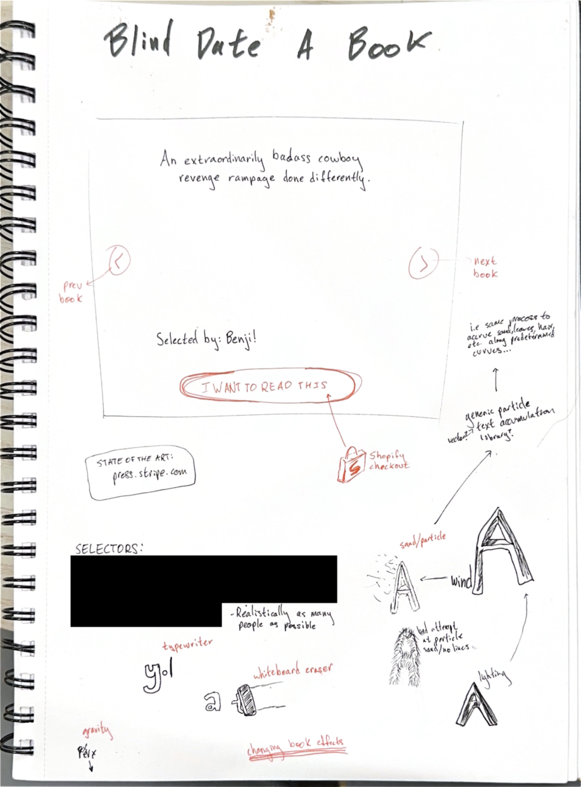

+++
title = "Blind Date A Book"
description = "A website to help you find your next read, with a charming twist."
date = 2025-01-19T17:20:00-08:00
+++

[Blind Date A Book] is part ecommerce website and part art project. I
first encountered its physical counterpart at a Barnes and Noble some
five years ago: I remember thinking to myself even then that it was a
perfect candidate for digitization. At long last, using the approach to
making I picked up [in DESIGN11], I've hacked together a boutique
version of this experience accessible for anyone with an internet
connection.

At first I was confused by the lack of digital equivalent to the
physical stands. Surely ordering books online is a solved problem? I
mean, that's what Amazon was founded on—and a custom frontend that just
displays things differently seems a trifling project.

A hyperscaling version might look something like:

1. Scrape books from [some list].
2. Have a generative model write summaries based on a set of examples.
3. Display that on a sexy website.
4. Have Amazon deliver the books to users.

Turns out it's hard to buy things with code. So it actually came out a
bit more [personal]:

1. A list of books chosen by myself, my family, and my best friends.
2. Descriptions we wrote.
3. The website is still sexy.
4. It sends you to Shopify where you buy *Book #X*.
5. I see that, go buy the real book, and send it your way.

More of a sensitive touch, perhaps.

The tech stack of the site bears further analysis. I've [long] [puzzled]
[over] the best way to go about building web projects, whereas I have
strong established preferences for [CLIs] and [iOS/macOS] apps. With
this project, I decided to try a new framework that has been making
waves in the community: [Web Origami]. I enjoyed a lot of what it has to
offer:

- The top-level declarative approach to routes reminded me of SwiftUI.
  That's a huge compliment.
- You can seamlessly weave between HTML, JS, and the Origami language.
  This manages to avoid feeling overwhelming, like Rails can when
  exposing a similar number of possibilities to address problems.
- Flexible data processing that transparently handles different formats
  makes navigating nested structures in templates easy.

It wasn't all sunshine and rainbows, though. The data processing
capabilities are something of a double-edged sword: formats like YAML
and JSON are convenient (especially for source control), but something
of a hack to avoid interfacing with a real database. I can see that
design being limiting for certain use cases. Still: I sent a message in
the [Matrix room] about hosting in production and the author replied
really quickly and was super helpful. That's worth a lot, in terms of
goodwill and my hope for the future of the project. I'll keep my eye on
Origami, though I've got some more experimenting to do before I commit
to the framework in the longterm.

Check out [the website][Blind Date A Book] for yourself to find your
next read!

[Blind Date A Book]: https://blinddateabook.com
[in DESIGN11]: @/posts/stanford-quarterly-reflection-05/index.md#academics
[some list]: https://news.ycombinator.com/item?id=22371436
[personal]: https://bsky.app/profile/andy.works/post/3lclb4jvle72u
[long]: https://fosstodon.org/@FIGBERT/112812107966936565
[puzzled]: https://fosstodon.org/@FIGBERT/113683895559149910
[over]: https://fosstodon.org/@FIGBERT/112893509255400989
[CLIs]: https://charm.sh
[iOS/macOS]: https://developer.apple.com/xcode/swiftui/
[Web Origami]: https://weborigami.org
[Matrix room]: https://matrix.to/#/%23weborigami:envs.net
