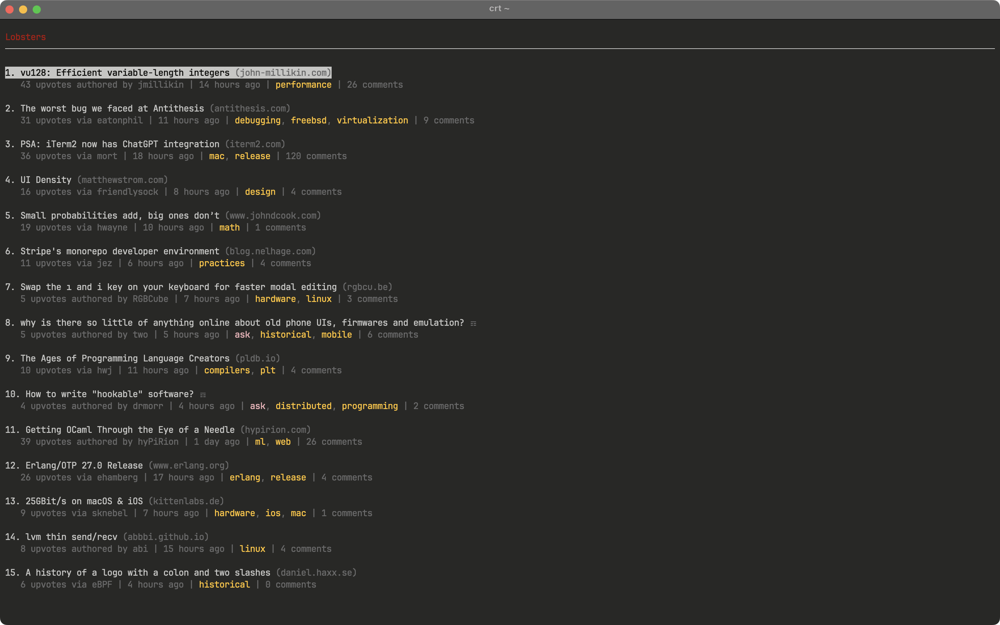
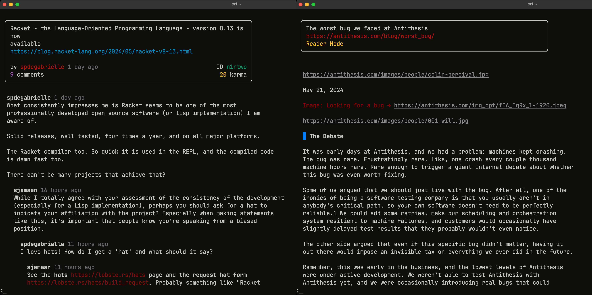

+++
title = "Caret"
description = "A command line tool for browsing Lobsters in your terminal."
date = 2024-05-22
[extra]
type = "project"
done = true
+++

[**Caret**][crt] is a command line tool for browsing Lobsters in your
terminal. It brings the Hacker News alternative just a few keystrokes
away in the environment that you're probably already using.

Caret is heavily inspired by the excellent [`circumflex`][clx]. It
attempts to emulate much of the same functionality with a much simpler
implementation, using the [Charm] open-source libraries. Caret relies on
Lobsters' unofficial JSON API, and will adjust to changes in this
potentially volatile source of data as needed.

Caret is debatably a [tangible deliverable]. I developed it before I
announced this intention, but the announcement has been long delayed, so
who knows.

Many programmers—myself included—practically live in the terminal. It's
a fast-paced, information-dense environment. Caret brings Lobsters to
meet its readers where they are, and enables readers to navigate the
site quickly and effectively in a manner familiar to them.

Compile Caret from the source code [on my forge][crt] and give it a [go]
(no pun intended) in your terminal.

[crt]: https://git.figbert.com/caret/
[clx]: https://github.com/bensadeh/circumflex
[charm]: https://charm.sh
[tangible deliverable]: @/posts/tangible-deliverables.md
[go]: https://go.dev
