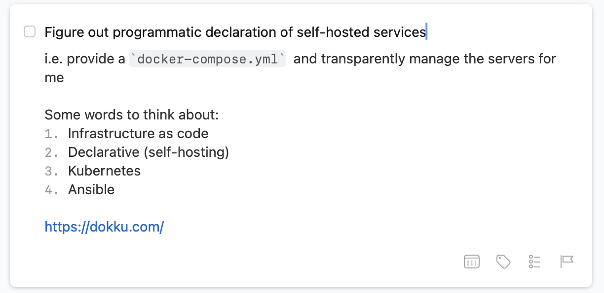
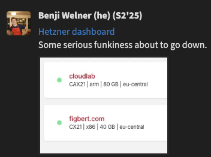

+++
title = "Cloudlab"
description = "My elegant, declarative, and robust personal infrastructure."
date = 2025-09-25T17:20:00-07:00
+++

In the vast apparatus of the internet, I have my own little hideaway: an
[Alpine Linux] box hosted on [Hetzner]. The website you're reading lives
on this very server, alongside numerous other personal services. Running
these myself allows me to be completely independent of major service
providers like Google, a choice with serious benefits for my privacy. It
has also helped me accrue real-world experience with system
administration—and [the crises] that occaisionally entails. Finally,
owning a fixed amount of hardware means that there is zero marginal cost
for additional services crammed into my alloted resources: this means
the monthly cost of running my many programs remains well below market
price.

My server setup would historically have been best described as a rickety
shack, barely standing, upon which I would occaisionally try and
haphazardly tack new services while hoping the whole thing wouldn't come
crashing down. This was sufficient for [at least five years]. But at
[Recurse], I became fed up with the status quo.

I explored a few radically different systems. [Frank] pointed me in the
direction of [Talos], and I played around with setting up a one-machine
cluster. But [Josh] asked me if I really needed all that baggage, and
truth be told I didn't. So I returned my focus to trusty [Docker
Compose]—and toward minimalism, pattern, and clear structure.

That structure employs a number of axioms: "All services are run in
containers" ([file storage] and [backups] having been the big exceptions
previously), "configuration and [secrets] get committed", "no building
images on the server"... Really, I can't say it better than [I already
did] during development, when I wrote long commit messages and thorough
documentation.

I also upgraded my server during this transition. I investigated a move
to the United States, but found that resources prices here vastly
outpaced the rest of the world. So I made a different move: to the ARM
architecture. Miraculously, I now get double my old resources at the
same price. More than enough for my email, calendar, websites, and
anything else I've thought of throwing at it over the years.

There is still room for improvement in this setup. As part of a renewed
commitment to elegance, I dropped my janky self-hosted `git` setup and
do not yet have [a good alternative]. And getting the server prepared
entailed some minor setup work which should be controlled in a
declarative and versioned fashion alongside the rest. But [that rabbit
hole] seems too deep for even me at the moment... It will have to wait
until next summer.

Check out [the code] for your own self-hosting inspiration!

[Alpine Linux]: https://www.alpinelinux.org/
[Hetzner]: https://www.hetzner.com/
[the crises]: @/posts/backups-update-internet-celebrity.md
[at least five years]: @/posts/i-wrote-this-three/index.md#self-hosting
[Recurse]: https://www.recurse.com/scout/click?t=0d85c06dc14f97552f2130471d4e3086
[Frank]: https://www.frankchiarulli.com/
[Talos]: https://www.talos.dev/
[Josh]: https://wolfesoftware.com/
[Docker Compose]: https://docs.docker.com/compose/
[file storage]: https://syncthing.net/
[backups]: https://www.tarsnap.com/
[secrets]: https://getsops.io/
[I already did]: https://github.com/FIGBERT/cloudlab/commit/cf37f4b3e0f4a7e014cb57e252d6e65860143469
[a good alternative]: @/posts/ideating-tragit.md
[that rabbit hole]: https://nixos.org/
[the code]: https://github.com/figbert/cloudlab
