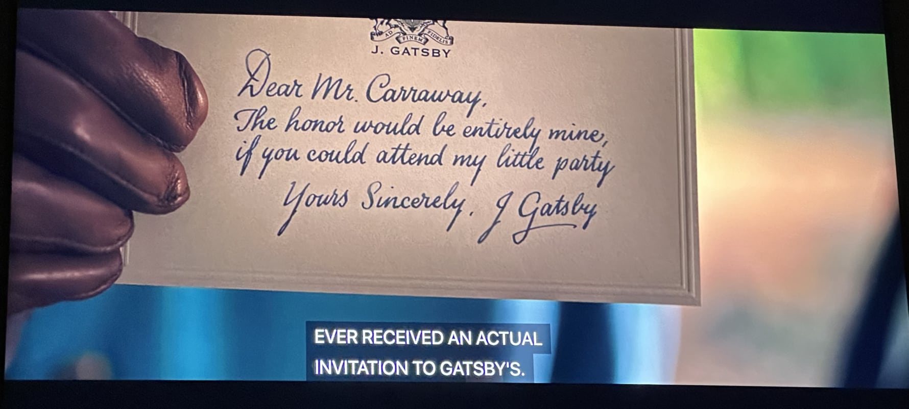

+++
title = "Cordially"
description = "An elegant and mysterious invite platform built with surprising software."
date = 2025-09-17T20:11:00-07:00
+++

The de-facto standard for event invitations at Stanford is [Partiful].
It's a great platform: it looks cool and makes gathering RSVPs easy. But
what if you want less of a party vibe, and more of an air of mystery?
Less "join the herd" and more "you, individually, have been chosen." For
that, you might need [Cordially].

There was of course a time before Partiful, when [Paperless Post] was
dominent. And they got something right: you would receive a skeumorphic
envelope in your inbox, and there was a fancy letter-opening animation
on their website. That *felt* special. So, after throwing a handful of
parties myself and hand-writing an awful lot of invitations, I decided I
could take the best ideas from pop culture and these competing platforms
to make something better.

Then I decided to wait several years until I was at the [Recurse Center]
and staring at a deadline for the [Palantir Build Challenge]. And thus
naturally, I ended up building my fancy-shmancy invite platform in a mad
two-day sprint on top of a data platform best known for its
military-industrial use-case.

With the strict time constraints, I didn't get to make Cordially the
visually stunning platform that I had initially envisioned. But I
learned loads: I built the app in Python's [FastHTML] as another waystop
on my roving quest to find a good web framework, and I was able to
concretize Palantir's product in my mind, where otherwise it would just
be a swirling, intangible, mildly sinister idea in my head.

One day I may rewrite Cordially to be gorgeous and production-ready. But
for the time being, you will have to be satisfied with [the code][Cordially] and a
[video walkthrough].

[partiful]: https://partiful.com
[cordially]: https://github.com/FIGBERT/palantir-cordially
[paperless post]: https://www.paperlesspost.com/
[recurse center]: https://www.recurse.com/scout/click?t=0d85c06dc14f97552f2130471d4e3086
[palantir build challenge]: https://build.palantir.com
[fasthtml]: https://fastht.ml/
[video walkthrough]: https://www.youtube.com/watch?v=7Q7l3vdgEPE
