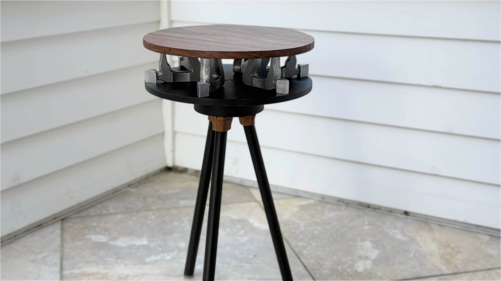
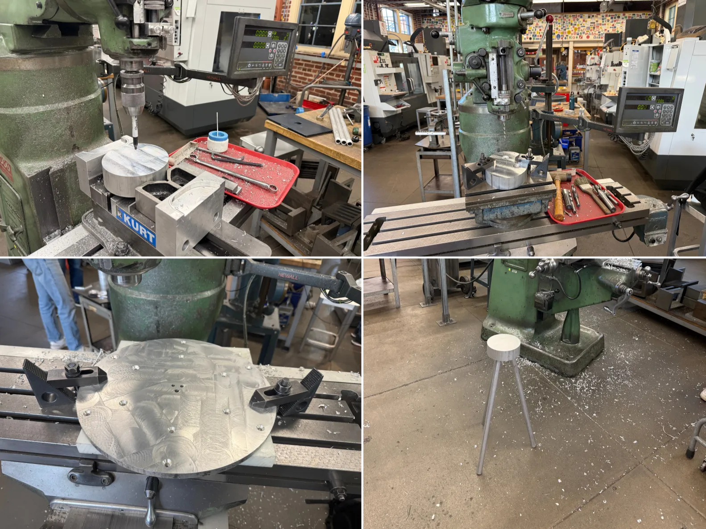

+++
title = "ME163*"
description = "A beautiful place to sit."
date = 2026-04-18T18:00:00-07:00
[extra]
icon = """<svg viewBox="0 0 4364 6684" xmlns="http://www.w3.org/2000/svg" fill="currentColor"><g fill-rule="evenodd"><path d="m737 582h-1v-1h1z"/><path d="m738 581h-1v-1h1z"/><path d="m742.5 580h-3.5l.5-1h3.5z"/><path d="m26 561-.75-.25-1.25-2.75 1.5-1 .5.5 1 2.5h-.5l-.5.5z"/><path d="m24 558h-.5l-2.5-2.5-.379883-1.5.379883-4 2 3v.5l.5.5h.5l-1 1.5 1 1z"/><path d="m41 550h-1v-1h1z"/><path d="m40 549h-1v-1h1z"/><path d="m4 339h-1v-1h1z"/><path d="m18 335v-1.5l.5-.5.5.5v1.5z"/><path d="m5 322h-.5l-.5-.5 1-.5z"/><path d="m1465 865h-1v-1h1z"/><path d="m1454 858h-.5l-.5-.5 1-.5z"/><path d="m1454 857v-.5l.5-.5.5 1z"/><path d="m1457.5 856h-1.5l.5-1h1.5z"/><path d="m1000 836h-1v-1h1z"/><path d="m1001 835h-1v-1h1z"/><path d="m1147 796v-.5l.5-.5.5 1z"/><path d="m1037 813h-.5l-.5-.5v-.5h1z"/><path d="m1036 812h-.5l-.5-.5 1-.5z"/><path d="m1036 811v-.5l.5-.5.5 1z"/><path d="m1597 675h-1v-1h1z"/><path d="m1600 674h-1v-1h1z"/><path d="m1598 674h-1v-1h1z"/><path d="m1602.5 673h-1.5l.5-1h1.5z"/><path d="m1604 672h-1v-1h1z"/><path d="m1640 662h-1v-1h1z"/><path d="m1636 658h-1v-1h1z"/><path d="m1590 676h-1v-1h1z"/><path d="m1587 673-1-.5v-3.5l1 .5z"/><path d="m1588 669h-1v-1h1z"/><path d="m1591 667h-1v-1h1z"/><path d="m2748.5 34h-1.5l.5-1h1.5z"/><path d="m2747 33h-1v-1h1z"/><path d="m2745 32h-1v-1h1z"/><path d="m3759.5 593-.5-1 1.5-2 .5.5v1z"/><path d="m3762 588-.5 1-.5-1z"/><path d="m3760 589h-1v-1h1z"/><path d="m3762 587 1 .5-1 .5z"/><path d="m3761 588h-.5l-.5-.5 1-.5z"/><path d="m3768 587h-1v-1h1z"/><path d="m3761 587v-.5l.5-.5.5 1z"/><path d="m3766.5 586h-3.5l.5-1h3.5z"/><path d="m2953.5 45h-1.5l.5-1h1.5z"/><path d="m2950 44h-1v-1h1z"/><path d="m4349 545h1.5l1.5 1.5v.5h-1.5l-1.5-1.5z"/><path d="m383 1487h-1v-1h1z"/><path d="m382 1485h-1v-1h1z"/><path d="m353.5 1185h-2.5l.5-1h2.5z"/><path d="m43 1176h-1v-1h1z"/><path d="m734 1132-1-.5v-3.5l1 .5z"/><path d="m731 1126h-1v-1h1z"/><path d="m293 1114h-1v-1h1z"/><path d="m263 1112h-1v-1h1z"/><path d="m293.5 1111h-1.5l.5-1h1.5z"/><path d="m280 1110h-1v-1h1z"/><path d="m282.5 1109h-1.5l.5-1h1.5z"/><path d="m264 1109h-1v-1h1z"/><path d="m291.5 1110-3-1-1.5-1.5.5-.5 3.5.629883 1.5.370117.5.5z"/><path d="m284 1108h-1v-1h1z"/><path d="m265 1108h-1v-1h1z"/><path d="m286 1107h-1v-1h1z"/><path d="m271.5 1107h-6.5l.5-1h6.5z"/><path d="m1774 1894h-1v-1h1z"/><path d="m1772 1892h-1v-1h1z"/><path d="m1768.5 1891h-17.5l.5-1h17.5z"/><path d="m1748.5 1890h-9.5l.5-1h9.5z"/><path d="m1475 1878v-1l1 .5z"/><path d="m1413 1861-.5 1-.5-1z"/><path d="m1412 1861h-.5l-.5-.5v-.5h.5l.5.5z"/><path d="m1411 1860-.879883-.25.879883-4.75z"/><path d="m1411 1855v-.5l.5-.5h.5v.5l-.5.5z"/><path d="m1837 1685h-1v-1h1z"/><path d="m1839 1684h-1v-1h1z"/><path d="m1681.5 1528-.5-1 1.5-2 .5.5v1z"/><path d="m1684 1525h-1v-1h1z"/><path d="m1686 1524h-1v-1h1z"/><path d="m1688 1514h-1v-1h1z"/><path d="m1689 1513h-1v-1h1z"/><path d="m1698 1502-.5 1-.5-1z"/><path d="m1698 1496h-1v-1h1z"/><path d="m1360 1455h-.5l-.5-.5 1-.5z"/><path d="m963 1042-.5 1-.5-1z"/><path d="m961 1043h-1v-1h1z"/><path d="m959 1043h-1v-1h1z"/><path d="m958 1042h-1v-1h1z"/><path d="m941.75 1118.75h-1.5v-2.5h1.5z"/><path d="m940.5 1115-.5-1 1.5-2 .5.5v1z"/><path d="m940.5 1112-.129883-1.5.629883-4v-.5l1 .5v2l1 1z"/><path d="m944 1107-1-.5v-4.5l1 .5z"/><path d="m945 1101-1-.5v-3.5l1 .5z"/><path d="m946 1097h-1v-1h1z"/><path d="m942 1091v-.5l.5-.5h.5v.5l-.5.5z"/><path d="m943 1085 1-.5 1-4v-.5l1 .5-1 14.5-1-.5-1-4.5z"/><path d="m945 1079-1-.5v-2.5l1 .5z"/><path d="m946 1076-1-1v-1l1 .5z"/><path d="m946 1070h-1v-1h1z"/><path d="m950 1061h-1v-1h1z"/><path d="m942 1056-1-1v-1l1 .5z"/><path d="m939.5 1055-.5-.5v-3l1.5-1.5.5.5v3z"/><path d="m942 1050-1-.5v-4.5l1 .5z"/><path d="m940.5 1045-1.25-.25-.25-1.25-1-1 1.5-1.5.5.5v2l1 1z"/><path d="m939 1041h-1v-1h1z"/><path d="m941 1040-1-.5v-3.5l1 .5z"/><path d="m939.5 1036-1.5-1.5v-3.5l1 .5 1 4z"/><path d="m940 1031-1-.5v-3.5l1 .5z"/><path d="m2588 1502h-1v-1h1z"/><path d="m2585 1500h-1v-1h1z"/><path d="m2279 1364h-1v-1h1z"/><path d="m2322 1007h-1v-1h1z"/><path d="m2321 1005h-1v-1h1z"/><path d="m2320 1004h-1v-1h1z"/><path d="m2005 1002h-.5l-.5-.5 1-.5z"/><path d="m1980.75 1599.75-5.25 3.25-3 3-2.25.25-.25 1.25-1.5 1.5-3.5 1.129883-42 4.620117-38 7-3 .879883-6 3.75-3 1-6.5.620117-2 2-10 8-3.5 2.379883-5 2.120117-3.5 2.5-12 10-5.5 5.5-.25 1.25-3.25 1.25-6.5 6.5-3.5 5.5-1 2-4.5 6.5-1 2-3.5 3.5-1.5.25h-5l-1.5-.25-2.5-2.5-.25-1.5v-5l1.75-3 2.5-3.5 4-7 11.5-13.5 2.5-3.5 3.5-3.5 1.5-.5 2.5-1.5 10-8 1.5-1.5v-1l1.5-1.5 1.5-.5 7-3.870117 2.5-.629883 2-2h1l1.5-1.5v-1l4.5-4.5 5.5-3.370117 4-1 6.5-.629883 3-3h2l2-2 28.5-4.75 16-3.5 37.5-3.75 1.5-1.5v-1l1.5-1.5 4-2 5.5-5.5 1.25-3.25 6.5-4.5.25-1.25 2.5-2.5 5.25-3.25.5-1.5 3.25-1.25 1.5-1.5.25-1.25 11.25-8.25 6.5-3.5 5.5-3.5 1.5-1.5 3.5-5.5 6.75-8.75 1.5-.5.75-1.75 1-2 3.5-5.5 2.5-2.5 1.25-.25 1.25-3.25 3-3v-2l4-4 4.5-6.5 2.5-4.5 3-3 .5-5.5 1-5 .5-5.5 1-1-1-1 1.375-4.5.625-4.5 2-2 1.5-12.5 1-4 .75-6-.125-22 .25-2 .125-4-1.875-5-.125-3 .75-3 .125-12-.875-7 .25-5 .5-2 .5-15-1.375-11 .25-19-1.25-4-1.75-4-1-4-.125-12-1.875-6-2.25-9-1.875-5-1-4-.5-3.5-2-2v-2l-2-2-2-8-2-2-1-7-3-3-.375-1.5v-4l-.625-2.5-1.375-2.5-.625-2.5-1-1 1-1v-3l-2-2-.375-1.5-2.125-5-4-6-2-5-.5-2.5-2-2-1-4 1-1-1-1-2.625-27.5-.75-3-.625-5.5-2-2-.5-2.5.125-5-1.125-3-.125-6-.625-2-3-13-.75-6.5-2-2-.375-2.5-6.125-23-2.375-16-4.375-16-3.5-22-1.75-7-.5-6.5-2-2-1.625-11.5-.75-3-.625-4.5-1-1 1-1-.5-4.5-1-4-1.875-5-6.125-27-3.75-13-6.75-48.5-2-2-1-8-1-1 1-1-1-1-.375-1.5-.625-3.5 1-1-2-2-.5-2.5-1.875-5v-10l.875-2 .5-1.5 2.5-2.5h1l1.5-1.5.25-1.370117 6.25.870117 3.5 3.5v4l1 1-1 1 1 1 1.5 13.5 6 33 .5 9.5 2 2 .5 3.5 1 3 .5 13.5 2 2 1.5 5.5 2.25 14 .625 2 .625 3.5 1 1-1 1 1 1 .625 4.5 4.625 18 1.5 11 3 12 2.5 5 4.75 38.5 2 2 .75 5.5 1.375 4 2.375 17 1 3 .5 3.5 2 2 1 7 2 2 .625 6.5 3.875 17 .5 4.5 3 3 .75 15.5 3.5 18 2.75 26.5 2 2 .375 1.5.625 3.5 2 2 5.5 10.5.75 2 1.375 5 .375 2.5 2 2v1l2 2 .75 7.5 2 9 1.625 4 .625 3.5 2 2 1 4 2 2 .25 1.5 2.125 8 1.125 3 2 8 1.125 3 .375 1.5 2 2v4l2 2 .625 2.5v2l-1 3 .125 6 1.5 4 .75 4.5-1 1 1 1 .25 1.5.5 28 .25 1.5.5.5 1-1 36.5.75 17 3.879883 12 3 2.5.370117.5-.5-1-1-.25-11.5 2.875-7 .375-1.5 3.5-3.5 1.5-.5 2-1 1.5-.5 2-2 4.5-.5 32-6.120117 32 1.25 24.5 4.370117 1 1 1-1 13.5-.5 9 1.25 8.5 2.25 5 5h1l6.5 6.5.25 13.5-.25 1.5-6.5 6.5h-1l-3 3-2.5.629883-8 2.870117-3.5.5h-.5l.5 1 43.5 1.5 26 4.129883 3 .870117 5 2 4.5 2.5 1.5 1.5.5 1.5 1 2 .75 2 1.5 5-.125 2-1.25 4-.875 2-.5 1.5-4.5 4.5-6.5 3.379883-3 1.25-1.5.370117-2 2-2.5.629883-11 3.75-5 .870117-103-5.75-8-1.25-5-1.75-3.5-.5-2-2-4-1-3-3h-1l-2.5-2.5-.25-1.5.25-11-1 .5-1 3-4.5 4.5-3 1-2 2-2.5.5-6 2-4 .879883-85.5 1.620117-1-1-.5.5-2.75 33.5-.625 2v6l-.625 2.5-1 1 1 1-.75 4.5-2.875 10-1.75 5-3.375 16-1.25 2.5-9.5 12.5-2 3-1 2-.5 1.5-3 3-.625 2.5-4.375 6.5-1.5 1.5h-1l-1.5 1.5-1 2-.625 2.5v4l-.75 2-.625 2.5-4.5 4.5-3 1-2.5 2.5v1l-2.5 2.5-1.5.5-7 5-4.5 2.5-14 11-3 3h-2l-3 3-1.25.25zm193.75-197.75 2-2h1l1.5-1.5.5-1.5 1-2 .25-1.75-1.75-.5-13-2.25-44-12-36-5-3-1.120117-1.5-.379883-1-1-.5.5v16l-1 1 1 1 1 17.25 1.5.25 1-1 1 1 1.25-.25.5-1.5 81.75-2 2-.5zm67.5-27.5 39-7.120117 4.5-2.379883 1.5-1.5-4.5-4.5-4-2-.5.5 1 1-.5 1.5-1 2-.5 1.5-2.5 2.5h-2l-.5-1h.5l1.25-.25.25-1.25-.5-.5-1 1h-1l-2-2h-3l-2-2-1.5-.370117-10-3.879883-5-1.25-16-2.870117-33-.879883-32.5 6.25-2.5 2.5-1 4 3.5 3.5h1l2 2 2.5.5 7 2.879883 3 .870117 10 1.379883zm-44.5 20.5 4-4h1l1.5-1.5-.5-.5-6.375.129883-.125 5.370117zm126.5 24.129883 3-.629883 9-3.120117 1.5-.379883 2-2 4-1 .5-1h-.5l-1.25-.25-.5-1.620117-7.75-.75-5-1.129883-4-1.620117-9-2.129883-42-4.25-6-1.75-8-1.75h-19l-24.5 3.25-3 3-3 1-2.5 2.5.25 3.25 5.75 2.629883 3 1 56 5.870117zm-47-59.129883v-1h-1v1zm66.5 46 .5-1h-1.5l-.5 1zm2 5 1-1 1.25-.25.25-2.25-1.5-1.5h-1l-.5.5 1 1-.5 2zm-1.5-1v-1.5l-1-.5v1z"/><path d="m3735 1780 1 .5-1 .5z"/><path d="m3734 1780v-1h1v1z"/><path d="m3393 1755h-1v-1h1z"/><path d="m3391 1754h-1v-1h1z"/><path d="m3390 1752-1-.5v-3.5l1 .5z"/><path d="m3393 1741-1-1v-1l1 .5z"/><path d="m3378 1501-1-1v-1l1 .5z"/><path d="m3301 1465h-.5l-.5-.5v-.5h1z"/><path d="m3412 1421h-1v-1h1z"/><path d="m3282 1421h-1v-1h1z"/><path d="m3403.5 1390h-2.5l.5-1h2.5z"/><path d="m3121 1320v-1h.5l.5.5v.5z"/><path d="m3151 1087h-1v-1h1z"/><path d="m3143 1049h-.5l-.5-.5v-1.5h.5l.5.5z"/><path d="m3957.5 978h-5.5l.5-1h5.5z"/><path d="m3960.5 977h-2.5l.5-1h2.5z"/><path d="m3949 976h-1v-1h1z"/><path d="m4205 997v-.5l.5-.5.5 1z"/><path d="m4204.5 996h-2.5l.5-1h2.5z"/><path d="m4019 1329h-1v-1h1z"/><path d="m4020.5 1328h-1.5l.5-1h1.5z"/><path d="m4023 1327h-1v-1h1z"/><path d="m4014 1058-.5 1-2.5-1z"/><path d="m4014 1057 1 .5-1 .5z"/><path d="m1738 2321h-1v-1h1z"/><path d="m1739 2319h-1v-1h1z"/><path d="m1738 2317h-1v-1h1z"/><path d="m1739 2316h-1v-1h1z"/><path d="m1654 2309h-.5l-.5-.5v-.5h1z"/><path d="m1652 2308v-.5l.5-.5h.5v1z"/><path d="m1653 2307v-.5l.5-.5h.5v1z"/><path d="m2027 2723h-1v-1h1z"/><path d="m2019 2701h-.5l-.5-.5v-.5h1z"/><path d="m2025 2700h-1v-1h1z"/><path d="m2018 2700h-.5l-.5-.5v-.5h1z"/><path d="m2026 2698-1-1v-1l1 .5z"/><path d="m2025 2695-1-1v-1l1 .5z"/><path d="m2024 2693-1-1v-1l1 .5z"/><path d="m2524 2567-1-1v-1l1 .5z"/><path d="m2523 2564-1-.5v-2.5l1 .5z"/><path d="m2522 2560-1-.5v-2.5l1 .5z"/><path d="m2530 2553h-1v-1h1z"/><path d="m2833 2545-1-1v-1l1 .5z"/><path d="m2856 2527h-1v-1h1z"/><path d="m2855 2520 1 .5-1 .5z"/><path d="m2529 2552h-1v-1h1z"/><path d="m2524 2551v-.5l.5-.5.5 1z"/><path d="m2436 2501v-.5l.5-.5h.5v1z"/><path d="m2033 2452-1-1v-1l1 .5z"/><path d="m2272 2373h-1v-1h1z"/><path d="m2054 2395h-1v-1h1z"/><path d="m2053 2393h-1v-1h1z"/><path d="m2034 2412h-1v-1h1z"/><path d="m2035 2411h-1v-1h1z"/><path d="m2035.5 2410v-1.5l.5-2v-.5l1 .5v2z"/><path d="m2038 2406-1-1v-1l1 .5z"/><path d="m2039 2403h-1v-1h1z"/><path d="m2041 2404-.75-.25-.25-1.25-1-1 .5-.5h1.5z"/><path d="m2041 2401 1.25-4.75 1.75-.25-2 5z"/><path d="m2034 2374h-1v-1h1z"/><path d="m2036 2373v-.5l.5-.5h.5v1z"/><path d="m2035 2372h-1v-1h1z"/><path d="m2036 2371h-1v-1h1z"/><path d="m2035 2379v-1.5l-1-.5v1zm1 1v-1h-1v1zm-1 2v-1.5l-1-.5v1zm-1 2v-1.5l-1-.5v1zm-2 6v-.5l1-3-1.5-1.5-.5.5v4zm4-4v-1h-1v1zm0 2v-1h-1v1zm-1 2v-1h-1v1zm-4.5 1 .5-1h-1.5l-.5 1zm13.5 15v-1h-1v1zm-2 5v-2.5l-1-.5v2.5zm-2.5 3 1.5-1.5v-1l-.5-.5-1.5 2zm-4.5 6v-3.5l-1-.5v3.5zm2 2v-1h-1v1zm-4 3v-2.5l-1-.5v2.5zm3-2v-1h-1v1zm12-29v-1h-1v1zm-2 11v-1h-1v1zm-21.5 30 1.5-1.5.5-2.5 1-3 .5-2.5-.5-.5-2.5 2.5-1 7zm11.5-9v-1h-1v1zm-6 6v-.5l1-4 1-1-.5-.5-1.25.25-1.25 5.25zm5-5v-1h-1v1zm-1 4v-2.5l-1-.5v2.5zm-1 2v-1.5l-1-.5v1zm-2.5 5 1.5-1.5v-3l-1-.5v.5l-.625 3zm-1.5-3v-1h-1v1zm-5 3v-2.5l-1-.5v2.5zm5 5v-.5l1-4-1-.5v.5l-1 4zm-6-1v-2.5l-1-.5v2.5zm6 13v-1.5l-1-.5v1zm2-1v-1h-1v1zm-5.5 4 1.5-1.5-.25-1.25h-1.5l-.25 2.25zm2.5 0v-1h-1v1zm-3 1v-1h-1v1zm-9 236v-1h-1v1zm1 2v-1.5l-1-.5v1zm2 3v-.5l-.5-.5h-.5v-1.5l-.5-.5-.5.5v1.5h-.5l-1.5-1.5-2.25-9.5.75-26 1-6 2.75-10v-31l-1.75-7v-9l-3.25-22-2-10-.25-2.5-3-3-.75-5.5-8.875-50-.125-4 2.25-16 3.125-11-.125-4 .5-1.5 2-2 1.625-9.5 11-40-.125-6 4-10 4-9 .5-2.5 3-3 .5-2.5 3.75-9.75 1.5-.5 1.25-1.75v1.5l.5.5.5-.5v-1.5l1-.5-1-.5.25-.75 1.25-.25h.5l-.5-1h-2.5l.5-1 3.25.25.25 1.25.5.5 1-1 2.5 2.5v5l-3 3v4l-3 3-.625 3.5-.375 1.5-2 2-.625 3.5-1.75 4-.625 2.5-2 2-1.25 5.5-.75 13 1-.5.375-1.5 1.125-3 .875-3 .625-4.5v-.5l1 .5v2l.5.5 1-1h1l3.5-3.5.5-1.5.875-2 .625-3 1.75-.25.25-1.25-1-1.5 2.875-.25.125-4.25-1-.5v-.5l-1-1 .5-.5h1l3-3h2l.5.5-1 1 1 1 .25 1.25 2.5.5-.25 1.75-3 6-5 7-1 2-.5 1.5-2 2v5l-3 3 1 1-1 1-.5 1.5-2.875 7-.625 2.5-3 3-.5 2.5-.25 3.75 1.5.5.25 1.25-1 1 1 1-1 1 .625 2.5.125 1.75-2.25.25-1.5 1.5 1 1v5l.5.5 1-1h1l1-1 .5.5v3l-3.5 3.5h-7l-3.5-3.5.75-8.5 1.25-3.5 2-2-1-1v-2l-1.5-1.5-.5.5-.625 4.5-2.875 9-2.5 21.5-3 3 1 1-1 1-.5 3.5.25 16-.5 4 3.5 20 2.25 8.5 1 1-1 1 1 1 .75 4.5 2.5 5 6.125 23 2.125 11 1 3-.125 5 .625 2.5 1 1-1 1 1 1v3l1 1-1 1 .625 2.5 1.75 4 .375 3-.125 10-.625 2.5-1 1 1 1-.75 5.5.75 5.5-1 1 1 1-.5 5.5-1.25 6-1.75 5-4.125 26-1 4-.875 2-.5 1.5-2.5 2.5h-1l-.5.5 1 1v3l2 2-1 1-.25 1.25-1.75-.75 1-.5z"/><path d="m2431 2355 1 .5-1 .5z"/><path d="m2430 2355v-1h.5l.5.5v.5z"/><path d="m2424 2354h-1v-1h1z"/><path d="m3047 2126h-1v-1h1z"/><path d="m3046 2125h-1v-1h1z"/><path d="m3047 2122h-1v-1h1z"/><path d="m3047 2118h-1v-1h1z"/><path d="m3054.5 2117h-5.5l.5-1h5.5z"/><path d="m1787 6537h-1v-1h1z"/><path d="m1492 6528h-1v-1h1z"/><path d="m1492 6526-1-1v-1l1 .5z"/><path d="m1287 6372 1 .5-1 .5z"/><path d="m1260 6362h-.5l-.5-.5 1-.5z"/><path d="m1261 6361h.5l.5-.5v-1.5h.5l.5-.5v-.5l2 1.5-1 1-.25 1.25-1.75.75-2-.5h.5l.5-.5z"/><path d="m1267 6358-1-.5v-3.5l1 .5z"/><path d="m3522 6536h-.5l-.5-.5 1-.5z"/><path d="m3522 6535v-.5l.5-.5.5 1z"/><path d="m3528 6524-1-.5v-2.5l1 .5z"/><path d="m3529 6520h-1v-1h1z"/><path d="m3531 6519h-1v-1h1z"/><path d="m8 320v-1h-1v1zm0 3v-1h-1v1zm11 12h1.5l.5.5-2 2 .5.5 1.25.25 3.620117 5.75.629883 3.5 2 2 .620117 3.5.879883 2 8.5 14.5 2.5 2.5 6 4 2.5 2.5v3l3 3 .370117 1.5 1.129883 3 2.5 10.5 1.5 1.5 5.5 3.5 2 .879883 6 2.120117 3.5.5 2 2 4 2 2.5 2.5v1l4.5 4.5 1.5.5 4 1.879883 8 2.25 5 1.870117 7 2.129883 5 2 17.5 9.370117 11.5 5.379883 9 2.25 5 1.620117 11 2.379883 5 1.620117 14 3.25 10 4 7 2 8 3 7 2 27 4 18 4.879883 5 1.120117 24 8 24 7 19 4.129883 12 3.870117 9 2.129883 14 5.75 3 1 16 3.870117 14 2.25 19 5.129883 5 1.870117 7 2 79 17.129883 12 4.75 12 3.120117 67 11.75 7 1.25 53 3.25 33 6.75 25 4 5.5 1.5 2.5 2.5v1l1.5 1.5h2l1-1 1 1 .5-.5.25-1.370117 6.25-1.129883 2-2h8l6 6 2.5.629883 2 .75 4 1.120117 6 .75 160 6.629883 10 2.5 7 .870117 43 .379883 22 2.870117 10 2.75 13 2.129883 69 .120117 15 2 10 3 8 1.879883 57 4.370117 2 .629883 4 .870117 92 4.629883 40 5.870117h34l60 9.629883 38 4.370117 7-.25 7 1 139 7.25 12 3.879883 1.5.370117 2.5 2.5v2l-1 .5v-1.5l-1.5-1.5-1.5-.5-2-.120117-2.5.620117-.5.5 1.5 1.5h2l2 2h1l1.5 1.5-1.5 1.5-13-1-.5 1 100 5.5 388-3.870117 531 4.870117 395-27 450-5 83-11.870117 112-18.129883 34-4.120117 42-8.129883 1.5-.25.5-.5-1-1 2-2v-2l2-2 .25-1.25 1.75.25 1.5.5 1-1 1 1 1-1 24.5-3.75 20-6.75 9-2 20-2.120117 5-1 10-3.879883 4-1 67-11.25 9-2.5 33-5.25 12-3 5-1.870117 8-2.129883 6-1 4-1 19-3 20-6.75 56-10.370117 22-7.75 8-2.129883 5-2 1.5-.5 2-2 2.5-.5 16-5.120117 6-2.75 2.5-.629883 2-2 1.5-.370117 11-4.129883 13-4 18-7 5-2.870117 5-2 2.5-.629883 2-2 2-1 7.5-5.5 4-2 1.5-.5 2-2 2.5-.620117 5-1.879883 10-2.25 13-4.75 4-1 5-2 8.5-5.5 4.5-2.5 5.5-3.5 1.5-1.5 2-3 12-15 2-3 6-8 6.5-9.5.5-1.5 4-4v-2l2-2 3.5-8.5.5-1.5 1-1-1-1-1-9-2-2-.5-1.5-2.870117-6-.629883-2.5-2-2-.620117-4.5-1.379883-4.5-2-2v-2l-2-2-1-3-1.5-1.5-5.5-1.625-9.5-5.375-3-3h-2l-2-2-2.5-1.5-9.5-7.5-3-2-2-2h-2l-2-2-6.5-3.5-19.5-14.5-2-1-1.5-1.5v-1l-2.5-2.5-2-1-9-6-2.5-1.375-2.5-.625-2-2-2-1-3-2-2-1-4-4h-2l-2-2-2.5-.5-12-5-5.5-3.5-2-1-2-2-2.5-.625-12-5.875-5-2.125-5-2.75-8-3.125-4-1.125-2-.75-8-2.375-4-1.625-2.5-.625-2-2-2.5-.5-32-13-10-4-5-3-2-.875-4-1.125-5-1.875-26-6.125-14-5.875-64-17.25-5-1.875-34-9.75-66-9.5-29-7.75-13-3-18-2-79-16.125-2-.75-63-12.125-220-20.25-4-.75-148-11.125-5 .375-63-8.25-6-2-18-3.875-72-2.25-27-5.875-138.75-14.5-.25 1.5-2.5 2.5-4.5.75h-1.75l-.5-1.625-166.75-12.625h-6l-21 4-4.5.5-.5-1h.5l3.5-.625 8-2.875 3.5-.5.5-1h-.5l-15.5 2.5-10.5-.5-1 1-1-1-1.5-.375-3.5-.625-1 1-2-2-8.5-1.375-128-6.375-36-5.75-364-4.625-378 3.75-23 2.875-136 9-240.5-.5-1-1-1 1-1-1h-3l-2.5-2.5-.25-1.25h-3.5l-.5 2.5-1.75.375-133.5 5.875-1-1-1 1-154.5 3.75-126.5 18.25-1-1-1 1-6.5-.75-231 23.25-75 10-19 4.75-29 3.375-65 12.875-39 6.25-5 1.625-54 12.375-7 2.75-12 3.125-4 1.75-6 2.125-3.5.5-2 2-6.5 2.5-60 13.125-5 1.75-45 12.125-5 1.875-26 7-4.75.75-.5 1.625-10.75 2.875-2 .75-11 3-5.5.625-2 2-1.5.5-2 .875-4 1.125-8 3-12 3-8 3.125-5 2.875-6.75 2.75-.25 1.25-1.5 1.5-8 2-2 2-2.5.5-7 3-12 5-4 1.125-5 2-1.5.375-2 2-2.5.625-2 .875-7 4-5 2.125-3.5 2.375-4 3-2.5 1.375-3 1.125-2.5.5-3 3-2.5.625-28 14.875-1.75.75-.25 1.25-1.5 1.5-5.5 3.5-4 2-3 2-4.5 3.5-3 2-2 2h-2l-2 2-2 1-3 2-8.5 6.5-2.5 1.5-10 7-2 1-2.5 2.5v1l-1 1 1 1-.5.5h-1l-.5.5 1 1 1 3-4.5 4.5-1.25.25-1.629883 3.75-1.120117 4-.5 5.5-1 1 1 1-.5 2.5-.25 2.75.75.25.5 1zm0 8v-1h-1v1zm-2 2v-1h-1v1zm7 8v-1h-1v1zm12 200v-1h-1v1zm1.5 1 .5-1h-1.5l-.5 1zm-6.5 4v-2.5l-1-.5v2.5zm3-2v-1h-1v1zm-2 3v-1h-1v1zm1 1v-1h-1v1zm2 1v-1h-1v1zm2 1v-1h-1v1zm-3.5 2 .5-1h-1.5l-.5 1zm6.5 0v-1h-1v1zm-4.5 1 .5-1h-1.5l-.5 1zm5.5 0v-1h-1v1zm-4 1v-1h-1v1zm5 0v-1h-1v1zm-3 1v-1h-1v1zm4 0v-1h-1v1zm-3 1v-1h-1v1zm5 2v-1h-1v1zm691.75 15.75.25-1.25-.5-.5-1 1-1-1-1.25.25v1.5zm2.25.25v-1h-1v1zm-233 131v-1h-1v1zm-1 1v-1h-1v1zm2 0v-1h-1v1zm1 1v-1h-1v1zm1-3v-1h-1v1zm1 1v-1h-1v1zm2 1v-1h-1v1zm444 123.5 14.5-8.5 10.5-5.5 1.75-.75.25-1.25 2.5-2.5h3l3-3 1.5-.5 4-2 6-4 10-5 1.5-.5.5-1-98.5-7-.5.5 1 1-1 1 1 1 1.25 3.5.75 4.5 1.5 1.5 4 2 2.5 2.5.25 3.25 3.25.25 3.5 3.5.5 3.5v3l-.75 3-.75 10.75 2 .629883 4 .25 9-1.379883 3-.75 3-1.120117zm-48-38.5v-1h-1v1zm5.5 12 .5-.5-.629883-4.5-1.370117-5.5-1.5-1.5-1.25.25-.25 1.25 1 1-1 1 2 2v2l2 2-1 1zm.5-11v-1h-1v1zm1 3v-2.5l-1-.5v2.5zm1 1v-1h-1v1zm0 2v-1h-1v1zm-1 6v-1h-1v1zm-3 8v-1h-1v1zm7 18v-1h-1v1zm6 216.5 6.5-.5.5-.5-1-1-.5-2.5.120117-8-1.370117-11 .370117-6-.870117-3-3.5-20 .120117-2 1.25-3-.25-41-1-3-.870117-2-.25-2 .370117-5-1.75-12-.870117-19.5-1-1 1-1-.629883-3.5-.620117-2-.75-5.5 1-1-1-1-1-6 1-1-1-1-.5-2.5.25-7-.75-10.5 1-1-1-1-.379883-2.5-.120117-5 2.25-13v-2l-.75-5.5-1-.5v.5l-1 8-2.5 2.5h-1l-1.5 1.5 1 6-1 1 1 1-1 1 1 16-1 1 1 1-.25 38.5-.379883 3-.370117 1.5 1 1-1 1 2.870117 49.5.5 3 .379883 19 .75 4v5l-1.129883 4-.120117 2 1.370117 7 2.379883 36.5 1.5 1.5zm470.5-1052.5.5-1h-1.5l-.5 1zm-1.5 1v-1h-1v1zm20.5 3 .5-1h-5.5l-.5 1zm4.5 0v-1h-1v1zm-10 1v-1h-1v1zm18.5 0 .5-1h-7.5l-.5 1zm4 0 .5-1h-1.5l-.5 1zm-16 2 .5-1h-6.5l-.5 1zm-6.5 2v-1h-1v1zm24 2v-1h-1v1zm14.5 4 .5-1h-.5l-8-1-.5 1h.5zm62.5 2.5 15.5-.5.5-1-36 .375-14-1.75-23-1-4.5-.625-.5 1h.5l2.5.375h13l14 2.125 4.5.5 1 1 1-1zm-90-1.5v-1h-1v1zm10.75 2.875v-1.625l-4.5.5-.5-1.5-2.25-.25-.5.5 2.5 2.5zm17.75-.875.5-1-9.5-1-1.5 1.5.5.5zm89-4 .5-1h-7.5l-.5 1zm-41 1 .5-1h-15.5l-.5 1zm58 0 .5-1h-1.5l-.5 1zm-19 2 .5-1h-2.5l-.5 1zm98 633 .5-1h-1.5l-.5 1zm-34 12 .5-1h-1.5l-.5 1zm-1.5 1v-1h-1v1zm-599 152v-1h-1v1zm-2 1v-1h-1v1zm7 0v-1h-1v1zm-10 1v-1h-1v1zm8.5 0 .5-1h-2.5l-.5 1zm-9.5 1v-1h-1v1zm155-28 1.5-1 2.5 2.5.120117 5.5 372.879883 37.5 186.75 4.5 1.25-4.5 3.5-3.5 2.5-.370117 6 .120117 1.5.25 2.5 2.5 2.25 4.5 440.75 8.25 30-3.75 10-3 4-.75 43-2.25 71 6.75 24.5-.25 2 2 10.5 1.379883 32 .25 14 2.620117 41 2.5 5 .75 4 1.129883 4 1.75 11 2.870117 7 1 50 .379883 20 2.5 269.5.870117 1-1 1 1 214.5-17.5 11-2.870117 50-6.129883 4-1 29-4.870117 253-29.129883 290-29.25 1.75-.5.25-1.25 1.5-1.5 4.5-1.370117 5.5-.629883 2 2 3.5.5 4 .129883 37-6.129883 135-18 33-5.120117 17.5-3.379883 2-2 2.5-.5 9-3 54-13 25-4 15-5.870117 10-3 38-5.129883 10-2.870117 26-4.379883 6-1.620117 7-1.25 11-3 5-1.879883 7-2.120117 4-1.75 2.5-.629883 4-4 1.5-.5 8-4 5-2.120117 1.5-.379883 2-2h2l2-2 8.5-4.5 14.5-11.5 2-1 2-2 2.5-.620117 6-2.75 4-1.25 6.5-3.379883 4.5-4.5 1.25-3.25 4.75-2.75 1.5-.5 4-4 4-1 5.5-5.5v-1l2.5-2.5 2-1 6.5-4.5 12.5-7.5 2.5-2.5v-1l1.5-1.5 2-1 3.5-2.5 10-6 7-5 1.75-.75 3.75-6.75.5-1.5 5.5-5.5 1.5-.5 2-.870117 2.5-.629883 2-2 3.25-1.25v-6.75l.25-1.5 2-2 .379883-2.5 1.370117-5-.620117-4 3.870117-26.5-1-1 1-1 1-30 1-1-1-1v-5l1-1-1-1 2-18 1-1-1-1 .75-4.5v-7l.5-2 2.5-24-.75-9.5-.5-.5-3.5 3.5-.5 1.5-7 10-9 11-.5 1.5-10.5 10.5-4 2-2 2-2.5.629883-11 6.870117-5 2-4 1-7 2.879883-7 2.120117-13 3.129883-5 2.870117-2 .879883-2.5.620117-4 4h-1l-1.5 1.5-.25 1.25-10.75 4.629883-2.5.620117-2 2-2.5.629883-6 2.870117-13 5-4 1-32 12.879883-9 3.120117-4 1.129883-2 .75-3.5.620117-2 2-37.5 12.5-23 5-35 6-5 1.879883-14 4.120117-19 3-4 1-6 1-26 7-117 18.879883-39 5.370117-3.75 1.5-1.25 3.25-3.5 3.5-1.5.379883-13 5.120117-33 9-30 5-4 1-188 31-13 2-725 30.879883-191 2-23-2.879883-295.5-.5-1 1-1-1-185.5 1.5-405-1.75-79-3.370117-7-1.879883-5-1.870117-2.5-.629883-2 2h-1l-.5-.5 1-1v-1l1-1-.5-.5-1.5.5-2 1-1.5.5-1.5 1.5v2l-1 .5v-1.5l-.5-.5-1 1h-1l-1.5 1.5v1l1 1-.5.5-3.25-1.25-.25-1.25-2-2 1-1 1.25-3.25 2.75-.75 3-1.120117 1.5-.379883 2.5-2.5-.5-.5-103.5-4.620117-121-15.75-40-1.25-40-5.629883-90-4.5-9-1.620117-45-3.379883-14-1.75-13-3.870117-6-1-10.5-.629883-1-1-1 1-56.5.25-27-4-5-1.620117-11-2-60-2.25-8-1.879883-11-2-163-9.120117-3-1-8.5-4.379883-2-2-1 1h-1l-2 2-19.5.75-50-10.120117-64-5.129883-14-2.75-28-4.5-3-.75-33-6-30-10-78-17-8-3-14-4-14-2.120117-25.5-6.379883-2-2-2.5-.620117-4-1.629883-16-4.25-5-1.870117-14-3.129883-47-14.870117-27-7.129883-31-5.120117-35-11.879883-9-2.120117-6-1.879883-13-3.120117-2-.75-8-2.129883-4.5-.5-2-2h-1l-2-2-2.5-.620117-13-6.879883-1.5-.5-2-2h-2l-2-2-2.5-.620117-2-.75-8-2.379883-4-1.620117-4-1.129883-10-4.120117-5.75-3.629883-.25-1.25-6.5-6.5-1.5-.370117-3-1.25-12.5-6.379883-6.5-6.5-3.629883-13.5-2.870117-5-.5-1.5-1.5-1.5h-1l-1.5-1.5-.25-1.25-3.25-1.25-1.5-1.5-.5-1.5-10.75-18-1.5-5-.25-1.5-1-.5v.5l.370117 2.5-.870117 39 1 6v6l-1 7 .120117 7 .75 3 1 55 .629883 3.5 1 1-1 1 1 1 1 5 1 1-1 1 6.5 24.5 1.870117 5 2.379883 9 .75 2 3 5 .870117 2 .629883 2.5 2 2 .370117 1.5.379883 3.75-1.5.5.75 2.25 1.5 2.5.25 1.75-1.75.629883-3.5.620117-.5 1h.5l1.5.5 6.5 3.5 2.5 2.5v1l6.5 6.5 7.5 2.5 15 3.129883 9 2.870117 2.5.5 5 5 20.5 12.379883 3 1.120117 2.5.5 2 2 1.5.379883 3 1.120117 7 2.129883 4 1.870117 5 2 4 1.129883 2 .870117 15 9 5 2 39 10.129883 23 9 1.5.370117 2 2 2.5.5 31 14 17 7 5 2.879883 4 1.120117 7 3 6 4 11 5.879883 8 2.370117 1.5.25 2 2 3.5.629883 5 1.870117 4 1.129883 29 12.75 26 7.120117 18 5.879883 20 4.120117 33 11 13 3 30 4.379883 1.75-.129883.25-2.25-3-3-1.75-11.5-.629883-2-.620117-3.5 1.5-1.5 3 1 .5-.5-1-1 .5-.5h2l2 2h1l2 2 1-1h1l2.5 2.5 1 6 2 2 .25 1.25 1.25.25 1.5 1.5 1 8-1 1 .5.5 14.5 1.5 41 7.75 557.5 52.75 1 1 1-1h1l1-1 .5.5v1l1 .5v-.5l.25-1.25 1.5-.5.5-3.5.75-.25.5 1zm1 6v-4.5l-1-.5v4.5zm-92 53v-1h-1v1zm859.5 509 2-1 2-2h2l5-5 1.5-.5 2-1 7-2.870117 2.5-.629883 6.5-6.5v-2l2-2 2-12 2-2v-5l-1-1 1-1 .625-4.5 1.875-6v-4l-2.125-6v-2l1.25-3 .5-2-.625-28-1.125-6-6.875-22-1.125-4-2.75-6-3.25-9-3-11-1.75-4-3.125-11-6.25-31-1.5-5-3.5-25-.625-3-.625-5.5-2-2-.5-2.5.125-3 .375-1.5 1-1-1-1-.25-20.5-1.375-9 .375-7-1.75-10.5 1-1-1-1-.5-2.5-4-54-2.5-20.5 1-1-1-1-1.75-13.5-.5-2-.75-5.5 1-1-1-1 .25-1.5.25-9 .5-2.5 1-1-1-1-1.625-16.5.25-6-1.125-4v-3l.75-3v-8l-.5-3-.75-14.5 1-1-1-1 1-22 1-1-.5-.5-172.25-2-.25 3.5 1 1-1 1 1.25 3.5v7l.5 4-.375 14 .125 2 1 2 .75 2 1.25 5 .5 4.5-1 1 1 1 .75 13.5.75 4 .125 18 1.125 5 .625 2v4l-.375 1.5-1 1 1 1-.375 25.5 1 4 .75 2v4l-.375 1.5-1 1 1.5 1.5 1.25.25.5 1.75.375 13 2 8 .375 2.5 2 2 .25 1.5v5l-.25 1.5-1 1 1 1-1 13 1 1-1 1 1.25 3.5 2.125 11 .625 5.5-1 1 1 1v8l-1 1 1 1 .625 4.5-.25 5 .875 3 .75 12.5 1 1-1 1 .625 3.5-.25 5 2.125 13-.25 10 2.75 27.5-1 1 1 1 .5 4.5 5 21 4 29 1.75 5 1.375 9v21l1.375 9.5-1 1 1 1 1 25-1 1 1 1 1.375 4.5 1.125 7v12l4.125 32 1 3-.125 15 1.5 10.5 2 2v5l-1 1 1 1-1 7 1 1-1 1 1 4 3 3 3 11 1.5 1.5 5 3 1 1 1-1 11.5-.75 3-.870117 2-.75 3.5-.629883 2-2 3.5-.620117 1.5-.379883 8.5-8.5.25-1.25 1.25-.25 3-3 5.25-1.25.5-1.5 6.25-4.25 2-2 2.5-.620117 2-.75 4-1.129883 13-5.120117 6.5-3.379883 3-3 2.5-.5 5-1.870117 2.5-.629883 2-2 2.5-.620117 2-.879883 7-4 1.75-.75.5-1.5zm917-1342 .5-1h-8.5l-.5 1zm-478.5 829v-1h-1v1zm7 4v-1h-1v1zm15.5 5 .5-1-9-.5-6-1.120117-2.75-.129883-.25 1.25-1 1 .5.5 1.5-.25zm114.5 355.5 3.5-.5 1.5-1.5-.5-.5h-1l-2.5-2.5-.5-1.5-1-2-.75-1.75-1.5-.5-.625-1.75-2.375-10-1.625-5-1.25-7-.75-3-5.125-29 .125-4 .375-1.5-1-1 1-1-.75-40.5.375-3-.125-5 .5-2.5 2-2 .875-27.5.5-3 .125-15 1-8-.625-43 9.5-58 .625-6.5 1-1-1-1-.5-2.5-.125-3 1.875-10 1.75-18.5 1-1-1-1 1.375-4.5 1.375-7v-2l-12.75-.620117-22.5-4.379883-2-2-7.5-1.25-26-1.370117-29-3.629883-41-1-1.5.25-2 2-19 1-.5.5 2 2-1 14-2 2-.25 1.5-2 8-2.375 14-2.625 10-1.5 10-3.625 9-1.125 4-1.875 5-3.125 12-5.875 18-1 4-1.375 8v8l-.25 1.5-1 1 1.5 1.5 10.25 1.25.25 1.25 1 1-1 1 .25 2.25 2.5.5 1.25 3.25-2.5 2.5-16.5 1-.875 16-1.625 10-.875 18-1.625 8.5-1 1 1 1-.25 1.5-.25 21 .5 2.5-1 1 1 1 .625 20.5 1.125 8 .75 3 .5 3.5-1 1 1 1 .625 6.5.75 3 .25 11 1.625 5 2.75 12.5 2 2 .25 2.25 1.5.5 13.5 17.5 1.25.25 2.5 2.5 2.25 4.25 1.25.25 2.5 2.5v1l2.5 2.5 1.5.5 2.5 1.5 2.5.75 5-1.25h11l2.5-.5 2-2 1.5-.370117h3l1.75.620117 1.25 4.25-2 2-.25 1.25-6.25 4.25-2.5 2.5.5.5 23.5 3.5 29-.870117 5 .870117 7-.120117 12-2.629883 21-.5 5-1.75 4-.870117 13.5.370117 1 1 1-1 1 1 1-1zm-160.5-350.5.5-1h-1.5l-.5 1zm-5.5 5v-1h-1v1zm41.5-14 .5-1h-3.5l-.5 1zm12 1 .5-1h-7.5l-.5 1zm8 0 .5-1h-6.5l-.5 1zm57 2 .5-1h-7.5l-.5 1zm9.5 1v-1h-1v1zm6 1v-1h-1v1zm3 1v-1h-1v1zm92.75 323.879883.75-1.879883 1-2 2.875-7 .625-2.5 2-2 .5-1.5 1-2 3.125-8 3.375-11.5 2-2 1.5-6.5 1.125-3 2.875-10 .5-3.5 2-2 1-8 2-2 .75-4.5 1.5-4 1.375-6 1.75-5 .625-3.5 3-3 .25-1.5 1.5-5 .25-1.5 2-2v-6l2-2v-1l1.5-1.5 1.25-.25 1.875-4.75.375-1.5 2-2 .5-2.5 1.125-3 .375-1.5 1-1-1-1 .75-5.5 5.25-9.5 6-8 2-2v-2l4-4 .625-2.5 3.75-6 1.25-3 2.375-4.5 2-2v-2l8-8v-1l4-4 .625-3.5 2.75-5 .625-2.5 3-3 1-4 3-3 1-4 4.5-4.5 1.25-.25.625-1.75.625-3.5 4-4 .625-2.5.875-2 1.5-2.5 3-4 2-3 3-3v-2l2-2 .5-1.5.875-2 2.125-6 .5-2.5 2-2v-3l5-5 .5-1.5 1-2 .5-1.5 2-2v-2l2-2 6-8 1-1-.5-.5h-25l-.5 1h2.5l3.5 3.5.625 2.5v2l-.625 2.5-1.5 1.5-3.25 1.25-1.25 4.25-3.5 3.5-4 1-2.5 2.5v1l-8.5 8.5-4 2-7.5 7.5v2l-8.5 8.5-6 4-3.5 3.5-.25 1.25-5.5 3.5-.25 1.25-1.5 1.5-2 1-14 11-2 1-3.5 3.5v1l-1.5 1.5-1.5.5-5 2.879883-16 4.25h-2l-5-2.129883-1.5-.5-2.5-2.5-1-6-2-2 1.75-14.5-.125-6 .75-2v-3l-.25-2-.125-39.5 1-1-1-1 .625-2.5.875-2 .25-1.75-1.5-.5-.625-1.75.125-7-14.75-.75-11-1.75-31.5-.5-1.5 1.5v1l-2 2-3.375 17.5-2.625 23.5 2 2-.75 4.5-.75 2-.125 2 .625 3.5-2 2-1.75 12.5.5 5-3.25 21 .5 10.5-1 1 1 1-.75 4.5-.75 2v2l.375 2 .125 43.5 1 1-1 1 1 1-.5 10.5-1 7-.5 20.5-1 1 1 1-.375 1.5-.625 3.5 1 1-1 1-1 10 1 1-1 1-.625 2.5-.25 2 .875 15.5 1 1-1 1v17l2 2 .5 3.5v3l-1.125 3v2l1.75 6 1.75 12 3.75 15 1 3 1.75 4 .625 2.5 2.5 2.5 7.5 1.5 5.5.5 2-2 5-1 2-2 2.5-.620117 6-3.879883 8-6 3-1.75zm50.25-314.879883v-1h-1v1zm-25 93.629883 6-2.129883 3.5-.5 3-3 36-31 5.5-5.5v-1l1.5-1.5h1l1.5-1.5 7-9 2.5-2.5 2-1 3-2 2.25-1.25 3.25-5.25 3.5-3.5 6.25-4.25 2.75-4.75.5-1.5 1.5-1.5h1l.5-1-96.5-2-.5.5 1 1v1l2 2-1 10-1 1 1 1-.375 1.5v3l.875 2 .375 2-1.75 11 1.375 21-2.125 14 .625 14.75zm44.5-92.629883.5-1h-4.5l-.5 1zm10 1 .5-1h-6.5l-.5 1zm26 1 .5-1h-23.5l-.5 1zm-30 3 .5-1h-1.5l-.5 1zm13 1 .5-1h-5.5l-.5 1zm1125.5-287v-1h-1v1zm3.5 0 .5-1h-2.5l-.5 1zm-10.5 3v-1h-1v1zm7 0v-1h-1v1zm-5.5 1 .5-1h-1.5l-.5 1zm-370 894 .5-.5.5-2.5.5-16.5 1-1-1-1 2-51 1-1-1-1-.5-8.5.875-3v-6l-.375-2.5-1-1 2.5-2.5 1 1 1.5-.370117h3l1.5.370117 1.5 1.5.5 1.5-.5 17.5 1.5 1.5 1.5-1.5v-1l.5-.5 1 1 .5-.5.25-1.25 3.75.129883 19 3.75 152.5-.129883 1 1 1-1 3.5.379883 23 4.870117 12.5.75 1 1 1-1 8.5-.5 18-2.25 2 .129883 4 1 17 2.25 9 2.120117 3.75 1.5.25 1.25 1.5 1.5.5-.5 2-4-1.5-1.5-2.5-1.5-10-7-12-6-1.5-.5-2-2h-2l-3-3-1.5-.5-18-10-13.5-10.5-3-2-4.5-2.5-20.5-17.5-11-8-4-3-3-2-2-2h-2l-2-2-4-2-1-1-.5.5v2l-2 2v1l-2.5 2.5h-1l-1 1-1-1-6.5 2.629883-5 2.75-2.5.620117-2 2-6.5 2.5-8 2.25-2 .75-13 7-1.5.5-2 2-2.5.5-3 1.129883-1.5.370117-2 2-2.5.629883-2 .870117-1.5.5-2 2-6.5 1.629883-7 3-10 5.75-5 2-10 2.370117-4 1.629883-4 1.120117-3 1.129883-2 .5-11 1.75-4.5 2.120117-2 2-9-1-1.5-1.5 1-7 1.5-1.5h2l2-2 5.5-3.25 5-1.25 8.5-1.5 2-2 2.5-.620117 4-1.75 14.5-3.629883 3-3 11.5-5.5 7-2.870117 3.5-.629883 2-2 1.5-.5 6-3 5-2 2.5-.5 2-2h1l3-3 3.5-.620117 5-2.75 2.5-.629883 2-2 2.5-.370117 5-1.25 2.5-.379883 2-2 2.5-.620117 2-.879883 5.5-3.5.5-1-18 1.75-4 .75-8 3-3 .879883-7 1.120117-8-.25-1.5-.25-2.5-2.5v-1l-1-.5.75 8 .625 2v3l-.375 1.5-2.5 2.5-4.5-.75-1.75-.5-.25-1.25-2-2 4-70 2-2 .5-4.5 1.5-7.5 2-2 .625-2.5 1.875-4 .75-2 .75-4.5 2-2 3.375-21.5 3.125-26-.5-14.5 1-1-1-1-.5-5.5-2.875-15-1.25-7-4.75-17-1.25-9-4.625-17-2.25-10-.5-3.5-1-1 1-1-1-1-1-7-2-2-1-7-2-2-.25-1.5-3.25-13-.5-3.5-3-3-.375-2.5-3.125-10-.875-4-4.25-36 .375-39 1.625-5 .625-5.5-1-1 1-1 1.25-6.5 1.75-121.5 1-1-1-1-.75-4.5-.5-2-.75-6.5 4-4-.5-.5-150 20-.5.5 2 2 .25 1.5.25 5-1 4 .25 23 .625 2 .625 3.5-1 1 1 1 .375 1.5.125 4-3.875 10v4l1.875 7-.25 7-.25 1.5-1 1 1 1v1l-1 1 1 1-1 1-.25 15.5 1.375 5-.125 69.5 2 2 4.375 26.5.5 22 1.375 4 .25 5-1.25 6 .25 2 2.75 7-.25 10.5 2 2 .25 1.5v11l1.125 7 .75 25 .875 5.5-1 1 1 1 1.25 3.5 1.25 6 .5 14.5-1 1 1 1v1l2 2-.375 48.5 1.625 5 .125 6-1.625 5-.25 15-1.125 6-4 12v6l-2 6-1.75 4-3.375 12-1.5 4-3.375 14-.75 2-3.375 15-1.75 5-1.125 4-.75 2-4 16-.625 6.5-3 3v1l-2 2-.625 3.5-5.875 10-3.5 10.5-1 1 1 1-1 1v2l-3 3v1l-3 3 .625 3.5.75 2v7l4 13 3.375 15 1.5 4.75 1.25.25 2-2h6l2 2 1.5.5 11 9 15 8 9 3.879883 24 7.120117 9 4 2.5 1zm185.5-446.5 6-6 .75-7.5 1.5-4 1.5-5 1.875-5 .375-1.5 2-2v-4l1-1-1-1 5.625-57.5 1-4v-6l1.75-4 2.125-6 .5-3.5 4-4 .625-2.5.875-2 .5-1.5 2-2 1-4 2-2 .625-2.5 4.375-6.5 2.5-4.5 5.5-7.5 2-3 1-2 2.5-2.5h1l3.5-3.5v-2l10.5-10.5h1l4.5-4.5v-1l6-6v-3l6-6 .5-1.5 5-7 1-2 6-15 6.125-15 1.875-7 .375-6.75h-1.875l-6 1.25-191.5 18.5-.5.5 2 2 .625 3.5.625 2 1.375 8-.625 8.5 1 1-1 1 .5 90.5-2 14v12l-.5 2.5-2 2 .5 9.5-.5 2.5-2 2 .25 1.5.5 30 2.875 40 2.875 8 1.125 4 1.875 4 .75 2 1.5 6 1.5 3.75 1.75-.120117 3-1.129883 4-1 6 .129883 14-3.75 28.5-3.879883 2-2 1.5-.5 2-.870117 11.5-2.629883 2.5-2.5 1-2.5zm-97-234.5v-1h-1v1zm243 531.25 8-1.75 10-4 11-3.120117 7-2.879883 5.5-1.5 2-2h2l2-2 1.5-.370117 3-1.25 8.5-4.379883 6.5-4.5 2-1 1.5-.5 2-2 3.5-.620117 2-.879883 3-2 12.5-9.5 4.5-2.5 6-3.870117 6.5-1.629883 2-2 5.5-3.5 8-4 5-2 2.5-.5 2-2 1.5-.5 2-1 6.5-4.5 2.5-1.5 2-.870117 13-4.25 5-2.75 7-3 3-1 27-4.25 17-4.629883 4-57.25 1-1-1-1v-39l-1.5-1.5h-2l-3-3-1 1-3.5 1.25-7 .25-26-4.120117-9.5-2.379883-3-3-2.5-.5-3-1.120117-2.5-1.379883-8.5-6.5-2.5-1.5-6.5-6.5v-1l-2-2-1.25-4.370117-6.25-1.129883-2.5-2.5-.370117-2.5.120117-5 .25-1.5 2.5-2.5 1.379883-.25-.879883-10.25-1-1 1-1 1-22-1-1 1-1 2.75-22.5 2-7 .25-1.5 2-2 .5-3.5 2.879883-8 5.25-22 .370117-3.5 1-1-1-1 1.379883-4.5 3.25-20 3.620117-12 1.5-9 2.75-10 3.25-37v-2l-1.25-6-.5-6.5 1-1-1-1-.870117-13.5-2.379883-10-1.75-9.5 1-1-1-1-.620117-2.5-1.75-4-.879883-3-1.5-12-.870117-3-3.879883-6-.75-2-1.5-5-2.75-7-5-7-3-7-.5-1.5-5-5-.620117-2.5-.879883-2-.5-1.5-4.5-4.5-89.5 8.629883-12.870117 2.620117.5 11.75-4.629883 32.5-2 2-3.370117 10.5-.629883 2.5-2 2-.5 1.5-2 4-3.870117 9-4.004883 11-2.625 13.5-2 2-.625 2.5-.75 2-.625 2.5-2 2v2l-2 2-.375 1.5-.625 3.5-3 3v1l-7.5 7.5h-1l-2.5 2.5v1l-1.5 1.5h-1l-1.5 1.5v1l-3.5 3.5-4 2-2 2-5 1-1.5 1.5-5.375 7.5-.625 2.5-2 2-1.5 5.5-1.875 5-2.625 11.5-1.5 1.5-1.25.25-1.25 4.25-2 2-.5 9.5-2 16 .25 7 1.75 8v7l-1.125 5v19l-2.875 22-1.25 5 .125 11-3.125 12-.25 1.5-3.5 3.5-2.5.5-18 8-2 .75-8 2.25-13 4.879883-20 4.370117-2 .75-2 1-1.5.5-2 2-9.5 2.5-35 5.25-2 .5h-8l-1.75-.5-.75-1.75-1-2-.125-2 .625-2.5 2.5-2.5 1.5-.370117 5-2.129883 2-.620117 18-3.129883 12-1.5 8-2 2-.75 7-4 2-.75 20-4.25 13-5 7-2.120117 4-1.879883 1.5-.5 2-2h2l2-2 1.5-.5 2-1 1.75-.75 1.625-3.75v-6l1.125-3 1-4 3-21-.125-15-.625-2-.75-5.5 2-2 .375-8.5-.75-2-1.125-4v-6l1.875-11-.125-9 2.5-15 2.625-5 3-8 1.375-6 1.75-5 .5-2.5 2-2 .375-1.5 1.125-3 1.5-5.5 13.5-13.5 1.5-.370117 7-3.129883 1.75-.75 6.5-8.5 1.25-.25 3.5-3.5 3.375-5.5 1.875-4.75 1.25-.25 1.5-1.5v-2l3-3 1-5 2-2 .5-5.5 2.125-9 1-3 2.875-6 2.875-7 .625-2.5 2-2 1-4 2-2 4.629883-13.5 1.870117-7 2-11 .129883-10 .370117-2.5 1-1-1-1-.25-3.25-1.75-.75-2-.25-5 1.25-23 2.629883-.625 11.870117-1.375 8.5-2 2-.625 2.5-4.875 12-.5 1.5-2 2-.5 3.5-3.125 8-6.875 12-5 7-1 2-.5 1.5-2.5 2.5h-1l-3.5 3.5v1l-7.5 7.5h-1l-2.5 2.5-.25 1.25-1.5.5-1.25 2.25-14 17-7.375 12.5-.625 2.5-3 3-1 4-2 2-2.5 4.5-.75 2-1.5 5-.25 1.5-2 2-4.5 20.5v9l-2.75 9-.75 4.5 1 1-1 1 1 8-1 1 1 1-1 7 1 1-1 1-.625 2.5.125 8-2.5 12.5-3 3-.375 1.5-1.875 5-1.5 9-2.25 4.5-2.5 2.5-1.25.25-4.625 6.75-1.125 3-.5 2.5-3.5 3.5-18 4-2 2-2.5.629883-2 .75-4 1-17 2.25-4-.25-2 .120117-2 .879883-8 2.120117-14 2.25-3.75 1.5-.25 1.25 2 2 .5 8.5 1.25 8 1.875 7 2.875 7 .875 3 2.375 18 3.5 12 7.25 34-.5 27.5-2 2 1 1-1 1 .25 1.5v8l-.875 3-.75 2-.875 3-3.5 22-2.625 5-3.125 8-2.125 7-4 10 .375 4-2.375 22-3.125 16-2.875 8-.375 1.5.5.5 1-1 .5.5v2l1 .5v-.5l-.625-3.5-.375-1.5 2.5-2.5h3l1-1 1 1 .5-.5.25-1.25 3.75.379883 3.5-.629883 2-2 2.5-.620117 7-3 2-.5 20-2.379883 8 .25 2 .5 15 .5 3.5 1.25 1 1 1-1 7.5.75 4.5 1.25 2 2 7 1 2 2 2.5.379883 17 4.870117 16 3.879883 20 2.25 10 .120117 8-1 12.5.5 1-1 1 1zm-2632-179 36.5-7.25 1.5-1.5-.5-.5-1.5-.5-11-6-1.5-.5-2.5-2.5v-1l-2.5-2.5-5-3-4.5-4.5-.25-1.25-1.75-.75-5-3-1.5-.5-2.5-2.5v-1l-4.5-4.5-1 1-4.5.629883-13 3.620117-20 2.5-8 1.5-13 1.5-9 1.75-9 1-26 5-6 1-16 4-3 1.129883-2 .5-19.5.870117-2.5-2.5-.5-1.5-1-2-.5-1.5-1-1 1-1-1-1v-3l-6-6-7.5-13.5-3.879883-8-.620117-2.5-2-2-1-4-2.5-2.5h-1l-3.5-3.5-1-17.5-73 6.5-62 19-7 2-4 .75-17 1.629883-17 5.620117-3.5.5-1-1-1.5 1.5 1 10 4 4 .25 3.25 2.25.25 5 5h1l.5.5-1 1 2 4 1.5 1.5h1l7 7 2.5.629883 2 .870117 2.5 1.5 15.5 7.5 10 4 2.5.5 2 2 5.5 1.5 7 2.879883 3 .870117 14 1.5 11 2.629883 14 2.370117 3 .75 3 1.129883 2 .5 11 1.620117 4-.25 2.5-.5 1 1 1-1 8 1 1 1 1-1 57.5-1.5 64-8 16 .25 73-5.120117zm-779.5 21.75.5-.5-1-1-16-20-3.5-5.5-6-8-.5-1.5-1.5-1.5-1.25-.25-4.75-6.75-.75-1.75-1.25-.25-5.5-5.5v-2l-2-2v-1l-1.5-1.5-23.5 3.5-7 2.879883-4 1.120117-27 3.129883-7 1.75-33 5.120117-4 1-15.5 2.5-2 2-3.5.5-6 2-76.75 8.629883v1.75l29.75 4.370117 191 15.379883 3 .75zm-47.5-72v-1h-1v1zm10 3v-1.5l-1-.5v1zm12-1v-1h-1v1zm-22 1v-1h-1v1zm20.5 0 .5-1h-1.5l-.5 1zm-22.5 1v-1h-1v1zm16 2v-1h-1v1zm438-21v-1h-1v1zm-699 59v-1h-1v1zm317.75 334.75.25-1.25 1-1-1-1 .5-3.5 1.870117-6 .629883-6.5-1-1 1-1-.879883-40.5-1.620117-11 .25-6 .5-2 .25-9 1.120117-4v-8l-1.120117-3-1.129883-4v-17l-.620117-2v-5l.370117-2v-26l-.75-3v-2l1.25-3 .5-2 2.379883-28-3.379883-40-1.5-5-3.870117-18-2.129883-14-.620117-6.5-2-2-.629883-2.5v-2l.629883-2.5-2.5-2.5-24.5-.620117-25-3.75-189-17.129883-4-1-27.5-4.5-1-1-.5.5.75 5.5 1.75 6v4l-.5 2.5 2 2v2l1 1-1 1 .620117 4.5.75 3 .879883 5 .25 29-1 8 .25 24 .370117 2 2.75 50-2.370117 17 .120117 7 1 4 .879883 2 .620117 2 2.75 41-.370117 3v25l1 6 1 4v5l-1.25 5-.25 1.5 2 2 1.25 5.379883 13.75 2.75 4 1.870117 5 2 3 .75 12 .129883 5-.879883 4-1 5-.870117 12-.129883 15 2.129883 14 3.870117 9 2 36 3.25 8 1.75 13 4.879883 3 .75 40.5 3.870117 2 2 2.5.629883 2 .75 4 1.120117 32 2.379883 3 .620117 7 2.879883 12 4.25zm-294.75-317.75v-1.5l-1-.5v1zm1 1v-1h-1v1zm311.75 18.75.25-1.25-.5-.5-1.5 1.5.5.5zm25.25 3.75 25-6 13-5 1.5-.5 1.5-1.5-1-1-.129883-4.370117-6.870117.5-3 1-14 6.75-20.5 4.620117-3 3-4 2-1.5 1.5.25 1.25 3.75-.25 4-1zm-28.5-3.5.5-1h-1.5l-.5 1zm-300 264 .5-1h-2.5l-.5 1zm1408.5-597v-1h-1v1zm-5 8v-1h-1v1zm0 3v-1h-1v1zm0 2v-1h-1v1zm1 2v-1h-1v1zm-436.5 47 .5-1h-6.5l-.5 1zm20.5-6v-1h-1v1zm-3 1v-1h-1v1zm-4 1v-1h-1v1zm-3 1v-1h-1v1zm-96 57v-2.5l-1-.5v2.5zm-6 7v-1.5l-1-.5v1zm5 3v-1.5l-1-.5v1zm1 5v-2.5l-1-.5v2.5zm-5 0v-1h-1v1zm4 3v-1.5l-1-.5v1zm-1 2v-1h-1v1zm-4 3v-2.5l-1-.5v2.5zm5 0v-1h-1v1zm.5 13 .5-.5-1-2-.5-2.5.5-1.5 2-2v-4l-1-.5v3.5l-2 2-.379883 1.5-.620117 3.5zm-5.5-6v-1h-1v1zm0 4v-1.5l-1-.5v1zm1 7v-1.5l-1-.5v1zm4-1v-1h-1v1zm-3 8v-6.5l-1-.5v6.5zm1.75 5.75-.75-5.25-1-.5.120117 5.75zm1 9-.379883-2.75v-2l.629883-2.5-1-.5-.879883 7.75zm.75 8.25.5-.5-1-1 .370117-1.5.629883-3.5-1-.5v.5l-.879883 6.25zm1.5 4v-1.5l-1-.5v1zm0 2v-1h-1v1zm-2.5 3 1.5-1.5-.5-.5-1.25.75zm2.25 2.75.25-1.25-1.5-1.5-.5.5.25 2.25zm12.75 7.25.5-1h-3.5l-.5 1zm-10 6 .5-1h-1.5l-.5 1zm-6.5 41v-4.5l2-2 1-29 1-1-1-1v-2l-1.5-1.5-14.25 1 1.620117 19 .629883 2 8 15 1 2.5zm8.5-38 .5-1h-1.5l-.5 1zm-.5 10v-.5l-1-6-1-.5v.5l1 6zm-.25 2.75.25-1.25-.5-.5-1.5 1.5.5.5zm-.75 3.25v-1h-1v1zm.5 5 .5-.5-1-1v-1l-1-.5.25 2.75zm.5 3v-1.5l-1-.5v1zm-2 8v-.5l1-6-1-.5v.5l-1 6zm-2 3v-1h-1v1zm1 5v-2.5l-1-.5v2.5zm-1 5v-1h-1v1zm3 7v-1h-1v1zm-4 6v-1h-1v1zm4.5 1 .5-1h-1.5l-.5 1zm1.5 10v-1h-1v1zm16-107v-1h-1v1zm6 5v-1h-1v1zm-1 2-2-1.5-.25-1.25-3.5-1.5-.629883-1.75v-3l.879883-2 .5-1.5 2.5-2.5 1.5-.370117 3-1.25 2-.129883 23 4.379883 4 1 5 2 1.5.370117 2 2 2.5.629883 4 1.870117 5 2.129883 5 2.870117 1.5.5 2 2 3.5.5 5 1.879883 5.5 1.620117 2 2h4l3 3 1.5.5 2 1 8 6 1.5.5 1.5 1.5v1l2.5 2.5 1.5.5 5 3 1.5.5 2.5 2.5v1l4.5 4.5h2l2.5 2.5.5 1.5 1.870117 4 .629883 2.5 1.5 1.5h1l2.5 2.5 6.370117 8.5.629883 2.5 1.5 1.5h2l1.5 1.5 3 5 1.5 1.5 1.5.5 2.5 1.5 9 7 4 4h2l2.5 2.5 1.25 3.25 2.25.25 2 2 1.5.5 6 3 1.5.5 3.5 3.5v6l.5.5 1-1 23.5-.75 59.5-9.25 4-4 1.5-.25 7-.120117 3 1 6.5 4.370117 1.5 1.5.5 1.5v2l-.5 1.5-1.5 1.5-1-1-1 1-5.5.75-4.5 1.25-2 2-2.5.629883-5 1.870117-8 1.879883-74 8.5-52 11.370117-21 2.25-61.5 3.5-1 1-1-1-7 1-1-1-1 1-8.5-.75-55 7.129883-48 1-18 2.25-10.5-.629883-1-1-1 1-12.5-.5-13-2-5-1.75-14-2.5-9-2.370117-20-2.5-4.5-1.379883-2-2-8-1-3-3-5-1-2-2-2.5-.620117-7-3-18-9.879883-1.5-.5-4-4-.5.5v7l2 2 .620117 3.5 3.379883 6.5 2.5 2.5 3.5.629883 4 1.870117 16.5 10.5 2.5 1.129883 17 2.5 5 1.870117 20 5.129883 5 2 6 3.870117 5 2 17 4 15 2.75 97.5 3.75 1-1 1 1 97-7 1 1 1-1 25.5-3.75 8 .5 38-3.25 32.5-.5 1 1 1-1 16.5-.75 13-2.75 13 .129883 40.5-5.629883 3-3h1l2.5-2.5.5-1.5.870117-2 1.629883-5.5 2.5-2.5 1.25-.25.25-2.25 4.5-4.5 1.370117-.25.75-12.75 1.629883-3.75 1.5-.5.870117-3.75-.620117-2.5-3.5-6.5-.75-1.75-1.25-.25-2.5-2.5-1-4-4.5-4.5h-1l-3.5-3.5-.5-1.5-4-7-.5-1.5-2.5-2.5h-1l-1.5-1.5-.5-1.5-4-9-3.5-5.5-1.25-2.25-1.25-.25-2.5-2.5-1-4-3-3-1-6-2-2-.379883-2.5-1.370117-5-2.5-4.75-1.25-.25-3.5-3.5-.25-1.25-4.25-1.25-1.5-1.5v-1l-2.5-2.5h-1l-1.5-1.5-.379883-1.5-6.120117-13-.5-1.5-2.5-2.5-1.25-.25-1.5-3.5-3.25-1.25-3.5-3.5v-2l-3-3-1-4 1-1-1-1-.5-1.5-1-2-.75-2-1.25-5-.5-5.5-3-3-.129883-6.25-1.370117-.25-1.5-1.5-1-6 1-1-1-1-.25-1.5-1.5-6-1.629883-4-7.870117-24-1.5-7-9.629883-16-2.620117-10.5-1-1 1-1 1-16-2-2-1-9 1-1-1-1-.5-10.5 1-4 .25-12 1.620117-4 1-3 .129883-11 .5-3.5 1-1-1-1-1.129883-7.370117-82.370117-8.129883-.5.5 1 1 .870117 36.5-.5 5 .629883 5.5-2 2 2 14 2 2 .370117 1.5v4l-.25 2 .25 13-1.370117 8.5-2 2v3l-2 2-1 7-1.5 1.5-1.5.25-16 4.25-5 1.879883-3 .870117-9 1.5h-15l-3 .5-9 .129883-5-.75-15.5.370117-4.5-4.5v-2l-1-1 1-1-1-7 2.5-2.5h10.25l.25 1.5.5.5 1-1 1.5 1.5v2l1 1-1 1 .5.5 7.5.75 3 .629883h7l3-.629883 13.5-.75 1 1 1-1h8l2-2 2.5-.5 3-1 11.75-2.75.870117-3.75.75-2 3.379883-13 .75-2 .370117-2-1.620117-11-2.75-11-.5-6.5-2-2-1.25-7.5-1.879883-34.75-2.370117-.25-1.5-2 1-.5-1-.5v-1l2.75-1.25v-1.5l-3.75.25-8 2.879883-2.5.620117-2 2-5.5 3.5-10 5-1.5.5-.5.5 2 2v5l-2 2v1l-4.5 4.5-1.5.379883-3.5.620117-.5-1h.5l4-1 3.5-3.5-.5-.5-6 1-3 3-.5-.5-.25-1.25-1.75.129883-8 3.25-21 11.870117-5 2-6 1.75-9 1.379883-4 1-6.75 2.620117-.5 2.75.25 72.5 2 2 .75 9.5.5 2 1.25 9-.5 36.5-1 1 2 2 .370117 1.5v3l-1.870117 4v2l.75 2 2.75 17.5-.5.5-1.5-1.5-1-10-.5-.5-1.5 1.5 1 10 2 2-1 1v6l2 2-1 1v6l2 2-1 6-1 1 2 2 .25 1.379883 7.25.120117 1.5 1.5-.5.5-1.5-.370117-2.75-.379883v1.5l5.25 1.25 1.5 1.5v1l-3.5 3.5h-2l-.5.5 1 1-.5.5-1.5-.5-1.75-.25v1.5l1.5.5-.129883 9.75.379883 2.5-1 1 1 1v.5l-1.5 3-.25 2.75.75.25-1 12.5-1 1 1 1-1 1-1.75 9.5.25 3 .5 2.5-1 1 1.5 1.5 2-2 .5.5v1l-1 1 1 1v1l-.5.5-1-1-1.5 1.5.25 1.25 2.5.5.25 1.25.5.5 1-1 5.5.75 2.5 1.25 2.5.5 2-.75 12-3.25 22-5 76-11 7-2 6.5-1.5.5-.5-1-1-10.5-12.5-2.75-4.75-1.5-.5-.5-1.5-1.25-.25-8-8-4-1-2.5-2.5v-1l-2.5-2.5-3-1-1.5-1.5-.25-1.25-4.25-2.25-2-2-2.5-.5-25-10-5.5-3.5-2.5-1.370117-14-6-13-4-6.75-.5-.25 1.370117-2 1.5-.5-1-.5.5zm115 70.5 3.75-.75v-1.5l-1.75.129883-3 1.25-1.5.370117-.5 1zm-5.5 1.5 1.5-1.5-.5-.5-1.25.75zm10 0 .5-1h-3.5l-.5 1zm-4.5 1v-1h-1v1zm-15.5 1 .5-1h-9.5l-.5 1zm4.5 0v-1h-1v1zm8.5 0 .5-1h-2.5l-.5 1zm-24 1 .5-1h-3.5l-.5 1zm-5 1 .5-1h-2.5l-.5 1zm-4 1 .5-1h-4.5l-.5 1zm19 0 .5-1h-8.5l-.5 1zm-32 1 .5-1h-2.5l-.5 1zm20.5 0v-1h-1v1zm-4.5 1 .5-1h-1.5l-.5 1zm-3.5 1v-1h-1v1zm210 21v-1h-1v1zm2 1v-1h-1v1zm424 236v-1h-1v1zm2 6v-.5l-.629883-3.5-.370117-1.5-1-.5v.5l.620117 4zm4 19v-.5l-.5-3.5-.879883-3-.620117-4.5-.5-.5-1.5 1.5.5 2.5 2.120117 6.5zm2-7v-1.5l-1-.5v1zm-319 50v-2.5l-1-.5v2.5zm-2 1v-1h-1v1zm236 56.75 17-3.120117h12l6 1 3-.129883 6-1.870117 5.5-.629883.5-.5-1.5-1.5-9.5-.620117-23-6.629883-48-6.370117-41-7.75-62-6.25-13-2.629883-18-1.5-5-1-10-3.620117-28-7.129883-7-2.870117-6-2-3.5-.629883-1.5 1.5 1.5 1.5.5-.5v-1l1-.5v2.5l1.5 1.5 1.5.5 8 6 1.5.5 3.5 3.5v1l1.5 1.5 4.25 2.25 4.25 7.25 2.5 3.5 14.5 16.5 2.5 2.5 1.5.5 2 1 1.5.5 3 3 2.5.5 10 4 1.5.5 2 2 103.5-4.5 12-3 13-2.120117 4 .120117zm-233-42.75v-1h-1v1zm69.5-45 3.5-3.5-.5-.5-4 2-1.5 1.5.5.5zm11 35 .5-1h-1.5l-.5 1zm-1.5 1v-1h-1v1zm240-53v-1h-1v1zm-2 6v-1.5l-1-.5v1zm4 0v-1.5l-1-.5v1zm-4 8v-5.5l-1-.5v5.5zm4-2v-2.5l-1-.5v2.5zm-3 3v-1h-1v1zm0 4v-1.5l-1-.5v1zm1 2v-1.5l-1-.5v1zm1 4v-3.5l-1-.5v3.5zm5 14v-1h-1v1zm-315 32v-1h-1v1zm5 0v-1h-1v1zm27.5 346 .5-.5v-4l1-1-1-1-1-7-1-1 1-1v-2l1-1-1-1-.75-4.5.75-16.5 1-1-1-1v-6l1-1-1-1-1.25-3.5v-6l.25-1.5 2-2 .120117-26.5-1.370117-4-.75-4.5 2-2-.129883-1.5 1.879883-30 .620117-3 .629883-34.5 1-1-1-1 .5-3.5.75-3 1.120117-8-.120117-17-1.75-6-.25-3 1.620117-16-.120117-2-1.25-5v-4l1.25-5-.129883-14-2.25-14-.370117-11.5-2-2 .620117-3.5.629883-2 1.5-8-.75-8.5-2-2-1-6-11-11-1-2-5-7-1.5-2.5-.75-1.75-5.25-3.25-.5.5 1 1v3l-2 2v2l-3 3-.25 1.5-.25 9-.5 2.5-1 1 1 1-.379883 1.5-1.25 3-.370117 1.5-1 1 1 1-.629883 6.5-.870117 4-.379883 101 .379883 2 .5 28.5-1 1 1 1 .25 18.5.25 2 .75 2 .75 5.5-2 2-.5 3.5v14l1 6v6l.75 2 .75 6.5-1 1 1 1 .25 1.5v5l-.5 2v19l4.25 29.5 2 2v2l6 6 .620117 2.5.879883 2 11 14 2 3.5zm33.5-306v-1h-1v1zm263-36v-1h-1v1zm1 9v-1h-1v1zm1 30v-1.5l1-1-1-1 1-1v-6l-1-.5-1 10.5zm-11 28v-1h-1v1zm2.5 0 .5-1h-1.5l-.5 1zm-287.5 311 5-1.620117 3 .120117 2.5.5 1 1 1-1 32-5 2-2 6.5-4.370117 2.5-.629883 2-2 5.5-1.370117 10-1.379883 9-2.870117 11-4.879883 2-.75 5-1.370117 7 .25 7-1.25 3-1 4-1.75 32-11.129883 2.5-.5 2-2 2.5-.5 5-1.870117 15-4.129883 6-1 31-8.75 53-6.620117 2.5-1.129883 2.5-1.5 1.5-.5 1.5-1.5-1-10 1-1-1-1 1-16-1-1 1-1-1-9 1-1-1-1-.629883-4.5-.25-14-1.120117-7.5 1-1-1-1v-14.25h-2l-5.5.75-2-2-1.25-.25-.629883-1.75-.370117-3.75 1.5-.5.25-1.25 1.5-1.5 6-1 1.5-1.5-1.379883-7.5v-9l-1.120117-4-1.5-32.5-1-1 1-1 .620117-2.5v-2l-1.870117-6v-5l.25-1.5 1-1-1-1-.379883-1.5-1.870117-5-1.5-9-2.5-10-2.5-21-1.75-5-.5-3.5-2-2-.379883-1.5-.620117-3.5 1-1-1-1-1.5-5.5-3.379883-27-.370117-1.870117-6.75.5-10 2.5-15 .120117-5-.75h-4l-16 2.879883-12 .120117-12-1.75-13-.120117-17 3.870117-105 3.25-8-1.5-6-1.870117-6.5-3.379883-1-1-.5.5-.5 3.5v8l-.5 3.5-1 1 1 1 1 10-1 1 1 1 1.5 12.5 1.25 25 .620117 2-.370117 8.5-1 1 1 1 .620117 12.5 2.25 15-2.870117 39.5 1 1-1 1-3 41-1 1 1 1v2l-1 1 1 1 .5 2.5.120117 7 .629883 2 .75 14.5-1 1 1 1-.5 3.5-1.25 5 .25 14 1 3v3l-.5 2.5 2 2v6l-3 3-.629883 3.5.129883 9 1 3v6l.75 2 .620117 18-.25 2-1 3-.5 4.75 1.379883.25 1.5 1.5.25 1.25 1.5.5.620117 1.75v4l-.370117 1.5-2.5 2.5h-6l-2-2h-1l-2-2h-2l-4-4-5-3-1.5-1.5-1.629883-5.5-5.870117-8-1-2-2-3-9-12-1-2-.5-1.5-1.5-1.5-.5.5-1 8-2.5 2.5-1.5.25h-5l-1.5-.25-2.5-2.5-.129883-27.5-.370117-2-.75-2-.75-6.5 1-1-1-1v-7l1-1-1-1-1.629883-31.5-.370117-2.5-1-1 1-1v-2l1-1-1-1-.379883-2.5-.25-11-.870117-3-.25-4 2.25-16-.129883-6-.870117-3 2.370117-92-.370117-3v-7l-2.129883-6-.120117-2 1.370117-5-.620117-37.5-1-1 1-1v-2l2-2-1-1 .75-7.5 5.25-22.5 2-2 .620117-3.5.379883-1.5 2-2 .25-2.25 1.75-.75 1.75-.25.25 1.25.5.5 1-1h1l.5-.5-1.5-1.5-3-1-6-6h-2l-2 2-3-1-1 1-3.5-3.5-.379883-1.5-.370117-2.75 1.25-.25.5-1 1-.5-1-.5 1.870117-1.25.129883-4.25 2-2v-3l2-2v-1l2.5-2.5 1.5-.370117h4l4 1.870117 5 2 7 1.879883 18 3.25 21 6 1.5.370117.5-.5-1-1 .75-7.5 2.620117-5 .629883-2.5 2-2v-1l-1-1 1-1v-2l8-8 .5-1.5.870117-2 2.879883-8v-7l.5-4-.75-7.5-2-2-3.5-12.5-.5-3.5-2-2-3.5-15.5-.5-4.5 1-1-1-1 1-1-1.25-38.5 4-15 .25-1.5 1-1-1-1 1-7 1-1-1-1 1.25-5.5.5-23 1.870117-8 .129883-8 .25-1.5 1-1-1-1 .620117-3.5-.120117-5 .5-3.5-1-1 1-1 .370117-2.5.129883-19-.5-3.5-1-1 1-1 1.620117-10.5-.120117-65 1.75-10 .370117-42 .629883-3 1.75-36.5 1-1-1-1-.629883-7.5.629883-9.5 1-1-1-1-1.129883-11.25-2.870117-.870117-6-2.879883-1.5-.5-1.5-1.5-2-7-2-2-1-5-3-3-.5-1.5-1-2-.5-1.5-6-6-1-4-5-5v-3l-3-3-2.379883-4.5-.620117-2.5-3-3v-1l-1.5-1.5h-1l-2.5-2.5-7.5-9.5-2-3-.879883-2-.620117-2.5-2-2-1-4-2-2-.629883-3.5-1.370117-2.5-2-3-6-8-2-3-1-2-1.5-1.5h-1l-1.5-1.5-1-4-2-2-3-5-4-4-1.129883-8.25-1.620117-.5-3.629883-5.75-.620117-2.5 2.5-2.5 1.5-.370117 3-.25 5.5.620117 4.5 4.5 1.25 3.25 1.5.5 1.25 3.25 4 4v2l1.5 1.5h1l2.5 2.5.370117 1.5.629883 3.5 3 3 5.5 8.5 3 4 2 3 3.870117 7 1.129883 3 .5 2.5 2 2 .370117 1.5 1.25 3 2.379883 4.5 1.5 1.5h1l3.5 3.5 7.5 9.5 2 3 1 2 3.5 5.5 1 2 2 2 .25 2.25 1.25.25 3.5 3.5 1.25 5.25 1.25.25 3.5 3.5.370117 1.5.629883 3.5 3 3 .5 1.5.870117 2 .629883 2.5 3 3v1l1 .5v-.5l4.25-25.5.5-16 .870117-3v-2l-1.120117-3-.879883-3v-5l.379883-2.5 1-1-1-1 .370117-29.5-3-10-2-5-.120117-10.75 1.25-.25.5-1h.5l.5-.5v-.5l3-.5 3 .129883 2 .870117 1.5.5 1.5 1.5v2l-.5.5-1-1-1 1-1.25.25.370117 2.75-.120117 2 .5 2.5 1.25 2.5 3 11 .75 8.5-1 1 1 1 .370117 1.5.379883 3-1.5 9 1.5 19 .620117 3 .379883 13 .5 2 .120117 5-1.620117 7-1.5 13-1.5 7-.75 19.5-1 1 1 1 .620117 22.5.879883 3-.5 29.5-1 1 1 1-1.379883 10.5.25 19 .5 3 .129883 6-2.25 18-.75 4-.5 5.5-1 1 1 1-1.75 40.5 2 14 .25 6-.5 3.5-1 1 1 1-3 56 1 1-1 1 .370117 8.5-.5 2-1.870117 20.5 1 1-1 1-.629883 15.5-.870117 2-.5 1.5-2 2-1.129883 7.5-.870117 11.5-1 1 1 1-1 7 1 1-1 1 .5 8.5 1.120117 9-.120117 9 1.120117 4 1.879883 5 1 4 3.870117 10 5.129883 22-.25 7-.629883 2-.620117 3.5-1 1 1 1-1 1-1 6-3 3-1 3-5 5-1 6-2 2-.25 1.25-1.5.5-.25 2.25-1 1 1.5 1.5h1l2.5 2.5.25 2.25 12.75 3.5 54 5.5 5-.370117 33 7 64 8.370117 19 5.75 4 .75 19 1.5 4 .879883 7 2.75 3 .870117 13 1.5 3 .879883 3.75 1.620117.25 3.25 3 3v1l-1 .5-.5-1-.5.5v.5l-1.25 1.75-1.25.25-2 2h-2l-.5.5 1 1-1 1v2l-.5.5-2-2-2.5 2.5-.25 1.25-1.75.5-8.5.75-1.5 1.5 3 23 1 .5v-.5l1-7 2-2v-1l1-.5.25 2.75 1.25.25 1.5-1.5 2-4 1.5-1.5 1.5 1.5-1 7-1 1 .5.5 1.5.5 2 .879883 4 1.25 2-.129883 1.5-.5 1.5-1.5-.629883-2.5-.25-2 .879883-14.5 2-2 1.5-8.5.25-9-1.129883-5-.620117-7.5 1-1-1-1v-1l-1-1 1-1-1-1v-3l-2-2 1-1-1-1-.5-1.5-1.879883-4-1.620117-5.5-2-2-.5-3.5-1.879883-5-1.120117-4-2.879883-7-5-18-.620117-5.5-1-1 1-1-7.629883-34.5-.75-2-.620117-3.5-1-1 1-1-1-1-1-18-1-1 1-1-2.5-4.5-.75-2v-5l.25-1.5-1-1 1-1v-14l1-1-1-1 .25-11.5.25-2 .870117-2v-9l3.629883-21.5 1-1-1-1 5-59 1-1-1-1v-5l1-1-1-1 1-1-2.25-12.5 3.25-55.5 2-2-1-1v-4l3-3 .75-5.5.5-2 .75-5.5 2-2-1-4-1-1 1-1 3.25-9.5.5-11 1.620117-8 1.629883-21.5 1-1-1-1 .370117-2.5v-5l-1.620117-7-.75-11.5 1-1-1-1-1-21-2-2-1-18 1-1-1-1-.75-21.5-2.5-11-1.5-9-.75-3-.5-3.5 1-1-1-1-.5-2.5-1-3-.5-3.5 1-1-1-1-2.5-20.5-2-8-.5-3.5-1-1 1-1-1-24-1.5-1.5-1 1-30.5 2.379883-483.5-44.379883-1-1-.5.5v2l2 2 1 8-3 3-1 14-2 2-.25 22.5.5 2 .75 7.5 2 2 .370117 1.5v4l-.75 2-.120117 14 1.25 5 .75 2 2.5 4.5 3 3v2l2 2 .620117 3.5 2.75 8 6.25 22 2.75 6 5.629883 21.5 2 2 2 13 4 4 1 6 3.5 3.5h1l3.5 3.5 1 4 3 3 2.370117 4.5.629883 2.5 3 3 1.25 4.25 3.25 1.25 1.5 1.5v1l2.5 2.5h1l3.5 3.5 2 3 3 4 1.5 2.5 2 5 1 4 3 7 .75 1.75 1.25.25 1.5 1.5 1 4 3 3 3.5 6.5.5 1.5 2 2 .620117 2.5 2.379883 3.5 4 5 2.370117 3.5 1.25 3 .379883 1.5 1.5 1.5 1.5.5 2 1 1.5.5 2.5 2.5 4.370117 6.5.629883 3.5 2 2 2.5 4.5 5 7 1 2 .75 2v5l-.25 1.5-2.5 2.5-1.25.25-1.75 5.75-1.129883 3v6l-.370117 1.5-2 2v3l-3.5 3.5h-1l-1.5 1.5v1l-3 3-.629883 2.5-2.870117 5-4.5 6.5-2.5 2.5h-1l-4 4-5.5 1.379883-31 5-25 1.120117-7 1.879883-5 .870117-18.5.75-1 1-1-1-145.5 10.75-5-.5-18 3.129883-34.5.620117-1-1-1 1h-41l-1 1-1-1-55.5-3.75-35-7-2-.75-13-6.870117-28-7.75-17-2.5-11-5.879883-1.75-.75-.25-1.25-1.5-1.5-3-1-2-2-2.5-.620117-9-3.879883-1.5-.5-5.5-5.5-.629883-3.5-.75-2-.620117-2.5-5-5-.379883-1.5-.120117-9-6.5-26.5 1-1-1-1-.379883-1.5-2.120117-5-.629883-2-1.620117-12-.879883-3-2.620117-5-.75-7.5-2-2v-5l-2-2-1-5 1-1-1-1-1.25-3.5-.75-4.5-4-4-1-4-3-3-.25-1.5-1.5-6-6.25-8.5-2-2-.629883-2.5-.870117-2-1.5-2.5-2.5-3.5-1.5-2.5-1.5-1.5-1.25-.25-.75-1.75-3-5-6.5-8.5-3.5-3.5h-1l-7-7-4.5-.75-5-2.5-12.5-1.75-2.5-2.5-1-2-7.379883-9.5-2-6-1.620117-6.5-2-2v-2l-2-2v-3l-2-2-.5-1.5-1.879883-4-1.25-4-1.75-4-.620117-2.5-2-2v-1l-2-2-.629883-3.5-.620117-2-2-8.75-1.25-.25-3.5-3.5-2.5-13.5-.5-4.5-3-3-1-6-2-2v-2l-1-1 1-1 .5-2.5v-13l-1.5-5.5-2-2v-3l-2-2-1-7 2-2 .25-19.5-.75-3-4.129883-49 1.629883-7.5 1.5-1.5 6-1 3.5 3.5 1 4-1 1 1 1 2 13-1 1 1 1 1 4-1 1 1 1 3.25 22.5 1.620117 32 1.629883 8 .5 4.5 1 1-1 1 1 1 2.5 20.5 1.120117 6 6 19 2.879883 5 .75 2 1.5 8 .75 2 4.870117 7 .629883 3.5 2 2v2l2 2 .620117 2.5 1.379883 2.5 2.5 3.5 1.75 3 .75 8.5 2 2 .370117 1.5 2.129883 5 2.75 4.75 17.75 4.75 3 1.129883 1.5.370117 4.5 4.5.25 1.25 5.75 3.629883 2.5.620117 2.5 2.5 1 4 2 2 8 12 6 6v2l8 8 .5 1.5.870117 2 .629883 3.5 4 4v3l2 2 1 4 2 2 1.25 5.25 1.25.25 1.5 1.5.25 1.5 4.5 18 1.5 4 4 14.75h1.5l.5-2.5 1.5-.5.25-1.25.5-.5 2 2 1-1 3.5.629883h2l4-1.25 4-1.75 4-.879883 17-1.5 4-.75 14-5 57-17 72-7.620117-3.75-55.879883.370117-4 .379883-1.5-1-1 1-1-.629883-11.5-1-5 .379883-25-2.379883-21-.120117-47 1.5-12-.25-13 2-15 .5-30.5 3.5-3.5h2l1-1 3 3 .5-.5-.629883-3.5-2.870117-6-.5-1.5 1-1-.5-.5-327.5-37.620117-14-3.75-32-5.379883h-2.75l.370117 2.75 1.75 4 1 3 1.379883 7 1.75 5 .870117 4 .629883 6.5-2 2 1.25 3.5.75 6.5-3 3 1 7-2 2 .370117 8.5-.620117 2-3.379883 14-.870117 2-.5 1.5-1 1 1 1-.879883 10.5-.5 2-1.120117 3-2.129883 8-3.75 8-1.120117 4-1.129883 3-.370117 1.5-2 2-.75 5.5-1.75 6-1.879883 5-.620117 2.5-2 2-1.379883 6.5-.620117 8.5 1 1-1 1v2l-5 5v2l-2 2-.379883 1.5-2.120117 5-.5 1.5-4 4v2l-3 3v1l-1 1 1 1-.629883 3.5-1.620117 3.75-1.25.25-1.5 1.5-1 4-2 2-.629883 3.5-1.620117 4-3.5 21-1.25 3.5-1.5 1.5-1.379883.25-.870117 5.75-.5 2v7l.620117 2 .129883 4-3 8-.75 3-.75 7.5 2 2-1 23-1 1 2 2 .25 1.5.370117 27 1 3 1.75 4 .629883 3.5-1 1 1 1-1 1 .75 5.5 2.75 11 .120117 3-.620117 4.5 4 4 .5 1.5 3 5 .75 2 .75 9.5 2 2 2.370117 4.5.629883 2.5 2 2v1l2 2 1 5-1 1 1 1v2l3.5 3.5h1l3.5 3.5.5 2.5-.129883 3-.370117 1.5 1 1-1 1 .25 3.25 1.25.25 2.5 2.5.370117 1.5 2 5v4l-.370117 1.5-4 4 .5 2.5v4l-2 9-1.129883 3-.370117 1.5-1 1 1 1-2.5 12.5-.129883 7-.370117 1.5-2 2-1 7-1.5 1.5-18.5 5.379883-72 10.25-18 4.620117-8 1.25-12-.370117-2-.5-3.5-.629883-1-1-1.5 1.5-1.129883 4.5-.870117 18.5-1 1 1 1 .5 1.5.120117 2-1 3-.120117 17-1.25 5 .25 16 1.870117 4v3l-.75 2-.370117 13 1.75 12.5-1 1 1 1v1l-1 1 .5.5 65.5-2.370117 23 3.870117 12.5 1.5 1-1 1 1 8.5.629883 36.5 7.370117 2 2 1.5.5 10 5 7 5 10 5 1.5.5 3 3 2.5.629883 7 3 1.5.370117 2 2 2.5.629883 11 4.75 11 3.25 18 6.870117 24 6.879883 4 1.120117 5 1.879883 4 1.120117 5 .75 59-2.870117 11 .25 2.5.370117 1-1 1 1 1.5-.370117 3-1.129883 4-.870117 30-3.25 6 .5 56-7.129883 10.5-.75 1-1 1 1 44.5-5.25 174.5-5.75 1 1 1-1 79.5 2.379883 7 .870117 69 .879883 2-.379883 66.5-7.75 2-2 4.5-.5 23-4.75 19-1.5 13-2.5 59-4.370117 14-2.629883 20-2.620117 2-.5 3-1.25 1.5-.379883 2 2 7-1 .5 1h-.5l-4 1-1.5 1.5.5.5h2l2-2 3.370117.25.129883 4.25-3.5 3.5-1.25.25-.5 1.5-4.75 2.75-5 2-4 1.129883-8-.129883-17 3-33 4-16-.120117-25 3.120117-22 2.25-24 4.879883-2 .75-17 3.870117-42.5 4.75-1-1-1 1-1-1-1.5.379883-3 1.25-2 .5-76-.879883-7-1-51-1.620117-7-1.129883-23 1.25-9-1.25-264 19.25-16.5.25-1-1-1 1-29.5 2.629883-7 1.75-15.5.620117-1-1-1 1-62.5 2.25-6-.870117-52-16.75-14-4.129883-14-6-5-2.120117-1.5-.379883-2-2-2.5-.620117-5-2-7-4.879883-2-.870117-2.5-.629883-2-2-1.5-.5-2-1-7-5-6-2.870117-2.5-.629883-2-2-1.5-.370117-3-1.129883-18-3.870117-54-7.879883-22 1-11.5-.75-1 1-1-1-30.25 1.129883-.75 1.870117-.25 2 1.370117 6 1 3-.120117 14-.5 3.5-1 1 1 1-1 40 .5.5 1-1 4.5-.620117 7-1.879883h5l3.5.5 2 2h1l.5 1h-.5l-1.25.25-.25 1.25 1.5 1.5h2l1.5 1.5v1l-2.5 2.5-4 1-2 2-5.5.629883-14 4-4 1.870117-2 .75-9 1.379883-5-.129883-5-1.120117-16-6-2-.5-32-2.379883-4-1-10-3.75-5-1.25-35-3-13-5-8-1.75-41-4.25-18-5-12-1.870117h-13l-12 1.75-12-.129883-4-.75-9-3-2.5-.5-2-2-5.5-1.5-2.879883-.25.129883 13.75 2 12.75 3.25 1.25 5.5 5.5.620117 2.5-.370117 4 2.75 9.5 1.5 1.5h1l1.5 1.5 2.5 9.5.5 3.5 2 2 1.25 4.25 1.25.25 3.5 3.5.25 1.25 1.75.75 5.5 3.5 2 1 1.5 1.5 1.25 3.25 11.75 7.75 9 7 2 .879883 11 3.25 12 4.870117 10.5 8.5 2 2 4.5.75 4 1.629883 25 7.120117 18 7 5 3 8 6 6 3.879883 10 3.870117 15 4.5 5 2.75 1.5.5 2 2h2l2 2 13.5 5.379883 9 2.120117 28 8.879883 2.5.620117 2 2 2 1 6.5 4.5 9 3.879883 4 1.25 5 2.75 3 1.25 4.5 2.370117 2 2 2.5.629883 4 1.870117 7.5 5.5 7 4 2 2 5.5.75 5 1.75 4 1 3 1.129883 4.5 2.370117 2 2 2.5.629883 9 3.870117 7 4 5 2 48 13.129883 5 1.870117 11 3.129883 5 2 11 2.870117 12 2 5 1.25 9 3.629883 4 1.120117 3 1.129883 5 2.620117 8.5 2.75 2 2 3.5.5 8 3 16 4 14.5 3.5 3 3 5 1 3 3 26.5 4.379883h10l13 2.120117 18 5.879883 9 2 7 1.25 7 2 6 2.75 8 2.25 5 2.870117 9 3.879883 4 1.120117 21 3.129883 116 24.75 110 10.120117 4 1 22 4 23 2.25 23 4.75 35 6 16 4 11 2 64 3.379883 3 .75 4 1.75 15 5 17 3.120117 40 4 7 1.75 8 1.25h9l6-.870117 12 .120117 19 3.75 6.5.5 1 1 1-1 1.5-.5 2-1 2-.75 7-1.5 8 .129883 5 1.120117 60.5 1.5 1.5-1.5-1-1 1-1-.25-3.370117-10.5-1.25-.25-1.379883-1-.5-.5-2 .120117-3 .379883-1.5zm15.5 11 1.5-1.5-.5-.5-2.25.25v1.5zm30.5 3.379883 1.5-.379883.5-1-5.75.129883v1.620117zm10 5.620117v-1h-1v1zm7 3-2.5-2-3-1-.5.5 2.5 2.5 3.5 1 1.75.75v-2.5h-1.5zm34.75 7v-2l-23.25-2-1-1-.5.5.25 1.379883 7.25.120117.5 1-6.75.129883v1.870117zm-26.75-3v-1h-1v1zm1 3v-2.5l-1-.5v2.5zm-2-1v-1h-1v1zm36 1v-1h-1v1zm1059-992v-1h-1v1zm-572 115v-1h-1v1zm314.5 2 .5-1h-3.5l-.5 1zm43.5 198v-1h-1v1zm-1 1v-1h-1v1zm3-2v-1h-1v1zm-.5 5 4.5-4.5-1.5-1.5-2 2-3 1-3.5 3.5 1.5 1.5zm436.5 123v-1h-1v1zm-211 167v-1.5l-1-.5v1zm372-199v-1h-1v1zm1 1v-1h-1v1zm2 0v-1h-1v1zm-4 3v-1.5l-1-.5v1zm2-1v-1h-1v1zm.75 1.75.25-1.25-.5-.5-1.5 1.5.5.5zm-8.75.25v-1h-1v1zm1031.5 18 .5-1h-1.5l-3.5-3.5-.5-17.5.5-2.5 1-1-1-1-.5-23.5 1.75-13v-17l2.25-13 4.25-44 .75-3-.25-12 3.379883-32-.25-9 1.370117-11-.620117-6 1.870117-54.5-1.5-1.5h-1l-9.5-9.5-1-2-5-8-6.5-6.5-2-1-3-2-8-6-1.5-1.5v-1l-10.5-10.5h-1l-2.5-2.5v-1l-1-.5-2.75 27-1.620117 5-2.379883 12-1.5 4-1.370117 6-1 3-1.75 4-1.25 4-1.879883 4-2 5-.25 3.75 1.5.5.25 1.25 2 2 .5 4.5 2.129883 8 5.620117 7.75 1.25.25 10.5 10.5.25 1.25 1.5.5.25 1.25 1.5 1.5 1-1 1.5 1.5.25 1.25 1.75.629883 3.5.620117 4.5 4.5.629883 3.5-.129883 7-.870117 3 3 38-2.629883 41.5 1 1-1 1-1 14.25 6-.120117 2 .870117 1.5.5 2.5 2.5-1 9-1.5 1.5-10.370117 1.25-.129883 5.25-3.5 3.5-2.5.629883h-2l-2.5-.629883-4-4-25.370117 5.25-.879883 42.5 30.75 5 3 .879883 9 4.75 3 1.120117 14 3 3 1zm-839.5-240v-1.5l-1-.5v1zm-1 1v-1h-1v1zm103 38v-1h-1v1zm680 3.629883 3-1.25 1.5-.379883.5-.5-3-3v-1l-1.5-1.5h-1l-3.5-3.5-3.370117-5.5-1.129883-4-.620117-5.75-3.879883.379883-2 .5-30.5 2.870117-1.5 1.5 3.25 5.25 4.75 2.75 1.5.5 5 5 2.5.5 5 2 1.5.5 2 2zm-807 192.370117.375 3-.625 1.75-1.75.75-5.5 3.5-2 1-1.5 1.5 1 1 1.25 4.5.75 11.5-2 2v4l-1 1 .5.5 8.5 1.629883 25.5 1.370117 2-2h2l1.5-1.5-1.375-11.5.125-8 4.25-18.5 1-1-1-1 .375-12.5 1.125-3 2.25-12 .875-3 2.75-7 .625-2.5 1-1-1-1 1-1v-2l2-2 .625-2.5 3.875-10 4-7 .75-2 .75-5.5 3-3v-2l2-2 2.75-13.5 1.25-3.5 3-3 .625-3.5 2.375-3.5 3-4 1.5-2.5 1.875-4 .625-2.5 2-2 .5-1.5 1-2 .5-1.5 2-2 .625-2.5 2.375-4.5 2.5-2.5h1l3.5-3.5v-1l3-3 .625-2.5.875-2 .5-1.5 2-2-1.5-1.5-16.5-.870117-2-.5-3-1.129883-12-2.25-2-.75-2-1-2-.620117-15.5-1.879883-2-2-2.5-.620117-4-1.879883-7-5-1.5-.5-6.5-6.5-4.25-6.25-1.25-.25-3.5-3.5-2-4-2.5-2.5-1.25-.25-3.625-5.75-.625-2.5-2-2-.5-1.5-1.875-4-1-3-2.25-14 1.5-18 .375-2 .75-8.5 2-2v-1l-1-1 1-1 .625-2.5 2.875-6 12.125-31 7.875-14 .875-2 .625-2.5 2-2 .5-1.5 4-8 9-13 2-4 .75-1.75 3.25-1.25 2.5-2.5 1.25-3.25 1.5-.5 2.75-4.75.5-1.5 2-2 .625-2.5 2.75-5 .625-2.5 2-2 .5-1.5 6-11 .5-1.5 2-2 2.5-11.5 3.125-8 .375-1.5 2-2 .75-5.5 2.75-7 1.125-4 1.375-2.5 4-6 1-2 2-2v-2l2-2 .25-1.25 1.5-.5 2.25-16.25 2-2 1-3 1.5-1.5 4-1 .5-1-7 .379883-112 15.120117-4 1-49 6.129883-7 1.75-20.875 3.870117.5 6.75.875 4v4l-2 7-7.125 33-4 15-2.75 5-1.125 4-2 12-3.75 13.75-1.5.5-3.75 14.75-1.125 3-5.625 11-2.25 9-1 6-1.75 7-.75 5.5-3 3-.5 3.5-2.875 8v5l-4.25 21-2.75 8-2.375 10-1.875 5-.375 1.5-2 2v2l-2 2-.5 1.5-3 5-1.875 4-.625 2.5-2 2-.375 1.5-2 5-4.375 16-.625 2-6 13-3.375 11-1.625 4-.625 2.5-2 2-.625 2.5-2.875 5-.875 2-1.875 6-1.375 7-.375 3.5-1 1 1 1v17l-1 1 1 1 .5 2.5 1 3 .25 13 .875 3 2.875 7 6.5 10.5 1.5 1.5 3.5 1.25 5 1.5 1.5.25 1 1 1-1 1 1 2-2h3l.5.5-1 1-1 3-1.5 1.5-2.25.25-.25 2.25.5.5 1-1 4.25-1.25.625-1.75.625-3.5.5-.5 1.5 1.5-.75 4.5-.5 1.75-4.75 2.75-1.75.75-.5 1.5-2.75.5h-11l-3-.870117-2-.879883-5.5-3.5-2.5-2.5v-2l-4-4-.5-1.5-2-4-4.75-7-2-8-2.25-45 .5-3.5 1-1-1-1v-6l2-2 .5-1.5.875-2 1.25-4 3.875-7 .75-2 2-8 .75-4.5 4-4 .5-2.5 5.125-13-.25-4 1.125-3 .5-3.5 2-2 .375-1.5 1.125-3 .5-2.5 2-2 .5-1.5 1-2 2.125-5 .375-1.5 2-2 .625-2.5 5.75-10 2-5 4.875-17 2.375-11v-6l6.375-23.5 2-2 .5-5.5 3.875-13 1.25-6 1-3 5.875-13 .75-2 1.375-6 1.75-5 2.375-9 .25-1.5 2-2 .375-2.5 1.375-5-.125-6 2.875-7 .5-2.5 2-2 .375-1.5 2.875-7 4.25-18 5.875-18 .125-8 1-3 .5-2.5-1-1 1-1-1-1-1.25-3.25-159.75 13 .625 8.75 5.75 25-1.875 55 3.25 16v2l-3.625 21-1.125 23.5-2 2-.5 4.5-2.75 11-2.125 10-.625 7.5-2 2-.25 1.5-1.5 5-1.5 4-2.25 9-5.875 15-3.375 14-1.875 5-2.875 5-.75 2-4 16.75-1.25.25-1.5 1.5-.375 1.5-2.25 6-.375 1.5-2 2-.5 2.5-2.75 7.75-1.5.5-1.25 5.25-2 2-.625 2.5-.875 2-3.5 5.5-1.375 2.5-.625 2.5-2 2-.5 1.5-1 2-9.5 12.5-1 2-2 2-.625 2.5-3.375 5.5-3.5 3.5h-1l-1.5 1.5-1.625 5.5-2.375 4.5-2 2-.625 3.5-1.625 4-2.125 8-.625 5.5-2 2-.25 15.5.75 3 .5 3.5 2 2 .5 1.5 8 10 .5 1.5 2.5 2.5h1l3 3h2l7 7 4 1 1.5 1.5v1l2.5 2.5 1.5.379883 3 1.25 5 2.75 2.5.620117 3 3 5 1 3 3 2.5.629883 7 2.75 11 3.120117 34 5h15l55 7 4 1 23 4.129883 16 4 2 .870117 1.5.5 2 2 3.5.629883 30 8.75 5.5.620117 2 2 12.5.25 4-1.5 17-4.25 3.5-.5 2-2 1.5-.5 5-3 8-6 5.5-3.5 3-3 4.375-1.25-.125-13.5-34.25-5.25-1 1-1-1-9 1-1-1-1 1h-9l-1-1-1 1-15.5-.75-34-6-14-5.620117-9-3.25-2-.879883-1.5-.5-2-2h-2l-2 2-1-1h-4l-1.5-1.5v-3l-1-1 1.5-1.5 4.5-2.5 2-.870117h3l8 3 2-.129883 2-.75 7-.120117 14 4.870117 18 3 4 1 11 1.879883 13.5-.379883 1 1 1-1 1.5.25 27.5.75 1-1 1 1 7.5.629883 8 1.620117 29.5 2.75 1.5 1.5v.5l-4.5-1-1.5 1.5.5.5h3l1 1 1-1h.5l.5 1zm-1.5 4 .5-1h-3.5l-.5 1zm-15.5 36v-1h-1v1zm398-20v-1h-1v1zm105 6v-1h-1v1zm-206 58v-1h-1v1zm8 14v-.5l1-3-.5-.5-1.5 1.5v2zm285 15v-1h-1v1zm-394 31-.5-1-.5.5v.5l-2.75-1.25-2-7.75-1.625-4-1-3-1.25-6-1.875-6-.5-3.5-2-2-2.25-10.25-2.25-.25-3.5-3.5 1-1 3.75-13.5.75-2 1-2 2.875-7 2-7 .625-4.5 2-2 .5-1.5 3-6 .5-1.5 2-2 1-5 2-2 .25-1.5 2.75-9.5 1-1-1-1 .375-1.5.625-3.5 1-1-1-1 .625-2.5.875-2 4.875-15 2.875-11 1.75-9.5 2-2 .5-3.5 2.875-11 .625-4.5 2-2 4.5-20.5.5-4.5 1-1-1-1 1-1 1-17 1-1-1-1 .5-2.5.375-47-.5-3-2.125-7-.25-1.5-1-1 1-1 .75-5.5-2-8-1.75-14.5 1-1-1-1 1-7-1-1 1-1-1-1-.625-15.5-1.125-9-.75-2-.125-2 .25-3-3.875-18-.25-17-.75-3-1.375-8 .625-12.5 1-1-1-1-2.75-18.5-2.75-7-1.125-4 .25-11 .875-3v-4l-.5-2.5 1-1-1-1-.25-1.5-.125-12 .375-1.5 2-2-.75-11.5-.75-4-.25-14-1.375-5 1-29-1.375-9 2.375-54 1.125-8.5 2-2-.5-.5-77.25 7.25-1.25 5.25-2 2v1l-6 6-.5 10.5-1.25 7-2.75 5-5.5 7.5-1.5 2.5-1.875 4-2.875 8-2.75 9.5-2 2-.375 1.5-1.125 3-4.125 14-5.875 11-.5 1.5-2 2v2l-2 2-.625 2.5-2.875 7-.5 2.5-4 4-1.5 2.5-3 4-1.5 2.5-6 6-.625 2.5-2.875 4-4.5 5.5-2.375 3.5-.625 2.5-2 2v3l-3 3-.5 1.5-2 4-.5 1.5-3 3-.625 2.5-2.625 5-3.375 12-.875 2-.5 1.5-3 3-3.25 11.5-.75 4.5-2 2-.625 3.5-1.625 4-2.75 15.5 1 1-1 1v3l-1 1 1 1 .75 5.5 4.75 13 .5 1.5 2.5 2.5h1l1.5 1.5.5 1.5 1 2 11 13 1.75 2.75 2.25.25 2 2 2 1 6.5 4.5 2 .629883 13 1.620117 4.5 1.25 2 2 6.5.5 11 2.75 14 1.629883 2-.25 5-.129883 1.875-.75.875-4.75 1.625-5 1.375-6v-2l-28.75.379883-4.5-1.379883-3-3-1 1-1.5-.370117-3.5-.629883-2-2-1.5-.370117-10-4.25-20-5.129883-2-.75-6-4-9.5-7.5-1.5-1.5-2.375-4.5v-4l.375-1.5 2.5-2.5 4.5-.75 2-.620117 3.75-.379883-.25 1.75-.5 1.5-1 1 2 2v1l3.5 3.5 1.5.5 2 1 1.5.5 2 2 13.5 1.75 3 .879883 13 4.870117 3.5.5 2 2 8 1 2 2 3 1 1 1 1-1h25.375l4.875-25 .75-2 .125-5 .625-2 1.125-6 .625-10.870117-6-.629883-4-.75-14-1.620117-9-4.629883-1.5-.5-2-2-20.5-3.370117h-7l-10 1.870117-19.5-.5-2 2h-4l-.5-1 2.75-.25v-1.5l-1.75-.75-1.75-.25-.25.75-.25-7 1.25-3.5 1.5-1.5 4.5-1.25 21-.370117 8-1.75h9l22 3.870117 4 1.129883 2 .870117 6 4 2 .629883 21 3.5 3 .120117.75-29.75 4.875-30-.25-5 1-4 4.25-29 1.625-5 .75-6.5 1-1-1-1 .625-18.5 2.125-16-.25-2v-2l.75-2 .75-6.5 2-2 .5-4.5 5-16-.125-5 1.25-3-.125-5 .5-3.5 2-2 1-4 2.5-2.5h1l1 1 4-4 4-1 2.5 2.5-1.625 13.5.125 7-2.25 9-2.625 5-2.125 6-4.25 19 .25 5-1.75 6-1.125 8-.375 23-.25 1.5 1 1-1 1-1 7-2 2-2.75 18.5v18l-3.75 11-.5 3.5-1 1 1 1-2.625 19.5.25 24-1.25 7-.875 3-.5 3.5-2 2-.75 23.5-.25 1.5-2 2-.625 3.5-1.75 5-1.125 5 .25 5 .5 2 .75 5.5-2 2-.625 3.5-.375 1.5-2 2-5.75 27.5-1.875 5-3.375 6.5-2 2v2l-2.5 2.5-1.25.25-1.25 4.25-4 4v1l-3.5 3.5h-1l-4.5 4.5-.625 2.5-2.75 5-1.25 4-1.375 2.5-6 9-1 2-2 2-1 5-2 2-2.625 6.5-5.375 20.5-4 4-.625 2.5-2.875 5-2 5-1.125 4-3.625 9-.75 4.5-1 1 1 1-.625 2.5-1.75 4-.625 2.5-2 2-.5 12.5-2.75 16-1.5 9-.625 2v4l1.875 5 .5 2.5-1 1 1 1 .5 3.5-.25 6-1.25 3.5-1.5 1.5-1.5.5-2 .879883-3.5.620117-1-1-1.5 1.5v1l-1.5 1.5-1.5.5-2 1-2 .75-14 .5-2-.120117-4-1.129883-17 .25-2 .379883-11 .120117-4-.870117-2.5-1.379883-2.5-.5-2.5 1.5-7 5-2.5 1.379883-20 5.370117-4 1.5-5 1h-14l-5-.870117-33-8.879883-8-3-4-1.120117-4-1.879883-2-.75-43-9.25-44-5.120117-6-1.129883h-2l-5 1.25h-5l-49-9-3-1.120117-5-2.879883-2-.870117-2.5-.629883-2-2-2-1-3-2-2.5-.620117h-3l-1.5-.379883-1.5-1.5-.25-1.25-9.75-3.870117-2.5-1.379883-3-2-2.5-1.370117-2.5-.629883-1.5-1.5-1.25-3.25-1.75-.75-8-6-1.5-.5-2.5-2.5-.25-1.25-1.5-.5-1.25-2.25-7.5-9.5-1.875-4-1-3-2.625-11.5-2-2 2-19 2-2 .625-3.5 1.625-4 3.375-13 3.375-5.5 2-2 .625-2.5 1.75-4 .625-2.5 3.5-3.5h2l1.5-1.5 1-2 3.5-5.5 13-17 6-10 .5-1.5 2-2 .625-2.5 3.75-6 .625-2.5 2-2 .375-1.5 5-13 .625-2.5 2-2v-1l3-3 3.625-13.5 1.875-4 .5-1.5 2-2 1.25-4.5 2.375-11 1.875-6 .5-2.5 2-2 10.375-32.5.625-4.5 1-1-1-1 .75-4.5 1.625-4 1-3 4.375-18-.125-7 .375-2.5 1-1-1-1 2.25-19.5.75-12.5-2-2-.5-15.5 1.75-12 .75-19.5 1-1-1-1-.75-12.5-.5-3-6-23-.75-10-14.5 1-1-1-1 1-98 3-1-1-1.5 1.5-.375 1.5-1.25 3-.375 1.5-2.5 2.5h-1l-6.5 6.5-1 5-2 2v2l-2 2-.25 1.25-1.5.5-2.75 4.75-2 5-2.125 8-2.625 4.75-1.5.5-.875 2.75-1.375 2.5-6.5 8.5-2 5-.5 3.5-2 2-1 3-2.5 2.5-4.25 2.25-.75 1.75-4 7-.5 1.5-2 2-2.75 9.5-4.25 6.5-1.5 1.5h-1l-1.5 1.5-6.5 8.5-2.125 5-.375 1.5-2 2-.625 2.5-3.875 6-1 2-4 6-1 2-.75 1.75-1.25.25-4.5 4.5-1 4-2 2-.625 5.5-4 12-.375 1.5-2 2v3l-3 3-.25 1.5-2.75 8.5-2 2-.625 3.5-2.875 5-1.875 4-1 3-3.625 17.5-2 2-.75 4.5-1.25 4.5-2 2-2.5 9.5-1.125 3-2.125 7-.75 2-1 2-.5 1.5-1 1 1 1-.375 1.5-3 7-1.25 4-3.875 8-.5 1.5-2 2-.5 2.5-1.875 5-2 7-.625 4.5-2 2v2l-2 2-.625 3.5-4.75 11-3.375 16 .75 8.5-4 4-.375 1.5-1.125 3-.875 3-.625 6.5-1 1 1 1-.75 4.5-.5 2-1.75 9.5-2 2-2.5 9.5-2.5 13.5 1 1-1 1v3l-2 2-1 7-1 1 1 1 .5 1.5.875 2v4l-1.875 5 1.125 25 .875 4 1.125 3v2l-.875 3 .25 19.5 1 1-1 1 .5 1.5.875 2 .125 10 1 7 4 15 2.875 7 1.25 4 .875 2 .5 1.5 5 5 1 11 4 4 2 8 2 2 .625 2.5 5.625 8 .75 4.5 8 8 11 13 1.5 1.5 7.5 5.5 1.5.5 2 2 2.5.629883 4 1.870117 6.75 2.75 1.5 3.5 1.25.25 1.5 1.5 1 3-.5.5-3-3h-2l-1-1-.5.5.25 1.25 4.25 2.25 1.5 1.5-1.5 1.5-13.5-.75-4-.870117-4-1.75-2.5-.629883-2-2-1.5-.370117-3-1.25-8.75-6.629883-1.25-2.25-2-3-1.25-2.25-1.25-.25-6.5-6.5-2.5-3.5-4.5-5.5-2.5-3.5-2.5-4.5-2.5-3.5-1.75-3-1.5-5-.25-1.5-1.5-1.5h-1l-1.5-1.5-1-3-2-2-.5-5.5-2-7-.5-2.5-2-2v-1l-3-3-.5-4.5-1.125-4-1.75-4-2.375-9-1.625-4-.875-3-2-13.75-1.5-.5-.5-1.75-.75-5.5 1-1-1-1 1-1-.75-12.5-1.25-5.5 1-1-1-1v-2l-1-1 1-1v-8l1-1-1-1 .875-9.5-1.75-11-.5-2v-4l.5-2 1.875-21.5 2-2 .75-8.5 1.25-3.5 1-1-1-1 .25-1.5 5.25-17 .125-7 1.375-2.5.625-2.5-.25-4 1.625-8.5 2-2 .5-2.5 1-3 2-9-.25-5 .75-5.5 2-2 1-4-1-1 1-1 2.5-4.5.875-2 .375-2.75-1.75.25-9 5.879883-3 1.120117-2.5.5-2 2-1.5.5-2 1-2 .75-4.5.75-4 4h-1l-1.5 1.5-.25 1.25-3.75 1.5-24 4.129883-6 .120117-6-1-6 .25-4 1.629883-4 1-23 .370117-12 2.629883h-8l-10-2-3-.129883-8 1.25-11-.120117-21-3-5-1.75-3.5-.629883-2.5-2.5-.625-2.5.125-2 .5-1.5 1-1-.5-.5-11 2-1 1-1-1-1 1-6-1-4-4h-1l-2.5-2.5v-1l-2.5-2.5-1.25-.25-.5-1.5-2.25-.25-3.5-3.5-.5-1.5-7-9-.75-1.75-1.25-.25-1.5-1.5-3.5-5.5-.5-1.5-1.5-1.5h-1l-4.5-4.5-1.25-3.5-2.25-8-.5-3.5-1-1 1-1-2.5-7.5-.5-2.5-1-1 1-1-1.75-9.5-.625-2v-7l-.625-4.5 1-1-1-1-1.75-27.5-2.25-8.5-1-1 1-1 1.375-9.5.125-16 1.875-6 .25-9 .625-2 2.75-27.5-1-1 1-1v-2l1-1-.5-.5-39.5-1.75-17-2.5-57-2.5-6-.75-4-1.120117-2-.75-3-.25-13 3-6 .870117-109-.5-18 2.5h-5l-1.5-.25-2.5-2.5.25-3.25 1.25-.25.5-1 1-.5-1-.5 1.5-1 2-2 8.5-.5 7-1.25 2-.5 8-1.25 72.5.5 1 1 1-1 33.5-2.5 8-2 5-.870117 9 .120117 6 1.629883 6 .870117 32.5.75 1 1 1-1 16.5.629883 16 2.620117 45.5 1.75 1.5-1.5 2.5-20.5 4-12 4.5-21.5 3-3 1.25-3.5 4.25-17 .5-4.5 2-2 .375-1.5 1.125-3 .875-4 .625-7.5 2-2v-6l2-2 .5-2.5 1.125-3 .375-1.5 2-2 .625-2.5.125-2-.75-4.5 1.5-1.5 4-2 .5-1-6-.5-4-1-14-2.120117-9 .120117-12-1.870117-67 1.120117-10 2.75-26 3.75-264.75-5.25.75 5.5-3 3 1 11-1 1 1 1 .75 16.5.75 3 .5 3.5-1 1 1 1-.75 8.5.25 2 .875 2 .625 3.5-1 1 2 2-.75 8.5 1.125 9 .625 18.5-1 1 1 1 .25 1.5.25 9 3.5 22.5 1 1-1 1 3 25-1 1 1 1 2 19-1 1 1 1 .75 5.5-.25 7 .5 3.5-1 1 1 1 1 5-1 1 1 1 .625 2.5-.25 5 .625 6.5-1 1 1 1-.5 10.5.75 3 1.25 8-.125 9 2.875 15 1.5 14 3.75 18 1.75 5 1.75 13.5 2 2 1.25 3.5 1.5 9 .75 3 2 5 2.875 5 1.875 6 .75 7.5 3 3 1 5 2 2 .5 5.5 2.25 10 1.5 4 .75 7.5 1 1-1 1 1.625 8.5-1.5 44 .375 2 .125 2-1.25 3-.375 1.5-1 1 1 1-.625 6.5-2.625 7-1.75 8.5-2.5 2.5-1.25.25-.25 1.25-7.5 7.5-5.5 3.379883-5 2-2.5.620117-5 5-1.5.5-5.5 3.5-9 7-8.5 5.5-17 7.879883-3.5.620117-3 3-3 1-3 3-3.5.5-7 2.879883-8 2.25-2 .870117-10 8-2 1-1.5.5-1.5 1.5v1l-2.5 2.5-3 2-4 3-2 1-3 3-3.5.5-7 2.129883-5 1.870117-15 2.129883-6-.379883-7-2.75-5.75-3.75-7.625-9.75-3.875-11-2.5-11-.75-2 .25-12-1.125-7-.625-12.5-1-1 1-1-3-26 1-1-1-1-1.625-14.5.125-10-1.5-6.5-2-2v-3l-1-1 1-1v-4l1-1-1-1 .375-2.5.125-6-2.5-13.5 1-1-1-1-.375-1.5-.625-3.5 1-1-1-1 .125-19.5-2.5-10v-4l.25-2-1.5-12-.375-6.5-2-2-.625-6.5-1.625-6-.125-8-1.875-6-1.125-6-2.25-21 .375-18-2.25-15-.5-9.5 1-1-1-1-.5-5.5-1.75-6-.375-9-.75-2-.125-4 1.125-4 .25-2-1.875-15.5-2-2-.5-2.5v-6l-.75-2v-5l1.25-3.5 1-1-1-1 .75-5.5-.25-2-.875-2-.625-3.5-2-2-.25-1.5-3.129883-10-.120117-3 .5-2.5 1-1-1-1-2-51 1-1-1-1-.5-3.5-1-4 .5-8.5-1-1 1-1-2-28-2-2-1-12 1-1-1-1-.629883-11.5-.870117-7 .370117-11.75-32.370117.75-.5.5 1 1 .370117 2.5-.370117 11.5-1 1 1 1v2l1 1-1 1 4.370117 23.5 1.629883 18.5 2 2 .370117 1.5.129883 4-.5 2.5 2 2 1.5 14.5 1.75 6 .75 6.5-1 1 1 1 .620117 3.5v8l1 3-.120117 2-.5 1.5-1 1 1 1-.25 1.5v8l2.370117 9 2.129883 38 .75 13.5-1 1 1 1-1.75 11.5.120117 2 .629883 2.5 1 1-1 1-5.75 37.5-4 13-.75 2-1 2 .120117 4-1 3-3.620117 17.5 1 1-1 1-.629883 2.5.129883 6-.75 4v20l1.5 7 .5 24-3.379883 22-.120117 17-.5 2-.75 7.5-1 1 1 1-2.629883 14.5-.870117 3 .120117 6-.620117 3.5-1 1 1 1v2l1 1-1 1-1 7 1 1-1 1v3l-1 1 1 1v1l1 1-1 1-.5 2.5-.5 18.5 2 2 1 7-1 1 1 1 .5 8.5 4.120117 21 1 3 1.75 4 .25 9 1.75 6 4.379883 24 1.5 4 2.370117 9 3.629883 9 2.120117 8 .629883 3.5 2 2 .25 1.5 3.120117 11 .879883 5 1.120117 28-1.75 11-.620117 5.5 1 1-1 1 1 9-1 1 1 1-.629883 3.5-.620117 1.75-1.75.5-14 2.379883-4-.129883-7-3-1.5-.5-3-3-.5.5.620117 2.5.75 2 4.629883 15.5 2 2 2.620117 23.5 2.879883 10 1.5 8.5 2 2 1 11-1 1 1 1 1.25 4.5.120117 10 1.129883 3v16l1.75 13-.25 10.5 1.5 1.5 3 1 3.5 3.5v1l2.5 2.5 2.5.629883 2.5 1.370117 16 13 4.5 4.5.25 1.25 2.25 1.25 5.5 3.5 1.5.5 2 2 4.5 1.25 12.5-.25 2-2 1.5-.5 5-2.870117 2.5-.629883 2-2 2.5-.620117 2.5-1.379883 9.5-7.370117 3-1.25 5-2.879883 2-.870117 6-2 2.5-.629883 3-3h1l6.5-6.5v-1l5.5-5.5 4.5-2.5 5-2 4 .129883 3.75 1.620117.75 1.75 1 2 .125 2-.625 2.5-2.5 2.5-1.5.5-4 2-1.5.5-4.5 4.5v1l-5.5 5.5-6 4-2 2-2.5.629883-6 2.75-2.5.620117-2 2-4 1-3 3-2.5 1.5-6.5 4.5-2.5 1.379883-3 1.25-5 2.75-3 1.25-1.5.370117-2 2-12.5 1.5h-7l-5-1.25-14-7.75-10.5-8.5-3.5-3.5v-1l-1.5-1.5-3.25-1.25-3.25-5.25-1.5-1.5-1.5-.5-2-1-1.75-.25-1.629883 5.75-.25 5 1.75 13 1.879883 60.5 2.5 2.5h1l1.5 1.5 1 6-2.5 2.5-3.5.629883-1.879883.620117-.870117 7.75.25 2 .75 2 .75 6.5-4.5 4.5-3.5.5h-3l-2.5-.5-4.5-4.5.75-4.5.620117-2 .379883-3-56.75 5.75-4 .75-11 4-32 7-12 4.879883-13 4.25-7 2.870117-7 2-10 3.879883-7 2-17 2.370117-3 .879883-13 4.870117-6 1.75-10.5.75-2 2-5.5 1.629883-5 2.870117-6 2.879883-3 .870117-16.75 1.879883-.25 1.370117-2.5 2.5-1.25.25-.25 1.25.5.5 1-1 21.25-.120117 1.25-5.379883 1.5-1.5 9-1 4 4 3.5.5 6 1.879883 43 6.120117 6 1.879883 39 4.370117 6 1.629883 63 5 38.5 1.620117 2 2 10.25-.75.5 1.5 6.25-.75 2 2 9.5-.5 21 4.629883 55 2.620117 19 2.629883 152 11.5 23-2.5 9-2.75 14-2 18 .25 4-.75 12 1.620117 31-3.25 247-18 834-49.120117 36-6.75 17-3.129883 148-12.25 48-7 4-1.620117 4-1.129883 5-1.870117 26-5.75 11-1.379883 65.5 1.5 1 1 1-1 13.5 1.5 108-8.870117 33.5-1.629883.5-1-54-2.75-7 .25-9-1.620117-100-3.25-72-10.129883-10-3-13-3.120117-4-1.879883-5.75-3.75-.5-1.5-3.5-1.5-.75-1.75-1-2v-2l.5-1.5 1.5-1.5 3.25-1.25v-1.5l-1.5-.5-.25-1.25 2.5-2.5 2.25.25-.375 3.75-.375 1.5.5.5 1-1h3l1 1 .5-.5v-2l.5-.5 1 1 4 1 2.5 2.5v1l1 1-1 1v1l-1 1 .5.5 9.5.629883 8 1.870117 27.5 3.5 1 1 1-1 43 6 1 1 1-1 103.5 4.379883 71 4.370117 7 .879883 4 1 2 .870117 1.5.5 1 1 .5-.5 1-3 3.5-3.5 1 1 1.5-.5 2-1 1.5-.5 2 2 5.5-.620117 3-.879883 7-2.870117 3-1 13-2.129883 4-1.120117 4-1.75 7-2.129883 66-13 33-11 22-5 17-5.75 6-1.370117 40-12.629883 30-6.120117 9-4 9-3.25 13-6.879883 12-4.870117 19-5.25 2-.75 2.5-.629883 2-2 1.5-.5 5-2.870117 33-14.129883 21-9 12-5.120117 17.5-9.379883 2-2 2.5-.620117 4-1.879883 5-2.120117 1.5-.379883 2.5-2.5 1.25-3.25 1.75-.75 2-1 15-6.120117 9.5-5.379883 6.5-6.5 4.379883-6.5.620117-2.5 3.5-3.5h1l3.5-3.5v-1l3.5-3.5 2.5-1.5 33.5-29.5 8.5-8.5.629883-2.5 2.620117-5 .75-4.5 4-4 1.25-3.25 4.25-2.25 1.5-1.5.5-1.5 2.879883-5 2.25-6 5.870117-8 .5-1.5 2.5-2.5 1.25-.25.25-2.25 3-3 .379883-1.5 2.120117-5 .5-1.5 2-2 1-6 2-2 1-3 2-2 2.5-16.5v-18l1.25-6 3.879883-10-.129883-2-6-8-4.5-8.5-4.5-4.5-4.5-2.5-1.5-.5-6.5-6.5-3.5-5.5-.5-1.5-1.5-1.5-1.5-.5-7-5-4.5-2.5-9.5-9.5-2-4-2.5-2.5-8.5-3.370117-2.5-.629883-2-2-11.5-9.5-6-3.870117-3-1.25-2.5-1.379883-3-2-11.5-5.5-13-5-19-.370117-2 .25-13 3.25-11 4.75-3 1-49 9.25-6 1.870117-45 8.25-4.5 2.25-1.5 1.5v1l-1.5 1.5-11-1-3-3-2.5-.370117-16-4.25-2-.75-4-1-7-1.129883-5-1.25-4-1.620117-3.5-.629883-3-3-3.5-1.25-26-4.120117-13.5-.629883-3.5-3.5-.25-1.5v-5l1.75-8-.25-12 2.25-15v-6l-.620117-4.75-1.879883.25-5 2.129883-1.5.370117-2 2-2.5.629883-7 2.870117-4 1-5 2-6.5 4.5-7.5 4.379883-3 1.120117-3.5.5-2 2-1.5.5-4 2-6 4-4 2-5 2.129883-2.5 1.370117-3 2-2.5 1.379883-2.5.620117-4 4-2.5 1.5-4.5 3.5-3.5 2.379883-11 5.120117-11 6.879883-5 2.120117-7 4-6 2.879883-18 6-4.5.620117-2 2-1.5.379883-3 1.120117-10 2.879883-6 1-57 1-33-2.129883-20-4.75-5-1.870117-3.5-.629883-.5.5 1.5 1.5 2 1 18.5 14.5 9 4.879883 2.5.620117 2 2h1l1.5 1.5v1l1.5 1.5 7.5 5.5 6 3 5 2.129883 1.5.370117 2 2h2l3 3 1.5.5 17.5 9.5 3.5 2.5 2.5 1.5 3 3h2l4.5 4.5.375 1.5v4l-.375 1.5-3.5 3.5h-5l-.5 1h.5l3.5.629883 1.75.620117 1.875 7.75-.25 7 2.25 12-.375 5 5 21 1 7 .75 39.5 1 1-1 1v61l1 1-1 1 1 30-1 1 1 1-.625 61.5-1.625 10 .25 25.5-1 1 1 1-.625 16.5 1.375 7-.25 2-.5 1.5 1 1-1 1-.25 2.25-1.5.5.25 1.75.5 1.5-2.5 2.5h-4l-3-3h-1l-2.5-2.5-1.75-9.5-.625-2-.375-7 1.5-10-1.5-22 3-19 .75-6.5-1-1 1-1v-59l1-1-1-1v-4l-1-1 1-1 .375-121.5-1-6-2-7-1.875-5 .25-6-.75-4.5-1-1 1-1-3.25-19.370117-4.75.620117h-2l-28-4.5h-2l-9 1.25-31 .75-5-.75-7-1.870117-27-3.879883-47-.120117-6 1.120117-4-.620117-19 1.370117-67-5.25-12-2.620117-8.5-.629883-1 1-.5-.5v-1l-2.5-2.5-1.5 1.5v42l2 2v3l1 1-1 1-1 15 1 1-1 1-2.75 35.5-.875 3-1.875 5-.5 2.5-3.5 3.5-5.5 1.25-.875 17.75-.5 2-1.125 3-.75 3 .25 27.5-1 1 1 1 .5 3.5v3l-2.125 7 .125 2 .375 2 .125 26.5 1 1-1 1 .75 6.5.375 2 .875 15.5-1 1 1 1-.75 7.5.75 11.5 1 1-1 1-.375 17.5.75 5v11l-1.375 10.5-4.5 4.5-2.5.379883-6-.129883-1.5-.25-4.5-4.5v-6l2.5-2.5 1.25-.25.375-1.75-.125-32.5 1-1-1-1 .625-2.5.25-2-1.625-15 .5-6-1.5-17-1-5 .125-5-.625-1.75h-1.75l-6 1.379883-3-.129883-2.5-.5-3-3-29.5-.75-16 3.25-10 3.879883-9 2.370117-6 3.629883-3 1.120117-18 4-10 3.879883-2.5.620117-2 2-25.5 4.25-17 1.5-3-.25-3-.75-40-4.620117-7-1.629883-17-2.25-3-.75-3.5-.5-2-2-1.5-.370117-3-1.129883-42-11.120117-10-3.75-4-1.129883-3-1.120117-1.5-.379883-2-2-4.5-.5-6.5-1.5-2-2-3-1-2-2-2.5-.5-11-4-16-3.75-20-3.370117-11-3.75-4-1-14-2.129883-8-2-21-3.25-8-2.5-19-4-50-3.620117-4 .620117-10-2.5-26-.120117-26-8.5-15-2.379883-2-.75-2-1-2-.75-8-2.370117-8-3.75-19-5.129883-2.5-.5-2-2-3-1-2-2-6.5-.5-31-6.120117-3-1-2-.879883-21-7-17-5.25-2-.75-4.75-2.75-.25-1.25-5.5-5.5h-1l-3-3-3.5-.5-8-2-6-1-4-1.120117-6-3.879883-6-3-5-2.120117-1.5-.379883-1-1-1 1h-1l-2.5-2.5-.25-1.25-1.5-.5-.75-3.75-.5-5.5 5.5-5.5h5l2.5 2.5v6l2.5 2.5 2.5.629883 2 .870117 1.5.5 2 2 4 1 3 3 11.5.629883 5 .870117 5 1.25 2 .75 2 1 1.5.5 10 10 2.5.379883 8 2.120117 13 4.879883 33 9 27 4.370117 5 2.75 1.5.5 2 2 22 5 2 2h2l2 2 3.5.5 5 1.25 4 1.5 5 1.129883 14.5 1.620117 2 2 1.5.5 2 .879883 3 1 5.5.620117 2 2 11.5 1.5 19 .129883 5 .620117 38 2.25 39 5.129883 8 2.620117 21 3.5 3 .75 20 3.25 8.5 2.25 2 2 34.5 6.5 19 6 4 1.129883 5.5 3.370117 2 2 11 1 2 2 1.5.379883 15 5.870117 13 3.5 4 1.5 5 1.25 7 1.25 14 3.879883 9 3.620117 26.5 3.75 1 1 1-1 23.5 3.5 6-.25 7 1.129883 18-.25 8-1.629883 12.5-1.5 2-2 1.5-.370117 3-1.129883 4-1.120117 4-1.629883 20.5-4.75 2-2 3-1 2-2 5.5-.620117 3-.879883 10-4 12-3 9.5-1.5 1 1 1-1 35.5 1.879883 8 1.75 2.75.120117-.375-4.75 1.25-7 .375-27.5 1-1-1-1-.25-10.5 3.75-11 .5-3.5 1-1-1-1v-7l1-1-1-1 1-1-.875-10.5-.5-2-.625-3.5 2-2-.625-7.5-1.375-6.5-1-1 1-1v-2l1-1-1-1 1-1v-1l-1.5-1.5-18.5-6.5-8-2-19-9-1.5-.5-3-3h-2l-2-2-3-1-7.5-7.5v-1l-2.5-2.5-.5.5v2l-3.5 3.5h-6l-.5-1 1-.5zm92 53 .875-10.75-1.375-.25-3-3-.5.5.5 1.5.875 2 1.125 4 .5 5.5zm-30 112v-1h-1v1zm35 110v-1h-1v1zm-1 1v-1h-1v1zm5 3v-1h-1v1zm4.5 0 .5-1h-2.5l-.5 1zm-11.5 1v-1h-1v1zm8 0v-1h-1v1zm5.5 0 .5-1h-1.5l-.5 1zm-14.5 1v-1h-1v1zm10 0v-1h-1v1zm-11 1v-1h-1v1zm13.75.75v-1.5h-1.5v1.5zm300.25 8.25v-1h-1v1zm-2 13v-1h-1v1zm7-15v-1h-1v1zm-3 1v-1h-1v1zm2.5 1 .5-1h-1.5l-.5 1zm23.5 26-1.5 2-7.5.629883-4 1-2.5 1.370117-8.5 5.5-7 2.879883-13 3.120117-118 9.75-54 2.129883-6 .5-64-2.5-32 6.370117-14 4.75-4 .879883-191 18.370117-50 9.629883-469 38.120117-531 24-65 3.25-33 4.5-35.5.75-1-1-1 1-18.5-.370117-13 2-8 2.620117-8 1.25-10.5.5-1 1-1-1-2.5.5-3 .25-171-13.870117-52-1.75-5-.629883-12-3-42.5-4.5-1-1-1 1-34.5-2.5-9-1.870117-7-1-47-2.379883-6-1.620117-7-.879883-83-3.5-3-.870117-6.5-4.379883-4-4-17.5.379883-14 5.120117-4 .75-82-.370117-2 .620117-2 1-2 .629883-11 .25-22-3.75-30-.25-7-1-12-3-8 .25-44-6.129883-4-1.120117-4-1.75-10.5-2.629883-2-2-65.5-3.75-11-1.75-3-1-60-11.870117-56-8.129883-4-1-38.5-3.5-1 1-1-1-64.5-5.620117-30-6.879883-30-6.870117-33-5.129883-23-6.120117-25-3.879883-4-1-11-4.120117-5-2.879883-2-.870117-7-2.129883-2.5-.5-2-2-3.5-.620117-2-.629883-22.5-4.75-2-2-4.5-.620117-8-2.629883-8.5-.75-1-1-1 1-33.5-4.5-4-1-3.5-.5-2-2-1.5-.5-4-2-1.5-.5-2-2-12.5-3.5-13-3-17.5-5.5-2-2-3.5-.5-5-2-1.5-.5-2-2-2.5-.5-3-1-2.5-.5-2-2-28.5-5.75-4-1.620117-19-6.25-53-14.879883-2.5-.5-2-2-1.5-.5-5-2.870117-12-5.129883-1.5-.5-3-3-3.5-.5-14-4-3-1.120117-11.5-7.379883-4-4-2.5-.620117-2-.879883-7-4-5-2.120117-1.5-.379883-2-2-6-1-2-2-1.5-.370117-3-1.25-2.5-1.379883-7.5-5.5-4-1.870117-11-4-25-6.25-12-5-12-6.75-24-8.129883-2.5-.5-2-2-1.5-.5-3-2-8-6-3-2-1.5-.5-2-2-2.5-.620117-10-3.75-37-11.25-2-.879883-1.5-.5-7-7h-2l-4-4-2.5-.5-18-6.120117-2.5-1.379883-7.5-5.5-3-2-1.5-.5-3-3-4.25-1.25-5.25-7.25-1.5-1.5-8.5-4.5-1.5-.5-1.5-1.5-4-6-2-2-.629883-2.5-1.75-4-.620117-2.5-1-1 1-1-1-1v-2l-2-2v-2l-2-2-.5-1.5-2.75-5-1.75-12.5-1.5-1.5h-1l-3.5-3.5-1-3-1-.5v.5l-.379883 1.5-.120117 3 2 9-.25 6-1.75 7-1 6v7l2.25 17 .620117 2 1.5 39 1.629883 7 .5 3.5-1 1 1 1 .370117 1.5.129883 4-.5 2.5-1 1 1 1 .25 1.5 1.25 5 .5 5.5 2 2 7.5 9.5 1.870117 4 .629883 2.5 1 1-1 1 1 1 1 3 7.5 7.5h1l4.5 4.5 4 6 2.5 2.5 3 1 3 3 2.5.629883 2 .870117 5.5 3.5 2 1 3.5 3.5.25 1.25 1.25.25 2.5 2.5v1l2.5 2.5 5.5 3.379883 3.5.620117 4 4 2.5.629883 29 15.870117 5 2.129883 6.5 3.370117 2 2h2l2 2 1.5.5 4.5 2.5 2 2 2.5.629883 4 1.870117 5 2.129883 6.5 3.370117 6.5 4.5 9 5 1.5.5 2 2h2l2 2 1.5.5 6 3 17.5 11.5 1.5 1.5v1l1.5 1.5 4.5 2.5 5 2.129883 11 5.75 3 1.25 2.5 1.370117 8 5 2 2 2.5.5 9 4 5 2 2.5.5 2 2 1.5.5 2 1 17 7 1.5.5 2 2 8.5 2.629883 18 7.870117 1.5.5 2 2 3.5.5 10 4 15 5 12 3.129883 16 6.75 20 4.25 4 1 7 2.75 5.5 1.620117 2 2 3.5.629883 15 3.870117 5 1.879883 13 3.25 21 7.870117 51 13 21 5 64 9.129883 6 1.620117 87 19.25 26 6 6 1h9l12-1.870117 12.5.370117 2.5 2.5.5 2.5-.129883 3-.370117 1.5-3.5 3.5h-1l-.5.5 1.5 1.5h2l1.5 1.5.25 1.25 3.75 1.5 80 11.25 7 1.879883 149 24 513 40.120117 208 4.129883 8 1.120117 3.75 1.5 1.25 3.25 1.5 1.5 755.5-3.5 659-37.120117 11-2.75 8.5-.629883 2.5 2.5v1l.5.5 1-1 18.5.629883 52-8.129883 39-4.120117 14-2.879883 34-5 23-6 61-15 22-5 8-3 17-5.120117 5-1.879883 7-2 125-29 111-20 50-8 11-2.870117 35-6.129883 12-3 12-2 20-5 11-2 12-3.120117 17-6.879883 1.5-.5 2-2 2.5-.620117 48-21.75 4-1.129883 47-17.870117 17-6.25 31-15.879883 5-2.120117 16.5-8.379883 10-7 4.5-2.5 8.5-5.5 17-14 5.5-3.5 8.5-6.5 4.5-2.5 9.5-7.5 17-12 16-14 8.5-6.5 19-17 3.5-2.5 2-1 2.5-2.5 8.5-10.5 1.5-2.5 3.5-3.5h1l1.5-1.5v-1l2-2v-2l1-1-2-2v-1l2-2 1-7-1-1 1-1 1-11 1-1-1-1v-7l-1-1 1-1-1-1-.870117-14.5.620117-4-1.370117-10 .120117-5 1-4 .5-11.5 1-1-1-1 1.5-6.5 2.879883-21 1.620117-47.5-.5-.5-1.5 1.5-.620117 2.5-7.879883 17-9.5 11.5-2.370117 3.5-3.129883 7-3.5 5.5-1 2-4.5 4.5-1.25.25-.25 1.25-2 2-.620117 2.5-3 7-1.379883 2.5-2 3-1 2-1.5 1.5-4.5 3.5-8.5 7.5-5.25 4.25-.5 1.5-5.25 3.25-5.5 5.5-.25 1.25-10.25 8.25-3 2-1.5 1.5v1l-2.5 2.5h-1l-4.5 4.5-.620117 2.5-6.379883 8.5-5.5 5.5-14.5 8.5-9 3.879883-2.5.620117-6 6-6.5 3.5-5 2.129883-1.5.370117-2 2h-2l-2 2h-1l-2 2h-2l-2 2-3 1-3 3-2.5.5-7 3-8 3.129883-5 2.75-19 8-2.5.620117-2 2-36.5 15.5-5 2-15 4-11 4.129883-13 6.75-23 9.25-7 1.870117-17 3-15 4.129883-2 .75-39 11.25-6 2.75-27 6.370117-7 2.75-11 3.129883-7 2.75-17 4.120117-56 10-8 2.129883-4 1.75-3 1-8.75 1.870117.379883 2.75.370117 1.5-1 .5-.5-1-.5.5v.5h-11.5l-.5.5.5.5h11.5v.5l.5.5zm-2.5 1 .5-1h-10.5l-.5 1zm-56 3 .5-1h-4.5l-.5 1zm270.5-814v-1h-1v1zm-2 1v-1h-1v1zm7.5 0 .5-1h-4.5l-.5 1zm5 0 .5-1h-1.5l-.5 1zm-13.5 3h.5l.5-.5v-.5h.5l2.5 2.5-.5.5-4.25 1.25 1.25 2.75 2 3 3.879883 7 1.25 3 2.620117 4.75 18.75 16.75 5 4 2.5 1.5 10.5 10.5 3.5 5.5 1 2 .75 1.75 1.25.25 2 2 1-1 4.5.75 2 .629883 4 .120117 3-1.120117 1.5-.379883 3-3 2.5-.5 11-3.870117 2.5-.629883 2-2 23.5-1.75 8-1.75 12-2 11-3 43-6.870117 29-5 20-.129883 2.5-.5.5-1-10-.620117-19-3.879883h-11l-17-2.75-51-3.5-5-.870117-12-3.629883-36-4.5-5-1.75-4-1-5-1.870117-8-2.129883-18-2.25-8-1.75-10-3.870117-3-.129883-2.5.5-1.5-1.5 1-1-.5-.5-2.5.379883-12.75-.25-.25.870117h-.5l-.5.5zm67 83-.75 1.75 2.25.25 1 1 1-1 .5.5v1l-2.5 2.5-1.25.25-1.120117 5.75.870117 18.5-1 1 1 1-1 25-1 1 1 1-1.870117 16.5.120117 2-7 93-3 16v19l-.75 3 .129883 6-.629883 3.5-1 1 1 1 .75 13.5-.370117 3 .25 6-.629883 8.5 2 2-.5 3.5-1.5 5.5-3.5 3.5-6 1-.5 1h.5l3.5.5 7 2 8.5 1.5 3 3 3-3 2.5-.5 3 .129883 2 .870117h2l1.75-.75.5-1.5 6.75.379883 11-3 15-2.25 31-8.75 29-5.25 17-6.75 2.5-.629883 1.5-1.5-4-4 .129883-4.25 1.620117-.5.5-1.620117 12.25-1.129883 2 2 1.5.379883 7 3 6 2.120117 6.5 1.5 1 1 1-1 12.5-1.620117 3-.879883 3.5-.5 1.5-1.5-1-17-1-1 1-1 1.75-33.5.75-3 2.379883-17-.879883-8.5 1-1-1-1-2-35 1-1-1-1-.370117-57.5 2.620117-13 .75-10.5 1-1-1-1 .129883-59.5.370117-3v-3l-.5-3.5-.5-.5-2 2-1.5.379883-3 1.25-7 1.870117-21 .25-23 3.75-4 1-52 8.879883-43 4.5-23 7.5-5.75.75-.25 1.370117 2 2v.5h-1.5l-1-1-.5.5zm-41 193v-1h-1v1zm1 1v-1h-1v1zm-2 1v-1h-1v1zm28 61v-1h-1v1zm21 28v-1h-1v1zm190-340v-1h-1v1zm81 636v-1h-1v1zm-1280.5 525 1.5-1.5v-1l2.5-2.5 10-8 4.5-2.5 7-5 2-1 1.75-.75 1.25-3.25 3.5-3.5h1l2.5-2.5v-1l1.5-1.5h1l2.5-2.5v-1l3-3-.5-.5h-5l-.5-1h5.5l.5-1-9.5 1-.5-.5 1.5-1.5 10-1 3.5-3.5 2.375-7.5 1-6-.125-40-.75-4-1.75-5-2-9-.125-10 3.125-15v-1.75l-639.75 38.25-620-14.370117-2-.379883h-7.75l-.5-1.620117-472.25-24.129883-1-1-1 1-1-1-1.25.25v1.5l1.5.5-.379883 2.75-.75 2v12l.629883 2 .120117 14-.5 2 1 29 .5 2 .129883 4-.75 3-3.879883 51-.25 11 1.629883 6.75 2.25.25 2 2 1.5.5 29 16 1.5.5 2.5 2.5v1l2.5 2.5h1l2.5 2.5 1 4 2.5 2.5h1l1.5 1.5.25 1.25 3.25 1.25 2 2h2l5 5 2 1 4 3 3.5 2.379883 3 1.25 1.5.370117 3.5 3.5v1l1.5 1.5h2l2 2h1l2 2 4.5.629883 18.5 5.370117 2 2 2.5.629883 2 .75 3 .870117 13 2.25 8 2 3 1.129883 9 4.75 30 7.120117 60 12 6 1 15 4 6 1 5 1.25 4 1.629883 3 1 90 18.120117 3 1 33 7.879883 34 6.120117 95 10 3 1 27 6 52 6 10 3 7 2 13 2.879883 75 6 194 3.870117 13-2.75 19-3 4-1 22-3 196-4.25 7-1.5 166-15.120117 10-1.129883 36-7 17-2.120117 23-5.879883 8-2.120117 2-.879883 1.5-.5 2-2 2.5-.620117 6-3.879883 2-.870117 3.5-.629883 1-1 1 1h19l2-2 2.5-.370117 5-1.379883 1.5-.25 2-2 4.5-.620117 8-2.879883 11-3 4.5-.5 2-2 5.5-1.620117 4-1.75 2.5-.629883 2-2h1l1.5-1.5-2-2v-6l5.5-5.5 1.5-.25h5l3.75 1.5.25 1.25.5.5 1-1 1.5-.5 2-1 1.5-.5 1.5-1.5.25-1.25 4.25-1.25 2-2 3-2 4-3 2-1 1.5-1.5v-1l4.5-4.5 4.5-2.5 7-5 6-3 6-3.870117 6-2.129883 11-4.870117 7-2.129883 2.5-.5 2-2 1.5-.370117 3-1.25 3.5-2.379883 9.5-7.5 5.5-3.5 6.5-3.5 1.75-.75.5-1.5 4.25-2.25 2-2h2l4-4 3-1.5zm-1206.5-125v-1h-1v1zm3.5 1 .5-1h-1.5l-.5 1zm-148.5 267v-1h-1v1zm1.5 1 .5-1h-1.5l-.5 1zm1 3 .5-1h-1.5l-.5 1zm108.5 356v-1h-1v1zm1 1v-1h-1v1zm1 1v-1h-1v1zm3.5 0 .5-1h-1.5l-.5 1zm-2 1 .5-1h-1.5l-.5 1zm1080.5-387v-1h-1v1zm-425 73v-1h-1v1zm425.5 170 1.5-1.5-1.5-1.5-.5.5v2zm-14.5 17v-3.5l-1-.5v3.5zm1 4v-3.5l-1-.5v3.5zm1 3v-1h-1v1zm1 4v-1h-1v1zm-2 6v-2.5l-1-.5v2.5zm3-2v-1h-1v1zm-2 5v-1.5l-1-.5v1zm3-1v-1h-1v1zm1 4v-1h-1v1zm219.5-548 .5-1h-1.5l-.5 1zm3.25.75v-1.5l-1.25-.25-1.5 1.5.5.5zm-3.25 3.25.5-.5v-2l-.5-.5-1.5 1.5zm-.5 2v-1h-1v1zm7-3v-1h-1v1zm-1327 1734v-1.5l-1-.5v1zm535.5-1387 .5-1h-3.5l-.5 1zm-3.5 3v-1h-1v1zm3 0v-1h-1v1zm-3 2v-1h-1v1zm-142 341v-1h-1v1zm-168 1875v-1h-1v1zm-937 1709v-1h-1v1zm3 2v-1.5l-1-.5v1zm-4 5v-2.5l-1-.5v2.5zm-1 6v-3.5l-1-.5v3.5zm-1 3v-1h-1v1zm251 96.5-1-1-2.629883-18.5-1.870117-7 .120117-3 .379883-1.5-.5-.5-1 1-9.5 5.5-2 .879883-2.5.620117-2 2-2.5.629883-4.5 2.370117-4 4-2.5.629883-4 1.620117-5 1.25-12 1.879883-37 2.120117-29-4.120117-11-3-7-2.629883-11-2.25-21-7-17-4-3-1.120117-6-3.879883-6.75-3.75-.5-1.5-2.25-1.25-9-7-1.5-1.5v-1l-1.5-1.5-2-1-11.5-8.5-4-2-1.5-.5-1.5 1.5v6l-1 1 1 1-.75 4.5-.629883 2-.370117 3 .75 10.5-1 1 1 1 .370117 1.5.129883 3-1.129883 4 .629883 2.5 1.370117 2.5 2.629883 33.5 3 3 .620117 3.5.629883 1.75 4.25 1.25 1.5 1.5 1.25 3.25 5.25 1.25 2 2 1.5.379883 5 1.870117 6 1.379883 3 1 5 2.870117 1.5.5 1 1 1-1 23.5-.25 9 1.379883 32 1.75 5 .620117 36-2.25 8-2.5 26-2.5 12-3.5 13-2.370117 10-4 1.5-.379883 1.5-1.5.25-1.25 4.5-2.5.75-1.75 6.5-8.5 2.5-2.5h1l1.5-1.5zm-13-62.5v-1h-1v1zm-1 7v-2.5l-1-.5v2.5zm-1 4v-2.5l-1-.5v2.5zm239 136v-5.5l-1-.5v5.5zm293 40v-.5l.25-1.25 1.625-.5-.875-11.25-1-.5-1 13.5zm-2-9v-3.5l-1-.5v3.5zm-1 9v-3.5l-1-.5v3.5zm2 1v-1h-1v1zm-1 1v-1h-1v1zm734-3981v-1.5l-1-.5v1zm2 1v-1h-1v1zm1 4v-2.5l-1-.5v2.5zm1 4v-2.5l-1-.5v2.5zm1 4v-2.5l-1-.5v2.5zm-2 4v-1.5l-1-.5v1zm3-1v-1h-1v1zm992 3964h3l-.5-1h-1.5l.5-1h3l2 2h1l2.5 2.5v2l1 1-1 1 .5 3.5.875 3 .625 6.5 1 1-1 1 .5 3.5 3.875 15 1.375 10 7.75 24 .875 2 .625 2.5 5 5v1l4.5 4.5 1.5.5 2 .879883 14 2.870117 79 5.25 41-5 4-.75 13-1.5 23-3.5 7-2.120117 6-2.129883 14-2.25 7-2.620117 4-1.129883 27.5-4.5 1.5-1.5.5-3.5 1-4-.5-10.5 2-2 .5-3.5 1-4 1-6 .129883-26 1.370117-10.5-.5-.5-3 3-10 2-2 2h-1l-3 3-2.5.5-12.5 3.5-2 2-14.5 2.629883-6 1.5-32 2.620117-2 .5-13.5 1.75-1-1-1 1-10.5.629883-83 2.620117-5-.870117-37.5-7.379883-2-2-2.5-.620117-11.5-5.379883-6.5-4.5-4.5-2.5-9.5-9.5-1-2-2-3-.625-2.5.625-2.5 2.5-2.5 3.25-1.25-.25-3.75-1006-3921-3-18-1-4-.25-2.75 1.25-.25 1 1 .5-.5-.5-4.5-1-4-.5-3.5-1.5-1.5-1 1-.5-.5v-3l2-1.5.5 1 .5-1 1 .5v1l1.5 1.5h1l1.5 1.5.5 3.5 1 4 5 15 .5 2.5 2 2 .5 2.5 1011 3931-.25 5-4.25 6.5 1.5 1.5 11.5 7.5 14 5.75 5 1.25 21 3 20 4 67-3.120117 16-2 7 .370117 5.5-.75 1-1 1 1 1-1 33.5-2.870117 5-1.379883 7-1.25 14-4 5-2 9-4.870117 6.5-2.629883.5-.5-1-1 1-1 1.629883-6.5 2-5 .120117-1.870117-5.25-.129883-3.5-3.5-.370117-1.5-1.129883-3-958.5-3954.5v-.5l1 .5.25 1.25 1.5.5 1.25 6.25v.5l1-.5-1.5-8.5-1.25-5-.25-1.5-.5-.5-1 1-1.5.379883-3 1.120117-2.5.5-2 2h-2l-2 2-6.5 1.5-28 8.879883-109 16.120117-16-.120117-18-2.629883-25-1.5-7-.870117-6-1.879883-20-3.25-7-1.870117-6-2.75-24-7.25-5-1.879883-6.5-1.5-2-2-2.5-.620117-4-1.879883-11-6.870117-3-1-18-3.129883-9.5-2.5-2-2-1.5-.370117-9-3-10-2.25-3-1-2 .120117-4 1.879883h-4l-3.75-1.629883-.625-1.75-.625-3.5-2-2v-1l-.5-.5-1 1-7.5-7.5 1-4.5.5 1 .5-1 1-.5-1-.5.25-.75 1.5-.5-3.5-22.75-1.5-4-3.25-18-1.125-26-3.375-20.5-1-1 1-1-.625-3.5-.625-2-3.625-42.75 1.375-.25 3.5-3.5.25-1.25 1.75.25 2 1.5h-1.5l-.5.5.5.5h1.5v.5l.5.5h.5l1 1.5 3.75 37.5 1.5 4 1.5 9 1.5 5 5.5 47 3.5 13 4.375 23 1 3 1.875 4 .5 1.5 3.5 3.5 17.5 2.629883 10 2.870117 8 3 4 1 19 3.129883 3 1 2 .870117 8 5 1.5.5 2 2 2.5.629883 2 .870117 1.5.5 2 2 4.5.75 31 9.879883 4 1.75 3 1 25 4.120117 6 1.75 10 1.25 13-.120117 19 2.870117 48-2 54-8.870117 9-2.629883 13-2.25 4-1.120117 5-1.879883 17-5 5-2 12-5.120117 1.5-.379883 2.5-2.5-.625-2.5-.875-2-2.75-5-3.375-11-2.875-7-1.125-4-1.875-4v-2l.25-2-3.875-15 .125-21.5-1-1 1-1-1-1 2-37 1-1-1-1 .5-3.5 1.875-6 1.25-6 1.375-4.5 1-1-1.5-1.5h-2l-2.5-2.5.625-4.5.875-3 1.125-3 3.875-6 6-8 3-5 .875-2 .625-2.5 2-2 .5-1.5 6.5-11.5 2-2 .75-4.5 3.625-6 1-3 1.25-7v-8l.5-2 1.5-12 .25-4.75-1.875.25-10 3.879883-14 3.370117-2 .75-2 1-2 .75-6 1.5-1.5.25-2 2-4.5.75-7 2.629883-24 2.5-2 .620117-15 6.75-7 2.129883-3 1.120117-60 11.129883-119 15.620117-72 3.5-7 1.5-197 4.25-22 3.129883-27 4.870117-8 1.75-197-3.870117-80-6.879883-13-3-13-4-27.5-3.5-.5.5 2 2 1.25 4.5v7l-.75 2-2.5 4.5-2 3-1 2-1.5 1.5-1.5.5-7 3.75-5 1.5-4 1.629883-19 4.120117h-4l-7-2-3-1.120117-1.5-.379883-5.5-5.5-.5-1.5-4-6-.875-2-.875-3-.25-14-.5-3.5 3.5-3.5 1.5-.5h2l1.5.5 3.5 3.5v16l2 2 4.25 6.25 5.75 1.75h3l15-4.120117 10-4 1.5-.379883 1.5-1.5.5-1.5 1-2 .5-1.5-2.5-2.5h-1l-1.5-1.5-1.125-8.370117-14.875-2.629883-32-7-84-8.120117-7.5-1.379883-.5.5 1 1 1 3 2 2-.5 3.5v4l1.5 6.5-1 1 1 1 .625 21.5 1.125 9-.625 4 .375 19 1.5 12.5 2 2-.625 15.5-.625 2-.125 6 2.875 13 1.125 3-.125 7 1.125 4 .75 2 1.125 4 1.5 11.5-1 1 1 1 1 9 1.5 1.5 1.25.25.5 1.75.25 10 1 4 3.875 10-.125 5 2.125 8 2.75 7 6.625 73-1.5 9 .125 6-.75 2v5l-1 3v5l.375 2.5 1 1-1 1 1 1 .375 1.5v3l-2.125 7-.25 1.5-2 2-1 8-3 3 .5.5 2.5.629883 4.5 2.370117 1.5 1.5.5 1.5 3 5 .5 1.5 2.5 2.5 2.5.629883 5 2 1.5.370117 1.5 1.5 2 4 1.5 1.5 6.5 4.5 1.5.5 2 2 7 1 2 2 3.5.5 12 4.879883 3 .75 94 2.75 5-.629883 39-.620117 27-3.25 4-.75 7 .120117 1.5.25 3.5 3.5v3l1 1-1 1-1 3-2.5 2.5-169.25 4-340.879883 3741-1.75 7-1.120117 7-.5 10.5-.5.5-1.5-1.5-.25-1.25h-1.629883l-.120117 5.25-1 1 .5.5 2.25-.25.25-1.25v-.5l1 .5.620117 3.5.379883 1.5 1.5 1.5 1.25.25 1.5 3.5 1.25.25 7.5 7.5v1l3.5 3.5h1l3.5 3.5.25 1.25 1.25.25 2.5 2.5v1l4.5 4.5 2 1 3.5 2.5 2.5 1.5 2 2 2.5.629883 2 .870117 5 2.879883 3 1.25 1.5.370117 1.5 1.5.25 1.25 1.25.25 2 2 8.5 1.75 7 2.879883 1.5.370117 2 2h2l2 2 2.5.5 25 7.879883 25 4.120117h6l9-2 5.5-.5 1-1 1 1 40.5 1.379883 7-1 8-2.129883 1.5-.25 2-2 3.5-.5 13-4 5-2 4-1.870117 17-4.379883 8-2.870117 6-2.75 4-1.129883 3-1.120117 1.5-.379883 1.5-1.5.5-2.5.25-2.75-1.75-.5 342.75-3816.75.75-2 .25-1.75-2.75.25-11 3-16 6-4 1-6 1-4 1-30 4.129883-9 1.870117-21.5.5-1.5-1.5.125-6.25 3.375-1.25.5-.5-1-1 .5-.5h3l1 1 1-1 25.5-6.5 31-5 15-4.120117 10-3.879883 15-4.120117 2-.75 11-3 3-1.129883 9-2.120117 14-5 10-4.879883 5.5-3.5 2.5-1.370117 14-5 9-2.129883 6.5-2.5 6.5-6.5.5-1.5 3.875-7 1.25-3 .375-1.5 1.5-1.5 1.25-.25 1.25-4.25 2-2-1-1-.5-5.5-1-5v-16l-1.875-89 2.375-11.5-1-1 1-1 2.75-17.5.875-3v-6l.625-2 .375-9 3.875-9 1.875-4 1-3 2.125-9 1.875-6 2.625-13.5 2-2 .375-1.5 2-5 .625-3.5 2-2 1.75-12.5.5-2 .75-4.5 4-4 4.375-6.5 1.625-6.5 2-2v-1l1-1-2-2-.5-1.5v-2l.75-1.75 1.75-.5 6.5-.75 1 1 .5-.5v-1l1.5-1.5 1.5-.370117 3.5-.629883 3.5 3.5-.625 6.5-1.375 5.5-3 3v1l-2 2-.625 3.5-1.875 4-5 7-2.125 5 .125 5-.5 2.5-2 2-.5 3.5-4 11-.5 3.5-2 2-.625 3.5-5.375 23.5-2 2-.625 3.5-2.875 7-.125 7-.375 1.5-1 1 1 1-1 1-.375 2.5-2.125 8-.5 3.5 1 1-1 1-.5 10.5-2.5 15.5-2 2 1 1 .75 5.5v2l-1.5 8-.75 37 4.125 28 1 3v2l-1 3-.625 4.5 1 1-1 1v3l1.5 1.5 4 1 3.5 3.5v6l-5 5-.5 1.5-.25 2v7l-.25 1.5-3.5 3.5-6.25.129883-.25 1.370117-3 3-.625 2.5-2.375 4.5-7.5 7.5-1.5.5-10 4.879883-3 1-9 2.25-11 4-4.5 2.370117-2 2-2.5.629883-2 .870117-5 2.879883-19 7-9.5 1.620117-2 2-4.5.629883-4.5 1.370117h-.5l.5 1h2l3.5 3.5.25 1.5-343.875 3789-3.375 22.5.5.5 1-1 1.5-.370117 3-1.129883h3l3 1.129883 1.5.370117 1.5 1.5 1 8-4.5 4.5-4 2h-.5l.5 1h1l1.5 1.5 1.375 4.5-.125 6-.5 2-1.125 7v36l.625 5 .75 20.5-2 2 1 1-.75 5.5-3.75 6-.5 1.5-6 6v2l-3.5 3.5-2.5 1.5-4 3-3 2-2 .879883-2.5.620117-2 2-3.5.629883-4 1.620117-6 1.129883-12 1.370117-33 5.5-26 1.5-8 1.5-19.5 1.75-1-1-1 1-4.5.5-4 .75-67 .129883-8-2-4-1.75-3-1-9-2.129883-15-6-2.5-.5-5-5-1.5-.370117-3-1.25-3-1.879883-9-7-15-11-4.75-2.75-.75-1.75-1-2-.5-1.5-7-7-.5-5.5-1.75-9-.129883-10 1.379883-7.5-1-1 1-1-.75-7.5-.879883-3-.75-2-.370117-4 1.75-26.5 1-1-2-2v-7l-1-1 1-1 1.25-5.5.75-10.5 1.5-1.5h6l2.5 2.5 2.5 11.5-.25 6-.25 1.5 1 1-1 1v14l1 1-1 1 1 21 2 2v9l-1 1 1 1-1 10 2 2v7l-3 3 1 1 .5 1.5 2.75 4.75 1.25.25 2.5 2.5v1l1.5 1.5h1l2 2 4 1 2.5 2.5.25 2.25 1.75.75 2.5 1.5 3.5 2.5 2.5 1.5 6 6 2.5.629883 2 .75 2.5.620117 3 3 1.5.5 7 3.879883 17 5.25 2.5.370117 2 2 6.5 1.379883 7.5.620117 1 1 1-1 1 1 51.5-1.75 11-2 8 .379883 20-2.879883 25-1.5 16-2.75 4-1.120117 4 .370117 9-2 12-1.370117 5-1.129883 7-2.75 2-1 1.5-.5 1.5-1.5v-1l2.5-2.5h1l3.5-3.5v-1l3-3 1-7 2-2-.875-11.5.625-4-2.5-16-.5-2-.75-7.5 1-1-1-1-1-7-3-3-.25-1.5-.25-5 .5-3.5 3.5-3.5 6.25-1.120117v-2.629883l-1.75.129883-6 2.120117-2.5.5-2 2-3.5.5-4 1.129883-2 .75-15 4.120117-21 8-4 1.129883-10.5 3.370117-1 1-1-1-1 1-57.5.75-11 1.75-10-.120117-25-3.879883-31-10.120117-5-2.879883-5-2-11-3.120117-4-1.879883-4.5-2.5-3-3-2.5-.620117-3.75-1.629883-.5-1.5-2.25-.25-2-2-1.5-.5-6-4-6-3-1.5-.5-3.5-3.5-2.5-4.5-.5-1.5-5.5-5.5h-1l-4.5-4.5v-2l-6.5-6.5h-1l-4.5-4.5-1.379883-5.5-.620117-5.5 2.5-2.5 2.5-.25 246-2735.75-1 .5-473 2594v.5l-1-.5-1-6v-.5l-1 .5-.5 3.5-1 4-.5 4h-.5l-.5.5v.5h-.5l-.5.5v1.5h-1v-2.5l-2-2v-6l1-1-1-1 1-1 1.5-12.5 489-2705 1.5-5.5 4-4 82-895 1-1-.5-.5-1.5-.370117-5-2.129883-10-4-4-1.120117-2-.75-8-2.25-5-2.879883-13-11-3.5-2.5-2.5-1.5-1.5-.5-2.5-2.5-5-8-1-2-2-2v-2l-3-3 1-6-3.5-3.5-1.25-.25-.5-1.75-.125-7 .75-4 .625-7.5 1-1-1-1 .625-8.5-.375-6 2.5-17 .5-2 .75-4.5 1-1-1-1-.875-18.5.875-6.5-2-2-.875-20.5-.625-3-1.75-5-1.75-11.5 1-1-1-1-.625-2.5-1.625-4-.75-4.5-2-2-2.625-16.5-2.625-10.75-2.75-.75-3-1.120117-1.5-.379883-2-2-2.5-.620117-5-2-1.5-.379883-2-2-2.5-.620117-2-.879883-6.5-4.5-2-1-5-5h-2l-2-2h-1l-1-1-.5.5-666.5 3797.5-3.5 16.5-2 2-.5 5.5-2.5 16.5v.5l-1-.5-1-6v-.5l-1 .5-1 7-1 1 .5.5 1.5-.370117h4l1.5.370117 3.5 3.5 1.620117 5.5.75 2 .629883 3.5 9.5 9.5 3 2 28.5 22.5 3 1.879883 2.5.620117 3 3 3.5.5 15 4.129883 2 .75 7 2.120117 5 1.879883 15 3.370117 25 6.879883 3.5.370117 1 1 1-1 15.5 2.629883h5l34-3.129883 4-1.120117 8-3 7-4.75 2.5-.629883 2-2 2.5-.620117 4-1.879883 1.5-.5 2-2 2.5-.620117 2.5-1.379883 3-2 2-1 5.5-5.5v-8.25l2.75-.5 1.5-3.5 1.75-.620117 3.5-.629883 2.5 2.5 5.25 7.5v6l-.25 1.5-1.5 1.5-1.25.25-.75 1.75-.129883 2 1.129883 3 .5 2-1 .5.5.5h.5l-1 1.5 1 1v3l-1.5 1.5-1.25.25-.75 1.75-.129883 2 1 3 4.25 22 .379883 3.5 3 3 .5 2.5-.129883 3-.370117 1.5-3.5 3.5-.5-.5v-1.5l-1 .5v2l-1.5 1.5h-1l-6.5 6.5-2 4-2.5 2.5-3.25 1.25-.25 1.25-2.5 2.5-4.5 2.379883-3 1.25-1.5.370117-2 2-2.5.5-6 1.879883-14 2.370117-8 2.75-4 .75-24 2.25-10 2.75-9 1.129883-32 1-8.5-1.379883-1-1-1 1-22.5-.620117-8-1.629883-14-1.620117-2 .120117-6 1.25-8-.25-3-.870117-8-3.629883-5-1.5-1.5-.25-2-2-2.5-.5-3-1-2.5-.5-2-2-4-1-4.5-4.5-1.25-3.370117-7.25-1.129883-2.5-2.5-.5-1.5-.879883-2-1.25-24-1.120117-8-.75-3-.5-17.5 2-2-.379883-2.5 1.379883-34.5 1-1-.5-.5h-1l-3.5-3.5.25-2.25 1.5-.5.25-1.25 1.5-1.5h1l.5-.5-2-2-1-6-1-1 1-1v-2l-2-2 4-33 1-1-1-1 666.5-3809.5 1.5-5.5 3.5-3.5h2l.5-.5-6.5-6.5-2.5-.620117-12-5.879883-5-2.870117-3-1.25-1.5-.379883-2-2-2.5-.620117-14.5-8.379883-3.5-3.5v-1l-2-2-.629883-2.5.129883-13 1-5-.25-5-.25-1.5 1-1-1-1v-7l1-1-1-1v-4l1-1-1-1 1.870117-23.5 4.5-20 .629883-7.5 1-1-2-2-.5-3.5.5-18.5 2-1.5v3.5l.5.5 1.5-1.5v-1.5h1.5l.5-.5-.5-.5h-1.5v-1l1-.5-1-.5v-.5l1.5-1.5h6l1.5 1.5v4l-3 3 .75 4.5 4.120117 25-.370117 2-.75 2-3.75 19.5-1 1 1 1 .5 2.5v3l-.879883 3-.620117 39.5-1 1 1 1 .620117 3.5.879883 2 .5 1.5 2.5 2.5 8.5 4.379883 2.5.620117 2 2 2.5.629883 2 .870117 21.5 11.5 10.5 8.5 2 1 9.5 6.5 8 6 2.5 1.379883 3 1.25 1.5.370117 2 2 2.5.629883 2 .870117 1.875.25-.625-7.75-6.25-27.5-1-1 1-1v-26l1-1-1-1-1.375-10.5-.625-18.5 1-1-1-1-1.25-43.5 1.625-4-.375-9.5-1-1 .5-.5 1.25-.25.25-2.25-1-1 1-1v-1l-1.5-1.5-17.5-2.620117-34-7.879883-5-1.75-88-17.370117-3-1-4-1.75-18-4.129883-7-2-6-1-24-6-33-5.25-22-5.75-6-1-4-1-7-2.870117-2.5-.629883-2-2-1.5-.5-2-.870117-8-2-16.5-2.629883-2-2-1.5-.370117-3-1.25-1.5-.379883-2-2-2.5-.5-17-5.25-2-.75-7-4-9-7-2-1-16-12-2-1-1.5-.5-11.5-11.5v-2l-1.5-1.5h-1l-1.5-1.5v-1l-3.5-3.5h-2l-3-3-3.25-1.25-.5-1.5-2.25-1.25-10-7-9.5-5.5-2-.25-5 .129883-2.5-.379883-3.5-3.5-.629883-2.5v-2l1.129883-3 .5-20.5 1-1-1-1 1.370117-34.5 1.379883-9 .75-3-1-36 .75-3 .75-7.5 3-3-1-1 1-8 1-1-1-1-1-9-1-1 1-1-.25-1.25-234.75-18.75-135-22-4-1-12-2.120117-11-2.75-52-7.25-20-4.879883-6-2.120117-2-.879883-1.5-.5-2-2h-2l-2-2h-1l-4.5-4.5v-1l-2.5-2.5-7.5 1.379883-10 .120117-12-2-8-2-6-1-96-21.120117-3.5-.379883-2-2-49.5-5.620117-35-7.879883-57-15-23-8-34.5-9.5-2-2-2.5-.620117-5-1.879883-26-6-5-2-12-5-11-3-13-4-19-7.120117-6-3.75-8-3.129883-10-4-2.5-.5-2-2-1.5-.5-9-4-6-2.120117-16-7-1.5-.379883-2-2-2.5-.620117-8-3-1.5-.379883-6-6h-2l-2-2-1.5-.5-4-2-1.5-.5-2-2-2.5-.620117-8-3.879883-2.5-1.5-10.5-8.5-11.5-7.5-2.5-1.370117-3-1.25-20-10.879883-1.5-.5-5-5-2.5-.620117-4-1.75-2.5-.629883-2-2-2.5-.620117-2-.879883-8.5-5.5-2.5-1.370117-6.5-2.629883-3-3-3.5-.620117-2-.879883-13-8-1.5-.5-2-2-2.5-.620117-2-.879883-6-3.870117-6-2.25-1.5-.379883-1.5-1.5-.25-1.25-2.75-.870117-2-.879883-1.5-.5-1.5-1.5-.25-1.25-3.25-1.25-3.5-3.5-3-5-2.5-2.5-5.5-3.5-4.5-2.5-4-3-3-2-5.5-5.5-.5-1.5-1.5-2.5-10.5-12.5-2.879883-4-3.25-9-.870117-2-8-10-1.879883-3-1.870117-6-1.75-8.5-4-4-.379883-2.5-1.370117-5-.25-1.5 1-1-1-1-1.75-15.5-.75-4 .5-18.5 1-1-1-1-1.25-37.5 1.75-11 .25-21 2-14-.379883-4 1.25-4 2.879883-6 .25-1.75-3.25-.25-2.5-2.5.25-1.25 2.25-.25.5-.5-2-2 .620117-3.5.379883-1.5 2-2-1-1 .5-5.5 1.120117-5v-3l-.870117-6-2.25-65-1.129883-7-1.620117-7-.25-12 2-13-1.25-49-.5-2 1.75-68-1.25-10-.75-3v-7l-1-3-.5-2.5-1.5-1.5-1 1-2.5-2.5 1-8-.5-.5-1 1-18.5-.870117-2.75-.379883-.25-1.25-2-2v-5l2.5-2.5 5.5-1.25 15-1.620117 2-.5 13-4.129883 79-9.25 4-.75 11-3.870117 50-8.129883 4-1 13.5-1.5 1-1 1 1 19-2 2-2 3.5-.5 6-1.75 10-1.5 5.5.75 1.5-1.5v-2l1.5-1.5h4l1 1 1-1h2l2 2h2l.5.5-1 1 .25 1.25 2.75-.25 5-1.75 4.5-.75.5.5-2 2 1 1-1.5 1.5-1.5.5-4 1.879883-2.75.870117.370117 2.75 2.379883 4.5 1.5 1.5h1l2.5 2.5 2 4 7 7v2l4 4 1.5 2.5 2.5 3.5 1.5 2.5 5.5 7.5 1 2 8.5 8.5 4.5-2.25 7-.120117 2.75.620117.25 1.25 2 2v6l2 2 .25 1.379883 10.25 1.120117.5.5-1 1 .5.5h2l1 1 1-1h3l2-2 3-2 4-3 2.5-1.5 2-.870117 3-1 18-4.25 18-8 2-.629883 5.5-.75.5-.5-1-1-.5-3.5-1.5-6.5 1-1-1-1-.379883-1.5-1.120117-3-1.879883-7-.620117-4.5-2-2-3-13 1-1-1-1-.379883-1.5-1.120117-3-.5-2.5 1-1-1-1-.629883-7.5-5-20 .629883-130.5 1-1-1-1 .75-6.5 5.25-27.5 2-2 .370117-1.5 12.129883-35 2.25-11 1.5-4 15.25-83 2.75-7 1.5-8-.75-16.5 2.5-2.5 3 1 1-1 2 2h1l1.5 1.5.75 6.5-1.5 16-.879883 4-.75 2-.870117 4-6.75 53.5-1 1 1 1-1 1-.5 3.5-1.75 6-1.379883 9 .25 6-4 11-2.25 10-4 14-2.75 6-1.120117 4-4 12-.879883 2-1.120117 4-5.129883 29-1.370117 34.5-1 1 1 1-2 34 1 1-1 1 5.5 60.5 1.870117 7 3.379883 19 2 10 1.25 3.5-1 1 1 1 8.25 28.5 2.370117 14 2.75 11 .629883 12.75-1.5.25-.5.5 1 1v1l-1.5 1.5-1.25.25-.5 1.5-3.75.879883-2-.129883-2-.870117h-3l-54 13.620117-15.5-.25-2-2h-1l-3.5-3.5 1-6 1.5-1.5 1.25-.25.75-1.75.25-1.75-3.75.25-5 1.75 1.620117 15.75.629883 3 .75 7.5 2 2 1 7-1 1 1 1 1 8 2 2 2.75 28.5 1.25 3.5.5.5 1-1 1 1 4.5.75 5 2.5 6 .25 13-3.120117 4-1.629883 79-13.370117 5.5-1.379883 1.5-1.5 3-11 4-4v-2l1-1-1-1 .620117-5.5 3.629883-10-.25-14.5 1-1-1-1 .620117-2.5v-2l-.620117-2.5-3-3-1-10-4-4-.5-2.5-2.129883-7-2-6-1.370117-2.5-2-3-1-2-2-2-1-4 1-1-1-1v-5l-2-2v-1l-6-6-1-5-2-2 .75-5.5.620117-2v-4l-4.620117-13-.379883-14-1-4v-2l.379883-3-.129883-16-1.620117-15.5 2-2-.75-9.5-.75-3-.25-3 1.370117-8 1.629883-6-.129883-8 2.129883-13 5.5-23 2.75-7 2.5-13.5 2-2 .620117-3.5 2.879883-5 .870117-2 .629883-2.5 4-4 1-4 3-3-1-1 1-1 1-4 1.5-1.5 1.25-.25 1.25-5.25 3-3 .620117-4.5 3.129883-11 1.620117-4 .629883-3.5 2-2 .75-5.5 1.620117-4 1.629883-6.5 2-2 1.620117-5.5.879883-2 .5-1.5 2-2 .75-5.5 1.75-5 2.25-16 .75-3 3.120117-8 .379883-1.5-1-1 1-1 1.75-24.5 1.25-4.5 1-1-1-1 1-7 1-1-1-1-.379883-1.5-1.870117-5-.75-6.5-1.5-1.5h-1l-2.5-2.5-.5-1.5-.879883-2v-4l.75-2 .379883-3-29.75-2.5-11-2-12-3-37-12-11-2-8-2-15-5-25-7-5-2-25-11.120117-7-2.129883-4-1.620117-3.5-.629883-2-2-6.5-1.5-5-2-6-4-8-4-1.5-.5-3-3-3.5-.5-3-1-2.5-.5-2-2-1.5-.5-52-23-1.5-.5-2-2-2.5-.5-5-2-38-13-17.5-4.5-2-2h-2l-3-3-1.5-.5-4-2-6-3.870117-5-2-2.5-.629883-2-2-1.5-.370117-3-1.129883-4-1-5-2-9-3.870117-2.5-.629883-3-3-1.5-.5-4.5-2.5-8.5-5.5-1.5-.5-5-5-2.5-.5-5-1.75-15-3.25-7-2-3-1.120117-4.5-2.379883-1.5-1.5-4-6-3.5-3.5-1.5-.5-2-1-1.5-.5-3.5-4h.5l.5-.5v-.5l3.5 3h1l.5-.5-3-3-1.25-3.25-2.5-.5-.25-1.25-1-.5v-.5l-.5-.5h-.5l1-3.5-.5-.5-1 1h-1.5v-.5l1-1-1-1 1-1-.629883-2.5-.870117-2-2.879883-5-3.370117-12-3.629883-9-.620117-2.5-2-2-2.75-21.5-1.629883-4-.620117-3.5 1-1-1-1v-7l1-1-1-1 .120117-32.5-.370117-2-.129883-11 .25-2-.370117-36 1.25-5-.379883-5 .629883-6.5 1-1-1-1v-24l1-1-1-1 1-6-1-1 2-2 .75-11.25-1.75-1.25 1-.5-1-.5-.25-.75-2.25-.25-2.5-2.5v-4l2.5-2.5 1 1 3.25-1.25.75-1.75 1-2 4.5-6.5 1.5-1.5h1l4.5-4.5v-1l5.5-5.5 1.25-.25.25-1.25 1.5-1.5 1.5-.5 9.5-6.5 11.5-8.5 4-2 3.5-2.5 9.5-7.5 4-2 9-7 7-3.875 2.5-.625 2-2h1l3-3 2.5-.625 6-2.875 1.5-.5 2-2h3l3-3 1.5-.375 5-2.125 7-5 7-3 16-8.875 11-3.375 1.5-.25 2-2 5-1 2-2 1.5-.5 5-2 2.5-.5 2-2 3.5-.625 6-3.75 3-1.25 1.5-.375 3-3 2.5-.625 9-3.75 13-3.25 4-1.75 4-1.125 3-1.125 5-2.625 18-4.375 2-.75 4-1.125 10-3.875 30-8 9-3 6-1.375 33-9.625 10-3.125 57.5-12.5 2-2 1.5-.375 9-3.125 3.5-.5 2-2 13.5-3.5 7-2.875 18-4.125 36-8.25 7-2.5 37-5.375 51-11.625 45-5.375 4-.875 6-1.875 25-5 55-6.25 199-24.125 3-.75 16.5.5 1-1 1 1 36.5-1.375 115-16.875 54.5-.75 1-1 1 1 99-3 1-1 1 1 114-5 1-1 1 1 1.25-.25.5-1.5 1.25-.25.5-.5-1-1 .5-.5 8-1 2 2 4 1 1 1 1-1 2.5-.5 3-.125 4.5.625 1-1 1 1h12l1-1 1 1 20.5.75 196.5 2.25 1-1 1 1 72-6 1 1 1-1 29 1 4 4 31.5-1.75 28-3.625 747-3.125 38 5.875 122 5.375 12 1.875 4 1 5.5 3.375 2 2 50.5-.5 9-1.125 17 1.25 59 .875 214 21.25 26 5.5 20 1.375 55-.125 24 5 3 1 61 8.25 5-.5 119.5 8.75 1-1 1 1 256.5 23.5 62 12 28 7 19 3 29 5.875 25 3.125 12 3.125 2 .75 23 5.875 67 9.375 89 25 2 .75 12 3.125 5 2 9 3.875 26 6.125 5 1.875 4 1.125 5 2 7 3.875 8 3.125 9 4.125 1.5.375 2 2 2.5.5 19.5 6.5 2 2 2.5.625 2 .75 4 1.125 5 1.875 4 1.125 8 3 2.5.5 2 2h2l2 2 1.5.375 10 4.25 5 2.75 2.5.625 2 2h2l4 4 5.5 1.625 6 2.75 4 1.25 7 3.875 1.5.5 2.5 2.5.25 1.25 1.75.75 6 3.875 3 1.25 2.5 1.375 15 11 6 5 14.5 10.5 4.5 2.5 8 5 13 10 14.5 9.5 7 3 6.5 3.5 1.5 1.5 8.379883 15.5 3.25 8 .370117 1.5 1.5 1.5h3l1 1 2-2h1l4.5 4.5.629883 2.5.120117 2-4.5 28-.75 2-1 2-.75 2-.75 4.5-1 1 1 1-1 17 1 1-1 1 .75 6.5-7.370117 110-1 5 .25 3 .370117 1.5-1 1 .5.5 1.5 1h-1.5l-.5.5 2.5 2.5h1l2 2 .5-.5v-1l-1-1.5h1.5l2.5 2.5.25 1.25 1.5.5.5 1.75v5l-2.5 4.75-1.75.75-2 1-16 14-7 3.879883-3 1.25-1.5.370117-2.5 2.5-.5 1.5-3.5 6.5-2.5 2.5-2 1-7.5 5.5-10 6-11.5 9.5-16 10-2 1-1.5 1.5v1l-5.5 5.5-11.5 6.5-1.5.5-3.5 3.5v1l-5.5 5.5-10.5 5.379883-4 1.25-4 1.75-2.5.620117-2 2-3.5 2.5-10 8-3 2-8.5 4.5-2 2h-2l-2 2-1.5.379883-5 2.120117-8 4-7 4.879883-8 3.120117-8 2.129883-31 7.870117-20 3-14 3.879883-39 5.25-3 .870117-16 6-29 5.129883-20 4.870117-12 3-11 2-16 4.129883-12 4.75-16 3-19 2.120117-21.75 4.75.25 1.75.5 1.5 3.5 3.5h1l2.5 2.5 10 15 1 2 3 3 .629883 2.5 1.75 4 1.620117 6.5 2 2 .5 1.5 2 5 2.379883 15 .620117 2 2 5 5.5 34.5 1 1-1 1 1.5 22.5-.75 6-1.5 25-.870117 7-3.129883 17-2.25 8.5-2 2-1.620117 13.5-6.879883 35-6.120117 21-2.629883 5-4.25 29 .129883 21 .370117 2.5 1 1-1 1 .5.5 17.5-2.370117 15.5-.629883.5-.5-2-2 .5-5.5 1.879883-7 3.25-9 .870117-2 .5-1.5 2-2v-7l2-2 2.75-13.5 1.75-5 .5-2.5 1-1-1-1 3-50 2.5-2.5 7-1 1 1 1-1 .5.5v2l1.5 1.5 2.25-.25.25-1.75h-.5l-1 1-.5-.5v-1l2-2-.5-.5h-2l-.5-.5 2.5-2.5 1.5-.25 11-.370117 2.5-.379883 2-2 1.5-.25 6-.120117 8 3 2 .5 27 2.370117 13 3 10 2.75 34 3.5 5 1 8 2.629883 5 .870117 53 3.5 33 3.629883 10 1.870117 24.5.75.5.5-1 1 1.5 1.5 3.5-1 .5 1 .5-1 3 2.5v1l1 1-1 1 .25 1.5v7l-.370117 2 .120117 14.5-1 1 1 1 1.879883 25.5.5 2 .370117 4-.75 30.5 1 1-1 1 .5 9.5-2.870117 11-1.379883 8 4.129883 112-3.379883 26.5 1 1-1 1 1 26.25 3.5 1.25 1.5 1.5.25 1.5v6l-.25 1.5-3.5 3.5-1.5.5-5 2.75-7 .75.5 1 1.5.5 6 3.879883 3 1.25 2.5 1.370117 8 5 2 1 3.5 3.5.25 1.25 3.5 1.5.5 1.5 1.75.75 9 4.129883 1.5.370117 7.5 7.5v1l3.5 3.5h1l1.5 1.5v1l2.5 2.5 1.25.25.5 1.5 1.75.75 8.5 5.5 2.25 1.25 4.75 6.75 2.5 4.5 1.5 1.5 4.5 2.5 1.5.5 8.5 8.5 4 7 3 4 2 3 2 2 .629883 2.5 1.620117 4 .5 22 .879883 3 .120117 2-.5 5 1.129883 86-6.129883 47 1.129883 8 2.370117 35-1 21 .629883 2v4l-.879883 2-.5 1.5-3 3v2l-4.5 4.5h-1l-7.5 7.5-3 5-9.5 9.5-2 1-3.5 2.5-2.5 1.5-2.5 2.5v1l-5.5 5.5-3 2-14 11-16.5 14.5-2.5 1.5-14 10-5.5 4.5-3.5 2.5-2 2h-2l-2 2-8 6-5 3-17 14-8.5 5.5-4.5 2.5-11.5 8.5-26 12-5 2.879883-3 1.25-18 9.75-21 8.120117-4 1.879883-4 1.25-34 12.870117-4 1-5 2-39 18-6 2.129883-4 1.870117-5 2.879883-19 7.120117-102 21.25-6 1.75-11 2-4 1-45 7-107 19.129883-119 26.870117-63 18.129883-2 .75-25 6.120117-34 8-28 6.879883-30 4.120117-15 2.879883-39 4.120117-41 6.75-31 .25-19 3-7 1.879883-6 .870117-20.5-.25-1-1-1 1h-20l-1.5 1.5-1 6-.5.5-1-1h-1l-.5.5 1 1-.5.5-5-1-2.5-2.5v-1l-1-1 1-1-.25-1.5-86.75 6 .5 1h1l1.5 1.5-2.25 10.5v7l.75 2 5.875 15 1 4 1.375 9 .875 3 .125 2-1.25 7-.125 24-1 7-.875 3-1.875 5-1 4-2.375 14-1.25 3.5-2.5 2.5-1.5.25-5 .129883-2.5-.379883-7.5 7.5v1l-3.5 3.5-2 1-7 5-2.5 1.379883-2.5.620117-2 2h-1l-2.5 2.5v1l-2.5 2.5-8 6-2.5 2.5v1l-2.5 2.5-2.5 1.5-12 9-2 1-8 6-6 3-5.5 3.5-1.5 1.5v1l-1.5 1.5-1.5.5-8 5.879883-3.5.620117-2 2-1.5.5-5 2-7 2-5 2-6 2.879883-4 1.25-7 4.75-6.5 2.620117-1.5 1.5-.25 1.25-1.25.25-2 2-4.25 1.25-3.5 5.5-1.75.75-3 2-8 6-4.5 2.5-4 4-3.25.25-.25 1.25-2.5 2.5h-1l-3 3-2.25.25-2.25 16.25-2 2-2.5 29.5-1.875 7-1.25 3-.375 1.5-2 2-1 5-4 4-5 9-3.5 5.5-.875 2-.625 2.5-2 2-.5 1.5-1 2-.5 1.5-2.5 2.5h-1l-1.5 1.5-2 34-2 2-1.25 59.5 2.75 10 2 11 1.125 4 6.875 17 .5 2.5 2 2 .25 1.25 2.75.75 3 1.129883 4.5 2.370117 1.5 2-1 .5.5.5h.5v1.5l.5.5 1-1 .5.5v2l-.5.5-1-1-.5.5-1 3-.5.5-1-1-1 1h-1l-2 2h-3l-5.5 5.5.625 5.5 965.875 3958 .5 6 1-.5v-2l.5-.5 1 1 1.25.25.5 1.5 3.25 1.25 1.5 1.5.25 1.5v9.75l3.25 1.25 6.5 6.5.379883 1.5 1.25 3 .370117 1.5 2 2 .629883 8.5 1.370117 7.5 1 1-1 1-.5 8.5-1.25 6-.620117 2v5l-1 3-1.129883 6-.5 6.5-2 2-.370117 1.5-7.629883 23.5-2.5 2.5-1.5.5-4 1.879883-3 1-26 4.370117-3 .879883-11 3.620117-11 1.5-3 .75-10 3.129883-20 3-8 1.75-70.5 6.620117-1-1-1 1-38.5-2.25-39-5.370117-4-1-6-2.75-2.5-.629883-6.5-6.5-2-4-2.5-2.5h-1l-1.5-1.5-.5-1.5-1.875-4-7.875-30-1.625-15-1.5-6-.625-7.5 1-1-1-1v-4l1-1-1-1v-1l-2-2-.75-5.5.125-2 .625-3h.5l.5-.5zm294-10v-1.5l1-1-1.5-1.5-2.25.25v1.5l1.5 1z"/></g></svg>"""
+++

In ME103 you build a "high-fidelity product or object... with the
[PRL's] manufacturing resources." I knew from the outset that I wanted
to make something a bit humorous but that I would actually use in my
day-to-day life. So in the funky spirit of [co-opting projects to do
things I want to do anyways][rc], I set out to learn something of what
I'm missing out on now that [ME263] is no more. Ultimately, I built
a beautiful piece of furniture: an artistic, layered stool with three
angled aluminum legs, six statues "struggling" to hold up your weight,
and dark walnut detailing throughout.

While the stool may seem simple, there is a surprising amount of
complexity hidden beneath the surface. Most of those challenges have
something to do with scale: there are 49 drilled holes, 27 screws, 18
tapped holes, and 9 threaded inserts in the body. The structure is 14
inches across and 24 inches tall—near the limits of how large you can
make something in the PRL, and in many ways well over them, meaning
I had to pull quite a few tricks to get it all working.

The stool is made up of four major components, which are (from bottom to
top): the legs, the mount, the plate, and the statues. I'll cover their
manufacture individually below.

### Legs

These were perhaps the simplest part of the project. I cut external
threads onto three sections of 1" tubing and called it a day: even
though these insert into the mount at an angle, the tapped threads in
the mount are tilted at the same angle meaning that the legs themselves
don't need to "know" about any of that complexity. That does mean that
the base of the legs is at angle to the floor, however—so I ended up
printing custom foot pads out of [flexible plastic][formlabs].

### Mount

Offloading the complexity from the legs means it has to go somewhere,
and that's here. How do you drill and tap 1" holes on the mill at an
angle? I first tried the indexing head—which can tilt _and_ rotate—but
found that it couldn't hold anything near big enough. I thought of the
rotary table, but quickly realized that having to adjust the fixturing
of the piece after rotating it would negate the consistency of its
rotation. And all this was after I had split the mount and plate into
two parts from my original design in order to make it easier to work
with!

I decided that all my pondering was holding me back from actually
[getting my hands dirty][cowboy]: I mounted a sharpie in the mill,
drew out the centers of the holes on the flat plane, and then moved the
part to a 15° tilt table and eyeballed the rotation. Drilling each hole
required a sequence of seven different tools to properly drill and tap.
Ultimately this worked.

### Plate

This enormous disk marries the legs to the rest of the seat. It has two
sets of through-holes: three in the center which attach it to the mount
and twelve around the perimeter for the six statues. These sets are
countersunk in opposite directions. The central three holes were smooth
going, but working on the outer rings I quickly became familiar with
the range of motion of our mills—slightly over 11 inches, which becomes
even smaller when you factor in the overhang of the 14 inch disk itself
interfering with the movement. This was a problem.

You may begin to sense a theme here: I returned to my trusty eyeballing
strategy, calculating the coordinates of each holes, carefully keeping
half of the circle in-bounds, and then performing one risky rotation to
make the second set of six. I employed a clear, laser-cut jig on this
step to aid the accuracy of my rotation and get all 12 holes aligned.
Sensing another theme, this worked quite well.

### Statues

Inspired by Atlas, the videogame [Necropolis], and Art Deco style, these
human figures are the crux of the stool's humor. Lying on their back,
pushing up against you with braced arms and legs, one must imagine their
job as at least somewhat unpleasant. Similarly, making them I had to
leave [my favorite CAD program][shapr] behind (it lacked a [drafting]
feature) in favor of the more feature complete but thoroughly unpleasant
[Fusion].

I ended up casting three times, starting first with a single test part
before upgrading to a family of three statues per pour. Filing and
polishing them was the worst thing ever, so I forced [Vivek] to help me,
and now they look nice and contrast beautifully with the darker colors
of the stool.

After all this machining, I could see the finish line. I [whittled]
three covers for the leg joints, to give them more substance, and fixed
them in place against the legs with set screws. I planed down a seat
from the same enormous walnut board, and set six threaded inserts in it
to fix it on top of the statues. I became best friends with an orbital
sander—thanks Sam PW for that—before whipping out my trusty spray paint
to turn the polished aluminum matte black. And, all of a sudden, it
was done.

I've come away from my late nights and early mornings in the PRL with
a tremendous amount of technical knowledge and an intuition for working
with metal to make professional hardware. But the true purpose of ME103
is to get you to work on one totally unmanufacturable project so that
you get all your mistakes out of the way and never send a machinist
something ridiculous in the real world. I am happy to report that in
this regard I was beyond successful: I got a profound number of mistakes
out of the way over the course of this project. You're welcome,
machinists.

All the time I spent creating could really be divided into two
categories: exploration and implementation. Any time I approached
a process to realize an idea, the first time around was long and
arduous—and then repeating it to make additional components was quick
and easy. Further, I would make many, many mistakes in the exploration
phase. On its face,  this may seem like an endorsement of the prevailing
idea that ideas matter more than implementation: if I could only start
with the right idea, I would skip the hard part of messing up repeatedly
first. But I think this experience goes to show the exact opposite. At
the highest level, my idea was simply to build a stool. I could only
come up with the right sequence of "good ideas" to make that happen
through the feedback I got attempting my implementation over and over
again. My "mistakes" guided my solutions. Letting the process guide
you, as such, is a sort of humanity and craft that I hope to bring to
products I have a hand in long after I am no longer turning the wheels
on the mill myself.

I have never worked as hard as I worked on ME163* ever in my life. The
stress alone has taken years off my life, and that's not even factoring
in the grease and aluminum shavings I've eaten. I was [alone with my
thoughts] machining, working out of a greasy paper notebook. And I made
[something from nothing]. Now it lives happily in my dorm room.

[PRL's]: https://productrealization.stanford.edu/
[rc]: @/projects/roll-call/index.md
[ME263]: https://productrealization.stanford.edu/project-showcase/me263
[formlabs]: https://formlabs.com/store/materials/elastic-50a-resin-v2/
[cowboy]: https://www.youtube.com/watch?v=UFFa0QoHWvE
[Necropolis]: https://store.steampowered.com/app/384490/NECROPOLIS_BRUTAL_EDITION/
[shapr]: https://www.shapr3d.com/
[drafting]: https://en.wikipedia.org/wiki/Draft_(engineering)
[Fusion]: https://www.autodesk.com/products/fusion-360/overview
[Vivek]: https://vivekvivek.com/
[whittled]: https://www.flexcut.com/home/product/kn12-cutting-knife
[alone with my thoughts]: @/posts/airpods-and-thoughtspace.md
[something from nothing]: @/posts/tangible-deliverables.md
