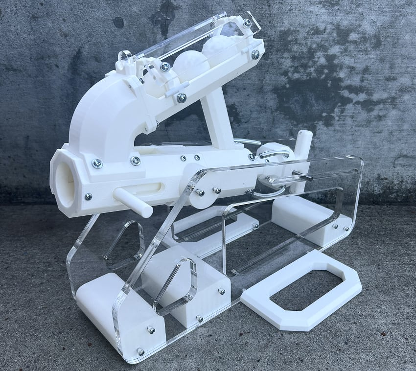
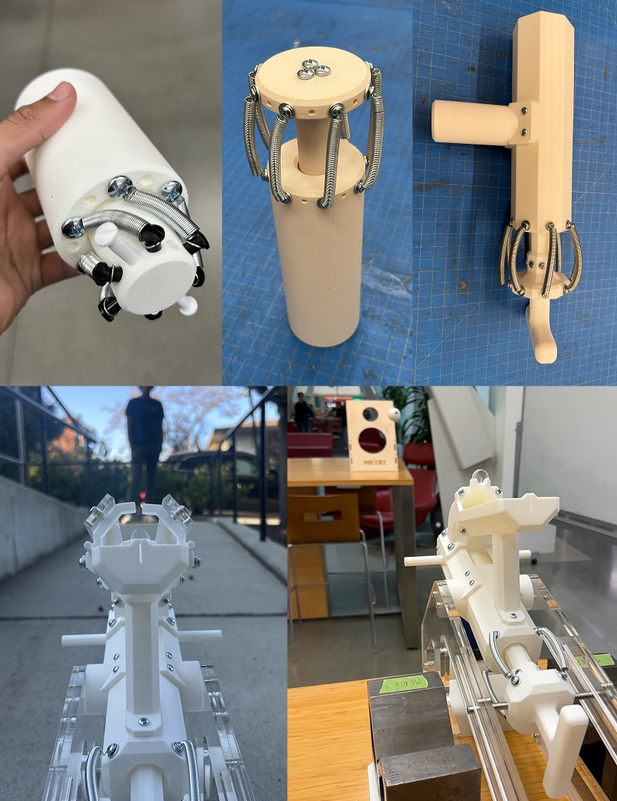
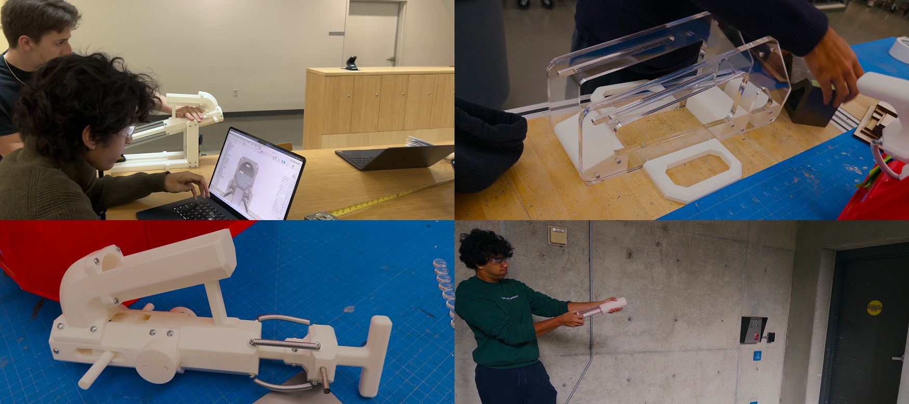

+++
title = "Projectile Launcher"
description = "Style, distance, accuracy: choose only three."
date = 2025-12-21
[extra]
icon = """<svg viewBox="0 0 2034 2114" xmlns="http://www.w3.org/2000/svg" fill="currentColor"><g fill-rule="evenodd"><path d="m524 810-.5 1-.5-1z"/><path d="m522 810-.5 1-.5-1z"/><path d="m136 793h-1v-1h1z"/><path d="m138.5 794-1.5-2 .5-1 1.5 1.5v1z"/><path d="m137 791-1-1v-1l1 .5z"/><path d="m136 789h-1v-1h1z"/><path d="m616.5 842-1.25-.25-3.875-11.75-5.75-12-.625-2.5-2-2-2.5-4.5-5-7-.5-1.5-2-2-.625-2.5-.875-2-6-10-18-24-.75-2-1.5-5v-1.75l2.25-.25 1.5 1.5v5l2 2 3.5 5.5.5 1.5 6.5 6.5 1-1h2l.5.5-2 2 .5 1.5 10 16 .875 2 .625 2.5 2 2 .5 1.5 5 7 3.5 5.5 1.375 2.5 2.125 5 6 13 1.125 4 .875 2 .5 1.5z"/><path d="m2 830.5-1.75.25-.25-2.25 2.5-2.5h2l7-7 1.5-.5 8-6 2.5-1.5 4.5-4.5v-1l1.5-1.5 9.25-7.25 22.25-25.25 12.5-12.5h1l1.5-1.5-4.5-4.5-3.25-.25-.25-1.25 1.5-1.5h1l1-1 6 6 3.25-1.25.25-1.25 2-2-.5-.5-5.25.75v-1.5l5.25-1.25 1 1 1-1 1.5 1.5-1 1-3 5-1 1 2.5 2.5 2 1 15 12 5.5 3.5 2 1 18.5 12.5 8.5 6.5 2 1 1.75.25.25-2.75 1 .5-.125 5.25-3.875-.370117-2.5-1.379883-9.5-7.5-11.5-7.5-2-1-3-3h-2l-2-2-2-1-18-14-2-1-3-3-.5.5-.25 1.25-3.25 1.25-9.5 9.5-3 5-4.5 4.5h-1l-1.5 1.5-8 10-13.5 13.5h-1l-3.5 3.5v1l-3.5 3.5-2 1-19 15z"/><path d="m122 729h-1v-1h1z"/><path d="m211.75 794.75-2.75-.370117-2-.879883-1.5-.5-2-2-2.5-.620117-2-.75-2.5-.629883-2-2-2.5-1.5-6.5-4.5-26.5-16.5-6.5-4.5-19-11-15.5-11.5-12-5-2-1-2-.25-22 6.25-6-.125-2.5-.375h-.5l.5 1h1l.5.5-1.5 1.5-1-1-3.25-.25-.75-1.75-.25-1.75 1.75-.5 10-.125 6-1.375 5-1.625 4.5-.625 2-2h2l1.5-1.5-.5-.5h-3l-.5-.5 1-1v-1l1.5-1.5 4.25 2.25.5 1.5 6.25-.75 2-2 7-1 3.5 3.5-1 1v1l-.5.5-1-1-1.5-.25h-5l-2 .625-3.5.625h-.5l.5 1 2.5.625 9 3.875 2.5 1.5 20.5 14.5 12 6 18 12 1.5.5 3 3h2l2 2 1.5.5 6.5 3.5 9.5 6.5 9.5 4.5 2.5 1.5 1.5.5 1.5 1.5zm-112.75-68.75v-1h-1v1z"/><path d="m2.5 820h-1l-1.5-1.5.5-1.5 4.5-6.5 1.25-2.5 2.75-9.5 2-2 .619995-2.5 5.380005-11.5 1.5-2.5.5-1.5 2-2 .619995-2.5.880005-2 5-8 13-15 2.875-5 .375-2.75-1.75-.75-2-.125-2.75.375-.25-1.25 1.5-1.5 1.5-.375 18-6.125 2.5-.5 3-3h1l1 1 1-1 5-1 1.5-1.5-.5-.5-1.25-.25-.25-2.25 5.5-5.5h1l1.5-1.5v-1l3.5-3.5 13.25-11.25.25-1.25-1-1 1.5-1.5 1.5-.375 3-1.25 2-.125 14 .5 6.75 1.5.25 2.25 1 1-1.5 1.5-1-1-6.5-1.375-15.5.375-.5.5 1 1v2l2 2 2.25 4.25 1.25.25 1.5 1.5v1l.5.5 1-1 2 2 1.5.25 10 2.5 3.75 1.5 1.875 6.75-.125 3-.5 2.5-.5.5-1-1-1 1h-1l-.5-.5 1-1v-2l1-1-1-1-.125-4.25-3.875-1.5-9.5-1.75-2-2h-2l-3-3-1.25-.25-.25-2.25-3-3-1-3-1.5-1.5-2.25.25-.25 1.25-8.5 8.5h-1l-10.5 10.5 1 1v3l-1.5 1.5-2.5.625-2 .875-1.5.5-2 2-2.5.5-16 5-2.5.5h-.5l.5 1h2l1.5 1.5-2 2-.5 1.5-4 7-10 12-2.5 3.5-3 3v2l-2 2-1 4-2 2-.5 1.5-2.880005 5-5.119995 12-1 2-.75 2-.75 4.5-1 1 1 1-2 2-1 2-2.5 3.5-1.5 2.5z"/><path d="m701.75 577.75-2.5.5-.25 2.25-3 3-.5 1.5-3 8-7.5 26.5.5.5 3-3 .5.5v1l-5.5 5.5-1-1-1.25-.25.375-2.75 1.875-5 2-8 1.875-5 3.125-12 3.125-8 .375-1.5 2.5-2.5 1.25-.25.25-2.25 1.5-1.5h2.5l-.5 1h-1.5l.5 1 1.25.25z"/><path d="m548.5 775-2.5-1.5-1.75-.75-2.75-6.75-1-2-.625-2-2.5-32 .625-9.5 1-1-1-1 1.625-9.5 5.375-18.5 2-2 .625-2.5 3.75-8 1.625-6.5 2-2 .5-1.5 8.5-15.5 3-4 2-3 2.5-2.5 1.25-.25.25-1.25 9.5-9.5h3l1.5-1.5-1-1 .25-1.25 3.5-1.5.875-2.75 3-7 .375-1.5 1-1-1-1 2-2 3-11-1-1 2-2v-1l-1-1 2-2-.625-2.5v-2l1.125-3 .5-2.5-1-1 1-1v-3l1-1-1-1 1-1v-1l1-1-1-1 3-3 .25-1.25 2.25-.25.5.5-1 1 1 1-.5.5h-1l-1.5 1.5-4.5 26.5-3.5 14.5-2 2-.5 2.5-2 5-2 4-.5 1.5-1 1 .5.5h4l1 1 1-1 1 1 1.25.25v1.5l-1.25.25h-.5l.5 1 23.5 4.5 4.75.375.875-2.875.875-2 3-5 3-8 1.75-8 .75-11.5 1-1-1-1 1-1 .25-1.25 2.25-.25.5.5-1 1-.5 9.5-2.125 13-.875 3-2 5-3.5 6.5-1 1 1 1-2 2 1 1v1l.5.5 1-1 1.5-.5 20-13 17-9 1.5-.5 2-2 3.5-.5 3-1.125 1.5-.375 1.5 1.5-.5.5-4.5 2.375-4 1.25-6 2.875-15.5 8.5-17.5 11.5-4 2-1.5.5h-.5l.5 1h3.5l-.5 1-6.5 1.625-2 .75-2.75.375v-2.5l5.25-3.25h.5l-.5-1-8.5-1.5-4-1-14.5-2.5-2 2-1.25-.25-.25-1.25 1-1-1.5-1.5-3.25-.25-.5-2.5-1.75.125-3 1.125-2.75.75-.25 1.25-1.5 1.5h-1l-4.5 4.5v1l-2.5 2.5-1.25.25-5.75 7.75-1.875 4-.625 2.5-2 2-6.375 12.5-1.25 4-4.875 11-.5 1.5-2 2-.375 2.5-3.125 12-2 15 2.375 39 .625 2 .875 2 .625 2.5 4 4v1z"/><path d="m363.5 815-3.25-1.25-5.625-36.75-1.875-68 2.75-22 1.25-5 1.5-4 8.75-40.5 2-2 .5-4.5 3.125-11 3.75-10 3.375-13 1.625-4 2.25-8 14.875-27 2-3 16.5-21.5 2-3 2-2 .625-2.5.75-2 .625-2.5 2-2 2-4 2.5-2.5h1l1.5-1.5 1.5-2.5 7.5-9.5 1.5-1.5 1.25-.25 16.25-20.25 1-2 8.5-8.5h1l7.5-7.5 10.5-12.5 2.5-3.5 1.25-2.25 20.25-12.25 3.5-2.5 2.5-1.5 2-2 2.5-.625 6-2.75 4-1.25 5-2.875 2-.125 2.75.875.25 2.25-2 2-.25 1.25-2.25.25-.5-.5 2-2v-1l-1.5-1.5-1.5 1.5-.25 1.25-9.25 3.25-2 2-2.5.625-2 .875-6.5 4.5-3 3-2.5.625-8 4.875-4 3-2.75 1.75-.75 1.75-2.5 3.5-11 13-6.5 6.5h-1l-8.5 8.5-1 2-5.5 7.5-20.5 23.5-2 3-2.5 2.5-1.25.25-2.25 4.25-3 3-.5 2.5-1.125 3-1.375 2.5-22 30-11.5 21.5-.5 1.5-2 2-.5 3.5-7.125 24-10.625 34-6.375 30-2.875 9 .25 99 4.25 28.5z"/><path d="m530 367 1 .5.25 2.25 3.5 1.5 2.25 4.25-1 1 1 1v1l.5.5 1-1 .5.5-.25 1.25h-2.5l-1.25-3.25-4.5-4.5-1.25-.25-.625-1.75-.625-3h1v1.5l.5.5.5-.5zm1 4v-1h-1v1z"/><path d="m528 367h-.5l-.5-.5v-.5h1z"/><path d="m527 366h-.5l-.5-.5v-.5h1z"/><path d="m526 365h-.5l-.5-.5v-.5h1z"/><path d="m523 810h-1l-.5-1-.5.5v.5h-2.5l-1.5 1.5v1l1.5 1.5 1.25.25.25 2.25-.5.5-1-1h-3l-2.5-2.5-.25-2.25-23.75.25-62 4.129883-7.5 1.370117-1 1-1-1-9.5 1.25-45 2-4.75-1.5-.25-1.25 1.5-1.5 1 1 2.5.629883 2 .870117 2 .25 5-1.370117h8l3-.629883h18l34-5 47-2.25 7-1 23.5-.5 1.5-1.5-.75-14.5-1.75-7v-88l4-20 3-8 3.125-11 6.375-15.5 2-2 .625-2.5 2.875-6 2.75-4.75 1.25-.25 1.5-1.5.5-1.5 18.5-22.5 2.5-4.5.75-1.75 1.25-.25 1.5-1.5v-1l3.5-3.5 12-10 4-4 4-1 2-2h2l2-2 6.5-3.375 3-1.125 2.5-.5 2-2 2.5-.625 5-1.75 4.5-.625 1.5-1.5v-2l-3-3v-3l-2-2-.375-1.5-3.125-8-1.5-5.5-2-2-.625-3.5-4.875-12-3-7-1.125-4-7.875-18-1-4-2-5-5-12-8-19-1-2-.5-1.5-2-2-.625-2.5-1.375-2.5-3.5-5.5-.875-2-1-3-.625-4.5-2-2-.625-2.5-.875-2-.5-1.5-2-2-3.75-15.5-1.625-4-.625-2.5-2-2-1.625-6.5-3-8-.375-1.5-2-2-.625-2.5-2.375-4.5-2-2-1-6-2-2 1.5-1.5h1l1.5 1.5-1 1 1 1 1 4 2 2 .25 2.25 1.5.5 1.25 4.25 3 3 .5 2.5 1.875 5 1.125 4 2.875 7 .625 2.5 2 2 1.625 9.5.875 3 2 5 2.875 6 .625 2.5 2 2 .625 4.5 1 3 .875 2 4 6 3.875 8 .625 2.5 2 2 .625 2.5 4 10 .375 1.5 2 2 .5 2.5 2.125 6 2.75 6 2.375 8 3.75 9 3.875 8 1.25 4 4.875 12 .5 2.5 2 2 1 5 2 2 .5 2.5 6.75 17.75 3.25 1.25 2 2 1-1 2.25.25v1.5l-2.25.25-1.5 1.5 1 1 .375 1.5 6.625 23.5 2 2 .25 1.25 5.5-.5v1.5l-3.25 1.25-1 1-1-1-1 1-1.5-1.5-2.375-4.5-3.125-10-2.125-9-.75-2-.625-2.5-1.5-1.5-1 1h-1l-2 2-5.5.75-2 .75-11 5-11 7-6.5 3.5-14 12-1.5 1.5-5.5 7.5-3.5 6.5-5.5 5.5h-1l-1.5 1.5-1.25 3.25-1.5.5-.25 1.25-5 5v2l-6 6-.5 1.5-12 27-2 8-5 15-4.875 67 2.875 33 1.75 7 .75 15.75 5.5-.75 1.5 1.5-1 2.5-.5-1-.5.5z"/><path d="m539 345h-1v-1h1z"/><path d="m529 367v-.5l-.5-.5h-.5v-.5l-.5-.5h-.5v-.5l-.5-.5h-.5l-.5-1-.5.5v.5l-3-1.375-2.5-.625-1.5-1.5-5.25-9.25-6.25-4.25-1.5-1.5-6.5-10.5-.5-1.5-3.5-3.5h-1l-6.5-6.5-3.5-6.5-.5-1.5-2-2-.625-2.5-.875-2-2.5-4.5-6.5-6.5h-1l-1.5-1.5 1.5-1.5h1l3.5 3.5.25 1.25 1.25.25 1.5 1.5 3.5 5.5 7.5 14.5 7.5 7.5 1-1 .5.5v1l1.5 1.5 1.25.25 1.5 4.5 1.5.5 1.5 4.5 1.5.5.25 1.25 2.5 2.5h1l7.5 7.5.5 1.5 2.75 4.75 1.75.75 2 1 1.5.5 4.5 4.5v1.5z"/><path d="m537.5 346-1.25-.25-.5-1.5-1.25-.25-1.5-1.5-.5-1.5-2-3-10.5-13.5-4-6-6-8-3-3v-2l-3-3-1.5-2.5-2.5-3.5-1.5-2.5-.5-1.5-2.5-2.5-3-1-1.5-1.5 1.5-1.5h2l4.5 4.5 2.5 4.5 5.5 7.5 1.5 2.5.75 1.75 1.5.5 1.25 3.25 3.5 3.5 1.25.25.5 2.5 1.5.5 1.25 2.25 2 3 10.5 13.5 2 3 2 4 .5 1.5 1 1z"/><path d="m503.75 306.75-2.75-.25-11-4.125-2.5-1.375-6-4-2.25-1.25-.5-1.5-1.25-.25-2-2h-6l-2-2-1.25-.25v-3.5l1.75.125 2.5.625 2 2 5.25 1.25.5 1.5 5.25 3.25 2 2h2l1.5 1.5.25 1.25 1.25.25 1 1 1-1 2 2h1l1 1 1-1 2 2 4.25 1.25z"/><path d="m226.5 780-4.5-4-2.5-2-2.5-.625-5-2-6.75-4.625-.5-1.5-1.25-.25-1.5-1.5v-1l-4.5-4.5-3.25-.25-.25-2.25 3-3 1.875-22.5-.25-2v-7l-.625-4.5-1-1 1-1-.25-1.5-.75-14.5-1-1 1-1-1-1 1-19-1-1 1-1 3.625-35.5 5.875-27 .5-4.5 2-2 1-7 1-1-1-1 1-1 1.625-10.5 2-7 3-10 .375-2.5 2-2 .75-5.5 2-9 7.5-21 .75-6.5 2-2 1-6 2-2 1-4 2-2 1-4 2-2 .625-2.5 2-5 .375-1.5 2-2v-2l2.5-2.5 1.25-.25.75-1.75 2.875-5 1.25-4 2.75-5 1.625-6.5 3-3 2.5-3.5 16-20 3.75-6.75 8.25-6.25 2.5-2.5.25-1.25 1.25-.25 10.5-10.5.5-1.5 5.5-7.5 1.25-2.25 9.5-7.5 14.25-19.25 1-2 2.5-2.5 1.5-.5 2-1 1.5-.5 3-3 4.25-1.25.25-1.25 1.5-1.5 9-7 2.5-1.5 1.75-.75.25-1.25 1.5-1.5 6.5-4.375 7-3 3.5-.625 2-2 1.5-.5 5.5-3.5 13.5-10.375 2.5-.625 2-2 4.5-2.5 5.5-3.5 3.5-3.5 2.5-4.5.5-1.5 1.5-1.5 3-1 2-2 2.5-.5 5-1.875 3.5-.625 2-2 3-1 4-4 .5.5v2l1 1-1.5 1.5-1.25.25-.5 1.5-3.25.25-2 2-2.5.5-5 1.875-3.5.625-2 2-3 1-1.5 1.5v2l-2 2v1l-5.5 5.5-11.5 7.5-2 1-15.5 11.5-7.5 4.375-3.5.625-3 3-3.5.625-3.5 2.375-13 10-3 2-3.5 3.5-.25 1.25-4.25 1.25-3 3-4 1-2.5 2.5-1 2-6.5 9.5-7.5 9.5-2.5 2.5h-1l-2.5 2.5v1l-2.5 2.5h-1l-2.5 2.5-3.5 5.5-1 2-.75 1.75-1.25.25-2.5 2.5v1l-4.5 4.5h-1l-3.5 3.5v1l-1.5 1.5-3 1-1.5 1.5v1l-2.5 2.5h-1l-1.5 1.5-.5 1.5-3.5 6.5-6 6v2l-3.5 3.5-1.25.25-1.25 3.25-2.5 2.5-1.25.25-2.75 4.75-.875 2-1.25 4-2.75 5-1.25 4-2.875 5-.5 1.5-5 5v2l-2 2-1 5-2 2-.375 1.5-2.125 5-1.875 4-.625 2.5-2 2-1 5-2 2-.75 6.5-4.25 12.5-2 2-.5 3.5-4.25 18-1.625 4-2.25 8-1.875 5-1 4-1.5 9.5-1 1 1 1-10 43-1 1 1 1-1.5 7.5-3 42 1.75 51-1.25 7.5 1.5 1.5 1.25.25-.375 2.75-.875 2 .5 2.5 1 2 1.5 1.5 1.25.25.5 1.5 1.25.25 4 4h3l2 2 1.5.375 4.75 1.875 1.5 3.5 1.5.5.25 2.25zm-24.5-27v-1h-1v1z"/><path d="m393.5 255-1.25-.25v-2.5h2.5l.25 1.25z"/><path d="m430 241h-1v-1h1z"/><path d="m133.5 721-2.25-.25-.25-1.25-2-2 1-1 .25-1.5 3.125-16-.125-12 2.5-17 1.75-87 3.5-25.5 2-2 1-10 2-2 2-10 2-2v-1l-1-1 1-1 .75-4.5 2.75-9 2-5 3.125-7 4.375-14.5 2-2 .625-2.5 9.875-15 .5-1.5 1.5-1.5 1.25-.25.25-1.25 1.5-1.5 1.25-.25.875-2.75 1.875-3 3-4 3.5-5.5 1-2 1.5-1.5h1l1.5-1.5.5-1.5 5-7 .75-1.75 1.5-.5.75-1.75 2-4 9-13 2-4 4-6 4.5-9.5 9.375-15.5.625-2.5 2-2 13-20 1-2 2.5-2.5 16-12 2-1 1.5-1.5 2.25-4.25 1.25-.25 2.5-2.5v-1l1.5-1.5 3-2 11-9 3-2 12-10 1.5-1.5v-1l1.5-1.5 1.5-.5 4-2 1.5-.5 2-2 2.5-.625 7-3 2.5-1.375 3-2 2-1 4.5-4.5.25-1.25 1.5-.5.5-1.5 8.5-6.5.25-1.25 1.5-1.5 1.25-.25 2.625-4.75 1.125-3 .875-3 .625-5.5-1.5-1.5-2.25-.25.75-2.25 1-2 1.5-1.5 1 1 1-1 .5.5v3l1.5 1.5h1l1-1 1 1 1-1 1 1h2l4-4 2.5-1.5 12.5-9.5 15-10 2.25-.75.25 2.25-2.5 2.5h-2l-2 2-2.5 1.5-17.5 12.5-2.5 2.5.5.5 8.5.625 6.75 1.625v1.625l-20.5-.875-.25 1.5-1.5 1.5h-1l-2-2-5.375.125-.75 5.875-1.375 5.5.5.5 1-1 5.5-.625 7-1.875 6 .25 1.5.25 1-1 .5.5v1l1 1-.5.5h-1l-1 1-1-1-6.5.625-12 3.125-3.5 1.25-3.5 3.5-.5 1.5-.25 1.875 4.5.25v1.625l-2.75.75-3.75.25-.25-2.25-.5-.5-8.5 8.5-.25 1.25-7.75 5.75-1.5.5-3 3-2.5.625-2 .875-1.5.5-2 2-2.5.625-6 2.875-1.5.5-1.5 1.5-.25 1.25-16.25 13.25-2.5 1.5-1.75.75-.25 1.25-2.5 2.5-6 4-6.5 6.5-2 4-1.5 1.5-2 1-16 12-2.5 2.5v1l-2 2v2l-4 4-.5 1.5-9 14-5 9-4 6-1.875 4-.625 2.5-2 2-.5 1.5-1 2-3.875 6-1.25 3-2.375 3.5-3 4-3.5 5.5-2 4-.5 1.5-1.5 1.5-1.25.25-.25 2.25-5 5-1 3-1.5 1.5h-1l-1.5 1.5-.25 2.25-1.5.5-6.75 10.75-1 2-.75 1.75-1.5.5-.25 1.25-2.5 2.5-1.25.25-.25 2.25-3 3-.5 1.5-1.5 2.5-4.375 6.5-.625 2.5-3 3-.625 4.5-.875 3-.5 3.5-2 2-.625 3.5-3.75 8-7.375 27-1.5 4-2.375 10-.625 2-3.75 20.5 1 1-1 1-1.5 18.5.5 3.5-1 1 1 1-1 57-1 1 1 1-.75 8.5.125 6-.875 2v6l-.5 2.5 1 1-1 1 1 1-1 1-2 18-1 1 .5.5h3l.5.5-3 3-1 3zm230.5-473v-1h-1v1z"/><path d="m467.5 201-1.25-.25-.5-2.75v-8l1.25-5.5 2-2 .625-2.5-.375-4 1.5-6 .75-2 1-2 .5-1.5 1.5-1.5h1l1.5 1.5-.625 6.5-4 12-1.75 4-.875 3-.75 9.5z"/><path d="m519 258.375-17-.125-8-1.625-7.5-.625-1.5-1.5-3-36.5-1 .5-.5 1.5-.875 2-.625 2.5-5.5 5.5h-1l-6 6-10-1-2.5-2.5-4-6-2-2-.625-3.5-.875-2-4.875-7-1.125-3-.5-2.5-2-2-.5-1.5-2.125-5-5.875-11-.75-1.75h-2.5l-.25 1.25-1 1 1 1 .5 4.5.75 4 1.5 18-1.75 15.5 1.5 1.5 7.5 1.5 5.75.625.25 2.375-1.5 1.5-1.5.5-2 1-2 .125-2.5-.625-.5-.5 1.5-1.5h2.5l-.5-1-8.375-.75-.125 7.75 1-.5v-1.5l1 .5-1.25 4.25-1.25.25-2.5-2.5v-10l-2-2-.25-1.25-4.25-2.25-3-3h-2l-1.5-1.5v-1l2.5-2.5.5.5.25 1.25 6.25 4.25 2 1 1 1 .5-.5 1.5-10.5-1-21-1.125-7 .125-4 .5-2.5 2-2v-2l-1-1 1.5-1.5 2.375.25 1.375 7.5 1.5.5 1.25 4.25 2 2v2l2 2 .5 1.5 2.125 5 2.875 5 .875 2 .625 3.5 5 5 .375 1.5 2.125 5 3.5 5.5 3.5 3.5 6 1 1.5-1.5v-1l1.5-1.5 1 1 .5-.5.25-1.25 4.25-2.25 1.5-1.5.375-1.5.625-3.5 3-3 .375-1.5 1.125-3 1-4 .5-4.5 1.5-1.5h1l1.5 1.5-1 1 2 46 2.5 2.5 11.5 2.125 18 .125 6-.875 9-2.875 4.5-.5 1-1 2.5 2.5v1l1 1-.5.5-1.5-.25-6-.125-9 2.75z"/><path d="m601.5 314-2.5-2.5v-2l-2-2-1-3-2-2v-2l-2-2v-1l-4.5-4.5h-1l-16.5-16.5v-1l-3.5-3.5h-1l-1.5-1.5-.25-1.25-1.5-.5-2.5-4.5-1.25-.25-1.5-1.5-4.25-6.25-2.75.375-1.5.375-1.5-1.5-1-50-.5-.5-1 1-1.5.5-5 2-2.5.5-1.5 1.5-1 4-2.5 2.5-1.5-1.5.625-3.5.375-1.5-.5-.5-1 1h-7l-1-1-1 1-14 1-4-4-2.25.25-.25 2.25-1.5 1.5h-2l-1.5-1.5 1-3-1.5-1.5h-2l-1.5-1.5.25-2.25 3.25-.25 3 3 .5-.5-.875-29.5-5.75-23-1.625-4-2.125-7-4.25-12-3-7-1.375-2.5-7.25-10.25-3.75-.75-4 .125-2 .875-1.5.5-5.5 5.5-.5 1.5-.875 2-2 7-.625 6.5-1 1 .5.5 15.5.625 7.75 1.625.25 3.25-.5.5-2-2-1 1-1-1-19.5-.875-.875 14.625 1.875.5 15.5-.25 1 1 1-1 1.5 1.5-.5.5-1.5.5-2 .25-15-.5-1.5-.25-.5.5 1 1-1 1v9.25h2l13-2.5 2.5-.25 2 2h2l1.5 1.5-.5.5-3.5-.5h-5l-7 1-6.75 1.75.375 2.75 3.875 10 .5 2.5 5 5 .5 1.5 2.125 5 .375 1.5 1 1-1 1v1l2 2-.5.5h-1l-1.5-1.5-3.375-5.5-.625-2.5-2-2-.25-1.25-1.5-.5-.25-1.25-3-3-.5-2.5-2.125-6-1.75-4-.875-3.75-2.25-.25-1.5-1.5 1-1 .25-1.25 1.25-.25 1 1 .5-.5 1-28-1.5-1.5h-1l-1.5-1.5.5-.5 3-1 1.5-1.5v-7l2-2 1-7 2-2v-1l2.5-2.5h1l1.5-1.5v-1l1.5-1.5 2.5-.625 4-1.75 2.75-.375.25 1.25.5.5 1-1h3l1-1 1.5 1.5v1l-2 2 4 4 2 3 3 4 1.375 2.5 1.25 3 .375 1.5 2 2 1.625 6.5 2.75 7 1.625 6.5 2 2 6.25 25.5.75 29.5 1.5 1.5h1l3 3 8-1 1-1 1 1 2.5-.5h8l4-.75.5-16.75-4.25-28-1.5-5-1.625-11-1.375-5-2.125-12-2.25-8-5.375-8.5-1.375-2.5-1.25-3-.375-1.5-4.5-4.5h-1l-2.5-2.5.25-3.25h2.5l.25 2.25 1.5 1.5 3 1 3.5 3.5.625 2.5 1.375 2.5 6.5 10.5.875 2 2.875 10 1.375 9 1.5 6 1.75 11 1.5 5 4.125 28-.375 15.75 1.875-.125 3-1.25 4.5-2.375 1.5-1.5.5-4.5 1.75-8.75 1.25-.25 1.5 1.5-1 1v8l2 2-2 2v50l.5.5 1-1 1 1h1l2.5 2.5 3.5 4.5 26.75 28.75 6.25 4.25 2.5 2.5 5.5 9.5.5 1.5 1.5 1.5 1-1 .5.5-1 6z"/><path d="m1440 802h-1v-1h1z"/><path d="m1299 790-1-.5v-3.5l1 .5z"/><path d="m1499 747h-1v-1h1z"/><path d="m1499 703h-1v-1h1z"/><path d="m1383.5 32-2.5-1.375-4-.875-14-1.625-4 .625-12-2.25-6-1.875-9-2.25-4-1.75-12-3-26-3.375-31 .375-54-10.375-15 .25-2 .25-4.5-.75-2.5-2.5 1.5-1.5h2l2 2 1.5.5 13.75.25.5-1.5 1.75.25 1.5.5 1 1 1-1 1.5.375h4l1.5-.375 2 2 1-1 3 1 1 1 1-1 3.5.625 34 7.125 34.5.25 1 1 1-1 1 1 2.5.5 3-.125 2-.25 15 2.375 7 2 8 2.875 9 2.125 6 2 4 .75 24 1.625 2 .5 4.75 1.875.25 1.25z"/><path d="m1054.5 727-2.25-.25-1.5-3.75-1.375-5-.375-2.5-2.5-2.5-6.5.625-32 5.125-98-1.75.5 1 4.5.75 5.75-.5v2.75l-15.75-1.5-4-1.125-6-2-22-10-7.5-5.375-2-2-14.5-.625-18-2.75h-8l-194 14.125-16 2.875-33 6.875-7-.125-3.75-.625-.5-1.5-1.5-.5-.25-2.25 1.5-1.5 5.25.125.25 2.375-.5.5-1-1h-1l-1-1-1.5 1.5.5.5 3.5 1.25 8 .25 10.75-1.625.25-1.375.5-.5 1 1 3-1 1-1 1 1h2l2-2 1 1 5-1 2-2 1 1 1-1 179.5-14.875 8 .375 36-1.75 27 3 3 .875 5 2 1.5.375 2 2 1-1 1.25.25.25 1.25 1 1-2 2 .5.5h1l1-1 .5.5.25 1.25 2.25.25 2 2h1l1 1 1-1 .5.5.25 1.25 5.25 1.25 2 2h4l1 1 2-2 1.5-.375 3-.125 4 .75 111 1.25 8-1.25 11-2.625 6.5-.625.5-.5-1-1-.5-3.5-1-4-4-31-1-4-7.125-40-6.875-35-4.125-13-2.75-6-1-3-2.25-9-.75-2-4.125-16-2-5-5-11-4-14-2.125-12-4-11-4.875-11-1.875-6-2.125-9-8.125-28-.875-2-2.5-4.5-3.5-3.5-.5.5-1.25 6.25h-1.5l.75-9.25-1-1 2.5-2.5h1l1.5 1.5v2l4 4 3.375 6.5 13.25 45 7.875 18 5 21 2 7 2.875 7 .625 2.5 2 2 .375 1.5 9.25 32 8.875 26 4 23 11 58 2 18 3 13 .5 4.5 2 2 1 9 2 2v1zm-182-23 .5-1h-1.5l-.5 1zm2.5 1v-1h-1v1zm31.5 13 1-1h2l.5-1h-6.5l-.5 1h.5z"/><path d="m959.5 291-2.5 1.5-60 29-2.5 1.5-7 5-7 4-7 5-10.5 5.375-5 2.125-24 10-23 11-11 7-11 6-6.5 4.5-6.5 3.375-3 1.25-24 12.875-1.5.5-2 2-2.5.625-6 2.875-13.5 7.5-5.5 3.5-4.5 2.5-5.5 3.5-2 1-6.5 4.5-2.5 1.375-10 4-8 2.25-2 .75-3.5.625-2.5 2.5v1l1 1-.5.5h-4l-.5-.5 2-2v-2l1.5-1.5 1.5-.5 7-2.75 5-1.375 2.5-.375 2-2 2.5-.5 3-1 2.5-.5 2-2 78.5-43.375 2.5-.625 2-2 6.5-4.5 8.5-4.5 11.5-7.5 1.5-.5 2-2 2.5-.625 30-13.875 6-2.125 19-8.875 28-18 42-19.875 2.5-.625 2-2 1.5-.5 17.5-9.5 12.5-8.5 8.5-6.5 30.5-18.5 2-.875 2.5-.625 2-2 2-1 23.5-15.5 23-11.875 5-2.125 2.5-1.5 6.5-4.5 4.5-2.5 29.5-19.5 12-5.875 2.5-.625 2-2 2.5-.625 10-3.875 12-5.875 2.5-.625 2-2 2-1 5.5-3.5 4.5-2.5 5.5-3.5 12.5-6.5 8.5-5.5 2-1 6-4 2-.875 2.5-.625 3-3 5.5-3.5 8-4 6-3.875 5-2 2.5-.625 2-2 1.5-.5 4.5-2.5 11.5-7.5 12-6 6-4 2-.875 2.5-.625 2-2h2l3-3 2.5-.625 2-.75 2.5-.625 2-2 1.5-.5 2-1 1.75-.75.25-1.25 1.5-1.5 16-11 2.5-1.5 17-13 12-8 1.5-.5 1.5-1.5-1-1 1.5-1.5 1.5-.375 5-2 3.75-.375v3.5l-1.75.75-2 1-1.5.5-2.5 2.5-.25 1.25-2.75.875-12 7.875-7.5 5.5-1.5 1.5v1l-1.5 1.5h-2l-2 2-7 4-7.5 5.5-2.5 1.5-9.5 7.5-5 2.875-5 2.125-6 3-1.5.5-2 2-2.5.625-2.5 1.375-5.5 3.5-6 2.875-2.5.625-2 2-1.5.5-2.5 1.5-7 5-6.5 3.5-1.5.5-2 2-2.5.5-5 2-6 4-8.5 4.5-6.5 4.5-4 2-6 4-42.5 24.5-2 2-2.5.625-25 10.875-13 6-32 21-4.5 2.5-8.5 5.5-11 5-22.5 12.5-20.5 13.5-17 9-6.5 4.5-12.5 7.5-18.5 13.5z"/><path d="m1023 68.625-2.5 1.375-5.5 3.5-6.5 3.5-3 3-2.5.625-6 2.875-7.5 4.5-10 7-12.5 7.5-3.5 2.5-6.5 3.375-3 1.25-9 4.75-8 3.125-9 4.875-5 2.125-22.5 11.5-8.5 5.5-2 1-1.5.5-2 2-2.5.625-6 2.875-11 7-27 17-4 2-1.5.5-2 2h-2l-2 2-2.5.625-4 1.875-8 5-24.5 18.5-8.5 5.5-11 5.875-5 2.125-17.75 9.75-.25 1.25-1.5 1.5-2 1-7 5-11 7-2.5 1.375-2.5.625-2 2-1.5.5-6 4-8 3.875-2.5.625-2 2-2.5.625-14 6.875-7.5 4.5-19.5 15.5-10 5.875-5 2.125-7 5-15.5 9.5-13 9-2.5 1.5-2 .875-2.75.375-.25-2.25 1.5-1.5h3l2-2 36.5-23.5 8.5-4.5 5.5-3.5 17.5-14.5 5.5-3.5 17-8.875 2.5-.625 2-2 2.5-.625 2-.75 2.5-.625 2-2 2-1 5.5-3.5 10.5-5.5 6.5-4.5 2.5-1.5 13-10 5.5-3.5 11-5.875 5-2.125 19-11 24.5-18.5 8-5 2.5-1.375 5-2.125 13-7 18-12 9-5 6.5-4.5 2.5-1.375 5-2.125 6.5-3.5 13.5-8.5 2-.875 2.5-.625 2-2 1.5-.5 32-15 2.5-.5 2-2 1.5-.5 14.5-7.5 30.5-19.5 7-3.875 3-1.25 5.5-3.375 2-2h2l2-2 1.5-.5 22-13 7-3 7-3 4-1.125 4-1.875 5-2.875 3-1.25 2.5-1.375 6.5-4.375 23-8.25 12-5 1.5-.375 2-2 4-1 2-2 2.5-.5 6-2.125 11-5.875 1.5-.5 1.5-1.5v-1l1.5-1.5 3-1 2-2 9.25-.75v1.5l-5.75 1.875-4.5 2.375-2.5 2.5v1l-1.5 1.5-1.5.5-10 5-1.5.5-2 2-2.5.5-5 2-4 1.875-2.5.625-2 2-5.5 1.625-28 10.75-2.5.625-2 2-5.5 3.5-2 .875-2.5.625-2 2-1.5.5-4 2-2 .75-5 1.375-2.5.375-2 2-1.5.375-5 2.125-13.5 7.5-2 2z"/><path d="m438 1544h-1v-1h1z"/><path d="m640 1178.380005-2.5.619995-1 1-1-1-10 1-1-1-1 1-5-1-2-2h-2l-2-2-3-1-2-2-4-1-2.5-2.5-.5-1.5-1.5-2.5-4.5-6.5-.875-2-.875-3-.125-8 1.375-6.5 2-2 .625-2.5 2.625-5.75 1.5-.5 1.25-3.25 2-2v-2l2-2 .5-1.5 1-2 .5-1.5 1.5-1.5h2l3-3h2l2-2 1.5-.5 4-2 1.5-.5 1-1 1 1 1-1 14.5-.5 7 1.129883 3 1 2 .870117 5.5 3.5 2.25 1.25.25 2.25 1.5 1.5 2.25.25.25 1.25-2.5 2.5-1-1h-1l-1.5-1.5v-1l-3.5-3.5-4.5-2.370117-3-.879883-8-1.370117h-4l-13.5 1.620117-2 2-2.25.25-.25 1.25-1.5 1.5h-3l-3 3-1.25.25-.25 1.25-2 2v2l-2 2-.25 2.25-1.5.5-.25 2.25-3 3-2.375 4.5-3 10v7l.375 2.5 3 3 1 2 2 3 1 2 2.5 2.5h3l3 3 1.5.5 4 2 2 .75 6 1.5 2 .130005 10.5-.880005 1.5-1.5v-1l3.5-3.5 4-2 1.5-1.5.375-1.5 2.125-5 2.875-5 1.125-3 .5-2.5 3-3 1-7-1-1 1-1 1-6 1-1-1-1-1-3-4.5-4.5h-1l-1.5-1.5v-1l.5-.5 1 1 4.5.75 1.75.5 3.75 5.75.875 2 .125 4-.75 3-1.5 10-1.5 4.75-1.5.5-2.75 6.75-1 2-.5 1.5-2 2v2l-2 2-1.25 3.25-5.5 3.5-.25 1.25-3.5 3.5z"/><path d="m447 1105.75-14.5 3.25-1-1-1 1-26 3-2 2h-5l-1-1-1 1-21.5-.620117-4.5.620117-1 1-1-1-2.5-.620117-24.5-.379883-1 1-1-1-106.5 4.75-4.5-.75-1 1-1-1-1 1-1.5.379883h-6l-4 1-9.75.620117-.25-3.5.5-.5 3 3 1-1 4.5-1.25 10.5-.75 2-2 4 1 1-1 1 1 15.5-1.620117 6 .370117 2-.25 2-.870117 4-.129883 4 1h3l4-.75 47.5-1.75 1 1 1-1 15-1 1-1 1 1 20.5.879883 2-.379883 2-.870117 3-.379883 37 .129883 2-.75 4-1 7-1.25 3-1 7 .120117 5-1.25 4 .379883 3-1 7.5-1.629883 2-2 1 1 4.5-.75 12.5-.25 1-1 1 1 1.5-.5 2-.870117h4l1.5.370117 2-2h3l1 1 2-2 1 1 3.25 1.25.25 2.25-1.5 1.5h-1l-1-1-1 1h-3l-1-1-1 1-2.5.5-5-.120117-3 .870117z"/><path d="m115.5 1160h-3l-2-2-1.5-.5-4-2-3.5-2.5-13-11-3.5-2.5-2-1-3-2-9.5-7.5-3-2-2-2-2.25-.25-.25-1.25-3.5-3.5h-1l-1.5-1.5-.25-1.25-1.25-.25-1.5-1.5v-2l.5-.5 1 1 3.25 1.25.5 1.5 9.25 7.25 2.5 1.5 1.5.5 1 1 1-1h2l.5.5-2 2 4.5 4.5 1.5.5 7 4 4 3 14 12 2 .880005 2.5.619995 2 2 1.25-.25.25-1.25.5-.5 1.5 1.5 1 3zm-.5-3v-1h-1v1z"/><path d="m866 1005h-1v-1h1z"/><path d="m865 1003h-1v-1h1z"/><path d="m45.5 1099-2-1-2.5-2.5-.5-2.5-2-7-8.125-49-3-9-4.755005-10-1.619995-6.5 1.5-1.5 1 1 4 1h.5l-.5 1h-1l-1.5 1.5.625 3.5 4.75 10 3 10 8.25 49 .875 3 .5 3.5 2.5 2.5 1-1 1.5 1.5zm-20.5-85v-1h-1v1z"/><path d="m711.5 929h-4.5l.5-1h4.5z"/><path d="m720.5 928h-5.5l.5-1h5.5z"/><path d="m741.5 928-19.5-1 .5-1h23.5l-.5 1h-3z"/><path d="m831.5 921-26.5 1.629883-9 1.120117-31 1.75-10 1.25-9-.75.5-1 12.5-.620117 34.5-3.379883 1 1 1-1 3.5-.620117 2 .120117 2 .379883 21-1.75 2 .370117 2 .129883 2.75-.879883.25-1.25 3.5-3.5h2l2.5-2.5.25-1.25 2.25-.25.5.5-1 1-.25 2.25-1.25.25-2 2h-2l-1.5 1.5v1z"/><path d="m646 934h-1v-1h1z"/><path d="m679 931h-1v-1h1z"/><path d="m696.5 930h-1.5l.5-1h1.5z"/><path d="m597.5 937h-2.5l.5-1h2.5z"/><path d="m618.5 936h-3.5l.5-1h3.5z"/><path d="m612.5 936h-13.5l.5-1h13.5z"/><path d="m637.5 935h-5.5l.5-1h5.5z"/><path d="m320.5 940h-2.5l.5-1h2.5z"/><path d="m327.5 939h-3.5l.5-1h3.5z"/><path d="m351.5 937h-2.5l.5-1h2.5z"/><path d="m586 936.379883-113.5.620117-1 1-1-1-141.5 3.629883-13 1.870117-10 .5.5-1 8.5-.5 21-2.5-.5-1h-4.5l.5-1h28.5l-.5 1h-4.5l.5 1 49-3 1 1 1-1 10.5-.870117 5 .75 173-.879883-.5 1zm-207.5 2.620117.5-1h-7.5l-.5 1zm3.5 0v-1h-1v1zm2.5 0 .5-1h-1.5l-.5 1z"/><path d="m301 942h-1v-1h1z"/><path d="m281 942h-1v-1h1z"/><path d="m279 942h-1v-1h1z"/><path d="m311.5 941h-3.5l.5-1h3.5z"/><path d="m254 946.629883-21 3h-4l-23.75-2.629883-.25-1.5 1.5-1.5 22.5 3.629883 4-.25 1.5-.379883 1-1 1 1 69.5-4-.5 1z"/><path d="m613.5 923-1.5-1.5 1-1 .5-5.5 1.125-6-.125-3-2.75-11v-12l.875-3 2.625-5.75 1.25-.25 1.5 1.5-3 3-1.125 3.5.125 15.5 2 2-1 1v1l2 2-1 1 1 1-1.5 10.5-1.5 6.5z"/><path d="m385 893.75-78 3-12 1.5-28 .5-3.5 1.25-1 1-1.5-1.5.25-2.25 2.25-.25 1 1 1-1 3.5-.5 22.5-.5 1 1 1-1 190.5-8.5 6-.870117 72.5-2.629883 1 1 1-1 37.25-2.120117 1.625-4.879883 2.25-28-1.375-10 .75-10.5-1-1 1.5-1.5h1l1.5 1.5-1 12 1 1-1 1 1 1-.75 27.5-1.25 9.5 2 2-.25 1.25-3.75.879883-2 .620117-25 2.629883-21.5.120117-1 1-1-1-35.5 2.879883zm222-64.75v-1h-1v1z"/><path d="m249.5 920-.5-.5-.625-3.5-.75-2-.625-2.5-2-2-.625-2.5-10.875-28-1-4-4.875-12-3.25-11-7-21-6.875-16-1.875-4-.625-2.5-1.5-1.5-1.25-.25v-3.5l1.25-.25.5.5-1 1 .5.5 2.25.25 1.875 4.75.375 1.5 3 3 .5 2.5 2 5 4 9 1 4 11.125 33 13.375 36.5 2 2v2l2 2 .625 2.5 2.375 4.5-1.5 1.5h-1z"/><path d="m258.5 926-1.5-1.5v-40l-2-2-.5-1.5-6-15-15-51-2-5-6-13-1.75-5.75-1.25-.25-1.5-1.5-1-3-1-1 1.5-1.5 2.25.25.75 1.75 2.875 5 1.125 3 1.125 4 3.875 8 .5 1.5 2 2 .5 3.5 17 56 3.125 8 .375 1.5v.5l1-.5 1-3-2-2 2.5-2.5h1l1.5 1.5-1 9 1 1-1 1v41z"/><path d="m204.75 941.75-3.25-.75-2.5-2.5-1-3-2-2-5.625-24.5-1.625-4-2-7.75-1.5-.5-2.875-6.75-1.375-2.5-3.5-5.5-.875-2-.625-2.5-2-2-.5-2.5-2.125-6-2.75-6-2.125-8-2.875-7-2.125-8-3-8-2-8-1.125-3-.375-1.5-1.5-1.5h-1l-1.5-1.5 1-1-1-4 1.5-1.5 1.5 1.5v1l4 4-1 1 .5 1.5.875 2 3.125 11 1.875 5 2.625 10.5 2 2 1.5 6.5 2.125 7 3.875 10 .5 2.5 2 2 .625 2.5.875 2 5 8 2.75 6.75 1.5.5 2.875 9.75 3.875 12 2.125 11 1 3 2.875 5 .75 1.75 3.25 1.25.5.5-1 1z"/><path d="m130.5 1112h-20l-1-1-1 1-1-1-3.5-.620117-2-.879883-4.5-2.5-2.5-2.5-1-2-3.5-5.5-5.875-11-.625-2.5-2-2v-2l-3-3-.25-2.25-1.5-.5-2.625-6.75-2.125-7-.5-3.5-2-2-.5-1.5-2-5-2.25-9-2.625-7-1.375-7-1.625-5-.625-4.5-2-2-.625-6.5-7.125-41 .5-6-2.75-54.5-1-1 1-1 1.75-15.5 1.625-4 1-4 3.25-15 2.75-6 .625-3.5 2-2 .625-2.5 3-7 .375-1.5 2-2 .75-4.5.75-2 5-7 1-2 .5-1.5 6.5-6.5 5.5-3.370117 3-1.25 5-2.879883 2-.75 4.5-.75 1 1 1-1 1.5.25 5 1.379883 3-.25 2-.75 2.5-.629883 2 2 1.25.25.25 1.25 3 3 1 7 3 3 .25 1.25 1.5.5 1.25 3.25 4.5 4.5 3.5.629883 1.75.620117.25 1.25 1.5 1.5h1l1.5 1.5.5 3.5 1 4 .5 4.5 2.5 2.5 1.5.379883 3.5.620117 1.5 1.5 1.25 4.5.75 8.5 2 2 6.75 31.5-.125 7 3.375 8.5 2 2 3.5 28.5 1.125 6-.375 6 .75 8.5 1 1-1 1 .5 3.5v10l-1 4-1.125 3-.375 1.5-1 1 1 1v4l-1 1 1 1 .5 2.5v4l-.5 2.5 1 1-1 1-1 11-1 1 1 1-.75 25.5-1 5-2.25 7.5 1 1-1 1-1.625 9.5-1.375 4.5-3 3-.625 2.5-1.375 2.5-7 9-1.5 1.5-2.5 1.5-4.5 3.5-3 2-3 3-2.5.5-3 1.129883-1.5.370117zm-17.5-300v-1h-1v1zm18 294.379883 5-2 4.75-2.629883.5-1.5 2.75-1.75 4-3 2.75-1.75 5.75-7.75 6-10 .75-2 2.5-14 3.25-11.5-1-1 1-1-1-1 .5-1.5v-2l-.25-2 .125-18 1.125-8-.5-16.5 1-1-1-1 .5-2.5 1-3 .75-4-2.25-43.5-1-1 1-1v-1l-1-1 1-1-1-1-1-7 1-1-1-1v-5l-2-2-.375-1.5-2-5-.875-3-.75-8.5-1-1 1-1-.75-5.5-.625-2-4.375-18-.25-1.5-2-2-1-10-2.5-2.5-3-1-5.5-5.5-1-10-3-3-.25-1.370117-4.25-.129883-6.5-6.5-.25-2.25-1.5-.5-.25-1.25-1.5-1.5-1.25-.25-1.625-4.75-.75-4.75-1.625-.5-.25-1.25-1.5-1.5-3 1-2 2-2.5-2.5-.25-1.5-11.75.879883-5 2.5-3 1.25-4.5 2.370117-6.5 6.5-.5 1.5-1 2-4.75 7-1.375 5-.375 2.5-2 2v2l-2 2-.375 1.5-7.125 18-3.25 16-1.5 4-.75 45.5 1 1-1 1 .625 14.5 1 8-.25 7 3.375 22 .5 2 .75 5.5 2 2-1 1 .625 4.5 2.875 11 .5 3.5 2 2 .5 3.5 7.125 26 .875 2 .5 1.5 2 2 .625 3.5 3.625 12.75 1.5.5 1.25 3.25 3 3 .625 2.5 1.75 4 .875 2.75 1.5.5.25 2.25 2 2 .5 1.5 3.5 6.5 6.5 6.5h1l1 1 1-1 3 1 1 1 1-1h14l1-1 1 1z"/><path d="m20.5 987-1.380005-.25-1.119995-159.25-1-1 1.5-1.5 1.5 1.5-.75 9.5.75 5.5-1 1 1 1 2 25-1 1 1 1-1.630005 106.5 1 3 .630005 5.5z"/><path d="m1225.5 1713-2.25-1.25-.25-3.25-1-1 .5-.5 1.5-.25 1-18.25 1-1-1-1v-2l2.5-2.5h2l1.5 1.5v1.5l1-.5.5-3.5 1.125-3 1.375-2.5 4-5 12.5-14.5 1-2 .5-1.5 1.5-1.5 2.25.25.25 1.25 1 1-1 1-.5 1.5-1 2-13 15-2.5 3.5-3 3-1 6-2 2-.25 2.25-1.25.25-1 1-1-1-1.375.25-1.125 16.25 1 1-1 1-1 3z"/><path d="m1172.5 1548-1.5-1.5.5-.5 1.25.25.25 1.25z"/><path d="m1900.5 1537h-2l-2.5-2.5-.25-1.25-9.25-7.25-5-5-5-1-2.5-2.5-1.25-3.25-3.25-1.25-3-3-6-1-2-2-1.5-.5-2-.869995-3.5-.630005-4-4h-4l-3-3-2.5-.5-13.5-3.5-2-2-7-1-4-4-7-2-2-2h-2l-2-2-1.25-.25-.25-2.25 1.5-1.5 1 1 2.5.630005 2 .869995 1.5.5 2 2 3.5.630005 2 .869995 1.5.5 3 3 6.5 1.630005 4 1.619995 14.5 3.75 3 3h4l4 4 2.5.5 3 1.130005 1.5.369995 2 2 6 1 3 3 3 1 1.5 1.5v1l3.5 3.5 1.5.5 2 1 7.5 5.5 2 1 1.5 1.5v1l3.5 3.5 3 1 2.5 2.5v1z"/><path d="m1662.5 1756h-2l-3 3-1.5.5-2 1-11 7-1.5.5-2 2h-2l-2 2-2.5.630005-4.5 2.369995-1.5 1.5v1l-1.5 1.5h-2l-4 4-1.25.25-.25 1.25-1.5 1.5h-3l-2-2h-2l-2-2-3.5-.619995-5 1.25h-3l-1.5.369995-1 1-1-1-1.5-.369995-3-.25-5.5.619995-1-1-1 1-2.5.5-5.75-.25-.25 1.25-1.5 1.5-7-1-2-2-4-1-1-1-1 1h-2l-2-2-1 1-2-2-5.5-1.5-8-.119995-2.5.619995-2-2-1 1-8.5-.75-4.5-2.25-3-3-3.25-.25-.5-1.5-1.25-.25-1.5-1.5v-1l-3.5-3.5h-1l-3-3h-2l-1 1-1.5-1.5-.25-1.25-2.25-.25-1.5-1.5v-2l-4.5-4.5-8.25-2.25-.75-1.75-2-4-.5-1.5-2.5-2.5-6-1-1.5-1.5-1-3-3.5-3.5h-2l-1.5-1.5-.25-1.25-4.5-1.5-.5-1.5-1.25-.25-1.5-1.5-.25-1.25-1.25-.25-1.5-1.5-.25-2.25-1.75-.75-6.5-4.5-1.5-1.5-.25-1.25-1.25-.25-1.5-1.5v-1l-1.5-1.5-5.25-1.25-.5-1.5-3.75-1.619995-2.5-.630005-1.5-1.5.625-3.5 1.75-5 2.625-12.5 2-2-1-1 1-1v-3l1.5-1.5h1l1-1 2.5 2.5v3l-2 2-1 3-1 1 1.5 1.5 2-2h4l3-3 1.5-.5 15-7 3.5-.5 3-3h4l3-3 1.5-.5 2-.869995 2.5-.630005 5-5 2.5-.619995 10-4.75 2.5-.630005 3-3 1.5-.369995 4.75-1.880005.5-1.5 2.75-.75 3-1.119995 1.5-.380005 1.5-1.5v-1l1.5-1.5 2.5-.619995 2-.880005 6-4 16-7.119995 6-3.880005 1.5-.5 3.5-3.5 1.25-3.25 5.25-1.25 3-3 2.5-.619995 2-.75 2.5-.630005 3-3 1.5-.5 4-2 7-5 6.75-2.75.25-1.25 2.5-2.5h3l1.5-1.5v-1l2.5-2.5 2.5-.619995 9-4.75 5-2 2.5-.630005 2-2 2.5-.369995 6.75-1.880005.5-1.5 2.75-.75 3.5-.5 2-2 4.25-1.25.25-1.25 1.5-1.5h3l2-2 2-1 3-2 2-1 1.5-1.5.25-1.25 3.5-1.5 3.75-5.75.75-1.75 2.25-.25 2-2 1.25-.25.25-1.25 1.5-1.5h2l2-2h1l4.5-4.5 1-5 1.5-1.5 1.25-.25.25-1.25 1.5-1.5h2l2.5-2.5v-1l1.5-1.5h3l2-2 2.25-.25-.75-8.25-1-1 1-1v-14l-.5-.5-1 1-2.25.25-.5 1.5-1.75.75-5.5 3.5-13.25 10.25-.25 1.25-1.5 1.5h-1l-2.5 2.5v1l-1.5 1.5-1.25.25-.5 1.5-1.75.75-6 3.880005-2.5.619995-2 2-9.25 7.25-.25 1.25-1.5 1.5-3 1-3 3-6.5 1.5-7 2.130005-2 .869995-7 5-4 2-3.5 2.5-10.5 8.5-11 5-5 3-7 4.880005-2.5.619995-2 2h-2l-2 2-1.5.5-7.5 5.5-9.5 5.5-17.75 6.75-.25 1.25-2.5 2.5-1.5.5-6 4-21.5 12.5-2 2h-2l-2 2-2.5.630005-5 2.869995-2 .880005-2.5.619995-3 3-4 1-2 2-4.5 2.5-6 4-4 2-5.5 3.5-2 2-4.25 1.25-.5 1.5-11.25 6.25-2 2h-2l-2 2-1.5.5-2 .880005-3.5.619995-2 2-3.25.25-.25 2.25-1.5 1.5h-1l-.5-.5 1-1-1-1v-3l1.5-1.5 3.5-.619995 8.75-3.630005.5-1.5 2.75-.869995 4.5-2.380005 3-3h2l2-2 5.5-3.5 2-1 6-4 6.5-3.5 11.5-7.369995 2.5-.630005 4-4 5-1 4-4 3.5-.619995 4-1.880005 8-5 4.5-2.5 5.5-3.5 4-2 6.5-4.5 2-1 1.5-1.5.25-1.25 1.75-.75 6-2.869995 4-1.130005 5-2 7-3.869995 2.5-.630005 2-2 7.5-5.5 4-2 1.5-.5 2-2 2.5-.619995 7-4.880005 4-2 1.5-.5 2-2 2.5-.619995 5-2 14-10.880005 5-3 7-4.869995 3-1.130005 11-3.25 5-2.75 1.75-.75.25-1.25 1.5-1.5h1l3.5-3.5.25-1.25 5.75-3.75 9-5 1.75-.75 2.25-4.25 1.5-1.5 3-1 1.5-1.5.25-1.25 3.75-2.75 10.5-8.5 3-2 2-1 3-3 4-1 2-2 2.25-.25.25-2.25 3-3 1.25-4.25 1.25-.25 1-1 .5.5v1l.5.5 1-1 1 1 20.5-4.619995 3 .25 2-.130005 2-.869995 4-1 14.5.369995 1 1 1-1 4.25 1.25.5 1.5 1.75.630005 3.5.619995h.5l-.5 1-1.5.380005h-3l-4-1.630005-9-1.25-10 .25-12 2-5 1.5-7.5.75-.5.5 1 1v1l-3.5 3.5-4 1-2.5 2.5-.25 1.380005-4.25.119995-1.5 1.5v24l.5.5 1-1h1l1-1 3 3h2l2-2 2.5.630005h2l2.5-.630005 2 2h9l1-1 1 1 1.5-.5 2-1 2-.75 4.5-.75 1 1 1.5-1.5v-1l1.5-1.5 3.5.630005 1.5.369995 1 1 1-1h1l1-1 2 2 3 1 1 1 1-1 1 1 1.5-.369995 3.5-.630005 2 2 3.5.630005 1.5.369995 1 1 1-1h3l2 2 1-1 1.5-.25.375-18.75-1.875-11 .125-6 1.375-4.5-2-2 1.5-1.5 1.25-.25.25-1.25 2.5-2.5h1l1.5 1.5-1 1v1l-2 2-1.25 5.5-.125 9 1.625 8-.25 17.5 1 1-2 2 .5.5 2.5-.5 3-1.119995h2l2.5.619995 2.5 2.5v2l1.5 1.5 1-1h2l1.5 1.5.25 1.25 1.25.25 1.5 1.5.25 1.25 6.75 2.880005 4-.130005 2 .880005 3.5.619995 3 3h1l3 3 4 1 2 2 1-1h2l2 2h4l1.5 1.5v2l3.5 3.5 1.5.5 2 .880005h3l1.5-.380005 4.5 4.5v1l1.5 1.5 1.5.5 4.5 2.5 1 1 1.5-1.5.5-1.5 4.5-6.5 3.5-3.5h1l1.5-1.5.25-2.25h2.5l.75 1.75.25 1.75-4.25 2.25-2.5 2.5-3.5 5.5-1.875 4-.375 2.75 1.5.5 3.5 5.5 1.25.25 1.5 1.5.625 3.5 1.625 3.75 1.25.25 1 1 .5-.5 1.75-40.5.25-1.5 1.5-1.5 1.5 1.5-.875 40.5-1.125 5.5-3.5 3.5-2.25-.25-.5-1.5-2.25-.25-21 21-4 1-6.5 6.5v1l-5.5 5.5-1.25.25-.25 1.25-1.5 1.5-6.5 3.5-6 3.880005-5 2.119995-11 5.880005-3 1.25-1.5.369995-2 2h-2l-2 2-1.5.5-5.5 3.5-2.5 2.5v1l-3.5 3.5-4.5 2.5-1.5.5-2 2h-2l-2 2h-1l-6.5 6.5v1l-1.5 1.5-1.5.5-2.5 1.5-21 18-5.5 3.5-14 10-9.5 5.5-15 11-2 1-1.5 1.5v1l-10.5 10.5-1.25.25-.5 1.5-2.75 1.75-4 3-3 2-2 .880005-2.5.619995-2 2-3 1-4.5 4.5v1zm50.5-276.619995 1.5-.380005.5-1-4.75.130005v1.619995zm-51 271.119995v-1l4.5-4.5 4.5-2.5 2-.869995 2.5-.630005 2-2 2.5-1.5 3.5-2.5 2.25-1.25.5-1.5 1.25-.25 10.5-10.5v-1l1.5-1.5 2-1 11.5-8.5 2.5-1.5 3-3 2.5-.619995 5-2.880005 7.5-5.5 2.25-1.25.5-1.5 1.75-.75 6.5-4.5 2.5-1.5 14.5-12.5 5-4 3-2 2.25-1.25.25-1.25 7.5-7.5h1l2-2h2l2-2h2l3-3h1l2.5-2.5v-1l2.5-2.5h1l4-4h2l2-2 3-1 2-2 2.5-.619995 2-.880005 1.5-.5 2-2 2.5-.619995 8-3.75 2.5-.630005 4-4 1.5-.5 4-2 1.5-.5 1.5-1.5.25-1.25 1.25-.25 5.5-5.5v-1l3.5-3.5h1l4-4h2l4-4 1.25-.25.25-1.25 3.5-3.5h1l6.5-6.5v-1l1.5-1.5 4-2 1.5-1.5-1-1-.5-1.5-2.5-4.5-2-2v-2l-3.5-3.5-.5.5-.375 1.5-1.125 3-1.75 5.75h-1.625l.625-7.75.75-3 .25-2.75-1.25-.25-1.5-1.5-.25-1.25-4.25-2.25-3.5-3.5v-1l-.5-.5-1 1-1-1-2.5-.5-3-1.119995-1.5-.380005-4.5-4.5-.25-1.25-2.25-.25-2-2h-5l-2-2-2.5-.619995-5-2.880005-1.75-.75-.5-1.5-2.25-.25-2-2h-3l-1 1-1-1-1.5-.369995-3-1.25-2.5-1.380005-3.5-2.5-2.5-1.5-1 1-6-6h-1l-1-1-1 1-1-1-1 1-3 1-2-2-11.5-1.619995-5.5-1.380005-1-1-1 1h-1l-1 1-2-2h-4l-3-3-1 1-6-1-3 3-3.5-.619995-2 .119995-2 1-2 .630005h-16l-2 .25h-3l-1.5-.380005-2 2h-4l-1-1-1 1h-1l-1-1-1 1h-3l-2 2-2.25.25-.25 1.25-1.5 1.5-3 1-2.5 2.5-.25 1.25-1.5.5-1.25 4.25-6.5 6.5-1.5.5-2 1-1.75.75-.25 1.25-1.5 1.5-3 1-1.5 1.5-.5 1.5-4.75 6.75-2.25.25-3 3-1.5.5-4.75 2.75-.5 1.5-4.25 1.25-3 3h-3l-4 4h-4l-2 2h-2l-2 2-5.5.75-12 4.880005-1.5.369995-4 4-3.25.25-.25 1.25-2.5 2.5-4 1-1.5 1.5-.25 1.25-1.25.25-3 3h-4l-4 4-1.5.5-10 6-5 2.130005-7 3.869995-1.75.75-1.5 3.5-1.25.25-3 3h-2l-3 3h-1l-2 2-5 1-2 2-2.5.630005-4 1.75-2.5.619995-3 3h-1l-2 2-4.25 1.25-.25 1.25-2.5 2.5-5.5 1.630005-5.5 3.369995-1 1-1-1-2 2h-1l-2 2-2.5.630005-10 4.75-2.75.869995-.25 1.25-2.5 2.5-1.5.380005-3 1.25-4.5 2.369995-3 3-1-1h-2l-2 2-1.5.25-5 1.5-4 1.630005-2.5.619995-2 2-2.5.630005-6 3.75-3.5.619995-2 2h-1l-1 1-1-1-1.5 1.5-.25 1.5-1.5 5-.25 1.5-1 1 1.5 1.5 5.5 3.5 4 2 1.75.75.25 1.25 4.5 4.5 1.25.25.25 1.25 1.5 1.5 4 1 1.5 1.5.5 1.5 2.5 4.5 1.5 1.5h1l2 2h2l2 2 1-1 2.5 2.5.25 1.25 1.25.25 1.5 1.5 1.25 4.25 3.75-.369995 2.5.619995 2.5 2.5 3.5 6.5.75 1.75 4.25 1.25 1 1 1-1h1l2.5 2.5v1l1.5 1.5 1.25.25.5 2.5 1.25.25 3 3 2.5.630005 3 1.869995 10.5 8.5 2.5 1.5 2 .880005 3.5.619995 2 2h1l1 1 1-1h3l1-1 1 1 18.5 2.630005 10 3.869995 3 .880005 13.5-.380005 1-1 1 1 1-1h11l1 1 1-1 12.5-.369995 5 1.619995 4.5.75 2-2 2-1 4-3 3-2 3-3 2.5-.619995 9-4.880005 11-6.869995 2.5-.630005 3-3 2-.5z"/><path d="m1278.5 1636-1.5.380005-8 3-2.5.619995-1.5 1.5v1l-1.5 1.5h-3l-4 4-2.5.630005-2 .75-2.75.369995v-2.5l1.75-.75 4.75-2.75.25-1.25 1.5-1.5 4-1 4-4 2.5-.619995 6-2 5-2.880005 2-.869995 2.5-.630005 2.5-2.5.25-1.25 1.25-.25 2-2h3l1.5-1.5v-1l3.5-3.5h2l6-6 12-8 2-2 4-1 1.5-1.5v-1l1.5-1.5 1.5-.5 2-1 1.5-.5 3-3 6.5-1.619995 2-.880005 1.5-.5 2-2 5-1 6-6 1.5-.369995 3-1.25 1.5-.380005 1.5-1.5.25-1.25 1.75-.619995 3.5-.630005 1.5-1.5v-1l2.5-2.5h2l5-5 5-1 3-3 5.5-3.5 2-.869995 2.5-.630005 3.5-3.5.25-1.25 4.75-1.75 2.5-.5 3-3 6-1 2-2 3.5-.619995 10.5-6.380005 2-2h2l2-2 5.5-3.369995 3.5-.630005 2-2h4l3-3 1.5-.369995 3-1.25 13-7.880005 10-7.869995 2.75-.880005.25-1.25 1.5-1.5 5.5-3.369995 3-1.25 7-4.880005 2-.869995 3.5-.630005 2-2 12.5-6.5 1.5-.5 3-3 2.5-.619995 5-2.75 3-1.25 4.5-2.380005 2-2h3l5-5 7.25-2.25.25-1.25 2.5-2.5 6.5-.75 5-2.619995 8-2.25 7-3 1.5-.380005 3-3 2.5-.5 3-1.119995 1.5-.380005 4-4 8-2 1.5-1.5v-1l1.5-1.5 4-1 3-3 5.5-3.5 1.5-.5 2.5-2.5.25-1.25 4.75-1.869995 1.5-.380005 4-4 4-1 1 1 4-4 1.25-.25.25-1.25 1.5-1.5 1.5-.5 8-5 2-.869995 2.5-.630005 4-4h5l2-2 1.5-.369995 5-2.130005 7-3 8-2.25 7-2.75 2.5-.5 1 1 1.5-1.5 1.25-3.25 1.75.25 2 1 1.75.75-.25 1.75-.5 1.5-1.5 1.5h-2l-2 2h-7l-2 2-13 3-2 2-3.25 1.25-.25 1.25-1.5 1.5-1.5-.5h-2l-2.5 1.5-2.5.5-1.75-.25-.25 1.25-1.5 1.5h-1l-2 2h-4l-2 2-5.5 3.5-1.75.75-.25 1.25-2.5 2.5h-1l-3 3h-5l-3 3h-1l-2 2h-2l-5 5h-2l-3 3h-1l-4 4-4.25 1.25-.25 1.25-1.5 1.5h-1l-2 2-6 1-4 4-5.5 1.630005-4.5 2.369995-2 2-3.5.630005-7 2.869995-4 1.130005-2 .869995-1.5.5-2 2h-6l-1.5 1.5-.25 1.25-6.75 2.880005-7.5 5.369995-1 1-1-1-1 1-4 2-2 2-2.5.630005-6 2.869995-5.5 3.5-2.5 1.380005-5 2.119995-2.5 1.5-3.5 2.5-3 1.75-4.5.75-4 4h-1l-3 3h-3l-2 2h-1l-1.5 1.5v1l-1.5 1.5h-3l-7 7-2 1-10.5 6.5-1.5.5-2 2-2.5.630005-5.5 3.369995-1 1-1-1h-1l-2 2-5 1-2 2-6.5 3.5-6.5 4.5-2.5 1.5-1.5.5-2 2h-3l-2 2-1.5.380005-3.5.619995-2 2-3 1-1 1-1-1-1 1-2.25.25-.25 1.25-3.5 3.5-1.5.380005-3 1.25-3.5 2.369995-4 3-2.5 1.5-2 .880005-2.5.619995-5 5-2.25.25-.25 1.25-3.5 3.5h-1l-1 1-1-1-1.25.25-.25 1.25-1.5 1.5h-1l-2 2-4 1-4.5 4.5-.25 1.25-1.75.5-4.5.75-2 2-1.5.5-2 .880005-6.5 1.619995-2 2-4.5 2.5-1.75.75-.25 1.25-3.5 3.5-1.5.380005-3 1.25-1.5.369995-4 4h-2l-4 4h-1l-6 6h-2l-2.5 2.5v1l-3.5 3.5h-1l-1-1-1 1-1.25.25-.25 1.25-4.5 4.5h-4z"/><path d="m1600 1168-5.5-1-1.5-2h.5l.5-.5v-.5h1.5l.5.5-1 1 .5.5 3-1 .5.5-1 1 .5.5h1.5z"/><path d="m1593 1165h-.5l-.5-.5v-.5h1z"/><path d="m1593 1164v-2h.5l.5.5v1.5z"/><path d="m1592 1162v-1h.5l.5.5v.5z"/><path d="m1588 1159 1 .5-1 .5z"/><path d="m1587 1159v-1h.5l.5.5v.5z"/><path d="m1586 1158v-.5l.5-.5.5 1z"/><path d="m1592 1164-3-1.5-1.5-.5-3-3-4-1-1.5-1.5.5-.5h1.5l.5 1 .5-1h3l-.5 1h-1l-.5.5.5.5h2.5v.5l.5.5h.5v.5l.5.5h.5l.5 1 1.5-.5 2 .5-1 .5.5.5h.5z"/><path d="m1581 1156v-.5l.5-.5.5 1z"/><path d="m1581 1155h-1v-1h1z"/><path d="m1578.5 1154h-1.5l.5-1h1.5z"/><path d="m1574 1153h-1v-1h1z"/><path d="m1571 1152h-1v-1h1z"/><path d="m1578.5 1156-3.5-.5-4-1-6.5-2.5-1.5-1.5.5-.5 1.5.5 7 3 6.5 1.5h.5z"/><path d="m1435 1183-1-.5v-32.5l1 .5z"/><path d="m1628 1143v-1h.5l.5.5v.5z"/><path d="m1627 1142v-1h.5l.5.5v.5z"/><path d="m1624 1139v-1h-1v1zm5 4h1.5l2 2 1.5.5 8 3.880005 4 1.119995 6 1 12 3.25 7 3.630005 3.5.619995 2 2 5.5 1.380005 11 2.119995 5.75.630005 2.5 4.619995 1.5.5.25 1.25 4.5 4.5 1.5.380005 13 5.119995 11 2.880005 3 1.25 5 2.869995 1.5.5 1.5 1.5-.5.5-1.5-.369995-3.5-.630005-3-3-2.5-.619995-2-.75-17.5-4.630005-2-2-2.5-.619995-2-.880005-1.5-.5-3.5-3.5-.25-1.25-1.5-.5-1.25-3.25-1.5-1.5-1 1-1-1-17.5-3.5-10-4-2-1-2-.75-6-1.369995-5-1.630005-11-2.5-2-.75-10.5-5.5-8.5-6.5-1.5-.5-1.5-1.5.5-.5 1.5.5h2l1.5-.5 3.5 4-1 .5.5.5h.5v.5l.5.5h.5l.5 1z"/><path d="m1621 1137h-1v-1h1z"/><path d="m1618 1135 1 .5-1 .5z"/><path d="m1616 1135 .25-.75 1.75.75z"/><path d="m1618 1136-.5 1-10-1-1.5-1.5.5-.5 9.5 1v.5l.5.5z"/><path d="m1610.5 1134h-2.5l.5-1h2.5z"/><path d="m1605.5 1134h-2.5l.5-1h2.5z"/><path d="m1608 1133h-1v-1h1z"/><path d="m1605 1132h-1v-1h1z"/><path d="m1602.5 1131h-1.5l.5-1h1.5z"/><path d="m1562.5 1150h-1.5l.5-1h1.5z"/><path d="m1560.5 1149h-2.5l.5-1h2.5z"/><path d="m1557.5 1148h-1l-1.5-1.5.5-.5h1l1.5 1.5z"/><path d="m1555 1146h-1v-1h1z"/><path d="m1553.5 1145h-1.5l.5-1h1.5z"/><path d="m1551.5 1144h-1.5l.5-1h1.5z"/><path d="m1549.5 1143-2.5-2.5.5-.5h1l1.5 1.5v1z"/><path d="m1546.5 1140h-2.5l.5-1h2.5z"/><path d="m1543.5 1139h-1.5l.5-1h1.5z"/><path d="m1541.5 1138h-2.5l.5-1h2.5z"/><path d="m1538.5 1137h-3.5l.5-1h3.5z"/><path d="m1602.5 1133-6-1h-.5l.5-1 6 1h.5z"/><path d="m1595.5 1131h-1l-1.5-1.5.5-.5h1l1.5 1.5z"/><path d="m1592.5 1129h-1l-1.5-1.5v-1l.5-.5 2.5 2.5z"/><path d="m1590 1126h-1v-1h1z"/><path d="m1589 1125h-1v-1h1z"/><path d="m1587.5 1124h-1l-1.5-1.5.5-.5h1l1.5 1.5z"/><path d="m1584.5 1122-3.5-1.25-5.5-.75h-.5l.5-1 8 1 1.5 1.5z"/><path d="m1574.5 1119-6-1h-.5l.5-1 6 1h.5z"/><path d="m1567.5 1117h-3.5l.5-1h3.5z"/><path d="m1563.5 1116h-1l-1.5-1.5.5-.5h1l1.5 1.5z"/><path d="m1560.5 1114-1.5-.5-2-1-1.5-.5-3.5-3.5.5-.5 5.5 3.5 1.5.5 1.5 1.5z"/><path d="m1551.5 1108h-1l-1.5-1.5.5-.5h1l1.5 1.5z"/><path d="m1548.5 1106h-1.5l.5-1h1.5z"/><path d="m1546.5 1105h-1.5l.5-1h1.5z"/><path d="m1544.5 1104h-1.5l.5-1h1.5z"/><path d="m1542.5 1103h-2.5l.5-1h2.5z"/><path d="m1539.5 1102h-2.5l.5-1h2.5z"/><path d="m1536.5 1101h-1.5l.5-1h1.5z"/><path d="m1534.5 1136h-3.5l.5-1h3.5z"/><path d="m1530.5 1135h-3.5l.5-1h3.5z"/><path d="m1526.5 1134h-2.5l.5-1h2.5z"/><path d="m1523.5 1133-4-1h-.5l.5-1 4 1h.5z"/><path d="m1518.5 1131h-1.5l.5-1h1.5z"/><path d="m1517 1130h-1v-1h1z"/><path d="m1516 1129h-1v-1h1z"/><path d="m1514.5 1128-3-1-1.5-1.5.5-.5 3 1 1.5 1.5z"/><path d="m1509.5 1125h-1.5l.5-1h1.5z"/><path d="m1507.5 1124h-1.5l.5-1h1.5z"/><path d="m1534.5 1100-10-2h-.5l.5-1 10 2h.5z"/><path d="m1523.5 1097-6-1h-.5l.5-1 6 1h.5z"/><path d="m1436 1149-1-.5v-10.5l1 .5z"/><path d="m1505.5 1123-2.5-.5-5-2-4.5-2.5-5.5-3.5-8.5-4.5-2-2-10.5-2.620117-4-1.75-2.5-.629883-3-3-2-1-3-2-2-1-2-2-2 2h-1l-.5-.5 2-2-1-1v-2l1.5-1.5 1.25.25 1.25 3.25 3.5 3.5 2 1 5.5 3.5 6 2.879883 7 2.120117 3.5.5 2 2 1.5.5 9.5 5.5 6.5 4.5 7 3.129883 1.5.370117h.5z"/><path d="m1516.5 1095-2.5-.620117-2-.75-15-4-3-1.25-1.5-.379883-1 1-1-1-10.5-2.5-4.5-.5-2-2-11-2-2.5-2.5.25-1.370117 9.75.870117-.5 1h-4.5l.5 1h2l1 1 1-1 1.5.379883 5 2 16.5 4.620117 1-1 1 1 1.5.379883 3 1.120117 11 3 6.5 2.5h.5z"/><path d="m1531 979v-.5l.5-.5.5 1z"/><path d="m895.5 1714-11.25 9.25-.25 1.25-1.5 1.5-1.5.5-15 11-9 4-9 3.130005-9 4.869995-2 .75-10 2.380005-7.5 2.369995-2 2-4 1-2 2-13 3-2 2-1-1-4 4-4.5.75-5 1.75-3.5.5-2 2-2.5.5-6.5 2.5-2 2h-3l-2 2-1.5.380005-3 1.25-1.5.369995-2 2h-3l-2 2-3.5.5-4 1-3 1.130005-6-.130005-2.5.5-2 2h-5l-1-1-1 1-1.5.5-8 3-2.5.5-2-2h-1l-1 1-1.5-1.5-.5-1.5-3.75-8.75-1.5-.5-.25-1.25-1.5-1.5-1.25-.25-1.25-5.25-4-4-3.75-17.5v-2l4.5-20 2.75-7 .875-3 .625-4.5 2-2 .375-1.5 3-7 .625-2.5 3-3 .5-1.5 1-2 .75-1.75 1.5-.5.875-2.75 2.75-5 .625-2.5 2-2 .5-2.5 2-5 11-13 10.5-15.5 1.25-2.25 1.5-.5 6.75-8.75 4-8 5.5-8.5 1.375-2.5.625-2.5 4-4v-2l2-2 .5-1.5 8.875-19 .625-2.5 3-3 .5-1.5 5-8 1-2 4-6 3.125-7 .375-1.5 2-2 1-4 1.5-1.5h1l10.5-10.5.5-1.5 5-8 12.5-15.5 5.5-10.5.5-1.5 2-2v-2l3-3 7-9 2-3 1-2 6.5-6.5h1l4-4h2l2-2h1l2-2 4.5-1.25 5.5-.75 2-2 4.5-.75 6-3.75 5-2 3.5-.5h.5l-.5-1-8.5-1.619995-3 .25-2 .75-2.5.619995-.5-.5 4.5-4.5 5.5-.75 2 .25 2 .75 5 1.25 5.5.5 2 2h1l1-1 1 1 5 1 3.5 3.5-.375 1.5v3l.375 1.5 1.5 1.5h2l1.5 1.5v2l1.5 1.5 3-1 1.5 1.5.25 2.25 1.25.25 1.5 1.5.5 1.5 7 9 2.875 7 2.375 9 .25 1.5 2 2 2.875 18.5 1.125 4.5 2 2 4 19 2 2-.75 8.5-.5 2-.25 16-1.875 9-.125 5 .875 4-.125 10 .25 19-6 23-2 5-2 4-.75 2-1.375 6-1 3-1.875 4-.5 1.5-2 2-.625 2.5-1.75 4-1.125 4-1.75 4.75-1.5.5-.75 1.75-1 2-.75 1.75-1.25.25-2.5 2.5v1l-4.5 4.5-13.5 7.5-1.5.5-4 4-2.5.630005zm.5-5.369995 2.5-.630005 3-3 1.5-.5 6-4 2-.869995 2.5-.630005 2-2h1l4.5-4.5 2-3 3-4 2-3 1.375-2.5 1.125-4 1.875-5 .625-2.5 2-2 1-3 2-2 .5-3.5 2.5-9.5 2-2 .625-2.5.75-2 6.125-23 .375-24-1.25-7v-8l1.875-8-.125-6-.875-3-.125-3 2.25-9-.125-2-2-5-3.5-16.5-2-2-1.25-5.5-2.375-15-.75-2-.625-2.5-2-2-.625-5.5-1-3-1.75-4-.625-2.5-3-3-2-3-3.5-4.5-1.75-2.75-3.25-.25-3-3-.5.5.625 13.5 1 6 3 10 .125 2-1.25 9v7l1 7-.125 10-.75 5-.25 20-1.625 6-.125 8-1.125 6-.5 5.5-1 1 1 1-4.375 20.5-.625 10.5 1 1-1 1-1 6 1 1-1 1 1 1-1.75 13.5-2 8-.75 2-3 6-10.75 13.75-1.75.75-4.75 2.75-.5 1.5-3.5 1.5-.5 1.5-1.75.75-2 1-1.5.5-2 2-3.5.630005-2 .75-2.5.619995-3 3-2.5.5-3 1.130005-4.5 2.369995-1.5 1.5v1l-1.5 1.5-3 1-3 3h-3l-3 3h-2l-4 4h-2l-2 2-1.5.5-2 .880005-3.75.869995-.5 1.5-2.25.25-3 3h-2l-2 2-4 1-2 2-1.5.5-2 .880005-2.75.869995-.25 1.25-1.5 1.5h-2l-2 2-1.5.5-5 3-1.5.5-2 2-2.25.25-.5 1.630005-4.25.119995-4 4h-3l-2 2h-1l-3 3h-2l-3 3h-3l-1.5 1.5-.25 1.25-4.25 1.25-4 4-1.5.5-2 .880005-3.5.619995-2 2-1.5.380005-3 1.25-9 6.869995-3 2-2 1-1.5.5-1.5-1.5 1.25-4.25 1.25-.25 3-3h3l5-5 1.25-.25.25-1.25 1.5-1.5h2l1 1 3-3 6-1 3.5-3.5.25-1.25 3.25-.25 3-3h3l3-3h2l3-3h1l1.5-1.5v-1l1.5-1.5 1.5.5 2.5-.5 2.5-1.369995 2.5-.630005 2-2h2l2-2 3-1 3-3 2.25-.25.25-1.25 1.5-1.5h2l2-2 2.5-.619995 2-.880005 5-3 4-1.869995 2.5-.630005 1.5-1.5v-1l1.5-1.5 2.5-.5 10-4 1.5-.5 5-5h2l3-3h3l2-2h2l1.5-1.5v-1l2.5-2.5 1.5-.5 4-2 1.5-.5 2-2 2.25-.25.25-1.25 1.5-1.5h2l1 1 2-2 3.5-.619995 2-.880005 8.5-6.5 3-2 2-1 3.5-3.5.25-1.25 1.5-.5 2.25-4.25 2.5-2.5 1.25-.25.875-2.75 2.75-6 1.875-8 2.5-36 1.75-6 4.125-25v-8l1.625-6 .375-19 .625-4v-15l-.75-5v-5l.875-5v-9l-1.875-8-.875-6 .375-16.5-3-3-.625-2.5-1.625-3.75-6.75-1.619995-5 .119995-6 1.75-3 1.130005-5.5 3.369995-2 2h-2l-1 1-1-1-1 1-1.5.25-5 1.5-5 1.880005-1.5.369995-3 3h-2l-4 4h-1l-4.5 4.5-3.5 5.5-8 10-2 3-8.5 15.5-9 11-1 2-4 4v2l-3 3-1 3-13 13v2l-2 2-.5 1.5-.875 2-.625 2.5-2 2-.5 1.5-4 7-3.5 5.5-2 2v2l-3 3-1 4-2 2-.625 2.5-1.875 4-2.125 5-2.875 5-.875 2-.625 2.5-4 4-1 4-3 3-.5 1.5-3.5 5.5-1.375 2.5-.625 2.5-2 2-1 4-1.5 1.5h-1l-3.5 3.5-.25 1.25-1.5.5-.75 1.75-8 12-5.5 7.5-1 2-1.5 1.5h-1l-3.5 3.5v1l-2 2-.5 2.5-2.875 7-.625 2.5-2 2-.5 1.5-1 2-7 11-3.875 9-5.25 15-2.875 11-.875 5v10l.875 5 1.75 6.75 1.25.25 1.5 1.5.625 2.5 3.625 5.75 1.5.5 1.25 3.25 2 2v3l2.5 2.5 5.5-.5 7-1.869995 6.5-.630005 2-2 2.5-.619995h8l2.5-.380005 2-2h2l1 1 2-2 3.5-.619995 12-5.75 2.5-.630005 2-2h2l2-2 19.25-6.25.5-1.5 6.75-2.5 11.5-2.75 2-2 4-1 2-2 5-1 2-2 1 1 1-1 8.5-1.75 2-.75 10-5 5-2 4-1.119995 8-3.880005 7.5-5.5 2-1 2.5-2.5.25-1.25 2.25-.25 3-3 6-4.5z"/><path d="m1570 900h-1v-1h1z"/><path d="m1387 953h-1v-1h1z"/><path d="m1534 973.5-1.5 1.5-1-1-1.5.5-2 .879883-3 .870117-14 2.5-5 1.75-11 2-5 1.25-2 .75-7 3.129883-1.5.370117-1.5 1.5v1l1 1-1 1v1l-1.5 1.5h-1l-1.5-1.5-.25-1.370117-4.25-.129883-2 2h-1l-1.5-1.5v-2l-1.5-1.5h-4l-1-1-1 1-1.5-.25-59.5-13.75-2-2-1.5-.370117-10-4-2.5-.629883-5-5h-2l-2-2-1.25.25-.5 2.5-1.25.25-1.5-1.5 1-1v-1l-1.5-1.5h-1l-1.5-1.5-1-3-1.5-1.5h-1l-1.5-1.5-3-5 1.5-1.5h3l2.5 2.5v2l1.5 1.5 2.5 1.5 4.5 3.5 3.5 2.379883 2.5.620117 5 5 4 1 2 2 3.5.629883 9 3.870117 45 10 3 1 19.5 3.5 1 1 1-1 1 1h1l1 1 1-1 1.5-.5 7-3 4-1.870117 3-1 19-4.25 2-.629883 16-3.370117 2-.629883 4.75-.620117z"/><path d="m1487 905.75-2.5.25-1.5-1.5 2-42 1.5-1.5 2.25.25-.5 29.75z"/><path d="m1216 1536.5-5 1.25-4 1.630005-2.5.619995-3 3h-3l-3 3-1.5.380005-9 3.119995-2.5.5-3 3-2.25.25-.25 1.25-1.5 1.5h-3l-1.5-1.5.25-1.25 1.25-.25 1 1 1.5-1.5.25-1.25 1.75-.75 6-3.869995 4-1.25 4-1.75 2.75-.880005.25-1.25 1.5-1.5 5-1 2-2 1.5-.5 2-1 1.5-.5 2-2 9-1 2-2 2.5-.619995 5-2.880005 7-3 2-1 2-.75 4.5-.75 2-2h1l2-2 6-1 2-2 2.5-.619995 10-4.880005 5-2.869995 5-2.130005 5-2.869995 3-1.130005 2.5-.5 5-5 3.5-.619995 2-.880005 1.5-.5 3-3 3.5-.619995 9-3.75 8-2.25 14-6.880005 8.5-5.5 2.5-1.369995 12-5 4-1.130005 12-5 16-9 2-.869995 2.5-.630005 3-3 5.5-3.5 5-2.119995 2.5-1.380005 3-2 2.5-1.369995 5-2.130005 8.5-5.5 9.5-7.5 3-2 22-11.869995 2.5-.630005 2-2 4-2 5-5h2l5-5 1.25-.25.25-1.25 1.5-1.5 1.5-.5 6.5-3.5 6.5-4.369995 2.5-.630005 2-2 1.5-.5 20.5-11.5 5.5-3.5 2-1 1.5-.5 2-2h3l3-3 2.5-1.5 3.5-2.5 2.5-1.5 1.5-.5 2-2 4.25-1.25.25-1.25 2.5-2.5 5.5-.75 2-.75 11-5.869995 2.5-.630005 2-2 1.5-.5 4.5-2.5 9.25-6.25.5-1.5 1.25-.25 2.5-2.5.25-1.25 4.25-2.25 3.5-3.5.25-1.25 6.25-4.25 2-1 1.5-1.5v-1l1.5-1.5 4-1 2-2 12.5-6.5 1.5-.5 2-2h2l3.5-3.5v-1l1.5-1.5 9.5-7.369995 2.5-.630005 1-1 1 1 2-2 10.5-5.369995 15-6.130005 9.5-5.5 7-5 2-1 2-2h2l2-2h2l3-3 1.5-.5 4.75-2.75.25-1.25 2.5-2.5 1.5-.5 13-6 6.5-4.5 2-2h2l3-3 1.5-.5 2.5-1.5 6.5-4.369995 3-1.25 1.5-.380005 1.5-1.5.25-1.25 1.25-.25 1-1 1 1 1-1 1.5-.5 2-1 3-2 4.5-3.5 3.5-2.369995 3-1.25 1.5-.380005 2-2h3l2-2 1.5-.369995 3.5-.630005 2-2 3-1 2-2h2l2-2 4-1 2-2h3l1.5-1.5v-1l1.5-1.5 9.25-7.25.25-2.25 7-7 .25-1.25 1.25-.25 4.5-4.5 1-4 2-2 .5-1.5 1-2 4.5-6.5 1-2 2-2 .625-3.5 5.875-16 .5-2.5 2-2 .5-3.5.75-3 2.125-65-1.75-9 .125-8-.375-3-3.875-6-.875-2-1-3-1.625-7.5-1.5-1.5h-1l-3.5-3.5v-2l-2-2-1-4-8.5-8.5-1.5-.370117-3.5-.629883-.5.5 1.5 1.5 1.25.25v1.5l-1.625.5 2.625 27.75 1.5 6 1.5 17 1.5 6v8l-1.5 4-2.25 10-.25 14-.75 4-3.75 11-3.25 16-1.125 3-.375 1.5-2 2-.625 2.5-.875 2-.5 1.5-1 1 1 1-1 1v4l-2.5 2.5-1.25.25-.625 1.75-.375 2.75 7.75 2 4 1.5 4.5.75 2.5 2.5v2l-1.5 1.5-1-1-1 1-1-1-1.5-.369995-3-1.130005-3.5-.5-2-2-1 1-1-1h-2l-2-2-1 1h-1l-1-1-.5.5-2 3-3 4-1 2-7.5 7.5h-1l-4.5 4.5v1l-1.5 1.5-1.25.25-.25 1.25-3.5 3.5-5 3-2 2-2.5.630005-4.5 2.369995-2 2h-2l-2 2-2.5.630005-4.5 2.369995-2 2-6 1-3.5 3.5v1l-1.5 1.5-1.5.5-5 2.130005-6.5 4.369995-2 1-4.5 4.5v1l-1.5 1.5-3 1-3 3h-2l-2 2-3.25 1.25v1.5l4.25 1.25 2.5 2.5-.25 1.25h-1.5l-.5-1.5-4.75-1.619995-5.5-.630005-2 2h-1l-4 4h-4l-4 4-4 1-2 2-3.5.630005-10 4.75-5.5 1.619995-3 3h-3l-3 3-5.5.75-4.5 2.25-2 2-2.5.630005-7 4.869995-4 2-1.5.5-2 2h-2l-3 3h-2l-4 4-3.25.25-.25 1.25-4.5 4.5-2.5.630005-5 2.75-3.5.619995-5 5h-2l-4 4h-3l-3 3-4 2-1.5 1.5 2 2v2l-1.5 1.5-2.5-.5h-3l-2.75.75-1.5 3.5-3.25 1.25-1-1-.5.5v1l-3.5 3.5h-2l-3 3-1.5.5-3 2-4 3-3 1.880005-3 1.25-5.5 3.369995-2 2-1-1h-2l-3 3-4.25 1.25-.25 1.25-2.5 2.5-4 2-4 4h-2l-3 3-4 1-3 3h-1l-1 1-1-1-5.5 3.380005-3 1.25-1.5.369995-2 2-3.5.5-6 2.130005-4 1.75-6.5 1.619995-3 3-3.5.630005-5 2.75-3.5.619995-2 2-4 2-1 1-1-1-1 1-4 1-2 2h-1l-2 2h-3l-2 2-1.5.380005-3.5.619995-5 5-4 1-3 3-4.5.75-2 .75-2 1-6 4-1.5.5-2 2-3.5.630005-4 1.619995-4.75.880005-.25 1.369995-3.5 3.5-1.5.5-2 .880005-2.5.619995-4 4-3 1-2 2h-2l-2 2-4 1-3 3-4 1-4 4-7.5 5.5-7 3.880005-12 5.119995-5.5 3.5-9.5 7.5-3 1.880005-10 4.119995-11 5.880005-3 1.25-1.5.369995-5 5-3.5.630005-6 2-4 1.869995-2.5 1.5-6.5 4.380005-5 2.119995-6.5 4.5-12.5 7.380005-5 2-2.5.619995-2 2-2.5.630005-5 2.75-2.5.619995-2 2-1.5.5-11 5-7 2.130005-8 3.869995-1.5.5-2 2h-2l-2 2h-2l-2 2h-3l-2 2-21.5.380005-6-2.75-2.5-.630005-3.5-3.5-.25-1.25-1.25-.25-1.5-1.5-1-3v-.5l-1 .5.75 10.5.875 4 .625 2 .75 5.5 2 2v3l1.5 1.5 1.25.25.5 1.5 2.75.880005 6 2.75 3.5.619995 2 2 1.5.5 2 .880005 2.5.619995 2.5 2.5-.5.5h-1l-1-1-1 1-4.5-.75-4-1.619995-3.5-.630005-2-2-2.5-.5-3-1.119995-1.5-.380005-4.5-4.5-1-4-2-2-.75-5.5-1.625-7-1-57 1.125-8v-3l-6.75-91.5-1-1 1-1 2.875-165.5.625-4 2.125-7 2.875-7 4.5-8.5 7-9 1.5-2.5.875-2 .625-2.5 2-2 .625-2.5 1.625-4 2.5-11 3.75-10 2.125-8 3.375-5.5 2.5-2.5 1.5-.5 2-.870117 2.5-.629883 2-2 6.5-3.370117 10-3.129883 13-3 17-5 6 .25 47-10.5 10-3.5 41-9.25 5-1.870117 3.5-.629883 1 1 1-1 5.5-1.25 7.5-.75 2-2 14.5-3.5 6-2 14-2.25 17-3 8-2.620117 11-2.129883 3-1 14.75-2.75v-1.620117l-4.75.370117-22 4.879883-16.5-.379883-2-2h-1l-2-2-1 1-8.5 2.5-6 1h-9l-7 1.75h-10l-5.5-1.25-1-1-1 1-3.5 1.25-6 1.129883-11.5.620117-2-2-2.5-.620117-2-.75-2.5-.629883-2-2-4.5.75-2-.25-7-3.120117-1.75-.629883-1.5-3.5-2.75.25-3 1-3-.120117-2-.75-2.5-.629883-1-1-1 1-1-1-3.5.5-8.75 2.75-.5 1.5-5.75-.25-3 .75-16 2.5-2 .629883-6 .120117-2 .75-4.5.75-1-1-1 1-30.5 3.75-2 .629883-5-.129883-25 3.25-12-.120117-3 1.25-7-.129883-4 1.129883-6-.129883-4 1-5 .75-20.5.75-1 1-1-1-1.25-.25-.25-2.25 2.5-2.5 7.5 1.629883 9.5-.629883 1 1 1-1 22.5-3.5 33-2.120117 7.5-1.379883 1 1 1-1 6-1 1 1 1-1 32.5-4.620117 4 .25 1.5.370117 2-2 4.5.75 2-.25 2-.75 17-2.5 8-2 3.5-1.25 1-1 1 1 1.5-.5 2-.870117 2.5-.629883.5-.5-1-1-1.25-3.5-.75-7.5 5.5-5.5 6-1 3-3 8.5-1.75 2-.75 6-2.870117 2.5-.629883 1-1 1 1 4 1 3.5-3.5 8-10 2.5-4.5.5-1.5-1.5-1.5-1 1h-5l-1-1-1.5 1.5v1l-1.5 1.5h-1l-1.5-1.5-.25-2.25-2.25-.25-2 2h-2l-1-1-1 1-32 2-1-1-1 1-12.5.75-3 .75-3 1.129883-4-.25-9 3.120117-6-.120117-3 .870117-14.5 1.75-1 1-1-1-1 1-12.5 1.75-2 .5-10 1.379883-4 1-35 2-7 1.120117-5 1.75h-3l-3.5-.5-2 2-19 3-1.5-1.5v-1l4.5-4.5 2.25.25.25 1.25.5.5 1-1 1.5-.5 2-.25h5l4-1.5 5.5-.75 1 1 1-1 13-3 1-1 1 1 31-2 1 1 1-1 12.5-1.75 2-.5 13.5-1.75 1-1 1 1 1-1 15-2 1-1 1 1 1-1 2.5.629883h2l5-1.879883 5-1.370117 2.5-.379883 1 1 1-1 4.5-1.120117 15.5-1.879883 1 1 1-1 12.5.879883 19.5-2.879883 1 1 .5-.5v-1l1.5-1.5 4.25-.120117 5.875-23.879883 6.875-21 1.875-12 .625-16.870117-9.5-1.129883-1.5-1.5.25-1.5h11.75v-10.5l-.5-.5-1.5 1.5v2l-1.5 1.5-.5-.5 1-4 2-2 1.25-4.25h1.5l1.25 15.5 4-.370117 2-.629883 37-7.25 65-5 16-2.870117 10.5-.629883 2.5 2.5v1l-2.5 2.5-.5-.5-.25-1.5-8.75.5-22 3.75-67 5.379883-35.75 7.5-.75 1.870117-.375 2 .25 13-1 7-.125 2.879883 13.25-.879883.5-.5-1.5-1.5-1.5-.5-2-1-1.5-.5-1.5-1.5-.375-1.5-.375-2.75 1.75.25 6 3 6.5 4.5 2 1 1 1 1-1h3l.5-.5-1-1-.5-1.5-3-5-.5-1.5-2.5-2.5-.5.5-.25 3.25h-1.625v-7.5l3.875.379883 1.5.370117 1.5 1.5 5.5 9.5.5 1.5 1.5 1.5 1.5-.5h2l2 .379883 83.5-.879883 3-3 6-1 2-2 9.5-2.5 5 .129883 5.5 1.370117 1-1 1 1 1.25-.25.25-2.25 1.5-1.5 2.25.25-.75 2.25-4.25 6.25-1.5.5-1.25 3.25 1.5 1.5 1-1 3.5-.5 6-1.75 5.5-.75 2-2h4l1 1 1-1 3.5-.620117 1.5-.379883 1.5-1.5 1.25-4.5 2.375-12 1-3 3.75-8 1-3 3.125-20 6.125-29 .125-2-13.75.75-2.75.5-4.75 21.75-2.75 10-2.5 23-2.625 10-2.625 6.5-1.5 1.5-3.25-.25-.25-1.25 1.5-1.5 1.25-.25 2.625-6.75 2-7 3.25-27 3.875-15 2.125-11 .125-2.870117-6.75.370117-18 2.75-20.75.75-.25 2.5 2.5 2.5h1l3.5 3.5 1.25 8.5.75 18.5.5.5 1-1 .5.5-.25 1.25-2.25.25-1.5-1.5-.75-19.5-1.25-7.5-2.5-2.5h-1l-3.5-3.5v-1l-1.5-1.5-25.5 3.629883-9-.25-7 1.370117-4-.620117-48 6.5h-8l-13 2.870117-17.5 4.5-1.5 1.5-1.5 13.5-1.5 8.5-2.5 2.5-2.5-2.5.25-1.25 1.5-.5 3-20.5-1.75.129883-8 2.120117-57 9-8 1.75-25.5 1.75-1-1-1 1-4.5-.5-4-.75-12-.120117-6 .870117-4 1-6 1-8 2.129883-2 .25-28-3.629883h-3l-22 4.129883-8.5.620117-1-1-1 1-11.5-.5-8 1.25-6 1.879883-4 1.620117-9.5 1.75-.5.5 3 3v1l1.5 1.5 1.25.25.25 1.25 2 2 .75 8.5.75 2 1.875 4 .625 3.5 6 6 .625 2.5.75 2 .625 2.5 3 3 1.375 32.5 1.875 10.75 1.25.25.5.5-1.5 1.5h-2l-1.5-1.5-.25-1.5-2.25-9v-13l-1-6-.25-11-.25-1.5-3-3-.5-2.5-1.125-3-.375-1.5-3.5-3.5-1.25-.25-2.25-7.25-2-2-1-11-7-7-.25-1.25-2.25-.25-2-2-7 1-1 1-1-1-1 1-22.5 4.629883-8.5 3.370117-2 2-6 1-2 2-6 1-2 2-2 1-6.5 4.379883-3 1.25-1.5.370117-1.5 1.5v1l-2.5 2.5h-1l-1.5-1.5 1.5-1.5 1.25-.25.25-2.25 1.5-1.5 2.25-.25.5-1.5 2.75-.870117 2.5-1.379883 3-2 2-1 3-3 6.5-1.620117 5-1.879883 2.5-.5 2-2 1.5-.5 6-2.870117 15-4 15-2.879883 13-1.5 4-.75 15-4.75 8-1.25 21-.120117 23-4.129883 22 2.379883 13-.25 11-2 3-.75 6-1 19.5.370117 1 1 1-1 27.5-.75 69-11.870117 6.875-1.629883-.875-8.25 2-2-.625-2.5-.875-2-.5-1.5 1.5-1.5h2l2.5 2.5v6l-1 1 .5.5 53.5-7.25 64.5-2.75 1 1 1-1 13.5-3.620117 2-.879883 1.5-.5 1.5 1.5.25 2.379883 16.75-.25 25.75-3.75 1.5-5.75h4.5l-1.5 4.870117h15.5l1.5-4.75h1.5l.5 3.629883 30.5-1.879883.25-2.5-3-3 .25-2.25 1.75.25 1.75.75.25 1.25 2 2 .25 3.25 86.75-3.75-.125-27-28.375 1-1 1-1-1-53.375 4.25-.25 4.5h-1.625l-1.5-4.75-22.75.75-16 2.75h-9l-28.5 4.5-1-1-1 1-16.5.75-8 1.879883-7-.129883-67 6.25-4 .75-43 2.25-5 .879883-21.5.370117-1.5 1.5-.25 1.25-1.25.25-2-2-10.5.5-8 1.25-6-.370117-69 9.370117-20 .879883-7 1.25-21-.129883-20 3-3 .75-4-.120117-1.5-.379883-1-1-1 1-14.5.75-38 4-3 .75-3 .25-13-1.370117-5 .370117-7 1.75-6 1-18 4.129883-5-.25-2.5.620117-1-1-1 1-1.5.5-2 .879883-2.75.370117-.25-1.25 1.5-1.5 9.5-2.75 6 .25 29-6.75h21l5-1 51-5.620117 5.5.870117 1 1 1-1 23.5-3.25 21.5-.75 1 1 1-1 3.5-.5 5-1.25 5 .5 36-3.25 5-1.25 4 .379883 3-1.129883 3-.75 52.5-5.75 1 1 .5-.5-.125-5.25-2.375-.25-1.5-1.5.25-1.370117 4.625-.25v-5.629883l-6.875-2.620117-2.5-.629883-2-2-3-1-1.5-1.5-.375-1.5-.625-3.5-2.5-2.5-1.25-.25-.5-1.5-1.25-.25-3.5-3.5.625-3.5.625-1.75 3.75-1.5 7.5-.75 1.5-1.5-1-1-.5-1.5-1.5-2.5-3-4-2-3-5.5-5.5h-1l-6-6-4.25-1.25-1.25-3.25-8.5-8.5-1.5-.375-4-.25-8.5 1.625-1 1-1-1-5.5 1.25-69 4.5-13 2.5-38 1.25-9 1.125-82 3-6 1.125-8-.25-7 1h-12l-9.5 1.5-1-1-1 1-7.5.5-6 1.25-7-.375-64.5 4.625-1-1-1 1-8 1-1 1-1-1-57.5 2.375-14 2.25-79 3-5 .875-9.5 2.5-1-1-1 1-127.5 10.379883-6-1-4.75-1.629883-.25-1.25 1.5-1.5 6.25.129883.25 2.370117.5.5 1-1 1 1 1.5.379883 4 .25 37.5-3.629883 1 1 1-1 18.5-.25 64.5-7.75 1-1 1 1 2.5-.5 6-2 4-.875 82-4.125 7-.875 69-3.375 29-1.5 1.5.25 1 1 1-1 138.5-11.625 20 1.25 42-3.125 5.5.5 1-1 1 1 7.5.875 23-3.375 7-1.875h9l8-1.125 11.5.5 1 1 1-1 15-1 1 1 1-1 14-2 1 1 1-1 6.5-.5 8.75-1.75.25-1.25-2.5-2.5h-2l-2.5-2.5 1-1v-1l1.5-1.5h1l.5.5-1 1 .25 2.375 4.25.125 2 2 1.5.5 2 .875 4 1.125 3.5.5 3.5 3.5v1l1.5 1.5h1l2.5 2.5 2.25 4.25 2.25.25 2 2 7 5 6.5 6.5 2 3 3 4 1.5 2.5.5 1.5 2.5 2.5 4.5 1.375 6.5.625 1 1 .5-.5 1.5-14.5 2-7 3.125-9v-2l-.875-2.75-2.25-.25-2.5-2.5v-1l1.5-1.5 1.25-.25.5-1.5 2.25-.25 3-3 9.5-5.375 33.5-10.625 2.5-2.5.25-1.25 1.75.25 1.5.5 1-1 2 2 14-3 2-2 2.5-.625 20-7 4-1.75 5.75-1.875.25-1.25-.5-.5-1 1-10.5-1.5-5-1.25-5-2.625h-4l-2 .875-1.5.5-2 2-2.5.625-6 2.875-1.5.5h-.5l.5 1h2l2.5 2.5-.25 1.25-1.5.5-1.25 3.25-1.5 1.5-1.25-.25.25-1.75.5-1.5 1-1-.5-.5-9.5 1.75-8 5.75-2 1-1.5.5-2 2h-3l-1.5-1.5.5-1.5.25-1.75-2.75.125-6 1.125-7-.25-1.5-.25-1-1-1 1-16.5-.75-3-.875-3.75-1.625-.5-1.5-8.25.75-1 1-1-1-2.5-.625-5-2-1.5-.375-2-2-25.5.75-3-.375-4-1.75-3-.25-5 1.125-14.5-.5-.5.5 1 1-.5.5h-1l-.5.5 2 2 1 9 1 1-1 1v3l-1 1 1 1-1 1-.75 7.5-1.25 3.5-1.5 1.5-3.25-.25-.25-3.25 2-2 .625-2.5 1.875-5 .75-4 .75-10.75-3 .125-19 3.125-7 1.75-22.5 3.75-1-1-1 1-1.25.25v1.75l.75 4.5v.5l1-.5v-1.5l1 .5-1 4-1.5 1.5h-1l-1.5-1.5-2-8-1.5-1.5-.5.5-.25 1.25h-1.5v-3.5l1.25-.25 1 1 .5-.5-.375-1.5-3-9-3.625-15.5-2-2-.5-2.5-6.875-22-2.375-10-11.75-35-6-38-12.125-52-1.625-4-3.125-12-7.125-52-8-39-2-15-4-16-6-16-4.875-22-.625-10.75-2.5.75-6.5 4.375-2.5.625-2 2h-2l-3 3-1.5.5-14.5 7.5-5.5 3.5-2 1-1.5.5-2 2h-2l-.5.5 1 1-1 1 1 8 3 3 1 5 2 2 .5 2.5 2.125 7 1.75 4 .625 3.5 2 2 1.5 6.5 5 18 3 17 12 46 7 42 5 17 1.875 5 2.25 8 2.75 7 2.25 8 1.875 5 11 57 6 51 1.875 7 2 5 1.125 4 .5 3.5 1 1-.5.5-1.5.5-1.75.25-.5-1.75-.75-5.5-2-2-.5-2.5-1.875-6-2-10-7.125-63-9.125-40-.75-2-2.25-8-2.75-7-2.125-8-3-8-5-19-2.875-15-5.125-35-11-41-2-11-7-26-3-8-1-4-4.125-10-2.75-5-.625-3.5-2-2 1-1-.25-2.25-3.25-.25-2 2-8.5 4.5-6.5 4.5-2.5 1.5-5 2-2.5.5-.5.5 1 1 1.5 5.5.5 3.5 1 1-1.5 1.5-.5-.5-2-9v-.5l-1 .5-.25 1.5v10l.875 3 27.875 100 1 6 10 44 3 30 4.75 17 4.25 31 4 15 3.125 19 4.875 16 4.75 23 1.75 19.5-.5.5-2.5-2.5 1-1-1-1-2.625-15.5-6-27-3.875-12-4-23-4-16-3.125-25-1-4-1.875-5-2.875-15-2.125-25-13-59-22.125-83-3.625-11v-9.75l-2.25.75-6.5 3.5-6.5 4.5-19 10-3 2-2.5 1.375-2.5.625-4 4-9 5-2 2-2.25.25-.25 1.25-1.5 1.5-2 1-3 2-2.5 1.375-5 2.125-6.5 4.5-14.5 9.5-10 4.875-2.5.625-3 3-1.5.5-8 3.875-2.5.625-5 5-1.5.5-8.5 4.5-3 2-2.5 1.375-3 1.125-2.5.5-2 2-2.5.625-7 2.875-2 1-10.5 7.5-19 11-2 2-2.5.625-2 .875-6 4-4 1.875-2.5.625-3 3-1.5.5-7 2.875-2.5.625-2 2-2 1-5.5 3.5-2 1-3.5 2.5-11.5 9.5-3 2-7 4-7 2.875-2.5.625-2 2-4.5 2.375-3 1.25-2.5 1.375-5.5 3.5-2 .875-2.5.625-2 2h-1l-3 3-2.5.625-8 3.75-2.5.625-2 2-2.5-2.5.25-1.25 6.75-2 1.5-.25 2-2 2.5-.625 4-1.875 6-3.875 3-1.25 4.5-2.375 3-3 2.5-.625 6-2.875 1.5-.5 2-2 2.5-.625 5-2 1.5-.375 3-3 2.5-.625 3-1.875 12-10 3.5-2.5 12.5-7.5 5-2.125 2.5-1.375 3-2 2.5-1.375 6.5-2.625 4-4 2.5-.625 2-.75 2.5-.625 3-3 18.5-10.5 8-6 3-2 7-2.875 2.5-.625 2-2 2.5-.5 3-1.125 2.5-1.375 5.5-3.5 6-3 1.5-.5 5-5 2.5-.625 2-.75 2.5-.625 2-2 1.5-.5 17-9 13-9 8-5 10.5-5.5 4-4h2l2-2 7-4 7.5-5.5 26.5-14.5 6.5-4.5 7-4 1.5-.5 2.5-2.5.25-2.25 4.75.25 5-2 7-5 6-3 1.5-.5 3-3 2.5-.5 6-2.125 32-17.875 1.5-.5 2-2h2l2-2 5.5-3.5 4-1.875 2.5-.625 2-2 21.5-11.375 5-2.125 4.5-2.5 7-5 2.25-1.25.25-1.25 2.5-2.5 16.5-9.5 7-5 22-11 12-7.875 3-1.25 1.5-.375 7.5-7.5v-1l1.5-1.5 2.5-1.5 3.5-2.5 2.5-1.375 8-3.25 2.5-1.375 5.5-3.5 4.5-2.5 3-2 2-1 1.5-1.5 2-4 3.5-3.5 2.5-1.5 7.5-5.5 26.5-14.375 6.5-2.625 4-4 4-1 2-2 2.5-.5 8-3 2.5-.5 3-3 1.25-.25.5-1.5 6.5-2.5 2.25-7.25 2-2 1-2 3.5-5.5 6.875-13 6.125-19 .5-2.5-.5-.5-2 2-4 1-5 5h-3l-3 3-1.5.5-5 3-1.5.5-2 2-6 1-2 2-1.5.5-2 1-8 6-2.5 1.5-1.5 1.5v1l-1.5 1.5-1.5.5-15 7.875-3 1.125-2.5.5-4 4h-2l-4 4h-1l-2 2-2.5.625-2.5 1.375-3 2-2.5 1.375-2.5.625-2 2-12.5 9.5-3 2-1.5.5-2 2-3.5.625-2 .875-5.5 3.5-2 1-2 2-2.5.625-2.5 1.375-7 5-2.5 1.375-5 2.125-6 4-20.5 11.5-5.5 3.5-15 7.875-5 2.125-7.5 5.5-2.5 1.5-7 2.875-3.5.625-2 2-1.5.375-15 6.125-15 7.875-5 2.125-19 9.875-5 2.125-8.5 4.5-8.5 5.5-16 8.875-12 5.125-22 10-51 30-2 .875-2.5.625-2 2h-1l-2 2-3.5.625-4 1.875-5 2.875-2.5.625-2 2-1.5.5-60.5 32.5-13 9-19.5 10.375-5 2.125-6.5 3.5-3 3h-2l-2 2-23 14-24 18-11.5 7.5-4 3-3 2-15.5 8.5-8.5 5.5-14.5 10.5-2.5 1.5-10 4-7 2-3.5.5-1.5 1.5.5 2.5 4 10 5.125 19 .75 2 2 7 1.25 7 .875 3 .25 2.75-1.25.25-1 1-1.5-1.5-1.5-10.5-8-29-4.5-11.5-.5-.5-1 1h-1l-1.5-1.5 1.5-1.5h1l.5-.5-1-1-.375-1.5-3-7-2.125-7-4-10-3.125-12-2-6-8.875-21-8.875-16-3-7-7.25-21-1.875-4-5-8-12-26-2.875-5-1.25-3-1.375-2.5-5.5-8.5-8.75-20.75-1.25-.25-1.5-1.5.5-.5 5.25.125.25 1.375-1 1 1 1 1 4 2 2-1 1 1 1v1l2 2-1 1 .5.5h1l.5.5-1 1 1 1 .5 1.5 1 2 .5 1.5 4 4 .25 2.25 1.5.5 1.625 3.75.625 2.5 2 2 .5 1.5 6.5 15.5 2 2 .625 2.5 2.875 6 3.5 5.5 1 2 2 2 .625 2.5 8 23 6.875 14 5.875 11 10 25 3.125 12 2 5 1.875 4 1.125 4 4.5 11.5.5.5 1-1h4l2-2 3.5-.5 4-1.125 10-4.875 22.5-15.5 15.5-8.5 8.5-6.5 5-3 9.5-6.5 21.5-16.5 26-16 6.5-4.5 21-10 21-14 1.5-.5 2-2h2l2-2 1.5-.5 65-34.875 3.5-.625 2-2 1.5-.5 9.5-4.5 29.5-18.5 25-12.875 5-2.125 24-11 4.5-2.5 2-2 2.5-.625 2-.875 13.5-8.5 2.5-1.375 10-4.25 10-5.75 5-2.125 18-9 1.5-.5 2-2 2.5-.625 12-4.875 6-2.875 8.5-2.625 2-2 6.5-4.5 9.5-4.5 11.5-6.375 2.5-.625 2-2 2-1 28.5-16.5 2-.875 2.5-.625 3-3 5.5-3.5 8.5-4.5 5.5-3.5 5-2.125 7.5-4.375 13-10 6.5-3.5 6-3.875 2.5-.625 2-2 1.25-.25.5-1.5 1.75-.75 2-1 6-3.875 5-2.125 2-1 1.5-.5 2-2 2.5-.625 2-.875 4.5-2.5 1.5-1.5v-1l1.5-1.5 2.5-1.5 8-6 2-1 1.5-.5 2-2 2.5-.625 7-2.875 7-4 1.5-.5 3-3h2l3-3h1l2-2 2.5-.625 5.75-3.625 2.25-8.25 2-2v-3l1.5-1.5h1l.5.5-1 1-.625 2.5-1.75 4-.375 2.75 1.25.25 6.5-6.5v-1l1.5-1.5 2.25.25.25 1.25 1 1-1 1v1l-4.5 4.5-1.25.25-.5 1.5-1.25.25-6.5 6.5v1l1 1-1 1v1l-1 1 1 1-1 1-.625 3.5-5 14-2.75 5-.625 2.5-2 2-.5 1.5-2.5 4.5-3.5 5.5-1.875 4-.625 3.5 1 1-.5.5-2.25.25-5.25 13.25-3.5 3.5-4.25 2.25-.25 2.25 1 1-.5.5h-2l-1.5-1.5v-3l1.5-1.5 6-4 1.5-1.5.375-1.5 2.625-6.5-.5-.5-5 5-1.5.375-12 4.25-11 6.875-9 4-9 5-1.5.5-2 2h-2l-3 3-2.5.625-2.5 1.375-6.5 4.5-2.5 1.5-4.5 4.5v1l-6.5 6.5-1.5.5-16 9-7 3-4.5 2.5-4.5 4.5v1l-1.5 1.5-1.25.25-.25 1.25-2.5 2.5h-1l-2 2-2.5.625-14 8.875-20 10-7 5-6.5 3.5-5.5 3.5-2 1-1.5.5-3.5 3.5-.25 1.25-1.75.75-12 8-9 4-15 8-6 3.875-3 .875.875 11.75 1.125 3.5-1 1 1 1v1l1 1-1 1 1 1 .25 1.5 3.25 13 10 30 5 31 9 44 4.125 31 3 12 1.875 5 19 92 12 36 3 13 3.5 10.5.5.5 2-2 1.5.375 6 2.25 1.75.125.25-1.25-1.5-1.5h-1l-1.5-1.5v-3l2.5-2.5 3.5-.625 2-.75 3.5-.625 1-1 .5.5.25 3.25 3.75-.25 8-3 4 .125 1.5.375 3.5 3.5.25 3.25 2.25-.75 2.5-1.25 14-.5 2 .25 2 1 1.5.5 5 5 4.5-1.25 4.5-.75 1 1 1-1 1 1h2l5 5 1-1 6-1 1-1 1 1 1-1h6l3 3 4 2 1.5 1.5 1 4-2.5 2.5-1.5.5-7 3-2.5.5h-.5l.5 1 13.5.5 3.875-.75.875-5.75.75-2 1-2 .5-1.5 3.5-3.5 1.5.375h5l3 1.25 5 2.75 2.5.625 3 3h3l2-2 5.5-1.5 6-.875 13 .25 2 .625 2 1 1.5.5 6.5 6.5-.75 4.5-.5 1.75-1.5.5-.75 1.75-.25 1.75 1.75-.125 21-5.25 9-5.875 2-.875 3.5-.625 2-2 1.5-.5 2-.875 4-1.125 4.5-.5 1.5 1.5.25 1.25 1.25.25 2 2 17 1 1 1 1-1h1l3-3 9 1 .5.5-1 1-.625 2.5-.125 2 40.75 4-.5-1-8-2-2-2h-1l-1-1-1 1-1-1h-4l-2-2h-2l-3-3-1.25-.25v-1.625h4.5l.25 1.375 1.5 1.5 10.5 2.75 4 1.5 4.5.75 2 2 1.5.375 5 1.875 6.75.875.5 1.625 12.75 3.875 7 2.875 4 1 4.5.5 1.5 1.5-.25 1.375-6.75-.5-4-1-10-3.875-4-1-5-1.75-4.5-.75-1 1-1-1-1.5-.25-13-.25-34-5.25-2-.5-8.5-.75-1 1-1-1-1 1-2.5.625-5 1.875-4 1.125-2 .875-1.5.5-2 2-1-1-2 2-3.5.625-19 6.75-6 1.125-5 .5.5 1 9.5 7.375 4 1.25 4 1.625 44 6.5 13 4 1.5.25 2 2 29.25 2.125.5 1.625 1.25.25 2.5 2.5-1 1 .5.5h1.5l-.5 1h-2l-2-2h-1l-.5.5 4 4 .5 1.5 1.875 4 .875 3.75 3.75-.375 11-4.875 3-.875 7 .125 4 1.625 3.5.625 2-2h2l1-1 1 1h3l2 2h2l3.5 3.5v1l2 2v5l-2 2v1l-3.5 3.5h-2.5l.5 1 10.25 3.25.25 1.25 1 1-1 1v5l-1.5 1.5-1.5-1.5.625-2.5.125-1.75-5.75-1.870117-4-1.75-4-1.129883-5-1.75h-6l-10 3.5-5 1.129883-12-.129883-5.5-1.25-3-3-10 2-1 1-1-1-12.5-.25-3-.375-2-.75-10-.375-10 1.5-5.5 1.25h-.5l.5 1 15-1 .5.5-1 1 1 1-.5.5-23.5.629883-1.5.370117-1-1-1 1-10.5.75-28 5.75-5-.120117-3-1-2.5-1.379883-2.25-.75-.75 1.75-1 2-.5 1.5-6.5 6.5-8.5.379883-1.75-.629883-.25-1.25-2.5-2.5-4-1-2 2h-3l-2 2-6.5 4.25-6.5.75-1 1-1-1-.5.5-.75 4.5v2l99.75-1.620117 8-1.879883 4.5-.5 1-1 1 1h4.5l-.5 1-2.5.5-9.5 2.5h-.5l.5 1 103-11 1 1 1-1 3.5-.5 3-.75 31.75-2.870117.125-1.879883-3.875-29.5 1.5-1.5h2l.5-.5-6-6-6-8-1.5-1.5h-1l-4.5-4.5-9.5-11.5-7.75-10.75-1.25-.25-2.5-2.5.25-1.25 2.75.375 1.5.375 7.5 7.5.5 1.5 10 12 2.5 3.5 1.5 1.5h1l6.5 6.5 3.25 5.25 1.25.25 2 2 .5-.5-.5-12.5 2-14 6.125-21 4.875-12 1.875-4 5-17 4.375-43.75-3.5-.5v-1.5l1.25-.25 2.5-2.5-1-6-1-1 1-1 .25-1.25h1.5l1.25 5.25 1.5 1.5 1.5-.5 16.5-6.5 2-2 2 2 5.5-.625 3-.75 4.5-.625 2-2 6.5 1.5 15 4.125 8 3.875 3 2 4 3 2.75 1.75 2.625 6.75.625 2.5 2 2 1 3 1 1-1 1 1 1 .5 3.5 1.75 5 3.625 29-1.75 11 .5 7-3.125 20-3 10-5.25 34-6.25 19.5.5.5 1-1 1.25.25.25 1.25-1.5 1.5h-1l-1.5 1.5.5.5h15l1 1 1-1 166.5-7.75 15-2.120117 2-.5 9-3.004883 12-2 13.5-.625 1 1 1-1 5.5-.75 5 .25 7-1.75 10.5-1.75 1 1 1-1 1 1 1-1 10 1 2 2 1.5-.25 5-1.25h8l1.5.5 1 1 1-1 8.5 1.75 2 .625 3.5.625 2 2h2l2 2h2l2 2 3 1 2 2 5 1 2 2h1l1.5 1.5v2l-1.5 1.5h-1l-1 1-.5-.5v-2.5l-1 .5v2l-2.5 2.5-2-2h-2l-2-2-1.5.5-2 .25-5-.25-4 1-22.5 3.5-1-1-1 1-16 1-2 2-22.5.75-4 .75-14.5.5-1 1-1-1-45.5 4.75-15 2.75h-4l-3-.370117-76 3.5-5 1-5 1.75-4 .870117-24 2.379883-10 2.120117-4 1.5h-11l-17 3.129883-10.875.620117-1.75 38-4 24-1 3 .125 2 .5 1.5-1 1 1 1-1 3 1.5 1.5 34.5-.5 11-1.370117 35-.879883 49-8 4 .5 6-1.120117 12-1.379883 15-2.870117h23l8-1.629883 19.5-.75 1-1 1 1 9 1 1-1 .5.5.5 1.5.25 2-1.5 8-.625 2-.625 3.5-1 1 1 1-.375 1.5-4.875 14.75-1.25.25-2 2-15 2-1-1-1 1-15 1-1 1-1-1-2.5.379883-6 .120117-8-1-23.5 1.5-1 1-1-1-1 1-1.5-.370117-3-.379883-31.5 1.75-1-1-1 1-28 4-1 1-1-1-2.5.5h-7l-3.5.5-1-1-1 1-16.25 3.25-.25 1.25-5.5 5.5h-1l-3 3-4.5-.75-3.5-1.25-3.5-3.5-.25-1.25-2.75.379883-1.75.620117-.25 1.25v.5l-1-.5v-1l-1.5-1.5h-1l-2 2-7.5.5-6 1.25-4.75 1.5-1.75 7.75.25 7-1.125 9-1.625 35.75 4-.25 3-1.120117h8l14.5-2.379883 1 1 1-1 14.5-.370117 8-2.25 2 .120117 2 .75h5l6-1.75 10-.120117 17-2.879883 3-1 8-.120117 5-1.879883 3 .129883 2 .620117 5 .25 4-.75 28-3.5 18-4.620117 7-1.25 5.5-1.379883 1 1 1-1h2l2-2h21l1-1 1 1 5.25.129883.25 1.370117 4.5 4.5h1l1.5 1.5v1l3 3v3l3 3v2l1.5 1.5h1l3.5 3.5 3 13 4 4 .25 1.5.375 12 .75 3 .875 5-2 69-.75 3-.5 3.5-2 2-.375 1.5-6 17-.625 3.5-2 2-1.25 3.25-1.5.5-.25 1.25-3 3-1 4-2 2-1 5-1.5 1.5h-1l-9.5 9.5-1 3-2.5 2.5h-1l-1.5 1.5v1l-1.5 1.5h-1l-7 7h-3l-2 2-1.5.5-4 1.880005-2.5.619995-2 2-1.5.5-11 4.880005-2.5.619995-2 2-2.5.630005-2 .869995-8 6-3 2-5 2.130005-4.5 2.369995-2 2-2.5.630005-6 3.869995-2 1-8.5 5.5-4 3-3.5 2.380005-2.5.619995-2 2-1.5.380005-5 2.119995-2 1-1.5.5-1.5 1.5-.25 1.25-10.75 6.75-1.5.5-2 2-2.5.630005-3 1.869995-4 3-3 2-6.5 3.5-2 2h-2l-2 2-2.5.5-12 4.880005-2.5.619995-2 2-3 1-3 3-4.5.75-9.75 7.5-.25 1.25-3.5 3.5-1.5.5-14.5 7.5-9 6-16.5 13.5-1.75.75-.25 1.25-5.5 5.5-2 1-6.5 4.5-22 11.880005-6 2.25-17 9.869995-4 3-3 1.880005-3 1.25-15 8.869995-1.5.5-2 2-2.5.630005-2.5 1.369995-5.5 3.5-8 4-6.5 4.5-2.5 1.5-2 .880005-2.5.619995-1.5 1.5v1l-1.5 1.5-14 10-2 1-3 3-3.5.630005-20 10.869995-3 2-13.5 10.5-7.5 4.380005-5 2.119995-4.5 2.5-2 2-3.5.630005-3.5 2.369995-4 3-25.5 13.380005-2.5.619995-2 2-2.5.5-3 1-3.5.5-2 2-2.5.630005-5 1.869995-2.5.5-3 3-19.5 10.380005-3 1.119995-4 1-13 5-2.5.5-2 2-1.5.5-4 1.880005-2.5.619995-5 5-5.5 1.630005-4 1.869995-1.5.5-2 2h-3l-2 2-10.5 5.380005-16.5 6.619995-2 2-4.5.75-2 .75-4 1.880005-3.5.619995-3 3-1.5.5-2 .880005-2.5.619995-2 2zm-615-1207.5v-1h-1v1zm-.5 450 .5-1h-1.5l-.5 1zm419.5-397v-1.5l-1-.5v1zm641.75 407 .25-2.5-1-1 1-1 .25-2.25h2.5l.25 3.25 1 .5v-1.5l2-2 .5-2.5 3.125-10 2.625-7 4.25-29 3.875-15 1-5 1.625-15.5 1-1-1-1-.75-34.5-3.75-17-2.875-7-.625-2.5-2-2-1-3-2.5-2.5-2-1-6-4-2.5-1.375-3-1.125-14-4-4 .125-1.5.375-1.5 1.5v1l-1 1 1 1 1 11 2 2v6l1 1-1 1-1 5-1 1 1 1-1 1v7l-1 1 1 1-1 9 1 1-.5.5-2.375-.25-.125-4.25-1-.5-2.75 39-2 10-1.75 5-1.875 8-3.375 36-1.875 9-1.875 6-.875 4 .125 7 .5 1.75zm-54.75 2.379883 6.75-.5-.25-8.879883 5-18 3.125-35 3.875-14 2.875-12 3.125-34 3.625-19-.125-27.5-1-1 1-1-.25-3.25-2.75.375-2 .625h-8l-1.5-.25-2 2-3.5.5-5 1.875-6.5 1.625-2.5 2.5-4.625 49.5-2.875 10-9 24-5 18-2 13 .125 8 2.375 14.5-1 1 1 1-.5.5-1.25-.25-.5-1.625h-4.5l-.625 1.875-.25 3 3.875 24 9.75-.620117 8 .5zm-6-168.379883v-1h-1v1zm-402.125 53.75.125-4.25 2-2v-1l1-1-.5-.5-2.25-.25-.25-1.25-.5-.5-1 1-3.5.625-1.5.375-1.5 1.5v1l1.5 1.5h1l1.5 1.5v1l2.5 2.5zm16.625-1.75 2-1 2.5-2.5-.125-4.25-1.875-.625-4-.125-9 4-1.75.75-.625 1.75-.625 3.5 2.5 2.5 3.5-.5 5-2zm-21.5 2v-1h-1v1zm-11 1v-1h-1v1zm17 0v-1h-1v1zm16 29.625 3-1.125 3-.875 22.75-3.875v-1.625l-24.25-3.125-3-3-1.25-.25-1.25-3.25-1.5-1.5-2.5-.625-2-.875-5-3-2-.875-15-5.125-3.75-.25-.25 2.25 2 2 .625 3.5.625 2 3.375 14 1.875 5 .75 2.875 20.25-1.875 1-1 1 1zm1.75-26.75 1.25-4.375-.5-.5-2 2-1.5.5-2 1-1.5.5-.5 1zm-.25 6.125.5-.5-.25-2.375-6.25-.125-.5 1h.5l3.5.625zm4-6 1-1 4.25-.125.25-2.375 6-6-.5-.5-3.5.625-1.5.375-5.5 5.5-.5 2zm17.25 8.875-.125-1.875-.625-2.5 3.5-3.5 2-1 3-2 2.25-1.25-.75-2.25-1.25-2.25-2.75-.75-3.5-.5-.5.5 1 1-1 1-1.25 3.25-4.75 2.625-4.875 1.875-.125 5.25 1.5 1.5zm-.75-15.875v-1h-1v1zm-3.5 3 2.25-1.25v-1.5l-1.25-.25-3.5 3.5.5.5zm-14.5-1v-1h-1v1zm33 16.5 4-1.125 2-.75 2.5-.625 2.5-2.5v-2l4-4-1-1v-1l-2.5-2.5-9 1-1.5 1.5 1 1-1 6-3.5 3.5-4 1-.5 1h.5zm-21-13.5v-1h-1v1zm12.5 10 1-1h2l3.5-3.5.5-1.5.25-1.75-1.75.25-2 1-5.5 3.5-.5.5zm36.5 1.25 10.75-4.5v-1.5l-1.25-.25-4-4-13 2-1.5 1.5-.5 1.5-2 3-1.25 2.75 1.75.625 4 .25zm-56.5-3.25.5-.5.5-1.5.25-1.875h-4.5l-.25 1.375 1.5 1.5zm6 8 .5-.5-3.5-3.5-2.5-.625-4-1.875-1.5-.5-1-1-.5.5 1 3 2.5 2.5h2l2 2zm34.5-2v-1h-1v1zm-22.5 1 .5-1h-4.5l-.5 1zm21 0 .5-1h-1.5l-.5 1zm-31 2 .5-1h-1.5l-.5 1zm14.5 2v-1h-1v1zm61-5.25 10-1.5 3.5-1.25 1.5-1.5-.5-.5h-2l-2-2h-1l-2-2h-7l-1.5 1.5-.5 1.5-.875 2-.375 3.75zm34-2.25 1.5-1.5h1l1.5-1.5-.5-.5-10 1-2 2h-2l-2 2-1.25.25-.625 1.75-.375 4 12.25-1 1.5-1.5zm-21 7.75 1.75-.5v-3.5l-1.75.25-2 .625-10.5.875-.5 1h.5l5.5 1.375zm21.5 4.75.5-.5-1.5-1.5h-4l-1.5 1.5.5.5zm5-16 .5-1h-1.5l-.5 1zm-.5 7.75 5.5-.75 2-2 1.25-.25 1.25-4.25-.5-.5-1 1-2.5.625-2 .875-4.75 2.75-.25 1.25-1 1 .5.5zm4 6.75 10.75-2.75 1.5-3.5 1.5-.5.25-1.25-1.5-1.5h-1l-1-1-6 6-8 1-1.5 1.5.25 1.25zm92.5-9.5 1-1 6-1 .5-1h-6.5l-1.5 2zm6.5 1v-1h-1v1zm189-52v-2.5l-1-.5v2.5zm-296 127.5 3-1 2.5-.5 4-4 1.5-.25h5l2 .75 2 1h2l6-4 4-1.875 3-.875h10l3.5 1.25 1 1 1-1h7l2-2 1.5-.5 4-1.875 4-1 8-1.375 10-3.5 6-.25 6 1.25 3 1.75 3 1.25 6.5-.75 3-3 1.5-.5 5-2.875 3-1.125 3 .125 5 2h2l8-3 5 .125 1.5.25.5-.5-1.5-1.5-27.5-2.75-4-1.625-8-2.25-4-1.625-5-1.125-28.5-2.625-2-2-7.5-.75-3-.875-8-3-9.5-7.375-2-2-2.5.5-31 10-2.5.5-2 2-1.5.5-2.5 1.5-8 6-1-1-.5.5.25 1.25 1.25.25 3.5 3.5-.75 7.5-2.75 8-1.875 8-.625 7.5-1 1 .5.5h8l2-2zm27.5-60.5 1-1 1.5-.5 2-1 1.5-.5 1.5-1.5-.5-.5-8 2-.5.5 1 1.5zm14.5 5v-1h-1v1zm-10 62v-1.5l6-6v-4l-1-1 1.5-1.5.5.5.25 3.25 2.75-1.25 2.5-1.5.5-.5-1.5-1.5-6.5.75-4.5 2.25-4.5 4.5 3 3v4zm31.5-11 1.5-1.5v-1l2-2-.5-.5-1.5.375-3 1.25-1.5.375-.5.5 2.5 2.5zm-25.5 13.25 1.5-.25 2.5-2.5.5-1.5 2.5-4.5 2.5-2.5 1.25-.25.25-2.25-.5-.5-1 1h-2l-10.5 10.5v1l-2 2 .5.5zm22.75-5.5.25-3.25 1-1-4.5-4.5-1.25.25.25 3.75.5 2.5 2.5 2.5zm58.25-2.375 2.5-.375.5-.5-1-1 .75-7.5.75-2 3.5-4.5 2.75-4.25-2.75-.875-2 .125-4 2-1.5.5-2.5 2.5.5.5h1l1.5 1.5.625 3.5v2l-.625 2.5-4.5 4.5-1.25.25v1.625zm-30.5-10.375 2-2 1.5-.375 3-1.125 2.5-.5 1.5-1.5-.5-.5-1.5-.25h-10l-5.5 1.25-.5.5 2.5 2.5h1l2 2zm21.5 7.5 1.5-.5 4.5-4.5-.125-4.25-1.875-.625h-3l-1.5.375-2.5 2.5-1 5 2.5 2.5zm-28.5 5.5 1.5-1.5-.375-1.5v-3l2.375-4.5-1.5-1.5-2.25-.25-.5-1.5-1.25-.25-1-1-.5.5.5 2.5v4l-.5 3.5-2 2v1l-1 1 .5.5zm-13-13 .5-1h-1.5l-.5 1zm0 14 5.5-5.5 1-4 1-1-1-1v-3l-.5-.5-3 3h-1l-2.5 2.5-2.25 4.5-.625 4.75zm22.5-3.5 10.5-5.5.5-.5-1-1 1-1v-2l1-1-.5-.5-8 1-2 2h-1l-2.5 2.5-.625 3.5-.375 1.5 1.5 1.5zm35.5-1.5 1-1 3.5-.5 3-1 2.5-.5 2-2 1.25-.25-.375-3.75-.375-1.5-5.5-5.5-1 1h-1l-4.5 4.5v1l-2 2-.625 2.5.125 2.5zm18-5 3-3 4.375-1.25.125-4.25-2-2-1-3-1.5-1.5-1.5-.375h-4l-2 .75-2.5.625-.5.5 4 4v1l2 2 1 6zm21 8 1-1 7.25-.125v-7.875l.25-1.5 3.5-3.5h1l1.5-1.5-.5-.5-5.5.75-5 1.75-2.75.75.5 4.5-1.25.25-3 3h-2l-1.5 1.5 1.5 1.5 2.5.625zm25-6 1-1 1.5-.5 4-2 1.5-.5.5-.5-3.5-3.5-6 1-1.5 1.5 1 1 1 4zm-8 3 .5-.5-1-1v-6l1-1-.5-.5h-1l-4.5 4.5.25 2.25 1.75.75 2 1zm-42.5 1.5 3.875-.75.125-5.25-1-.5v1.5l-2.5 2.5-1.5.5-2 .875-2.5.625-.5 1zm8.5-3.5 1-1h1l1.5-1.5-.5-.5-1.5.5-1.75 1.25zm83.5-11v-1h-1v1zm-1 6v-1h-1v1zm-32 7.25 1.75-.5.25-1.25 2-2v-2l-.5-.5-3 3-1.5.5-2 1-1.5.5-1.5 1.5.5.5zm30-4.25v-1h-1v1zm-229.5 11 .5-.5-1.5-1.5-.5.5.25 1.25zm-7 4 1.5-1.5-1.5-1.5-1 1h-1l-.5 1h.5zm-35 2 2-2h1l1.5-1.5-.5-.5-3.5.629883-1.75 1.120117zm24.5-1v-1.5l-1-.5v1zm-14.5 2 1.5-1.5-.5-.5-3 1-.5 1zm19.5-1v-1h-1v1zm13.5 0 .5-1h-4.5l-.5 1zm-21.75 8.75-1.5-4.5 1.25-.25.5-1h-.5l-3.5.629883-2 .75-3.75.870117v1.5zm2.25-4.75v-1h-1v1zm6.5 1 1-1h1l.5-1h-3.5l-.5.5zm15 1 1.5-1.5-1.5-1.5-5.25.129883-.25 1.370117 1.5 1.5zm-9 3 .5-.5-1.25-4.25-2.25-.25-1.5 1.5zm-10.5-1v-1h-1v1zm-17 3v-1h-1v1zm16.5 5 1-1h5l2.5-2.5-2.5-2.5h-1l-2 2h-2l-1.5 1.5v2zm-4.75-.25v-2.620117l-4.75-.879883-2-.620117-3.5-.629883-.5 1h.5l1.5.5 6 2.879883zm87 13.25v-2l-72.75 2.75-11.875-.75v5zm-48.25-42 .5-1h-2.5l-.5 1zm30.5 10.75 6.75-.870117.625-1.879883.375-2.75-1.5-.5-.625-1.75-.625-3.5-1-.5v.5l-1 4-5 5 .25 2.25zm-34-6.75v-1h-1v1zm14.5 2 .5-.5v-1l-1.5-1.5-.5 1zm-16-1 .5-1h-2.5l-.5 1zm-6.5 1v-1h-1v1zm14.5 6 1.5-1.5-1-1-.25-3.375-5.25-.125-2 2-3.5.629883-1.75.620117-.25 1.25 1.5 1.5zm-14.5-1v-1h-1v1zm16.5 7 2.5-2.5-.5-.5h-2l-1 1-1-1-1.5.25-6 .25-3.5-.5-.5.5 1.5 1.5zm19-1 .5-1h-2.5l-.5 1zm-18.5 6v-1h-1v1zm-4 2.25 1.5-.25 1.5-1.5-.5-.5-8 2-.5 1zm81-21.875 5.75-1.625.25-1.25-1.5-1.5h-2l-2 2-1.5.5-2 1-1.5.5-.5 1zm-24 1.625v-1h-1v1zm10 3.5 3-1.125 1.5-.375.5-1h-.5l-6 1-1.5 1.5.5.5zm-12.5.5.5-1h-1.5l-.5 1zm61-6 .5-1h-2.5l-.5 1zm30 4 .5-1h-.5l-1.5-.375-3-1.25-2.5-1.375-2.5-.5-1.5.5-1.5 1.5.5.5 4.5 1.25zm4 0 .5-1h-1.5l-.5 1zm41.5 9v-1h-1v1zm99.75 110.75.25-3.25 1-1-1-1 1.5-5.5 3.875-23 .125-21 2.25-14v-1.75l-86.625 3.879883-1.625 10.870117-1 4-.875 5-1.625 29.75 3.5.25.5.5-2 2v1l-1.5 1.5-2.25-.25-.625-1.75-.875-4 .875-28 4-18 .125-2.870117-30.625 3-.625 5.870117-5 24-4.5 27.5-2 2-.375 1.5-1.125 3-3.25 15-.75 2-.25 1.75 35.25-3.75 2.5-2.5 2.375-12.5-.125-9-.625-2-.375-2.75 2.25-.25.5.5-1 1 1 1 .5 3.5-.5 10.5 1 .5v-.5l1-4 2-2 1-5 5-5 4.5-6.5.75-2 .75-4.5 1.5-1.5 1 1 1-1h7l2 2h2l2 2h2l3 3 1.25.25.5 1.5 1.25.25 2 2 2.5.629883 7 2.75 4 1.120117 3 1.129883 7 2 2.5.370117 2 2h2l1 1 1-1 1 1 3.5.629883 1.75.620117.5 1.5 1.25.25 2 2zm13.25-105.75v-1h-1v1zm318.5-3 1-1h11l.5-1h-.5l-4-1-2-2h-1l-2-2h-2l-2-2-3.5-.620117-2-.629883-9-1.25-17-.25-2-.75-19 .25-10 1.75-25 1-7 1-12 3.129883-2 .75-3 .870117-19 2.879883-114.5 4.870117-1 1-1-1-37.5 2.75-3-.370117-4 .120117-2-.370117-17.5.870117-1-1-1 1-5.5.129883.25 25.75 7.75-.5 13-2.5 11.5-.879883 1 1 1-1 3.5-.5 3-.870117 7-1.25 3-.75 23-2.379883 4-.870117 2-.75 4-1.129883 13-2 73.5-2.5 1 1 1-1 4.5-.5 5-1 39.5-4.5 1 1 1-1 51-3 3-3 1 1 34.5-3.75 4.5-1.25 1-1zm-638.5 61.379883 5.5-1.379883.5-1-15.75 1-.25 3.5.5.5 1-1zm50.5-7.379883.5-1h-6.5l-.5 1zm-10 1 .5-1h-3.5l-.5 1zm-8.5 1v-1h-1v1zm-22 3v-1h-1v1zm232.5 26 .5-1h-1.5l-.5 1zm-1.5 1v-1h-1v1zm18.5 36 1-1 3.5-.5 3-.75 13-2.25 4-1.120117 4 .25 3-.879883 10-1.5 2 .129883 2.5.620117.5-1h-.5l-1.5-.5-2-1-8-5-2-.120117-2.5.620117-3-3-1.5-.370117-3-1.129883-14-4.120117-10.5-5.379883-8.5-6.5-4-2-1.5-.5-1.5 1.5-.25 1.25-3.25.25-1-1-2.5 2.5-.5 1.5-6.5 8.5-2.375 3.5-.625 3.5-2 2-1 4-1 1 .5.5 2.25.25-.25 1.75-.5 1.5-1.5 1.5h-1l-2-2-2.5 2.5 1 1-1 1v1l1.5 1.5 32-2 1 1 .5-.5-2.5-4.5-.5-1.5-4.5-4.5-1.25-.25-.5-1.5-4.25-1.25-2-2h-2l-1.5-1.5v-3l1.5-1.5 1.5.5 4.5 2.5 2 2 1-1 9.5 9.5v2l4.5 4.5zm251.5 8.129883 19.5-3.129883 1.5-1.5.625-3.5 1.75-5 3-13 .5-4.75-1.875-.5-12-.370117-49.5 3.620117-1 1-1-1-11.5 2.5-7-.120117-25 3.120117-4 1-3.5.5-1 1-1-1-1.5.25-5 1.25-20.5 3.5-1 1-1-1-46 2-1 1-1-1h-6l-.5 1h.5l4 1 2 2h2l3 3h2l2 2 3-1 1-1 1 1 1-1h1l2.5 2.5v2l2 2-.5 2.5-1 3-.5 3.5-1 1 1.5 1.5 9.5-2.5h5l2-.870117 8-.25 4 .25 14-2.379883 2.5-1.25h3l2.5.629883 3-1.129883 20-.25 5-.75 4 .129883 2 .25 12-1.629883 3-.870117 23 .25 7 1zm-413.5 18.870117.5-.5.5-2.5-.25-5.75 3.25-.25 3.5-3.5-.25-1.25-79.25 1.75-1-1-1.5 1.5 1 1 .25 1.25 1.5.5.25 1.25 1.5 1.5 49.5 4.75 4-.620117zm-78.5-10v-1h-1v1zm1 1v-1h-1v1zm9 6v-1h-1v1zm101-8.620117 2-.75 2.5-.629883 2.5-2.5-1.25-3.370117-5.75.5-13 3-4 1.870117-1.5.5-2.5 2.5.5.5h3l2-2 2.5.379883 10 .120117zm-4.5 8.620117h1l1.5-1.5v-1l1-1-.5-.5-14.5-.370117-8.5 1.370117-1.5 1.5-1 3-1 1 .5.5h18l1 1zm-21.5 12.5 11-5 1.5-.5.5-1h-15.875l-.125 5.5 1.5 1.5zm151-3.120117 2-.75 12.5-.629883 1 1 1-1h2l1-1 1 1 6.5-1.620117 5 .120117 3-1h7l3.875-.75.125-6.25-1.5-1.5h-2l-2-2-5.5-1.620117-15-6.75-8-2.25-4-1.75-6-2.129883-27 1.379883-2-.25-9.5.370117-1 1-1-1h-2l-1.5 1.5-2.5 6.5-1.75 5.75h-2.5l.125-1.75 1.125-4 2-5 .25-1.75-2.75-.75-3-.25-29.875 3.879883-.875 5.870117-1.25 3.5 1 1-.5.5-3.375-.25.5-4.75 1.375-5.5-.5-.5-1 1-2.5.5h-3l-2.5-.5-2 2-17.5 3.379883-6.5.620117-2.5 2.5-8 10 2 2-.5.5-1.25.25-.25 3.25-1 .5v-3.5l-1.5-1.5-1.5.5-2 1-1.5.5-2 2-5 1-2 2h-2l-.5 1h.5l16.25 2.129883.5 2.75 6.25.120117 1 1 5.5-5.5v-1l2.5-2.5 8.5-5.5 4.5-3.5 3-2 6-6h3l1.5 1.5-.375 1.5-.625 3.5-.5.5-1.5-1.5v-2l-.5-.5-2 2-10.5 8.5-8.5 5.5-2.5 2.5v1l-3 3 .5.5 8 1 1 1 1-1h7l1 1 1-1 2.5.5 3-.120117 1.5-.379883 1 1 1-1h5l2-2 1.5-.370117 6 .120117 5-1.5 4 .5h8l2-.25 2-1 2-.75 5.5-.75 1-1 1 1 2.25-.25.5-1.5 2.5-.5.5-1.5h2.5l.5 2.629883 4.75-.629883 4.5-2.25 2 2 2-2 5.5.75 7-1.370117 3-1 6 .120117zm-116-19.379883v-1h-1v1zm-9 6v-1h-1v1zm5 26v-1h-1v1zm83-51v-2.5l-1-.5v2.5zm-7 12v-1h-1v1zm-3.5 100 1-1 6.5-1.620117 6 .120117 5-1.120117h8l3-.879883 3-1.120117 1.5-.379883 1 1 .5-.5 4.625-43.5 3.125-14-.25-2-.75-1.75-1.75-.620117-4-.129883-6 1.25-2 .75h-6l-3.5.5-1-1-2 2-8 1-1.5 1.5-.5 1.5-1 2-4 6-.625 2-3.375 33-3.125 12-.75 2-.375 2.75zm45.5-6.370117 10-1.129883 19-3.870117 4.5-.629883 2-2 7.25.75.5-2.75 1.75-29.5-1-1 1-1 1.75-25.370117-7.25-.129883-1-1-1 1-17.5 2.5h-6l-2 .75-9 .379883-2 .870117-1.5.5-.5.5 1 1-6 60-1 1 .5.5zm81.5-77.629883 1.5-1.5 1-4 6.5-6.5h1l2-2h2l1.5-1.5-2.5-2.5h-2l-2-2h-2l-2-2-3.5-1.25-5-1.370117-2.5-.379883-1-1-1 1-1-1-16.25-1-2.5 12-.75 9.879883 6 .620117 16 3.879883zm-33-5 .5-.5.875-10.5 1.875-7 .25-1.5-1.5-1.5-10.5.379883-3 .870117-17.5 2.75-1 1-1-1-5 1-.5 1h.5l1.5.5 2 .879883 10 3.25 1.5.370117 2 2 2.5.5 8 3.129883zm15 7 .5-1h-.5l-8.5-1.620117-2.875-.129883-.125 5.25.5.5 1-1zm33.5-4.620117 3.75-1.629883 2.625-4.75.375-2.75-1.75.129883-6.5 1.620117-2 2h-1l-1.5 1.5-.25 1.25-1.25.25-1.5 1.5.25 1.25 2.75-.370117h2zm-9 1.620117v-1h-1v1zm-21.5 3 .5-1h-1.5l-.5 1zm26 3 2-1 1.5-1.5-.5-.5-9 1-.5.5 1.5 1.5zm-392 76 3-3h2l9.5-9.5-1.5-1.5-1 1-1.5.5-8.5 6.5-1.5 1.5-1 3-1 1 .5.5zm-6.5 13.629883 2.75-.879883-.25-1.75-.75-2-1.5-6 .5-3.75-4.5 1.5-.25-1.25 1.5-1.5h2l2-2 1.25-.25 1.25-3.25 1-1-.5-.5-1.5.5-2 1-1.5.5-2 2-3.5.629883-3.75 1.620117-.25 1.25-2 2 .5 2.5 1 3 .5 2.5 2.5 2.5 1-1 3 1 .5.5-1 1 .5.5zm7-3.629883v-1.5l6.5-6.5 6.5-2.5 2.5-.5 1.5-1.5v-1l1-1-1-1-.25-3.25-1.25-.25-4.5 4.5-.25 1.25-5.75 3.75-4.5 2.5-1.5 1.5v2l-1 1 1 1.5zm21.5-8 .5-1h-1.5l-.5 1zm-2 1 .5-1h-1.5l-.5 1zm-1.5 1v-1h-1v1zm7 13.25 3-.870117 2-.879883 1.5-.5 4.5-4.5-.25-3.25-5.75-3.75-1.5-.5-1.5 1.5v4l-5.5 5.5-4 2-1.5 1.5.5.5zm-8-12.25v-1h-1v1zm-1 1v-1h-1v1zm-1 1v-1h-1v1zm6.5 1 1.5-1.5-.5-.5h-1l-1.5 1.5.5.5zm-9.75 5.879883.875-2.879883.875-2 .5-1.5-.5-.5-2 2-5 3-1.5 1.5.5.5zm6.75-2.879883 1.5-1.5v-1l-.5-.5-1.5 2zm55 9 1-1h1l3.5-3.5 1-7-2.5-2.5-2.5.629883-2 .870117-1.5.5-4.5 4.5v3l1.5 1.5 2 1zm-22.5-.620117 2-.879883 1.5-.5 2.5-2.5-1-1-2-4-2.5-2.5-6 1-2.5 2.5.625 2.5 2.625 4.75zm123-7.129883 4.75-1.5.25-2.25-2-2-.5-2.5v-3l1.75-4.75 3.25-1.25.5-1-9 .75-3.5 1.25-2.5 2.5 3 3 .375 1.5.125 3-.5 3.5-2.5 2.5h-2l-.5 1zm-43 5.129883 1.5-.379883 2-2 2.375-.25 1.125-6.25 4.5-4.5 1.25-.25-.25-1.75-.75-1.870117-6.75.5-4.5 1.370117-2 2h-2l-2.5 2.5-2.5 4.5-.875 2-.625 2.5 1.5 1.5zm24.5-5.379883 1-1 2.5-.620117 6.875-2.629883.125-4.25-1.5-1.5-2.5.5-3 1.129883-1.5.370117-3.5 3.5v3zm-5 2 .5-.5-1-1v-6l1-1-.5-.5-1.25.25-.75 3.75-1.125 3-.125 1.75zm-6.5-4v-1h-1v1zm89-43 1 1.5.5.5 8.5-8.5 4-6 3-3-1-1 2.5-2.5 1.25-.25 3.25-5.25 1-1-1.5-1.5-3.5.5-7 1.75-10 .25-7.5 1.5-1-1-1 1h-7l-2 2-16.5 1.75-2-.25-1.5-.5-1 1-1-1h-8l-1-1-1 1-1-1-2.5.629883h-6l-6 3.75-2.75.370117-.25-2.25 1.5-1.5h2l2.5-2.5-.5-.5-4.5-.75-2-.620117-17.5-3.629883-2-2-2.5-.5-4-.25-37 4.5-2-.120117-3-1.129883-3.5-.5-1.5-1.5-1-2-.75-2.25 1.75.129883 2.75.870117.5 1.5 4.75 1.75 3 .129883 6-1.129883 32.5-3.5 1 1 .5-.5v-4l-1-1 1-1-.25-2.5-15.75-.870117-4 .620117-23-2.620117-5 .620117-19.5-2.75-.5.5 1 1 1.25 3.25 1.25.25 1.5 1.5.5 1.5 1.875 4 1.875 5.75 2.5.5v1.5l-2.25.25-1 1-3.5-3.5-.625-2.5-1.875-4-4.5-6.5-1.5-1.5-1.5-.5-2-1-10-7.620117-15-.129883-4.5 1.25-1 1-2-2-.5.5-6.5 20.5-5.25 22v1.75l1.75.629883 3 .120117 2.5-.5 1 1 3-3 5.25.129883v3.620117l-3.25 1.25-1.5 1.5-1 5-2 2-2.5 4.5-5.5 7.5-5 5 1 1 1 6 3.5 3.5 10.25 2.25.25 1.25 2.5 2.5 1.25.25 1.25 3.25.5.5 2-2 3.5-1.25h7l1.5.25 2.5 2.5 2 4 2 2-.625 3.5-.375 1.5-3.5 3.5h-1l-.5.5 1.5 1.5 10-1 1.5-1.5-.5-.5h-1l-2.5-2.5-.5-1.5-1-2v-2l1-2 .5-1.5 5.5-5.5h2l2-2h2l1-1 1 1h2l3.5 3.5.25 1.5v9l-.25 1.5-3 3 .5.5 4.5-.5 5-1.25 3.75-1.5-.125-6.75.625-2.75 1.25-.25 1-1 1 1 1-1 11.5-1.75h2.75l.625 1.75.625 3.5-6.5 6.5-1.5.379883-3 1.25-1.5.370117-.5 1h.5l5.5 1.379883 12.5-.379883.5-.5-3-3 .75-6.5.75-2 3.5-5.5 2.5-2.5 1.5-.5 5-2.870117 6-2.129883 3.5-.5 1 1 1-1 1 1h1l2.5 2.5.25 2.25h1.75l10.5-2.75 2-2h2l1.5-1.5.25-1.25 5.75-2.620117 2.5-.629883 1-1 1 1 1.5-.25h8l1.5.25 1 1 1.5-1.5 1-4 2.5-2.5 4-2 5-5 3.25-.25.75-1.75 1-2 .75-1.75 4.75-1.620117 6-1.129883 5 .25 1.5.25 3 3 4-4h.5l.5 1zm1 3v-1h-1v1zm-12 11 .875-9h-9.375l-.5 1h.5l3 1 4.5 4.5v2zm18.75 23.75 2.75-7.75 3.875-16 2.625-22.5-.5-.5-1.5 1.5v1l-13.5 13.5-4 1-2 2-1.25.25-2.625 7.75-.125 9-1.5 6.5-2 2v1l-2 2 1.5 1.5 7.5-.620117 4-.879883 3-1h3zm-30.25-14.75 1-1h2l2-2h1l2.5-2.5-1-1-1-3-3.5-3.5-4.5 1.25v10.25zm-4.75-.25-.875-9.5-3.375 1.75-4.5 3.5-2.75 1.75-.25 1.25-1 1 .5.5h9l1-1 1 1zm.25 17.879883 4.5-.629883 2-2h1l4.5-4.5 1.25-3.5.625-6.75-2.375.75-2.5 1.5-1.5.5-1.5 1.5 1 1-1 6-2.5 2.5-4.5 2.5-1.5.5-.5 1zm-23-13.629883v-1h-1v1zm12 12.5 10-5 1.5-.5 2.5-2.5v-1l-1.5-1.5-7.5 1.5-4.5.5-1 1-1-1-1.25.25.125 2.75.75 5.75zm-3-8.5v-1h-1v1zm-4.25 9.879883.875-2.879883v-2l-.625-3.5-1.5-1.5h-3l-2.5 2.5v1l-1 1 1 1 1 3 1.5 1.5zm31.25-.879883v-1h-1v1zm-26 1v-1h-1v1zm154-19v-1h-1v1zm208.5 82 1.75-5 1.25-6 .125-13 .875-5 2.875-9v-5l-2.875-8-.125-12-1.625-8-3.875-33.75-1.375-.25-1-1-1 1h-1l-1-1-1 1-6.5.629883-5 1.620117-4.5.75-1-1-1 1-3 1-1 1-1-1-1 1h-2l-1-1-1 1h-2l-2 2-6.5.629883-3 .870117-35 4.879883-13 .120117-3 .75-28 4-13.5.75-2 2-11.5-.620117-5 1.120117-6.5.5-1-1-1 1-38 4-2 2-1.5.25v11.5l1.5.25.5.5-1 1 1 1-.5.5h-2l-1.5 1.5v1l-1.5 1.5-2.25-.25-.5-1.5-1.25-.25-1 1-1-1-2 2-4 1-1-1-1 1h-3l-2 2-5.5.5-6.5 1.5-1.5 1.5 1.5 1.5h2l3 3 6.5 1.629883 7 2.75 2.5.620117 2 2 1.5.379883 3 1.25 1.5.370117 3 3h2l1 1 1-1 1 1 7.5 5.379883 9 4 3 1 4.5.620117 2 2 3 1 1 1 1-1 1 1h1l3 3 4.5.75 21 6.879883 4 1.870117 1.5.5 1-1 1 1 3 1 2 2 7 1 3 3 3.5.629883 5 2.75 5 2.120117 1.5.5 2 2 3.5.5 5 1.75 4.5.75 1-1 1 1 3 1 3 3 5 1 2 2 2 1 3 2 2.5 1.379883 3 1.25 7 2.120117 1.5.25 2 2 1-1 2 1 3 2 2 1 2 2 1-1 1 1 3-1 1 1 1-1h1l1.5 1.5.25 1.25 5.25 1.25 5 5h3l4 4 1.5.379883 2.75.370117 2.5-4.5 1.5-.5 2-7.75 4.625-10 1-3 3.25-15zm-210.5-64v-1h-1v1zm-327 5v-1h-1v1zm26.5 11 .5-1h-.5l-1.25-.25-3.75-5.75-.5-1.5-.5-.5-4 4-1.5.5-2 1-5 2-2.5.5-.5 1h.5l5.5 1.379883 7 .120117zm-33-4 .5-1h-2.5l-.5 1zm96.5-8.5-.5-.5-5.5.629883-4.75 1.620117.25 1.75.5 1.5.5.5 1-1 5-1.5zm35 1.5v-1.5l-1-.5v1zm4 3v-1h-1v1zm10.5 4 .5-1h-.5l-5-1-.5.5 1.5 1.5zm7-1 .5-1h-2.5l-.5 1zm-4.5 36v-1h-1v1zm-12 11v-1h-1v1zm-1 2v-1h-1v1zm38-53v-1h-1v1zm-3 1v-1h-1v1zm120 2v-1h-1v1zm-165 164v-2.5l-1-.5v2.5zm1 11-.125-5.75h-1.625l.375 4.25zm163-37 4-.619995 14 2.119995 4.75 1.75.5 1.630005 4.25.119995 2 2 1.5.380005 3 1.119995 6 1.75 7 1.380005 3.5.369995 5 5h1l2 2 2.5.5 11 4 5.5 1.5 2 2 4.5.75 4 1.5 27.5 3.75 3 3h2l2.5 2.5.25 1.25 1.75.75 4 2h2l5-2.119995 2.5-1.380005 5.5-3.5 12.5-10.5 3.5-2.5 2.5-1.5.5-.5-3.5-3.5-7-2-2-2-2.5-.619995-10-4-5-2.880005-6-2.869995-2.5-.630005-5-5-1.5-.5-2-1-5-2.119995-5-2.75-11-4-2.5-.630005-2-2-2.5-.619995-5-2-5-2.880005-5-2.119995-5-2.880005-7-3-18-11-1.5-.5-2-2-6-1-2-2-5-1-2-2-1.5-.5-9-4.870117-21-7.25-19-9.879883-12-5.120117-11-5.879883-13-5.870117-6-2.129883-4-.870117-7.5-.629883-2-2-4-1-3.5-3.5.5-.5 3.25.25.25 1.25 1.5 1.5h2l2 2 6.5.5 6 1.129883 10 4 1.5.370117 1 1 1-1 .5.5.25 1.25 4.75 1.879883 11 5.870117 1.5.5 1 1 1-1 2 2h1l1 1 1-1 2 2 1.5.379883 3 1.25 5 2.870117 10 4.879883 25 9.120117 5 3 8 3.879883 2.5.620117 2 2 6 1 2 2 1.5.5 7 4 11 7 2 .880005 3.5.619995 2 2 1.25.25.5 1.630005 4.25.119995 2 2 3 1 2 2 2.5.630005 11 4.869995 5 2 4 1.130005 2 .869995 1.5.5 2 2 2.5.630005 2 .75 2.5.619995 2 2 6.5 4.5 8 4 1.5.5 2 2 2.5.5 3 1.130005 11 5.75 3.5.619995 3 3h1l2 2 5.25-1.25 1.25-3.25 1.5-1.5 1.5-.25 5-1.5 5-2.75 1.5-.5 2-2h2l2-2 2.5-.619995 6-3.75 3-1.25 8.75-6.630005.5-1.5 1.25-.25 1.5-1.5v-1l4.5-4.5h1l4.5-4.5.25-1.25 1.5-.5 1.25-2.25 3-4 2-3-5.5-5.5-4-1-4-4-3.5-.620117-2-.879883-1.5-.5-1-1-1 1-3.5-.620117-4-1.879883-1.5-.5-3-3h-4l-3-3-1 1-4-1-2-2-5-1-3-3-3-1-2-2-2.5-.620117-2-.879883-5-3-1.5-.5-1 1-1-1h-4l-2-2-7-1-3-3-2.5-.5-3-1.120117-5-2.75-3-1.25-1.5-.379883-2-2-7-1-2-2-1.5-.25-5-1.5-4-1.620117-9-3.129883-4-1-3-1.120117-7-2-2.5-.379883-3-3-2.5-.620117-4-1.879883-17-6.870117-2.5-.629883-2-2h-1l-3-3-2.5-.620117-4-1.879883-1.5-.5-2-2-2.5-.620117-5-2.879883-8-3.870117-6.5-1.629883-3-3h-2l-3.5-3.5v-1l-.5-.5-1 1h-2l-2 2-1.5.5-2 1h-2l-1.5-.5-2 2-7 1-1 1-1.5-1.5v-2l1.5-1.5 1 1 4-1 1-1 1 1 2-2 7-1 1.5-1.5-.5-.5h-1l-1.5-1.5v-1l1.5-1.5 1 1h4l2 2 2.5-.620117 5-1.879883 25.75-6.75 1.25-12.25-.5-.5-1 1-1.5-.370117-4-.129883-7 1.879883-27 4.370117-7.875 1.5-1.125 6.25-1 .5v-.5l-.375-1.5-.625-3.5-1.5-1.5-5.5 1.25-26.5 2.75-.5.5 1.5 1.5h1l2 2 1-1 4.5 1.379883 13 3.120117 3 1.129883 4-.25 3.5.620117 1.5 1.5-1 1v1l-1.5 1.5-7.5-.620117-11-3-5-1.879883-9.75-2.75-.5-1.5-1.25-.25-2-2h-2l-3.5 3.5v1l-2.5 2.5h-3l-1.5-1.5 1-3-1.5-1.5-14.5 2.75-5-.25-5 1.75-12 2.129883-7.5.620117-1 1-1-1-1.5.379883-11 5-8 1.870117-22 1.629883-7 1.620117-6 1-10 2.75-9 1.5-3 .879883-4 1.620117-15 2.5-8 2-4-.370117-27 7.870117-7 1.379883-6 1.870117-3.5.5-1-1-1 1-2.5.5-5 1.75-41 9.379883-8 2.75-19 4.120117-6 1-16 4-14 2.129883-14 3.870117-13 3-4.5.5-2 2-6 1-2 2-8.5 4.5-1.75.75-3.625 5.75-5.875 18-2.75 12.5-2 2-.625 2.5-1.75 4-.625 2.5-2 2-.5 1.5-7 9-4.875 9-3.125 9-1.75 8-.75 13.5 1 1-1 1 2.25 208.5 2.25 39-.875 7-.625 34.5-1 1 1 1v1l.5.5 1-1h1l1.5 1.5.625 2.5 1.625 3.75 1.25.25 5 5 2.5.630005 2 .869995 1.5.5 1 1 1-1 13.5.5 3.5-.5 2-2h3l2-2h2l2-2 2.5-.619995 2-.880005 5-3 1.5-.5 2-2 2.5-.369995 5-1.25 8-3 11-5.880005 1.5-.5 2-2 2.5-.619995 7-2.880005 23-14 2-.869995 2.5-.630005 2-2 5.5-3.369995 8-3.130005 2.5-.5 2-2h2l3-3h1l2-2 2.5-.619995 5-2.75 2.5-.630005 2-2 2.5-.619995 9-3.880005 2.5-1.5 10-8 4.5-2.5 1.5-.5 2-2 2.5-.5 3-1.119995 11-5.880005 9.5-7.5 3.5-2.369995 2.5-.630005 2-2 1.5-.5 10.5-5.5 6.5-4.5 1.5-.5 2-2h2l2.5-2.5.25-1.25 5.75-1.869995 4-1.75 4-1.25 2.5-1.380005 6.5-4.5 2-1 8-3.119995 5-2.880005 1.5-.5 1.5-1.5.25-1.25 1.75-.5 4.5-.75 2-2 1.5-.369995 3-1.25 5-2.75 8-3.25 5.5-3.380005 1-1 1 1 1-1 4.5-2.369995 3.5-.630005 3-3 7-1 2-2 1.5-.369995 3-1.130005 4-1 3-1.119995 1.5-.380005 2-2 4-1 3-3h4l3-3 4-1 3-3h2l3-3 5-3 1.5-1.5.25-1.25 4.25-1.25 4-4 4.5-.75 6-3.619995 3.5-.630005 3-3 2.5-1.5 3.5-2.5 2-1 3-3h2l1.5-1.5v-1l1.5-1.5 4-1 1.5-1.5-.25-1.25-4.75-2.75-7.5-5.5-2-2h-2l-2-2-1.5-.369995-3.5-.630005-2-2-1.5-.369995-3.5-.630005-3-3-2.5-.619995-9-3.75-2.5-.630005-2-2h-1l-1-1-1 1-4-4-3-1-2-2-3.5-.5-3-1.119995-1.5-.380005-2-2-2.5-.619995-2-.880005-1.5-.5-1.5-1.5v-1l-1.5-1.5h-1l-5-5h-4l-2-2-5.5-.619995-3-1-8-3.880005-1.75-.75-.5-1.5-7.25-2.25-3-3-4.5-.75-10-2.75-8-3.119995-1.5-.380005-5.5-5.5-.375-1.5-1.125-3 .25-4.75-1.25-.25-2.5-2.5-.25-3.25-1.75.130005-2.5.619995-2 2-1.5.5-4 1.880005-2.5.619995-3 3-3.25.25-.25 1.25-1.5 1.5h-3l-2 2h-2l-2 2-8 2-2 2-8 2-3 3h-1l-2 2-2.5.5-3 1.130005-2.5 1.369995-3 2-11.5 5.380005-4 1.119995-17 7-6 4-2 .880005-2.75.869995-.25 1.25-1.5 1.5-4 1-5 5h-2l-2 2-1.5.5-7 4-7 2.880005-2.5.619995-2 2-3.5 1.25-4.75.880005-.25 1.369995-1.5 1.5h-1l-2 2-3.5.630005-5 2.869995-2 .880005-3.5.619995-2 2-1.5.5-18 10.880005-3 1.119995-2.5.5-2 2h-1l-2 2h-3l-1.5 1.5v1l-4.5 4.5-2.5.630005-7 4.869995-4 2-8 5-8 3.880005-5.75 1.869995-.5 1.5-6.75 3.75-5.5 3.5-2 2-2.5.630005-6 3.869995-2 .880005-14 5.119995-2.5.5-2 2-.5-.5-.5-1.5v-2l.5-1.5 1-.5v1.5l.5.5 1-1 6.5-1.619995 10-4 7-4.880005 2-1 7-5 2-.869995 2.5-.630005 2.5-2.5.25-1.25 2.75-.75 3.5-.5 2-2h1l2-2 2.5-.619995 2.5-1.380005 6.5-4.369995 3-1.25 8-5.75 2.5-.630005 2.5-2.5v-1l2.5-2.5 1.5-.5 2-1 1.5-.5 3-3 3.5-.5 3-1.119995 2.5-1.380005 6-4 4.5-2.5 5.5-3.5 2.5-1.369995 3-1.130005 2.5-.5 2-2 1.5-.5 2-.869995 3.5-.630005 4-4 5.5-1.619995 2-.880005 1.5-.5 2-2 2.5-.5 3-1.119995 13-6.880005 8-5.869995 2.5-.630005 1.5-1.5v-1l1.5-1.5h3l2-2 1.25-.25.25-1.25 1.5-1.5 2.5-.619995 14-5.880005 8-2.119995 5-2.75 5-2.130005 1.5-.5 1.5-1.5.25-1.25 5.75-1.75 2.5-.5 2-2 4.5-2.369995 6-2.25 1.5-.380005 2-2 7-1 3-3 2.25-.25.5-1.5 3.25-.25 3-3h3l2-2 1.5-.369995 6.75-2.880005.5-1.5 2.75-.869995 4.5-2.380005 1.5-1.5 1-9 1-.5v4.5l1 .5 1-56.5-1-.5v6.5l-1 .5 2.875-49 .5-2 3-8 .625-3.5 5.5-5.5 3-1 1.5-1.5.25-1.25 1.25-.25 1.5-1.5 3-5 3.5-3.5 1.5-.5 4-1.870117 3.5-.629883.5-.5-1-1 1.5-1.5 1.5-.5 1.75-.25-.375 2.75-.375 1.5-1.5 1.5-1.5.379883-3 1.120117-3.5.5-4.5 4.5v1l-2 2 .5.5h2l1 1 2-2 3-2 4-3 3-2 2-1 1.5-1.5v-1l1-1-1-1-.125-4.25-1.625-.5-.25-3.25.5-.5 2 2 2.375.25 1.125 8.25-2 2-.25 2.25-1.75.75-2 1-5.5 3.5-1.5 1.5-.25 1.25-3.25 1.25-2 2h-2l-1-1-2 2h-3l-4.5 4.5-1 5-2 2-1.25 3.25-1.25.25-1.5 1.5-1.125 3.5-1.75 99.75 3.375.25 1.5 1.5v2l-2.5 2.5h-1l-1-1-.5.5 1 13-1 1 1 1v2l1.5 1.5 5.5 3.380005 5 2 11 2.869995 5.5.75 4 4h1l1-1 2 2 3.25 1.25.5 1.5 2.75.880005 2 .869995 1.5.5 2 2 3.5.5 7 1.75 4.5.75 5 5 7.5 5.5 8 3.880005 4 1.25 2 .869995 5 3 1.5.5 2 2h2l2 2 1.5.380005 10 4.119995 2.5.5 3 3 3.5.630005 7 3 1.5.369995 2 2h2l3 3 7.5 5.5 5 2 2.5.5 4-4 2-1 6.5-4.369995 2.5-.630005 1.5-1.5.25-1.25 1.75-.75 2-1 1.5-.5 4-4 5-1 2-2 4.25-1.25.25-1.25 1.5-1.5 1.25-.25.5-1.5 4.25-1.25 2.5-2.5.25-1.25 3.25-.25 3-3 2.5-.619995 6.5-3.380005 3.5-2.5 2.5-1.5 2-2 2.5-.619995 6-3.630005 5.5-.75 3-3h3l2-2h1l2-2 4.5-.75 2-.75 5-2.869995 3-1.130005 2.5-.5 2-2 4-1 4-4 1.5-.369995 3.5-.630005 3-3h1l.5-.5-1.5-1.5-4.25-1.25-.25-1.25-2.5-2.5h-2l-3-3-17-2-1 1-2-2h-6l-1-1-1 1-3-3h-4l-2-2-1.5-.25-10-3.25-3-.869995-5.75-.75-.25-1.380005-1.5-1.5-3-1-3-3-2.5-.369995-12-3-4.5-.630005-2-2-1.5-.369995-3-1.130005-2.75-.75-.5-1.5-6.75-1.619995-13.5-1.630005-.5-1 1-.5zm3.5 1 .5-1h-1.5l-.5 1zm6.5 1v-1h-1v1z"/><path d="m2001 1648h-1v-1h1z"/><path d="m2003.5 1638-3.25-.25-.25-1.25 1.5-1.5 1.25-.25 2.5-7.75-.75-23-4-33-4-15-4.625-12-1.625-12v-10l-.75-2-1.875-4-1.125-4-.5-5.5 1.5-1.5 5.25 3.25-.375 2.75-.875 2v2l1.875 4 1 3-.125 10 1.5 11 .875 3 6.875 23 4.875 57-.875 4-1 3-.5 2.5z"/><path d="m1978.5 1523h-2l-3-3h-3l-2-2h-1l-2-2-2.5-.619995-7-3-1.5-.380005-2-2h-6l-2-2-2.5-.619995-4-1.75-12-4-4.5-.630005-2-2h-5l-4-4-1.5-.5-11.5-7.5-2.5-1.369995-2.5-.630005-3-3h-2l-2-2-2.5-.619995-6-3.75-4-1.25-2-.880005-9-5-11-7-2-1-1.5-.5-2-2-3.5-.619995-4-1.880005-1.5-.5-2-2-7-1-4-4-1.5-.5-2-.869995-2.5-.630005-2-2-6.5-3.369995-15-6.130005-8-3.869995-2.5-.630005-3-3-5-3-2-2h-2l-8-8-2.5-.619995-18-10.880005-1.75-.75-.25-1.25-2.5-2.5-4-1-2-2-1.5-.5-4 .130005-2.5-.630005-1.5-1.5v-2l1.5-1.5 1 1h2l1 1 1-1 4 1 2 2 2.5.630005 4.75 2.619995.25 1.25 1.5 1.5 1.5.5 15 8.880005 3.5.619995 9 9h2l3 3 4 2 3 3 2.5.630005 19 8.75 4 1.25 2.5 1.369995 3 2 2.5 1.380005 3 1.25 4.5 2.369995 3 3 6.5 1.630005 2 .869995 1.5.5 2 2 2.5.5 5 2 4.5 2.5 11.5 7.380005 2.5.619995 2 2 1.5.5 2 1 1.5.5 1 1 1-1 1 1 2 1 3 2 2.5 1.380005 2.5.619995 2 2 3 1 2 2 2.5.630005 9.5 6.369995 2 1 2 2h2l3 3 6 1 2 2 4.5.630005 3 1 4 1.619995 5 1.5 1.5.25 2 2h4l2 2h5l3 3h3l2 2 1.5.380005 3 1.25 5 2.75 5 2 2.5.619995 1.5 1.5v1z"/><path d="m1983 1171.5-2 2-4.625 26.5-2.75 13-2.25 18-8 32-.875 2-1.5 2.5-.75 2.25 2.5.5-.375 2.75-4.375 6.5-6.5 6.5-1.25.25-.25 3.25-9 9-3 5-1.5 1.5-2.25-.25-.625-1.75-.875-3.75-2.75 1.25-3 2-2 1-1.5.5-4 4h-2l-4 4-1.5.5-6.5 4.5-1 1-1-1-1.25.25-.25 1.25-1.5 1.5-9 5-3 2-2.5 1.380005-3 1.119995-2.5.5-3 3h-1l-2 2-3.25.25-.25 1.25-1.5 1.5-4 1-2 2h-1l-2 2-3.5.630005-9 3.869995-4 2-1.5.5-5 5h-4l-2 2-1.5.380005-3.5.619995-2 2h-1l-2 2-6 1-3 3h-3l-2 2-6 4-2 2-2.25.25-.5 1.5-1.25.25-3 3-5.5.75-2 .5-4.5.75-2 2-4 1-3 3-1.5.5-2 .880005-14 4.25-2.5.369995-1.5-1.5v-4l1.5-1.5h1l2 2 1-1 8.5-1.619995 3-1 4.5-2.380005 2-2h2l3-3h2l1-1 1 1 1.5-.5 2-.869995 2.5-.630005 1-1 1 1 2-2 1.25-.25.5-1.5 1.75-.75 2.5-1.5 7.5-5.5 2-.869995 2.5-.630005 2-2 1.5-.5 2-.869995 5.5-1.630005 3-3h4l3-3h4l5-5 1.5-.5 17-7.119995 1.5-.380005 3-3h2l4-4 5-1 3-3 1.5-.369995 3-1.130005 2.5-.5 2-2 4-2 2-2h2l2-2 1.25-.25.25-1.25 1.5-1.5 1.5-.369995 3.5-.630005 1.5-1.5.25-1.25 1.75-.75 2-1 1.5-.5 4-4h2l4-4 1.5-.5 2-1 1.5-.5 3-3 4-1 2-2h2l4-4 1.25-.25.5-1.5 1.25-.25 3.5-3.5 1-2 4.375-6.5 2-5 .625-2.5 2-2 .5-1.5.875-2 7.875-32 2.375-20 11.875-55 3.25-29 1.75-7 .5-5.5 2-2 5.5-44.5 2.25-13 2.25-9.5 2-2 .25-1.5 15.25-72 5.5-38.5-1-1 1-1 .5-3.5 4.75-22 3-62-1.5-4-.25-14-1-4-1.5-12.5 1-1-1-1v-2l-4-4-1-6-2.5-2.5h-1l-2-2h-2l-5.5-5.5.625-3.5.375-1.5 1.5-1.5 1.375.25.125 5.25 2.5 2.5 4.25 1.25.5 1.5 1.25.25 3.5 3.5.379883 1.5 1.25 3 4.370117 6.5 1 1-1 1 1 1-.5 2.5-.25 3 2 11 .25 14 1.129883 3 .5 2-2.879883 66-2.75 13-1 3-.75 4-2.370117 20-2.879883 15-2.125 18-3.875 23-9 37-4 10-10 64-3 12-5.125 38-.75 3zm-229 217.5v-1h-1v1zm183-91v-1h-1v1z"/><path d="m590.5 2103h-2.5l.5-1h2.5z"/><path d="m582 2103h-1v-1h1z"/><path d="m580 2103h-1v-1h1z"/><path d="m577.5 2103h-2.5l.5-1h2.5z"/><path d="m597 2100v-.5l.5-.5h1.5v1z"/><path d="m602 2098 .25-.75 1.75.75z"/><path d="m606.5 2097h-1.5l.5-1h1.5z"/><path d="m613.5 2096h-3.5l.5-1h3.5z"/><path d="m566 2107h-1v-1h1z"/><path d="m555 2107v-.5l.5-.5.5 1z"/><path d="m571 2106 .25-.75 2.75-.75 3.5-.5 1-1 1 1 3.5 1h-7.5l-1 1z"/><path d="m569.5 2105h-1.5l.5-1h1.5z"/><path d="m573 2104h-1v-1h1z"/><path d="m814.5 1989h-1l-.5-.5 1.5-1.5h1l.5.5z"/><path d="m817.5 1987h-1l-.5-.5 1.5-1.5h1l.5.5z"/><path d="m820.5 1985h-1l-.5-.5 1.5-1.5h1l.5.5z"/><path d="m823.5 1983h-1.5l.5-1h1.5z"/><path d="m832 1978h-1v-1h1z"/><path d="m833.5 1977h-1.5l.5-1h1.5z"/><path d="m835.5 1976h-1.5l.5-1h1.5z"/><path d="m838 1975h-1v-1h1z"/><path d="m839 1974h-1v-1h1z"/><path d="m840 1973h-1v-1h1z"/><path d="m842 1972h-1v-1h1z"/><path d="m844 1971h-1v-1h1z"/><path d="m845.5 1970h-1.5l.5-1h1.5z"/><path d="m847 1969h-1v-1h1z"/><path d="m849.5 1968h-1.5l.5-1h1.5z"/><path d="m851 1967h-1v-1h1z"/><path d="m853 1966h-1v-1h1z"/><path d="m856 1964h-1v-1h1z"/><path d="m857 1963h-1v-1h1z"/><path d="m859 1962h-1v-1h1z"/><path d="m864 1960h-1v-1h1z"/><path d="m862 1960h-1v-1h1z"/><path d="m868 1956h-1v-1h1z"/><path d="m869 1955h-1v-1h1z"/><path d="m873 1952h-1v-1h1z"/><path d="m825.5 1982h-1.5l.5-1h1.5z"/><path d="m827.5 1981h-1.5l.5-1h1.5z"/><path d="m829 1980h-1v-1h1z"/><path d="m830.5 1979h-1.5l.5-1h1.5z"/><path d="m484.5 2101-.75-1.25-1.5-1-.5-1.5-1.25-.25-1.5-1.5-1-4-3.5-3.5-10.5-8.370117-3.75-.879883-.25-1.25-1.5-1.5-6-4-2.5-2.5v-1l-3.5-3.5-1.25-.25-.75-1.75-3.5-5.5-6.5-6.5-1.25-.25-2.75-3.75-13-15-2.5-3.5-1.5-1.5-1.25-.25-.25-1.25-5-5v-2l-3-3-1-3-2.5-2.5-1.25-.25-.25-1.25-3.5-3.5-1.25-.25-8.75-10.75-4.75-6.75-1.25-.25-3.5-3.5v-1l-1.5-1.5h-1l-1.5-1.5-2-4-1.5-1.5h-1l-1.5-1.5-.25-1.25-3.5-1.5-.25-1.25-2.5-2.5h-1l-2.5-2.5v-1l-2.5-2.5h-1l-4.5-4.5v-1l-2.5-2.5h-1l-1.5-1.5-.25-2.25-1.25-.25-3.5-3.5-.25-1.25-1.25-.25-1.5-1.5-.5-1.5-2-4-.5-1.5-4-4v-2l-6-6-.25-1.25-2.25-.25-2.5-2.5-2.5-4.5-.75-1.75-1.25-.25-2.5-2.5-.5-1.5-1-2-.5-1.5-2.5-2.5h-2l-6-6h-1l-2.5-2.5v-2l-2.5-2.5-1.25-.25-2.75-4.75-.75-1.75-1.25-.25-2.5-2.5v-1l-1.5-1.5-1 1-1-1-1.25-.25-1.5-6.5-1.25-.25-1.5-1.5-.625-2.5-5.875-8-.75-1.75-1.25-.25-3.5-3.5v-1l-1.5-1.5h-1l-1.5-1.5-.375-1.5-.625-3.5-2-2-.25-1.25-1.25-.25-1.5-1.5-1.25-4.25-1.25-.25-2.5-2.5-.25-1.25-1.75-.75-2-1-1.75-.75-1.25-4.25-4-4-2-4-1.5-1.5h-1l-1.5-1.5-3.5-5.5-.5-1.5-4-4-.625-2.5-3.875-6-.5-1.5-1.5-1.5-6-4-6.5-6.5-1-4-2-2-1.25-3.25-1.25-.25-1.5-1.5v-1l-3-3v-2l-3-3-.5-1.5-4-8-3.75-5.75-2.5-.5-3.25-5.25-3-3v-2l-2-2-2-4-3-3-.625-2.5-2.75-5-1.25-3-4.75-9-.625-2.5-2-2-1-4-2-2v-2l-4.5-4.5-1.25-.25-.75-1.75-1-2-.5-1.5-2-2-.5-2.5-1-3-.5-2.5 1-1-1-1 1-1-1-6-1-1 2.5-2.5 1.5 1.5v1l-1 1 1.5 1.5.5-.5-.625-6.5-.875-4-3.125-13 .25-3 .875-2 .125-2-.625-3.5-2-2-1-4-2-2-.5-3.5-4-11-5.25-32-.5-2-2.75-18.5 1-1-1-1-.625-8.5-1.375-7.5-2-2-3.625-20.5-.75-3-3.625-34.5-1-1 1-1-2.375-14.5.125-25 1.5-4 2.375-8 .875-2 4-7 7.875-10 1.875-5 3.75-14.5 4-4 2.375-4.5 1.25-4 1.875-4 .5-1.5 1.5-1.5 1.25-.25.25-1.25 3-3 .625-2.5 3-7 3.625-5.75 1.5-.5.25-3.25 3-3 .5-1.5 2-4 .75-1.75 1.5-.5.25-1.25 4-4 1.25-4.25 1.25-.25 1.5-1.5 1.25-3.25 1.25-.25 2.5-2.5v-1l5.5-5.5h1l2.5-2.5v-1l3-3v-3l3-3 .75-4.5 2.25-4.5 3-3 .625-2.5 1.625-3.75 1.5-.5 1.25-6.25 1.5-1.5 1.25-.25.25-2.25 1.5-1.5 2.25-.25 1.25-2.25 3.5-5.5.5-1.5 3-3v-4l3-3v-2l1.5-1.5h1l3.5-3.5 2.25-4.25 1.5-.5.25-2.25 5.5-5.5h1l2.5-2.5 5.25-7.25 1.5-.5 1.75-2.75 10.5-13.5 1.5-2.5.75-1.75 1.5-.5.25-3.25 3-3 2-3 3-4 1.5-2.5.75-1.75 1.5-.5.75-1.75 1.875-4 .875-3.75 1.25-.25 3.5-3.5 1-4-.5-.5-1 1-72.5 7.5-4 1-6 .880005-13.5.619995-1 1-1-1-40.5-.369995-15.5 3.369995-1.5 1.5-1 4-1 1 1 1-.5.5h-2l-1.5-1.5.625-3.5.875-2 4.5-6.5 3.5-3.5 2.5-1.5 3.5-2.5 13-7 16-11 23.25-21.25v-1.5l-1.25-.25-.5-.5 2.5-2.5 2.375-.25 6.625-154.75 1.5-14.5-1-1 1.5-1.5 2.25.25-.375 3.75.25 4-1.25 3-2.375 37.5 1 1-1 1-1 36-1 1 1 1-1.25 85.25-4.5 1.5-1.5 3.5-6.5 4.5-.25 1.25-13.5 13.5-2.5 1.5-8.5 6.5-9.5 6.5-11 6-5.5 3.5-2.5 2.5.5.5 17.5-2.75 3 .25 2.5.5 1 1 1-1h27l1 1 1-1 16-1 1-1 1 1 1-1 43.5-6.25 27-1.5 8.75-1.5.75-2.75.5-3.5 1.5-1.5h2l1.5 1.5.125 5.25 39.875-3.369995 2.75-.630005.25-1.25 2.5-2.5 2.25.25.5 1.5 3.75-.25 19-4 99-9 44-8 4-1 22-.5-.5-1-2.5-1.5-37.75-30.75-.25-1.25-1.5-1.5-1.5-.5-4.5-2.5-14-10-8-5-10.5-8.370117-2.5-.629883-2-2-4-1-2-2-1.5-.370117-6.5-2.629883-1-1-.5.5v1l-2.5 2.5-1.5-1.5v-4l-2.5-2.5-1.25-.25-.25-1.25-1.5-1.5h-1l-3.5-3.5-.5-1.5-2-4-.75-2-.75-4.5 1-1-1-1 .75-11.5 3-12 .75-2 3.125-7 4.375-6.5 2.5-2.5 1.25-.25.25-1.25 1.5-1.5h1l1.5-1.5.25-1.25 1.75-.75 4.75-2.75.5-1.5 1.25-.25 1-1 .5.5v1l.5.5 2-2h6l1-1 1 1 53-7 1 1 1-1 19-1 1 1 1-1 17.5.5 3-1 7-.120117 2-.629883 4.5-.75 1 1 1-1 25.5-2.620117 13-2.129883 2-.5 5.5-.75 1 1 1-1 55-6 2-2 1 1 4.5-.620117 5 .5 28.5-2.879883 1 1 1-1 5.5.75h2l8-1.25 19.75.5.5 1.75 1.5.5.5 1.5 1.625.5.875 4.75 1.5 5-.125 11-.5 2-1.875 5-4.25 19-2.75 6.75-1.25.25-1.5 1.5-1.25 3.25-1.25.25-4 4-4 1-2 2h-2l-2 2-3.5.379883-15 2.870117-18 1.5-6-.370117-3 1.120117-4 1-10 .129883-4 .870117h-6l-3 .879883-4.5.620117-2 2-14.5-.370117-6.5 1.370117-1 1-1-1-2.5-.620117-2-.129883-28 2.5-9-.370117-9 1.25-15.5.370117-1.5-1.5.5-.5 2.5-.5 5-1.75 5.5-.75 1 1 1-1 20-1 1-1 1 1 3.5-.5 11 .25 10-1.370117 7 .370117 5-1 18.5-1.75 1-1 1 1 1-1 11.5-1.5 13.5-.5 1-1 1 1 1-1 6-1 1 1 1-1 2.5-.5 14-.120117 4-1 4 .120117 2-.75 9.5-1.75 2-2h2l2-2 1.5-.5 4.5-2.5 3.5-3.5v-1l1.5-1.5 1.25-.25 2.5-7.75 4.75-20.5 2-2-.625-8.5-1-4-.75-2-.625-2.5-2.5-2.5-4-1-1 1-1-1h-3l-1-1-1 1h-22l-1 1-1-1-6 1-1 1-1-1-19 1-2 2-2.25-.25-.25-1.25-.5-.5-1 1h-2l-1 1-1-1-11.5 1.629883-4 1-5-.129883-2.5.5-1 1-1-1-2.5.629883-2 .870117h-2l-2-.25-16 2.5-5-.25-4 1-7 .129883-2 .620117-39.5 4.75-1 1-1-1-3.5.5-3 1h-4l-3-.370117-36.5.870117-1-1-1 1-10.5 1.75-3 .879883-6-.129883-20 3-7-.120117-9 1.370117-2-.25h-2l-2 .879883-6 2-3.5.620117-3 3h-1l-1.5 1.5-.25 1.25-6.5 4.5-3.75 5.75-3.75 9-3 11 .125 12-.375 2-.125 2 2.625 6.5 2.5 2.5h1l1.5 1.5.25 1.25 1.25.25 1-1 .5.5v2l1.5 1.5 6.5 4.379883 5 2.120117 13.5 6.5 10 8 6 4 2 1 4 4h2l3 3 11.25 6.25.5 1.5 3.5 1.5.25 1.25 5.5 5.5 3 2 8.25 6.25.25 1.25 1.5 1.5 6.5 4.5 1.75.75.5 1.5 2.25 1.25 6.5 4.5 2.5 1.5 2 2h4l1.5 1.5v1l-1 1 1.5 1.5 2 1 5.5 3.5 8 3.130005 8 5.869995 1.5.5 4 4 3.5.630005 13 5.869995 1.5.5 2 2h2l1.5 1.5 1 4-1.5 1.5-1.25-.25-.25-1.25-1.5-1.5-1.5-.5-5-2.869995-5-2.130005-6-2.869995-3.5-.630005-3-3-1.5-.5-9-7-7-2.869995-2.5-.630005-3-3-1.5-.5-4.5-2.5-2-2-25.5.25-158 19.380005-11 3-2.5.369995-2 2h-1l-1.5 1.5-.25 3.25-1.5.5-1.25 5.25-1.5 1.5-1.25.25-.25 2.25-2.5 2.5h-1l-4.5 4.5-1 2-2 3-1.375 2.5-1.875 4.75-1.25.25-1.5 1.5-1.25 3.25-6.75 4.75-1.75.75-9.75 13.75-.5 1.5-1.5 1.5-5 3-1.5 1.5v1l-6.5 6.5h-1l-1.5 1.5-.25 1.25-2.5.5-.25 2.25-2 2-.25 1.25-1.5.5-1.25 4.25-2.5 2.5-1.25.25-.25 2.25-2.5 2.5h-1l-1.5 1.5v1l-2 2v2l-2 2-2.5 4.5-.5 1.5-1.5 1.5h-1l-2.5 2.5-.625 3.5-.375 1.5-1.5 1.5h-1l-1.5 1.5-.5 2.5-2 5-5 9-.5 1.5-3 3v2l-2 2v2l-2 2-1 7-2 2-.25 1.25-1.5.5-1.875 4.75-.375 1.5-3.5 3.5-1.25.25-1.25 4.25-2 2-1 4-4 4-.5 2.5-1.125 3-.375 1.5-3 3v3l-5 5v2l-2.5 2.5-1.25.25-.75 1.75-3.875 7-1.125 3-.5 2.5-2 2-.5 1.5-2 4-.5 1.5-2.5 2.5-1.25.25-1.5 5.5-1.25.25-1.5 1.5-1 5-3 3-.5 1.5-.875 2-1.25 4-1.75 4-1.625 5.5-2 2-1 4-3 3v2l-2 2-1 4-4 4-.5 1.5-5.5 7.5-2 2-.625 14.5 2.625 10.5-1 1 1 1-1 1 1 1-.375 18.5 5.125 51 3.75 13 2 11 2.75 11 8.25 71 2 9v4l-.75 3.75h-2.625l-.75-7.75-3-18-6.375-44.5 1-1-1-1-.875-14.5-6.625-28-1-3-2.25-13 .5-5-1.5-8-.25-2.5-1-1 1-1-5-63 1-1-1-1 1-1v-11l9-9v-1l3-3 .625-2.5 2.75-5 .625-2.5 1.5-1.5 1.25-.25 1.625-4.75.625-3.5 2-2 3.5-10.5 3-5 .875-2 .625-2.5 3-3 1-4 2.5-2.5h1l1.5-1.5v-3l3-3 .5-1.5.875-2 1.25-4 1.375-2.5 3.5-5.5.5-1.5 1.5-1.5 1.25-.25 1.5-4.5 1.25-.25 2.5-2.5v-3l3-3 .5-1.5 2.125-5 .375-1.5 3-3 .625-2.5 2.875-5 .875-2 .875-2.75 3.25-1.25 1.5-1.5.625-2.5 1.625-3.75 1.5-.5 2-6.75 1.625-4 .625-2.5 3-3v-2l3-3 .375-1.5 1.25-3 2.375-4.5 2-2 .625-3.5.875-2 .5-1.5 1.5-1.5h1l1.5-1.5.5-3.5.75-2.75 3.5-1.5.75-1.75 4-6 3.5-6.5 1.5-1.5h1l1.5-1.5v-2l2.5-2.5 1.25-.25 1.25-4.25 4-4 1-3 1.5-1.5 5-3 4.5-4.5v-1l2.5-2.5h1l1.5-1.5v-1l2.5-2.5 1.25-.25 1.25-2.25 4.5-6.5.75-1.75 7.25-5.25 2.5-2.5v-1l1.5-1.5h1l1.5-1.5 1.25-3.25 1.5-.5.625-1.75.625-3.5 1.5-1.5 1.25-.25 1.25-4.25 1.5-1.5 6.25-4.25 1.25-3.25 3-3 1-4 1-1-.5-.5-37 2-2 2h-1l-1-1-1.5 1.5-.5 2.5-1.125 3-.375 1.5-2.5 2.5-1.25.25-.75 1.75-3.125 7-.375 1.5-1.5 1.5-1.25.25-.25 2.25-5 5v1l-3 3-.625 3.5-.625 1.75-1.5.5-1.5 3.5-1.5.5-11.5 16.5-1.25.25-1.5 1.5-.25 1.25-1.5.5-.25 1.25-4.5 4.5-1.25.25-2.25 3.25-8 10-1 2-1.5 1.5-1.25.25-2.625 4.75-.625 3.5-3 3-.5 1.5-5.5 8.5-1.25 2.25-4.5 2.5-.5 1.75-.75 4.5-3 3-.375 1.5-.625 3.5-1.5 1.5-1.25.25-.25 1.25-3 3v5l-3 3v4l-2.5 2.5-1.25.25-1.25 3.25-1.5 1.5h-2l-4.5 4.5-4.5 6.5-.5 1.5-1.5 1.5-1.25.25-.25 2.25-4 4-4.375 6.5-.625 2.5-3 3v3l-3 3v1l-1.5 1.5-1.25.25-.875 2.75-1.75 4-.625 3.5-4 4-.25 2.25-1.25.25-1.5 1.5-.5 1.5-.875 2-.625 3.5-2 2-.5 1.5-2.75 4.75-1.5.5-2.625 7.75-2.25 9-.75 2-.625 2.5-8 8v3l-1.5 1.5h-1l-1.5 1.5-2.625 10.5-.875 2-.5 1.5-1 1 1 1-1 1 .625 21.5 1.875 10 .5 4.5-1 1 1 1 3.625 34.5 3.375 17.5 1 1-1 1 1 1 .375 1.5 2.125 6 2.25 14-.25 6 2.25 13 1.875 8 1.375 4.5-1 1 1 1 1.75 15.5.75 4 1 3 .5 3.5 2 2 1 6 2 2 1 4 2 2-1 12 1 1-1 1 .5 1.5.875 2 2 8 .75 7.880005 5.375.119995 1.5 1.5-.5.5-4.5-.75h-1.75l-.875 3.75-.75 2-.375 3.75 1.25.25 1.5 1.5.625 2.5v5l.625 1.75 1.25.25 1.5 1.5v1l1.5 1.5 1.25.25.75 1.75 1.875 4 .625 2.5 2 2 1 4 2 2 .5 1.5 1 2 .5 1.5 2 2 .625 2.5.875 2 2.5 4.5 2 2v2l2 2 5 9 2.5 2.5h1l2.5 2.5 3.5 5.5 2 4 .5 1.5 2 2v2l1.5 1.5 1.25.25 1.5 4.5 1.5.5 4.75 6.75 3 6 .75 1.75 1.5.5.25 1.25 1.5 1.5 8 6 2.5 2.5v2l3 3 .5 1.5 1 2 .75 1.75 1.25.25 1.5 1.5 1 4 4 4 .25 1.25 1.25.25 2.5 2.5.5 1.5 4.5 6.5 1 2 .5.5 1-1 8.5 8.5.5 1.5 4.5 6.5 2 2 1.25 4.25 1.25.25 1.5 1.5 1 3 1.5 1.5h1l1.5 1.5 2 4 1.5 1.5 1.25.25.75 1.75 2 4 2 3 6.75 8.75 1.25.25 2.5 2.5.5 1.5 7.75 9.75 1.25.25 5.5 5.5.25 1.25 2.25.25 3.5 3.5 2.5 4.5.5 1.5 1.5 1.5h1l1.5 1.5.5 1.5 2.75 4.75 3.5 1.5.25 1.25 2.5 2.5h1l2.5 2.5.625 2.5 4.875 7 2 4 .5 1.5 1.5 1.5 1.25.25.25 1.25.5.5 1-1 1.5 1.5.5 1.5 6.5 8.5 3.5 3.5h1l3.5 3.5v1l1.5 1.5 4 2 3.5 3.5.25 1.25 1.25.25 2.5 2.5 2 4 1.5 1.5h1l2.5 2.5.25 1.25 3.5 1.5.25 2.25 5 5 1 3 2.5 2.5h1l1.5 1.5 11.5 13.5.5 1.5 4 4v2l4 4 .25 1.25 1.25.25 2.5 2.5 2 3 10 12 1.5 1.5.5-.5-1-17 1-1-1-1-.5-8.5-1.875-15-3.625-50.5-2-2-7-68 1-1-1-1-.625-11.5-1.75-9v-11l-1.125-4-3.5-75.5 1-1-1-1 1.5-33.5 4.125-27 9-35 3-7 2.75-5 .625-2.5 3-3 1-4 3-3 .5-1.5 3.5-6.5 3-4 2.375-3.5 1.25-3 .375-1.5 3.5-3.5h1l1.5-1.5 1-3 7-7v-3l6-6 .5-1.5 1-2 7-10 1.5-2.5 1-1-6.5-6.5-3.5-2.5-29.5-23.5-11-7-2-1-2.5-2.5v-1l-1.5-1.5-1.25-.25-.5-1.5-6.75-2.869995-2-.130005-8.5.75-1-1-1 1-1-1-1 1-19 2-1 1-1-1-2 2-11.5 3.380005-10 3.869995-5 1.380005-2.5.369995-2 2h-1l-1-1-3 3-5.5 1.630005-4 1.869995-1.5.5-1-1-2 2-4 1-2 2h-3l-2 2-1.5.5-2 .880005-2.5.619995-2 2h-1l-3 3h-6l-2 2-5.5.75-2 .630005-3.75.869995-.5 1.5-1.5.5-.25 1.25-1.5 1.5-4 1-5 5-15 3-3.5 3.5v1l-1.5 1.5-2.5.630005-2 .869995-1.5.5-3 3-6 1-2 2h-2l-3 3-2.25.25-.5 1.5-1.5.5-.5 1.5-2.25.25-5 5-3.5.630005-4.75 1.619995-.75 1.75-1 2-.75 1.75-2.5.5-3.5 5.5-2.25.25-1.5 1.5v1l-1.5 1.5h-1l-3.5 3.5v1l-2 2v2l-2 2-2.375 4.5-1.125 4-.5 3.5-1 1 1 1-.5 5.5-4.75 25-2.125 34 .375 4.5-1.5 1.5h-1l-1.5-1.5 1.625-38.5 4-22 .875-3v-9l2.5-9.5 2-2v-2l2-2 2.5-4.5.75-1.75 5.5-3.5.25-1.25 1.5-1.5h1l8.5-8.5 1-3 2.5-2.5 7-1 4-4 3-1 1.5-1.5v-1l1.5-1.5 3.25-.25.5-1.5 8.75-3.619995 2.5-.630005 2-2 4.5-2.5 1.5-.5 3.5-3.5.25-1.25 1.75-.619995 3.75-.880005.5-1.5 2.75.380005h2l6.5-1.630005 5-5 4.25-1.25.5-1.5 1.5-.5.25-1.25 1.5-1.5h3l3-3 13-1 2-2 8.5-4.5 1.75-.75.5-1.5 3.25-1.25 1 1 2-2 1.5-.369995 5-2 7-2.130005 4.75-1.75.5-1.5 1.75-.619995 3.5-.630005 2-2h1l1-1 1 1 3-1 1 1 2-2 2.5-.5 3-1 2.5-.5 2-2 4.5-.75 4.5-1.25 2-2 21-3 1 1 1-1 17.5.75 1.5.25 2 2 5 1 2 2 4 2 1.5 1.5v1l2 2v2l1.5 1.5 3 1 3 3h2l4 4 2.5 1.5 15.5 12.5 3 2 2.5 2.5.25 1.25 3.25 1.25 6 6 3.5-3.5 1-3 3.5-3.5 1.25-.25 5.5-9.5 2.5-.5 2.75-4.75.5-1.5 4.5-4.5h1l1.5-1.5 16-18 6.5-8.5.875-2 .625-2.5 2-2 2.25-4.25 1.25-.25 1.5-1.5 2.5-4.5.75-1.75 1.25-.25 1.5-1.5v-1l1.5-1.5 1.25-.25 2.75-4.75.5-1.5 1.5-1.5h1l3.5-3.5 1-2 23-29 3.5-5.5 3-4 1.5-2.5 2-2v-2l4-4 3.5-5.5.5-1.5-.5-.5-1 1-4.25 1.25-1.5 3.5-9.25 2.25-2 2-3.25.25-.5 1.5-1.25.25-2 2h-2l-3 3h-1l-1-1-1 1-4 2-4 4-2.5.5-3 1.130005-1.5.369995-2 2-3.5.5-9 3.130005-2 .869995-8 5-7 3-2 1-1.5.5-2 2-4 1-2 2-2.5.630005-2 .75-2.5.619995-2 2-4 2-3 3-4 1-2 2-3.5.630005-5 1.869995-22 5.130005-7 2.869995-4 1.130005-7 2.869995-2 1-2 .630005-14.5 1.869995-2 2-10 2-1-1-1 1-6.5.5-6 1.25-2-.119995-3-1.130005-3.5-.5-5.5-5.5v-2l-2-2-2.5-14.5v-8l-.75-5v-21l2.75-18 2.875-10 1.25-7 1-4 5.875-11 .5-1.5 2-2 .625-3.5 4.75-9 1.125-3 1.125-4 1.875-4 .5-1.5 3-3v-2l2-2v-2l3-3 .5-1.5 4-6 3.5-6.5 3.5-3.5 1 1 .5-.5.5-1.5 1-2 4-6 6-11 3.875-6 .625-2.5 3-3 1-2 3.5-5.5 2.5-4.5 2-3 5.5-7.5 3-5 5.5-7.5 1-2 2.5-2.5h1l2.5-2.5 1.5-2.5 2.5-3.5 1-2 2-2 .25-2.25 1.5-.5 1.25-3.25 1.5-1.5h2l3.5-3.5.25-1.25 1.25-.25 1.5-1.5 6-11 1.5-1.5 3.5-.5 3-1.119995 14.5-10.380005 2-2 4-1 3-3 7-1 1-1 1 1 2-2h3l3-3 2.5-.369995 5-1.380005 2-.75 2-.25 8.5 1.75 2-2 .5.5.375 1.5 1.875 4.75 1.25.25 4 4 2.5.630005 2 .75 3.75.869995.5 2.5 1.625.5.125 5.25 2.5 2.5 1.25.25.25 1.25 3 3 .75 4.5.5 1.75 1.25.25 2.5 2.5.25 1.5 2.25 9 3.75 10 .75 5.5 1 1-1 1 1 1 .375 1.5 2 5 6.125 23 4.5 72.5-1 1 1 1-1 1-3 20-1 1 1 1-2 2-3 16 .5.5 1.5-1.5.625-2.5 5.875-12 7.5-9.5 2.5-4.5.75-1.75 1.25-.25 5.5-5.5 1-3 2.5-2.5 1.25-.25.875-2.75.875-2 .5-1.5 2-2 .625-2.5 3.625-5.75 1.5-.5 2.25-4.25 1.5-1.5h1l2.5-2.5v-3l3-3 .75-4.5 2.875-7 1.375-2.5 4-6 1.25-2.25 1.5-.5.75-1.75 1-2 .5-1.5 3-3v-2l5-5 .5-1.5 1-2 6-8 4-6 .5-1.5 2-2v-2l4-4 .5-1.5 2-4 .75-1.75 1.5-.5 1.25-4.25 6-6v-2l7-7 .5-1.5 3-5 2-5 .5-2.5 2-2 .5-1.5.875-2 .625-2.5 5-5 2-7 2-2 .625-2.5 3.875-6 2.5-4.5 8-12 1.375-2.5 1.25-3 .375-1.5 1.5-1.5 1.25-.25.875-2.75 1.625-3.75 1.5-.5.875-3.75 2.375-4.5 2-2v-2l7-7 2.375-4.5 1.25-3 2.75-5 1.875-4.75 1.5-.5.25-2.25 4-4 3.5-5.5 2-5 .5-3.5 2-2v-2l4-4 1-3 3-3-.25-3.25-21.5 1.879883-.5 1.620117-5.25-.75-1-1-1 1-1.5-.370117-5-2.129883-5.5-3.5-2.5-1.25-67 4.129883-2-.379883h-2l-2 .379883-14-.129883-3 .629883-6.5.620117-1.5-1.5v-1l1.5-1.5 1 1h6l2-2 1 1 1.5-.25h7l4-.370117 3 .370117 8-1.370117 11 .120117 61.75-4.5.25 2.5-1.5 1.5h-3.5l.5 1 4 2 1 1 12.5-12.5v-1l5.5-5.5h1l2.5-2.5v-1l1.5-1.5 7-5 5.5-5.5v-1l3-3-.5-.5-3.5.5-3 1h-7l-4 1h-21l-7 1.25-8-.370117-10 1.25-41.5 1.370117-1 1-2-2-16.5.629883-4 1-4-.379883-6 1.129883-22 .120117-3 1-24-.25-8.5-1.25-2.5-2.5v-1l-1-1 .5-.5h4.5l-.5 1h-1l-.5.5 1.5 1.5 3-1 2 2 1-1 24.5.629883 4-1.129883h21l13.5-1.5 2-2 66-1 1 1 1-1 8-1 1 1 1-1 19.5-.120117 17.5-1.879883 1 1 1-1 33-4 1.5-1.5v-2l2-2 .625-2.5 1.375-2.5.625-2.5-1.125-3-7.125-35-1.75-5-4.125-26 1-19 3.5-23.5 3-3 2.25-4.25h2.5l-.75 2.25-2 3-1 2-2 2-2.25 43.5 2.75 18 1.25 5 1.625 4 1 4 2.125 14 3.5 16.5 1.5 1.5.5-.5 1.25-3.25 1.25-.25 2.5-2.5 3.375-5.5 1.25-3 .375-1.5 2-2 2.75-10.5 1.25-3.5v-.5l1 .5 1 9.5 1-.5 3-5 2-2v-3l2-2 .625-2.5.875-2 6.875-12 1.875-4.75 1.5-.5 1.25-2.25 2-3 1.375-2.5.625-2.5 4-4v-1l5-5 1-5 2-2 .375-1.5 1.125-3 .5-2.5 2-2 .5-1.5 1-2 .5-1.5 3-3v-2l3-3 .5-1.5 11-15 .5-1.5 2-2 .625-3.5.625-1.75 1.5-.5 1.5-3.5 1.25-.25 1.5-1.5 1-2 2.5-3.5 1.5-2.5 2-2 .625-2.5 4.625-6.75 2.5-.5.25-1.25 1.5-1.5 2.5-1.5 3.5-2.5 2-1 6-6h2l2-2h3l2-2h5l2-2 5-1 1 1 1-1 25-3 .5-.5-1.5-1.5h-1l-1.5-1.5-.25-1.25-1.75-.75-8-5-2-1-1.5-.5-1.5-1.5v-1l-5.5-5.5-1.5-.5-2-1-1.5-.5-1.5-1.5-.25-1.25-4.75-2.75-2-.870117-7-2.129883-6.5-2.5-2-2-2.5-.620117-2.5-1.379883-3-2-2.25-1.25-.5-1.5-6.75.5-9.5-.75-2 2-2.5-.370117-7-.129883-10.5 1.5-2 2-1.5.379883-5 2.120117-6.75 3.75-.25 1.25-1.5 1.5h-1l-4.5 4.5-10 13-2.5 4.5-2 3-3.5 4.5-2.375 3.5-.625 2.5-2 2-.625 2.5-.875 2-2.875 5-1.25 3-3.875 7-.75 2-2.375 13-2 7-3.625 9.75h-2.625l.5-4.75 3.75-13 2.625-15.5 2-2 3.375-6.5.625-2.5 2-2 .5-1.5.875-2 .625-2.5 2-2 1-4 2-2 4-6 3-3v-2l2-2 .5-1.5 9-11 1.5-2.5 4.5-4.5 6.5-4.5 12-5.870117 4-1 17-2.129883 14.5.5 1 1 1-1 4.5.75h1.75l.5-1.5h1.5l-.5 5.5 1.75.75 11 5.879883 10 3.25 2 .870117 1.5.5 5 5 2.5.629883 5.5 3.370117 1.5 1.5v1l3.5 3.5 10 6 3.5 2.5 2.5 1.5 2 2h3l1 1 1-1 10-1 1-1 1 1 3-1 1.5 1.5-2.5 2.5h-5l-1.5 1.5 1 1 1 3 1.5 1.5 2.25.25.25 1.25-2.5 2.5h-1l-3.5-3.5-1-3-1.5-1.5-4.5-.75-2 .129883-4 1.120117-21 2.75-5 1.25-6.5.5-2 2-5.5.75-4.5 1.25-2 2h-2l-1.5 1.5-.25 1.25-12.5 8.5-.25 1.25-1.5 1.5h-1l-4.5 4.5-.625 2.5-.875 2-9.5 13.5-3 3-.625 2.5-.875 2-1.5 2.5-14.5 20.5-6 10-3 7-3.125 7-6.875 9-2 3-4 7-.5 1.5-3 3v2l-2 2v1l-2 2-.625 2.5-3.75 6-.625 3.5-2 2-.625 2.5-1.375 2.5-3.5 5.5-1 2-.5 1.5-2 2v2l-1.5 1.5h-1l-1.5 1.5v1l-1.5 1.5h-2l-1.5 1.5v1l-4.5 4.5-1.25.25-1.625 3.75-.625 2.5 1 1-.5.5-4.25 1.25-.625 1.75-.625 3.5-1 1 .5.5 11.25-.75v1.5l-11.25 3.25-2 2h-2l-1-1-2.5 2.5-.5 1.5-1 2-.75 1.75-1.5.5-1.5 4.5-1.25.25-1.5 1.5v2l-3 3-.5 1.5-.875 2-.625 2.5-2 2-1 4-6 6v1l-1 1 .5.5 7-1 .5.5-1.5 1.5-7 1-1.5 1.5-.375 1.5-1.25 3-2.875 5-.5 1.5-4 4v2l-2 2-.625 3.5-.75 2-.625 2.5-2 2-1.5 2.5-3 4-2 3-.5 1.5-2 2-.625 2.5-2.75 5-.625 3.5-3 3-4.25 6.25-1.25.25-1.5 1.5-.5 1.5-3.875 7-1.125 3-.5 2.5-1.5 1.5-1.25.25-1.25 4.25-1.5 1.5-1.25.25-.875 2.75-1.875 4-8 12-2 4-.5 1.5-4 4-1 5-2 2-.5 2.5-1.125 3-.375 1.5-1.5 1.5h-1l-1.5 1.5-.5 1.5-8 17-3 5-.75 1.75-1.25.25-3.5 3.5v2l-6 6-1 4-4 4-.625 2.5-4.875 7-2.5 4.5-3.5 5.5-.5 1.5-6 6v2l-2 2-4.5 6.5-1 2-8.5 12.5-1 2-3 3-.625 3.5-1.75 4-1.625 5.5-2 2-.625 2.5-1.625 3.75-1.25.25-4.5 4.5-4.5 6.5-1 2-.5 1.5-2 2-1 5-2.5 2.5h-1l-1.5 1.5v2l-2 2v1l-1.5 1.5h-1l-3.5 3.5-.5 1.5-2 3-7 9-5.875 11-.625 3.5-4 4-.5 1.5-2.75 4.75-1.25.25-3.5 3.5v2l-2 2-5.5 7.5-2 4-.5 1.5-1.5 1.5-1.25.25-3.75 5.75-1 2-13.5 16.5-2 3-25.5 31.5-1 2-.5 1.5-1.5 1.5h-1l-2.5 2.5-.5 1.5-3 6-13.5 17.5-1.5 1.5h-1l-6.5 6.5v1l-2.5 2.5h-1l-2.5 2.5-.5 1.5-3.5 5.5-1.5 1.5h-1l-2.5 2.5-.5 1.5-1 2-.5 1.5-1.5 1.5h-1l-3.5 3.5v2l-4 4 2 2v1l3.5 3.5h1l1.5 1.5v1l1.5 1.5h1l1.5 1.5v1l1 1-2.5 2.5h-1l-11.5-11.5v-1l-.5-.5-1.5 1.5-1.5 2.5-4.5 6.5-1 2-2 2v2l-2 2-.25 1.25-1.25.25-2.5 2.5-.625 2.5-2.625 4.75-1.25.25-3.5 3.5-1 3-2.5 2.5h-1l-1.5 1.5-.5 1.5-2 4-5 7-3 6-3.875 6-.625 2.5-3 3-1 5-3 3-.375 1.5-.625 3.5-2 2-6.75 29.5-1.5 4-1.375 6 .25 6-3.125 16-1.5 13.5 1 1-1 1v23l1 1-1 1 .25 2.5 1.5 8-.75 16.5 1 1-1 1 .5 2.5v4l-.5 2.5 1 1-1 1 1 1-.25 1.5.75 15 2 14-.125 9 1.125 5 .5 4.5 2 2-1 1 6.625 73.5 1.5 6 4.625 45-.375 7 2.125 16 .5 9.5 1 1-1 1 2 23 7 7 3 5 4.5 4.5 1.25.25.5 2.5 7.25 5.25 2 2 1-1h2l1.5 1.5v1l3.5 3.5 1.25-.25-.25-2.75-1-3-.5-3.5-2-2-.5-5.5-3.75-21-.75-35.5 1-1-1-1 .375-2.5.125-5-4-26-1-4-5.125-30-6.375-34.5 1-1-1-1-.625-10.5-4.375-29.5-2-2-2.5-24.5-1.125-6 .125-3 1.125-3v-2l-.5-3 .875-20.5 1-1-1-1 5-25 1-1-1-1 1-1 .375-2.5 2-7 1.125-3 1-4 5-15 1.5-7.5 2-2 1-6 3-3 .625-2.5 1.875-4 .5-1.5 2-2 .625-2.5 4.875-11 1-3 .5-2.5 2-2 .375-1.5.625-3.5 3-3 .375-1.5 2.625-6.5 3-3v-3l2-2 9.375-14.5 1.25-3 .375-1.5 4-4 1-4 4-4 .5-2.5 1.125-3 3.875-6 .875-2 .625-2.5 2-2 .5-1.5 2.5-4.5 4.5-6.5 2.75-4.75 1.25-.25 1.5-1.5 1-5 4-4 .375-1.5 2.125-5 6-8 2.75-6.75 1.5-.5 1.25-2.25 10.5-15.5 7-9 1.5-2.5 4.5-4.5 1.25-.25 9.75-15.75.875-2 .625-2.5 6-6 2.375-4.5 1.875-4.75 1.5-.5 3.25-5.25 3-3v-2l4-4 .5-1.5 7-11 10-13 5-8 6-8 1-2 .5-1.5 5-5 .625-2.5 2.375-4.5 1.5-1.5 1.25-.25 12.75-16.75 4-7 11-13 1.5-2.5 4.5-4.5 1.25-.25.75-1.75 2.5-4.5 5.5-7.5.5-1.5 2-2 1-4 4.5-4.5 1.25-.25 2.25-4.25 2-2v-2l4-4 .25-1.25 1.25-.25 2.5-2.5 1.25-4.25 1.5-.5 11.75-15.75 1.5-2.5 1.5-1.5 1.25-.25 1.75-4.75.5-2.5 2-2 3.375-6.5 1.875-4.75 6.25-4.25 1.5-1.5.5-1.5 1-2 7.5-9.5 5.5-8.5 2-5 .5-3.5 2-2 1-6 3-3 .625-2.5.875-2 4-6 2.5-4.5 4.375-6.5 2.125-5 3-5 3-7 6.5-11.5 4.5-6.5 2-4 4.5-6.5 2-2v-3l7-7 .5-1.5 1-2 5-7 5-9 6-8 .875-2 .625-2.5 3-3 .5-1.5.875-2 .625-3.5 2-2v-1l3-3 .625-2.5 10.875-20 6.875-9 1.25-3 .375-1.5 4-4 1-5 2-2 .375-1.5 1.25-3 2.375-4.5 2-2v-2l3-3 8-10 1.5-1.5 1.25-.25.25-2.25 1-1-1-1 1.5-1.5h1l7.5-7.5 1-3 1.5-1.5h1l4.5-4.5 2.375-4.5 2.125-6 .5-2.5 4-4 1-3 3.5-3.5h1l3.5-3.5.25-1.25 1.5-.5.25-1.25 2-2v-2l2.5-2.5 1.25-.25 1.25-4.25 1.5-1.5h2l3.5-3.5.375-1.5 2.875-7.75 1.5-.5.75-1.75 2.75-4.75 1.25-.25 1.5-1.5v-1l1.5-1.5h1l2.5-2.5.5-1.5.875-2 .625-2.5 3-3 1-2 2.5-3.5 1.5-2.5 2.5-2.5 12.25-8.25.25-1.25 1.5-1.5h2l3-3 2-1 3.5-2.5 3-1.120117h4l1.5-.379883 1.5 1.5-1.5 1.5-1.5.5-8 4-20.75 14.75-2.5 4.5-1.5.5-5.75 8.75-2 4-10.5 12.5-2 3-1.375 2.5-1.875 5.75-1.5.5-.25 1.25-3.5 3.5-2.25.25-1.25 4.25-1.5 1.5-1.25.25-.75 1.75-1 2-.5 1.5-6.5 6.5h-1l-2.5 2.5-1 2-4.375 6.5-1.125 4-1.125 3-1.375 2.5-16 19-2 2v3l1 1-1 1 .5 3.5 5 18 1.75 5 1.75 9.5 5 5 .5 3.5 1.125 4 4.875 7 1 2 .5 1.5 2.5 2.5 6.5 4.5 4 2 1.5.5 4 4 14 3 1 1 1-1 1 1 22.5-2.5 10.5-2.5 1 1 1-1 1 1 1-1h4l2-2 2.5-.5 5-1.75 11.5-1.75 1-1 1 1 9.5-2.75 5-2.620117 2.5-.629883 2-2 1.5-.5 4-2 1.75-.75.5-1.5 1.5-.5.25-1.25 3.5-3.5h1l2.5-2.5 2-3 3-4 1-2 2-2v-2l3-3 .5-1.5 2.875-5 2.625-9.5 2-2 .5-1.5 3.125-8 2.75-5 3.25-9 .875-2 .5-1.5 2-2 .625-2.5 1.75-4 .625-2.5 1.5-1.5h2l1.5 1.5-.625 2.5-.75 2-.625 2.5-2 2-.5 1.5-4 9-1 3-.5 2.5-2 2-.5 1.5-3.125 8-2.75 5-1.125 3-1 4-1.125 3-1.375 2.5-5.5 8.5-1 2-2 3-3.5 4.5-2 3-3.5 3.5h-1l-2.5 2.5v1l-2.5 2.5-1.5.5-5 3-1.5.5-2 2-2.5.629883-7 2.870117-13 3-6.5.5-1 1-1-1-1 1-1.5.379883-3 1.120117-2.5.5-2 2h-5l-1 1-1-1-1 1-27.5 3.5-8-.120117-13-2.879883-6.75-2.75-.25-1.25-1.5-1.5-1.5-.5-4-2-7.5-5.5-2.5-2.5-.5-1.5-2-4-3.5-5.5-1.5-1.5-17.5 3.75-8-.25-9 2.25-2 .75-4 1.879883-2.5.620117-2 2h-1l-2.5-2.5 1.5-1.5 3.5-.620117 10-3.75 11-2.25h9l7-1.75 6.5-.629883.5-.5-1-1v-3l-1.5-1.5-1.25-.25-.25-1.25-2-2-.5-5.5-4.125-15-1.75-5-1.75-10.75-1.375-.25-8.5 8.5-6.5 10.5-2.125 5-.375 1.5-2 2-1 5-4 4-.5 1.5-3 6-.75 1.75-1.25.25-2.5 2.5-1 2-3.5 5.5-4.125 9-.375 1.5-3 3-.625 2.5-.875 2-.5 1.5-3 3-.5 2.5-1.125 3-3.875 6-2 4-5 7-12.5 20.5-6 6-.625 2.5-.875 2-5 7-2 4-5.5 7.5-1.375 2.5-1.25 3-3.75 6-2.125 5-6 12-4 6-2 4-.5 1.5-4 4-.625 2.5-.875 2-2.875 5-4.25 12-1.875 4-5.5 9.5-7 7v2l-2 2v1l-2.5 2.5-5.25 3.25-.25 3.25-2 2-.5 1.5-3.875 7-2.875 6.75-1.25.25-1.5 1.5-1.5 2.5-12.5 16.5-1.5 2.5-.5 1.5-2.5 2.5-1.25.25-3.75 5.75-3.5 6.5-1.5 1.5h-1l-3.5 3.5-.5 1.5-4 8-.5 1.5-1.5 1.5h-1l-1.5 1.5-3.5 6.5-.5 1.5-1.5 1.5h-1l-3.5 3.5-1 2-11.5 13.5-3.5 6.5-10.5 13.5-1.5 2.5-2.5 2.5-1.25.25-.25 1.25-2 2-.625 2.5-5.875 8-1 2-5.5 7.5-4.5 7.5-11 14-6.5 10.5-9 13-1 2-1.5 1.5-1.25.25-.25 3.25-2 2-2 4-5 5v2l-2 2-.5 1.5-5.5 9.5-4.25 6.25-1.25.25-4.5 4.5-1.5 2.5-9.5 12.5-1 2-3 3v2l-3 3-1 3-3 3-.625 2.5-.875 2-.5 1.5-6 6-.625 2.5-1.875 4-.5 1.5-3 3-.625 2.5-1.625 4.75-1.25.25-2.5 2.5-.5 1.5-5 7-10.875 20-1.25 3-3.875 6-1 2-.5 1.5-4 4-.625 2.5-2.625 5.75-1.5.5-.75 1.75-1 2-3.5 5.5-2 2-.625 2.5-2.875 5-2.125 5-.375 1.5-3 3-.625 3.5-2.75 5-1.125 3-.5 3.5-2 2-.5 1.5-3 7-1 2-.5 1.5-2 2-1 5-3 3-1 6-2 2-.375 2.5-3.25 12-1.75 4-2.375 8-1.5 4-6.25 29-1.875 43 2 19 1.125 6 2.5 8 7.25 58 12.75 71 .625 47 3.5 21 5.25 20 2.625 5.75 1.25.25 1.5 1.5.375 1.5.625 3.5 2 2v3zm380.5-1086v-1h-1v1zm-85.5 85 1-1h2l1-1 1 1 23-2 1.5-1.5 1-4 4-4 .25-2.25 1.25-.25 1.5-1.5v-2l2-2 .625-2.5.875-2 4-7 .5-1.5 1.5-1.5 1.25-.25.25-2.25 3-3v-1l1-1-.5-.5-11.5.75-5.5 1.25-5.5 5.5-3.25 5.25-3.5 1.5-.25 1.25-3.5 3.5h-1l-1.5 1.5v1l-1.5 1.5h-1l-6.5 6.5v1l-7.5 7.5h-1l-2.5 2.5.25 1.25zm32.5-41v-1h-1v1zm-430.5 429 1-1 1.5-.5 11-5.869995 3-1.25 9-4.75 4-1.25 5-2.75 3-1.25 14.5-4.380005 1 1 2-2h3l2-2 5-1 2-2h1l3-3 3.5-.5 5-1.869995 6.5-1.630005 2-2h1l2-2h3l2-2 1.5-.369995 3.5-.630005 2-2 3-1 1 1 1-1 2.5-.369995 7-2 3.5-.630005 3-3 1 1 3-3h2l2-2 4.5-2.369995 2.5-.630005 3-3 3.5-.619995 7-3.880005 1.75-.75.5-1.5 5.25-1.25 2-2 3.5-.619995 1.5-.380005 2-2 1 1 .5-.5.25-1.25 2.25-.25 6.5-6.5 1.25-3.25 1.5-.5 1.25-5.25 2-2 4.375-11.5 1.75-9 .125-22-1.5-10-.75-12.5-1-1 1-1-1-1-3.5-68.5-1.125-4 .125-4-.25-2 1.125-5-1.375-29.5-1.5-1.5h-2l-1-1-.5.5v1l-.5.5-1-1-1 1-2.5-1.5-3-1.119995-5.5 1.619995-3 3h-2l-2 2-9 1-2 2-4 1-2 2-7 5-2 2h-2l-2.5 2.5-.25 1.25-2.75.75-3 1.130005-1.5.369995-3.5 3.5-.5 1.5-2 4-.5 1.5-2.5 2.5-1.25.25-.25 1.25-3.5 3.5-3.25 1.25-.25 2.25-3 3-.5 1.5-3.5 5.5-1 2-5.5 5.5-1.25.25-1.25 2.25-6.5 8.5-2 4-6 8-2 3-1 2-3.5 5.5-1 2-2 2v2l-3 3-.5 1.5-1 2-7 11-2 4-3.875 6-.625 2.5-1.5 1.5-3 1-1.5 1.5-.5 1.5-2 4-4 6-.5 1.5-3 3v2l-2 2-.5 1.5-4 7-.875 2-2.125 6-.5 2.5-2 2-1 4-2 2-.625 2.5-6.875 13-.75 2-5 20-3 18-.75 9.5 1 1-1 1 2.875 24zm66.5 4.380005 7-2.630005 23-5.369995 8-3 6.5-3.380005 3.5-2.5 2.5-1.5 2-2 3.5-.619995 2-.880005 5-2.869995 3-1.25 1.5-.380005 2-2 2.5-.619995 8-3.880005 6-4 2-.869995 9-3.130005 3.5-.5 2-2 1.5-.369995 3-1.130005 2.5-.5 3-3 5.5-3.369995 3.5-.630005 2-2 4.25-1.25.5-1.5 6.75-2.75 1.5-.5 2-2 5.25-1.25.5-1.5 1.25-.25 4-4 1 1 1.25-.25 3.5-5.5 1.5-.5 6.75-26.75 3-19 .5-9.5 1-1-1-1-.625-25.5-1.125-9-1.25-4.5 1-1-1-1-.5-8.5-1.125-8-6-23-1.875-5-3.5-15.5-2-2-.625-3.5-.625-2-.875-6.75-1.375-.25-3.5-3.5-.375-1.5-.625-3.5-2-2v-1l-5-5-.625-3.5-.375-1.5-1.5-1.5-1.5-.5-2-.869995-2.5-.630005-3-3-.5.5-1 4-1 1 1 1 .75 31.5 1.5 9 3.375 60 4 32-.25 3 .125 2 .375 2-.875 14.5-2 2-.75 5.5-1.875 6-1.875 4-.5 1.5-2 2-2.25 7.25-1.5.5-4.25 6.25-4.5 4.5-2.5.5-9 3.130005-5 2.869995-1.5.5-3 3h-3l-3 3-5.5 1.630005-6 2.869995-1.5.5-3 3h-2l-1.5 1.5-.25 1.25-3.25.25-2 2-3.5.630005-2 .75-8 2.119995-4.5.5-2 2-3.5.630005-5 2.75-3.5.619995-2 2-1.5.380005-3 1.119995-2.5.5-2 2-6 1-3 3-2.5.630005-5 2-1.5.369995-2 2h-3l-2 2-4.5.5-9 2.130005-4 1.75-2.5.619995-2 2-2.5.630005-2 .75-2.5.619995-2 2-8.5 3.5-5 3-2 .880005-2.5.619995-2 2-4.25 2.25.25 1.75.5 1.5 2 2v2l1.5 1.5h1l2 2 2.5.630005h7l4-1.25 4 .25 19.5-4.630005 1-1 1 1 8-1 2-2 5-1 2-2zm121-273.380005v-1h-1v1zm38 204v-1h-1v1zm-1 1v-1h-1v1zm-1 1v-1h-1v1zm-462 242v-1h-1v1zm291 377v-1h-1v1z"/><path d="m1677 1926.379883-2.5.620117-2-2-5.5-.75-2 .129883-2.5.620117-1 1-1-1-9.5.379883-2-.75-16-3.129883-5-.120117-14.5 1.620117-1 1-1-1h-4l-1-1-1 1-5.5-.620117-3-.75-7-1.25-8-1.75-21-.879883-8-1.5-6-1.75-39-3.120117-13-2.879883-4.5-.5-1.5-1.5v-1l-1-1 .5-.5 2.5-.5 3 .129883 2 .75 4 1 9.5 1.620117 1 1 1-1 23.5.25 5 1.379883 2.5.370117 1 1 1-1 10.5 3.25 13 .129883 5 1.120117 9 .129883 2 .75 8 2.120117 6 1 4 1.129883 13.75.25.5-1.629883 9.25.75 2-2 19.5 3.5 4 1 7-.120117 3.5.620117 2-2h1l1-1 2 2 1.5.5h4l2 .879883 2.5.620117 1.5 1.5-.25 2.25z"/><path d="m1684.5 1922-2.25-.25.25-1.75.5-1.5-1-1 1.5-1.5 1.25-.25.25-1.25 2.5-2.5 2-1 3-2 10-8 3-2 2-1 7.5-7.5 1-2 9-12 1.5-1.5 3-2 11-9 7.5-7.5 1-2 9-11 3.5-3.5 1.25-.25 1.25-2.25 2-3 1-2 4.5-4.5h1l1.5-1.5 2-4 5.5-5.5h1l2.5-2.5 3.25-5.25 24.75-20.75 3-2 9-7 4.5-2.5 4.5-4.5v-2l1.5-1.5 10.5-8.5 2-1 3-2 7.5-5.5 8-5 2.5-1.369995 2.5-.630005 7-7h2l2-2 4-1 2-2 4.5-.5 17-5.119995 5-2.75 2.5-.630005 1-1 1 1 2.5-2.5.25-1.25 2.75-.75 3.5-.5 1.5-1.5v-1l2.5-2.5 9-7 2-1 2.5-2.5v-1l1.5-1.5 1.5-.5 15.5-11.5 2.5-1.5 1.5-.5 2.5-2.5v-1l2.5-2.5 10-8 1.5-1.5 1.25-3.25 4.5-2.5.25-1.25 3.5-3.5h1l2.5-2.5v-1l4-4v-3l-1-1 .5-.5 1.25-.25.5-1.5 1.25-.25 1.5 1.5.5 2.5-.125 3-6.375 8.5-1.25 2.25-3.25 1.25-1.5 1.5v1l-1.5 1.5-3.25 1.25-1.25 3.25-1.5 1.5h-1l-2.5 2.5v1l-2.5 2.5-4 2-1.5 1.5v1l-4.5 4.5h-2l-2 2h-1l-2.5 2.5-.25 1.25-4.25 1.25-3.5 3.5v1l-1.5 1.5-1-1-2 2-1.25.25-.25 1.25-2.5 2.5-2 1-10 8-1.5 1.5v1l-2.5 2.5-3.5.630005-1.5.369995-4 4h-5l-2 2-1.5.5-8 3-15 4.130005-8 3.869995-1.5.5-7 7h-3l-2 2h-1l-3 3h-2l-2 2-3 2-4 3-2 1-2 2h-2l-8 8-1.25.25-1.25 3.25-4.5 4.5-4.5 2.5-1.5.5-7 7h-2l-3 3-12 10-3 2-11.5 11.5v1l-2.5 2.5h-1l-4.5 4.5-3 5-2.5 2.5h-1l-3.5 3.5-1 2-2 3-1 2-1.5 1.5h-1l-1.5 1.5-9.5 11.5-1.5 2.5-7.5 7.5-10 8-3 2-4.5 4.5-13.25 17.25-7.25 4.25-11.5 8.5-4.5 2.5-2.5 2.5-1 4z"/><path d="m767 2012.5 1.5-.5.5-1-3.75.25v1.5zm-2 1.5v-1h-1v1zm-2 1v-1h-1v1zm-15 8.5 2.5-1.5 6.5-4.5 1.5-.5.5-.5-1.5-1.5-1 1-2 1-3.5 2.5-2.5 1.5-2.5 2.5.5.5zm12.5-7.5.5-1h-1.5l-.5 1zm-17 11 2.5-2.5-.5-.5h-1l-2.5 2.5.5.5zm-1.5 1v-1h-1v1zm-1 1v-1h-1v1zm-11 7v-1h-1v1zm-5 3v-1h-1v1zm56-34.5 2-1 1.5-.5 1.5-1.5-.5-.5-4 1-2.5 2.5.5.5zm-2 1.5v-1h-1v1zm-1.5 1 .5-1h-1.5l-.5 1zm-1.5 1v-1h-1v1zm-5.5 3 .5-1h-1.5l-.5 1zm-282 77 .5-.5-1.5-1.5-.5.5.25 1.25zm8.5 7v-1h-1v1zm2 1v-1h-1v1zm41.5 11 .5-.5-1.5-1.5h-3l-3-3-2.5-.620117-2-.879883-2-.620117-20.5-1.879883-2-2h-4l-.5 1h.5l4 1 1.5 1.5.25 1.25 2.5.5 1.5 3.5 10.75 1.629883 13-.25zm3 2 .5-1h-5.5l-.5 1zm2.5 0v-1h-1v1zm3.5 1 .5-1h-1.5l-.5 1zm88.5-20.5 4-2 1.5-.5 3-3 2.5-.620117 7.5-5.379883 1.5-1.5-.5-.5-10.5 3.629883-7.5 4.370117-7.5 5.5-5 3-4 1.879883-9 3-8.5 1.620117-.5 1h.5l1.5.379883 4 .120117 6-1.25 12-4.75 2.5-.5 2-2zm-12 2.5v-1h-1v1zm-2 1v-1h-1v1zm-2.5 1 .5-1h-1.5l-.5 1zm-3.5 1v-1h-1v1zm-19 5h1.5l.5-.5-.5-.5h-1.5v-.5l.5-.5h2.5l1.5 1 .5-1 11.5-2 .5-.5-1-1 .5-.5 1.5-.370117 3-1.129883 2.5-.5 2-2h2l2-2 1.5-.5 7.5-5.5 7.5-4.5 18-7 5.5-3.5 2.5-1.370117 2.5-.629883 2-2 8.5-4.370117 2.5-.629883 2-2 2-1 5.5-3.5 9-6.870117 2.5-.629883 4-4 2.5-.5 5-2 14.5-9.5 10.5-8.5 3-2 1.5-.5 5-5 7-1 3-3 5.5-1.620117 13-8.879883 1.5-.5 2-2 2.5-.620117 2-.879883 4.5-2.5 2-2h2l2-2 6.5-4.5 1.5-.5 2-2 4-1 2.5-2.5.25-1.25 4.75-1.75 2.5-.5 2-2 6.5-4.5 9-4.120117 1.5-.379883 4-4 2.5-.5 5-2 13.5-7.5 3.5-2.5 2.5-1.5 2-2h2l2-2h1l2.5-2.5.25-1.25 3.25-1.25 2-2h2l2-2 6.5-4.370117 2.5-.629883 2-2 3-1 2-2 3.5-.620117 4-1.879883 15-10 4.5-2.5 7.5-5.5 4-1.870117 2.5-.629883 4-4 5.5-3.370117 6.5-2.629883 1.5-1.5.25-1.25 4.25-1.25 2-2 1.5-.5 7-5 15-8 5.5-3.5 1.5-1.5v-1l1.5-1.5h2l2-2 1.5-.5 11.75-6.75.5-1.5 1.75-.75 2-1 1.75-.75.5-1.5 1.25-.25 2-2h2l3-3 5.5-3.5 8.5-4.5 6.5-4.5 6-3 1.5-.5 2-2h2l2-2 5-3 2-2h2l3.5-3.5v-1l1.5-1.5 4-1 2-2 4-1 5-5 2.5-.619995 2-.75 2.5-.630005 5-5 1.5-.5 2.5-1.5 8-6 7.5-4.5 2-.869995 2.5-.630005 2-2 8.5-4.369995 2.5-.630005 2-2 6.5-4.5 2-.869995 2.5-.630005 4-4 4.5-2.5 1.5-.5 5-5 3.5-.619995 2-.880005 5-3 9-3.869995 2.5-.630005 4.5-4.5v-1l2.5-2.5h1l1.5-1.5v-1l1.5-1.5 4-1 2-2h2l1.5-1.5v-1l9-9 .125-4.25 2.375.75 3.5 2.5 2.5 1.5 1.5 1.5.25 1.25 4.75 2.75 1.5.5 2 2h2l8.5 8.5 2 4 3.5 3.5 1.5.5 17.5 13.5 4.5 2.5 3 2 4 3 2.5 1.5 1.5 1.5.25 1.25 4.75 2.630005 2.5.619995 6 6 2.5 1.5 7 5 2.5 1.5 3 3h3l6 6 2 1 3 2 2.25 1.25.5 1.5 2.25.25 2 2 3.5 2.5 14 12 3.75 2.75.5 1.5 4.75 1.880005 22.5 16.369995 9.5 5.5 1.5.5 3.5 3.5v1l6.5 6.5 12.5 6.5 7.5 5.5 8 5 2 2h2l2 2 1.5.5 6.75 4.75.5 1.5 1.75.75 2 1 1.5.5 2 2 3.5.629883 4 1.870117 5.75 3.75 1.25 3.25-1.5 1.5h-2l-4-4-1.5-.5-4-1.870117-3.5-.629883-2-2-4.5-2.5-1.75-.75-.5-1.5-1.25-.25-4-4h-2l-2-2-1.5-.5-2-1-8.5-5.5-2-1-5-5-2.5-.620117-4-1.879883-5-3-1.5-.5-8.5-8.5v-1l-1.5-1.5-1.5-.5-13.5-8.5-12.5-9.5-1.5-.5-4-4-5-1-8-8-15-12-2.5-1.5-1.75-.75-.5-1.5-4.75-2.75-1.5-.5-6-6-2.5-.619995-2.5-1.380005-8-6-3-2-9.5-7.5-2.5-1.5-8-6-4-4h-2l-2-2-1.5-.5-3-2-17.5-13.5-2.25-1.25-.25-1.25-4-4v-2l-5-5-.25-1.25-1.75-.75-8.5-5.5-2.25-1.25-.25-1.25-1.5-1.5-1 1-1-1-2 2h-1l-3.5 3.5-.25 1.25-1.5.5-.5 1.5-1.5.5-.25 1.25-1.5 1.5-4 1-2 2h-2l-1.5 1.5v1l-1.5 1.5h-1l-2.5 2.5v1l-2.5 2.5h-1l-3 3-2.5.630005-7 2.869995-7 3.880005-3 1.25-7 4.869995-2 1-8 5.880005-3 1.25-4.5 2.369995-5 5-6 1-3 3-3 1-2 2-2.5.630005-2 .869995-8.5 5.5-7.5 5.5-2 1-1.5.5-5 5-2.5.630005-2 .869995-6.5 4.5-2.5 1.380005-2.5.619995-2 2-3.25 1.25-.25 1.25-4.5 4.5h-3l-3 3-5.5 3.5-2 1-1.5.5-2 2h-2l-2 2-1.5.5-15 9-6.5 4.5-2 2h-2l-2 2h-1l-2.5 2.5v1l-1.5 1.5-9 5-3 2-2 1-2 2h-2l-2 2-1.5.5-15 10-4.5 2.5-5.5 3.5-4 2-5.5 3.5-2 2h-2l-2 2h-1l-1 1-1-1-4 4h-2l-2 2h-1l-3 3-2.5.629883-2 .870117-7.5 5.5-2 1-2 2h-2l-2 2-2 1-6.5 4.5-5 3-5 2.129883-1.5.370117-2 2h-2l-2 2-2.5.629883-2.5 1.370117-4 3-3.5 2.379883-2.5.620117-2 2h-1l-7 7-2.5.629883-3.75 1.620117-.5 1.5-1.25.25-3 3h-3l-3 3-2.25.25-.25 1.25-.5.5-1-1-.5.5-.25 1.25-7.75 2.879883-6 3.870117-7 3-2 1-3 2-4 3-3 1.879883-3 1.120117-2.5.5-1.5 1.5-.25 1.25-4.75 2.629883-2.5.620117-2 2-3 2-4 3-2.5 1.379883-2.5.620117-2 2-1.5.5-4 2-1.5.5-2.5 2.5.5.5 4.5-2.370117 3-1.129883 4-1.120117 2-.879883 11-6 1.5-.5.5.5-1.5 1.5-11.5 6.379883-9.5 3.620117-2 2-4.25 1.25-.25 1.25-.5.5-1-1-1.5 1.5v1l-.5.5-1-1-3 3h-2l-1.5 1.5v1l-.5.5-1-1-1 1-1.5.5-13.5 7.5-17.5 11.5-2 1-6.5 4.5-12.5 6.5-1.5.5-2 2-2.5.629883-6 2.870117-1.5.5-4 4h-2l-2 2-1.5.5-8 6-2 1-3 2-9 7-13.5 7.5-6 6-3.5.629883-6 3.870117-2 .879883-2.5.620117-3 3-1.5.5-18 7-4 1-6-.25-8 1.5-2.5.25-2 2-3.5.5-17 5.129883h-2l-6-2.25-2-.5-15.5.120117-1-1-1 1-1-1h-8l-1-1-1 1-25-2-1.5-1.5v-1l-2.5-2.5-1.25-.25-.25-1.25-1.5-1.5h-3l-2-2-3-1-1.5-1.5v-1l-3.5-3.5-4.25-2.25-.5-3.5-2.25-.25-1.5-1.5 1.5-1.5h1l.5-.5-1-1 .25-2.25 2.75-.870117 1.75-.129883v1.5l-1.5.5v1.5l1.25.25 1.5 1.5 2.375 4.5.625 2.5 2.5 2.5 10 1 2 2 7 1 1 1 1-1 14 1 2 2h3l3 3h1l1 1 1-1 4 4 10.5 1 .5 1 .5-1 10.5 1 2-2h2.5l-1.5 1-1.5 1.5 2.5 2.5 1.5-.25 8-2.25 3-1.120117 1.5-.379883.5-1h-1.5l-.5-1 10.5-2 .5-.5-1-1 .5-.5h1l1 1 .5-.5 1-1.5 1.5 1zm4.5 1 .5-1h-1.5l-.5 1zm-16 5 .5-1h-1.5l-.5 1zm86.5-38v-1h-1v1zm-2 1v-1h-1v1zm-1 1v-1h-1v1zm-2 1v-1h-1v1zm-5 3v-1h-1v1zm-2 1v-1h-1v1zm-2.5 1 .5-1h-1.5l-.5 1z"/></g></svg>"""
+++

Flinging an object a distance is perhaps humanity’s oldest challenge—and
it's one I faced with [my teammates] for the final project of *ME102:
Foundations of Product Realization*. Building a machine to achieve this
feat covers a fairly vast problem space: fortunately, we were provided
with some constraints. This narrowed our work to answering three
fundamental questions.

1. **How might we** propel a ping pong ball eight feet into a
   4"-diameter hole using springs?
2. **How might we** reload after each shot (at least 5 times) without
   touching the balls?
3. **How might we** do each of these tasks consistently and smoothly?

After an exhausting week practically living in the [PRL], we had our
answer:

Our first three prototypes focused on the firing mechanism. Our designs
evolved from a simple tube and rod system into a hand-held ping pong
gun. We primarily iterated on the geometry of the barrel and housing
of the springs, developing many features that would be central to
our continued work: an octagonal shape, side-mounted modules, and an
ergonomic handle.

Though functional enough to be fun to shoot at each other, this version
didn't quite satisfy the project requirements: our continued design
work focused on mounting the system. We were particularly interested in
ways that this new form could make its operation less manual and more
consistent. We bounced between gear systems, levers, cranks, and several
more automated release mechanisms that made the device more manual and
less consistent. Observing this perplexing result, we halved the number
of springs (down to four, which yielded identical results in terms of
distance while allowing us to simplify our launcher mechanically) and
returned to the functional firing system we began with.

Finishing the device necessitated a whole host of upgrades: a reload
system built from an inclined tube, heat-set inserts throughout the
chassis, and a reimagined stand manufactured on the laser cutter rather
than the 3D printer. The reservoir in the reload system has pivoting
guards above it which restrict  the movement of the balls within:
without the protection of the guards, our extremely light ammo would be
jolted out of the device by the recoil from each shot. Meanwhile, the
new stand boasts a guiding track which limits the wobble of the striking
rod, neutralizing the vertical and lateral variability that might
otherwise arise from a combination of human falliability and machined
tolerances.

Crucially, we dialed in the functionality through testing. This
experimentation involved firing (and sometimes losing) whole clips of
ping pong balls. We tweaked clamp and weight placements, varied the
angle of the barrel, and trained to [hold the handle] properly in order
to get a reproducible shot.

Part of what's wonderful about working with a team you really enjoy,
as I had the great fortune of doing on this project, is that the work
itself becomes play. This is where real creativity surfaces. In the case
of the launcher, this meant that we wanted to go beyond simply making a
device that achieved the maximum performance score. We wanted something
that would make us proud: it needed style.

Our first addition to that end was the projectile iron sight. This small
etched acrylic circle—aligned with a small notch at the rear of the
reservoir—employs the parallax effect to give the operator a direct line
of sight along the ball’s trajectory. It was mostly a joke: like putting
a spoiler on a Prius. But it was actually pretty useful on testing day,
which was a welcome bonus!

Second, we designed the five-shot reload capability to approximate a
bolt action mechanism. The handle is located by the mouth of the barrel,
and physically prevents balls from descending from the reservoir in
its resting position. When retracted, one ball enters the barrel, and
a large chamfer on the front-facing side pushes any extra balls back
into the reservoir as you conclude the loading process by returning the
handle back to its extended state. The launcher is definitively
non-lethal, but you hardly feel that way when you're slamming the bolt
around after a shot.

Looking at a complex machine, it can be challenging to grasp how all
of its minute components form the whole. In our CAD work for this
project, we developed a visceral understanding of how that understanding
might happen: piece by piece. A table-mounted ping pong cannon is too
big a problem to solve all at once. But chunk it up, and it becomes
approachable—a barrel is a cylinder, a handle is two perpendicular
rectangles, and so on. This sort of understanding is further facilitated
when you avoid over-engineering things. It is tempting to look down on
simple solutions. Yet these are often the most reliable! Our ultimate
product uses far more of these solutions than the complex, fallible
ideas we often start out with.

In iterating on the device further, we are curious about maximizing
precision and consistency and minimizing size. Though this could be
performed through experimentation, we want to give some attention
to prior art. We are keenly interested in reading materials on the
complex mechanisms we implemented (such as chambers and reloading,
striking/launching projectiles, and springs in low-tolerance
environments), and will seek them out before making any improvements.

We also want Timotheé Chalamet to see it and use it in the promo for
[his new movie][marty].

[my teammates]: @/projects/vault/index.md
[PRL]: https://productrealization.stanford.edu/
[hold the handle]: https://www.youtube.com/watch?v=uQPSfE46buY
[marty]: https://letterboxd.com/film/marty-supreme/
