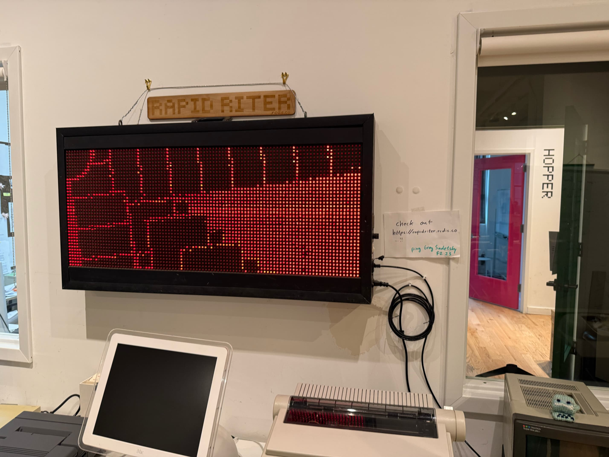
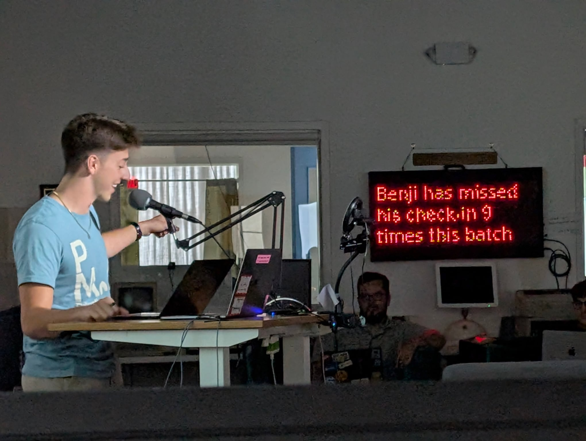

+++
title = "Rapid Riter"
description = "A programmable LED matrix at the Recurse Center."
date = 2025-09-17T20:00:00-07:00
+++

I enjoy many things. Two in particular are [alternative display
technologies] and using the right tool for the job. These combined in a
truly joyful project when I wrote a script for the Rapid Riter.

When I first walked into the [Recurse Center][Recurse], the large red
LED matrix mounted on the wall caught my eye immediately. I've been in a
good number of hacker spaces, all strewn with exciting toys in various
states of decay—this was the first space I'd experienced where the toys
*worked*. I knew then I would have to make something for it. This, as
you may have surmised by the label, is the Rapid Riter.

To get my program working, I orchestrated a series of tools in a
beautiful symphony. Or at least, that's how I felt writing it at
midnight on a Saturday with wine glass full of water. The graphics are
written in [p5.js], an animation DSL, and uploaded directly to the Riter
through [Greg's] developer portal. The number is calculated via the
[Zulip] API, and served from [val]—which I had heard of as a long-time
follower of [Tom MacWright's] blog but never used before. Writing little
type-safe scripts that are live instantly, with proper secrets
management? I loved it, and will be tucking it away for future projects.

When my script was done, I presented it during demos at [Recurse].
You're encouraged to send daily "check-ins" during your time there: the
final number I missed was much higher than the number above. If you want
to see how high, you'll just have to apply!

[alternative display technologies]: @/projects/roll-call/index.md
[Recurse]: https://www.recurse.com/scout/click?t=0d85c06dc14f97552f2130471d4e3086
[p5.js]: https://p5js.org
[Greg's]: https://greg.technology/
[Zulip]: https://zulip.com
[val]: https://val.town
[Tom MacWright's]: https://macwright.com/
[endpoint]: https://www.val.town/x/figbert/missed-recurse-checkin-endpoint/
