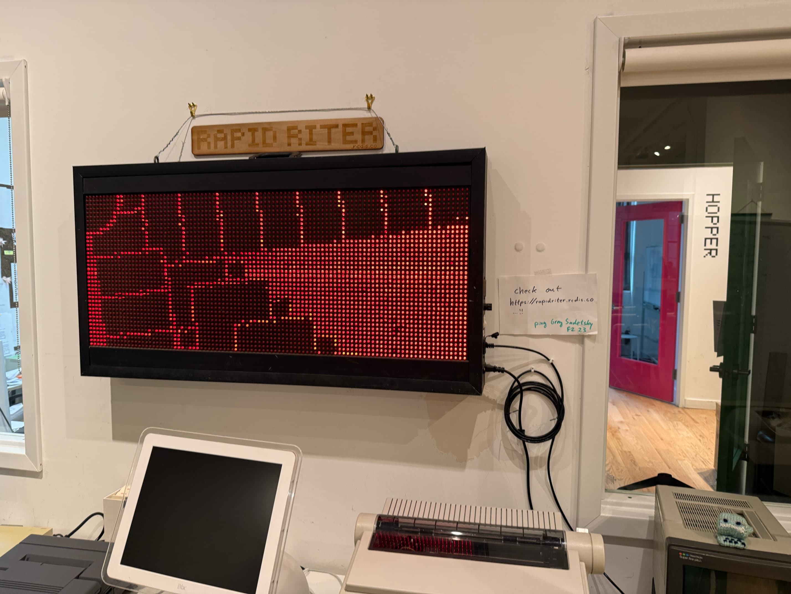

+++
title = "Rapid Riter"
description = "A programmable LED matrix at the Recurse Center."
date = 2025-09-17T20:00:00-07:00
[extra]
icon = """<svg viewBox="0 0 1929 1270" xmlns="http://www.w3.org/2000/svg" fill="currentColor"><g fill-rule="evenodd"><path d="m223 728h-.5l-.5-.5 1-.5z"/><path d="m223 727v-.5l.5-.5h.5v1z"/><path d="m224 726v-.5l.5-.5h.5v1z"/><path d="m224 727h.5l.5-.5v-.5h2.5l.5-.5-.5-.5h-2.5l.25-.75 3.75.379883 1.75.620117-.25 9.75 8.879883 38 .75 25-.379883 1.75-1.75.75-2 .129883-2.5-.629883-3.5-3.5-.370117-1.5-.629883-3.5-1-1 1.5-1.5 4.379883-.120117-2.5-21.879883-.879883-4-7-29-.5-6h.5l.5-.5zm1 7v-4.5l-1-.5v4.5zm1 3v-1h-1v1zm5 56v-2.5l-1-.5v2.5z"/><path d="m867.5 811h-5l-2.5-2.5 1.5-26.5 5.5-104.5 2.5-2.5h3l2.5 2.5-1.5 88.5-3.5 42.5z"/><path d="m789.5 828-2-1-2.5-2.5-1.25-5.25-1.25-.25-1.5-1.5-.5-1.5-1-2-10.5-12.5-4.370117-7.5-4.129883-11-3.25-20 .129883-2 2.620117-6.5 2-2 1.5-6.5 1.129883-3 15.370117-17.5 2.5-4.5 5-7 5-8 1.879883-4 .620117-2.5 1-1-1-1 1-4 2.5-2.5h5l3.5 3.5 2.25 4.25 1.5.5 2.629883 4.75.620117 2.5 2 2 2.379883 4.5 2 5v4l-.379883 1.5-2.5 2.5h-3l-3.5-3.5-.5-1.5-.870117-2-.629883-2.5-3-3-.370117-1.5-1.25-3-.379883-1.5v-.5l-1 .5-.5 1.5-2 4-15.75 23.75-1.25.25-1.5 1.5v1l-5.5 5.5h-1l-1.5 1.5-.5 3.5-1.120117 4-1.879883 4-.5 1.5-2 2 2.75 19.5 1.879883 5 .370117 1.5 3 3 .629883 3.5.620117 1.75 1.5.5 7.75 9.75 1.5 2.5 1.5 1.5 1.25-.25 2.75-6.75 9.879883-19 .620117-3.5 2-2 .5-1.5.879883-2 .620117-2.5 4.5-4.5 4.5.75 1.75.5.5 1.75.75 5.5-2 2-.5 1.5-14.870117 28-1.25 3-5.75 11-.629883 2.5-2.5 2.5h-2z"/><path d="m709.5 807-10.5-.5-10 1.879883-23.5.620117-3.5-3.5v-5l-2-2-.370117-1.5-4-10-4.129883-23 .129883-9 1.120117-5 3.75-6 3-6 .5-1.5 2.5-2.5 1.25-.25.5-1.5 1.25-.25 1.5-1.5 12-14 4-7 2.5-2.5 7.5-5.370117 7-2.129883 3 .129883 7.5 5.370117 5.5 5.5 9 14 3 3 .5 2.5 1.129883 3 .370117 1.5 2 2v2l4 4v2l1 1-1 1v1l-3.5 3.5-8.5.629883-9 1.870117-51.5-.5-1.5 1.5.879883 17.5 2.870117 13 2.879883 7 .370117 1.5 3.5 3.5 4.5.5 4 1 6-.120117 3-.75 11.5-1.629883 3-3 2.25-.25.75-1.75 6.5-11.5 1.5-1.5 5.5-3.5 2-.75 5.5-.75 2.5 2.5v3l-1 1 1 1-2.5 2.5-4 1-3.5 3.5-.5 1.5-3 5-.870117 2-.629883 2.5 1 1-1 1-1.25 3.25-2.25.25zm2-62 1-1 4.5-.620117 4.75-1.629883-.25-1.75-1-2-2.120117-5-4.879883-7-3-5-.5-1.5-6.5-6.5-2-1-2.5-.620117-3.5.620117-5.5 5.5-1 2-5 8-4.5 4.5h-1l-2.5 2.5v1l-8 8 .5.5z"/><path d="m542 684h-1v-1h1z"/><path d="m608 811.379883-4.5-.379883-2.5-2.5-.5-2.5-1.120117-3-.5-2 2.120117-71.5 1-1-1.5-1.5-1.5-.5-18.5-9.5-1.5-1.5v-1l-.5-.5-1 1-2.5 1.5-20 15-4 2-2 .129883-2.5-.629883-1-1-.5.5 3.379883 55.5-1.379883 11.5 2 2v2l-1 1 1 1-1 4-1.5 1.5h-1l-1 1-1-1h-3l-2.5-2.5-1-6-1-1 1-1-2.5-108.5-1.120117-7 .25-3 .620117-1.870117 4.25-.129883 2.5 2.5-1 1 1 2 .75 2.5-.370117 5 3.620117 33.5.5.5 1-1 1.5-.5 2-1 1.5-.5 1.5-1.5v-1l1.5-1.5 1.5-.5 2.5-1.5 10-8 3-2 1.5-1.5.5-1.5 3.75-5.75 2.25-.25 1-1 1 1h1l1.5 1.5 1 6 4.5 4.5 1.5.5 16 8 1.5.5 4.5 4.5.379883 1.5.620117 3.5-3 3-2.120117 64.5 1.5 5-.129883 7-.5 1.75z"/><path d="m449 819.5-3-.120117-2-.879883-1.5-.5-2.5-2.5-.5-1.5-14-31-1.870117-7-1.129883-7v-10l1.25-7 .75-2 1.879883-4 .620117-2.5 5-5 3.5-6.5.5-1.5 1.5-1.5 1.25-.25 3.75-6.75.75-1.75 1.5-.5.75-1.75 1.5-2.5 9-11 1-1-1-1 1-3 3.5-3.5h4l5.5 5.5 1.5 2.5 2.5 3.5 1.5 2.5 3 7 4.5 8.5 2 2v3l-2.5 2.5-1.5.5-2 .129883-2.5-.629883-2.5-2.5-3.370117-6.5-3-7-.629883-2.5-2-2v-1l-.5-.5-2.5 2.5v1l-1.5 1.5h-1l-3.5 3.5-.5 1.5-1 2-5 7-1.5 2.5-5.5 7.5-3.5 6.5-3 3v2l-2 2-1.370117 6.5-.129883 9 2 9 3.879883 10 .620117 2.5 2 2 .5 1.5.879883 2 .620117 2.5 2 2 1 4 2.5 2.5 2.5-2.5 15.5-27.5.5-1.5 2.5-2.5h5l2.5 2.5.5 1.5-.5 2.5-4 7-2 2-.620117 2.5-2.879883 6-4 6-2 4-5.5 7.5-1 2-1.5 1.5-1.5.379883z"/><path d="m326 809.379883-9 .120117-3 .75-7.5.75-3 3-6.5.5-5 1.25-1.5.25-1 1-1-1-1 1-1-1h-2l-2.5-2.5.629883-3.5 1.620117-3.75 30.75-6.75 15.879883-1.620117-.25-4.879883-1.379883-8-1.5-3.75-3.25-.25-1 1-1-1-9.5-1.620117-6-1.629883h-8l-4 1.5h-7l-1.75-.5-.5-1.75-.75-6.5-2.5-2.5h-1l-1.5-1.5-.25-1.25-1.75-.620117-3.5-.629883-2.5-2.5v-1l-2-2v-3l-3-3 .75-11.5.879883-3 .870117-2 3.75-6 .75-4.5 1-1-1-1 1-1-.75-9.5-.75-2v-2l.5-1.5 3.5-3.5 1.5-.5 2.5-1.5 10-7 2-1 3-3 4-1 1.5-1.5 1-3 1.5-1.5h6l4.5 4.5.5 1.5 5.879883 11 3.120117 13 1.879883 6 .620117 4.5 4 4v4l-2.5 2.5h-6l-2.5-2.5v-1l-2-2-.5-3.5-1.25-5-1.5-4-2.75-12.5-2-2-.5-1.5-1-2-.5-1.5-.5-.5-1 1-1.5.5-6.5 3.5-10 7-2 1-1.5 1.5-1 23-6 6-.5 1.5-.870117 2v3l3.620117 7.75 4.25 1.25 8.5 8.5 1 3 .5.5 1-1 8.5-.620117 6.5.620117 2 2 14 2 2-2h5l1-1 1 1h2l2.5 2.5v5l-2 2 1.25 3.5.75 4.5 1 1-1 1v17l-2.5 2.5-8.5.75z"/><path d="m227.5 689-1.5-.370117-3-1.25-1.5-.379883-2.5-2.5-.370117-1.5v-4l.370117-1.5 1.5-1.5h5l4.5 4.5 1 4-2 2v1zm1.5-6v-1h-1v1z"/><path d="m194.5 813-1-1-1 1-7-1-1.5-1.5-.370117-1.5-1.25-3-.129883-2 4.25-15-.120117-5-8-29-1.75-4-.629883-2.5-2-2-2.5-4.5-4-6-.875-2-1-4-1.375-9-.5-1.75-1.25-.25-3-3h-2l-2-2h-4l-1.5 1.5-3.5 6.5-3.5 5.5-1.5 1.5h-1l-5 5-3.375.25.25 64.75-3.375 22.5-2.5 2.5h-4l-1.5-1.5-.375-1.5-.125-16 1.25-8 .75-2 1-2 .625-2-.125-54.5-1.5-1.5h-1l-1 1-2.5-2.5-1-3 1.5-1.5h3l1.5-1.5-1-1-.625-5.5-1.875-7-1-6-4-19-2-5v-2l.75-1.75 1.75-.620117 3-.129883 4.75 1.75.75 1.75.25 1.75-1.25.25-1.5 1.5 6.75 27.5 1.75 6 .5 4.5 1.5 1.5 5.5-5.5v-1l2-2v-2l1-1-2-2v-3l.5-.5 1 1 1-1 1 1 1.375-.25.875-5.75.5-1.75 1.25-.25 2-2h3l4 4 6 1 2 2 1.5.5 4.5 2.5 3.5 3.5v1l2 2 1 6 1 1-1 1 1 7 3 3 1 2 4.379883 6.5 2.120117 5 1.879883 4 7.25 27 1.870117 5 .5 2.5-1 1 1 1v5l-3 3-.370117 1.5-.379883 3.75 3.75 1.629883 2.5.620117 2.5 2.5-1 1v1l-1.5 1.5h-1l-2 2h-2zm-54.5-101v-1h-1v1zm1 1v-1h-1v1z"/><path d="m307.5 596-29.5-1.75-6-.870117-9-3-14-6.879883-5-3-7.5-5.5-3-3-.5.5.629883 2.5-.129883 2-1 2-.5 1.5-2.5 2.5h-2l-2.5-2.5.75-6.5 1.25-4.5 1-1-1-1 .5-1.5 3-8 1.879883-11-.25-13 .370117-2 .5-1.5 1-1-.5-.5-1.5-.5h-2l-2 .879883-2.870117.370117-.129883-4.25-1-1 .5-.5 1.5-.370117 7-.129883 2.5-.5 2-2 55.5-2.5 14 1.5-.5 1-3.5.629883-1.5.370117-1-1-.5.5.25 1.379883 7.5-.629883.25 1.25-2.5 2.5-60.5 1.75-8.5 1.25h-.5l.5 1h1l1.5 1.5.25 1.5-.870117 20-.879883 5-1 4-.5 3.5 3.5 3.5 2.5 1.5 3.5 2.5 16.5 8.379883 5 2 8 1.870117 27 2.25 6.75 1.75.25 1.25 2 2zm-72.5-70v-1h-1v1zm3.5 2 .5-1h-1.5l-.5 1zm-3.5 1v-1h-1v1zm0 8v-1h-1v1zm0 3v-1.5l-1-.5v1z"/><path d="m181 568.5-3.5-.5-2.5-2.5v-42l2.5-2.5h2l3.5 3.5-.120117 43.25zm-3-38.5v-1.5l-1-.5v1zm2 38v-1h-1v1z"/><path d="m742 573.379883-4.5-.379883-1.5-1.5.379883-40.5-1.129883-6-.75-2-.120117-2 .620117-2.5 1.5-1.5 1.5-.5 2-.870117 32-6.129883 7-2.120117 2-.75 2.5-.629883 2-2 1.5-.5 2-.870117 3-1 5-1 11.75-.629883-.75-13.5-3.5-3.5h-10l-1-1-1 1h-18l-1-1-1 1-5.5-.620117-4.5-1.379883-2-2h-2l-5.5-5.5.129883-4.25 1.870117-.75 2-.120117 4 1.25 4 1.870117 1.5.5 2 2 2.5-.370117 32 .25 5.5-.879883 3.5 3.5 4.5 6.5.629883 2 2.870117 22.5-3.5 3.5-6-1-.5.5 1 1 1.25 6.5-.870117 34-1 6-.879883 3-.5 3.5-3.5 3.5-1.5.5-2 .129883-3-.879883-11.5-.75-1 1-1-1-19 1-1 1-1-1-4.5.75-6 1.75-6 1-4 1.129883zm25-15.879883 32.75-.5 1.629883-8 .75-29-2.5-5v-3l.370117-1.5-.5-.5-1 1-5.25.129883-.5 1.620117-1.25.25-2 2-3.5.5-13 4-25.75 4.75-.75 1.75-.370117 2-1.129883 33.5.5.5 1-1 4.5-.5 6-1.75z"/><path d="m651 484h-1v-1h1z"/><path d="m651 482h-1v-1h1z"/><path d="m711.5 591h-2l-1.5-1.5 1.879883-20.5 1.370117-4 .129883-21-5.879883-15-11-25-3-9-.870117-4-.75-6.75-1.879883-.120117-36 1.870117.5-1h1.5l-.5-1-1.25-.25.379883-2.75.620117-1.870117 7.75-.879883 4 .629883 17.5-1.879883 1 1 1-1 12-2 3.5 3.5-.370117 10.5 7 20 14.620117 34-.120117 28-.379883 1.75-1.75.5-.75 9.75-1.25 3.5-1.5 1.5h-1z"/><path d="m527.5 577-4.25-.120117-.25-1.379883-2-2-6-100 2.5-2.5h2l2.5 2.5 6.75 92.5.75 4v3l-.5 2.5z"/><path d="m446 603.379883-4 1.120117-11.75 2.75-.25 2.25-1.5 1.5-2.25-.25-.5-1.75-.75-7.5 3.5-3.5 2.5-.5 17-5.120117 2-.879883 1.5-.5 2-2h2l.5-.5-1-1 2.5-98.5-1.25-6-3.620117-6-.629883-2.5 1.5-1.5 1.5-.5h2l1.5.5 1.5 1.5.5 1.5 1.879883 4 1 3 1.120117 6-.5 82.5-1 1 1 1 .379883 22.5-.629883 2.75-1.75.629883h-6z"/><path d="m416 582.379883-3.5.620117-3.5-3.5v-3l2-2 .25-1.25 1.25-.25 3.5-3.5-1.620117-9.5-1.75-6-1-6-1.129883-37-1.5-9.5-3-3-1-8-2.5-2.5-11-1-1-1-1 1-26.5 2.629883-7.75 1.620117-.25 1.25-.5.5-1-1-2.5.25 1.379883 62.75-2.379883 17.5.5.5 1-1 .5.5-.620117 3.5-.629883 1.75-1.5.5-.25 1.25-1.5 1.5h-3l-1.5-1.5-.370117-1.5-.129883-4 3.879883-28-1.379883-62.5 1.5-1.5h3l2 2 47.5-3.370117 7.5 1.370117 4.5 4.5 2 10 3 3 3.5 27.5v17l1.25 8 4 16-.120117 2-1.25 3-4.879883 7-.75 1.75zm-70-89.379883v-2.5l-1-.5v2.5zm4 81v-1h-1v1z"/><path d="m307 509h-1v-1h1z"/><path d="m269 485-1-.5v-2l1.5-1.5.5.5-1 3z"/><path d="m269 475 1 .5-1 .5z"/><path d="m237 506v-1.5l-1-.5v1zm29.5-31 .5-1h-1.5l-.5 1zm2.5 1v2.5l1 1-.5.5-1.25.25-1.25 4.25-.5.5-2-2-6.5 3.5-6.75 4.75-.5 1.5-10.25 7.25-2.25 1.25-.25 2.25 1 1-2.5 2.5h-3l-2.5-2.5 1-7 2.5-2.5h2l2-2 2.5-1.5 11-9 8-5 1.75-.75v-1.5l-1.25-.25h-.5l.5-1h1.5l-.5-1-2.25.25-.25 1.25v.5l-1-.5v-1l-1-1 1-1v-1l1.5-1.5 1.5-.370117 3-1.129883 4-1 3-.25 9 1.5 5 1.879883 8.5 6.370117 1.5 1.5 3.5 5.5 2 4 .5 1.5 2 2 .5 2.5 1.75 6-.25 11.5-1 1 1 1-2.5 2.5h-1l-1-1-1 1-.5-.5.379883-11.5-.879883-4-1-3-.5-2.5-3-3-.5-1.5-1-2-.5-1.5-4.5-4.5-6.5-4.370117-3-1-5-1.129883-4 .5-1 .5.5.5zm-5 1v-1h-1v1z"/><path d="m179 462-1-1v-1l1 .5z"/><path d="m183.5 494h-3l-2.5-2.5.5-4.5 1.75-9 .75-11.5-1.5-1.5-1.25-.25 1.25-2.75 1.75-2.75 3.75.379883 1.5.370117 1.5 1.5-.75 16.5-2.25 12.5 1 1z"/><path d="m115 449h-1v-1h1z"/><path d="m643 583.379883-2.5.620117-1.5-1.5-.25-1.5-.25-6 .879883-4-5.129883-112-2.5-14.75-1.25-.25-.5-.5 1-1-1.5-1.5-1.370117-.25.620117-6.75.5-1.870117 4.25-.129883 1.5 1.5.5 2.5 3 8 1 4 9 123-2.5 10.5-1.5 1.5z"/><path d="m465.5 447-2.25-.25-1.25-4.25v-.5l-1 .5v1.5l-1-.5-.620117-3.5-.75-2-.629883-3.5 2.5-2.5h3l2.5 2.5.5 1.5.879883 2 .620117 2.5 1 1-.5.5h-1l-.5.5 1 1-1 1v1zm-.5-1v-1.5l-1-.5v1z"/><path d="m514.5 437-3-1-1.5-1.5-1-2-2-3-1-2-2-2v-3l3.5-3.5h3l3.5 3.5.75 4.5 1.879883 5-.129883 2-.5 1.5zm-2.5-2v-1h-1v1z"/><path d="m175.5 585-3.5-1.5-3-.620117-46.5-1.879883-2.5-2.5-1.5-12.5-3.75-19-3.75-95.5 2.5-2.5 1 1 1.25-.25.5-1.5 4.75.379883 63-4.879883 1.5.25 1.5 1.5-1 4-1.5 1.5-57.5 3.5-9 1.75 3 47.5 7 1.629883 7 .120117 8-1h19l3.5.5 2.5 2.5v5l-1.5 1.5-1.5.5h-2l-1.75-.75-.5-1.5-33.25.75-1-1-1 1-1.5-.5-2-.25 1.5 31.75 1 6 5.625 25 38.875.75 4 .879883 2 .870117 2 .25 5.5-.75 1.5 1.5v3l-1.5 1.5-6 1zm7-5 .5-1h-2.5l-.5 1z"/><path d="m2 295h-1v-1h1z"/><path d="m23.5 283h-6.5l.5-1h6.5z"/><path d="m516 20h-1.5l-.5-.5v-.5h2z"/><path d="m387 218.5-11 12.5-1.5 2h-5l-2.5-2.5v-5l3-3v-1l1.5-1.5h1l3.5-3.5 7-9 9.5-14.5 13.879883-26 4.120117-10 8.5-16.5 18.5-29.5 11-19 24.5-36.5 1.379883-2.5 2.120117-5 6-10 2.879883-7 4.870117-17.75 1.75-.75h4l1.75-.75.5-1.5h2.5l.75 1.75.25 1.879883-5.75.120117.5 1 2.25.25v1.5l-1.25.25-1.5 1.5-3.5 12.5-4 10-5.870117 11-3.25 8-26.879883 43-34 60-5 12-16 29-6.5 9.5zm113-205.5v-1h-1v1z"/><path d="m1038.5 800h-4l-2.5-2.5.75-5.5 1.5-5-.75-25-3.75-49 .25-1.5 2.5-2.5h3l3.5 3.5 1.5 27.5 3.879883 30-.129883 20-1.25 6.5-1.5 1.5h-1z"/><path d="m1089.5 820h-5l-2.5-2.5-.370117-105.5 1.620117-9.75 1.75-.75h2l1.75.75 1.5 4.75 1 110-.25 1.5z"/><path d="m1164.5 797-3.5-.620117-1.5-.379883-2.5-2.5.629883-8.5 1.5-8 1.870117-71.5-3.5-3.5-3.5-.5-10.5-3.5-5-5-.5.5-9 11-8.5 8.5h-2l-3 3-5.25 3.25-.25 1.25-1.5 1.5-1.5.25h-8l-1.5-.25-1.5-1.5.129883-5.25 1.620117-.5.5-1.5 1.75-.620117 3.5-.629883 2-2 5-3 3-3h2l3.5-3.5 9-11 9.5-9.5 3.5.629883 1.5.370117 2.5 2.5 3.25 5.25 3.75.879883 4 1.620117 5.5.75 3 3h1l2 2 4.25 1.25.5 1.75.75 5.5-2 2-1.75 72.5-.870117 4 .120117 2 1 2 .5 1.5-2 2v2z"/><path d="m1042.5 667h-2l-2-2-3-1-2.5-2.5-.370117-1.5-.629883-3.5 3.5-3.5 3.5.629883 1.5.370117 3.5 3.5v8z"/><path d="m1302 801.379883h-4l-1.5-.379883-2-2-2.5-.620117-4-1.879883-2.5-1.5-9-7-1.5-1.5-6-8-3-3-.620117-2.5-5.879883-17v-3l.5-2.5 2.5-2.5 1.5-.5h2l1.5.5 1.5 1.5.5 1.5.879883 2 .620117 3.5 2 2 .75 7.5 1.25 4.5 5 5v1l9.5 9.5 1.5.5 4 1.879883h4l2-.879883 9.5-7.5 2.5-2.5v-1l1.5-1.5h1l3.5-3.5 1-54-.5-.5-2 2-38.5 9.629883-2.5.370117-2-2h-2l-3-3-5.5-3.370117-2.5-.629883-3.5-3.5-1-2-2-3-1.370117-2.5-1.879883-8-.75-11.5 2-2 1-2 7.379883-9.5 1.25-3 6.370117-10.5 2.5-3.5 1.5-2.5 2.5-2.5h1l9-9 2.25-.25 3.5-5.5 1.75-.75 2-1h2l7.5 4.5 3.5 2.5 2.5 1.5 7.5 7.5v1l3.5 3.5h3l1-1 1 1 2.25.25 1.5 3.75 1 7 1.879883 34.75 1.370117.25 2.5 2.5-1 6-1.5 1.5-4.5 1.25-.75 60.75-.5 1.75-1.25.25-1.5 1.5v1l-3.5 3.5-3.5 2.5-10.5 8.5-3.5 3.5v1l-1.5 1.5zm-19.5-83.379883 1-1 4.5-.5 5-1.120117 9-3 7-1.879883 3.5-.5 2-2 5-1 1.5-1.5-.620117-15.5-2.379883-18.5-3-3-.5-1.5-1-2-.5-1.5-11.5-11.5h-1l-2-2h-2l-4 4-3 1-10.5 10.5-1 2-5.5 8.5-3 7-.5 1.5-7 7-.370117 2.5-.129883 5 1.5 6.5 2 2v1l1.5 1.5h2l2 2 1.5.5 2 1 1.5.5 3 3z"/><path d="m1493 558.25-10 .25-12.5-1.5-1 1-1-1-17.5 2.5-17.5-.5-3.5-3.5v-16l-2-2-.5-1.5-8.5-14.5-2-2-1.5-6.5v-6l.5-3.5 4-4-2-2-.5-1.5v-2l.75-1.75 5.25-1.25 1.5-1.5v-1l1.5-1.5h1l1.5-1.5v-2l3-3v-1l5-5 .629883-2.5.75-2 .620117-2.5 4-4v-3l3.5-3.5 3.5-1.120117 17-.129883 16.5 2.25 3.5 3.5 2.379883 4.5 3 8 2.120117 9 1 3 .5 2.5 4 4-1 4-2.5 2.5-68 3-2.5 2.5v1l-2 2 1 8 2 2 1 2 9.5 15.5.879883 2 1 4 .620117 7.5 1.5 1.5 8.5-.5 18.5-2.5 1 1 1-1 13.5 1.879883 2-.25 3-.129883 5.75 1.75.5 1.75.75 4.5-1.5 1.5zm-23-68.620117 15.75-.629883-.120117-2-1.129883-3-2-8-2.75-6.75-8.75-2.620117-16-2.379883h-2.75l-.75 1.75-1 2-4 6-3 6-.5 1.5-6 6v4l-1 1 .5.5zm-51 5.370117v-1h-1v1z"/><path d="m1373 550.25h-16l-12-2.75-6-2.120117-6-2.75-6.75-1.879883-.5-1.5-1.5-.5-.25-3.25.5-.5 1 1 .5-.5.25-1.25 2.75.25 28 5.75 17.5-.25 2-2h1l1.5-1.5.5-1.5.879883-2 .870117-3v-8l-1.25-3.5-1.5-1.5-1.5-.5-11-5.870117-5-2-2.5-.629883-1-1-1 1-13.5.5-4 .75-10.5.75-3.5-3.5 1-26 4.5-4.5 1.5-.5 2-1 6-3.870117 18-7 5-1 9.5-.629883 1.5 1.5.379883 1.5.620117 3.5-2.5 2.5-2.5 1.5-2.75 1.25-.5-1.5-1.75-.75-2-.120117-4 1.120117-15 6-7 4-1.5.5-1.5 1.5 1 14-1 1 .5.5 3.5-.620117 2-.629883 10-.120117 4-1.129883 6 .129883 9 3 2.5 1.370117 3 2 2.5 1.379883 5 2.120117 2 1 1.5.5 3.5 3.5 2.129883 7.5.120117 11-.75 4-1.120117 3-2.379883 4.5-3.5 3.5-4.5 2.379883-3 1.120117z"/><path d="m1296 462-1-1v-1l1 .5z"/><path d="m1294 459 1 .5-1 .5z"/><path d="m1294 460v2.5l1 1-.5.5-4.5 2.25-6 1.5h-1.75l-.25-1.25-.5-.5-1 1-1-1-15.5 1.629883-4 .870117-9 2.879883-7.5 1.620117-.5.5 1 1v2l2 2 1.5 5.5.5 5.5 2 2-1.5 15.5-1 4-.25 2.879883 4.75-.379883 8-1.620117h13l2 .620117 15.5 8.5 3.5 3.5v1l2 2 1.25 4.5 1.5 10v2l-1.370117 7-3 8-.379883 1.5-4.5 4.5-4.5 2.379883-9 2.870117-10 1.25h-12l-14-2.120117-6-1.879883-2.5-.5-2-2h-1l-2.5-2.5v-3l-1-1 1-1-1-1v-2l1.5-1.5 3 1 2 2 2.5.5 9 3 4 .629883h27l3-.629883 3-1.120117 1.5-.379883 4.5-4.5 1.129883-4.5-.129883-16.5-3.5-3.5-2-1-5.5-3.5-6-2.870117-3-.129883-2.5.5-1-1-1 1-15 2-2 2-4 1-3.5-3.5-.25-13.5 1.75-10v-7l-1.25-8-.870117-3-.75-2-.879883-3-.75-7.5 3.5-3.5 12.5-3.620117 5-1.879883 19-3 13.5.5 1 1 1-1 3.5 1-1 .5.5.5zm-66 95v-1h-1v1zm1 2v-1h-1v1z"/><path d="m1198 547.379883h-4l-1.75-.629883-1.75-4.75-.370117-3 3.870117-63.5 2.5-2.5 4.25.129883 2.75 4.870117.379883 2-3.879883 57.75 1.75.5.25 1.25 1 1-1 1v1l-2 2-.25 2.25z"/><path d="m1131.5 550-4.5-.75-1.75-.5-.5-1.75-.75-4.5 3-3 3.5-15.5 2.5-49.870117-22.5-3.129883-3 3h-1l-1.5 1.5v1l-4.5 4.5-4.25 2.25-.25 1.25-2.5 2.5-1.25.25-.25 1.25-3.5 3.5-8.5-.75-1.870117-.5-.129883-4.25 1.5-1.5 3-1 1.5-1.5v-1l1.5-1.5h1l1.5-1.5v-1l2.5-2.5 5-3 1.5-1.5 4-6 3.5-3.5 1.5-.5 2-.870117 2.5-.629883 2 2 22.5 3.75 7.75 2.5.5 1.75-1.75 50-2 12-3.120117 12-2.379883 4.5z"/><path d="m1009 467h-.5l-.5-.5 1-.5z"/><path d="m1009 466v-1.5l.5-.5h1.5v1h-.5l-.5.5v.5z"/><path d="m1017 463v-1h-1v1zm0 3v-1h-1v1zm-7 0h.5l.5-.5v-.5l1-.5-1-.5.25-.75 3.5.5.25-1.25 1.5-1.5 9 1 1.5 1.5.25 2.25 5.75 1.379883 27 .370117 4 1.129883 2 .75 2.5.620117 2.5 2.5.5 4.5 4 18 2.879883 7 .870117 3 1.129883 8-.129883 18-1.25 6.5-3 3 1 1-1 1v4l-4.5 4.5-3.5-.620117-1.5-.379883-2.5-2.5.5-4.5 1.129883-4 1.870117-4 .5-1.5 2-2 .379883-18.5-1.129883-7-.75-2-3-7-4.75-20.75-2.25-.25-1-1-1 1-9.5.75-15-1.620117-5-2.5-5.5-1.629883-2-2-1 1-2.25.25v1.75l1.25 6 .879883 73-3.379883 12.5-1.5 1.5-3.5-.620117-1.75-.629883-.5-1.75-.120117-7 1.75-6 2.120117-64-2.5-18h.5l.5-.5zm1 4v-1h-1v1zm13-6v-1h-1v1z"/><path d="m1612.5 584-.870117-1.5v-4.5l1.870117-5 3.5-18.5-4.5-4.5-2.5-.620117-24-10.879883-8-2-5-.75-24.5.25-1.5-1.5-.5-1.5-.120117-2 5-13 2-8 2.620117-42.5 1.5-1.5 1.5-.5 2-.870117 3-1 26-4 10.5-.629883 1.5 1.5v4l-1.5 1.5-37 5-1.5 1.5.25 32.5-1.75 11-1 4-1.120117 3-.129883 2 14.75.629883 11 2 12 4 16 7.75 3.5.620117.5-.5-2-2v-3l-1-1 1.5-1.5h1l1-1 1 1 1.5-.25-11.5-118.75-1-5-.370117-4.75 4.370117-1.25 2.5 2.5v1l2 2 .5 4.5 3 24 9.5 116.5-2 2-2.5 13.5-1 4-2.5 6.5-3.5 3.5-3 1z"/><path d="m1196.5 424-1-1-1 1-1.5-1.5-.25-1.25-1.5-.5-.25-1.25-1-1 1-1 .25-2.370117h7.5l-.25 2.870117-1.5 5.5zm-.5-2v-1h-1v1z"/><path d="m1884 243h-1v-1h1z"/><path d="m1890 233-1-1v-1l1 .5z"/><path d="m1887.75 231.75-1.25.25-.5-.5 1.5-1.5.5.5z"/><path d="m1313 17-1-.5v-2.5l1 .5z"/><path d="m1312 14h-1v-1h1z"/><path d="m1335 10h-1.5l-.5-.5v-.5h2z"/><path d="m970 766.379883-12 .25-2.5-.629883-2.5-2.5v-1l-1-1 1-1v-1l2.5-2.5 11-1 1 1 1-1 3.5-.5 12.5-2.5 1 1 1-1 5.5-1.370117h6l2.5.370117 2.5 2.5v5l-1.5 1.5-1.5.379883-3 1.25-1.5.370117-1-1-1 1-16.5 1.629883z"/><path d="m957 811.5-4.5 3.879883-4.5.120117-3.5-.5-2-2-1.5-.5-5-3-4.5-3.5-18-16-21.5-21.5-3.25-5.25-1.25-.25-1.5-1.5-1-4-2.5-2.5h-1l-2.5-2.5v-2.5l1 .5v1.5l1-.5-1-7 1.5-1.5h4l7.5-7.5v-1l3.5-3.5 5-3 7.5-7.5 4.5-6.5 1-2 .5-1.5 3.5-3.5 1.5-.370117 3.5-.629883 2.5 2.5-.75 7.5-8.25 10.5-9.5 9.5-5 3-1.5 1.5v1l-10 10 2 2 6 8 17.5 17.5 25 22 6.5 3.5 2 .129883 2.5-.629883 1 1 1-1 2.5 2.5v2l1 1-1 1z"/><path d="m896 577.129883-18.5.870117-1-1-1 1-12-1-1-1-1 1-4-1-1.5 1.5v1l-1.5 1.5h-1l-2.5-2.5-.25-10.5.25-1.5 2.5-2.5 7 1 2 2 22.5 1.5 4.75-.620117 5.629883-9.879883 3.120117-12-.120117-5-1.379883-4.5-3.5-3.5-1.5-.370117-10-4-7-2.129883-5-1.75-6-1.25-5.5-.5-2-2-5.5-.75-1.75-.5-.25-2.25-1-1 1-1 7.75-35.5 1.25-4.5 3.5-3.5h1l2-2 43.5-3.370117 6.5 1.370117 1.5 1.5.379883 1.5.620117 3.5-2.5 2.5-3 1-3-3-16.5.75-20 2-5.5 1.25-1.5 1.5-3.5 19.5-2.5 10.5 1.5 1.5 10.5 1.75 13 4 5 2.75 2 .75 9.5 1.75 1.5 1.5.629883 2.5 3.870117 6 .879883 2 .870117 3v11l-1.75 8-2.120117 6-2.879883 5-.5 1.5-2 2-.75 4.5-.5 1.75zm-42-.129883v-1h-1v1z"/><path d="m516 19-1.75-.75-.25.75-1-.370117-2.5-.629883-1.5-1.5v-3l2.5-2.5 1.5-.5h2l1.75.75.25 1.25 1.5 1.5 1.25-.25.5-1.5 1.25-.25 1.5 1.5-.5.5h-1.5l.5 1 4.5 1.129883 27 .120117 675-7.75 13.5 1.5 1-1 1 1 47-2 1-1 1 1h2l2 2 7.5.629883 6.5 1.370117h.5l-.5 1h-5.5l.5 1h3l2.5 2.5v2l-1.5 1.5-2-2-15-2-1 1-1-1-29.5.75-5 .629883-670 2.120117-59 3.75-6-.870117-3-1-2-1.379883 1-.5zm3.5 2 .5-1h-1.5l-.5 1zm4 1 .5-1h-1.5l-.5 1z"/><path d="m62.5 1265h-1.5l.5-1h1.5z"/><path d="m882.5 1037h-3l-3.5-3.5v-5l2-2 2.129883-4.5.25-12-6.379883-65.5 2.5-2.5h4l3.5 3.5 6.25 78.5-.870117 3-.879883 2-2.5 4.5z"/><path d="m833 1035.5-4.5-.5-1.5-1.5-.5-2.5-.120117-3 .870117-6-2-71-2.25-10.5-.5-.5-1 1-8.5 2.129883-12 1.620117-7 1.5-21.5.75-1-1-.5.5-.5 68.5-1.25 8-2.25 4.5-3.5 3.5-3.5-.620117-1.5-.379883-1.5-1.5-.370117-1.5-.129883-4 4-15 2-15-4.5-94.5 3.5-3.5 3.5.629883 1.75.620117.5 1.75 2.75 37.75 2.5.25 1 1 1-1 1 1 15.5-.75 14-2.870117 3.5-.379883 1 1 1-1 2.5-.5 9.5-2.5 2-2 8-1 2.5 2.5-.75 6.5-.75 2-.25 2 2 8 1.75 83.5-2 2-.25 1.25z"/><path d="m573 1052.5-2 1-5 2-3 .75-18.5 1.75-2 2-4.5 1.25-4.5.75-2.5-2.5-1-6 4.5-4.5h2l1-1 1 1 1-1 1 1 1-1 5.5-.75 2-.75 2-.120117 3 .370117 13.5-2.75 1.5-1.5v-1l2-2 1.5-8.5v-5l-3.5-22.5-3.5-3.5-8.5-.75-6-3.5-9-1.5-2-.620117-4-.879883-15.5-1.75-2.5-2.5.629883-9.5.870117-4 3.129883-11 2.870117-6 3.879883-6 .620117-2.5 1-1-1-1v-3l2-2 .25-1.25 2.75-.5 23.5.25 1 1 1-1 3.5.629883 2 .620117 17.5 2.75 2.5 2.5v4l-2 2-.25 1.25-1.75.5-5 .25-6-1.75-29.5-3.75-1.5 1.5-.620117 3.5-.879883 2-5 8-2 5-1.870117 7-.5 5 9.870117.629883 15 3.120117 2 .75 2 1 1.5.5 2 2 7.5.75 2 .5 4.5.75 3.5 3.5v2l1 1-1 1 3.379883 23.5v11l-1 6-3 8-.379883 1.5-1.5 1.5-1.5.5z"/><path d="m451 1059.379883-9 1.25-28.5 4.370117-3.5-3.5-2.370117-4.5-1-4-1-7 1-36 1.370117-14.75-2.5-.25-2.5-2.5v-5l2.5-2.5 3.25-.25.5-1.75.75-5.5 1-1-1-1 1-1 .629883-4.5.870117-3 2-5 2-4 3.75-5.75 2.25-1.25 3.5-2.5 2.5-1.5 2-2 22.5-3.620117 24 .25 5-1.129883 4.5-.5 4.5 4.5.5 1.5 2.879883 7 1.120117 4 1.129883 3 3.370117 5.5 3 3v3l6 6 .25 2.25 3.25 1.25 1.5 1.5.379883 1.5v3l-.379883 1.5-2.5 2.5-70.5 4.5-8-1-13.75.629883-.620117 2.870117v7l-1 4-.879883 7 .129883 35 .370117 2 12.75-.620117 39.5-6.379883 1 1 1-1h3l2-2h5l3.5 3.5.379883 1.5v3l-.629883 1.75-3.25 1.25-1 1-1-1-1 1h-2l-1 1-1-1-1 1-11.5.629883zm-2-73.629883 32-1.120117 16.5-2.629883.5-.5-1-1-3.5-6.5-5.870117-9-2-5-1.879883-6.75-2.75-.75h-6l-4-1-3-.370117-27 2.620117-5 1.879883-6.5 3.370117-3.5 3.5-2.370117 4.5-1.129883 3-.870117 3-1.5 11.75z"/><path d="m362 1044.629883-4.75-.879883-.5-1.75-.120117-7 .870117-4 2-7 .879883-6-.379883-62.870117-21 1.75-6 1.5-9 1.370117-4 1.629883-12.75 2.870117.129883 1.75 1 4 2.120117 33-1.25 10 .129883 3 1.120117 6-2.5 40.5 1 1-1 1-1 3-1.5 1.5h-1l-1 1-1-1h-2l-2.5-2.5-.5-1.5-.25-2 1.129883-9 1.120117-44 1.25-10-3.25-31-2-7-.5-3.5-1.5-1.5-29 5-1.5 1.5.629883 2.5.25 2-3.629883 63-2.25 16.5-1 1 2 2-.620117 3.5-.379883 1.5-1.5 1.5-1.5.379883-3.5.620117-3.5-3.5-.25-1.5-.25-7 2.75-18 2.75-59.5 1-1-1-1-.25-3.370117-7.75-.879883-3-.75-6 .25-4.5-.75-2.5-2.5v-3l-1-1 1-1v-1l1.5-1.5 1.5-.25h6l1.5.25 1-1 1 1 5.5 1.379883 15 .120117 4-2h2l2 .25 24-4.25 6 .25 1.75.5 2.5 7.5 1.75-.25 2-.75 9.5-1.75 2-2 11.5-1.620117 6-1.5 30.5-.879883 3.5 3.5-.75 70.5-.870117 7-1 4-.75 2-.379883 2.75 1.25.25 1.5 1.5v3l-1.5 1.5h-1l-2 2z"/><path d="m203.5 925h-1l-2-2-2.25-.25-.25-1.25-2-2v-2l-2-2v-4l3.5-3.5h3l2.5 2.5 1.25 4.5.75 8.5zm-3.5-3v-1h-1v1z"/><path d="m197 1051.379883h-4l-1.75-.629883-1.620117-3.75-.629883-2.5-1-1 1-1-.620117-80.5-1.629883-6-.75-6.5 2.5-2.5h2l3.5 3.5 4 86 .5.5 1-1 1 1h1l1.5 1.5-.5 3.5-1.120117 4-.879883 2-.5 1.5-1.5 1.5z"/><path d="m129 1065.5-6 1-8 1.879883-6.5.620117-4.5-4.5.5-4.5 7.875-37 2.75-59-.375-3-32.25 1-2.5-2.5v-4l1.5-1.5 1.5-.5 2-.870117 3-.75 25.5-.879883.5-.5-1-1-1.625-9.5-.875-3 .125-4 .375-1.5 1.5-1.5h2l1.5 1.5 4 18 1.5 1.5 1-1 50-2 3.5 3.5v4l-2.5 2.5-7 1-1 1-1-1-41 1-1.5 1.5-1.5 71.5-3.125 18-1 3-.125 2 10.75-.870117 4-1.25 31.5-2.879883 3.5 3.5v4l-3.5 3.5-14.5.5-12.5 1.5-1-1-2 2zm-15-132.5v-1h-1v1z"/><path d="m883 894.5-3.5-.5-1.5-1.5-.25-1.25-1.25-.25-1.5-1.5-1-7 2.5-2.5 6 1 2.5 2.5 1 9-1.5 1.5zm-2-1.5v-1h-1v1z"/><path d="m701 1026.5-6 2-3.5.5-2 2h-6l-2.5-2.5.629883-6.5 4.870117-20 9-32 1-7 .379883-7.75h-2.879883l-9 1.25-6-.120117-2.5-.379883-1.5-1.5v-1l-1-1 1-1v-2l2.5-2.5 19-3 1.5-1.5.629883-47.5-.629883-3.5 2.5-2.5h4l2.5 2.5 1 48 .5.5 1-1 7.5-1.25 13.5.25 2.5 2.5v4l-2.5 2.5-2.5.379883-8 .120117-11.75 2.75-.5 1.75-4.25 29-10.120117 35-.129883 1.75 2.25.25 3-3 14.5-.75 18.5-2.25 2.5 2.5v5l-3.5 3.5-27.5 2.879883z"/><path d="m6 278v-1h-1v1zm9.5 0 .5-1h-1.5l-.5 1zm-3.5 1v-1h-1v1zm11.5 0 .5-1h-5.5l-.5 1zm4 1 .5-1h-1.5l-.5 1zm9 0 .5-1h-1.5l-.5 1zm-26.5 3v-1h-1v1zm0 2v-1h-1v1zm-1 1v-1h-1v1zm-1 1v-1h-1v1zm-1 1v-1h-1v1zm-1 1v-1h-1v1zm-1 3v-1h-1v1zm1 2v-1h-1v1zm1329-285-1.75-.75-.25.75-3.5-1-1.5-1.5 1-1-2-2 1-1 .25-1.25 1.25-.25 1-1 2 2h2l2 2 2 1 3.5 2.5 25.5 21.5 4.5 2.5 38.5 30.5 11.5 11.5 2 3 14.5 16.5 3 4 1.5 2.5 5.5 5.5h1l3.5 3.5 2.5 3.5 22 28 1.5 2.5 11.5 11.5 3.5 2.5 10.5 8.5 7.5 7.5 20.5 24.5 1.5 2.5 1.5 1.5 95 1 1-1 1 1 205 1 1-1 1 1 11.5-.870117 2 .25 2.5.620117 2 2h1l1.5 1.5-.620117 3.5-.629883 1.879883-87.25-4.879883-1 1-1-1-230 1-.5.5 1 1v1l1 1-1.5 1.5-1-1-1 1h-1l-3.5-3.5-.25-1.5-383.75 17.629883-1124 58.370117.5-1h2.5l-.5-1-10.5-1.620117-4 .25-1.5.370117-.5.5 1 1-1 1v1l-1 1 1 1-4 4 .375 1.5 1.125 3 .875 3 9.25 339 23.125 420 10.625 69-2.125 67-.625 5-.5 22 .25 2 1.125 4 .125 3-1.125 6-.625 6.75-1.375.25-1 1-1-1h-1l-1.5-1.5-.5-1.5-1-2-.75-2-1.75-16.5 1-1-1-1 2.125-95.5-10.5-71-.625-23.5-1-1 1-1-.5-47.5-.375-3-1.125-88.5-1-1 1-1-5.625-129.5-22.875-360 6-72-1.25-13-1.75-10v-9l.5-2.5 3.5-3.5h1.5l-.5-1h-4l-2.5-2.5 1-3 1.5-1.5 3.5-.5 9-.25 17 2.5 80.5-4.75 1-1 1 1 344.5-6.5 1065.5-65.5.5-.5-1-1-3.5-4.5-14.5-16.5-7.5-7.5-3.5-2.5-12-10-3.5-2.5-2.5-2.5-30-39-5.5-5.5h-1l-3.5-3.5-2-3-16-19-1-2-19.5-19.5-29.5-23.5-5.5-3.5-26-21-3.5-4 1-.5zm5 4v-1h-1v1zm197.5 199 .5-.5v-1l-2.5-2.5-.5 1z"/><path d="m939 1028h-.5l-.5-.5 1-.5z"/><path d="m1444 1017.379883-5-.629883-7.5-.75-1-1-1 1-5.5-1.620117-14-5-14-5.879883-4.5-2.5-2-2h-2l-2-2h-1l-1.5-1.5v-1l-1.5-1.5h-1l-1.5-1.5-.5-1.5-1-2-.75-2-1.25-5v-7l2.129883-9 .870117-2 10-15 8.5-10.5 2-3 2.5-2.5 2-1 8-6 9.5-6.370117 6-2.25h2l2.75.870117.5 1.75.75 4.5-3.5 3.5h-2l-1.5 1.5-.25 1.25-1.25.25-1 1-1-1-1 1-2 1-7.5 5.5-2.5 1.5-5.5 5.5-2 3-7 9-6 9-1.370117 2.5-.879883 3 .25 13.5 5.5 5.5 1.5.5 7 4 2 .879883 4 1.25 11 4.870117 4 1 5 1.75 7 1.379883 4-.25 2-.75 3-.129883 3 1.129883 1.5.370117 1.5 1.5.629883 2.5-.129883 2-.5 1.5-3.5 3.5z"/><path d="m1232 1045.879883-2-.129883-5-1.25-26.5-3.5-2-2-2.5-.370117-8-2.25-5.5-3.379883-1.5-1.5-.5-1.5-3-5-.75-2-.120117-8 2.370117-10.5 2-2v-1l1.5-1.5 1.25-.25 1.25-3.25 2-2 .629883-2.5 1.370117-2.5 3.5-5.5 1-2 .75-1.75 4.75-2.620117 4-1.129883 5-1.870117 4-1.129883 5 .129883 5.5 1.370117 1-1 1 1 6-1 2 2h2l1 1 1-1 14.25-.25.25-2.25 2.5-2.5 3.379883-1.25-4.879883-30.25-1.5-1.5-40-6-1 1-1-1h-6l-3.5-3.5-.370117-1.5-.629883-3.5 3.5-3.5h3l2 2 8.5.5 28.5 3.5 1 1 1-1 10.5 2.75 3.5 1.25 2.5 2.5 6.5 45.5.5 8.5-2 2-.5 12.5-1.25 9-3.75 14-1.120117 3-1.379883 2.5-2 3-8 10-1.5 1.5zm6-11.75 4.5-2.129883 2.5-2.5 2-4 2-2 .629883-2.5.75-2 2.120117-8 2-12 .5-11.5-1.5-1.5-3.5.5-40-1.870117-5.5 1.370117-3 3h-1l-3.5 3.5v2l-3 3-.620117 2.5-2.879883 5-.75 1.75-1.25.25-2.5 2.5-1 8-1 1 1 1v2l2 2v1l2.5 2.5 1.5.25 11 3 25 4.129883z"/><path d="m1568.5 1044h-2l-1.5-1.5-.370117-1.5-2-5-.879883-4-3.620117-61-.75-5-.879883-3-2-5-2-4-.5-1.5-1.5-1.5h-1l-5-5-7.5-.75-11.5-2.25-2-2-1.5-.5h-2l-1.5.5-3.5 3.5-9.5 11.5-4 10-2.75 10-4.5 46-1.5 4.75-1.75.629883h-4l-1.5-.379883-1.5-1.5-.370117-13.5 3.5-108-.629883-3-2.870117-7-1-4-.629883-7.5 1.5-1.5 1.5-.370117h3l1.5.370117 1.5 1.5-.5 3.5.129883 4 2.870117 5 .5 1.5 2 2 3 48.5 1-.5 9-11 3.5-3.5 4.5-1.25 9.5-.75 3 3 10.5 2.5 7 .129883 2.5 1.370117 9 7 1.5 1.5.5 1.5 6.129883 14 .620117 2 .879883 5 3.870117 62.5-1 1 1 1-1 9z"/><path d="m1345 994.25-9 1.5-3 .879883-5 2-2 .5h-12l-3.5-1.129883-5.5-5.5-1.25-4.5 3.129883-46.870117-10.379883-1.129883-2-2h-1l-2.5-2.5.629883-3.5.370117-1.5 1.5-1.5 7.5.75 3 .75 2.879883.25 2.75-22.75 1.870117-8 1.129883-3 .370117-1.5 3.5-3.5h2l2 2 1.25.25.25 1.25 1 1-1 1-2.5 8.5-2.370117 25.75 2.870117.879883 2 .75 4 .25 16-2.379883 6.75-2.5.5-1.5 1.75.25 1.5.5 1.5 1.5.379883 1.5.620117 3.5-4.5 4.5-1.5.5-2 1-2 .75-16 2.25-12-.25-.5 9.75-2.870117 32 .620117 2.75 1.25.25 2 2 3.5-.5 5-1.25 7-2.620117 5-1.25 2.5-.379883 1 1 1-1 13.5-2.620117 4 .25 1.75.620117.5 1.75.75 6.5-2.5 2.5-1.5.25-12 .379883z"/><path d="m1152 1040.5-6 4.5-6 2.5-4 .879883-9.5.620117-1 1-1-1-4.5.629883-3-.25-2-.75-3-.879883-8.5-.75-2 2h-2l-2 2-1.5.379883-3.5.620117-3.5-3.5-4-40-.5-.5-1 1-4-1-1.5-1.5-.620117-2.5-.129883-2 2.129883-17-.879883-33-5.120117-54-.879883-4 .129883-4 .370117-1.5 1.5-1.5h2l1-1 1 1h1l1.5 1.5 1.5 5.5 7.5 80 1-.5.5-1.5 26-47 .5-1.5 3.5-3.5h5l2 2 1.5.5 4 2 2 .75 6 1.5 2 .75 2 1 1.5.5 2 2h3l1 1 1-1 3.5.629883 5.5 3.370117 3 3 4.25 1.25 1.75 4.75v3l-1.75 4.75-3.5 1.5-.25 1.25-2 2-3.5 18.5-2.75 46 .75 4-.25 6-.75 2-1 2-.5 1.5-2.5 2.5zm-3.5-16.5-.870117-6-.129883-12 7-50 1.129883-3 2.870117-5 .5-1.5 1-1-.5-.5-4.5-2.370117-10.5-2.629883-2-2-3.5-1.25-9-2.370117-2.5-1.379883-2.25-.75-.75 1.75-15 28-5.5 8.5-7.5 13.5-.5 1.5-1 1 1 1 2.25 49.379883 5.25.120117 1-1 1 1 1.5-.370117 3-.25 7 1.75 16 .120117 6.5-1.25 2-2 5-3 1.5-1.5z"/><path d="m939 1027v-.5l1.5-1.5 3.5-.620117 4-1.75 4-1.129883 3-.25 13 1.629883 2-.379883 2-.75 6.75-2 .25-1.25 2.5-2.5 1.25-.25-.120117-3.75-2.629883-14.5-5.5-5.5-10-8-3-3-13-1-1-1-2 2-2.5.629883-2 .75-3.5.620117-2 2-6-1-2.5-2.5.75-6.5.5-2 5.5-44 .5-1.75 1.75-.5 20-3.25 28-8 3.5-.5 2.5 2.5v2l-1 1 1 1-1 1-.25 1.25-4.75 2.5-31 8.25-9.870117 1.75-4.129883 35.25.5.5 3-3 14.5.75 3 .629883 6.5.620117 4 4h2l2.5 2.5v1l1.5 1.5h2l2.5 2.5v1l5.5 5.5 1.25.25 2.75 8.75 3.129883 16-.129883 3-.5 2.5-3 3-.25 1.25-7.75 5.75-2 1-2 .75-6 1.129883-20 .25-4 1-2 .75h-4l-1.75-.629883-.75-2.75-.5-3 1-.5z"/><path d="m1921 1209.25-5 1.5-1.75.5-1.620117 6.75-.629883 5.5-1.5 1.5-4.370117-.120117-1.129883-11.379883-1.5-1.5-1 1-264.5 10.5-323.5 11.5-1 1-1-1-917.5 16.5-249 13-33 5.129883-25-1.5-10-1.629883-11-.5.5-1h6.5l-.5-1-7.5-.620117-6.5.620117-2.5-2.5.25-1.25 1.25-.25h.5l-.5-1h-1.5l.5-1 6-1 2 2 9.5.5 20 3.129883 28-1.129883 204-11.120117 121.5-10.379883 1 1 1-1 952-12 1 1 1-1 64.5-.5 436-24.75-2.25-51.75.75-5 4-16 12-158-3-26-20-101-7-149-10-84-1.620117-9-.129883-33 1.5-10 2.75-142.5-1-1 1-1 2.5-43.5 2-71-3.5-56 1 .5v2.5l1-.5 1.129883-14.25 2.370117-.25 1.5 1.5-.370117 28.5 8 56-8.379883 243-1.5 11 .129883 27 22.620117 268 18 90-.120117 44-10 126-2.879883 13-2 7-.870117 6 2.370117 47.5 1.5 1.5h3l2 2h4l.5.5-3.5 3.5zm-1847 52.75v-1h-1v1zm6.5 4 .5-1h-1.5l-.5 1z"/></g></svg>"""
+++

I enjoy many things. Two in particular are [alternative display
technologies] and using the right tool for the job. These combined in a
truly joyful project when I wrote a script for the Rapid Riter.

When I first walked into the [Recurse Center][Recurse], the large red
LED matrix mounted on the wall caught my eye immediately. I've been in a
good number of hacker spaces, all strewn with exciting toys in various
states of decay—this was the first space I'd experienced where the toys
*worked*. I knew then I would have to make something for it. This, as
you may have surmised by the label, is the Rapid Riter.

To get my program working, I orchestrated a series of tools in a
beautiful symphony. Or at least, that's how I felt writing it at
midnight on a Saturday with wine glass full of water. The graphics are
written in [p5.js], an animation DSL, and uploaded directly to the Riter
through [Greg's] developer portal. The number is calculated via the
[Zulip] API, and served from [val]—which I had heard of as a long-time
follower of [Tom MacWright's] blog but never used before. Writing little
type-safe scripts that are live instantly, with proper secrets
management? I loved it, and will be tucking it away for future projects.

When my script was done, I presented it during demos at [Recurse].
You're encouraged to send daily "check-ins" during your time there: the
final number I missed was much higher than the number above. If you want
to see how high, you'll just have to apply!

[alternative display technologies]: @/projects/roll-call/index.md
[Recurse]: https://www.recurse.com/scout/click?t=0d85c06dc14f97552f2130471d4e3086
[p5.js]: https://p5js.org
[Greg's]: https://greg.technology/
[Zulip]: https://zulip.com
[val]: https://val.town
[Tom MacWright's]: https://macwright.com/
[endpoint]: https://www.val.town/x/figbert/missed-recurse-checkin-endpoint/
