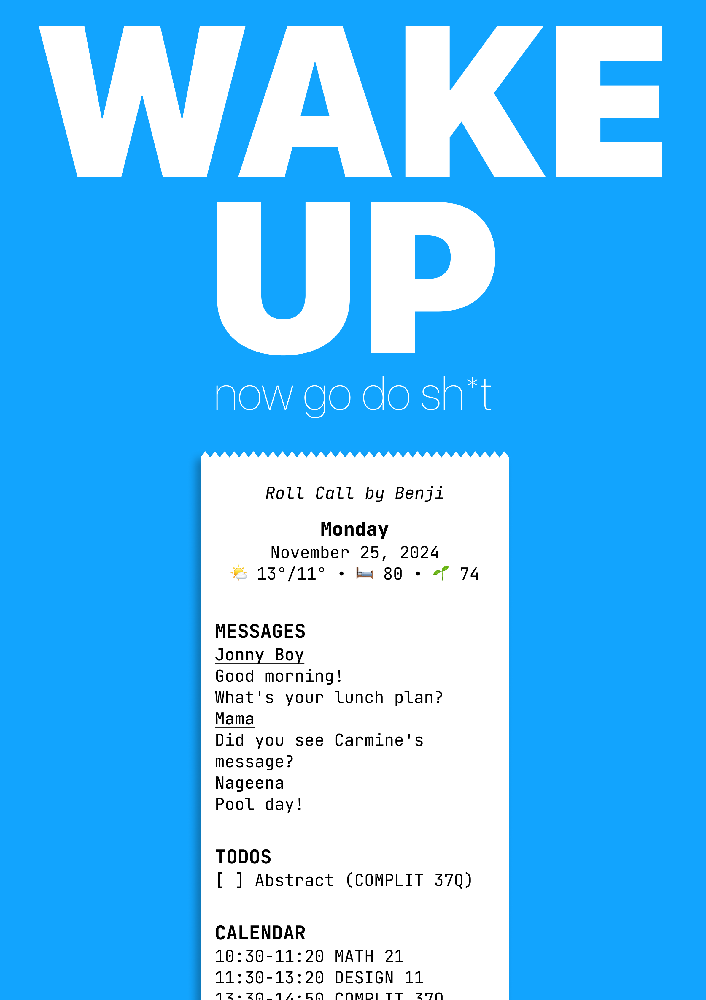
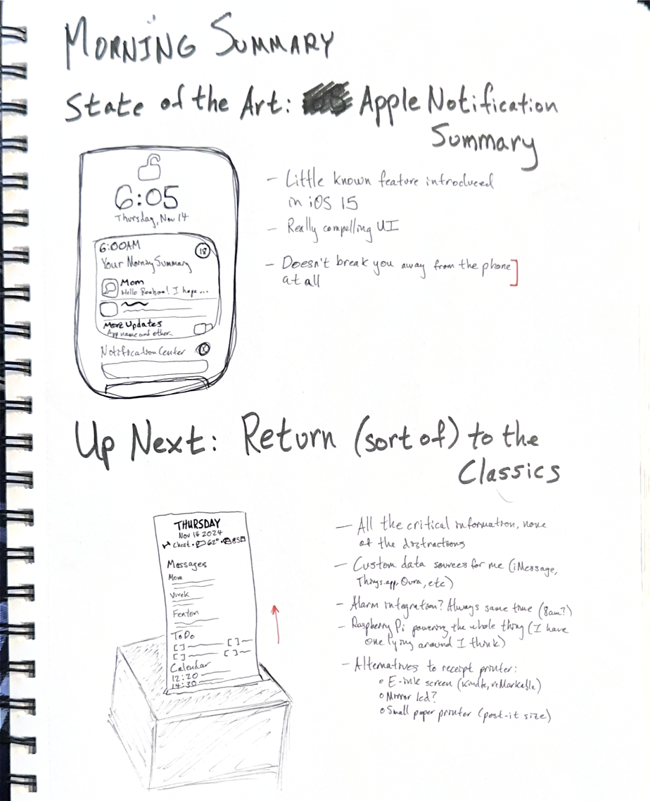

+++
title = "Roll Call"
description = "An experiment in replacing the phone in your morning routine."
date = 2024-12-17T14:52:00-08:00
+++

Roll Call is a jury-rigged receipt printer that sits on my desk and
dictates my morning routine. Every morning, it prints out a briefing
of all the critical information I need to catapult me into the day that
awaits. Phones are great—but I don't like checking mine when I wake up.
I want my brain fresh and undistracted.

I first ideated what would become Roll Call on a post-it note on the
wall of my dorm. When the final project of [DESIGN11] rolled around and
they asked us to "fix a bug in our lives," I knew I had to take
advantage of the opportunity.

After a flurry of on-paper ideation, I began with the software. It's all
open-source: the bulk is [a couple hundred lines] of bespoke Python,
supported by an iMessage library [I customized] to allow me to determine
if a message was unread. I call out to a few [startlingly] [good]
libraries to fetch the data that will go on the receipt: the day of the
week, the weather, my Oura Ring stats from the night before, unread
iMessages, my todo list, and my calendar events for the day. When that
was done, I called every single possible retailer in the Bay Area who
might sell me a receipt printer—no dice. I even asked a couple
restaurants that I was eating at if I could pawn theirs, which was
similarly unsuccessful. So I ordered one on Amazon (guided in my
purchase by [this blog post]), married it to my code, and have been
using it every morning since.

Roll Call is one experiment in my long crusade to replace the phone. Our
current era of mobile computing has brought benefits that are difficult
to fully comprehend. But they have come along with deep ills. The
combination of hardware and software in Roll Call has allowed me to
entirely eliminate my phone from this component of my daily routine. In
this slice of my life, I experience all the benefits of technology with
none of its downsides. However, this only works because I can still rely
on my phone during the rest of the day. I can replace my phone with a
receipt in the morning and feel better because of it, but later in the
day I still need to fall back to the harsh light of the screen to
respond to message, mark todos as complete, and more.

What the Roll Call experiment allows us to do is free our minds to
imagine what removing the phone might look like from the rest of the
day. This part? It's already taken care of. We've solved for this use
case, one that is normally solved with our phones. How can we solve for
the rest? We have an alternative way to read data, how can we rethink
writing? How do we redesign the rest of our phone-based experiences to
avoid falling into Instagram and a hundred other things that melt away
all the presence and the possiblity of our beautiful lives? This part of
the pressure is gone, now let's deal with the rest.

  

    <i>A theoretical, optional pitch that loses people but I think is
    conceptually neat and cool</i>
  

    Roll Call is paper, with a digital brain. Every morning I look at a
    slip of paper—for all intents and purposes the same piece of
    paper—and instead of remaining static it autonomosly reflects the
    changing state of the world around me. The state of the world exists
    in a Platonic ideal somewhere in conceptspace. Nowadays we represent
    all that information about our lives, that typically is just held in
    our heads, in various databases. That information is displayed back
    to us in our calendar apps, and todo lists, and all the rest. Those
    apps transform the database's zeroes and ones, which are themselves
    representations of ideas, into a form that we view on our phones all
    the time. Roll Call's receipts are equally valid transformations of
    those zeroes and ones.

The current implementation of Roll Call does have some gaps, which I
would love to address in hypothetical future versions. The most
prominent is its deep reliance on macOS: it reads iMessage's `chat.db`
directly from disk and searches `Contacts.app` to associate phone
numbers with names. Beyond that, Roll Call also doesn't trigger
automatically. Instead, I manually run the script on my laptop, which is
significantly less sexy. The device itself is pretty large and bulky,
and relies on some gross cabling (USB A, B, *and* C). It doesn't print
out my gym day. Some imagined diagnoses:

1. A Matrix-iMessage bridge, a-la Beeper, would make developing for the
   messaging platform less hellish. I could also skip the middleman and
   set up a direct API call from a Raspberry Pi to a macOS host in the
   cloud.
2. Developing a good CardDAV library in Python, which I shockingly
   couldn't find, seems like a simple replacement for the `Contacts.app`
   AppleScript-in-Python monstrosity I cooked up.
3. Ideally, the script would run as soon as I wake up. I wear an Oura
   Ring every night; it would be super cool to connect the printer to a
   webhook that gets called when the ring detects that I'm awake. That
   endpoint doesn't exist at the moment, and probably would be very
   difficult to create given Oura's current periodic-sync-over-Bluetooth
   technology. I'll keep my eye out though!
4. Barring the above, I would love to hook up the whole thing to a smart
   button (no screen!) that I can just smack and have the whole thing
   print.
5. Making the code asynchronous where it makes sense. Initially, I had
   the script fetch the data and then print it all out really fast. Then
   I introduced some styling that I had to weave throughout and couldn't
   do before printing: I miss the smooth all-at-once feeling. I think
   some smart code jockey-ing could bring this back.
6. Put the gym day in my calendar?

As a last component of my time in DESIGN11, we made little
advertisements. You can check out mine [here on YouTube]! Remind me
never to film when I have a stuffy nose ever again.

[DESIGN11]: https://explorecourses.stanford.edu/search?q=DESIGN11
[a couple hundred lines]: https://git.sr.ht/~figbert/morning-receipt
[I customized]: https://github.com/figbert/imessage_reader
[startlingly]: https://github.com/hedgertronic/oura-ring
[good]: https://github.com/thingsapi/things.py
[this blog post]: https://aschmelyun.com/blog/i-built-a-receipt-printer-for-github-issues/
[here on YouTube]: https://www.youtube.com/watch?v=rNGusG71qD8
