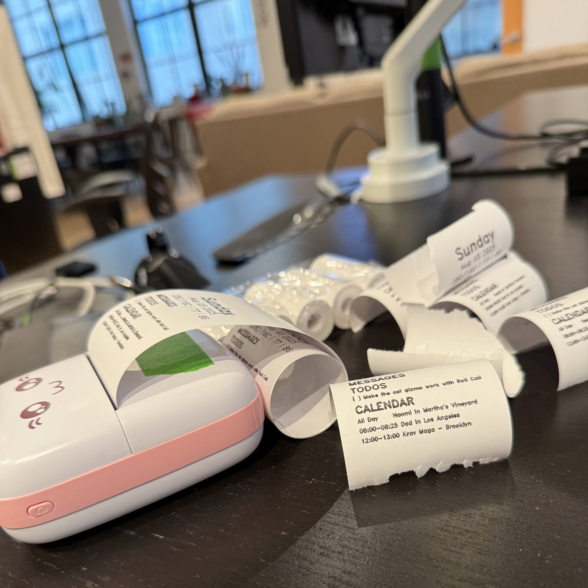

+++
title = "Roll Call"
description = "An experiment in replacing the phone in your morning routine."
date = 2024-12-17T14:52:00-08:00
updated = 2025-08-05T20:30:00-04:00
+++

Roll Call is a jury-rigged receipt printer that sits on my desk and
dictates my morning routine. Every morning, it prints out a briefing
of all the critical information I need to catapult me into the day that
awaits. Phones are great—but I don't like checking mine when I wake up.
I want my brain fresh and undistracted.

I first ideated what would become Roll Call on a post-it note on the
wall of my dorm. When the final project of [DESIGN11] rolled around and
they asked us to "fix a bug in our lives," I knew I had to take
advantage of the opportunity.

After a flurry of on-paper ideation, I began with the software. It's all
open-source: the bulk is [a couple hundred lines] of bespoke Python,
supported by an iMessage library [I customized] to allow me to determine
if a message was unread. I call out to a few [startlingly] [good]
libraries to fetch the data that will go on the receipt: the day of the
week, the weather, my Oura Ring stats from the night before, unread
iMessages, my todo list, and my calendar events for the day. When that
was done, I called every single possible retailer in the Bay Area who
might sell me a receipt printer—no dice. I even asked a couple
restaurants that I was eating at if I could pawn theirs, which was
similarly unsuccessful. So I ordered one on Amazon (guided in my
purchase by [this blog post]), married it to my code, and have been
using it every morning since.

Roll Call is one experiment in my long crusade to replace the phone. Our
current era of mobile computing has brought benefits that are difficult
to fully comprehend. But they have come along with deep ills. The
combination of hardware and software in Roll Call has allowed me to
entirely eliminate my phone from this component of my daily routine. In
this slice of my life, I experience all the benefits of technology with
none of its downsides. However, this only works because I can still rely
on my phone during the rest of the day. I can replace my phone with a
receipt in the morning and feel better because of it, but later in the
day I still need to fall back to the harsh light of the screen to
respond to messages, mark todos as complete, and more.

What the Roll Call experiment allows us to do is free our minds to
imagine what removing the phone might look like from the rest of the
day. This part? It's already taken care of. We've solved for this use
case, one that is normally solved with our phones. How can we solve for
the rest? We have an alternative way to read data, how can we rethink
writing? How do we redesign the rest of our phone-based experiences to
avoid falling into Instagram and a hundred other things that melt away
all the presence and the possiblity of our beautiful lives? This part of
the pressure is gone, now let's deal with the rest.

  

    <i>A theoretical, optional pitch that loses people but I think is
    conceptually neat and cool</i>
  

    Roll Call is paper, with a digital brain. Every morning I look at a
    slip of paper—for all intents and purposes the same piece of
    paper—and instead of remaining static it autonomosly reflects the
    changing state of the world around me. The state of the world exists
    in a Platonic ideal somewhere in conceptspace. Nowadays we represent
    all that information about our lives, that typically is just held in
    our heads, in various databases. That information is displayed back
    to us in our calendar apps, and todo lists, and all the rest. Those
    apps transform the database's zeroes and ones, which are themselves
    representations of ideas, into a form that we view on our phones all
    the time. Roll Call's receipts are equally valid transformations of
    those zeroes and ones.

As a last component of my time in DESIGN11, we made little
advertisements. You can check out mine [here on YouTube]! Remind me
never to film when I have a stuffy nose ever again.

## Eight Months Later...

Iteration continues. One random day at the [Recurse Center], my friend
[Frank] brought in a small device that caught my attention—a receipt
printer, in miniature! After one glance at its cute cat visage I knew I
couldn't pass up the opportunity.

This version of Roll Call [exists parallel] to the primary
implementation, and is interesting as a proof-of-concept of how extreme
portability might impact the device (it fits comfortably on top of my
MacBook Air trackpad). It ditches the cables in favor of Bluetooth—I
wrote a bespoke [Python package] to render receipts and submit them for
printing using the device's largely undocumented communication protocol.
Ultimately though, as entertaining as the new form factor may be
visually and as rewarding as it was to overcome the progamming
challenges in making it functional, I think this evolution of Roll Call
is likely a dead end.

There remain gaps in the current implementation worth exploring in
hypothetical future versions, however. Roll Call's deep reliance on my
laptop, for iMessage and Contacts as well as to drive the printer, is a
flaw in my screen-free vision. Ideally, all this would be replaced by a
simple button-computer that could talk to a cloud macOS server as well
as the receipt printer. As it happens, I have six weeks left at Recurse
and a whole bag full of microcontrollers...

[DESIGN11]: https://explorecourses.stanford.edu/search?q=DESIGN11
[a couple hundred lines]: https://github.com/figbert/roll-call
[I customized]: https://github.com/figbert/imessage_reader
[startlingly]: https://github.com/hedgertronic/oura-ring
[good]: https://github.com/thingsapi/things.py
[this blog post]: https://aschmelyun.com/blog/i-built-a-receipt-printer-for-github-issues/
[here on YouTube]: https://www.youtube.com/watch?v=rNGusG71qD8
[Recurse Center]: https://www.recurse.com/scout/click?t=0d85c06dc14f97552f2130471d4e3086
[Frank]: https://www.frankchiarulli.com/
[exists parallel]: https://github.com/FIGBERT/roll-call/tree/cat
[Python package]: https://github.com/FIGBERT/bleprinter
