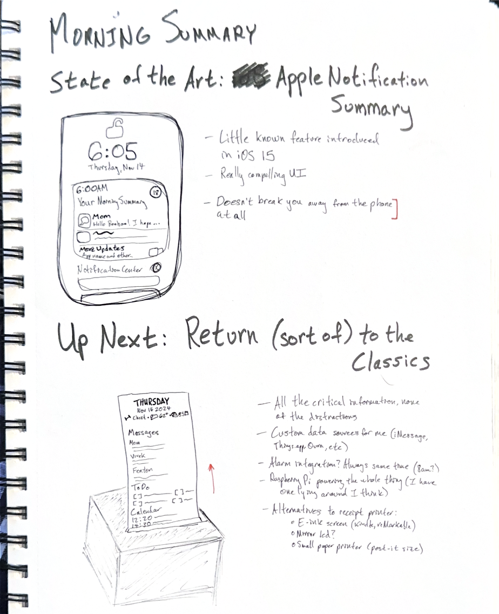
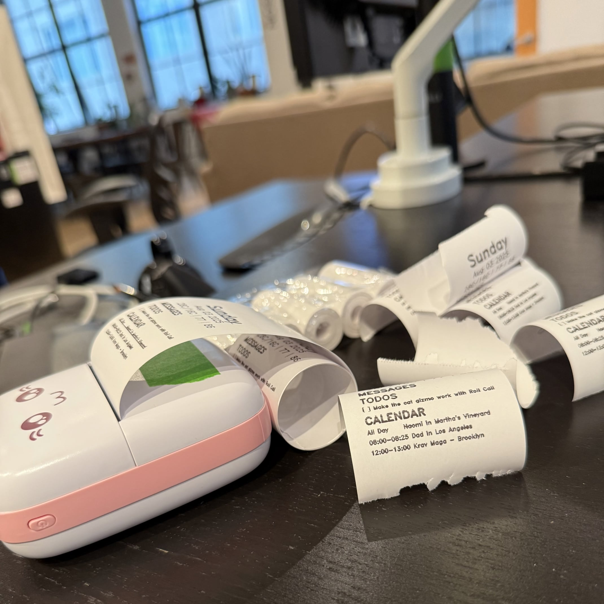

+++
title = "Roll Call"
description = "An experiment in replacing the phone in your morning routine."
date = 2024-12-17T14:52:00-08:00
updated = 2025-08-05T20:30:00-04:00
[extra]
icon = """<svg viewBox="0 0 801 1238" xmlns="http://www.w3.org/2000/svg" fill="currentColor"><g fill="none" stroke="currentColor" stroke-linecap="round" stroke-linejoin="round" stroke-width="4.25"><path d="m314.715088 96.919922-1.680176.459961.325073-.079834.172974.320068.43103-.480224-.372925 2.600097.122925 3.51001-.539917 7.76001-1.266113 5.46997.357056-.790039.285034.090088.826904-2.840088 1.111084-6.579834"/><path d="m314.250977 98.840088-.602051-1.320068 1.634033 2.669921.712036 2.01001 1.039917 1.330078.7771 3.810059 1.273926 1.879883 1.006103 2.270019 1.975952 2.419922 1.912964 1.700195.570068.109864.057984.46997 2.495971-4.859863 1.340088-5.660156 1.118897-9.399902-.06897-.310059-.531006.620117-.768921 1.51001"/><path d="m335.915039 109.909912-.581055-3.25-.643066-.619873-.073975-.550049-.166015 1.169922-.075928-.280029-.455078.670166-1.086914.209961-1.258057.72998-1.505981 1.76001-.598999 1.320068-.040039-.430175.204101 1.040039.688965.72998 1.01001 2.150147 4.054931.709961 2.264039-.840088 1.100952-.78003.955078-1.209961 1.354004-3.169921-.616944-2.070069-2.272094-2.219971-1.498902-.270019-.562988-.419922-.847168.050049-1.421875.659912-.749023 1.23999-.225098 1.959961.440063 2.370117.958008 2.339844 1.13501 1.410156"/><path d="m345.744995 102.870117-.051025-2.670166.162964.840088-.359864 1.099854.566895 2.860107 1.903076 3.689941 2.030029 2.840088 2.846924 1.979981 1.947998.080078 1.414063-.710205 1.110962-1 1.084961-1.949951.772094-2.989991-.414062-6.939941"/><path d="m381.771973 92.949951-.238037-1.869873.181152-.200195.149902 1.150146-.804931 2.090088.025879 2.709961.849121 9.02002.255859 7.369873.452148 1.390136.604981.089844 1.387939-.780029"/><path d="m399.832031 91.409912-.561035-1.109863-.38208.379883-.696899-.639893-.33606 1.419922-.882935 1.520019-1.770996 19 .056031.479981.188964-.290039.027955-1.030029"/><path d="m390.469971 90.709961-.792969.330078.296997.889893.39502-.309815.349975 7.959961-.421997 4.679932.247925.399902 1.824097-1.299805 11.880981-6.350097.386963-.139893 1.986084.549805"/><path d="m423.405029 92.75-1.083984.909912-.683106-.639892.097046.280029.284058-.439942 1.104004-.140136 1.125976-1.050049 1.649903-.729981.808105.03003.209961.560058.477051.209961.686035 5.639893-.51001 2.290039-2.577148 4.020019-1.152832 1.219971-.436035-.039795-1.804077 3.009766-1.284058.740234-.479004-.230224-1.212891 1.780029.210938-.419922.5271.199951 1.109863-.619873 1.413086.319824 1.71997-.569824.6521-.580078 1.456909.300049.52002-.459961 1.246948-.140137.722046-.47998 3.398071-.070069"/><path d="m447.281006 92.810059.906006-2.640137-.334961-1.869873-3.998047 2.320068-3.205078 3.889893-1.99585 4.21997-.656006 2.439942.810913 3.860107 3.895996 3.320069 1.730103.760009 2.203857-.260009 4.083985-1.050049 4.684082-4.979981.573974-2.310058-.043945-1.449951-.572021-1.400147-2.918946-3.799805-2.47998-.960205-.934082.220215-1.446045-.610107h-1.271973l-1.630005.26001-.75.590087-1.14392 1.879883-.099122 1.570069.327149 1.119873.957886.680175"/><path d="m472.041016 89.879883-.383057-1.479981-2.041992-1.449951-2.214966-.909912-.905029.23999-1.181031-.22998.291016-.219971.56604.25.608032-.560058 2.510987-.800049 2.718994-.25 1.093017 1.72998.621949 3.449951-.011963 1.640137-.819947 3.189941-4.037109 8.640137-1.870972 1.759766-1.157959 1.620117-.752075.080078-.328979-.550049-1.026001.300049-.776001-.800049 4.341064-1.189941 4.098999.169922 1.240967-.290039.873047.380127 1.856933-.330078 2.421998-1.050049.587036-1.310059"/><path d="m498.678955 79.77002-.187988-.149903-.854981 3.199951-2.271972 9.790039-.269043 2.649903.190063 4.46997"/><path d="m490.658936 81.629883-.085938.680176-.610962.869873.028931 1.959961-.697998 5.040039.096069 2.47998.412964.850098.223999-.28003.375977 1.580079.483032-.070069.385986-.590088 1.243042.77002 4.95398-2.959961 3.988037-2.869873 3.141967-1.170166h1.855957"/><path d="m241.960938 147.780029-.516968-.23999-.630982.27002.008057-.890137 1.55896-1.349854-.285034.879883 1.667968 2.380127 3.492066 8.530029 2.471069 3.979981-.515136-2.140137"/><path d="m242.432007 150.169922.192016.620117.190918-.290039-.007934.23999 1.007934-.310058 4.686036-1.969971 1.092041-.830078 3.475952-1.639893 10.86206-7.139892-.016967-.27002-.650147.459961-1.296875-.100098-.696045.290039"/><path d="m264.991943 129.699951-1.429931.550049 1.305908.629883 3.812012 9.350097 3.097046 5.239991 1.701049 1.630127"/><path d="m298.208008 139.73999.341064.290039.566895-.080078 1.301025-.639892.645996-.719971-.062988-.320068-1.960937 1.600097-1.896973-.01001-1.873047 1.429932-.613037.25-.394043-.189941-.77002 1.169922-3.746948 3.030029-1.223999 1.399902-1.677002 2.910156-.171997 1.639893.444946 2.959961 1.791016 2.620117 3.151123.799805 7.529907-1.409912 3.333985-1.469971"/><path d="m307.869019 137.540039-.707032-1.97998.291016.199951-.391968 2.369873.457031 5.390137 1.340943 8.790039 1.170044 2.829834.355957.230224.105957-.240234-.296997-.409912.077026-1.989991 1.286011-7.129882.862915-1.090088 1.816162-.949951.781982.959961.861939.25.333984-.199952.588013.879883.570068 1.880127-1.12915 7.709961.181152.300049 1.266846-.840088 1.347168-.409912"/><path d="m323.06897 147.310059-.453003.819824.395019.920166.358033-.590088.547973.850098 1.875.040039.419922.46997 3.875-2.530029.75708-1.120117.018067-.77002-1.243042-1.689941-1.181031-.080078-2.291992 1.040039-1.887939 1.830078-.965088 2.25-.469971 3.22998.031006 1.229981.503906 1.199951 1.057129.610108 1.963989.189941.588013-.25 1.516968-1.300049 1.296997-.339844 4.005981-2.650146"/><path d="m341.572998 144.290039.61792-.870117-.427002-.639893-1.721924.379883-.411987-.469971-.689087.76001-.479004-.520019-.387939.640136-2.783936 1.339844-.817017.77002-.109985.5.749024.430175.215942-.23999.753052.639893 1.669922.119873 1.503051.790039.537964-.040039 1.872071 1.01001 1.228027 2.170166.116943 1.5-.373047 2.369873-.645019.410156-.052002.789795-.641968-.729981-1.450073.410157-3.529907-1.830079-2.541993-.600097"/><path d="m349.36792 146.419922-2.674927-.01001-.559936.200195-.056031.329834 1.203003-.149902 1.782959.810059.650025-.360108 2.401977 1.189942 2.416016-.309815.846924-.590088 2.340088-.189941 1.61792-1.150147"/><path d="m354.199951 131.379883-2.085937 3.630127-.702027 1.869873-1.232055 5.320068-.199952 5.110108.580079 6 .30896.909912.234008-.099854.665039 1.189942.963868-.699952 1.347045.459961 3.21399-1.010009 4.152099-.580079"/><path d="m377.363037 150.469971-.777099-.090088.529052-2.189942.496094-.929931-.536133 1.149902.139038.27002.29895-.699952-.053955.479981.038086-1.199951.111939.840088-.20398-.290039 1.061035 1.25"/><path d="m392.523926 153.379883-.932862-.119873.572999-.399903.220947-.670166-.258057-.599853.221069.879883.402955-.399903.260009.459961 1.302979-.689941.489014.329834 1.033935-.599854 1.031006.01001 2.651123-1.140137 1.532959-.030029 9.936035-2.539795 2.477051-.340088 1.5979-.679931 2.354981.199951.706054-.620117.298951.23999 1.690063-.299805 1.010986.23999 2.557984-.570068 2.69104-.130127-.447022.660156-.03601-.930175-.132935.760009.213867-.319824.215088.280029.106934-.350097-.179932.47998-.182007-.25-.072021.23999-.046021-.47998-.093017.800049.10498-.929932.097046.929932-.005005-.75.001953.369873 1.115967-1.479981 1.565064-1.310058 1.004028-.189942.984985-1.139892.093018.300049.521972-1.300049 2.283082-3.02002 1.118896-2.150146.21106-2.719971-.748047-1.73999-.135987.209961-.212036-1.779785-.55896-1 .034058-1.060059-.416992.040039-1.549073-1.120117-.635986-.179932-.303955.26001-1.101074-.810059-1.787964 1.04004-.328003-.399903-.081055.379883-1.115966.860107-3.044922.899903-3.131104 1.540039-1.118896 1.030029-.232056-.090088-.30896.98999.125-.570068.104981.280029.193969-.359863.045044.280029-.228027-.230224.166015-.609863-.119995 1.090087-1.084106-3.150146-2.49585-3.070068-3.781982-1.949952-1.679077.050049-1.106079-1.199951-.663941-.060059-.350952.409913-1.495117-1.25-1.084961.110107-.588989.639893-1.776001-.599854-2.006958 1.310059-2.043091.889892-1.26001.159912-.520996.710205-.729004-.120117-.933838.600098-.156006-.27002-1.052002 1.229981-.307128-.070069-.046875.380127-.333008.039795-.297119-.559814-.945923 2.97998-.931031 1.699952-.274902-.159913-.175049.809815.171997-.669922-.085083.449951.111084-.47998.100952.25-.468994-.699951.088013-.929932-.198975.459961.169922-.729981-.10791.589844.067993-.299805.187989.519776-.736939-.549805-.305054.639893-.391967-.219971-.351075.399902-.190918-.260009-.562011.590087-1.708008 2.320069-.207031-.160156-.2771 1.060058-.333984-.139892-1.793946 8.030029.477051 3.539795.494873-.389893.755127 1.73999 1.577881 1.189942 4.518066 1.310058.901001.620118 1.661011.209961 2.542969.909912 1.488037 1 1.969971.120117"/><path d="m449.467041 125.76001-.078125-.459961-.481934.649902-.667968.030029-.990967 1.28003-3.004028 1.619873-4.057984 5.180176-1.938965 3.869873-.393066 1.699951-.090088 1.580078.796143 2.209961 1.668945 1.620117 3.780029 1.48999 2.046997-.130127 2.894898.340088 5.473144-1.98999 1.163941-.77002.291015-.530029-.026001-.97998-1.203003-2.040039-1.253051-.689942-.625.290039-1.583985-1.290039-1.500976 1-1.484009.28003-1.976929 1.619873-.38501.550048.073975.890137.629883.48999.875.050049"/><path d="m465.916992 132.840088-1.120971-.790039-.416016-.689942.079956-.970214.37207.150146.476929-.790039 1.067993-.570068 1.12207-.369873 1.06897.109863.80603.5 1.807007 2.969971.459961 1.430175.235962 2.5-.676025 3.889893-2.282959 3.179932-1.476929.370117-1.244019-.070069-.445068.449952-.610962-.489991-.932007-1.079834.122071-1.070068.379883-.310059.177001.199952.603028-.889893 1.090088-.409912 2.078979.449951 1.721924 1.23999.845093 1.28003.924927.439941 4.540039-.689941.597046-.370118"/><path d="m491.485962 117-.557007-1.639893-.187988.099854-.479981-.659912-4.546997 2.369873-2.490967 2.430176-1.128051 2.22998-.189942 2.76001.658936 2.159912 2.01001 2.100098 1.463012-.100098 2.774048-.98999 2.597901-2.03003 1.291992-3.050048-.003907-1.040039-.758056-2.029786-1.026978-1.170166-.635009.219971-.552002-.719971-1.240967-.560058-1.286988.26001-1.207031.920166-.665039 1.879882-.129883 1.76001.157959 1.130127 1.054932 1.439942"/><path d="m503.036987 133.48999-1.073974.120117-.474976-.830078-.744995.28003-.796997 1.839843-.029053.660157 2.243042-1.430176.25293-1.199951-.942017.180175.103028.229981.053955-.350098.202026.100098-.005981.429932.171997-.719971.145019.520019.28003-.23999.289917.23999-.49292-.110107-.011963 1.140137-.329102 1.119873-.208984-.199951.584961.520019"/><path d="m525.385986 117.959961.042969-.689941.445068-.370118-.265014.360108-1.196045-.459961-1.38794.020019-2.572021.78003-1.02002-.050049-1.114013.689941-1.267945-.080078-.968994.670166-.475097-.22998-.579956.549804.505004.03003h-.269043l.004029-.349854-.098999.339844.16101.380127-.660034 1.51001-1.10791 5.409912-.097046 9.25.70398 3.5.73999.929931.12207.810059.503907.150146.125.769776.939086-.809815 1.337037.639893 3.82788-.979981.929078.370118.901001-.390137 5.369995-.459961 3.968994.129883 3.535034-.859863 2.371948-.199952 1.744019.329834 4.604004-1.459961.984009.290039 1.386962-.899902-.475952.399902.13794.53003.166015-.580078-.03601.420166-.114991-.370118-.155029.28003.043091-.419922.116943.5.035034-1.060059.856934-2.630127 1.914063-12.599853 1.029907-3.850098.131103-2.689941-.209961.75-.258056-.130127.104004.5-.168946-.209961.416992-.290039-.149047-.549805-.093018 1.01001-.07605-.76001-.047973.639893-.172974-.5-.331055.330078-1.491943-.090088-.292969-.280029-1.890991.440185-14.878052-.450195-1.188965.450195-.331054-.700195-.239014-.099854-.042969.419922-.144043-1.01001-.328979.340088-1.039917-1.46997-.164063.260009-3.54602.519776-.557984.340088"/><path d="m517.744995 118.330078-.199951-.370117.185913.48999.950073.170166.862915.789795.278076-.149902-.136962.23999.031982-.26001.918945-.149902-.437988.349853-.177978-.189941-.039063.320068-2.958984.159912-.666993.469971-.225952.620117-.686035-.340088-.609985 1.370118-.343018-.200196-.652954.729981h-.36206l-1.033936 2.75.273926 3.140137.484985 1.71997-.122925 4.729981.408936 1.939941.827026 1.479981.927002.100097.275025-.449951 1.067016.689941 1.217041-.679931 1.929932.040039.901977-.430176 1.628052.410156 3.691895-1.390136 1.039062-1.25.071045-.639893-.32605.979981.504029-.78003.073974.340088-.213989-.140137-.203003.560059-.36792-5.050049 2.188965-8.379883.054932-2.080078-.231934-.810058-.296997.280029.12793.160156.157104-.410156.069946.550049-.135986-.78003.052002.469971-.394043.170166-.599975-.400146-2.46399-.080078-.29602-.359864-1.109986.669922-3.510986 1.189942"/><path d="m566.356934 116.649902-.441895-.949951-.385986.179932-1.026123-.369873-1.560913.439941-1.052979-.089844-.605102-.410156-2.126954 1.02002-2.709961.23999-2.205078 1.070068 1.455078 2.439942 1.615967.909912 8.916992 3.5 2.144043 1.650146.81897 1.469971.248047 2.02002-.390015 1.909912-1.988037 3.160156-1.794922 1.48999-2.650024 1.399902-.765015.810059-.956054.189941-2.381958-.050048-.906006-.639893-.162964-1.310059.641968-2.449951 3.28894-5.260009 3.168091-3.070069 5.72998-6.919922.838013-.150146 1.073975-1.699951.473999-1.51001-.302979-1.089844-2.479004.01001-1.822998.339844-4.141967 1.75-1.485108.260009-.393921.469971"/><path d="m589.583984 116.949951.055054-.839844-1.192993-.580078-3.068115-.209961-.498902-.320068-2.968017.840088-.599976-.210205-1.440063.610107-.781983 1-.958984-.179931-1.228027.310058-.843018 1.919922-.570923.530029-.539062 2.209961-1.168946 1.659912-.447021 1.969971.037964.310059.30896-.03003.398071-.810058 5.156982-1.559815.81897-.5 2.578003-.010009 1.501099-.630127.932983.620117 1.755981 3.359863 1.494019 6.360108.083984 2.909912-.885986 1.430175-1.863037.789795-.537964-.319824-.802002.579834-1.054077-.049805-3.519897-1.270019-5.804078-3.280029-1.486938-.27002"/><path d="m267.021973 224.969971-.58899.159912-.223022-.419922.14209.189941.589966-.270019.037963-.969971-.437011 1.410156-1.349976 1.469971-3.390014 8.550049-3.906983 20.159912-.75293.790039.575928-1.870117 1.51001-2.679932 1.176025-3.580078 3.417969-6.22998 2.93103-7.02002.530884-5.819824-.736938-1.810059-.953003-1.25.624023.849854-.064941-.309815 1.658935 1.099854 4.395996 6.910156 2.552979 3.079834.744018.120117.718018-.330078.325073-2.25.767945-1.149902.310913-4.420166.75708-3.629883-.102051-6.040039.406006-4.48999.373047-1.099854.326904.429932-.011963 1.47998.208008-.169922.831055 2.069825 4.091064 6.300048 6.933838 14.78003.909058 2.699951-.619019 1.790039-.878906.610107"/><path d="m306.906982 240.449951-2.274902-.369873.692871.319824.482056-.159912.197998.360108 1.087036-.620118 1.452881.5.95105-1.530029-.863892-2.060058-1.761108-1.799805-.715943-.300049-2.827026.109863-1.911987 2.170166-.598023 1.219971-1.190063 1.300049-.536866.149902-.309082 3.52002.317017 1.629883 1.380005 2.390136 1.541016 1.229981 1.498046.649902 2.024903.370117 1.086059-.320068 4.005982-.129883 3.328979-2.23999 2.27002-1.150147 1.05896-.169921"/><path d="m324.37793 234.47998-.852906-.600097-.013061-1.689942.619018-.510009-.156982-.669922.176025.409912-.533081.520019-2.04895-.300048-5.07605 1.75-2.991943 1.720214-.904053 1.589844-2.365967.860108-.67395-.150147-.680053.800049-.055909.47998.427002-.010009.208008-.369873.98291.159912 2.052979 1.290039 3.045044.75 5.550903 2.060058 2.082031 1.609864.833985 1.780029.141113 1.860107-.808105 2.429932-1.354004 1.030029-2.50293.939942-3.081055.030029-1.86499-.669922-1.270996-1.120117.036011-1.27002"/><path d="m337.156006 234.01001.707031-1.800049.656983.169922.062988-3.019776-.317993-.880127-1.214966-.119873-.62207.649903-2.27295-.070069-2.619018 2.01001-1.729981.880127-.545044-.360107-.545898.080078-.348145.719971-1.240966 1.030029-.600953 1.23999-1.319946.719971-.025146.919922 3.895019 2.680175 2.608032.559815 1.095093-.059815 2.435913.719971 1.140015.679932 3.895019.949951 1.819947.929932 2.395019 2.090087.007935 1.489991-1.720947 1.630127-1.322022.609863-3.895996.810059-2.878906-1.640137-1.607056-1.73999-.200073-1.349854"/><path d="m357.335938 238.179932.00415-2.139893.923828-5.449951-.208984-1.680176-.237915-.26001-.137085.300049-.399903-.540039-1.593017.130127-2.827027 2.51001-2.464965 4.520019-.533936 1.849854.217895 2.090088 2.009034 1.5.736938-.02002.557129-.770019.233887.310058 1.781982-.179931 1.207031-1.140137 2.395997-3.589844.60498-2.530029-.130981-1.52002-.395997 1.069825-.401977 5.450195.538086 2.939941.5979.439942.426026-.320069.187988.229981 1.494019-.049805 3.02893-1.430176"/><path d="m385.205078 231.169922-1.513061-.419922-3.203003.050049-1.833008-.679932-.780029.229981-.370972.929931-.692993-1.120117-.781983.840088-.334961.969971-.505127-.02002-1.659912 1.449951-.896972 1.570069-.234131 1.770019 1.001098 1.550049 2.049927.349854.51001.460205 4.620117-2.450196 1.729004-1.48999 1.001953-1.679932-1.070068 1.380127.095947 2.469971.893066 4.219971 1.501954 2.48999.731079.639893 5.229004 14.650146.748901 3.979981.39502 4.439941-.189942 5-1.505005 2.550049-1.140014 1.329834-1.712891-.719971-.910156-1.109863-.484864.159912-2.347045-1.359863-3.821045-4.120118-2.609986-3.869873-1.029052-.900146-2.87793-3.76001-5.265991-8.109863"/><path d="m404.730957 232.389893-1.937012-.449952-1.656006.300049-2.166992-.149902-1.640869.689941-.359131 1.310059.778076 1.48999 1.098999.169922.622925.449951 1.78711.060059 4.391967-.860108 2.208985-1.779785 1.237915-1.890137-.059937-1.689941-.718994-1.160156-1.239014-.369873-.284057.290039-1.237915-.170166-1.944946.360107-2.127076 1.179932-1.05896 1.270019-2.560058 2.120118-.89502 4.290039.446045 2.010009 1.717041 2.239991 2.572998.959961 1.811035-.160157 3.921875-1.329834 1.239991-.020019 1.857055-1.189942 3.725952-1.610107 3.972046-.580078 3.374024-.869873 1.608032-.840088 1.510986-.080078 3.241944-1.029785 1.539062-1.340088 2.024903-2.840088.128051-2.109863-1.390991-1.920166-1.895019-.369873-1.312012.340087-.600952-.470214-3.484009 1.680175-.585938-.300048-1.639038 1.040039-.682983.859863-1.411133-.139893-.644897.840088.274048.589844.251953-.169922 1.460937 1.439941 1.552979.409913 1.50708-.199952 1.772949.880127.952026 1.129883.398072-.159912 1.170898.919922.764038-.149902 3.436035 5.849853.503052 2.680176-.096069 1.020019-.617066 1.299805-3.468994 1.080078-2.155029.169922-2.835938-.22998-1.666992-.659912-3.289062-.01001"/><path d="m270.161011 281.27002.329956-.350098.536011.150146-1.115967 1.579834-.848023 2.03003-1.209961 4.510009.219971 8.340088.401001 2.310059-.564087 1.959961-.06189-.709961-.04602.629883-.293945-.129883-1.547119-5.729981-.101929-2.730224 1.020996-4.25 1.880005-3.119873.726074-.830078-.37207.46997 1.343017 1.160157 1.124024 3.010009.958008 1.189942.51892-.02002 1.401001 3.290039.710938.709961.383057-.25 1.260009 1.830078.833985-.810058.662109-2.040039 1.237915-11.51001.210083.620117-.329101 1.889893.155029 1.96997 2.072998 3.03003 1.421997 6.429931.267944.120118 1.187989 3.540039 1.322021 1.619873.544067.170166.375 1.169922.802002.629882"/><path d="m298.471924 294.709961-1.402954-.51001-.521973-.679931-1.358032.639892-.290039-.339844-.920899.819825-.503051 1.070068-.25-.159912-1.358033.570068-1.552978 2.219971-.11499 1.030029.656005 1.269776 1.639039 1.930175 1.473999.559815.755004-.179932 3.098023.650147 1.658935-.560059.755005-.969971.950074-.320068.846923-.72998 1.050049-1.709961.473999-1.739991.017945-1.160156-.583985-1.879883-2.609009-2.890136-1.847045-.919922-1.305909-.109864-2.447998.579834-1.091064.75-.692993.680176-.152954 1.789795.571045 1.570068.90393 1.300049 1.125977.369873 2.493042-.089843"/><path d="m310.348999 291.669922-.947021.400146-.114991-.680175.003052.400146.313965.389893.623047-.079834.36499 1.209961.48291 8.659912.332031.47998-.0979-1.619873 2.946899-9.959961 1.465943-1.490234.599121.360107 1.041016-.899902.406005 1.619873.726929 7.51001.05603-1.229981.300049.040039 3.022949-2.540039 2.105957-2.97998.603028-1.360108.359009-.089843-.128052.699951.916992 1.199951.119019.75.568969.48999.247071-.520019.974975 3.290039.825073 1.23999.336915-.109863.740966 1.439941 1.798096 1.790039 1.895996 1.109863"/><path d="m291.88208 319.540039.046875-2.169922.373047-1.230224.095947 1.020019.978028 1.479981 1.256103 1.120117.726929.21997 1.55896 2.610108 3.241943-.810059.311035.570069.479981.059814 2.452148-2.859863 2.677002-1.790039 1.11499-1.130127 2.427979-.709961 2.198974-.309815 3.050049.199952 1.067871.419921.562989-.159912 7.175049.809815.890991.620117.990112.129883.958984-.449951 7.791016-1.76001 3.462891-1.25 5.546997-2.429932 9.260009-4.73999 5.749024 3.939941 6.579956 1.989991 3.39502-.599854 1.330078-.880127.659912.090088 2.582031-.890137 1.291992-.069824 2.773926-1.130127 1.369141-1.209961.816894.290039 3.573975-.22998 3.236084.5 1.174072-.130127 2.707886 1.690185 3.281006 1.469971 2.283081.099854 1.260009-.679932.594971.310059 3.830933.319824 4.012085-1.23999 1.573974-1.319825.777954.139893 5.360962-1.439941 3.367066-.979981 1.565063-.949951 11.73999-.02002 6.656006-.760009 7.111939-1.900147 2.506958-1.179932 13.462036-3.300048 2.822021-1.139893"/><path d="m304.511963 338.550049-1.583008-.050049-1.48291.810059-.530029.859863-.19104 1.950195.637085-1.300049.234863.959961.589111-.840088 2.275879-.189941 2.276123-.790039 1.109985-1.199951 2.630982-.080078 1.136963.510009 2.535034-.849853 1.312012-.960205 1.401001.030029 2.141967-.679932 1.447022.179932.723999-.469971 3.509033-.75 4.323975-.260009 8.305908 1.22998 5.255127-.329834.781006-.180176 1.819946-1.379882 1.750977-.02002 4.045044-1.159912 8.661987-4.580078 2.890991-.699951 4.677979-.27002 3.587036.179932 3.337036.820068 2.062012.969971 3.08789.090088 1.609131-.75.904907.359863 3.944947-.169922 1.956054.439941 4.025025-1.070068 2.024048-1.429932 1.096923.159913 3.476075-.659913 2.507934.239991 7.604981-2.169922 3.547973-.040039 7.482056 1.060058 11.271973 3.179932 3.05603.560059 3.459961.349853 5.125976-.069824"/><path d="m277.36792 368.709961.63208-.75-.050049.689941.350098-.409912-.073975 1 .901856 1.469971.773071 3.97998 2.335083 6.830079 1.175903 2.389892.21399.340088 1.291015.139893.327027-.239991-.007935.220215.568848-1.600097 1.463134-1.26001.881958-1.75 3.184937-9.149903 1.039062-8.100097.949952-3.850098.720947-1.399902.352051-.310059.12207.300049-1.020996 6.76001"/><path d="m302.356934 376.26001-.282959.280029-.203003-.469971.187011-.21997.502076.579834-.482056 4.449951.184936 1.520019.266114.180176-.274048-1.050049.249023-2.75"/><path d="m300.968994 360.449951-1.042969.420166-.270019 2.339844.845947 2.650146 1.068115.069825"/><path d="m310.202026 369.209961-.54895-.369873.213867.199951.390137-.449951.185913.799805.20105-.269776.589966 4.109863.917969 1.959961 1.150024.910157.586914.079834 1.333008-.439942.468994-.550049.890137.080079 3.694946-3.169922 2.339966-3.630127.788086-1.959961.04895-2.110108-.401978-1.709961-.714111-.119873"/><path d="m331.453003 367.610107-1.631958.029786-.177002-.369873-.103027.379882-.38208.080078-.179932 1.54004.869995 1.550048 1.160034-.190185.540039-.539795 1.555908.179932 1.219971-1.02002.508057-1.100098.536987-.409912-.599975-1.97998-.13794.21997-.809082-.260009-2.583008.370117-1.593017 1.76001-.864014 2.799804.146973 1.160157 1.047119 2.540039 1.209961.760009.649902-.300048 1.384033.449951 1.972046-.689942.968994-.670166.455933-.829834 3.225098-2.21997"/><path d="m343.927979 355.179932-1.638916-.169922.378906.929931.900024 9.290039-.222046 5.110108-.552978 2.719971.125 3.189941.006103-.23999.541016.01001.164917-.77002 1.079956-1.209961 2.00708-3.400146 2.840942-7.149903 2.134034-3.330078 1.04895-.780029 2.129028-.829834.674927.429931.640137-.300048 1.637939.350097-.325928 1.929932-1.812011 2.380127"/><path d="m349.86499 367.439941-.606933.25-.731079 1.28003-.375977 1.72998 1.710083 1 .528931.850098 2.748901.320068 2.87207 1.109863 2.354004-.22998 1.031006-.610107 1.038086.270019"/><path d="m286.709961 395.959961-1.261963-1.26001.487061.600098-.120118.270019.435059.239991.598999-.380127.120972.48999.613037.340088.238037.919922.421875.190185.293091-.470215 2.662964-.309814 2.229004.109863 1.270996.390137 3.153076-1.150147 1.35791-1.459961.520996.25 1.603027-.530029 1.26294-.030029 5.010986-2.48999 5.680176-2.099854 7.786865-1.580078 5.914063-.72998 3.786987-.130127 2.014038-.519776 8.052002.329834 1.368897-.429931 2.156005-.080079 1.122071.459961 4.178955-.98999 11.47998-.659912 5.723023.110107 1.811035.76001 5.765014-.380127 5.006958.070069.959107.669921 1.030884.209961 1.010009-.550048 2.920044-.679932 1.614991-.98999 3.48291-.699951 1.416992.109863 2.25-1.119873.913086-1.189942 2.619019-.71997 1.276.059814 2.891968-1.379883 3.937012.090088 4.281982-.480224"/><path d="m294.893066 419.850098.773926.23999-.26001.169922-.131958-.820069-.186035.390137-.236938-1-.016113.719971.49414-.820069.359863.320069 5.439087-1.26001 1.603882-.01001 5.675049-1.409912.905029.069824 2.895996-1.270019 1.363037-1.25.489014.219971 1.621948-.369873.968995.20996 2.575073-1.070068 1.346924-1.039795.59497.23999 5.473145-.100097 7.115967.780029 5.074951-.449951 2.523926-.76001 8.580078-.630127 7.053955-1.619873 2.645019-1.48999 1.182984.139892 4.377075-.840087 1.020019.070068"/><path d="m291.599976 445.189941.494018-1.25.208985-.310058.290039.190185.380981-.73999-.277954 1.059815-.319092-.419922-.033935.770019.479003 6.01001 3.666993 19.389893.552978-1.019776.572998-3.270019"/><path d="m291.403076 444.040039-1.922119-.459961-.340942.589844.302002-.819824 1.142944.819824 1.166016-.049805 1.005004-.540039 4.757935.089844 2.974121-.780029 1.31897-.729981 6.958984-1.539795"/><path d="m287.144043 457.550049-2.229004 1.649902-.364014.699951 1.451905-.139892.435058.520019.593018.119873.576904-.5 2.290039-.569824 2.008057-1.280029.884033.149902 3.989014-1.079834 1.849975-.110107 2.95691-1.439942 1.294067-1.130127 2.895996-.689941"/><path d="m306.386963 462.51001-1.806885.409912-.957031.920166 1.672974-.200195.099975.440185 1.626953-.48999 1.437989.309814.892089.76001 3.975952-2.5.525025-.020019.605957-1.269776.055054-1.090088-.71399-.800049-1.781005-.929931-1.376954.270019-1.91809.989991-2.495972 3.310058-.595947 2.859863 1.112915 3.179932 1.013061 1.130127.725952-.150146 1.190064.910156.958008.320068 2.020019.009766 5.681885-3.339844"/><path d="m326.258057 455.879883-.927979-1.269776.062988-.410156.506958.150147.425904 1.689941-.077881 1.729981.75 3.919921-.182129 1.930176.4021 4.829834.846923-.579834 1.531006-2.280029 1.535034-3.870117 1.546998-5.159912 2.078002-4.930176.517945.640137-.416016 2.590087.085083 3.409913-.374023 3.169921.523071 2.110108 1.282959.389892.376953.729981.153076-.429932 2.697022-2.310058"/><path d="m345.343018 453.610107-.719971.399903.402954.520019.966919-.21997.734131.530029 1.691894-.170166.989991-.819824.416015.189941 1.812988-.310059 2-1.010009 1.429078-1.580078 3.22998-2.099854 4.005005-4.429932"/><path d="m356.254028 433.120117-1.026001-.080078-.653076.339844-1.50293 1.25-.671997 1.540039-.026001 1.860107.825928 4.969971.281006 6.5-.429932 7.149902-.686035 4.690186-.00708 3 .089111 1.020019.39795.529786.569092-.029786.865966-.670166"/><path d="m369.174072 456.860107.490967.209961 1.531982-1.300048.104004.560058.031983-.469971-.445069.019776.07605-.199951-.961059-.379883-.282959-.429932-.152954.23999-.444947-.530029-.86914.179932-1.179932.879883-.845947 1.310058-1.350098 1.130127h-.452881l-1.434082 2.869873.00293 1.070069.75415.96997.523926.03003 1.619995 1.560058 2.208985.549805 3.169067.230224.88501.699952 2.419922-1.219971 1.020019-1.530029.408936.040039 2.029052-1.489991 1.44104-2.440185.360962-2.329834-.515014-1.850098-2.092896-1.850097-3.457031-.769776-2.713013.449951-2.218017 1.02002-1.702027 1.26001-.823974 1.369873-.14209 1.159912.173096 1.300049 1.120971 1.790039.472046.580078 1.525879.76001 3.300049.099853"/><path d="m388.491943 449.01001-.697021-1.25.597168.530029-.002075 4.699951-1.21106 5.840088.133057.51001 5.297973-5.300049 3.312012-7.150146 2.856079-3.109864.782959 5.320069 1.541992 4.339843.610962.850098 3.419068 2.339844 1.228027.070068"/><path d="m300.981934 497.189941-.525879-1.659912.326904.489991.357056-.77002.254028 1.159912 4.696045-.530029 3.028931.110107 3.453002-.830078.995972.030029 4.031006-1.97998 4.422974-3.629883 3.81604-1.790039 3.003051-.660156 1.730957 1.050049 1.77295 2.180175 4.06604 3.349854.948974 1.26001 2.284058-.080078 1.041992-1.129883.410889.399902 1.230102-.129883.734986.399903 1.741943-.959961.667969-1.320069.217041.290039 1.242065.209961.516968-.369873 1.603027 1.909912 1.442994 1.01001 2.264038 1.150147 2.356933.149902 3.550049-.73999 3.011963-1.100098 3.073975-1.780029 4.597045-3.299805 2.139039-1.930176 2.302978-1.179931 2.255982-.01001 2.34497 1.080078.754029.689941 3.083984-.439941 3.052978.369873 1.238038.479981 2.828979-.819825 1.610962-1.530029 1.620117.050049 2.266846-.77002 1.556152-.130127 3.237915-1.760009 1.437012-1.25 2.777954-.77002.80603.469971.287964-.419922 1.570069-.609863 2.137939-.050049 4.863037.839844 3.380982.050048 9.541015-.839843 5.037964-1.220215 1.424072-.73999 2.951905-.369873 6.445068-1.590088 3.414062-.53003 9.906983-3.260009 16.68396-2.629883 8.166015-.409912 8.014039.449951 6.229003.869873 6.049927 1.310058"/><path d="m313.999023 512.949951h-.654052l-.590943-1 .027954-.679931-.088012.439941.689087.030029.402954.949951 3.680053 2.350098 2.14087-.199951 1.00415-.570068 2.73584-.04004 1.541992.590088 5.182129-1.850097 2.802002-.349854 1.247925.649903 1.763061-.360108 8.375977-.039795 8.286011-1.430176 10.781982-3.899902 6.674927-1.72998 3.25708-.100098 1.509033-.77002 9.156006-2.179931 5.723877-.169922 1.192138.959961 1.302002.339844 1.163941-.579834 5.934936.179931 4.167969 1.350098 4.215088 2.289795"/><path d="m289.567017 543.02002.318969.629882.708008-.5.934082-.939941.459961-1.02002 1.786987-1.209961-.574096 1.390137-.055908-.480224.270019.120117.290039-.630127.00293.590088 2.411011 4.120117.758911 2.179932 1.38208 6.70996.304931 15.610108.551026.799805.272949-.419922-.558838-5.570069"/><path d="m276.237061 546.429932-1.320069.070068-1.024902.580078-2.307129-.219971.25708.419922.697022-.439941 1.605957.129883 1.835937-.689942 1.36499-.929931 6.56604-1 7-2.170166 2.932984-1.290039 10.165039-2.229981 10.349975-2.879883 2.005982-.620117.87207-.629883 1.690918-.340088 2.103027-1.149902 1.228028-.150146 1.856933-1.149903"/><path d="m318.520996 557.350098.085938-3.970215-.24585-.919922-.723145-.51001-.251953.860108-.030029-.28003-.270019.239991-.074952-.390137-1.204956 1.430176-2.239013 1.25-2.506958 2.839843-.485108 1.01001.236084 3.229981 2.689942 1.270019 3.089111.23999 1.843994-.199951 4.039917-1.359863 2.01001-2.02002 1.610962-3.560058-.797974-3.409912-.222046.279785-.999023-.73999-.758911.060058-1.817017-.629883-.907959-.680175-2.318115 1-1.872925 1.480224-1.652954 2.25-.25 1.049805.61499 1.920166"/><path d="m340.24707 538.100098-1.023071-.040039-.625977.530029-.3031-.610108.651123 1.919922.305908 5.930176 1.051026 6.780029-.164063 12.679932.166016 1.040039.818115-.920166"/><path d="m344.677002 538.610107-3.341064.239991-.557862-1-.354004.939941.346924.300049 2.841065-.310059 3.130859-.790039 6.745117-.310058 2.033936.370117.94104-.199951 1.825073.709961.922852.71997.672119 1.28003-.01709 3.679931-.652954 3.880127-1.322022 4.439942-1.177978 5.929931-.855103 1.959961-.522949-.129883-.422974 1.339844-1.677978 2.130127-1.293091.349854-.778931-.539795-.890991.459961-2.950928.149902-7.616089-2.899902"/><path d="m377.386963 553.27002-.211914-1.390137-2.000977-1.639893-1.117065.03003-.491089.840087-.812988-.420166-1.076905.160157-1.240966.709961-.735108 1.21997-.879883.290039-1.385009 1.199952-.447998-.169922-.344971.22998-2.065064 3.909912-.16809 1.78003.300048 1.70996 2.229004 2.229981 4.359009 1.160156 2.937012-.420166 4.658081-2 1.60791-2.030029.437012-1.790039-.265015-1.049805-1.737915-2.350098-2.210083-1.580078-2.108032-.409912-2.51294.01001-2.400024 1.179932"/><path d="m302.239014 599.919922-.171021-.709961-1.508911-1.479981.199951.840088-.270019.149903-.175049-.369873-.729004.329834-1.330933-.309815-1.593017.509766-4.370972-.449951-2.687988.900146-1.742066.159912-.740966-.419922-1.296021.909912-.366943.649903-.456055-.019776-.195068-.380127.756103 1.060059.675049-.910156.767944.610107.678955.040039.371949 2.709961-.882935 7.719971.575073 2.459961.063965 3.26001-1.333984 4.440185.215942-.730224.374024.480224.493042-1.060058.593994.23999 2.293945-1.070069 2.321045-.46997 1.225952-.729981 3.634033-.75 4.238892-1.370117 2.155029-.109863.934082.550049 1.900879-.27002"/><path d="m316.942993 597.139893-2.805054-.619873-.668945-.52002 1.05603.379883.652955-.169922.511962.419922.675049-.229981.25-.549804 1.199951.569824 1.206055.060058.776978-.570068.900024.330078 2.572022-.100097 2.831054-.689942 2.833008-1.109863 1.18689-.920166 2.052002-.349854 1.234985.209961.868042-.790039.257935-.770019-.197022.760009-.427978.189942-.218018-.25-.550903.680176-1.494019 2.809814-.788086 2.820068-.828857 5.429932-.115967 4.530029.490967 2.979981 1.211914 5.72998 1.059082 1.800049-.024048-.589844.216919.51001-.187988.569824-.486939-.609863-.992065.799805-1.072998-.119873-1.491944.379883-2.922973-.289795-.809937-.440186-1.078125-.109863-.405029.389892-.299927-.22998"/><path d="m359.571045 606.129883-.182129.240234-.677002-.650146-.11084-.540039-.171142 1.150146.010986-.219971.940063.139893 3.51001-1.5 2.752075-.790039 1.27295.040039 6.884033-2.340088 2.447021-.149902 4.531983-1.790039 3.192871-.840088 5.817139-1.049805 1.496948-.820068 3.948974.949951 4.003052 2.290039.871948 1.01001.926026-.090088.473022-.409912 1.561035.459961 2.244873-.869873 1.156006-.850098 3.398072-.540039 10.622924-5.080078 4.689087-1.73999 4.120972-.779786 2.205078.199952.814941.599853.756958 1.26001 1.403931.890137.720093-.02002 1.776977.859863 1.207032.970215.641967-.320068 2.974-.209961 1.804931-.570068 3.144043-.149903 12.204102-2.130127 13.772949-1.73999"/><path d="m545.552002 568 1.846924-.409912-2 1.389892-1.149903.120118-.769043-.53003-2.588012 1.290039-2.026001.169922-.812988-.810058-.259034.449951-1.435913.660156-.770996-.01001-.430054-.540039-2.595947 1.919922-1.060058 1.949951-.125-.379882.04602.780029-.524048.869873.043091 5.969971.48999 3.150146.427002.849854.172974-.309815.875976 8.799805-.172973.660156.954956 2.979981.093994-.219971.526001.23999 3.426025-.209961 2.95105-.73999 2.212891-1.25 1.729004-.590088.650146.25 1.1969-.959961.494018-.850098.653076.25.661866.76001"/><path d="m564.834961 568.790039-.082031-.630127-.0719.420166-.221069-.110107.589111.360107.974854.02002.572021-.53003 2.093994-.23999 1.881104-.680176.939941-1.079834.380005.25 1.44397-.390136.69104.320068.952026-.379883.360962-.490234.546997.300049-.665039.070068.341065.929932.947021.560058.411011-.449951 1.432983 2.219971-.11206 2.639892-1.897949 6.060059-.314942 2.600098 1.080933 4.939941 3.208984 6.169922 1.277954 1.680176.574097 1.789795-.035034.940185-.916016 1.01001-.787964-.560059-.759033.189942-.44397.620117-.178955-.430176-.957031-.379883-.631103-.97998-1.573975.119873-.437012.580078-.797973-1.879883-.783936-.790039-.286011.109863-.244018-1.97998"/><path d="m596.047974 577.030029-2.755982.679932h-2.198974l-.545044-.550049-.630982.660156 1.120972-.510009.609009.209961 1.802978-.159913 1.809082-.620117 6.455933-3.090088.955078-.039795 2.645996-1.680175 2.125-.540039 1.440918-.719971.428101-.799805.218994.419922-.236084.659912-.773926.140137-.238037.469971.402954 1.599853 1.157104 1.290039 2.199952.840088 2.973022-.429932 3.800903-.010009 2.705079-.610108.758056-.709961.885987-.300049.777954.29004 4.890991-.330079 3.050049-.449951 1.437011-.72998 2.670899.659912 1.825073 1.200195"/><path d="m299.302002 642.659912 1.567017-1.639892 1.350952-.850098.555053.880127-.023071-.790039.258057-.130127.113037.740234-.244019-.960205-1.419067.680176-2.900879.51001-.817139.849853-.350952-.099853-2.927978 1.389892-1.082032.899903-2.05603.340087-4.103027 1.800049-.967896-.169922.427002.319825.506958-.719971.200928 1.160156.263062-1.110107.16394.879883-.133911-.609864-.174927.159912.300903 2.949952-1.205932 9.140136.841919 3.719971 1.138061 1.199951.314942.840088 1.56604.550049 2.093994-.900147 2.839966-.599853.673095.48999.76587.01001.721069-.780029 4.273071-1.910157 4.596924-.959961 1.946045.28003.840942-.469971 2.437012-.340088"/><path d="m317.469971 645.439941-.832032-.629882-2.398925.22998-.118042-.410156 3.120971-.109863 1.979004-.78003 6.038086-.699951 3.311035-.770019 5.720948-1.449952 2.230957-1.590088.716064-.189941-.010986.560059-.063965-.390137-.626099-.25-.630981 1.280029-.521973-.149902-.768066 1.119873-1.062988 2.310059-.584961 2.570068.908935 8.629883.61499 2.330078 1.778077 3.530029 1.071044 1.359863.096924 1.840088-.645019-.620117-.710938.370117-.482055.849854-1.810913-.23999-.893067-.929932-1.04602.449951-2.501954.070068-3.473022-.359863-.99707-.540039-.763916.109863-.719971-.329834-.312012.909913.837891-.52002.734131.5.287964-.290039"/><path d="m362.37207 642.179932-1.356079 1.47998-.330932-.379883 3.041015-1.280029 1.138916.159912.369995-.219971.963013.51001 7.760986-3.060058 1.676026-.369873 3.026977-1.340088 1.356079-.989991 7.413941-1.899902 2.223999.159912 1.474975.729981.459107.540039.807861.179931.28003-.209961.985107 1.810059 1.054932.300049.48291-.449951 1.340088 1.679931 4.293945.369873 2.338013-.359863 1.219116-.610107 2.561889-.290039 4.22107-1.349854 15.399902-6.209961.863037.049805.064942 1.080078.832031 1 3.61206.429932 13.652955-.819825 1.611938.52002.763062-.390137 4.54602-.48999 7.166992.130127"/><path d="m537.106934 621.840088.280029.459961.383057-.48999.349975.129882.084961.540039.108032-.540039-.425049.540039-.680908-.520019-4.619995.360107-4.92102.790039-1.58899.659913-4.619995.310058-.665039.639893-.960937-.330078-.28003-.719971-.578003.76001-.06604.320068.344971-.600098.120117.410157 1.98291.159912.813965 2.159912-.180908 2.790039-.80603 1.610107-1.135986 3.77002.029907 4.280029.637085.709961-.265015-.400146-.177978.570068.140991-.27002.442016.840088.510987.050049.412964-.51001 1.680053.76001 1.55896-.060058 3.369019-.899903 2.477051.009766.742919.520019 1.208008.140137"/><path d="m555.278076 617.719971-2.301025.550049-.833985.609863-.095092.820068 4.335083-.770019.690918-.579834 2.721069-.050049 5.93689-1.26001.761108.280029 2.734009-.100097.902954 1.23999.619018-.300049.159913-.539795.004028 1.23999-.5-.590087-.260986.340087-.753052 5.299805.131103 1.170166 2.705933 6.099854.253052 1.630127.023925 2.800048-.900878 4.039795-.440064.200196-.797974 2.569824-.609008.820068-.109009-.540039-.348999-.060058-.177002.73999-1.756958 1.660156-1.241089.23999-.860962-.5-1.648926.290039-3.724121-.570068-2.176025-1.780029-.807861-1.75.054931-.619873"/><path d="m583.799072 626.189941-1.595093.040039-.593994.909913-.42102-.619873-.199951.389892.300049.630127.888916-.560059 4.617065.659913 1.777954-.119873 5.072998-1.5 1.226074.050048 2.312989-1.600097 1.584961-.53003.675048.310059 1.416993-.409912.5-.570068 1.142944 1.290039.85498.290039.307984-.470215.369018 1.890137.703003.169921.228028-.25 1.954956.52002 7.135986-2.139893 1.963013.169922 7.315063-3.149902 9.450928-1.900147 2.724975-.939941"/><path d="m291.909912 687.030029-.182861-1.699951.417969-1.190185 1.718017-1.729981 1.363037-.459961 1.121948-.899902.550904-.979981-.514893.409912-2.045044-.330078-.406006.300049-1.04895-.280029-.494018-.469971-1.475952.469971-.627076.959961-.258911-.309815-2.395996.300049-1.665039 1.279785-1.048096 1.720215-.395996-.160156-3.677978 2.110107-10.74292 10.449952-2.104004 2.510009-1.861084 3.01001-.95398 3.26001.409058 1.040039.387939.22998.244019-.23999 1.764038.859863 2.176026.239991 1.48291.590088 3.650024-.409913 3.232056-1.440185 1.111938-.01001 5.218018-1.639892 6.459961-3.25 4.672973-1.390137"/><path d="m314.916992 700.199951 1.500977-1.409912-.46399.189941-.745971-.399902h-.99707l-.565918.559815-.293946-.339844-.891113-.110108-.557983-.540039-1.219971.410157-.447998.71997-.777954-.669922-.404053.839844-.38501.170166-.343017-.310058-4.802979 7.810058-.947998 2.669922.046021.699951.445922.469971 1.131104.150146 1.516968-.770019.630981-.610108 4.302979-2.340087 2.772949-2.329834 3.731079-2.340088-.005005.640136-.211914.269776.029907-.23999-.273071.050048.035156 1.920166.562989.769776.339965-.129883 1.473999 2.370117 1.294922.579834 2.458008.439942 1.514038.150146 2.030029-.449951"/><path d="m336.825928 677.72998-.861939-1.760009.372925.97998-.406982 7.560059.280029 7.659912.87207 8.23999 1.14502 4.310059.817871 1.25.388061.060058.348023.699951 1.156982 1.02002 1.281983-.22998.936035-.630127"/><path d="m355.685059 698.100098-2.556031.109863-.436035-.639893-.141968.329834-.443115.050049.25.729981.77417-.379883.149902.689941.196045-1.25.430909.959961 1.152099-1.869873.532959-.060058 1.364014-1.320069.394043-1.790039-.802002-.349853-2.823975-.070069-.330078.26001-1.835937.01001-2.535035.899902-1.723022 1.76001-.495972 2.23999-.026977 1.860108 1.011963 2.879882 1.791015 2.100098 1.919922 1.5 1.364014.419922.624023.910156.293946-.400146 1.384033-.449952.738037.070069 2.60791-2.280029"/><path d="m366.894043 693.830078-.891113.77002.12915.569824.593994-.75.662842 1.75-.253906 4.630127-.776001 4.280029.130005 1.02002-.084961-.970215.189941.290039.255982-.609863.274047-1.489991.06897.309815.497925-.319824.619141.290039.391967-.420166 6.931031-9.209961.221923.080078-.143066.48999-.737915 1.23999-1.621948 4.979981-.222046 1.629883 1.713989.580078 2.583008-1.02002"/><path d="m391.25293 689.719971-1.185913.770019-1.06897.130127-1.420044-.530029-.054077.289795-.157959-.799805-.104981.559815-4.088989 5.510009-.524048 2.150147-.014892 1.389892.826904 2.040039.518066.570069 1.000977.01001 2.345947-1.060059 3.638062-4.429932"/><path d="m393.477051 665.449951-.881104-.429931-2.072021.199951-.754883 1.689941-.723022 6.920166.615966 9.589844 2.516968 12.040039 2.781983 5.959961 1.870117 1.550049"/><path d="m412.343994 690.01001-.407959-.610108-.264038-1.849853.351929-2.150147.434082.720215.177002-.340088-.100098.649903-.62793.370117-2.081054.159912-1.597901 1.23999-.79602 1.199951-1.705933 1.550049-1.86499 4.959961-.1521 1.77002.2771.690185.514893.319824.34497-.609863.114991.280029.524047.029786 2.46399-1.479981 2.251953-1.98999 2.610107-2.98999 1.625977-3.469971.380005-3.280029-.787964 1.670166-.129029-.300049-.791015 3.379883-.054077 2.690185.410156 2.529785.830933.040039 1.232055 1.439942 1.017945-.229981.704956-.97998.79602.030029 1.453003-.629883.575928.099854 2.00708-.969971"/><path d="m430.573975 682.98999-.165039-.850097.23413.170166.409913-.320069.177978 1.120117-.219971-.230224-.937988 3.460205-.980957 1.599853-.411011 1.900147-.006958 1.159912.223877-.030029 4.945069-4.979981 4.343017-5.369873 2.609986-3.790039 3.223999-3.270019 1.91101-1.360108 1.967896-.909912 3.802002-.5 2.634033.429932"/><path d="m298.376953 734.97998-1.91394-.429931-2.324097.719971.924072-.29004.432007-1.040039-.192993-.520019-.234985.810058-.182984-.139892-.032959-.780029-.138061.599853.208008.420166.212036-.800049.253906.919922-.282959-.089844-.221924 1.039795-.166992 4.720215-.993164 10.089844.034057 2.810059.575074 1.669921.554931.28003 1.343018-3.689942"/><path d="m301.658936 736.97998-.650879-.73999v.790039l.576904-.98999.573975-.390137.336059.120118 3.109009-3.050049 5.611084-2.570069 1.896973-.46997.618896.440185-.137939 2.869873-1.115967 4.959961-1.203125 2.479981-1.121948 1.46997-3.605957 10.610108-.864014 1.159912-.680054.140137.067017.319824.28601-1.609863.306031.5 1.062011-.929932.230957.169922 1.829957-.48999 2.885986-1.699952 5.230102-1.25.796997.300049 2.005982-1.050049 1.705933.550049"/><path d="m334.573975 731.689941-.27002.110108-.200928-.459961-1.095947-.710205.144898.370117-1.060914 2.659912.01587.610108.537109 1 .137939-.800049 1.197022-1.28003"/><path d="m329.167969 752.639893-.36499.190185-.212891-.47998.379883.189941-.010987-.600098.395996.090088.210938-.550049-.431885.77002.110962-1.060059.607056-.510009"/><path d="m348.344971 736.040039-.076905-2.469971.371949-.810058-.161988.5.255982-.459961.339966.919922.805053-1.929932 4.271973-2.050049 1.033081-1.350097.407959.260009 1.273926-.089843 1.369018.760009.572998 1.459961.044068 3.340088-.599121 2.329834-2.598877 4.660156-.786133 2.109864-1.892944 2.5-1.007935.640136-1.005127 1.75-3.276855 3.689942-.176026-.23999.447998-.77002 1.094971-4.370117.302002.020019.968017-1.449951 1.323975-.770019.884033.110107.401001.889893.154908-.409912.927001-.120118 1.805054 2.320069.958985.600097 1.638061.299805 1.803955.100098 2.686035-1.149903 1.875977-1.230224"/><path d="m378.932007 731.340088 3.372925-3.160156.620117-1.02002 1.306885-.819824-.30896.5-.505982-.070068-.297973-.699952-.368042.52002-1.519043.48999-1.74585-.23999-.995117-.73999-3.202881 1.73999-1.810059 1.73999-2.034057 2.75-.536011 2 .129028 2.290039.83899.719971.275024-.400147.289917.090088.276123.649903 2.38501 1.830078 3.189941.610107.73999-.900146.800049-.119873.665039.779785 5.081909-.109863 1.984986-.580079 1.261963-1.089843 1.116089-.479981 3.100952-2.850097 1.42102-2.179932.791992-2.570068-.081909-1.75-.200073-1.120118-1.374023-3.089843-1.393921-1.590088-2.27002-1.790039-2.578125-.859864-.72998-.050048-2.239014.840087-4.523926 2.319825-2.963989 2.870117-1.633911 3.619873-.51001 2.209961.125977 1.440185.485962.75"/><path d="m417.509033 723.290039-.935058.109863.451049 1.320069.447998-.540039.307007.71997.448975-1.529785.067017.369873.945922.639893 1.185059-.279785 2.211914-1.110108 3.662109-.96997 9.657959-4.380127 5.39795-1.809815 4.988037-.76001 1.164062.349854.50293-.229981 1.323975.229981.839111.570068 2.755981.090088 1.296997.429932 2.288941-.060059 1.197998-.589844 3.014038.349854 2.756958-.439941 3.744995.080078 2.104004-.680176 7.686035-.369873 4.712036-.850098 2.517945.090088 6.979003-2.419922 8.583008-2.25 1.322998.559815 1.457032-.069825 1.385986-1 4.525024-1.310058 2.875-1.390137 1.407959-.25 5.350952-.379883 2.583008.27002 5.297119-.48999 2.750977-.920166 6.728027 1.130127 2.706909.840087 5.571045.239991 3.021973-.360108 1.475952.360108 5.669068.199951 13.047973-.830078 6.270996-1.300049 7.341065-2.01001"/><path d="m285.971924 776.689941 1.839111-2.21997 1.007935-.330078"/><path d="m290.446045 771.169922-2.607056 1.22998.317993.380127.229004-.459961.634034.229981-.442017 2.119873-.631958 1.22998-3.018066 12.620118.029052.21997.271973-.379883.282959.439942-.035889-.640137.614014-1.109863 1.787842-1.429932.633056-1.01001"/><path d="m312.050049 770.389893-.28711.48999-.888916-.089844-.311035-.439941-.973999 1.319824.022095 1.01001.158936-.339844.23999.319824-2.033936 6.310059-1.526123 8.050049.235108 2.859863.160888-.429932.141114.160156.711914 1.399903.061035-.620117 2.171997-3.389893"/><path d="m304.179932 774.280029-.320923-.140136-.375.420166-.609986-1.330079-.60205-.300048-.048951-.369873-.244018.260009-.010986 1.639893-.218995-.359863-1.079101 3.709961-.753906 5 .050048 1.599853.51294.580078 1.346924.060059 1.068115-.310059.828979-.879883 4.224976-.670166 2.794922-1.859863 1.412109-1.719971.592041.029786 2.054932-.859864.965088-.010009 2.394897-1.229981 1.208985.320068"/><path d="m330.352051 767.139893-1.903076-2.119873-.666016.70996-.427979.01001 1.181031.550049.083984.359863 1.343018-.25"/><path d="m325.390015 781.75-1.796021.610107-.099975-.880127.154907.689942 1.503052-.01001.141967.550049.619141.080078.091919-.300049.198974.5.910035-.959961"/><path d="m347.067017 763.860107.41101.01001-.457031.039795-.393066.570068-.685913-.22998-.319947-.51001-1.660156 1.02002-.159912-.969971-.043945 1.080078-.485108.189942.446045.280029.557007-.040039.453003-.640137 2.654053.229981.927002-.619873 3.147949.95996 1.768066-.21997.771973-.75 1.934936.399902.859009-.119873.293946-.350098-.27295.709961-.244995-.319824h-.614014l-.599975 1.099854-.13794-.239991-.654052.150147-.698975-.560059-.970947 1.330078-2.685059 2.139893-.51001-.290039-.660034 1.669922.124024-.439942.462036-.359863.312012.129883.158935-.359863.104981.23999.260009-.450195.543946 1.100097 2.085083.02002.645996.189941.377075.51001 1.784912-.290039.883057.270019 1.26001 2.400147.145019-.190186.167969.210205.9729 3.779786.63501.770019.422119-.569824.461914 2.679932-.072998.449951-.25708-.52002-.760986 1.800049-.951905.530029-.578003-.260009-.97705.609863-1.548951.26001-2.915039-.329834-1.416992-.660157-.835937-.909912-1.312012-.429931-.282959.379882-.431152-1.119873"/><path d="m379.312012 759.669922-.497071-.469971-.386962-1.339844.483032-1.23999.531006-.080078.171997.469971.088989-.389893-.516968-.490234-1.885986-.149903-.453125-.510009-1.714844.760009-.772095 1.070069-2.041992.699951-1.138061 1.560059-2.299927 5.22998-.58606 3.119873.047119 2.180176 1.685914 4.169922.290039-.169922.983032.929932.412964-.409913.454956.01001.748047 1.109863.814941.52002.499023-.47998 1.145997 1.409912.60205-.27002 1.550049.160156 1.212891-.96997.509033.339843 2.202026-.319824 3.305054-1.970215 3.714844-4.549804.655029-2.52002.049072-1.910156-.421997-2.349854-1.398071-2.800048-2.355957-2.590088-2.438965-1.050049-1.583984-.269776-3.26709.279786-3.669922 1.830078-1.770019 2.030029-.76709.169922-1.087891 1.150146-1.558105 2.619873-.997925 3.140137-.001099 1.849854"/><path d="m412.331055 760.600098-.90503.079834-.783935.810058-.256104-.320068-.946045-.01001-.287963.200195.111938.51001.234131-.370117.392944-.189941.265991.260009.838013-.610107-.111938.219971.169922-.159912.678955.909912.270996-.27002 1.211059-.109863.940064-.820069.407959.340088 2.192016.099854.57898.570068.720947-.159912.714111-.719971 7.556885-3.73999 1.916016-.070068 5.436035-3.979981 2.219971-2.170166 1.006103-.059814 6.109863-2 2.383057-.380127 1.539063-.889893 2.981933.349854 1.729004-.26001 4.129028 1.100098 2.422974-.139893 1.239014.359863 1.11792-.409912 1.9281.229981 2.966919-.5.64209.199951 3.854004-1.189941.794922.060058 1.723999-.950195 5.174072-1.229981 3.490967-1.510009 1.978027-1.229981 6.359986-1.270019 3.319946.120117 1.785034-.51001 6.547974 1.139893 4.91101.270019 2.952027.719971 1.459961-.469971 4.588989-.419922"/><path d="m758.016968 585.870117-1.543946 3.519776-1.021972 1.140136-.289063-.020019 1.468018-2.26001.524048-4.48999-1.714112-17.090088-1.616943-7.829834-.734009-5.200195-2.140014-9.859864-.705933-9.280029-.054077-5.820068-.942017-5.829834-.372925-4.660157.251954-1.780029-1.388916-5.859863-.519043-.840088-.098023-1.080078-.968017-2.649903-.349976-2.149902-.129028.280029-.610962-.710205-.543946-1.159912-.764038-5.560058.010987-9.449952-1.219971-6.449951-1.351074-3.560058-.356934-1.77002-.244018-5 1.520019-4.359863.491943-2.940186-.348999-1.829834-.463989-.72998-.571045-4.420166-.398926-.629883.360962-3.75-.161987-2.75.300049-1.300049-.130005-4.46997.452026-3.439942-.625-4.76001-1.895019-4.050048-.11499.5.123901-1.620118.028076.810059.380005-.879883-.460083.139893.064087.510009.036987-.939941-.245971.73999.063964-1.040039.173951.610108-.25.069824.23999.570068.166015-.379883-.222045.119873.019043-.290039-.093995.600098-.021972-.689941-.233032.699951.117065-.290039-.100098.22998.384034.179932-.240967-.169922-.494019 2.350098-1.567016 4.21997-2.18396 7.959961-4.067017 10.659912-.30603.360108-.335938-.100098-.223022 2.050049.270996.26001.241943-1.070069.161011.239991.437988-.75.477051-.169922 1.129028-1.590088 2.757935-4.719971 1.463013-3.629883 2.598999-7.390136.807006-3.25.574952-3.909912-.449952-2.219971-.100952 1.530029.898926-.630127.76001.679932.520996 1.140137 1.265015.97998 6.276001 11.820068 1.978027 2.669922 2.090942 1.919922 2.196045 1.469971 4.259033 1.800049.417969.560058 3.240967.090088"/></g><path d="m796.875 848.75-2.375.25-1.5-1.5-1.5-2.5-29-37-4.5-6.5-1.25-2.25-1.5-.5-.75-1.75-3.5-5.5-6.5-8.5-1.875-3-.625-2.5-2-2-.5-1.5-2.5-4.5-4-6-6.5-8.5-3.5-6.5-21.5-32.5-7.5-9.5-19.5-25.5-5-8-.5-1.5 1.5-1.5h2l1.5 1.5 1 2 11 15 8 10 6.25 9.25 1.25.25 1.5 1.5 2.5 4.5 17 25 2.5 4.5 3.5 5.5 1 2 12 17 6 11 6 8 3.5 5.5 9.5 13.5.75 1.75 1.25.25 1.5 1.5.5 1.5 5.5 7.5 1.5 1.5 1.25.25 2.5 4.5 1.25.25 1.5 1.5.5 1.5 8 11 1.5 2.5 3 3z" fill-rule="evenodd"/><path d="m452.5 67-2.25-.25-.25-1.25-1-1 2-2 .5-1.5 3.125-7 .5-2 1.875-17.5 1.5-1.5h1l1.5 1.5.625 4.5 1.375 5.5 2 2 .5 1.5 1 2 .75 1.75 4.25 1.25.5.5-1 1v3l1 1-1 1v2l-1.5 1.5-1-1-1.25-.25-.5-3.5h-1.75l-5 1.379883-2.5.370117-1.5 1.5-1 3zm9-12 1.5-1.5-1-1-.25-2.25h-1.5l-.25 3.25-1 1 .5.5z" fill-rule="evenodd"/><path d="m487.75 67.75-2.25.25-1.5-1.5 1-18-.5-.5-2 2-5-1-2.5-2.5-2.375-4.5-2.125-6-.5-2.5 1.5-1.5h2l1.5 1.5.5 3.5 1.125 3 2.625 4.75 2.75-.25 2.5-.5 1.5-1.5.5-1.5 1.875-4 .625-2.5 2-2v-1l1.5-1.5 2.25.25.625 1.75.375 3.75-2.5.5-1.25 5.25-2 2-.25 1.5-.375 17z" fill-rule="evenodd"/><path d="m416.5 70-3.5-.5-6.5-2.5-2-2-4.25-1.25-.25-2.25 1.5-1.5 7 2 2 2 2.5.629883 1.75.120117-.125-2.75-1.25-5-.375-2.5-2-2-.25-1.25-4.75-1.75-3.5-.5-2-2-1.25-.25-.75-1.75v-2l.5-1.5 3.5-3.5 1.5-.5 7-3 2.5-.5 2-2 1 1 1.25.25.25 2.25-2 2v1l-1.5 1.5-1.5-.370117h-3l-2 .870117-4.5 2.5h-.5l.5 1 1.5.379883 3 1.120117 3.5.5 3.5 3.5 2.25 4.5 1.125 5 .625 8.5z" fill-rule="evenodd"/><path d="m445.375 60-1.625 4.75-1.25.25-2 2h-8l-2-2h-3l-2.5-2.5.25-2.25 5.625.5.625-4.75v-5l-2-11 .25-6 .25-1.5 1.5-1.5 2.5 2.5.25 1.379883 7.25 1.120117 3.5 3.5 1.5 8.5v7zm-5.875 2 1.5-1.5.125-16.5-1.375-3.75-3.75-.870117-1.75-.129883.125 2.75.875 5 .75 14.75z" fill-rule="evenodd"/><path d="m360 68.379883-4.75-.629883-.625-1.75-.625-21.5 1.5-1.5 1 1 1.25.25.5 2.75.75 16.5.5.5 1.5-1.5 2-4 2-2v-18l1.5-1.5h2l1.5 1.5.75 14.5.875 5 1.375 5.5-1.5 1.5-2.25-.25-1.25-3.25-.5-.5-1.5 1.5v1l-4.5 4.5z" fill-rule="evenodd"/><path d="m343.75 73.75h-3.5l-.375-1.75-.875-12.5-.5-.5-1 1-1.5.379883-3.5.620117-1.5 1.5-2 8-1.5 1.5-2.25-.25-.25-1.25-1-1 1-1 .5-2.5v-4l-.5-2.5 2-2 .5-6.5 1.125-5 1.625-4.75 1.25-.25 1.5 1.5-1 13-1 1 .5.5 2.5-.5 5-1.75.625-8.75 1-5 1.375-4.5 1.5-1.5h1l1.5 1.5-.5 3.5-2.5 12.5.5.5 1-1h2l1.5 1.5-.25 1.25-4.75 2.5z" fill-rule="evenodd"/><path d="m383.5 73h-2l-1.5-1.5-2.5-19.5v-8l1.25-7 1.25-3.5 1.5-1.5 6 1 3.5 3.5 1.375 4.5v6l-1.375 4.5-1.5 1.5h-1l-1.5 1.5v3l2 2 .25 1.25 5.25 1.25 2.5 2.5-1 4-1.5 1.5h-1l-1.5-1.5 1-1-1.5-1.5-4-1-2-2-.5.5v8zm3-24 1.5-1.5-1-9-1.5-1.5-2.5.25v11.5zm-1.5 13v-1h-1v1z" fill-rule="evenodd"/><path d="m307.5 75h-2l-1.5-1.5-1.625-13.5-.875-4-.625-5.75-2.875.25-4 1h-4l-3.75-.75v-3.75l9.75-.620117 8-1.879883 13-4 2.75-.25v3.5l-14.5 5.5.125 2.75 3.625 21.5z" fill-rule="evenodd"/><path d="m574 774.5-25 4-4 1.129883-4-.379883-248 37.25-4 1-5 .75-26.75.75-.25-1.5-.5-.5-1 1h-1l-1.5-1.5v-1l-1.5-1.5-1.5-.5-2-1-5.5-3.5-1-1-1 1-2.25-.25.375-2.75.625-1.75 1.25-.25 8.5-8.5 3.125-5.5 2.75-44-.75-4 1.75-22 4.625-103 3.25-32-2.75-39.75-2 .129883-6 2.120117-18 3.129883-36 12-7 2.870117-4 1.129883-22 7.75-18 4.25-24 8-15 5.870117-57.5 14.5-1.5-1.5v-1l1.5-1.5 41.5-10.620117 2-.75 15-4.129883 18-7 13-4 5-1.870117 21-5.129883 26-9.120117 29-10.879883 15-4 13-2.120117 4-1 2-.75 4-.879883-4.5-115.75-4-28-4-21-19-113-32.875-229-1.25-5-.375-2.5-1-1 1.5-1.5 6.5-3.370117 4-1.25 4-1.75 8-1.879883 12.5.25 1 1 1-1 1 1 14.5-2.5 16-6.120117 5 .120117 2.5-.5 1 1 1-1 1.5-.370117 10-4 4.5-.629883 2 2 2.5.379883 5 1.370117 1.5.25 2 2 2.5.5 21 1.379883 2-.25h4l2 .25 37-1.629883 5-.75 23-3.870117 13.5.370117 1 1 1-1 1.5.379883 3 .120117 19-5 3-.120117 5 1 10 .120117 12-1.870117 10 .120117 7 1.75 28 .25 10 1.5 48.5-.25 1-1 1 1h27l1-1 .5.5v1l1 1-.5.5-4.5 1.25-71.5 1.75-1 1-1-1-15.5-2.370117-28-.379883-4-.75-3-1-3-.120117-16 3.25-3 .120117-9-1.25-6 .129883-16 3.75-25 .25-14 2-16 2.870117-64-1.370117-2-.629883-4-1.870117-7-2-5 .120117-2 .75-4 1.879883-3 .870117-12 1.5-3 .75-5 2-4 1.879883-4 1-8 1.120117-10-.25-3-.75h-4l-10 2.25-11.75 4.5-.25 1.25-1 1 1 1 23.5 183.5 8 40 2 7 12 70 10.125 61 2.875 15 7.5 133.75 2-.25 2-.75 5.75-.620117.25 2.370117-1.5 1.5-1.5.379883-3 1.120117-3.75.75 2 57.75-7.25 124.5-1 1 1 1-1.5 41.5-1.5 15.5 1 1-1 1 2 2 1 3 1.5 1.5 6.5-.620117 27.5-4.379883 1-1 1 1 83.5-12.75 2-.620117 3.5-.629883 1 1 1-1 12.5-1.5 59.5-7.5 1-1 1 1 1-1 57.5-10.75 2-.5 29-5.370117 77-15.75 21-2.379883 2-.5 9-1.5 2-.620117 3.75-.879883-.25-2.75-5.25-25-3.5-12-1.125-9-1.625-29.5 1-1-1-1 .625-9.5 3.875-31 .5-68.5 1-1-1-1-1-57-1-1 1-1-1.875-52.5-.75-6-.75-3-7.25-66-7.875-51-9-47-14-106-1-4-2-12-1-4-9-105-1.125-6-1-3 .125-2 1-2 .5-1.5 1.5-1.5 1.5 1.5 10.5 116.5 1 4 2 12 18 128 1 4 2 12 5.875 31 12.25 99 3 15 1.375 152.5-1 1 1 1 1 13-1 1 1 1-4 73-1 1 1 1 .625 11.5.875 5 1 4 1.875 5 2 8 2.25 13 1.625 5.75 2.5.5 5.75 7.75 3 5 .5 1.5 5 5-.25 3.25-1.75-.25-2-1-1.75-.75-7.25-11.25-.5-.5-1.5 1.5 1 1-.25 1.25h-3.5l-1.25-3.25-1.5-1.5-4.5.5-10 1.879883-26 3.120117-52 11-5.5.5-2 2h-2l-1-1-1 1-5.5.5-4 1-4.5.5-2 2-4.5.5-42 6-4 1-4.5.5-2 2-5.5.629883-12 2.120117-24 5-4-.5-8.5 1.75-1-1-1 1-9.5.5-30 5-5-.25-7 1.5-4.5 1.25-1-1-1 1-56.5 8.75-4-.370117-3.5.620117-1 1-1-1-35.5 5.5-11.75 2.75-3.875 9.75-.375 1.5-1 1 3.5 3.5 6-1 1 1 1-1 4.5.629883 3 .120117 14-2.25 8-1.870117 67-7.129883 130-21.120117 7-1.75 122-20.25 3-.75 4.5-.629883 2-2 9-1 1-1 1 1 3.5-.5 10-2.120117 4.5-1.379883 1 1 1-1 1.5-.5h4l2-.75 16-2.5h3.75l.25 1.25 1 1-2.5 2.5-8.5.5-7 1.129883-41 8.120117-3.5 1.25-1-1-1 1zm-320.5 35.5 1.5-1.5 3.625-10.5-.625-2.5-1-2-1.5-1.5-.5.5-.5 1.5-2 3-6.5 8.5 1.5 1.5 4.5 2.5z" fill-rule="evenodd"/><path d="m318 1219.5-13 2-73 13.879883-13 1.370117-3-.370117h-2l-3 1.120117-3-.120117-2-.25-13 .120117-4-.75-2.75-.25-.25 1.25-.5.5-1-1-1.25-.25.25-1.75.5-1.5 1.5-1.5 7.5 1.25 11 .25 32-3.25 10-1.75 7-1.75 31-5.25 28-5.870117 62-6.129883 5-1.25 1.5-.25 1 1 1-1 55-6 1-1 1 1 29.5-5.5 5-1.75 69-8.370117 23.5-3.379883 2-2 11.5-.620117 65-6.879883 9-2 33-8.75 9-1.120117 24-1.379883 5-.75 6.75-.370117.25 1.370117-3.5 3.5-34 2-1 1-1-1-3.5.629883-39 10.620117-20.5 2.75-1-1-1 1-58.5 6.629883-68.5 9.370117-1-1-1 1-24.5 3.629883-22.5 5.370117-1-1-1 1-61.5 6.5z" fill-rule="evenodd"/><path d="m169.5 1222h-1l-8.5-8.5-2.5-4.5-4.875-7-2.125-5-7.5-12.5-4.5-6.5-4-7-.75-1.75-1.5-.5-.75-1.75-4-7-7.5-9.5-11-16-2.5-4.5-4.5-6.5-27.5-46.5-12.5-17.5-2.5-4.5-4.5-6.5-7-13-8.5-13.5-7.5-10.5-8-14-3-3-.625-2.5-2.875-5-6-8-6.5-9.5-1.25-2.25-1.5-.5-.25-2.25 1.5-1.5 4.25 1.25.875 2.75 1.375 2.5 12 16 1.5 2.5.875 2 .625 2.5 3 3 5 9 5 8 6 8 15.5 26.5 2.5 3.5 9 14 6 8 10 18 12.5 19.5 5 9 17.5 26.5 10 13 2.5 4.5 4.5 6.5 3.5 6.5.75 1.75 1.5.5.75 1.75 5 8 4 7 2.125 5 .375 1.5 1.5 1.5 1.25.25.75 1.75 1 2 2 3 7 9 .5 1.5z" fill-rule="evenodd"/><path d="m757.5 1151-2.5-2.5.75-13.5 2.75-11 10-72 3-16 3-30 7.125-42 9.75-43 3.125-32 1.875-11-.125-16-1.25-5.5-1-1 1.5-1.5h1l1.5 1.5v1l2 2 1.375 7.5v10l-7.875 59-8 32-13 89-1 4-4.125 36-4.875 31-3.125 12v2l.625 2.5-1 1 1 1v3z" fill-rule="evenodd"/><path d="m3.5 935h-1l-1.5-1.5-1-10 1-1-1-1 .75-8.5-.125-86 .875-5 10-49 3-10 4.875-14 2.125-12 1-4 2-14 1-42 6-48-.5-12.5 1.5-1.5h2l1.5 1.5-8.5 114.5-5 23-7 22-3.125 17-.75 3-5.875 28-2.5 19-1 29 1.125 9 1.625 52.5z" fill-rule="evenodd"/><path d="m181.5 1231-2.25-1.25-.5-1.75-.125-9 1-5 3.75-12 7.125-40 1-4 11.125-224 .625-3.75 2.5-.5-.25-1.75-6-15-6-14-2.5-4.5-2-2-.625-2.5-7.875-16-7.875-14-3.125-8-5-11-.5-2.5-2-2-.5-1.5-5.875-11-4.125-10-8-17-23.875-45-2.125-5-7-15-9.5-17.5-3.5-5.5-17.5-32.5-8-12-7-9-3.5-5.5-13-25-5.5-8.5-1-2-1.5-1.5h-1l-1.5-1.5 1-1v-1l.5-.5 1 1 2.25.25 5.75 7.75 1.5 2.5 3 3 .625 2.5 1.875 4 12 21 13 18 5 8 16.5 30.5 3.5 5.5 11.875 23 2.125 5 6 13 25.875 49 2.125 5 5 11 .5 2.5 2 2 .5 1.5 4 8 .5 1.5 2 2 .5 2.5 2 5 5 11 .5 2.5 2 2 .5 1.5 12.875 24 1.125 3 .5 2.5 2 2 3.375 6.5 2.125 5 12 29 1.5 6.5 1.5 1.5 1-1 9.5-.5 253-33 4-1 162-23 3-1 18-3 7-1.75 91-15.25 4-1 21.5-2.5 2.5 2.5-.25 1.25-1.75.379883-19 2.370117-99 17-36 7-125 17-4 1-177.5 25.5-1 1-1-1-109.5 11.25-1.5-.25-1.5 1.5v1l-1.5 1.5-1.25-.25-.875-2.75-1.75-4-1.875-7.75h-1.75l.5 96.75-1.375 11-3.875 80-13.75 84-1 4-1.875 5-.875 4-.75 11.5 1 1-.5.5h-1zm25.5-300v-1h-1v1z" fill-rule="evenodd"/></svg>"""
+++

Roll Call is a jury-rigged receipt printer that sits on my desk and
dictates my morning routine. Every morning, it prints out a briefing
of all the critical information I need to catapult me into the day that
awaits. Phones are great—but I don't like checking mine when I wake up.
I want my brain fresh and undistracted.

I first ideated what would become Roll Call on a post-it note on the
wall of my dorm. When the final project of [DESIGN11] rolled around and
they asked us to "fix a bug in our lives," I knew I had to take
advantage of the opportunity.

After a flurry of on-paper ideation, I began with the software. It's all
open-source: the bulk is [a couple hundred lines] of bespoke Python,
supported by an iMessage library [I customized] to allow me to determine
if a message was unread. I call out to a few [startlingly] [good]
libraries to fetch the data that will go on the receipt: the day of the
week, the weather, my Oura Ring stats from the night before, unread
iMessages, my todo list, and my calendar events for the day. When that
was done, I called every single possible retailer in the Bay Area who
might sell me a receipt printer—no dice. I even asked a couple
restaurants that I was eating at if I could pawn theirs, which was
similarly unsuccessful. So I ordered one on Amazon (guided in my
purchase by [this blog post]), married it to my code, and have been
using it every morning since.

Roll Call is one experiment in my long crusade to replace the phone. Our
current era of mobile computing has brought benefits that are difficult
to fully comprehend. But they have come along with deep ills. The
combination of hardware and software in Roll Call has allowed me to
entirely eliminate my phone from this component of my daily routine. In
this slice of my life, I experience all the benefits of technology with
none of its downsides. However, this only works because I can still rely
on my phone during the rest of the day. I can replace my phone with a
receipt in the morning and feel better because of it, but later in the
day I still need to fall back to the harsh light of the screen to
respond to messages, mark todos as complete, and more.

What the Roll Call experiment allows us to do is free our minds to
imagine what removing the phone might look like from the rest of the
day. This part? It's already taken care of. We've solved for this use
case, one that is normally solved with our phones. How can we solve for
the rest? We have an alternative way to read data, how can we rethink
writing? How do we redesign the rest of our phone-based experiences to
avoid falling into Instagram and a hundred other things that melt away
all the presence and the possiblity of our beautiful lives? This part of
the pressure is gone, now let's deal with the rest.

  

    <i>A theoretical, optional pitch that loses people but I think is
    conceptually neat and cool</i>
  

    Roll Call is paper, with a digital brain. Every morning I look at a
    slip of paper—for all intents and purposes the same piece of
    paper—and instead of remaining static it autonomosly reflects the
    changing state of the world around me. The state of the world exists
    in a Platonic ideal somewhere in conceptspace. Nowadays we represent
    all that information about our lives, that typically is just held in
    our heads, in various databases. That information is displayed back
    to us in our calendar apps, and todo lists, and all the rest. Those
    apps transform the database's zeroes and ones, which are themselves
    representations of ideas, into a form that we view on our phones all
    the time. Roll Call's receipts are equally valid transformations of
    those zeroes and ones.

As a last component of my time in DESIGN11, we made little
advertisements. You can check out mine [here on YouTube]! Remind me
never to film when I have a stuffy nose ever again.

## Eight Months Later...

Iteration continues. One random day at the [Recurse Center], my friend
[Frank] brought in a small device that caught my attention—a receipt
printer, in miniature! After one glance at its cute cat visage I knew I
couldn't pass up the opportunity.

This version of Roll Call [exists parallel] to the primary
implementation, and is interesting as a proof-of-concept of how extreme
portability might impact the device (it fits comfortably on top of my
MacBook Air trackpad). It ditches the cables in favor of Bluetooth—I
wrote a bespoke [Python package] to render receipts and submit them for
printing using the device's largely undocumented communication protocol.
Ultimately though, as entertaining as the new form factor may be
visually and as rewarding as it was to overcome the progamming
challenges in making it functional, I think this evolution of Roll Call
is likely a dead end.

There remain gaps in the current implementation worth exploring in
hypothetical future versions, however. Roll Call's deep reliance on my
laptop, for iMessage and Contacts as well as to drive the printer, is a
flaw in my screen-free vision. Ideally, all this would be replaced by a
simple button-computer that could talk to a cloud macOS server as well
as the receipt printer. As it happens, I have six weeks left at Recurse
and a whole bag full of microcontrollers...

[DESIGN11]: https://explorecourses.stanford.edu/search?q=DESIGN11
[a couple hundred lines]: https://github.com/figbert/roll-call
[I customized]: https://github.com/figbert/imessage_reader
[startlingly]: https://github.com/hedgertronic/oura-ring
[good]: https://github.com/thingsapi/things.py
[this blog post]: https://aschmelyun.com/blog/i-built-a-receipt-printer-for-github-issues/
[here on YouTube]: https://www.youtube.com/watch?v=rNGusG71qD8
[Recurse Center]: https://www.recurse.com/scout/click?t=0d85c06dc14f97552f2130471d4e3086
[Frank]: https://www.frankchiarulli.com/
[exists parallel]: https://github.com/FIGBERT/roll-call/tree/cat
[Python package]: https://github.com/FIGBERT/bleprinter
