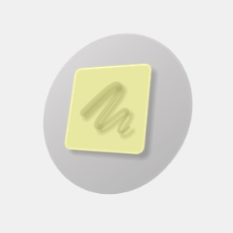
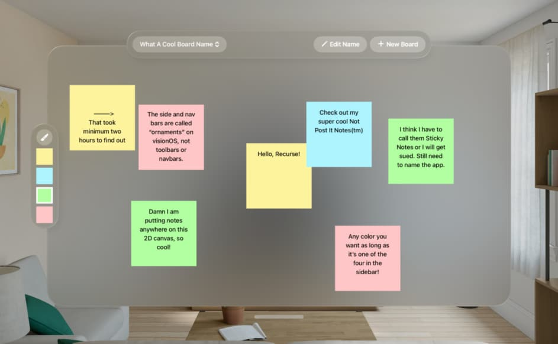

+++
title = "Stickies"
description = "A visionOS app bridging digital sticky notes with reality."
date = 2025-09-17T21:00:00-07:00
+++

When Apple announced that visionOS 26 was bringing wall-mounted widgets
to their face-mounted headset, I was very excited. For one thing, I am
most interested in the device for its ability to create interactions
between the digital and the physical worlds—which this feature enhanced
in a particularly compelling way. But also, I was excited because as I
looked around at my walls I saw at minimum 100 sticky notes across every
previously-blank surface. It was time.

There were many peculiarities in its development, not the least of which
being that I don't own a Vision Pro. By the time I tested it on-device
(thanks to generosity of [Jesse Sheehan]), the app was already feature
complete! In this phase, I ended up making significant adjustments to
accomodate what the radically different controls *actually* feel
like—your eyes are simply nothing like a mouse and keyboard. That sounds
obvious, but it's a fun challenge to translate that into tangible design
choices.

Side note: the walls in the simulator don't count for sticking widgets
on, and `.toolbar` is actually `.ornament` on visionOS. For anyone else
embarking down this road, I hope I've saved you a handful of hours
pouring over Apple's documentation.

With Stickies, you can create and edit boards of different sizes in the
app and pin them to your wall as widgets. This comes with a number of
benefits beyond being pretty cool to see: your notes will never come
unstuck, you can edit them infinitely, and perhaps most excitingly you
can pin the same board to multiple locations and keep them in sync.

Stickies is coming soon to an App Store near you! In the meantime, feel
free to [check out the code][code] for yourself.

[Jesse Sheehan]: https://github.com/sweetfreak
[code]: https://github.com/figbert/sticky
