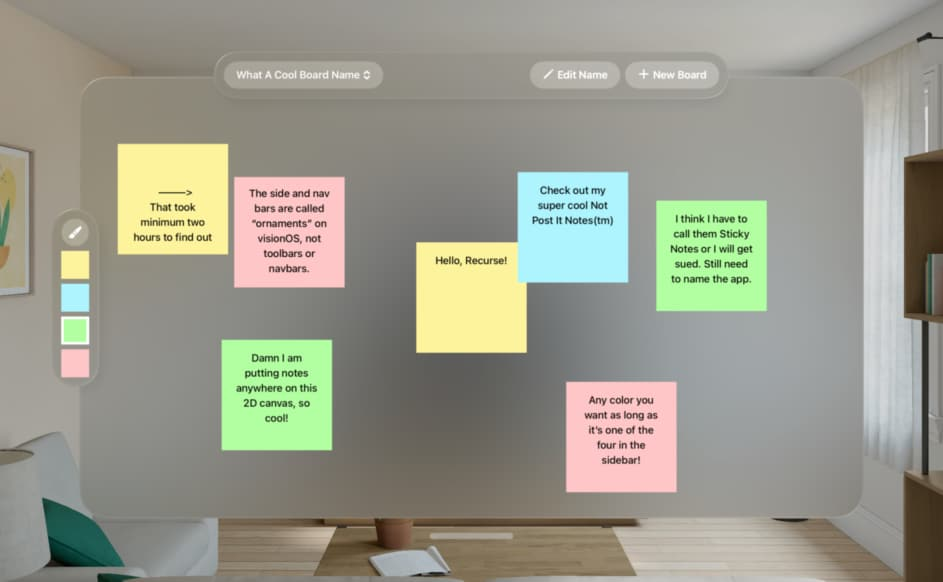

+++
title = "Stickies"
description = "A visionOS app bridging digital sticky notes with reality."
date = 2025-09-17T21:00:00-07:00
[extra]
icon = """<svg viewBox="0 0 569 614" xmlns="http://www.w3.org/2000/svg" fill="currentColor"><g fill-rule="evenodd"><path d="m140.02446 319.954926 1.5.000427.999725 1.000274 1.000275-.999725 3.500137-.499054 5.000351-1.248627 3.500336-1.249023 2.000549-1.999451 1.5.000397-2.500824 2.999329-1.500137.499572-2.000229.874451-7.000549 1.998077-4.500183.62378z"/><path d="m155.033539 286.959045.999862.500275-1.000137.499725z"/><path d="m157.533539 286.959747-1-.000274-.499863-.500153 4.501236-4.498749.499863.500122-.000275 1z"/><path d="m162.034912 281.960968-1-.000275.000275-1 1 .000275z"/><path d="m162.535187 280.961121-.499726-1.000153 1.50055-1.999573.499862.500122-.000274 1z"/><path d="m155.033264 287.959045-1.500549 1.999604-1-.000275-10.502899 10.497101-1.250962 3.499664-.75206 7.499787-1.000274.999725.999725 1.000275-.001785 6.5-.749924-.250184-.499527-1.750152-.248077-7.000061 1.502609-9.499603-.499863-.500123-1.000274.999726-.499863-.500153.00029-1 7.50206-7.497925 1 .000275 4.501236-4.498779 4.377334-8.49878 1.250824-2.999664 3.876648-5.998932 5.50206-7.498504 8.502335-8.49765 7.001373-4.998078 1.500412-1.499573.000275-1 4.501236-4.498779 16.00357-12.995605 8.501511-5.497651 4.000824-2.998901 3.000549-1.999176 2.000275-.999451 1.500137-.499603 2.00055-1.999451 2.500167-.624298 4.500657-2.373779 2.000549-1.999451 2 .00055 3.000824-2.999176 1.500107-.374573 5.000579-2.123627 4.000519-1.873901 2.500168-.624329 2.000549-1.99942 4.000275-.998901 2.000549-1.999451 4.000275-.998901 2.000549-1.999451 1.500122-.374603 5.00055-1.998627 9.00058-2.122528 6 .001648 5.499572 1.501526 2.499329 2.500671-.000275 1 1.999451 2.000549-.000549 2 1.99945 2.00055-.501526 5.499878-1.751922 6.999511-1.377197 7.999634-1.001099 3.999725-5.003845 13.998627-3.877198 7.998932-24.512512 45.493256-4.001648 5.998901-18.006317 22.995056-4.25206 7.49881-.626587 5.749847 1.874802.750519 1.999969.12555 3.000306-1.124176 2.500137-.499329 2.000549-1.999451 2.500412-1.499298 17.503998-14.495209 28.505615-20.492157 2.500428-1.499298 8.001648-5.997802 10.501464-5.372132 3.500183-.624023 1.000275-.999726.999725 1.000275 2 .000549 4.498749 4.501221-.000274 1 3.998901 4.001099 1.372955 7.500397-.127502 8.999969-.750824 2.999786-7.004944 17.998078-3.001923 6.999176-.500946 3.499847-2.000549 1.999451-1.000549 1.999725-3.501526 5.499054-1.000549 1.999726-4.501771 6.498748-2.000549 1.999451-.500702 2.499847-3.127472 8.999146-.125518 1.875 4.249969.12616 1.000275-.999756.999725 1.000305 1.000275-.999756 2 .000549 2.000549-1.99945 4.000275-.998902 3.000824-2.999145 4.000549-1.998902 3.000824-2.999206 2 .000549 1.000275-.999695.999725 1.000245 5.249969.126464.624482 1.875183-.000824 3-.625489 1.749817-6.251159 4.248291-2.250336 1.24939-.500427 1.499847-1.250061.249665-2.00055 1.99945-2.500152.624299-2.000244.87445-7.001374 4.998078-2.000274.99945-1.500153.499573-2.000549 1.999451-17-.004639-1.499573-1.500427.000275-1-1.999451-2.00055-.497131-10.500122 1.251648-5.999694.750549-1.999756 7.503998-14.497956 7.002472-8.998077 1.500671-2.499573 5.001923-6.998626 3.876922-6.998932 3.877747-9.998963.626861-6.749817-2.875091.374207-7.000824 2.998077-3.000519 1.874176-4.000824 2.998902-2.500427 1.499328-4.501221 4.498749-.000274 1-5.501526 5.498505-1.250061.249634-.250336 1.249938-2.500702 2.499329-8.001648 5.997772-13.002472 8.99643-2.000275.99945-2.000549 1.999451-2-.000549-2.000549 1.99945-1.999985-.000549-2.000549 1.999451-2.000275.999451-9.001648 5.997528-2.000274.99945-2.00055 1.999451-2-.000549-2.000549 1.99945-1.500107.374604-5.000549 1.998596-2.500168.624328-2.000549 1.999451-3.500183.624024-4.000474 1.748901-4.000274.998901-9.500168.622406-3.499039-3.500946-1.248764-4.500366.004669-17 .751099-3.999786 5.003571-12.998627 5.878021-10.998383 2.126373-4.99942 3.001648-5.999176 33.011002-39.990936 13.50534-19.496277 20.384766-35.494415.375763-2.749878-2.750122.374237-6.000763 2.873352-5.000855 2.998627-25.506164 22.492981-4.501236 4.498779-.000275 1-1.500412 1.499573-5.000824 2.998626-7.50206 7.497956-.000274 1-2.500687 2.499298-2.500412 1.499328-49.512238 44.48639-7.501236 4.497924-2.000137.499451 1.500549-1.999573 7.001099-3.998077 14.503433-12.496002 4.500962-3.49878 5.501525-5.498474.000275-1 3.500961-3.499054 4.500962-3.498748 17.504257-15.495209 8.502335-8.49765.250335-1.249939 2.750489-1.749237 15.503707-13.495758 4.501236-4.498749.000275-1 5.501511-5.498505 4.25061-2.24881.250336-1.249939 3.500976-3.499023 9.501526-5.497406 6.000763-2.873352 3 .000824 1.749847.625488-.376037 3.749909-4.877472 8.998657-3.501526 5.499023-11.505615 20.496826-5.002197 7.998627-10.003846 13.997254-17.755981 21.745147-1.500137.499573-1.750763 2.749512-10.003296 11.997253-2.000824 2.999451-11.006317 22.996979-4.002747 9.998901-.751099 3.999786-.004394 16 .873901 4.000244.624512 1.750184 1.749863.500488 7.999969.127197 5.000305-1.123657 11.001313-4.746948 5.000579-2.123658 1.500107-.374572 2.00055-1.999451 2.500167-.624329 14.502579-9.371002 11.001633-5.996979 11.002197-7.996978 2.500427-1.499298 7.501496-5.497956 11.503174-11.496826.000274-1 1.500397-1.499573 3.000549-1.999176 4.500977-3.498779 2.500397-1.499298 2.000549-1.999451 2.500183-.624328 5.000519-1.873627 3.500122-.499024 1.499603 1.500397-.752075 7.499787-1.626099 3.999572-1.62677 6.499543-2.000549 1.99945-.000275 1-2.000549 1.999451-.625702 2.499847-2.375946 3.499329-3.501251 4.499054-2.000824 2.999451-6.50232 8.498199-1.500701 2.499603-5.003022 10.998627-.750549 1.999756-1.126373 4.999695.372131 10.500122 3.499023 3.500976 10.500214-.747131 4.000244-.873901 7.001068-3.873078 6.001099-3.998352 4.500671-2.498749 7.501526-5.497955 2.500397-1.499298 1.500427-1.499603-.249359-2.375061-7.249969-.126984-3.000824 2.999146-2.000275.99945-5.500946 3.498505-6.000794 2.873352-3.000244.874176-7.750183.622864-.624481-1.875183-.124176-3 1.126099-3.999695 3.877472-8.998963 6.002197-7.998321 1.000549-1.999725 3.501526-5.499054 1.375671-2.499604 5.128571-12.998596 6.00412-14.998352.876098-3.999756.002228-8-1.123626-5.000305-4.748078-7.001312-.749542-1.750214-1.749847-.500488-7-.001923-1.500062.249604-2.000549 1.99945-2-.000549-2.000549 1.999451-2.000275.99945-31.506195 22.491333-3.000549 1.999176-8.001648 5.997803-2.750488 1.749237-.250336 1.249939-1.500427 1.499573-1.250061.249664-.250336 1.249939-1.500412 1.499573-1.500137.499603-5.500962 3.498474-4.001098 3.998902-2.500138.499328-3.000274.999176-3.99997-.126098-1.749832-.625489-.499512-1.750152.001648-6 .75055-1.999787 4.50206-7.498748 18.006317-22.995057 8.503723-13.49768 13.882416-26.996186.625671-2.499816 2.000549-1.999451.500428-1.499848 4.001922-6.998901 4.002747-9.998901 1.126098-3.999695 1.876374-4.999481 4.004943-17.998902-.248626-5.000091-.749451-2.000183-.999451-2.000275-.499572-1.500153-3.499054-3.500946-9.499848-.502624-8.00061 2.122803-2.000183.74945-3.500183.624054-2.00055 1.999451-4.000274.998901-2.00055 1.999451-4.000274.998901-2.00055 1.999421-1.500106.374603-3.000336 1.249176-28.504227 15.367157-10.001922 6.997253-2.500412 1.499329-6.501236 4.498199-11.002472 8.996979-6.501785 6.49823-.250351 1.249908-5.250885 3.248566-14.503983 14.496002-6.503159 11.49823-2.001373 4.999451-.500549 1.999847-1.000138.499726.499863.500152zm-14.003586 12.996155.00029-1-1-.000274-.00029 1z"/><path d="m381.48407 467.021301-4.000275.998902-2.000549 1.99945-29.500092.241883-191.996444-12.927765-16.999009-3.629669-28.999717-1.007966-4.999657-1.251373-17.499313-2.504822-2.499314-2.500671-.371559-12.500122 7.889839-53.997803 13.014016-50.996429 4.006042-21.998902 14.290123-145.996093.875824-2.999756 4.002747-9.998902 1.375686-2.499633 6.002197-7.998352 2.500687-2.499299 1 .000275 3.000824-2.999176 3.500137-.499023 4 .001098 2.499863.500672 1.499588 1.500427-.500137.499847-3.499863-.500946-3-.000824-3.500137.499024-3.000824 2.999176-1-.000275-1.500412 1.499573.499862.500152 45.501511-5.487487 22.001099-3.993958 4.000274-.998901 143.502045-7.460571.999725 1.000274 1.000275-.999725 65.499756.893005 3.499695 1.125946 2.499328 2.500702 2.490784 33.500672-4.131592 23.99887-4.630768 20.998749-.510711 38.999848-6.760987 39.998138-12.013214 47.996704-4.002746 9.998901-.875824 2.999756-4.256592 23.998841-1.626923 6.999542-1.758667 31.499542-1.000274.999695.999725 1.000305.111145 50.5-1.125976 3.499695zm-.999451-2.000274 4.501221-4.498749.014282-52-.999725-1.000305 1.000274-.999695 1.758667-31.499542 2.753296-11.999237 3.130219-18.999146 1.001098-3.999725 4.878296-11.998658 12.013214-47.996704 7.011536-41.998077.260162-36.999908.751374-4.999817 3.87912-14.998932 4.381591-23.99878-2.741607-30.500762-2.499329-2.500702-3.499695-1.125946-185.501114 4.074005-1.000274.999725-.999726-1.000275-85.503433 12.476532-9.500137.497376-5.501511 5.498474-.500412 1.499878-1.000549 1.999725-4.002747 9.998902-.750824 2.999786-11.286552 132.996918-3.003296 11.999176-4.006042 21.998901-11.887917 46.996735-9.015938 57.997497.122246 10.000061.499245 2.750122 17.749244 2.754883 4.999657 1.251373 28.999718 1.007966 17.998977 3.754943 191.996476 12.802765 28.000274-.992279 2.000214-.74945 2.000275-.999451z"/><path d="m382.953705 577.521729-3.000275.999145-16.001465 5.245605-11.001526 5.621949-8.000854 3.122802-15.002167 7.870911-4.000366 1.248901-11.001282 4.746949-22.001709 6.118957-13.000457 1.74646-30.99997-.133545-8.999557-1.627441-3.999726-1.001099-5.999725-1.001648-3.999725-1.001098-64.997208-10.142884-21.998383-5.881042-11.998634-5.003296-4.499313-2.501221-5.499039-3.501526-19.996697-12.005493-6.998626-5.001953-1.999726-1.000549-15.496566-12.504212-8.497662-8.50238-2.499039-3.500671-26.491615-30.507264-4.498764-4.501251-1-.000274-8.497664-8.50232-1.999176-3.000549-5.997801-8.001648-1.374313-2.500397-.999176-3.000274-.623763-4.500184.000138-.5.999862.500306.624313 2.500152.74945 2.000214.624314 2.500183 1.999449 2.000549 1.499313 2.500397 3.498764 4.500946 1.999176 3.000549 10.497114 10.5029 1 .000274 2.499313 2.500672 3.998623 5.001098 21.99313 25.006043 1.999176 3.000549 11.496838 11.503174 10.997528 9.003052 3.499313 2.500915 1.999725 1.000549 21.996155 14.006043 4.499306 2.501282 5.499039 3.501464 11.99839 5.878296 29.997803 8.008301 82.996215 13.772766 38.000183-.614563 24.001648-5.993408 23.002503-9.118652 13.001831-6.746399 5.00061-2.123657 12.001587-5.871705 44.003662-13.237915 6.000794-2.873352 16.502868-10.495422 8.501801-6.497681 24.506164-22.493286 7.502076-7.497925 33.011535-41.990936 16.507019-25.495453 13.882141-25.996216 2.126343-4.999389 5.002198-7.998657 5.003051-10.998597 2.126648-5.99942 12.885132-36.99646 3.880249-18.998932 1.628967-14.499572-.999694-1.000275 1.000244-.999725-1.468262-115.500397-4.990662-34.001373-.998901-4.000275-3.997253-10.001099-.999451-2.000274-9.99585-15.002747-.749511-1.750214-1.499878-.500396-.749512-1.750214-3.998352-6.001099-6.997498-9.001922-1.499328-2.500427-3.499024-3.500946-3.249695-1.250885-.499572-1.500153-2.249634-1.25061-3.999207-3.001099-2.99945-2.000824-4.998627-5.001373-2-.00055-2.999176-3.000824-3.249634-1.250915-.249664-1.250061-2.499329-2.500672-1-.000305-6.498199-6.50177-.249665-1.250061-1.249939-.250366-1.499572-1.500366.000274-1-3.499054-3.500977-2.99945-2.000854-18.496002-14.505066-2.499573-1.500672-1.499603-1.500427-.249665-1.250061-2.749512-1.750732-4.499023-3.501282-2.999451-2.000793-2.999176-3.000855-3-.000793-2.999176-3.000855-5.499084-3.376465-6.999176-3.001953-2.499817-.625671-1.999451-2.00055-1.499908-.375427-16.998078-7.004699-2.499817-.625672-1.99945-2.000549-19.498474-5.630371-23.997834-7.881592-47.997161-10.263184-5.000153.498658-10.999298-2.503052-5.000122.373657-5.999664-1.126648-27.000077.242554-18.001098 3.995056-2.000214.749451-15.002167 7.87091-2.500168.624268-2.000549 1.999451-4.000275.998901-2.000549 1.999451-2.500412 1.499328-10.001923 6.997254-8.001373 4.997802-6.500961 3.49823-6.001099 3.998352-2.500381 1.374268-3.000336 1.249206-3.000519 1.874146-8.001648 5.997803-3.000518 1.874206-3.000336 1.249146-7.501206 4.372986-13.002472 8.996399-10.501785 6.497131-33.507561 27.490784-3.500961 3.499023-14.004394 15.996155-6.002198 7.998352-6.502613 9.49823-6.002197 7.998352-1.500687 2.499573-4.501785 6.498779-2.501236 4.499298-2.000549 1.999451-.625691 2.499817-2.751373 4.999267-.625687 2.499817-2.000549 1.999451-.500412 1.499847-4.877472 8.998688-7.129947 17.998016-12.012641 45.996704-3.005221 18.999176-4.758794 31.998688.969771 110.000275 1.871977 11.000519 5.86703 29.001617 1.873626 5.000519 2.123076 7.00058 4.996427 13.001373 4.997526 9.001373.499588 1.500153.999725 1.000244-.500137.499878-1-.000275-1.499588-1.500396-.624312-2.500184-2.373764-4.500671-1.99945-2.000549-.499314-2.500122-7.869227-21.002167-2.122802-8.00058-2.995328-17.000824-1.997801-8.000549-1.964275-130.00055 2.003847-13.99945 2.002199-7.999451 5.132969-28.998596 10.010167-36.997254 5.879122-14.998382 14.507559-27.496002 9.003845-13.997528 9.0033-11.997528 6.502609-9.4982 3.501236-4.499054 2.000824-2.999451 22.50618-22.493804 3.000549-1.999207 8.501793-6.49762 2.500412-1.499328 1.500412-1.499573.000275-1 2.500686-2.499329 7.501511-5.497924 4.500687-2.49878 3.000823-2.999145 2 .000549 2.00055-1.999451 17.503158-11.495239 8.501236-4.497619 10.50206-7.497132 2.000244-.874451 2.500168-.624328 3.000824-2.999146 1.500138-.499633 8.001373-4.997803 6.500961-3.498169 16.003021-10.995606 2.500382-1.374328 2.500168-.624329 2.000549-1.99945 4.000275-.998902 2.000549-1.999451 1.500137-.499572 6.000824-2.998352 1.500138-.499573 2.000549-1.999451 22.50145-5.243835 28.000015-.11731 4.999725 1.001404 5.000122-.373657 10.999329 2.378052 2 .000549 3.000122-.374207 23.99881 4.256592 23.998352 6.006592 5.499878.501526 1.99945 2.000549 3.499817.625977 4.999481 1.876342 3.999695 1.126099 4.999481 1.876404 19.498505 5.505371 1.999451 2.000549 1.499878.375367 4.99945 2.001403 2.499848.625672 1.999451 2.000549 3 .000855 1.99945 2.000549 2.499817.625671 14.998108 6.879151 4.499329 2.50122 2.999176 3.000794 2 .000549 1.99945 2.000549 3.999451 2.001099 5.998352 6.001648 2.249909.25061.249664 1.250122 2.499328 2.500672 5.499024 3.501526 7.498474 5.502014 2.499329 2.500732.249664 1.250061 2.249634 1.250611 2.99945 2.000793 1.999726 1.000549 2.499328 2.500733-.000274 1 11.496826 11.503113 1.249939.250366.249664 1.250061 1.499573 1.500427 1.999725 1.000549 5.499054 3.501526 1.749787.750458.499603 1.500153 2.249664 1.25061 7.998352 6.002197 2.249634 1.250611.499573 1.500152 4.249389 2.25116 2.499329 2.500671 1.999145 3.00058 6.497681 8.50177 5.997559 9.001648 2.998901 4.000824 9.99585 15.002747 2.873047 7.000793 8.982727 63.002472-.401001 94.499878-1.000244.999725.999694 1.000275-2.505615 20.499329-5.005798 20.998626-5.12909 14.998566-10.88269 27.997009-2.001099 3.999451-4.001648 5.998901-17.509216 33.495209-19.007965 28.994782-3.001099 3.999176-2.000824 2.99945-27.009063 32.992584-4.501252 4.49878-26.006591 23.992798-8.50177 6.49768-3.00055 1.999207-2.000274.99945-6.001099 3.998353-1.500153.499572-3.000824 2.999146-2-.00055-2.000549 1.999451-1.500091.374634-3.000306 1.124145z"/></g></svg>"""
+++

When Apple announced that visionOS 26 was bringing wall-mounted widgets
to their face-mounted headset, I was very excited. For one thing, I am
most interested in the device for its ability to create interactions
between the digital and the physical worlds—which this feature enhanced
in a particularly compelling way. But also, I was excited because as I
looked around at my walls I saw at minimum 100 sticky notes across every
previously-blank surface. It was time.

There were many peculiarities in its development, not the least of which
being that I don't own a Vision Pro. By the time I tested it on-device
(thanks to generosity of [Jesse Sheehan]), the app was already feature
complete! In this phase, I ended up making significant adjustments to
accomodate what the radically different controls *actually* feel
like—your eyes are simply nothing like a mouse and keyboard. That sounds
obvious, but it's a fun challenge to translate that into tangible design
choices.

Side note: the walls in the simulator don't count for sticking widgets
on, and `.toolbar` is actually `.ornament` on visionOS. For anyone else
embarking down this road, I hope I've saved you a handful of hours
pouring over Apple's documentation.

With Stickies, you can create and edit boards of different sizes in the
app and pin them to your wall as widgets. This comes with a number of
benefits beyond being pretty cool to see: your notes will never come
unstuck, you can edit them infinitely, and perhaps most excitingly you
can pin the same board to multiple locations and keep them in sync.

Stickies is coming soon to an App Store near you! In the meantime, feel
free to [check out the code][code] for yourself.

[Jesse Sheehan]: https://github.com/sweetfreak
[code]: https://github.com/figbert/sticky
