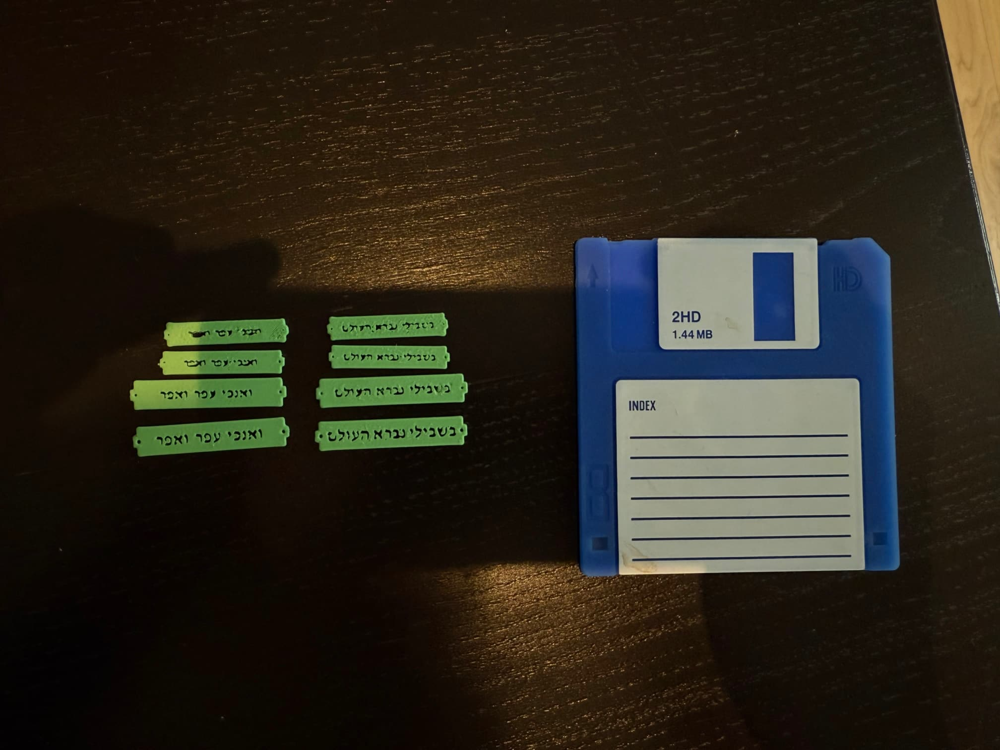
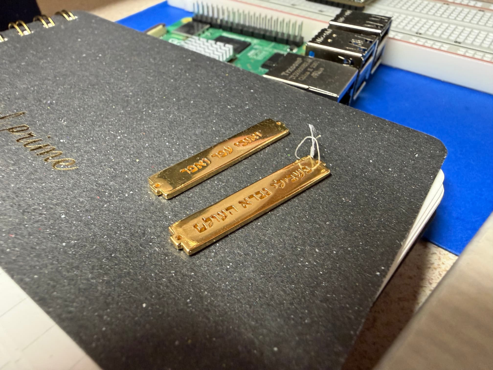
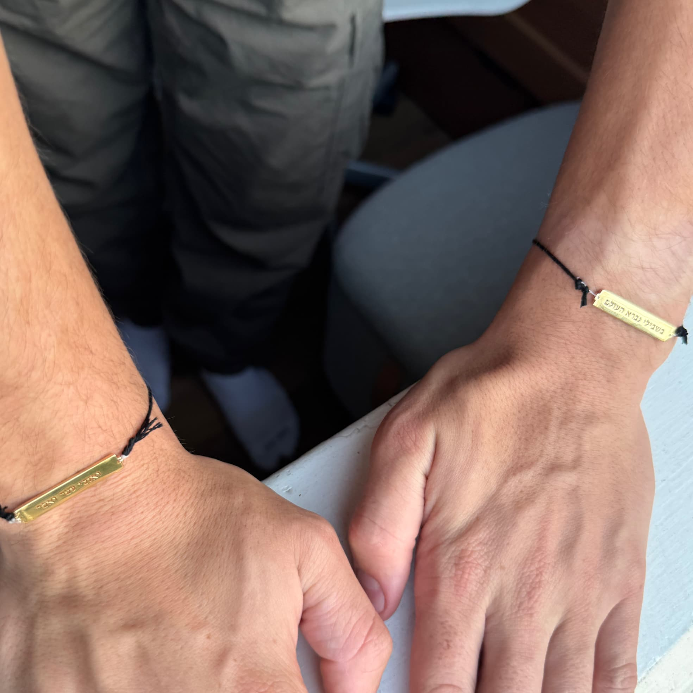

+++
title = "Two Pockets"
description = "A set of bracelets cast in vermeil."
date = 2025-10-09T22:30:00-07:00
+++

There is an ancient Jewish story told about a wise man who used to walk
around with two pieces of paper, one in each of his pockets. On one
piece of paper was written "the world was made for me" (Sanhedrin 4:5),
and on the other, "I am dust and ashes" (Bereshit 18:27). The ability to
hold on to two mutually contradictory truths equally tightly is a core
aspect of Judaism, in my mind, and a skill I find myself relying on more
than one might expect. As such, I wanted a physical reminder of this
ancient wisdom.

I modeled two bracelet charms in [Shapr3D], tweaking them until I was
satisfied. I printed out a number of tests at different scales at the
[Recurse Center], which allowed me to play with the size on my wrists as
well as refine the text so that it wouldn't come out a muddled mess.
None of the prototypes came out perfect, but I hoped that the increased
accuracy of resin printing would make the cast come out a smidge
cleaner—and in any case, I had resolved to make an attempt at realizing
the vision.

There are a number of print-on-demand services. The first one I
encountered was [Sculpteo]—but I didn't ended up using them, as my
choice was guided primarily by material options. I wanted something gold
(to match my existing jewelry) but without paying the hefty fee that
entails. This is seemingly a niche desire. So: plated silver and
[Castimize].

The metal pieces are *perfect*—honestly I'm a bit surprised! They're so
good that I've almost entirely left my watch behind, and picked up some
[new work on the side]. I'm not in love with the yarn bracelets: I'm
afraid that salt water and time will make them brittle and they'll snap,
so I'm in the market for a good set of chains. But what I'm happiest
about is that I have made art for its own sake. And not just any art:
Judaica!

[Shapr3D]: https://www.shapr3d.com/
[Recurse Center]: https://www.recurse.com/scout/click?t=0d85c06dc14f97552f2130471d4e3086
[Sculpteo]: https://news.ycombinator.com/item?id=42666190
[Castimize]: https://castimize.com/
[new work on the side]: https://youtu.be/EUvgqItrt1c?si=xdPdIUWyPo5xJKg7&t=91
