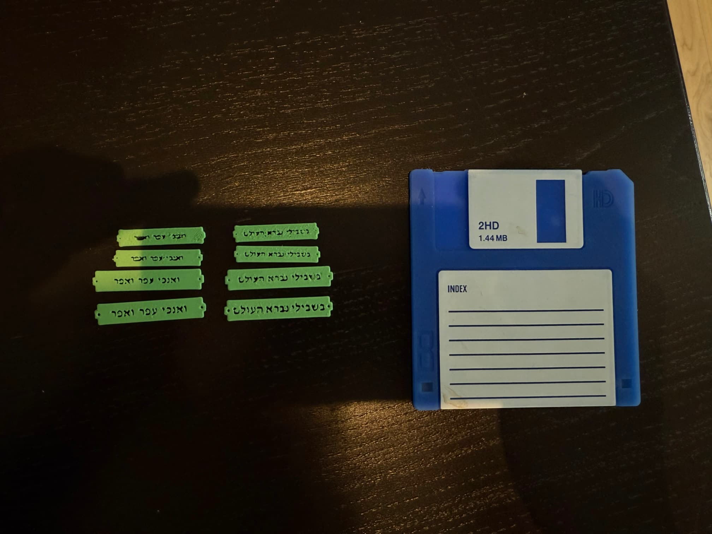
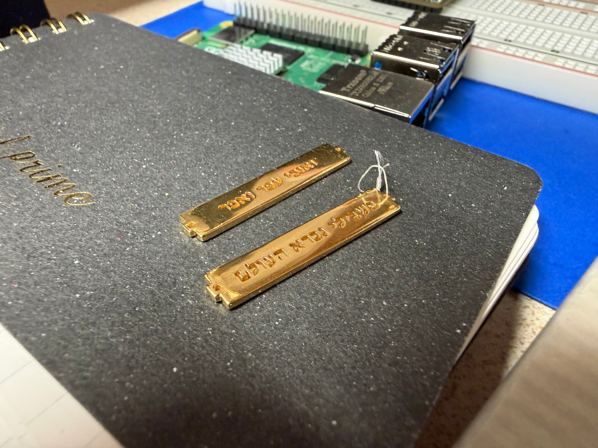

+++
title = "Two Pockets"
description = "A set of bracelets cast in vermeil."
date = 2025-10-09T22:30:00-07:00
[extra]
icon = """<svg viewBox="0 0 4296 4262" xmlns="http://www.w3.org/2000/svg"><g fill="currentColor" stroke-linecap="round" stroke-linejoin="round" stroke-width="8.75"><path d="m174.859985 4076.580078-.260009.359863-1.229981.290039-.050049-.879882-.130005 1.209961 3.690064.399902.869995-.25 2.449951.100098 3.560059-.649903 8.76001-4.5 7.260009-5.310058 6.789917-5.490235 1.540039-1.659668 6.640015-4.910156 10.339966-7.060059 3.900024-2.25 2.089966-.439941 5.680054-3.549805 1.069946-1.130371 7.25-3.989746 4.380005-3.300293 3.51001-3.819824 4.670044-3.22998 1.280029-.240235 1.189941-.649902 1.099976-1.159668 3.820068-2.710449 2.75-2.759766 6.449951-4.169922 2.700074-1.330078 2.359985-2.080078 10.880005-7.199707 2.369995-.810059 12.439941-6.810058 15.880005-7.669922 3.560059-2.439942 1.169922-.290039 5.800049-3.090332 4.5-3.109863 2.589965-2.209961 6.469971-3.240234 1.25.350097 1.380005-.259765 2.460083-2.050293 6.309937-3.569824 2.670044-1.200196 1.819946-.129883 8.060058-4.279785 14.75-6.200195 8.599976-4.370117 3.140015-1.040039 9.790039-5.159668 8.149902-3.52002 3.310059-1.080078 15.189941-9.819824 2.380005-.92041 11.590088-8.52002 3.26001-2.779785 9.089965-5.060059 7.76001-5.069824 25.729981-15.010254 10.72998-5.600097 5.459961-2.379883 4.859985-2.620117 2.570069-1.82959 9.530029-3.979981 5.529907-2.720215 2.77002-2.089843 1.430054-.240235 8.130004-2.97998 4.979981-2.870117 1.23999-1.319825 1.449951-.779785 1.410034-.090332 9.75-3.439941 6.859986-3.109863 3.520019-2.100098 1.650025-.379883 20.670044-8.859863 6.98999-4.229981 8.929932-3.810058 4.839965-2.75 2.430054-2 2.339966-.640137 3.280029-1.870117 2.229981-.319824 4.75-2.689942 2.560058-2.030273 1.349976-.310059 4.51001-2.389648 4.459961-1.850098 1.450073-1.200195 4.659912-2.810059 3.040039-2.719726 1.469971-.459961 7.300049-3.689942 7.349975-4.630371 2.810059-2.279785 15.599975-9.919922 11.77002-8.209961 8.889892-4.840332 10.310059-7.279785 8.23999-4.830078 10.589966-7.239746 2.460083-1.530274 2.279907-.810058 2.450074-1.899903 4.030029-2.489746 9.75-5.440429 6.5-4.32959 3.72998-3.390137 15.929993-9.280273 14.096008-7.389649 3.435974-1.669922 2.14502-.630371 7.657959-5.069824 5.814026-2.430176 4.839966-2.399902 1.789001-1.25 6.217041-2.660156 5.67096-2.82959 2.046997-1.550293 6.012024-2.279785 6.060974-4.200196 3.503051-1.959961 1.914978-.509765.901978-.800293 9.210999-4.890137 12.493042-5.57959 2.208984-1.75 5.934021-2.260254 4.524963-2.810058 1.666016-1.449707 3.856018-1.970215 1.774963-.169922 6.15802-4.490234 3.737-1.699707 2.200012-.350098 5.953003-3.810059 5.487976-4.009765 1.862976-.680176 1.649048-1.609863 2.484009-1.470215 4.44397-3.689942 7.117004-3.830078 2.305969-2.029785 3.329041-1.220215.800964.330078.852051-.129882 2.763-2.080078 2.84198-1.100098 5.271973-3.410156 1.972046.230468.907959-.90039 2.63501-1.09961 1.747009-1.270019 5.789978-1.820313 8.608032-4.419922 1.666992-1.609863 1.008972-.260254 3.064026-2.489746 1.041016-.590332.570984.110352 1.802978-1.620117 2.139038-1.330079 1.067994-.279785 6.521972-3.530273 2.673035-.830078 1.036987-.75 2.578003-.59961.838013-.580078 2.885986-.910156 2.279968-1.540039 2.892029-2.549805 3.598999-3.850097 7.299012-9.240235.898071-2.539551 1.311889-2.200195 1.13501-1.100098 2.752075-.469726 2.858887-1.410156 1.75708-.010254.868897.430175 1.947021-.819824.503052.649903"/><path d="m1035.692017 3589.470215-2.033081.509765.381103-.149902.218018.879883 1.809936.270019.97107.660157.859863-.070313 3.75415 1.860352 7.440918 5.549804 2.63501 2.319825 3.015015 1.860351 2.715942.729981 3.938965 2.199707 4.032104 1.610351 1.386963.040039.68396.369629 2.394043 1.959961 1.020996 1.400391 3.737061 2.679687"/><path d="m1069.541016 3612.390137-.354981.049804-.282959-.580078.076904.919922.4021-.909668.729004.779785 2.292969-1.640136 3.253906-1.129883 9.307129-4.310059 5.211914-1.819824 5.766968-2.689941 3.779052-1.040039 2.407959-1.100098"/><path d="m1085.536987 3581.47998-.02893-2.279785.310913.939942-1.109009 1.959961-1.01294.040039-3.001953 2.22998-5.106079 2.379883-5.802978 3.879883-9.84607 3.830078-5.386962 1.280273"/><path d="m1090.543945 3573.069824-.583984.42041"/><path d="m1086.699951 3577.439941-2.720947-.180175.842041.940429.169922.699707.607055-.629882 1.120972 1.009765 2.061035.600098 2.883057 1.700195 4.500977 1.540039 8.187988 2.049805 3.957031.160156.998901.399902.173951.79004"/><path d="m1093.658936 3571.779785.121093-1.80957.179932-.220215.13208.390137.110962-.290039-.116089 1.399902-.008911-.290039-.317993-.009766-.122071.339844 1.60608 10.549805.464965 6.780273.475098 2.429688 1.622925 4.190429 1.204956 2.179688 2.290039 2.270019 2.263916.830079 1.762085-.310059 1.119995-.640137"/><path d="m1102.157959 3580.640137-.450928-1.080078.288941-.160157-.128052-.399902-.01294 1.879883.380005-.669922.202027.089844.128906 1.020019.971069 1.570313 2.708008 3.100097 1.198975 2.439942 1.357055 1.929687.31897-.029785 1.527954 4.549805 1.26001 2.280273 2.774048 3.409668 5.161987 3.740235 1.61499 2.089843.403077 1.290039 2.245849 3.970215 2.101074 5.299805 2.526001 4.649902 2.465943 2.790039 1.618042.5"/><path d="m1127.856934 3619.060059-1.104981-.410157-.416015.160157-1.688965 1.709961-2.854004 1.569824-3.755982 3.100097-2.359008 1.399903-1.195069.189941-3.824951 5.75-4.461914 5.380371-4.955078 5.199707-.563965.180176.220947-.410156.528076.200195"/><path d="m1100.331055 3641.220215-.210083.109863.606079.009766.03894.410156.171997-.779785.33899 1.029785.718994.049805 1.856079 2.820312 5.596924 5.709961 1.817016 2.890137 2.285034 2.72998 7.585938 7.489746 2.228027 3.339844 2.88501 3.360352 1.125977 3.600097-.182007 1.289551"/><path d="m1122.026978 3670.169922-.455933.160156-.562988 3.509766-.137085 7.370117-.430054.990234-.368897.449707-.244018-.339843-.406006 1.009765-.645996.570313"/><path d="m1117.769043 3683.169922-.218018-.100098-.759033.760254-.74292-.410156-.697998.720215-.937011.369629-4.456055 1.240234-.814942.509766-.748046 1.050293-.842041-.040039-.571045.370117-.691895 1.139648-.484009-.089844-.958008.419922-.567993-.290039-1.770019 1.439942-1.208985.430175-.391113-.290039-2.536865 2.790039-1.204102.569825-1.020019.980468-.392945.859864-.916992.699707-.350952-.159668-1.01709 1.689941-.942871.089844-.36206-.390137-1.446045 1.180176-1.606934.549805-.374023-.279786-1.204102 1.189942-3.496826 1.740234-2.912109 2.219727-2.483887.540039-1.685059 1.530273-.466064-.110351-1.277954.880371-.577027-.080078-.911987.839843-9.142944 4.370118-2.099121 1.459961-.368897-.129883-1.562988.719726-.831055-.22998-5.450928 3.050293-1.158081.05957-2.794067 1.950195-1.174927 1.459961-4.090942 1.839844-3.068115 2.27002-3.854004 2.090332-5.253907.989746-6.20996 2.75-2.109131.5-2.688904 1.590332-1.369019 1.82959-.494018-.219727-1.562989.850098-1.026001-.410156-2.593994 2.040039-1.137024 1.279785-2.78601.910156-6.596985 4.319824-1.096985 1.220215-2.286011 1.229981-2.205993.72998-4.562012 2.439941-2.994995 1.220215-1.200989-.370117-1.231995 1.060059-2.018005 1.080078-1.284973 1.5-.755005.119629-2.033997 1.450195-1.234008.419922-.608033.740234-2.662964 1.52002-1.288024 1.299804-7.375977 3.319825-6.689026 4.380371-1.098022.389648-3.93097 2.890137-3.68103 1.910156-.78595.009766-1.485046 1.320312-2.585999 1.069825-.771972.839843-2.030029.729981-.796998.709961-2.653991.380371-3.110962 1.549804-6.504028 4-1.518006.390137-3.409973 2.169922-1.106018 1.100098-2.184998.72998-.924987-.060058-1.450989 1.359863-.697998 1.25-.449036-.029785-1.412964.899902-.604004-.540039-1.116027 1.810059-.792969-.319825-2.179016 1.519532-.682007.850097-2.186035.720215-.725952-.359863-.924012.649902-1.113037 1.419922-1.352966.580078-.801026-.570312-1.541992 1.890136-.585998 1.229981-1.372986.839844-.625-.039551-1.330017 2.099609-.513001-.149902-.244995.560058-.445007-.589843-4.524963 2.319824-3.038025 1.180176-1.185974.100097-2.466004 1.59961-1.298035 1.330078-4.539978 1.399902-2.296997 1.350098-1.155029 1.109863-3.105957 1.240235-.679993-.359864-.721008.049805-.614014.770019-3.491027 2.169922-7.945984 3.490235-2.58899 1.609863-3.276977 1.430176-2.528015 1.520019-.471009.879883-1.147033.160156-2.720948 1.239746-2.39801 1.430176-.497986.889649-.585998.270019-.427002-.25-4.916016 3.110352-6.460022 4.619629-.994018.40039-2.757996 2.529785-2.095947 1.029786-.473023.720214-1.158996-.040039-2.651001 1.970215-1.432984 1.569824-.756042.129883-3.002991 2.070313-1.630981.489746-15.072998 8.240234-4.069031 2.649903-.750977 1.169921-.923034.660157-.71698-.130371-8.766968 4.680175-.75 1.220215-1.01001.75-.840027-.060058-4.549987 1.830078-3.059998 2.57959-1.559998 1.770019-3.710022 1.700195-1.570007.240235-4.450012 2.699707-1.51001.399902-4.389892 2.310059-2.450074.850097-2.260009 1.52002-1.049927 1.930176-.400025-.260254-1.960083.97998-1.009887.02002-2.26001 1.5-1.109985 1.22998-2.090088 1-1.049927-.029785-2.810059 2.439942-1.150024 1.620117-2.869995 1.489746-4.839966 3.640137-1.839966 1.049804-1.930054 2.110352-4.520019 2.47998-7.399902 5.84961-8.590088 4.550293-5.76001 3.580078-2.049927.669922-6.770019 5.060058-13.459961 9-11.080078 6.879883-3.319947 2.549805-4.190063 2.360351-2.039917.609864-4.940064 2.680175-2.059936 1.609864-3.820069 2.129882-1.780029.260254-.899902 1-3.720093 2.479981-1.890015 1.629883-3.5 2.009765-10.709961 4.950196-1.679931 1.209961-.790039 1.089843-.969971.540039-.820068.040039-2.359986 1.27002-.790039-.209961-.769897.240234-.640015.799805-2.690063 1.77002-1.26001 1.399902-2.899902 1.700195-.680054-.600097-.76001.160156-1.359985 2.049805-3.130005 2.629882-2.73999 1.870118-1.469971.529785-12.350098 8.680175-1.439941.330079-4.959961 4.739746-2.950073 1.700195-.76001-.350098-.809937.209961-.660034 1.010254-2.599975 1.810059-2.540039 2.389648-.829956.140137-2.690064 1.640137-.909912-.149903-.869995.299805-2.98999 2.47998-8.620118 5.930176-2.47998 1.119629-8.369995 5.300293-7.179932 4.989746-3.130005 1.760254-1-.270019-1.090088.290039-1.039917 1-9.859985 5.909668-1.23999.680175-1.170044.089844-1.160034.530274-3.439942 2.719726-11.840088 6.75-5.46997 4.160156-13.419922 8.399903-8.140015 5.590332-7.890014 4.259765-5 3.720215-4.930054 3.040039-3.689942 1.639649-2.670044 1.669922-1.359985 1.340332-4.640015 2.279785-7.189941 4.640137-2.080078 1.060058-.959961.129883-1.089966 1.049805-5.470093 3.580078-1.809936.290039-2.359985 1.800293-1.200074 1.819824-1.079956.060059-3.179931 1.669921-10.870118 7.580079-1.21997.339843-3.789917 3.439942-3.160034 1.620117-1.330079.120117-4.109985 3.140137-.859985 1.679687-1 1.129883-.75-.149902-2.549927 1.300293-1.730103.459961-4.119995 3.040039-1.689941 1.72998-.910034.229981-4.489991 2.549804-8.049926 5.479981-2.440064 1.200195-1.079956.080078-.340088.609864-1.819946 1.060058-.930054 1.479981-.429931-.240235-2.440064.680176-.769897 1.169922h-.590088l-.73999.540039-.719971 1.189941-.369995-.109863-2.040039 1.140137-.77002 1.149902-.539917-.060058-1.910034 1.040039-4.930054 1.75-2.459961 1.620117-.829956.899902-1.210083.319824-.509887-.180175-.25.450195-1.680054.859863-.699951.590332-.170044.549805-.579956.089844-.52002.940429-.220093-.440429-.189941.25-.579956-.189942-1.330078.890137-.799927 1.279785-2.630005 2.180176-.790039 1.22998-3.660034 2.729981-.939941 1.25-2.119996.740234-.849975-.620117-.680054.819824-3.609985 2.27002-.890015.120117-.859985.919922-3.570069 2.140137-1.579956 1.689941-2.459961 1.330078.039917 1.189942.640015-2.350098-.319946.680176-.729981.149902-.260009-1.149902.169921.890136-1.159912.729981-.300049-.360352-.439941.310059-.200073-.199707-.130005.529785-.319946-1.009766-1.050049 1.159668-1.079956.320313-.609986-.44043-.330078.780274-1.809936 1.969726-.900025.400391-.650024.819824-.539917-.830078-.170044.830078-1.959961 1.47998-.830078 1.120118-.380005-.120118-.98999 1.25-1.75 1.189942-.559937-.109863-1.369995 1.009765-.47998-.189941-.820069 1.209961-.949951.459961-1.210083 1.330078-1.179931.760254-1.76001.399902-1.73999 1.469727-.719971-.319825-1.119995 1.979981-.690064.129883-.46997-.479981-1.29004 1.010254-.419921.739746-.290039-.219726-1.070069.159668-.209961-.259766-1.439941.459961-.51001.47998-.780029.050293-.670044.569825-1.029907.009765-1 .52002-.830079 1.060058-.790039-.029785-.149902.379883-.780029.080078-.320069 1.199707-.21997-1.32959-.849976 2.07959-.140015-.289551-.609985.139649-.530029-.350098-.069946.540039-2.160035 1.850098-.650024 1.089844-.979981.310058v.510254l.310059-1.169922-.330078.409668.070068.570313.179932-.560059-.02002.580078.01001-.75.340088-.030273-.350098-.009766.090088.469727.03003-.369629h-.27002l.299927-.110352-.119995-.669922v1.209961l-.109986-1.080078.290039.350098-.25.240234-.71997-.25v.589844l.309936-.620117-.569946-1.069824-.180054.180175-.21997-.260254-.239991 1.089844.039917-.879883-.459961-.600097-.439941-1.830078-.200073.410156-1.669922-.979981-2.220093-2.850097-.390015.390136-1.619995-.549804-2.889892-.380371-3.880005-1.739746-.52002.47998-.150024-1.020019-1-1.27002-.579956-1.470215-1.730103-.799805-.299926-2.060058"/><path d="m233.420044 4164.649902-.5.229981.439941-.810059-.160034-.209961v.760254l-.299927.02002.239991.929687.150024-1.009765-.160034.5-.190064-.5-.339965.219726-.619996.990235-1-.660157-1.199951 1.050293-.71997 1.299805-.850098.270019-1.130005 1.010254-.909912.129883-2.859985 3.100098-2.590088 1.819824-.969971.029785-1.060059.990235-2.829956 1.160156-2.959961 1.929687-3.270019 1.149903-1.180054-.02002-2.269897.950195-.869995.930176-3.290039 1.219727-1.050049.780273-.709961 1.069824"/><path d="m154.51001 4143.160156-1.53003-.47998-.770019-.700196.090088-1.069824-.090088.830078.630005.399903.280029-.160157.160034.79004.75 1.020019 2.079956 1.27002 2.690064 4.520019 4.349975 4.629883 3.709961 4.970215 6.239991 9.109863 5.030029 9.27002 4.680054 6.959961 1.539917 1.149902.630004-.229981.28003-1.100097"/><path d="m152.77002 4136.930176-.359986.199707-.26001-.629883-.200073.160156.23999-.130371.060059.860352.219971-.899903-.039917.84961.389892-.27002-.209961.060059.27002-1.379883-.280029 1.240234.200073.049805.289917-1.140137.849975-.529785 2.120118-2.680176 6.339965-9.149902 5.28003-6.649902 2.199951-2.160157 1.390015-3.120117"/><path d="m164.72998 4117.069824.02002.780274-.300049-.490235.200073-1.25-.200073.830078.290039.589844.609986-.909668 1.109985-.090332 2.270019-2.069824 2.450074-1.450195 4.119995-1.489746 5.779907-3.140137 2.580078-2.370117 2.859986-4.419922.630004-.279785.319947-.550293.550049-.039551"/><path d="m184.540039 4100.060059-2.650024 2.350097-.650025.089844.01001-.669922-.329956-.020019.309936-1.810059-.169921-5.430176-2.230103-8.529785-1.559936-2.990234-.78003-.75-.439941-1.709961-1.040039-1.319824-.859986-2.100098-.550048-.189942-.849976-1.109863-1.170044-2.360351-.049927-.729981"/><path d="m158.400024 4089.950195-1.71997.84961-1.390015 1.17041-.900024 3.889648.079956 2.25.180053-.25.03003.200196-.180054.370117-.040039-.459961-.309937 1.569824-.400024 7.939941.319946 8.029786-.599975 5.030273-2.409912 10.009766-5.03003 7.950195-.890014.640137"/><path d="m153.290039 4095.470215-1.060059.020019-.569946-.490234-.119995.399902.439941.820313.219971-.720215.830078-.649902.630005-1.200196 11.959961-10.620117 5.729981-4 9-5.459961"/><path d="m163.160034 4045.22998-1 .229981-.460083.510254-.73999-.02002-.309937-.560058-.75 1.5.329956.899902-.5.459961.25.529785.900025-1.07959-.089966.209961.529907.080078.350098.519532 2.390015-2.089844.439941.100098 1.349976-.839844 1.200073-.150391 4.449951-3.639648 3.77002-2.030274 3.179931-1.089843 1.280029-.950196 1.76001-.459961 8.050049-4.359863 4.959961-1.899902 1.550049-1.109864 4.159912-2.070312 4.320068-1.709961 2.829956-2.339844.53003-1.040039.709961-.609863.48999.089844 2.710083-1.370118 3.419922-2.290039 4.260009-2.040039 1.099976-1.029785 6.290039-4.129883 5.199951-2.97998 2.060059-.410156 4.790039-2.959961 1.909912-1.609864.880005-.120117 2.430054-1.270019 1.809936-.350098 1.550049-1.379883 2.829956-1.720215.859985-.959961 4.900025-2.540039 2.030029-.520019.800049-1.009766 3.119995-1.899902 2.01001-2.160156 2.139892-.700196 2.700074-1.709961 1.869995-.319824 1.540039-1.649902 4.819946-4.010254 2.329956-1.439942 1.910034-.45996 1.589966-1.54004 3.900025-2.640136 8.5-4.25 3.73999-2.09961 1.869995-1.530273 7.430054-3.430176 4.199951-2.549805 1.119995-.989746 3.950073-1.980468 1.25-.199707 4.77002-1.830079 7.399902-5.75 2.619995-1.640136 5.369995-2.569824 12.420044-7.629883 6.300049-3.600098 2.079956-.839844 2.319946-1.690429 2.320069-.949707 8.22998-4.910157 2.060059-.819824 5.559936-3.859863 4.479981-2.42041 1.830078-.479981 5.789917-4.189941 4.600098-2.399903 2.389892-.47998 5.110108-4.180176 2.059936-2.770019.979981-.119629 9.380004-6.02002 2.070069-2.209961 2.049927-.660156 4.460083-2.419922 6.689941-2.470215 10.859985-5.97998 3.130005-1.239746 3.160034-2.450196 2.150025-1.180175 2.099975-1.84961.959961-.100097 4.469971-1.899903 4.200073-3.260254.789917-1.319824 1.060059-.72998.790039.069824 2.199951-1.489746 6.280029-3.030274 2.150025-1.709961 1-.149902 1.939941-.959961 4.170044-2.700195 4.48999-2.149902 2.089966-1.479981 6.290039-2.379883 18.75-9.560058 1.799927-1.439942 2.290039-.990234 3.079956-1.910156 1.920044-.629883 3.079956-1.839844 1.400025-1.560059 5.280029-2.319824 8.140015-5.040039 1.790039-1.550293 1.709961-.549804 6.20996-4.740235 10.930054-4.199707 6.140015-3.070312 4.849975-2 3.199952-.929688 4.48999-2.200195 2.020019-1.77002 5.050049-2.119629 1.969971-.5.969971-1 2.910034-1.990234 2.449951-2.660156 3.210083-1.399903.839966.459961.959961-.199707.800049-1.070312 3.95996-2.77002 3.599976-1.879883.810059.299805.959961-.189941.880004-1.049805 4.310059-2.660156 3.5-1.239746 1.659912-.910157 3.660034-.859863 4.130005-1.75 4.180054-2.610351 5.719971-2.439942 2.069946-.419922 10.01001-5.509765.770019-.340332.75.25.820069-.189942.769897-.779785 5.330078-3.220215 2.359986-.909668 6.660034-3.560058 30.829956-12.560059 5.109985-2.520019 11.910034-7.459961 1.390015-.390137 5.01001-2.700195 2.359985-.669922 4.349976-2.619629 2.040039-1.860352 3.209961-1.279785 2.199951-1.339844 2.180054-.550293 4.260009-2.299804 1.079956-1.310059 1.28003-.939941 1.209961-.130371 3.760009-1.929688 3.650025-1.339844 7.540039-4.970214 8.699951-4.189942 7.039978-4.320312 19.765015-9.559571 2.377014-2.15039 1.132995-.029785 3.544983-1.580079 2.283997-.299804 4.770019-2.880371 1.992005-1.739746 4.541992-1.859864 2.310974-.300293 5.320007-3.080078 2.103028-1.789551 6.77301-2.340332 1.125977-.790039 12.39801-5.779785 2.981995-1.800293 2.880981-1.049805 13.22699-10.20996 4.032043-2 7.950989-3.209961 1.848022-.379883.831971-.850098 3.259033-1.839844 1.69696-1.40039 9.220032-5.359864 2.053955-1.680175 5.458008-2.209961 5.177002-3.399903 4.335022-2.089843 2.447021-1.709961 1.141968-.27002 5.612976-3.990234 3.163025-1.209961 1.140015.300293.557007-.69043 2.589965-1.569824 1.085022-1.27002 2.22699-.830078.499024.25.58197-.25.574035-.759765 2.45398-1.570313.934021-1.379883 3.16095-1.75 3.664001-3.080078 2.910034-1.439941 1.096009-.189942 1.527954-1.290039 1.515014-.659668 6.114991-4.800293.791015-.149902 2.127014-2.22998.682984-1.129883 4.434997-3 1.130005-1.17041 4.046997-1.199707 3.710999-2.879883 3.682983-1.360352 10.993042-7.75 4.325989-3.949707.848022.049805 4.93396-4.319824.96399-.030274 2.15802-1.069824.854004-.839844 2.59497-.390136 5.092041-3.450196 2.531983-2.139648 1.918029-1.160156.573975.20996 2.963989-2.390136.897034.300293 1.719971-2.450196.567016-.25.08899.27002.474914-1.779785.085083.339844.616089-.010254.508911-1.039551.195923-.080078.095093.449707-.020996-1.029785.443969.270019-.164062.640137-.139893-.390137.31897-.600098.255981.120118.091065.870117.056885-.840332-.109864.330078-.266113-.029785.051026-.310059.189941.379883.179077-.290039.765991.010254.374024-.450195 1.789062-.399903.454956-.950195.170044.270019 1.017945-.029785-.137085-.22998-.400879.489746.015869.450195-.251953-.209961.225097.879883.607911.580078.111084-.379883-.235108.959961.367066 1.159668.109008 3.180176-.209961 2.390137-1.394043 4.560058-.225097 8.169922.224121 1.810059 1.195923 2.179687.418091 1.780274.516967.82959.125 1.390136"/><path d="m1030.803955 3559.779785-.001953-.789551-.036011.539551-.549927.560059.224854.130371-.205933.57959.94397 2.390136 3.740967 5.680176 1.728027 2.129883.391114.200195.377929-.280273.390991.450195 2.432007 3.759766 2.748047 1.419922 2.017944 1.630371.687012 1.709961.337036-.27002.364014.159668 5.937988 4.030274 4.305908 1.5 6.426026 1.180175 3.014038-.280273 1.476929-.600098 3.304077.189942 1.13501.680175"/><path d="m163.420044 4045.709961.380005 2.790039.5.439941 1.139892 2.859864 1.450074 2.330078 1.339965 4.600097 1.28003 6.689942 1.609985 12.290039.699951 2.819824.230103.660156 1.159912.680176.609985-.419922 1.140015.429688"/><path d="m201.130005 4135.819824-2.160034-.299804-1.829956.319824-1.479981-.330078-.180054-.75-.290039.270019.170044.140137.200074-.589844-.27002-.390137-2.560059-.5-1.21997.800293-.640015 1.469727-.48999.030273-1.280029 1.459961-.479981.02002-.430054.529785-.96997 2.109863-1.479981 5-.179931 3.610352.409912 2.089844.950073 1.399902.959961.850098 2.339966.459961 1.46997-.089844 5.160035-1.550293 6.410034-3.859863 4.579956-4.200196 5.400024-7.169922 1.77002-3.370117.920044-3.299805-.810059-2.720214-2.189941-1.969727-.590088.040039-4.979981-2.100098-.97998-.239746-6.089966.569825-2.710083.890136-8.019897 4.429688-3.580079 2.810058-3.049926 3.069825-2.100098 3.790039-1.219971 5.540039.410035 6.290039.849975 3.760254 2.199951 2.819824 2.920044.609863 1.75-.569824 1.640015.470215 4.76001.029785 4.160034-.569824 14.72998-5.040039 4.130005-1.880371 4.900025-3.779786 1.059936-2.140136.130005-2.060059-.790039-1-1.359985-.369629-1.01001-.880371-1.679932-.419922-2.040039-1.350097-6.969971.590332-3.190063 1-1.5-.030274-5.339966 1.150391-3.880005.119629-9.020019 4.280273-3.01001 3.199707-1.25-.069824-1.130005.759766-2.789917 2.630371-1.890015 3.72998-.390014 4.469727.959961 4.870117 1.760009 2.709961 3.119996 2.609863 1.71997.010254 1.940064.469727 3.650024-.959961"/><path d="m195.410034 4139.009766-.119995-1.679688.069946.540039.26001-.680176.319946-1.580078-.189941-.379883-1.189941 1.29004-1.730103.620117-4.140015 3.189941-2.059936 1.089844-3.890015 4.240234-1.199951 2.060059-3 3.30957-1.090088 1.830078-3.799927 3.720215-2.47998 3.129883-.850098 1.770019 1.650025-.870117.72998.260254 3.170044-1.030273 2.390015-.339844 1.809936-.72998.850098.180175.909912-.280273 3.390015-2.410156 1.520019-1.929688 3.060059-2.180176 1.01001-1.909668-.070069-4.280273-.630005-2.959961-1.619995-2.939941-3.72998-2.530274-3.369995-1.089844-1.890015.160157-2.939941-.430176-4.720093.189941-5.02002 1.820313-1.22998.770019-1.23999 1.459961-1.229981.759766-1.079956.089844-1.140015.580078-6.550048 4.560058-1.359986 1.780274-3.380005 6.159668-.309936 2.75.929931 4.419922 1.78003 2.940429 4.959961 3.729981 4.170044 1.819824 4.650024.22998 1.299927-.25 3.660034-1.660156 2.670044-1.489746 6.819946-4.700195 3.02002-1.529785 4.449951-3.320313 6.109985-5.459961 2.930054-3.409668 1.219971-2.700195.099975-2.239746-.309936-1.330078-1.150025-1.910157-1.510009-1.330078-6.439942-2.109863-10.25-2.260254-13.780029.300293-7.23999 1.890137-9.25 3.529785-9.420044 4.879883-4.099976 4.419922-2 2.930175-3.780029 7.470215-1.73999 4.119629-1.75 5.979981-.419922 3.880371 1.109985 3.790039 1.059937.669922 1.109985 1.319824 3.930054 2.030273 6.660034 1.399903 1.51001.040039 5.919921-2.25 11.910035-7.090332 1.890014-.459961 1.77002-1 6.519897-6.060059 5.650025-7.97998.72998-1.379883.52002-2.75-1.739991-3.77002-.760009-.469726-.739991.149902-.770019-.360351-1.719971-1.209961-.96997.160156-1.080079-.319824-2.069946-1.930176-3.030029-1.439941-3.199951-2.450196-8.190064-1.869629-2.189941-.430175-4.440064-.129883-2.079956-.810059-8.75-.870117-6.150024.299805-4.880005.980468-4.409912 1.75-3.420044 2.109864-3.089966 3.439941-2.22998 3.580078-.660035 1.699707-.510009 3.459961.130005 3.390137.609985 3.040039 1.150024 2.299805 1.859986 1.370117 1.609985.649902 1.920044.150391 3.390015-.220215 1.079956-.580078 2.299926-.159668 6.870118-2.890137 5.98999-4.370117 4.25-4.479981 3.51001-5.859863 2.47998-6.919922.549927-4.630371-.029907-3.129883-1.120118-5.390136-3.369995-5.609864-1.929931-1.509765-2.290039-3.090332-6-5.319824-1.949952-.819825-4.859985-2.910156-1.72998-.399902-1.820069.089843-3.699951-1.640136-1.850098-.5-4.799926-.909668-1.609986.07959-3.72998.990234-2.460083 1.379883-3.939942 3.47998-4.73999 5.660157-1.090088.919921-.96997 1.350098-1.949952 4.129883-2.75 9.540039-.080078 1.939941-.869995 3.820313-1.269897 8.97998.209961 6.559571 1.640014 4.270019.659912.310059 1.140015-.259766 1.460083-.47998 1.689941-1.149903.53003.169922 3.290039-.770019 2.5-.040039 4.599975-1.780274 3.229981-1.799805 3.520019-3.259765 1.76001-.490235 1.819946-1.040039 7.339966-5.020019 8.140015-7.759766 3.619995-5.15039 2.050049-3.799805.680054-2.479981.23999-2.919921-.470093-1.709961-.949951-1.649903-3.300049-2.600097-7.779907-4.25-5.25-1.649903-8.170044-1.520019-11.959961.560058-2.190064.369629-6.150024 2.189942-5.599976 3.160156-3.410034 2.459961-5.47998 5.459961-2.23999 2.959961-1.02002.709961-2.149902 4.760254-1.300049 5.879882-.130005 6.5.560059 7.589844.869995 2.720215.939941 1.700195 1.940064 2.279785 1.47998.930176.959961.339844 4.329956-.430176 6.660034-1.759765 5.03003-2.089844 4.839965-3.92041 1.219971-1.25 2.290039-3.409668 1.099976-.870117 2.040039-2.54004 4.579956-6.859863 1.880005-7.070312-.049927-2.84961-1.060059-2.320312-.25-1.319824-5.099975-6.290039-9.410034-7.430176-3.329956-2.129883-1.79004-.979981-10.410034-4.020019-7.069946-1.330078-5.949951-.5-3.51001.570312-3.01001 1.399903-6.900024 6.109863-2.949951 3.890137-.830078 1.839843-2.609986 8.319825-1.650024 9.850097-.539917 6.100098 1.069946 8.189941 1.25 2.169922 2.050049 1.75 2.469971.320313 3.939941-.580078 2.600098-.640137 4.25-1.839844 6.72998-4.810058 9.5-8.02002 8.359986-5.970215 5.21997-5.459961 4.660034-6.469726 1.309937-2.660157.720093-2.549804-.03003-4.540039-2.380004-3.840332-.910035-.479981-2.819946-2.939941-6.800049-4.639649-4.849975-2.890136-4.079956-.970215-4.580079-1.589844-9.609985-2.009766-4.719971-.260254-6.089965.549805-5.180054 2.050293-4.790039 2.600098-4.219971 3.339844-2.150024 2.47998-2.739991 3.700195-2.549926 7.75-1.28003 6.319825.559937 7.660156 2.700073 7.609863.75 1.180176 2.579956 1.919922 1.079956.609863 2.420044.149902.940064.430176 7.21997-.200195 1.660035-.489746 6.039917-2.820313 2.869995-1.969726 5.680053-4.330078 6.789917-7.149903 3.730103-5.560058 1.929932-5.689942.089965-2.510254-.329956-2.540039-7.839965-10.179687-1.339966-1.490235-3.02002-2.279785-2.950073-2.800293-3.569946-1.819824-7.820069-5.939941-6.609985-4.399903-10.209961-5.910156-2.5-.950195-2.369995-.439942-4.030029-2.369629-4.599976-1.520019-1.02002-1.130371-1.130004-.25-2.449952 2.560058-1.210083 3.109864-1.829956 12.230468.459961 5.449707 1.670044 9.359864 2.23999 7.080078 3.04004 4.600097 3.799926 2.370118 3.51001.850097 3.780029-.890136 2.859986-1.109864 2.960083-1.610351 1.46997-.389649 4.150025-2.410156 1.48999-.47998 2.539917-2.290039 1.23999-.5.970093-.919922 1.869995-2.169922 1.449951-2.820313.700074-.619629 1.209961-2.770019.46997-3.470215-.410034-2.970215-1.51001-4.270019-1.98999-3.469727-2.98999-3.379883-4.329956-2.930176-5.060059-2.450195-4.019897-1.259765"/><path d="m1078.453979 3629.299805-1.008911.510254.072022.5.343994.140136.029907-.540039.314087.27002-.1781.839844.467041 2.569824-.21106 4.630371.266113.909668.419922.25 2.800049-1.299805 3.11499-2.030273 4.395996-3.589844 4.520996-4.330078 3.359986-4.129883 1.962036-2.97998 2.306885-5.899903.505127-3.790039-.061036-4.520019-.572021-2.640137-.208984.169922-.322022-.649903-.853027.140137-2.760987 4.060059-5.18396 5.739746-1.697998 2.590332-2.956054 5.07959-2.45105 5.600097-1.519898 4.629883-.433959 5.870117.526855 1.810059.474121-.129883.5.679688 1.147949.40039 2.915039-.65039 6.802002-2.989746 10.99292-6.390137 7.150025-4.969727 5.887085-3.5 7.245971-5.880371 3.572998-4.069824 2.199951-3.919922.843995-2.560059.270996-2.700195-.164917-3.709961-2.062989-6.810058-3.150146-6.389649-2.383911-4.010254-2.375977-3.069824-1.515014-.890137-1.768067-.310058-9.582031 2.959961-5.142944 3.90039-5.098999 5.129883-2.578003 4.060059-1.333985 3.909668-.281006 4.620117.603028 2.740234.729004 1.199707 1.41394 1.680176 2.5271 1.52002 3.062988 1.189941 5.241943-1.120117 2.603028-1.479981 2.968994-.569824 3.35498-1.339844 1.991944-.310058 1.945068-.75 7.888916-4.77002 6.39502-4.380371 13.718994-7.799805 9.57605-7.47998 8.347045-8.089844 3.49292-3.950195 3.597046-5.689941 1.888062-4.700196 1.411865-4.529785 1.06311-6.870117.005982-6.229981-.932007-8.120117-1.810913-7.369629-1.769043-3.17041-1.459961-.879883-2.697021-.189941-1.947999.520019-10.81604 5-5.850952 3.950196-6.606079 5.799804-3.76001 4.149903-1.584961 4.700195-.045043 1.759766.605957 1.410156 2.107055.950195.588989-.240234 2.788086.270019 8.329956-1.759765 4.661988-1.75 7.453979-3.510254 8.527954-5.399902 30.820069-21.51001 10.653076-8.860108 7.459961-7.879882 4.210937-5.469971 5.290039-7.840088 1.297974-2.540039 2.10498-5.689941 1.54004-7.370118.411987-4.079834-.640991-4.870117-1.835083-2.530029-3.201905.200195-4.884033 1.599854-3.446045 1.919922-10.628906 4.790039-2.403076.330078-2.345947.800049-23.091065 13.439941-1.509033 1.469971-1.272949 1.949951-.467041 2.290039.236084 2.350098 2.561035 1.050048 4.335937.279786 8.949951-2.739991 4.622071-2.699951 2.461914-.419922 12.961059-4.870117 13.244019-6.819824 5.151001-3.360108 2.597046-1.260009 4.940918-3.189942 7.256103-4.040039 10.154908-8.340088 5.679077-7.059814 2.33789-5.070068.363037-1.53003.161011-2.71997-1.036987-3.350098-1.095947-1.809815-1.579102-.720214-2.00293-.279786-3.770019.26001-11.894043 2.799805-14.026978 4.130127-25.890014 9.290039-15.13501 7.129883-8.625977 5.929931-.480957.600098-.412109 2.040039 1.231079 1.869873 1.878052.780029 2.407959.340088 7.373047-.010009 12.30896-2.29004 7.350952-2.5 8.021972-3.290039 5.77002-2.800048 9.251953-3.889893 16.012085-7.780029 9.43396-4.810059 5.957031-3.689941 18.052002-8.570069 5.237061-4.329834 4.458008-4.390136 6.552002-7.859864 3.391967-6.410156.623902-3.179932-.300904-4.350097-1.138061-2.829834-.677979-1.199951-1.640014-1.5-2.309937-1.140137-2.411011.050049-1.284057-.600098-1.531006-.26001-3.169922-.129882-8.13501 1.22998-5.166992 1.530029-2.853027.449951-19.394043 6.219971-8.890991 3.429932-12.455933 5.560058-1.967041 1.219971-4.744019 3.820068-.998901 1.130127-1.621094 3.159913-.036011 1.919921 1.677002 1.650147 1.937012.75.80603.780029.979981.399903.87207-.469971 3.410889-.280029 4.379028-.969971 13.293091-3.420166 22.180908-9.449951 15.189942-7.149903 13.022094-6.96997 12.213013-7.920166 6.306885-4.699952 4.055054-3.540039 5.638061-6.75 1.983887-3.659912 1.783081-5.26001.260986-2.97998-.458008-2.77002-1.360962-2.280029-3.101074-2.149902-2.687988-.920166-3.229981-.349854-5.770996.570069-10.342041 1.869873-19.622924 6.080078-12.791016 4.98999-8.146973 3.659912-2.616089 1.429932-7.878906 6.090088-3.946045 5.260009-.689941 3.120118.451904 2.199951 1.179077 1.709961 1.569947.800049 4.743042-.01001 24.081909-5.699951 10.755127-4.78003 7.97998-4.570068 2.628906-.97998 7.71106-3.76001 14.027954-7.969971 2.035034-1.51001 3.939087-3.909912 1.823975-.980224 3.293945-2.699952 3.501953-4.209961.948975-1.580078 1.740112-5.079834.250977-5.520019-.579956-3.130127-.568116-1.429932-3.29895-3.429931-2.610962-1.860108-3.057007-1.280029-5.506958-.969971-4.570068.330078-7.411011 1.320069-8.632934 2.919922-11.40503 5.139892-5.192993 2.820068-8.618042 6.169922-1.718994 1.53003-6.213013 7.910156-3.713012 6.569824-1.599976 3.820068-.317993 1.909913.01709.920166.598877 1.329834 1.256103 1.430175 4.008911 1.459961 3.029053.219971 5.194947-.27002 4.81604-.800048 5.347045-1.52002 5.95691-2.280029 6.369995-2.659912 16.05603-7.560059 6.174927-3.809814 5.308105-4 4.875977-5.560059 3.828003-5.51001 3.494995-7.880127 1.301025-5.760009.542969-6.309815-.822021-6.670166-2.017945-6.459961-2.765991-5.829834-5.077026-6.650146-4.496949-3.649903-5.312011-1.820068-6.154053.050049-2.039063.359863-4.25 1.610108-2.189941.369873-2.313965.900146-9.789062 5.179932-6.165039 4.630127-4.102906 4.809814-1.329956 3.180176-.158081 2.579834.69397 1.680176 2.55603 1.869873 1.179077 1.520019.657959-.270019 3.088013.610107 9.219971-1.550049 8.463012-5.300049 5.769043-4.25 9.26587-7.949951 6.899047-7.780029 5.95398-7.959961 2.610107-4.080078 3.977906-8.01001 2.013061-7.280029.849976-7.26001-.508057-6.959961-2.333984-9-2.958985-6.01001-3.535034-5.179931-5.093017-3.800049-1.294922-.709961-2.656983-.790039-1.299072-.149902-2.730957.409912-5.38501 2.070068-4.529053 3.199951-6.510986 6.580078-6.039917 9.569825-1.343017 3.870117-.156983 1.949951.651978 2.419922 1.276977 1.570068 3.402954 2.050049 2.501099.840088 7.286011.549805 5.172973-1.319825 6.416016-2.910156 10.873901-7.099853 11.769043-9.550049 4.098999-4.229981 3.80896-5.699951.610108-1.370117 1.322021-5.75-.291015-6.959961-1.033082-7.060059-1.161987-4.819824-1.429931-3.150146-1.068116-1.449951-1.627929-1.550049-1.729004.189941-1.686035 1.560059-9.710938 6.090088-4.557007 3.579834-3.734009 3.770019-2.279052 3.300049-.253907 1.47998.501954.03003.322998.620117 1.369995.97998 1.711059.879883 2.834961.050049 1.589966-.669922 7.609985-1.670166 5.938965-2.939941 7.34607-4.889893 8.112915-7.780029 5.083007-7.120117 2.100098-3.53003 1.783936-4.079834 2.194091-6.100097 1.018921-4.139893.354981-4.219971-.494019-6.270019-.78894-4.340088-1.791016-5.72998-3.06604-4.850098-1.063965-1.149902-5.199951-2.850098-3.968017-1.199951-4.125-.340088-4.437012.230224-5.525025 1.579834-6.829956 3.550049-5.19104 3.76001-1.899047 2.149902-.993897 2.090088-.219971 1.419922.189942 1.820068 1.152954 2.199952 3.395996 2.180175 1.535034.489991 3.624024.359863 4.442993-.560059 2.902954-.760009 6.379028-3.339844 3.58606-2.820069 4.927002-6.090087 3.021972-5.389893 1.691895-3.919922 1.509033-6.570068.639038-10.860108-1.221069-11.079834-2.413941-7.540039-2.41101-3.510009-1.169922-.640137-1.766114-1.679932-1.916015-.629883-3.271973-.130127-3.261963.78003-4.270996 1.650146 1.401978-.75 2.217041-1.880127.987915-.379883 5.094116-4.880127 6.994019-5.5 2.83789-3.080078 2.988037-4.579834 1.468018-2.98999.833984-2.070068.613037-3.689942-.256103-3.860107-1.201904-6.02002-2.921021-8.73999-1.223999-2.719971-2.165039-3.300048-2.445923-2.339844-1.648071-.780029-2.824951-.53003-5.444092.939942-5.125 2.400146-3.191895 2.409912 5.562012-2.610107 1.979004-1.549805 3.54895-3.570068 1.121948-1.530029 1.322022-2.550049 1.437988-4.729981.193115-3.270019-.387085-3.929932-.882934-6.679932-1.391113-5.320068-1.411866-3.580078-4.275146-6.949951-3.588867-3.939942-3.278077-1.75-3.115966.03003-3.041993.73999-4.576049 3.389892-1.418946.54004-.390014.760009 1.115967 1.570069 1.298095 1.089843 2.065918 3.180176 1.130005.309815 2.584961-.050049.803101.310058 2.110962-.260009.918945-.559815 2.107055.349854.623047-.469971-.041015-.550049-1.328125-.119873-5.300904 5.189942-4.076049 5.72998-2.18396 5.790039-1.234986 4.27002-.467041 6.5.535034 3.909912 2.366944 4.760009 2.210083 3.310059 1.536987 1.679932 3.860962 2.98999 10.089966 5.219971 5.852051 2.140136 3.630005.459961 6.373046-.300049 4.056885-1.609863 1.621094-2.240234-.38501-2.359863-1.924072-2.489991-2.872925-2.130127-2.968017-1.46997-2.416016-.719971-5.166992-.23999-4.161988.959961-5.301025 2.670166-4.265015 3.419922-3.781006 3.810058-1.495971 2.169922-1.390991 3.139893-.391968 2.140136-.110108 3.340088.41211 2.829834.580932 1.540039 1.364991 2.03003 3.661987 3.879882 9.240967 3.860108 2.339111.409912 2.157959.930176 7.052002-.210205 4.289063-1.049805 2.610961-1.710205.70105-.899903.145996-.820068-.375-1.73999-2.940063-4.839844-2.634033-2.780029-1.541993-.550049-1.890014-.129883-2.069946.959961-3.807007 2.589844-2.687012 2.969971-4.109009 5.770019-2.221069 4.070068-1.162964 3.199952-.654907 2.940185-.165039 2.909912 1.077026 3.889893 3.238892 5.690185 1.644043 1.679932 2.800048 1.399902 1.151001-.069824.835938.379883 2.18103-.23999 3.300049-1.880127 2.768921-2.849854 1.285034-2.300049.477051-2.570068-.631104-3-1.317871-1.659912-2.420044-.909912-3.356079.770019-4.79895 2.169922-4.364014 2.689942-4.593017 3.580078-6.208008 5.560058-4.609009 6.559815-2.076904 4.650146-.904053 3.059815-.541015 4.180176.375976 3.429931 1.877075 3.540039 4.618042 4.609864 5.754883 3.360107 5.726074 2.110107 4.044922 1.069825 6.860108.760009 5.491943-.339843 2.916016-1.400147 1.223999-1.23999.855957-.429932.796997-1.23999.652099-2.370117-1.48706-3.649902-5.231934-6.130127-2.964111-1.829834-3.054932-.330079-4.011963 1.199952-4.140136 2.800048-5.309937 5.370118-4.557983 6.109863-2.197998 3.969971-1.455078 3.860107-.770997 3.25.202027 2.979981 1.6781 4.760009 2.69397 3.459961 5.213013 5 4.370971 2.48999 1.865967.370118 3.481079-.070069 3.302002-1.270019.903931-1.439942-.161011-1.670166-.770019-2.22998-2.125977-2.149902-3.015015-.850098-2.587036.130127-6.208007 3.070068-5.319947 3.859863-3.917968 3.370118-2.414063 2.539795-3.886963 5.790039-2.631958 4.860107-4.47998 12.199951-2.869019 9.459961-.907104 5.170166-.488892 4.869873.073975 2.729981.281005 2.640136 1.121949 3.369873 2.867065 4.830079 2.381958 1.72998 8.976074 3.929932 5.733887-.090088 4.0271-1.549805 5.064941-2.780029 1.893067-1.75.828979-1.570069.355957-4.25-.940063-5.639892-1.903931-4.200195-1.559937-2.619873-2.91809-2.820069-2.170044-1.459961-1.333008-.379883-3.824951.419922-1.370972.419922-2.694946 1.969971-1.306031.430176-2.99707 1.959961-4.390991 3.540039-4.830933 4.949951-2.770019 3.389892-5.755005 8.52002-4.86499 9.719971-3.081055 8.140136-1.76001 8.469971-.559936 4.300049.435913 4.079834.696045 2.870117 2.901001 6.77002 3.082031 2.179931 4.770996 1.610108 3.650024.619873 2.700928-.459961 2.787109-1.050049 4.373902-3.089844 2.36499-2.390137 1.220093-1.810058 1.296875-2.909912.778076-5.76001-.348022-6.379883-1.927979-5.950195-1.332031-2.199951-1.579956-1.379883-1.479004-.830078-.890991-.139893-1.541016.789795-3.863037 2.660156-7.515991 7.109864-8.628907 10.060058-3.835083 6.03003-5.487915 10.270019-2.502075 5.979981-2.563965 9.46997-.608032 6.100098.791016 5.589844 1.190918 2.550048 2.134033 2.300049 1.473022.469971 1.783081 1.219971 4.687989 1.880127 4.912964.46997 5.171997-.910156 5.929931-2.429932 4.581055-3.97998 1.998047-2.780029 1.04895-2.070069.973999-4.639892-.37793-3.810059-1.726074-4.629883-2.001953-2.46997-.883057-.580078-2.698974-.140137-2.205078.300049-10.678955 5.22998-14.876954 12.130127-5.135986 4.959961-3.033081 2.419922-5.730957 9.76001-3.333984 7.370117-2.694947 7.300049-2.311035 10.260009-.355957 5.439942 1.046875 6.300049 2.088013 4.579834 3.846069 4.760009 3.631958 3.680176 4.186035 2.289795 5.151978.729981 1.849975.020019 2.724976-.47998 2.519043-1.040039 2.317993-1.389893 1.840943-1.469971 1.245117-1.860107.493896-2.599854-.237915-1.47998-3.015014-6.060059-3.966065-2.610107-3.773926-.790039-7.535034.900146-1.687012.679932-13.370971 9.340088-8.072998 7.439941-4.90503 5.850098-3.530029 5.629883-3.960937 8.709961-5.854981 21.010009-.505005 4.050049.223023 1.919922 1.595947 2.77002 3.987061 2.810058 2.11499.52002 1.659912.98999 4.001953 1.209961 5.593018-1.229981 1.046142-.5 7.513916-4.70996 3.926026-4.120118 1.66101-3.25.309937-1.809814-.111939-2.73999-1.161987-2.489991-1.719971-2.020019-1.598144-.820068-2.723877-.640137-1.067017.150146-5.755005 2.359864-1.593017 1.510009-1.876953 1.200196-1.875.379882-11.472046 7.489991-8.662964 7.050049-29.593018 32.590087-3.937988 4.829834-5.093994 7.130127-4.062988 6.459961-2.079102 4.310059-1.579956 4.76001-.281006 3.770019.327027 3.119873.773925 3.209961.663086 1.469971 3.108887 2.469971 3.118164 1.450195 7.543945 1.709961 8.74292-1.52002 4.760987-1.73999 4.5-2.150146 5.73706-4.069825 2.218018-2.25 3.013916-3.800048 1.556152-2.75 1.809937-4.649903.768921-5.040039-.162964-3.420166-1.118042-6.020019-3.62793-8.889893-4.197022-5.669922-3.48291-3.160156-5.242065-2.559815-1.944946-.550048-3.958985-.219971-3.858154.719971-6.033936 3.419921-4.206054 3.050049-4.112915 4.209961-2.088013 1.429932-8.213989 7.76001-12.364991 13.060058-7.825073 10.23999-5.21997 7.880127-3.052002 5.269776-1.390992 3.060058-1.036987 4.709961-.033935 3.070069.474853 3.380127.868164 1.869873 1.48584 1.939941 2.482056 2.25 7.564087 2.980225 6.151855.069824 4.481079-.649902 4.68103-1.420166 7.477051-3.419922 8.48584-5.820069 3.013061-2.520019 3.605103-4.509766 1.931885-3.76001 1.32605-3.640136.879028-3.739991.281982-3.780029-.494018-5.73999-2.152954-5.349854-1.940064-2.590087-2.518921-1.54004-1.184082-.379882-5.445068.379882-2.973877.78003-5.249023 2.399902-12.499024 4.469971-12.615967 7.860107-6.311035 3.540039-3.74707 2.639893-1.818848.640137-1.743164 1.149902-3.541992 3.590088-5.432861 6.389892-4.238038 6.090088-3.649047 6.479981-1.370972 5.76001.203003 1.70996.984985 2.410157 3.736084 2.47998 1.100952-.25 1.151001.169922 1.201905.75 7.620117 2.310059 9.159912-.169922 3.896973-1.370117h1.786132l4.028931-.859864 7.549927-2.630371 5.031006-3.459961 1.528076-1.209961 2.904053-3.429687 1.320922-.750244 3.616089-3.409912 2.909912-3.739991 1.531983-3.660156.206055-3.719971-.789063-2.329834-2.156006-3.760009-2.020019-2.470215-2.721924-2.409912-3.074951-1.949951-3.215088-1.25-1.562989-.479981-3.065917-.25-4.91211.599854-3.249023 1.480224-9.393921 5.629883-7.857056 6.060059-2.069946.780029-1.908081 1.399902-11.86084 11.820069-2.381104 3.160156-2.576904 4.32959-1.581055 4.490234-.517089 2.859863.408081 5.629883 1.748901 5.330078 3.874023 4.330078 4.585083 2.859864 5.284058 2.22998 7.079834 1.380371 2.701172-.560058 1.445923.159668 5.85498-1.489746 2.619019-2.02002 2.684082-1.189941 2.449951-2.080079 1.098877-.529785 2.800049-3.040039 1.479004-2.65039.274048-1.09961.156005-3.020019-.54309-2.060059-2.75-3.97998-3.094971-2.580078-2.26294-1.29004-5.087036-.839843-4.277954.379883-4.434082 1.160156-5.945923 2.790039-6.082031 3.879883-3.01001 2.409668-4.284057 4.020019-7.693848 9.550293-.835083 2.620117-.453979 4.239746.794921 4.140137 2.291016 2.350098 3.082031 2.439941 1.038086.489746 5.029907.300293 4.229004-.770019 4.255982-2.02002 5.483032-4.370117 3.232056-4.839844 1.072021-2.860351.085938-2.399903-1.010987-1.419922-3.47705-2.140136-4.630982 1.340332-1.073974 1.379883-1.374024.949707-1.348022.040039-1.369996.690429-5.828002 3.529786-5.420899 5.060058-1.11914 1.410156-1.974854 3.859864-.906006 1.129882-1.790039 4.049805-1.083008 3.950195-.25 2.560059.319947 3.529785 1.150024 3.180176 2.655029 4.160156 3.575928 2.979981 2.207031.529785 2.383057 1.260254 3.865967 1.259765 1.293945 1.010254 1.480957.419922 1.420166-.399902 9.322998-.200195 6.287842.640136 3.050049 1.439942"/><path d="m1131.417969 3565.689941-5.229004.450196-5.68396 1.139648-9.625977 4.430176-6.848999 4.620117-4.083008 4.399902-1.835937 3.529786-.978027.90039-2.791993 4-4.409057 8.509766-1.447022 4.129883-.618042 3.620117.558106 2.580078 1.03894 1.379883.809937.520019 1.728027.419922 2.088135-.099609 1.145996.379883 4.948975.009765 1.412963-.22998 6.338013-2.399903 12.919922-7.200195 3.421021-1.369629 7.520019-5.97998 1.218018-1.42041 6.297973-5.149903 1.06604-1.919922.723023-2.370117-.377075-3.489746-.77295-1.790039-.554077-.089844-1.156982-1.350097-2.323975-1.840332-4.203003-1.369629-3.919067-.320313-4.241943 1.030274-4.529053 1.759765-10.102905 6.160157-3.617066 1.739746-6.594971 6.560058-2.167968 3.110352-.844971.569824-2.014038 2.529785-.868042 1.400391-1.024902 3.209961-.146973 2.319824.48291.700195 1.525024 1.209961 1.949952.560059 2.623046.159668 3.438965-.310059 3.939087-.859863 2.971924-1.219727 7.563965-4.010254 6.915039-4.149902 4.593994-4.540039-.717041 1.040039-2.728027 1.799805-3.680908 3.370117-4.316041 5.390137-2.914916 4.379882"/><path d="m876.414001 3734.029785-4.637023.180176-.458985-.669922-.203979.939941.30896.589844 3.78601-.97998 3.515015.010254 5.757019-2.060059 2.593994-1.399902 1.286988-.120117 3.554016-1.189942 3.031005-.410156 2.678956-1.160156 1.007019.310058 1.252014-.57959 1.435974 10.239746 1.343994 13.399903 1.348022 4.470215 1.499024 2.069824 1.526001.939941 3.605957 3.240235 5.679016 3.350097"/><path d="m829.677979 3769.680176-1.199952-.330078-1.370056.159668.144043-.369629 5.135986-1.459961 2.685975-.140137 1.89801.569824 4.872986.240235 6.301025 2.919922 3.538025 2.660156.690979.209961 1.369019 1.419922 3.336975 2.390136 4.916992 2.949707 4.017029 1.790039 5.869995 1.240235 7.193969-.200196 1.545044-.70996 4.388001-.510254 5.940002-1.439942 2.729981-1.219726"/><path d="m865.656982 3750.279785-.618957-.239746-.257019.290039.344971 3.890137.766052 3.469726 1.587951 3.140137 1.588013 2.160156 4.348999 7.649903 2.031006 2.969726 5.849976 6.370117"/><path d="m853.721985 3784.830078-.373963-.120117.220948.109863.955017-1.849609 2.067993-1.340332-.876953 2.010254-.331055 2.040039 1.457031 12.889648.349976 7.5.475037 2.630371"/><path d="m805.690002 3779.899902-1.111999-.409668-.296997-1.120117-.552979 1.189942.121949-.290039.467041 1.180175.120971-.459961.098999.629883.424012-.850097 1.198974-.970215 2.067017-.639649.783996-.669922 2.536011-.200195 2.455017-1.200195 1.96698-.459961-.177002 1.629883 1.057984 7.930175.686035 1.02002 1.208008 3.549805 2.039978 3.830078 3 4.410156.89801.990234.35498-.240234.197998.220215.728028 1.129883.304992 1.199707.117005-.189942.47699.320313.216003-.610352.697021 2.320313.115967-.220215.315979.359863.225037-.289551.466003 1.259766.34198.029785-.214966 1.850098-.263.490234-.106018-.350097-.494019 2.509765-.140014-.22998-.747986 1.22998-.060974-.47998.013977.640136-1.370972 2.560059-.360046.180176.022033-.630371.034974.260254-1.255982.279785-1.854004 1.200195-1.119018.27002-2.508973 1.339843-1.327026 1.189942-2.223999.65039"/><path d="m760.52002 3812.640137-.670044-.180176.320068-.540039-.040039-1.449707.109985 1.869629.170044-.419922 1.039917-.350098 2.27002-1.939941 2.790039-1.549805 1.01001-.910156 5.549987-2.609863.640015-.700196 1.099976-.449707.419982.310059.800049-1.110352 1.189942-.959961.090027.25.070007-.649902-.380005 1.149902.51001 1.550293 3.950012 5.419922.779968 1.679688.26001-.09961 1.25 1.129883.609985-.129883 1.140015 1.419922.47998 1.52002.29004-.110352 2.099975 1.310059 1.630005 1.790039.950012 1.800293.440003-.110352.419983.310059 1.31903 1.470215 1.450989 1 .925964 1.770019.182007 1.080078 1.116028 1.969727.825989.75 1.305969 4.410156.507996.719727.317016-.179688.277039 3.189942.026977-.490235.242005.360352.015014 1.679687-.479003 1.939942-.562989 1.459961-.798034.030273.004028 1.189941-.019043-.620117-.67395-.469726-2.311035 1.069824-.466004-.169922-1.947021 1.180176-2.178955.159668-2.350037 1.080078-3.279968 2.270019-4.900025 4.330079-1.649963 1 .009949.259765.010009-.409668"/><path d="m719.670044 3824.919922-1.570068.169922.070068.580078-.119995-.859863.599975-.660157.329956.850098.940064-2.040039.429932.010254.359985-.510254.580078.160156 1.359985-1.22998.689942-1.410157 1.190063-.290039.699951-.600097.410035.410156.540039-.089844 4.039917-4.169922 1.73999-1.090332.020019 1.340332 2.869996 6.109864 3.130004 8.839843 1.150025 1.709961 1.920044 1.629883 3.789917 1.729981"/><path d="m677.949951 3860.669922-1.699951-2.959961-.189941.129883-.220093-.52002-.099976.220215.890015-2.740234-.01001-1.709961-.809936.40039-.02002-.390136-.090088.299804.460083 2.640137 1.859986 4.200195 4.890014 13.359864 2.75 4.75 1 .75 2.949951 3.529785 2.329956 1.360351 1.880005.419922.320069.799805-.060059-.850098-.339966 2.510254-.71997 1.689942-4.330079 5.910156-.809936.169922-3.540039 2.419922-1.809937.580078-3.97998 2.060058-1.860108 1.819825-.819946-.29004-4.030029.620118-2.630005.609863-1.98999 1.030273"/><path d="m647.189941 3866.640137-1.049926.569824-.670044 1 3.46997 3.930176 4.650025 2.270019 2.460083.399903 1.329956.879882 5.930054 2.530274 1.569946 1.07959 8.819946 2.330078 3.420044.010254 1.77002.859863 8.829956 2.560059 9.790039 1.359863 4.319946 1.300293"/><path d="m623.170044 3907.069824-.440064 1.430176-.109985-.470215.280029.970215.03003-.850098-.220093.760254-.309937 2.290039-1.349975 2.799805-.52002-.330078-.25.339844-2.910034.42041-1.609985.879883-.940064.989746-4.069946.720215-2.27002.97998-1 .859863-1.839965.479981-.390015-.419922-.219971.520019 1.079956-.540039-.349975-.049804-.03003-.52002-.119995.75.160035-.790039-.050049.649902-.179932-1.089843-.670044-.840332-.97998-2.609864-.570069-1.129882-.139892.270019-.150025-.169922-1.099975-2.930176-.330078-2.009765-.299927-.080078-.890015-1.700196-.369995.290039-.350098-.270019-.309936-1.109863-2.359985-3.410157-2.109986-.350097-.890014.620117-2.150025-.350098-1.550049.830078-.630005 1.260254-.389892-.350097-1.230103.239746.52002-.229981.25.470215.190063-1.399902-.080078.560058.01001-.25.5.09961.300049.570312 1.040039-.240234.289917-.339844 1.590088-.010254 1.5-.719726 1.769897-1.419922 3.530029-2.120117 8.25-7.160157 4.25-2.419922 1.089966.140137.28003-.220215 1.390014.5.459961-.649902 1.119995 1.140137.080078.580078.839966.209961.670044 1.290039.869995.389648 1.469971.100098.599976-.699707.25.289551 1.830078.17041 1.059936-.340332.53003-.699707 1.049926 1.299804.590088-.040039.569946-1.060058 1.27002 1.760254.550049-.180176.659912.290039.470093-.27002.639892.600098.360108-.120117 2.269897 3.22998 1.880005 6.240235.100098-.260254.119995.22998.949951 10.419922 2.339966 5.580078.640014.820313.25-.070313.570069 1.709961.72998.189942.099976.350097.22998-.429687.089966.799804-1.109985 2.959961-1.179932 1.979981-1.23999.970215-.400024-.209961-.450074.219726-3.309936 4.040039-.670044-.029785-3.299927 1.609864-1.609985.029785-4.050049 2.340332"/><path d="m553.77002 3926.240234-2.160035.059571.320069 1.070312.639892-.390137.460083.430176.400025-.530273.909912-.069824.75-.5 2.770019-.790039 8.880005-6.970215 2.959961-1.809571 3.040039-1.070312 2.199951-.419922 3.970093-.25 2.439942 1.350098 1.300048 1.379882.589966.129883 3.140015 2.75 1.910034 3.070313.979981 2.389648 3 4.430176 2.22998 5.129883 2.650024 4.379883 4.01001 4.410156 3.479981 2.919922 1.640014.640136"/><path d="m492.589966 3960.649902-.549927.580078-1.130005.299805.630005-4.020019 1.619995-1.219727 5.609986-6.220215 2.75-1.409668.530029-.740234.659912.560058.25.919922.670044.229981.170044-.689942.329956.010254.119995.899903 2.640015 5.159668.319946-.269532.47998.369629.78003 2.439942 2.020019 3.570312 4.900025 7.339844 4.97998 5.910156 1.52002 2.77002.459961.139648 1.170044 1.42041.419921-.200195.5.240234 1.290039 2.34961.52002 1.65039.790039.359864.619995.779785.209961-.759766.290039-.030273.449951 3.25-.540039 3.350097"/><path d="m476.319946 3980.47998-.949951-3.430175-3.079956-4.359864-.369995.100098-.100098-.839844-.009887 1.27002.149902.349609.160034-.540039.27002 1.080078.109985-.22998 1.569946.970215 10.960083 12.830078 2.739991 4.520019.949951 2.689942.46997.049804 1.360108 1.550293 1.139892.659668 2.080079 4.350098.400024-.009766 1.419922 1.589844 1.080078 2.929688.640015 2.910156.289917 2.22998-.169922 2.169922-1.080078 3.709961-1.949952 1.320313-1.300048.419922-2.489991 2.009765-1.5 1.820313-.790039-.100098-2.899902.649902-2.210083-.239746-1.329956.199707-2.690064.760254-2.699951.310059-1.290039.609863-2.599975-.390137-3.75.090332-2.039917-.40039"/><path d="m453.01001 3984.600098-.560059 1-.969971.859863-1.400024.439941-.719971-1.959961.03003-1.290039-.52002-.770019-.400024 1.22998.070068 1.120117 2.409912 2.52002.890015 1.410156 3.840088 1.560059 18.829956 3.879883 2.849975.109863 1.469971.410156 5.230103 1.989746 2.559936 1.370117 4.76001 1.510254 2.099975.059571 4.320069 1.330078 1.299927 1.600097 1.140014-.540039.890015-.040039.219971-.359863.330078.149902"/><path d="m425.219971 4036.040039.140014-3.319824.079956.270019.340088-.270019.229981-.560059.380005.419922.699951-1.450195.580078-.029785-.01001.47998"/><path d="m426.73999 4030.22998-1.559936.899903.289917.379883.410034-.409668.23999.549804.27002.160157.160034-.350098-.02002.399902-.119995-.239746.26001.009766-.430054.340332.420044.369629-.140014.410156-.219971-.140137.089966.610352-.050049-.840332-.150025.390137.040039.930175.160035-1.310058-.190064 1.219726-.119995-.619629.230103.119629-.120118.820313.080079-1.160156-.26001-.029786-.070069.789551-.019897-.709961.079956.959961.27002-.099609-.209961.049804.009887-.359863.150025.149903-.299927-.089844-.130005.379883.149902-.550293-.069946.290039-.23999-.07959-.050049.770019-.359985-.090332-2.049927 2.810059-.140015-.149902-.71997 1.709961-.950074 1.069824-3.559936 2.970215-4.27002 2.100097-2.349975 2.409668-.430054-.209961-1.050049.310059-.889892-.879883-.960083.979981-1.699952.989746-.839965 1-1.650025.490234-.550049-.439941-.920044.830078-.209961.72998-.559936-.5.26001-.580078.189941.580078.109985-.200195-.010009-1.009766.030029 1.919922.069946-.359863-.369995-.090332-.119995-.52002.530029.100098.119995-.450195-.260009-.239746 2.010009-2.779786.050049-2.230468-.290039-.909668.170044-2.990235-1.320068-4.259765-2.779907-5.850098-3.940064-4.72998-2.589966-2.029786-1.400024-.540039-1.25-.110351-.790039.75-1.369995-.229981-1.049927.680176-.190064.839844-.380004.160156-.169922-.439941-.730103.040039-1.039917.5-.51001 1.379883-.260009-.359864-.290039.169922-.140015-.780273.020019.570312.209961-.75.27002.529785.609985-2.199707.190064.290039.179931-.290039 1.300049-2.990234.359986.180176 1.359985-.820313 1.030029.280274 3.469971-2.850098 1.890015-2.259766.770019.059571 5.530029-2.569825 2.76001-2.060058 1.219971-2.290039.410034.350097 2.069946-1.299804 6.390015-2.340332 2.420044-.299805 1.849976.399902 2.040039-.299804.549926-.390137 1.589966 1.109863.280029.600098.03003-.540039.369995 1.520019.319946.140137.590088 2.879883 1.699951 3.209961.729981.439941.900024 1.220215.880005.319824 4.839966 3.870118 1.340088.799804.609985-.109863.709961.470215.589966 1.040039 3.070068 3.369629.589966.120117 2.890015 2 2.459961 2.260254.800048 1.159668.459961.160156 1.560059 1.739746 6.140015 8.700195 1.559936 1.299805.440064 1.630371.019897 2.040039-.26001-1.140136-.48999 1.419921-.47998.430176-.489991-.65039-.630005.960449-1.010009.649902-.799927 1.509766-1.170044-.179688-8.329956 1.57959-5.070068 1.240235-2 .799804-3.059937.5-.840088-.32959-1.679931 1.199707-.200074 1.030274-.859985-.02002-.539917-.780273-1.790039 2.810058"/><path d="m340.849976 4047.459961-3.26001 2.040039-2.289917.72998-1.650025-.100097-1.910034.379883-.880005-.189942-.270019-.679687-.390015.709961.220093 1.040039.539917-1.050293.630005.360351 5.940063-2.590332 17.449951-11.969726 5-1.780274 1.609986.75.680054-.409668 1.47998.52002.859985-.180176 2.589966 4.910156 3.610108 4.889649 5.029907 11.910156 2.690063 8.930176 3.169922 7.72998 1.430054 2.679688 3.109985 3.070312 5.420044 3.290039 1.839966 1.5.969971-.020019 2.800049.790039"/><path d="m27.290039 21.440918-.950073-.081055-1.299927.896973-2.48999.52832-1.200073-1.542968-.119996-.893067-1.599975-.602051-.73999-7.138183-.75.663086-.130005.859863-1.979981-2.291016-.290039 2.80127-1.329956.000976.390015-3.435058.75-1.499024.089966-4.049804-.390015-2.329102.089966.260742.440063-.346679-.700073-.895996-.01001-1.90625.77002 2.370117-.169922-1.723145.369995-.152832.399902-1.432129-.769897 1.369141.98999 1.503906.429932 1.437988-.089966-.574707-.310059.822754-.629882.469239-.040039-.439454 1.609985-.692871.530029-.906738 1.140015-.431152 1.380005 2.282715 3.959961 3.216308 1.510009 2.667969.299927 1.86084 6.48999 2.667969 2.200074 1.202148 1.97998-.89209 2.23999.265137 1.930054 4.011719 4.01001 5.847168 5.159912 10.08496 1.470093 4.311036 5.449951 11.005859 2.339966 2.237305 1.260009 3.294922 1 4.76123 3.78003 8.631836 1.650024 4.288086 1.159912 4.34375 4.630005 10.974121.330078 3.103027 6.349976 16.764161.609985 4.432617 1.199951 4.542968 2.210083 4.163086 1.630005 5.307129 3.949951 10.209961 2.53003 4.640137 2.020019 5.214844 1.03003 5.084961 8.119995 21.141113.5 5.88208 1.809936 5.375977 3.27002 4.501953 13.770019 27.234131 1.539917 5.467773 6.990113 17.259033 3.359985 5.840088 1.76001 6.613037 1.399902 6.946045 3.350098 6.183838 6.069946 14.395996 2.930054 5.895996 5.389892 16.188965 3.430054 7.118164 2.619995 7.165772 7.109985 15.066162 4.320069 7.929931 3.349975 7.343994 1.679932 6.850098 10.869995 26.187988 2.110108 6.216065 3.099975 6.102051 3.25 4.47583 2.429932 4.687988 4.670044 11.115967 4.059936 5.25415 2.900025 5.74585.869995 6.216064 1.920044 6.060059 6.72998 18.119873 3.599976 13 3.520019 6.209961 9 18.470215 3.790039 7.069824 3.549927 7.689941 1.720093 6.450196 7.859985 18.46997 3.52002 4.559815 3.329956 13.290039 4.089966 6.910156 6.060058 12.890137 2.689942 5.059814 5.46997 15.51001 2.570069 4.73999 5.790039 16.040039 3.139892 4.139893 1.540039 4.450195.690064 6.259766 2.140015 6.160156 9.539917 39.310059 3.310058 9.540039 3.799927 2.699707 1.900024 3.960205-.22998 5.209961 4.880005 16.46997 2.099975 4.169922.77002 4.830078 1.76001 5.620118 4.890014 10.149902 3.849976 10.370117 3.5 5.209961 2.469971 5.179932.849975 4.619873 2.48999 9.540039 1.980103 4.510254 2.319946 2.419922 1.969971 10.679931 3.430054 10.419922 1.859985 9.820069 1.880005 7.839843 2.469971 8.280274 1.160034 3.309814 1.800049 3.550049 1.23999 4.149902 1.679931-1.819824 1.369996 1.819824.280029 6.27002 2.23999 8.939941 3.140015 8.959961 1.390014 6.460205 2.51001 6.599854 2.299927 4.340088 5.859985 15.820068 3.440064 2.049805 1.849975 4.360107 1 6.869873 2.810059 4.910156 3.359985 10.060059 2.189942 4.779785 3.380005 10.210205 4.210083 9.489991 1.839965 4.95996 1.669922 5.600098 6.28003 10.509766.390014 3.910156.920044 3.459961 2.98999 6.580078 1.929932 10.409912 2.320068 4.600098 4.319947 13.829834 4.190063 15.160156 4.5 12.77002 1.48999-.51001 1.179932 2.149902 2.340088 12.300049 3.130005 9.209961 2.939941 10.959961 2.140015 6.560058 3.72998 10.560059 4.650025 9.560059 3.079956 1.179931 1.820068 3.039795 1.359986 7.560059 4.079956 12.050293 5.150024 18.519775 4.01001 12.810059 7.22998 19.76001 5.77002 11.629882 2.51001 10.919922 3.919921 9.780274 2.01001 2.509765 2.27002 3.780274 4.150024 11.959961 2.089966 5.080078 11.5 24.969726 3.619995 5.930176 1.180054-1.820068 1 1.920166 1.429931 7.059814 5.190064 8.110108 1.76001 4.109863 1.369995 3.959961 1.420044 5.860107 2.099975 5.110108 1.919922.839843 4.210083 6.820069 2.209961 4.5 2.469971-.02002 2.020019 2.639893 1.670044 7.399902 2.989991 6.080078 3.569946 11.450196 2.630005 6.290039 4.390014 14.770019 2.880005 4.859864 1.959961 5.540039 3.640015 12.919921 2.910034 2.439942 2.709961 4.050049 2.970093 11.889892 6.819946 20.610108 2.469971 5 2.25 5.650146 1.440063 5.669922 2.089966 5.120117 3.719971 12.669922 2.630005 3.969971 4.280029 11.860107 1.920044 4.339844 1.969971 1.040039 2.699951 3.299805 2.690063 7.870117 1.799927 6.840088 5.880005 16.379883 1.599975 7.540039 2.220093 6.850097 2.650025 3.179932 2.819946 8.580078 1.890015 4.429932 1.780029.270019 2.029907 2.459961 1.530029 6.060059 5.25 12.859863 2.489991 13.920166 2.320068 4.399902 1.47998 3.600098 1.410035 4.699951 2.459961 4.879883 1.829956 4.870117 2.48999 2.070069 2.190063 3.139892 1.809937 5.840088 2 4.939942 2.48999 4.929931 6.52002 19.77002 2.430053 11.350097 2.26001 5.619873 1.659912 6.53003 5.040039 11.179931 2.76001 10.900147 1.51001 4.629883 1.929931 4.25 3.790039 6.540039 3.930054 12.75 7.140015 19.520019 1.619995 8.610108 3.549927 5.939941 3.210083 3.479981 7.309936 15.96997 2.25 3.320069 2.180054 4.22998 4.799927 13.619873 2.290039 5.77002 2.650024 5.510009 1.98999 6.540039.900025 7.699952 2.48999 5.850097 3.849976 3.540039 5.510009 9.739991 2.52002 5.270019 2.819946.540039 3.320069 2.609863 3.829956 12.169922 6.200012 14.25.819946 5.03003 1.790039 4 6.019959 8.840088 4.100036 8.260009 2.289978 2.580078 2.660035 2.369873 1.96997 3.5.450012 3.179932 1.802002 6.5 2.833985 6.030029 8.708984 25.930176 1.289002 8.079834 3.775024 5.790039 3.707031 4.050049 2.032959 4.919922 5.140991 10.469971 5.324036 5.040039 2.45697 5.23999 1.213013 5.5 1.710999 4 1.89801 2.959961 1.609009 4.270019-.244996 6.140137 1.692994 4.119873 3.143005 2.150147 2.376953 4.119873 3.846008 8.090088 2.306031.199951 2.705017 2.389892 2.328979 6.150147 1.112 5.020019 4.273987 11.559815.112976 4.470215 1.303039 2.510009 2.570008 2.709961 5.407959 13.209961 2.813049 3.080078 1.992004 3.609864.965943 3.790039 4.46405 10.540039 2.488953 8.109863 2.246032 4.350098 7.843018 13.179931 1.647949 5.969971 3.340027 5.040039 3.716003 3.810059 1.628968 4.639892 6.304016 13.670166 2.622986 3.599854 3.736999 9.420166 6.130005 11.919922.325012 4.889892 2.51001 4.290039 3.534973 2.689942 11.281006 21.51001 4.610046 10.970214 1.388001 4.01001-.376038 3.949951 1.356995 3.139893 2.290039 2.969971 3.384949 7.050048 3.435058 8.229981 5.057984 6.189941 3.346985 10.620118.937011 3.439941.367981 2.949951.960022 2.969971 2.005982 2.960205 1.614013 3.579834 1.127991 3.75 2.900024 7.120117 3.276001 2.77002 2.304993 3.23999.72699 3.570068 1.499023 3.619873 3.55597 5.98999.838012 2.850098 1.403992 2.51001 2.430969 5.849853 3.327027 5.140137.65802 2.959961 1.294982 2.52002 2.138977 2.270019 2.652039 8.419922 2.615967 2.600098 2.775024 7.889892 1.554993 3.600098 1.866028 3.289795 2.09198 5.01001-.439026 5.180175 1.257995 4.03003 3.104004 4.339843 2.311036 4.330079 3.120971 3.46997 2.580994 4.169922 2.217041 6.23999 3.709045 5.170166 3.191895 3 3.743042 9.089844 2.776001 5.320068 2.834961 7.050049 1.852051 5.899903 2.314941 4.560058 3.374023 5.429932 9.50708 24.370117 3.990967 4.679932 2.986939 5 .034057 4.439941 2.860962 7.530029.957032 3.469971.243042 2.729981 8.369873 15.98999 1.220092 4.030029 4.890015 6.070068.932983 3.25 3.552002 6.209961 3.530884 8.370118 3.212158 6.199951 1.059937 3.51001 1.430054 2.840087-.719971 4.529786 1.674927 4.360107 2.740966 1.959961.832032 3.400146 1.910034 3.349854 1.156982 2.800049 1.935059 10.350097 1.506836 1.089844 3.352051 6.310059 3.736084 9.879883 1.343994 2.430175 2.159912 5.369873 1.562988 4.739991 3.921021 7.71997 1.327026 5 4.216064 7.180176.788941 3.869873 4.151977 14.5.084961 4.120117 1.446045 3.679932 7.413086 15.050049 4.299927 10.439941 6.412964 9.630127 3.22998 8.689942 4.411133 9.639892 1.458008 4.580078 10.423828 18.03003.869141 3.139892 1.312988 2.880127 2.187988 2.780029 1.720947 2.899903 2.458008 5.929931 1.609009 7.209961 1.793091 5.860108 1.605957-.699951 1.519043 1.839843 3.31189 5.77002 1.145996 2.72998 1.720092 2.200196 7.239991 15.409912 1.220947 6.939941 2.770019 3.800049 1.723999.51001 1.197999 2.929931 3.598022 6.76001 1.962891 2.189942 2.194091 5.660156 7.110962 12.51001 2.380005 3.629882 2.30603 6.330079 3.661988 5.290039 2.744995 1.409912 5.953003 11.699951 1.61792 2.180176 1.513061 1.309814 3.723999 5.810059.533936 3.760009 1.288086-.020019.634033.780029.099976 3.409912-.81604 1.080078.201049-3.369873-.218017-.900146-.505982-.379883-1.047119-4.450195-1.088867-.98999.481934.340087.069091 4.25-1.395996.26001.218994-3.550049-2.281005-2.520019-.948975.610107-1.964111-3.370117-.460938-1.76001-.613037-.98999-.281982 3.219971.437011-1.059815-.813965-5.21997-1.98999-3.210205-1.533081-5.049805-1.205932-6.219971-.550049-6.270019"/><path d="m1451.766968 3139.77002-1.69104-.350098-1.804932.660156-2.48999 2.199951-1.787964 2.050049-1.286011 2.319824-1.354004.900147-1.069091 1.639892-.545899.420166-.975098-.210205-.400878.239991 2.136962.580078.366944 1.130127 1.774048-1.840088-.425049-.929932.705078-1.450195.557983.460205 1.640992.030029.562011.819824.947998.610108 1.121949 2.5 1.25708 1.780029 1.063964-.060058 3.557984 8.96997 1.476929 1.399903 1.400024 2.280029 1.442993 4.190185 8.995117 20.279786 2.792969 3.160156 2.886963 4.699951 4.990967 9.669922 3.01001 4.51001 3.475097.790039 2.903931 3.47998 3.104004 6.439942 3.534057 5.540039 6.119873 10.709961 3.931031 10.270019 2.859985 4.290039 3.218018 5.810059 2.780029 5.959961 7.005981 11.199951 2.90503 6.150146 3.674926 5.399903 9.132081 15.929931 7.678955 12.040039 2.749023 6.229981 8.69397 10.390137 8.690063 11.649902 3.270996 6.820068 3.636963 5.340088 11.439942 15.819824 3.502075 4.469971 3.722046 3.580078 6.498901 11.51001 3.841065 3.76001 3.484008 4.129883 6.017945 10.090087 2.91101 4.140137 3.065064 1.73999 3.223999 3.26001 2.924927 6.23999 3.286987 5.309815 5.843994 8.450195 3.118042 3.259766 2.486939 4.030029 1.933105 4.719971 6.338013 12.220215 2.188965 3.139892 1.760009 1.850098 5.164917 8.399902 11.245118 21.050049 12.241943 20.76001 1.233032 3.590088 7.744995 7.009765 2.121948 2.709961 3.661011 3.200196 1.19104 1.669921 1.908325 1.350098 3.027955 3.410156 1.993042.929688 2.6427 7.070312.958252-.630371 4.161621 1.610352 1.439209-.090332 1.527221-2.810059 1.885621-.779785 1.388794 2.310059 3.865844-.570313 2.390991-1.020019 2.906861-4.489746 2.665893-3.180176 4.888794-3.359864"/><path d="m3388.339844 3218.699951.010254-.23999.239746.189941-.189942.450196-.339843.020019.080078.309815-1.540039 1.050048-.610108 1.070069-1.579834 1.520019-1.890136 3.329834-3.739991 5.479981-3.389892 4.230224-4.860108 7.789795-3.790039 5.370118-.71997 1.689941-.609864.550049-1.010254 2.98999-.259765 2.02002-.709961 1.580078"/><path d="m3341.430176 3263.48999-.630127.340088-.360108-.219971.27002.049805-.080078.280029.080078-.540039.840088.640137-.290039.23999 1.590088.820069 1.540039.279785 1.359863.920166 2.109863.47998 2.010254 1 5.52002.869873.770019.540039-.240234.670166"/><path d="m3359 3269.899902.580078-.869873-.380127.53003v.669921l.400147-.45996.649902 1.609863 1.069824.950195 8.390137 3.559815-.02002.710205"/><path d="m3372.160156 3276.75-.970215.139893-.359863.910156-.620117.459961-.290039-.120117-.509766 1.350097-1.020019.659912-4.240235 5.489991-.339843.980224-2.669922 4.059815-9.400147 12.610107-2.26001 4.300049-.830078.949951-.989746 2.98999"/><path d="m3355.219971 3277.830078-.02002.27002-.179931-.390137-.320069.199951-.23999-.539795.390137.229981.389892-.470215-.179931-.109863.560058.010009-2.820068 2.719971-1.080078 1.840088-3.789795 4.030029-.560059 1.23999-6.650146 9.439942-1.969971 1.459961-1.5 2.46997.430176 1.110108-2.780274 2.909912-.239746 1.050049.309815.040039"/><path d="m3349.339844 3306.120117-.529785.259766.689941.410156-1.830078 5.459961-.979981 7.219971.410157 1.429931-.070069 1.540039 2.449951.959961"/><path d="m3339.180176 3302.169922-.220215-.139893.22998-.209961-.549804.349854.189941-.209961-.060058.429932.21997-.449952-.110107.449952.450195.100097-.340088.300049.25.359863 1.060059-.139892 3.070068 1.530029.629883-.120117 1.47998 1.72998.04004 1.350098"/><path d="m3354.25 3318.860107-.310059-.040039.189942.76001.430176-.200195-.620118 1.280029.040039.960205.169922.519776 1.77002 1.770019 2.280029 1.02002 7.48999 6.370117 9.100098 6.879883 7.169922 4.96997 4.600098 2.479981 4.459961 3 20.939941 10.480224 6.060059 3.889893 11.939941 6.699951 18.040039 9.370117 6.819824 4.439942 10.590332 5.97998 8.379883 4.189942 13.479981 8.130127 10.97998 5.290039 5.530029 3.939941 9.559815 5.080078 1.940185 1.599854.949951.130127 4.76001 1.98999 12.840088 6.97998 21.049805 10.75 5.380127 3.199952 6.189941 2.850097 7.940186 4.359863 8.839843 4.01001 18.51001 10.610108 11.630127 5.859863 6.339844 3.669922 2.100098.5 4.179931 2.770019 8.060059 3.680176 8.360107 3.309815 7.059815 3.840087 5.610107 2.360108 5.589844 3.629883 4.430176 2.330078 1.810058.419922 5.079834 3.140136 9.179932 4.299805 7.580078 4.110108 8.550049 3.520019 9.919922 4.699951 10.21997 6.579834 15.720215 8.040039 1.869873 1.5 4.570069 2.350098 1.959961.660156 5.75 3.779785 3.879882 2.100098 2.03003.640137 4.98999 2.580078 2.050049 1.429687 13.51001 6.550293 7.370117 4.359864 7.049804 3.060058 6.040039 3.929688 6.120118 3.100097 6.810058 4.229981 11.759766 5.050293 23 11.649902 6.080078 2.319824 10.860107 5.350098 6.049805 2.299805 7.670166 4.209961 1.559815 1.160156 9.060058 4.800293 1.620117 1.270019 4.189942 1.959961 1.590088.32959 4.510009 2.930176 5.229981 1.760254 14.169922 6.449707 4.189941 2.800293 5.52002 2.909668 6.900146 4.810058 8.359863 4.669922 7.830079 5.340332 11.47998 5.649903 5.689941 2.009765 3.179932 1.5 1.580078 1.25.889893.110352 3.710205 1.57959 6.72998 3.850097 1.75.780274.179932-.189942"/><path d="m3338.75 3304.070068 1.530029-.660156-.580078.640137-.349853-.25.239746.099853-.469727.440186.069824 2.039795 1.090088 4.020019 2.719971 6.02002 2.02002 2.969971 3.310058 3.930175 3.869873 3.550049.570069 1.369873"/><path d="m3379.48999 3211.929932.320069-.389893.330078.26001-1.5 1.099853-3.990235 5.410157-1.810058 1.800048-1.759766 3.549805-3.580078 4.48999-2.459961 4.100098-5.149902 6.419922-4.820313 8.050049-5.169922 5.540039-.869873 2.21997-.98999 1.28003"/><path d="m3390.589844 3211.22998-.02002 1.060059-.269775-.270019-.369873.810058-.420166-.590088-1.829834-.270019.179687-.149903-.879883-2.770019-1.25-1.51001"/><path d="m3390.330078 3213.699951-.360107-.419922-.489991.590088 1.169922.599854 9.410157 1.280029 1.199951-.110107 8.170166 2.570068 3.209961.630127 3.72998 1.48999"/><path d="m3416.72998 3177.959961-.160156-.649902.370117-.160157-.109863.690186.560059.709961.520019 1.629883-.790039 2.71997-1.25 2.570069-5.950195 7.540039-5.049805 7.669922-3.110107 3.820068-1.650147 2.97998-.099853.310059.389892.429932"/><path d="m3433.26001 3183.320068.820068-2.930175.560059.310058.129883-.179931-.820069.560058-1.289795 1.979981-4.5 7.409912-4.360107 8.040039-7.960205 11.96997-2.129883 5.140137-1.469971 1.969971"/><path d="m3418.930176 3175.709961.409668-.810059-.009766.25.830078-.639892 1.229981-.100098 2.020019.790039 6.429688 1.449951 3.470215.360108 1.100097.439941"/><path d="m3437.780029 3177.949951-.449951-.119873-.090088-.540039.209961.75 4.730225 2.429932 3.179687 2.050049 1.080078.340087 2.340088 1.649903 2.590088.780029 2.839844 2.01001 8.530029 4.25 3.25 1.060058 3.679932 1.879883 3.430176 1.110108 2.219726 1.579834 12.700196 6.870117 8.22998 3.619873 4.27002 2.719971 2.649902 1.310058 1.459961.290039 5.160156 2.98999 4.719971 1.469971 2.929931 1.580078 10.110108 3.75 5.01001 2.919922 4.639892 1.840088 1.73999.219971 9.340088 5.399902 16.659912 8.479981 9.390137 5.560058 11.589844 5.030029 2.770019 1.5 2.430176 1.79004 6.149903 3.020019 5.21997 3.300049 11.48999 5.98999 5.310059 3.579834 3.949951 2.219971 2.969971 1.270019 4.310059 2.450196 2.089843 1.549804 6.070313 2.220215 12.459961 6 12.419922 7.309815 16.299804 8.170166 12.720215 7.069824 3.540039 1.680176 7.139893 2.709961 6.079834 3.25 10.260254 4.530029 2.139892 1.339844 4.040039 1.48999 1.919922.380127 10.23999 5.25 1.899903.5 12.210205 6.919922 5.689941 2.46997 5.349854 3.410157 6.670166 2.679931 8.959961 6.070069 2.810058 1.369873 6.829834 4.159912 20.810059 10.640137 2.890137 1.179931 3.689941 2.050049 1.939941.629883 16.870118 11.410156 3.549804 2.080078 12.120117 6 1.590088 1.23999 3.229981 1.469971 1.790039.169922 4.48999 2.370117 1.669922 1.299805 4.669922 1.690185 3.98999 2.369873 1.620117 1.340088 3.26001 1.25 9.959961 5.639893 4.719971 3.020019 1.640136.5 6.589844 4.669922 4.630127 2.290039 12 8.370118 14.290039 8.050048 4.969971 3.179932 1.649902.290039 2.409912 1.939942 2.370118 1.020019 3.949951 2.929932 16.040039 8.800049 1.590088.5 5.609863 3.869873 3.080078 1.580078 1.5.100097 4.619873 3.149903 2.820068 1.419922 1.459961.130127 4.840088 3.399902 4 2.070068 2.810059 2.050049 8.889892 5.469971 1.120118.419922 3.589843 2.890136 15.660157 8.869873 4.899902 3.209961 3.639893 1.840088 5.060058 3.070069 3.449951 2.46997"/><path d="m4037.929932 3499.610107.270019-.550048-.139892 1.339843.139892-.559814.370117 1.069824.699952.670166 6.810058 3.280029 3.069824 2.359864 7.060059 4.140136 1.179932 1.299805 2.170166 1.380127"/><path d="m4049.870117 3507.570068-1.340088.389893-.530029.530029-.719971 1.679932-.159912 1.320068 3 11.03003 2.149903 5.120117 7.23999 11.839843"/><path d="m4056.889893 3539.549805-.25.140136.110107-.549804.129883.679687-.139893-.279785-3.429931 5.469727-4.350098 9.460449-5.469971 7.199707"/><path d="m4039.02002 3565.419922-.29004-.620117-.060058.240234-.659912-.140137-.100098-.399902.540039 1.25.469971.180176.310058-.550293.659913.899902 13.230224 7.640137 1.029785 1.129883"/><path d="m4052.73999 3572.319824-.540039-.020019-.070068.65039.440185.549805.25-.339844.189942.929688 1.22998 1.47998 2.25 1.820313 1.229981.439941.169922.379883"/><path d="m4056.25 3578.060059-1.169922-.229981.339844 1.379883-1.339844 5.189941-3.200195 4.090332"/><path d="m4053.97998 3580.830078.51001-.129883-.600097 1.359864-1.439942 1.580078-2.869873 4.97998-2.350098 5.620117-.800048 1.179688-.639893 2.350098-.76001 1.009765-1.020019 2.450195-1.429932 4.25-.930176.79004-.099853.779785.149902-.649903.199951 1.290039.53003.280274"/><path d="m4042.570068 3605.810059h-.900146l-.299805.290039-.100097.799804-2.209961 2.510254-1.370118.25-.619873-.189941-1.910156.97998-1.849853-.120117-3.28003.439942"/><path d="m4024.77002 3609.100098 1.109863-.240235.470215.220215-.880127.989746-.28003-.689941-.369873.649902-.910156-.449707-.5-.870117-1.039795-.189941-.610107.359863-1.939942-1.909668-1.650146-1.060059-.559815-.030273-3.830078-2.409668-1.400146-.410156"/><path d="m4009.810059 3602.22998-.430176-.330078.600097 1.410157-1.409912 3.819824-11.770019 24.030273-1.310059 1.830078-1.46997 1.269532-2.699952 4.120117-2.440185 2.290039-4.369873 6.040039"/><path d="m3397.25 3246.610107-1.199951-1.150146-.51001-.040039-.140137.280029-1.359863-.419922-2.800049.659912-2.72998.209961-2.27002.75-2.590088 1.820069-2.520019 2.820068-1.119873 1.709961-.639893 3 .429932 3.219971.51001 1.47998 1.429931 2.719971 1.070069 1.23999 3.47998 2.290039 3.52002 1.52002 2.259765.409912 3.220215.01001 4.819824-1.159913 1.870117-.780029 3.359864-1.939941 3.020019-2.689942 1.160157-2.010009.379882-2.580079-.580078-2.859863-1.439941-3.440185-3.179932-3.649903-3.630127-1.97998-4.829834-1.390137-6.199951.320068-3.870117 1.300049-2.729981 1.659912-.509765.680176"/><path d="m3394.540039 3248.860107-.939941-3.030029-.720215.48999 1.010254.959961 2.759765 7.239991.950196 4.97998.020019 3.209961-1.939941 5.160156-2.420166 2.599854-1.110108.47998"/><path d="m4031.949951 3580.569824.540039-.609863.360108.390137.46997-1.149903-.100097.429688-.27002-.290039-.359863.25-1.130127-.879883-3.479981.069824-2.300048 2.060059-.77002 2.470215.190186 2.989746 1.709961 6.280273 1.409912 1.729981.890136.379882h1.269776l2.76001-1.109863.920166.060059 1.709961-1.970215 1.21997-2.479981.479981-1.699707-.050049-3.030273-.48999-2.959961-1.03003-2.790039-3.279785-3.75-2.300049-.489746-1.850097.689941-3.929932 2.909668-1.110107 1.650391-.669922 2.259765"/><path d="m4031.790039 3578.990234.330078-1.230468.23999.200195-.040039 1.120117 1.239991 2.080078 1.369873 3.330078.350097 4.009766-.419922 1.450195-.5.299805-2.260009 3.77002-3.239991 1.399902"/><path d="m3398.430176 3251.870117 1.489746.039795 2.75 4.330078 3.950195 3.060059"/><path d="m3964.790039 3539.759766-1.820068-1.049805-.399903.600098.089844-.370118.370117.77002 7.389893 4.609863 4.5 1.680176 1.180176.790039 2.889892.100098 2.929932.609863-1.530029-.089844-.669922.259766-2.540039 2.180176-3.119873 3.640136-3.350098 4.689942-2.729981 6.459961-6.139892 10.819824-.5 3.439941.419922 2.830078-.199951-1.319824-.380127.569824-.429932-.95996-.219971.370117-2.169922.449707-2.980224-.27002"/><path d="m3938.97998 3564.930176-.159912-.630371.579834.160156.400147.970215.879883.129883 2.98999 2.589843 2.900146 1.330078 2.949952.819825 4.379882 2.030273 2.160157 1.379883 1.129882.180176 11.459961 4.330078 7.410157 3.649902"/><path d="m3935.25 3524.859863.620117.380371.719971-.130371-1.680176-.100097-1.689941.640136-3.599854 2.629883-5.330078 7.070313-3.370117 3.810058-2.129883 1.060059-1.48999.209961-5.090088-.860352"/><path d="m3920.100098 3517.25-.53003-.709961-.530029.280029-.070068.719971.010009-.23999-.689941-.130127-.929932.98999-.410156.190186.040039-.330078-1.659912 3.97998-1.180176 4.629883-2.129882 14.700195-2.02002 8.419922.429932-.75.71997.560059 1.190186-.140137 1.22998.379883.739991.840332.359863-.220215 2.23999.280273 8.390137 2.569825h1.139892l2.050049 1.149902.659912.800293 1.090088-.060059-.050049.729981-.179931-.510254-1.040039-.569824-.070069.47998.160157-.790039.22998.47998 3.790039-3.72998 8.209961-11.680176 5.01001-8.619629.51001-1.610351-.02002-.959961-.669922 1.149902"/><path d="m3883.469971 3498.050049-.719971-2.400147 1.679932 2.210205 6.640136 6.329834 2.369873 1.219971 1.180176.26001 3.099854 2.25 1.860107.360107.569824-.419922.989991.669922-.719971-.449951-1.780029.449951-5.549805 4.139893-3.620117 3.380127-4.129883 5.039795-2.410156 3.540039-2.639893 5.760254-1.060059 4.270019.01001.59961.399903.530273"/><path d="m3853.929932 3521.839844-.859864-.549805-.120117.290039.100098-.350098 1.719971.029786 12.199951 4.860351 11.870117 5.929688 13.439941 7.709961"/><path d="m3863.090088 3481.040039.039795.479981-.219971-.310059-1.419922.01001-.949951.810058.629883 1.369873 1.020019.53003.699952-.25 2.260009 1.400146 3.27002.459961 1.580078 1.050049.620117 1.349853-.150146 1.189942-.619873.940185-4.739991 4.489991-1.320068 3.040039"/><path d="m3842.149902 3452.379883.26001-.689942.52002-.25-1.129883 1.310059-1.929932 3.379883-2.97998 6.01001-2.75 3.550048-2.240235 5.600098-2.899902 3.439941.27002.239991.949951-.199951 3.530029.540039 1.310059-.140137 3.279785.670166 1.25.579834 2.400146.219971 1.919922.690185 1.300049.909912.050049 1.429932-1.040039 1.47998-2.469971 2.300049-4.449951 2.660156-4.360108 1.679932-5.659912 3.790039-2.48999 3.649902-1.399902 3.29004"/><path d="m3820.939941 3460.469971-.339843-1.389893-.640137 1.419922-2.23999 2.72998-6.610108 11.679932"/><path d="m3771.47998 3434.669922-1.510009-1.339844-2.139893 2.959961-5.050049 12.339844-.940185 5.030029-.599854 14.650147-1 3.919921-1.429931 2.600098-1.26001.790039-2.26001.109863-1.600098-.639892-1.959961-.229981-.850097-.570068-.399903-.850098-.189941.130127-.899902-.830078-.880127-1.179931-.440186-1.229981-2.429687-2.719971-1.27002-.870117-1.360107-.25"/><path d="m3729.839844 3419.449951-.919922-.48999-.299805.110107 1.199707.379883 1.25-.300049 1.980225.51001 1.5-.030029.820068-.609863 2.119873 1.159912.860108.260009.509765-.270019 2.600098 1.680176 4.550049 1.859863 1.059814 1.189941-4.049804 4.53003-.719971.430175-4.030029 5.549805-8.04004 14.729981-2.030029 4.430175-1.209961 1.659912-.25-.419921"/><path d="m3712.209961 3446.209961-.459961-.48999.660156.260009 3.819824 2.5 9.060059 4.100098 5.709961 3.52002 4.580078 2.119873"/><path d="m3702.609863 3398.110107-1.409912.329834.190186.53003.399902.070068 2.390137 2.310059 9.129883 5.189941 3.209961 1.449951 2.060058 1.540039-6.149902 7.76001-3.720215 6.27002-2.77002 8.030029-1.25 7.369873"/><path d="m3662.339844 3376.850098-.739746-2.040039-.290039.520019.669921 17.939942.76001 9.090087 1.590088 8.729981 2.209961 6.839844 1.319824 2.190185 3.150147 4.129883 1.46997 1.72998.439942.130127.430176.859864"/><path d="m3685.870117 3386.850098-.290039-.370118.259766 1.459961-.279785 1.5-1.790039 4.340088-4.989991 8.239991-2.360107 1.639892-4.330078 1.460205-2.449707.449951-2.680176-.160156"/><path d="m3654.51001 3393.419922 1.040039-.979981.769775-.22998-.209961.47998-.569824-.149902-2.75.879883-6.100098 4.290039-2.959961 3.770019-3.330078 3.360108-1.409912 2.799805-.520019 2.480224.119873 1.599854 1.580078 2.810058"/><path d="m3598.609863 3346.639893-2.059814-1.099854 1.399902 1.330078 4.290039 2.659912 4.320069 1.369873 5.560058 2.670166 3.339844 1.25 1.600098.28003 4.199951 2.319824 1.329834 1.660156-.189942 1.299805-2.179931 3.820068-4.309815 3.920166-8.770019 8.959961-4.5 8.75.219726 1.25.540039.559815"/><path d="m3587.459961 3364.52002-1.129883.359863-.450195 2-1.040039 2.270019-4.329834 7.130127-2.979981 4.080078"/><path d="m3582.410156 3336.310059-.700195-.77002-.169922 1.219971-2.800049 3.26001-1.570068 3-.959961 3.550048-.77002 8.719971-1.100097 6-1.319824 2.909912-2.890137 2.300049-3.369873 1.360107-4.23999.059815-3.439942-.540039-6.75-1.949951-3.450195-1.599854-4.419922-2.590088"/><path d="m3561.330078 3328.669922-.490234-.809815.350097.319825.110108 2.21997-.860108 7.960205-.159912 8.269776.5 3.520019 1.469971 4.890137 2.100098 3.889893"/><path d="m3538.949951 3310.360107.860108.109864.270019-.25.069824.25-1.439941.120117.620117-.050049.609863.609863 1.700196.380127 3.159912 2.849854.419922 1.170166-.329834 2.050049-2.910157 6.169922-6.179931 10.580078-3.619873 5.599853-4.570313 5.98999-1.099853 3.140137"/><path d="m3520.129883 3285.840088-.359863-.960205-1.050049.040039-1.150147 1.590088-4.769775 9.840088-1.860108 2.929931-1.029785 2.570069-3.400146 4.089843 2.270019-.349853 7.169922.98999 1.860108.359863 4.589843 1.790039 1.350098 1.390137 1.25.559815.410156.630127-1.310058 4.75-.160157-.209961-.929931 1.779785-3.949951 5.340088-3.03003 6.709961-3.099853 5.070068-3.100098 3.929932-2.260254 2.320068-1.059814.699951-1.900147.590088-2.22998.219971-.939942-.340088-2.540039.469971-4.790039-.75-2.449707-.919922 1.189942-.340088"/><path d="m3474.629883 3280.340088-.399903-.650147.169922.479981-2.699951 3.73999-4.449951 7.310059-11.359863 14.929931-1.370117 2.800049.310058.540039.549805-.22998"/><path d="m3477.939941 3274.949951-2.040039-2.209961-1.099853-.320068-.090088.640137.5.109863.520019.880127 5.339844 4.389892 4.120117 2.790039 8.720215 4.909913 1.149903 1.180175.589843 1.399903-.629882 2.090088-1.620118 2.599853-1.859863 2.620117-5.169922 6.02002-3.400146 5.219971-1.989991 5.600097-.870117 4.129883-.279785 4.689941.159912 1.199952.26001-.029786-.149902-.630127-.010254.239991-.289795-.359864-.570069.189942-1.640136-1.110108-3.549805-1.389892-14.870117-10.400147"/><path d="m4055.189941 3581.589844-.959961-1.59961-.73999.409668-.429931-1.370117-.070069 1.5.340088.380371 2.040039.959961.389893-.120117.169922.419922 2.130127 1.620117 4.5 1.430176 5.780029.779785 5.47998.100098 3.069825.520019 7.940185.379883 3.399902.549805 6.29004.290039 3.119628-.310059 1.410157.380371 7.290039.5-.169922-.580078-.569824.290039-1.100098-.120117-1.129883.459961-1.990234-.339844-.84961-.649902-1.15039-.010254-2.790039-.919922-13.169922-2.169922-1.790039-.810058-.759766.279785-1.820068-.069824-.820069.839843-.340087-.219726.190185.489746 1.839844.160156.590088 1.049805.270019-.359864 1.199951-.100097.360108-.979981.559814-.319824.479981.979981 1.470215.799804 8.98999 2.870117 3.070068-.200195 1.569824.780274 7.470215 1.459961 6.359864.47998 3.699707-.22998 1.070312-.27002.919922-.959961.399902.180176.779786-.290039-.609375-2.780274-.709961-.409668-4.630372-4.940429-6.859863-2.719727-7.980469-1.649902-5.179687.07959-3.969971.640136-2.689941 1.550293-1.360108 1.699707-.189941 1.180176.48999 1.439942 1.98999 1.97998 1.800049 1.22998 5.320069 1.970215 3.25.629883 3.350097 1.120117 8.160157 1.290039 4.329589 1.119629 2.220215-.040039 8.479492 1.02002 4.21045-.399903 3.850097.350098 6.629883-.359863 6.030274-1.990235 2.759765-2.140136 3.149903-3.809571 1.95996-4.960449.609864-2.389648.100097-3.649903-.850097-3.050293-.540039-1.040039-3.229492-2.209961-.959961-.489746-2.44043-.490234-4.410156-1.859863-3.59961-.970215-1.950195-1.120117-2.139648-.509766-2.140625.279785-7.139649-.379883-2.410156.910157-2.629883.310058-2.330078-.680176-2.399902-.160156-9.840332.040039-4.04004 1.180176-.449707 1.259766-.470214.680175-.059571-.419921.739746.739746.950196.160156 2.5 1.270019 1.319824 1.189942 6.350098 3.050293 9.239746 3.22998 14.419922 2.790039 4.65039 1.359864 10.219727.350097 1.800293-.490234 3.430175-.02002 4.069825-.799804 1.270019.75 1.149903-.109864 4.779785-4.180175 3.440429-4.660157.519532-1.199707-.169922-1.47998-1.259766-2.979981-2.509765-2.15039-6.450196-3.589844-6.110351-2.509766-6.929688-1.530273-5.410156-.219727-3.459961-.710449-4.729981-.449707-4.050292.310059-1.29004.419922-.78955.919921-.239746 1.879883 2.729492 7.780274 2.419922 2.819824 1.540039 1.100098.810547 1.020019 2.849609 2.489746 1.169922.260254 1.970215 2.009766 4.949707 2.060058 2.560547.100098 1.239746.459961 2.57959.260254 4.360351-.340332 2.280274-.549805 3.95996-1.890137 2.449707-2.839843 2.419922-5.930176.609864-4.989746-.229493-7.430176-.660156-6.189941-1.990234-7.77002-2.410156-4.660156-1.739747-1.669922-1.109863-1.810059-1.350097-1.149902-1.279786.379883-6.810546-.850098-1.899415.510254h-2.080078l-2.160156-.569824-7.020019-.530274-2.399903-.899902-2.480469-.089844-11.369628 3.369629-4.880372 2.790039-2.549804 1.899903-2.689942 2.970214-1.589843 5.830079.010254 1.47998 1.040039 4.75 2.78955 6.879883 6.790039 7.720215 3.75 2.330078 2.029786 2.07959 4.540039 3.690429 5.120117 3.449707 2.459961 2.330079 2.629883 1.910156 10.660156 4.219726 5.19043.680176 2.55957 1.27002 2.629883.759765 9.160156 1.939942 4.620117.070312 5.649902-.689941 3.209961-2.070313 1.450196-.449707 2.390136-1.870117 1.839844-2.419922 2.149902-4.470215 1.180176-3.580078.709961-4.619629.509766-10.040039-1.129883-7.290039-1.589844-3.350097-3.700195-4.029786-5.479981-2.710449-7.25-2.25-9.090332-1.919922-16.319335-2.350097-9.100586-.069825-8.639649.470215-2.549805.449707-12.310546 4.169922-1.269532.77002-2.169922 2.5-1.560546 2.380371-1.729493 5.659668-.050293 2.720215.75 4.189941 1.399903 4.75 2.129883 4.850098 5.990234 9.469726 1.490234 1.900391 3.569825 3.509765 6.22998 4.859864 4.490234 2.350097 4.589844 3.010254 9.830078 4.59961 9.259766 2.310058 4.219726-.270019 4.240235.510254 5.850097-.490235 1.659668.720215 1.620118-.280273 2.640136-2.629883 1.790039-2.370117 1.529786-4.739746.240234-4.5-.349609-5.390137-1.740235-12.919922-2.209961-8.609863-3.280273-6.919922-4.889649-4.580078-4.200195-2.380371-4.540039-1.799805-5.200195-1.259766-5.309571-.820312-10.730468-.600098-5.089844.479981-4.52002 1.060058-3.949707 1.880371-1.700195.459961-6.899902 4.790039-.830078 1.02002-2.04004 4.109863-.720214 5.129883.090332 1.629883.739746 2.760254 1.350097 1.819824 1.800293 3.490234 7.029786 9.839844 5.550293 3.799805 8.169921 4.890136 6.259766 2.680176 6.22998 1.969727 11.800293 2.090332 7.419922-.200196 8.019532-1.47998 3.390625-1.830078.75-.779785 1.109375-2.669922.600586-2.900391-.140625-4.389648-.439454-1.350098-.530273-1.290039-1.75-2.350098-2.419922-1.449707-1.390137-1.610351-3.609863-2.969727-4.22998-2.530273-7.819825-3.25-10.620117-3.419922-2.660156-.560059-4.709961-.129882-7.820312.439941-6.309571 3.270019-2.40039 2.529786"/><path d="m4106.790039 3589.529785-.189941.610352.270019-.830078.040039.270019.379883-.070312 1.070313-1.059571.219726-1.320312.189942.410156.279785-.5-.25-.520019-1.259766 1.189941-.459961-.660156-1.100098-.34961-.199707-.890136-.620117-.5-.580078.199707-11.350098-2.639649-3.389892-1.330078-10.5.129883-5.76001-.299805-1.690185-.930176-1.919922-.219726-1.599854.619629-5.200195 1.050293-.649902 1.040039.96997 3.209961.429932.029785 3.76001 3.760254 4.380127 3.020019 11.560058 6.169922 3.25.989746 4.25 2.050293 3.839844 1.5 5.219727.919922 1.410156.509766 1.870117-.429688.120117-.75-.969726-1.310058-.480469-.149903-.589844-1.160156-3.589844-2.879883-2.370117-.97998-1.709961-1.100098-4.880127-.47998-1.96997.659668-.840088-.589844-3.699952-.189942-.840087-.819824-1-.410156-.779786.689941-2.150146.660157-1.330078 1.459961-.409912-.319825-1.399903.879883.669922 1.330078.449951 2.25.400147-.160156 2.039795 1.580078 2.530029 1.209961 2.070068.799805 13.110108 3.300293 6.429932.020019 1.550293-.140136 1.489746-.740235 4.089843.010254 2.529786-.379883 1.090332.57959 1.119628-.039551 3.450196-2.940429 2.890136-3.659668 1.709961-3.77002-.159668-4.360351-.940429-3.559571-1.700196-1.490234-1.55957-.689941-8.44043-.899903-10 .139649-3.369628.490234-6.739991.330078-5.860107 1.140137-4.76001 1.47998-5.329834 2.239746-1.969971 1.479981-.930175-.069824-3.099854.959961-1.060058.669921-1.729981.479981-1.340088.890137-.149902.529785 1.25 1.390137 3.48999 2.060058 8.73999 2.699707 13.040039 2.110352 6.929932-.169922 2.660156-1.460449 2.279785-2.82959.449707-.970215.04004-1.140137-1.389649-.599609-1.140137.349609-.619629-.299804-4.460205-.229981-5.100097.569824-1.320069-.279785-2.589843.759766-5.060059-.589844-2.219971-.819824-1.909912.259765-7.410156-.5-1.619873-.370117-5.610108-.109863-.409912.089844-.360107.610351.110107.189942.319825-.320313.320068 1.100098"/><path d="m4085.01001 3578.640137.290039-.140137.329834.430176.25-.580078-.109863.5-1.02002-.030274-1.469971-.349609-1.340088-.75-3.319824-.360352-2.190185.370117-1.159912-.370117-4.02002-.290039-1.370117-.32959-1.259766-.90039-1.430176-.179688-1.419921.580078-4.26001.289551-2.630127.780274-6.309815.129882-2.900146 1.52002-.959961 1.510254-.099854.859863.76001.969727 5.579834 5.990234 4.910156 3.680176 6.439942 3.389648 1.909912.850098 14.910156 4.399902 12.439942 2.360352 5.089843-.080078 2.010254-1.300293.700196.300293.729492-.140137.810058-.580078.850098-1.589844-.719727-5.129883-2.300293-4.770019-3-4.010254-4.71997-2.949707-4.790039-1.69043-11.540039-2.509765-3.550049-.010254-3.109863-.469727-7.449952-.069824-4.449951 2.179687-1.650146 1.840332-1.320069.819825-1.159912 1.680175-.179931-.100097-.130127 3.489746.680175 4.590332 1.589844 3.279785 1.550049.959961.830078 1.399902 2.099854 2.140137 4.280029 3.169922 1.590088.990234 8.159912 3.459961 4.439941.699707 9.130127 2.479981 13.880127 1.930175 4.370117.970215 10.879883-.40039 1.839844-1 1.860352-.540039 1.719726.290039 1.660156-.34961 5.549805-1.930175 1.120117-.950196 2.09961-2.959961 1.520507-2.989746 2.149415-7.330078.70996-5.290039-.25-2.470215-.75-2.80957-2.779296-4.660156h-.860352l-3.049805-1.169922-8.350097-2.220215-8.700196-1-8.060058.410156-3.759766 1-2.879883 1.560059-1.339843 1.589843-.19043.979981.270019 1.180176 1.880372 2.699707 4.099609 3.890136 4.290039 3.02002 5.660156 2.830078 13.009766 4.879883 2.25.049805 9.070312 1.350097 12.910157-.189941 5-.959961 4.429687-1.859863 2.139649-1.790039 2.480468-3.310059 1.200196-2.529785.429687-3.930176-.450195-3.879883-1.429688-3.370117-2.240234-2.680176-2.099609-1.790039-6.650391-3.359863-3.319824-2.229981-6.92041-1.669921-1.929688-.700196-1.910156-1.279785-1.979492-.540039-1.900391.149902-6.060059-.430175-3.939941.790039-3.450195-.589844-4.069825.540039-1.449707-.200195-.680175.690429.310058 2.489746.419922-.379882 2.780274.409668 7.779785 2.820312 12.430175 3.850098 10.179688 1.919922 2.459961.199707 2.410156-.34961 2.450195.209961 2.339844.669922 6.009766.169922 1.790039.609863 2.120117.080078 8.040039-2.899902 1.509766-1.069824 3.410156-3.330078 1.72998-1 4.430176-4.720215 1.279785-.810059.930176-1.600097 1.929688-5.039551 2.060547-6.880371.449707-4.779785-.310059-2.930176-.839844-2.929688-2.980468-5.810058-1.879883-2.970215-2.540039-2.839844-1.609864-.899902-8.149902-3.27002-10.030273-1.270019-8.199707-.100098-2.5.410156-4.229981 1.299805-5.650391 2.27002-4.28955 3.830078-2.149903 4.600097-.25 2.609864 1.699707 5.219726"/><path d="m3357.680176 3231.649902 1.159668.320069.510254-.580078.529785.470214-2.629883 1.299805-.040039-.359863-.870117-.280029-3.559815-.29004-1.22998-.820068-.560059.420166-2.020019.290039-1.070069.969971-.669922-.02002-1.839843.919922-.530274-.570068-.639892-.139893-1.309815 1.599854-.710205 1.700195.230225.25.629883-.459961.569824.589844.610107.120117 2.929932-.450195 3.370117-1.409912 1.569824-1.209961 1.459961-.419922 2.570313-2.100098.5-.73999 1.209961-3.909912.149902-4.140137-.27002-1.129883-1.399902-1.23999-1.200195-.300049-.659912-1.159912-.400147.449951-2.259765.51001-.790039.809815-.78003.090087-.75-.359863-2.76001.75-.859863-.630127-1.050293-.070068-3.909668 2.680176-2.350097 1.959961-.990235 1.399902-.699707 3.020019.569824 3.550049.979981 2.199951 3.22998 4.489991 2.900147 1.800049 1.76001.179931.859863.699951 3.72998 1.330078 2 1.130127 4.550049.049805 2.290039-1.030029 1 .390137 5.53003-.199952 4.540039-2.170166 1.620117-1.369873 1.179687-2.390136-.169922-.989991-2.569824-4.409912-2.209961-2.919922-4.380127-4.360107-3.23999-2.399902-3.859863-1.550049-5.52002-1.630127-1.420166-.23999-4.770019.470214-.989991.949952-.919921.359863-.879883-.23999-3.130127 2.010009-1.060059.360108-.800049 1.829834.51001 3.410156 1.850098 3.75 2.539795 2.649902 4.520019 3.550049 8.080078 4.26001 14.52002 6.030029 1.439941 1.27002 1.689942.679931 1.570312-.429931 5.799805.520019 2.959961-.330078 1.430176.320069 3.859863-.01001 1.970215.709961 2.099853-1.320069.659912-.829834.669922-2.480224-.449707-2.609863-1.47998-4.320069-2.050293-1.839844-.689942-.470214-4.75-1.019776-16.709961-.810058-6.339843.829834-2.260254 1.25-.77002-.319825-1.379883.169922-.25.620117.050049-.230224.820069.950195.439941 1.439942.409912-.330079 2.570069.489991 6.699951 4.580078 10.929931 4.389892 19.910157 9.190186 3.830078 1.139892 4.029785.709961.700195.76001.839844-1.050049-.469971-1.409912-1.270019-1.520019-1.650147-2.879883-5.609863-5.690186-6.830078-5.049804-3.060059-1.540039-1.47998-1.199952-6.479981-3.75-10.199707-4.070068-7.540039-1.830078-2.810058-.439941-2.979981.070068-.419922.049805-.620117.920166.330078 1.810058.679932 1.089844.289795-.209961.300293.189941.329834.790039 3.159912 3.709961 5.490234 3.410157 1.449707.059814 1.580078.51001 1.530274 1.280029 9.719726 4.98999 5.360108 2.209961 2.300049-.179931 1.689941 1.010009 2.410156.219971.289795-1.050049-2.169922-2.409912-.900146-2.050049-.529785-.300048-2.450196-3.429932-.819824-.229981-1.770019-2.47998-3.959961-3.850098-2.979981-3.699951-1.709961-.639892-7.360107-4.76001-13.159912-5.719971-2.070313-1.469971-2.289795-.830078-2.330078-.080078-6.649902-1.270019-4.440186-.01001-13.489746-3.219971-5.939941-.270019-3.110352.23999-1.529785.540039-.25.400146 4.02002 3.729981 3.560058 2.72998 2.359863 1.059815 4.370118 1.020019 11.25 1.890137 4.089843 1.139893 10.03003.680175 6.71997-.080078 3.620118-.419922 2.569824-1.650146 1.030273-1.089844.729981-1.470215.119873-1.329834-1.560059-4.370117-3-5.030029-3.130127-4.25-8.869873-9.609863-7.25-6.300049-10.48999-5.439942-8.909912-2.600097-2.469971-.419922-12.700195-.709961-10.009766 1.47998-4.709961 1.429932-2.180176.139893-6.129882 1.410156-3.979981 1.540039-1.510254 2.339844.010254 2.070068.359863 1.310059.459961.129882 2.709961 3.420166 2.010254 1.569825 1.069824 1.630127 2.620118 2.800048 4.259765 3.869873 7.720215 5.120118 6.580078 3.339843 7.319824 3.140137 7.180176 2.459961 5.109864 1.459961 5.280029.97998 4.98999 1.860108 2.319824-.160156 6.430176.540039 4.77002-.320069 1.259765.190186 1.880127-.360108.610108-.419921.439941.73999.439941-.050049.479981-3.050049-.319824-3.23999-1.850098-5.979981-4.169922-9.449951-4.47998-5.570068-4.410157-3.349854-3.639892-.960205-3.880127-2.020019-6.409912-1.889893-6.869873-.869873-6.940186-.5-13.869873.269776-3.930176.650146-7.549804.469971-1.300049.810058.639892 1.929932 3.540039 3.199951 6.439942 8.340088 6.010254 5.189941 9.219726 6.719971 7.919922 5.080078 6.050293 2.849854 7.810059 2.050049 4.959961.709961 4.939941-.289795 1.469971-.610108 1.090088-1.129883.299804-1.25-.409912-3.230224-3.25-7.509766-2.780029-4.590088-3.550049-4.97998-9.599853-11.790039-1.890137-2.860108-2.26001-2.399902-2.280029-1.26001-4.279785-3.26001-4.620117-2.96997-5.080079-1.52002-2.560058-1.290039-14.040039-4.050049-11.699707-.75-6.080078-.699951-15.910157.27002-3.209961-.52002-3.21997-.099853-3.090088.760009-10.239746 1.559815-2.590088 1.290039-.27002.97998.860108 1.199952 3.379883 3.100097 2.379882 1.149903 1.300049 1.350097 6.909912 4.979981 2.110108 1.850097 2.340088 1.329834 10.100097 3.850098 5.819824.939941 3.310059 1.219971 13.469971 3.100098 3.189941 1.23999 3.050049.719971 11.839844 1.540039 2.960205-.77002 2.929931-.169922 2.640137.879883 9.099854.52002 1.849853-.090088 3.080078-.909912 3.430176-1.830078 1.529785-2.209961.510254-2.909912-.530273-3.649903-.809815-2.630127-1.199951-2.899902-3.240234-6.040039-6.27002-9.130127-5.419922-5.159912-4-3.01001-12.389892-6.620117-5.449951-2.299805-5.77002-1.790039-9.270019-1.810059-7-.379882-7.5-1.040039-7.959961-.540039-17.419922-.449952-6.130127.079834-2.840088.51001-5.100098-.409912-7.029785 1.419922-.340088.390137-.139892 1.290039 1.889892 2.889892 10.139893 9.969971 14.820312 10.290039 11.039795 6.27002 15.650147 7.679931 3.709961 1.560059 3.669921.949951 13.120118 4.949951 8.580078 2.610108 9.349853 2.169921 2.01001.180176 5.02002-.490234 2.509765-.769776 1.760254-1.230224 1.029785-2.429932.090088-1.869873-.280029-2.380127-2.049805-5.669922-4.760254-8.919922-10.189941-13.900146-8.919922-9.27002-5.180176-4.199951-8.119873-5.149902-2.789795-1.23999-5.740234-1.960205-6.069824-1.539795-6.930176-.470215-3.330078-.869873-3.5-.340088-16.27002-.77002-11.849853 1.580078-2.400147 1.54004-2.369873 1-1.969971-.179932-4.310058 1.47998-1.149902.699952-.169922 1.530029.649902 2.020019 1.939941 3.469971 4.390137 4.659912 2.77002 1.959961 5.189941 4.960205 4.02002 2.899903 4.279785 3.619873 4.830078 2.310058 7.72998 4.530029 2.689942 1.25 10.970215 3.550049 11.359863 2.099854 8.280029.970215 2.449951.770019 2.330078.269776 5.719971-.859864 2.830078-.98999 3.110108-2.030029.589843-.610108.76001-1.699951-.630127-4.939941-2.279785-8.590088-5.070068-10.479981-7.599854-10.010009-3.820312-3.969971-2.309815-1.540039-7.210205-3.669922-5.899902-2.209961-6.419922-1.400146-19.5-5.659913-10.5-1.5-14.199951-1.090087-27.889893-.399903-2.960205-.429931-2.550049.189941 4.330078 1.840088 7.54004 5.579834 3.540039 1.680176 4.5 3.139892 5.259765 2.679932 2.740235 1.020019 6.009765 3.420166 12.590332 4.989991 13.189942 4.609863 15.669922 4.51001 9.870117 1.270019 3.949707-.060058 5.090332-.790039 1.339844-.489991 2.359863-1.909912.600097-1.590088-.140136-1.72998-4.679688-12.419922-6.25-8.899902-3.860107-3.580078-1.969971-2.649903-6.570068-6.630127-4.73999-5.75-9.820069-9.01001-2.570068-1.800048-2.659912-1.139893-5.130127-4.26001-2.839844-1.890136-8.180176-4.809815-2.809814-1.300049-2.889893-.830078-9.110107-1.98999-6.630127.090088-6.689942-.800049-9.790039-.169922-2.929931-.900146-2.869873-.290039-2.680176.710205-10.199951 1.510009-6.489991 1.829834-.790039.590088-.73999 1.25.710205 2.719971 1.289795 2 2.949951 3.610107 7.370118 7.699952 1.95996 1.550048 9.459961 5.949952 5.479981 2.419921 14.280029 8.120118 3.110108 1.419922 6.379882 2.22998 9.810059 2.959961 6.589844.969971 3.080078 1.280029 2.780029.73999 9.540039 1.900147 4.949951-.51001 2.110108-.710205 2.030029-1.819824.810059-3.580079.029785-2.399902-.399902-2.550049-2.149903-7.510009-4.890137-9.969971-1.359863-2.370117-3.410156-4.589844-8.399902-9.350098-7.649903-6-2.72998-1.689941-8.230225-4.120117-9.51001-3.53003-10.069824-2.419922-12.780273-1.800048-6.179688.260009-3.140136-.389892-10.050049-.23999-3.090088.179931-5.75-.360107-10.040039 1.150146-4.75 1.619873-1.449707 1.320069.520019 2.120117 1.879883 2.619873.98999.97998 6.630127 4.469971 14.629883 7.969971 5.330078 2.390137 8.919922 3.290039 3.25 1.629882 3.379883.930176 3.180176.389893 17.239746 4.830078 9.350097.329834 3.939942.5 4.540039-1.349854 2.010254-1.170166 1.449707-2.029785.350097-1.590088-1.439941-6.610107-1.640137-5.530029-.810058-1.769776-4.029785-7.390137-6.590088-9.159912-6.52002-7.170166-2.389892-2.349853-2.700196-1.949951-11.649902-6.340088-9.399902-3.340088-10.320069-2.879883-17.72998-3.439941-6.73999-.710205-16.5-.769776-9.140137.429932-13.759766.079834-3.670166.810058-.849853.840088-.160157 1.359864 4.959961 2.070068 1.370118 1.160156 7.109863 4.149903 4.209961 3.179931 27.080078 9.630127 14.550049 4.530029 10.599853 2.729981 10.220215 2.049805 3.189941.410156 8.169922.109863 5.630127-1.020019 2.419922-1.159913 1.840088-1.47998 1.909912-3.649902.560059-2.300049.150146-2.900147-.520019-3.879882-1.110108-4.110108-4.360107-8.299805-5.399902-7.910156-8.450196-10.679931-4.169922-3.739991-4.47998-3.100097-7.850098-4.309815-5.659668-2.550049-8.220215-3.140136-2.839843-.78003-5.930176-1.349853-12.199951-2.02002-18.479981-1.630127-13.790039-.289795-3.610107.669922-1.229981.609864-.279785.420166.119873 1.030029 3.590088 3.539795 4.830078 5.51001 7.209961 5.870117 15.229981 8.550049 15.080078 6.079834 4.759765.390136 2.070069 1.169922 5.710205 1.120117 6.259765-.150146 1.600098-.469971 1.569824-1.179931.490235-1.409913.149902-2.350097-1.959961-7.570069-3.649902-8.050048-3.450196-5.589844-1.359863-1.920166-2.959961-2.869873-3.180176-4.199951-9.169921-9.850098-6.459961-3.709961-12.379883-4.540039-7.850098-1.530029-5.570068-1.599854-2.840088.389893h-8.810059l-15.989746.820068-2.780273-.189941-2.829834.629882-.880127.810059 3.810058 2.089844 13.910157 9.650146 3.459961 1.840088 5.779785 3.779785 2.050293 1.130127 4.659912 1.78003 2.329834 1.520019 5.030273 2.199951 7.989746 2.899903 12.939942 3.130127 7.970215.530029 1.370117-.070068 2.029785-.649903 1.530029-1.370117.329834-1.77002-1.329834-6.72998-1.329834-4.040039-2.22998-5.02002-3.440186-5.199951-8.01001-9.320068-8.97998-6.439942-8.040039-4.929931-8.02002-3.219971-8.22998-2.670166-17.600098-2.709961-3.209961-.209961-3.179931.459961-10.630127.51001-6.289795.850098-2.98999-.070069-7.330079.689942-3.819824-.079834-1.550293.439941-2.529785 1.839844-.459961.530029-.540039 2.719971 7.279785 9.370117 4.180176 4.22998 9.179932 5.689942 11.150146 4.72998 13.060059 3.320069 10.119873 1.870117 8.280029-.280029 3.379883-.989991 3.209961-.46997 3.850098-1.540039 1.109863.099853.890137-.47998 1.73999-2.159912 1.209961-2.169922 2.010009-5.400147.979981-5.179931-.469971-7.060059-.96997-4.229981-1.390137-4.119873-3.069824-5.100097-1.26001-1.540039-4-3.590088-3.670166-2.199951-6.319824-2.53003-13.290039-3.789795-12.379883-2.23999-16.260254-1.890137-12.819824-2.21997-9.709961-1.01001-2.640137.669922-1.080078-.389893-2.119873.040039-.380127.239991-.159912.889892 1.369873 2.679932.430176.050049 2.020019 2.510009 4.049805 3.370118 8.170166 4.97998 7.199951 3.399902 17.100098 6.699952 28.899902 8.540039 12.800049.98999 1.139892-.359863 1.150147-1.370118.399902-1.409912-2.619873-7.530029-4.209961-8.820068-4.770019-5.639893-7.360108-7.400146-7.320068-6.319825-2.77002-3.030029-3.080078-2.570068-6.259765-3.679932-15.149903-7.150146-7.5-3.069825-11.430176-3.5-3.72998-1.820068-3.810059-1.219971-3.949951-.260009-37.22998-6.070069-6.050049-1.349853-13.290039-1.710205-8.589844.080078-1.890137.800049 1.180176.760009.579834-.419922.77002.049805 3.389892 2.670166 2.170166 2.229981 1.380127.889892 6.739746 3.729981 2.320069.21997 2.599853.720215 2.550293 1.599854 13.359863 5.790039 14.489991 3.520019 5.699951.540039 8.25 1.409912 4.700195.27002 6.259766-.52002 4.830078-1.080078 2.209961-.899902 1.550049-1.399902.830078-1.290039.329834-2.459961-2.040039-6.360108-3.799805-7.76001-7.109863-7.679931-5.77002-5.23999-10.030273-7.689942-6.969727-3.460205-4.870117-2.030029-2.76001-.649903-9.889892-3.340087-7.550293-1.839844-18.629883-2.640137-9.129883-.079834-3.450195.52002-3.029785.049804-2.290039.610108-2.300049 1.119873-.380127.890137.390137 1.639892 4.97998 7.800049 3.160156 3.150146 6.969727 4.489991 1.580078.859863 3.430176.880127 3.679687 1.599853 3.880127 1.180176 2.01001.469971 3.530029.059814 2.170166.820069 5.829834 1.179931 1.77002.970215 1.809814.419922 1.610352-.560059 4.789795-.830078 2.449951-1.71997.300049-1.199952-.090088-1.419921-1.029785-4.830079-3.120118-6.629882-8.839843-13.180176-5.540039-6.149902-4.27002-3.830079-4.810058-3.72998-2.739991-1.5-9.920166-4.73999-2.399902-.52002-4.729981-2.159912-10.830078-3.050049-11.020019-.46997-2.159912.770019-2.219971.320068-2.160156-.550048-7.009766.589843-2.930176-.149902-4.759765 1.209961-1.060059 1.48999-.240234-.040039.360107.630127 1.280029.580078.989991 1.379883 5.150146 5.189941 11.040039 6.640137 16.469727 6.949951 4.020019 2.149903 9.830078 1.75 1.919922-.229981 4.360108.540039 3.880127-.199951 1.629883-1.610107.660156-1.409912-1.170166-4.77002-3.829834-7.340088-8.090332-7.539795-28.459961-19.630127-5.799805-3.22998-8.110107-5.219971-10.880127-5.72998-7.839844-2.920166-19.199951-5.529786-15.300049-1.270019-.719971-.48999.079834.549804 1.010254.479981 1.229981 1.150146.549804-.030029 3.150147 1.379883 2.519775 1.530029 2.800293 1.190186 5.310059 1.72998 8.579834 1.889893 4.550049.280029 9.049804 1.47998 6.850098.550049 9.459961-.340088 2.850098-.889892 1.760009-1.050049.699951-.5.989991-2.040039.110107-1.080078-.97998-3.639893-2.419922-6.570068-5.360352-5.879883-3.189941-2.189941-1.479981-1.720215-5.939941-4.73999-4.609863-4.199952-2.530274-1.319824-7.519775-5.070068-5.619873-2.550049-5.25-3.360107-2.740235-1.349854-12.009765-5.219971-6.010254-1.360107-6.149902-1.109863-11.51001-1.01001-11.650147-.360108-5.619873.53003-4.25-.080078-4.119873.98999-5.75 3.360107"/><path d="m4082.840088 3651.790039-.160156-6.669922-1.149903-4.700195-.270019-3.839844-.189942-5.910156.550049-.219727.029785 1.549805-.889892.279785-.080078 4.25.420166-1.459961-.660157.25-.040039-.449707-.279785 1.909668-.5.530274-.770019 2.709961-.220215 2.350097-.279785-2.410156-.900147-1.219727-.119873-.860351-1.26001-.759766-1.699951.100098-.400146-.860352-.929932-.020019-.439941.459961-.350098-1.049805-.790039-.910156-1.209961-.859864-.389893.359864.949952-.439942-1-.239746-.120118.569824.680176 1.089844.129883 2.220215-.860107 1.870117.710205.679688.109863-.959961-.550049 1.040039.930176-.140137-.150147-2.619629-1.310058-.610351.190185 3.90039.849854.929688-.849854.820312-1.440185 3.619629-.829834-.419922-.209961 1.030274-2.920166.939941-.929932-1.75-1.520019.669922-1.909912 1.969727-3.570069 2.290039-4.189941 6.590332-2.160156 2.75-1.269776.969726-2.400146 2.820313-1.139893 1.699707-1.100098 3.510254-.189941 2.810058-1.01001 2.129883-.590088 2.709961.350098 2.600098-.26001 2.199707-4.510009 17.40039-5.239991 13.169922-2.449951 9.239746-6.959961 19.100098-1.210205 4.560059-1.559814 3.770019-2.450196 8.129883-3.270019 6.200195-2.259766 7.75-3.140137 8.629883-.609863 3.450195-1.850097 4.25-5.25 17.059571-6.01001 15.300293-4.229981 6.72998-1.880127 3.569824-5.379882 13.27002-3.189942 4.97998-.370117 2.830078-1.169922 3.319825-2.669922 2.630371-1.880127 3-1.280029 3.919922-2.030029 3.890136-7.03003 10.369629-3.73999 9.320313-2.389892 4.199707-3.52002 7.629883-1.709961 3.230468-2.400146 3.229981-3.679932 6.599609-1.189941 3.390137-1.870118 3.160156-2.059814 3.139649-1.030029-.84961-1.910157 2.040039-1.389892 5.139649-2.340088 4.110351-4.649902 6.449707-2.189942 1.77002-5.370117 10.959961-2.129883.330078-1.940185 3.149902-4.469971 5.990235-2.48999.290039-2.309815 2.5-2.220215 5.699707-12.889892 17.580078-2.729981 5.850098-3.270019 5.069824-2.979981 2.510254-4.860107 7.379882-2.030029 4.089844-2.239991.700196-2.139892 1.919921-3.27002 9.419922-4.179931 16.100098-1.620118 8.020019-1.21997 3.459961-2.139893 10.319825-1.380127 3.310058-2.339844 8.630371-2.370117 6.739746-1.149902.859864-1.390137 3.600097-1.449951 5.609864-3.570068 8.710449-4.050049 6.219726-3.339844 11.310059-2.129883.850098-4.440185 5.699707-3.02002 2.15039-2.349853-.209961-2.060059 2.819825-2.220215 5.770019-5.089844 8.529785-2.949951 3.280274-2.770019 3.959961-2.190186 7.969726-3.899902 5.640137-3.109863.959961-3.03003 3.740234-4.400146 4.189942-3.869873 5.609863-3.01001.540039-3.589844 3.009766-3.600097 8.010254-7.340088 11.939941-2.939942 3.990234-6.340088 10.229981-10.189941 10.899902-1.330078 2.640137-3.619873 1.699707-1.340088 2.820312-3.469971 2.689942-.73999 1.310058-.5-.160156-1.310059 1.429688-1.069824 2.310058-1.050293.640137-2.059814 2.280273-1.5 3.809571-.77002.75-1.929931.90039-.879883 1.139649-.300293-2.229981-.77002-1.589843-.299804 2.279785-.790039.320312-.450196-.260254-.169922.370117v3.129883l-.869873.580078.229981-2.319824-2.920166-1.080078-.509766-3.899902-1.860107-1.630371-.860108 2.40039-1.829834.52002-2.280029-.189942-.23999.469727"/><path d="m4163.969727 3424.370117-4.080079 4.889893-2.25 1.780029-2.109375 1.149902-2.370117 3.180176-1.180176-.470215-1.319824.120118-1.660156.899902-1.379883 1.75-2.860351 4.810058-.779786 2.489991-2.75 4.459961-.119628.800048.899414.54004.520507.73999.489747 1.959961 1.22998.520019.639648-1.409912 3.580079-1.390137.300293-2.369873.640136-1.190185.160157.620117.669921.290039-.65039-.060059-.759766 1.909913-.030273 1.350097-.429688.429932-.200195-1.159912.219726-.409912-.279296 2.209961-1.330079 1.589843-.40039 4.440186-1.290039 2.669922-.179688 1.22998.129883-1.23999.200195-.610107-.129882 2.320068.269531.469971.549805.300048.450195-1.320068-.209961.430176.390137.919922 1.100097-.060059-.080078.400147.549805.020019.129883.389893.040039-1.090088.950195-.119873-.179687-2.820069.759765-1.149902-.030273 1.579834.690429.219971.299805 2.730224.790039-4.540039 1.02002-1.330078 1.199707-4.629883.890136-1.770019.600098-.530029 1.040039 1.599853 1.399902.860108 2.380372-8.810059 1.949707-4.669922.720214-3.949951 7.149415-16.23999 2.510253-2.130127 9.170411-13.349854 3.199707-3.840088 2.829589-5.600097 2.840332-7.709961 6.779786-12.869873 1.930175-6.540039 3.25-6.729981 4.359864-10.870117 4.480468-9.560059 3.969727-4.039795 6.030273-12.080078 4.169922-6.520019 3.549805-6.939942 6.02002-13.71997 7.140136-13.27002 5.839844-13.75 7.660156-15.51001 4.290039-7.400146 6.569825-13.649902 3.47998-6.209961 3.709961-5.800049 7.179687-18.360108 2.650391-5.589843 3.979981-13.320069.640136-10.75-1.490234-6.090088.200195-2.309814-.480469-2.370117-.119628-3.050049-1.169922-7.159912-1.069825-.659912-1.190429-3.080078-2.269531-.350098-3.400391.72998-1.049805-2.25"/><path d="m2868.189941 2645.360107h-.589843l-1.640137 1.419922-2.870117 1.209961-3.149903-.830078-5.870117 2.080078-1.449707 1.110108-.75-4.700196-.100097 1.720215.609863 2.449951.47998.189942.380127 4.899902 1.380127 1.960205.399903-3.620117 1.21997-.159912 1.050049-.719971 2.060059-3.580078.589843-.439941 1.720215-.410157 1.479981-.909912.449707 1.359864.72998.480224.170166-1.480224 2.329834-3.409913.440186-1.909912.429931-.270019-.129882-.360108.129882 1.110108.26001-.060059.51001-.199951.51001-1.360107-.479981.959961.28003 1.590087.530029-1.95996.669922-.28003-.820069.73999.590088 1.070069-.320068-1.48999.910156-.51001 1.259766-2.729981 1.290039-.620117 3.900146-8.030029 1.599854-.109863 1.360107-1.26001 3.51001-6.560059 1.669922-1.300049 1.709961-2.47998 1.400146-1.080078 1.119873-1.539795 1.400147-3.48999 4.090088-6.120118 1.609863-3.439941 4.5-7.130127 3.819824-8.75 2.25-4.399902 9.77002-15.620117 3.400146-9.889893 4.079834-9.120117 1.27002-6.289795 2.47998-5.160156 1.930176-3.02002 1.430176-3.899902 1.029785-4.340088 4.520019-9.819824 8.410157-20.720215 3.659912-6.799805 1.530029-3.690185 3.839844-10.909913 1.220215-4.550048 1.770019-4.449952 3.349854-4.639892 2.780029-4.930176 2.219971-4.379883 4.389892-10.209961 6.610108-9.98999 4.030029-4.940185 4.719971-12.099854 4.679931-10.169922 1.850098-6.150146 2.229981-5.949951 2.679931-5.880127 7.619873-21.029786 3.170166-4.910156 1.699951-3.520019 2.040039-7.089844 1.890137-9.860108 2.419922-8.48999 5.189941-14.699951 2.450196-11.209961 2.689941-9.719971 2.759766-5.140136 2.470215-6.359864 4.319824-14.270019 3.340088-4.479981 2.51001-4.180175 7.020019-22.729981 4.319824-10.540039 2.190186-11.01001 2.149902-8.659912 1.940186-.119873 2.099853-3.740234.340088-3.699951 1.080078-4.459961 3-5.51001 1.929688-4.810059 3.610107-10.96997 1.800049-6.809815 5.399902-13.830078 2.570069-12.75 3.010009-10.209961 2.100098-2.920166 2.969971-5.969971 4.76001-11.47998 7.310058-12.859863 6.859863-13.410157 10.969971-16.98999 2.600098-6.969971 3.649902-6.889892 4.02002-4.930176 3.320068-5.199951 5.939941-11.320068 3.649903-5.689942 3.260254-6.359863 5.399902-12.26001 5.01001-12.410156 5.340088-8.729981 1.719726-6.109863 4.880127-13.850098 1.219971-6.429931 6.459961-23.880127 2.270019-4.77002 6.340088-19.329834 6.189942-9.449951 2.119873-7.160156 7.640136-29.709961 4.77002-23.320068 1.709961-2.859864 1.930176-5.760009 1.649902-6.540039 2.609863-6.110108 2.830078-5.799805 2.580079-3.200195 1.939941-5.299805 3.800049-17.440185 4.340088-15.679932 2.219726-10.629883 2.470215-9.710205 2.739746-5.089843 2.100098-6.320069 2.680176-6.46997 8.47998-19.100098 4.759766-14.219971 2.140136-7.530029 2.76001-6.659912 2-6.399903 1.420166-11.780029 1.849854-9.120117.809814-.919922 3.890137-15.300049 2.550049-4.199951 2.520019-12.370117 2.059815-6.979981 1.120117-6.560058 1.72998-6.549805 2.490235-7 7.069824-26.660156 4.390137-11.51001 3.609863-11.389892 2.819824-14.719971.640137-7.729981 1.209961-7.400146 2.149902-6.48999 3.280274-16.859864 2.149902-7.340088 1.689941-7.699951.790039-7.959961 1.370118-8.159912 3.159912-8.490234 2.599853-8.489746 6.310059-22.480225 2.880127-7.469971 1.709961-6.129882 4.47998-19.840088 1.869873-11.840088 5.650147-28.159912.809814-5.479981 3.180176-10.360107 1-4.419922 2.640137-20.699951.799804-12.320069 1.080079-4.819824.70996-5.97998 1.459961-13.400147.240235-5.949951.959961-6.080078 1.349853-4.319824.469971-6.040039 1.160156-8.110108 1.560059-6.770019.549804-6.459961 4.160157-19.869873 3.22998-18.02002 1.199707-11.560058 1.210205-5.260254.889893-8.009766 2.410156-15.459961 3.259766-14.740234 2.370117-17.369873 3.080078-16.699951 2.109863-17.129883 2.490235-24.700196 2.459961-15.21997.899902-7.469971 1.290039-6.810059.479981-6.870117-.26001-14.159912.72998-6.849853.050049-6.370118-.970215-6.089843 1.220215-13.75.179932-8.27002-.869873-17.22998.290039-6.050293-.700196-11.059815.310059-6.710205-1.02002-12.409668-1.169921-5.860107-.5-5.699951.549804-17.810059-1-19.669922.570313-13.320068-.310059-6.670166.439942-5.799805 1.049804-6.040039.02002-5.859863-1.109863-5.650147.23999-7.960205.820068-6.619873.319824-6.23999-.659912-6.069824-.110107-5.630127.370117-6.060059.23999-19.619873 2.52002-9.060058-.209961-5.109864.820068-8.070312.459961-9.299805-.350098-3.879883.320069-3.660156 1.369873-5.600098.560058-7.529785 1.180176-2.180176.419922-2.25 2.299805-5.21997.439941.630127.940186-1.580078 1.189941-5.459961 2.27002-4.76001.199951-4.25 4.459961-17.5 1.990234-1.310059 2.869873-4.889892 1.889893-6.790039.75.830078 1.410156-.75 1.810059-7.150147-.860108-2.780029.179932-2.159912 1.200195-3.100098.259766-3.209961.430176-.520019.060058.280029-1.030273.790039-.75 2.310059-.649903-.110108.439942.400147-.060059 1.25-1.459961 1.669922-.669922-.470215.03003 1.060058-.840088 1.010254.340088.049805-.28003.530029-.179931-.699951-.709961 6.48999-3.110108 12.5"/><path d="m2768.900879 2852.330078-.141846.589844-.633056.190185-.366944 1.329834-.483154-.790039-.249024-1.529785-1.309814-.950195.470947-.540039.706055.060058.35498-1.159912.422852-.270019.871094-5.52002.532959-.169922 1.910156-2.300048.183838 2.389892 1.179199.660156.111817-7.080078.661132-2.909912.445801 1.040039.418213 2.859863.856934-.040039 1.720947-3.790039 2.60498-2.23999 1.333008-3.799805.28418.419922.689941-.650146.027832 1.590088-1.089843.400146-.133057 1.859863-1.099854.820069.163819.26001-.543946.060058-.240966-.290039-1.551026 3.579834-.741943 4 .277832 1.840088-.716797-1.51001-2.92627 3.080078-.361816 1.219971-.638184-1.01001-.869873 3.52002-1.298095 3.129883-1.997803 3.410156-1.193115 3.219971-.710938 7.73999-1.116943 6.22998-.614014.209961-1.570068 6.189942-.281006 3.46997-1.113037 3.640137-1.668945 1.02002-1.061036 3.629882-1.919921 10.630127-2.370118 8.069825-1.342041 11.23999-1.017822.950195-.758057 2.589844-.814941 9.160156-1.058105 2.659912-1.464844 11.719971-2.451172 8.26001-2.391113 11.270019-2.632813 5.26001-6.373047 17.669922-1.575927 8.940185-2.557129 7.25-2.570069 4.099854-2.238769 5.860107-2.963135 5.979981-2.756104 6.889892-2.784912 5.850098-3.163818 4-3.108154 6.76001-3.751953 9.790039-3.884034 8.789795-4.456054 7.920166-3.773926 8.5-4.125977 12.139892-5.496093 10.900147-5.827881 6.289795-20.270996 32.430176-6.562989 8.069824-6.111084 8.470215-6.390136 10.039795-6.74585 9.790039-12.594971 16.880127-5.724121 13.050048-5.85791 10.799805-5.983887 2.360108-11.203125 10.810058-3.816894 5.139893-10.479981 8.800049-21.558105 24.439941-2.916992 5.320068-3.699951 5.369873-4.802002 5.650147-9.548096 12.219971-7.854004 13.520019-5.851807 6.949951-5.640136 5.699951-10.91211 12.570069-6.21289 6.129883-12.477051 10.770019-12.979981 14.590088-7.272949 7-13.681152 14.52002-6.672852 10.649902-8.093994 8.150146-6.445068 4.089844-5.624024 5.680176-18.834961 16.629883-5.400879 5.770019-4.966064 6.189942-4.745117 6.880127-5.129883 6.010009-4.554932 6.139893-3.942138 6.120117-3.158936 9.359863-4.120117 7.910157-3.653809 2.98999-3.35498 4.770019-3.286133 5.469971-2.942871 6.359863-10.715088 18.760254-6.783935 11.279785-6.556153 9.29004-2.601074 4.450195-5.11792 10.779785-5.740967 9.109863-3.791992 8.180176-2.36206 3.989746-2.217041 4.680176-2.369874 3.290039-3.665039 7.720215-4.448974 7.939941-2.176026 4.929688-1.877929 5.290039-5.531006 9.919922-2.592041 5.370117-2.105957 7.939941-2.78711 5.810059-3.822998 5.899902"/></g></svg>"""
+++

There is an ancient Jewish story told about a wise man who used to walk
around with two pieces of paper, one in each of his pockets. On one
piece of paper was written "the world was made for me" (Sanhedrin 4:5),
and on the other, "I am dust and ashes" (Bereshit 18:27). The ability to
hold on to two mutually contradictory truths equally tightly is a core
aspect of Judaism, in my mind, and a skill I find myself relying on more
than one might expect. As such, I wanted a physical reminder of this
ancient wisdom.

I modeled two bracelet charms in [Shapr3D], tweaking them until I was
satisfied. I printed out a number of tests at different scales at the
[Recurse Center], which allowed me to play with the size on my wrists as
well as refine the text so that it wouldn't come out a muddled mess.
None of the prototypes came out perfect, but I hoped that the increased
accuracy of resin printing would make the cast come out a smidge
cleaner—and in any case, I had resolved to make an attempt at realizing
the vision.

There are a number of print-on-demand services. The first one I
encountered was [Sculpteo]—but I didn't ended up using them, as my
choice was guided primarily by material options. I wanted something gold
(to match my existing jewelry) but without paying the hefty fee that
entails. This is seemingly a niche desire. So: plated silver and
[Castimize].

The metal pieces are *perfect*—honestly I'm a bit surprised! They're so
good that I've almost entirely left my watch behind, and picked up some
[new work on the side]. I'm not in love with the yarn bracelets: I'm
afraid that salt water and time will make them brittle and they'll snap,
so I'm in the market for a good set of chains. But what I'm happiest
about is that I have made art for its own sake. And not just any art:
Judaica!

[Shapr3D]: https://www.shapr3d.com/
[Recurse Center]: https://www.recurse.com/scout/click?t=0d85c06dc14f97552f2130471d4e3086
[Sculpteo]: https://news.ycombinator.com/item?id=42666190
[Castimize]: https://castimize.com/
[new work on the side]: https://youtu.be/EUvgqItrt1c?si=xdPdIUWyPo5xJKg7&t=91
