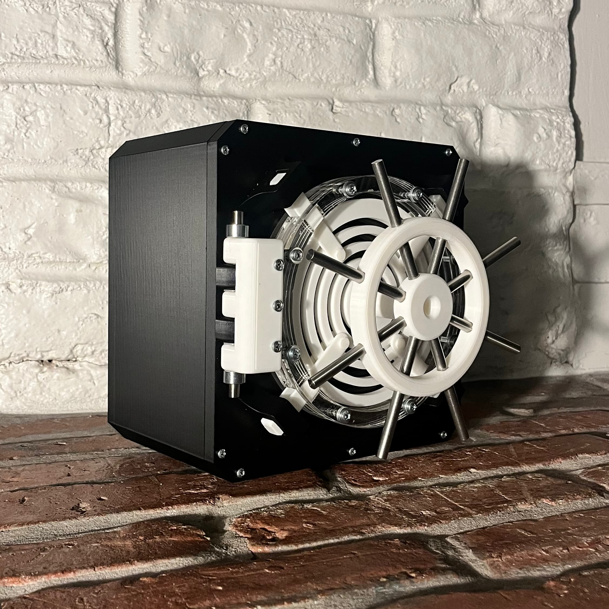
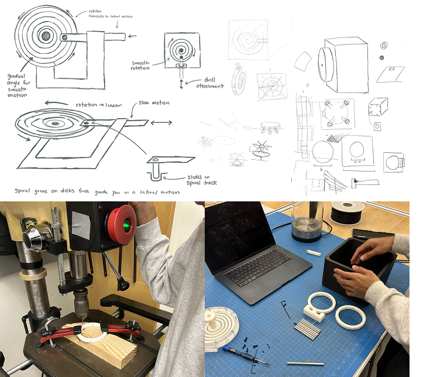
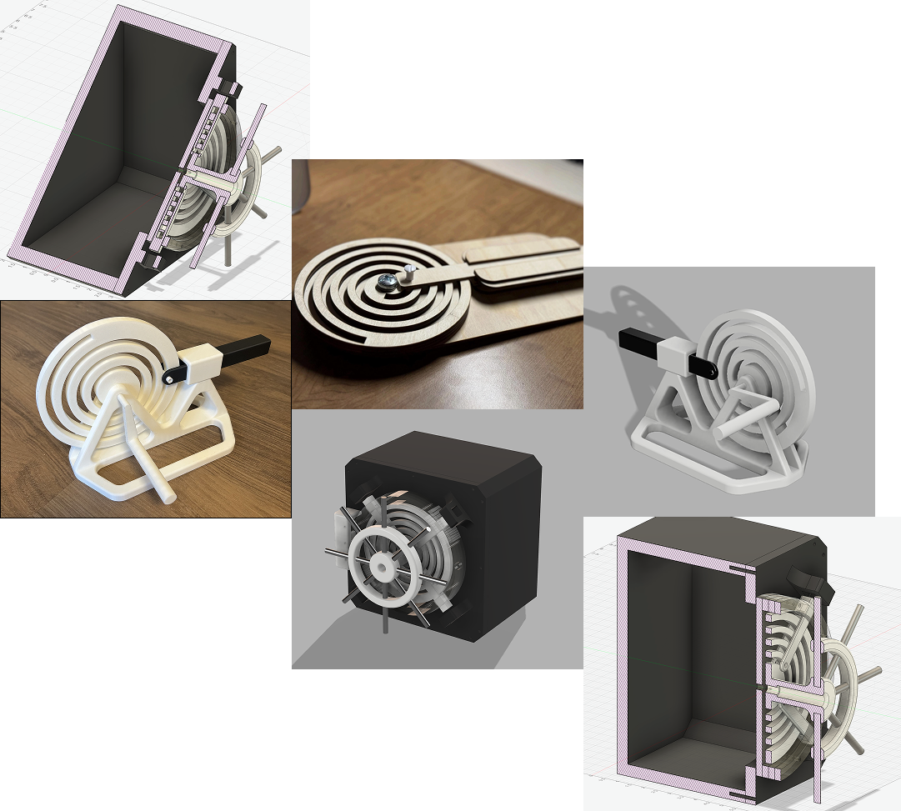

+++
title = "Vault"
description = "An experiment with a spiral feed mechanism."
date = 2025-11-13T11:30:00-08:00
+++

For the second project of _ME102: Foundations of Product Realization_,
you are assigned a mechanism and instructed to build something with
it. My group was assigned a [19th-century spiral feed system][507]. We
reimagined this historical mechanism as part of a vault door locking
system, using the spiral's gradual rotary-to-linear translation to
control four locking arms. This new use-case captures the physical
character of the original mechanism while taking it in an unexpected new
direction. And it looks fantastic:

Before any physical experimentation, we sketched and ideated a number of
possible mechanical arrangements and functions, with ideas ranging from
tidal and wind movement to drills and water wheels. Ultimately though,
the idea to transform the drill arm into a lock bolt came from a visit
to [a restroom in the Cantor Arts Museum]. There, we saw the horizontal
motion of the stall's bolt directly creating a fixed rotational change
in the external signage (red/green correlating with the stall’s occupied
status). Our mechanism performs that same transformation in reverse!

We made two prototypes over the course of the project. The first was a
2.5D laser-cut mock, which we used just to get an intuitive sense of the
mechanism. For our second iteration, we migrated to the 3D printer. This
version was our first vertical spiral, and the plastic significantly
reduced friction over the earlier wood model. It sported a wide base
for stability and a LEGO-inspired plus axel to latch the rotational arm
to the mechanism. After these two functional experiments, we refocused
our work toward building for a specific use-case: the vault.

Our final design built on the successes of our second prototype while
upgrading to mixed fabrication methods. This iteration combined a
3D-printed spiral and wheel components with laser-cut acrylic plates
and metal fasteners. The inclusion of real hardware allowed for smoother
motion, adjustable tolerances, and a sturdier overall assembly. This was
a professional device.

Our final CAD model combines four different materials, three
manufacturing processes, and two complex joints in one digital source
of truth. The device just barely fits inside an 8" cube (in case you
have one of those laying around).

Two interesting notes that might otherwise get missed:
- We designed our 3D printed parts in the center around the 2D
  constraints of the laser-cut acrylic, which we stacked (0.236” per
  layer) to create the transparent walls.
- Embedded in a layer of the door’s acrylic and the plastic wall of the
  safe body are a set of magnets! These add a subtle click that makes
  the door quite satisfying to open and close.

This project built on a lot of the previous knowledge we had acquired
prototyping in ME102. For example, before cutting the final acrylic
parts to construct the wall, we performed a number of test cuts to
examine the tolerance. This made working with fasteners much easier, and
is a practice we adopted after our introduction to friction fits in the
first project.

Looking toward the horizon, we are of course interested in improvements
to security. That would mean replacing our plastic parts with metal—so
that you can't defeat our vault using blunt force—as well as an actual
locking mechanism, which we deemed out of scope for this version.
Perhaps you'll hear more about that from me and my incredible teammates
([Vivek] and [Trun]) at some point in the future.

[Vivek]: https://vivekvivek.com/
[Trun]: https://trun.space
[507]: https://507movements.com/mm_099.html
[a restroom in the Cantor Arts Museum]: https://x.com/jordanbpeterson/status/1633882580746653696
