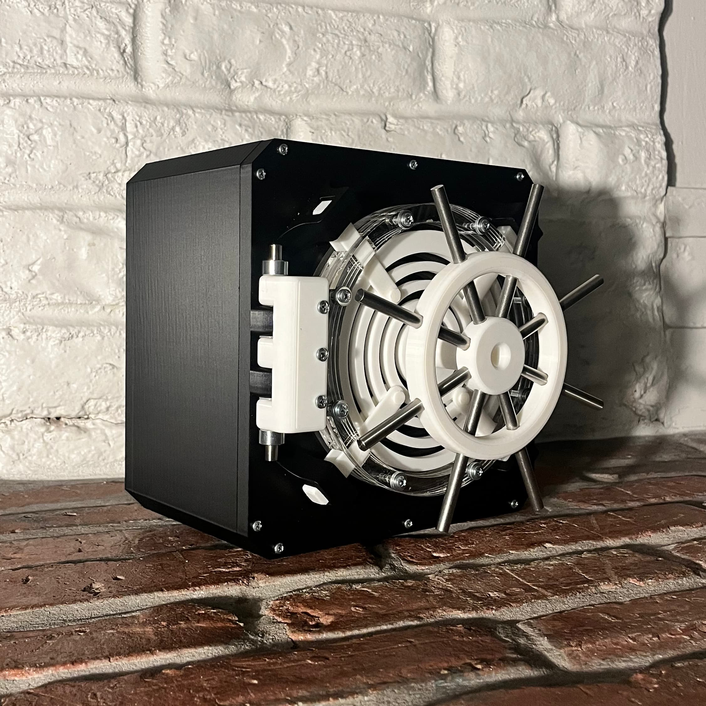
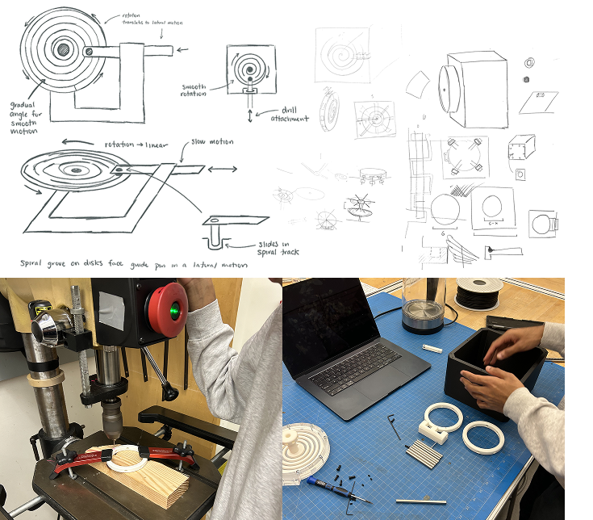
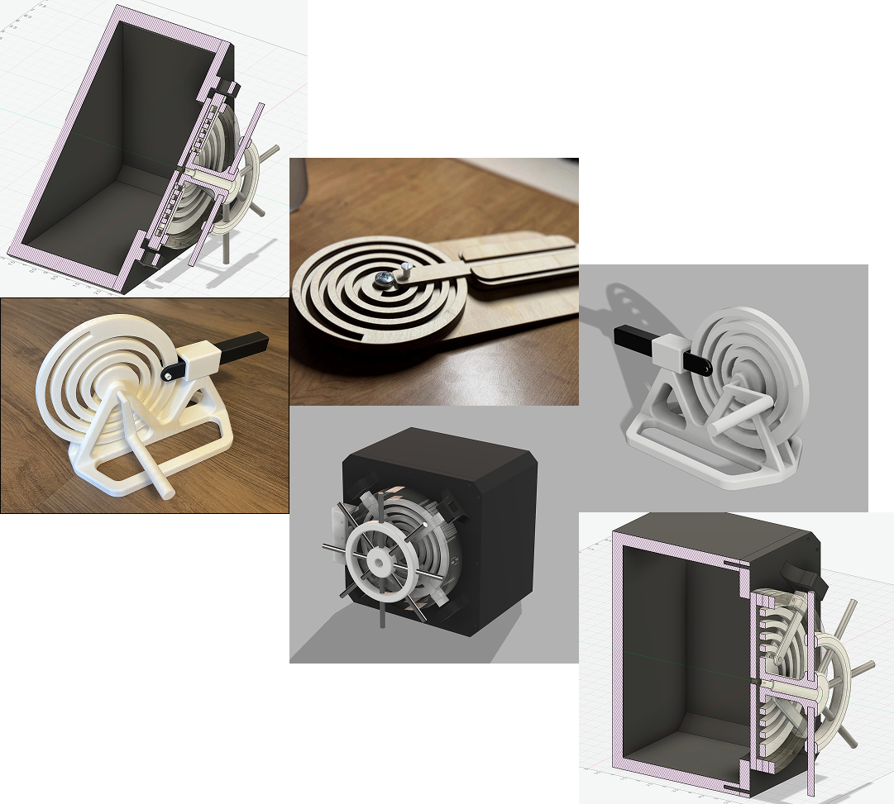

+++
title = "Vault"
description = "An experiment with a spiral feed mechanism."
date = 2025-11-13T11:30:00-08:00
[extra]
icon = """<svg viewBox="0 0 4863 4282" xmlns="http://www.w3.org/2000/svg" fill="currentColor"><g fill-rule="evenodd"><path d="m74 479h-1v-1h1z"/><path d="m1567 15-.5 1-.5-1z"/><path d="m2622.5 775h-2.5l.5-1h2.5z"/><path d="m2626.5 774h-2.5l.5-1h2.5z"/><path d="m2632.5 773h-4.5l.5-1h4.5z"/><path d="m2637.5 772h-4.5l.5-1h4.5z"/><path d="m2642.5 771h-3.5l.5-1h3.5z"/><path d="m2647 769-.5 1-3.5-1z"/><path d="m2591.5 783h-2.5l.5-1h2.5z"/><path d="m2596.5 782h-2.5l.5-1h2.5z"/><path d="m2599.5 781h-1.5l.5-1h1.5z"/><path d="m2602.5 780h-1.5l.5-1h1.5z"/><path d="m2606.5 779h-2.5l.5-1h2.5z"/><path d="m2610.5 778h-2.5l.5-1h2.5z"/><path d="m2614.5 777h-2.5l.5-1h2.5z"/><path d="m2618.5 776h-2.5l.5-1h2.5z"/><path d="m2584 776h-1v-1h1z"/><path d="m2586 775h-1v-1h1z"/><path d="m2588 774h-1v-1h1z"/><path d="m2590 773h-1v-1h1z"/><path d="m2592 772h-1v-1h1z"/><path d="m2594 771h-1v-1h1z"/><path d="m2596 770h-1v-1h1z"/><path d="m2597.5 769h-1.5l.5-1h1.5z"/><path d="m2600 768h-1v-1h1z"/><path d="m2602.5 767h-1.5l.5-1h1.5z"/><path d="m2605 766h-1v-1h1z"/><path d="m2710 726h-1v-1h1z"/><path d="m2717 725h-1v-1h1z"/><path d="m2622 758h-1v-1h1z"/><path d="m2625 757h-1v-1h1z"/><path d="m2627 756h-1v-1h1z"/><path d="m2632 754h-1v-1h1z"/><path d="m2607 765h-1v-1h1z"/><path d="m2609 764h-1v-1h1z"/><path d="m2611.5 763h-1.5l.5-1h1.5z"/><path d="m2614 762h-1v-1h1z"/><path d="m2616 761h-1v-1h1z"/><path d="m2618 760h-1v-1h1z"/><path d="m2620 759h-1v-1h1z"/><path d="m2428.5 646h-2l-1.5-1.5.5-.5h2l1.5 1.5z"/><path d="m2272 859.5-3.5-.5-1.5-1.5-.375-1.5-.625-3.5 2-2 .375-1.5.25-7 .625-1.75 1.25-.25 1.5-1.5.5-1.5 3-6 .75-1.75 1.25-.25 4.5-4.5 1.25-3.25 1.5-.5.5-1.5 1.25-.25 5.5-5.5.5-1.5 1-2 .5-1.5 1.5-1.5 1.25-.25.25-1.25 2-2 1-4 3.5-3.5 1.25-.25.875-3.75 4.875-7 2.5-4.5 6-8 2-3 8.5-10.5.5-1.5 1.5-1.5h1l1.5-1.5 1-3 1.5-1.5 1.25-.25 7.25-9.25 4-4v-2l2-2v-1l2.5-2.5h1l3.5-3.5.5-1.5 2.5-4.5 3-3v-2l2-2 1-3 2-2 .625-3.5 2.375-4.5 2-2 .625-2.5 1.625-3.75 1.25-.25 2.5-2.5 1-4 3-3 .625-3.5.625-1.75 1.25-.25 1.5-1.5.5-1.5 2-4 .5-1.5 3-3v-2l4-4v-1l-3.5-3.5h-1l-1.5-1.5-.25-1.25-4.25-1.25-2.5-2.5-5.375-7.5-4.25-12-.875-2-6.5-11.5-5.5-7.5-1-2-.5-1.5-5.5-5.5-1.25-.25-.625-1.75-.875-3.75-1.25-.25-3.5-3.5-.25-1.25-1.25-.25-3.5-3.5-2-4-3-3-.25-2.25-1.25-.25-2.5-2.5-1-3-1.5-1.5-3-1-1.5-1.5v-1l-2.5-2.5h-1l-1.5-1.5-1.25-3.25-1.25-.25-3.5-3.5-1-2-2-3-1.375-2.5-1.125-3-.75-2.75-3.5-1.5-1.625-3.75-.625-2.5-6-6-1-4-5.5-5.5-1.5-.5-5-3-1.75-.75-1.25-7.25-1-1 1-1v-1l1.5-1.5h1l1-1 1 1h1l2.5 2.5v1l1 1-1 1 2.5 2.5 4.5 2.5 1.5.5 3.5 3.5 2.5 4.5 6 8 1 2 .75 1.75 1.25.25 3.5 3.5.375 1.5 2.125 5 1 2 .75 1.75 1.5.5.5 1.5 3.25 1.25 1.5 1.5 1 3 1.5 1.5h1l1.5 1.5v1l2.5 2.5h1l4.5 4.5 9.25 13.25 2.25.25 3.5 3.5v2l1.5 1.5h1l2.5 2.5.5 1.5 1.5 2.5 6 8 1.5 2.5 6 8 3.5 5.5 1.375 2.5 1.25 3 .375 1.5 2 2 .5 2.5 2 6 .5 2.5 4.5 4.5 4 1 1.5 1.5 1.25 3.25 3.25 1.25 2.5 2.5.375 1.5 2.125 5 1 2 .5 1.5.5.5 1-1h5l1.5 1.5 1 4 3 3v1l3 3 1 4-1.5 1.5h-2l-3-3-4.5-1.25-9.875-.75-.125 4.5-2 2-.25 3.25-1.25.25-1 1-1-1-.5.5-.625 3.5-.375 1.5-1.5 1.5-1.25.25-5.75 7.75-3.5 6.5-2 3-1.25 2.25-1.5.5-1.875 7.75-1.625 3.75-1.25.25-2.5 2.5-3.5 5.5-3.75 6.75-1.25.25-2.5 2.5-.25 1.25-1.25.25-1.5 1.5v3l-3.5 3.5-1.25.25-4.25 6.25-2.5 2.5h-1l-1.5 1.5-1 4-3.5 3.5-1.25.25-2.75 4.75-.75 1.75-3.5 1.5-.75 1.75-1 2-.5 1.5-2.5 2.5h-1l-2.5 2.5-.625 2.5-3.875 7-4 6-2 5-.5 2.5-1.5 1.5-3.25 1.25-.75 1.75-1 2-.5 1.5-2.5 2.5-1.25.25-1.25 3.25-5 5v2l-3.5 3.5-2.25.25-1.25 3.25-2.5 2.5-2.25.25-.25 2.25-2 2-.5 1.5-3.75 6-1.375 5-.375 2.5-2.5 2.5zm150-185.5v-1.5l-1-.5v1zm1.5 1 .5-1h-1.5l-.5 1z"/><path d="m2429 650.5-3 3-.625 3.5-.625 1.75-1.75.75h-2l-1.75-.75-2.75-4.75-.75-1.75-1.5-.5-4.75-11.75-1.5-6.5-3-3-1.625-5.5-2.375-7.5-1.5-1.5-4-1-4-4h-1l-4.5-4.5-.5-1.5-2.875-6-2.875-10-2.125-30 4-15 1.875-5 5.25-20 5.25-13.5 2-2 1-5 3-3 .375-1.5 2.125-5 7-13 10.5-12.5 1.5-1.5 1.5-.5 2-1 1.5-.5 5.5-5.5 6-8 5.5-5.5 2.5-1.5 8.5-6.5 3-2 5.5-5.5v-1l3-3v-2l2.5-2.5h5l2.5 2.5.75 4.5-.125 2-.625 2.5-2 2-.25 1.25-21.25 17.25-3 2-2.5 2.5-7 9-1 2-2.5 2.5-6.5 4.5-1.5.5-9.5 9.5-.5 1.5-2.875 5-.625 2.5-2 2-.375 1.5-2 5-.625 2.5-3 3-.625 2.5-.875 2-.5 1.5-2 2-.5 2.5-3 8-2.125 9-4 13-1.75 5-1.125 5-.5 5.5-1 1 1 1-.625 3.5v2l.375 3-.25 8 4.5 20.5 1.5 1.5 2.5-.620117h2l3.75.870117.5 1.5 1.5.5 4.625 6.75 1.125 4 1.875 5 .625 2.5 2 2 2.375 4.5 1.125 3 4.5 16.5.5.5 1-1h4l.5.5-2 2zm-3 .5v-1h-1v1z"/><path d="m1982 558.379883-2.5.620117-3 3h-1l-2.5 2.5-1.25 4.5-.125 5 .375 2.5-3.5 3.5-3.5.629883-1.75.620117-2.5 4.5-1.25.25h-.5l.5 1h2l.5.5-1.5 1.5h-3l-1.5-1.5 1-1-1-4 2-2 1.625-5.5 4-11 6.375-8.5 1-2 4.5-4.5h1l9.5-9.5 1.5-2.5 10-12 .5-1.5 2.5-2.5 6.5-4.370117 2.5-.629883 3-3 2-1 20-16 3.5-3.5 2.5-3.5 17-21 27-32 14-19 10-16 6.5-11.5 12-16 2-3 27.5-27.5 23-19 20.5-13.5 2-1 6-4 4.5-2.5 20.5-13.5 6.5-3.5 8.5-5.5 1.5-.5 2-2 6-1 1.5 1.5-.5.5h-4l-2 2-4.5 2.5-1.75.75v1.5l2.25-.75 2.5-1.5 5-2.120117 1.5-.379883 1-1 .5.5v2l-1.5 1.5-1.5.5-13.5 8.5-2.5 1.379883-2.5.620117-2 2-3 2-17.5 13.5-10.5 6.5-10 7-8 5-8.5 6.5-14.5 12.5-26.5 26.5-12.5 16.5-2 3-17 28-27.5 35.5-16.5 18.5-13.5 16.5-2 3-5.5 5.5-8.5 6.5-3 2-1.5.5-1.5 1.5v1l-2.5 2.5-2 1-3 2-2.25 1.25-.5 1.5-1.25.25-2 2h-2l-2 2h-1l-1.5 1.5.5.5 1.25.25-.375 3.75-4.625 6.75-1.5.5-4.25 6.25-1 2-2.5 2.5-2.5 1.5-4 3-3 2zm-19 17.620117v-1h-1v1zm2 3v-1h-1v1zm-6 5v-1h-1v1zm0 4v-1h-1v1zm47-58v-1h-1v1zm-1 1v-1h-1v1zm-2 3v-1h-1v1zm-1 1v-1h-1v1zm-1 1v-1h-1v1zm-5 5v-1h-1v1zm-2 3v-1h-1v1z"/><path d="m3941 834h-1v-1h1z"/><path d="m3923 820.379883-9.5-.379883-2-2-1.5-.5-5-2.75-5-1.25-37.5-1.5-1-1-1 1-10.5.5-11 1.379883-2-.25-8-.25-6 1.120117-5.5.5-1 1-1-1-23.5-.5-2 .25-15-3.370117-4-1.75-3.5-.629883-2-2-11.5-2.5-6-2.120117-12-5.879883-1.5-.5-2-2-2.5-.5-6-2-2.5-.5-2-2-1.5-.370117-3-1.25-7-3.879883-1.5-.5-2-2-2.5-.620117-8.5-5.379883-2-1-10.5-10.5v-1l-1.5-1.5h-2l-4.5-4.5-.25-1.25-1.75-.75-5.5-3.5-1.5-1.5v-1l-1.5-1.5h-1l-2.5-2.5-1-2-8.5-12.5-6.5-8.5-3.5-3.5-23.5-19.5-29.5-27.5-2.25-1.25-.75-1.75-1-2v-2l.5-1.5 3.5-3.5 3.25.25.5 1.5 2.25.25 4 4 34.5 31.5 17.5 14.5 1.5 1.5 10 13 8.25 12.25 1.25.25 3.5 3.5.25 1.25 4.75 2.75 1.5.5 1.5 1.5v1l2.5 2.5 3 1 2.5 2.5v1l9.5 9.5 28.5 15.379883 9 3.25 2 .870117 1.5.5 2 2h2l2 2 1.5.5 10 4 8 2 4.5.5 2 2 2.5.629883 8 2.75 3.5.620117 1 1 1-1 1 1 7-1 1 1 1-1 1 1 83-2 1-1 1 1 15.5.75 5 .75 4 1 5 2 5 3 2 .879883 3.5.620117 3.5 3.5.5 1.5v2l-.5 1.5-1.5 1.5z"/><path d="m3162 486h-1v-1h1z"/><path d="m2967 672h-1v-1h1z"/><path d="m2966 671-1-1v-1l1 .5z"/><path d="m2967 668h-1v-1h1z"/><path d="m4177 876.5-4.5-.5-2.5-2.5-.370117-1.5v-4l.25-2-1.5-11-.629883-30-.5-5 4-26 .75-19.5 1-1-1-1 .25-1.5 1.5-5 1.5-4 .75-6.5 1-1-1-1 1-1 1.879883-31.5 1.75-6 2.370117-7.5-1-1 1-1 1.25-3.25 1.75-.75h2l1.75.75.5 1.75.75 5.5 3 3-1.5 2.5-1.25 2.75 2.25.25.5.5-1 1-.25 1.25-1.25.25-1 1-1.5-1.5v-1.5l-1 .5-1.5 35.5-1.5 11.5-2 2-.25 19.5-4 26 .25 45.75 3.5.25 2.5-2.5 2-8 .5-.5 1.5 1.5-.75 4.5-1.75 5-.5 2.5v.5l1-.5.5-1.5.879883-2 1-3 .620117-6 1 .5.379883 1.5.120117 3-2 5-1 2-.75 1.75-1.5.5-1.25 3.25-1.5 1.5-1.25.25-1.25 4.25-2.5 2.5zm14-156.5v-1h-1v1z"/><path d="m4078 348h-1v-1h1z"/><path d="m4037 295-1-1v-1l1 .5z"/><path d="m4028.75 695.75-1.5.5-.75 1.75-14.5 26.5-14.5 17.5-3.5 5.5-9.5 12.5-3.870117 6-2.129883 5-5.5 10.5-2 3-3.5 4.5-14.5 16.5-2.5 4.5-.5 1.5-1.5 1.5h-1l-3.5 3.5-1 3-4.5 4.5h-2l-1 1-2.5-2.5v-1l-1-1 1-1-1-1 2.5-4.5 5.75-7.75 1.25-.25 1.5-1.5.5-1.5 1-2 3.5-5.5 3.5-3.5h1l4.5-4.5v-1l2.5-2.5h1l1.5-1.5 12.5-23.5 2-3 18.5-23.5 11.5-13.5 14.5-26.5 3.5-5.5.75-2 .75-4.5 2.5-2.5h3l1.5 1.5.5 1.5.129883 2-1.129883 4-1.120117 3-.379883 1.5-2 2zm-1.75-7.75v-1.5l-1-.5v1z"/><path d="m4036.5 664h-6l-2-2-6.5-4.25-4.5-.75-1 1-1-1-1.5.5-2 .25-5-1.25h-5l-6 1.25-5 1.5-19 .379883-6 1.5-18 .25-12 1.75-27.5-.129883-1-1-1 1-9.5-1.75-3-.870117-8-3.75-24-6.25-6-2-4.5-2.379883-2-2-2.5-.5-3-1.120117-5-2.879883-1.5-.5-3-3-2.5-.620117-2-.75-2.5-.629883-2-2-1.5-.5-6.5-4.5-9-9h-2l-5-5-2.5-.620117-6-3.879883-6-3-17-15-13-10-4.5-2.5-3.5-2.5-2.5-1.5-7.5-7.5-3.5-5.5-1.870117-4-.629883-2.5-2-2 1.25-4.5h8.25l2.5 2.5.5 1.5 3.5 6.5 7.5 7.5 5.5 3.379883 2.5.620117 2 2 13 10 16.5 14.5 2 .879883 2.5.620117 3 3 1.5.5 4.5 2.5 6.5 4.5 15 13 11.5 5.5 5.5 3.5 1.5.5 2 2 3.5.629883 4.5 2.370117 2 2 2.5.5 20 5.129883 2 .75 4 1.120117 5 2 4 1.879883 3 .870117 16.5 1.75 1 1 1-1 8.5.5 3.5-.5 1 1 1-1 5.5-1.25 20 .129883 3-.379883 3-.870117 5-.879883 20-.5 5-1.620117 6-1 25 1.120117 4 .879883 1.75.620117 7.75 9.75.129883 2-.629883 2.5z"/><path d="m1565.5 9 .5-1h-1.5l-.5 1zm12 1 .5-1h-7.5l-.5 1zm3 0 .5-1h-1.5l-.5 1zm-14.5 5h-.5l-2-2-8-1-1 1-1-1-1.25-.25-.625-1.75-.125-3 1.75-5.75 1.75-.620117 3.5-.629883 1.5 1.5 1.25 3.25 1.75.5 33 2.25 5-.870117h10l25 2.25 6 1.620117 3 1.129883 1.5.370117 2 2 8.5.5 10 1.25 33 8.75 14 2.129883 6 1.5 12 1.620117 8-.25 13.5 3.5 2 2 19-1 1-1 1 1 46.5.879883 38 5.620117 10 2.75 22 2.629883 10 2.870117 2 .75 2 1 2 .25h26l3-.370117h2l4 1.120117 3 .25 12-1.5 3 .129883 48 6.870117 18 .25 10 2.129883 4.5 1.370117 1 1 1-1 15.5.129883 2 .25 8 2.120117 6 1 6 1.629883 11 1.5h10l3 .75 80 7.75 2-.379883 7-.25 13 2.629883 14 .120117 5-.870117h3l16 2.370117 4.5 1.25 1 1 1-1 16.5.5 44 6.129883 53 1 17 2.75 14.5-.379883 1-1 1 1 19 3 3 3 85.5 3.5 20 3 7 1.75 24 3.5 14 3.75 7 2.75 9 1.25h14l22 4.629883 40 4.620117 47 5.75 11 2 4 1 27 3.25 15.5 3.25 2 2 32.5 1.5 8 1.629883 40 3.370117 58 9 5 2 2 .25 6-.370117 24 2.120117 7.5 1.5 2 2 28.5-.25 70 9.879883 5 1.620117 90 13.379883 4.5 1.370117 2 2 20.5 1.75 10 1.75 7 1.75 22 2.5 13 2.879883 8 2.75 15 3.120117 6 1.879883 28 5.120117 16 4 7 2.75 31 4.5 18 4.879883 2 .75 3 .870117 14 2.25 12 .25 16 3.879883 4 1.620117 9 1.25 16 .129883 76 9.620117 20 .379883 14.5 2.370117 2 2 24.5-1.5 17 2.75 23 .25 67 5.25 5 1.629883 11 2.370117 5 1.629883 13 2.370117 11.5-.75 2 2 4.5.5 4 1 3 1.129883 1.5.370117 3 3 18.5.629883 49 7 18 4.120117h11l9 2.75 3.5.5 3 3 8.5-.75 2-.5 6-.25 6 1 5 1.25 1.5.25 1 1 1-1 17.5 1.629883 5 1 5 1.620117 5 1 21 1.5 5.5 1.25 1 1 1-1 6.5.75 2-.120117 3-1.129883h4l7.5 1.5 2 2 9.5.629883 6.5 1.370117 2 2 13.5-.25 33 6.75 4.5.5 2 2h1l1.5 1.5.379883 1.5.120117 3-.5 2.5-2.5 2.5-7.5-.75-7-2.620117-28-6.129883h-4l-11.5 1.5-4-4-1.5-.25-11.5.25-4-4-20.5.379883-3-.75-29-2.5-2-.629883-2-1-2-.75-15-2.5h-9l-7-1.75-4.5-.5-1-1-1 1-9.5 1.5-7-.25-1.5-.25-4-4-2.5-.370117-5-1.25-2.5-.379883-1-1-1 1-8.5-.5-11-2-7-2-31.5-4.5-1 1-1-1-15.5-2.370117-18-.25-2-.879883-6-3.870117-8-2.129883-3-1.120117-10 .120117-14-2.120117-9-2.879883-11.5-2.5-1-1-1 1-14.5.129883-28-3-8 .120117-15-3-2 .129883-3 1.25-2 .25-15-1.629883-17-2.870117-5 .25-16 2.25-2-.25-3-1.25-1.5-.379883-2-2-6.5-.5-5-1-20-.25-62-6.870117-11-1.879883-5-1.25-15 .25-11.5-1.5-2-2-3.5-.5-11-3h-12l-15-2.25-3-.870117-20-5.629883-31-4.5-2-.75-2-1-2-.75-48-10.25-11-2.870117-7-1.25-3-1-4-1.629883-10-2.25-3-1h-8l-15-2.25-7-1.75-31-4.25-3.5-1.25-2-2-28.5-2.870117-56.5-9.129883-1 1-1-1-6-1-2-2-45.5-4.75-21-3.870117-3-.879883h-4l-5 1h-18l-3-1.120117-1.5-.379883-2-2-36.5-2.870117-3-.629883-3-1-86-11.25-9 .25-11-3-7-1.120117h-23l-4.5-1.379883-2-2-5.5-.5-8-1.75-27-3.25-50-7.25-6 .379883-6-1.879883-39-4.5-6-1.5-39-4.5-3-.870117-5-1.879883-8-2-3-1.120117-2-.5-28-4.379883-4-1-55-5-4-.75-44-.25-3-1.120117-5-2.629883-12-2.25h-4l-4 1.129883-2 .25-26-4.379883-64-2.120117-18-2.129883-16-2.870117-18 .120117-5-1.75-15-2.5-2 .129883-3 .75h-18l-13-2.879883-2 .129883-3 .870117h-15l-55-6-2-.5-14-2.25-8 .25-12-1.5-20-4.75h-13l-10-1.25-12-2.75-20-.370117-5-1.379883-39-5.25-59-1.370117-2-.629883-2-.870117-8-2.25-2-.75-3.5-.629883-1 1-1-1-16.5-1.75-4-1.620117-8-2-45.5-5.629883-1-1-1 1-57-1-3-3-4.5-.5-4-.870117-22-2.5-4-1.379883-38-8.25-12-3.75-11-1.5-3 .379883h-2l-3-1.25-1.5-.379883-2-2-15.5-2.5-12-.25-2-.370117-11-.379883-8 1.129883-4-.129883-5-.75-17 .25-.5-1-.5.5z"/><path d="m1591 969h-1v-1h1z"/><path d="m1585 1043.379883-3.5.620117-4.5-4.5v-1l-1-1 1-1v-2l2-2 .25-2.5 1.5-8 .25-2.5 2-2 .5-1.5 1-2 .5-1.5 5.5-5.5h2l1.5-1.5 1-7 1.5-1.5 4.25-1.25.25-1.25 1.5-1.5 5.25-1.25.25-1.25 2.5-2.5 1.25-.25 4.75-6.75 1-2 .75-1.75 1.25-.25 2-2h2l1.5-1.5 1-5 2.5-2.5 5.5-1.620117 2-.75 2.5-.629883 3-3h1l2.5-2.5 2-3 4.5-5.5 2.5-3.5 1.5-1.5 6.5-4.370117 2.5-.629883 3-3 5.5-3.5 2-1 1.5-.5 4-4h3l4-4 1.5-.5 4.5-2.5 3.5-2.5 2.5-1.5 2-2 8-1 5-5 8.5-.370117 4-2.129883 4-3 2-.75 5-1.5 1.5-.25 4-4 2.5-.620117 4-1.75 10-3.129883 4.75-.620117.5-1.629883 3.75-1.5 9.5-1.75 2-2h9l3-3 12-1 2-2 3.5-1.25 5-1.120117 9.5-.629883 2-2 14-4 1.5-1.5v-1l2.5-2.5 4.5-1.370117 5.5-.629883 2-2 9.5-.75 2-.5 12-.5 1.5-.25 2-2 3.5-.5 12-3 4 .129883 2 .870117 1.5.5 2 2 15.5-.870117 4-1.379883 4.5-.75 2-2 3-1 1 1 2-2 1.5-.25 7-.120117 2.5.370117 3-3 4.5-.75 3.5-1.25 1.5-1.5.25-1.25 6.75-4.620117 2.5-.629883 1 1 .5-.5.25-1.25 1.75-.5h7.75l.25-1.25 3.5-3.5 2.5-.620117 2-.75 2.5-.629883 3-3 3.5-.5 3-.870117 4.5-.629883 2-2 1.5-.5 2-.870117 4-1.25 2-.879883 6-4 1.5-.5 3.5-3.5v-1l2.5-2.5 1.25-.25.25-1.25 1.5-1.5 2.5-1.5 9.5-7.5 1.5-1.5v-1l2.5-2.5 4-1 3-3 2-1 10-8 3.5-3.5 1-4 2.5-2.5h2l1.5-1.5v-2l3.5-3.5h1l4.5-4.5 12.5-16.5 1-2 .5-1.5 4.5-4.5 1.25-.25 1.25-5.25 7-7 3.5-5.5.75-1.75 1.25-.25 2.5-2.5.625-2.5 4.125-14 .25-1.5 2.5-2.5 7-5 2-2 2.25-.25 2.5-4.5 2.25-1.25 6-4 2.25-1.25.75-1.75 1.5-2.5 2.5-3.5 8.5-10.5 2.5-2.5h1l1.5-1.5v-1l2-2v-2l6-6 .25-1.25 1.25-.25 3.5-3.5.5-1.5 5-7 .5-1.5 3-3 1-6 2-2v-1l2.5-2.5 2-1 3-2 2-1 3.5-3.5.5-1.5 2.875-5 1-3 1.375-6 2.25-4.5 2.5-2.5 3-1 1.5-1.5 4.375-6.5 2-5 .625-2.5 2.5-2.5h2l1.5-1.5v-1l2.5-2.5h1l1.5-1.5-1.75-24.5-4-17-.625-2-.625-3.5-2-2-1-4-2-2-1.5-6.5-7-25-3.25-21 3.5-40 .875-3 2.625-7 3.5-21 1.5-4 2.75-10.5 2-2 .5-2.5 2-5 10-16 .875-2 .625-2.5 2-2 .5-1.5 2.125-5 .375-1.5 7.5-7.5 1.25-.25.25-1.25 2.5-2.5h1l8.5-8.5v-1l4.5-4.5 3-1 7.5-7.5 1-4 1.5-1.5 1.5-.5 7-5 1.5-.5 6.5-6.5v-1l2.5-2.5 6.25.129883.25 1.370117 2 2-1 9-2.5 2.5-4 1-1.5 1.5v1l-2.5 2.5-4 1-1.5 1.5-6 8-3.5 3.5-5.5 3.5-1.5.5-3.5 3.5v1l-13.5 13.5h-1l-4.5 4.5-.5 1.5-4 9-5 8-2.5 4.5-4 6-1.375 2.5-1.125 4-5.875 18-3.375 20-1.625 4-1.125 4-2.25 21-1.25 4.5 1 1-1 1 .875 18.5 2.125 15.5 2 2 .5 3.5 5.125 18 .875 2 3 5 .875 2 5.875 21 .75 8.5 1 1-1 1 1 14 2 2 .375 1.5v4l-2.375 4.5-1.5 1.5h-1l-4.5 4.5v1l-3.5 3.5-1.25.25-1.625 3.75-.625 2.5-6 6v1l-3.5 3.5h-1l-1.5 1.5-.5 1.5-.875 2-2.25 8-2.375 3.5-3 4-1 2-5.5 5.5-2.25.25-.25 1.25-2.5 2.5-1.25.25-1.875 6.75-1.625 3.75-1.25.25-2.5 2.5-.5 1.5-5.5 7.5-9 9v2l-2 2-4.25 6.25-1.25.25-4.5 4.5-7 9-1.5 2.5-.5 1.5-2.5 2.5-1.5.5-5.5 3.5-3.5 3.5-2 4-2.5 2.5-3.25.25-.25 1.25-6 6-1.625 6.5-2.875 7-2 3-7 9-2.75 4.75-1.25.25-1.5 1.5-.5 1.5-2 4-.5 1.5-1.5 1.5h-1l-2.5 2.5-1 2-8.5 10.5-1 2-8 10-.5 1.5-3.5 3.5h-1l-5.5 5.5-4 6-1.5 1.5-3 1-7 7h-2l-1.5 1.5v1l-1.5 1.5-1.5.5-2 1-7.5 5.5-5.5 5.5-.25 1.25-3.25 1.25-1.5 1.5v1l-1.5 1.5-2.25.25-.25 1.25-6.5 6.5h-2l-2 2h-1l-2 2-2.5.629883-2 .75-2.5.620117-2 2-1.5.5-4.5 2.5-2 2-10 1-2 2h-2l-5 5h-1l-2 2h-5l-2 2-3.5.629883-1.5.370117-2 2-3.5.629883-2 .870117-1.5.5-2 2-5 1-2 2-3.5 1.25-4.5.75-1-1-3 3-1.5.379883-6 .120117-2 .75-10 2.129883-8.5.620117-1 1-1-1-1 1h-10l-2-2-2.5-.5-3-.120117-7 1.25-8 2.620117-16.5 1.75-1 1-1-1h-3l-4 4h-6l-3 3h-1l-4 4-7.5.75-3 .879883-2 .870117-1.5.5-2 2h-4l-1-1-1 1h-7l-3 3h-2l-2 2-1.5.379883-6.75-.129883-.25 1.25-1.5 1.5-5.5 3.5-2 .129883-2.5-.629883-2-2-3 3-6.5-.75-2.5.75-2.5 1.379883-3 1.120117-8 2.129883-6 2-2 .870117-5.5 3.5-4 4h-6l-3 3h-1l-2.5 2.5v1l-2.5 2.5-7-1-1-1-3 3h-1l-2 2-6.5.75-2.5 1.25-6.5 4.379883-2.5.620117-5 5-4 1-4 4-2.5.629883-2 .870117-6.5 4.5-7 4-1.5 1.5-7 9-1 2-4.5 4.5h-1l-4 4-2.5.629883-5.5 3.370117-1.5 1.5-.5 1.5-1 2-.5 1.5-1.5 1.5-4 1-1.5 1.5-3 5-10.5 10.5-3.25 1.25-.25 1.25-2.5 2.5h-1l-1.5 1.5-1 3-2 2v2l-2.5 2.5-4.25 1.25-.25 2.25-3 3-.625 7.5-1.375 7.5-2.5 2.5z"/><path d="m1596 958.5-4.25 8.25-1.25.25-1.5 1.5-.25 1.25-1.5.5-.25 1.25-2.5 2.5h-2l-1.5-1.5v-3l2-2 .5-1.5 2-4 3.875-6 .625-2.5 3-3v-1l3.5-3.5 30.5-24.5 34.5-29.5 3.5-3.5 1.5-2.5 18.5-20.5 3-4 2.5-2.5 1.5-.5 8.5-5.5 9-7 1.5-1.5v-1l4.5-4.5 1.5-.5 2-1 5.5-3.5 4.5-4.5 4-5 7.5-8.5 3.5-4.5 2.5-2.5.5.5v1.5l1-.5 1.25-4.25 1.25-.25 1.5-1.5-1-7 3-3 1.25-4.25 2.75.379883 1.5.370117 1 1 .5-.5v-1l.5-.5 1 1 1.5.379883 3.5.620117 2.5 2.5v1l1.5 1.5 2-2 9.5-.620117 5-1 7.5-2.379883 2-2 3.5-.5 4-1 3-1.120117 2 .120117 1.5.5 1 1 1-1h4l2 2 1.5-.5 2-.25 6 .25 12-3 5.5-.5 2 2h4l2 2 1-1h18l2-2h3l3.5-3.5-.375-9.5.875-3 3.125-9 2.875-5 5.875-8 .625-2.5 2-2 .625-2.5 2.875-5 .5-1.5 2.5-2.5h1l1.5-1.5v-1l6.5-6.5h1l2.5-2.5 1-4 2-2 .625-2.5 1.625-3.75 1.25-.25 6.5-6.5.5-1.5 1-2 .5-1.5 1.5-1.5 1.25-.25.25-2.25 4-4 .5-1.5 2-4 .5-1.5 1.5-1.5h1l2.5-2.5v-1l1.5-1.5 3-1 1.5-1.5v-1l2.5-2.5h1l11-11 2.25-.25.25-2.25 4-4 2.25-4.25 3.5-1.5-.75-6.25-1-1 1-1v-1l3.5-3.5 1.5-.370117h4l1.5.370117 1.5 1.5v1l.5.5 1-1 2.5-.620117 2-.75 2.5-.629883 2 2 4-4 11.5-.870117 4-1.379883h5l2 .629883 3 .370117 9-1.5 3 .25 2.5.5 4 4 8.5.379883 4-1.629883 8-1.5 7-2.75 5-3 1.5-.5 1-1 1 1 2.5.629883 2-.129883 5-2.120117 1.5-.379883 1-1 1 1 2.5.5 8.5-.5 2 2 1.25-.25.5-1.5 3.25-1.25 2-2 4.5.75 1.75.5.5 1.75v8l-.75 2-7 10-1.5 2.5-3 3 .5.5 1.5-.5 5-2.120117 1.5-.379883 5.5-5.5 2.25-4.5 3.25-11-.125-6-.625-2.870117-4.75-.879883-1.75-.5-.25-1.25-1.5-1.5-1.5.379883-4 .25-9-1.879883-7-.120117-5.5 1.370117-1-1-1 1-1.5.25-5 .129883-2.5-.379883-2 2-8.5 1.5-7-.25-4.5-1.25-2-2-1.5-.370117-5-2.129883-2-1-2-.620117-11-1.75-3.5-1.129883-1 1-1-1h-2l-2-2h-2l-2 2-2.5.629883-2 .75-3.5.620117-2 2-3.5.5-3 1.129883-1.5.370117-2 2-9.5.629883-4 .75-7 .120117-5-1-4.5-.5-2-2h-1l-2-2-3 3h-2l-2.5-2.5.5-1.5 6.75-10.75 1.5-.5.5-1.620117 4.25-.129883 1.5 1.5 1.125 6.25 5.875 1.629883 6 .120117 8-2 4.75-.620117.5-1.629883 1.75-.620117 3.5-.629883 3-3h2l1-1 1 1 4-1 2-2 2.5-.5 3-1 4 .129883 1.5.370117 1 1 1-1h5l1.5 1.5v1l.5.5 1-1 1 1 8.5.75 2 .75 2 1 1.5.5 2 2h3l2 2h1l3 3 3.5-.5 4-1.120117 8-2.879883 3.5-.5 1 1 2-2 3.5.5h5l7-1h6l6 1.75 5 .129883 3-.75 5 .120117 1.75.5.5 1.5 3.25.25 1.5 1.5 1 3 2 2 .5 15.5-2 9-2.5 9.5-2 2v2l-5.5 5.5-5.5 3.5-5 2.129883-5.75 3.620117-.25 3.25-2.5 2.5-7-1-2.5-2.5-.25-1.25-3.25 1.75-15.5 13.5-2.75 1.75-2.75 4.75-.5 1.5-2.5 2.5-1.25.25-.25 1.25-1.5 1.5-2.25.25-.25 1.25-4.5 4.5-3 1-2.5 2.5v1l-8.5 8.5-3.25 1.25-.25 1.25-1.5 1.5-4.25 2.25-.75 1.75-3 6-5 7-.5 1.5-4.5 4.5h-1l-1.5 1.5-2 4-2.5 2.5h-1l-1.5 1.5v1l-3.5 3.5-1.25.25-.25 1.25-2.5 2.5-1.5.5-9.5 7.5-1.5 1.5v1l-6.5 6.5h-3l-1.5 1.5v1l-1.5 1.5-12 1-2 2-4 1-1.5 1.5v1l-1.5 1.5-5.5.75-5 1.879883-1.5.370117-2.5 2.5v1l-1.5 1.5-3 1-1-1-.5.5v1l-4.5 4.5-4.25.129883-.25 1.370117-1.5 1.5-1.5.379883-3 1.120117-2.5.5-1 1-1-1-5 5h-4l-3-3h-2l-1 1-1-1h-1l-1 1-1-1-3.25-1.25-.25-1.25-2.5-2.5-20-2-2 2h-2l-1 1-1-1-22.5.25-2-.5-10-1.5-2 .129883-9.5 2.620117-1 1-1-1-2.5-.620117-6 .25-7-1.129883-5 .129883-13.5 4.370117-2 2-8.5.5-24.5 3.5-2.5 2.5-.25 2.25-1.5.5-1.5 3.5-1.25.25-8.5 8.5-7 9-3.5 3.5-2 1-6.5 4.5-18.5 15.5-2 1-4 4h-2l-5.5 5.5-4 6-3.5 3.5-1.25.25-10.25 12.25-1.25 2.25-29.25 24.25-1.5 1.5v1l-3.5 3.5-2.5 1.5-31.5 25.5-3.5 3.5v1zm385.5-197.5 1.5-.370117 3.5-.629883 2.5-2.5v-1l3.5-3.5 1.25-.25.25-1.25 1.5-1.5 3-2 10-8 1.5-1.5v-1l5-5 1-4 2.5-2.5h1l1-1 1 1 .5-.5.5-1.5 1-2 6-8 4.75-8.75 1.5-.5.25-2.25 3-3v-1l3.5-3.5h6l1.5-1.5v-2l3-3v-2l3.5-3.5h2l1.5-1.5v-1l2.5-2.5 1.5-.5 2-.870117 2.5-.629883 1.5-1.5 1.25-3.25 1.25-.25 2.5-2.5v-1l1.5-1.5 3-1 5.5-5.5v-1l1.5-1.5 3-1 5.5-5.5 6-8 4-4-1.5-1.5-1 1-3.5-.620117-1.75-.629883-.25-1.25-1.5-1.5-1 1-5.5 1.5h-6l-5 2.879883-3.5.620117-3 3h-6l-1-1-1.5 1.5-.25 1.25-1.25.25-2 2-3.5-.620117-5-2-4 .25-2.5-.629883-2-2-23.5-.25-5 1-4.75 1.5-2.5 4.5-3.75 1.629883-2.75.870117-.25 1.25-1.5 1.5-1.5.379883h-4l-1.5-.379883-3 3-7.25 1.25-2.625 4.75-.625 2.5-3.5 3.5-4 1-6.5 6.5-.25 1.25-1.25.25-3.5 3.5v1l-2.5 2.5h-1l-1.5 1.5v3l-1.5 1.5-3 1-1.5 1.5-.5 1.5-5.75 7.75-1.5.5-.75 1.75-3.75 6.75-1.25.25-2.5 2.5-1 3-2 2-.625 2.5-.875 2-3 5-.75 1.75-4.25 1.25-4.5 4.5-5 7-2 2-.625 2.5-.875 2-.5 1.5-2 2-.625 3.5-2.625 4.75-1.25.25-1.5 1.5-.5 1.5-1 2-2.125 5-.375 1.5-1 1 1 1v6l1.5 1.5 2.5.5 4.75 1.75.5 1.5 2.75-.25 5.75-1.75.5-1.5 1.25-.25 3-3 3.5-.620117 1.5-.379883 2-2h2l1-1 1 1 1-1h3l2-2 1.5-.5 2-.870117 3.5-.629883 3-3 2.5-.620117 2.5-1.379883 3-2 2-1 1-1 1 1 3.5-.5 6-1.75h6l1.5.25 3 3 1-1h2zm-212.5 34v-1h-1v1zm1 2v-1h-1v1zm211-151v-1h-1v1zm131 3v-1h-1v1zm-527 320v-1h-1v1zm-1 2v-1.5l-1-.5v1zm-1 2v-1.5l-1-.5v1z"/><path d="m2920.5 1752h-1.5l.5-1h1.5z"/><path d="m2447.5 1559h-2.5l.5-1h2.5z"/><path d="m2444 1557h-1v-1h1z"/><path d="m2497 1495h-1v-1h1z"/><path d="m2496 1494h-1v-1h1z"/><path d="m2146 1510 1 .5-1 .5z"/><path d="m2739 1466 1 .5-1 .5z"/><path d="m2531 1200-.75-.25-.25-3.25 1.5-1.5.5.5v1.5h-.5l-.5.5z"/><path d="m2074.5 1196h-1.5l.5-1h1.5z"/><path d="m2436 930h-1v-1h1z"/><path d="m2431 903h-1v-1h1z"/><path d="m2446 898h-1v-1h1z"/><path d="m2451 896h-1v-1h1z"/><path d="m2454 895h-1v-1h1z"/><path d="m3950 1756h-1v-1h1z"/><path d="m3939 1718h-1v-1h1z"/><path d="m3936 1710h-1v-1h1z"/><path d="m3944 1668h-1v-1h1z"/><path d="m3945 1667h-1v-1h1z"/><path d="m3946 1665h-1v-1h1z"/><path d="m3948 1662h-1v-1h1z"/><path d="m3735 1702h-1v-1h1z"/><path d="m3950 1659h-1v-1h1z"/><path d="m3952 1654h-1v-1h1z"/><path d="m3953 1652h-1v-1h1z"/><path d="m3954 1650h-1v-1h1z"/><path d="m3955 1648h-1v-1h1z"/><path d="m3956 1646h-1v-1h1z"/><path d="m3957 1644h-1v-1h1z"/><path d="m3958 1642h-1v-1h1z"/><path d="m3959 1639h-1v-1h1z"/><path d="m3960 1636h-1v-1h1z"/><path d="m3961 1634h-1v-1h1z"/><path d="m3962 1631h-1v-1h1z"/><path d="m3963 1628h-1v-1h1z"/><path d="m3956 1604-1-.5v-5.5l1 .5z"/><path d="m3469.75 1726.879883-6.75-.629883-19.5-4.25-2-2-2.5-.620117-6-2.879883-1.5-.5-5.5-5.5-.370117-1.5-1.129883-3-3-12-2.120117-12-1.629883-6-2-16-.370117-22 2.25-8 5-14 2.370117-4.5 7.5-7.5 7-2 1.5 1.5-.620117 3.5-2.629883 4.75-1.5.5-3.25 5.25-2 2-.5 3.5-3 9-.620117 3-.129883 25 2 14 6.879883 30 .620117 1.75 1.75.75 4 1.879883 16 5.120117 6.5.5 2 2h1l1.5 1.5 1 3-1 1 .5.5 1.25.25-.120117 1.75zm-.75-2.879883v-1h-1v1z"/><path d="m3932 1524h-1v-1h1z"/><path d="m3931 1523h-1v-1h1z"/><path d="m3007 1430v-.5l.5-.5.5 1z"/><path d="m3315 1263h-1v-1h1z"/><path d="m3671 1153h-1v-1h1z"/><path d="m3454 923h-1v-1h1z"/><path d="m3456 922h-1v-1h1z"/><path d="m3458 921h-1v-1h1z"/><path d="m3459 919-.5 1-.5-1z"/><path d="m3459 919v-1h1v.5l-.5.5z"/><path d="m3460 917 1 .5-1 .5z"/><path d="m3462 916-1-.5v-2.5l1 .5z"/><path d="m3419 936h-1v-1h1z"/><path d="m3429 933h-1v-1h1z"/><path d="m3432 932h-1v-1h1z"/><path d="m3434 931h-1v-1h1z"/><path d="m3437 930h-1v-1h1z"/><path d="m3440 929h-1v-1h1z"/><path d="m3442.5 928h-1.5l.5-1h1.5z"/><path d="m3445 927h-1v-1h1z"/><path d="m3447 926h-1v-1h1z"/><path d="m3449.5 925h-1.5l.5-1h1.5z"/><path d="m3452 924h-1v-1h1z"/><path d="m4050 1844h-1v-1h1z"/><path d="m4051 1843h-1v-1h1z"/><path d="m4052 1841h-1v-1h1z"/><path d="m4053 1840h-1v-1h1z"/><path d="m4054 1839h-1v-1h1z"/><path d="m4055 1837h-1v-1h1z"/><path d="m4056 1836h-1v-1h1z"/><path d="m4057 1835h-1v-1h1z"/><path d="m4058 1833h-1v-1h1z"/><path d="m4059 1832h-1v-1h1z"/><path d="m4060 1830h-1v-1h1z"/><path d="m4061 1829h-1v-1h1z"/><path d="m4062 1827h-1v-1h1z"/><path d="m4063 1826h-1v-1h1z"/><path d="m4064 1825-1-1v-1l1 .5z"/><path d="m4065 1823h-1v-1h1z"/><path d="m4066 1822-1-1v-1l1 .5z"/><path d="m4067 1820h-1v-1h1z"/><path d="m4068 1819h-1v-1h1z"/><path d="m4069 1817h-1v-1h1z"/><path d="m4030 1819v-3h1l1 3.5-.5.5z"/><path d="m4070 1816h-1v-1h1z"/><path d="m4071 1814h-1v-1h1z"/><path d="m4072 1813h-1v-1h1z"/><path d="m4073 1812h-.5l-.5-.5 1-.5z"/><path d="m4073 1811v-.5l.5-.5h.5v.5l-.5.5z"/><path d="m4031 1813h.5l.5-.5v-2.5l1-.5 1-1.5v1.5l1 1-.5.5h-1l-.5.5 1 1-.25 1.25-1.25.25-.5.5 1 1v1l-.5.5-1.5-1z"/><path d="m4074 1810 1-3.5 2-1.5v2h-.5l-.5.5v1.5h-.5l-.5.5v.5z"/><path d="m4443 1777 1 .5-1 .5z"/><path d="m4072 1765v-.5l.5-.5h.5v1z"/><path d="m4048 1742h-1v-1h1z"/><path d="m4049 1739h-.5l-.5-.5 1-.5z"/><path d="m4051 1736 .25-.75 1.75.75z"/><path d="m4218 1692-.5 1-.5-1z"/><path d="m4420 1623-.5 1-.5-1z"/><path d="m4767 1342h-1v-1h1z"/><path d="m4158 1298h-1v-1h1z"/><path d="m4187 1293 .629883-4 .370117-1.5.5-.5.5.5v2.5h-.5l-.5.5v2.5z"/><path d="m4060.5 1151-.5-1 1.5-2h1l1-1 .5.5-.25 1.25-1.25.25z"/><path d="m4092 1131h-1v-1h1z"/><path d="m4094.5 1132-.75-1.25-1.5-1-.5-1.5-1.5-.5.25-2.75.75-2.75 3.25-1.25.5-.5-1-1 .5-.5h1l1 1 1-1h1l1-1 1 1 7-5 2-2 3.25-.25.25-1.25 4.5-4.5h2l1-1 1 1 9-7 1-1 1 1 1.5-1.5 1-4 4-4v-1l2-2v-3l-2-2v-4l1.5-1.5h1l2-2 3.5.629883 1.75.620117.25 1.25 1 1-1 1-.75 8.5-.75 2-1 2-.5 1.5-4 4-.620117 2.5-1.879883 4-.5 1.5-2.5 2.5-4.5.75-1.75.5-1.5 3.5-8.25 2.25-1.5 1.5v2l-2.5 2.5h-3l-1-1-6 6-4 1-5 5h-2z"/><path d="m3976 1862h-1v-1h1z"/><path d="m3975 1857h-1v-1h1z"/><path d="m3974 1846-1-.5v-2.5l1 .5z"/><path d="m3973 1840h-1v-1h1z"/><path d="m3990 1785 .5-2 4-7 .5-1.5 2-1.5-.5 2-4.5 8.5z"/><path d="m3997 1773v-1.5l.5-.5h.5v1.5l-.5.5z"/><path d="m3998 1771v-1.5l.5-.5h.5v1.5l-.5.5z"/><path d="m3999 1769v-1.5l1.5-1.5h.5v1.5l-1.5 1.5z"/><path d="m4001 1766v-1.5l2.5-2.5h.5v1.5l-2.5 2.5z"/><path d="m4004 1762v-1.5l1.5-1.5h.5v1.5l-1.5 1.5z"/><path d="m3973 1712h-1v-1h1z"/><path d="m3976 1708h-1v-1h1z"/><path d="m3971 1705h-1v-1h1z"/><path d="m3979 1704h-1v-1h1z"/><path d="m3972 1703h-1v-1h1z"/><path d="m3973 1702h-1v-1h1z"/><path d="m3974 1701-1-1v-1l1 .5z"/><path d="m3975 1699h-1v-1h1z"/><path d="m3975.5 1698v-1.5l.5-2 1.5-1.5.5.5-1 3z"/><path d="m3967 1658h-1v-1h1z"/><path d="m3968 1653-1-1v-1l1 .5z"/><path d="m3969 1646-1-1v-1l1 .5z"/><path d="m3970 1640-1-1v-1l1 .5z"/><path d="m3971 1636h-1v-1h1z"/><path d="m3972 1633h-1v-1h1z"/><path d="m3973 1630-1-1v-1l1 .5z"/><path d="m3973 1624h-1v-1h1z"/><path d="m3971 1618v-1h.5l.5.5v.5z"/><path d="m3968 1617 .25-.75 2.75.75z"/><path d="m3964 1626-1-1v-1l1 .5z"/><path d="m4048 1177.25-4.5.75-3.5-3.5-.620117-2.5v-2l1.120117-3 .5-2.5 2-2 .25-1.5 10.379883-51 1.370117-4.5 2-2 .629883-5.5 1-3 .120117-9 3.25-11.5 1-1-1-1 1-1 2.629883-11.5 7.870117-30 1.879883-5 2-7 2.25-14 5-14 2.75-6 1-4 4.25-24 2-7 .75-2 2.120117-8 1-6 2-8 6-33 1.5-6.5 2-2 1.629883-11.5.870117-3 2.879883-8 2.620117-13.5 1-1-1-1 1-1 3.5-21.5 11.879883-45 1.25-7v-11l3.120117-13 1.879883-6 4-9 .620117-2 1.379883-6 3-8 .370117-1.5 2-2 .5-2.5 3.879883-10 1.370117-6 1.629883-4 2.120117-8 1.129883-3 .370117-1.5 3-3 1.5-8.5 1-4 2.5-6.5 3-3 1-6 2-2 1-4 2-2 .5-1.5 1-2 .5-1.5 2-2 .5-3.5 3.5-12.5 2-2 .629883-2.5 1.870117-5 1.129883-4 4.620117-12.75 1.25-.25 1.5-1.5.5-3.5 2.5-6.5 4-4 .5-3.5 2-5 1-2 2-3 3-4 7-11 2.5-4.5 2-3 1.25-2.25 1.5-.5.75-2.75 2-5 1-2 .5-1.5 1.5-1.5h1l3.5-3.5-.5-2.5-.25-2.75 1.5-.5.25-3.25-1.5-1.5-1.25-.25-.25-1.25-4.5-4.5-1 1-6-1-2-2-2.5-.5-3-1.120117h-2l-3 1.120117-3.5.5-2-2-40.5-.120117-2-.25-4-1.25-4-1.75-2.5-.629883-2-2h-3l-2-2h-3l-2-2h-2l-4-4-9 1-2-2h-4l-2 2-1.5.379883-3 1.120117-2.5.5-1.5-1.5-.25-1.25-2.620117-.5-.129883-4.25 2-2 .25-2.25 2.25-.25 2 2 1-1 14-1 1 1 1-1 1.25-.25-.25-1.75-.870117-2-.629883-2.5-2-2-.5-1.5-2-4-7-9-2.870117-5-.629883-2.5-5-5-.370117-1.5-.629883-3.5-2-2v-1l-1.5-1.5-1.25-.25-2.870117-7.75-1.75-4-.629883-2.5-2-2-.620117-2.5-4.379883-12.5-3-3-.620117-4.5-1-3-2.629883-4.75-1.25-.25-2.5-2.5-2.5-8.5-2-5-7-13-.5-1.5-2.5-2.5h-1l-1.5-1.5-.5-1.5-3.120117-7-.379883-1.5-6-6-.5-2.5-3.120117-8-2.629883-4.75-1.25-.25-2.5-2.5v-2l-2-2-5.370117-9.5-1.25-3-.379883-1.5-1-1 .5-.5h1l.5-.5-1-1-.25-3.25-1.5-.5-1.25-4.25-4-4 .25-3.25 1.25-.25 1 1 2-2 2.25.25.25 1.25 2 2 .629883 3.5 7.870117 17 5 8 .75 1.75 1.5.5 3.629883 5.75 4.25 10 .370117 1.5 5 5-1 1 .5.5h1l.5.5-1 1v1l.5.5 1-1 .5.5v1l-1 1 .5.5h1l.5.5-1 1 .5.5h1l2.5 2.5.5 1.5 1 2 .5 1.5.5.5 1-1 .5.5 1 3 1 1-1 1 .5.5h1l1.5 1.5v1l1 1-1 1 .5.5 1.25.25.75 1.75 4 10 .5 3.5 7 7 .5 2.5 2.129883 7 2.75 5 4.25 12 2.75 5 1.25 3 .370117 1.5 2 2v2l4 4 .629883 3.5.75 2 .620117 2.5 5 5 .5 1.5 3 6 .5 1.5 7 7 .629883 2.5.870117 2 2.879883 5 .620117 2.5 2 2v1l1 1-1 1v3l1.5 1.5h6l2 2 2.5.5 4.75 1.75.5 1.5 3.25 1.25 1 1 1-1 7 1 1-1 1 1h2l2 2h2l2-2h1l1-1 1 1 8.5-.75 3 .379883 1.5.370117 2 2 8.5-.5 7.5 1.5 1-1 1 1 9 1 2 2 7.5.75 2 .75 4.75 2.75.25 1.25 1.5 1.5h1l1.5 1.5.25 1.25 1.25.25 1.5 1.5 5.5 7.5 3 6 .75 2 .75 6.5-3.5 3.5-3.5-.620117-1.5-.379883-1.5-1.5-1.25-3.25-1.25-.25-4.5 4.5-.25 1.25-1.5.5-1.620117 3.75-1.629883 6.5-2 2-.5 2.5-1.75 4.75-1.5.5-2.5 6.5-1.5.5-4.75 7.75-2.5 3.5-1.370117 2.5-1.129883 3-1.120117 4-.879883 2-4 6-.75 2-1.5 6-4.620117 7-6.629883 19.5-2 2-.5 3.5-3.5 12.5-2 2-.620117 2.5-2.75 5-.629883 2.5-2 2-.5 2.5-2 5-1 2-.5 1.5-2 2-.5 3.5-2.25 10-1.25 3.5-3 3-2.620117 10.5-.75 2-2.129883 8-4 11-.5 2.5-2 2-.370117 1.5-1.879883 5-2.370117 9-4.879883 11-4 16 .129883 10-7.129883 32-2.870117 9-6.129883 27-.5 5.5-1 1 1 1-1 1-.5 3.5-1 4-1 6-1 4-2.870117 8-2.629883 14.5-2 2-6.620117 36.5-5 23-.75 2-7.379883 35-.75 2-4 9-2.870117 9-2.379883 14-1.75 6-.5 3.5-2 2-.620117 6.5-2.75 10-.629883 5.5-2 2-.75 4.5-1.75 6-1.5 10.5-2 2-1.5 6.5-1.120117 3v2l.620117 2.5 1 1-1 1-4 15-2 2-.620117 4.5-1.75 7-4.629883 28.5.5.5 2-2 .5.5v1l-4 4v2l.5.5 4.5-4.5v-1l4.5-4.5 1.379883.25.120117 4.25-5 5-4 6-3 3-.620117 2.5-3.379883 5.5-1.5 1.5zm-8-887.25v-1h-1v1zm1 3v-1h-1v1zm-1 3v-1h-1v1zm4 2v-1.5l-1-.5v1zm-3 0v-1h-1v1zm0 2v-1h-1v1zm1 1v-1h-1v1zm5 3v-1.5l-1-.5v1zm3 5v-1h-1v1zm5 6v-1h-1v1zm2 3v-1h-1v1zm1 2v-1h-1v1zm11 22v-1h-1v1zm6 8v-1h-1v1zm1 2v-1h-1v1zm3 0v-1h-1v1zm170 168v-1h-1v1zm-193 640v-1h-1v1z"/><path d="m2066 2831h-1v-1h1z"/><path d="m3840 2908h-1v-1h1z"/><path d="m3788 2934 1 .5-1 .5z"/><path d="m3791 2929 1 .5-1 .5z"/><path d="m3797 2920 1 .5-1 .5z"/><path d="m3800 2916 1 .5-1 .5z"/><path d="m3820 2912v-1.5l1.5-1.5h1.5v.5l-1 1v.5h-.5l-.5.5v.5z"/><path d="m3823 2909v-.5l.5-.5h.5v.5l-.5.5z"/><path d="m3824 2908v-.5l.5-.5h.5v.5l-.5.5z"/><path d="m3825 2907v-.5l.5-.5h.5v.5l-.5.5z"/><path d="m3826 2906v-.5l.5-.5h.5v.5l-.5.5z"/><path d="m3827 2905v-.5l.5-.5h1.5v1z"/><path d="m3388.5 2891-9.5 7.5-4 2-2 .75-7.5.75-1 1-2.5-2.5v-1l-1-1 5.5-5.5 1.5-.5 2.5-1.5 12-9 2-1 14.5-14.5v-1l4-4 1-4 1.5-1.5 1.5-.5h2l1.5.5 1.5 1.5-.5 4.5-1.120117 4-.879883 2-3 5-5.75 7.75-1.25.25-4.5 4.5v1l-2.5 2.5-1.5.5z"/><path d="m3735.5 2831-1.5-.370117-4.75-1.879883-.25-2.25-1-1 1-1v-1l-1-1 1-1 .5-1.5 3-5 .5-1.5 2.5-2.5h1l1.5-1.5 1-2 8.5-10.5.5-1.5 1.5-1.5h1l4.5-4.5.629883-3.5 2.75-6 1.25-4 2.870117-5 5.879883-18 2.25-15-.379883-6-1.25-4.5-1-1 1-1v-2l5.5-5.5 2.5.629883 3.75 1.620117.5 1.75.75 4.5-1 1 1 1-.620117 13.5-1.879883 13-4.120117 14-2.879883 7-8.120117 19-3.379883 5.5-3.5 3.5-1.25.25-8.75 10.75-1.5 2.5-6 6v2l-2 2v1z"/><path d="m3384 2733h-.5l-.5-.5 1-.5z"/><path d="m3941.5 2677h-1.5l.5-1h1.5z"/><path d="m3944 2676h-1v-1h1z"/><path d="m3938 2675h-1v-1h1z"/><path d="m3937 2673h-1v-1h1z"/><path d="m3937 2670h-1v-1h1z"/><path d="m3958 2665-.5 1-.5-1z"/><path d="m3961 2663-.5 1-.5-1z"/><path d="m3961 2663v-1h1v.5l-.5.5z"/><path d="m3369 2678h-1v-1h1z"/><path d="m3823 2596 1 .5-1 .5z"/><path d="m3793 2577h-1.5l-1.5-1.5.5-.5 3.5 1h-.5l-.5.5z"/><path d="m3533.5 2584-5.5-.370117-3-1.25-1.5-.379883-1.5-1.5.129883-6.25 1.370117-.25 1-1 1 1 1-1 .5.5.25 1.25 1.25.25 2.5 2.5v1l1.5 1.5.5-.5v-1l.5-.5 1.5 1.5v3zm-8.5-7v-1h-1v1zm3 0v-1h-1v1zm1 1v-1h-1v1z"/><path d="m3892 2539h-1.5l-.5-.5.5-.5h1.5z"/><path d="m3407 2467h-.5l-.5-.5 1-.5z"/><path d="m3136 2397 .25-1.75 1.25-.25 1.5 2z"/><path d="m3410 2334 1 .5-1 .5z"/><path d="m3403 2332h-1v-1h1z"/><path d="m3836 2338.75-3.5 1.25-2 2h-6l-2 2-3.5-.620117-2-.75-3-.879883-15.5.25-1 1-1-1-4-1-1 1-1-1h-1l-2.5-2.5v-1l-1.5-1.5-2.5-.620117-2 .120117-1.5.5-1-1-1 1h-5l-3-3h-1l-2-2-8.5-.75-2-.75-2-1-2-.75-6-1.5-4-1.620117-3.5-.629883-4-4-4-1-1.5-1.5-.5-1.5-3.870117-6-1.25-3-.379883-1.5-2-2-.75-6.5-3.620117-19-1.379883-44 1.629883-13-.25-2-1-3 .870117-15 1.25-9 4.879883-17 .870117-2 .629883-2 1.620117-18 .75-4 .5-5.5 2-2 3-22 2-2 1.75-8.5 2.5-5 1.5-5 .25-1.5 2-2 .629883-3.5 1.870117-4 .5-1.5 1.5-1.5 1.5-.5 8-6 4.5-2.5 2.5-2.5.25-1.25 1.25-.25 1.5-1.5 1-3 1.5-1.5h1l1.5-1.5.25-1.370117 8.25.870117 1-1 1 1h1l1.5 1.5.25 1.25 9.25-.75 2-2h2l4-4 27-2 1 1 1-1 3.5.629883 4 1.75 2.75.870117.5 1.5 11.5 3.5.25 1.25 2.5 2.5 3.5.5 6.5 2.5 2.5 2.5 1 3 1.5 1.5 3 1 3.5 3.5v1l2.5 2.5h1l5.5 5.5.25 1.25 1.25.25 3 3 4 1 2 2 1-1 4 1 2.5 2.5 1.75 11.5 1.5 4 1.379883 9 4.120117 17 1.25 3.5 2 2 .629883 3.5 2.870117 5 .629883 2 .620117 44-2.370117 13-5 28-1 4-.75 2-6.629883 24.5-2.5 2.5h-1l-1.5 1.5v2l-2 2-2.5 10.5-1.870117 5-.629883 2.5-3.5 3.5-1.5.5-8.5 6.5-7.5 7.5-2.25 4.25-5.25 3.25-1.5 1.5-.25 1.25-4.25 1.25-4 4-7 1-1-1-1 1zm-58.5-33.75 1.5-1.5v-2l1.5-1.5 6-1 1.5-1.5v-3l7.5-7.5 1.379883-.25.120117-4.25 2-2v-6l2-2 .75-14.5 2.75-22 1-27 4-24-.120117-5-3.379883-20.5-1-1 1-1-1.120117-3.5-2.879883-19.5-1.5-1.5h-1l-2.5-2.5-.370117-1.5-.629883-3.5-2-2-.5-1.5-2.870117-5-1.879883-6.75-1.25-.25-2.5-2.5-1-6-2-2-.5-1.5-1-2-.75-1.75-3.25-1.25-6.5-6.5-.25-1.25-1.75.129883-5 2.120117-1.5.5-6.5 6.5-1 4-3 3-1.620117 5.5-.879883 2-.5 1.5-2 2-.620117 5.5-2.629883 8-2.25 14-3 12-1.5 12.5 1 1-1 1-.75 7.5-1.25 4.5-2 2-.5 5.5-2.75 10-1.25 8-.120117 45-.379883 2.5 2 2 .5 1.5.129883 2-1 4-1.379883 10 .129883 2 3.25 12-.129883 5 2 8 1.129883 3 4.370117 6.5 1.5 1.5h1l3 3h3l2 2h1l2 2h2l3-3h5l2.5 2.5v1l1.5 1.5 1.5.379883 2.75.370117-.25-1.75-.75-2v-8l.5-1.75 1.75-.75 2-.25zm63.5 20.379883 1.5-.379883 2-2 7-1 2-2h2l3-3 3-1 1.5-1.5 3.25-5.25 7.25-5.25 10.5-10.5.25-1.5 2.25-8 3-8 3.5-5.5 3-3 .5-3.5 1-3 2.129883-10 1-3 .870117-2 .629883-2 4.620117-27 .5-2 2.75-48.5-2-2-.620117-2.5-1.879883-4-2-5-.5-2.5-2-2-.620117-6.5-1.629883-5-2.5-14-.620117-2-.629883-3.5-2.5-2.5h-1l-2.5-2.5v-2l-1.5-1.5h-3l-2.5-2.5v-1l-1.5-1.5h-1l-2.5-2.5v-1l-2.5-2.5h-1l-6-6-2.5-.620117-3.75-1.629883-1.25-5.25-1.5-1.5-6 1-3.5-3.5v-1l-3.5-3.5-6-1-2-2h-2l-2-2-6.5-1.370117h-7l-2.5.370117-3 3-4.5-.75-3.5-1.25-3 3h-2l-2 2-2.5.5-3 1-6.5 1.5-2 2h-1l-1.5 1.5.5.5 3.25 1.25 3.75 5.75 2 4 .5 1.5 2 2v2l4 4 1.25 4.5.75 4.5 2 2 1 3 2.5 2.5h1l2.5 2.5 1 4 2 2 2.879883 22.5 2.620117 12 2 13v11l-2.75 18-1.5 29-1.5 10-3.5 32-4 15-3.25 5.5-1.5 1.5-3.25 1.25-1.25 4.25-3 3v2l-4 4-1 5-4 4 1 1v1l1.5 1.5 1.5.379883 3 .120117 3.5-.5 1 1 2-2h5l3 3h5l2 2 6-1 1-1 1 1 1-1 3.5.629883 1.5.370117 3-3zm-61.5-5.379883.5-.5-1-1-.25-1.25-2.25-.25-.5.5 2.5 2.5z"/><path d="m4028 2654 1 .5-1 .5z"/><path d="m4030 2651 1 .5-1 .5z"/><path d="m4030 2630h-1v-1h1z"/><path d="m4031 2629h-1v-1h1z"/><path d="m4032 2628h-1v-1h1z"/><path d="m4034 2627h-1v-1h1z"/><path d="m4035 2626h-1v-1h1z"/><path d="m4038 2624h-1v-1h1z"/><path d="m4039 2623h-1v-1h1z"/><path d="m4040 2622h-1v-1h1z"/><path d="m4374 2585h-1v-1h1z"/><path d="m4043 2620h-.5l-.5-.5 1-.5z"/><path d="m4043 2619v-.5l.5-.5.5 1z"/><path d="m4032 2547v-.5l.5-.5h.5v1z"/><path d="m4033 2546v-.5l.5-.5h.5v1z"/><path d="m4034 2545v-.5l.5-.5.5 1z"/><path d="m4037 2544h-1v-1h1z"/><path d="m4035 2543h-1v-1h1z"/><path d="m4059 2523h-1v-1h1z"/><path d="m4061 2520v-1h1v.5l-.5.5z"/><path d="m4061 2520-.5 1h-1l-1.5-1.5 2.5-2.5h1.5v1h-.5l-.5.5v.5l-1 .5.5.5z"/><path d="m4062 2518h.5l.5-.5v-.5h.5l.5-.5v-.5h2v.5l-2.5 2.5h-1.5z"/><path d="m4062 2517v-.5l.5-.5h.5v1z"/><path d="m4063 2516v-.5l.5-.5h.5v1z"/><path d="m4064 2515v-.5l.5-.5h.5v.5l-.5.5z"/><path d="m4052 2511-.5 1-.5-1z"/><path d="m4052 2511v-1h1v.5l-.5.5z"/><path d="m4060 2505-.5 1-.5-1z"/><path d="m4060 2504 1 .5-1 .5z"/><path d="m4062 2501 1 .5-1 .5z"/><path d="m4064 2498v-1h1v.5l-.5.5z"/><path d="m4065 2497v-1h1v.5l-.5.5z"/><path d="m4066 2496v-1h1v.5l-.5.5z"/><path d="m4067 2494 1 .5-1 .5z"/><path d="m4459 2474h-1v-1h1z"/><path d="m4457 2474-1-.5v-2.5l1 .5z"/><path d="m4040 2484h-1v-1h1z"/><path d="m4048 2482h-1v-1h1z"/><path d="m4075 2479h-1v-1h1z"/><path d="m4030 2468h-1v-1h1z"/><path d="m4048.5 2467-1-1-1 1-1.5-1.5v-1l-.5-.5-1 1-.5-.5 1.25-3.25 1.75-.75 2-.120117 2.879883.870117v4.5l-1.379883.25z"/><path d="m4206 2370-.5 1-1.5-1z"/><path d="m4132 2301v-2.5l.5-.5h.5v2.5l-.5.5z"/><path d="m4133 2298v-1.5l.5-.5h.5v1.5l-.5.5z"/><path d="m4134 2296v-1.5l.5-.5.5.5v1.5z"/><path d="m4144 2260v-.5l.5-.5.5 1z"/><path d="m4141.5 2259h-1.5l.5-1h1.5z"/><path d="m4114 2230v-.5l-1-1 .5-.5h1l1 1 .5-.5v-1l.5-.5 1 1 .5-.5 1-1.5v.5l.5.5h.5v.5l-1 1v.5h-1.5l-.5.5v.5z"/><path d="m4120 2227v-.5l-.5-.5h-.5v-.5l.5-.5h1.5v.5l.5.5h.5v1z"/><path d="m4121 2225v-.5l.5-.5.5 1z"/><path d="m4111 2224v-1h1v.5l-.5.5z"/><path d="m4112 2223v-1h1v.5l-.5.5z"/><path d="m4110 2223v-1h1v1z"/><path d="m4113 2221 1 .5-1 .5z"/><path d="m4111 2222v-.5l.5-.5h.5v1z"/><path d="m4112 2221v-1.5l3.5-3.5h.5v.5l.5.5h.5l-.5 1h-1l-2.5 3z"/><path d="m4119 2214h-1v-1h1z"/><path d="m4116 2216v-2.5l.5-.5h.5l.5 2-.5 2v-.5l-.5-.5z"/><path d="m4120 2210 1 .5-1 .5z"/><path d="m4117 2213v-1.5l1.5-1.5h.5v.5l.5.5h.5l-.5 1z"/><path d="m4123 2207v-1h1v.5l-.5.5z"/><path d="m4119 2210v-1.5l2.5-2.5h.5v.5l.5.5h.5l-.5 1h-1l-1.5 2z"/><path d="m4124 2205 1 .5-1 .5z"/><path d="m4122 2206v-.5l.5-.5h.5v1z"/><path d="m4045 2113-.5 1-.5-1z"/><path d="m4157 2102v-.5l.5-.5h1.5v.5l-.5.5z"/><path d="m4144 2111v-.5l4.5-4.5h1.5v.5l-4.5 4.5z"/><path d="m4150 2106v-.5l1.5-1.5 1.5-.5 2-1 2-.5-1.5 2-1.5.5-2 1z"/><path d="m4109 2099h-.5l-.5-.5 1-.5z"/><path d="m4114 2093h-1v-1h1z"/><path d="m4116 2090h-.5l-.5-.5 1-.5z"/><path d="m4128 2082v-1.5l.5-.5h.5v1.5l-.5.5z"/><path d="m4129 2080v-1.5l.5-.5h.5v1.5l-.5.5z"/><path d="m4130 2078v-2h1v1.5l-.5.5z"/><path d="m4131 2076v-2h1v1.5l-.5.5z"/><path d="m4102 2063h-1v-1h1z"/><path d="m4103 2062h-1v-1h1z"/><path d="m4104 2061h-1v-1h1z"/><path d="m4105 2060h-1v-1h1z"/><path d="m4106 2059h-1v-1h1z"/><path d="m4107 2058-1-1v-1l1 .5z"/><path d="m4108 2056-1-1v-1l1 .5z"/><path d="m4092.5 2099-1-1-1 1-.5-.5-.25-1.25-1.25-.25-.5.5 1 1v1l-.5.5-1-1-1.25-.25v-3.620117l4.75-.879883h1.879883l.120117 4.25zm-4.5-2v-1h-1v1zm3.5 0 .5-1h-1.5l-.5 1z"/><path d="m4065 2094h-1v-1h1z"/><path d="m4067 2092-.5 1-.5-1z"/><path d="m4067 2091 1 .5-1 .5z"/><path d="m4066 2092h-.5l-.5-.5v-.5h1z"/><path d="m4066 2091v-1h1v1z"/><path d="m4067 2089 1 .5-1 .5z"/><path d="m4073 2088h-1v-1h1z"/><path d="m4074 2087h-1v-1h1z"/><path d="m4070 2086-.5 1-.5-1z"/><path d="m4070 2086v-1h1v.5l-.5.5z"/><path d="m4071 2084 1 .5-1 .5z"/><path d="m4079 2083h-1v-1h1z"/><path d="m4073 2082v-1h1v.5l-.5.5z"/><path d="m4074 2081v-1h1v.5l-.5.5z"/><path d="m4075 2079 1 .5-1 .5z"/><path d="m4079 2075-.5 1-.5-1z"/><path d="m4079 2075v-1h1v.5l-.5.5z"/><path d="m4080 2074v-1h1v.5l-.5.5z"/><path d="m4081 2073v-1h1v.5l-.5.5z"/><path d="m4082 2072v-1h1v.5l-.5.5z"/><path d="m4083 2071v-1h1v.5l-.5.5z"/><path d="m4084 2070v-1h1v.5l-.5.5z"/><path d="m4109 2041h.5l.5.5v.5h-.5l-.5-.5z"/><path d="m4127 2035-.5 1-.5-1z"/><path d="m4127 2034 1 .5-1 .5z"/><path d="m3965.5 2788-2.25-1.25-.75-2.75-.25-3.75 1.25-.25 2-2 .5.5v1l1.5 1.5 1-1 1.379883.25.120117 4.25-2.5 2.5h-1zm-.5-7v-1h-1v1z"/><path d="m4009 2665v-.5l.5-.5h.5v1z"/><path d="m4010 2664v-.5l.5-.5.5 1z"/><path d="m3964 2658v-1h1v.5l-.5.5z"/><path d="m3965 2656 1 .5-1 .5z"/><path d="m4008 2645v-1h2v1z"/><path d="m4012 2643v-.5l.5-.5h.5v1z"/><path d="m4013 2642v-1h2v.5l-.5.5z"/><path d="m4015 2641v-.5l.5-.5h.5v.5l-.5.5z"/><path d="m4016 2640v-.5l.5-.5h.5v.5l-.5.5z"/><path d="m4017 2639v-1h2v.5l-.5.5z"/><path d="m4019 2638v-.5l.5-.5h.5v.5l-.5.5z"/><path d="m4020 2637v-.5l.5-.5h.5v.5l-.5.5z"/><path d="m4021 2635 1 .5-1 .5z"/><path d="m4024 2635h-1v-1h1z"/><path d="m4025 2634h-1v-1h1z"/><path d="m4026 2633h-1v-1h1z"/><path d="m4027 2632h-1v-1h1z"/><path d="m4028.5 2631h-1.5l.5-1h1.5z"/><path d="m4025 2572-.5 1-.5-1z"/><path d="m4025 2572v-1h1v.5l-.5.5z"/><path d="m4026 2571v-1h1v.5l-.5.5z"/><path d="m4027 2570v-1h1v.5l-.5.5z"/><path d="m3985 2567 1 .5-1 .5z"/><path d="m3991 2562h-1v-1h1z"/><path d="m3994 2559-.5 1-.5-1z"/><path d="m3994 2559v-1h1v.5l-.5.5z"/><path d="m3995 2558v-1h1v.5l-.5.5z"/><path d="m4007 2548-.5 1-.5-1z"/><path d="m4012 2544-.5 1-.5-1z"/><path d="m3964.5 2646 5-3 2.5-2.5.5-1.5 4-7 4.879883-7 1.120117-3 .5-2.5 1-1-.5-.5h-1l-1 1-1-1h-1l-1.5-1.5-2.25-4.5-.75-4.5 4-4v-1l2.5-2.5h3l4.5-4.5.5-5.5 1.25-5 .25-1.5-2-2v-3l2-2-.5-.5h-1l-2 2-3.5-.620117-2-.629883-5.5-.75-.5.5 1 1-1.5 5.5-.5 3.5-2 2 1 1-3.25 14.25-1.5.5-1.75 7.75-4 10-1.120117 4-.75 2-1.129883 4-3 8-2 9-.5 6.5-1 1 .5.5 2.25-.25.75-1.75 2-3.5zm-3.5 8v-1h-1v1zm2 6v-1h-1v1zm-17 11v-1h-1v1zm63-205v-1h-1v1zm18 0v-1h-1v1zm-31 3v-1.5l-1-.5v1zm23.5-1 .5-1h-1.5l-.5 1zm7 0 .5-1h-3.5l-.5 1zm-31.5 2v-1h-1v1zm-1 3v-1h-1v1zm1 10v-1h-1v1zm13 0v-1h-1v1zm-26.5 78 3.5-3.5.25-1.25 6.25-4.25 7.5-7.5 1-49 1-1-1-1 1-1-.5-.5-1.25-.25-.620117-1.75-.629883-3.5-1.5-1.5-.5.5v1l-2 2-4.25 17.5-.5 26-1.25 7.5-1.5 1.5h-1l-.5.5 1 1-.25 1.25-1.5.5-.25 1.25 1 1-.5.5h-1l-.5.5 1 1-.5.5-1.25.25.5 5.5-1.25.25-.5.5 1 1-.25 2.25-1.25.25-.5.5zm9.5-69v-1h-1v1zm40.5 26 20.5-16.5 2.5-1.5 1.5-1.5.5-1.5 1-2 5.5-7.5 1.5-1.5 3-1 .5-1h-.5l-2.5.379883-26 6.870117-9 1.379883-11 2.75-10.75-.25-2.120117 30.870117.870117 11.5.5.5 1-1 8.5-6zm-3.5 6v-1h-1v1zm-10 9v-1h-1v1zm-5 4v-1h-1v1zm-31 8v-1h-1v1zm21 6v-1h-1v1zm-5 6v-1.5l-1-.5v1zm4-1v-1h-1v1zm-22.5 7 1.5-1.5-.5-.5-1.25.75zm21.5 0v-1h-1v1zm28-.5-.5-.5-2.5 1.5-14 12-3.5 2.5-9.5 9.5.25 1.25 1.25.25 3.5-3.5v-1l1.5-1.5 14.5-12zm-44 5.5v1.5l1.5 1.5h2l3-3 4.25-.120117 1.25-10.379883-1-.5-.5-1-.5.5v.5h-.5l-.5.5v.5h-.5l-.5.5v.5l-2.5 1-4.5 4.5-.5 1.5-.5 1-1 .5.5.5zm18 0v-1h-1v1zm-19 1v-1h-1v1zm31 1v-1h-1v1zm-1 1v-1h-1v1zm-16.5 15 3.5-3.5.25-1.25 10.25-8.25 1.5-1.5-.5-.5-1.5.5-4.5 2.5-2.5 2.5v1l-2.5 2.5h-1l-1.5 1.5-1 2.5zm30.5-17-.5-1-.5.5v.5h-.5l-.5.5v.5h-.5l-.5.5v.5h-.5l-.5.5v.5l-4.5 4h-1l-1.5 1.5.5.5 3-1 3-3h2l12.5-12.5v-1l-.5-.5-2 2-6.25 4.25-.25 2.25zm-37.5 5 .5-1h-1.5l-.5 1zm2.5 2v-1h-1v1zm24 3v-1h-1v1zm11 14.379883 1.5-.379883 6.5-6.5v-3l-1.5-1.5-1 1-5.5-1.620117-1.75-.129883-.25 1.25-7.5 7.5-2 1-14.5 10.5-1.5.5-5.5 5.5.5.5 9.5-1.75 7-3.75 7.5-5.5 2-2zm-29-3.379883v-1h-1v1zm-1 1v-1h-1v1zm6 3v-1h-1v1zm-2 1v-1h-1v1zm-1 1v-1h-1v1zm27 0v-1h-1v1zm-28 1v-1h-1v1zm24 0v-1h-1v1zm-2 1v-1h-1v1zm-2 1v-1h-1v1zm-1 1v-1h-1v1zm6 0v-1h-1v1zm-7 1v-1h-1v1zm-13.5 13 1-1 1.5-.5 5-3 1.5-.5 2-2h2l6.5-6.5-.5-.5-1.5.5-8 6-5 3-1.5.5-2 2h-3l-.5 1h.5zm12.5-12v-1h-1v1zm-1 1v-1h-1v1zm-2 1v-1h-1v1zm-2 1v-1h-1v1zm-26 1v-1h-1v1zm23 1v-1h-1v1zm7 3v-1h-1v1zm-15 2v-1h-1v1zm-2.5 2 1.5-1.5-.5-.5-6.25.129883v1.75zm17.5 1v-1h-1v1zm-34.5 2 .5-.5-1.5-1.5h-1l-.5.5 1.5 1.5zm2-1 .5-1h-1.5l-.5 1zm42.5 1v-1h-1v1zm-12 1v-1h-1v1zm11 0v-1h-1v1zm-14 5v-1h-1v1zm-1 1v-1h-1v1zm10 0v-1h-1v1zm-1 1v-1h-1v1zm-1 2v-1h-1v1zm3 0v-1h-1v1zm-14 1v-1h-1v1zm18 0v-1h-1v1zm-19 1v-1h-1v1zm4 0v-1h-1v1zm7 0v-1h-1v1zm7 0v-1h-1v1zm-19 1v-1h-1v1zm4 0v-1h-1v1zm7 0v-1h-1v1zm7 0v-1h-1v1zm-8 1v-1h-1v1zm-1 1v-1h-1v1zm-1 1v-1h-1v1zm-11 1v-1h-1v1zm4 0v-1h-1v1zm6 0v-1h-1v1zm-7 1v-1h-1v1zm-6 3v-1h-1v1zm3 1v-1h-1v1zm26.5 0 6.25-4.25v-1.5l-2.25.75-6.5 4.5-2 1-6 4-6.75 2.75-.25 1.25-1.5 1.5-4 1-.5 1h.5l5-1 1.5-1.5.25-1.25 6.75-2.75 7-4zm-55.5 4v-1h-1v1zm33 0v-1h-1v1zm-34 1v-1h-1v1zm38 1 1-.5-1-.5-1.75-.75-.25.75-1 .5.5.5h.5l-2 2.5.5.5h1zm16 1v-1h-1v1zm-1 1v-1h-1v1zm-21 1v-1h-1v1zm-1 1v-1h-1v1zm-6 1v-1h-1v1zm-2 1v-1h-1v1zm7 1v-1h-1v1zm3 0v-1h-1v1zm-8.5 1 .5-1h-1.5l-.5 1zm-29.5 1v-1h-1v1zm27.5 0 .5-1h-1.5l-.5 1zm-1.5 1v-1h-1v1zm-1 1v-1h-1v1zm33 3v-1h-1v1zm-4 5v-1h-1v1zm-4 5v-1h-1v1zm0 2v-1h-1v1zm-1 1v-1h-1v1zm-1 1v-1h-1v1zm-2 1v-1h-1v1zm14 4v-1h-1v1zm-1 1v-1h-1v1zm-1 1v-1h-1v1zm-1 1v-1h-1v1zm-1 1v-1h-1v1zm-1 1v-1h-1v1zm-1 1v-1h-1v1zm-2 2v-1h-1v1zm-9 1v-1h-1v1zm8 0v-1h-1v1zm-9 1v-1h-1v1zm8 0v-1h-1v1zm-9 1v-1h-1v1zm8 0v-1h-1v1zm-1 1v-1h-1v1zm-1 1v-1h-1v1zm-1 1v-1h-1v1zm-1 2v-1h-1v1zm-9 1v-1h-1v1zm7 0v-1h-1v1zm-8 1v-1h-1v1zm-2 1v-1h-1v1zm4 1v-1h-1v1zm-1 1v-1h-1v1zm-7 1v-1h-1v1zm69.5-219 .5-1h-1.5l-.5 1zm3.5 0v-1h-1v1zm-7.5 1 .5-1h-3.5l-.5 1zm-5 1 .5-1h-1.5l-.5 1zm-3 1 .5-1h-1.5l-.5 1zm-3 1 .5-1h-2.5l-.5 1zm-4 1 .5-1h-3.5l-.5 1zm-4 1 .5-1h-2.5l-.5 1zm-4 1 .5-1h-1.5l-.5 1zm-4.5 1v-1h-1v1zm44 28v-1h-1v1zm-8 1v-1h-1v1zm9 0v-1h-1v1zm-10 1v-1h-1v1zm2 1v-1.5l-1-.5v1zm3 0v-1h-1v1zm-6 1v-1h-1v1zm2 0v-1h-1v1zm-1 1v-1h-1v1zm-2 1v-1h-1v1zm-1 1v-1h-1v1zm2 0v-1h-1v1zm-3 1v-1h-1v1zm-1 1v-1h-1v1zm-6 6v-1h-1v1zm-5 4v-1h-1v1zm-1 1v-1h-1v1zm-1.5 1 .5-1h-1.5l-.5 1zm-1.5 1v-1h-1v1zm-1 1v-1h-1v1zm11 4v-1h-1v1zm-1 1v-1h-1v1zm-1 1v-1h-1v1zm-1 1v-1h-1v1zm-1 1v-1h-1v1zm-1 1v-1h-1v1zm-1 1v-1h-1v1zm-1 1v-1h-1v1zm-1 1v-1h-1v1zm-1 1v-1h-1v1zm-1 1v-1h-1v1zm-1 1v-1h-1v1zm-1 1v-1h-1v1zm-1 1v-1h-1v1zm-6 2v-1h-1v1zm-7 1v-1h-1v1zm6 0v-1h-1v1zm-7.5 1 .5-1h-1.5l-.5 1zm-1.5 1v-1h-1v1zm42 8v-1h-1v1zm-6 3v-1h-1v1zm-8 8v-1h-1v1zm-2 1v-1h-1v1zm-3 2v-1h-1v1zm-3 2v-1h-1v1zm-6 1v-1h-1v1zm5 0v-1h-1v1zm-2.5 1 .5-1h-1.5l-.5 1zm-3 1 .5-1h-1.5l-.5 1zm-3.5 5.629883 7.75-2.879883v-1.5l-1.75.129883-5 2.120117-1.5.5-1.5 1.5.5.5zm5 .370117v-1h-1v1zm-7 1v-1h-1v1zm-5 7.5 6.5-4.5 3.5-3.5-.5-.5-1.5.5-4 2-1.5.5-4.5 4.5.25 1.25zm18-7.5v-1h-1v1zm-7 6v-1h-1v1zm-5 4v-1h-1v1zm12 2v-1h-1v1zm4 1v-1.5l-1-.5v1zm-5 0v-1h-1v1zm-18 1v-1h-1v1zm22 0v-1h-1v1zm-23 1v-1h-1v1zm17 0v-1h-1v1zm3.5 2 1.5-1.5v-1l-.5-.5-1.5 2zm-5-1 .5-1h-1.5l-.5 1zm-2 1 .5-1h-1.5l-.5 1zm-15.5 1v-1h-1v1zm14 0v-1h-1v1zm5 0v-1h-1v1zm1.5 2 1.5-1.5v-1l-.5-.5-1.5 2zm5.5-2v-1h-1v1zm-13 1v-1h-1v1zm5 0v-1h-1v1zm7 0v-1h-1v1zm-13 1v-1h-1v1zm-2 1v-1h-1v1zm8.5 2 1.5-1.5v-1l-.5-.5-1.5 2zm-9.5-1v-1h-1v1zm-1 1v-1h-1v1zm-1 1v-1h-1v1zm8-1 1.5-2 .25-1.75-3.25 1.75-13 10-3 2-5.5 5.5v.5h-1.5l-2.5 2.5v.5h-1.5l-2.5 2.5v.5h-1.5l-1.5 1.5.5.5h1.5l.5 1 .5-1 3-.620117 2-.879883 7-4 9.5-6.5 2-1 2.5-2.5 3.5-5.5.5-2h.5l.5-.5zm3 2v-1.5l-1-.5v1zm-13 0v-1h-1v1zm-1 1v-1h-1v1zm-1 1v-1h-1v1zm-2 1v-1h-1v1zm-1 1v-1h-1v1zm7 8v-1h-1v1zm3 6v-1h-1v1zm-7 6v-1h-1v1zm1 3v-1h-1v1zm-3 4-.5 1-1.5 1-1 .5.5.5h.5l-2 2.5-2 3-4 5-2 3-1 1 .5.5 2.5-.5 5-1.870117 2.5-.629883 1.5-1.5.25-1.25 1.5-.5 2.25-4.25 1.5-1.5h1l1-1 1 1h2l1.5 1.5v4l-2 2-.620117 3.5-.629883 1.75-3.25 1.25-5.5 5.5-.25 1.25-1.25.25-5.5 5.5v1l-1.5 1.5h-1l-5.5 5.5v1l-2.5 2.5-5 1-3 3-10.5 6.5-2 .879883-3.5.620117-2.5-2.5-.25-1.25-1.25-.25-1.5-1.5v-2l-1-1 1-1 1-4 2.5-2.5 1.25-.25.25-1.25 3.5-3.5h1l1.5-1.5 1.5-2.5 10.5-12.5 1.5-2.5.5-1.5 2-1.5.5 1 .5-1h.5l.5-.5v-.5l1-.5 10-13 2-3-.5-.5-1 1-1.5.5-2 .879883-2.5.620117-3 3-1.5.5-7 2.75h-5l-4.5-2.25-3 3h-2l-3 3-2.5 1.5-9.5 7.5-3 3h-2l-2 2h-3l-2.5-2.5 1-4 3.5-3.5 4-2 4.5-4.5 7-9 1.5-1.5h1l11.5-11.5 2-3 11-14 4-7 1-1-.5-.5-1.5.5-5 3-2 .629883-14.5.870117-.5.5 1 1-.25 2.25-1.25.25-.5.5 1 1-.25 1.25-1.25.25-.5.5 1 1-.370117 1.5-1.25 3-1.379883 2.5-4.5 6.5-5.5 9.5-1.5 1.5-1-1-.5.5v1l-3.5 3.5-1-1-.5.5v1l-2.5 2.5-1.5 1h-.5l-.5.5v.5l-1 .5.5.5h.5l-.5 2-1.5 2-.5-1-.5.5v.5h-.5l-.5.5v.5l-.75.25-1.25 1.75-.5-1-.5.5v.5h-.5l-2 2-5.5.75-1.75.5-.25 2.25-2 2-.25 1.25-1.75.629883-3.5.620117-1.5-1.5.75-5.5 5.75-8 2-4 .75-2 2.25-14 1-3 .5-3.5 2-2 1.629883-6.5 2-6 2.870117-7 2.129883-8 .370117-2.5 2-2 8.5-37.5 4.879883-18 1.120117-3 .5-2.5 2-2 .379883-23.5 2.120117-14 3-11 1.129883-3 .370117-1.5 2-2 .5-5.5 1.129883-4 .870117-2 .5-1.5 3-3 1.25-4.25 1.75-.75h2l1.75.75 1.5 4.5 2.25.25 2-2h3l2 2 3.5-.5 3-1.120117 5.75.370117.5-1.5h2.5l.25 1.25 1 1-3 3-.25 1.5-8.75.75-5.5 3.25-1.5 1.5-.870117 12.379883 4.370117.120117 1 1 1-1 4-1 1 1 .5-.5.25-1.25 2.25-.25 1 1 .5-.5.25-1.25 9.25.75.5-.5-1-1 .5-.5 1.5.379883 3 .120117 2.5-.5.5-.5-1-1 .5-.5 1.5.379883 4 .120117 2.5-.5.5-.5-1-1 .5-.5 1.5.5 1.75.25.25-1.25.5-.5 1 1h2l.5-.5-1-1 .5-.5 1.5.379883 3.5.620117.5-.5-1-1 .5-.5 9 1 1-1 .5.5v1l1.5 1.5 1.379883.25-.629883 5.75-.5 1.75-1.25.25-.5.5 1 1-1.5 1.5h-1l-2 2-2.5 1h-.5l-.5.5v.5h-.5l-.5.5v.5h-.5l-.5.5v.5l-1 .5.5.5h.5v1.5l-.5.5-1-1-.5.5v1.5l-1 .5.5.5h.5l-.5 1-1.5 1h-.5l-.5.5v.5h-1.5l-.5.5 1 1-.5.5h-1l-3.5 3-.5-1-.5.5v.5h-.5l-.5.5v.5l-.75.25-.25 1.25-1.5 1.5-1-1-.5.5v1l-.5.5-1-1-.5.5v1l-8.5 8.5-7.25 5.25-.5 1.5-8.25 6.25-4 4-1-1-.5.5v1l-3 2.5-.5-1-.5.5v.5l-.75.25-.25 1.25-3 2.5-.5-1-.5.5v.5l-.75.25.5 5.5-1.5.5.75 6.25-.5.5-1-1-.5.5 1 6 .5.5 2-2 2.5-1.5 19-14 1.5-.5 2.5-2 .5 1 .5-1h.5l.5-.5v-.5h.5l.5-.5v-.5h1.5l1.5-1.5.25-1.25 2.75-.870117 10.5-8.379883 2-1 4-4h2l2.5-2.5 4.379883-6.5-.379883-3 1-1.5-.5-.5h-1.5l.25-.870117 5.25-.129883 1.5 1.5-.5 1.5-.25 1.75h1.5l.25-1.25 1.5-1.5 1.5-.5h2l1.5.5 1 1 2-2h1l1 1 1-1h1l1.5 1.5v3l-1 1 1 1-1.5 1.5-3 2-9.5 7.5-2.5 1.5-8.5 8.5-6.5 7.5-23.5 25.5-1 1 .5.5 5-1 3 3 3.25 1.25.629883 1.75-.129883 4.75 1.75-.25 12.5-7.5 1.5-1.5v-1l4.5-4.5 1.5-.5 7-4 7-5 2-.870117 2.5-.629883 2.5 2.5v3l-6.5 6.5-7 5-4 4-3.25.25-2.25 3.25-12 14-1.5 1.5-2.5 1.5-9 7-3 2-2 1-1.75.75-1.25 3.25-2.5 2.5h-1l-1.5 1.5v1l-5 5 .5.5 3-2 18-14 2.5-1.5 1.5-.5 2.5-2.5v-1l1.5-1.5 1.5-.5h2l1.75.75.5 1.75.75 4.5-2 2v1l.5.5 1-1 4 1 1.5 1.5v3l-2 2v1l-2.5 2.5-5 3-3.5 3.5-.25 1.25-1.25.25-3.5 3.5-1.5 2.5-8.5 10.5-2.5 2.5-1.5 1-1 .5.5.5z"/><path d="m1644 3369-1-1v-1l1 .5z"/><path d="m1643 3367h-1v-1h1z"/><path d="m1643 3354 1 .5-1 .5z"/><path d="m2535 3850 1 .5-1 1.5z"/><path d="m2027 3735h-1v-1h1z"/><path d="m2029 3733-.5 1-.5-1z"/><path d="m2029 3732 1 .5-1 .5z"/><path d="m2028 3733h-.5l-.5-.5 1-.5z"/><path d="m2922 3398h-1v-1h1z"/><path d="m2139.5 3252h-2.5l.5-1h2.5z"/><path d="m2371.5 3321-8-1-1.5-1.5-.5-1.5-.875-2-.625-2.5-1.5-1.5h-2l-3.5-3.5-1-6-2-2v-1l-10.5-10.5-1.25-.25-.25-1.25-1.5-1.5-1.25-.25-1.25-3.25-1.5-1.5-4-2-2.5-2.5-1.25-4.25-1.25-.25-2.5-2.5-.375-1.5-.625-3.5-2.5-2.5-2.5-.620117-4-1.879883-1.5-.5-7-7-8-1-2.5-2.5v-2l-1.5-1.5-3.5-.620117-1.5-.379883-3.5-3.5-.625-2.5-1.625-3.75-4.25-2.25-2.5-2.5-1-4-6.5-6.5-1.25-.25-.25-1.25-2.5-2.5h-1l-2.5-2.5v-1l-3-3v-2l-1.5-1.5h-1l-1.5-1.5-1-4-1.5-1.5-1.25-.25-.625-1.75-.625-3.5-1.5-1.5h-1l-1.5-1.5-.375-1.5-1.25-3-1.375-2.5-2-3-1.375-2.5-3-10-.75-6.75-1.375-.25-1.5-1.5 1-10 1-1-2-2-2.5-4.5-.75-1.75-2.25-1.25-6-4-2.5-1.370117-14.5-4.629883-3-3-1.25-.25-.25-1.25-2-2-1-4-1-1 1-1v-2l-1-1 1.5-1.5h3l4 4 1.5.5 5 2.879883 3 1.120117 4 1.129883 5 1.870117 2.5.5 3 3 1.5.5 2 1 1.5.5 4.5 4.5 1 2 13.5 18.5 11 20 .75 1.75 7.75 1.879883 3.75 1.620117 1.875 4.75 2.375 4.5 2 2 .625 2.5.875 2 .5 1.5.5.5 1-1h1l2-2 2.5-.620117 2 .120117 1.5.5 4.5 4.5.5 2.5 2 7 2.5 6.5 1.5 1.5h4l4.5 4.5.25 1.5 2 6.75 3.25 1.25 1.5 1.5.25 1.25 1.25.25 1.5 1.5 2.375 9.5-.125 8.75 4.25 2.25 2.5 2.5.5 1.5.875 2 .875 2.75 1.5.5.75 1.75 1 2 .75 1.75 3.25 1.25 3.5 3.5 1 3 12.5 12.5h1l1.5 1.5.5 1.5 4 6 .75 1.75 1.25.25 3.5 3.5v2l2.5 2.5h1l2.5 2.5 1 8zm-130.5-159v-1.5l-1-.5v1zm1 2v-1.5l-1-.5v1zm9.5 17 .5-.5-1-1-.5-1.5-2-4-.5-1.5-3-3-1-4-1.5-1.5-.5.5.625 2.5 2 5 2.875 5 .5 1.5 2.5 2.5zm19 27 1.5-1.5-.5-4.5-1.125-4-.75-2-.625-2.5-2-2-2.25-4.370117-7.25-.129883-4-4-.5.5 1 2 4.5 6.5.75 1.75 1.25.25 2.5 2.5 1.5 5zm44 39 .5-.5-1-8-4.5-4.5-1.25-.25-3.75-5.75-.5-1.5-1.5-1.5h-1l-1 1-1-1h-2l-3.5-3.5-.375-1.5-5.25-14-.375-1.5-.5-.5-2 2h-1l-1.5 1.5-1 3-1.5 1.5-3.25.25 1.25 2.75 2 3 .5 1.5 2.5 2.5 3.25 1.25 1.25 2.25 2 3 1.25 2.25 5.25 1.25 1.5 1.5 1 3 2.5 2.5h1l1-1 1 1h2zm-42.5-38v-1h-1v1zm49 33v-1h-1v1zm1 3v-2.5l-1-.5v2.5z"/><path d="m1566 3280v-1h-1v1zm78 80v-1h-1v1zm1 2v-1h-1v1zm1 2v-1h-1v1zm1 1v-1h-1v1zm0 5v-1h-1v1zm1 1v-1h-1v1zm6 1v-1h-1v1zm370 322.5 6.75-.620117-.75-2.379883-1-2-1.5-1.5-3-1-1.5-1.5-1.25-3.25-1.75-.620117-3.5-.629883-3.5-3.5-.25-1.25-2.25-1.25-4-3-3-2-1.5-1.5-3.25-5.25-1.25-.25-2.5-2.5-1.5-2.5-2.5-3.5-1.5-2.5-7-9-1.5-2.5-7-9-22.5-22.5-8-6-1.5-1.5v-1l-2.5-2.5-3-1-4.5-4.5v-1l-3.5-3.5h-1l-4-4-1 1h-1l-2.5-2.5v-1l1-1-.5-.5h-1l-1.5-1.5-.25-1.370117-4.75-.879883-2-.75-2-1-1.5-.5-2-2-4.5-.5-4-1.120117-5-2-1.5-.379883-2-2-10.5-3.5-3.5-.5-2-2-1.5-.5-4-2-5-.120117-3.75-1.629883-.5-1.5-6.75-2-2-.75-2-1-1.5-.5-2-2-6-1-2-2-3.5-.620117-4-1.879883-1.5-.5-1-1-.5.5 1.5 2.5 3 4 2 3 .75 1.75 1.5.5.75 1.75 1 2 19.5 21.5 1.25 2.25 5.25 3.25 6.5 6.5 1.5 2.5 3 4 2 3 12 15 4 8 5.5 7.5 2 3 2.5 4.5 6.125 15 6.375 8.5 8.5 8.5h3l11 11h1l2 2 3.5.629883 2.5 1.370117 3 2 2.5 1.25 9.5.75 2 2 34-1 3 3 1.5.25 13 .379883 2 .620117zm-101-111.5v-1h-1v1zm105 149-.25-.75-1.25-.25-1.5 1.5v1l-.5.5-1.5-1.5-.25-1.25-1.25-.25-3.5-3.5 1-7 1.5-1.5 1.5-.25h5l2-.25 2-.75 4.5-.75 1-1 1 1 9-1 3-3 8-1 1.5-1.5 1-10 2-2v-1l2-2 1-4 2-2v-2l2-2 .5-1.5 6-15 3.5-5.5 1.25-2.25 1.75-.5 4.5-.75 3.5 3.5v2l1 1-7 7-.375 1.5-5.125 13-8.875 17-1.25 3-.125 1.879883 6.25-.879883 2-2 2.5-.620117 2-.75 2.5-.629883 1 1 1-1 4.5-1.25 9.5-.75 2-2 5.5-.620117 4.5-1.379883 1.5-1.5-1.625-13.5-1-3-.875-2-11.5-14.5-1.25-2.25-1.25-.25-2.5-2.5-7.5-11.5-.75-1.75-1.25-.25-5-5-4-1-1.5-1.5-1.25-3.25-1.75-.75-6-3-5.5-3.5-2.5-2.5v-1l-2.5-2.5-4-2-1.5-1.5v-1l-3.5-3.5-4-1-2.5-2.5-1-3-1.5-1.5-1.5-.5-2-.870117-2.5-.629883-6-6-3.5-2.5-6-5-3.5-2.5-2.5-2.5-.25-1.25-1.25-.25-4.5-4.5v-1l-10.5-10.5-5-3-6.5-6.5v-1l-1.5-1.5-1.25-.25-.25-1.25-2.5-2.5-1.5-.5-12.5-7.5-1.5 1.5 1 1-.25 1.25-1.25.25-1-1-.5.5-.25 1.25-1.25.25-1.5 1.5-1.5 2.5-7.5 10.5-1.5 1.5-1.25.25-3.75 5.75-1.875 4-.625 3.5 2 2v3l5.5 5.5 2 1 8 6 2.5 2.5.25 1.25 12.25 10.25 1.5 1.5v1l9.5 9.5 1.25.25.75 1.75 8.5 10.5 2 3 6.5 8.5 1.5 2.5 8 10 5.5 5.5 3 1 6 6 3.5.629883 1.5.370117 2.5 2.5v1l3.5 3.5h1l2.5 2.5 1 3 1.5 1.5 5.25 3.25.5 1.5 1.25.25 1.5 1.5.25 1.5 1.375 5-.25 3-.375 1.5-2.5 2.5-1.5.379883h-4l-2-.75-3.5-.629883-1-1-1 1-18.5 1.5-5-.870117h-11l-8-2.879883-21-.25-3.5-.5-.5.5 3 3 1 3 1 1-1 1 1 1-1 1v2l-1.5 1.5-1-1-1.5.5-1.75.25-.25-2.75-1 .5v1.5l-1-.5v-1l-2.5-2.5-4-2-2.5-2.5v-1l-2.5-2.5h-1l-3-3h-2l-2-2h-2l-2-2-10.5-.870117-5-2.5-10-3-6-2.25-7.5-5.379883-1.5-1.5-1.25-3.5-.75-4.5 3.5-3.5h2l1.5-1.5-5-5-2.375-4.5-5-13-.625-2.5-2-2-2.5-4.5-5-7-4-8-.5-1.5-2.5-2.5-1.25-.25-6.25-8.25-3.5-5.5-3-4-1.5-2.5-2.5-2.5-6-4-3.5-3.5-1-2-16.5-18.5-5-8-.875-2-1.25-4-7.375-11.5-1-2-1.5-1.5-1 1-3.5-.5-3-1.120117-1.5-.379883-2.5-2.5.75-4.5 1.25-3.5 1.5-1.5 4-1 2 2 3.5.5 14 4.129883 5 2.870117 2 .75 4.5.75 2 2 1.5.5 5 .129883 1.5.370117 2.5 2.5.25 1.25 7.75 1.879883 5 2.75 3 1.120117 4 1.129883 4.5 2.370117 2 2 2.5.5 12 4.129883 5 2.75 3 1.120117 4 1 5.5.5 2 2 4.5 2.379883 4 1.25 2 .870117 6.5 4.5 1.5-1.5.5-1.5 3-5 12-15 1.5-2.5 3-3-1-1v-1l-1-1 1-1-.5-.5-12.5-3.5-5-1.870117-12-3.379883-1.5-.25-2-2h-3l-3-3h-28l-2-2-1.5-.5-2-.870117-3-.879883-10.5-.75-1-1-1 1-1-1h-2l-2-2-3.5-.620117-4-1.629883-6.5-.75-2-2-11.5-2.620117-5-1.629883-4.5-.75-2-2-4.5-.5-5-1.120117-3-1-15-5.75-2.5-.629883-2-2-1.5-.5-2-1-8-6-2-1-3-2-22-17-2.5-1.5-1.5-1.5-.25-1.25-20.25-15.25-2-1-5.5-5.5-2.5-4.5-.5-1.5-4.5-4.5-3-1-2.5-2.5v-1l-1.5-1.5-7.5-5.5-5-3-6.5-4.5-4.5-4.5-.25-1.25-1.5-.5-.75-1.75-8.5-10.5-2.375-3.5-2.625-6.5-5.5-5.5-7-5-3.5-3.5.5-.5h1l.5-.5-1-1-2.5-4.5-.75-1.75-4.25-1.25-1.5-1.5v-3l2.5-2.5 3-1 1.5 2-1 .5.5.5h.5l4 4.5 1 3 7.5 7.5 6.25 4.25.5 1.5 1.25.25 2.5 2.5.5 1.5 3.125 7 3.625 5.75 1.25.25 3.5 3.5 2 4 4.5 4.5 8 6 4.5 2.5 7.5 5.5 2.5 2.5v1l1.5 1.5 1.5.5 5.75 3.75 1.25 3.25 2 2v2l5.5 5.5 1.5.5 2.5 1.5 4 3 3 2 3 3h2l9 9 4 2 2 2 2.25.25.25 1.25 2.5 2.5h2l4 4 1.25.25.25 1.25 2.5 2.5 2.5.629883 2 .870117 2.5 1.5 8.5 6.379883 10 3.25 12 4.75 4 1 9 1.370117 3-.370117 2 .120117 6 3.75 13.5 2.75 2 2 4.5.75 7 2 5 2.379883 12 1.620117 3 .75 3 1.129883 1.5.370117 2 2 1-1 21.5.75 4.5-.75 2 2 1.5.5 7 3 4 2 2 .75 16 3.379883 8 3.620117 8 1.5 2 .75 2 1 1.5.5 3 3h2l4 4 4.5 2.5 1.5.5 9.5 9.5v1l1.5 1.5 6 4 13.5 13.5v1l1.5 1.5 6.25 4.25.25 1.25 3.5 3.5 8.5 6.5 2.75 1.75.5 1.5 1.75.75 4 2 1.5.5 3.5 3.5v1l1.5 1.5 4 1 1.5 1.5 3 5 1.5 1.5 3 1 3.5 3.5v1l2.5 2.5 6.5 3.379883 2.5.620117 2 2h1l2.5 2.5.25 1.379883 4.25.120117 2.5 2.5 6.5 8.5 7.75 11.75 1.25.25 3.5 3.5.5 1.5 4.75 6.75 1.25.25 1.5 1.5 1.5 2.5 2.5 3.5 1.5 2.5 2 5 .875 3 .875 5-.25 15.5-5.5 5.5-2.25.25-.25 1.25-1.5 1.5-4 1-1 1-1-1h-5l-2 2h-1l-2 2-6-1-1 1-1-1-7 1-2 2-2.5.629883-4 1.620117-7 2-12 2.25-4.5.5-3.5 3.5 1.5 1.5 1.5.5 2 .879883 2.5.620117 2 2 2.5 1.5 3.5 2.5 16.5 9.5 5 2.129883 3.5 2.370117 12.5 10.5 3 2 1.5.5 3.5 3.5v1l1.5 1.5 10.5 8.5 9 6 33.5 24.5 4.5 2.5 25.5 21.5 5.5 3.5 6 3 23.5 18.5 8.5 5.5 4 2 8.5 5.5 2 1 .5-.5-3-3v-1l-2.5-2.5-4-2-4.5-4.5-1-2-2-3-1-2-5.5-5.5-6-4-2.5-2.5-.5-1.5-2-3-15.5-17.5-6.5-8.5-1.75-2.75-1.25-.25-6.5-6.5v-2l-5.5-5.5-1.25-.25-2.5-6.5-5.25-3.25-1.5-1.5-1-2-7.5-11.5-1-2-.5-1.5-2-2-1-5-2-2-.375-1.5-2.125-5-3-5-.875-2-3.125-11-2-13-12.25-45-1.25-2.5-6.5-8.5-2-4-.5-1.5-1.5-1.5-1.25-.25-.25-1.25-1.5-1.5h-1l-2.5-2.5-7-10-11-13-7-11-5.5-7.5-.5-1.5-2.5-2.5h-1l-3.5-3.5-.5-1.5-4-6-.5-1.5-1.5-1.5h-1l-2.5-2.5-.25-1.25-3.5-1.5-.75-1.75-4.75-6.75-3.25-1.25-1.5-1.5-1.25-3.25-1.5-.5-1.25-3.25-1.5-1.5h-1l-2.5-2.5-7-9-2.5-2.5-1.25-.25-1.5-3.5-4.25-2.25-1.5-1.5v-1l-4.5-4.5-13-11-2.5-2.5-7-9-2.5-2.5-3-1-2.5-2.5v-1l-4.5-4.5h-1l-2.5-2.5v-2l-4-4-.25-1.25-6.75-4.75-2-1-1.75-.75-.25-1.25-1.5-1.5-3.5-.620117-1.5-.379883-3-3h-7l-3-3-13.5-2.620117-3.5-.379883-2-2-8.5.75-11.5-.75-2-2-3.5-.620117-9-3.879883-8-2-8.5-1.5-2-2-9-1-2-2-7.5-2.25-4.5-.75-2-2-3.5-.620117-1.5-.379883-3-3-2.5-.5-10-3.75-5-1.5-4-1.5-4.5-.75-3-3-1.5-.5-2-.870117-2.5-.629883-2-2-2.5-.620117-11-5.75-5-2.129883-7-4-7-2.870117-3.5-.629883-3-3-1.5-.370117-5-2.129883-4-2-1.5-.5-3-3h-2l-2-2h-6l-4-4-7-1-2.5-2.5v-1l-1.5-1.5-2.5-.620117-4-1.879883-1.5-.5-5-5-3.5-.620117-1.5-.379883-3-3-3.5-.620117-1.5-.379883-2-2-7-1-6-6-1.5-.5-5-3-8-5.870117-3.5-.629883-3-3-1.5-.5-2-.870117-2.5-.629883-1.5-1.5v-1l-1.5-1.5h-2l-2-2-1.5-.5-3-2-13.5-10.5-6.5-4.5-2.5-1.5-3-3h-2l-4-4-2.5-1.5-12-9-8.5-5.5-8.5-6.5-2-1-6.5-4.5-6.5-3.5-6.5-4.5-5.5-5.5-2.25-4.5-.75-4.5 2.5-2.5 2.5-.5 3 .129883 1.5.370117 1.5 1.5.25 1.25 1.25.25 2.5 2.5 1 4 3.5 3.5 5.5 1.629883 7 4.870117 2 .879883 3.5.620117 2.5 2.5.25 1.25 6.75 4.75 4.5 2.5 11 8 2 1 6 6 2.5.629883 2 .870117 11.5 8.5 13.5 10.5 3 2 6.5 3.5 2 2 2.5.629883 6 3.75 2.5.620117 2 2 7.5 5.5 5 3 1.5.5 4 4h6l2 2 7 2 5 5h2l2 2 6.5 4.379883 5.5 1.620117 5 5h5l2 2h1l2 2 3.5.629883 6 2.870117 6 4 7 2.879883 2.5.620117 3 3 2.5.5 3 1 2.5.5 2 2 1.5.5 5 2.879883 5 2.120117 6 3 1.5.5 2 2 2.5.629883 9 4 1.5.370117 2 2 3.5.629883 4 1.870117 1.5.5 1-1 1 1 3 1 2 2 2.5.5 5 1.879883 3.5.620117 2 2h1l1-1 1 1h2l2 2 1-1 1.5.5 10 5.879883 3 1 6 1.370117 2 .75 5 .129883 7 2.120117 1.5.25 2 2 1-1 1 1 1.5.5 2 .879883 2.5.620117 2 2 11.5 1.5 16.5-.5 2 2h1l2 2 1-1 1 1 19.5 4.5 7 2.129883 7 4.870117 1.75.75.5 1.5 1.25.25 3.5 3.5v1l1.5 1.5h1l1.5 1.5v1l7.5 7.5 1.25.25.75 1.75 2.75 4.75 5.25 3.25 1.5 1.5v1l5.5 5.5 1.25.25 2.5 4.5 4.5 2.5.25 1.25 8.5 8.5h1l4.5 4.5.25 1.25 3.25 1.25 2.5 2.5v1l1.5 1.5h1l2.5 2.5.5 1.5 6.5 8.5 1.5 1.5h1l2.5 2.5.25 1.25 3.5 1.5 1.5 3.5 1.5.5 5.25 7.25 1.25 2.25 1.75.75 2 1 1.75.75.5 1.5 1.25.25 2.5 2.5.5 1.5 5 9 .5 1.5 1.5 1.5h1l5.5 5.5 4.5 6.5 3.5 6.5 4 6 7 9 3.5 3.5 1.25.25.75 1.75 4.5 6.5 1 2 1.5 1.5h1l1.5 1.5v1l1.5 1.5h1l3.5 3.5 1 2 7 10 1.375 2.5 5.125 20 3 8 5.5 24.5 1 1-1 1 1 1 .5 5.5 1.25 6 1.75 5 .5 2.5 3 3 1.25 4.25 1.5.5 2.875 7.75 1.75 4 .625 2.5 3 3 .5 1.5 3.5 5.5 1.25 2.25 2.25.25 3.5 3.5v1l3 3 .25 2.25 1.25.25 3.5 3.5 2.5 4.5.5 1.5 2.5 2.5h1l3.5 3.5 1 2 6.5 8.5 1.5 2.5 7.5 7.5h1l1.5 1.5 1 2 5.5 7.5.75 1.75 5.25 3.25 7.5 7.5 1.5 2.5 2.5 3.5 1 2 3.5 3.5 3 1 4.5 4.5 3 5 9.5 9.5h1l7.5 7.5v1l12.5 12.5 1.5.5 5 3 1.75.75.25 2.25-1 1 .5.5 3.25 1.25 1.25 3.25 1.5 1.5 1.25.25.5 1.75v6l-.25 1.5-1.5 1.5h-4l-3-3-1.5-.370117-6.5-2.629883-3.5-3.5-.25-1.25-5.25-3.25-3-3h-2l-2-2-2.5-1.5-24.5-17.5-11-7-2.5-1.370117-2.5-.629883-2-2-2.5-1.5-3.5-2.5-2.5-1.5-20-16-3-1.870117-2.5-.629883-2-2-2-1-6-4-17.5-15.5-4.5-3.5-2-2h-2l-2-2-2-1-43-31-2-1-10.5-10.5-.25-1.25-1.75-.75-6-4-1.75-.75-2.5-4.5-2.75-1.75-4-3-15.5-10.5-8-6-3-2-2.5-1.370117-2.5-.629883-2-2h-1l-2.5-2.5v-3l1-1-.5-.5-1.5-.25-5-1.5h-2l-5 1.5-2 1.25zm19-1v-1h-1v1zm206 144v-1h-1v1zm1 1v-1h-1v1z"/><path d="m2535 3852-.5 1-1.25.25-.5 1.5-1.75-.120117-4-1.25-2-.879883-5-3-1.75-.75-.25-1.25-2.5-2.5h-1l-1.5-1.5-.25-1.25-2.25-.25-3-3-1.5-.5-5-3-1.5-.5-2-2h-2l-2-2-1.25-.25-2.25-4.25-3.5-3.5-8-6-7.5-7.5-3-4-32-35-1.5-1.5h-1l-1.5-1.5-.5-1.5-1-2-10.5-14.5-11-18-9-11-4.5-4.5-5-3-2.5-2.5-1-2-17.5-21.5-1.5-2.5-11-16-11.5-19.5-.5-1.5-3-3-.625-2.5-.875-2-3.875-6-1.25-3-.375-1.5-2-2-.5-3.5-3.625-14-1.75-20-.625-3-2.125-7-5.375-11.5-1.5-2.5-.875-2-.625-2.5-2-2-.5-1.5-13.75-40-.75-4.5-2-2-.5-2.5-3.125-9-2.375-4.5-2-2v-2l-4-4-.5-1.5-5-8-1-2-4.5-6.5-1-2-1.5-1.5-1.25-.25-.25-1.25-4.5-4.5-1.25-.25-.25-1.25-3-3-.5-2.5-2.875-7-.625-2.5-2-2-.5-1.5-1-2-.75-1.75-1.25-.25-1.5-1.5v-1l-1.5-1.5h-1l-2-2-1.5 1.5v1l-2.5 2.5-3.25 1.25-.25 2.25-2.5 2.5h-5l-2.5-2.5 1-11 4.5-4.5h3l2.5-2.5-3.5-5.5-2.5-4.5-12-16-1.25-2.25-1.25-.25-2.5-2.5-4.25-6.25-4.25-3.25-8-7-5-4-2.5-2.5-.5-1.5-13.5-16.5-4-4v-2l-3-3-1-4-4-4-1-3-9-9v-2l-1.5-1.5h-1l-2.5-2.5-.25-1.25-13.25-11.25-2.5-2.5-.25-2.25-3.25-1.25-2-2-4-1-2-2-2.5-.620117-4-1.879883-1.5-.5-2-2-4-1-1.5-1.5-.25-1.25-16.75-4.870117-9-3.879883-6-3-2-.620117-31.5-1.879883-2-2-4.5-.75-2-.5-10-1.5-5 .129883-2-.629883-7-1.5-2-.75-2-1-1.5-.5-4-4-4-1-2-2-23.5-3.5-8-2-6-.120117-2-.629883-31-4.5-13-3.5-9.5-.75-2-2-3.5-1.25-9-1.5-2-.5-14-2.25-11.5-2.5-3-3-2.5-.5-3-1.120117-1.5-.379883-3-3h-3l-3-3-4.5-.75-4 .379883-2.5-.629883-2-2-6.5-.620117-11-2.129883-4-1.620117-7-2.129883-3.5-.5-2-2-1.5-.5-11-5-5-2.870117-5-2.129883-20.5-14.5-10.5-5.5-6-4-2-1-6.5-4.5-2.5-1.5-16-12-6.5-3.5-2-2-2.5-.5-5-2-2-1-6-4-1.5-.5-2.5-2.5-.375-1.5-.625-3.5 3.5-3.5h2l1-1 1 1h1l1 1 1-1 .5.5 1.25 3.25 8.75 4.629883 3 1.120117 2.5.5 2 2 6.5 3.5 16 12 2.5 1.5 6.5 4.5 8 5 9.5 4.5 20.5 14.5 2 .879883 2.5.620117 2 2 1.5.5 11 4.879883 2.5.620117 2 2 2.5.5 11 3.75 33.5 6.75 2 2 4 1 3 3 3.5.629883 4.5 2.370117 2 2 5.5.629883 7 1.75 10 1.370117 15.5 3.25 2 2 3.5-.620117h2l3 1.120117 10 2.25 5 1.629883 9 2.120117 6-.25 51 8.25 5 2 6.5 3.5 3.5 2.5 3 1.75 6.5.75 1 1 1-1 12.5 1.75 5 1.629883 7 1.25h8l2 .620117 26.5 2.75 1.5 1.5.25 1.25 1.75.629883 3.5.620117 2 2h1l2 2 12 1 2 2 1.5.5 2 1 12 8 2 .879883 2.5.620117 2 2 8 2 5.5 5.5v1l11.5 11.5h1l1.5 1.5v1l1.5 1.5h1l4.5 4.5 2 3 7.5 9.5 1 2 .75 1.75 1.25.25 1.5 1.5.5 1.5 6 10 8.5 10.5 1.25 2.25 1.25.25 3.5 3.5v1l11.5 11.5 8.25 6.25 5.5 7.5 1.25.25 1.5 1.5 1.5 2.5 10.5 13.5 2 3 1 2 2 2v2l3.5 3.5 2-2 1.25-.25 1.25-2.25 15-19 1.25-2.25 1.25-.25 3.5-3.5 6-8 3.5-6.5 4.5-6.5 1.5-2.5.5-1.5 3.5-3.5h2l5-5h1l3.5-3.5v-1l12.5-12.5 1.25-.25.25-1.25 3.5-3.5h1l3.5-3.5.25-1.25 8.25-6.25 3.5-3.5 1-3 3.5-3.5h3l2.5 2.5-.75 4.5-2.75 5-.5 1.5-1.5 1.5h-3l-4.5 4.5-9 11-3.5 3.5h-1l-4.5 4.5-7 9-1.5 1.5-4 2-2.5 2.5v1l-2.5 2.5h-1l-2.5 2.5-1.5 2.5-2.5 3.5-5 9-14 17-2.5 3.5-9 11-1.5 2.5-4.5 4.5h-1l-1.5 1.5 5.5 5.5 1.25.25.75 1.75 4.875 9 1.25 3 .375 1.5 2 2 .625 2.5 3.375 5.5 4.5 4.5h1l1.5 1.5.5 1.5 3.75 5.75 1.5.5 5.625 9.75.625 2.5 4 4 .5 1.5 1 2 .5 1.5 4 4 .625 3.5 1.875 5 1.125 4 2.875 7 .5 2.5 2 2 .5 4.5 5.125 17 .75 2 1.125 4 2 5 5.125 11 .375 1.5 3 3 .5 2.5 1.125 3 2.75 5 2.875 8 1 5 1.625 19 2.5 10 .625 5.5 2 2 .625 2.5.875 2 3 5 .5 1.5 2 2v2l2 2 .5 1.5 14.5 24.5 12.5 17.5 13.5 16.5 2.25 3.25 6.25 4.25 4.5 4.5 9.5 11.5 4.5 6.5 6.5 11.5 13.5 18.5 34.5 37.5 3.5 4.5 6.5 6.5 9 7 2.5 2.5v1l3.5 3.5 1.5.5 8 5 2 1 1.5.5 2 2h3l5.5 5.5v1l2.5 2.5h1l4.5 4.5.25 2.25 1.5.5.25 1.75-1.5-1-.5.5v1l1.5 1.5zm-2 1v-1h-1v1z"/><path d="m3446 3532h-1v-1h1z"/><path d="m3445 3529 1 .5-1 .5z"/><path d="m3445 3530-1.5 2-1-1h-1l-.5.5 1 1-.25 1.25-1.25.25-2.5-2.5.25-2.25 2.5-.5.5-1.5h3.5l.25 1.75h-2.5l-.5.5.5.5z"/><path d="m3510 3474h-1v-1h1z"/><path d="m3511 3473h-1v-1h1z"/><path d="m3512 3472h-1v-1h1z"/><path d="m3513.5 3471h-1.5l.5-1h1.5z"/><path d="m3515 3470h-1v-1h1z"/><path d="m3518 3467-1.5 2-1.5-1h.5l.5-.5v-.5z"/><path d="m3442 3515h-1v-1h1z"/><path d="m3444 3514h-1v-1h1z"/><path d="m3445.5 3513h-1.5l.5-1h1.5z"/><path d="m3447.5 3512h-1.5l.5-1h1.5z"/><path d="m3450 3510-.5 1-1.5-1z"/><path d="m3627 3403-1.5 2-.5-.5v-1.5z"/><path d="m3630 3401-.5 1-.5-1z"/><path d="m3630 3400 1 .5-1 .5z"/><path d="m3538.5 3445h-1l-.5-.5 2.5-2.5h1l.5.5z"/><path d="m3542 3442h-1v-1h1z"/><path d="m3543 3441h-1v-1h1z"/><path d="m3544 3440h-1v-1h1z"/><path d="m3545 3439h-1v-1h1z"/><path d="m3546.5 3438h-1.5l.5-1h1.5z"/><path d="m3548 3437h-1v-1h1z"/><path d="m3549 3436h-1v-1h1z"/><path d="m3550 3435h-1v-1h1z"/><path d="m3551 3434h-1v-1h1z"/><path d="m3552 3433h-1v-1h1z"/><path d="m3535.5 3449 1.5-1.5-.5-.5h-1l-1.5 1.5.5.5zm-1.5 1v-1h-1v1zm-1 1v-1h-1v1zm-1 1v-1h-1v1zm-1.5 1 .5-1h-1.5l-.5 1zm-80.5 53v-1h-1v1zm-2 1v-1h-1v1zm-2 1v-1h-1v1zm-2 1v-1h-1v1zm7.5 0 .5-1h-1.5l-.5 1zm-9.5 1v-1h-1v1zm-4 6v-1h-1v1zm78-52v-1h-1v1zm-1 1v-1h-1v1zm-2 1v-1h-1v1zm-1 1v-1h-1v1zm-2 1v-1h-1v1zm-1 1v-1h-1v1zm-1.5 1 .5-1h-1.5l-.5 1zm-1.5 1v-1h-1v1zm-1 1v-1h-1v1zm-1.5 1 .5-1h-1.5l-.5 1zm-1.5 1v-1h-1v1zm-26 1v-1h-1v1zm25 0v-1h-1v1zm-29 1v-1h-1v1zm27.5 0 .5-1h-1.5l-.5 1zm-28.5 2v-1.5l-1-.5v1zm4 4v-5.5l-1-.5v5.5zm23-5v-1h-1v1zm-2 1v-1h-1v1zm-26 2v-1.5l-1-.5v1zm24.5-1 .5-1h-1.5l-.5 1zm-2.5 1v-1h-1v1zm-19 2v-1.5l-1-.5v1zm-4 3v-3.5l-1-.5v3.5zm25-2v-1h-1v1zm-22 1v-1h-1v1zm21 0v-1h-1v1zm-13.5 2 .5-1h-1.5l-.5 1zm3.5 0v-1h-1v1zm2 0v-1h-1v1zm-14 1v-1h-1v1zm16 2v-1h-1v1zm-4 2v-1h-1v1zm-3 2v-1h-1v1zm-2 1v-1h-1v1zm-4 2v-1h-1v1zm-2 1v-1h-1v1zm-2 1v-1h-1v1zm-3 1v-1h-1v1zm-3 1v-1h-1v1zm-2 1v-1h-1v1zm-3 1v-1h-1v1zm-2 1v-1h-1v1zm-2 1v-1h-1v1zm7 0v-1h-1v1zm-9 1v-1h-1v1zm7 0v-1h-1v1zm-2 1v-1h-1v1zm-2.5 1 .5-1h-1.5l-.5 1zm-2 1 .5-1h-1.5l-.5 1zm75.5-54v-1h-1v1zm-1 1v-1h-1v1zm-1.5 1 .5-1h-1.5l-.5 1zm-1.5 1v-1h-1v1zm-1 1v-1h-1v1zm-1 1v-1h-1v1zm-2 1v-1h-1v1zm-1 1v-1h-1v1zm-1 1v-1h-1v1zm-1.5 1 .5-1h-1.5l-.5 1zm3.5 1v-1h-1v1zm-1 1v-1h-1v1zm-1 1v-1h-1v1zm-3 1h-.5l-.5.5v.5l-2 .5-2.5 1.5-11 8-2.5 1.5-1.75.75v1.5l2.75.25-.5 1-4 1-1.5 1.5.5.5 1.5-.370117 3-1.25 1.75-.129883.25 2.25-2.5 2.5-1.5.5-2 .879883-2.5.620117-2 2-1.5.5-7 4-1.5.5-2 2-2.5.629883-15 5.870117-6 2.879883-3 .620117-1.75-.75-.25.75-3 .629883-2 .870117-1.5.5-2.5 2.5v2l-1.5 1.5-1-1-1 1h-3l-2.5-2.5 1.25-4.25 6.75-2.75 36-16 5-3 1.5-.5h.5l-.5-1-5.5.75-2 .75-2 .129883-2.5-.629883-2.5-2.5.75-7.5.75-2 2.5-4.5 1.5-1.5 1 1h2l1-1 .5.5v1l.5.5 1-1h1l1.5 1.5v2l-.5.5-1-1-1.25.25-1.25 6.25 1.5 1.5 2.5-.620117h2l2.75.370117.5-2.5 1.75-.75 10.5-6.5 34-25 3-3 2.25.25.5 1.5 3.25-1.75 11.5-9.5 3.5-2.5 1.5-1.5v-1.5l1 .5v4l-4.5 4.5-27.5 22.5-2.5 1.5-4 4h-1.5l-1.75-.75z"/><path d="m3555.5 3431h-1.5l.5-1h1.5z"/><path d="m3893 3379h-.5l-1.5-1.5v-1.5h.5l1 1h.5z"/><path d="m3891 3376h-.5l-1.5-1.5v-.5h2z"/><path d="m3889 3374h-.5l-.5-.5v-.5h.5l.5.5z"/><path d="m3888 3373h-.5l-1.5-1.5v-.5h2z"/><path d="m3884 3367v-1h-1v1zm3 1v-1h-1v1zm2 0v-1h-1v1zm1 1v-1h-1v1zm1 1v-1h-1v1zm1 1v-1h-1v1zm3 3v-1h-1v1zm-2 3v-1.5l-1.5-1.5h-.5v-.5l-2.5-2.5h-.5l-1.75-.75-.25.75-.75-.25-.5-1.5-3.5-1.5-.25-1.25-.5-.5-1 1-.5-.5v-1l-1-1 2.5-2.5 1.25.25.5 1.5 7.25 1.25 4 4h1l1.5 1.5 2 4 4.5 4.5 1.5.5 12.5 6.5 11.5 11.5 1.25 3.25 1.25.25.5.5-1 1 .5.5h1l.5.5-1 1 1 1-.620117 3.5-.629883 1.75-2.25.25-3.5-3.5-.5-1.5-6.5-8.5-3.5-3.5-5.5-3.5-12.5-6.5-3.5-3.5v-1.5l1-1.5zm2 3v-1h-1v1zm1 1v-1h-1v1zm1 1v-1h-1v1zm1 1v-1h-1v1zm2 1v-1h-1v1zm1 1v-1h-1v1zm13 3v-1h-1v1zm6 5v-1h-1v1zm1 1v-1h-1v1zm4 5v-1h-1v1zm1 1v-1h-1v1zm1 1v-1h-1v1zm1 2v-1.5l-1-.5v1zm3 6v-.5l-1-4-1.5-1.5-.5.5 1.5 4z"/><path d="m3759 3348.5-1.5.5-3.5-3.5v-1l1.5-1.5 1.5-.5 1.75-.25.5 1.5 1.25.25 1.5 1.5-1 1-.25 1.25z"/><path d="m3456 3355h-.5l-.5-.5 1-.5z"/><path d="m3456 3354v-1.5l1.5-1.5h1.5v1h-.5l-.5.5v.5h-.5l-.5.5v.5z"/><path d="m3222 3373h-1v-1h1z"/><path d="m3226.5 3371h-1.5l.5-1h1.5z"/><path d="m3228 3370h-1v-1h1z"/><path d="m3231 3368h-1v-1h1z"/><path d="m3712 3318-.5 1-.5-1z"/><path d="m3712 3318v-1h1v.5l-.5.5z"/><path d="m3713 3317v-1h1v.5l-.5.5z"/><path d="m3722 3309-.5 1-.5-1z"/><path d="m3731 3305-.5 1-.5-1z"/><path d="m3731 3304 1 .5-1 .5z"/><path d="m3524 3292h-1v-1h1z"/><path d="m3526 3291h-1v-1h1z"/><path d="m3533 3288h-1v-1h1z"/><path d="m3535.5 3287h-1.5l.5-1h1.5z"/><path d="m3538 3286h-1v-1h1z"/><path d="m3540 3285h-1v-1h1z"/><path d="m3543.5 3283h-1.5l.5-1h1.5z"/><path d="m3546 3282h-1v-1h1z"/><path d="m3551 3280h-1v-1h1z"/><path d="m3513 3321h-1v-1h1z"/><path d="m3650 3484.25-4.5.75-2.5-2.5-.620117-2.5v-2l.620117-2.5 10-10 4-6 3.5-3.5 1.25-.25 13.75-17.75 2-3 12.75-15.75 1.5-.5 2.75-3.75 15.5-18.5 1-2 1.5-1.5 1.25-.25.75-1.75 13.5-17.5 1.5-2.5.75-1.75 1.25-.25 2.5-2.5.25-1.25 2.75-1.75 4-3 2.5-1.5 2-2 2.5-.5 10-4 9-3.870117 4-1.129883 5-2 6-3 2-.75 7-1.370117 4 .120117 3 .879883 7 1.120117 7 1.879883 7 .25 4 1.75 2.5.620117 1-1 1 1 7.5 1.629883 22 1.120117 3 .75 3 .25 9.5-.75 2.5-2.5.5-1.5 3-6 3.879883-6 1.25-3 1.370117-2.5 4.5-6.5 2.5-4.5 1.5-1.5 1.25-.25.25-1.25 2.5-2.5h1l2.5-2.5.5-1.5 6-12 4-6 4-7 4.5-6.5 3-3 .629883-2.5 3.870117-9 6.5-10.5 2-2v-2l2-2 3-5 3-3 .629883-2.5 1.620117-3.870117h5.5l.629883 1.870117v4l-.879883 2-5.5 8.5-1.370117 2.5-3.25 8-2.879883 5-6.120117 15-1.879883 3-3 4-5 8-2.5 4.5-3.5 5.5-7.5 14.5-2.5 2.5h-1l-2.5 2.5-4.5 6.5-1 2-4 6-5 9-.5 1.5-2 2-.620117 2.5-3.379883 5.5-2.5 2.5-3.5.5-3 .879883-4.5.620117-1 1-1-1-27.5-1.5-13.5-1.5-1-1-1 1-1-1-15.5-2.5-12-2.870117-6 .120117-2 .75-6 2.879883-13 4.120117-2.5.5-2 2h-2l-2 2-2.5.5-3 1-2.5.5-2 2-5 3-5.5 5.5-1.5 2.5-37.75 46.75-1.5.5-2.5 4.5-1.25.25-3.5 3.5-2 3-3 4-3.5 5.5-9.5 11.5-2 3-2.5 2.5-1.25.25-.75 1.75-12.5 14.5-2.5 2.5z"/><path d="m3579 3254 .25-.75 1.75.75z"/><path d="m3000 3629h-1v-1h1z"/><path d="m3001 3628h-1v-1h1z"/><path d="m2997.5 3628h-1.5l.5-1h1.5z"/><path d="m3776 2949v-1h1v1z"/><path d="m3738 2981h-.5l-.5-.5v-.5h1z"/><path d="m4153 3768-.5 1-3.5-1z"/><path d="m4062.75 3155.75h-1.5v-2.5h1.5z"/><path d="m3964.5 3393-10 17-4.5 6.5-2 2-1 4-2.5 2.5-27 2-2 2-45.5 3.629883-29 7.870117-5 2-2 1-6 3.879883-3 1.25-1.5.370117-2 2-4.5.75-8 2.879883-17 9.870117-14 11-5.5 3.5-2 1-1.5 1.5v1l-1.5 1.5h-1l-4.5 4.5v1l-9.5 9.5-1.25.25-.25 1.25-1.5 1.5h-1l-3.5 3.5-1 2-15.370117 17.5-1 3-.629883 5.5-2.5 2.5-1.5.379883h-3l-1.5-.379883-2.5-2.5-.370117-2.5v-5l1-3 .870117-2 1.5-2.5 16.5-18.5.5-1.5 5.5-5.5h1l11.5-11.5v-1l10.5-10.5 10-6 11.5-9.5 3-1.870117 2.5-.629883 3-3 4-1 2-2 1.5-.5 12-5 3.5-.5 2-2 4-1 3-3 2.5-.620117 15-5.879883 20-5 3-1.120117 2-.5 16-1.629883 4-.75 4.5-.5 1 1 1-1 17.5-1.75 4-.75 8 .25 5-1.5 4 .379883 3.75-.879883 3.75-5.75.75-1.75 1.25-.25 1.5-1.5.5-1.5 7-11 4-8 7-11 12.879883-24 .620117-2.5 3-3 2.379883-4.5.620117-2.5 2-2 .25-1.25 1.75-.5 5.5-.75 2.5 2.5.379883 1.5.120117 3-2 5-1 2-9 13-14 26-4 6zm-239 141 .5-.5-1.5-1.5h-1l-.5.5 1.5 1.5z"/><path d="m3965.5 2974-7 1-2.5 2.5v1l-2.5 2.5h-7l-6 6h-1l-5.5 5.5-.5 1.5-1 2-.5 1.5-1.5 1.5h-1l-2.5 2.5-1 3-1.5 1.5-3 1-1-1-.5.5v2l-4 4v1l-2.5 2.5-1.5.5h-2l-1.5-.5-3.5 3.5v1l-3.5 3.5-2.25.25-.25 1.25-2.5 2.5h-2l-4 4-9.5 5.25-5 1.5-7.5 5.25-1 1-1-1-4.25.129883-5.5 7.620117-9.75 2-6-.120117-2 .75-2.5.620117-2 2-3.5-.5-4 .129883-2 .75-3 .120117-3.5-.5-1.5 1.5v1l-2.5 2.5-6-1-1-1-1 1-4.5-.5-4-1-3-1.120117-1.5-.379883-1-1-1 1-4.5 2.25-7 .129883-8.75-2.629883-.5-1.5-2.25-.25-1-1-2 2-6 1-3-3h-4l-2-2h-1l-1 1-1-1-4.25-1.25-.25-1.25-1.5-1.5h-8.25l-.5 1.75-1.75.5-4.5.75-2-2-3 3-1.5.379883h-3l-1.5-.379883-2.5-2.5v-1l-.5-.5-1 1-3.5-.620117-1.5-.379883-1.5-1.5v-1l-.5-.5-1 1h-1l-1-1-2 2h-5l-2-2h-5l-1-1-.5.5-.25 1.25-1.75.5-5.5.75-2-2h-9l-1-1-1 1-6 1-1-1-.5.5v1l-2.5 2.5h-5l-2-2-1 1-12.5-.5-11.5-2.5-2-2-3-1-1-1-1 1-4.5-.620117-3-.75-4.5-.629883-2 2-5.5-.5-4-1.120117h-6l-4-1.879883-6-4-12-5-15-3.120117-3 .25-1.75.620117-.5 1.629883-6.25.120117-5-5-1.5-.370117-5-2-4-1.129883-3-1.120117-1.5-.379883-2-2-2.5-.620117-4.5-2.379883-2-2h-4l-3 3h-4l-3.5-3.5-.25-1.25-8.25.75-2.5-2.5-1-3-2.5-2.5-5.5-1.620117-4-1.879883-8-5-2-1-2-.75-6.5-.75-2.5-2.5-1-3-2.5-2.5-6 1-2.5-2.5-1-3-1.5-1.5h-1l-2 2h-4l-4.5-4.5-.25-2.25-4.25-2.25-2-2-2.5-.620117-5-3.879883-5-3.120117-3.5.620117-3.5-3.5-1.25-4.370117-4.75-.879883-1.75-.5-1.75-4.75-.5-2.5-6.5-6.5h-1l-1.5-1.5v-1l-2-2v-2l-2-2-.25-1.25-5.25-3.25-5.5-5.5-.25-1.25-3.25-1.25-3.5-3.5v-3l-1.5-1.5-3-1-3.5-3.5-.5-1.5-2.75-4.75-1.5-.5-2.75-4.75-2.120117-5-2.879883-5-.870117-2-.879883-2.75h-10.75l-1.5-.25-2.5-2.5v-4l2.5-2.5 4-1 1.5-1.5-.5-1.5-3.75-5.75-1.25-.25-3.5-3.5-1-4-3-3-1-4-5-5v-3l-2-2-1-2-4.5-6.5-1-2-2-3-6-8-1-2-.5-1.5-1.5-1.5-4-2-1.5-1.5-.5-1.5-2-5-.5-2.5-2-2-.5-1.5-3-5-2-5-.75-2.75-2.75.379883-2 .75-2.5.620117-4 4-7-1-2.5-2.5v-5l1.5-1.5 2-1 3-2 2.5-1.370117 3.5-.629883 1.5-1.5-.5-2.5-2.75-7.75-2.25-.25-4-4-1.25-.25-1.25-4.25-1.5-1.5-5.25-3.25-2.875-7.75-.875-2-.5-1.5-1.5-1.5-3 3-8.5 2.5-6.5.5-2-2h-1l-1.5-1.5v-3l4.5-4.5 9-2 2-2h1l.5-.5-1-1-.5-1.5-.875-2-1.25-4-1.625-3.75-1.25-.25-4.5-4.5-2.75-8.5-.25-1.5-7-7-1.75-8.5-.75-2-4-7-.5-1.5-2-2-.5-2.5-2-5-4-7-.875-2-.625-2.5-2-2-.375-1.5-6.25-18-4.875-7-2-4-10-14-4-7-7-17-3.25-14-2.875-8-1.75-4-.625-2.5-2-2-.5-1.5-2.5-4.5-3.5-5.5-2.875-6-5.25-24-.375-3.5-2-2-.5-3.5-7.125-35-.75-2-2.125-8-.5-3.5-2-2-.5-2.5v-8l-2.75-10-1.25-9 .5-16.5-2-2v-3l3.5-3.5h2l4 4h1l.5-.5-1-1-.375-1.5-1.125-3-1.875-7-1.875-126 2.875-25 3.375-24.5 2-2 .875-32.5.625-2 .875-2 .875-3 1.75-12.5 1-1-1-1 4.5-19.5 2.875-7 6.375-32 1.5-4 7-34 2.375-21 .75-3 .625-4.5-1.5-1.5h-2l-2.5-2.5.75-5.5.5-1.870117 8.625.620117.625-5.75 2.875-15 2.125-16 1-4 2.5-14.5 2-2 9.5-27.5.5-2.5 2-2 3.5-10.5 1-2 3.5-5.5 1-1-.5-.5h-1l-2.5-2.5-1-7 3.5-3.5h4l2 2 .5-.5.5-4.5 1.5-5.5 3-3 2.625-10.5 4.75-10 2.625-12.5 2-2 1-9 3-3 .625-3.5 2.75-5 1.625-6.5 2-2 3.5-5.5 7.875-18 2.375-10 3.75-10 1.5-5.5 5-5 1-4 3-3 .625-2.5 2-5 2.375-4.5 2-2v-2l2-2 1-13 2.5-2.5h5l1.5-1.5 1-6 1.5-1.5 3-1 1.5-1.5v-1l2-2v-2l-2-2-.25-1.25-2.25-.25-2.5-2.5.625-3.5.625-1.75 1.75-.620117 4-.129883 2.5.5 2 2 .5-.5v-1l-4-4-1-4-2-2v-4l1.5-1.5h1l2-2h2l1.5 1.5 2.5 4.5.5 1.5.5.5 1.5-1.5.625-2.5 1.375-2.5 4.5-6.5.5-1.5 5.5-5.5h1l2.5-2.5 1-5 4.5-4.5 3-1 3.5-3.5 1-5 3.5-3.5h1l2.5-2.5 2.5-4.5 4-6 2-4 .5-1.5 1.5-1.5 1.25-.25.75-1.75 3-5 5.5-7.5 3-3 1-4 5.5-5.5 1.25-.25-.25-1.75-1.870117-4v-4l.370117-1.5 1.5-1.5 6-1 1 1 2.5-2.5.25-1.25 1.25-.25 5.5-5.5 2.5-4.5 3.5-5.5 3.5-3.5 1.25-.25 3.75-5.75.5-1.5 2-2v-4l1.5-1.5 1.5-.370117 3.5-.629883 1.5-1.5v-1l2.5-2.5 4.5-2.5 1.75-.75 2.25-4.25 2.5-2.5 3-2 22.5-18.5 4-2 5.75-3.75.25-1.25 6.5-6.5 5.25-1.25.25-3.25 4.5-4.5h4l1.5-1.5 1-3 2.5-2.5 6.5-4.370117 2.75-.879883.25-1.25 1.5-1.5 11.5-9.5 3-2 1.5-.5 4-4h3l2-2 1.25-.25.25-2.25 3.5-3.5 5.25-.120117 1.5-3.879883 12.25-1 3-3 2.5-.620117 3.75-1.629883.25-1.25 2.5-2.5 4-1 3.5-3.5v-1l1.5-1.5 3-1 3.5 3.5v1l.5.5 2-2 1.5-.370117 5-1.879883 5-1.5 8-5.75 5-2.120117 5-2.879883 2-.75 23-4.370117 5.5-.379883 2-2 2.5-.620117 16.5-6.379883 3-3 3.5-.5 3-1 3 .129883 1.5.370117 3-3 16.5.25 2-.620117 3.5-.629883 3-3h8l4-4h5l2 2 3.5.5 3-.120117 4-1.75 5 .120117 9.5-1.75 4-4 11.5-2.620117 2-.879883 1.5-.5 7.5-7.5.5-1.5 2.129883-5 .370117-1.5 1.5-1.5 7.5-1.620117 3 .25 2 .870117 1.5.5 1-1 1 1 4 1 2 2 1-1 11.5.379883 4.5-1.379883 2-2 6 1 2-2 35-3 3 3 1.5.5 2 .879883 23 6 7 1.120117 22 6.129883 2 .75 13 3.120117 21 5.879883 5 1.870117 8 1.5 3 1.75 3 1.129883 3-1.25 2-.129883 14.5 2.75 1-1 1 1h2l2 2h2l2 2 2.5.25 11 2.379883 6 3.75 3 .25 6.5-.629883 3 3 4 2 1.5 1.5v1l.5.5 1-1 4 1 2.5 2.5 3.379883 5.5.870117 3.75 1.5.5.75 1.75 2.879883 5 .870117 2.75 1.25.25 1.5 1.5v1l2.5 2.5 1.5.379883 4.75 1.870117.25 1.25 1.5 1.5h1l4.5 4.5v1l4 4 .25 2.25 1.25.25 2 2h2l3.5 3.5.5 1.5 1.5 2.5 7 9 1.25 2.25 1.5.5 1.25 2.25 7.5 9.5.75 1.75 1.25.25 7.5 7.5 2 3 13 16 3.5 3.5 4.25 2.25 1.5 3.5 1.25.25 2.5 2.5 1 3 2.5 2.5 4.25 2.25.25 1.25 4 4v2l8 8 .379883 1.5 1.25 3 .370117 1.5 2.5 2.5h1l3.5 3.5.5 1.5 2 5 .75 2.75 1.25.25 3.5 3.5 3.379883 6.5.620117 2.5 3 3 .25 1.25 1.25.25 4.5 4.5 4.379883 6.5.620117 2.5 4 4 1.5 2.5 2.5 3.5 1.25 2.5.879883 4.75 3.370117 1.25 1.5 1.5.5 1.5 1.879883 4 .620117 2.5 3 3 .629883 2.5.75 2 .620117 2.5 2 2 6.5 10.5.5 1.5 1.5 1.5 3 1 2.5 2.5 2 4 2 2v2l1.5 1.5h1l1.5 1.5 1 6 2 2v3l1.5 1.5h1l1.5 1.5 4 7 5.5 7.5 4 10 .5 2.5 2 2 .379883 1.5.620117 3.5 2 2 3.5 6.5.5 1.5 1.5 1.5h1l1.5 1.5.5 1.5.879883 2 .620117 2.5 4 4 1 5 2 2 1.629883 8.5 1 3 1.620117 4 1.5 6 .75 2 4 9 .5 1.5 3 3 .75 4.5 1.879883 5 .370117 1.5 2 2 .75 8.5.5 1.75 1.5.5.75 1.75 1 2 .5 1.5-1 1 1 1 .75 5.5 5.5 10 .75 5.5 4 4 3.75 13.5 1.629883 4 .620117 2.5 2 2v2l1 1-1 1 1 1 .75 6.5.75 2 1 2 .75 1.75 1.25.25 1.5 1.5 3.629883 25.5.870117 3 1 24 1.379883 11 2.370117 8 1.75 15.5 2 2 4.75 29.5 1.5 6 .75 8.5 3 3 .629883 3.5 5.75 15 1 4 4.370117 35 .75 3-.120117 8 8.370117 55 3.629883 13 1.120117 7 .5 8.5-1 1 1 1-2.620117 72.5-4.129883 37-1.75 8-1 3v6l-1.75 5-1.5 7 .25 6-2.25 8-.25 1.5-2 2-1.75 9.5-.5 2-3.5 28-.5 2-2.75 14.5-2 2-.5 3.5-3.75 15-1.620117 22-1.129883 2.5-1.5 2.5-.5 1.5-2 2-.620117 2.5-.879883 2-.5 1.5-3 3-1 8-2 2-.370117 1.5-1.129883 3-2.25 9-1.25 3.5-2 2-2.75 10.5-.75 2-3.870117 8-1 3-1.129883 7-.5 9.5-1 1 1 1-2.75 22.5-3 10-.25 1.5-2.5 2.5-2.370117.25-.879883 4.75-4.25 10.5-1.5 1.5h-1l-1.5 1.5-1 6-2 2-.5 2.5-3.120117 8-.379883 1.5-3 3v6l-3 3-.5 1.5-2 4-.75 2-.75 4.5-2 2-1.25 3.25-3.5 1.5-.75 1.75-2.5 4.5-4 4-.620117 3.5-1.879883 5-.5 2.5-5 5-1 3-2 2-1 4-3 3-1 7-2 2-.5 1.5-4.870117 10-3.25 12-3.75 6-2.129883 5-1 2-.5 1.5-3.5 3.5-3.25 1.25-1.25 3.25-5 5-.620117 2.5-2.379883 4.5-2 2v2l-2 2v1l-2 2v2l-2 2-3.370117 5.5-.629883 2.5-5 5-2 3-3 4-1.5 2.5-.5 1.5-1.5 1.5h-1l-3.5 3.5-1 2-7 9-7 7-1 4-2 2-1 5-3 3-1 3-2 2-1 6-2.5 2.5-2.25.25-2.25 4.25-4.5 4.5-3.25 1.25-.25 1.25-5.5 5.5h-2l-4 4-1.25.25-6.25 8.25-1.5 1.5-3 1-1.5 1.5-.5 1.5-1 2-3.5 5.5-2.5 2.5-3.25 1.25-.75 1.75-3 5-.5 1.5-2.5 2.5h-2l-3.5 3.5-.25 1.25-9.25 3.25-4 4-5 1-2 2h-1l-2.5 2.5v2l-2 2-1 3-2.5 2.5-4.25.129883-1.5 4.620117-1.5.5-2.5 4.5-3.5.5-1.25 3.25-3.5 3.5-3.5.629883-9 6.870117-1.75.75-1.25 4.25-1.5 1.5-1.5.5-2 1-1.75.75-1.25 4.25-2 2-2 4-2.5 2.5-7-1-3.5 3.5v1l-1.5 1.5-11 1-5 5h-1l-2.5 2.5v1l-2.5 2.5-3.5 1.25-5.5.75-2.5 2.5-1 3-1.5 1.5-1.25.25-1.25 3.25zm-359-1342 .5-.5.5-1.5 2.879883-5 3-7 .620117-2.5 1.5-1.5 1.25-.25 8.25-11.25 4.5-8.5 3.129883-8 10.870117-20 4.5-6.5 10.5-17.5 6.5-8.5 2.5-4.5.5-1.5 3-3v-2l2-2 22.5-38.5 5-7 1.5-2.5 9.5-12.5 3.5-5.5 2.5-3.5 10-12 1-2 10-12 5-9 2-3 8.5-10.5 5.25-8.5.25-5-.5-3.5-.5-.5-1 1-1.5.5-2 .879883-6 2.120117-3.5.5-3 3-1.5.379883-5 1.870117-13.5 1.75-2 2-4.5.75-2 .75h-2l-4-2-1.5-.5-2 2-2.5.5-3 1-4-.120117-2.5.620117-2.5 1.25-5 1.25-6 1h-10l-6 2-2.5.5-1-1-1 1h-2l-2 2-2.5.629883-5 2.620117-5 1.5-12 4.75-3 .75-12 1.629883-4 1.370117-8.5.75-2 2-1.5.5-4 1.879883-2.5.620117-5 5-1.25.25-.25 1.25-3.5 3.5-8-1-2 2-4 2-2 2h-10l-1.5 1.5-.5 1.5-3 6-3.5 5.5-1.370117 2.5-2.129883 5-4 7-.25 2 2 9 1.75 16.5 2 2 1.75 8.5 3.5 9.75 1.25.25 1.5 1.5.379883 1.5 7 16 3.25 11 2.75 5 1.120117 3 1.879883 7 .620117 4.5 1.5 1.5h1l1.5 1.5 3.629883 11.5 1.370117 2.5 6 8 3 5 5.5 7.5.879883 2 .620117 3.5 4 4 .379883 1.5 1.120117 3 .75 3.75 1.25.25 1.5 1.5.5 2zm159.5-251v-1.5l-1-.5v1zm-4 10v-1.5l-1-.5v1zm10.379883 233 4.120117-10 2-7 4.25-37 .75-4 1.879883-6 1.120117-7 2.5-8.5 2-2v-2l2-2 5.5-9.5 5-7 1.879883-4 1.620117-5.5 2-2 .5-5.5 1.5-5.5 2-2 1.5-9.5 6-24 4.129883-10 2.370117-4.5 3-3 1-6-1-1 1-1 1-11-.5-.5-1 1h-4l-1.5-1.5-.5-1.5-3.5-5.5-1.5-1.5-1.25-.25-.25-1.25-2.5-2.5h-4l-3.5-3.5-1-2-4.5-6.5-2.120117-5-4.379883-8.5-4.5-4.5-1 1-3-1-4.5-4.5v-1l-1.5-1.5-2.5 2.5-8.5 18.5-4.5 6.5-1.5 2.5-8 10-2.5 3.5-1.370117 2.5-1.25 3-3.879883 6-8.5 10.5-2.5 3.5-10 12-2.5 3.5-1.5 2.5-5.5 7.5-1.5 2.5-.5 1.5-1.5 1.5-1.25.25-1.25 2.25-5.5 8.5-7.5 13.5-1 1 3 3 1 2 4.5 6.5 2.129883 5 3.870117 7 2 5 .5 2.5 2 2 .629883 2.5 7.370117 14.5 4.5 6.5 1.879883 4 4.25 13 .75 2 8.120117 27 9 24 6.5 22.5 1.5 1.5.5-.5.25-1.5 1.379883-5 .370117-2.5 2.5-2.5 1.379883-.25.75-4.75.870117-3 2-5zm-176.379883 251.379883 1.5-.379883 1.5-1.5v-1l2.5-2.5 3.5-.620117 7-3 5-2.879883 4-1.870117 3.75-.879883.25-1.25 2.5-2.5h3l2-2 10.5-8.370117 2.5-.629883 2.5-2.5.5-3.5 1.129883-3 3.620117-5.75 1.5-.5.25-1.25 2-2-6-41-2-2-2.75-17.5-.620117-2-4.379883-19-.75-2-3-6-3.870117-10-1.629883-7.5-2-2v-4l-3-3-2-11-2-2-.370117-2.5-3.629883-13.5-2-2-1-7-5-5-.370117-1.5-.629883-3.5-2-2-.5-1.5-3-6-.5-1.5-2-2v-2l-3-3-.5-1.5-1.870117-4-.629883-3.5-2.5-2.5-1.25-.25-1.75-5.75-.5-3.5-4-4-.370117-1.5-2.25-6-5.879883-8-1-2-6-8-2-3-.870117-2-1.129883-4-1.120117-3-3.879883-6-5.120117-16-2.75-5-3.129883-12-1.120117-3-2.75-5-1.25-4-1.379883-2.5-2-3-1-2-2-2-.5-3.5-3.25-11-.75-2-1-2-.75-2-.870117-4.75-2.379883-.25-2-2-1.25-.25-.25-2.25-1-1 1-1 .75-9.5.879883-3 .75-2 .620117-3.5-3-3-1-7-1.5-1.5-4 2-5 5-3.5.629883-2 .870117-2.5 1.5-9 7-2.5 2.5v1l-4.5 4.5h-3l-3 3-1.25.25-.25 2.25-4 4v1l-2.5 2.5-4 1-1.5 1.5-.5 1.5-.870117 2-.879883 2.75-1.75.75-2 1-2 .129883-2.5-.629883-1.5 1.5-.25 1.25-1.25.25-6 6-5 1-6.5 6.5 1 1 .5 1.5.879883 2 2.370117 9 .75 2 4.879883 9 1.120117 3 3 10 .5 3.5 1 1-1 1 1 1 2.75 25.5 3.75 14 1.129883 3 .370117 1.5 2 2 .629883 4.5 1.75 5 .870117 3 4.5 26 2.5 5 2.5 13 .5 2 4.5 31 .25 2.5 2 2 1.75 9.5.75 2 1 2 .75 2 7.129883 23 .620117 4.5 2 2 1 4 1.5 1.5h1l1.5 1.5.379883 1.5.120117 9 3.25 26 1.629883 6 1.25 7 4.120117 16 1.25 3.5 2 2 .879883 10.5 3.870117 16 .75 2 4.879883 7 .620117 3.5 2 2v1l3.5 3.5h1l3 3 4 1 3-3 4.5.75 2 .5 7.5.75 1 1 1-1 1.5-.5 2-.870117 3.75-.879883.25-1.25 1.5-1.5h5l1 1 1-1 4.5-.75 2-.5 5.5-.75 2 2zm-61.5-411.379883 2.5-2.5.5-1.5.25-1.75-2.25-.25-1-1-.5.5v6zm315 361 .5-.5-1-18 2-2 .379883-1.5 1.120117-3 1.5-5.5 2-2 2-22 3-3 1-7 2-2 2.629883-9.5.870117-2 .5-1.5 2-2 1-6 3.5-3.5 2.25-.25 1.879883-4.75.370117-1.5 1.5-1.5h1l2.5-2.5v-1l2.5-2.5 1.25-.25 3.879883-14.75.75-2 1.620117-6.5 5-5 .5-1.5 1-2 .5-1.5 4-4 .75-4.5.5-1.75 1.25-.25 1.5-1.5 1-19.25 1.75-.5 2.5-9.75 5.5-25 .75-2 4.5-6.5 1-2 3-3 .5-2.5 1.75-5v-10l2.5-11 .75-2 3.75-6.75 1.25-.25 1.5-1.5 2.5-6.5 3.879883-13 .620117-5.5 3-3-1-1 .629883-3.5 2.370117-4.5-5.5-5.5-3-1-1.5-1.5-1.25-4.25-2.25-.25-1-1-.5.5v1l-2 2-.25 2.25-1.25.25-1.5-1.5-.25-1.25-1.5-.5-.25-2.25-1-.5v4.5l-1 .5.5-6 1.25-6 .75-2 1-2 .75-1.75 3.25-1.25 4-4h6l2.5 2.5v4l2 2v1l2.5 2.5.5-.5.629883-2.5.75-2 .870117-4 1.25-25 2.25-9 .25-1.5 2-2-.120117-4.25-2.379883-.25-1 1-1-1-3.25-1.25-2.5-6.620117-6.25-.129883-2.5-2.5v-1l-2.5-2.5h-1l-1.5-1.5-.5-1.5-1-2-.5-1.5-1.5-1.5-1.5-.370117-3.5-.629883-2-2-4.5-2.370117-5-2-3.5-.629883-4-4-1.5-.5-2-.870117-6.5-1.629883-2-2-1.5.25h-5l-1.75-.5-.25-1.25-1.5-1.5-4.5-.620117h-11l-4-1-2-.129883-9.5.75-1-1-1 1-1.25.25-.25 1.25-1.5 1.5-6 1-1.5 1.5-1.25 4.5-3.75 28.5-6 6-.5 1.5-2 4-.75 2-6.370117 29-2.629883 7-2.75 10.5-2 2-1 6-2 2-1 4-5 5-.5 1.5-3.5 5.5-3.5 6.5-.5 1.5-2 2-1.5 10.5-1.75 7-1.370117 8 .25 7-4.129883 26-1 4-9 23-2.5 9.5-1.5 1.5-1.25.25-3.620117 9.75-1.129883 4-1.5 9.5-2 2-1.5 6.5-1.120117 3-.379883 1.5-4 4v3l-3 3v1l-2 2-.5 3.5-2.25 8-1.5 4-6.25 26v4l.5 3.5-3 3-4 27 1 1-1 1-1 6-2 2v2l.5.5 1-1 1 1 23.5.129883 2-.5h3l1.5.370117 3 3 1-1 4.5.75 1.75.5.5 1.629883 5.75.75 8 2.870117 9.5 2.5 1.5 1.5.25 1.379883 6.75.75 4 1 5 1.870117 2.5.5 2 2 4 1 3.5 3.5v1l2.5 2.5 6 1 4 4 2.5.629883 2 .870117zm113.5-365v-1h-1v1zm-246.25 331.75.75-1.75 6-8 .75-2 2-10 2.379883-17 2.620117-9 9.75-44.5 2-2 .75-5.5.5-1.75 1.5-.5.75-1.75 2-4 4.879883-7 1.120117-4 1.129883-3 .370117-1.5 1-1-1-1-6-8-1.370117-2.5-1.129883-3-4-16-4.870117-12-9.25-28-1.879883-5-6.120117-21-3.879883-8-7-11-6-13-3.120117-8-2.879883-5-1.870117-4-.629883-2.5-2-2-2-4-.5-.5-2.5 2.5v1l-3 3v2l-3 3-6.5 11.5-.5 1.5-2 2 .5.5 4 2 3 3 2.5.629883 2 .870117 1.5.5 8.5 8.5 6.5 11.5 2.129883 5 4.370117 8.5 4.5 6.5 8 15 .879883 2 .620117 2.5 2 2 2.5 4.5 3.879883 9 1 3 2.120117 11 .879883 58-1 4-.879883 2-.5 1.5 1 1-.5.5-1.25-.25-.25-2.25-1-.5v2.5l-.5.5-2.5-2.5-.620117-5.5-1.75-8-3.129883-55-1-4-4.120117-10-3.879883-6-.870117-2-.629883-2.5-3-3-.5-1.5-6-12-4-6-3-6-3-7-4-7-7.75-9.75-2.25-.25-6.5-6.5-.25-1.25-1.5-.5-.25-1.25-1-.5v.5l-1 2-8.5 13.5-3.5 6.5-3 3v2l-3 3-.5 1.5-3.5 5.5-8.5 18.5-5 8-3 4-1.5 2.5 2.5 2.5h1l1.5 1.5 1 3 2.5 2.5 11 9 3.5 3.5 1.5 2.5 2.5 3.5 1.5 2.5 1.879883 4 .620117 2.5 2 2 .5 1.5.879883 2 1 3 3.120117 13 17.129883 84 .370117 3.5 2 2 3 31.25h2l4.75-.870117.5-1.629883 2.25-.25 1-1 1 1h2l1 1 3-3h2l1-1 1 1 2.25.25.5 1.5zm218.25-269.75v-1h-1v1zm-512 404v-1.5l3-3 1.25-4.25 3.5-1.5.25-2.25 2-2v-2l8-8 1-3 2-2 1.25-4.25 4.25-1.25 8-8h2l2.5-2.5v-2l2.5-2.5h1l3.5-3.5 3.25-5.25 8.75-3.620117 2.5-.629883 6-6 3.25-.25.25-1.25 1.5-1.5 1.25-.25.25-1.25 1.5-1.5 1.5-.370117h4l1.5.370117 1.5 1.5v1l1.5 1.5h2l.5-.5-1-1-7.5-35.5-4-18-3.5-28.5-2-2-1.25-4.5-.75-4.5-2-2-.25-1.5-5.25-19-1.870117-5-.629883-3.5-2-2-.25-1.5-1.25-5-.5-4.5-2-2-3.370117-15.5-.629883-5.5-1-1 1-1-1.75-12.5-.5-2-1.75-13.5-3-3-3.25-17.5-1.620117-11-3.129883-12.5-2-2-4.25-14.5-1-5-1.5-14-5.25-27.5-2-2v-1l-3-3v-4l-2-2-.620117-2.5-2-5-.379883-1.5-1.5-1.5-2 2-4 2-1.5 1.5-5 7-3.5 3.5h-2l-2.5 2.5 3 3v1l2.5 2.5h1l1.5 1.5 4 6 4.5 4.5 4.25 2.25.25 1.25 4.5 4.5h1l1.5 1.5.5 1.5.879883 2 1 3-.129883 6-1.25 3.5-1.5 1.5-4.25-1.25-1.25-3.25-2-2v-2l-10.5-10.5h-1l-4.5-4.5-5-7-6.5-6.5-.5.5-5.25 7.25-1.25.25-3.5 3.5v1l-2 2v2l-3 3v1l-6.5 6.5-1.25.25-.620117 1.75-.379883 2.75 1.5.5 3.75 6.75 3.5 5.5 1 2 5.5 5.5 1.25.25.5 1.5 2.25.25 6 6 3.25 1.25 3.75 5.75.75 2 .75 6.5-1.5 1.5h-2l-2-2h-3l-5-5-3-1-2.5-2.5v-1l-1.5-1.5-4.25-1.25-9.25-11.25-4.5-7.5-.5-1.5-1.5-1.5-.5.5v1l-2.5 2.5h-1l-1.5 1.5-1 2-5.5 8.5-.5 1.5-2.5 2.5-1.25.25-.25 2.25-3 3-4.5 6.5-1 2-3.5 5.5-5 9-3.5 3.5-1.25.25-.75 1.75-1 2-4.75 6.75-1.75.75-2 1-1.75.75-.870117 2.75-.879883 2-4 6-.5 1.5-3.5 3.5h-2l-1.5 1.5v2l-3 3-2 8 4 4 8 12 1.5 1.5h1l10.5 10.5.5 1.5 1 2 .5 1.5 4 4 .629883 2.5 2.870117 6 10.75 16.75 1.25.25 3.5 3.5 2 3 3.5 4.5 13.5 21.5 4.5 6.5 4.879883 11 6.25 19 1.370117 2.5 5.5 7.5 4 7 4.879883 11 .620117 2.5 2 2 .5 1.5 2 4 2 5 1.129883 4 .75 2 8.25 38 1.870117 6 .5 3.5zm533-341v-1h-1v1zm-1 4v-1h-1v1zm7 3v-1.5l-1-.5v1zm-1 7v-4.5l-1-.5v4.5zm-551 38v-3.5l-1-.5v3.5zm206-21v-1h-1v1zm344-11v-3.5l-1-.5v3.5zm-1 4v-2.5l-1-.5v2.5zm-4 3v-2.5l-1-.5v2.5zm3 1v-2.5l-1-.5v2.5zm-1 3v-1.5l-1-.5v1zm-1 4v-2.5l-1-.5v2.5zm-1 3v-2.5l-1-.5v2.5zm-1 3v-1.5l-1-.5v1zm-1 4v-2.5l-1-.5v2.5zm-1 3v-1.5l-1-.5v1zm-1 3v-2.5l-1-.5v2.5zm-1 3v-2.5l-1-.5v2.5zm-1 3v-1.5l-1-.5v1zm13-1v-1h-1v1zm-14 4v-2.5l-1-.5v2.5zm13-2v-1h-1v1zm-23 35v-.5l.379883-1.5 1.120117-3 5-17 2.5-10.5-1-.5v.5l-9 32zm22-32v-1h-1v1zm-1 2v-1h-1v1zm4 2v-1.5l-1-.5v1zm-5 0v-1h-1v1zm-1 1v-1h-1v1zm-1 3v-1.5l-1-.5v1zm6 2v-3.5l-1-.5v3.5zm-7 0v-1.5l-1-.5v1zm5-1v-1h-1v1zm-1 3v-1.5l-1-.5v1zm-5 0v-1h-1v1zm7 1v-1.5l-1-.5v1zm-3 1v-1.5l-1-.5v1zm-5 1v-1.5l-1-.5v1zm7 0v-1.5l-1-.5v1zm-555.5 307 1.5-1.5.5-4.5 4-14 .5-2.5 2-2 .25-1.5.25-5-4-15-4-21-6-23-.5-2.5-2-2-.620117-3.5-.379883-1.5-3-3-.620117-2.5-.879883-2-.5-1.5-2-2v-4l-3-3-.370117-1.5-1.25-3-2.379883-3.5-3-4-1.5-2.5-4-10-1.120117-4-1.879883-5-1.120117-4-2.75-6-.629883-2.5-3-3-4.5-8.5-12.5-18.5-1-2-3.5-3.5h-1l-1.5-1.5-11.5-17.5-.5-1.5-2-2-.620117-2.5-.879883-2-4-6-1-2-18-20-2.5-4.5-1.5-1.5-1.5 1.5 2 2 .5 1.5 3.5 5.5 6 8 26 45 5.5 11.5 3.5 5.5 7 13 2 2 .629883 2.5.75 2 .620117 2.5 2 2 .5 1.5 2 4 2.129883 5 2.75 5 5.120117 12 6 14 3.75 9 1.5 5 1.629883 4 5.120117 14 4 16 .5 3.5 2 2 .379883 1.5 1.120117 3 6.75 28 1.25 10 .5 14.5 2 2.5zm-40-103 .5-.5-.5-2.5-1.120117-3-2.75-5-8.129883-20-2.870117-5-2.25-6-2.879883-5-2.120117-5-4.379883-8.5-2-2-.620117-2.5-.879883-2-7-11-2.870117-7-.629883-2.5-2-2-.5-1.5-25-43-5-7-.5-1.5-1.5-1.5-1.5 1.5v1l-1.5 1.5h-1l-1.5 1.5-2.625 6.5-.375 1.5-1 1 8 8 14 18 3 5 5 7 3.5 6.5 2 3 9.5 12.5 5 9 1.5 1.5 1.25.25.75 1.75 1 2 3 7 3.879883 6 .620117 2.5 2 2 .629883 2.5.870117 2 5 8 .5 1.5 2 2 .629883 2.5 1.870117 4 .5 1.5 2 2v2l2 2 2.5 5zm365.5-164v-1h-1v1zm238.5 217 .5-.5 2.879883-28.5-6.379883-47-1.25-5-1.5-4-1.5-5-.25-1.5-2-2-1.620117-12.5-1.879883-7-2.75-7-6.25-24-2.120117-11-3-8-.379883-1.5-1.5-1.5h-4l-1.5-1.5 1-13 1-1-1-1v-2l-2-2-1.75-11.5-.75-3-1.870117-5-3.129883-11-3.120117-8-.379883-1.5 1-1-3-3-1-6-.5-.5-2.5 2.5-1 4-2 2-3.370117 5.5-1.25 3-.379883 1.5-2.5 2.5-1.25.25-.870117 3.75-.75 2-4.129883 15-.5 2.5-4 4-1 3-6 6-1 4-3.5 3.5-1.25.25-1.25 4.25-3 3-.5 2.5-3.870117 10-2.25 8-.75 2-.629883 3.5-1 1 1 1-.620117 4.5-.75 3-1.25 7-5.75 14-.379883 3 1.5 11-.620117 8.75 2.870117.75 3.5.5 2 2 2.5.629883 2 .870117 2.5 1.5 4 3 3 2 1 1 1-1h4l3.5 3.5v6l1.5 1.5h1l2.5 2.5 1.25 3.25 1.25.25 5 5 2.5.629883 2 .870117 1.5.5 3.5 3.5.25 3.25 1.25.25 1-1 1 1 2.25.25 2.629883 4.75.870117 2.75 1.75.629883 3.5.620117 2.5 2.5 1 4 6.5 6.5 1.5.379883 3 1.25 1.5.370117 4 4 1-1 3.5.629883 1.5.370117 1.5 1.5.5 1.5.879883 2 .870117 3.75 2.75.879883 2.5 1.370117 2.25 1.75zm-16.5-256v-1h-1v1zm5 1v-1.5l-1-.5v1zm-6 1v-1.5l-1-.5v1zm8 1v-2.5l-1-.5v2.5zm-10.5 2 1.5-1.5v-1l-.5-.5-1.5 2zm-6.5 63v-.5l11.5-38.5 3-13 1.5-12.5-1-.5-.5 6-15 55-.5 3.5zm4.5-60 1.5-1.5v-1l-.5-.5-1.5 2zm-3.5 1v-1h-1v1zm3 0v-1h-1v1zm-1.25 1.75.25-1.25-.5-.5-1.5 1.5.5.5zm-1.75 1.25v-1h-1v1zm-22 1v-1h-1v1zm21 0v-1h-1v1zm0 3v-1.5l-1-.5v1zm-1.5 2 .5-1h-1.5l-.5 1zm-15.5 6v-1h-1v1zm10 3v-1h-1v1zm-7 5v-1h-1v1zm4 16v-1h-1v1zm4 13v-4.5l-1-.5v4.5zm-549.5 235 .5-.5-1-1-.620117-6.5-3-11-1.75-4-4.129883-13-1.120117-4-5.879883-14-.5-1.5-2-2-.5-2.5-8.120117-21-4.75-7-1.25-3-3.879883-6-8-16-4-6-.5-1.5-2-2-.620117-2.5-.879883-2-3-5-.5-1.5-2-2-.620117-2.5-.75-2-.629883-2.5-3-3-3.5-5.5-2-4-10-13-2-3-2-4-9.5-14.5-13-17-6.5-6.5-.5.5-.5 1.5-4.5 8.5-2 2-.5 2.5-1.125 3-4.875 9-4.75 7-2.75 9.5-2 2-.5 5.5-1.125 4-6.75 16-.625 2.5-2 2-.5 1.5-3 5-4.875 11-.625 3.5 1.5 1.5h2l5 5 2 1 3 2 16 12 3 2 2 1 1.5 1.5 1.5 2.5 2.5 3.5 1.5 2.5 7 15 3.5 5.5 3.5 3.5 3 1 1.5 1.5 1 2 4.5 6.5 1.875 4 .625 2.5 1 1-1 1 1 6-1 .5v-2.5l-1-.5v2.5l-2.5 2.5-1-1-1.25-.25-.75-1.75-8.5-12.5-3.5-3.5h-1l-5.5-5.5-3.5-5.5-3-6-2.125-5-4.375-8.5-5.5-5.5-2-1-17-13-2.5-1.5-1.5-.5-3-3h-2l-1-1-.5.5-1.25 3.5-2.5 10-1.625 4-.625 2.5-1 1 5 5 1.5 2.5 2.5 3.5 1.375 2.5 4.125 10 2 5 1.75 5.75 18.25-.75 2 2 3.5.629883 2.5 1.370117 8.5 5.5 1.5.5 3 3h2l2 2 1.5.5 2 1 9 3.75 17.5 2.75 2 2 4.5.5 5 1.25 6.5 4.25 2 2 2.5.5 3 1 2.5.5 4 4h1l3 3 8.5-.620117 4 .25 2 .75 11 2.370117 5-.120117 1.5.370117 4 4 3.5.629883zm550.5-229v-3.5l-1-.5v3.5zm22-2v-1h-1v1zm-2 3v-1h-1v1zm-16 1v-1h-1v1zm12 3v-1h-1v1zm-2 2v-1h-1v1zm-6 4v-1h-1v1zm-8 6v-4.5l-1-.5v4.5zm10 12v-1h-1v1zm2 7v-1h-1v1zm-237 42v-1h-1v1zm139 19v-1h-1v1zm108-16v-1h-1v1zm1 5v-1h-1v1zm1 8v-1.5l-1-.5v1zm3 7v-1.5l-1-.5v1zm-742.25 72.75-.25-1.75-3.125-8-2.375-4.5-1.5-1.5-1.25.25-.875 3.75-2.875 5-.25 1.75 1.75.629883 9 4.120117zm198.25 230.879883 5.75-1.879883 1.25-3.25 3.5-3.5h3l2-2 3.25-1.25 2.5-7.5 6.5-2.5.75-1.75 1-2 .75-1.75 1.25-.25 3.5-3.5 4.379883-6.5 1.120117-3 .5-3.5 4-4 .5-3.5 1.129883-4 3.75-6 1.120117-4 1.129883-3 .370117-1.5 1.5-1.5 1.25-.25 4.75-28.75 1-4-.120117-5-.379883-2.5-1.5-1.5-1.25-.25-1.5-3.5-1.25-.25-2.5-2.5-.620117-2.5-1.629883-3.75-4.75-2.620117-5.5-1.629883-4-4-5-1-5-5h-4l-2.5-2.5-.25-1.370117-5.75-.75-5-1.5-12-1.5-4.75-.25.379883 2.870117-.129883 2-1 2-.5 1.5-1.5 1.5-1.5-.370117-2.75-.379883.75 9.25-2.5 2.5h-2l-2 2h-2l-1.5-1.5-1.370117-5.5-4.629883-26.5-4-4-.25-1.370117-7.25-.129883-3-3h-1l-2-2-15-1-2-2-8.5.5-5-1.25-2-.75-2.5-1.5-4-3-3.5-2.25-5-1.5-3-1.75-4-3-3-1.120117h-4l-5-2.879883-2-.620117-15-2.5-7-2.879883-2.5-.5-2-2-1.5-.5-4-2-16-10-5-2.120117-2-.129883-7 2.129883-8.5-.379883-2-2h-1l-3-3-8-1-2-2-2.5-.620117-4-1.75-4-.129883-2.75.75-1.625 3.75-1.875 5.75-1.25.25-2.5 2.5-.5 3.5-2.125 6-2.75 5-4.625 15.5-2 2-.5 3.5-2.125 6-.375 1.5-2 2-1 14-2 2-1.5 15.5-3 15-.5 4.5-1 1 .5.5 5 1 3 3 1-1 2.5-.620117h2l2.5.620117 2 2h2l1.5 1.5.25 1.379883 9.75-.25 5.5 1.370117 2 2 8.5 1.629883 17 6.870117 5 2.129883 1.5.370117 2.5 2.5.25 1.5h10.25l2 2 1.5.5 2 1 1.75.75.25 1.25 1.5 1.5 4.5-1.25h5l5 1.879883 1.5.370117 3 3 10-1 6 6h1l1.5 1.5v1l1.5 1.5 11.5 4.5 12 7 1.5.5 1.5 1.5.25 1.25 6.75-.120117 2 .870117 6.5 4.5 4 4 2-2 6 1 1.5 1.5 6 8 1.5 1.5 7.25 2.25.25 1.25 7.5 7.5 11.5 4.5 5.5 1.5 2 2 5.5.75 1.75.5.25 1.25 2.5 2.5h3l2.5 2.5.379883 1.5.620117 3.5 1.5 1.5zm-54-267.629883v-1h-1v1zm145-10v-1h-1v1zm-5 24v-3.5l-1-.5v3.5zm0 4v-1h-1v1zm504-471v-1h-1v1zm-17 263v-1.5l-1-.5v1zm-20.5 111 1-1 1.5-.25 4.5-33.75 1.879883-6 7.370117-48 1.75-7 .379883-4.75h-1.629883l-1.75 6.75-7.120117 45-3.879883 15-3.870117 24-.629883 9.5zm12.5-93v-1h-1v1zm35 33v-1h-1v1zm-1 1v-1h-1v1zm-1 2v-1h-1v1zm-1 2v-1h-1v1zm-1 2v-1.5l-1-.5v1zm5-1v-1h-1v1zm-6 2v-1h-1v1zm-1 2v-1h-1v1zm-1 2v-1h-1v1zm-1 2v-1h-1v1zm-1 2v-1h-1v1zm3 1v-1h-1v1zm-4 1v-1h-1v1zm-20 40-.25 1.75-1.75.629883-3.5.620117-4 4-7.25.879883-1.370117-3.879883-.25-14 3-21 2.870117-11 6.5-48.5-1-.5v.5l-1 2-3.5 5.5-6 8-1.5 2.5-5 5 1 1-.5.5h-1l-1.5 1.5 1 1-.5.5h-1l-.5.5 1 1-1.5 1.5h-1l-.5.5 1 1-1 1-2 4-4.5 4.5-1.25.25-.25 1.25-2.5 2.5-3 1-1.5 1.5-.5 1.5.5 2.5 1 2-1 1 .5.5h1l.5.5-1 1 .5.5 1.25.25-.25 1.75v2l.75 1.75 1.25.25.5.5-1 1v1l.5.5 1-1 .5.5-1 7 1 .5v-1.5l1-.5v5.5l1 1-1 1v1l.5.5 1-1 .5.5-.5 1.5-.25 1.75 1.5.5 1.25 6.25 1 1-1 1 .5.5 1.25.25-.120117 2.75-.629883 4.5.5.5 1-1 .5.5v1l-1 1 .5.5h1l.5.5-1 1 .5.5 1.25.25.25 1.25-1 1 .5.5 1.25.25-.120117 1.75-.629883 2.5.5.5 1-1 .5.5.629883 2.5.120117 2-.620117 4.75 1.620117.5-.25 1.75-.5 1.5 3 3-1 1 2 2-.370117 1.5-.629883 3.5.5.5 1-1 .5.5 1 2 .75 2.5-.370117 6 4.870117 38-1 38.75 3.25.25 2-2 1.5-.25 13.5-3.75 3-3 6-1 3.5-3.5.25-1.25 1.25-.25 2-2 4.25-.120117 1.25-3.379883 1.5-1.5 6-1 1.5-1.5.25-1.25 11.75-4.620117 7.75-2.879883 1.25-4.25 1.5-1.5 1.25-.25 1.75-9.75 6.5-23.5-.5-.5-1.5 1.5-2.5 4.5-6 8-1.5 2.5-4.5 4.5-1.25.25-.25 1.25-2.5 2.5h-3l-2.5-2.5.629883-2.5 3.870117-9 2.129883-5 2.75-5 3.25-8 .370117-1.5 2-2 .5-2.5 8.879883-20 2.25-8 2.870117-6 4-10 .5-2.5-1-.5v.5l-19.5 36.5-8 12-6 8-3.5 6.5-8.5 8.5-3 1-2.5 2.5v1l-3.5 3.5h-3l-2.5-2.5.629883-3.5 5.870117-12 5-12 .5-1.5-.5-.5-2.5 2.5-3 5-11.5 11.5h-4l-2.5-2.5 11.629883-76.5 3.870117-12 .5-3.5-.5-.5-2.5 2v-1.5l2-2 1-2 2-3 1.379883-2.5.620117-2.5-1-.5v.5l-1 2-13.5 19.5-5 9-5 8-.25 1.75 1.75-.25zm19-38v-1h-1v1zm-1 1v-1h-1v1zm-1 1v-1h-1v1zm-1 2v-1.5l-1-.5v1zm-1 2v-1.5l-1-.5v1zm-1 1v-1h-1v1zm7 0v-1h-1v1zm-8 2v-1.5l-1-.5v1zm7 1v-1.5l-1-.5v1zm-8 0v-1h-1v1zm-1 1v-1h-1v1zm-1 2v-1h-1v1zm-1 1v-1h-1v1zm15 0v-1h-1v1zm-16 2v-1.5l-1-.5v1zm-1 1v-1h-1v1zm16 0v-1h-1v1zm-17 1v-1h-1v1zm-1 2v-1h-1v1zm17 0v-1h-1v1zm-18 2v-1h-1v1zm17 2v-1.5l-1-.5v1zm-18 0v-1h-1v1zm-1 2v-1h-1v1zm18 1v-1.5l-1-.5v1zm-19 1v-1h-1v1zm-1 2v-1h-1v1zm19 2v-2.5l-1-.5v2.5zm-20-1v-1h-1v1zm-12 5v-3.5l-1-.5v3.5zm11-3v-1h-1v1zm-4 2v-1h-1v1zm24 4v-3.5l-1-.5v3.5zm-23.5 0 1.5-1.5-.5-.5h-1l-1.5 1.5.5.5zm-5.5 0v-1h-1v1zm2.75 1.75v-1.5h-1.5v1.5zm-2.25 3.25 1.5-1.5-1.5-1.5-1.5 1.5zm27.5 6v-8.5l-1-.5v8.5zm-33-7v-1h-1v1zm1.75 1.75v-1.5h-1.5v1.5zm2.25-.75v-1h-1v1zm28 13v-4.5l-1-.5v4.5zm22.5 2 1.5-6.5-1-.5v.5l-.370117 1.5-4.129883 10-7.5 11.5-10.5 13.5-1.5 2.5-1.5 1.5h-1l-1.5 1.5v2l1 .5v-.5l.25-1.25 1.25-.25 3.5-3.5 1.5-2.5 10.5-13.5zm-23.5 4v-4.5l-1-.5v4.5zm-1 6v-5.5l-1-.5v5.5zm-39 2v-1h-1v1zm38 4v-4.5l-1-.5v4.5zm-1 5v-4.5l-1-.5v4.5zm26-3v-1.5l-1-.5v1zm-4 0v-1h-1v1zm3 1v-1h-1v1zm-1 1v-1h-1v1zm-4 1v-1h-1v1zm3 1v-1.5l-1-.5v1zm-24 4v-4.5l-1-.5v4.5zm20-1v-1.5l-1-.5v1zm3 0v-1.5l-1-.5v1zm-6 2v-1.5l-1-.5v1zm2 1v-2.5l-1-.5v2.5zm-21 8 1-9.5-1-.5-1 9.5zm24-9v-1h-1v1zm-52 2v-1h-1v1zm48 1v-1.5l-1-.5v1zm3 0v-1h-1v1zm-4 2v-1.5l-1-.5v1zm-1 3v-1.5l-1-.5v1zm-1 3v-2.5l-1-.5v2.5zm-48-1v-1h-1v1zm47 3v-1.5l-1-.5v1zm3 0v-1h-1v1zm-20 2v-1h-1v1zm16 0v-1h-1v1zm-1 2v-1h-1v1zm-1 1v-1h-1v1zm-43 2v-1.5l-1-.5v1zm42 0v-1h-1v1zm-39 21v-6.5l-1-.5v6.5zm1 2v-1h-1v1zm1 11v-6.5l-1-.5v6.5zm1 2v-1.5l-1-.5v1zm-2 25 1-24.5-1-.5-1 24.5zm-1 4v-3.5l-1-.5v3.5zm205.5-319 .5-.5v-1l-2.5-2.5-.5 1zm3.5 4v-1h-1v1zm1.5 4 .5-.5v-1l-1.5-1.5-.5 1zm1.5 1v-1h-1v1zm7.75 13.75-.25-2.75-1.120117-3-3.379883-5.5-2.5-2.5-.5.5v1l2 2 .5 2.5 2 5 .5 1.5 1.5 1.5zm8.25 14.25v-5.5l-1.5-1.5h-1l-2-2-.5.5 1 5 1.5 1.5 1.25.75zm7.5 12 .5-.5-1-1v-1l-2-2v-2l-4-4v-1l-1-.5v.5l.629883 3.5.75 2 .620117 2.5 2.5 2.5zm1.5 1v-1h-1v1zm1 1v-1h-1v1zm1 2v-1.5l-1-.5v1zm2 3v-1h-1v1zm1 1v-1h-1v1zm5 7v-1h-1v1zm-3 20v-1.5l-1-.5v1zm-1 6v-1.5l-1-.5v1zm-160 57v-1h-1v1zm-7 11v-1h-1v1zm-1 4v-1.5l-1-.5v1zm-1 3v-1h-1v1zm-3 9v-1h-1v1zm-1 3v-1h-1v1zm31 1v-1h-1v1zm-4 1v-1h-1v1zm-1 2v-1.5l-1-.5v1zm4 1v-2.5l-1-.5v2.5zm-5 0v-1h-1v1zm-1 2v-1.5l-1-.5v1zm5 1v-2.5l-1-.5v2.5zm-6 0v-1h-1v1zm-1 1v-1h-1v1zm3 0v-1h-1v1zm3 1v-1.5l-1-.5v1zm-7 1v-1h-1v1zm6 2v-2.5l-1-.5v2.5zm-7-1v-1h-1v1zm-1 2v-1h-1v1zm7 2v-2.5l-1-.5v2.5zm-8 0v-1h-1v1zm6 5v-.5l1-4-1-.5v.5l-1 4zm-7-3v-1h-1v1zm-1 2v-1h-1v1zm-1 2v-1h-1v1zm2 17v-.5l.379883-1.5 1.120117-3 1.129883-4 2.75-6 .620117-2.5-1-.5v.5l-.5 1.5-2.870117 6-2.129883 7-.5 2.5zm-28-16v-1h-1v1zm25 1v-1h-1v1zm-1 2v-1h-1v1zm-20 2v-1h-1v1zm19 0v-1h-1v1zm-1 2v-1h-1v1zm-1 2v-1h-1v1zm-3 1v-1h-1v1zm-1 2v-1h-1v1zm1 2v-1h-1v1zm-1 2v-1h-1v1zm-3 1v-1h-1v1zm13 1v-1.5l-1-.5v1zm-14 1v-1h-1v1zm6 18v-.5l.379883-1.5 6-14 .620117-2.5-1-.5v.5l-.5 1.5-3.870117 8-2.129883 6-.5 2.5zm-21-15v-1.5l-1-.5v1zm42 0v-1.5l-1-.5v1zm-27 1v-1h-1v1zm24.5 2 1.5-1.5v-1l-.5-.5-1.5 2zm-26.5 1v-1h-1v1zm-.5 38 1.5-1.5 1.5-2.5 6-8 17-25 .5-1.5-.5-.5-1.5 1.5-1 2-9.5 13.5-6 9-6 8-1.5 2.5-2 2 .5.5zm-3.5-36v-1h-1v1zm35 1v-1h-1v1zm-37 2v-1h-1v1zm35 1v-1h-1v1zm-4 2v-1h-1v1zm-34 1v-1h-1v1zm37 0v-1h-1v1zm-4 1v-1h-1v1zm3 1v-1h-1v1zm-20 1v-1h-1v1zm16 0v-1h-1v1zm-19 8v-.5l.379883-1.5 1.120117-3 .5-2.5-1-.5v.5l-.370117 1.5-1.129883 3-.5 2.5zm22-7v-1h-1v1zm-4 1v-1h-1v1zm3 1v-1h-1v1zm-4 1v-1h-1v1zm3 1v-1h-1v1zm-6 1v-1h-1v1zm2 0v-1h-1v1zm3 1v-1h-1v1zm-6 1v-1h-1v1zm2 0v-1h-1v1zm-21.25 12.75 1.879883-4.75 2.75-5 .620117-2.5-1-.5v.5l-.5 1.5-2.870117 5-1.25 3-.379883 1.5-1 1 .5.5zm24.25-11.75v-1h-1v1zm-4 2v-1.5l-1-.5v1zm3 0v-1h-1v1zm-4 3v-1.5l-1-.5v1zm3 0v-1h-1v1zm-4 3v-1.5l-1-.5v1zm3 1v-1.5l-1-.5v1zm-18 2v-1.5l-1-.5v1zm14 0v-1h-1v1zm3 1v-1.5l-1-.5v1zm-22.5 3 1.5-1.5-.5-.5-1.25.75zm18.5 0v-1h-1v1zm3 1v-1.5l-1-.5v1zm-22 0v-1h-1v1zm18 3v-1h-1v1zm3 1v-1.5l-1-.5v1zm-22 2v-1h-1v1zm21 1v-1h-1v1zm-761 57v-1.5l-1-.5v1zm-97.5 116 .5-1h-1.5l-.5 1zm6.5 0v-1h-1v1zm-5.5 3 .5-1h-2.5l-.5 1zm-5 1 .5-1h-12.5l-.5 1zm223.5 89v-1h-1v1zm-247 178v-1h-1v1zm237.5 23 .5-1h-3.5l-.5 1zm-3.5 1v-1h-1v1zm-282 71v-1h-1v1zm3 0v-1h-1v1zm3 0v-1h-1v1zm-2 1v-1h-1v1zm-3 1v-1h-1v1zm11.5-10 .5-1h-1.5l-.5 1zm271.5 66 .25-1.75 1.25-.25 6-6h5l3.5 3.5 1 3 4.5 4.5 4.5-.75 2-.620117 11-2.379883 7-4.5 5-1.370117 2.5-.379883 2-2h3l2-2 3.5-.5 5-1.870117 2.5-.629883 4-4 4.25-1.25 2.25-9.25 2-2v-1l6.5-6.5 3.25-1.25 2-8.75v-7l.75-2 1-2 2-5 .5-2.5 2-2 .5-1.5 1.879883-4 .120117-3-2-5-.5-1.5-3-3-.25-2.25-1.5-.5-.25-1.25-2-2v-2l-2.5-2.5h-1l-3-3-9-2-2.5-2.5-.25-1.25-6.75-2.870117-8.5-4.379883-12-9-2.5-1.5-1.5-.5-1.5-1.5-1-3-1.5-1.5-4-1-3.5-3.5-.25-2.25-9.75-7.75-4.5-2.5-2 2-5.5.629883-3 .620117-10.75.75-.25 1.5-1.5 1.5-1.5.5-6 3-1.5.5-.5 1h.5l6.5 1.5h4l2.5-.5 1 1 1-1 .5.5v1.5l-1 .5.5.5h.5l-.25 1.75-4.75 1.629883-12 2.120117-10.5.5-2.5 2.5-5 7-3.5 3.5-1.5.5-2 1-1.5.5-1.5 1.5-3.5 5.5-.5 1.5-1.5 1.5-3.25 1.25-.870117 2.75-3.879883 6-.5 1.5-1.5 1.5h-2l-1 1-1-1-2.5 2.5-2 4-5.5 5.5h-2l-1.5 1.5-.25 1.25-1.5.5-.25 1.25-8.5 8.5-1.5.5-5 3-6 2.879883-2.75.870117-2.5 4.5-8.75 6.5-4.5.75-3 3h-1l-1.5 1.5-1 3-3.5 3.5h-1l-1.5 1.5v1l-3.5 3.5-5 1-2 2h-1l-2 2-2.25.25-2.25 4.25-4.5 4.5-1.25.25-.25 1.25-3.5 3.5-1.5.379883-3.5.620117-3 3-12 10-5.5 3.5-25 22-3.5 2.5-2 1-2.5 2.5v1l-8.5 8.5-4 1-2 2h-1l-1.5 1.5-1 4-1.5 1.5-4 1-1 1-1-1-1 1-1-1h-1l-1.5-1.5.5-3.5 1.125-4 1.625-3.75 1.75-.75 4.5-2.5 3-3h3l4-4 1.25-.25 2.25-4.25 3.5-3.5h2l4-4h1l9.5-9.5v-1l2.5-2.5 1.5-.5 10-8 6.5-4.5 2-1 3.5-3.5v-1l2.5-2.5 2.5-1.5 3.5-2.5 2.5-1.370117 2.5-.629883 7.5-7.5v-1l6.5-6.5h2l2-2h1l2-2 4-1 1.5-1.5.25-1.25 1.25-.25 3.5-3.5 1-3 3.5-3.5 3-1 3-3 2.5-.620117 2-.879883 1.5-.5 4.5-4.5v-1l4.5-4.5 1.5-.370117 3.5-.629883 2-2 1.5-.5 2-1 7.5-5.5 1.5-1.5v-1l6.5-6.5 3.25-1.25 2.75-4.75.5-1.5 3.5-3.5 5-3 2.5-2.5.5-3.5 1.129883-3 .370117-1.5 1.5-1.5 4-1 2.5-2.5 1-4 2.5-2.5 6.25-1.120117.25-2.379883 3-3-.5-.5-9.5-.5-7-1.120117-3-.75-31-3.25-5-1-5-1.629883-27.5-3.75-2-2-13.5-1.620117-94-2.5-2-.25-2.5-.629883-2-2-1.25-.25-.5-1.75-.625-5.75 1.375-.25 1-1 1 1 2.5.5 3-.120117 1.5-.379883 1.5 1.5.25 1.25 2.75-.370117 25.5.620117 1-1 1 1 5.5-.870117 27 1.370117 9 1.129883 29 .25 3.5 1.120117 1-1 1 1 10.5 2.5 5.5.5 1 1 1-1 2.5.379883 15 3.870117 7 1.379883 8-.25 24 3.870117 17.75 1.5-.370117-2.75-2.879883-5-.870117-2-2.379883-10-3.5-9-7.370117-43-1.75-7-4.379883-30 1.25-49 1.879883-9 2.370117-17 1.629883-4 1.870117-7 .75-7.5 3.5-3.5h1l1-1 1 1h2l3.5 3.5v2l1 1-1 1 1 1-1 1-.5 1.5-.870117 2-3.25 10-.379883 1.5-1 1 1 1-3.25 19.5-1 57 4.5 27 5.379883 35 2 8 1.870117 4 .75 2 1.25 5 .5 3.5 3 3 .75 4.5.5 1.75 3.25.25 1.5-1.5v-1l2.5-2.5 1.5-.370117 3-.129883 3.5.5 4-4h3l5-5 3.5.629883 1.5.370117 1 1 1-1h5l4-4h7l2 2 1.25.25.629883 1.75.870117 3.75 2.25.25 4 4 3 1 3.5 3.5 2.25 4.25 4.25 2.25 3.5 3.5v1l1.5 1.5 3.5.629883 1.75.620117 2.5 4.5 7.25 5.25 2.5 1.5 2 .879883 3.5.620117 2 2 4 1 4 4 2.5.5 12 5 1.5.5 1.5 1.5.5 2.5 1.129883 3 3.370117 6.5 3 3v2l2 2 3.629883 10.5v2l-.629883 2.5-2 2-1 2-2 3-1.370117 2.5-2.879883 8-1.25 8-.5 8.5-2 2v1l-3.5 3.5-4 1-2.5 2.5v1l-2 2-.5 3.5-2.5 9.5-1.5 1.5-8 2-2 2-1.5.5-2 1-8 3.129883-1.5.370117-2 2h-4l-2 2-1.5.379883-6 2.25-6 3.620117-15.75 3 .129883 1.75 2.25 6 5.370117 10.5 3.5 3.5h1l5 5 3.5.629883 4 1.75 7 .25 5 2.870117 2 .75 4.5.75 4 4 3.5.629883 8 3.870117 1.5.5 3 3h2l2.5 2.5 7 9 1.5 1.5 1.5-.5 2-.870117 3.5-.629883 1.5-1.5 1-4 1.5-1.5h1l3.5-3.5v-1l2-2 1-7 1.5-1.5h1l1-1 1 1 1.25.25.379883 1.75-.129883 13.5 1 1-1 1v1l-1.5 1.5-2.25.25-.25 1.25-2 2 .5.5 1.5.379883h4l1.5-.379883 2-2h5l2 2 4.5 2.379883 4 .120117 3-1 3 .129883 2 .620117 9 1.5 1.75.5.25 1.25 1.5 1.5 3.5-.5 4-1 3 .129883 2.5 1.370117 2.5.629883 2.5-.629883 2-2h5l2.5 2.5.25 2.25 2.75-.25 2.5-.5 1-1 1 1 1-1 6 1 1 1 1.5-1.5v-1l1.5-1.5 1.5-.370117h4l1.5.370117 3 3 3.5.629883 2 .870117 8 .25 5.5-.75 2 2 .5-.5-.620117-3.5-.379883-1.5-4.5-4.5h-1l-2.5-2.5-1-8-2-2v-1l-1.5-1.5h-2l-3.5-3.5v-6l-4-4-5-7-3-3-.25-2.25-1.25-.25-2.5-2.5-.25-3.25-3.25-.25-2.5-2.5-.5-2.5-1.120117-3-2.879883-5-2-5-.5-2.5-2-2-3.370117-5.5-.629883-2.5-2-2-.370117-1.5-1.129883-3-.5-2.5-2-2-.75-4.5-.620117-2-.879883-3.75-3.5-1.5-.620117-1.75-.629883-3.5-4-4-3.75-18.5-.75-2-2.75-5-1.5-7-1.5-4-1.370117-7-4-12-1.879883-4-.75-2-2.870117-13-7-78-1.629883-12 4.629883-123 13.370117-66.75 1.5-.5 3.879883-13.75.370117-2.5 2.5-2.5h1l1.5-1.5.629883-2.5.870117-2 .5-1.5 2-2 4-15 2-2 .629883-2.5.75-2 1.120117-4 .5-3.5 3.5-3.5h1l1.5-1.5.5-1.5 1.879883-4 .620117-2.5 2-2 .5-1.5.879883-2 4.120117-15 1.5-8.5 2-2 .5-1.5 3.5-5.5 1.25-2.25 4.25-1.25 1.5-1.5 2.25-4.25 1.25-.25 1.5-1.5 1.5-2.5 3-4 1.5-2.5 1.5-1.5 1.25-.25 6.75-8.75 2-4 .75-1.75 4.25-1.25 1.5-1.5.25-1.25 1.25-.25 6-6 2.5-.620117 12.5-8.379883 2.5-1.370117 5-2 2.5-.629883 2.5-2.5v-2l3.5-3.5 3.5.629883 3.5-1.629883 3.5-2.370117 3.75-.879883.5-1.5 1.75-.75 2-1 8.5-6.5 2.25-1.25.25-2.25 3.5-3.5 4.5.75 2-.25 2-1 2-.75 6.5-.75 4-4 1.5-.5 4-2 5-2.120117 1.5-.379883 2-2h5l2-2 4-1 1.5-1.5v-1l3.5-3.5h4l2 2 1.5-.5 2-.870117h3l2.5-.629883 2-1 2-2 8-1 4-4h1l1-1 1 1 5 1 2-2 1.5-.370117h3l1.5.370117 2 2 1-1h3l1 1 1-1 2.5.5h3l3.5-.5 2 2h2l.5-.5-1-1-.5-1.5v-2l.5-1.5 2.5-2.5h1l1.5-1.5-1-1v-1l-2.5-2.5-1.25-.25-.5-1.5-1.75-.75-6.5-3.5-2-2-3.5-.620117-2-.879883-1.5-.5-4-4-3.5-.620117-1.5-.379883-1.5-1.5v-1l-1.5-1.5-3.5-1.120117-14.5-.879883-1.5-1.5v-1l-2.5-2.5h-5l-3-3-11-1-2 2-2.5-.620117-4-1.879883-1.5-.5-1.5-1.5v-1l-1.5-1.5-13.5.75-3 .75h-3l-3.5-.5-3 3h-5l-2-2-.5.5-.75 4.5-.75 2-2 4-.5 1.5-4.5 4.5h-4l-3.5-3.5.75-9.25-3.75-.75-3-.120117-4.5.620117-2 2-3.5-.620117-1.5-.379883-1-1-2 2-1.5.5-6 2.879883-2.5.620117-1.5-1.5-2-43-2-2-21.620117-102.5-1-3-2.75-5-1.25-3-1.379883-2.5-2-3-1-2-3.5-3.5-9-7-4.5-4.5v-1l-3.5-3.5h-2l-1.5 1.5-.5 1.5-6.870117 9-.25 3 1.370117 5 2.75 5 .5 1.5 3 3 1 6 1.5 1.5h1l2.5 2.5.5 2.5 1 3 .5 3.5 3 3 .5 3.5.879883 3 .620117 4.5 2 2 .25 1.5 3.25 12 3 7 .5 1.5 2 2 1 9 2 2 1 7 3 3 .629883 2.5.75 2 2.370117 11 2.5 5 3.25 20 4.75 17 2.5 21 .879883 3 1.870117 5 1 4-.25 5-1.25 3.5-2.5 2.5h-3l-1.5 1.5-2.25 4.5-1.25 5-1.5 9.5-1.5 1.5-1.5.379883h-4l-2-.879883-1.5-.5-2.5 2.5-1 3-1.5 1.5h-1l-2.5 2.5v1l-2.5 2.5-5.5 1.5-8.5 1.5-2 2-3 1-1.5 1.5-1.25 4.25-3.25 1.25-3 3-3.5.5-18 .129883-2 .870117-1.5.5-4 4h-5l-2-2-4.5 2.25h-7l-1.5-.25-1-1-2 2h-5l-1.5 1.5v1l-2.5 2.5-8-1-4-4-3.5-.620117-1.5-.379883-2.5-2.5-3.370117-5.5-.629883-2.5-2-2-.370117-1.5-1.25-3-.379883-1.5-1.5-1.5-1.25-.25-.620117-1.75-.879883-3.75h-1.5l-.25 1.25-3 3v2l-2 2-1 6-1 1 .5.5h2l.5.5-1.5 1.5h-4l-.5-.5 1-1v-2l-2-2 1-1v-4l-2-2 .629883-2.5.870117-2 .25-1.75-1.25-.25-1-1-2 2-1.5.5-2 1-6 4-2 .879883-2.5.620117-2 2-3 1-2.5 2.5v2l-4.5 4.5h-1l-1.5 1.5-.620117 3.5-1.629883 3.75-1.75.5-5.5.75-2.5 2.5v1l-2.5 2.5-3.25 1.25-.75 1.75-1 2-5.870117 8-.629883 2.5-3 3-1 4-1.5 1.5-4.25 2.25-.25 1.25-2 2-.620117 3.5-3.379883 5.5-2 2-1 12-1.5 1.5-4.370117 1.25-.75 4.75-2 8-.129883 2.75 5.25 1.25 1 1 1-1 2.25-.25.5-1.5 1.75-.620117h4l1.5.370117 2.5 2.5.25 1.379883 4.25.120117 1-1 1 1h2l2.5 2.5v1l1.5 1.5 1.5.5 2 1 1.75.75.25 1.25 1.5 1.5 3 1 2 2 2.5.629883 2-.129883 2-.870117 2.5-.629883 4.5 4.5.25 1.25 4.5 1.5 1.629883 3.75.620117 2.5 5 5v2l2.5 2.5h1l3.5 3.5v3l-1 1 1 1 .379883 10.5-2.629883 13-3.5 19-.620117 2-.629883 3.5-4 4-.5 3.5-2.120117 6-.379883 1.5-3 3-1 8-4 4-1 4-2 2v2l-6 6-1.25 3.25-1.25.25-1.5 1.5-2 4-1.5 1.5-4.25 1.25-1.25 4.25-2 2v2l-2 2-.25 1.25-1.75.629883-3.5.620117-1-1-1 1-1.25.25-.25 1.25-6.5 6.5-1.5.379883-3.5.620117-6 6-8.5 6.25-6 1.25-6.5.5-1 1-1-1h-1l-2.5-2.5 1-1v-3l-1-1 1-1 .25-2.25 1.25-.25 1.5-1.5 1-3 1.5-1.5h3l2 2h2l1 1 2-2 4-1 .5-1h-.5l-1.5-.5-9-5h-4l-1.5-.5-2.5-2.5-1.25-3.25-3.25-.25-3-3-1.5-.370117-11-5.129883-1.5-.5-1.5-1.5v-1l-4.5-4.5-8.25-2.25-.75-1.75-1-2-.5-1.5-3.5-3.5-1 1-1-1-3.5-.5-5.5-1.5-1.5-1.5v-1l-1.5-1.5h-1l-2-2-11-1-3.5-3.5v-1l-1.5-1.5-1.5-.5-8-5-2-.870117-9-3.25-1.5-.379883-3.5-3.5-.25-1.25-1.25-.25-3-3-1 1-11-2-4-4-2.5.379883-7 2-3.5.620117-2-2-1.25-.25-2.25-4.25-1.5-1.5-13-1-7-7-3.5-1.25-17-3-32.5-.75-3.5-3.5v-2l2.5-2.5 7 1 .5-.5-3.5-3.5-1.5.379883-3 1.120117-3.5.5-4.5-4.5-.25-1.25-1.25-.25-1.5 1.5-.625 4.5-.75 3-.625 5.5-1 1 1 1-7.5 40.5-4 15-4.125 24-4.75 13-6.375 36-1.75 5v4l.5 3.5-1 1 1 1 .75 7.5-.125 2-.875 3-1.5 9-.5 2-4.25 23-2.75 25 .75 123 1.25 5 .75 2 1 2 .5 1.5 1.5 1.5h1.5l2.5 1 .5-1 .75 1.75-3.5 1.5-.5 1.5-2.25.25-2 2h-4l-1.5-1.5v-1l-.5-.5-2.5 2.5v1l1.5 1.5 2.5-.5 2.75-.25v3.5l-1.5.5-.25 1.25.5.5 1-1 1.25.25-.25 1.75-.5 1.5-1.5 1.5-4.5-.75h-1.875l.375 6.75 2 11 5 14 5 17 6.125 30 2.625 7 5.375 25 1 3 .875 2 10 17 2.875 6 .625 3.5 3 3 2.5 15.5 9 21 2 3 3 4 1.5 2.5 3.5 3.5h1l2.5 2.5.125 4.25 2.375.25 2.5 2.5.5 3.5 1.5 5.5.5.5 7-7 20-16 1.5-1.5-.5-.5-3.5.629883-2 .75-3.5.620117-2 2-4.5-.75-2-.620117-4-.879883-10.75-.75-.625-2-.375-3.75 3.75-1.5 12-.120117 4-1.129883 5-1.870117 9-2.379883 7.5-5.25 4-4h4l2-2 1.5-.5 2-1 1.75-.75 1.25-3.25 2.5-2.5 4-2 1.5-1.5v-1l1.5-1.5 7-1 1 1 1-1 4.25-1.25 1.5-3.5 1.75-.75 8-5 14-6 12.5-7.5 10-7 2.5-1.5 11.5-8.5 14.5-8.370117 2.5-.629883 1.5-1.5 1-3 2.5-2.5h1l4.5-4.5.25-1.25 4.75-2.620117 4-1.25 12-9.879883 3-1.870117 3-1.25 2.5-1.379883 3-2 2.5-1.370117 2.5-.629883 2-2h1l2-2 7-1 1.5-1.5-1.5-1.5-3.5-.620117-1.5-.379883-1.5-1.5v-2.5l1-.5zm2 3v-1h-1v1zm619.75 227.75 4.25-7.25 4.5-6.5 2.129883-5 .370117-1.5 2-2 .629883-2.5 3.75-6 3.120117-10 .5-2.5 2-2 .629883-2.5 2.75-6 2.620117-10.5 2-2 1-6 2.5-2.5h3l1.5-1.5 2.629883-9.5 4.75-10 1.870117-5.75 1.75-.75 2-1 1.879883-.75.120117-4.25 2-2 .379883-1.5 10.120117-21 2.129883-5 6.870117-13 1.879883-4 .620117-2.5 4-4 1.879883-22.5 1.75-6 .870117-2 .5-1.5 5-5 1-5 2-2 .25-1.5 2.25-8 .25-2.75-8.25-2.25-3.5-3.5-1-3-1.5-1.5h-2l-2.5-2.5-.370117-1.5-1.879883-4.75-1.75-.75-6-3.870117-6-2-4-1.129883-3-1.120117-1.5-.379883-4-4-5-1-7-7-3.25-1.25-2.25-4.25-3.5-3.5-1.5-.5-8.5-6.5-2.5-1.25-14.5-3.75-1.5-1.5-.25-1.25-3.25-1.25-2-2h-2l-3-3-1.5-.370117-3-1.129883-2.5-.5-3-3-2.5-.620117-1.75-.129883-.25 1.25-2 2-2.75 9.5-.25 1.5 1 1-1 1v5l-2 2-1 5-2.5 2.5-1.25.25-1.25 7.25-1.5 1.5-1.25.25-2 6.75-3.75 7-.5 1.5-2.5 2.5h-2l-3.5 3.5-1.25 3.25-3.25 1.25-2.5 2.5-.5 1.5-12.5 18.5-1 2-2 2-.5 2.5-1.870117 5-.629883 2.5-3.5 3.5-4.25 1.25-.75 1.75-2 3-7.5 9.5-2.5 2.5-3 1-1.5 1.5v1l-2.5 2.5h-1l-9.5 9.5-1.25 3.25-6.5 4.5-1.870117 4.75-.379883 1.5-2.5 2.5h-10l-3-3-2.25.25.25 1.75 2 5 .5 3.5-2 2 .5 3.5 3.25 12 3.629883 8 .620117 2.5 3 3 1.379883 4.5 2.370117 15 2.879883 10 2.75 5 1.120117 3 3 11 .5 3.5 2 2 7 32 3 3 1.75 8.5 1.629883 4 1 3-.129883 5 .25 2 1 2v2l-.25 2 3.25 11 .5 2.5 2 2 .5 1.5 5 9 3.75 6 .879883 5.75 1.370117.25 1.5 1.5 2.629883 15.5 1.870117 7 1.129883 3 .370117 1.5 3 3v4l.5.5 1.5-1.5.25-1.25 1.75-.75h2l1.75.75.75 2.75.5 3.5-1 1 .5.5 3.5-.620117 1.75-.629883.25-1.25 1.5-1.5h1l1.5-1.5 1-4 4-4v-2l2-2v-1l2-2v-2l3-3 6.5-8.5 4-7 .5-1.5 2-2v-2l3-3v-3l2-2 .379883-1.5 2.25-6 2.370117-4.5 2-2 .5-2.5 2.129883-6 2.870117-5 .5-1.5 3.5-3.5 1.25-.25 1.879883-4.75.370117-1.5 2.5-2.5zm-603.75-181.75v-1.5l-1-.5v1zm2 1v-1h-1v1zm226.5 39 .5-.5-1-4-1-.5v3.5zm242.5-17v-1h-1v1zm3 1v-1h-1v1zm-2 2v-1h-1v1zm-4.5 2 .5-1h-2.5l-.5 1zm-696 57 .5-1h-1.5l-.5 1zm2 2 .5-1h-3.5l-.5 1zm.5-3v-1h-1v1zm108 18v-1.5l-1-.5v1zm338.5 30 14-20 8-13 1.879883-4 .620117-2.5 2-2 1-4 1-1-1-1 1-1-.5-.5h-7l-2.5-2.5v-1l-1.5-1.5-2.5-.370117-5-1.379883-5-2.620117-2.75-.379883-1.5 3.75-4.25 22-1.870117 5-2.379883 9-.75 2-3 6-2.75 7-1.75 8.5-2 2-.620117 2.5-2.75 7-2.129883 7-.5 3.5-3 3-.620117 2.5-.75 2-.629883 2.5.5.5 4.5-4.5 2.5-3.5 4.5-5.5 2.5-3.5 1.5-2.5 7-9.5zm51-54 2-2 8 1 .5-.5-1.5-1.5h-1l-2-2h-4l-1-1-1 1-2.5-.620117-8.5-5.379883-9.5-7.370117-3.5-.629883-4-4h-2l-2.5-2.5-1.25-4.25-3.25-1.25-1.5-1.5v-1l-2.5-2.5-.5.5 1 13.25 1.5.25 1.5 1.5 1 3-1 1 1.5 1.5h5l3.5 3.5v1l1.5 1.5 1.25.25.5 1.5 19.75 5zm-51 125 8-17 .5-1.5 2-2 1-5 2-2 .629883-2.5 4.370117-8.5 2-2 .629883-2.5 9.75-18 1.120117-3 1.75-6 2.379883-16 5.75-19 1.120117-6 .5-4.5-1.5-1.5-6-1-.5.5 1 1-3.5 12.5-4 9-15.5 23.5-18 24-1.5 2.5-2.5 3.5-16.5 19.5-2.5 3.5-1 2-4 4-1.620117 11.5-1 4-1.879883 5-.25 2.75 4.75-.120117 1.5.370117 3.5 3.5 1.25 3.25 1.25.25 4.5 4.5.25 1.25 1.25.25 2 2 .5-.5.5-1.5 1-2 8.5-12.5 1.5-3zm127 224h1l2.5-2.5 1-2 7.5-10.5 1-2 9.5-13.5 1-2 2.5-2.5h1l1.5-1.5 4.5-6.5.5-1.5 1.5-1.5 1.25-.25.25-1.25 1.5-1.5 2.25-.25.75-1.75 2-4 .75-1.75 1.25-.25 2.5-2.5 3-5 1.5-1.5 1.25-.25 1.25-3.25 2.5-2.5 1.25-.25-.370117-3.75-3.75-9-.629883-3.5-4-4-1.620117-5.5-1.75-4-4.25-13-.379883-1.5-2-2-.5-2.5-1.870117-5-.629883-2.5-3-3-.370117-1.5-4-9-1.129883-4-.5-3.5-2-2-3.25-10.5-3.120117-14-4.379883-26-8.75-33-2.5-26.5-2-2-8.370117-29.5-3.879883-14-.75-10.5-4-4-1.25-12.25-2.75-.870117-2-.879883-1.870117-.25-.75 5.75-5.879883 17-15.120117 50-2 5-1.379883 2.5-2.5 3.5-9.5 15.5-7.5 10.5-11.5 18.5-2.5 3.5-14 24-3.870117 10-.629883 6.5-3.5 3.5h-3l-4.5-4.5.629883-7.5 1-4 3.870117-9 12-21 12.5-19.5 2.5-4.5 10-14 1-2 10-16 1.879883-4 21.25-65 .370117-1.5 1-1-1-1v-3l2-2-.5-.5h-1l-1-1-2 2-1.5.379883-3 1.25-1.5.370117-2 2-3.5-.620117-3.5-2.379883-3.5-1.5-2 .879883-4 1.120117-4.5.5-2-2h-3l-1.5 1.5-1.5 9.5-1.120117 4-.75 2-3.129883 11-3.25 19-1.75 7-1.120117 3-10.879883 21-5 8-6 14-3 5-.870117 2-.629883 2.5-2 2-.620117 2.5-2.879883 6-15.870117 24-2 5-.629883 2.5 3 3 2 4 1.5 1.5h1l2.5 2.5 2.25 4.25 1.25.25 11.5 11.5 1 2 8 10 13.5 13.5 16.25 13.25 5.5 7.5 1.5.5.25 1.25 3.5 3.5 9 7 1.5 1.5v1l9.5 9.5 3 1 2.5 2.5.25 1.25 1.25.25 2.5 2.5v1l2.5 2.5 1.5.5 2 1 12 4.879883 2.5.620117 2 2 3.5.5 3 1.129883 1.5.370117 2.5 2.5.25 1.25 1.5.5 1.629883 3.75.620117 3.5-3.5 3.5-4.25.129883-.870117 3.870117-1.629883 4-4 14.75-1.25.25-2.5 2.5-7.5 11.5-.75 1.75-1.25.25-4.5 4.5-2.5 4.5-.870117 2-.629883 2.5-3 3-1.5 2.5-3 4-1.870117 3-2 5-.629883 2.5-3 3-2.5 4.5-.5 1.5-3 3 .5.5 1.5-.5 2-1 1.5-.5 3-3 4.25-1.25.5-1.5 5.25-1.25 2-2 1.5-.370117 3-1.129883 4-.870117 8.5-.629883 1.5-1.5.629883-2.5 2.370117-4zm21.5-366 3.5-3 1.5-.370117 3.5-.629883 2.5-2.5 1-3 2.5-2.5 6 1 1 1 1-1 1 1 1-1 4-1 4-4 2.5-.5 3-1 3.75-.75.25-1.25 3.5-3.5 8.25.75.25-1.25 2.5-2.5 7-1 3-3 8 1 2-2h2l1-1 1 1 10-1 2-2 1.5-.5 2-1 1.5-.5.5-1h2.5l.5-.5-.5-.5h-2.5l2.5-3 1.5-.5 3 1 2.75 1.25.25-1.25 17.5-17.5h1l7.5-7.5v-1l2-2 1-5 2.5-2.5 3.25-1.25.879883-2.75 2.370117-3.5 6-8 1.5-2.5 4.5-6.5 1.379883-2.5 2.25-6 .370117-1.5 1.5-1.5 2.379883-.25 1.120117-6.25 1.5-1.5 6.25-1.120117.25-2.379883 1.5-1.5 1.25-.25.25-1.25 1.5-1.5 3.379883-1.25.870117-5.75 2.25-8.5 1.5-1.5 1.25-.25 2-6.75 1.5-3.75 1.5-.5 2.629883-11.75.620117-5.5 3-3 .5-1.5 1-2 2.129883-5 .370117-1.5 3.5-3.5 1.25-.25 1.25-4.25 2-2v-2l2-2v-1l2-2 .629883-3.5.370117-1.5 1.5-1.5 6-1 3.5 3.5v3l1 .5v-.5l2.379883-4.5 2-5 .620117-3.5 2-2 2-19 1-1-1-1 2.5-29.5-.5-12.5-.5-.5-1 1h-3l-1.5-1.5-2.370117-4.5v-4l.620117-2 1.379883-7 .370117-3.5 1-1-1-1v-2l-1-1 1-1 .629883-3.5.370117-1.5 2-2 .629883-3.5 2.75-5 4.870117-13 1.379883-5-.25-5 2-6 .620117-2.5 1-1-1-1 2.5-12.5.129883-3-1.879883-8-2.75-23.5-3-3-4.75-33.5-1.25-4.5-3-3-1-4-4-4-1.120117-12.25-1.629883-.5-2-6.75-1.5-4-1.370117-7-1.629883-4.75-4.5-2.5-.370117-1.75-.129883-27-1.75-8.5 1-1-1-1-1-6-1-1 1-1 .379883-2.5 1.25-5-.25-3-.5-2-.129883-14-.370117-3-2.629883-5-1.75-8.5-2-2v-4l-3-3-.5-1.5-3.870117-6-1.129883-4-2-5-4-7-1.870117-4-.629883-2.5-3.5-3.5h-1l-1.5-1.5-.25-1.25-1.25-.25-2.5-2.5-1.25-3.25-3.5-1.5-.5-1.5-4.25-1.25-1.5-1.5-.370117-1.5-1.25-3-.379883-1.5-1.5-1.5h-1l-1 1-1-1-3.25-1.25-1.25-2.25-3.5-5.5-.75-1.75-2.75-.870117-4-1.879883-1.75-.75-.5-1.5-1.75-.75-4-2-5.5-3.5-3.5-3.5-.25-2.25-4.25-1.25-1.5-1.5-1.25-3.25-1.25-.25-1.5-1.5-1.25-3.25-3.25-1.25-4.5-4.5-1.25-3.25-4.25-1.25-3-3-4-1-2.5-2.5-1-3-8.5-8.5-3.25-1.25-1.25-3.25-3.5-3.5-4-2-2-2-6.5-1.620117-1.75-.129883-1.5 3.5-1.75.5-5.5.75-1.5 1.5.5.5 12.5 1.75 9.75 2.5.75 1.75 1 2 .75 2v6l-.25 1.5-1.5 1.5-1.5.379883h-4l-1.5-.379883-6-6-3.5.629883-2 .620117-4.5.75-3-3-2 2-1.5.5-2 .129883-2.5-.629883-1-1-1 1h-4l-4-4-7 1-1-1-.5.5v1l-3.5 3.5-6-1-1-1-3 3-1.5.5-2 .129883-2.5-.629883-1 1-1-1-3 3-1.5.379883-5.75-.129883-.25 1.25-3.5 3.5-11 1-3 3h-5l-1-1-1 1-1.5.379883-6 2.25-1.5.370117-1.5 1.5v2l-2.5 2.5-1.5.25-9.5-.25-1.5 1.5v1l-3.5 3.5-4.5.75-6.75 2.5-.5 1.5-4.75 2.75-1.5.5-1.5 1.5v1l-1.5 1.5-6 1-1.5 1.5-1.25 3.25-8.25 2.25-3 3-8.5 3.5-7 4-1.5.5-1.5 1.5v1l-2.5 2.5-1.5.379883-3 1.25-1.5.370117-1.5 1.5v1l-2.5 2.5-7.25 5.25-1.75 2.75-3.5 4.5-2 3-1.5 1.5-1.25.25-.25 2.25-3 3v1l-2.5 2.5-1.25.25-5.25 7.25-5.5 5.5-1.25.25-3.620117 5.75-.629883 3.5 1 1-1 1-2 9-2 2-1 7-2 2-.5 1.5-7 13-.5 1.5-1.5 1.5-1.25.25-.870117 3.75-1.75 4-1.25 4-1.75 4-1.129883 4-3.120117 8-.379883 1.5-2 2-.5 2.5-2 5-2.75 4.75-1.5.5-1.870117 7.75-1.879883 4-2.75 7-1.25 7-3 11-2.25 13-.75 3-4.870117 35-2.629883 43.5-1 1 1 1v27l-1 1 1 1 1 52-1 1 1 1 1 13-1 1 1 1 2.5 19.5-.25 8 3.5 17v2l-.75 5.5 2 2 1.75 11.5 2.629883 5 2 6 3.370117 13 1.629883 5 .620117 5.5 3 3 .5 2.5 1 3 .5 3.5 2 2 .75 8.5.75 2 1.5 2.5 3 4 2.379883 3.5 1.620117 6.5 2 2 .5 3.5 1.879883 5 .620117 2.5 2 2 .5 1.5 4 6 .5 1.5 2 2 .5 3.5 1.129883 3 2.370117 4.5 1.5 1.5h2l2.5 2.5.629883 2.5 3.370117 5.5 2.5 2.5h1l2.5 2.5.5 1.5.879883 2 .870117 2.75 3.25 1.25 3.5 3.5.379883 2.5 2.620117 8.5 1.5 1.5h1l2.5 2.5 1 4 3 3v3l2 2 .5 1.5 1 2 3.879883 6 .620117 2.5 1.5 1.5 3 1 1.5 1.5 3.25 9.25 5.75-.120117 1.5.370117 1.5 1.5v1l1.5 1.5h1l2.5 2.5v2l4.5 4.5 1.5.5 2 1 2 .75 7 1.5 2 .629883 3.5.620117 2.5 2.5v1l1.5 1.5 3.5.5 4 .129883 7-1.379883 2 .129883 5 1.870117 12.5 1.75 1-1 1 1 2.5.379883h23l1.75-.629883.25-1.25 6.5-6.5 3.5-.620117 1.5-.379883 2 2h2l.5-1h.5l.5-.5zm29 21 1 3.5-1.5 1.5-11.5-2.75-2 .25-2 .75-5.5.75-2-2h-4l-2 2-1.5.5-4 2-2 .25-5.5-.75-2 2-11.25 1v2l1.5 8 1.75 5 2.25 13 6.75 22 3 11 .5 4.5 2 2 1.129883 3.5 1.75 12 .5 2v6l1.25 7 5.75 20 .620117 6.5 2 2 7.75 44.5 4.629883 12 2.620117 9.5 2 2 .629883 2.5 2.75 5 .620117 2.5 2 2 1 5 2 2 .5 2.5 7 19 3 5 1.879883 4 .620117 3.5 2 2 .379883 1.5 2 5 2 7 .620117 5.5 2 2 3 11 3 3 .5 3.5 3.75 10.75 2.75.75 3 1.129883 1.5.370117 1.5 1.5v7l-3 3 1 3 1.5 1.5 1.25.25 2.25 10.25 2 2 .129883 4.25 1.370117.25 5 5h2l2-2 1.5-.370117 12-.129883 2.5.5 2 2 3.5.5 6-.25 1.5-.25 2-2 11.5.5 3-1 2.5-1.5 2-2 2.5-.620117 2-.879883 1.5-.5 1.5-1.5.25-1.25 1.75-.620117h4l1.5.370117 2.5-2.5 1-4 2.5-2.5 4-1 1 1 4-4 5-1 3.5-3.5 1.5-5.5 1.129883-3 .370117-1.5 1.5-1.5 7.25-1.120117.75-1.879883 1-2 .75-2v-5l-1.25-4.5-2-2-.370117-1.5-2.129883-5-3-5-.5-1.5-2-2-.75-4.5-1.620117-4-2-6-.629883-2.5-4-4-1-6-2-2-.25-1.5-2.25-8-3-8-5.120117-18-4.879883-12-.5-2.5-4-4-1-9-2-2-2-14-2-2-1.370117-4.5-.629883-5.5-3-3-1-4-2-2-.5-1.5-4.870117-9-.629883-2.5-2-2-3.75-23.5-1.870117-7-3.879883-10-2.75-9-3.75-20.5-2-2-1.5-5.5-.5-5.5-2-2-1-7-4-4-.25-1.5-2-8-.75-7.5-1-1 1-1-1.25-3.5-.75-4.5-2-2-1.620117-5.5-2.879883-6-.5-1.5-2-2v-5l-2-2-.5-4.5-1.75-6-.75-4.5-3-3v-3l-.5-.5-1 1-8.5.75-5 2.629883-3 1-5.75.75-.5 1.620117-8.75 3.629883-3.5.620117-3 3-1.5.5-2 .879883-6 2-5.5 1.620117-5 5h-6l-3.5 3.5.5.5 15-1 2 2h1l1.5 1.5 1 3 1.5 1.5 1.25.25.25.75-1 .5.5.5zm-511 68v-1h-1v1zm59 17v-1h-1v1zm-1.5 1 .5-1h-1.5l-.5 1zm14.5 49-1.5-1-1.5-1.5 1-1-.5-.5h-1l-1.5-1.5-1-4-2-2-1-3-1-1 1-1-.5-.5-1.25-.25-.25-1.25-1-1 1-1-.5-.5-1.25-.25-2.870117-6.75-8.75-17-.629883-2.5-5-5-.5-1.5-3-6-3.870117-9-4.25-14-2.879883-6-.75-2-1.25-7 .25-49 1-5 2.629883-5 4.120117-14 1.129883-3 .370117-1.5 2-2v-2l2-2 3.5-5.5.5-1.5 2-2v-2l1.5-1.5 3-1 4.5-4.5v-1l4.5-4.5h2l2-2h1l2.5-2.5v-1l2.5-2.5h2l2-2 4-1 2-2h2l1-1 1 1 1-1h2l1 1 1-1 18-1 1 1 1-1h1l.5.5-1 1 1.5 1.5.5-.5.25-2.25 4.25-1.25.5.5-1 1 1 1 .25 1.25 1.5.5.5 2.5 2.25.25 2 2 12.25 10.25 4.25 6.25 1 2 1.5 1.5 4.5 2.5 1.5.5 3.5 3.5 9 11 32.5 32.5h1l1.5-1.5 2.379883-10.5.620117-8.5 1-1-1-1 1-13-5-5-5.25-7.25-1.25-.25-1.5-1.5v-1l-1.5-1.5-1.25-.25-.25-1.25-4.5-4.5-1.5-.5-4-1.870117-3-1-4.5-.629883-4-4h-3l-2-2-3-1-1-1-1 1-3.5-.5-12-4.120117-7.5-5.379883-7.5-7.5v-2l-2-2-2.370117-4.5-3.129883-8-.75-2.75-3.25-.25-2 2-9 1-3 3-2.5.629883-2 .870117-5.5 3.5-2.5 1.379883-2.5.620117-3 3-1.25.25-.25 1.25-2.5 2.5-7.5 5.5-2 .879883-2.5.620117-3 3h-1l-3.5 3.5-1 3-5.5 5.5-4.5.75-6 3.75-6.5 3.5-9 7-5 3-6.5 4.5-2.5 1.5-2 2h-2l-2 2-16.5 8.5-5 2.129883-5.5 3.370117-1.5 1.5-1 3-4.5 4.5-4.5-.75h-2l-5.5.75-2.5 2.5-.5 1.5-3.5 5.5-3.5 3.5-21 19-4 3-1.5 1.5v1l-1.5 1.5-2.5 1.5-3.5 2.5-4.5 2.5-3 2-11.5 9.5-1 1-1-1-.5.5.5 1.5.875 2 .625 2.5 2 2 .375 1.5 3.125 8 3 5 2 5 .5 2.5 3 3 3 5 .5.5 2-2 14.5-9.5 2-1 19.5-12.5 14.5-10.5 8-5 6.5-4.5 6-6 2.5-.620117 6.5-4.379883 3-3 2.25.25.5 3.5 1.5.5.25 1.25-1 1 1 1-1 1v1l-7.5 7.5-1.5.5-10.5 8.5-16.5 11.5-37 24-7 5-4.5 2.5-1.5 1.5.5.5h3l2.5 2.5.5 3.5 2 5 .5 1.5 1.5 1.5h1l1.5 1.5.375 1.5 3.125 7 2 5 .5 2.5 2 2 .25 1.25 2.25.25 2-2 1.5-.5 2-1 33.5-29.5 7.5-7.5v-1l1.5-1.5 8.25-6.25.5-1.5 2.25-1.25 4-3 3.5-1.5 1.5.5 1.5 1.5v4l1 1-1 1-2 4-1.5 1.5-8 6-5.5 5.5v1l-4.5 4.5-18.5 16.5-4.5 3.5-12 12-2.5.629883-4.5 2.370117-1.5 1.5.5 1.5 1 2 .5 1.5 2.5 2.5h1l2.5 2.5v2l2 2 .25 1.379883 4.25.120117 2.5 2.5.375 1.5 1.25 3 .375 1.5 2 2 .5 2.5 1.125 3 .375 1.5 1.5 1.5 2-2 1.5-.5 8-4 14-9 19.5-15.5 1.5-1.5v-1l1.5-1.5 1.5-.5 5.5-3.5 1.5-1.5.25-1.25 1.25-.25 1-1 1 1h1l1.5 1.5v1l2 2-1 1-1 3-5.5 5.5-15 13-3 2-2.5 2.5v1l-1.5 1.5-1.5.5-6.5 4.5-19.5 11.5-1.5.5-1.5 1.5 1 1 .625 2.5.75 2 .625 2.5 2 2v1l2 2v2l2 2 .625 2.5 1.625 3.75 4.25 1.25 1.5 1.5.5 1.5 1.875 4 .875 2.75 1.25.25 2.5 2.5v2l4 4 .625 2.5 3.375 5.5 2.5 2.5 19.5-19.5 4-6 1.5-1.5h1l2.5-2.5 2-3 18.5-23.5 1-2 .75-1.75 1.25-.25 1 1 1-1h1l1.5 1.5.379883 1.5 1.25 3-.129883 2-1 2-5.5 8.5-24 30-21 21 .629883 2.5 3.370117 6.5 1.5 1.5h1l2.5 2.5 1 4 3 3 1.25 3.25 1.5.5.25 1.25.5.5 1-1 15-13 1.5-1.5v-1l1.5-1.5 1.5-.5 5.5-3.5 3.5-3.5 9-12 2.5-4.5 6-14 8-12 .5-1.5 1.5-1.5 1.5-.5h2l1.5.5 2.5 2.5.379883 1.5v3l-.879883 2-4.5 6.5-3.5 6.5-5 12-4 7-6.5 8.5-2 3-3.5 3.5-7.5 5.5-1.75.75-.5 1.5-17.75 15.75-1.5.5-1.5 1.5 1 1 .629883 2.5 2.870117 5 1.879883 4 .620117 2.5 4 4 .5 1.5 2.75 4.75 4.25 1.25 1.5 1.5v1l2.5 2.5 3.25 1.25.75 1.75 2 4 .5 1.5 4.5 4.5 4 2 2.5 2.5 2.5 4.5.5 1.5 2.5 2.5 3 1 1.5 1.5 3 5 2.5 2.5h2l2.5 2.5 1 3 1.5 1.5h3l9 9 1.5.5 6 3 5.5 3.5 2 2 1-1h4l3 3h1l4 4 1-1 1.5.5 6.5 4.5 2.5 2.5v1l1.5 1.5 3.5.629883 1.5.370117 2 2 2.5.629883 7 4.75 8 2.370117 4.5 2.25 3 3 4.5.5 4 1.129883 2 .870117 5 .129883 6 2 9 4.75 2.5.620117 2 2 1.5.379883 3 1.120117 7 2.129883 2 .75 3.5.620117 1 1 1-1h1l.5-.5-4.5-4.5h-1l-1-1-1 1h-3l-1.5-1.5-2.370117-4.5-.629883-2.5 3.5-3.5 3.5.379883 17 4.25 6-.129883 2.5.5 2-2 1.5-.370117h3l1.5.370117 1-1 1 1 5 1 1 1 1-1h5l1 1 2-2h2l1-1 1 1h1l1 1 3-3 5.5.75 2 .75h2l1.5-.5 1.5-1.5-1.5-1.5h-3l-4.5-4.5v-1l-1.5-1.5-1.5-.5-10-8-1.5-.5-1.5-1.5v-1l-1.5-1.5-6.5-3.5-1.75-.75-4.5-6.5-1.25-.25-5.5-5.5v-1l-1.5-1.5-1.5-.5-1.75-.25-2.75 15.75-.5 8.5-1 1 1 1-.620117 3.5-.879883 2-.5 1.5-2.5 2.5-1.5.379883h-3l-1.5-.379883-1.5-1.5-3.5-5.5v-2l2-4 .5-1.5 2-2 .5-6.5 3.75-18 4.5-28 .5-2 2.25-13 4-16 5-34 2.75-11 2.25-14 1-4 5.129883-41 1-3 2.75-6 1-3 1.25-6 4.75-14 1.120117-4 2.879883-7 5-14 4.870117-18 2.379883-17 1-4 .75-2-.129883-5 1.5-8 11.75-30 .75-2 3-10 .75-4.5 3-3 .5-1.5.879883-2 1-4 1.620117-9.5 2-2 3.75-21.5.75-2 1-2 .629883-2 1.75-13 1.120117-3.5 2-2-1.5-1.5-5.5-.75-2-.5-9.5-1.75-2 2h-3l-1 1-1-1h-1l-1-1-3 3h-5l-2-2-1.5-.370117-5-2-3-.25-6.5.620117-2-2h-3l-1-1-3 3h-4l-3-3-1.5-.370117-3.5-.629883-2-2-22.5.25-1.75-.5-1.25-3.25-.5-.5-1 1h-1l-1 1-1-1-8 1-3-3-2.5 2.5-1.5 9.5v12l-2 13-3.25 12-.25 1.5-2 2-4 19-2 2-.370117 1.5-1.129883 3-2.120117 9-2.75 8-7.129883 31-2 8-2.25 14-1.25 4.5-2 2-3.620117 17.5-1.75 4-.629883 2.5-2 2-.370117 1.5-1.129883 3-4 13-3 7-2 5-4.120117 26-2 7-.75 2-3.129883 11-1 6-1.120117 4-3.379883 5.5-4 4-2.370117 7.5-1.379883 6-.75 2-2.5 4.5-2 2-.620117 6.5-6.629883 32-1.5 13-.870117 4-.629883 2-1.370117 7-1 3-.879883 2-2.870117 5-2.879883 8-2.75 10.5-1.5 1.5-1.5.379883h-3l-1.5-.379883-2.5-2.5.5-8.5 1.25-8 .75-2 5.879883-10 1.120117-4 .5-5.5 2-2 1.75-17.5 5.75-27 1-6 1-4 1.129883-3 2.370117-4.5 2-2 .5-4.5 1.129883-4 3-8 .370117-1.5 2.5-2.5 1.25-.25 1.25-3.25 2-2 .629883-6.5 2.870117-11 1.879883-5 1-4 4.120117-25 4-10 .75-2 4.25-14 4-9 2.75-7 3.75-17.5 2-2 2.5-14.5 1-4 2-11 6.25-25 1.879883-5 4-15 2.75-7 2.620117-9.5-11.5-11.5h-1l-3.5-3.5v-1l-5.5-5.5h-1l-1.5-1.5-.25-1.25-3.5-1.5-3.25-5.25-2.5-2.5h-1l-1.5-1.5v-1l-3.5-3.5h-1l-1.5-1.5-1.25-3.25-1.5-.5-3.25-5.25-2.5-2.5-4-1-2-2-1.5-.5-2-1-1.75-.75-5.75-7.75-1-2-.5-1.5-3.5-3.5-4.5-2.5-5-2-10.5-2.5-2 2-1-1-9 1-2 2-7 1-6 6-1.5.5-4.75 2.75-3.25 5.25-1.5 1.5h-1l-1.5 1.5-6 8-5.5 10.5-.75 2-3.25 11-1.120117 3-.379883 1.5-2 2 1 51 1 .5v-1.5l.5-.5 1.5 1.5.629883 5.5 1.870117 7 3 8 4.5 16.5 4 4 .25 2.25 3.25.25 1.5 1.5-1 3-1.5 1.5h-2l-.5.5 2 2 .5 1.5 8.879883 19 .620117 2.5 2 2 .5 1.5 5.5 10.5 20 26 2 3 11.5 13.5 2 4 7.5 9.5 1.379883 2.5 1.25 3 2.370117 4.5 7.5 7.5 1.25.25.5 1.75v5l-.5 1.75-1.75.629883-3.5.620117-2.5-2.5-.620117-2.5-2.379883-3.5-3.5-4.5-2-3-3-6-7-9-3-5-10.5-12.5-6-9-5-5 1-1-.5-.5h-1l-4.5-4.5 1-1-.5-.5h-1l-1.5-1.5 1-1-.5-.5h-1l-1.5-2 1-.5zm328.5 245 .5-1-2.75-.25-.5-1.75v-6l.25-1.5 1.5-1.5h1l1.5-1.5.5-1.5 5.5-8.5 3.5-6.5 4.5-6.5 1.5-2.5.5-1.5 3-3 .629883-2.5 3.370117-6.5 5.5-5.5 1.25-.25 4.75-8.75.5-1.5 6-6 .379883-2.5 1.25-5 .370117-2.5 2-2 .5-1.5.25-1.870117-5.75-.879883-1.75-.5-.25-1.25-1.5-1.5-1.5-.5-8.5-6.5-3-2-5.5-5.5-.25-1.25-1.25-.25-1.5-1.5v-1l-1.5-1.5-5.25-3.25-.25-1.25-12.5-12.5h-2l-1.5-1.5v-1l-6.5-6.5-1.25-.25-.25-1.25-1.5-1.5h-1l-2.5-2.5v-1l-2.5-2.5-1.25-.25-1.25-3.25-2.5-2.5-4-2-1.5-1.5v-1l-1.5-1.5-3-1-2.5-2.5-18-21-1-2-4.5-4.5-1.25-.25-.25-1.25-5.5-5.5-1.25-.25-2.25-4.25-2.5-2.5h-1l-1.5-1.5-3-5-.5-.5-1.5 1.5v1l-2.5 2.5-7 1-1.5-1.5-.5-1.5-1-2v-2l.5-1.5 5-5v-3l-3.5-3.5h-1l-1.5-1.5v-1l-2.5-2.5h-1l-1.5-1.5-.5-1.5-3.5-5.5-.5-.5-1.5 1.5-1 6-2 2-.5 2.5-1.870117 5-2.379883 8-1.620117 4-2.879883 8-1.370117 7-4.879883 13-.870117 3-4.129883 37-1 4-3 17-1 3-3.120117 17 .120117 7-6 26-1.5 10.5-1 1 1 1-1 1-.5 3.5-.75 3-1.5 10-.75 3-.25 3.75 1.25.25 4 4h2l1.5 1.5 1 3 4.5 4.5h1l1.5 1.5v1l5.5 5.5 1.5.5 2.5 1.5 6.5 4.5 1.5.5 1.5 1.5v1l3.5 3.5 4 1 1.5 1.5v1l4.5 4.5h2l2 2 1.25.25 1.629883 3.75v4l-.379883 1.5-1 1 .5.5 13 1 3-3 5.25-.120117.25-2.379883 4.5-4.5 2.5-.620117 3.75.370117.25-1.25 1.5-1.5 6-1 2 2 13 3 2-2 1.5-.5 4.75-2.75.25-1.25 3.5-3.5h2l1-1 1 1 17.5-3.620117 2-.879883 2-.120117zm117.5-90v-1.5l-1-.5v1zm0 22v-1h-1v1zm-1 1v-1h-1v1zm5 0v-1h-1v1zm-6 1v-1h-1v1zm5 0v-1h-1v1zm-6 1v-1h-1v1zm3.5 1 1.5-1.5-.5-.5h-1l-1.5 1.5.5.5zm-4.5 0v-1h-1v1zm3 1v-1h-1v1zm-31 1v-1h-1v1zm22 0v-1h-1v1zm4 0v-1h-1v1zm-5 2v-1.5l-1-.5v1zm4-1v-1h-1v1zm7 0v-1h-1v1zm-2 1v-1h-1v1zm-32 1v-1h-1v1zm31 0v-1h-1v1zm-32 1v-1h-1v1zm30 0v-1h-1v1zm-35 13v-1h-1v1zm-2 3-2.5 3h-1l-.5.5 1 1-1.5 1.5h-1l-.5 1h.5l2.5-.620117 6-2.879883 5-2.120117 1.5-.379883 1.5-1.5 3-5 7.5-7.5 4-2 2.5-2.5 1-3 2.5-2.5h.5v1.5l.5.5.5-.5v-1.5h.5l.5-.5v-.5h1.5l5.5-5.5v-.5l1-.5-1-.5 3.5-4h3l1.5 1.5.25 1.5 1.5 5 .25 1.5.5.5 1-1 .5.5v5l-1 1 .5.5 3 1 .5-.5-1-1 .25-1.25 2.5-.5.25-1.25 1-1-.5-.5h-1l-2 2-.5-.5 2-4-2-2v-6l-2-2v-1l-2-2-.370117-2.5-1.25-5-2.629883-6.75-2.25-.25-1.5 1.5 1 4-1.5 1.5h-2l-2-2-1.5 1.5-4.5 6.5-1 2-.5 1.5-1.5 1.5-3 1-2.5 2.5-1 3-4.5 4.5h-1l-2.5 2.5v1l-1.5 1.5-1.25.25-.25.75-1 .5.5.5h.5l-1.5 1-1.5 1.5v.5l-1 .5.5.5h.5l-1.5 1-.5.5 1 1-1.5 1.5h-1l-1.5 1.5 1 1-.5.5-1.25.25-.25.75-1 .5.5.5h.5v1.5l-1.5 1.5-1.25.25-.25.75-1 .5.5.5zm321.5-897 .5-1h-1.5l-.5 1zm-1.5 1v-1h-1v1zm4 0v-1h-1v1zm-7.5 5 2.5-2.5v-2l-1-.5v.5l-1 2.5zm5.5-2 .75-1.75h-1.5l-.25.75-1 1.5-2 2 .5.5 3.25-1.25zm4 1v-1.5l-1-.5v1zm-1 2v-1.5l-1-.5v1zm31-1v-1h-1v1zm-40 1v-1h-1v1zm38.5 0 .5-1h-1.5l-.5 1zm-50.5 13v-1h-1v1zm-1 1v-1h-1v1zm-1 1v-1h-1v1zm-1 1v-1h-1v1zm-1 1v-1h-1v1zm-1 1v-1h-1v1zm-1 1v-1h-1v1zm6 0v-1h-1v1zm-7 1v-1h-1v1zm-1 1v-1h-1v1zm6 2v-2.5l-1-.5v2.5zm-7-1v-1h-1v1zm4 0v-1h-1v1zm-5 1v-1h-1v1zm4 0v-1h-1v1zm-5 1v-1h-1v1zm-1 1v-1h-1v1zm-1 1v-1h-1v1zm11 1v-1.5l-1-.5v1zm-12 0v-1h-1v1zm14.5 8 2.5-2.5v-1l-.5-.5-3.5 3.5.5.5zm-4.5 3v-1h-1v1zm-1 1v-1h-1v1zm-2 1v-1h-1v1zm-1 1v-1h-1v1zm-1 1v-1h-1v1zm-1 1v-1h-1v1zm-3 2v-1h-1v1zm-14 1-1 1.5-2 2v2l.5.5 2-2 1.5-.5 17.5-13.5 2.5-1.25v-10.25l-1-.5-.5-1-.5.5v.5h-.5l-.5.5v.5h-.5l-.5.5v.5h-.5l-.5.5v.5h-.5l-.5.5v.5h-.5l-.5.5v.5h-.5l-.5.5v.5l-2 1.5-.5 1.5-.5 1h-.5l-.5.5v.5h-.5l-.5.5v.5l-1 .5.5.5h.5l-1.75 1.25-.25.75h-.5l-.5.5v.5h-.5l-.5.5v.5l-1.5 2-.5 1h-.5l-.5.5v.5h-.5l-.5.5zm13 0v-1h-1v1zm-1 1v-1h-1v1zm-1 1v-1h-1v1zm-3 2v-1h-1v1zm-1 1v-1h-1v1zm-11 1v-1h-1v1zm10 0v-1h-1v1zm-11 1v-1h-1v1zm9 0v-1h-1v1zm-10 1v-1h-1v1zm9 0v-1h-1v1zm-2 1v-1h-1v1zm-2 1v-1h-1v1zm-1 1v-1h-1v1zm-2.5 1 .5-1h-1.5l-.5 1zm-4.5 1v-1h-1v1zm2 0v-1h-1v1zm-3 1v-1h-1v1zm48-59v-1h-1v1zm3 0v-1h-1v1zm34.5 0 .5-1h-1.5l-.5 1zm-38.5 1v-1h-1v1zm35.5 1 1.5-1.5-.5-.5h-1l-1.5 1.5.5.5zm9.5-1v-1h-1v1zm-46 1v-1h-1v1zm-2.5 3 1.5-1.5v-1l-.5-.5-1.5 2zm9.5-2v-1h-1v1zm23 1.629883 3-1.25 1.5-.379883.5-1h-.5l-5 1-1.5 1.5.5.5zm15-.629883v-1h-1v1zm-44 1v-1h-1v1zm3 1v-1.5l-1-.5v1zm-7 0v-1h-1v1zm1.5 2 1.5-1.5v-1l-.5-.5-1.5 2zm23.5 1.379883 4.5-2.379883 1.5-1.5-.5-.5-1.5.5-5 3-1.5.5-.5 1zm22-3.379883v-1h-1v1zm-48 1v-1h-1v1zm47 0v-1h-1v1zm-48 1v-1h-1v1zm8 0v-1h-1v1zm-9 1v-1h-1v1zm3.75.75.25-1.25-.5-.5-1.5 1.5.5.5zm4.25.25v-1.5l-1-.5v1zm-9 0v-1h-1v1zm48 0v-1h-1v1zm-49 1v-1h-1v1zm4 0v-1h-1v1zm5 0v-1h-1v1zm13.5 3 4-3 .5-1h-2.5l-6.5 6.5.5.5zm-14.5-2v-1h-1v1zm-1 1v-1h-1v1zm40 0v-1h-1v1zm-43 1v-1h-1v1zm-3 2v-1h-1v1zm-1 1v-1h-1v1zm12.5 6 5.5-5.5-.5-.5h-1l-5.5 5.5.5.5zm-7.5 5.5 2.5-1.5 3.5-3.5-.5-.5-5 3-3.5 3.5.5.5zm35-2.5v-1h-1v1zm22 26v-1h-1v1zm-2 1v-1h-1v1zm-2 1v-1h-1v1zm-1 1v-1h-1v1zm-2 1v-1h-1v1zm-1 1v-1h-1v1zm-3 2v-1h-1v1zm-1 1v-1h-1v1zm-1 1v-1h-1v1zm-1 1v-1h-1v1zm33.5-17 .5-1h-3.5l-.5 1zm-4 1 .5-1h-1.5l-.5 1zm5.5 0v-1h-1v1zm-8 1v-1h-1v1zm-2.5 1 .5-1h-1.5l-.5 1zm7.5 0v-1h-1v1zm-10.5 1 .5-1h-2.5l-.5 1zm6 2 2.25-1.25.25-1.25-.5-.5-1 1h-1l-2.5 2.5.5.5zm7.5-2v-1h-1v1zm-17 1v-1h-1v1zm-2 1v-1h-1v1zm8 0v-1h-1v1zm10 0v-1h-1v1zm-2 1v-1h-1v1zm-1 1v-1h-1v1zm-8 4.5 1.5-2.5.5-1.5-.5-.5-2.5 2.5-.5 1.5-8.5 10.5-9 9 .5.5h1zm7-3.5v-1h-1v1zm-2 2v-1h-1v1zm-1 2v-1h-1v1zm-1 2v-1h-1v1zm-1 1v-1h-1v1zm-80.25 39.75v-1.5l-1.75.25-1.5.5-.5 1zm-8.75 6.25v-1.5l-1-.5v1zm59-41v-1h-1v1zm-1 1v-1h-1v1zm-1 1v-1h-1v1zm-1 1v-1h-1v1zm-1 1v-1h-1v1zm-3 3v-1h-1v1zm-8 2v-1h-1v1zm33 0v-1h-1v1zm-1 1v-1h-1v1zm-8 2v-1h-1v1zm-1 1v-1h-1v1zm-30 1v-1h-1v1zm29 0v-1h-1v1zm14.5 31h1l3.5-3.5 2-4 3.5-3.5h1l.5-.5-1.5-1.5-5.5 5.5-1 3-1.5 1.5h-1l-6.5 6.5v1l.5.5zm-7 8 1.5-1.5v-1l-.5-.5-2.5 2.5.5.5zm-3.5 1.5 1.5-.5.5-1h-2.5l-1.5 1.5.5.5zm-2.5 1.5.5-1h-1.5l-.5 1zm-4 3 2.5-2.5-.5-.5h-1l-2.5 2.5.5.5zm-1.5 1v-1h-1v1zm-2.5 2 1.5-1.5-.5-.5h-1l-1.5 1.5.5.5zm23.5-60v-1h-1v1zm-1 1v-1h-1v1zm-1 1v-1h-1v1zm14 27v-1h-1v1zm-1 1v-1h-1v1zm-1 1v-1h-1v1zm.5 7 2-1 2.5-2.5-.5-.5-4 2-2.5 2.5.5.5zm-60.5 22v-1h-1v1zm24.5 1 .5-1h-1.5l-.5 1zm-25.5 1v-1h-1v1zm24 0v-1h-1v1zm9 0v-1h-1v1zm-10 1v-1h-1v1zm-1 1v-1h-1v1zm-1 1v-1h-1v1zm-23 1v-1h-1v1zm22 0v-1h-1v1zm-1.5 1 .5-1h-1.5l-.5 1zm-2 1 .5-1h-1.5l-.5 1zm-2 1 .5-1h-1.5l-.5 1zm-1.5 1v-1h-1v1zm-6 1v-1h-1v1zm5 0v-1h-1v1zm-12 1v-1h-1v1zm3.5 0 .5-1h-1.5l-.5 1zm6.5 0v-1h-1v1zm-13 2v-1h-1v1zm50 19v-1h-1v1zm-1 1v-1h-1v1zm-3 2v-1h-1v1zm-1 1v-1h-1v1zm5 0v-1h-1v1zm-7 1v-1h-1v1zm6 0v-1h-1v1zm-8 1v-1h-1v1zm6 0v-1h-1v1zm-12 1v-1h-1v1zm3.5 0 .5-1h-1.5l-.5 1zm7 0 .5-1h-1.5l-.5 1zm-8.5 1v-1h-1v1zm-5 1v-1h-1v1zm3 0v-1h-1v1zm-1 1v-1h-1v1zm-5 1v-1h-1v1zm3 0v-1h-1v1zm-1 1v-1h-1v1zm-2 1v-1h-1v1zm-1 1v-1h-1v1zm-1.5 1 .5-1h-1.5l-.5 1zm-1.5 1v-1h-1v1zm-22 1v-1h-1v1zm20.5 0 .5-1h-1.5l-.5 1zm-2 1 .5-1h-1.5l-.5 1zm-21.5 1v-1h-1v1zm19.5 0 .5-1h-1.5l-.5 1zm-19.5 2v-1h-1v1zm-1 2v-1.5l-1-.5v1zm12 0h1.5l.5-.5v-.5h1.5l1.5-1.5v-.5h1.5l.5-.5-.5-.5h-1.5v-1l1-1.5.5-.5 1 1 .5-.5v-1l.5-.5 1 1 .5-.5v-1l.5-.5 1 1 .5-.5v-1l1.5-1.5 1 1 .5-.5v-1l2.5-2.5 2-1 3-2 8.5-4.5 6.5-4.5 5-3 3.5-2.5 7.75-4.75.5-1.5 3.25-.25.5-.5-1-1 6-44-.5-.5-7 7h-1l-2.5 2.5-2 3-24 28-2 3-5.5 5.5-11.25 9.25-.25.75h-1v-1.5l8.5-8.5h1l7.5-7.5 2-3 25.5-29.5.5-1.5-.5-.5-1.5 1.5-25 29-2 3-4.5 4.5h-1l-13.5 13.5-3.5 5.5-2 4-.5 1.5-4 4v2.5l-1 .5.5.5h.5v.5l.5.5h.5l-2.5 3h-1l-.5.5 2 2v1l1 .5v-.5l.25-1.25 1.75.25 2 .5-2.5 1-.5 1h.5l3.5-.620117 1.5-.379883zm-13 2v-1h-1v1zm4 0v-1h-1v1zm2.5 1 .5-1h-2.5l-.5 1zm53.5-31v-1h-1v1zm-3 2v-1h-1v1zm-.5 4 .5-1h-1.5l-.5 1zm-2 1 .5-1h-1.5l-.5 1zm-1.5 1v-1h-1v1zm2 1v-1h-1v1zm-125 77v-1h-1v1zm-1 2v-1h-1v1zm106-29v-1h-1v1zm11 0v-1h-1v1zm2.5 0 .5-1h-1.5l-.5 1zm-6 2 1-1h1l.5-1h-.5l-2.25.75zm7.5-1v-1h-1v1zm-14 1v-1h-1v1zm3 0v-1h-1v1zm-9 1v-1h-1v1zm4.5 0 .5-1h-2.5l-.5 1zm7 0 .5-1h-2.5l-.5 1zm-14 3 1.5-1.5v-1l-.5-.5-2.5 2.5.5.5zm-4.5 1v-1h-1v1zm2 0v-1h-1v1zm-6 1v-1h-1v1zm3 1v-1h-1v1zm17 7v-1h-1v1zm2 8v-7.5l-1-.5v7.5zm-1 5v-3.5l-1-.5v3.5zm-1 2v-1.5l-1-.5v1zm-1 2v-1.5l-1-.5v1zm-1 2v-1h-1v1zm-1 1v-1h-1v1zm-2 1v-1h-1v1zm-1 4v-1.5l-1-.5v1zm-1 3v-1h-1v1zm-4 2v-1.5l-1-.5v1zm3 0v-1h-1v1zm-4 2v-1.5l-1-.5v1zm3 1v-1.5l-1-.5v1zm-4 1v-1h-1v1zm3 1v-1.5l-1-.5v1zm-1 2v-1.5l-1-.5v1zm-1 2v-1h-1v1zm-1 2v-1h-1v1zm-1 2v-1h-1v1zm-1 1v-1h-1v1zm-8 11v-1h-1v1zm40-23v-1h-1v1zm-1 2v-1h-1v1zm44 56v-1h-1v1zm1 1v-1h-1v1zm0 2-4.5-4-5-1-3.5-3.5-.25-2.370117-9.25.870117-2-2h-5l-2-2h-6l-1.5 1.5v4l-2.5 2.5h-3l-2-2h-1l-3.5-3.5-.620117-2.5.370117-5.75-3.25-1.25-2-2-3.5.629883-2 .75h-3l-1.5-.379883-2.5-2.5-1.25-5.25-1.25-.25-2-2-6-1-1-1-5 5h-4l-1.5-1.5v-7l1-1-.5-.5-2.5-.620117-6-3.629883-18-4.5-1.5-.25-2.5-2.5-.25-1.25-1.25-.25-1-1-1 1-1.5-.5-5-.120117-1.5-.379883-3-3-9-1-1.5-1.5-1.25-3.25-1.75-.75-7-4-1.870117-.25-1.75 12.75-.379883 13.5-1 1 1 1-3.75 29.5-7.75 17-2 5-.5 3.5-2.5 2.5-1.25.25-.5 1.629883-4.25.120117-1.5-1.5-1-7-.5-.5-1.5 1.5-.5 1.5-3.870117 7-.379883 2.75 2.25.25 2 2 3.5.629883 4.5 2.370117 2 2h3l3 3 3 1 3 3 15 3 4 4h1l3 3h2l7.5 7.5v1l2.5 2.5 5.25 3.25.5 1.5 4.25 1.25 4 4h1l2 2 11 2 2 2 3 1 2 2h3l2.5 2.5 2.5 4.5.75 1.75 2.25.25 3.5 3.5v2l1.5 1.5h2l3 3 1-1 1.25-.25 1.5-3.5 1.75-.5 5.5-.75 1.5 1.5 1.75 8.5 2.629883 5 .620117 2.5 3.5 3.5h4l3-3h4l3.5 3.5v3l1.5 1.5h1l2.5 2.5 2.379883 4.5 1.120117 3 .5 2.5 2.5 2.5 1.5-.25h5l2.5-.75 2.5-1.370117 5-2 3-.129883 2.5.5 1-1 1 1h1l4 4 1-1 1.5-.5 2-1 6.5-4.5 2.5-1.370117 2.5-.629883 1 1 1-1 1.5-.370117 5-2 2.5-.629883 4-4h1l2.5-2.5 1-4 3-3 1-6 3-3v-4l2-2 .75-4.5 3.25-5.5 1.5-1.5 1.25-.25.879883-3.75 3.870117-6 1-2 .5-1.5-1-1 1-1v-3l2-2 .629883-5.5 2.620117-9-.25-12.5-2-2-.620117-2.5-3.379883-5.5-2-2v-2l-4-4-2.25-7.25-1.25-.25-3-3-6.5-1.620117-5-2.629883-4.5-.75-3.5-3.5v-1l-1.5-1.5h-22l-.5.5 1 1 .379883 1.5.620117 3.5-.5.5-1.5-1-1.5-2-.5.5zm-42 130v-1h-1v1zm1 1v-1h-1v1zm-425 479-.5-1-.5.5v.5h-2.5l-2 2-1.5.5-2 1-2 .75-6 1.379883-5 1.620117-23 5.129883-4.5.620117-3 3h-1l-3 3-2.25.25-.25 1.25-3.5 3.5-1.5.379883-3.5.620117-3-3-6.5-1.5-3-1.120117-2 .120117-1.5.5-2 2-4.25.129883-.25 1.370117-6.5 6.5h-6l-2 2-6 1-2-2-3.5.5-3-.120117-2-.629883h-5l-6 1.879883h-6l-5 2.75-2.5.620117-1-1-.5.5v1l-1.5 1.5-2.5.629883-2-.129883-1.5-.5-4-4h-5l-2-2-21.5 1.379883-2.5-.379883-1.5 1.5.5.5 18.5 3.75 6 1.879883 4 1.75 3.5.620117 3 3 3 1 3 3 9.5.75 2-.25 5-2.870117h3l2 .870117 1.5.5 1 1 1-1h2l1-1 1 1h1l2 2 2.5.629883 6 3.620117 5 1.25 3.5.5 2-2 1.5-.370117 5-1.879883 4.5-.75 2 2 1-1 8 1 2-2h4l2 2h3l2-2h4l3-3h2l1-1 1 1 2 1 2.5.75 5.5-.75 2.5 2.5v2l.5.5 1-1h1l1 1 2-2h6l2 2 3.5.629883 1.5.370117 3 3 8-1 2-2 7-1 3 3 7-1 2 2 1.5.25 11 3.129883 8 1.370117 2 .5 5.5.75 2 2h2l1 1 1-1 4.5-1.25 8.5-.75 2 2 1.5.379883 3 1.25 2-.129883 9-3.870117 3-1h5l2.5.370117 1-1 1 1h3l2-2 3-1 1.5-1.5 1.25-3.25 1.75-.620117h4l1.5.370117 1.5 1.5v1l.5.5 1-1 6 1 1.5-1.5v-1l2.5-2.5 1.25-.25 1.25-5.25 1.5-1.5h3l2-2 1.5-.5 11 .129883 2.5.370117 5-5h1l2.5-2.5v-1l5.5-5.5 3.25-1.25 1.25-3.25 2.5-2.5 7.25-1.25 1.25-3.25 1.5-1.5h1l4-4h2l4.5-4.5 2-4 7.5-7.5h1l4.5-4.5v-1l2.5-2.5 3.5-.620117 2-.75 3.75-.879883 1.25-3.25 1.5-1.5 1.5-.370117 5-2 3.5-.629883 1.5-1.5v-2l6.5-6.5 7-1 6-6 8-6 2.5-1.370117 6-2 3.5-.629883 2-2 4.5-2.370117 3-1.129883 2.879883-.75 1.120117-6.25 4.5-4.5h2l1.5-1.5 1-3 2.5-2.5 4.25-.120117.5-1.629883 6.75-4.75 1.5-.5 3.5-3.5.629883-2.5.870117-2 .5-1.5 1.5-1.5 4.25-1.25 1.25-4.25 3.5-3.5 5.25-.120117 1.25-5.379883 2-2 .25-1.25 2.75-.870117 5-2.75 3.5-.629883 3-3 1.5-.370117 6-2.25 1.5-.379883 1.5-1.5.629883-3.5.370117-1.5 2.5-2.5 3-1 1.5-1.5.75-5.5.5-1.75 1.75-.5 6.75-.870117.75-2.879883 1.129883-3 .370117-1.5 1.5-1.5 1.5-.5 2-1 1.5-.5 4.5-4.5v-1l3.5-3.5 3-2 4-3 2-1 1.5-1.5 1-4 1.5-1.5 5.25-1.25 1.629883-3.75.620117-2.5 2-2v-1l1.5-1.5h1l2.5-2.5.5-2.5 1.129883-3 3.870117-6 2-5 .5-2.5 2.5-2.5h1l4.5-4.5 7.5-9.5 2-3 12.5-15.5 1.5-2.5.75-1.75 1.5-.5.75-1.75 6.5-10.5 2.5-4.5.5-1.5 3-3 .629883-2.5.75-2 .620117-2.5 2-2 .25-1.25 1.25-.25 1.5-1.5 2-4 2.5-2.5 3-1 1.5-1.5.379883-1.5 1.120117-3 .5-2.5 2-2 .5-1.5.879883-2 2.25-8 3-7 3.870117-7 .75-2 1.379883-6 1-3 4.370117-6.5 1.5-2.5 5-7 1-2 3.129883-8 2.370117-4.5 1.5-1.5 1.25-.25 1.25-4.25 6-6 .379883-2.5 1.370117-5 4.5-7 1.5-6 3.75-6 2-5 .5-3.5 2-2 .25-1.5 1.5-5 .75-2 6-8 .75-2 2.75-9.5 4-4-1-1-.25-1.5-.120117-7 1.75-5 .620117-2.5 1-1-1-1 1-1 .75-13.5 1.25-7.5 2-2 .75-4.5 1.879883-5 2.620117-5 1.379883-5 3.75-10 .620117-2.5 2-2 .5-3.5 2-7 1.5-6.5 2-2 1-6 3-3v-3l2-2 2.379883-4.5 1.870117-8 2.75-28.5 3-3 1.629883-6.5 1.620117-4 2.129883-13 2.120117-18 4.25-21 .25-1.5 2-2 .5-8.5 5.5-30.5 2-2 5-59 1-1-1-1v-5l1-1-1-1-.5-10.5 1-4 .5-31.5-2-2-2-15-2-2-.370117-1.5-1.25-3 .120117-2 .5-1.5 1-1-1-1-.5-3.5-.75-3-1.5-15-1-5-.620117-2-.129883-6-1-4-1-6-1-4-4.5-47.5-3-3-1.5-5.5-.5-3.5-3-3-2.75-14.5-.75-3-4.25-26-2.5-8-2.370117-16-1.879883-6-.75-4-5.75-51.5 1-1-3-3-1.370117-4.5-1.379883-6-1.5-4-1.370117-7-1.75-5-.629883-2.5-2-2-.5-3.5-1.25-5-3.620117-6-1.129883-3-2.25-8-.75-2-3.870117-6-1-3-1.629883-8.5-2-2-1.370117-5.5-.629883-6.5-2-2-.620117-2.5-3-8-2.879883-5-.870117-2-.629883-3.5-2-2v-2l-2-2v-6l-2-2-2.5-9.5-1.870117-5-.629883-3.5-1.5-1.5-1.25-.25-1.25-4.25-1.5-1.5h-1l-2.5-2.5-.370117-1.5-2.129883-5-4.75-7-1.5-5-4.870117-12-1.379883-2.5-3-4-2.370117-3.5-.879883-2.75-3.25-1.25-2.5-2.5-.370117-1.5-1.129883-3-.5-3.5-3-3-2.370117-4.5-1.129883-3-.5-2.5-1.5-1.5h-1l-2-2-.5.5 1.25 26.5-.5 1.75-1.75.25v-14.5l-1-.5.5 12-.5 3h-1.5l-.5-.5 1-1v-1l-.5-.5-1 1-1.370117-.25.620117-9.5-1.5-.5-.870117-3.75-1.879883-5-.5-2.5-6-6-1.25-3.25-3.5-1.5-.25-1.25-2.5-2.5h-1l-1.5-1.5-.370117-1.5-1.129883-3-.5-2.5-2-2-2.370117-4.5-.629883-3.5-2.5-2.5h-1l-2.5-2.5-1-6-2-2-.370117-1.5-1.25-3-2.379883-4.5-1.5-1.5h-1l-2.5-2.5v-2l-3-3-1-8-3-3-1.620117-5.5-5.879883-8-1-2-.75-1.75-1.25-.25-1.5-1.5-.25-1.5-2.370117-9-.75-2-.629883-2.5-2-2v-1l-1.5-1.5h-1l-2.5-2.5-3.5-5.5-7-13-4.5-6.5-1.5-1.5-6-4-5.5-5.5v-1l-5.5-5.5h-2l-3.5-3.5-1-4-1.5-1.5h-1l-2.5-2.5-1-4-2-2v-1l-1.5-1.5-4-2-2.5-2.5-1-3-1.5-1.5-1.25-.25-.5-1.5-1.5-.5-2.25-4.25-3.5-3.5-4-1-1.5-1.5-1.25-5.25-2.25-.25-2.5-2.5-1.25-5.25-1.25-.25-1.5-1.5-2.5-4.5-.5-1.5-1.5-1.5-1.5-.5-4.75-2.75-.25-1.25-6.5-6.5h-1l-4.5-4.5v-1l-1.5-1.5-7.5-5.5-1.5-.5-1.5-1.5-.25-1.25-1.25-.25-1 1-1-1h-1l-1.5-1.5v-1l-.5-.5-1 1-3 1-2.5-2.5-.120117-4.25-3.379883-1.25-2.5-2.5-.25-1.25-3.25-.25-1-1-1 1-4.5-.75-5-2.75-2-.75-14-3.25h-4l-4 1.129883-2 .75h-3l-1.5-.379883-2.5-2.5-.25-1.25-7.75-1.870117-7-2.629883-11-2.5-5-1.75-3.5-.5-2-2-6.5-.620117-12-3.629883-6-1.370117-5-1.629883-12-2.25-3-1-17-4-9-4-18 .129883-2.5.370117-2 2-25 4-.5 1h.5l1.25.25.75 1.75 1.5 2.5 5 7 1.379883 2.5.620117 2.5 2 2 .629883 2.5 3.370117 5.5 2.5 2.5 4 2 4 4 1-1 .5.5.25 2.25 2.5.5.25 2.25 1.5 1.5.5-.5v-1l2.5-2.5h1l1-1 1 1 1-1 1.25-.25.25-1.25 2.5-2.5h8.25l.25-1.5 1.5-1.5h9l1-1 1 1 2.5-.5 4 .129883 1.5.370117 3 3h4l2-2h5l2 2 5.5.75 5 2.5 4.5.75 2 2 5.5.75 4.5 2.25 2 2 6 1 4 4 1.5.5 2 1 5 2 3.5.5 2 2 3.25 1.25.75 1.75 1 2 .5 1.5 4.5 4.5 1-1 6 1 4.5 4.5.25 2.25 4.25 1.25 2-2 1.5-.5 2-.120117 2.5.620117 1.5 1.5.379883 2.5.120117 6-1.5 10.5-3 3-.620117 2.5-1.629883 4-.120117 12-.629883 4.5-1 1 1 1 .5 2.5v3l-.870117 3-3.129883 18-.5 9.75 1.5.25 1.5 1.5 1 3 1.5 1.5h4l3.5 3.5v1l1.5 1.5h1l2.5 2.5.629883 2.5.870117 2 3.5 5.5 1 2 3.5 3.5h1l1.5 1.5.5 1.5 1 2 .75 1.75 2.25.25 3.5 3.5v1l1.5 1.5 4.25 1.25 1.629883 3.75.620117 3.5 2 2 .5 1.5 5 7 1.5 2.5 4.5 6.5 1 2 .5 1.5 1.5 1.5 1.25.25 5.25 7.25 1.25 2.25 1.25.25 1.5 1.5 5 7 4.5 4.5h1l2.5 2.5v1l2 2 .25 3.25 1.25.25 1.5 1.5 1.25 4.5 1.5 9 1.25 4.5 2 2 .5 1.5 13.5 16.5 2.5 2.5 1.25.25 1.629883 3.75.620117 2.5 2 2 .25 1.5 1.5 5 2.75 7 1.5 2.5 11 16 1.379883 2.5 4.25 10 2.870117 5 .5 1.5 1.5 1.5 3.25 1.25.25 1.25 2 2 .25 2.25 4.25 2.25 1.5 1.5 1.629883 5.5 3.75 8 1 3 1.120117 5 .5 5.5 2 2 1 6 2 2 1 25-4.5 4.5-.5-.5v-1l-1-.5v.5l-.25 1.25-1.25.25-.5-.5 1-1-1-1 1-1-.5-.5-1.25-.25-2.25-16.25 1-1-1-1-1-3-2-2v-5l-2-2-.620117-4.5-.75-3-.629883-5.5-3-3-.5-2.5-1.120117-3-.379883-1.5-1.5-1.5h-1l-3.5-3.5-1.25-3.25-4.5-2.5-1.870117-4.75-2.879883-5-.870117-2-.629883-2.5-2-2-.370117-1.5-.629883-3.5-2-2-4.5-6.5-1-2-.5-1.5-2.5-2.5h-1l-1.5-1.5-.5-2.5-4.870117-12-.629883-3.5-2-2-1-4-4-4-13-16-2-2v-2l-2-2-.370117-1.5-1.129883-3-3.5-13.5-2-2v-2l-10-10-.25-1.25-1.25-.25-2.5-2.5-1-2-9-11-9.5-14.5-5-7-3-5-.5-1.5-2.5-2.5-4.5-2.370117-2.5-.629883-2.5-2.5-.370117-1.5-1.129883-3-.5-2.5-1.5-1.5h-1l-1.5-1.5-2-3-6-8-1.25-2.25-1.25-.25-2.5-2.5v-2l-1.5-1.5-1.5-.5-4.5-2.5-1-1-1.5 1.5-1.370117 5.5-.629883 4.5-2 2-.5 3.5-2.120117 7-1.879883 4-5.75 8-1.25 5-2.25 17-2.870117 8-1.379883 2.5-5 8-2 2-3.25 13.5-1.25 7-2.870117 10-2.25 12 .120117 3 1.129883 4 1.870117 4 4.75 12 .75 5.5 2 2 1 3-1 1 2 2-.620117 2.5-.129883 1.75 1.5.5-.25 1.75-.5 1.5 1.5 1.5 1.25.25.25 1.25-1 1 .5.5 1.25.25-.5 3.75.75 7.5 1 .5v-1.5l2-2 8.5-28.5 6-26 .5-4.5-.5-.5-1.5 1.5-1 2-5 8-1.5 1.5-1.25.25-.25 3.25-5 5-.620117 2.5-2.629883 4.75-3.25.25-2.5-2.5.629883-6.5 21.870117-75 .5-3.5 1-.5v3.5l1 .5v-.5l2.5-13.5.25-3.870117-5.5-.25-.25-2.379883 2-2-.5-.5-1.25-.25-.25-1.25 3.5-3.5h4l1.5 1.5-1 1 .5.5 1.25.25.629883 3.75.120117 8-2 12-8.120117 28-.379883 1.5-2 2 1 1-.25 1.25-1.5.5-.25 1.25 1 1-.5.5-1.25.25-.25 1.25 1 1-.5.5-1.25.25-.25 1.25 1 1-.5.5-1.25.25.379883 2.75.370117 1.5-.5.5-1-1-.5.5-.620117 3.5-2.879883 8-.5 2.5 1.5 1.5 1.5-1.5 1-2 3.5-5.5 3.879883-8 .620117-2.5 2-2 9.629883-25.5.370117-1.5-.5-.5-1 1-.5-.5.25-1.25 2.25-.25.5-.5-1-1 .25-1.25 1.75-.25v.5l.5.5h2.5l.5 1 .5-1 1 3.5-2 2-.75 7.5-2.75 10-2 12-3 10-17.120117 63-1.879883 5-1.5 6.5.5.5 3-3h2l1.5-1.5.25-1.25 1.25-.25 6.5-6.5 1-2 4-6 14.5-17.5 8.879883-13 .620117-2.5 1-1-.5-.5-1.25.25-4.25 6.25-1 2-1.5 1.5-.5-.5.5-1.5 7.5-11.5 2.5-4.5.5-1.5 1.5-1.5h3l2.5 2.5-.5 4.5-1.870117 8-6.129883 41-4.870117 25-4.129883 25-.5 4.5.5.5 1-1h1l2-2h2l2.5-2.5.5-1.5 7.5-13.5 13.5-19.5 1-2 2.129883-5 3.870117-7 4.5-6.5 3.5-3.5 1.5-.5h2l1.75.75.75 1.75.129883 2-8 20-10 33-9.129883 56-.5 5.5.5.5 4.5-4.5 1.5-2.5 7.5-9.5 7.5-11.5 4-10 3-5 2-5 2-7 5.879883-15 4.620117-16.5 1-1-1-1 .25-1.25 1.25-.25.5-.5-1-1v-1l.5-.5 1 1 .5-.5 1-6.5 1-.5-1-.5v-1.5l.5-.5h1.5l1.5 1 .5-1h1.5l.5.5-1 1 .25 1.25 1.5.5-.25 7.75-3.5 5.5 1 1-1 1-4.5 16.5-2.870117 7-1.25 4-1.75 4-1.129883 4-.5 3.5-2 2 1 1v1l-.5.5-1-1-.5.5 1 3-.5.5-1-1-.5.5 1 4-.5.5-1-1-.5.5 1 4-.5.5-1.5-1v-2.5l-.5-.5-.5.5-1 4.5h-.5l-.5.5v2.5h-.5l-.5.5v2.5l-.75 2.75.75.25v1.5l1 1-.5.5h-1l-.5.5 1 1-1.25 3.25-1.5.5-5.75 14.75-.5 1.5.5.5 1.5-1.5 2.5-4.5 7-9 6.5-9.5 20-36 8.5-11.5 2-4 .5-1.5 1.5-1.5h.5l.5 1 .5-1 1-.5-1-.5 3-.370117 1.5.370117 1.5 1.5v1l-1 1 1 1-1 3-3 3-1.5 6.5-.5 3.5-2 2-.5 2.5-6 15-2 5-1.120117 4-7.75 17-1.25 4-3.75 8-.629883 2.5-1 1 1 1-1 1-3.5 5.5-.5 1.5.5.5 2.5-2.5 5.5-8.5 6-8 12.5-18.5 1-2 2-2v-1.5h1.5l.5-.5v-1.5h.5l.5-.5v-.5h.5l.5-.5v-1.5l1-1.5-1-.5v-1.5l2-2 .5-1.5.879883-2 .620117-2.5 3.5-3.5h2l2.5 2.5-.5 4.5-1.5 5.5-2 2-1 7-3 3-2.5 4.5-13.870117 28-5.129883 18-.5 3.5-1 1 .5.5h1l2.5-2.5v-1l2.5-2.5 1.5-.5 7-3.870117 4-1.25 6-3.75 2.5-.629883 1.5-1.5 1-4 1.5-1.5 5.5-1.620117 6-3.879883 1.5-.5 8.5-8.5v-1l2.5-2.5 5-1 2-2 1.5-.5 4-1.870117 2.75-.879883 2.5-4.5 6.5-2.5.25-1.25 4.5-4.5 7-5 1.5-1.5v-1l3.5-3.5 1.25-.25 1.5-3.5 1.25-.25 1.5-1.5v-1l4.5-4.5h2l2.5-2.5v-1l3-3 1-4 3.5-3.5 4.5-.75 1.75-.5.25-2.25 3.5-3.5 3.25-1.25.25-1.25 2.5-2.5h2l1-1 1 1 1-1 4-1 2-2 1.5-.370117h3l1.5.370117 2 2 3.5.629883 2 .620117 7.5.75 2.5 2.5.25 1.25 1.25.25 2.5 2.5.25 1.25 1.25.25 1.5 1.5.25 2.25 11.5 2.5.5 1.5 3.25.25 3.5 3.5v1l2.5 2.5h4l2.5 2.5 1.25 3.25 1.25.25 1.5 1.5v2l2 2 .5 4.5 1.129883 4 .870117 2 .5 1.5 3 3v3l2 2 .629883 4.5 1.370117 5.5 2 2v1l2 2v2l2 2 4.5 16.5.879883 4-.129883 9-.75 2-1 2-2 5-2.5 10.5-5.5 5.5-3.25 1.25-.25 1.25-3.5 3.5-4.25 2.25-1.25 3.25-2.5 2.5h-1l-1.5 1.5v1l-2.5 2.5h-2l-1.5 1.5-2.5 4.5-.5 1.5-1.5 1.5-4.25.129883-.25 1.370117-2.5 2.5-6 1-1.5 1.5v1l-1.5 1.5-5.5 1.629883-2 .870117-7 4-1.75.75-.25 1.25-1.5 1.5-1.5.379883-3.5.620117-1-1-3 3h-2l-2.5 2.5v1l-2.5 2.5-3 1-2 2-2.25.25-.25 1.25-1.5 1.5-3 1-1.5 1.5v1l-4.5 4.5-6-1-.5.5 1 1-.370117 2.5.370117 11.5 2 2 1 4 2 2 .5 2.5 1.879883 5 1.120117 4 .5 3.5 1 1-1 1 2 18 2 2 .25 1.5 1.25 5 .879883 5 1.120117 19 1.75 5 .75 8.5 2 2 .25 1.5.379883 11-1.879883 8-1 7-1.620117 35 .620117 5v2l-2.120117 10-4.879883 29 .129883 26 .370117 3-3 47-1.75 5-4.120117 14-.75 2-.879883 3-1.370117 10-7.379883 27.5-2 2-1 4-2.5 2.5-2.5.5-3 1.129883-1.75.120117-.5-1.5-1.5-.5.129883-1.75 1.25-3 2.370117-4.5 1-1-2-2 1.5-1.5h1l2.5-2.5 4.75-30.5 7.5-25 3.629883-30-.25-2-.379883-11-.620117-2-.629883-3.5-1-.5v1.5l-2.5 2.5-1.25.25-1.620117 3.75-.629883 2.5-2 2-3 5-22.5 22.5h-1l-3.5 3.5-10.5 13.5-2.25 3.75 1.75.629883 3.5.620117 3-3 1.5-.25 11 .25.5 1 .5-1 4-1.5 3.5-.5 2.5 2.5v1l-1.5 1.5-3.5.5-3 .879883-4.5.620117-1-1-1 1-4 1-1-1-3 3-4 1-2 2h-4l-2-2-1 1h-2l-1 1-2.5-2.5v-1l-1-1 1-1 1-5 2-2 .5-1.5 11.5-14.5 2-3 5.5-5.5h1l10.5-10.5v-1l3.5-3.5h1l2.5-2.5 3-5-.5-.5-3 3-1.5.5-8 4-9.5 6.5-2 1-2 2-2.5.629883-10 5.75-3 1.120117-3 .75-12.5 1.75-1.5-1.5-.5-1.5-.120117-2 4.870117-12.75 1.25-.25 6.5-6.5.629883-2.5 1.370117-2.5 5.5-7.5 1.5-2.5 2.5-2.5h1l13.5-13.5 4-6-.5-.5-2 2-3 1-2.5 2.5v1l-1.5 1.5-1.5.5-4 2-1.5.5-3 3-11.5.879883-6 1.620117-4-.120117-1.5-.379883-1.5-1.5v-5l2-2 .5-1.5 13-25 4.5-6.5 10-12 2.5-2.5h1l2.5-2.5 3-5 3.5-3.5h1l12.5-12.5 8-10 1-1-.5-.5h-2.5l2-1.370117 2.75-.879883v-1.5l-2.75.25-5 2-7 4-9 7-2.5 1.5-6.5 6.5-.25 1.25-2.75.879883h-2l-2.5-.629883-2 2-2 1-7 5-7.5 4.5-10.5 8.5-3 2-2.25 1.25-.25 1.25-1.5 1.5-1.25.25v1.5l2.25.25 3-3 2-1 3-2 10.5-8.5 4.5-2.5 6.5-4.5 2.5-1.5 3-3 8-1 4.5-4.5.25-1.25 1.25-.25 5-5h1.5l-5.5 6-1.25.25-.25 1.25-4.5 4.5-4.5 1.379883-4.5.620117-3 3-2 1-6.5 4.5-4.5 2.5-15 12-3.5 2.379883-5.75-.129883-.25 1.25-2.5 2.5-6 1-1.5-1.5-.5-1.5-.120117-2 2.120117-5 9-14 16-19 1.5-2.5 5-7 1.25-2.25 1.25-.25.5-1 1-.5-1-.5 1.5-2h1l3.5-3.5v-1l1-1.5 1-.5-1-.5 1.5-1 1.5-1.5-1-1 .5-.5h1l1.5-1.5.25-1.25 1.25-.25.5-.5-1-1 .5-.5h1l.5-.5-1-1 1-1 1.25-3.25 1.25-.25.5-.5-1-1 1-1 1-2 4-6 6-8 4-6 1-2-.5-.5-1 1-3 1-2 2-5 1-2 2-11 6-16.5 13.5-2.5 1.5-6.5 6.5v1l-1.5 1.5-1.5.379883-3 1.25-3.5 2.370117-11 9-3.5 2.5-5 3-4 1.879883-3.5.620117-2 2-4 1-5.5 5-.5-1-.5.5v.5l-2.5 1-1.5-1.5 1-1v-2l-1-1 1-1v-1l5.5-5.5h1l2.5-2.5 12-14 4-5 37-41 1-2 2.5-2.5h5l3-3 4-1 4-4h4l1.5 1.5.5 1.5v2l-1.5 3h-.5l-.5.5v.5h-1.5l-5.5 5.5-.370117 1.5-2.129883 5-.5 1.5-3.5 3.5h-2l-2 2-1-1-1.25.25-1.25 3.25-4.5 4.5-1.5.5-4.5 2.5-2.5 2.5-1 8 .5.5 4-4 2.5-1.5 16.5-13.5 3.5-2.5 11-6 5-2.120117 1.5-.379883 2-2 2.5-.620117 10-4 1.5-.379883 1-1 .5.5.25 1.25 1.5.5 1.25 4.25-1.5 1.5h-3l-2.5 2.5-.620117 2.5-1.379883 2.5-4 6-6 8-4 7-1 .5-.5-1-.5.5v.5h-.5l-.5.5v1.5l-2 1.5-.5 1.5-2 4-.5 1.5-1.5 1.5-1.25.25-1.25 2.25-18 24-1.5 2.5-15 17-4.5 6.5-1 2-2 2 .5.5 2.25-.25 1.25-2.25 3.5-5.5 9.5-11.5 2.5-2.5h1l2.5-2.5 2.5-4.5 17.5-24.5 1.25-2.25 1.25-.25 1.5-1.5 1.25-3.25.75-.25-.620117 3-2.379883 3.5-3 4-2 3-6 8-1.5 2.5-4.5 6.5-3 5-14 16-4.5 6.5-.25 1.75 2.25.25 3-3 2-1 10.5-8.5 5-3 10.5-7.5 2.5-1.25 6.75-.870117.25-1.379883 7.5-7.5 9.5-7.5 3-2 8-4 5-2 4-1.120117 4-1.629883 5.5-.75 1.5 1.5.5 1.5v2l-1 2-.75 1.75-1.25.25-5.5 5.5-.5 1.5-9 11-2.5 3.5-7.5 7.5h-1l-8.5 8.5-9 11-1.5 1.5h-1l-2.5 2.5-1.5 2.5-3 4-2 3-.5 1.5-2 2-.620117 2.5-7.379883 14.5-.75 2.379883 11.25-.879883 2-2 1.5-.5 2-1 9-7 3-2 4-3 3-1.870117 2.5-.629883 14.5-14.5v-1l5.5-5.5h2l3-3h1l2-2 4 1 1.5 1.5v1l1 .5 2.5-50 1.75-9 .129883-9-2.129883-10-.620117-2-.879883-4-2.75-29.5-2-2-1.370117-6.5-2.379883-21-.870117-4-3.879883-9-.5-1.5-2-2-.5-3.5-.75-3-.75-7.5-1-.5v.5l-1 3-1.5 1.5-3.25 1.25-.25 1.25-3.5 3.5-3.5.629883-2 .75-3.75.870117-1.25 3.25-2.5 2.5h-1l-2.5 2.5v1l-3.5 3.5-3 1-1.5 1.5-1 3-1.5 1.5-1.5.379883-6 .120117-9.5 7.5-3.5 3.5-.25 1.25-1.75.5-7.5.75-3 3-1.25.25-1.25 2.25-5 8-1.5 1.5-6 1-4 4-4.25.129883-.25 1.370117-4 4v3l-4 4-1 3-1.5 1.5-1.5.379883-3.5.620117-5 5h-2l-2 2-4 1-3 3-3 1-.5.5 1 1 .379883 1.5.370117 3.75-1.75.629883-3.5.620117-3.5-3.5-3.5-5.5-.870117-2v-3l.370117-1.5 2-2v-3l3.5-3.5 5.5.629883 3-.25 1.5-.379883 4.5-4.5v-1l3.5-3.5 7-1 1.5-1.5.629883-2.5 1.870117-4 .5-1.5 3.5-3.5 5.5-3.370117 6-2.129883 3.5-.5 1.5-1.5 1-2 3.5-5.5.5-1.5 3.5-3.5 2.5-.5 9-3.120117 5.75-3.629883.25-1.25 2.5-2.5 2-1 6.5-4.5 2-.870117 2.5-.629883 3-3 3-1 1.5-1.5v-1l3.5-3.5h1l1.5-1.5.25-1.25 1.5-.5.25-1.25 2.5-2.5 1.5-.370117 3-1.25 1.5-.379883 3.5-3.5v-1l3.5-3.5 3.25-.25.25-1.25 3.5-3.5h2l3.5-3.5.25-1.25 4.25-1.25 3-3 7-1 3-3h1l4-4 2.5-.620117 3.75-1.629883.75-1.75 1-2 .5-1.5 2.5-2.5h4l1.5-1.5v-1l2.5-2.5 2.5-.620117 4 .370117 5.5-.75 2-2 2.25-.25.25-2.25 3.5-3.5 2.25-.25.25-1.25 2.5-2.5h3l2-2h2l1-1 1 1h2l2.5-2.5v-2l2.5-2.5h1l1.5-1.5 1-3 2.5-2.5 3.25-1.25.25-1.25 1.5-1.5 3-1 3.5-3.5 3-5 1.5-1.5 3-1 1.5-1.5.629883-5.5 1-3 1.75-4 1.120117-4v-3l-2.870117-8-.629883-6.5-3-3-.620117-2.5-.879883-2-.5-1.5-2-2-.5-2.5-1-3-.5-3.5-3-3v-3l-2-2-2-8-1.5-1.5h-1l-1.5-1.5v-1l-2.5-2.5h-1l-2.5-2.5v-1l-2.5-2.5h-2l-3-3-1.5.379883h-3l-1.5-.379883-1.5-1.5-1.25-3.25-2.25-.25-4.5-4.5-.25-1.25-6.75.129883-1.5-.379883-1.5-1.5-.25-2.25-1.25-.25-2-2-2.5-.5-2.75-.25-.25 1.25-1.5 1.5h-2l-2 2-6 1-4 4-1.5.5-2 1-1.5.5-1.5 1.5v1l-1.5 1.5h-1l-2.5 2.5-1 3-1.5 1.5-5 3-1.5 1.5-.25 1.25-1.25.25-1.5 1.5-1 3-3.5 3.5-1.25.25-1.620117 3.75-.629883 2.5-2.5 2.5-1.5.5h-2l-3 1-2.75 1.75-.25 1.25-4.5 4.5-3.25.25-3.75 5.75-.5 1.5-2.5 2.5-6.25.129883-1.25 3.370117-2.5 2.5h-6l-5.5 5.5-.620117 2.5-1.629883 3.75-1.75.629883-3.5.620117-3 3h-3l-2.5 2.5-1 3-2.5 2.5h-7l-3 3-4.5.75-1.75.5-.25 1.25-2.5 2.5-1.25.25-.620117 1.75-.629883 3.5-2.5 2.5h-3l-2.5 2.5v1l-2.5 2.5-4.25 1.25-1.75 4.75-1 4-2.75 17.75h-3.5l-.5-1.75 1.25-18.5 1-1-.5-.5-4.5.75-3.5 1.25-3 3h-3l-4 4h-3l-1.5 1.5v1l-1.5 1.5h-1l-3 3h-4l-2 2-4.5 2.5-2 .879883-2.5.620117-2 2-1.5.5-4 1.879883-6 1.870117-5.5.75-3 3-1.25.25.25 1.75 5.75 7.75 1.25.25 5.5 5.5 1 4 3.5 3.5 1.25.25.25 1.25 2 2 .5 4.5 1.5 7.5 1.5 1.5 1.25.25.25 2.25 7 7 1 14 4 4 .25 1.5.5 16-.5 5 .75 12.5-1 1 1 1 .629883 6.5.870117 4 .25 4-.75 10.5 1 1-1 1 1 1-1 10 4 4v2l2 2 .75 4.5 1.75 6 .5 5.5 2 2 1.379883 4.5 1.620117 7.5 2 2 1.629883 6.5 3.870117 6 .879883 2 1 3 3.120117 22 .5 8.75 1.75.5 2.629883 7.75.870117 3 .25 13 4 16v4l-1.75 7-1.5 10-.75 3-.120117 8-1.75 4-1.129883 4-6.870117 17-.879883 3 .25 13.5 3 3 .379883 2.5v9l.75 4.75 2.370117.25 1-1 1 1 3.25 1.25.25 1.25 1.5 1.5h4l4 4 1.5-.25h5l1.5.25 1.5 1.5.25 1.25 2.25 1.25 2.5.629883h4l5 2.870117 1.5.5 2 2 17.5 4.75 2 .75 4 2 2 .25 6.5-.75 1.5-1.5.5-1.5 4.879883-11 .870117-2.75.75-.25v3.5l.5.5.5-.5.5-2.5 1-3 .5-3 2.5-1 1.5-1.5.5-1.5.879883-2 .870117-3 .75-9.75-1.75-.5-.25-1.25 1.5-1.5 3.25.25.5 2.5 1.75.5-.620117 9.75-1 4-.75 2-.629883 2.5-4 4-.370117 1.5-5.129883 12-2.120117 5-2.75 5-.629883 2.5 1.5 1.5 1-1 2.5.629883 6.5 4.370117 4 4 1-1 1.5.379883 6 2.25 5 2.870117 1.5.5 1 1 1-1 1 1 3.5.629883 2 .870117 1.5.5 1 1 1-1 3.5-.5 9.5.5 2 2 4.5.5 4 .879883 14.5-.379883 3 3 5.25-.120117.25-1.379883 1.5-1.5 1.5-.370117h4l1.5.370117 1.5 1.5.25 1.379883 5.25.120117 3.5 3.5 1 4 1.5 1.5 1-1 1 1h2l2 2h5l2 2h3l2.5 2.5v1l1.5 1.5h1l2.5 2.5.5 1.5.879883 2 .620117 3.5 3 3 .5 1.5 5.5 10.5 2 2 .25 2.25 1.5.5 1.379883 3.75v20l-.5 2-1.129883 3-4.120117 17-1.75 4-.629883 3.5-3 3-1 4-2 2v1l-4 4-.620117 3.5-.75 2-2.25 8-.879883 2-3.5 5.5-3 3-.620117 3.5-2.629883 4.75-1.75.75-5 3-1.75.75-.25 1.25-1.5 1.5h-6l-3 3h-1l-1.5 1.5v1l-2.5 2.5h-4l-2 2-8 1-1-1-1 1h-4l-1 1-1-1h-1l-2-2-2 2-1.5.379883-15.5-.379883-2 2h-5l-2-2-1 1-3-1-2-2h-2l-2-2h-1l-9.5-9.5v-1l-1.5-1.5h-1l-2.5-2.5-2.5-4.5-.75-1.75-3.25-1.25-1-1-.5.5-.620117 5.5-1.379883 5.5-2 2-.620117 3.5-1.629883 3.75-3.25 1.25-1.5 1.5-.620117 3.5-.5 2-2.75 25-.629883 2-6.5 9.5-1.370117 2.5-.629883 2.5-3 3v3l-2 2-1 4-2 2-3.370117 8.5-.629883 2.5-3 3-.5 2.5-4.120117 10-.379883 1.5-4.5 4.5-1.25.25-2.620117 5.75-1.629883 6.5-2 2-.5 2.5-2 6-.5 2.5-5.5 5.5-1.25.25-2.75 6.75-1.120117 4-3 8-2.75 5-1.129883 3-3 10-1.120117 3-5.75 8-3.25 8-6.379883 8.5-4.25 7.25-4.5 1.5-.75 1.75-1 2-.75 1.75-1.5.5-5.75 7.75-.870117 2-1.129883 4-1.120117 3-3.879883 6-2.120117 5-.379883 1.5-3 3-.620117 2.5-5.75 10-1.25 3-1.879883 3-9 11-1.5 2.5-4 4v2l-3 3v1l-1.5 1.5-1.25.25-2.5 4.5-1.25.25-1.5 1.5-1 4-2.5 2.5-2.5.5-6.870117-.25.5 4.75 3 11 .370117 2.5 3 3 1 8 3 3 1 6 3 3 1 6 3 3 .379883 2.5 2.870117 9.75 1.25.25 2.5 2.5 1.75 8.5 2.25 4.5 4 4 .5 4.5 1 5v4l-1.25 6-.75 2-1 2-.5 1.5-1.5 1.5-1.5.5-2 1-1.5.5-2.5 2.5-3 5-5.5 5.5h-1l-4 4h-3l-1.5 1.5v1l-4.5 4.5-5.25 1.25-.25 1.25-1.5 1.5-4 2-3 3-6.5.75-4 1.629883-2.5.620117-3 3-4.5 2.379883-3.5.620117-1-1-1 1h-2l-1 1-1-1h-3l-2 2-2.5.379883-10.5-.379883-2-2-9-1-5 5-8-1-3-3-3.5.5-3-.120117-1.5-.379883-1.5-1.5-.5-1.5-1-2-.75-2-4.370117-15-.379883-2.5-2-2-1-3-.5-.5-2.5 2.5v1l-2.5 2.5-8-1-8 8-6-1-1-1-.5.5-.25 1.25-1.25.25-4.5 4.5-.370117 1.5-.629883 3.5-4.5 4.5-6 1-1.5-1.5-1.25-4.25-2.75.379883-4-.129883-2 1-1.5.5-3 3h-2l-1.5 1.5-3 5-1.5 1.5-4 1-7 7-3.5-.620117-2 .120117-4 2-2 .75-4.5.75-6 6-6 1-1.5 1.5-.25 1.25-3.25.25-.5-1 1-.5zm78-33v-1h-1v1zm-10 2v-1.5l-1-.5v1zm9 0v-1h-1v1zm-40 1v-1h-1v1zm2-1 1-.5-1-.5-.5-1-.5.5v.5l-1 .5.5.5h.5l.5 1zm37 1v-1h-1v1zm-40 1v-1h-1v1zm39 0v-1h-1v1zm-5 2v-1h-1v1z"/><path d="m1476.5 4240h-3l-1.5-1.5 1-1v-1l3.5-3.5 7-1 .5.5-2 2-.25 2.25-2.25.25zm3-5 .5-1h-1.5l-.5 1zm-3 2 1.5-1.5-.5-.5-1.25.75zm-.5 1v-1h-1v1zm-1 1v-1h-1v1z"/><path d="m1485 4232h-1v-1h1z"/><path d="m1483.5 4231h-2l-1.5-1.5.5-.5h2l1.5 1.5z"/><path d="m957 320.629883 9-1.379883 7-1.75 4.5-.5 2-2h1l2-2 2.5-.370117 31.5-1.629883 2-2 37-3 1 1 1-1 41.5-1.370117 8-1.379883 4-1.5 16.5-.75 1 1 1-1 9-1 2-2 32.5-.620117 4-1 2-.129883 7 1 65-.75 9-1.75 15.5-1.75 1 1 1.5-1.5 1-22-1-1 1.5-1.5h4l3.5 3.5-.5 9.5-1.25 8v1.879883l4.75.620117 33.5-.5 1.5-1.5.625-2.5 2.875-5 4.875-7 .625-2.5 2-2v-1l2.5-2.5 4-1 2.5-2.5 3.5-6.5 11-17 3.875-7 1.25-4 3.875-8 .5-1.5 1.5-1.5 1.25-.25 3.625-5.75 3.125-7 7-9 3-6 26.5-34.5 2.5-2.5 1.5-.5 8.5-4.5 10.5-10.5v-1l2.5-2.5h1l3.5-3.5 3.5-5.5 4-8 9-11 3.5-5.5 15-19 6-11 1.5-1.5 1.25-.25 4.25-6.25 1.5-2.5.875-2 .625-2.5 2.5-2.5 1.25-.25.75-1.75 1-2 .5-1.5 3-3v-2l1-1-.5-.5-4 1-2 2h-2l-2 2-17.5 3.379883-5-.129883-2-.620117-3.5-.629883-2 2-3.5.629883-2 .620117-4.5.75-1-1-1 1h-2l-2 2-7.5 2.379883-32 6.25-3-.25-2-.879883-2-.25-24.5 2.75-2 2-2.5.5-5 1.75-11 .5-4 1.629883-4 1-7.5.620117-1 1-1-1-1 1-29.5 3.879883-2 .620117-2 .879883-19 5.120117-4.5.5-3 3-1.5.379883-3 1.120117-6 1.75-25 3.5-4 1.629883-10 3.120117-3.5.5-1-1-1 1h-7l-2 2-41.5 8.5-6.5.5-2 2-13.5 4.629883-2 .5-17.5 1.870117-1-1-4 4-1.5.379883-3 1.120117-10 2.75-23.5 1.75-2 2-1.5.379883-3 1.120117-10 3h-11l-72 10.25-4 1.5-5 1.25-32.5 3.5-2 2-8.5 2.5-4 .879883-25 1.370117-18 3.5-12 1.379883-35 6.75-92 9.370117-5 1.75-4 1-33 5-14.5 1.5-1-1-1 1h-11l-1-1-1 1-3.5.5-3 1-44 9-12 3-70 10-20 6.879883-4 1-7 1.25-6 1.870117-10 2.25-5 1.629883-27 4.370117-49 12.879883-10 4.75-18 6.120117-26 6.75-14 1.629883-2-.25h-3l-2 .5-15 .370117-11-1.370117-2-.629883-2-.25-5.75.879883-.25 1.370117-2.5 2.5-3 1-5.5 5.5v1l-3.5 3.5h-1l-2.5 2.5v1l-3.5 3.5h-1l-1.5 1.5-.5 1.5-3 5-5.5 7.5-2.5 2.5h-1l-4.5 4.5-1 3-4.5 4.5h-2l-3 3h-2l-1.5 1.5-.25 1.25-1.25.25-2.5 2.5-.5 1.5-1 2-.5 1.5-3.5 3.5h-1l-2.5 2.5v1l-1.5 1.5-1.25.25-.25 1.25-8.5 8.5-14 9-4.5 2.5-5.5 3.5-2 1-1.5 1.5v1l-2.5 2.5h-1l-11.5 11.5-1 2-21.5 25.5-21 24-11.75 14.75-3.25 2.25-12 10-6.5 6.5-1 4-3.5 3.5h-2l-6 6h-1l-1.5 1.5.5.5 1.5-.25 10-3 25-.370117 9-1.129883 6-1.870117 10 .25 32-4.129883 17.5-4.5 3-3 7.5-.5 6-1.25 2-.75 6-3.75 18-2.370117 6-1.5 13-1.5 57-11.129883 12-4.5 17-4.370117 4-1.75 3.5-.629883 3-3 15.5-2.5 6 .129883 16-4.129883 8 .25 14-1.25 52-10 2.5-.5 2-2 10.5-1.5 8-.120117 5-1.879883 4-1.120117 5-1.879883 13-3.120117 4-1.629883 12-2.25 9-4 2-.75 22-2.5 18-3.620117 103-11.129883 24-5 15-2.25 11-3 7-2.75 2.5-.5 1 1 1-1 5.5-.5 22-4.120117 5-1.75 4-1.129883 3.5-.5 1 1 1-1 28.5-3.5 7-1.75 80-12.5 8 .129883 17-4.879883 13-3zm-637-100.629883v-1h-1v1zm-3 1v-1h-1v1zm-70 46v-1.5l-1-.5v1zm-54 104v-1h-1v1zm-1 1v-1h-1v1zm-3 3v-1h-1v1zm1086.75 3616.879883-.380005-2.879883-.369995-1.5-1.5-1.5-1.25-.25-.25-2.25 1.5-1.5 3.25-.25-1.75-49.25 1-1-1-1-.630005-10.5-1-6-2.25-37-.369995-1.75-1.5-.5-4.75-29.75-3-11-2.130005-14-3.619995-13-.630005-21 1.380005-9 5.5-182.5 1-1-1-1 1.5-89.5 2.25-17 .619995-2 3.75-208 .75-4-1.5-11v-5l1.130005-8-4.380005-162 1.380005-9v-154l1-5 4.75-215 4.25-116-2-11 .75-32 4.75-200.5-4-4v-5l3.5-3.5 1.5-.25v-41.25l1-1-1-1 3.75-188.5-.5-6 3.25-25 2-8 9.869995-124-19.369995-964.5 1-1-1-1 3.369995-144.5-4-177-1.25-28 .75-5-5.369995-58 .119995-42-1.25-9 1.630005-200.5-1.5-1.5-11.5 1.75-2 .5-7 1.25-107.5.5-2 2-14 2-1 1-1-1-12 1-1-1-1 1-1.5.25-5 1.25-7 1-42.5 1.5-1 1-1-1-32 2-2 2-33 3-1-1-3 3-16.5 4.25-10 1.5-34 8.629883-11 .120117-119 18.379883-2 .5-3 1.120117-4 1-32 5.25-4 1.629883-13 4h-8l-23 5.120117-128 15.75-21.5 1.75-2 2-6.5 2.5-7 1.75-7.5.75-2 2-13.5 2.629883-15 4.870117-3.5.5-1 1-1-1-12 1-2 2-12.5 3.379883-12 2.120117-4 1-16 2.879883-36 3.5-5 1.370117-28.5 3.75-2 2-5.5 1.629883-4 1.75-3 1-14 3.370117-7 2.75-6 1.75-7 1.25-20 5-31 4.879883-11.5.620117-2 2-21.5 2.75-2 .75-2 1-1.5.5-2 2-14 1-2 2-1.5.379883-5 1.870117-10 2.25-18 3-24.5 1.5-1 1-1-1-3.5.629883-2 .620117-14 2.25-22 .25-8 1.629883-14.5 1.620117-2.5 2.5-1.25 3.25-4.25 1.25-2.5-2.5-.25-3.370117-15.25-.129883-1-1-1 1-1-1-1.5-.5-2-1-1.5-.5-1.5-1.5v-3l-.5-.5-5.5 5.5-3.379883 5.5-4.120117 10-.5 2.5-2 2-4.25 12.5-6.25 35v4l.5 2.5-1 1 1 1-.629883 9.5-.870117 4-3.25 62 .370117 3 1.629883 4 1 6-1.75 227-.879883 4-.120117 8 3 21v26l-3.879883 26-3.5 36-.370117 2-.379883 5 1.379883 10 2.5 8 3.120117 21 2.629883 22.5-1 1 1 1 2.75 28.5-.25 4-.629883 3-.5 28-.620117 2 .25 9.5 2 2 1.370117 4.5 1.129883 5 .120117 18 1.129883 8 1.75 7 2 14 1.75 49 5.25 36v15l2.870117 16 .879883 5-.25 21.5-1 1 1 1-.879883 18.5-1.620117 9-.5 4.5 1 1-1 1 .5 71.5 9.120117 87 1 5-3.25 88 2.379883 28v21l1.75 12 .75 20-.379883 2-8.75 145 1.75 26-2.370117 15-.879883 41-1.370117 5-1.75 13-2.129883 45-1.75 11-5.25 123-1.5 7-.5 50-.620117 3-8.75 152.5-1 1 1 1 1.75 23.5-.25 4-.75 4v45l-.379883 5-.620117 3-4.5 132-.5 3 1 33 .75 4v4l-1.75 6-1.129883 278-5.75 211 10.379883 52 3.25 20-2.25 78 3.5 40 .870117 4 .629883 2 7.120117 46 4.25 116-3.120117 22-3 12-1.129883 7-1.870117 7-5.129883 36-.120117 3.75 5.75-.120117 4 1.620117 16 .25 5 1.129883 5 1.620117 22 .629883 12 1.620117 31.5 1.5 1 1 1-1h3l1-1 1 1 10.5 3.5 2.5.5 5 5 3.5.5 28 8 2.5.5 2 2h1l2 2 4.5.75 2 .629883 7 3.120117 7 2.879883 11 3.120117 3 1.129883 15 4 6 2.75 3 1 7 1.25 3 .870117 13 5.129883 1.5.370117 2 2 4.5.5 17 3.25 10 3.879883 6.5 3.370117 1.5 1.5v1l1.5 1.5 3.5.5 5 2 5 2.879883 12 4.25 1.5.370117 4 4 5.5.629883 3 .870117 9 3.879883 11 3.120117 13 5 35 10.129883 12 4.870117 1.5.5 4 4 4.5.629883 28 9 1.5.370117 4 4 17.5 2.629883 5 1.75 21 6.120117 18 7.879883 9 3.120117 2.5.5 2 2 1.5.5 2 1 20 8 19 6.129883 7 3.620117 13 3.379883 2 .870117 1.5.5 3 3 8.5.629883 21 4.870117 6 1 15 5.129883 5 2.75 10 4 4 1.120117 3 1.129883 10 5.870117 5 2.129883 5 2.870117 5 2 4 1.129883 9 4.75 11 3.120117 3 1.129883 1.5.370117 2 2 12.5.629883 6 .870117 12 3 3 1.129883 5 2.870117 5 2.129883 8.5 4.370117 2 2 2.5.5 6 2.129883 7 2.120117 5 2.75 4 1.879883 4 1.25 8.5 6.370117 2.5 1.379883 3 1.25 18 9.75 11 4.120117 6 3.879883 9 3.25 7 4.75 9 3.25 4.5 2.370117 2 2 3.5.629883 4 1.75 4 1.120117 3 1.129883 7.5 5.370117 2 2h2l2 2 2 1 3.5 2.5 10 6 2 .879883 2.5.620117 2 2 11.5 1.629883 24 7 2 .870117 24 14 7 3 1.5.5 2 2 2.5.379883 8.5 2.620117 3 3 2.5.629883 5 2.75 4 1.25 2 .870117 19 11.879883 3 1.25 5 2.870117 2 .75 9 2.379883 5 1.870117 3.5.5 4 4 2.5.629883 4 1.620117 10.5 1.75 3 3 2.5.629883 2 .870117h5l3 1.129883 1.5.370117 3 3 20.5 5.5 14 4.75 11 2.129883 10.5.620117 1 1 1-1 3.5.5 11 3.129883 2 .75 4 1.120117 3 .25 7.5-.75 2 2h1l1 1 .5-.5-1-4 2.5-2.5h2l2-2 1 1 2.25.25 1.869995 4.75.380005 1.5-1 1 1 1 .25 2.25 1.25.25 4 4 5.5.5 4 1zm-1201-3510.879883.5-1.870117 4.5-.25.25-1.379883-.5-.5-1 1-2.5-.370117-8.5-2.629883-1-1-.5.5.25 1.25 1.5.5.25 2.25-1.5 1.5h-1l-1.5-1.5v-4l-1-.5-.25 3.75h-1.5l-.25-2.25-1.5-1.5-.5.5v1l-2 2 .5.5 1.25.25.5 1.5zm-19.75-5v-1h-1v1zm43-14v-1h-1v1zm-3 2v-1h-1v1zm-1 1v-1h-1v1zm-1 1v-1h-1v1zm-1 1v-1h-1v1zm-2 1v-1h-1v1zm-1 1v-1h-1v1zm-2 1v-1h-1v1zm-1.5 1 .5-1h-1.5l-.5 1zm-1.5 1v-1h-1v1zm-1 1v-1h-1v1zm-22 1v-1h-1v1zm21.5 3 .5-1h-1.5l-.5 1zm-16.5 2v-1.5l-1-.5v1zm16 9v-1h-1v1zm-2.5 4 .5-1h-1.5l-.5 1zm-1.5 1v-1h-1v1zm1457.5-471 4.5-3.5 1.5-.5.5-.5-2.5-2.5-.5.5v1l-3.5 3.5h-1l-2.5 2.5v1l-1 1 .5.5zm-218.5 281v-1h-1v1zm2 9v-1h-1v1zm20 1431v-1h-1v1zm-1 1v-1h-1v1zm-.5 3 .5-1h-1.5l-.5 1zm-2 1 .5-1h-1.5l-.5 1zm165 844 1.5-1.5 1.5-10.5.5-8.5 1-1-1-1 1.75-19.5.625-3 5.5-50 .375-2 2.5-21 .875-3 .125-2-.75-8.5 1-1-1-1-.5-13.5 1.25-7v-2l-.75-4.5 1-1-1-1-.25-1.5-1.25-5-1.125-7 .25-4 .5-2 .125-16-2-13-.25-11.5 1-1-1-1-1-8-1.5-1.5-3-1-.5.5 1 1v1l-1.5 1.5-1.5.5-4 3-4 2.629883-13 .25-7-.879883-10 .129883-6 .870117-5-.25-2-.5-18-.5-3-.870117-2-.75-3-.129883-3 .75h-9l-1.5-.25-2-2-4.5.5-5 1-5-.25-2-.620117-4-.879883-16.5-1.75-2-2-13-1-2-2-2.5.379883-5 1.25-2.5.370117-1 1-1-1h-2l-4-4-13.5-2.75-5-1.75-7-2-3-1.120117-1.5-.379883-1 1-1-1-3.5-.5-5-2-1.5-.5-1-1-2 2-1.380005.25-1.119995 10.25 1 1-1 1-3.130005 223.5.630005 4 1.75 7 .869995 5.75 3.880005 1.379883 29 1.75 3-.379883h4l3 1 3.5.5 1-1 1 1 6 1 2 2 3.5-.5 3-.75 59 2 3-.370117 5-2.629883 9.5-.75 3-3h1l2-2 7 1 1-1 1 1 7.5-.75 14-3.5 8.5-.75 1-1 1 1h4l2-2 13.5.75zm4-233 .5-1h-2.5l-.5 1zm1279.5-1659v-1h-1v1zm-4 1v-1h-1v1zm-163 64.379883 6-2.879883 1.5-.5.5-1h-.5l-2.5.629883-6 2.870117-1.5.5-.5 1zm19.5-8.379883.5-1h-1.5l-.5 1zm-2 1 .5-1h-1.5l-.5 1zm-3 1 .5-1h-1.5l-.5 1zm-2 1 .5-1h-1.5l-.5 1zm-2 1 .5-1h-2.5l-.5 1zm43.5 4v-1.5l-1-.5v1zm-3.5 1 .5-.5-1.5-1.5-1.5 1.5.5.5zm82.5-57.5 10.5-2.5.5-1h-.5l-14 3-.5 1zm-4.5 1.5.5-1h-3.5l-.5 1zm-4 1 .5-1h-2.5l-.5 1zm-4.5 1v-1h-1v1zm1 8v-1h-1v1zm-4 1v-1h-1v1zm-6.25 1.75v-1.5l-2.25-.25-.5.5 1.5 1.5zm2.75-.75.5-1h-1.5l-.5 1zm45-20 .5-1h-1.5l-.5 1zm-3 1 .5-1h-2.5l-.5 1zm-4 1 .5-1h-2.5l-.5 1zm-4 1 .5-1h-3.5l-.5 1zm27.5 0v-1h-1v1zm-25 7v-1h-1v1zm-4 1v-1h-1v1zm-4 1v-1h-1v1zm-4 1v-1h-1v1zm-263 109v-1h-1v1zm-3 1v-1h-1v1zm-3 1v-1h-1v1zm-3 1v-1h-1v1zm75-20.5 10-3 2.5-.5.5-1h-.5l-3.5.5-55 17-2.5.5-.5 1h.5l3.5-.5 42-13zm-48 11.5v-1h-1v1zm-3 1v-1h-1v1zm-3 1v-1h-1v1zm-3 1v-1h-1v1zm-3 1v-1h-1v1zm10.5 0 .5-1h-2.5l-.5 1zm-13.5 1v-1h-1v1zm9.5 0 .5-1h-1.5l-.5 1zm-3 1 .5-1h-1.5l-.5 1zm-3.5 1v-1h-1v1zm115.5-58 .5-1h-1.5l-.5 1zm-10.5 4.5 7-3 1.5-.5.5-1h-.5l-2.5.629883-7 3-1.5.370117-.5 1zm16.5-3.5.5-1h-2.5l-.5 1zm-3.5 1v-1h-1v1zm-16.5 4 .5-1h-1.5l-.5 1zm-2.5 1v-1h-1v1zm-13.5 25 .5-1h-2.5l-.5 1zm-4 1 .5-1h-1.5l-.5 1zm-3 1 .5-1h-2.5l-.5 1zm-3 1 .5-1h-2.5l-.5 1zm85-36 .5-1h-1.5l-.5 1zm-3 1 .5-1h-3.5l-.5 1zm-5 1 .5-1h-2.5l-.5 1zm-224 99 .5-1h-1.5l-.5 1zm-2.5 1v-1h-1v1zm40.5-27 .5-1h-1.5l-.5 1zm27.5 8v-1h-1v1zm-3 1v-1h-1v1zm-3 1v-1h-1v1zm-3 1v-1h-1v1zm-3.5 1 .5-1h-1.5l-.5 1zm-3 1 .5-1h-1.5l-.5 1zm-4 1 .5-1h-1.5l-.5 1zm-4 1 .5-1h-1.5l-.5 1zm-3 1 .5-1h-1.5l-.5 1zm-2 1 .5-1h-2.5l-.5 1zm-4 1 .5-1h-1.5l-.5 1zm-3 1 .5-1h-1.5l-.5 1zm-3.5 1v-1h-1v1zm39.5 0 .5-1h-1.5l-.5 1zm-9.5 3.5 6-2.120117 1.5-.379883.5-1h-.5l-2.5.5-6 2.129883-1.5.370117-.5 1zm-3.5 1.5.5-1h-1.5l-.5 1zm-2 1 .5-1h-2.5l-.5 1zm-3 1 .5-1h-1.5l-.5 1zm-3 1 .5-1h-1.5l-.5 1zm-2 1 .5-1h-1.5l-.5 1zm-2 1 .5-1h-1.5l-.5 1zm-2.5 1v-1h-1v1zm-2 1v-1h-1v1zm-2.5 1 .5-1h-1.5l-.5 1zm-2.5 1v-1h-1v1zm-2 1v-1h-1v1zm-2 1v-1h-1v1zm-7 3v-1h-1v1zm24 10v-1.5l-1-.5v1zm-17 0v-1h-1v1zm-3 1v-1h-1v1zm-3 1v-1h-1v1zm-2.5 1 .5-1h-1.5l-.5 1zm57-41 .5-1h-1.5l-.5 1zm-2 1 .5-1h-2.5l-.5 1zm-1.5 5v-1h-1v1zm-2 1v-1h-1v1zm-2 1v-1h-1v1zm388-142v-1h-1v1zm1 4v-1h-1v1zm1 2v-1h-1v1zm107-56v-1h-1v1zm145-152.5 12-3.25 4-1.620117 4-1.129883 4.5-.5 2-2 1.5-.370117 5-2.129883 21-13 2-.75 4.5-.75 2.5-2.5v-2l2.5-2.5 3.25-.25.5-1.5 3.5-1.5 7.5-9.5 3.25-1.25.5-.5-1.5-1.5-2.5.5-3-.120117-1.5-.379883-2-2-1 1-6.5-.620117-3 .25-4 1.75-2.75.870117-.75 1.75-1 2-.75 1.75-3.75 1.5h-8l-2-.5-5.5-.75-3 3-1.375.25.5 4.75-.25 3-.625 1.75-1.25.25-1 1-.5-.5-1-8-.5-.5-1.5 1.5v4l-1 .5-.25-3.75-1.75.129883-5 1.870117-6.5.75-2 2h-3l-2 2-6.5 3.5-5 2-3-.120117-2.5.620117-2.5 1.25-5.5.75-3 3-2 1-5.5 3.5-1.5.5-1.5 1.5v1l-2 2v4l-2.5 2.5-3 1-1.5 1.5-2 4-3 3 .5.5 8.5-.75 2-.75 2-.25 5.5.75 2-2 6.5-.620117 3-.75 6.5-.629883 2-2 5.5-1.5zm29-32.5v-5.5l-1-.5v5.5zm0 3v-1h-1v1zm46 10v-1h-1v1zm1 2v-1.5l-1-.5v1zm1 2v-1.5l-1-.5v1zm1 1v-1h-1v1zm1 3v-1h-1v1zm1 2v-1h-1v1zm2 3v-1h-1v1zm-103 137v-1h-1v1zm274 289.5 55-17.120117 1.5-.379883.5-1h-.5l-47.5 6.5-29.5.5-1.5-1.5-.370117-1.5-.629883-3.5 5.5-5.5 13.5-5.370117 17.5-4.629883.5-1h-.5l-1.5-.5-2-.870117-9.5-2.629883-1 1-1-1-.5.5v1l1.5 1.5 3-1 1.5 1.5v2l-1.5 1.5-1-1h-1l-1-1-.5.5-.25 1.25-2.75-.370117-1.5-.379883-1.5-1.5-.5-1.5-.120117-2 .620117-2.5 2.5-2.5 1.5-.25 5-.25 15 3.879883 7 .120117 19.5-2.5.5-.5-1.5-1.5-2.5-.620117-4-1.879883-1.5-.5-2-2-3.5-.620117-1.5-.379883-2-2h-2l-3-3h-3l-1-1-1 1-1.5-.5-2-1-1.75-.75-.25-1.25-1.5-1.5-6.5-1.620117-4.5-2.379883-2-2h-2l-1-1-1 1-1.5.379883h-3l-2-.75-7 .120117-9.75-.75-.25 2.5-1 1 .5.5 1.25.25.25 1.25-1.5 1.5h-1l-1 1-1-1-.5.5.75 4.5 1.75 5 3.629883 12 1.620117 11 2.75 9 5.75 23.75 1.75-.120117 15-5.129883zm-33-61.5v-1h-1v1zm-1 1v-1h-1v1zm418 18v-1h-1v1zm-2311 211v-1h-1v1zm-2.5 4 .5-1h-1.5l-.5 1zm13.5-13v-1h-1v1zm-1 1v-1h-1v1zm-1 1v-1h-1v1zm-1 1v-1h-1v1zm-1 1v-1h-1v1zm-75 166v-1h-1v1zm-3 1v-1h-1v1zm274.75 107.75 3-21.75 4.5-17 .75-4.5-1-1 1-1-1-1 .75-27.5-.25-3-2.5-10.5-1-1 1-1-.375-3.5-1.875-9.75-1.25-.25-1.5-1.5-1-6-1.5-1.5-4-1-2-2-5.5.75-2 .5h-5l-2-.5h-10l-7 1.629883-8.75-.129883-1.25 5.25-1.5 1.5h-1l-3 3h-2l-1.5-1.5v-9l-1.5-1.5-1 1-3.5.5h-6l-2 .879883-6 1.870117-8 1.25h-6l-22-3.25-2 .25-2 1-2 .129883-2.5-.629883-2-2-10 1-2 2-3.5.629883-1.5.370117-1-1-1 1-11.5 2.25h-9l-10-1.870117-16-4.629883-20.5-.75-2 2-22 1-2 2-20.25 1.129883-.625 2.870117 4.375 102.5 4 4 .25 1.5.125 7-1.375 4.5-1.5 1.5h-2l-.5 1h.5l6 1 1-1 1 1 14.5-.75 5-1 2-.620117 3.5-.629883 2-2h3l3-3 1.5-.5 2-.870117 3.5-.629883 1 1 2-2 1.5-.370117h31l2 .870117 1.5.5 1-1 1 1 15.5 2.75 7 2.629883 11 2.370117 2 .629883 3.75.370117.25-1.25 1.5-1.5 1.5-.25h5l1.5.25 2-2 2.5-.620117 2 .120117 1.5.5 2 2 1-1h2l1 1 1-1 5.5-.75 4-1.620117 3-.879883 8.5-.75 2 2 4.5-2.370117 8.5.370117 2 2 3-3h14l3-3 2.5-.5 5 .25 10-1.5 2-.75 2-1 2-.75 16-.25zm-256.25 16.25.5-1h-2.5l-.5 1zm1010-492 .5-1h-1.5l-.5 1zm-12.5 1v-1h-1v1zm10 0v-1h-1v1zm10 0v-1h-1v1zm-22 1v-1h-1v1zm-2 1v-1h-1v1zm-2 1v-1h-1v1zm-3 2v-1h-1v1zm-2 1v-1h-1v1zm-2 1v-1h-1v1zm31.5 18 .5-1h-1.5l-.5 1zm-2.5 1v-1h-1v1zm-7 9v-1h-1v1zm-1 1v-1h-1v1zm27-41v-1h-1v1zm-2 1v-1h-1v1zm-3 1v-1h-1v1zm-4 1v-1h-1v1zm-3 1v-1h-1v1zm38 21v-1h-1v1zm-29.5 6 .5-1h-1.5l-.5 1zm14 1 .5-1h-1.5l-.5 1zm-4 1 .5-1h-3.5l-.5 1zm-10 1 .5-1h-2.5l-.5 1zm5 0 .5-1h-2.5l-.5 1zm-398.5 430.5 151-68 5-2.120117 21.5-11.379883.5-1h-.5l-2.5.5-72 25-92 26-26 6.129883-8 3-2-.129883-1.5-.5-1.5-1.5-.5-1.5v-2l.5-1.5 1.5-1.5 1.5-.370117 8-3.129883 11.5-6.5 177.5-84.5 1.5-.5.5-1h-.5l-3.5.5-115 33-6 1-54 14-14 3-4.5.5-3.5-3.5v-3l4.5-4.5 2-1 16-11 2-1 2-2 2.5-.620117 50-25.879883 1.5-.5 2-2 2.5-.620117 40-18.879883 1.5-.5.5-1h-.5l-2.5.5-12 5-37 14-74 22-16.75 2.629883-.75 1.870117-1 2-.5 1.5-2.5 2.5h-1l-1.5 1.5-1 3-2 2-.625 2.5-1.875 4-.5 1.5-2 2-.5 2.5-5.875 14-.625 2.5-2 2-.375 1.5-2.25 6-2.375 4.5-1.5 1.5-2.25.25-.25 2.25-2 2-1 3-3 3v2l-1.5 1.5-1.25.25-.875 2.75-4.75 9-1.125 3-.5 3.5-2.5 2.5-3.25.25-2.5 4.5-3.5 1.5-1.5 4.5-1.25.25-1.5 1.5v2l-2 2-1.5 2.5-6.5 8.5-2.5 4.5-5.875 8-1.25 3-.125 1.75 4.75 1.5 7.5.75 2-2h5l1 1 2-2h2l1-1 1 1h2l2 2h1l1 1 1-1 8.5-1.5 5 .25 1.5.25 1 1 1-1 1.25-.25.25-1.25 2.5-2.5 1.5-.5h2l5 2 3.75.25.25-2.25 3.5-3.5 2.5-.5 20-7.870117 4-1.25 18-8.879883 1.5-.5 2-2 2.5-.620117 4-1.75zm68.5-306.5 1-1h4l4-4 1.25-.25 1.5-3.5 5.75-1.870117h2l2.5.620117 1 1 1-1h3l1.5-1.5 1-4-7-7v-1l-2.5-2.5h-2l-2 2-3.5.629883-8 3.75-6 2.120117-3.5.5-2 2h-2l-1.5 1.5-.25 1.25-5.75 3.629883-3.5.620117-1-1-1 1-4.5 2.5-4 1.879883-2.5.620117-1.5 1.5.5.5 2 1 2.5.629883 2.5-.629883 2.5 2.5-.25 1.25-1.25.25-1.5 1.5.5.5 3.5-.5 3-1 2.5-.5 2-2 2.25-.25.5-1.5 5.75-1.75 5 .25zm-25.5 3v-1h-1v1zm22 23v-1h-1v1zm1.5 1 .5-1h-1.5l-.5 1zm-38.5 111v-1h-1v1zm37.5-3 .5-1h-1.5l-.5 1zm38.5 20v-1h-1v1zm-2.5 1 .5-1h-1.5l-.5 1zm-132 35 .5-1h-1.5l-.5 1zm206-11 .5-1h-1.5l-.5 1zm6.5 43v-1h-1v1zm-2.5 1 .5-1h-1.5l-.5 1zm-154 38 .5-1h-1.5l-.5 1zm-3 1 .5-1h-1.5l-.5 1zm-2.5 1v-1h-1v1zm47 95.5 47-14 18-3.870117 6.5-.629883 2 2h1l1.5-1.5.5-2.5 7-18 9-14 .5-1.5 2-2 1-4 3-3v-4l4-4v-4l3-3 1.5-5.5 2.75-7 1.375-5 .375-2.5 2-2 1-3 2-2 2-11 2-2 1-9 2-2 1-4-.5-.5-2 2-1.5.5-16 9-113 53-47 20-5 2.129883-1.5.370117-.5 1h.5l3.5-.5 59-16 80-30 3-.870117 5.5-.629883 2.5 2.5v4l-4.5 4.5-47.5 25.5-26 12-5 2.129883-46 24.870117-16 10-1.5.5-5.5 5.5.5.5 1.5-.370117 16-7.129883 69-29 10-4.120117 6.5-3.379883 2-2 2.5-.620117 6-2.879883 12-5 2-.75 4.5-.75 2.5 2.5v4l-3 3v1l-1.5 1.5-1.5.5-28.5 18.5-20.5 11.5-21 14-1.5.5-.5 1zm-69-42.5v-1h-1v1zm2 34.5 9.5-7.5 8-5 69.5-37.5 1.5-.5.5-1h-.5l-2.5.5-14 5-75 20-33 8.129883-18 5.870117-2.5.5-.5 1h.5l3.5.5 3 1.129883 2 .120117 4.5-.75 4 4 20.5 3.75 2 .5 4.5.75 1 1 1-1 1 1 2.5 1.5 3 1zm-60-13.5v-1h-1v1zm2.5 2 .5-1h-1.5l-.5 1zm62-25 .5-1h-2.5l-.5 1zm-4 1 .5-1h-1.5l-.5 1zm62.5 74.5 9.5-7.5 3-3 2.5-.620117 28.5-16.379883 7-5 2-1 1.5-1.5-.5-.5-18.5 6.5-45 12-13 2-8.5.5-2.5-2.5.75-4.5.5-1.75 5.75-1.870117 6.5-3.379883 7-5 12.5-7.5 11.5-7.5 2-1 .5-1h-.5l-2.5.629883-52 21.870117-7 3-1.5.5-1.5 1.5 1 1v1l1.5 1.5h1l2.5 2.5 5 7 2 2 2.25 8.5 2.125 14 .625 9.5.5.5 1-1 3-1 2.5-2.5v-1l3.5-3.5 1.5-.5 14.5-9.5 3.5-2.5zm42-96.5v-1h-1v1zm-2 1v-1h-1v1zm-2.5 1 .5-1h-1.5l-.5 1zm-2 1 .5-1h-1.5l-.5 1zm-3 1 .5-1h-1.5l-.5 1zm-3 1 .5-1h-1.5l-.5 1zm-2 1 .5-1h-1.5l-.5 1zm-11.5 39v-1h-1v1zm-2 1v-1h-1v1zm-70.5 19 .5-1h-1.5l-.5 1zm-1.5 1v-1h-1v1zm114-5v-1h-1v1zm-56 6v-1h-1v1zm64.5 9 1.25-.25 1.25-3.25 2-2 .625-2.5.875-2 .5-1.5 2-2v-2l-.5-.5-4 4-2.5 1.5-3.5 2.5-5 3-7.5 5.5-26 15-1.5.5-2 2h-2l-2 2h-1l-5.5 5.5.5.5 1.5-.5 4-2 6.5-4.5 31.5-18.370117h3l1.5.370117 1.5 1.5.25 1.25 1.5-.5zm-59 111 1.5-1.5v-1l2.5-2.5 3-1 1 1 1.5-1.5 1.75-10.5 5.25-7.5 5-5 .625-2.5 2-5 .375-1.5 3-3 .625-3.5.375-1.5 3-3 .625-4.5 1.375-4.5 3-3 .5-2.5 6.125-17 3.875-6 .5-1.5 2-2v-5l3-3 1-3-.5-.5-4 4-2 1-3 2-4.5 2.5-6 4-6 3-5.5 3.5-2 2-3.25.25-.25 1.25 2 2-.625 3.5-4.375 6.5-1 2-1.5 1.5h-1l-2.5 2.5-1 2-6 9-1.25 2.25-1.25.25-6.5 6.5.25 2.25 2.5.5.5 1.5 3.25 1.25 1 1 2-2 .5.5.375 1.5.375 2.75-3.25.25-1-1-.5.5-.25 1.379883-4.75.870117-3.5 1.25-1.5 1.5-.25 1.25-4.75 1.879883-1.5.370117-2 2h-4l-1.5-1.5-.375-1.5v-3l1.375-2.5 12-19 4-4-.5-.5-5.5 3.5-10 5-6 3.879883-3.5.620117-1-1-.5.5v29l2 2v2l2.5 2.5 3-3 4.5.75 1.75.5 1.25 3.25.5.5 1-1 1.5-.370117h3l1.5.370117 2 2 9.5.75zm3.5-84v-1h-1v1zm65-43v-1h-1v1zm-90 65v-1h-1v1zm-15.5 12 3-3 7-5 3.5-3.5-.5-.5-1.5.379883-7 2.870117-4.875.879883-.125 7.370117zm30.5-4v-1h-1v1zm-1.5 1 .5-1h-1.5l-.5 1zm-49.5 50v-1h-1v1zm55-29v-1h-1v1zm3 0v-1h-1v1zm31 10 1.75 1.25.25 2.25-1.5 1.5h-1l-1.5 1.5v3l-5 5-.375 1.5-3.125 7-.5 1.5-4.5 4.5-1.5.379883-3 1.120117-2.5.5-4 4-10-1-2-2-1.5.25-13 .25-3.5-.5-3-3-1 1-3.25 1.25-.375 2.75v20l2.375 11 1.75 30.5 2 2 .875 47.5-.75 5-.125 61.5-1 1 1 1 .625 11.5.75 5-.375 56.5-1 1 1 1 1.75 24.5 1.5 8 1.625 23-3.375 43 2.25 36-2.25 24-1.5 54.5-1 1 1 1-4.5 157.5.75 3 .25 8-3.875 30-2.625 35.5-1 1 1 1-5.5 34.5-3.875 21-4.625 72.5-1 1 1 1-3.5 97.5-1.5 11.5 1 1-1 1 .5 3.5.125 5-1 8-2.875 72-2.625 220.75 1.875-.120117 5.5-1.629883 2.5-2.5.25-1.25 1.75-.620117 3.5-.629883 2-2 5.5.629883 5-.5 11.5.870117 1 1 1-1 4.5-.75 4.5-1.25 1-1 1 1 7 1 2-2h7l2.5 2.5 1 9-2 2-.625 2.5-4.875 7-.5 1.5-1 1 .5.5h1l.5 1h-1.5l-.5.5 2 2v2l-1.5 1.5h-3l-3-3-.5.5 1.75 10.5 1.625 6 1.625 9.5 2 2 .375 1.5.625 3.5 2 2 2 4 5.5 5.5h1l1.5 1.5 1.375 4.5.75 4.75 1.375.25 1.5 1.5 3 22 2 2 .375 1.5 1.25 3 2.625 5 1.5 5 2.625 6 5.125 15 .875 4 .625 6.5 2 2 2.5 4.5 3.875 8 4.125 15 1.75 9.75 1.25.25 2.5 2.5.5 2.5 1 3 .5 2.5 3 3 2.5 6.5 2.25 9 1.625 4 2.125 6 .5 2.5 6 6 .25 1.25 1.25.25 2 2h2l3.5 3.5 1 5 3 3 2.5 6.5 1.125 4 1.875 4 2.125 5 3.375 5.5 3.5 3.5h1l1.5 1.5 2 4 5.5 5.5h1l2.5 2.5.375 1.5 5.25 14 .375 1.5 1.5 1.5h1l1.5 1.5v1l1.5 1.5h1l4.5 4.5 3.5 5.5.75 1.75 1.25.25 2.5 2.5 3.5 5.5 1 2 5 8 5.75 7.75 4.25 1.25 2.5 2.5 1.5 2.5 3.5 4.5 2 3 1.5 1.5 1.25.25 1.25 3.25 1.5 1.5h1l2.5 2.5 3.5 5.5.75 1.75 1.25.25 1.5 1.5 1 3 3.5 3.5h1l1.5 1.5 3.375 5.5.625 2.5 1.5 1.5 1.25.25.25 1.25 2 2 1.25 6.25 3.5 1.5.75 1.75 5 7 .875 2 .625 2.5 4 4v1l2 2v2l2 2v1l1.5 1.5h2l2.5 2.5.5 3.5 1.125 3 9.375 12.5 1.5 2.5.5 1.5 2.5 2.5 3 1 1.5 1.5.25 1.25 1.25.25 2.5 2.5.375 1.5.625 3.5 1.5 1.5 1.25.25 6.875 17.75.375 1.5 2.5 2.5 5.5 3.5 8 6 5.5 3.5 1.5 1.5 5.5 7.5 2.875 5 1.25 3 2.375 4.5 3.5 3.5 1.5.5 5.75 3.75.5 1.5 5.25 1.25 2.5 2.5v2l1.5 1.5 1-1 1 1h1l3.5 3.5.625 2.5 3.625 5.75 1.25.25 10.5 10.5v1l1.5 1.5 3.5.629883 1.5.370117 6.5 6.5.25 1.25 5.75-.120117 3.75 1.620117.75 1.75 3.5 5.5 1 2 .5.5 1-1 1 1h2l1.5 1.5 2 4 4.5 4.5h1l2 2h4l7 7h7l2.5 2.5 5.25 7.25 3.25 1.25 1-1 1 1h2l2.5 2.5v1l2.5 2.5h1l4 4 4 1 2 2 3.5.5 4 1 10 4 1.5.5 1.5 1.5v1l9.5 9.5 15.5 9.379883 11 2.870117 6.5.75 2 2 4 1 2.5 2.5.25 1.25 2.25.25 2 2h1l5 5 4 1 6 6 6.5.75 5.5 3.25 1.5 1.5.25 1.25 1.25.25 3 3 3.5.629883 6 3.870117 1.5.5 1.5 1.5v1l.5.5 1-1 4.5.75 1.75.5 1.5 3.5 1.5.5.25 1.25.5.5 1-1 7 1 4.5 4.5.25 1.25 1.75.75 2 .25h5l1.5.25 1.5 1.5v1l1.5 1.5 4 1 6 6 10.5 3.25 9 1.5 3.75 1.5.5 1.5 1.25.25 2-2h7l1.5 1.5v1l3.5 3.5h7l5 5 1.5.5 8 3.879883 11 3.120117 10 .129883 2.5.370117 1-1 1 1 4 1 2 2 3.5.629883 2 .870117 5 2.879883 3 1.25 5 2.75 10 3.25 5 2.620117 18 3.379883 3 .870117 3.5.5 3-3h5l3.5 3.5.25 2.25 1.75.5 4.5.75 2 2 21 1 2-2 5.5.75 4.5 1.25 2 2h1l1.5-1.5v-1l1.5-1.5 1.5-.370117h4l1.5.370117 3 3h2l2 2 .5-.5 1-3 1.5-1.5 1.5-.370117h4l1.75.620117.25 1.25 4.5 4.5 2.5-.370117 11.5.370117 2-2 1.5-.370117 3-.129883 7 2.129883 2-.129883 2-.75h7l2 .629883 3.5.620117 2 2 4-4 4.5.75 5 2.75 2 .75 13 .5 10-1.25 11.5.5 1 1 1-1 16.5-1.870117 6-1.379883 24-.25 5-1 4.5-.5 3-3h4l2 2h2l2-2 6.5.5 5 1.25 1.5.25 1-1 1 1h1l4-4 3.5.629883h2l2.5-.629883 2-2 1.5-.25h5l1.75.5 1.25 3.25.5.5 3-3 1.5-.25h5l1.75.5.5 1.629883 11.75.370117 2-.75 2-.120117 2.75.370117.25-1.25 2.5-2.5 6-1 3 3 5 1 1.5-1.5.25-1.25 1.25-.25 2-2h2l1-1 1 1 3.25-.25 4.75-16.75 2.875-7 2.125-6 .5-2.5 2-2 1.25-3.5 1.375-5 3.875-10 1-4 .5-5.5 3-3 .5-1.5.875-2 3.125-9 2.5-11.5 3-3 4.375-20.5 7.625-46.5 2-2 1-3-.5-.5-1 1-10 1-1-1-2 2-4.5 1.25-5.5.75-3 3-1.5.5h-2l-2-.25h-7l-8 1.25h-15l-3.5.5-1-1-1 1-1.5.379883h-4l-2-.879883-2-.25-10 1.25-35-1.25-2 .25-5 2.129883-5 2.75h-3l-1.5-.379883-2-2-6.5 1.5h-3l-2.5-.5-2-2-21.5-.620117-2.5.620117-2.5 1.5-1.5.5-2 2-8.5-.620117-7 1.370117-8 2.5h-5l-7-1.75-22-3.75-12.5-.75-1-1-1 1-32-1-1 1-1-1-3.5-1.25-23-5.25-7 .25-5.5-.75-1-1-2 2-1.5.379883h-4l-1.5-.379883-2-2-1 1-8 1-3-3-8.5-1.75-2-.75-2-1-1.5-.5-2-2-1 1-12 1-3.5-3.5-.25-1.370117-9.75.25-1.5-.379883-2.5-2.5-.25-2.25-1.25-.25-1 1-1-1-5.5-.75-5-2.620117-3-1.129883-4-1-4.5-.5-3-3-3.5.629883h-2l-2.5-.629883-2.5-2.5v-1l-1.5-1.5-2.5-.5-3-1.120117-1.5-.379883-3-3-7-1-3.5-3.5-.25-1.25-1.75-.75-5-2.870117-2.5-.629883-2-2-1.5-.370117-3.5-.629883-3-3-3.5-.620117-5-2.75-3-1-9.5-1.629883-3-3-1.5-.5-3-2-9-7-4-2-1.5-.5-1-1-1 1h-2l-1 1-1-1-3.25-1.25-2.5-4.620117-5.75-.629883-5.5-1.5-4-4-4.5-.75-3.5-1.25-1.5-1.5v-1l-1.5-1.5-1.5-.25-5-1.5-1.5-.25-4-4h-2l-2-2h-1l-2.5-2.5-.25-1.25-3.25-.25-3.5-3.5v-1l-2.5-2.5h-1l-2.5-2.5v-1l-3.5-3.5-5-3-7.5-7.5v-1l-7.5-7.5h-1l-2.5-2.5v-2l-1.5-1.5-3-1-2-2-7-1-2-2-2-1-25-23-2-1-4-4h-5l-2-2-5-1-5-5-6.5.629883-4-.25-1.75-.629883-1.25-3.25-1.5-1.5h-1l-2.5-2.5v-2l-2.5-2.5-2.5-.620117-2-.879883-10-8-6.75-2.75-1.875-4.75-.375-1.5-7-7-1-5-1.5-1.5h-1l-1.5-1.5v-1l-2.5-2.5h-1l-2-2-2.5-.620117-4-1.879883-1.5-.5-3.5-3.5-.5-1.5-3.75-5.75-2.25-.25-3-3-11.5-9.5-1.5-.5-3-3h-2l-3.5-3.5v-1l-2.5-2.5h-1l-2.5-2.5v-1l-1.5-1.5-1.5.5-2 1h-2l-2-1-1.75-.25-1.25 3.25-1.5 1.5-4.5 2.5-1.5.5-2.5 2.5-2 7-2.5 2.5h-4l-3.5 3.5v1l-2.5 2.5-2.5.629883-8.5 4.370117-3 3-4.5 1.129883h-14l-2.5-1.129883-3-2-2.5-1.370117-2.5-.629883-2-2-1.5.379883-3.5.620117-2-2-1.25-.25-.5-1.5-16.25-2.25-2-2-3.25-1.25-2.5-6.5-8.5-3.5-.5-1.5-3.5-1.5-2.25-8.25-1.5-1.5-3-1-1.5-1.5-.25-1.5-2.125-8-.625-4.5-2-2-.25-1.5-2-8-.75-6.5-2-2-.5-1.5-2-4-.75-2v-9l.75-2 6-8 1-2 6.5-8.5 1.5-1.5 1.5-.25 5-1.5 1.5-.25 1.5-1.5-.5-.5-6-1-3.5-3.5v-2l-3-3v-3l2-2 .75-8.5.5-1.870117 4.25-.129883 2.5 2.5v1l1.5 1.5h1l1-1 1 1 6 1 2-2 4.5-.75 3.5-1.25 3-3 6-1 1.5-1.5v-1l1.5-1.5 1.5-.370117 3-1.129883 2.5-.5 1.5-1.5-.5-.5h-7l-2.5-2.5-.25-1.25-1.5-.5-.25-1.25-2.5-2.5h-1l-4.5-4.5-.5-1.5-3.875-6-.875-2.75-1.5-.5-1.25-2.25-3.5-5.5-4.5-6.5-6-10-2.5-3.5-1.5-2.5-1.5-1.5h-1l-1.5-1.5-3.5-6.5-5.5-8.5-2.5-3.5-1.5-2.5-1.5-1.5h-1l-3.5-3.5-.625-2.5-4.75-7-.625-2.5-2-2-.5-1.5-4-8-2-5-.5-2.5-4-4-.75-5.5-4.75-15-.5-2.5-5-5-1.625-5.5-2.75-5-.625-2.5-2-2-.25-1.5-2.25-8-4.875-12-7-20-1.25-7-1-4-1.875-5-6.125-30-1.875-6-.5-2.5-2-2-.625-4.5-5-17-1.875-4-2.125-5-12.75-48-1-4-1.125-9-.375-36-1.5-9-.125-14-3-12-3-21-7.125-27-1.875-5-3.125-13-5-16-3.875-6-3-6-2-5-.5-2.5-5-5 .625-3.5.625-1.75 2.625-.5-.5-5.75-1.875-7-.5-3.5 1-1-1-1-2.5-50.5-3.75-30 .125-21-6.375-44-3-98-1-5 .125-9-2.875-23-1.75-35.5 2-2 2-19-1-1 1-1-.5-2.5.125-76 2.75-15 2.625-14.5 1-1-1-1 1-1 .5-5.5 9.25-47 .25-2.5 2-2 .625-5.5 1.75-5 7.875-35 1.875-39 .75-5-.125-20 9-67 4.5-13 1.375-6 1.625-5 .75-4.5 2-2 .5-3.5 2.125-7 .75-2 1.125-4 .5-3.5 3-3 1-6 2-2 5.375-15.5 1.125-4 .5-4.5 2-2 .75-6.5 16.625-48 2.625-9.5 3-3 1-5 3-3 2.375-7.5 2.25-8 .875-2 .5-1.5 2-2 .5-3.5 2.875-7 1.25-4 .875-2 3.875-12 2.125-11 2.75-7 1.5-9 .75-3 3-7 2.875-7 1.125-4 1.875-5 1.125-4 8.75-23 1.5-5 1.875-5 2.875-5 3-7 2.875-5 1.25-3 6.875-9 2-3 .75-1.75 1.25-.25 1.5-1.5 2.5-4.5.5-1.5 2-2 .625-2.5 1.875-4 4-6 4.875-9 1.25-3 2.75-5 2.25-6 1.375-2.5 6-8 1.5-2.5.5-1.5 2-2 .625-2.5 4.75-10 .625-2.5 2-2 1-2 5.5-8.5 2-4 .75-1.75 1.25-.25 1.5-1.5 1-3 3-3 .625-2.5 5.875-13 5-7 1.5-2.5 4.5-6.5 2.125-5 1.875-3 3-4 1.5-2.5 7.5-7.5h1l7.5-7.5 2.625-6.5 5.875-11 8.5-10.5 1.5-1.5h1l6.5-6.5.5-1.5 4.5-7.5 14.5-17.5 2-3 4.5-8.5 2.5-3.5 10-12 11.5-15.5 2-2 .625-2.5 2.875-6 .25-2-.75-4.5 3-3v-2l1.5-1.5h1l2.5-2.5v-2l2-2 .5-1.5 25-42 .5-1.5 2-2 1-5 3-3 .5-1.5 2-4 .5-1.5 1.5-1.5h1l1.5-1.5 6.5-8.5.5-1.5 1.5-1.5h1l3.5-3.5.5-1.5 2-3 3-4 1.5-2.5 1.5-1.5 6.25-4.25.25-1.25 4.5-4.5h1l6-6h2l8-8 2-1 9-7 3-2 2-1 1.5-1.5v-1l2.5-2.5 17.5-14.5 17-11 7.5-5.5 21.5-11.5 1.5-.5 2-2 2.5-.620117 4-1.879883 1.5-.5 2-2 2.5-.620117 2-.879883 12-8 11-5.870117 3-1.25 2.5-1.379883 3-2 9.5-4.5 1.5-.5 2-2 3.5-.620117 5-2 11-5.879883 1.5-.5 3-3 2.5-.620117 4.5-2.379883 2-2h4l2-2h1l2-2 3.5-.5 3-1.120117 1.5-.379883 3-3 2.5-.620117 6-2.879883 2-.75 5-1.5 2-.75 2-1 2-.75 5-1.5 2-.75 2-1 16-6.870117 9-3.129883 7-2.120117 5-2.75 2.5-.629883 2-2 4-1 2-2 1.5-.5 11-6 8-3.870117 4-1.25 4-1.75 4-1.25 4-1.75 17-5.25 8-3.75 6-1.879883 8-1.25 9.5-.5 1-1 1 1 3.5-.5 6-1.75 22-2.370117 6-1.129883 9-3.5 6-1.25 71.5-7.5 1-1 1 1 10 1 1-1 1 1 12.5-.25 5.5 1.25 1 1 1-1 1 1 2.5.379883 9 2.25 9 3.620117 6 1.129883 12 1.370117 3 .629883 4.75.5-.375-2.879883-5-18-2-5-2.75-5-.625-2.5-2-2-4.5-16.5-1.5-6.5-3-3-3.5-6.5-.5-1.5-2-2-.5-2.5-10-31-.5-2.5-3-3v-2l-2-2-.375-1.5-1.125-3-.75-2.75-1.5-.5-1.625-4.75-1.125-5-.5-5.5 2.5-2.5h1l1-1 1 1h2l2.5 2.5 1.625 6.5 1.875 4 2.125 5 .375 1.5 2 2v2l3 3 .375 1.5 4.125 11 4.125 15 4.875 12 6.875 11 1.125 3 1 4 1.875 5 2.125 8 2 5 .5 1.5 3 3 .625 3.5 2.875 7 3 11 .5 4.5 2 2 .125 4.25 1.375.25 1 1 1-1 3 1 1.5 1.5-1 7-.5.5-1-1-.5.5 1 7 2 2 4.25 19.5.75 5.5 2 2 1.25 7.25 2.75.75 5 2 1.5.5 1 1 1-1 3.25 1.25.75 1.75v2l-.5 1.5-1.5 1.5-1.25.25-.25 1.25-2.5 2.5h-1l-1 1-1-1h-2l-1-1-.5.5 1.25 3.5 4.75 33.5 2 2 .5 4.5 1.75 6 3.25 19 5 20 .5 3.5 2 2 2.625 12.5 1 3 1.75 4 5.125 14 .5 3.5 2 2 .375 2.5 1.375 5 3.5 6 .875 4.75 1.375.25 1.5 1.5 1.625 5.5 2.75 5 8.875 31.75 1.25.25 1.5 1.5 2 7 2 2 .5 2.5 2.875 8 4.125 19 1 3 2.75 13 1.75 13.5 1.5 1.5 1.5.5 13 6 10 4.129883 8.5 4.370117 16.5 11.5 2.5 1.5 2.5 2.5-.75 7.5-1.5 3.75-1.75.629883-3.75.370117-1.25-4.25-5.5-5.5-7-4-7.5-5.5-20-9-1.5-.5-.5.5 1 1 .5 1.5 1 2 .5 1.5 1.5 1.5 1.25.25 3.75 10.75.875 3-.125 6-.25 1.5-3.5 3.5h-2l-.5.5 1.5 1.5 13-1 1 1 1-1 1.5.25 23 .129883 4-1.879883 2-.75 4.75-.620117.25 1.370117 1.5 1.5h1l1 1 .5-.5v-1l1.5-1.5h6l3-3 4-1 3-3 5.5-.75 2.5-1.25 3-2 4-3 3.5-2.370117 3-1.25 1.5-.379883 3-3 6.5-1.620117 5-2.879883 1.5-.5 3.5-3.5 1-3 8.5-8.5 1.5-.5 2-1 1.5-.5 1.5-1.5 2-4 3-3 1-4 4-4v-4l-.5-.5-1 1-6-1-3.5-3.5-.25-1.5-7-28-.75-5.5-2-2-1.75-9.5-2.620117-5-1.129883-4-.5-3.5-3-3-.5-1.5-.870117-2-.629883-2.5-2-2-1-7-4-4-1-6-1.5-1.5-1.25-.25-1.5-3.75-.75-4.5-4-4-1-8-2-2-.370117-1.5-1.129883-3-.75-2.75-1.5-.5-2.75-6.75-.75-2.75-1.25-.25-1.5-1.5-2.75-12.5-.75-2-2-4-9.120117-28-1.75-4-19.129883-71-2-7v-6l-.75-2-.75-4.5-2-2-3.75-15.5-1.5-4-1.25-5-.5-3.5-2-2-.75-4.5-3.870117-14-3.75-8-2.25-9-1-3-2.75-6-.629883-2.5-2-2-.370117-1.5-1.129883-3-3-11-1.125-3-5-19-1.875-4-.75-2-1.375-7-.375-3.5-2-2-14.5-50.5-.5-2.5-2-2-.375-1.5-1.125-3-.875-3-1.25-7-2.625-7-2.375-9-1.875-5-3-11-4.75-14-1.5-8-7.75-24-.5-2.5-2-2-.5-1.5-1.875-4-2.125-7-.5-2.5-2-2-1-2-3.5-5.5-2.875-7-2.25-8-1.875-4-7-18-3-5-3.125-8-2.375-4.5-2-2-.5-2.5-3.125-8-7.875-15-.5-1.5-1.5-1.5-1 1-4.5 2.25-5 1.5-2.5 1.25-3 2-6.5 3.5-7 5-4 1.879883-2.5.620117-5 5-1.5.5-2 .25h-6l-1.5.25-2 2-6.5.75-7 1.75-6.5.5-4.5 4.5-.25 1.25-1.75.629883h-3l-1.5-.379883-1-1-1 1-1.5.25h-5l-2.5.75-2.5 1.5-2 .879883h-4l-1.5-.379883-1-1-1 1-8 1-1-1-1.5 1.5 1 9 2 2 .5 1.5 1 2 3 7 .5 1.5 2 2 .5 3.5 3 10 .5 3.5 2 2 2.375 4.5.625 2.5 2 2 .5 1.5 2.875 6 6.125 22 .5 5.5 2 2 2.375 7.5 2.125 7 .5 2.5 1.5 1.5 4 1 2.5 2.5 1.25 5.25 2.75-.25 9-2.25 5.5.75 1-1 1 1h3l2 2 1.25.25 1.75 2.75 1 3-.75 1.879883-7.25-.879883-2-2-1.5.5-2 .129883-3-.25-11.5 2.620117-1.5 1.5v5l-2.5 2.5h-4l-2.5-2.5-1.25-3.25-2.75.379883-5 2h-2l-3.5-.629883-2 2-20.5 5.25-11.5 1.75-1-1-1 1-12.5 1.5-12.5.5-1-1-1 1h-5l-1-1-1 1-8.5.5-16 2.25-8-.120117-3 .870117-3.5.5-4 4h-2l-2 2-16.5 6.629883-5 2.75-6.5 1.620117-1.5 1.5v1l-1.5 1.5-3.5-.5-5 .25-4 1.629883-3 .370117-12 .129883-2-.379883h-5l-2.5-.5-1.5-1.5-.25-1.25-1.75.25-1.5.5-2 2h-5l-1.5 1.5v1l-3.5 3.5-3.5.629883-1.5.370117-1 1-1-1-3 3h-10.25l-.25 1.5-1.5 1.5-1-1-.5.5 1 8 1 .5v-1.5l1.5-1.5.5.5v2l-2.5 2.5-3-3h-1l-1.5-1.5-.375-2.5.125-6.75-1.75-.75-2-.120117-3.5.620117-2 2-4.5.75-2 .5h-8l-19 4.25-3 1.129883-1.5.370117-2 2-5.5.75-4 1.629883-10.5 2.620117-1-1-1 1-2.25.25-.25 2.25-2 2-.25 1.25-1.75.629883-3.5.620117-1-1-2.5 2.5v1l-2.5 2.5-8-1-2 2-8 1-5 5-4 2-1.5 1.5v1l-6.5 6.5-3.25.25-.25 2.25-2.5 2.5-7 1-2 2-2.5.629883-2 .75-4 1.120117-5 2-6.5 4.5-2 2h-3l-2 2-1.5.5-5 3-2 .879883-4 1.25-8 3.75-3.5.620117-2 2-1.5.379883-3 1.120117-4 1-16.75 6.75-3.25 5.25-4.5 4.5-6.25.129883-.25 1.370117-5.5 5.5-4 1-4.5 4.5v1l-5.5 5.5-3 1-5.5 5.5-3.25 5.25-4.5 1.5-.25 1.25-4.5 4.5-4 1-1.5 1.5-2 4-3.5 3.5-1.5.379883-3.5.620117-1-1-1 1-1.25.25-.25 1.25-2.5 2.5-5.5 3.379883-6 2-2.5.620117-1 1-1-1-5.25 3.25-.5 1.5-1.75.629883-3.5.620117-3 3-6.25 4.25-.75 1.75-3 5-9.5 13.5-1.5 1.5-3.25 1.25-.5 1.5-1.5.5-.25 1.25-2.5 2.5-3 1-5.5 5.5-.5 1.5-4 6-.5 1.5-2.5 2.5-1.5.379883-3.5.620117-7.5 7.5v1l-3.5 3.5h-2l-1.5 1.5v1l-1.5 1.5-2 1-6.5 4.379883-3 1.25-10.5 8.370117-2 1-3.5 3.5-1.25 3.25-4.5 1.5-.25 1.25-2 2v2l-3.5 3.5h-2l-3.5 3.5-3 5-3.5 3.5h-2l-5.5 5.5v1l-6 6-.625 2.5-.875 2-10 17-5 7-.875 2-.625 2.5-2 2-4 6-3.5 3.5h-1l-3.5 3.5-6.5 8.5-2 3-9 12-1.5 2.5-2.5 2.5h-2l-1.5 1.5v2l-3 3v1l-2.5 2.5-3 1-1.5 1.5-.625 3.5-.875 2-.5 1.5-2.5 2.5-2.25.25-.75 1.75-2 4-5.875 8-.625 2.5-4 4-3.625 10.5-.375 1.5-2.5 2.5-2.25.25-2.25 7.25-2.5 2.5h-1l-1.5 1.5-1.5 2.5-10 13-2 5-1.125 4-4.875 7-.5 1.5-2 2-1 4-3 3-2 9-3 3-.5 1.5-1.5 2.5-13 16-1.5 2.5-.875 2-3.125 9-.5 2.5-3 3v2l-3 3-.375 1.5-2.25 6-3.875 6-6 12-5.875 9-1 3-.625 4.5-2 2-1 8-2 2-.5 3.5-2.5 9.5-4 4-.5 3.5-3 8-1 4-1.125 3-.375 1.5-2 2-.5 2.5-3 7-2.125 5-.375 1.5-1.5 1.5-1.25.25-.75 1.75-10.5 17.5-2 2-.5 2.5-1 3-1.5 6.5-2 2-.5 2.5-3 8-.5 1.5-3 3-1 6-3 3-.5 1.5-4 7-.5 1.5-5 5-.625 3.5-.875 2-.5 1.5-2 2-.5 4.5-1.125 4-4.375 6.5-3 3-.625 2.5-1.875 5-3.25 11-.25 1.5-1.5 1.5-1.25.25-1.75 5.75-.5 3.5-3 3-.625 2.5-.875 2-.5 1.5-1.5 1.5-1.25.25-.875 2.75-.875 2v2l.5 1h-1.5l-.5.5.5.5zm1796-674v-1h-1v1zm1 1v-1h-1v1zm149-331v-1.5l-1-.5v1zm11-17v-1.5l-1-.5v1zm-1 3v-2.5l-1-.5v2.5zm-1 2v-1.5l-1-.5v1zm-1 1v-1h-1v1zm-1 1v-1h-1v1zm-1 1v-1h-1v1zm-1.25 2.75.25-2.25-1-.5v1.5l-1 1 .5.5zm4.25-1.75v-1h-1v1zm-6 3v-1h-1v1zm-2.5 3 1.5-1.5v-1l-.5-.5-1.5 2zm-4.5 5v-1h-1v1zm1 1v-1h-1v1zm-953.5 344 .5-1-24-.870117-2 .25-7-.129883-58.5 6.75-.5 1h.5l7-1 1 1 1-1 8 1 3 3 2.5.379883 7-.129883 1.5-.25.5-1h-.5l-6 1-.5-.5 1.5-1.5zm-4 8 .5-1h-1.5l-.5 1zm-16 12 .5-.5-1-1 .125-4.25 3.875-1.620117 9-3.25 1.5-.379883.5-1-44.5 4-.5.5 2.5 2.5 3.5.629883 2 .620117 6 1.25 5.5.5 2 2h3l1-1 1 1zm-31-8 .5-1h-1.5l-.5 1zm-2 1 .5-1h-1.5l-.5 1zm123.25 34.75v-1.75l-2-8-1.25-7-2-8-4.125-11-.375-1.5-.5-.5-1.5 1.5 1 1v1l1 1-1 1v1l-2.5 2.5-36.5 4.629883-3-.25-1.5-.379883-1.5-1.5v-1l-1.5-1.5-29.5 1.379883-2.5-.379883-.5.5 1.5 1.5 20.5 2.879883 2-.25 4-.129883 12 2.25 3.5 1.25 3.5 3.5.25 1.379883 4.75.620117 5.75 1.75.25 1.25 1.5 1.5 1.5.5 2 .25 5.5-.75 3 3 8 1 5 5 3.5.629883zm-56.75-36.25 5-1 15.5-1.5.5-1-7-.75-2-.75-2-.120117-11 4.120117-3.5.5-.5 1zm-617 330.5 2.5-2h3l.5-1h-1.5l-1.5-1.5.5-.5h2l1.5 1.5.25 3.25 5.25 3.25 1.5 1.5 1.5 2.5 12.5 15.5 3.5 3.5h1l5.5 5.5 18.25 22.25 1.25.25 1.5 1.5 1.5 2.5 13.5 16.5 2.5 3.5 1.5 2.5 19.5 24.5 7.5 11.5.5.5 1.5-1.5v-1l3.5-3.5 10.5-8.5 8-5.870117 2.5-.629883 2-2h1l2-2 2.5-.5 3-1 17-7.870117 14-5.129883 23-7.120117 1.5-.379883 2-2 2.5-.5 50-23 7-3 5-3 11-5 7-2.870117 3.5-.629883 2-2 3-1 3-3 3.5-.620117 4-1.75 36-13.129883 4-1 13-4.870117 4-1.129883 10-3.870117 57-15.129883 71-8.25 22-4.5 12-2.120117 9.75-.629883.25-1.5 1.5-1.5 1.5-.5 2-.120117 3 .870117 8 .25 6-1 4-1 16-2.75 49-1 8 1.879883 2 .75 4 1.120117 3 1.129883 11 2.870117 18 3 5 1.75 17 4.129883 23 4.25 5 1.620117 21 3.5 3 .75 2.875.25-.5-5.75-2.875-14-1-3-4-18-5.125-13-.375-1.5-3-3v-2l-2-2-1-7-2-2-3.75-17.5-.25-1.5-2-2-.625-3.5-3.875-6-.875-2-.625-2.5-2-2-.625-2.5-1.75-4-2.25-8-1.875-5-2.125-7-6.75-17-.625-4.5-2-2-2.75-12.5-1.5-4-4.25-22-2.875-11-.625-5.5-2-2-7.75-46.5-.75-2-1-2-.75-1.75-3.75-.75-3-1.120117h-6l-1.5-.379883-3.5-3.5-.25-1.370117-4.75-.879883-2-.620117-8-.25-9-4.879883-2-.75-4.5-.75-6-6h-1l-2-2-34.5-2.75-1.75-.5-.5-1.620117-4.75.5-3-.25-5-2.5-11.5-.879883-2 2-3.5-.620117-1.5-.379883-1.5-1.5-1.25-3.25-6.5-2.5-.5-1.620117-4.25-.129883-1 1-1-1-2.5-.370117-10.5.370117-2.5-2.5v-1l-.5-.5-1 1-1.5.379883-4 .120117-4-1.120117-2-.129883-29 4-10 .25-4 1-13.5.5-2 2-1.5.25-9.5-.25-1.5-1.5-1-4-.5-.5-1 1-1.5.5-2 1-1.5.5-2 2-5.5.629883-10 2.870117-12 4.879883-9 3.25-15 7.870117-1.5.5-2 2h-2l-2 2-1.5.379883-3 1.25-1.5.370117-3 3-10.5 2.629883-26 10.870117-2 .75-5 1.5-2 .75-2 1-2 .75-5 1.5-2 .75-11 6-8 3.129883-1.5.370117-2 2-5 1-2 2-1.5.5-4 2-8 5-1.5.5-2 2-2.5.629883-12 5-29 14.870117-12 8-1.5.5-2 2-2.5.629883-14 6.870117-1.5.5-2 2-2.5.629883-2 .870117-11.5 6.5-4 3-3 2-2 2h-2l-3 3-1.5.5-8 5-9.5 7.5-5.5 5.5-.25 1.25-4.5 2.5-.25 1.25-2.5 2.5-4.5 2.5-1.5.5-1.5 1.5-.25 1.25-2.75 1.75-22.5 17.5-2.5 2.5v1l-2.5 2.5-5 3-1.5 1.5-1 2-4.5 6.5-.5 1.5-7 7v2l-2.5 2.5h-1l-3.5 3.5-4.5 6.5-1 2-.5 1.5-2 2-.625 2.5-.875 2-26 43-.875 2-.625 2.5-2 2-.5 1.5-6 8-.5 1.5-1.5 1.5-1.25.25-.75 1.75-4 8-7 11-1 2-15.5 21.5-3.5 6.5-5 8-14 18-4 7-15.5 17.5-2.5 3.5-1 2-.5 1.5-2 2-.625 2.5-3.875 8-.5 1.5-1.5 1.5-12.25 10.25-1.75 2.75-3 4-1.875 3-1.25 3-3.375 6.5-4 4v2l-3 3v1l-3 3-.625 2.5-4 10-1.375 2.5-12 18-8.5 15.5-3 7-5 8-5 7-3 7-.5 1.5-2 2-.625 2.5-4.75 9-.625 2.5-3 3-2.375 4.5-2.125 5-4.5 7.5-10 13-2.375 3.5-.625 2.5-2 2v1l-2 2-.5 2.5-1.125 3-2.75 5-3.25 9-1.75 4-1.625 6.5-2 2-.5 2.5-6 17-1.5 6.5-2 2-.625 2.5-2.875 7-.75 3-1.5 9-.875 3-1.625 4-6.375 24-.875 2-.5 1.5-1 1 1 1-1 1-.5 1.5-1 2-.75 2-.75 4.5-2 2-.5 1.5-.875 2-5 15-.625 2.5-3 3-1 6-3 3-8.625 25.5-2.125 7-1.625 4-5.875 17-1.5 7-1.625 5-1.375 6-1.625 4-4.25 12-.375 1.5-2 2-.625 3.5-2.75 6-3.125 9-10.875 35-.875 3-3.25 20-5.75 47 1 36-2.25 12 .25 7-13.125 57-1.25 7-1 3-.875 2v5l-1 3-12 60-.5 47.5 1 1-1 1-3 60-1 1 1 1 2 39 1 1-1 1 1.5 8.5.5 8.5-1 1 1 1 1.25 46.5 13.5 159-.375 3-.375 1.5 1 1-1 1 1.625 15.5 1 5-.625 9.5 2 2 4.625 16.5 5.875 14 .75 3 2.5 15 .75 2 1 2 2.875 7 .625 2.5 2 2v1l2 2v3l3 3 3.5 5.5.875 2 .625 2.5 3 3-1.25 4.25-1.25.25-1 1-1-1h-1l-2-2h-2l-2-2-.5.5.5 4.5 3 12 1.125 3 1.875 7 3.25 22 1.25 4.5 1 1-1 1 2 2 .75 9.5-.75 10.5 1 .5v-8.5l1-.5-.875 11 .125 1.75 1.25.25.5.5-1 1-.875 32.5 1.625 12 .875 3 1.75 4 2.875 10 1.375 9 6.875 25 3.875 9 1.25 4 .875 2 .5 1.5 1 1-1 1 1 1 .5 3.5 6.75 20 4.25 25 1.125 4 1.875 5 5.125 20 1.75 4 1.625 5.5 2 2 4.5 13.5.5 3.5 2 2 .375 1.5 3.125 7 .5 1.5 4 4 .625 2.5 4 10 2.125 7 7.625 19 .625 2.5 2 2 .625 2.5.875 2 2.875 5 .875 2.75 1.25.25 1.5 1.5v1l2.5 2.5h1l1.5 1.5v2l2 2 3 5 3 3v2l2 2 2.5 4.5.5 1.5 1.5 1.5h1l2.5 2.5 1.25 3.25 1.75-.25 2-1 1.5-.5 1.5-1.5.5-1.5.875-2 .625-2.5 3-3 .375-1.5 1.25-3 12.875-20 7-9 11.5-18.5 4.5-6.5.5-1.5 5.5-5.5h1l2.5-2.5v-1l4.5-4.5h1l3.5-3.5.5-1.5v-2l-.75-1.75-3.25-1.25-3.5-3.5v-1l-1.5-1.5-3-1-1.5-1.5v-1l-4.5-4.5-4-2-1.5-1.5-.5-1.5-1-2-.5-1.5-1.5-1.5h-1l-2.5-2.5-2.25-4.25-4.25-2.25-3.5-3.5-3.5-6.5-3.875-6-1.125-3-.5-2.5-4-4-6-11-2-2-.625-2.5-10-25-4.375-6.5-5.5-11.5-.75-2-2.25-11-3.875-10-4.375-18-3.625-8-1.125-4-1.125-3-3.375-5.5-2-2-.5-7.5-1.25-6-7.75-24-.875-3-2.375-13-1.875-5-5.75-21-6.375-39-2.75-10-15-101-1-4-20.75-156-5.375-74 6-80 .125-24 14.125-92 10.75-36 2.125-9 3-8 2-8 2.875-7 1.125-4 5.875-14 7-19 8.125-29 1.875-7 3.25-18 8-31 1.75-4 17.125-50 4-13 6.875-17 9.875-34 2.375-11 3.75-11 .625-2.5 2-2 .625-2.5 4.375-8.5 4.5-4.5 4.5-2.25 4.5-.75.5-1h-.5l-1.5-.370117-9-.379883-4.5-1.25-4-4h-1l-2-2-2 2h-1l-2-2-1 1-2-2h-1l-1.5-1.5.75-4.5-1.25-3-1.75-3-1.25-5-.5-4.5-2-2-5.625-27.5-1.625-5-.125-9 .875-4 1-3 .5-2.5 2-2 .375-1.5 1.25-3 .375-1.5 2-2 1-5 2-2 .5-1.5.875-2 1-4 1.375-8 2.875-9 .875-2 .5-1.5 3-3 .5-3.5 3-11 .5-4.5 2.5-2.5 1.5-.370117 3-.25 5.5.620117 3-3 1.5-.5h2l2 .629883 13.75 2.120117.25 1.25 2.5 2.5 4.5.75h2l4.5-.75 4.5 4.5.25 1.25 5.25-.75 2 2 1.25.25.25 1.25.5.5 1-1 1.5.379883 3 1.120117 2.5.5 1 1 1-1h1l2-2h4l2 2h1l1.5-1.5 2.5-3.5 26.5-32.5 2-3 3.5-3.5h2l1-1 .5.5.25 1.25 1.5.5.5 1.5 1.5.5-.25 1.75-.75 1.75-1.25.25-1.5 1.5-15 17-7 9-1 2-6 6v4l-1 1 2.5 2.5 8 1 3 3h9l3 3h3l2 2 5.5 1.5 8 3 5 3 2 .75 9 1.5 1.75.5.25 1.25 3 3 .25 2.25 9.25 2.25 3.5 3.5v1l1.5 1.5 3.5.5 8 3.129883 1.5.370117 2 2 2.5.629883 5 2 1.5.370117.5-.5-2-2-1-3-2.5-2.5h-1l-1.5-1.5-.5-1.5-1.5-2.5-15.5-19.5-1.875-3-.625-2.5-2-2-.5-1.5-1-2-7.875-12-.625-2.5-3-3v-2l-2-2-.5-1.5-3.875-7-5.125-13-7-12-6.5-8.5-4.5-7.5-.5-1.5-4-4-.625-2.5-5.375-8.5-8.5-10.5-2.875-4-.625-2.5-1.5-1.5h-1l-2.5-2.5-.5-1.5-1-2-4.5-6.5-1.5-2.5-5.875-8-.625-2.5-3-3-1-4-4-4-.5-1.5-5.5-7.5-1.5-2.5-2.5-3.5-11-13-3.5-3.5h-1l-.5-.5 1-1 1-6-.5-.5-1 1-1.25-.25-.25-1.25 2.5-2.5 1 1 1-1 .5.5.25 2.25 4.25 2.25 4.5 4.5v1l1.5 1.5h1l7.5 7.5 2 3 3 4 1.25 2.25 1.25.25 1.5 1.5 2.5 4.5.75 1.75 1.25.25 1.5 1.5.5 1.5 5 9 6 8 1 2 5 7 1 2 .75 1.75 1.25.25 3.5 3.5.5 1.5 1 2 14 19 1.5 2.5 2 2 .25 2.25 1.5.5.25 1.25 2 2v2l2 2 .5 1.5 1.5 2.5 6 8 1 2 3 3 .625 2.5 3.875 7 4.125 10 11.875 22 4.5 6.5 2.5 4.5 7 11 14 18 .5 1.5 2.5 2.5h1l1.5 1.5.5 1.5 4.75 6.75 1.25.25 1.5 1.5 1 2 .625 2.5-1.25 3-.375 1.5 1.5 1.5 1.5.379883 7 3.120117 1.5.5 2 2 4 1 2.5 2.5v1l2.5 2.5h9l3 3 7.5 2.379883 11 3.25 5 2.620117 5 1.5 5 2.629883 3 1.120117 4 1.129883 5 2.870117 4 1.879883 2.5.620117 2 2 7 1 1 1 1-1 1 1 3 1 1.5 1.5v1l1.5 1.5 6.5.629883 4.5 1.370117 2 2 6 1 3 3h1l5 5 5.5.75 2 .75 4.5 2.5 2 2 3.5.5 5 1.25 1.5.25 2.5 2.5.25 1.25h1.5l.25-1.25 5.5-5.5 4.5-.620117 3-.879883 3-1.120117 5-2.879883 4-1.870117 2.5-.629883 1.5-1.5v-1l6.5-6.5h1l2.5-2.5.5-1.5 1-2 3.5-5.5 1.375-2.5 2.125-6 .5-2.5 2-2 .5-1.5 1.875-4 .875-3 1.125-9-1.125-29-.875-3-2.75-5-1.25-3-5.875-11-10-13-2-3-.5-1.5-4-4v-2l-5-5v-1l-1.5-1.5h-1l-2.5-2.5-2.5-3.5-10-12-.75-1.75-1.25-.25-2.5-2.5-.5-1.5-1-2-4.5-6.5-5-9-2.5-2.5-1.25-.25-.75-2.75-1.125-3-5.875-8-2-3-3-4-6-9-3-6-5.5-7.5-4-6-9-11-5.5-7.5-2-3-2.5-4.5-.5-.5-4 4-5.5-.75-1.75-.5-.625-1.75-.625-3.5 2-2 1-3 4-4-4-4-.5-1.5-2-4-.75-1.75-2.75.129883-4.5.620117-3.5-3.5.75-4.5.5-1.75 1.5-.5.25-2.25-2-2-9-15-1.5-1.5-1.25-.25-.75-1.75-7.5-11.5-4.5-8.5-6.5-9.5-8.25-10.25-1.25-.25-1.5-1.5-.5-1.5-2-3-6.5-8.5-4-6-10-12-2.5-3.5-35-40-7.5-9.5-5-9-1.5-1.5-4.25-1.25-.25-1.75h.5l.5-.5zm1.5 4 .5-1h-1.5l-.5 1zm2.5 1v-1h-1v1zm712.5 79 3-3 1.5-.5 14-10 1.5-.5 5-5 2.5-.5 3-1.120117 1.5-.379883 6.5-6.5-.25-1.25-2.25-.25-2-2-1.5-.5-2.5-1.5-14-11-4.5-2.5-7-2.870117-2.5-.629883-2-2-5-3-4-4-2.5-.620117-53-20.879883-10-4-26-7.120117-2.5-.379883-2-2-15.5-3.370117-19.5-1.629883-1 1-1-1-9.5-1.5-4-1-12-4.75-6-.370117-45 7.870117-23 2.5-5-.5-37 5.25-60 15.25-9 3.629883-4 1.120117-7 2.879883-39 13.25-14 5.75-2.5.620117-2 2-4.5 2.379883-13 5.120117-7 3-7 4-63 29-5 2-26 8-24 10.879883-4 1.25-7 3.870117-14.5 10.5-4.5 4.5v1l-2 2-.625 3.5.125 2 1.5 2.5 9 12 3.5 6.5 3.75 5.75 2.75-.370117 12-5.75 2.5-.629883 2-2 4.5-2.5 4-1.870117 2.5-.629883 2-2 4.5-2.370117 15-6 43-15 52-18.129883 9-4 9-3.870117 19-7 13-3.129883 3-1.120117 2-.5 31-5.5 6-1.879883 27-6 38-7 11-2 4-1 14-2 31-.120117 16-2.129883 8-2.75 12.5-2.5 2 2h3l1.5 1.5v1l1.5 1.5 1-1 6.5-1.5 11-2 52.5.5 1 1 1-1 13.5 3.75 5 1.879883 15 3.870117 17 3 13 3.25 6 2.629883 3.5.620117 5 5 2.5.5 5 2 1.5.5 2 2 2.5.629883 10 3.870117zm-307.5-3.5 4-1 22-4 12-2.120117 17-5.75 2.5-.629883.5-1-9 .629883-29 5.870117-30 5.129883-11 2.870117-13 2.25-5 1.75-18 3.879883-15 2.370117-33 9.75-20 8.879883-36 12.120117-4 1.129883-45 17-10 2.870117-7 3-5 2-4 1.129883-4.5 2.370117-2 2-2.5.629883-4 1.870117-5.5 3.5-13.5 6.5-1.75.75.375 2.75 1.875 4 4.75 6.75 2.75-1.25 13-11 3.5-2.5 4.5-2.5 5.5-3.5 6.5-3.5 7-3 1.5-.5 2-2 2.5-.5 5-2 5-2.870117 12-5 18-6.129883 7-4 5-2 2.5-.5 2-2 3.5-1.25 11-2.370117 10-3.879883 4-1.120117 5-2 1.5-.379883 2-2 2.5-.5 18-7 18-4.870117 12-2.129883 53-14zm63 73.129883 9-2.129883 13-4.870117 12-4.129883 23-5.25 4-1.5 12-3.25 14-2.25 7-1.75 6-1 4-1.120117 2-.129883 21 2.5 4 .75 10 .129883 5.5 1.370117 1-1 1 1 3.5.629883 13 3.620117 15.5 1.75 1 1 5-5 7-5 2.5-2.5.25-1.25 3.25-1.25 6-6h2l2.5-2.5 1-3 1.5-1.5 11-9 2.25-1.25 1.25-3.25 1.5-1.5h1l3.5-3.5-1.5-1.5-2.5-.5-5-2-1.5-.5-2-2-2.5-.5-5-2-6-3.870117-3-1.25-1.5-.379883-2-2-42.5-8.75-7-2.620117-7-1.879883-8-1.120117-53 .120117-6 .879883-11 2.870117-44 6.25-19 4.879883-2 .75-5.5 1.620117-2 2-3.5.5-4 1.129883-5 1.870117-4 1-12 2-7 1.75-31 5.25-58 15-11 2-12 3-30 11.879883-17 6.120117-3 .879883-9.5 1.620117-2 2-1.5.379883-5 2-2.5.620117-2 2-1.5.5-6 3-5 2-7 2-12 4.879883-4 1.25-5 2.870117-5 2.129883-9 4.75-4 1.25-2 .870117-15.5 9.5-12.5 10.5-3.5 2.5-1.5 1.5 1 1 .5 1.5 2.5 4.5 5.5 7.5 9 11 1.5 2.5 8 11 7 12 7.5 10.5.5 1.5 1.5 1.5h1l1.5 1.5v1l1.5 1.5 2-2 1.5-.5 20-11 5-2 2.5-.5 2-2 18.5-10.5 4-1.870117 16-5.129883 2.5-.5 2-2 2.5-.5 57-21 2.5-.5 2-2 4.5-.620117 7-1.879883 3-1.120117 5-2.879883 2-.870117 13-4.25 5-2.75 12-3.25 14-5.879883 20-8 16-4.870117 17-3.879883zm-581 10.370117v-1h-1v1zm581.5 209 3-6 .5-1.5 2-2 1-6 2-2v-1l2-2 1-5 3-3 .5-1.5 3.5-5.5 2.5-4.5 5-7 3-5 .5-1.5 2-2v-2l2-2 1-2 5.5-7.5 2-3 2.125-5 6.375-8.5 2-3 3.5-6.5.5-1.5 1.5-1.5h1l4.5-4.5.5-2.5 1.125-3 2.375-4.5 1.5-1.5 1.25-.25.25-2.25 2-2 1-2 6.25-8.25 1.25-.25 1.5-1.5-.5-.5-27.5-.5-3 1-16-.370117-32.5 4.870117-1-1-1 1-25.5 3.5-15 4-9 3.879883-12 3.370117-12 4.879883-4.5 2.370117-2 2-3.5.629883-8 2.870117-19 8.879883-2.5.620117-2 2h-1l-2 2-2.5.5-3 1-9 4-26 10-4 1.129883-2 .75-4 1.120117-3.5.5-2 2-1.5.25-5 1.5-2 .75-5 3-5 2.129883-15.5 8.370117-3 3h-3l-2 2-3 1-.5.5 2 2 .5 1.5 4.5 6.5 4.375 7.5.625 2.5 2 2 1 5 2 2 .5 1.5.875 2 .875 3 1.125 35-1.125 9-8.625 21-.625 2.5-2 2-.5 1.5-4 7-.5 1.5.5.5 2-2 4.5-2.5 8-6 2.5-1.5 2.5-2.5v-1l1.5-1.5 1.5-.5 8.5-5.5 8-6 4.5-2.5 6.5-4.5 2-2 2.5-.620117 4-1.75 2.5-.629883 2-2 3.5-.620117 5-2 7-3.879883 7-5 2-1 1.5-.5 5-5h4l2-2 1.5-.5 2-.870117 2.5-.629883 2-2 1.5-.5 16-8.870117 12-4.25 8-3.879883 18-7 10-4 4-1.120117 2-.879883 1.5-.5 2-2 11.5-2.370117 17-3 8.5-.629883 1.5 1.5.25 2.25 1.25.25 1.5 1.5-1.25 3.25-1.5.5-.5 1.629883-19.75 2.75-15 4-6 2.75-4 1.120117-14 5.879883-9 3.120117-11 5-13 5.129883-1.5.370117-2 2-2.5.629883-2 .870117-10 6-5 2.129883-5 2.75-2.5.620117-3 3-1.5.5-2 1-8 6-6 3-17 7.129883-1.5.370117-2 2h-2l-3 3-7 4-16 11-2.25 1.25-.25 1.25-1.5 1.5-14.5 10.5-2 1-8 6-2.5 1.5-4.5 4.5v1l-2.5 2.5h-1l-3.5 3.5v1l-2.5 2.5h-1l-1.5 1.5.25 1.25 3.75 1.629883 9 3.25 1.5.370117 2 2 7-1 3 3 2.5-.5 3-1.120117 7-3.879883 6-3.870117 3-1.25 5-2.629883 5-1.25 3.5-.5 2-2 3.5-.620117 2-.75 2.5-.629883 2-2 1.5-.5 2-1 1.5-.5 3-3 2.5-.620117 2-.879883 1.5-.5 2-2 4.5-.5 4-1.120117 4-1.879883 12-4.870117 34-9.25 5-1.879883 4-1.120117 4-1.75 13-3 12-2.129883 4-1.120117 5.75-3.629883 1.25-4.25 4-4 3.5-5.5.5-1.5 4.5-4.5h1l1.5-1.5 1-3 3.5-3.5 1.25-.25.75-1.75 4.5-6.5 1.375-2.5 1.25-3 3.375-6zm-597.75 94.75 3.25-5.25 3-3 1.25-5.5.125-16-2.875-19-.875-17 1.375-10.5 2-2 1.625-6.5 2.625-5 1.375-7v-4l-1.625-11.5-2.5-2.5-15-1-3-3h-1l-2-2-1.5 1.5-1 3-1.5 1.5-4 1-1.5-1.5v-1l-1-1 1-1-1.125-10.25h-2.625l-3.75 14.75-.5 3.5-4 4-.625 2.5-1.625 4-2.5 12-1.625 4-.625 3.5-2 2-.75 4.5-3.25 5.5-3 3-.25 11.5 4.625 19 1.375 8 2.875 10 .375 2.5 1.5 1.5h1l1.5 1.5 1.25 3.25 2.75.5 11.5-.25 2-2h3l3 3h1l4 4 3.5.629883zm545.75 252.25 1-1h2l3-3 1.5-.370117 3.5-.629883 3 3 2-2 3.25-.25.75-1.75 4.5-6.5 2.5-2.5 1.25-.25.25-2.25 2.5-2.5h2l1.5-1.5 1-3 2.5-2.5h1l2.5-2.5.25-1.25 1.25-.25 2.5-2.5 1.25-4.5 2-11.75 1.5-.5.25-2.25 2-2 1.25-3.5.75-8.5-1-1 1-1-1.5-10.5.125-7 1-3 1.75-4 1.125-4 2.125-13-.25-3 .375-4-1.5-7-1.625-4-.875-2.75-1.25-.25-4-4-6-1-1 1-1-1-8-1-3-3-3.5-.620117-1.5-.379883-4-4-2.5-.5-5-1.75-5.5-.75-3-3-1.5-.370117-3-1.25-1.5-.379883-5-5h-3l-2-2h-1l-2-2-4-1-2-2h-3l-1-1-1 1-10-2-1 1-1.5-1.5-.25-1.25-2.25-.25-2-2-2.5-.620117-4-1.629883-5-1.5-1.5-.25-1-1-1 1-2.5-.620117-5.5-3.379883-3-3h-3l-3-3-1.5-.25-10.5.25-4-4-1.5-.370117-3.5-.629883-2-2-6.5-2.5-2.5-.5-2-2h-6l-2.5-2.5v-1l-1.5-1.5h-1l-1 1-1-1h-2l-4-4-2.5-.5-3-1-11-5-1.5-.5-3-3-9.5-1.75-2.5-1.25-2.5-.75h-5l-1.75-.5-3.5-5.5-1.75-.5-5.5-.75-2-2h-1l-2-2-2.5-.620117-7-2.75-9-2.379883-5-2.75-1.5-.5-1-1-1 1-4.5-.75-1.75-.5-1.5-3.5-1.5-.5-.25-1.25-1.5-1.5-5.5-.75-3-1.75-3.5-2.5-2.5-1.25-6.5-.75-4-4h-1l-5-5-2.5-.5-7-3h-2l-1.5.5-1 1-1-1h-2l-3-3h-1l-4-4h-8l-4-4-1.5-.5-2-1-5-2.120117-1.5-.379883-2-2-2.5-.620117-5-1.879883-2.5-.5-2-2-4.5-.75-5-2.620117-2.5-.629883-1-1-1 1-6-1-1.5-1.5-.25-1.25-3.75-.870117-2-.879883-1.5-.5-2-2h-9l-3-3-7.5-5.5-6-3-5-2.120117-1.5-.379883-3-3-3.5-.5-7-2.120117-10-3.879883-1.5-.5-2-2-10-1-7-7-7-1-8-8-2.5-.5-8-3.120117-1.5-.379883-3-3-2.5-.370117-9.5-2.629883-2-2-5-1-2-2-7.5-.75-3-.75-3-.120117-4.5.620117-6-6-1 1h-2l-2.5 2.5v1l-2.5 2.5-1-1h-2l-2.5-2.5v-4l1-1-.5-.5-7-1-1-1-1 1h-5l-1-1-.5.5 2.25 10.5.25 12-1.25 8-1.25 4.5-2 2-.375 2.5-2.875 11 .875 24 .75 4 2.5 25-.375 3-1.125 4-1.75 4-.625 2.5-3 3 .5.5h4l4 4h6l1.5 1.5 1 3 6.5 6.5 6.5 4.379883 3 1.25 1.5.370117 2 2 3.5.629883 1.5.370117 1 1 1-1 1.5-.370117 3.5-.629883 3.5 3.5.25 3.25 4.5 1.5.25 1.25 1.5 1.5 1.5.379883 3 1.25 1.5.370117 4 4 2.5.629883 4 1.75 3.5.620117 4 4h1l1 1 1-1 4 1 1.5 1.5.25 1.25 1.75.75 5 3 2 .879883 10 3.25 1.5.370117 3 3h2l3 3 1.5.379883h3l1.5-.379883 1-1 1 1 2.25.25.25 1.25 1 1-1 1 .25 2.25 1.25.25 3 3 5.25-.120117 2.75-3.879883 11.75-13.75 5.25-3.25 5-5 3.25.25.5 1.75.75 4.5-2 2-.5 1.5-1.5 2.5-12 15-4 4 .5.5 3.5.629883 4.5 2.370117 5 5 2.5.629883 15 7.870117 1.5.5 2 2 3.5.629883 3.75 1.620117.25 1.25 4.5 4.5 4.5.75 11 8.75 10.5 3.5 2 2 3.5.5 3 .879883 4.5.620117 2 2 4.5 2.5 1.5.5 1-1 1 1h2l3 3h1l3 3h7l3 3 1.25.25.25 1.25 1.5 1.5 1-1h5l1 1 1-1 3 1 1.5 1.5v1l1.5 1.5 1.5.25 7 1.879883 11.5.870117 4 4h1l2.5-2.5v-1l2.5-2.5 1.5-.5 2-.120117 3 1 4.5.620117 1.5 1.5v3l-2.5 2.5h-2l-1.5 1.5.25 3.25 14.25 3.25 2 2 14 4 2 2 4.5.75 2 .75 5 2.879883 9 2.370117 1.5.25 1 1 1-1 1.5.5 2 1 1.75.75.25 1.25 1.5 1.5 4 1 4 4 8 1 2 2 5.5 3.379883 3 1.120117 3.5.5 2 2 1.5.379883 7 2.870117 6.5.75 2 2 1.5.25 5 1.5 7 2.879883 4.5 2.370117 1 1 1-1 1 1h2l3 3h6l2.5 2.5.25 1.25 4.25 2.25 1.5 1.5v1l1.5 1.5 6.5 2.629883 4.5 2.370117 2 2h4l3 3 5.5.75 1.75.5 1.5 3.5 4.25 1.25 3 3 1.5.5 2 .25 5.5-.75 3 3 3.5.5zm-489.5-377v-1h-1v1zm326 105v-1h-1v1zm-6 4v-1h-1v1zm-1 1v-1h-1v1zm-1 1v-1h-1v1zm-5 5v-1h-1v1zm-1 1v-1h-1v1zm-13 11.5 3.5-2.5 8.5-8.5-.5-.5h-1l-3 3-5 1-2 2-2.5.5-7 3-1.5.5-.5.5 1.5 1.5 3.5.629883 2 .870117zm179-19.120117 11-5.879883 1.75-.75.25-1.25 1-1-.5-.5-5.5.5-18 5-4 1.129883-5 1.870117-30 8-19 7.879883-4 1.120117-3.5.5-2 2-5 1-2 2-1.5.5-7 3.879883-10 4-8 2.370117-6 2.629883-2.5.620117-2 2h-1l-2 2-4 1-.5.5 3 3 .25 1.25 6.75 2.879883 1.75.120117.25-1.25 3.5-3.5 1.5-.5 4-2 1.5-.5 3-3 2.5-.5 3-1.120117 10-5.75 7-3 78-26zm-577 17.620117v-1h-1v1zm1 1v-1h-1v1zm2 1v-1h-1v1zm65.5 1197 8.5-8.5 2-4 1.5-1.5 3-1 1.5-1.5 2-4 1.5-1.5h1l5.5-5.5 10.5-12.5.5-1.5 2.5-2.5h1l1.5-1.5v-1l2.5-2.5 1.25-.25 20.75-24.75 3.5-5.5 7.5-9.5.875-2 .625-2.5 3-3 1.5-2.5 2.5-3.5 2.5-4.5.75-1.75 5.25-3.25 1.5-1.5 2-3 46.5-53.5 1.5-2.5 1.5-1.5h1l1.5-1.5v-1l4.5-4.5h1l6.5-6.5v-1l1-1-3-3v-1l-3.5-3.5-1.5-.5-4-2-1.75-.75-2.25-4.25-2.5-2.5-1.5-.5-7.5-5.5-3.5-3.5-.5-1.5-3.875-6-6.125-15-.5-1.5-2-2-.5-2.5-9.875-30-1.125-4-3.875-10-3.125-11-4-10-2-5-.5-3.5-2-2-8.25-30.5-1.375-7-2.875-8-4-13-23-107-3.875-14-2.125-17-5-26-1.125-3 .125-6-.875-6-4.625-91.5-1-1 1-1-.75-4.5-.625-37 5-74 3.875-19 4.125-52 2.875-23 16.125-63 3.75-9 3.125-9 9-32 8.875-25 4.25-14 2.125-7 2.75-5 11-24 2-5 2-7 2.875-7 .625-2.5 2-2 .5-1.5 4-7 .5-1.5 2-2 .625-2.5.875-2 .5-1.5 3.5-3.5h1l1.5-1.5.25-3.25 4.25-1.25 3.5 3.5v4l-5 5-.5 1.5-6.875 15-.625 2.5-2 2-.625 2.5-1.625 4-3.25 11-1.125 3-.375 1.5-2 2-.625 2.5-5.875 14-2.125 5-2.75 5-3 8-3.125 12-2.875 7-5 14-11.25 39-6.875 18-13 51-2 9-6.125 68-2.875 15-1.875 11-.625 15.5-1 1 1 1-4.25 32.5 4.25 128.5-1 1 1 1 .375 8.5 6.125 43 4.375 30 3.75 14 1.875 5 15.875 75 4.125 23 1 4 1.875 5 2.375 8 1.625 4 9.25 36 2.875 7 1.125 4 2.75 5 1.125 3 1.125 4 .75 2 2.375 9 1.625 4 15.125 44 .5 1.5 2 2 .5 2.5 4.125 10 2.875 5 .75 1.75 1.25.25 6 6h2l6.5 6.5.25 1.25 1.75.75 2 1 1.5.5 8 8 2.5-2.5.5-1.5 1-2 11-14 .5-1.5 7-7 .625-2.5 1.375-2.5 3-4 2.375-3.5 1.25-3 1.375-2.5 6-9 9.5-13.5 3.5-6.5 4.5-6.5 3.5-6.5 4.5-9.5 2.125-5 2.375-3.5 15-18 3.5-3.5 8-6 2.25-1.25.25-1.25 1-1-.5-.5h-2l-2-2-2.5-1.5-3.5-2.5-2.5-1.5-1.5-.5-4.5-4.5v-1l-1.5-1.5h-1l-1.5-1.5v-2l-2-2-2.375-4.5-.625-2.5-2-2-.5-1.5-1-2-7-17-3.875-9-.625-2.5-2-2-.25-1.5-7.25-27-1.125-3-2.75-5-16.125-47-2.125-7-1.875-5-.5-3.5-2-2-.25-1.5-5.375-20-1.625-4-.75-4.5-3-3-.5-6.5-3.25-17-1.875-5 .125-2 .375-2-2.875-35.5 1-1-1-1-.625-15.5-1.875-14 3.375-130-.75-5 .875-72.5-1-.5v.5l-.5 1.5-1.875 4-15.125 54-2 11-7 26-2 9-2.5 26.5-1 1 1 1 .75 67.5 17.5 120 2.5 14 .625 2 7.125 30 3.125 10 1.875 4 5 13 6 26 5 13 1 4 7 17 8 21 3.125 8 6.375 12.5 4.5 9.5.75 1.75 1.5.5 2.25 4.25 3.5 3.5 2.5.629883 2.5 1.370117 3.5 2.5 2.5 1.5 2.5 2.5v1l-.5.5-2-2h-2l-.5 1h1.5l2.5 2.5-.25 1.379883-7.75-.5-5-1-3-1-2-.879883-1.5-.5-4.5-4.5-1.5-2.5-3-4-2-3-5.875-11-2.125-5-2.875-5-1.125-4-2-5-2.875-5-1.125-4-2.75-7-1.5-5-3.625-8-4-11-1.125-4-3-8-10-37-4.875-11-2.125-7-8.875-36-4.375-24-2.75-10-14.25-108 3.25-92 8.875-35 1.125-7 16-58 9-20 2-5 .5-2.5 2-2 .75-6.5 3.875-13 1.75-4 2.125-6 3.25-16 1.75-7 5.125-13 3-11 .75-2 7.125-23 1.125-4 .875-2 .5-1.5 2-2 .75-4.5 1.5-4 2.125-7 4.125-9 6-14 .5-1.5 2-2 .625-2.5 1.875-4 2.125-5 4.375-8.5 4-5 2.75-4.25-2.25-.25-2.5-2.5-1-3-2.5-2.5-3.5-.620117-2-.75-2.5-.629883-3-3-3.5-.620117-2-.879883-1.5-.5-1-1-1 1-4-1-4-4-6-1-1 1-1-1-4-1-1.5-1.5-1-3-2.5-2.5-1.5-.370117-3-1.25-4.5-2.379883-5-5-2.5-.620117-2-.879883-5.5-3.5-8.5-4.5-1.5-.5-2-2h-4l-6-6-1.5-.5-4-1.870117-3.75-.379883-.75 1.75-3 5-6.5 8.5-1.5 2.5-9 11-1.5 2.5-2.5 2.5h-1l-3.5 3.5-1 2-7.5 11.5-.5 1.5-2 2-.625 2.5-5.75 13-1.125 4-3 7-2.125 5-11.875 22-.5 1.5-2 2-.625 2.5-1.75 4-1 3-3.25 14-2.75 6-1.125 4-1.125 3-.375 1.5-2 2-.5 3.5-9 27-8 28-3.5 24.5-1 1 1 1-1 1-2.875 86.5v145l3.375 24 10 202 6 29 5 15 11.125 41 1.875 5 1.125 4 5.75 14 .625 2.5 2 2 .5 2.5 4.125 10 11.875 22 2 5 .5 2.5 2 2 .5 1.5 2.875 5 .625 2.5 3 3 .5 1.5 9 17 7 11 .5 1.5 3 3v2l3 3 .5 1.5 4.5 6.5 1.5 1.5 1.25.25.25 1.25 2 2v6l-2.5 2.5-3.5-.620117-1.5-.379883-5.5-5.5-1.5-2.5-12-17-14.875-25-.625-2.5-3-3-.5-1.5-2.875-5-.625-2.5-.5-.5-1.5 1.5-.5 1.5-.875 2-1 3-1.25 6-.125 2.75 3.25 1.25 2.5 2.5.5 2.5 1 3 .5 2.5 1.5 1.5h3l4.5 4.5 1.25 4.25 1.25.25 2.5 2.5 1.25 6.25 3.25 1.25 5.5 5.5.5 1.5.875 2 3.125 13 .5 5.5-1 1 2 2-.75 10.25 1.25.25.5.5-1 1-.25 1.25-1.25.25-1-1-.5.5v1l-1.5 1.5h-2l-1 1-1-1h-1l-1.5-1.5 1-25-1-1 1-1-1-1-.5-2.5-1.125-3-.375-1.5-1-.5v1.5l-1.5 1.5h-4l-2.5-2.5-.125-7.25-2.375-.25-2.5-2.5-.75-7.5-.5-1.870117-5.25-.129883-3.5-3.5-1-7-1.5-1.5-2.25.25-.25 1.25-1.5 1.5h-1l-1 1-1-1h-2l-2-2-.5.5 1 4 2 2 .625 2.5 12.875 25 .5 1.5 4 4v2l4 4 1 3 2.5 2.5 4 1 2-2 .5.5.375 1.5.375 8.75-1.25.25-1.5 1.5-.25 1.25-4.25 1.25-6-6h-1l-4.5-4.5-1.5-2.5-8-11-3-5-.5-1.5-2-2-1-4-2-2-.625-2.5-10.875-22-.5-1.5-2-2-2.5-10.5-5.125-13-.375-1.5-3-3-.625-4.5-7.75-24-1.125-4-1.875-5-2.25-9-6.625-19-3.25-14-7.875-25-5.25-26-1.625-5-2.5-15-.5-2-5.75-57.5-1-1 1-1-1-1-4-142-1-1 1-1-2-67 1-1-1-1 17.375-159.5 4.125-29 7-28 5-28 5-13 1.75-6 2.25-10 2.125-21 2.875-15 12-32 3.125-13 1.75-5 2.375-8 2.25-4.5 2-2 .625-2.5.75-2 .625-2.5 2-2 .5-1.5 1-2 3-7 3.5-5.5 3-3 .625-2.5 2.75-5 .625-2.5 2-2 .5-1.5 3-5 2-5 .5-2.5 4-4 .25-1.25 1.5-.5 1.25-4.25 9.5-9.5h1l.5-1h-.5l-1.5-.5-5-2.870117-3-1.129883-4-1.120117-2-.75-2.5-.629883-3-3-4-1-2-2-2.5-.620117-2-.879883-10-6-5-2.120117-1.5-.379883-3-3-4-1-2-2-8-2-1.5-1.5-1.25-3.25-7.75-2.5-4.5-.75-3-3-1.5-.5-2-1-1.5-.5-1-1-3.5 3.5-.5 1.5-1 2-3.5 5.5-2 2-.5 4.5-1.125 4-2.875 7-1.125 4-2.75 6-1.25 4-.875 2-4 12-2 8-10 23-.5 1.5-2 2-15.625 68.5-3.625 14-1.5 10 .25 13-1.125 7-6.875 24-3 14-22.125 214-12.75 93-.625 101.5-1 1 1 1 8.5 79.5 19 142 4.875 12 7.125 20 .5 2.5 2 2 .5 1.5 1.875 4 .625 2.5 3 3 11.5 29.5 3.5 5.5 1.375 2.5 1.25 3 4.75 7 .625 2.5 4 4 .5 2.5 3 8 5.5 9.5 3 4 2.375 3.5.625 2.5 2 2 8.5 16.5 6 9 3 4 1.875 3 1.25 3 1.375 2.5 2 3 2.5 4.5 6 8 2 3 1 2 5 7 .5 1.5 6.5 6.5 5.25.75 4.25-6.25 2.5-2.5 4.25-2.25 1.75-5.75 1.125-3 .375-1.5 5.5-5.5 1.25-.25.25-1.25 2-2v-2l3-3 .375-1.5 1.25-3 2.375-4.5 4.5-4.5h1l2.5-2.5 2-4 6.5-6.5h1l2-2 8 1 1.5 1.5v1l1 1-1 1v4l-2.5 2.5-1.5.379883-3.5.620117-4.5 4.5-1 3-3.5 3.5h-1l-3.5 3.5-.5 1.5-4.875 9-.625 2.5-3 3-1 3-1.5 1.5-3.25 1.25-3.75 9.75-.5 1.5-2.5 2.5-1.5.5-2 1-1.5.5-2.5 2.5-.625 2.5-3 8-4.375 6.5-4.5 4.5h-1l-3 3-6 1-2.5-2.5v-1l4-4-1-1 .5-.5 3.25-1.25.25-1.25 5-5-.5-.5-1.5.5h-2l-2-1-1.75-.75-1.75-2.75-4.5-5.5-17-24-3-3v-3l-4-4-.375-1.5-.625-3.5-2-2-1.5-2.5-4.5-6.5-1-2-3-3-.625-2.5-2.75-5-2.125-5-3.875-6-.625-2.5-5-5-.5-1.5-1-2-3.5-5.5-1.375-2.5-2-5-.625-3.5-2-2-2.375-4.5-.625-2.5-6-6-1-6-3-3-.5-1.5-3-6-6-15-2.125-7-1.375-2.5-2-3-1.375-2.5-.625-2.5-2-2-.5-1.5-1-2-2-5-2.125-7-2.875-7-.5-3.5-2-2-.5-1.5-.875-2-1.125-4-1.875-5-2-8-7.125-63-1-4-.5-4.5 1-1-1-1-10.375-68.5-3.375-37-2.25-10.5 1-1-1-1-1.25-124.5 8.25-62.5 1-1-1-1 .375-3.5 4.125-22 5-88 17-129 10.75-43 1.25-7-.25-12 2.375-15 1.875-5 8-35 2.25-12 7-28 .75-2 3-5 .5-1.5 2-2 .5-2.5 2.125-6 .375-1.5 2-2 10.5-30.5.5-2.5 2-2 2.5-7.5.5-2.5 2-2 .625-2.5.75-2 .625-3.5 2-2 9.5-14.5.5-1.5-5.5-5.5-5-1-3.5-3.5-.25-1.5h-8.25l-3 3-1.5.25h-5l-5-1.75-3.5-.5-.5.5 1 1-.25 2.25-1.25.25-1.5 1.5-.25 1.25-3.25.25-3 3h-1l-1.5 1.5-2.375 4.5-5.125 14-4.875 22-6.125 25-7.875 21-8.125 24-1.125 4-3.875 10-2.125 8-1.875 5-2 7-3.875 10-7.125 27-3 17-4.125 15-.75 2-3.875 13-2.5 11-11.625 30-6.125 17-2.125 8-1.875 5-12 40-8 52-1 4-6.25 40 .25 24-1.25 10 .375 6-3.625 28.5 1 1-1 1 2.625 89.5 15 111 .75 4 7 57 11.25 81 5.875 28 7.125 42 5.125 19 1.625 4 1.125 4 2.125 12 4.75 14 5.125 19 .5 6.5 3 3 .5 1.5 1 2 2 5 1.5 5.5 2 2 1.25 4.5 3.375 15 3.875 10 2 8 .5 5.5 2 2 .375 1.5 2.25 6 4.375 6.5 4.5 9.5 5 13 .5 2.5 2 2 .625 2.5 2.375 4.5 2 2v2l2 2 4.375 6.5 3.125 7 6.75 10.75 4.5 1.5.75 1.75 2.75 4.75 2.25.25 2.5 2.5.5 1.5 1 2 .5 1.5 3.5 3.5 9 7 3.5 3.5v1l1.5 1.5 2 .5zm-40-1186 .5-.5-.25-1.25-1.25-.25-.5.5zm1.5 1v-1h-1v1zm-1 2v-1h-1v1zm548-16.5v-3l3-3-.5-.5-18.5 7.5-30 9-5 1.879883-27 8.25-15 7.75-5 2.120117-7 4-1.5.5-.5.5 1.5 1.5 6 1 1.5 1.5v1l1.5 1.5h5l3 3 4.5.75 6 3.629883 5 2.120117 1.5.5 1 1 1-1 8 1 1-1 1 1 2.25.25.25 1.25 2.5 2.5h2l2 2h2l4 4 4 1 1 1 1-1h5l2 2 4.5 2.379883 2.5.620117 1 1 .5-.5 1.25-3.5 5.75-23.5 2-2v-2l2-2 .75-8.5 1.875-7 1.625-4 3.375-11.5zm-448.5 184.5 6.875-13 1.25-4 .875-2 .5-1.5 2-2 .625-4.5 1.375-4.5 2-2 .625-2.5 3.875-9 11-17 .5-1.5 4.5-4.5h1l2.5-2.5 1.5-2.5 4.5-5.5 11.5-15.5.5-1.5 2-2-.25-2.25-2.25-.25-2-2h-1l-2-2h-2l-1-1-2 2h-1l-7.5 7.5-.5 1.5-2.5 4.5-4 4-.625 2.5-1.75 4-.625 2.5-3 3v1l-2 2-.625 2.5-.875 2-.5 1.5-2 2v2l-2 2-1 2-4.375 6.5-5.125 11-3 7-2.875 5-1.125 3-1.125 4-1.875 5-6.125 22-8.875 22-3.25 15 .75 5.5 1 .5v-.5l.375-1.5 4-10 1-3 2.25-11 4-10 3.875-7 1-2.5zm183-23 4.5-4.5.5-1.5.25-1.75-1.25-.25-3.5 3.5-1 4zm-2 3 1.5-1.5v-1l-.5-.5-1.5 2zm-.5 2v-1h-1v1zm-1 1v-1h-1v1zm-278 1190v-.5l1-3 1.5-1.5 3-1 4-4h2l2.5-2.5 2.5-4.5.5-1.5 7.5-7.5h1l1.5-1.5 3-5 3.5-3.5 1.25-.25.5-1.5 4.75-2.75 1.5-.5 1.5-1.5.25-1.25 3.75-1.5 5-1.5 6-3.75 1.5-.5 2-2h3l2-2h2l1-1 1 1h3l2-2 2.5-.5 13-4.120117 5-2.879883 1.75-.75.25-1.25 2.5-2.5 4-1 2-2 2.25-.25 2.25-4.25 3.5-3.5 1.5-.5 2-.870117 2.75-.879883 1.25-3.25 2.5-2.5 1.5-.370117 3-1.129883 2.5-.5 5-5 6-4 2.5-2.5.625-3.5.375-1.5 1.5-1.5 7-1 1.5-1.5v-1l3.5-3.5h5l2 2 1.25-.25 1.25-3.25 1.5-1.5 1.5-.25 5-1.25 3.5-.5 3.5-3.5.25-1.25 1.25-.25 2-2h2l2-2 2.5-.620117 4-1.879883 1.75-.75.25-1.25 2.5-2.5 9-1 4-4 9 1 1.5-1.5 1.25-3.25 1.75-.5 5.5-.75 1.5-1.5v-2l2.5-2.5h1l1.5-1.5v-1l1.5-1.5h1l8.5-8.5v-1l1.5-1.5h1l3.5-3.5v-1l5.5-5.5h1l2-2h2l3.5-3.5 1-3 2.5-2.5 7-1 2-2 4.5-2.5 2-.870117 3.5-.629883 1.5-1.5.625-2.5 1.625-3.75 11.25-3.25 2.5-2.5.25-1.25 1.25-.25 2-2h3l2-2 2.5-.5 3-1 2.5-.5 2-2 6.5-4.370117 2.5-.629883 2-2 11-2 2-2 1.5-.5 2-1 2-.25h5l4-1.620117 3.5-.629883 3-3 1.5-.5 2.5-1.5 7.5-5.5 1.5-.5 3.5-3.5v-1l6-6v-2l2.5-2.5 1.25-.25.25-1.25 3.5-3.5 3.25-.25.25-1.25 1.5-1.5 7-1 6-6 2.5-1.5 4-3 2.5-1.5 1.5-1.5.5-1.5 1-2 .5-1.5 2.5-2.5 3.25-.25 1.25-4.25 1.5-1.5 4.25-1.25.25-1.25 3.5-3.5 2.5-.620117 6-3.75 2.5-.629883 5-5 4.5-2.370117 2.5-.629883 1.5-1.5-1.5-1.5-3.5-.620117-6.5-3.379883-12-10-5.5-5.5v-1l-3.5-3.5h-1l-5.5-5.5v-5l2.5-2.5 4.5.75 2 .75 5.5 3.5 3.5 3.5v1l8.5 8.5 8 6 2.5 1.379883 8 3.120117 2 .129883 2.75-.879883 1.25-5.25 2.5-2.5h2l1.5-1.5v-1l7-7-.75-8.5-1.75-7-.5-4.5-2-2-1.125-6.5-1.625-16-.625-3-8.125-76-.625-5.75-2.875-.870117-2.5-1.379883-3-2-9.5-7.5-2-1-8.5-6.5-2-1-1.5-1.5-.25-1.25-1.25-.25-2.5-2.5-11-14-2-3-1.5-1.5h-1l-1.5-1.5-2-3-3-4-5.375-8.5-1.25-3-3.375-5.5-2.5-2.5h-1l-2.5-2.5-1-4-2-2-.5-1.5-9-16-.5-1.5-3.5-3.5-1.25-.25-1.625-3.75-.625-2.5-4-4-.5-1.5-6.5-10.5-3.5-6.5-.5-1.5-2-2-.625-2.5-5.75-12-8.125-22-.5-2.5-2-2-.625-3.5-2.75-5-1.25-4-2.75-6-6.875-26-2.125-9-9.875-66 4.875-206 6.875-20 2-9 .5-4.5 2-2 .5-2.5 6.875-15 12.125-34 .5-2.5 1.5-1.5 1.25-.25 2.75-6.75.5-1.5 3-3 .5-3.5 5-15 .5-3.5 2-2 .5-1.5 6-13 2-3 11-14 3.5-5.5 9-11 2.5-3.5 1.25-2.75-5.75.129883-1.5-.379883-1.5-1.5-.25-1.25-3.5-1.5-.5-1.5-1.75-.75-2-1-1.5-.5-3-3-2.5-.620117-2-.75-3.5-.629883-1-1-2 2h-5l-3.5-3.5v-1l-2.5-2.5h-6l-4-4-12-3-2-2-2.5-.370117-5-1.379883-5 .129883-1.5-.379883-5-5-1 1h-1l-1.5 1.5v1l-4.5 4.5h-1l-1.5 1.5-.5 1.5-2.5 4.5-1.5 1.5h-1l-2.5 2.5-1.5 2.5-2.5 3.5-1.5 2.5-2.125 5-4.875 7-2.875 5-2.125 6-.5 2.5-3 3-.375 1.5-2 5-8.25 32-1 3-1.75 4-2.125 6-3 13-1 6-1.125 4-.75 2-2.875 10-4.125 24-3.25 38-5.875 39 3 132 .75 45 10.5 78 1.75 5 7.125 33 10.875 33 5.125 17 6.875 18 2.875 5 2.875 7 .75 4.5 2 2 .375 1.5.625 3.5 2 2 .5 1.5.875 2 .625 2.5 2 2 1 4 2 2 1 4 2 2 .5 1.5 2.875 5 1.25 4 3.375 5.5 1.5 1.5h1l1.5 1.5.375 1.5.125 3-.5 2.5-1.5 1.5-1.5.379883h-3l-5.75-3.629883-.75-1.75-4-6-12-23-2.125-5-.375-1.5-3-3-1-5-2-2-1-7-2-2-.625-2.5-2.875-6-2.125-5-.375-1.5-2-2-.5-3.5-18-55-8.125-36-.75-2-1.125-4-6-38-7.625-104-1.125-109 5.375-35 1.5-26 7.125-49 4.625-15 3.25-17 5.875-16 7-28 5-13 .5-1.5 2-2 1-6 2-2v-1l2-2 1-5 2.5-2.5h1l1.5-1.5v-3l2-2 .5-1.5 1.5-2.5 2.5-3.5 1.5-2.5 3.5-3.5h1l1.5-1.5.5-1.5 1-2 .5-1.5 4.5-4.5h1l2.5-2.5-.5-.5-9.5-1.75-8-2.620117-3.75-.379883-2.75 3.75-9 11-2 3-2.875 6-.625 2.5-2 2v2l-2 2-.625 2.5-6.75 13-5.125 15-1.5 6.5-2 2-1.5 6.5-4.125 10-2.875 5-.875 2-2.25 8-1.625 4-3.5 12-2.75 5-2.125 5-.375 1.5-2 2-.5 2.5-1.125 3-5 17-1.75 4-3.25 9-.375 1.5 1 1-1 1-4.625 30.5-.375 83.5-1 1 1 1-2 52-1 1 1 1-2 25 1 1-1 1 2.25 50.5 2.75 44.5 1 1-1 1 .5 7.5 5.125 27 31.875 98 .5 2.5 2 2 2.625 6.5 7.125 25 .25 1.5 2 2 .625 3.5 4 10 .375 1.5 2 2 1 5 2 2 .625 3.5 1.75 4 .625 2.5 2 2 1 4 2 2 5 7 1.5 1.5 2.5 1.5 14 10h2l6.5-3.5 2-2 2.5-.620117 8-3.879883 12-5 4-1 26-3h5l13 3.25 2 .629883 7 3.120117 8 6 2.5 1.5 1.5 1.5v1l3.5 3.5 6 4 5.5 5.5 1.5 5.5.5 3.5 2 2 4.375 6.5 1 4 1.25 7 2.875 8 .75 4 3 28v14l-3 16-3.625 9-3.25 10-8.875 17-3.5 5.5-9.5 12.5-2 3-7 9-1.5 2.5-2.5 2.5-3 1-4.5 4.5v1l-6.5 6.5-1.25.25-.25 1.25-1.5 1.5-1.25.25v1.5l2.75.75 10 4.129883 11 6.75 3 1.25 4.5 2.370117 4.5 4.5v5l-1.5 1.5-1.5.25h-5l-6-3.75-6-3-5.5-3.5-6.5-3.5-5-2.120117-1.5-.379883-1.5-1.5v-1l-.5-.5-3.5 3.5-.625 2.5-.875 2-3.5 5.5-2.5 4.5-5.5 8.5-6 11-2 2-.625 2.5-2.375 4.5-2 2v2l-3 3-1 3-3 3v2l-3.5 3.5h-1l-2.5 2.5v1l-6.5 6.5h-2l-1 1-1-1h-1l-2.5-2.5-.5-2.5v-3l.5-2.5 1.5-1.5h1l7.5-7.5 1-2 6-8 1-2 2-2 .625-2.5 1.375-2.5 2-3 3.5-6.5 10-16 1.875-4 .625-2.5 3-3 .5-1.5 2-4 4-6 3.5-6.5 2.5-2.5 1.25-.25.25-1.25 2.5-2.5 4-2 1.5-1.5 1-3 1.5-1.5 1.25-.25.25-1.25 2.5-2.5 3-1 3.5-3.5 1.5-2.5 13-17 11.875-21 4.25-13 .375-1.5 2-2 3.625-21.5-3.375-34-.875-4-2-5-1.875-7-.5-4.5-3-3v-1l-3-3-.5-2.5-2.75-7.75-11.5-7.5-1.25-3.25-3.5-3.5h-1l-2-2-3.5-.620117-1.75-.629883-.5-1.5-4.75-1.620117-8-2.129883-5 .25-2-.25h-2l-2 .75h-7l-14 2.25-11 5-7 2.879883-2.5.620117-3 3-3 1-2 2h-2l-4 4h-1l-1.5 1.5v1l-2.5 2.5-1.5.5-7.5 5.5-2.5 2.5-11 13-4.5 6.5-3.875 8-1.625 5.5-3 3v2l-2 2-.5 1.5-5 7-3 6-10 14-2.5 4.5-3 3-.625 2.5-1.875 4-5 7-3 6-.5 1.5-2.5 2.5h-1l-2.5 2.5-1 2-8.5 10.5-2 3-1 2-2 3-10.5 13.5-6.5 6.5h-1l-4.5 4.5v1l-1.5 1.5-1.25.25-2.25 3.25-32.5 38.5-2.5 3.5-1.5 1.5h-1l-7.5 7.5-3 5-2.5 2.5h-1l-4.5 4.5-.5 1.5-4.5 6.5-1 2-2 2v2l-2 2-.5 1.5-7 9-4 6-26.5 30.5-1.5 1.5-1.25.25-1.25 2.25-11 13-1 2-2.5 2.5-3.25 1.25-3.25 5.25-3.5 3.5-2.25.25-3.25 5.25-8 8v3l-2.5 2.5-3 1-5.5 5.5v1l-2.5 2.5h-1l-6.5 6.5v1l-1.5 1.5-2.25.25-.75 1.75-5.5 7.5-10.5 16.5-3 4-1.75 2.75-1.5.5-1.25 2.25-8 11-6.5 9.5-1 2-4 6-2.5 4.5-2.5 2.5-5.25 3.25-.25 2.25 2 2 .5 1.5 1.5 2.5 9.5 13.5 6 10 .5 1.5 1.5 1.5h1l4.5 4.5 3 5 1 1-1 1 1 1 .5 2zm345-1206v-1h-1v1zm-267 85v-1h-1v1zm405.5 635 .5-.5-.5-4.5-3-14-1.375-24-1.75-8-2.625-8-3.75-16.5 1-1-1-1-.5-13.5-1.25-10-1.75-6-2.25-10-.625-2-6.375-40-2.5-5-2.5-17-1.75-7-3.875-28-1.625-13.5-2-2-.625-10.5-4.375-30.5-1-1 1-1 2.75-111.5 2.75-22 1-4-.125-3-.25-2 5.625-75 8.5-48 2.5-24 12.875-49 3.375-12.5 1-1-.5-.5-3.5-.620117-1.875-.629883-.125-5.25 4-4-.5-.5-1.25-.25-.25-1.25 2.5-2.5h1l1 1 .5-.5-.25-1.25-1.25-.25-2.5-2.5v-1l-1.5-1.5-3.5-.5-3-1.120117-1.5-.379883-2-2-6-1-3.5 3.5-.25 1.25-5.25 3.25-2.5 2.5-.25 1.25-1.5.5-.25 1.25-4.5 4.5h-2l-2 2h-1l-2.5 2.5-2 3-12.5 15.5-1.5 2.5-2 2-.625 2.5-1.375 2.5-4.5 6.5-1.875 4-2 6-.625 2.5-2 2-.375 1.5-2.25 6-2.125 7-2.75 7-3.125 11-1.875 5-7 23-6 26-3 8-.75 3-6.25 49-6.25 66-2.75 12-.625 4-.125 29 11.75 85 1 4 4.875 13 3.25 12 5 13 .375 1.5 2 2v3l2 2 1.5 5.5 2 5 4 6 .5 1.5 3 3 .625 3.5 1.875 3 8 10 1.75 2.75 1.25.25 1.5 1.5 14.5 16.5.875 2 .625 2.5 2 2 1 4 3 3 4.375 6.5.625 2.5 2 2 .5 1.5 2 3 7 9 .5 1.5 4.5 4.5h1l2 2 2.5.629883h5l1.875.620117.125 4.25-5.5 5.5-2.5.629883h-2l-4-1.25-4.5-2.379883-8.5-8.5-.5-1.5-10-14-1.5-2.5-5-5v-3l-2-2-.5-1.5-2.875-5-.625-2.5-3-3-1.25-3.25-1.5-.5-.25-1.25-8.5-8.5-1.25-.25-1.25-2.25-8-10-4-6-1.375-2.5-.625-2.5-3-3v-2l-4-4-.375-1.5-2-5-.625-3.5-3-3-1-4-2-2-.75-5.5-3.75-9-8-25-1.75-6-1.75-11.5-1-1 1-1-1-1-.25-4.5-8.25-57-1.5-33.5-1-1 1-1 .625-9.5 2.75-12 5.375-52-.25-9 2-9 7-52 2.875-8 6.375-27 2.625-8 1.125-4 1.875-5 7.25-24 8.75-23 3.25-9 1.375-2.5 5-8 2-2 .625-2.5 1.375-2.5 5.25-7.25 1.5-.5 1.75-2.75 8-10 2.75-3.75 2.25-1.25 6.25-4.25.5-1.5 1.25-.25 1.5-1.5.25-1.25 6.25-4.25 2-1 1.5-1.5-.5-.5h-2l-2-2-1.5-.5-2-1-7-2.870117-2.5-.629883-4.5 4.5v2l-2 2-8.5 10.5-1 2-13.5 17.5-1.5 2.5-5.875 13-7.125 21-.5 2.5-2 2v1l-2 2-1 5-2 2v1l-3 3-.625 3.5-.75 2-2.375 8-11.75 28-4 10-2 9-5 15-1.125 4-.75 2-.875 3-3.25 24-1.5 174.5-1 1 1 1 3.5 31.5 14 66 4.125 10 2.75 5 1.25 4 2.75 6 1.125 4 4.875 12 1.625 6.5 2 2v2l2 2 .625 2.5 1.875 4 .5 1.5 2 2 .625 2.5 1.375 2.5 8.5 13.5 9 12 2 4 3.875 6 1.25 3 5.875 10 .75 1.75 1.25.25 2.5 2.5v1l2.5 2.5h1l1.5 1.5.375 1.5 1.125 3 .5 3.5 3 3 .5 1.5 1 2 4.75 6.75 1.25.25 2.5 2.5 6 8 2 3 1.25 2.25 1.25.25 2.5 2.5v1l2.5 2.5 1.25.25.5 1.5 2.25.25 6 6 2.5.629883zm-1.5-638v-2.5l-1-.5v2.5zm-3-1v-1h-1v1zm-1 1v-1h-1v1zm0 4v-1h-1v1zm-1 1v-1h-1v1zm-1 1v-1h-1v1zm4 1v-1.5l-1-.5v1zm513-1011v-1h-1v1zm-1 2v-1h-1v1zm.5 3 .5-1h-1.5l-.5 1zm2 1 .5-1h-1.5l-.5 1zm-1.5 9v-1h-1v1zm-5 2v-1h-1v1zm5.5 27 .5-1h-2.5l-.5 1zm-3 1 .5-1h-2.5l-.5 1zm-3 1 .5-1h-2.5l-.5 1zm-3 1 .5-1h-2.5l-.5 1zm-3 1 .5-1h-2.5l-.5 1zm-3 1 .5-1h-1.5l-.5 1zm3 3 .5-1h-2.5l-.5 1zm8.5 2v-1h-1v1zm-5 1v-1h-1v1zm-6 1v-1h-1v1zm18-57v-1h-1v1zm2 1v-1h-1v1zm6.5 1 .5-1h-5.5l-.5 1zm3 1 .5-1h-2.5l-.5 1zm2.5 2v-1h-1v1zm7.5 0 .5-1h-6.5l-.5 1zm-20.5 2v-1h-1v1zm10 5v-1h-1v1zm-4 1v-1h-1v1zm-3.5 1 .5-1h-1.5l-.5 1zm-4 1 .5-1h-1.5l-.5 1zm53.5 6v-1h-1v1zm-7 1v-1h-1v1zm10 3v-1h-1v1zm-35 13v-1h-1v1zm-4.5 1 .5-1h-1.5l-.5 1zm-4 1 .5-1h-1.5l-.5 1zm-3 1 .5-1h-2.5l-.5 1zm-4 1 .5-1h-1.5l-.5 1zm-3 1 .5-1h-2.5l-.5 1zm-3 1 .5-1h-2.5l-.5 1zm61.5 14v-1h-1v1zm-7 2v-1h-1v1zm-3.5 1 .5-1h-1.5l-.5 1zm-3 1 .5-1h-2.5l-.5 1zm19.5-38h-1.5l-2 2-21.5 8.5-55 16.129883-1.5.370117-.5 1h.5l8.25-1.120117.5-1.75 55.75-7.629883 46.5-1.5 2.5 2.5 1 3-4.5 4.5-41.5 13.5-3.5.5-.5 1 81-3.120117 4-.5h2l3 1.25 1.5.370117 3.5 3.5.5 1.5v2l-.5 1.5-2.5 2.5-24.5 6.629883-5 1.870117-3.5.5-.5 1 82.5-2 .5-.5-2-2-1.25-5.25-4.25-1.25-1.5-1.5v-1l-1.5-1.5-4-1-5-5-2.5-.620117-5-2.75-3-1.25-1.5-.379883-2.5-2.5v-1l-2.5-2.5-2.5-.5-4.75-1.75-1.5-4.620117-8.25-1.129883-2.5-2.5-.25-1.25-7.75-1.870117-3-1-2-.879883-6-4-5-2.120117-6-3.75-10-2.379883-5-2.75-4-1.870117-2.5-.629883-2-2h-2l-3-3-3.5-.620117-2-.879883-1.5-.5-1-1-1 1-1-1h-2l-2-2-1.5-.370117-7-3.129883-3-2-2.75-1.25-.25 1.25-1.5 1.5-4.5 1.379883-14 3.25-2 .870117-1.5.5-1-1-.5.5-.25 1.25-2.75.879883-3.75-.379883-.5 1.5-3.5-.5-.5 1.5-1.75-.25-1.5-.5-.5.5 1 1-.5.5-4-1-.5.5 1 1-.5.5-4-1-.5.5 1 1-.5.5-1.5-.5-1.75-.25-.25 1.25-.5.5-1-1-1.25.25-.25 1.25-.5.5-1-1-.5.5v1l-.5.5-1-1-1.25.25-.25 1.25-.5.5-1-1-.5.5-.25 1.25-1.25.25-.5 1h7.5l1-1 1 1 1.25-.25.5-1.620117 4.75.620117h1.75l.5-1.620117 4.25-.129883 1 1 2-2 42.5-5.5 10.75-.5.25 1.5.5.5 1-1 3.25 1.25-.75 5.75h-.5l-.5.5v.5h-.5l-.5.5zm295 8v-1h-1v1zm143-30v-1h-1v1zm24 202v-.5l4-24 2-2 .5-2.5 1-3 18-79 1.879883-5 1.120117-4 .5-5.5 1-1-.5-.5-3-1-3.5-3.5-1-2-13-20-5.5-10.5-2.120117-5-2.879883-5-7-15-.75-2h-17.5l-1.75 3-25 34-1.5 2.5-1.5 1.5-1.25.25-1.25 2.25-10 15-1 2-9.5 9.5h-1l-4.5 4.5 1 1v1l2 2 .629883 2.5 1.870117 4 .75 2 2.75 10.5 3 3 .5 1.5 2 4 .75 1.75 1.5.5 2.879883 6.75 4.870117 7 .5 1.5 6.5 6.5 1.25.25.25 1.25 1.5 1.5h1l2.5 2.5 2 4 1.5 1.5 3 1 2.5 2.5 1 3 3 3v2l1.5 1.5 3.5.629883 1.5.370117 6.5 6.5v1l1.5 1.5 4 2 1.5 1.5.25 1.25 1.5.5.25 1.25 1.5 1.5h1l4.5 4.5v2l2 2v1l2 2v7zm-918.5 164 .5-1h-2.5l-.5 1zm-54.5 183.25 3.5-1.25.5-1h-.5l-3.5.629883-2 .75-3.5.620117-.5 1zm486.5-488.25.5-1h-2.5l-.5 1zm-4 1 .5-1h-3.5l-.5 1zm-5 1 .5-1h-3.5l-.5 1zm21 6 .5-1h-1.5l-.5 1zm263.5 146.5 1.5-.5.5-1-100 3.75-4-.25-2.5-.5-1.5-1.5.129883-5.25 2.370117-1.25 3-2 6.5-3.5 10-4 10-3 24-5.120117 3-.879883 16-6.120117 1.5-.379883.5-1-91 6.75-4 .75-4-.120117-1.75-.629883-.5-1.75-.75-4.5 3.5-3.5 2.5-.5 8-2.870117 12-3.129883 40-7 20.5-5.5.5-1h-.5l-8.5-1.5-91.5 3.5-2-2h-1l-1.5-1.5-.620117-2.5.120117-2 .5-1.5 5.5-5.5 4.5-2.370117 11-4.129883 7-2 22-9 16.5-10.5 2.5-2.5-2-2-.25-1.25-14.75-2.75-89-1.25-1.870117-.5-.129883-5.25 1.5-1.5 50.5-13.5 2.5-.5.5-1-145.5 12-1.5 1.5 4.25 6.25 1.75.75 2 1 1.5.5 1.5 1.5v1l2.5 2.5h2l2.5 2.5 3.25 5.25 8.75 4.75 5.5 3.5 2.5 1.379883 9 3.120117 6.5 1.5 2 2 5.5.75 1.75.5.5 1.5 4.75 2.75 2 .75 5.5.75 8.5 8.5.25 1.25 1.5.5.25 1.25 1.5 1.5 4.25 1.25 1.25 4.25 2.5 2.5h1l2 2h2l6 6h1l5 5h5l5 5h3l4 4h3l4 4h1l2.5 2.5 1.25 3.25 2.25.25 3 3h1l1.5 1.5.25 1.25 2.75.879883 5.5 3.370117 5.5 5.5v1l2.5 2.5 3 1 2 2h2l2.5 2.5.25 1.25 7.75 5.75 7 3.879883 2.5.620117 1.5 1.5v1l3.5 3.5h3l6 6h2l3 3 1-1 4-2 1-1 1 1h2l1 1 1-1 1.5-.370117 10.75.120117-.25-5.75.5-2.5 4.5-4.5 4.5-2.370117 34-14.129883zm-210.5-132.5.5-1h-2.5l-.5 1zm115 19 .5-.5-1-1v-1l-2.5-2.5-3-1-3-3h-2l-2.5-2.5-.25-1.25-3.75.25-5 1.129883-25 7.870117-3.5.5-.5 1zm59 51 .5-1h-.5l-4.25-2.25-1.25-3.25-1.5-1.5-1.5-.5-2-1-1.5-.5-2.5-2.5-1.25-3.25-2.25-.25-1.5-1.5-1.25-3.25-2.75-.870117-2-.879883-1.5-.5-9-9-1 1-2.5 1.5-4 3-11.5 7.5-2 1-2 2-2.5.629883-11 4.75-27 9.25-1.5.370117-1.5 1.5.5.5 27.5-3.5 63 .129883zm-24.5 22.75 43.5-.75.5-.5-1-1-1-4-2.5-2.5-4-2-1.5-1.5v-1l-1.5-1.5-3 3-4.5 2.379883-8 3.120117-19 5-5.5.5-.5 1zm26-21.75v-1h-1v1zm44.5 53 .5-.5-2.5-2.5-1.25-.25-2.25-3.25-9.5-11.5-1.5-2.5-3.5-3.5-.5.5-.25 1.25-12.75 5.75-14 5.879883-7 2.120117-11 2-24 6-2.5.5-.5 1 11-1.25 69-2.120117zm38 48 .5-.5-.25-3.25-2.25-.25-4.5-4.5v-2l-1.5-1.5h-1l-2.5-2.5-.5-1.5-2-4-.5-1.5-1.5-1.5h-1l-1.5-1.5-9-14-1-2-2.5-2.5-.5.5-1 4-1.5 1.5-1.5.5-12 6-33 13.129883-1.5.370117-3.5 3.5v1l-3 3 .5.5 19.5-1.870117 7.5.870117 1-1 1 1 2.5.5h7l2.5.5 2 2 3-3 1 1h1l1-1 1 1 1-1 1 1 3 1 1-1 .5.5v1l.5.5 1-1 1.5-.370117 3.5-.629883 2 2 1.25.25.25 1.25.5.5 1-1 .5.5v1l.5.5 1-1 1 1 2.5.5 3 1.129883 6-.129883 3 1.129883zm-36-47 .5-1h-1.5l-.5 1zm4.5 4v-1h-1v1zm1 40v-1h-1v1zm173-35v-1h-1v1zm-1 1v-1h-1v1zm30 14v-1h-1v1zm-628.5 118 2.5-2.5v-1l-3-3 .625-3.5.375-1.5 1.5-1.5h1l.5-.5-1-1-1.75-11.5-.75-2-4-7-.5-1.5-2-2-.625-3.5-.375-1.5-3-3v-4l-1.5-1.5-3.5-.5-3-1-20-3-7-1.870117-43-9.25-5-1.75-4-1-19-3.129883-4-1.120117-4-1.75-7-2.129883-8-1.870117-47 2.25-6.5 1.120117-.5 1 18 .75 6 .75 34 9.879883 9 2.120117 16 6 15 6 2.5.5 2 2 1.5.379883 5 2 4 1.120117 21 8 5 2.129883 3.5 2.370117 4.5 3.5 3 2 2 .879883 5.5 1.620117 2 2h3l4 4 8 6 4 4 4 1 2 2h3l5 5zm150.5-77v-1h-1v1zm42-8v-1.5l-1-.5v1zm159.5 7 .5-1h-1.5l-.5 1zm83.5-18v-1h-1v1zm167 18v-1h-1v1zm3 1v-1h-1v1zm6 0v-1h-1v1zm-841.5 80 .5-1h-3.5l-.5 1zm234.5-14v-1h-1v1zm44.5-6 1.5-1.5v-1l-.5-.5-1.5 2zm-187.75 134.75.875-2.75 3.375-6.5 2.5-2.5h1l2.5-2.5 2.25-4.25 1.5-.5v-1.620117l-7.75-.75-7-1.75-5.5-.629883-2-2-11-1-1-1-1 1-14.5-1.5-18-.75-2 .5-8 1.379883-9.5 2.370117-.5 1h.5l21.5 7.379883 13 2.870117 10 1.379883 15 4 7 4.870117 5 3zm-74.25-24.75.5-1h-2.5l-.5 1zm-19.5 6v-1h-1v1zm2 0v-1h-1v1zm99 31v-1h-1v1zm-160 53 1.25 1.75 3.75-.25 3-.75 28.5-2.75 1 1 1-1 8.5-.75 2-.620117 3-.379883 36.75.75.5-1.75 3.25-1.25 3.5-3.5.5-1.5 2.75-4.75 6.25-4.25 4.5-4.5v-1l5.5-5.5h1l1.5-1.5v-1l2.5-2.5 1.5-.5 4-2 1.75-.75.25-1.25 6.5-6.5 2.25-.25 1.25-5.25 2.5-2.5h2l1.5-1.5-1.5-1.5-1.5-.5-2-1-1.5-.5-4-4-6.5-.75-2-.620117-30-6.129883-10-4-3-.870117-5.5-.629883-3-3h-3l-2-2-3.5-.5h-6l-1.75-.75-.5-1.5h-1.75l-26 6.25-12 4.879883-9 3.120117-22 5.129883-6 1.870117-14 3.129883-2 .75-8 2.120117-3.5.5-2 2-1.5.379883-18 7.120117-10 4-10 3-15 6-6.5 1.5-2 2-1.5.5-4 1.879883-35 12-64 23.25-19.5 11.370117-2.5 1.379883-10 4.120117-16 9-1.5.5-2.5 2.5v.5l-1 .5.5.5h.5v1.5l2 2 .5 1.5 1 2 5 7 1 2 .75 1.75 1.25.25 2.5 2.5v1l2.5 2.5h1l2.5 2.5v2l2 2v1l1.5 1.5 1.25.25 2.5 4.5 1.25.25 3.5 3.5v1l1.5 1.5h1l1.5 1.5.5 1.5 3.5 5.5 1 2 .5.5 3-3 4.5-2.370117 2.5-.629883 2-2h1l3-3h2l2-2 12.5-6.5 6-4 10-4 12-4 4-1.120117 17-6.879883 4-1.120117 8-3.879883 8-3.120117 5-2.879883 5-2.120117 5-2.879883 2-.870117 2.5-.629883 2-2 1.5-.370117 3-1.129883 6.5-1.5 2-2 5-1 3-3 5-1 3-3 3.5-.5 3-1.120117 1.5-.379883.5-1-11 .75-27 5.879883-10 3.870117-8 2-6 1-32 11-34 13.879883-4 1.120117-5 1.879883-3.5.620117-3 3-1.5.5-2 .879883-2.5.620117-3 3-2.5.629883-6 2.75-4 1.120117-5.5.5-1.5-1.5v-4l1.5-1.5 2.5-.620117 15-9.75 2.5-.629883 5-5 3.5-.5 30-12 17-7 5-2 42-12.25 4-1.620117 16-4.129883 32-5.75 39-3.5 14-3h2l5.5.75.5.5-1 1 .5.5h1.5l.5 1zm4 116v-1h-1v1zm-565 472v-1.5l-1-.5v1zm48.5 625 .5-.5.625-5.5.75-3 .25-11 3.75-6 1.125-3 .5-2.5 3-3 2.5-4.5v-2l-1-2-5.5-8.5-3.5-6.5-9.875-24-.625-2.5-2-2-.625-2.5-1.625-4-3.25-11-4.25-15-.25-1.5-1-1 1-1-1-1-8.375-28.5-4.875-18-13.375-149-1.25-79-.375-3-1.75-29.5-1-1 1-1 1-184-1-.5v.5l-.5 3.5-1 4-1 6-1.875 7-.875 4-12.625 132 .875 7.5-1 1 1 1v19l-1 1 1 1 2 114-1 1 1 1 9.75 128.5.5 2 2.5 15 .625 2 5.25 26 5 16 1.875 5 5.125 21 6.75 19 1.25 6 6 18 1.75 4 4.375 15 3.625 8 7.125 20 .5 2.5 2 2v2zm-288.5-165v-2.5l-1-.5v2.5zm1 4v-2.5l-1-.5v2.5zm2 5v-1h-1v1zm1 3v-1h-1v1zm-16 8v-1h-1v1zm20 1v-1h-1v1zm2 9v-1h-1v1zm0 2v-1h-1v1zm12 45v-1h-1v1zm480-30v-1.5l-1-.5v1zm-259.5 617 2-2 4.25-1.25 1.25-3.25 3-3 1-4 1.5-1.5 2.5-.620117 9-3.75 2.5-.629883 2-2 6-1 2 2h3l2-2 6-1 1 1 .5-.5 3-5 2.5-2.5 4-1 2.5-2.5 2.5-3.5 5-6 2.75-3.75 4.5-2.5.25-1.25 2.5-2.5h2l1.5-1.5v-1l3.5-3.5 7-1 2-2 5.5-3.370117 4-1.25 2-.879883 9-5.870117 3.5-.629883 2.5-2.5 1-3 3.5-3.5 1.5-.370117 3-.129883 2.5.5 1.5-1.5.25-1.25 7.75-5.620117 3.5-.629883 4-4 1.25-.25 5.25-7.25 2.5-2.5 2.25-.25 1.25-3.25 3-3 1-4 2.5-2.5h4l1.5-1.5 4-6 3.5-3.5 4-1 2-2 1.25-.25.25-1.25 4.5-4.5 4.5-2.370117 3-1.25 1.5-.379883 2.5-2.5v-1l2.5-2.5 3.25-.25.25-1.25 3.5-3.5 4.5.629883 3-.129883 2.5-.5 1-1 1 1 4-4h1l2-2h4l7-7 3-1 6.5-6.5v-1l3.5-3.5 5.5-.75 2-.75 4.5-2.5 1.5-1.5.5-1.5 1-2 .5-1.5 18.5-18.5 7.5-5.5 4.5-2.5 2.5-2.5.25-1.25 6.75-4.75 17-14 4-2.870117 2.5-.629883 3-3 1.5-.5 2-1 20-8.120117 1.5-.379883 2-2 4-1 2.5-2.5v-1l2.5-2.5h4l4-4 4.25-2.25.75-1.75 5.5-7.5 2.5-2.5 4-1 3.5-3.5 6-8 1.25-2.25 8.5-2.5.25-1.25 2.5-2.5h1l4.5-4.5.25-1.25 3.25-1.25 3.5-3.5v-2l2-2 .5-1.5 1-2 .75-1.75 1.75-.620117 3.5-.629883 1.5-1.5 3.5-5.5.5-1.5 1.5-1.5h2l1-1 1 1 3-3 1.25-.25.25-1.25 1.5-1.5 1.5-.370117h6l2.5-.629883 3.5-3.5.25-1.25 1.75-.5 6.5-.75 1.5-1.5.25-1.25 1.75-.5 4.5-.75 1.5-1.5v-1l2.5-2.5 8 1 3-3h4l2 2 1-1 1.5-.5 5.5-3.5 2-1 5.5-5.5 1-4 2.5-2.5h2l1-1 1 1 2-2 5.25-.120117 1.5-3.629883 3.25-1.25 1.5-1.5.5-6.5 1.25-6v-2l-3.75-20.5-5-5-1-3-2-2v-12l-2-2v-1l-3-3-3-18-2-2-.25-1.25-3.25-1.25-3.5-3.5v-2l-3-3v-3l-2-2v-1l-2.5-2.5h-1l-2.5-2.5-.125-4.25-1.875-.75-4.75-2.75-.25-1.25-1.5-1.5-6 1-3.5 3.5-.5 1.5-1 2-.5 1.5-3.5 3.5-3.25.25-.25 1.25-2 2v3l-3.5 3.5h-1l-4.5 4.5-1 4-1.5 1.5-3 1-1.5 1.5-1 3-3.5 3.5h-1l-2.5 2.5-.5 1.5-1 2-.75 1.75-1.75.5-4.5.75-2.5 2.5v2l-3 3-1 3-2.5 2.5-1.5.5-4 2-1.75.75-2.25 4.25-6.5 6.5h-4l-9 9h-1l-1 1-1-1-2 2-3 1-1.5 1.5-.5 1.5-2.5 4.5-1.5 1.5h-2l-4 4h-2l-3.5 3.5v1l-2.5 2.5-3 2-14.5 11.379883-5.5 1.620117-3 3h-2l-4.5 4.5-1 3-1.5 1.5h-1l-2.5 2.5v1l-1.5 1.5h-1l-1.5 1.5v1l-2.5 2.5-1.5.5-2.5 1.5-13.5 9.379883-3.5.620117-2 2-4.5.5-4 1-3.5.5-2 2-3.5.629883-2 .75-3.5.620117-1-1-1 1h-1l-3 3h-2l-2 2-3 1-4 4h-5l-2 2-4.25 1.25-.25 1.25-2.5 2.5-4 1-2 2-5.25 1.25-1.25 3.25-2.5 2.5-1.25.25-.25 1.25-3.5 3.5-2.5.629883-2-.129883-1.5-.5-2.5 2.5v1l-1.5 1.5-1.5.379883-3.5.620117-1-1-.5.5-3 5-3.5 3.5-5 1-2.5 2.5v1l-4.5 4.5h-1l-1.5 1.5v1l-8.5 8.5h-1l-2.5 2.5-3.5 5.5-.75 1.75-1.5.5-.25 1.25-3.5 3.5h-4l-3 3h-1l-4 4-4.5-.620117-3 .25-1.5.370117-3 3-4.5-.620117-3 .25-5 2.75-5 2.120117-4.75 2.75-.25 1.25-2.5 2.5-3 1-3 3h-5l-8 8h-7l-2 2h-1l-2 2-4.25.129883-3.5 5.620117-1.75.75-2.5 1.5-10 8-2.5 1.5-9 6.879883-4.75 1.870117-3.25 5.25-2.5 2.5-1.5.379883-5 2.120117-7 5-5 3-2 .879883-11 3.120117-3 1.129883-1.5.370117-2 2-5.5.629883-3 .870117-5 2-5.75 3.75-.25 1.25-3.5 3.5h-3l-1-1-3 3h-3l-5.5 5.5-4.25 6.25-1.25.25-7.5 7.5-2 4-3 3v2l-3.5 3.5h-2l-1 1-1-1-2 2-1.25.25-.75 1.75-4.5 6.5-1 2-2.5 2.5-7 1-4 4-5.25-.75v1.5l1.25.25 2.5 2.5v8.25l2 .75 14.5 10.5 2.5 1.25 10 3.25 2.5.5 2 2 3 1 2 2h4l2.5 2.5.5 1.5 4 8 .75 1.75 2.25.25 2.5 2.5 1 6 3 3 .5 5.5 3.875 17 .625 10.5zm463.5-478v-1h-1v1zm-132 58v-1h-1v1zm-2 3v-1h-1v1zm213.5 178 .5-.5-1-1-.625-2.5-.875-2-6.5-8.5-2-2-.5-2.5-2-6-.5-2.5-3-3-.5-1.5-6-11-4.5-6.5-1.25-2.5-2-6.75-1.25-.25-4.5-4.5-.375-1.5-1.25-3-3.875-6-.875-2-1-3-1-7-.625-13.5-.5-.5-1 1h-2l-1 1-1-1h-2l-2 2-7 1-2 2-1.5.5-4 1.879883-7.75 1.870117-1.25 4.25-2.5 2.5-4 1-1-1-1.5 1.5v2l-5.5 5.5-3 1-1.5 1.5-1 3-2.5 2.5-1.25.25-.5 1.5-4.25 2.25-2.5 2.5v1l-1.5 1.5h-1l-2.5 2.5v1l-1.5 1.5-1.5.5-2 1-1.5.5-2 2h-2l-1.5 1.5-3.5 5.5-.5 1.5-1.5 1.5-6.5 4.5-1.5.5-4.5 4.5-.5 1.5-1 2-.5 1.5.5.5 1-1 1 1h1l1.5 1.5-2 2 1 3-2 2 .5.5 3.5 1.25 6 1.25 90.5 10.5 1 1 1-1zm-926.5-68v-1.5l-1-.5v1zm-1 2v-1h-1v1zm-8 14v-1h-1v1zm-2 40v-.5l2.5-18.5 2-8 .5-3.5-.5-.5-1 1-1-1-1.375.25-.5 13.75-1.125 8-.5 8.5zm62-71v-1h-1v1zm1 1v-1h-1v1zm-52 74v-1h-1v1zm-11 22v-.5l.5-1.5 5-9 3-7 .5-1.5-.5-.5-1 1h-5l-2-2-1.5.25v20.25zm10-20v-1h-1v1zm-11 22v-1h-1v1zm-2 4v-1.5l-1-.5v1zm-2 2v-1h-1v1zm1084.5 187 1-1 6-1 1 1 1-1h6l2-2 11.5-1.620117 6.75-2.629883-.125-1.75-.625-2.5-1.5-1.5-1.5-.5-7.5-5.5-5.5-5.5v-1l-3-3-.625-3.5-1.625-3.75-4.75.129883-1.5-.379883-2.5-2.5-1.375-4.5-.75-4.870117-6.375-1.129883-1.5-1.5-1-4-3.5-3.5h-1l-3.5-3.5v-1l-4.5-4.5h-1l-3.5-3.5v-4l-1.5-1.5h-22l-1 1-1-1-25.5-.870117-14-2-2-.5-24 .25-27-2.629883-4-.75-3-1-25-4.25-5-1.75-3-.75-7.5-.75-2-2-11-2-2-2-12.5-.870117-6-1.5-8-1.379883-3-.870117-5-2-5-2.879883-9-3.870117-3-.879883-46-8.5-10-3.75-4-1.120117-2-.75-23-6.25-2-.879883-5-2.870117-5-2.129883-7-4-5-2-2.5-.5-5-5h-1l-3.5-3.5-.25-1.25-1.25-.25-2.5-2.5-2.25-4.5-.75-6.5 1.5-1.5h1l1 1 1-1 1 1h1l1.5 1.5v2l1.5 1.5 1.5.5 6.5 4.5 1.5 1.5v1l1.5 1.5 6 1 2 2h2l2 2 1.5.5 4 2 5 2.129883 1.5.370117 2 2h2l1 1 1-1 1 1 6 1 2 2 7.5.75 4 1.629883 14 5 13 3.120117 24 4.25 5-.25 20 8 1.5.5 2 2 5.5 1.379883 7 1.120117 7 1.879883 10 .370117 5 1.879883 1.5.370117 1 1 1-1 4.5.75 4 1.379883 19 1.370117 69-6h8l10-2.870117 4.5-.629883 2-2 2-1 6.25-4.25.25-2.25-1.5-1.5-1 1-1-1h-4l-4.5-4.5-1-4-3.5-3.5-5-3-2.5-2.5-1.25-3.25-1.75-.75-4-2-1.75-.75-2.25-4.25-1.5-1.5-7-1-1.5-1.5-.375-1.5-2.125-5-.5-1.5-2.5-2.5h-1l-5.5-5.5-.5-1.5-.875-2-.875-2.870117-10.25-1.129883-1-1-1 1-10-1-2 2-4.5-.75-13-3.5-27.5-3.75-1 1-1-1-5.5-.5-30-5.75-30-5.25-3-1.120117-20-5.75-2.5-.629883-2-2-5-1-2-2-5-1-2-2-3.25-1.25-1.25-3.25-.5-.5-2 2h-3l-3 3-3.5.629883-2 .75-9.5 2.620117-2 2h-2l-2 2-2.5.629883-5 2.870117-1.5.5-1.5 1.5-.25 1.25-8.25 6.25-3.5 3.5v1l-1.5 1.5-4 1-2 2h-1l-2.5 2.5v1l-2.5 2.5-1.5.5-4.5 2.5-8 6-5.5 5.5-.25 1.25-1.25.25-8.5 8.5-.625 3.5-.875 2-.5 1.5-2.5 2.5h-2l-2 2h-1l-5 5h-6l-8 8-1.5.5-9 7-2 1-1.5.5-.5 1h.5l1.5.5 6 4 8 4 1.5.5 2 2 4.5.75 8 5.75 5 2.129883 5 2.870117 2 .879883 2.5.620117 2 2 1.5.5 2.5 1.5 6.5 4.5 11 6 1.5.5 2 2 2.5.629883 13 5.75 3.5.620117 2 2 1.5.5 5 2.879883 22 8.870117 14 4 10 .379883 7 2.75 9 .370117 5 1.629883 17 3.25 15 4.75 2.5.620117 2 2h2l1 1 1-1 1.5.5 4 1.879883 11 2.370117 5 1.75 20 5.129883 5 1.870117 2.5.5 1 1 1-1 3.5.629883 4 1.870117 2 .75 12.5 2.75 2 2 5.5-.75 13 2.5h10l14-3.120117 5.5-.629883 2.5 2.5-1 3 .5.5 1.5-1.5v-1l1-.5.25 3.75 3.75.879883 2 .75 4 1 32 4.25 5 1 3-.129883 3-1h3l4 .75 26.5 1.75 1 1 1-1zm-285.5-230v-1h-1v1zm-3 1v-1h-1v1zm62 25v-1h-1v1zm8 2v-1h-1v1zm31.5 4 .5-1h-.5l-7.5-1.5-5.5-.5-1-1-1 1-12-1-.5 1h.5l14.5 2.25zm.5-111v-1h-1v1zm52.75 117-1.25-3-1.75-2.870117-48.25-1.129883-.5 1h.5l31.5 5.5zm-2982.75 628v-3.5l-1-.5v3.5zm-1 8v-5.5l-1-.5v5.5zm1 9v-1h-1v1zm-11 2v-1h-1v1zm26 1v-1.5l-1-.5v1zm-25 2v-1h-1v1zm25.5 11 .5-1h-1.5l-.5 1zm2002.5-633v-1h-1v1zm-1 1v-1h-1v1zm-7.5 127 1.5-1.5 1-2 4-6 9.5-17.5 4.5-6.5 1.5-2.5.5-1.5-.5-.5-5 5-10 1-2.5-2.5-1.5-5.5-.125-3 3.125-13 4-9 2.125-5 .375-1.5-.5-.5-2.5 2.5v1l-5.5 5.5-1.5.25h-5l-1.5-.25-1.5-1.5-.5-2.5v-3l1-3 22.875-51 .625-2.5-1-.5v1.5l-6.5 6.5-4.25-.120117-.625-1.879883.125-5.75h-12.75l-2.5.75-3 2-2.5 1.25-6.5.75-1-1-2 2-11.25 1-.75 4 .125 4 1.625 4 .75 4.5 2 2 1 5 2 2 1.25 7.5v16l-.625 5 .125 8 2.25 3.5 3 4 1.375 2.5 1 3 3.625 20.5 2 2 1 3 2 2v2l4 4 .5 1.5 5 7.5zm7.5-78v-1.5l-1-.5v1zm-1 1v-1h-1v1zm7 5v-1h-1v1zm9-61v-1h-1v1zm-1 2v-1h-1v1zm-1 2v-1h-1v1zm-1 2v-1.5l-1-.5v1zm963 248.25 9-2.620117 5.5-.629883 5-5 10-1 2-2h2l1-1 1 1 26.5-3.5 4.5-.5 1 1 1-1 29.5-6.620117 2-.75 12-3 23-3.879883 23-2.370117 15-3.129883 2-.75 2-1 5-2 2.5-.5 3.5-3.5.25-1.25 1.75-.75 4.5-2.5 1.5-1.5v-1l3.5-3.5 1.5-.5 2-1 1.5-.5.5-.5-1.5-1.5-1.25-.25-1.5-3.5-2.75-.870117-3-1.879883-17-14-1.5-.5-1.5-1.5-1-3-1.5-1.5-16.5 4.379883-7 1.25-4 1-2 .75-3 .870117-53.5.75-1-1-1 1-6.5-.5-5-1-14-.120117-4-1h-8l-3-.75-38-5.379883-3-.75-6 .129883-5-1.25-3-.5-31-1.75-2-.379883-12.5.25-2-2-7.5 1.5-52.5-2.5-1 1-1-1-32.5-1.75-12-1.75-16-4-4-.870117-6.5-.629883-2-2-8.5-.620117-4-.879883-15-5.120117-1.5-.379883-2-2-7-1-2-2-9-1-3-3-5.5-.5-4-1.120117-8-3.75-2.5-.629883-2-2-5.5-3.370117-3-1.129883-2.5-.5-2-2-1.5-.5-2-.870117-18-5.129883-3-1.120117-2.5-1.379883-12.5-8.5-4-1.870117-2.5-.629883-2-2h-1l-2-2h-2l-3-3-3.5-.620117-4-1.75-2.5-.629883-1.5-1.5-.25-1.25-3.75-.870117-2-.879883-1.5-.5-1-1-.5.5-.25 1.25-1.25.25-1.5-1.5v-2l2-2v-1l1.5-1.5 6.5-.620117 3 .25 2 .870117 1.5.5 2 2h3l2 2 4.5.75 2 .75 4 2 1.5.5 2 2 2.5.629883 6 2.870117 10.5 7.5 2.5 1.5 2 .879883 19 5.370117 2 .75 2 1 1.5.5 2 2 3.5.629883 4.5 2.370117 3 3 2.5.629883 5 2.870117 2 .879883 5.5 1.620117 1-1 1 1 2.5.629883 4 1.620117 6.5.75 2 2 8 1 2 2 4.5 2.379883 8 3.120117 4 1 3 1.129883 6-.129883 27 7 17 2.75 35 1.129883 9.5.620117 1 1 1-1 1.5.379883h4l2-.25 14.5.870117.5-1h-.5l-3.5-.5-27-6.870117-3.5-.629883-1-1-1 1-2.5-.620117-6-3.75-3-1.129883-9-2.75-20-3.870117-12.5-.879883-2-2-1.5-.370117-12-.25-2-.879883-1.5-.5-2-2-4.5-.5-9.5-2.5-2-2-2.5-.620117-9-3.75-4-1.25-6.5-3.379883-11.5-5.5-9-3.870117-2.5-.629883-2-2-1.5-.5-6-3-16-10-4-1.870117-3.5-.629883-3-3-1.5-.5-4-1.870117-2.5-.629883-5-5-2.5-.5-3-1.120117-5-2.75-3-1.25-5-2.879883-1.5-.5-3-3h-3l-2-2h-2l-2-2-1.25.25-.5 1.5-1.75.5-5.5.75-2 2-4 1-2.5 2.5v1l-1.5 1.5-7 1-1.5 1.5v1l-4.5 4.5-4.5 2.5-1.5.5-4.5 4.5-.375 1.5-1.25 3-.375 1.5-3.5 3.5-2.5.629883-3.75 1.620117-.75 1.75-1 2-.5 1.5-1.5 1.5-4 2-3.5 3.5-1 3-2.5 2.5h-1l-4 4-2.5.5-3 1.129883-1.5.370117-1.5 1.5 4 6 1.5 1.5h1l3.5 3.5.25 1.25 3.25.25 4 4 2.5.629883 10 4.870117 5.5 3.5 2.5 1.379883 2.5.620117 2 2 2.5 1.5 19 15 3 1.879883 3 1.25 9 4.870117 5 2.129883 1.5.370117 2 2 4 1 2 2 8 2 7 7h2l3.5 3.5.5 1.5 2.75 4.75 1.75.75 9.5 7.5 2.5 1.379883 8 3.120117 5 3 5 .129883 1.5.370117 1.5 1.5.25 1.25 1.25.25 4 4h2l3 3h1l3 3 3.5.5 31 9.879883 7 1.120117 22 6.129883 5 2 10 2.870117 33 5.879883 14 .370117 5 1.75 14 3 8 2.879883 16.5 3.620117 1 1 1-1 3.25-.25.25-3.25 1.5-1.5h6l2 2 1-1 1.5.5 2 .25 8-2 4.5-.75 2-2 6-1 1-1 1 1 1-1zm-937-184.25v-1h-1v1zm-1 2v-1h-1v1zm-1 2v-1h-1v1zm-1 2v-1.5l-1-.5v1zm-1 2v-1.5l-1-.5v1zm-1 1v-1h-1v1zm-16 14v-1h-1v1zm-1 2v-1.5l-1-.5v1zm82-4v-1h-1v1zm36 20v-1h-1v1zm259.5 106 .5-.5-2-2v-2l.5-.5 1 1 .5-.5.25-2.25 3.25-.25 2-2h1l1.5-1.5-.75-4.5-.625-2-3.125-22-2.125-8-1.75-4-.625-2.5-2-2v-2l-3-3-1-4-3.5-3.5-7.5-5.5-5-3-2-.75-6.5-.75-2-2-1.5-.5-2-1-9.5-7.5-3.5-2.5-1.5-.5-2-2h-2l-3-3-7 5-4.5 4.5v1l-1.5 1.5-7 1-4.5 4.5-.5 1.5-1 2-.5 1.5-4 4 1 6 3 3 3.75 16.5 2.875 8 3.75 6 .625 2.5 3 3 .625 2.5 2.625 4.75 3.25.25 5 5h1l1.5 1.5.25 1.25 4.75 2.75 2 .879883 7 .25 1.5.370117 2 2h2l2 2 3.5.629883 6 3.870117 4 2 1.5.5 2 2 6-1 1 1 1-1h1l1 1 4.5-4.5.25-1.25zm-35.5-134v-1.5l-1-.5v1zm-24 24v-1h-1v1zm12 7v-3.5l-1-.5v3.5zm272-29v-1h-1v1zm-579 70v-1h-1v1zm18 25v-1.5l-1-.5v1zm-35 9v-1h-1v1zm14.5 22 3.5-3.5 2-3 3-4 2-3 .75-2.25-3.25-.25-6-6-1.5.379883-3 .120117-4-1-3-.120117-4.5.620117-.5.5 1 1 .25 1.25 1.25.25 2.5 2.5 1.25 4.25 1.25.25 1.5 1.5.375 2.5 1.875 6.75zm46.5-51v-1h-1v1zm39 5v-1h-1v1zm978 232.5 18-6.120117 4-1.75 4-1.25 6-3.75h3l1.5.370117 3-3 4.5-.620117 12-4 6-3.629883 5.5-.75 4-4h4l1 1 1-1h1l2-2 6.5-.620117 3-1 4-1.75 2.5-.629883 2-2 5.5-3.5 1.5-.5 1.5-1.5v-1l1.5-1.5 5.5-3.370117 4-1.25 2-.879883 1.5-.5 2-2 3.5-.5 10-4 5-2.120117 7-4.879883 1.5-.5 2-2h2l6-6 5-1 1-1 1 1 4-4 1.5-.25 5-1.25 3.5-.5 2-2 8.5-3.5 1.5-.5 3.5-3.5.5-2.5 3-8 7-26 1.879883-5 2.370117-8 .25-1.5-.5-.5-1.5 1.5v1l-4.5 4.5h-3l-2 2-1.5.379883h-3l-2-.629883-8-.120117-2.5-.629883-3-3-1.5-.25-5-1.370117-2.5-.379883-3-3-1 1-2.5-.5-3-1.120117-1.5-.379883-3.5-3.5-.25-1.370117-8.25-1.129883-2.5-2.5-1.25-3.25-3.75-1.620117-3.5-.629883-2-2-1.5.5-2 1-2 .75-7 2.129883-7 3.120117-5 2.129883-10 5.620117-8.5 2.75-2 2h-5l-2 2h-1l-2 2-6 1-2 2h-1l-2 2-5.5.75-7 1.75-7 1.129883-7 2-5 1.870117-18 4-33 10.879883-6 1.370117-4 1.5-17.5.75-1-1-1 1-19.5.5-4 1-3 1.129883-2-.129883-1.5-.5-1-1-1 1-3.5.5-5 .129883-9-1.379883-5-1.5-59-5.25-20-5-7-.120117-2-.629883-12-.5-1.5-.25-2-2-8.5-.75-22-5.870117-2-.75-4-1-10.5-1.629883-2-2h-5l-1 1-1-1-37.5-5.5-26-7.870117-10-3-13-2.25-4-1-7-2.879883-4-1-5-1.870117-15-4.379883-2-.75-6-4-2-1-1.5-.5-5-5-6.5-1.620117-6-3.75-6-2.129883-2.5-.5-3-3-2.5-1.5-8.5-6.5-2.25-1.25-2.25-4.25-3.5-3.5h-1l-7-7-2.5-.620117-2-.75-2.5-.629883-2-2-4-1-2-2-2.5-.620117-10-4.879883-1.5-.5-2-2-2.5-.620117-2.5-1.379883-3-2-19-15-9.5-5.5-1.5-.5-2-2h-2l-2-2-3.5-1.25-4.5-.75-4-4-3-1-10.5-10.5v-1l-2.5-2.5h-1l-1-1-1 1-4.25.129883-2.75 4.870117-.75 1.75-9.75 4.629883-4 1.25-4 1.870117-5 2.129883-1.5.370117-4 4-4.25 1.25-1.5 3.5-1.75.5-4.5.75-2 2-5.25 3.25-8.75 12.75-1 2-.5 1.5-1.5 1.5-4 1-1-1-3.5 3.5-4 6-3.5 3.5-5.5-.75-2-.75h-2l-2 .75-4.75.879883-.25 2.370117 9.5 9.5 2 1 6 4 2 1 2.5 2.5v1l2.5 2.5 1.5.379883 3.5.620117 3.5 3.5 1.5 2.5 2.5 3.5 1 2 2.5 2.5 5 1 2 2 2 1 4 3 3 2 3.5 3.5 1 5 1.5 1.5h1l3.5 3.5v2l2 2 .25 2.25 1.75-.25h2l1.5.5 2.5 2.5v1l5.5 5.5 7 1 1.5 1.5.5 1.5 2.5 4.5 3.5 3.5 4.5-.75 2 .25 5 3 1.5.5 4 4 2.5.629883 7 .120117 1.75.5.25 1.25 6.5 6.5 4 2 20 20 2.5.5 6 2 2.5.5 2 2 3 1 3.5 3.5 12 14 6.5 6.5 4 1 3.5 3.5v1l2.5 2.5 3 1 3 3 2.5.629883 2 .870117 2 .379883 13-.25 24 3.870117h8l7 2 12 .129883 12 2.120117 2 .75 2 1 7 3 1.5.5 2 2 6.5.629883 4 .870117h7l15 5.129883 1.5.370117 2 2 27.5 2.879883 5.5-.879883 1-1 1 1 1.5.5 2 1 12 3.879883 4 1 8.5.620117 1 1 1-1 1.5-.370117h3l4 1.75 8.5-.379883 2 2 4 1 1 1 1-1 4.5 1.25 36.5 5.75 1 1 1-1 37 5 1 1 1-1 14.5.5 4 .879883 17.5 1.620117 1 1 1-1 1.5-.25 5-.25 6.5 1.5 2-2 9 1 1 1 1-1 29.5-4.25 7.5-.75 2-2 1.5-.25 17-4.25 10-3.870117zm-914-177.5v-1h-1v1zm-190 77v-1h-1v1zm105 14v-1h-1v1zm4 3v-1h-1v1zm-2 1v-1h-1v1zm574 59v-1h-1v1zm298.5 76 1-1 12-1 1.5-1.5.25-1.25 1.75-.5 4.5-.75 2 2h6l2 2 5.5-.5 12-2.870117 7-1.129883 13-3.25 5-1.870117 4.5-2.379883 2-2h7l2-2 4.5-2.25 6-1.5 7-4.5 4.5-.75 1 1 1-1 1.5-.370117 5-2 8-.129883 6-1 5-1.25 4-1.5 7.5-.75 3-3 4-1 2-2 9.5.5 2.5-.5 2-2 1.5-.370117 8-.129883 4-1.120117 2-.75 4-1.129883h5l7-2.870117 9-.25 17-4 7-2.879883 14-4 7-3 5-2 2.75-.75.5-1.5 4.25-1.25 2-2 5.5-3.370117 3-1.25 5.5-3.379883 2-2h2l1-1 1 1h2l1 1 1-1h2l3.5-3.5 3.5-16.5.5-4.5 2-2 4-16-.5-.5-1 1h-1l-2 2h-6l-3 3h-1l-2 2h-5l-6 6-1.5.379883-3 1.25-8 5.75-4 1.25-6 2.870117-5 2-4 1.129883-6 2.75-2.5.620117-2 2-3 2-4 3-3 2-2 1-4 4-2.5.629883-7 2.75-4 1.120117-7 2.75-5.5.75-2 2-3.5 1.25-6 1.5-5 2.629883-4 1.120117-3 1.129883-7 2.120117-5 2.5-5 1.5-2 .75-2 1-2 .75-5 1.5-1.5.25-3 3-5.5.629883-26 8.870117-11 3-4.5.5-2 2-1.5.379883-3 1.25-5-.129883-3 .75-25 3.5-6 1.75h-3l-3-1h-24l-7-1.25-2 .25-7-.120117-2-.75h-9l-67-8.379883-5-1.5-4.5-.75-1 1-1-1-18.5-3.370117-9.5-.629883-2-2-6.5.629883-3-.25-25-6.5-35-3.5-3-.879883-3-1.120117-1.5-.379883-2-2-3.5-.5-6-1.75-10-.5-2-.5-9.5-1.75-3-3h-2l-2-2-5-1-2-2-3.5.5-3-.120117-4-1.75-3-.25-6 1.25-3-.25-2-.879883-2-.620117-28.5-3.879883-1-1-1.5 1.5.5.5h1l4 4 6 1 1.5 1.5.25 1.25 1.25.25 3 3 8-1 4 4h1l3 3 3.5.5 3 1.129883 1.5.370117 2 2 3.5.629883 1.5.370117 1.5 1.5v1l2.5 2.5 2.5 1.5 3.5 2.5 2.5 1.5 1.5.5 1 1 1-1 3.5.629883 6 2.870117 1.5.5 2 2 2.5.5 7 2.879883 2.5.620117 2 2 1.5.379883 3 1.25 6 3.870117 1.5.5 2 2h4l4 4 4.5 2.379883 3.5.620117 2 2 1.5.5 2.5 1.5 2.5.5h2l4 2 2 .75 4.5.75 2 2 2.5.629883 5 2 1.5.370117 1 1 1-1h4l2 2h2l3 3 5.5.5 5 1.25 3 1.75 2.75 1.25.5-1.5 1.75-.75 2-1h2l7 4.75 14 4.379883 1.5.370117.5-.5-2.5-2.5-3-1-2.5-2.5.25-1.370117 5.25-.129883 1.5-1.5-.5-.5h-4l-.5-1h5.5l4 4 2.5.5 3 .129883 5-1.379883 2 .129883 2.5.620117 3 3h2l4-4 4.5-.5 3.75-.75.25-1.25 1.5-1.5h2l1-1 1 1 2.5.629883 2 .870117 1.5.5 2-2 6-1 2-2h2l1-1 1 1 1.5.5 2.5 1.5 2.5.5 2-1 1.5-.5 2-2 6.5.75zm-646.5 10v-1h-1v1zm-60 1v-1h-1v1zm61-2v-1h-1v1zm57 42v-1h-1v1zm506-45v-1h-1v1zm1 1v-1h-1v1zm1 1v-1h-1v1zm-1 7v-1h-1v1zm-452 80v-1.5l-1-.5v1zm337 92.5 7.5-.5 1.5-1.5-.5-.5-2.5-.620117-2-.879883-1.5-.5-2-2-3.5-.620117-2-.629883-6.5-.75-1-1-1 1-7 1-1 1-1-1h-2l-1.5-1.5v-1l-1.5-1.5-1.5-.370117-3.5-.629883-.5.5 1 1 1.125 8.379883 10.875-1.379883 5 .25 1.5.25 4 4zm1368-2693.5v-1h-1v1zm-709 415v-1h-1v1zm-1.5 1 .5-1h-1.5l-.5 1zm-1.5 1v-1h-1v1zm-2.5 2 1.5-1.5-.5-.5-1.25.75zm3.5 1v-1h-1v1zm763-325v-1h-1v1zm2 0v-1h-1v1zm-55.25 73.75.25-1.25-.5-.5-1.5 1.5.5.5zm-1.75 1.25v-1h-1v1zm-1.5 1 .5-1h-1.5l-.5 1zm-2 1 .5-1h-1.5l-.5 1zm-1.5 1v-1h-1v1zm13 237v-1h-1v1zm22 46v-1h-1v1zm1 1v-1h-1v1zm23.5 18 .5-.5-4.5-4.5-3.25-1.25-.5-1.5-2.25-.25-3-3h-1l-3.5-3.5v-1l-1.5-1.5-4-1-.5.5 1.5 1.5 3.25 1.25 3.25 5.25 4.5 4.5 4 1 4 4zm534-12 .5-1h-1.5l-.5 1zm-1.5 2v-1h-1v1zm52 140v-1h-1v1zm2.5 1 .5-1h-1.5l-.5 1zm-434.5 148v-1h-1v1zm33-18-1.25 1.75-2.75.879883-6 3.870117-9 4.879883-3.5.620117-2 2h-1l-4 4h-3l-.5.5 1.5 1.5h1l2 2h2l2.5 2.5 1.25 3.25 1.25.25 3.5 3.5 2.5 6.5.5 2.5 2 2 2.5 6.5 3.25 11 1.879883 5 3.75 6 2 5 2.25 8 2.75 7 1.620117 5.5 2 2 .629883 2.5.75 2 1.120117 4 .5 4.5 2 2 .379883 1.5v6l1.120117 3 .5 2.5 1.5 1.5 2-2h3l3.5-3.5v-1l2.5-2.5h3l1.5-1.5.5-1.5.879883-2 .620117-2.5 1.5-1.5 6.25-1.120117 1.25-3.379883 1.5-1.5h1l10.5-10.5v-1l1.5-1.5h1l6-6 5-1 1.5-1.5 4.25-6.25 1.75-.620117 3.5-.629883 1.5-1.5v-1l3.5-3.5 1.5-.370117 3.5-.629883 11-11 1.5-.5 4-2 11-8.870117 3.75-.879883 1.25-3.25 3.5-3.5h3l2-2 1.25-.25 3.25-5.25 5.5-5.5 1.5-.5 4-1.870117 2.5-.629883 3-3 2-1 17.25-13.25.5-1.5 1.25-.25 1.5-1.5.25-1.25 8.25-6.25 3.5-3.5 2-4 1.5-1.5 8.5-1.75 4-2.75 5.5-4.5 3.5-2.5 4-2 14-11 1.5-.5 3.5-3.5.25-1.25 1.25-.25 8.5-8.5.25-1.25 1.75-.75 4-2 1.5-.5 2.5-2.5v-1l8.5-8.5 11.5-4.620117 6-3.879883 2-1 1.5-.5 4-4 4-1 4.5-4.5v-1l6.5-6.5h1l2.5-2.5 1-3 3.5-3.5 1.25-.25.25-1.25 2.5-2.5 1.5-.5 8-6 6-3 1.5-.5 1.5-1.5.25-1.25 7.75-2.870117 9-4.879883 6-4 2-.870117 2.5-.629883 2-2 11.5-7.5 1.5-.5 2-2 3.5-.620117 1.5-.379883 2-2 2.25-.25.25-1.25 2.5-2.5h1l1.5-1.5 1.25-3.25 4.25-1.25 1 1 1-1 2.5.629883 2 .870117 1.75.25.5-2.75.75-19.5 1-1-1-1-.75-9.5-1.5-4.75-1.25-.25-2.5-2.5-1.620117-10.5-2.379883-9.5-7-7-1.25-6.25-1.25-.25-1.5-1.5-1-3-1.5-1.5-1.25-.25-3.5-10.5-1.25-.25-1.5-1.5-1.25-3.25-1.75-.75-2-1-1.5-.5-2-2h-3l-3-3-4.5-2.5-1.5-.5-1-1-3 3-6 1-1.5 1.5v1l-2.5 2.5-7 1-2 2h-1l-1.5 1.5v1l-1.5 1.5-1.25.25-.25 1.25-2.5 2.5-4 1-2 2-2.5.5-13 5-5 3-1.5.5-4.5 4.5-9 11-5.5 5.5-2.5 1.5-3.5 2.5-2.5 1.5-4 1.879883-3.5.620117-2 2-1.5.5-2 .879883-2.5.620117-2.5 2.5v1l-8.5 8.5-1.25.25-.25 1.25-1.5 1.5-9 7-2.5 2.5v1l-1.5 1.5-1.5.5-2 1-11 7-1.5.5-2 2-2.5.629883-2 .870117-2.5 1.5-4 3-3 2-4.5 4.5-3.5 6.5-.5 1.5-2.5 2.5-3.25 1.25-.25 1.25-2.5 2.5-1.25.25-.25 1.25-1.5 1.5-2.5 1.5-8.75 6.75-.25 1.25-2.5 2.5-2 1-8.5 5.5-10 8-3 2-1.75.75-.5 1.5-1.25.25-3.5 3.5v1l-4.5 4.5-1.25.25-.25 1.25-1.5 1.5h-2l-3.5 3.5-.25 1.25-4.25 1.25-3 3-1.5.5-6 4-11.75 9.75-.75 1.75-2.5 4.5-6.5 6.5-1.5.5-7.5 5.5-3 3h-2l-3 3-1.5.5-7 5-1.5.5-8 8-2.5.629883-2 .870117-2.5 1.5-3.5 2.5-2.5 1.5-3 3h-2l-2 2h-2l-4 4h-2l-3 3-6.5 4.379883-7.75 2.870117-.25 1.25-1 .5-.5-1-.5.5zm22 152v-1h-1v1zm-12.5 6 .5-1h-1.5l-.5 1zm4.5 678v-1h-1v1zm-2 1v-1h-1v1zm-.5 4 .5-1h-1.5l-.5 1zm-48.5 113v-1h-1v1zm-3 1v-1h-1v1zm-1 1v-1h-1v1zm4.5 1 .5-1h-1.5l-.5 1zm-5.5 2v-1.5l-1-.5v1zm3 0v-1h-1v1zm-4 1v-1h-1v1zm3 1v-1h-1v1zm-1 1v-1h-1v1zm-1 1v-1h-1v1zm-1286 437.129883 2-.379883h8.75l.25-1.25-1.5-1.5-4-2-3.5-3.5v-2l-1.5-1.5-2-1-6.25-4.25-2.25-4.25-2.5-2.5-6-1-2 2-4.25 2.25-.25 1.25-3.5 3.5-5.5 1.5-7 2.75-25 4.25-28.5 2.5-.5 1 39.5 1 1 1 1-1 1.5-.370117 4-.129883 4 1 3.5.5 1 1 1-1 3.5.5 7 1.75zm105 178.620117 4.75-.870117.5-1.629883 1.25-.25 2-2 6-1 2.5-2.5.25-1.25 1.75-.75 2-1 2-.120117 2.5.620117 1-1 1 1 2-2 6.5-1.620117 5-2.879883 11-5 1.5-.5 2-2 2.5-.5 3-1 3.75-.75.25-1.25-2.5-2.5-4-1-3.5-3.5-1.25-3.370117-7.25-1.129883-1.5-1.5-1.25-4.25-3.75-.870117-1.75-.629883-1.5-4.5-3.75-1.620117h-4l-2 .870117-6 4-1.75.75-.25 1.25-4.5 4.5-1.5.5-10 8-2 .75-5 1.5-2 .75-4 2-2 .75-17 3.25-4-.120117-2-.25-14 1.620117-36 7.5-31 7.129883-29 3.25-6 1.120117-5 1.629883-4.5.620117-2 2-1.5.5-2 1-1.5.5-2 2-8.5.75-8 2.629883-10 .25-3 .620117-19 2.25-13.5 3.5-.5.5 1.5 1.5 22.5 4.5 18.5.5 1 1 1-1 8 1 1-1 1 1 8.5.5 17 3 5 .879883 10.5-.379883 1-1 1 1 5.5-.75 2-.5 5-.370117 8 1.370117h2l11.5-1.75 1 1 1-1h13l2-2h5l3-3 7.5-.75 18-5.870117 14-3.629883 9.5-1.75 3-3 7.5-.75 2-.5 8-1.370117zm-190 205.75 7.5-1.5.5-1h-.5l-8-1-1-1-4 4-11-1-2-2-1 1h-2l-4 4-1.5.379883-4 .120117-6-1.25-2 .129883-2.5.620117-.5 1 9 .75 13 3.75 3.75.25 1.25-3.25 1.5-1.5 7.5-1.5zm293-247.5v-1h-1v1zm69.5 5 .5-1h-1.5l-.5 1zm-7.5 12v-2.5l-1-.5v2.5zm3 0v-1h-1v1zm-4 3v-1.5l-1-.5v1zm5 10v-1.5l-1-.5v1zm-17 9v-1.5l-1-.5v1zm138 40v-1h-1v1zm89.5 18 .5-1h-2.5l-.5 1zm-9.5 1v-1h-1v1zm5.5 0 .5-1h-1.5l-.5 1zm-2.5 1v-1h-1v1zm10 0v-1h-1v1zm-13 1v-1h-1v1zm9.5 0 .5-1h-1.5l-.5 1zm-3 1 .5-1h-1.5l-.5 1zm69.5-11v-1h-1v1zm-52 7v-1h-1v1zm.5 3 .5-1h-3.5l-.5 1zm-4 1 .5-1h-1.5l-.5 1zm-315.5 143.25 2-.5 5.5-.75 1.5-1.5 4.625-13.5.375-1.5 2-2 .625-3.5.375-1.5 2-2 .5-3.5 4-10 4.875-12 7.875-23 .75-4.5 1-1-.5-.5-7 1-3 3-1.5.5-4.5 2.5-3.5 2.5-8 4.879883-2.5.620117-.5.5 1.5 1.5 2.5.629883 5 2.870117 1.5.5 1.5 1.5 1 4-4.5 4.5-15 4-.5 1h.5l8 1 1.5 1.5v5l-3.5 3.5-4.25 2.25-.25 1.25 2 2v3l-3.5 3.5-1.5.5-2 .879883-6 2.120117-2.5.5-.5 1h.5l1.25.25.75 1.75v2l-.5 1.5-1.5 1.5-22.5 2.5-6.75 1.75-.25 1.25-2.5 2.5-1.5.25-5 1.25-62.5 6.5-1 1-1-1-1.5-.370117-2.75-.379883-.25 1.25 1.5 1.5 12.5 1.75 16.5.25 1 1 1-1 7-1 1 1 1-1 1.5-.370117 8.5.370117 1 1 1-1 1.5-.5 2-.370117 22 .120117 18-3.5 5.5-.75 4-4zm204.5-63.25 2-2 1.5-.5 11-6 5-2.120117 2.5-1.379883 3-2 2.5-1.370117 3-1.129883 2.5-.5.5-1h-.5l-3.5.5-4 1.129883-4 1.75-8 2.870117-5.5.75-2.5-2.5 1.25-4.25 6.75-3.75 1.5-.5.5-.5-3-3v-2l4.5-4.5 6.5-3.5 1.5-.5.5-1h-.5l-4-1-1.5-1.5v-4l1.5-1.5 4.5-2.370117 4.75-1.879883.25-1.25-.5-.5-1 1-10.5 2.5-3 1.129883-7 2.120117-4.870117-.5.620117 7.75-4.5 35.5zm36.5-49v-1h-1v1zm-2 1v-1h-1v1zm-2 1v-1h-1v1zm-2 1v-1h-1v1zm-2.5 1 .5-1h-1.5l-.5 1zm9 0 .5-1h-2.5l-.5 1zm-11 1 .5-1h-1.5l-.5 1zm-2 1 .5-1h-1.5l-.5 1zm13.5 1v-1h-1v1zm-5 1.379883 2.5-.379883.5-1h-.5l-8 1-.5 1zm-6.5 1.620117.5-1h-3.5l-.5 1zm1.5 2v-1h-1v1zm8.5 5 .5-1h-1.5l-.5 1zm-8 5 .5-1h-1.5l-.5 1zm-2 1 .5-1h-3.5l-.5 1zm15.5 4.5 8-4 1.5-.5.5-1h-.5l-3.5.5-4 1-3 1.129883-5 2.75-4 1.120117-3 1.129883-1.5.370117-.5 1h.5l6.5-1.620117 4 .120117 2-1zm-19 5.5v-1h-1v1zm71-63v-1h-1v1zm12.5 0 .5-1h-3.5l-.5 1zm-15.5 1v-1h-1v1zm7 1.5 2.75-.75.25-1.25-.5-.5-1 1-5 1-.5 1zm-10-.5v-1h-1v1zm-3 1v-1h-1v1zm7.5 1 .5-1h-1.5l-.5 1zm-12.5 1v-1h-1v1zm9 0v-1h-1v1zm-11 1v-1h-1v1zm17 0v-1h-1v1zm-21 2v-1h-1v1zm4 30.5 2-1 1.75-.75.25-1.25-.5-.5-1 1-3 1-1.5 1.5.5.5zm6.5-2.5.5-1h-1.5l-.5 1zm-8.5 4v-1h-1v1zm-11 8v-1h-1v1zm-3 1v-1h-1v1zm-2.5 1 .5-1h-1.5l-.5 1zm-2 1 .5-1h-2.5l-.5 1zm-4 1 .5-1h-1.5l-.5 1zm-437.5 79.5 30-8 13-2.75 27-.25 6-1 8-2 48-6.25 3-.870117 6-2.75 3.5-.629883.5-1h-1.5l-2.5-2.5v-3l2.5-2.5 6.5-.620117 33-9.629883 4.75-.870117v-1.629883l-2.75-.5-20-.120117-13 4.870117-12 2.25-10 2.75-5.75-.25-.25 1.25-1.5 1.5-1.5.379883-10 .370117-5 1.75-2.5.5-1 1-1-1-4 1-1-1-1 1-1.5.5-2 1-2 .629883-10.5.870117-2.5 2.5-.25 1.25-4.25 1.25-1 1-1-1-1.5-.370117-3.5-.629883-4 4-21 1-1.5 1.5v1l-1.5 1.5-1.5.25h-7.75l-1.25 3.25-3.5 3.5-8-1-3 3h-2l-1 1-1-1h-3l-1 1-1-1-3 3-1.5.5-2 1-1.5.5-.5 1zm108.75 1.379883.5-3.629883 3.75-1.620117 3-1 6.75-.75-.125-1.879883-.625-2.5-.5-.5-1 1-11.5.5-45 8.25-4 1.629883-4 1.120117-30 4.129883-6-.379883-2-.620117-3-.25-27 5.120117-7 1.879883-23.5 3.620117-.5 1 110-8.75 8 .25 3.5-.5 1-1 1 1 1-1 4.5-.5 16-3.870117zm60.25-25.379883 2.5-.5.5-1-13 .75-3 .879883-2 .75-2.5.620117-.5 1 12-.75zm-19.5.5.5-1h-1.5l-.5 1zm-2.5 1v-1h-1v1zm-2.5 1 .5-1h-3.5l-.5 1zm-3.5 1v-1h-1v1zm25 1v-1h-1v1zm-19.5 9 .5-1h-1.5l-.5 1zm15.5 1.5 3-1 2.5-.5.5-1h-.5l-3.5.5-3 1-2.5.5-.5 1zm-20-.5v-1h-1v1zm-4 1v-1h-1v1zm37-17v-1h-1v1zm0 6v-1h-1v1zm218-48v-1h-1v1zm12 0v-1h-1v1zm-3 1v-1h-1v1zm-7.5 2 .5-1h-1.5l-1-1-.5.5.25 1.25zm-28.5 25h.5l.5-.5v-.5h.5l.5-.5v-.5l1-.5-1-.5 1.5-1 1.5-1.5 1.5-6.5 9-77 1.129883-3 .370117-1.5 2-2-2.5-14.5.129883-8 1.620117-6 .75-5.5 1-1-1-1 .5-.5h1l.5-1-9.5-1-2-2-3.5-1.25-9-2.370117-4-1.75-4-1.25-2-.879883-1.5-.5-8.5-8.5-.25-1.25-3.25-1.25-2-2-5.5-.75-1.75-.5-.25-1.25-2.5-2.5h-2l-3-3h-1l-1-1-1 1-3-1-2-2h-2l-1 1-1-1h-1l-1.5-1.5v-2l-1.5-1.5-1 1-1.5-.5-2-.870117-3.5-.629883-1.5-1.5v-1l-1.5-1.5-9.5-.620117-9.5 1.620117-1.5 1.5-.870117 9.25 1.620117.5.25 1.25-2.5 2.5-1.25-.25-.5-1.5h-1.5l-.25 2.25-2 2v2l-4 4-5.5 17.5-5 22-.5 4.5.5.5 2-2h1l2-2h4l1.5 1.5.25 1.25 1.629883.5.120117 6.25-1.5 1.5-3 1-4 4h-3l-3 3-1.5.5-2 1-1.75.75-2.620117 4.75-1.129883 3-3 10-.5 3.5 1.5 1.5h1l1.5 1.5 1.379883 4.5-.129883 5-1.25 2.5-5.5 7.5-1 2-.5 1.5-1.5 1.5-1.25.25-1.620117 3.75-20.004883 58-2.125 6-.5 3.5-2 2-2 7-2 2 .25 2.379883 5.25.120117 2-2h3l2-2 1.5-.25 5-.25 3.5.5 2-2 1.5-.370117 3.5-.629883 1 1 1-1 9-2 2.5-2.5 1-3 1.5-1.5 3.5-.620117 2-.629883h6l1.5.25 1.5 1.5 1 8-2.5 2.5h-3l-3.5 3.5-.25 1.25-1.75.5-5.5.75-2 2-8.5 1.629883-5 1.620117-9.5 1.75-5 5h-2l-1 1-1-1-7 1-3 3-2.5.629883h-2l-2.75-.379883-3.875 11.75-1.875 7-4.125 28-2.875 13-2 11-3.125 12-2.75 5-4.25 13-4.75 12-8.25 24-.375 1.5-2 2-.5 2.5-1 3-.5 2.5-2 2-6.375 21.5-.625 2.5 1.5 1.5 2.5-.5 3-1.120117h2l2.5.620117 2 2 1.5-.370117h3l1.5.370117 2.5-2.5v-1l3.5-3.5 1.25-.25.25-1.25 1-.5v1.5l1 .5v-1.5l1-.5v.5l3.25 5.5v5l-1.25 3.5-1.5 1.5-1.5.5-2 1-1.5.5-2 2-10.5.879883-15-2.379883-2.75-.25-11.875 59.75-1.75 5-.625 2.5-2 2-.5 1.5-.875 2-1 3-.625 5.5-2 2-.625 2.5-1.75 4-11.875 46-3.5 20-1.625 6-3.25 23-6.125 24-3.625 9-2 8-2.625 22.5-2 2-.5 3.5-3 8-2 8-.75 6-.25 23-4.75 21-1.75 14.5.5.5 1-1 1 1 9.5.75 1.75.5.75 1.75 1 2v2l-1 2-.5 1.5-2.5 2.5-2.25.25.25 1.75.5 1.5 4.5 4.5 4.5 1.379883 5.5.620117 2.5 2.5v1l1.5 1.5 3 1 3 3 2.5.379883 5 1.25 2.5.370117 2 2h2l2.5 2.5v1l1.5 1.5h1l3 3 9.5.629883 6 1.120117 4.5 2.25 1-1 1 1 5.5.75 2 .5 5.5.75 1 1 1-1h4l2 2 14.5-.5 3.5.5 3-3 4.25-.120117 1.5-3.879883 2.75-10.5 4-4 .75-4.5.625-2 4-9 1-3 3.375-14 .25-1.5 2-2 3.75-21.5 1.625-4 1-3 1.125-5 .25-3.75-3.75-.870117-1.875-.629883-.125-5.25 2.5-2.5h1l.5-1h-.5l-1.25-.25-.25-1.25-2-2 .125-5.25 4.375-1.25 3-3 1.375-.25.625-4.75 1.125-4 1.754883-4 2-6 1-4 2.620117-17.5 4-4 .5-1.5 4.879883-11 .870117-3 11.379883-63 1.870117-5 8.25-30 4.629883-13 7-23 2.25-11 1-3 1.870117-4 .75-2 3.25-11 7.879883-17 1.120117-4 1.879883-5 .870117-3 2.25-17v-12l4-22 .5-3.5 2-2 .5-1.5 1-2 2.879883-7 1.120117-4 3-8 3-14 1.879883-7 6.370117-42 .629883-2 4.120117-17 1.129883-3 .370117-1.5 2-2v-2l3-3 2.5-6.5 1.129883-4 3.870117-10 4-14 7.879883-21 1.620117-6.5 2-2 .5-1.5 1.879883-4 1.120117-4 3-8 .5-1.5 1-1-.5-.5-1.25-.25-.25-1.75h.5l.5-.5zm-393.5 46 .5-1h-4.5l-.5 1zm-6 1 .5-1h-4.5l-.5 1zm-37 3 .5-1h-4.5l-.5 1zm-5 1 .5-1h-1.5l-.5 1zm22 6 1.5-1.5-.5-.5-14 1-.5 1zm-16.5 1v-1h-1v1zm48.5 6h2l.5-1-28.5 1-.5 1 23.5 2zm16.5-23v-1h-1v1zm-17 4v-1h-1v1zm67.5 16 2-2h1l.5-1-20.5 1-1.5 1.5.5.5 4.5.75 2 .75 3-1 3-2 2-.120117zm-22 0 .5-1h-7.5l-.5 1zm-27 2 1.5-1.5-.5-.5-1.25.75zm-12 1 1.5-1.5-.5-.5-3 1-.5 1zm72.5-7v-1h-1v1zm-3.5 2 1.5-1.5-.5-.5h-2l-.5.5zm149.5-16v-1h-1v1zm30.5 483 .5-1h-1.5l-.5 1zm-14.5 5v-1h-1v1zm-2 1v-1h-1v1zm3 2v-1h-1v1zm-2.5 1 .5-1h-1.5l-.5 1zm-167 54 .5-1h-1.5l-.5 1zm-7 2 1-1h3l.5-1h-.5l-4.25.629883zm368.5-739v-1h-1v1zm1 1v-1h-1v1zm4 10v-1h-1v1zm1 1v-1h-1v1zm334.5 41 1.5-1.5.25-1.25 2.25-.25 1-1 1 1 1-1 10 1 2-2 6-4 1.5-1.5 6.5-8.5 3.5-5.5-1-1 1-1v-1l-.5-.5-1 1-4.5 1.25h-5l-2.5.75-2.5 1.379883h-4l-1.5-.379883-3-3-1 1-14 1-.5.5 1 1 .629883 2.5 1.870117 5 .879883 3-.129883 5-.25 1.5-1.5 1.5-4 1-.5.5 3.5 3.5zm-137.5 63v-1h-1v1zm56-54v-1h-1v1zm-41 38v-1h-1v1zm-1 1v-1h-1v1zm-31 33v-1h-1v1zm-75.5 70 4.5-4.5-.5-.5h-1l-3.5 4zm535.5 358h-.5l-1-1-.5.5v2l-2.5 2.5-2.5-.620117-3.870117-1.629883-.129883-4.25 2-2v-1l1.5-1.5h8l2-2h1l1.5-1.5-1.5-1.5h-1l-1.5-1.5-1-4-4.5-4.5-1.25-.25-1.5-3.75-2.25-8-1.75-5-.75-4.5-3-3v-7l-2-2-.620117-3.5-4.879883-11-.5-2.5-1.5-1.5-1.5-.5-2-.870117-2.75-.879883-.75-1.75-1-2-.5-1.5-6.5-6.5-1.25-.25-2.5-4.75v-7l-.25-2-1-2-.120117-2 1.120117-4v-3l-6.25-22-2.620117-5-.629883-3.5-3-3-2.5-10.5-1-3-3.5-21.5-2-2-.5-1.5-2-5-1.120117-4-4.629883-7-2.25-13-1-3-4.120117-23-2.129883-10-1.870117-6-1.75-4-2-7-2.129883-11-3.120117-9-1.629883-4-1.370117-5-.379883-2.5-2-2-12-57-3-3-.5-1.5-4-11-.5-2.5-2-2-1-5-2-2-.370117-1.5-1.129883-3-1.120117-4-2.629883-6-7-28.75-4.5-1.5-.5-1.75v-8.75l-1.5-.5-.75-1.75-7.870117-15-2.129883-5-2.870117-5-2.129883-5-3-5-.870117-2-4.129883-14-1.870117-5-3.129883-11-11-28-.5-2.5-2-2-.620117-2.5-3.879883-9-1-2-.5-1.5-1.5-1.5h-2l-1.5-1.5-.25-1.25-2.25.75-2.5 1.5-2 .879883-2.5.620117-1-1-2 2-6.5 4.379883h-4l-2-.75-3.5-.629883-2.5 2.5-.25 1.25-3.75 1.629883-7 .25-2 .870117-1.5.5-2 2-6.5 1.5-4.5.5-3.5 3.5.5 1.5 1 2 .129883 2-.629883 2.5-2 2-5.5 7.5-.5 1.5-10.5 10.5-3 2-4.5 3.5-3 1.75h-5l-4.5-1.25-1 1-1-1-1 1-3.5-.5-3-1.120117h-2l-5 2.120117-2 .129883-8-.379883-2-.5-35-4.370117-18.5.620117-2-2-.5.5v5l-4.5 4.5-3.5.5-5 2-4.5 2.5-2.5 2.5-.5 1.5-4 6-.5 1.5-2 2-1 7-3.5 3.5-3 2-3.5 3h-.5l-.5.5v.5h-.5l-2 2h-1l-1-1-.5.5-.25 1.25-2.75 1.25-.5-1-.5.5v.5h-.5l-1.5 1.5v1l-5 4.5-.5-1-.5.5v.5h-.5l-.5.5v.5h-.5l-.5.5v.5l-.75.25-.25 1.25-.5.5-1-1-.5.5-4.25 6.25-1.25.25-.5.5 1 1-1.5 1.5-1.25.25-.5 1.5-1.25.25-1 1-1-1-2.5 2.5v2l-10.5 10.5h-1l-.5.5 1 1-2 2v1l-4.5 4.5-3.25 1.25-3.75 5.75-.5 1.5-3.5 3.5-2.5.629883-4 1.870117-1.5.5-2.5 2.5-1 3-2.5 2.5-1.25.25-7.25 9.25-6.5 6.5-5 3-.5.5 1 1-.5.5-1.5 1h-.5l-.5.5v.5l-.75.25-1.25 1.75-1.75-.75-.25.75-.75.25-1.5 4.5-3.25.25-3 3-4 1-.5-.5 1-1-1-1v-2l4.5-4.5h1l1.5-1.5v-1l4.5-4.5 1.25-.25 3.25-5.25 3.5-3.5 4.25-2.25 6.25-8.25 6-6v-2l5.5-5.5 1.5-.370117 6.5-2.629883 1.5-1.5.5-1.5 4.5-6.5 1.5-1.5 3-1 2.5-2.5 2-4 8.5-8.5 1.25-.25.25-1.25 6.5-6.5h1l2.5-2.5.5-1.5 3.5-5.5 1.5-1.5 4-1 6-6h1l7-7 4.5-.75 1.75-.5.25-1.25 2.5-2.5h1l3.5-3.5 1-6 2-2 7-12 2.5-2.5 1.5-.5 5-3 5-2 2.75-.75.25-2.25-2-2v-5l2.5-2.5 6.25-.870117.25 1.370117 1.5 1.5 2-2 1.5-.25 33 .879883 22 2.870117 10 .5-.5-1h-1l-2.5-2.5-1.620117-6.5-2.629883-6.75-1.25-.25-4-4-1 1-2.5.379883-5-.129883-1.5-.25-2-2-5.5.629883-5 1.75h-4l-2-.75h-8l-9-1.379883-2-.5-7-.120117-6 1.620117-15 .5-3 .879883-2 .120117-8.5-.75-2 2-4 1-2 2-5.5-.75-2 .129883-7 1.870117-13 .129883-8-1.129883-26.5-.25-2-2-1.5-.25-16-.370117-3 .75h-26l-11.5-3.129883-2-2-8.5-2.620117-2.5-.379883-2-2-10-1-1-1-1 1-3.5-.5h-5l-30 3.25-3-.370117-4-1.629883-5-1.25-3.5-.5-2-2-8 1-2.5-2.5-.25-2.25-4.25-1.25-4.5-4.5-.25-1.25-1.25-.25-.5-.5 1-1v-2l-.5-.5-1 1h-1l-1.5-1.5-1-3 2.5-2.5h4l2 2h1l1.5 1.5v1l4.5 4.5h1l5 5 1-1 2.5.5 5 1.75 6 1.379883 5 1.620117 6 .129883 2.5-.379883 1 1 1-1 12-1 1 1 1-1 16.5-1.870117 2 .120117 5 1.25 9.5 1.5 2 2 1.5-.370117h3l4.5 2.370117 2 2h4l2 2 17 1 1-1 1 1 23-3 1 1 1-1 6 1 1-1 1 1 4.5 1.129883 12 1.5 10-.25 8 1.120117 10-.25 9-2.5 7.5-.75 2-2 1.5-.5 2-.870117 2.5-.629883 1 1 1-1 2.5-.5 20.5-.5 1 1 1-1 10.5-1.620117 4 .120117 4 .879883 8.5.620117 1 1 1-1h4l1-1 1 1 3.5.629883 2-.129883 4-2 2-.25 11.5 2.75 2-2 5.5.5 4 1.129883h2l2.5-.629883 1-1 1 1 4.5.75h2l8-2 19.5-.75 2-2 1.5-.370117h4l2 .75 2.75.370117.25-1.25 2.5-2.5 13-2 3-3h2l2-2 5.5-1.5 4.5-.5 2-2 5.5-1.370117 6.5-.629883 1 1 .5-.5 1-4 2.5-2.5 1.5-.370117h4l1.5.370117 4-4 2.25-.25.25-3.25-1-1 1-1 1.25-5.25 1.75-.75h2l1.5.5 2.5 2.5.629883 3.5.370117 1.5 1.5 1.5 1.5-1.5-.5-.5h-1l-.5-.5 1-1v-2l1.5-1.5 1.5-.25 5-1.25 3.5-.5 3.5 3.5v12l-3.5 3.5h-3l-3 3h-1l-.5.5 1 1 .379883 1.5 3 7 .620117 2.5 2 2 .629883 2.5 4.870117 12 10 25 8.129883 27 4.75 9 1.25 3 2.75 5 2.120117 5 5 9 .5 1.5 1.5 1.5h1l1.5 1.5 1.629883 5.5 2.870117 5 .5 1.5-1 1 2 2 3.5 15.5 1.75 5 2.379883 11 4 10 .370117 1.5 2 2 .5 2.5 4 10 1.75 5.75 1.25.25 2.5 2.5 11.5 53.5 1 3 .5 3.5 2 2 .25 1.5 1.25 5 .5 3.5 2 2v3l2 2 .25 1.5 3.75 19.5 2 2 .25 1.5 5 18 4.25 25 2 8 .5 3.5 3 3 .25 1.5 2.129883 7 .620117 3.5 4 4 3.5 22.5 1.75 6 .75 4.5 4 4v4l3 3 .75 5.5 6.25 23.5 2 2v2l4 4v2l3 3 .629883 3.5.620117 2 1.25 6-.120117 4-.379883 1.5-1 1 .5.5h3l2.5 2.5 1 4 2 2 2 7 3 3 1.629883 6.5.75 2 1.620117 6.5 2 2 .5 3.5 1.129883 4 1.870117 5 1.5 6.5 7 7v1l1.5 1.5h1l1.5 1.5.5 1.5 1 2 .75 1.75 3.25-1.75 3.25-2.25.5-1.5 1.75-.75 6-4 1.5-.5 5.5-5.5v-1l2.5-2.5 1.5-.370117 7-3 3.5-.629883 2-2h1l2.5-2.5.25-1.25 1.75-.620117 3.5-.629883 2 2 1.5-1.5.25-1.25 3.25-1.25 3-3h3l1.5-1.5 1-4 3.5-3.5 6.25-.120117 1.25-5.379883-3-3-.75-6.5-8.620117-16-1.129883-3-1.5-5.5-3-3-.75-6.5-1.870117-7-.379883-2.5-2-2-.5-1.5-3.870117-6-3-8-.629883-2.5-2-2-1.620117-14.5-2-8-2.75-6-5.25-20-.75-2-5.379883-21-5.75-17-2-11-1.870117-7-1.129883-3-2.120117-8-5-13-5.75-11-.629883-2.5-2-2-3.370117-5.5-1-3-3.379883-14-3.5-10.75-2.25-.25-2.5-2.5-1.5-5.5-.5-5.5-2-2-.5-1.5-4-9-.5-1.5-2-2-.620117-5.5-1-3-3.879883-9-1.120117-4-1.75-4-1.25-4-2.879883-7-10-41-1.120117-3 .25-4-5-19-1.25-7-1-4-4.879883-13-2.25-8-4.620117-9-1.129883-3-2-8-1.120117-3-.379883-1.5-2-2-.620117-2.5-1.75-4-1.25-4-4.629883-7-1.5-7-6.75-28-4.5-16.5-1.5-1.5-1.25-.25-3.5-5.75-2.370117-9-.879883-2-.5-1.5-2-2-.620117-3.5-1.75-4-.629883-2.5-2-2-.5-1.5-2-4-.75-2-2.370117-10-.629883-2-2.370117-15 .25-4 .370117-1.5 1.5-1.5h5l3.5 3.5 2.25 15.5 2.25 8 .5 3.5 2 2 .5 1.5 1 2 .5 1.5 2 2 .5 3.5 2.129883 6 3.620117 9 .75 4.5 5 5 .5 1.5 4 11 .5 3.5 2 2 2.75 16.5 2.75 11 3.129883 9 2.75 5 2 5 .620117 3.5 2 2 .5 1.5 6.75 19.75 1.25.25 2.5 2.5.379883 2.5 4.120117 16 1.129883 3 2.620117 5 12.379883 56 1.620117 4 3.5 16 2.5 5 2.379883 9 1.75 4 .620117 3.5v.5l1-.5-.620117-11.5-2.379883-27.5 1-1-1-1v-5l-1-1 1-1-.75-7.5-.75-2-.370117-2v-39l-.379883-2-.120117-21-.75-4-1.75-25 .5-4 .620117-2-.25-25.5-1-1 1-1-1.25-4.5-4.25-26-.620117-100-.879883-5.5v-.5l-1 .5v1l-5.5 5.5-4.25.129883-.25 1.370117-4.5 4.5-4 1-2 2-1.5.5-2 1-11 8.75-5.5.75-1.5 1.5-.25 1.25-1.25.25-1.5 1.5v1l-1.5 1.5-4 1-1-1-.5.5-1 4-1.5 1.5h-1l-1 1-1-1-3 1-1 1-1-1-1 1-4-1-2.5-2.5.129883-5.25 1.370117-.25 3-3h2l2-2 1.25-.25 1.5-3.620117 6.75-.879883 1.75-.5 1.25-4.25 1.5-1.5 9-1 10-10 4-1 2-2h2l1.5-1.5 1-3 1.5-1.5 1.5-.370117 3.5-.629883 2.5-2.5v-2l4.5-4.5 4-1 1.5-1.5.75-6.25-1.5-.5-.25-2.25-1-1 1-1v-1l1.5-1.5 7-1 3 3 .5-.5v-1l5.5-5.5 1.5-.5 5-3 1.5-.5 2.5-2.5v-1l1.5-1.5 8-2 1.5-1.5 1-3 3.5-3.5 5.25-1.25.879883-3.75 1.620117-3.75 1.75-.75 6-4 1.5-.5 1 1 .5-.5 3.5-5.5.5-1.5 3-3 .629883-2.5 1.870117-5 .5-3.5 4-4 1.629883-6.5 4.870117-7 2.75-5 3.75-14.5 3-3 1-6 4-4 1.25-4.25 1.5-.5.879883-3.75 2.870117-6 9.5-11.5 6.5-6.5 3-1 5.5-5.5v-1l1.5-1.5 3-1 5.5-5.5 2.5-4.5.75-1.75 1.5-.5.75-1.75 4.75-6.75 4.75-2.75 1.5-.5 3.5-3.5 1-3 3-3 .5-2.5 1.129883-3 4.370117-6.5 1.5-1.5 1.25-.25 2.75-4.75.75-1.75 1.5-.5 7.75-10.75.879883-2 1.25-4 13.870117-19 1.5-2.5 1.5-1.5 5.25-3.25 5.25-7.25 1.379883-2.5 1.120117-4 2-5 2.879883-6 1.120117-4 2-5 1.5-2.5 5.5-7.5 3-6 4.5-6.5 2-2 .629883-2.5 2.620117-6 1.379883-6 1-3 5.870117-14 3.879883-8 1.120117-4 2.25-19 2.879883-13 1.370117-4.5 3-3v-2l1-1-1-1 1-1 1.75-15.5.879883-3 3.370117-5.5 2-2 .629883-3.5.870117-2 .5-1.5 2.5-2.5 5.379883-3.25.75-4.75 1.370117-4.5 3-3v-4l-3.5-3.5-1 1-3-1-2-2-4-1-2.5-2.5-.25-1.25-1.75-.75-2-1-1.5-.5-2-2-6-1-2-2h-1l-1.5 1.5v1l-2.5 2.5h-3l-1.5-1.5 1-1-.5-1.5v-2l1-2 .5-1.5 1.5-1.5 4-1 2-2 4.5.75 2-.25 2-.75 4.5-.75 3 3h1l1.5 1.5v1l1.5 1.5 1.5.5 6 4 2 .75 4.5.75 2 2 1.5.25 9.5 2.75 2 2 3 1 1 1 1-1 9.5 1.75 5 2.629883 3.5.620117 5 5 6 4 1.5 1.5v1l1.5 1.5 1.5.379883 3 1.25 5 2.870117 1.5.5 1.5 1.5.25 1.379883 4.25.120117 3 3 1.25.25.25 1.25 2.5 2.5h1l3.5 3.5 1.25 3.25 2.75.75h9l7 1.25 2 .75 7 3.129883 2 .620117 5.5.75 3 3h1l5 5 3.5-.620117 2 .120117 2 1 1.75.75.5 1.629883 6.25.120117 3 3 3.5.5 3 1 3.5.5 2 2 1.5.5 4.5 2.5 1 1 1-1 3.5.5 5 1.25 1.5.25 2.5 2.5v1l1.5 1.5 4 1 1-1 1 1 7 1 5 5 12 2 2.5 2.5v1l1.5 1.5 1.5.5 2 1 1.5.5 3 3 4.25 1.25.25 1.25 1.5 1.5 4.5 2.379883 2.5.620117 2 2h1l1 1 1-1 4.5.75 7.5 2.25 6 6 11 1 3.5 3.5 1.25 3.25 1.25.25 1 1 1-1 1.5.5 2 1 1.75.75 1.5 3.5 8.75 2.5 5.5.75 1 1 1-1 6.5.5 6 1.25 7 3.75 2 .75 10.5 2.75 2.5 2.5.25 1.379883 8.25 1.120117 1.5 1.5 1 3 1.5 1.5 7 2 4 4 1-1 1 1h2l2 2 3 1 2 2 7 1 2-2 6.25-1.120117.25-1.379883 2.5-2.5h1l2.5-2.5.5-1.5 2.879883-5 .620117-2.5 2-2 .5-1.5.879883-2 .620117-2.5 2-2 .5-1.5 1-2 .5-1.5 2-2v-3l2-2v-3l2-2 4.5-6.5 1-2 .5-1.5 2-2 .629883-3.5 2-5 6.75-9 2.620117-6.5 5-5 .629883-3.5-.629883-2.5-1.370117-2.5-.629883-3.5-2-2-1.25-5.25-10.75-2-5-2.620117-3-1.25-8.5-6.379883-2-2-2.5-.620117-5-2-1.5-.379883-4-4-1 1-1-1-5-1-2-2-11.5-2.620117-6-3.879883-5-2.120117-1.5-.379883-3-3-2.25-.25-3.620117-5.75-.879883-2.75-3.25-.25-2-2-1.5-.5-5-3-2-.870117-12.5-.629883-4-4-1.5-.5-4-1.870117-6.5-1.629883-2-2-1.5-.370117-3-1.129883-2.5-.5-3-3-1.5-.5-6-2.870117-3-1-6.5-.629883-2-2-4.5-2.5-1.5-.5-6-6-3.5-.620117-2-.879883-1.5-.5-4.5-4.5v-1l-3.5-3.5-1 1-1-1-1.5-.5-2-.870117-2.5-.629883-2-2-5.5-3.25-16-3.370117-2-.75-3-.879883-9-1.370117-4-1-2-.879883-5-2.75-7-2.120117-3-1.129883-2.5-.5-3-3-8.5-2.75-4.5-2.25-4.5-4.5-.25-1.25-1.25-.25-3-3-2.5-.620117-4-1.879883-9-7-2-.75-15-4.5-4-1.620117-8-2.129883-21.5-3.5-2-2-2.5-.620117-4-1.629883-7-2.120117-3-1.25-1.5-.379883-1.5-1.5v-1l-4.5-4.5-3-1-4.5-4.5-.25-1.370117-7.25-1.129883-1 1-.5-.5v-1l-.5-.5-1 1-1.25.25.25 2.75.5 2.5 1.5 1.5h1l.5.5-1.5 1.5h-2l-3.5-3.5v-3l-2.5-2.5h-5l-4-4-1.5.5h-2l-1.75-.75-1.25-3.25v-.5l-1 .5-.25 2.25-1.25.25-2 2-4 1-3.5-3.5 1-3 2.5-2.5 4-1 2-2h2l2-2 1.5-.5 5.5-3.5 1-1 1 1 1.379883-.25.75-4.75.75-3 .620117-5.5 3-3 .379883-1.5 6.370117-20 .25-1.5 2-2 .5-4.5 1.5-5.5 2-2 1.5-14.5 3.129883-15 1-3 1.620117-4 1.5-7 1.379883-4 4.620117-31 1.75-3 1.25-3-.75-6.5 1-1-1-1 .75-20.5.75-4 .25-4-1.25-74-2.870117-11-2.5-32 .120117-2 1.129883-6-.129883-16-.5-3-.25-9 4-44-.5-6.5-2-2-.370117-15.5-5.379883-48-1.75-7v-9l-4.870117-26-2.629883-20.5-2-2-.5-1.5-.870117-2-.879883-3-3.5-25 .379883-6-1.129883-6-.120117-12-.75-2v-6l-1.879883-5-3-10-2.5-14-4.75-7-2-4-6-8-.5-1.5-3-3-.620117-2.5-4.879883-12-2.25-8-3.75-6-2-4-.5-1.5-1.5-1.5-1 1-1-1h-1l-2.5-2.5-.25-1.5v-8l.5-1.75 4.25-1.25 2-2h2l2.5-2.5 3-5 1.5-1.5h1l2.5-2.5-1.25-3.5-4.75-24.5-2-2-1-6-2-2-.370117-2.5-1.379883-5-.75-2-1-2-.75-2-1.370117-6-1-3-1.379883-2.5-2-3-1.370117-2.5-6.25-20-2.75-5-1.629883-6.5-2.5-2.5h-1l-1.5-1.5v-1l-1.5-1.5h-1l-2.5-2.5v-1l-3.5-3.5-3.25-1.25-1.25-4.25-1.5-1.5h-1l-1.5-1.5v-3l2.5-2.5h2l1.5-1.5v-1l3.5-3.5 1.25-.25.25-1.25 1.5-1.5 4.25-1.25-.75-13.25-2-2-1-6-2-2-2.75-11.5-3.25-12.5-3-3-.25-3.25-1.5-.5-3.25-9.25-4-4-.620117-2.5-2.879883-5-.75-1.75-1.25-.25-2.5-2.5-.620117-2.5-.879883-2-5-7-.5-1.5-7-7v-2l-3-3-.5-2.5-2-5-1-2-.5-1.5-2-2-.25-2.25-1.25-.25-2.5-2.5-.620117-2.5-1.629883-4-.75-4.5-3-3v-2l-2-2-.5-1.5-3-5-.870117-2-1.879883-5.75-1.25-.25-2.5-2.5v-2l-1.5-1.5-1.25-.25-.75-1.75-11.5-15.5-1.5-2.5-.5-1.5-3.5-3.5h-1l-2.5-2.5-1.25-4.25-1.25-.25-1.5-1.5v-1l-1.5-1.5h-2l-11-11-1.25-.25-1.5-3.5-1.25-.25-3.5-3.5-.25-2.25-11.25-9.25-9.5-9.5-1-2-8.25-11.25-4.75-1.870117-1.5-.379883-3-3h-2l-2-2-4-2-4.5-4.5-1-3-1.5-1.5h-1l-8-8h-2l-5.5-5.5-.5-1.5-5.5-7.5-5.5-5.5-1.5-.5-5-2.870117-12-4.879883-6.5-.75-2.5-2.5v-1l-.5-.5-1 1-1.5-.370117-3.5-.629883-2.5-2.5-.25-2.25-8.75-3.5-4.5-.75-1 1-1-1h-1l-2.5-2.5v-1l-2.5-2.5h-3l-3.5-3.5-.25-1.25-11.75-3-1.5-.25-1.5-1.5-.25-1.25-4.25-1.25-2-2-8.5-.75-4-1.5-10-1.5-1.75-.5-.25-1.25-1.5-1.5-5.5-.75h-9l-1.5-.25-2-2-6.5-.75-2-.75-4-1.870117-4-1.25-2-.879883-4.5-2.5-1-1-1 1-4-1-4-4-1.5-.370117-16-6.129883-2.5-.5-2-2-6.5-1.5-4.5-.5-3-3-15-2-1 1-1-1-3.5.629883-2-.129883-2-.870117-15-3.379883h-12l-3-.75-3.5-.5-1-1-1 1-1.5.5h-2l-1.5-.5-2-2h-10l-1-1-1 1-7-1-1-1-1 1-3.5-.620117-4-1.629883-11-2.25h-6l-3.5-.5-2-2-1 1-3.5 1.25-5.5.75-2-2-1 1-21-2-2-2-1 1-2.5.5-4-.120117-2-.75-7-.25-1.5-.379883-3-3-75.5-1.25-3 .629883-7-.129883-2 .25-2 .75-28 4.379883-3 1-2 .870117-2 .129883-4-.25-6.5.620117-2 2-3.5.5-3 .75-11 1.629883-3.5 1.120117-2 2-3.5-.620117-2 .120117-2 1h-4l-1.5.5-2 2-5.5-.75-2 .25-5 2-4 1.129883-7 2.870117-5 3-1.5.5-3 3h-7l-4 4h-4l-2-2-1 1-6 1-1-1-2 2-2.5.629883-5 1.870117-4 1.129883-4 1.870117-1.5.5-3 3h-3l-1-1-2 2-1.25.25-.5 1.5-3.25 1.25-1-1-2 2h-1l-2 2-6.5.75-2 .629883-3.5.620117-2 2-6.5 3.379883-2.5.620117-1-1-2 2h-1l-2 2-3.5-.5-4 .129883-4 1.75-4 1.25-4 1.870117-4.5 2.5-3 3-2.25.25-.25 1.25-1 1 1 1v1l-6 6v2l-3 3v1l-2.5 2.5-7.5 5.379883-6.75 2.870117-.25 1.25-5.5 5.5-1.5.5-5.5 3.5-1.5 1.5-1 4-2.5 2.5-1.25.25-1.25 3.25-2.5 2.5-5 1-2.5 2.5v1l-5.5 5.5-4 1-2.5 2.5-.5 1.5-4.5 6.5-4.5 4.5-1.25.25-2.25 4.25-3.5 3.5-1.25.25-.25 1.25-9.5 9.5h-2l-1.5 1.5-1 3-1.5 1.5-5.5 3.5-1.5.5-2.5 2.5-1 5-2 2-.5 1.5-2 4-.5 1.5-3.5 3.5-3.25.25-.75 1.75-2.5 4.5-5 5v2l-3.5 3.5-2.370117.25-.129883 4.25-4 4-1 2-2 3-1 2-7.5 7.5h-2l-3.5 3.5v1l-8.5 8.5h-1l-4.5 4.5v1l-2 2v2l-4 4-1 3-1.5 1.5-1.25.25-1.25 2.25-23 35-1.25 2.25-1.25.25-3.5 3.5-2.5 4.5-5.5 7.5-2 2-1.625 9.5-1 3-1.375 2.5-2.5 3.5-1.5 2.5-2.5 2.5-1.25.25-.75 1.75-9.5 14.5-1.375 2.5-2.125 5-3 5-.5 1.5-5 5-.625 3.5-.875 2-.5 1.5 1 1-1 1-.625 3.5-3.875 9-9 15-.5 1.5-2 2-.75 4.5-.75 2-3 6-.5 1.5-2.5 2.5h-1l-2.5 2.5-.625 3.5-2.875 4-7.5 9.5-8.5 13.5-5.5 7.5-4 4-.625 3.5-4.875 7-1 2-.75 1.75-3.25 1.25-2.5 2.5-.5 3.5-1.25 5-.75 2-1.5 2.5-3 4-2.375 3.5-1.25 3-4.375 6.5-1.5 1.5h-1l-1.5 1.5v1l-3 3v3l-2 2-.5 1.5-.875 2-1.25 4-4.375 6.5-1.25 2.5-2.125 8-1.625 9.5-3 3-.5 2.5-2.125 6-2.875 5-3 7-1.875 4-7 20-1.25 6-1 3-7.75 15-.625 2.5-2 2v1l-3 3-.5 2.5-2.5 7.5-2 2-.625 2.5-1.75 4-4.125 14-3.125 9-.875 2-.5 1.5-2 2v2l-3 3-2.25 4.5-.75 4.5-2 2-.375 1.5-2.625 6.5-2 2-.5 2.5-1.875 6-1.25 6-3 10-.375 2.5-2 2-.75 4.5-.75 2-8 18-2.875 5-4.125 10-3 7-3.25 15-1.625 4-2.875 10-3.625 32-3.625 13-.5 3.5-2 2-.5 28.5-4.625 26-.125 13 3.75 21-.625 134 5.625 50 2.125 8 .75 2 4.25 16 1.75 4 1 3 2.875 16 1.625 41 7.625 62 4.75 23 2.5 22 2 7 1.25 3.5 3 3v2l2 2 2.375 4.5 1.125 3 4 17 3.5 12.5 2 2 1.5 6.5 2.875 7 3.125 11 2.875 8 1.625 8.5 2 2 2 11 2 2 1.5 8.5 1 4 1 6 1.125 4 1.75 4 2.25 9 .375 2.5 2 2 1.75 8.5.75 2 3.75 7 1.375 6 3.75 11 .75 5.75 1.375.25 1.5 1.5 1.625 5.5 2.875 5 .875 2 .875 2.75 3.5 1.5 3 11.75 1.25 2.5 3.5 5.5.875 2 1.25 4 .875 2 .5 1.5 1.5 1.5h1l2.5 2.5.375 1.5.625 3.5 6 6 3.125 16.25 1.375.25 1.5 1.5 1 7 1.5 1.5 1.25.25 2.875 6.75 4.75 7 1.125 4 1.125 3 2.375 4.5 1.5 1.5h1l3.5 3.5 2.25 7.25 1.25.25 3.5 3.5.375 1.5 1.875 4.75 1.5.5 7.75 10.75 4.5 5.5 2.5 3.5.75 1.75 4.25 2.25 2.5 2.5v3l2 2 .5 1.5 3 7 5 9 4.875 7 .625 2.5 2 2 .625 3.5 3.875 9 1.125 4 .75 2 .625 3.5 2 2 .5 1.5 2.875 6 3.25 9 .875 2 5.5 9.5 2.5 2.5h1l3.5 3.5.5 1.5 3.875 8 .625 2.5 2.5 2.5h1l1.5 1.5 1 3 1.5 1.5h1l1.5 1.5.25 1.5 1.5 5 1.75 3 4.5 6.5 3 5 4.5 6.5.75 1.75 1.25.25 3.5 3.5.375 1.5 1.25 3 3.875 6 .5 1.5 7 7 .5 2.5 1.75 4.75 1.25.25 1.5 1.5v1l6.5 6.5h1l2.5 2.5 1.25 4.25 3.5 1.5.5 1.75.75 5.5 1.5 1.5 1.25.25.5 1.5 1.25.25 1.5 1.5 1.25 5.25 1.25.25 2.5 2.5 1 3 7.5 7.5 1.25.25.5 3.5 3.25 1.25 1.5 1.5 1.25 4.25 1.25.25 2.5 2.5 1 4 3.5 3.5.5-.5v-1l1.5-1.5h1l.5.5-2 2 .25 1.25h1.5l1.5-3.5 1.25-.25 1.5 1.5-.5 3.5v4l.5 2.5.5.5 1.5-1.5 1-3 2-2 .629883-2.5 2.870117-8 .5-3.5 1-1-1-1-.370117-1.5-.629883-3.5 2.5-2.5 3.5-.5 7 .129883 2.5-.629883 2 2 1-1 2.25.25.5 1.5 6.75 1.75 4.5.5 5 5 1-1h4l3 3h4l2 2h4l2.5 2.5v1l1.5 1.5h1l2 2 4 1 2 2h2l1-1 1 1h1l3 3 1-1 1 1h1l1.5 1.5.5 1.5 2.75 4.75 1.25.25 5 5 3.5.629883 7 2.870117h5l7 4 2 .629883 15.5.870117 2.5 2.5.379883 2.5.120117 5-1 4-1 6-1.120117 4-1.629883 3.75-2.25.25-.5.5 1 1 1.5 10.5-.25 9-2.25 8.5-2 2v7l-1 1 1 1-.25 1.5v5l.25 1.5.5.5 1-1h2l2-2 1.5-.5 5-2 12-3.25 2-.75 6-3 7-5 15.5-8.5 9.5-6.5 4-3 8-5 1.5-.5 6.5-6.5 4-6 1.5-1.5h1l4-4 4.5.75 1.75.5.879883 2.75v2l-.629883 2.5-5 5-4 6-7 7 .5.5 1.5-.370117 6-2.129883 4-.5-2.5 1-.5 1h3.5l1.5-2 2-.5 5-2 3.5-.5 2.5 2.5v1l1 1-3 3 .5.5 7-1 2.5 2.5v3l-1.5 1.5-1.5.25-24 6.379883-2 .870117-1.5.5-1-1-.5.5-.25 1.25-1.25.25-1-1-.5.5-.25 1.25-2.25.25-1-1-.5.5-.25 1.25-1.75-.25-1.5-.5-.5.5 1 1-.5.5-1.5-.5-1.75-.25-.25 1.25-.5.5-1-1h-1l-.5.5 1 1-.5.5-1.5-.5h-2l-1.5.5-.5.5 1 1-.5.5-1.5-.5-2-.120117-6.5 2.620117-2 2-2.5.5-20.5 8.5h-.5l.5 1 5.5-.620117 13-3.879883 24-10 4-1.870117 2.5-.629883 1-1 1 1 3.25 1.25-.25 1.75-.5 1.5 1 1-.5.5-1.5.5-46 19-6 3-1.5.5h-.5l.5 1 6.5-1.5 16-6 11-3 5-1.870117 4-1.129883 3.5-.5 1-1 1 1h1l2 2h2l2-2h2l3-3 2.5-.620117 2-.879883 10-6 3.5-2.5 30.5-18.5 1.5-.5 2.5-2.5 1-3 4.5-4.5 1.5-.5 7-3 2.5-.5 3-3 3.5.629883 1.75.620117.25 1.25-.5.5-1-1-.5.5.5 2.5.25 2.75-2.25.25-2 2-2.5.5-6.5 2.5-2.5 2.5-2 4-5.5 5.5-2.5.629883-2 .870117-14 9-1.5.5-4 4h-2l-2 2h-2l-4 4-4.5 2.379883-2.5.620117-2 2-1.5.5-2 .879883-2.5.620117-3 3h-2l-2 2-1.5.5-4.5 2.5-3 2-2.5 1.379883-2.5.620117-2 2-1.5.5-23 10-26 12-1.5.5-3 3-2.5.5-5 2-9 5-5.5 3.5-3.5 3.5v1l-1 1 1 1-4 4-1 4-2 2-.5 2.5-3.120117 9-1.879883 4-.5 1.5-2 2-.75 4.5-12.75 38-.5 2.5-2 2-1.5 6.5-2 5-6.870117 13-1 3-10.25 58-1.879883 7-1 6-2.120117 8-8.379883 23.5-2 2-.620117 3.5-.629883 2-1.25 6-4.25 42-.75 3-5 13-6 13-4.120117 14-2.629883 6-3.370117 14-5.879883 19-1.870117 5-1.129883 4-10 35-1.870117 5-11.379883 64-2.75 7-.5 2.5-2 2-.620117 2.5-1.379883 2.5-2 3-1.25 2.5-2.370117 14-1 4-.75 2-1.129883 4-1.870117 5-.879883 3-.870117 7.75-1.629883.5v2.5l1.25.25 1.5 1.5v1l-1 1 2.5 2.5 2.25-.25.25-1.25 3.5-3.5 1.5-.5h2l1.5.5 2 2 19.5.129883 4-1.25 46-6.129883h16l3 .75 3 .25 8.5-.75 2-2 21-1 2 2 1-1 1.5-.5 4-2 7-4.75 8.5-1.75 2-2 6.5-.620117 4-1 8-5.75 10-.129883 11-2 25-7 7-2.75 24-5.25 7-2 3.5-.5 2-2 1.5-.370117 3-1.129883 6 .129883 19-3.129883 4-1.120117 8-3.629883 15-2.25 9-.120117 2-.75 20-5.129883 19-2.25 98.5-15.25 1 1 1-1 1.5-.5 13-4.870117 8-2.129883 5.5-.5 2-2 6.5-.5 35-6 29-4.75 45.5 1.25 1-1 1 1 16.5-1.75 23.5-4.25 2-2 31.5-2.870117 11 1.620117 2-.25 2-1 1.5-.5 3-3 7.5-.75 13-2.870117 5-2.879883 2-.75 5.5-.75 1 1 1-1h6l3.5-3.5v-1l1.5-1.5 1.5-.370117 3.5-.629883 4.5 4.5.5 1.5 1 2v2l-.5 1.5-4.5 4.5-4.5 1.25-18 2.5-7 2.75-12 2.879883-5.5.620117-3 3-3.5 1.25-34 .379883-35 6.870117-6 2-9.5-.5-2 2-48-2-1-1-1 1-20.5 2.5-34 6-15 3.25-4 1.629883h-6l-4 1.120117-11 4-2.5.5-3 3-12.5-.620117-71 11.25-19 3.620117-19 2.25-21 5.75-10 .129883-13.5 1.620117-2 2-14.5 4.129883-21.5 1.870117-2 2-36.5 8.75-2 .75-4 1.879883-33 9-15.5 1.620117-4 4-3.5.5-6 1.879883-14.75 2.75-.25 1.370117-1.5 1.5-1.5.5-5 2.129883-1.5.370117-3 3h-2l-1 1-1-1h-4l-2-2-13.5.879883-7 1.5-13 .120117-11-1.370117-2 .25-4 1-56 7.25-6-.129883-9.5-1.5-1-1-.5.5v1l-1.5 1.5-6.5.75-2-.25-2-1-1.75-.25.379883 5.75-3.629883 13.5-2 2-2.75 22.5-.875 3-3.625 6-2.75 13.5-2 2-1 10-2.5 2.5-1.25.25-1.25 3.25-3 3-.5 5.5-2.5 12.5-2 2-1 4-1.5 1.5-1.5.379883-3 1.25-1.5.370117-1 1-1-1h-2l-3.5-3.5v-1l-.5-.5-3 3-1.5.379883h-3l-1.5-.379883-2-2-2 2h-6l-2-2h-2l-4-4-5.5-.75-4.5-1.25-2 2-1.5.5-2 .129883-2.5-.629883-3-3-3.5-.620117-1.5-.379883-2-2-1 1h-5l-2-2h-3l-3-3h-1l-2-2-4-1-1.5-1.5v-1l-2.5-2.5-6.5-.75-5-2.620117-2.5-.629883-4-4-1.5-.370117-3.5-.629883-4-4-3.25-1.25-.25-1.25-6.5-6.5h-2l-2-2-1.5.379883-7 .25-2 .75-6.75 1.870117-1.25 4.25-2.5 2.5h-5l-3-3-1.5-.25h-6l-5 1.75-2.5.5-2 2-13-1-3 3-5.5 3.379883-3 1-13 2.25-3 .75-28 3.370117-3 .879883h-2l-4-1-8 .120117-10 2.5h-6l-2-.5h-6l-5 1.5-10 1.5-9 2.629883-31 5.120117-7 1.75h-6l-2-.75-2-.25-9 .129883-3 1-42 4-10 2-17 .370117-25 4-49 7.879883-3 .75-7 1.120117-39 .379883-14.5 2.120117-2 2-2.5.379883-22 6.25-5 1.870117-3 .879883-13 2.370117-2 .5-46.5 6.75-1 1-1-1-3.5.5-3 .75-51.5 4.75-1-1-1 1-27.5 2.629883-4 .870117-5.5.5-1 1-1-1-53.5 7.629883-10 2.870117-13 2.129883-26 6-5-.25-7 1.25-6-.129883-3 1-17 2.75h-9l-25 5-37 4.25-8 2-19 3-3 .879883-30 7-13 .120117-35 8-15.5-.5-1 1-1-1h-3l-3 3-5.5 1.5-8 2.879883-12 .120117-9 2.129883-5 1.870117-8 2.129883-2 .870117-2 .629883-24 3.5-18 4.870117-26 7-25 4.129883-3 1-7 2.870117-14 4-3.5.5-1 1-1-1h-15l-1-1-3 3-26 1-1 1-1-1-3.5.629883-5 2.75-3 1.120117-4 1-9 3.129883h-2l-3-1.129883-3-.120117-13 2.370117-15 3.75-17 3-24 4.879883-8.5.620117-3 3-1.5.5-8 3-13 2.25-2 .5-8.5.75-1 1-1-1h-2l-4 4-5.5 1.5-7 2.75-13 .379883-5 1.120117-2-.25-1.5-.5-4 4-13.5 3.129883-24 3.370117-6.5 1.5-2 2-2.5.5-14 4.75-11 2.25-16 5-28 4.879883-12.5.620117-2 2-22 4-3 3-1.5.5-9 4.75-7 .129883-3 1.120117-29 8-11.5 1.5-1-1-1 1-4.5.75-5 1.629883-6 1.370117-4 1.629883-2.5.620117-2 2h-1l-1 1-1-1h-1l-.5.5 1 1-.5.5h-1l-1.5 1.5 2 2-1.5 1.5h-5l-2.5-2.5-1-9 1.5-1.5 9-1 2-2 3.5-.620117 4-1.629883 8.5-1.75 2-2 23.5-2.75 27-7.5 8.5-.75 2-2 1.5-.5 2-1 7-4.75 16-3.370117 3.5-.379883 4-4 13.5.5 12-2 4-1 11-2 16-5 11-2.120117 14-5 7-2.879883 21-4.25 5 .25 12-3.120117 2.5-.379883 3-3 3.5-1.25 14-2.5 2 .129883 2.5.620117 1 1 1-1 1.5-.370117 6-2.129883 2.5-.5 1.5-1.5.25-1.25 1.25-.25 2-2 2.5-.5 11-.25 6-1.75 5 .129883 3-1.129883 6.5-1.5 2-2h1l3-3 5-1 1 1 1-1 6.5-.620117 48-9.879883 5-1.75 15-2.25 9-.120117 7-1.879883 3.5-.5 2-2 4.5-2.120117 30.5-1.879883 2-2 2.5-.370117 22-.379883 14-3.870117 9-3.629883 30-5.25 16-4 5-1.870117 44-9.379883 10-2.870117 5-1.879883 13-2.870117 10-.25 2-.75 4-1.129883 3.5-.5 3-3 4-1 1-1 1 1 19.5-.5 17-4 6-1.870117 12-2.129883 12-.120117 18-4.75 12-2.129883 4-1 19-3.120117 14-3.129883 5 .379883 116-17.25 6-1.629883 14-2.370117 10-2.879883 74-10 10.5-.5 1-1 1 1 2.5-.5 3-1h11l50.5-5.5 1 1 1-1 6.5-.620117 38-6.129883 18-3.75 28.5-8.5 2-2 8.5-.620117 7-1.629883 16.5-1.75 1-1 1 1 21.5 1.5 7-1.25 2-.5 42-6.25 7-1.75 24-4 15 .129883 2-.25 11-2.379883 5-1.620117 29-1.129883 10-1.75 21-.25 36-6 5.5-1.5 2-2 2.5-.5 3 .129883 1.5.370117 1-1 1 1 2.5-.620117 4-1.629883 9-1.5 3 .379883 2 .75 3 .120117 7-1.75 39-2.25 11-2 5-1.25 3.5-1.25 4-4h4l1 1 3-3 10.5-1.75 7 .25 8-2.75 11.5-1.75 2-2h4l1.5-1.5v-1l1.5-1.5 9-1 1.5-1.5.5-3.5 1-3 .75-4 1.5-13 4.25-20.5 1-1-1-1-.875-10.5 3.375-21 2.25-9 .25-1.5 2-2 .5-3.5 1-3 .75-4 1.5-13 3.875-15 3.875-10 2.125-10 1.625-5 4.375-28 1.375-5.5 1-1-1-1 .5-4.5 7.875-32 .625-6.5 2-2 5-23 2-2 .5-1.5.875-2 2.125-7 2-5 2.875-6 1-3 8.375-41 1.625-6 1.375-10v-1.75l-3.75-.75-5 .25-2-.25-1.5-.5-1-1-2.5 2.5-.25 1.25-1.25.25-2 2-3.5-.620117-2.5-1.379883-2.5-.75-6 .129883-3-.75-7 .120117-2 .5h-8l-2-.75h-2l-8 3h-6l-3 1-3-.120117-2-.879883-2-.25-9 .129883-13 2.120117h-7l-4 1.129883-2 .870117-2 .129883-2.5-.629883-2-2-1.5.5h-6l-3.5.5-1-1-1 1-3.5.629883-2 .620117-17 2.629883-4.5 1.120117-1 1-1-1-3.5-1.120117-13-.25-5 .870117-5-.25-1.5-.25-1 1-1-1-1.5.25h-6l-1.5-.25-2-2-1 1-8.5.5-2.5-.5-3-3-36 1-2 2-6-1-2-2-6.5 1.629883-2-.129883-2-1-1.5-.5-3-3-2 2-6.5 1.5-3-.120117-1.5-.379883-2 2h-2l-2-2-13.5-1.620117-27-4.879883-7-1.75h-7l-2 .629883h-3l-1.5-.379883-3-3-3.5-.5-7-1.620117-15-.25-10 1.620117-20.5-.25-4-4-7.5 1.5-7.5.5-4.5-4.5-.5-1.5-2.75-6.75-1.75.25-9 4-6 1.75-5.5.75-5-5-1.25-.25-1.5-4.5-3.25-1.25-2-2-1 1-6.5.75-2-.120117-5.5-1.629883-4.5-4.5-1-4-1.5-1.5-4.5 2.5-1.5.5-2 2-3.5.5-5-.120117-2.5-.379883-2.5-2.5-1.5-5.5.25-9.870117-18.25.870117-2-2-4-1-2.5-2.5-.625-2.5-2.875-5-.5-1.5-1.5-1.5-2.5.5-6 2.129883-6 2.620117-13.5 2.75-2-2h-1l-2-2h-2l-4.5-4.5-.625-2.5-3.875-12-.5-3.5-1.5-1.5-13.5-.75-3-.75-5-1.870117-2.5-.629883-7.5-7.5-.5-1.5-4-6-1-2-.5-1.5-1.5-1.5-11-1-2-2-1.5-.370117-5-2.129883-5.5-3.5-2.5 2.5v1l-10.5 10.5-5.5 1.379883-7-.129883-1.5-.25-3-3h-2l-4.5-4.5-1.5-5.5-.5-4.5-1.5-1.5-.5.5-14 16-2.5 2.5h-1.5l.5 1h3l2 2 1.5.5 2 .25 4.5-.75 2 2 2.5.5 3 1.129883 5 2.75 9.5-.379883 2.5 2.5v1l1.5 1.5h1l4.5 4.5.25 1.5h9.25l11 11 9-1 2.5 2.5.25 1.25 7.75 2h13l4 .75h10l3 .879883 5.5.620117 4 4 7 1 4 4 4.5 2.379883 2.5.620117 2 2 4.5 2.379883 19 6.25 5 2.75 10 3 9 3.25 9 3.870117 3.5.5 2 2 2.5.629883 2 .75 3.5.620117 1-1 1 1 2.5.5 13 5.129883 6 3.870117 8 3 2.5.5 2 2 1.5.379883 6 2.120117 2.5.5 4 4 1.5-.5 2-.870117h4l1.5.370117 3 3 2.5-.5 4 .129883 2 .75 2.5.620117 3 3 1.5-.5 2-.870117 3-.129883 22 5.879883 9.5.620117 2 2 1.5.5 2 1 1.5.5 1 1 1-1 1.5-.370117 4-.129883 7.5 1.5 2 2h2l3-3 1.5-.370117 3-.129883 8 3 4-.120117 2-.879883 2-.120117 6 2.120117 3.5.5 2 2 1.5.379883 8 3 22.5 3.620117 2 2 5.5-.75 2-.5h5l7 2.879883 4.5 2.370117 2-2h5l4 4 11.5-1.620117 4 .25 2-.129883 2-1 2-.75 6.5-.75 2-2 5.5.75 2 .629883 3.5.620117 1 1 .5-.5.25-1.25 3.25-.25.5.5-1 1-.25 1.25-3.75.25.5 1 4.5.629883 4.5 1.370117.5.5-1.5 1.5h-8l-1 1-1-1-1 1h-1l-4 4-2.5.5-8 .129883-5 1.75-18.5.620117-1 1-1-1-14-2-2-2-1.5-.5-2-.870117-2.5-.629883-1-1-1 1h-5l-2 2-7-1-4-4-16.5-1.870117-2-.5-9-3.25-5-2.75-3.5-.629883-1-1-1 1h-7l-1 1-1-1h-2l-2-2-2.5.629883-2 .870117-5 2.879883h-4l-1.5-.379883-3.5-3.5-.25-1.25-2.75.25-2.5.5-2 2-1.5.379883-3.5.620117-7-7-6.5-.5-5-1.120117-12-3.75-4.5-.629883-1-1-1 1-6.5.75-2-.25-4-2-2.5.5-2.5 1.379883h-3l-1.5-.379883-2.5-2.5v-1l-1.5-1.5h-3l-1-1-1 1-6-1-3.5-3.5-.25-1.25-2.75-.75-5-2-10-4-2.5-.5-2-2-3-1-2-2-2.5-.620117-9-3.879883-8.5.5-3-3h-3l-2-2-5.5-1.620117-5-2.75-19-6.25-15-5.879883-3.5-.5-2-2-2.5-.5-5-2-5-2.870117-2.5-.629883-2-2h-1l-4-4-3.5-.620117-2-.75-3.5-.629883-3-3-3.5-.5h-4l-2.5.5-1-1-1 1-2.5-.5-6-2h-13l-6-1.25-4-1.5-11.5-1.75-2-2h-1l-1.5-1.5v-1l-4.5-4.5-4.5-.75-2-.5-4.5-.75-4.5-4.5v-1l-2.5-2.5-11-1-4-4h-1l-2-2-13.5-1.75-7-3.75h-5l-5.5-1.5-3.5-3.5v-1l-1.5-1.5-1.5.379883h-4l-7.75-2.629883-2.25-4.25-1.5-1.5-1.5-.370117-3-1.129883-2.5-.5-4-4h-1l-2-2-5.5-.620117-3-1-3.75-1.629883-.5-1.5-1.75-.620117-3.5-.629883-1 1-1-1-4.5-.620117-3-1-5-2.879883-1.5-.5-1-1-1 1-11-2-2.5-2.5v-2l-2.5-2.5h-2l-1-1-1 1-4-1-4-4h-1l-2-2-6-1-2-2-1.5-.370117-3-1.129883-5.5-1.5-2-2-5-1-2-2-1.5-.5-14-6-17-11-9-7-4.5-2.5-2-2-2 2-4-1-2.5-2.5v-3l-2-2 .625-3.5.375-1.5 2-2v-2l1.5-1.5h1l1-1 1 1h1l1.5 1.5v1l1.5 1.5 6 1 1.5 1.5-2 2 1.5 1.5 1.5.5 6.75 3.75.25 1.25 3.5 3.5 1.5.5 12 7 1.5.5 3 3 2.5.629883 7 2.870117 4 2 1.5.5 2 2 3.5.629883 4 1.620117 5.5.75 2 2 2.5.629883 2 .75 2.5.620117 2 2 1.5.5 4.5 2.5 2 2 7 1 2 2h1l5 5 8-1 2.5 2.5.25 1.25 1.75.75 2 1 1.5.5 1 1 1-1 1.5-.25h5l1.5.25 3 3 4 1 3 3 4.5.629883 5.5 1.370117 2 2 3 1 2 2h5l3.5 3.5 3 5 .5.5 1-1 1.5-.5 2-.870117h3l1.5.370117 2 2 .5-.5-2.375-13.5-.625-14.5-.5-.5-1 1-1.5.25-6 1.5-4 1.629883-2.5.620117-2 2h-2l-2 2-3.5-.620117-1.5-.379883-2.5-2.5.75-13.5.875-4 5-12 1.375-2.5.75-2.25-5.25 3.75-7.5 6.5-3.5 2.5-1.5 1.5v1l-7.5 7.5-4 2-4 4-5.5-.75-1.75-.5-.5-1.75-.125-7 1-4 3.75-8 .625-2.5 2-2 .5-2.5 3-10 .5-4.5-.5-.5-1 1-2.5.629883-2.5 1.370117-11 8-2.5 1.5-1.5.5-2 2-2.5.629883-2 .870117-5 2.879883-2.5.620117-1 1-1-1h-1l-2.5-2.5-.25-1.5v-6l.75-2 2-4 .5-1.5 1.5-1.5h1l1.5-1.5 1.5-2.5 2.5-3.5 10.375-19.5 2.125-5 .25-1.75-2.75.379883-2.5 1.370117-4 3-3.5 2.379883-2.5.620117-3 3h-1l-3.5 3.5v1l-15.5 15.5h-1l-1.5 1.5-.25 1.25-1.75.75-8 3.879883-3.5.620117-2.5-2.5.75-4.5.75-2 4-6 2.5-4.5 2.5-3.5 12-14 10-15 2.875-6 .375-2.75-2.75.25-5 2-4.5 2.5-10.25 7.25-4.25 6.25-4.5 4.5-1.25.25-1.25 4.25-1.5 1.5h-1l-1 1-1-1h-1l-2-2-2 2h-1l-2.5 2.5-7 9-1 2-3.5 3.5h-1l-4 4h-3l-2.5-2.5.625-3.5.875-2 6.5-8.5 9.5-9.5h1l6.5-6.5 3-5 7-7 .625-2.5.875-2 12.5-19.5 6.5-6.5 4.5-2.25 4.5-.75 1.5 1.5v4l-2 2-.375 1.5-1.25 3-4.875 9-.5 1.5.5.5 1-1h1l1 1 2-2 3.5-.5 6 .25 1.5.25 2.5 2.5.375 1.5.125 4-1 4-2 5-2.5 4.5-8.5 12.5-12.5 15.5-1 1 .5.5h1l1.5-1.5 11.25-13.25 5.25-3.25 3-3h2l3-3 2-1 3-2 2.5-1.370117 3-1.129883h3l3 1.129883 1.5.370117 2.5 2.5-.75 8.5-2.75 7-10 19-2 3-6.5 8.5.5.5 1-1 1.5-.5 6.5-3.5 11-8 6.5-3.370117 3-1 5.5-.629883 3.5 3.5.375 2.5.125 6-1.125 7-3 9-4 9-.125 1.75 1.25.25 5.5-5.5v-1l3.5-3.5 3.5-2.5 13-11 2-.870117 2.5-.629883 1-1 1 1 1-1h1l1 1 1-1 1 1h1l1.5 1.5-.625 5.5-1.875 6-.5 2.5-2 2-.5 2.5-3.875 10-.5 5.75 1.875-.25 2-1 1.5-.5 2-2 3.5-.5 7-1.870117h4l1.5.370117 3.5 3.5 1.25 4.5 2.25 21 1.125 5 1.375 4.5.5.5 5.5-5.5.25-1.25 1.25-.25 7.5-7.5 2-3 3.5-4.5 1.5-2.5 6.5-6.5 6-1 1.5 1.5v1l1 1-1 1-1 4-2 2 .625 9.5 1.625 6.75 5.75 3.629883 3.5.620117 3-3h1l3.5-3.5 6.5-8.5 1-2 .5-1.5 2.5-2.5h5l1.5 1.5v4l4.5 4.5 5.5 1.629883 2 .75 2.5.620117 1 1 1-1h1l1-1 1 1 4 1 4.5 4.5.5 1.5 1 2 4 6 1 2 .5 1.5 1.5 1.5 4.5 2.379883 5 1.870117 9 .129883 4-.879883 4.5-.5 3.5 3.5.25 1.5 3.25 13 2.75 7.75 2.25.25 3 3 1-1h2l1-1 1 1 3.5-.620117 11-4.75 3-.879883 8.5-.75 3.5 3.5 1 4 3 3 1.25 4.25 1.75.379883 22 .620117 2.75.5.25 1.25 2 2-.875 13.25 1.875-.25 5-3 1.5-.5 2-2 10-1 2.5 2.5 1 8 2.5 2.5 13.5-.25 4 1.629883 2.5.620117 1.5 1.5 2 4 2.5 2.5 3.5-.5 5-2 7-3.120117 1.5-.379883 1.5-1.5-.5-.5-4-1-2-2-4.5-.75-4.5-1.25-4-4-1.5.25-5 1.25-4.5.5-3.5-3.5v-2l-.5-.5-2 2h-6l-2.5-2.5-.25-1.25-8.75-2.870117-9-6.879883-2-1-2-.75-5.5-.75-2-2h-4l-2.5-2.5v-1l-1.5-1.5-2.5.629883-2 .75h-3l-1.5-.379883-1.5-1.5-.5-1.5-1-2-.75-1.870117-7.25-1.129883-2.5-2.5v-1l-3.5-3.5-1.5-.370117-3-1.25-2.5-1.379883-9.5-6.370117-3-1.129883-5.5-1.5-5-5-5.5-.75-1.75-.5-.75-1.75-1-2-.5-1.5-1.5-1.5h-5l-2.5-2.5v-1l-2.5-2.5-17.5-4.620117-2.5-.379883-2-2-1.5-.5-2.5-1.5-6.5-4.5-4-2-1.75-.75-.25-1.25-2.5-2.5h-1l-2.5-2.5-.25-1.25-1.25-.25-1.5-1.5-.25-1.25-3.75-1.620117-2.5-.629883-2-2-4.5-.75-2-.620117-3.5-.629883-2-2-5-1-4.5-4.5v-1l-2.5-2.5-3.5-.620117-5-2.879883-1.5-.5-1.5-1.5v-1l-3.5-3.5-1.5-.25-5-1.370117-2.5-.379883-1.5-1.5v-1l-3.5-3.5-7.25-2.25-.25-1.25-2.5-2.5-4-2-1.5-1.5v-1l-1.5-1.5h-3l-4.5-4.5-1-4-1.5-1.5h-4l-2-2-3-1-2.5-2.5v-1l-3.5-3.5-7-2-2.5-2.5-1-3-1.5-1.5h-1l-1.5-1.5v-1l-5.5-5.5-1.25-.25-4.5-6.5-4.25-2.25-1.5-1.5-1-3-1.5-1.5-3.5-.620117-1.5-.379883-3.5-3.5v-1l-2.5-2.5-4.5-2.5-1.5-.5-2.5-2.5-.5-1.5-2.875-5-.625-2.5-2-2-.5-1.5-2.75-4.75-1.5-.5-.25-1.25-3.5-3.5-2-1-8-6-3-2-2-1-4.5-4.5-2.375-4.5-2.125-5-4.5-9.5-2-3-1.25-2.25-1.25-.25-2.5-2.5v-2l-3.5-3.5h-1l-2.5-2.5-1-4-2-2-7-9-2-3-1.25-2.25-3.25-1.25-1.5-1.5-1-4-3-3-1-6-4-4-1-4-2-2-8.375-10.5-1.125-3-.75-2.75-1.25-.25-2.5-2.5-.375-1.5-.625-3.5-2.5-2.5-1.25-.25-.25-1.25-3.5-3.5-1.25-.25-.75-1.75-4-6-14-17-1.5-2.5-5.5-5.5h-2l-3.5-3.5-5.5-7.5-1.5-2.5-4.5-6.5-1-2-9-12-1.5-2.5-2.5-2.5h-1l-2.5-2.5-.25-1.25-4.25-2.25-1.5-1.5-1.5-5.5-2.875-7-.625-2.5-6-6-.5-1.5-4.75-6.75-1.25-.25-3.5-3.5-.25-1.25-3.5-1.5-2.875-7.75-2.625-5-1.375-5-.375-2.5-3-3v-1l-2-2v-3l-2.5-2.5h-1l-2.5-2.5-.25-1.25-1.5-.5-8.625-10.75-1.625-6.5-3-3-2-13-2-2-.5-1.5-2.875-6-.625-2.5-2-2-3.25-5.5-5.25-22-2-5-4.5-8.5-2-2-2.5-13.5-3-8-.5-3.5-3-3-2-9-2-2-.5-2.5-1.125-3-.375-1.5-2-2-3-20-2-2-2.25-8.25-1.25-.25-1.5-1.5-5.375-7.5-.625-2.5-2-2v-1l-2-2-.625-2.5-1.875-5-3.625-17-.875-17.5 3-3v-5l2.5-2.5 2.25-.25.25-1.25-2.5-2.5-10.5 2.5-5 .129883-10-1.379883-5.5.75-1-1-1 1-3 1-3.5 3.5-.25 1.25-3.25.25-1.5 1.5-1 4-3.5 3.5h-2l-1-1-.5.5.75 19.5 1.25 11 1-.5.5-1.5 5.75-14.75 1.25-.25 1 1 .5-.5v-5l3.5-3.5 1.25-.25 3.5-8.5 1.75-.75h2l1.5.5 2.5 2.5-1 9-2 2-.625 2.5-4.875 10-2.875 5-1.125 3-2 8-1.125 7-2.875 11-.5 3.5v.5l1-.5.5-1.5 10.875-20 1.25-3 1.375-2.5 14.25-19.370117 4.25-.129883 2.5 2.5-.5 1.5-6 14-4.125 9-.375 1.5.5.5 2-2 7-1 2.5 2.5-.625 2.5-.875 2-3.875 6-1.25 3-1.375 2.5-4.5 6.5-4.5 8.5-3.5 5.5-17.875 38-.625 2.5-2 2-.5 1.5-24 53-.5 1.5.5.5 2.5-2.5 1-2 19-32 2-2 .625-2.5.875-2 15-26 5.5-7.5 7.5-7.5 1.5-.5 2-.870117 2.5-.629883 3.5 3.5-.375 1.5-1.25 3-1.375 2.5-7.5 11.5-37.875 71-2.125 5-6.875 15-2.25 9-.125 2.75 1.25.25 5.5-5.5.5-1.5 1.5-2.5 5-7 16.375-30.5 2.125-5 5-7 11.5-19.5 9-12 3-5 8-10 3.5-3.5 1.5-.5h2l1.5.5 1.5 1.5-.625 3.5-1.375 2.5-3.5 5.5-6 12-4 6-3 7-3 5-.5 1.5-2 2-.625 2.5-.875 2-5 8-8.5 15.5-3.5 5.5-2 4-.5 1.5.5.5 1.5-1.5 1-2 5.5-7.5 1.5-2.5 8.5-8.5 21.5-17.5 6-2.870117 3.5-.629883 2.5 2.5.375 1.5.125 3-1.125 4-.75 2-3.25 11-5.875 14-15 35-15.875 31-6.125 15-2.875 6-.625 2.5.5.5 4.5-4.5 1-2 4-6 10-13 24.5-34.5.5-1.5 9.5-9.5 3.25-1.25.5-1.5 1.25-.25 2-2 5.5.75 1.75.5.625 1.75.125 3-.5 3.5-2 2-.5 2.5-7.125 20-14.875 44-.5 2.5.5.5 1.5-1.5 2.5-3.5 7.5-9.5 4-6 20.5-24.5 2.5-3.5 10.5-10.5 1.5-.5 5-2.870117h3l1.75.620117.5 1.75v5l-16.75 41-4 10-.875 3-.625 4.5.5.5 1.5-1.5.5-1.5 10-14 1.5-2.5 4.5-4.5h3l2.5 2.5.75 4.5 1.5 4 2.375 11 1.375 4.5 2 2 .5 2.5 2 5 2.875 5 .625 2.5 1 1-1 1 1 1-.5.5h-4l-2-2h-1l-2.5-2.5-7.375-14.5-1.125-3-.875-4-.625-6.5-1.5-1.5-1.5 1.5-1 2-17 24-2.5 2.5h-4l-2.5-2.5 1.5-13.5 5-18 2-5 13.125-30 .375-1.5-.5-.5-6.5 6.5-6.5 8.5-1.75 2.75-1.25.25-1.5 1.5-4 6-2.5 2.5-1.25.25-1.25 2.25-6.5 9.5-13.75 16.75-3.25 1.25-2 2-3.5-.620117-1.75-.629883-1.75-5.75v-5l6.875-24 16.125-41 .5-2.5-.5-.5-6.5 6.5-1 2-48.5 66.5-1.5 2.5-4.5 4.5-1.5.379883h-3l-1.5-.379883-1.5-1.5-.25-1.5-.25-5 4.125-15 8.875-21 2.875-6 .625-2.5 2-2 .5-1.5 11.875-23 9.125-22 12-26 2-6 .5-2.5-.5-.5-1 1-10 8-3 2-14.5 14.5-1 2-7.5 10.5-7.5 12.5-10.5 14.5-10.5 18.5-12 16-1 2-1.5 1.5-3 1-.5.5 5 5 1 4 4 4 .375 1.5 1.25 3 .375 1.5 1.5 1.5h1l1.5 1.5 2 8 1.5 1.5 9 1 1.5 1.5.25 1.25 7.25 1.25 1 1 1-1h5l2 2 6.5 4.379883 3.5.620117 1.5-1.5-.5-.5h-3l-2-2-1.25-.25.25-1.75.5-1.5 1.5-1.5h1l1.5-1.5.25-1.25 7.25-2.25 2.5-2.5.25-1.25 4.25-1.25 2.5 2.5v4l-2 2-1 4-2 2-.625 2.5-1.875 4-.25 1.75 1.75.75h2l2-.75 10-.120117 6 1 7-.129883 3 1.129883 5 2.75 3 1 6 1.370117 2 .629883h18l4 1.25 4 1.620117 5 1 22.5.75 3 3 1-1h1l1 1 1-1 1.5.379883 3.5.620117 1 1 1-1h5l3 3 4 1 2.5 2.5 1 7-1.5 1.5h-2l-3 3h-2l-2 2-3 1-1 1-1-1-1 1h-1l-4 4-2.25.25-4.75 6.75-1 2-10.75 12.75-2.75 1.75-13 10-2.5 1.5-4.5 4.5-1 2-18.5 22.5-3.5 5.5-3 4-2.375 3.5-.375 2.75 3.25.25 1-1 .5.5v1l1 1-1 1v1l-2.5 2.5-1.5.5-4 2-1.5.5-3.5 3.5-.5 1.5-1 2-.5 1.5-1.5 1.5-1.5.379883h-3l-1.5-.379883-1.5-1.5-1-9 2-2 .625-2.5 4.375-6.5 1-2 3-3v-2l5-5 4-7 20.5-24.5 1.5-2.5 3.5-3.5 2.5-1.5 16.75-12.75.25-1.25 6.5-6.5 1.25-.25.75-1.75 1-2 5-7 .5-1.5 2.5-2.5 4-1 1.5-1.5 1.25-3.25 1.25-.25h.5l-.5-1-2.5.5-4-.120117-2-.75-3-.75-29.5-2.879883-2-2-9.5-.620117-4 .25-2 .75-3 .120117-5-1.870117-9-2.25-2.5-.379883-3-3h-1l-1-1-1 1-10.5-1.5-7 .129883-3 .870117h-4l-3.5-.5-2-2-.5.5-.5 1.5-5.5 8.5-3 4-2 3-1.5 1.5h-1l-1.5 1.5 2.5 2.5 3.5.629883 1.5.370117 2.5 2.5.25 3.25 5.25 1.25 1 1 1-1 .5.5v1l1.5 1.5 1.25-.25-1.25-2.75-1.5-2.5.5-.5 1 1 5 1 2 2h1l4 4h2l3.5 3.5 3.375 6.5v3l-.375 1.5-2.5 2.5-1.5.379883h-4l-4-1.75-6.5-1.629883-2-2-13.5-7.5-1.5-.5-2.5-2.5-.25-1.25-4.5-1.5-.5-1.5-2.75-1.75-2.75-1.25-1.25 2.25-9.5 14.5-3 6-12.5 17.5-3.375 6.5-1.25 3-1.375 2.5-2.5 3.5-1.5 2.5-4 4 1 1-.5.5h-1.5l.5 1h3l1.5 1.5v2l-1.5 1.5-4.25 1.25-.25 1.25-3.5 3.5-1.5.25h-5l-1.5-.25-1.5-1.5-.25-1.5v-5l.25-1.5 3-3 .625-2.5 2.875-5 6.5-8.5 2-2 .625-2.5 2.875-6 14.5-20.5 16-25-4-4v-2l-4-4-.5-1.5-3.75-6-.75-4.5-3-3-.5-2.5-2.125-7-1.75-4-1.25-4-1.625-3.75-1.25-.25-2.5-2.5-2-8-5-5v-4l-4-4-3.5-5.5-1-2-4-6-.5-1.5-4-4v-2l-5-5-.625-2.5-.875-2-3-5-2-5-2.5-15.5-1-1 1-1-2-4-1.5-1.5h-2l-1.5-1.5-1.625-10.5v-4l1-8 .625-18.5-2-2-1.375-5.5-2.625-22.5-1.5-1.5-1 1-9 1-2-2-1 1-3.5 1.25-5.5.75-2-2-17-1-2.5 2.5v1l-1.5 1.5-6 1-3.5-3.5v-1l-1.5-1.5-1 1h-1l-3 3-2.5.5-3-.120117-1.5-.379883-1.5-1.5v-1l-.5-.5-1 1-7 1-1 1-1-1h-3l-2 2h-5l-2-2-1 1h-1l-3 3h-6l-2-2-10-1-1-1-3 3-1.5.379883-3 .120117-3-.870117-5.5-.629883-2 2-1.5.5h-2l-1.5-.5-4-4h-22l-1 1-1-1-14.25-1-.5 1.75-1.75.5-13 .25-13 2-14.5-.5-1-1-1 1-2.5.629883-2 .75h-4l-1.5-.379883-1-1-2 2-1.5.379883h-3l-8-2.129883h-2l-4.5.75-2 2-9 1-3-3-1 1-1.5.25-8 .25-3.75.75-.25 1.25-1.5 1.5-1.5.379883-7 .25-2 .870117-2 .129883-2.5-.629883-2-2-8.5 1.379883-12.5.620117-1.5 1.5.375 38.5 4.125 59-3 28-1 4-1.75 4.75-2.25 1.25-6.5 4.379883-2.5.620117-2.5 2.5v1l-2.5 2.5-7-1-2 2-2.5.629883-2-.129883-1.5-.5-1-1-1 1-6.5.629883-16-1.25-4.5.620117-1-1-3 3-3.5.5-7 2.129883-2 .75-4 1.120117-3-.120117-7-1.879883-8.5-1.5-2-2h-4l-1-1-1 1-11 1-1 1-1-1-7-1-2 2-4.5.75-2 .5-9 .25-3 .879883-12 .120117-13-3-3-1-7 .25-9.5-1.75-2-2-5 1-2 2-3.5-.620117-1.5-.379883-1.5-1.5-1.25-4.370117-6.25-.129883-.5.5 1 1 .375 1.5.25 3-1.375 5-.75 2-.125 2 1 3 4.125 23-1.25 25-6.75 38-1.125 4-.75 2-1.125 4-1 6 .25 7 .5 2 .75 5.5 2 2 1 4 5.5 5.5 3.5.629883 5 2.75 3 1.25 1.5.370117 2 2 2.5-.5 4 .129883 1.5.370117 2 2 5 1 3 3 2.5-.370117 5 .120117 7 2.879883 1.75.120117.25-1.25 2.5-2.5h2l1-1 1 1 2.25.25 2.5 4.5 1.25.25 1 1 2-2 1.5-.25 14.5.25 1-1 1 1 3-3 1.25-.25.25-1.25 1.5-1.5h1l2-2 13.25.879883.75-1.879883 1-2 .5-1.5 1.5-1.5 3-1 5.5-5.5 1.75-13.5 2.75-9 .75-5-.25-62.5-2-2-2-30 3.5-3.5 1.5-.5h2l1.5.5 1.5 1.5 2.875 26.5 1.375 4 1.125 6 2.375 18-1.25 41-3 13-1.125 3-.5 2-1.625 11-.875 3-.875 2-5.5 7.5-3.5 3.5-1.25.25-.25 1.25-6.5 6.5h-4l-2 2h-1l-2 2-7.5-.75-2 .25-1.5.5-4 4h-7l-1 1-1-1-7.5.5-6 1.129883-3-.129883-3-1-3-.120117-5 1.120117-4.5.5-2-2-1.25-.25-.25-1.25-2.5-2.5-11 1-2-2-1.25-.25-.25-1.25-1.5-1.5-4-1-1-1-1 1-1-1-1.5.379883h-4l-1.5-.379883-4-4h-2l-2-2-1 1-8.5-1.75-3.5-1.25-5.5-5.5 1-8-2-2-1-8-2-2 1-18 1-1-1-1 .625-3.5.375-1.5 2-2 7.25-43.5-.125-23-2.25-15.75-1.375-.25-1.5-1.5-.375-1.5-.125-3 1.5-6.5 2-2v-4l-1-1 1-1-.25-1.25-1.75-.5-9.5-.75-1 1-1-1h-7l-1 1-1-1-1.5.379883-3 .25-6-1.129883h-5l-5 1-4.5.5-3-3h-3l-2 2h-5l-2.5-2.5-.25-1.370117-5.25-.129883-2 2-1.5.379883-3.5.620117-4.5-4.5.75-12.5 3.125-19-1.75-13 4.5-62 2.875-19 .125-16 2-11 3-8 .375-1.5 5.5-5.5h4l3.5 3.5-1 10-2.5 2.5h-1l-1.5 1.5 1 1-1 8-2 2 1 1v3l-1 1 1 1v1l1 1-1 1-4.5 33.5v11l-1.875 12-.125 47-1.125 9-.125 3.75 4.5 1.5.5 1.5 2.75.75 4-.120117 2-.629883 4.5-.75 4 4 8-1 2 2 29.5.379883 11.5 2.620117 1 1 1-1 10.5-.370117 3 1 2.5 1.370117 2.5.75 5.5-.75 3 3 5 1 4-4 4.5.75 1.75.5 1.5 3.5 1.25.25 2 2 4.5.75 2 .75 2 .129883 3-.25 4.5.620117 1-1 1 1h3l2-2 7.5.75 5.5-.75 3-3 4.5.5 7.5 1.5 2-2 1.5-.370117 10-.129883 3 1.129883 1.5.370117 1-1 1 1 2.5.629883 5 1.870117 10 2.25 2-.25 2-.870117 4-1.129883 3.5-.5 5-5h6l2-2 6 1 2 2 10 1 3-3 1.5-.370117 7-.25 2-.75h3l1.5.370117 4-4h5l2.5-2.5.625-3.5.375-1.5 1-1-1-1 2.5-41.5-1-4v-13l-1.25-10-1.25-5.5 1-1-1-1v-38l-.5-.5-1 1-3.5-.620117-1.5-.379883-1-1-1 1h-5l-2-2-1.5.379883-5 2.120117-2 1-2 .75-8 1.5-4 1.5-9 .25-5 1.75-5.5.75-1 1-1-1h-2l-1-1-1 1-30 1-1 1-1-1-12-1-2-2-9.5-.75-2-.5-9-1.370117-13-3-4 .25-2 .620117-6.5.75-4-4-3-1-3-3-13 1-2-2-3.5.5-4 1-3-.120117-1.5-.379883-2-2h-2l-1 1-1-1h-2l-2.5-2.5v-2l-.5-.5-1 1-9.5.379883-1.5-.379883-1.5-1.5-.25-2.25-1.25-.25-1.5-1.5-1.25-4.25-1.25-.25-1-1-1 1-1.5.5h-2l-1.5-.5-2-2-4-1-3-3h-5l-2.5-2.5v-2l-1.5-1.5-1.25-.25-.5-1.5-3.25-1.25-2-2h-2l-3-3-4-1-5.5-5.5v-1l-2.5-2.5-3-1-2.5-2.5-.25-1.25-1.5-.5-.25-1.25-2-2-.625-2.5-.875-2-.5-1.5-2-2v-2l-1.5-1.5-3-1-1.5-1.5-.375-1.5-1.125-3-1.125-4-3.875-10-1.125-4-.875-2-4-6-.75-1.75-1.5-.5-.5-1.75-3.5-23-1.5-5-1.25-8-1.5-43.5-1-1 1-1 .375-2.5v-7l-.875-4-.5-25.5 2-2-.25-1.5-.25-6 2.375-18-.25-2v-3l.625-2 .75-4.5 3-3 .625-2.5 3.75-8 1.875-5.75 1.5-.5.5-1.5 1.25-.25 1.5-1.5.25-1.25 1.25-.25 1.5-1.5 6-8 2-2v-2l3.5-3.5 4.5-.75 2-.75 9-4.870117 3-1.25 5.75.370117.25-1.25 1.5-1.5 1.5-.370117 3-1.25 1.5-.379883 4.5-4.5v-1l1.5-1.5h2l1-1 1 1 12.5-.370117 5-1.129883 5.5-.5 2-2h2l2-2 1.5-.370117h3l3.75 1.620117.5 1.5 1.75-.25 2-.870117 3.5-.629883 1.5-1.5.25-1.25 1.75-.620117h4l1.5.370117 2.5 2.5.25 1.25 1.75-.120117 5-2h3l2 .870117h2l2-.75 8.5-.75 1 1 1-1h1l1.5-1.5 1-3 1.5-1.5h2l1.5-1.5.375-1.5 1.125-3 2-9 .25-9.75-2.25-.25-3-3-2 2-4.5-.75-1.75-.5-.5-1.5-1.25-.25-2 2-5.5-.75-2-.620117-3-.129883-21 5-11 .25-3.5 1.25-4 4-5.5-.620117-3 .25-2 .75-3.5.620117-2 2-1.5.5-2 .129883-2.5-.629883-2-2-51.5-1.5-8 2-4-.120117-5-2.629883-8-1.5-2.5-.25-1-1-1 1-33.5-1.870117-3-.75-1.880005-.129883-9.75 312.75-1.119995 5-.25 136.5 1 1-1 1 .75 42.5 1 8 2.119995 95-.25 2-3.25 171 1.380005 11-2.5 93-.5 2-2.25 17-.25 32-1 8v2l1.119995 8-1.869995 69-.630005 4v27l-.369995 3-.75 3-.75 10.5-1 1 1 1 .619995 8.5-2.75 80 .5 2 .380005 4-1.75 33.5-1 1 1 1 3.25 12.5 2.25 14 3 11 3.5 24.5 2 2 .5 2.5 1.75 6 .369995 18 .5 2 3.880005 87.5-1 1 .5.5 6.5.75 4 1.629883 2.5.620117 3 3h1l2.5 2.5.5 1.5.869995 2v4l-.369995 1.5-1.5 1.5h-2l-2 2-7.5 1.5-4-.120117-1.5-.379883-1-1-.5.5-.5 11.5 1.5 14.5 10 10 5.25 7.25 1.25.25 2.5 2.5 2.5 4.5.75 1.75 1.25.25 4.5 4.5 2 4 2.5 2.5h1l1.5 1.5v1l5.5 5.5h1l1.5 1.5v1l6.5 6.5h1l6.5 6.5 3.5 5.5 2.125 5 5.75 11 2.25 6 .375 1.5 2 2 .625 2.5 2.875 5 5 7 6 10 .5 1.5 2 2 1.25 4.25 1.25.25 1.5 1.5 5 7 3.5 3.5h1l9.5 9.5 1 3 3 3v2l6 6 .25 1.25 3.25.25 1.5 1.5 7 9 1.5 1.5 1.5.5 7 3.129883 4 2.870117 16.5 14.5 3 2 2.5 1.379883 3 1.120117h3l3.5-.5 1.5 1.5.375 1.5.25 3-1.375 5-.25 1.5-1.5 1.5-1.5.379883h-4l-1.5-.379883-3-3h-2l-4-4-2-1-4-3-3-2-3.5-3.5v-1l-2.5-2.5-5-3-4-4-2.5-.620117-4-1.75-2.5-.629883-4.5-4.5v-2l-4.5-4.5-4-1-1.5-1.5-2-4-1.5-1.5h-1l-1.5-1.5v-1l-2-2v-2l-3-3-15-17-8-8-.625-2.5-.875-2-6-10-5-7-1-2-.5-1.5-3-3-1-5-2-2-.375-1.5-1.125-3-1.125-4-.875-2-4-7-.875-2-.625-2.5-2-2-4.25-6.25-15.25-13.25-2.5-2.5-7.5-9.5-.5-1.5-3.5-3.5h-1l-1.5-1.5-2.5-4.5-14.5-17.5-3.5-3.5-4.25-1.25-1.630005-3.75-1.119995-4-1.130005-3-1.369995-2.5-5-7-1-2-1.5-1.5-6.25-4.25-2.25-4.25-4.5-4.5h-1l-1.5-1.5-.25-1.25-1.25-.25-2-2-3.5-.5-10.5-3.5-1-1-1 1-1.5.5-2 .129883-19-5-29-4.25-14-4.75-6-1.379883-13-3.75-3.5-.5-2-2h-1l-2-2h-2l-1 1-1-1-2.5-.620117-8.5-3.379883-2-2-1 1-3.5-.5-7-2.870117-3.5-.629883-2-2-1.25-.25-.5-1.5-2.75-.75-5-1.870117-9-2.379883-2-.75-9-4.120117-1.5-.379883-3-3-2.5-.620117-7-4.879883-4.5-2.5-2-2-3.5-.620117-2-.879883-1.5-.5-2-2-3.5-.620117-1.5-.379883-3-3-3.5-.5-5-2-2-1-1.5-.5-2-2-2.5-.5-3-1.120117-22-12.879883-1.5-.5-2-2-3.5-.620117-19-5.629883-13-2.5-2-.75-15.5-8.5-3-2-2-1-3-3-2.5-.620117-5.5-3.379883-3-3-3.5-.620117-6-2.75-4-1.25-2-.879883-4.5-2.5-2-2-9-2-3-3-6.5-3.370117-8-3.129883-6-3.870117-9-3.25-18-9.75-3-1.25-2.5-1.379883-3-2-2-1-3-3h-3l-2-2-1.5-.5-2-1-1.5-.5-2-2-4.5-.75-4-1.620117-9.5-2.629883-4-4-1.5-.5-5-2-2.5-.5-2-2h-1l-2-2-19.5-4.370117-13-1.379883-4.5-1.25-2-2-3.5-.5-10.5-2.5-2-2-4.5-2.370117-3-1.129883-4-1.120117-16-7.879883-5.5-3.5-2.5-1.25-6-1.5-2-.75-4-1.870117-4-1.25-5-2.75-13-5-37-7.379883-3.5-1.25-3-3-12.5-2.75-2-.75-5-3-5-2-11-3-5-2-12-4.870117-4-1.129883-3-1.120117-5-2.879883-13-5-21-8.870117-15-4.129883-5-1.75-12-2.25-6-.120117-2-.879883-1.5-.5-5-5-3.5-.5-22-7-6-1.25-8-5.620117-8-3-26-7.129883-24-9-10-3-5-2-2-1-2-.75-10.5-1.75-5-5-2.5-.5-6-2.120117-10-4.75-6.5-1.629883-6-6-1.5-.5-9-3.75-9-1.5-16.5-4.25-2-2-2.5-.620117-10-3.75-15.5-3.629883-2-2-14.5-3.75-4-1.620117-11-3.129883-5-2-11-4.75-5-1.5-2-.75-5-2.870117-23-7.129883-3.5-.5-1-1-1 1-2.5-.620117-4.5-2.379883-1.5-1.5v-1l-1.5-1.5-1.5-.370117-5-2.129883-2-1-2-.25-8 .25-10-1.870117-18-.129883-13-2.25-3.5-1.25-1 1-1-1-11.5.879883-2 .620117-2 .129883-2.5-.629883-3-3-7-1-1-1-1 1-6.25 1.25-.75 1.75-.25 1.879883 5.5.25 1.620117 3.870117.629883 3.5 1.5 1.5 1.5.5 3 2 8 6 2 1 8.5 6.5 3 3 2.5.629883 9.5 7.370117 4.5 4.5v1l4.5 4.5 4.5 2.5h4l1.5.5 4.5 4.5v1l3.5 3.5 1.5.379883 3 1.120117 2.5.5 4.5 4.5v1l6.5 6.5 4.25 1.25.75 1.75 1 2 5 7 3 5 .75 1.75 6.75 4.75 1.5.5 1.5 1.5.25 1.25 1.75.75 3 2 21 15 6.5 3.5 3 2 2.25 1.25.25 1.25 3.5 3.5 7 2 4.5 4.5 1 2 2.5 3.5 1.5 2.5 2.5 2.5h1l2.5 2.5 1 4 2 2 .5 1.5 1 2 .5 1.5 7.5 7.5 4.5 2.5 1.5.5 4.5 4.5v1l2.5 2.5h1l3.5 3.5 3.5 5.5 2 4 .5 1.5 1.5 1.5 1.5.5 8 4 2 .75 12 2.5 5 1.879883 1.5.370117 2 2 3.5.629883 2 .620117 18 4.129883 6.5.620117 5 5 8.5 1.629883h3l4.5-.629883 4.5 4.5v1l1.5 1.5 18.25 3.25 2.5 4.5 3.75 1.5 6 1.5 2 .75 4 2 6 3.879883 5 2 3.5.620117 2 2 2.5.629883 12 4.870117 6 4 9 4 2.5.5 1 1 1-1 6 1 3.5 3.5v1l1.5 1.5 4 1 1 1 1-1 14 2 3.5 3.5v1l1.5 1.5 2.5.5 5 2 2 .129883 3-.25 4.5.620117 1 1 1-1 1.5.5 2 1 1.5.5 3.5 3.5v1l1.5 1.5 1.5.5 2 .879883 2.5.620117 3 3 4.5.75 2 .75 6.5 3.5 3 2 2.5 1.379883 4 1.25 2 .870117 1.5.5 2 2 15 4 1.5 1.5v1l1.5 1.5 2.5.629883 6 2.620117 8 2.129883 7 1.25 3 1 7 4.870117 12 4.75 6 1.5 2 .75 7 3 2.5.5 2 2h1l4 4 18 4 2 2h1l2 2 6.5 1.629883 4 1.75 4 1.120117 9 3.129883 5 2.75 5 2.120117 6.5 4.5 9.5 5.25 8 2.379883 5 1.870117 4 1.129883 9 6.75 7 2.870117 15 3.5 8 5.75 2 1 2 .75 11 2.25 5 2 8 5 25 9.879883 4 1.120117 7 2.75 6 1.5 7 2.75 11 3.129883 15 6.620117 7 1.5 13 4 2 .75 9 4 7 2.129883 11 3.75 7 1.370117 3.5 1.25 2 2 3.5.5 5.5 1.5 2 2 5.5.5 11 3.25 18 5.879883 2 .870117 1.5.5 2 2 4.5.629883 12 4 5 2.75 8 3.120117 4 2 2 .75 11 3.129883 7 1.25 3 1 4 1.620117 8 .379883 4.5 2.370117 1.5 1.5v1l1.5 1.5 2.5-.5h4l2.5.5 3 3 14.5 4.379883 5.5.620117 2 2 2.5.379883 5 1.25 2.5.370117 2 2 4.5.629883 3 1 6 2.75 2.5.620117 1 1 1-1 1 1 3.5.629883 2 .75 4 1.120117 5 2 9 4.129883 2 .620117 9.5 1.75 1-1 1 1h3l2 2 10.5 2.629883 2.5.370117 2 2 1.5.5 4 1.879883 4 1.25 2 .870117 1.5.5 2 2 2.5.629883 10 4.870117 1.5.5 2 2 2.5.629883 10.5 4.370117 2 2 3.5.629883 5 2 1.5.370117 2 2 2.5.5 10 4.129883 9 4.75 6.5 1.620117 4 4 1.5.5 8.5 4.5 5.5 3.5 5 2 8 2.129883 2.5.370117 3 3 1.5.379883 3 1.120117 2.5.5 3 3 4.5.629883 5 1.75 3.5.620117 2 2 1.5.5 9 5 2 .75 5 1.5 2.5 1.25 3 2 2 1 2 2 3.5.629883 2 .870117 4.5 2.5 2 2 3.5.629883 21 9.870117 5 2.879883 20 8.120117 4 2 2 .75 8 2.379883 2 .870117 12.5 7.5 4 4 2.5.629883 5 2.870117 1.75.75.25 1.25 3.5 3.5 2.5.5 5 2 5 3 7 2.879883 19.5 5.620117 2 2 5 1 2 2 3 1 2 2h3l1.5 1.5.375 1.5.125 3-.5 2.5-3.5 3.5-9-1-1.5-1.5v-2l1-1-1-1-.25-1.25-32.75-10.75-2.5-.5-2-2h-1l-2-2h-6l-9-9-1.5-.370117-3-1.25-8.5-6.379883-5.5-3.5-2-1-2-.75-7-1.5-11-5.620117-13-5.129883-3.5-.5-2-2-1.5-.5-22-10.870117-4-1.25-2-.879883-4.5-2.5-2-2h-4l-2-2-4-2-2-2-7-1-2-2-12.5-6.370117-8-3-5-1.379883-1.5-.25-2-2-2.5-.620117-2-.75-2.5-.629883-3-3-3.5-.5-9-3.120117-2-.879883-22-12.870117-4-1.25-6-2.879883-5-2.870117-9-3.25-2-.879883-1.5-.5-2-2-2.5-.620117-6-2-5-2.75-10-4.129883-5-3-9-3.870117-2.5-.629883-2-2-1.5-.5-11.5-4.5-2-2-4.5-.620117-14-3.879883-7-1.120117-9-3-11-4.879883-12-3.120117-9-3.629883-5-1.5-4-1.620117-28-8.129883-7-2.75-7-1.370117-4.5-1.379883-2.5-2.5-.25-1.370117-6.75-.75-3-1-4-1.629883-11-2.25-7-2-5-2-13-5.120117-5-2.75-4-1.129883-5-1.870117-4-1.129883-5-2-2-1-2-.75-7-2.120117-8-3-18-4.379883-5-2.5-9.5-2.75-2-2-6.5-.620117-24-8-2-.879883-1.5-.5-2-2-3.5-.5-4-1-5-1.75-8.5-.75-3-3-1.5-.370117-5-2.129883-4-1.870117-16.5-4.629883-2-2-8-1-2-2-6.5-1.620117-6-2-17-6.879883-6-3-6-3.870117-3-1.129883-2.5-.5-1-1-1 1h-6l-3-3-1.5-.5-4-2-1.5-.5-4-4-14-1-4-4-2.5-.620117-4-1.879883-1.5-.5-5-5-2.5-.5-5-1.870117-9-.379883-1.5-.25-2.5-2.5v-1l-2.5-2.5-1.5-.5-5.5-3.5-2-1-2-2-2.5-.620117-2-.879883-1.5-.5-2-2-3.5-.5-13-4.870117-4-1.129883-6.5-2.5-2-2-4-1-1-1-1 1h-8l-1.5-1.5-.25-1.25-1.75-.75-2-1-1.5-.5-5-5-2.5-.5-5-1.75-9.5-.75-4-4-2.5-.620117-2-.75-2.5-.629883-2-2-3-1-3-3-3.5-.5-15-3.25-6-3.620117-2.5-.629883-2-2h-1l-2-2-2.5-.620117h-5l-1.5-.379883-1.5-1.5-.25-1.25-4.25-1.25-2-2-3.5-.620117-2-.879883-8-5-2-1-2-.75-6-1.5-6-3.75-6.5-3.5-2.5-2.5-.25-1.25-14.25-1.25-2-2-1.5-.370117-6-2.25-1.5-.379883-4-4-5.5-.75h-7l-1.75-.5-.5-1.5-2.75-.870117-2-.879883-1.5-.5-2.5-2.5-.25-1.370117-4.75-.629883-8-2.120117-9-4.879883-6-3.870117-4-1.129883-5-1.870117-2.5-.629883-2-2-2.5-.620117-5-1.879883-2.5-.5-3-3-4.5-2.25-7.5-.75-3-3-1.5-.5-4.5-2.5-1.5-1.5-.25-1.370117-7.75.370117-2.5-.5-2-2-3.5-.620117-1.5-.379883-5-5-3.5.5-3 1.129883h-2l-2.5-.629883-3-3-3-1-4-4-4.5-.620117-25.5-6.379883-2-2h-4l-2-2-7.5-.75-3-.870117-2-.75-6-.129883-2.5-.5-2-2h-1l-2.5-2.5-.25-1.25-1.75-.5-4.5-.75-2.5-2.5-.25-1.25-2.75-.870117-6-3.879883-2-.870117-5.5-1.629883-1.5-1.5 1-3-1-1 1-1 .25-2.25 1.25-.25 2-2h4.5l-.5-1-4.5-2.5-1.5-.5-2.5-2.5v-1l-1.5-1.5h-1l-4.5-4.5-.5-1.5-4.75-8.75-1.5-.5-.75-1.75-3.75-5.75-1.5-.5-2.25-4.25-1.5-1.5-4-1-2-2-4.25-2.25-.25-1.25-4.5-4.5h-1l-2-2h-2l-2-2-1.5-.5-8.5-6.5-3-2-8-6-3-2-8-6-2-1-6.5-6.5-.5-1.5-7.5-11.5-1.5-1.5h-2l-2.5-2.5-6.25-8.25-3.75-.870117-4.5-2.379883-6.5-6.5-.25-1.25-2.75-.75-3-1.120117-2.5-1.379883-21.5-19.5-2.5-1.5-3.5-2.5-2.5-1.5-1.5-1.5v-1l-2.5-2.5-4-1-2-2-1.25-.25-.25-1.25-2.5-2.5-5.5-3.5-1.75-.75-.5-1.5-6.25.75-3.5-3.5-.379883-1.5v-3l.879883-2 .25-1.75-2.25-.25-2.5-2.5-1-3-.5-.5-1 1-1.5-1.5v-1.5l-1 .5v1l-2.5 2.5-1-1-1.5 1.5v3l-1.5 1.5h-7l-2.5-2.5v-3l2.5-2.5 5-1 1.5-1.5.5-3.5.870117-3 4.25-34 5.129883-25 1.620117-5 4.5-50-4.620117-87-7-46-1.629883-6-4.5-43 2.379883-76-3.25-19-1.5-5-7.379883-40-1.620117-6 4.870117-216 1.629883-13-1.5-266 .620117-3 .379883-6-1.5-17-.75-4-.25-4 1.5-14 .620117-3 3.5-129 1-53 .879883-9-1-40 1.120117-9 7-129 .379883-3 1.5-54 .370117-2 6.629883-132 .620117-3 3.379883-55 .870117-4 .629883-2 2.370117-50 .879883-4 3.25-106 3.25-31.5-1-1 1-1 .75-34.5 1.25-6.5 1-1-1-1-5.629883-73.5 3.129883-89-10.25-90 .25-82 1.75-9 .25-20 .75-3v-16l-3.75-21v-15l-.75-3-4.379883-33-1.5-45-2.5-17-1.75-5-.620117-3.5-1-1 1-1-1.629883-19.5.629883-7.5-3-3-1.5-8.5.870117-52-1.370117-9.5 1-1-1-1-1.5-25.5-5.129883-28-1.620117-6-1.25-8 .25-12 2.870117-35 2.879883-15-.5-72.5 1-1-1-1 2-135 1-1-1-1 .25-84.5-.879883-3-.75-2-.870117-4 1-25 1.620117-12 .629883-12.5-1-1 1-1 .75-42.5 6.25-36.5 2-2 1.5-6.5 1.120117-3 2.75-5 1.129883-3 .5-2.5 2-2 .620117-2.5.879883-2 6-8 1.75-2.75 1.620117-.5 1.129883-9.25 2-2v-1l5.5-5.5h4l3.5 3.5v6l-2 2-.629883 2.5-.75 2-.620117 2.5v.5l1-.5 1-3 1.5-1.5 3 1 1 1 2-2 1.5-.5 2-.120117 4 1.120117 5.75.629883.5 1.620117 2.25.25 2-2 2-1 6-4 15-13 2-2 1 1 .5-.5v-1l1.5-1.5 1.5-.5 4.5-2.5 2.5-2.5.25-1.25 6.5-4.5 7.75-9.75 1-2 7-9 1.5-2.5 2.5-2.5h1l1.5-1.5 8.5-10.5 1-2 .75-1.75 1.5-.5 2.25-3.25 15-19 1.5-1.5 1.25-.25.25-2.25 8.5-8.5 1.5-.370117 3-1.25 1.5-.379883 1.5-1.5v-1l2.5-2.5 2-1 5.5-3.5 4-2 6-4 2-1 5.5-3.5 8.5-8.5.25-1.25 1.25-.25 2.5-2.5v-1l3.5-3.5 1.25-.25.25-2.25 2-2v-1l2.5-2.5h1l1.5-1.5v-1l2.5-2.5 1.5-.5 6.5-3.5 1.5-1.5 1-3 2.5-2.5h1l9.5-9.5 1-3 2-2v-2l5.5-5.5h1l1.5-1.5 1.25-3.25 4.5-2.5.25-1.25 4-4-.5-.5-43.25 4.129883-.25 1.370117-1.5 1.5-1-1-1.25-.25-.25-3.75-1 .5v1l-1.5 1.5-.5-.5-3-5-2-2v-3l1.5-1.5 1.5-.370117h4l2 .75 2.5.620117 2 2 4-1 1-1 1 1 38.5-2.5 7.5.5 2-2h1l7.5-7.5 1-9 1-1-1-1v-3l2-2v-1l-2.5-2.5-1.25-.25-.25-1.25-1-1 1-1v-1l3.5-3.5h2l1 1 .5-.5v-2l.5-.5 1.5 1.5 1 4 2 2-1 10-1 1 1 1-1 1-.5 2.5v7l-1.5 7.5-1 1 .5.5 20.5 1.379883 7.5-1.379883 1-1 1 1 16.5-1.75 9-1.870117 5-1.629883 9-2.25 8-3 4-1 5-2 4-1.870117 2.5-.629883 2-2 1.5-.370117 3-1.129883 46-12.870117 29-5.25 5-1.629883 11-2.25 5-1.75 11-2.25 18-6.870117 71-10.129883 11-2.870117 12-2.129883 33-7 3-1 4-.75 21 .129883 2-.25 3-1 22-4.129883 12-1.25 7.5-1.25 2-2 6-1 1-1 1 1 86.5-8.620117 35-6.75 38-6 14.5-.629883 1 1 1-1 6.5-1.5 3-1.120117 1.5-.379883 2-2 32.5-3.5 6-1.25 4-1.620117 3.5-.629883 1-1 1 1 80.5-10.75 9.5-2.25 2-2 3.5-1.120117 24-2.629883 6-1.75 3.5-.5 5-5 2.5-.5 9 .129883 10-1.379883 11.5-3.25 2-2 4.5-1.25 13-2.25 30-6.25 4-1.5 16-2.5 6-1.75 7-2.75 16-2.370117 7 .120117 8.75-2.75.25-1.25 2.5-2.5 1.5-.5 2-.870117 8-.25 10-2.879883 3.5-.5 3-3 21.5-2.5 4-.75 15-1.5 6.5-1.25 2-2 4-1 1 1 1-1 5.5.75 2-.120117 2.5-.629883 2-2 3.5-1.25 22-2.620117 2-.5 3.5-.629883 1-1 1 1 3.5.5h6l23-4.120117 5.5-1.379883 3-3 7.5-1.5 7.5-.5 4-4 10.5 1.5 5-.25 2-.5 9-1.5 6-3.5 16-4.25 3-1.120117 1.5-.379883 2.5-2.5v-1l1.5-1.5h2l2.5-2.5v-1l5.5-5.5h1l1.5-1.5v-2l2.5-2.5 2.5.629883 7.75 2.620117.875 2.75-.125 2-.5 1.5-1.5 1.5-3 1h-.5l.5 1h1l3.5 3.5v6l-2 2v1l-1.5 1.5-1.5.379883-7 3-13 .370117-4.5 1.25-1.5 1.5v1l-3 3v3l-2 2-2.375 4.5-.625 2.5-2 2v1l-3 3v2l-2 2-.5 1.5-3.5 5.5-1 2-1.5 1.5-1.25.25-.75 1.75-5.5 9.5-13 17-2 2-.625 2.5-2.375 3.5-8.5 10.5-.5 1.5-2 2-.625 2.5-.875 2-4.5 6.5-18.5 18.5-2 1-5.5 3.5-1.5.5-1.5 1.5-23.5 30.5-1.875 3-2.875 6.75-1.5.5-.75 1.75-5.875 8-2.125 5-4.5 6.5-1.25 2.25-1.5.5-.75 1.75-1.875 4-1.25 4-.875 2-6 10-4.5 6.5-4.5 7.5-.875 2-.625 2.5-3 3-3 5-1.5 1.5-4.25 1.25-.875 2.75-2.875 4-2.25 3.75 2.75-.120117 12-2.129883 4 .129883 1.75.620117 1.25 4.25 1 1-1 1v2l-2.5 2.5-1.5.379883-8 .120117-17.5 2.5-2.5 2.5-.5 1.5-3.5 5.5-1.25 2.25-1.75.629883h-4l-1.5-.379883-2.5-2.5.619995-2.5.880005-2 .5-1.5 1-1-.5-.5-16.5-.870117-15.880005 2.120117-.619995 5.75-1.25 5 .25 8-.880005 4 .380005 42.5-1 1 1 1 .75 127.5 3.75 70 4.75 78 21.119995 1290-9.869995 124-2 8-3.380005 25 .5 6-3.619995 227.5 1.5 1.5h3l4 4 3.5 1.25 8 1.5 9 2.75 10 3 7 1.129883 3 1 4 1.870117 3-1 3-1.870117h3l7.5 4.370117 3.5-.5 3-1.870117h4l1.5.370117 1.5 1.5 1 3 1.5 1.5 2.5-.370117 7-.129883 9 2 6-.120117 3-.879883 3-.120117 7 2 3.5.620117 3-3 1.5-.370117 3.5-.629883 2 2 4.5 2.379883 2.5.620117 1 1 1-1 11.5-.5 5 1 7-.120117 3-.879883h8l4 .879883 9-.129883 3 .379883 2 .75 3 .120117 3.5-.5 1-1 1 1 5.25-.120117v-3.629883l-2.75-.75h-3l-3 .879883-4.5.620117-2-2-3-1-2-2-2.5-.620117-35-1.129883-4-.5-17 .129883-4 1.370117h-5l-2-.5-4.5-.75-3-3-9.5-1.75-10-2.620117-5.5-.629883-1-1-1 1-3.5-.620117-1.5-.379883-1.5-1.5v-2l-2-2-5-8-1.25-2.5-2.375-20-1.125-5-2.75-7-4.875-23-.625-6.5-2-2v-7l-1-1 1-1-1-1-.625-12.5-2.625-13v-16l-5.75-68.5 1-1-1-1 4.5-43.5 5.125-23 3.875-9 .5-2.5 3-3 .5-1.5 1-2 .5-1.5 2-2 .625-2.5 2.375-4.5 1.5-1.5 4.5-2.5 1.75-.75 3.25-9.25 2.5-2.5h2l3-3h2l3-3 11-2 2-2h1l2-2h5l1 1 1-1 10.5-1.620117 3-1 2-.879883 2-.120117 3 1 6 1.120117 17.5-.5 2-2 17.5.75 2-.25 2-1 2-.75 8-2 5.75-.870117.25-1.379883 2.5-2.5 1.25-.25 1.25-3.25 1.5-1.5 1.25-.25 2-7.75v-1.870117l-4.25-.129883-1-1-1 1-13.5-.5-9-1.25-3 .25-14 3.25-2 .629883-4 .120117-2.5-.5-2-2-12.5.75-12.5 1.25-2 2-7.5-.75-2-.620117h-4l-2 .25-52.5-3.879883-1-1-1 1h-6l-2 2-6-1-2-2-1 1h-1l-3 3-9.5-.75-4.5-1.25-1.5-1.5-.5-1.5v-2l.75-1.75 1.25-.25 2-2h2l3-3 6 1 2-2h2l1-1 1 1 29.5 1.5 51.5 3.5 1 1 1-1 19.5-3.620117 13 .370117 2 .5 14.5-.25 2-2 1.5-.25 5-.120117 30.75 3.120117-.125-2.75-1.125-5v-6l1-8v-18l1.25-10-.125-10 6.75-52 4-16 2.25-13 1.625-5 1-6 .75-24.5 1-1-1-1 .75-7.5-1.25-26-.75-3.870117-17.75.370117-15-2.120117-10-2.879883-115 .129883-11 1.870117-3 .879883-15 2-15.5-.379883-2.5-2.5-.5-1.5-1-2-.125-2 1.125-3 .5-2.5 2-2v-1l1.5-1.5h3l4.5 4.5.25 1.25 1.75-.25 2-1 1.75-.75.25-1.25-1-1 1.5-1.5 3.25.25v3.5l-1.25.25h-.5l.5 1 1.25.25.25 1.25-1 1 .5.5 4.5-1.370117 21-4.129883 4.5-.5 1 1 1-1 106.5-.120117 11 2.620117 3 1 12 1.879883 18.875.620117-.375-6-5.875-23-1.125-3 .125-4 .375-1.5-2.5-2.5-3-1-2-2-4.5-.620117h-6l-1.5-.379883-2-2-13.5 1.629883-4 1h-2l-2.5-.629883-3-3-1.5.25h-5l-1.5-.25-2-2-11 1-2-2-6.5-.620117-11.5-2.379883-2-2-8 1-3-3-6.5 1.5-5.5.5-2.5-2.5v-1l-1.5-1.5h-6l-3-3-1 1h-3l-2 2h-2l-2.5-2.5v-5l1.5-1.5 5.5-.620117 5-1.629883h5l2 .629883 3.5.620117 2 2h2l2 2 1.5-.25h10l2 .75 2 .25 6-.120117 4.5 1.370117 2 2 14 1 2 2 3.5-1.25h5l15 3.5 7 .25 8-1 10.5.5 2 2 5.5.75h10l1.5.25 1.5 1.5 1 3 3 3 .5 2.5 1 3v7l2.75 9 1.5 9 1.75 8 .5 5.5 1.5 1.5 12 1 1 1 1-1h9.25l.25 1.5 1.5 1.5 1.25.25v1.5l-2.75.25.5 1h2.5l-.5 1-1.5.25-5 1.5-4 1.5-15.5-.25-.5.5 1 1-.75 65.5-1 6-1.75 5-3 17-3.75 15-1.625 12 .375 8-3.75 24-.75 15.5-1 1 1 1-1 10-1 1 1 1 .25 12.5-.375 2-.125 11 2.25 12.5-1 1 1 1-.5.5h-1l-1.5 1.5-3 20-3 3v3l-3.5 3.5-3.5-.620117-1.5-.379883-1-1-2.5 2.5v1l-1.5 1.5-8.5-.620117-5 1.370117-5 2.5-15 .129883-3.5.620117-1-1-1 1-2.5.629883-2 .120117-24.5.25-1-1-2 2-9.5.75-2 .5-7.75.879883-.25 1.370117-1.5 1.5-6 1-2 2h-3l-3 3h-2l-4.5 4.5-.5 1.5-3.5 5.5-2.5 2.5-4.25.129883-1.5 3.870117-.75 4.5-1.5 1.5h-1l-1.5 1.5v4l-1.5 1.5h-1l-1.5 1.5-1 4-2 2-.5 3.5-5.125 23 .125 5-1 4-2 41 1.25 8-.375 6 1.875 9 .375 12 .75 4 .625 7.5-1 1 1 1 .25 13.5.375 3-.125 6 1.875 7 5.125 36 1 4 1 6 4.875 18 1.125 3 1 4 2.5 18.5 6 6v1l2.5 2.5 17.5 4.5 5-.120117 2.5-.379883 1-1 1 1h2l1.5 1.5v1l2.5 2.5 16-2 1 1 1-1 27.5 1.75 2 .379883 23 1.75 4.5 1.120117 1 1 1-1h4l2 2h3l2-2h2l1-1 1 1 1-1h1l1-1 1 1h2l2.5 2.5.375 1.5 1.125 3 .125 8 .875 3v6l2 9v12l1.875 11-.875 25 1.625 8 .875 37.5-1 1 1 1-3.875 35.5-.5 2 .125 6-5.5 43-.5 2-1.25 23-4.375 34 .625 4-1.5 9-3.625 12-.625 5.5-3.5 3.5h-3l-2 2-1.5.379883-7 2.870117-11 .5-2 .5-6.5.75-1-1-3 3-5.5-.5-4-1.120117-2-.75h-4l-2 .620117h-10l-1.5-.25-1-1-2 2-11.5 2.75-5 2.629883-3 .120117-2.5-.5-2 2-8.5 1.75-2 .75-2 1-1.5.5-5 5h-8l-1.5 1.5v1l-2.5 2.5h-4l-3 3h-1l-1 1-1-1-4.5 4.5-.25 1.25-1.25.25-1.5 1.5-1 4-4 4-3.25 5.25-1.25.25-1.5 1.5-.5 2.5-1.875 5-.625 2.5-2 2-.625 7.5-.875 4 .25 5-2.75 37.5-1 1 1 1 2.875 62.5 5.125 30.5 4 4 .625 2.5.875 2 .5 1.5 2 2 .75 4.5 2.5 5 1.25 5 .5 3.5 1.5 1.5h2l3.5 3.5.25 1.25 1.5.5 1.25 4.25 1 1-1 1 .5 1.5 3.75 5.75 4.75 2.75 1.5.5 1.5 1.5v1l1.5 1.5h1l1.5 1.5.25 1.25 1.75.75 2 1 8 6 1.5.5 1.5 1.5.25 1.25 1.25.25 3 3 5 1 1 1 1-1 1 1 6 1 2 2 4 1 4 4 6-1 2 2 4 1 4 4 2.5-.620117 2 .120117 1.5.5 3 3 3-3 1.5-.370117h4l1.5.370117 1.5 1.5 1 4 .5.5 3-3 4.5.75 1.75.5.5 1.629883 9.25 1.120117 3 3 2.5-.5 3 .129883 5 2 2-.129883 2-.870117 3.5-.629883 2 2 1.25.25.5 1.5 4.75 1.75h6l4 1.129883 7 .120117 1.5.25 2 2 7-1 2 2 2.5.629883 2 .25 15-1.629883 3-.75 21.5.5 3-3h2l1-1 1 1 12.5-1.5 8-2 5-1.870117 3-.879883 13.5-1.75 3-3h2l1-1 1 1 2.5.629883 2 .120117 4.5-.75 1 1 1-1 4.5.629883 3-.129883 3-1.120117 4 .370117 27-6.5 3 .379883 2 .620117 6 .129883 2.5-.379883 1 1 1-1 4.5-.5 7-1.870117h4l1.75.620117.5 1.629883 7.25.120117 1 1 1-1h9l2-2 4-1 2 2 9-1 2 2 1-1 19.25-1 .5-1.75 2.75-.870117 5 .120117 3-.870117 5.5-.629883 2 2 23.5.75 2-.25 2-.75 5-.120117 4.5 1.370117 2 2 11-1 1 1 3-3 11-1 2 2 1-1 2.5.5 3 1.129883 2-.129883 2-.75 7.5-.75 2-2 7.5-1.620117 3 .25 2 .620117 5.5.75 1 1 1-1 1 1h1l1 1 1-1 1.5-.5 2-.870117 3-.25 5.5.620117 1 1 .5-.5v-1l3.5-3.5 6.5-.620117 7.5.620117 2.5 2.5v1l1.5 1.5h8l2-2h1l2-2 2.5.629883 4.5 2.370117 3-3h2l1-1 1 1h2l2 2 1.5-.370117 3-.129883 3 1 4-.120117 1.5-.379883 2-2 8 1 3-3 7-1 2-2h2l4-4h7l1.5 1.5-.75 5.5v2l.75 4.5v.5l1-.5 1-2 10-15 .75-2.25-1.5-.5-.75-1.75-3.75-6 1-110-1.125-8 .25-15-.625-5 .75-39.5-1-1 1-1v-6l-1-1 1-1 3-95-1-1 1-1-1-12-1-1 1-1-.875-12.5.25-2 1.25-4 .25-2 3.125-109.5-1-1 1-1 9.75-184.5.875-6 .75-3 6.625-39.5 1-1-1-1 6-60 1-1-1-1 .5-4.5 1.25-5-.125-2-.75-4 1.125-67.5 1-1-1-1 5.375-186.5-.625-5 .25-33.5 1-1-1-1 2-29-1-1 1-1-.75-12.5-3.125-24 .25-2 .125-3-.875-4 .75-59-1.875-15-.125-82-.25-2 .875-12.5 1-1-1-1 .25-14.5-2.625-10-1.125-24-1-6-1.625-7-.875-25.5 1-1-.5-.5h-5l-1.5 1.5v1l-5.5 5.5-3.5-.620117-1.75-.629883-.25-1.25-2-2 1-10 3-3v-2l1.5-1.5 6-1 1.5 1.5.25 1.25 2.25.25 1.5-1.5-1.25-8.5-.5-33-4.75-36-2.25-9-2.75-5-.5-1.5-2.5-2.5-2.25-.25-.25-1.25-6.5-6.5-1.5.5-18 6.75-6.5.75-2.5-2.5 1-6 4.5-4.5 1.5-.5 4-1.870117 2.5-.629883 1.5-1.5-.5-.5-8-1-2-2-1 1-4-1-1-1-1 1-1-1-5.5-.620117-4.5-1.379883-2-2h-3l-1-1-1 1-2.5-.620117-4-1.629883-7.75-2-.25-1.25-1.5-1.5h-1l-1-1-2 2-2.5.629883-4 1.75h-4l-2-.629883-6-.25-3.5.5-2 2-1.5.379883h-4l-1.5-.379883-2-2-1 1-5.5-.75-2 .129883-3 1.120117-3-.120117-1.5-.379883-1 1-1-1-5.5-.75-8.5.75-2-2-4 2-4.5 4.5-.25 1.25-2.25.25-1 1-1-1-3.25-1.25-2.5-7.5-2.75-.75h-4l-3 .879883-7 1.120117-11-.25-7.5-1.25-1 1-1-1-2.5.629883-2-.129883-2-1-1.5-.5-2-2-6.5.629883-4-.25-1.5-.379883-2.5-2.5v-1l-2.5-2.5-1.5.25-13.5-.25-2-2-16.5 1.629883-29.5-4.629883-1-1-1 1-7.5 1.629883-3-.25-1.5-.379883-1-1-1 1h-3l-1-1-1 1-7 1-1 1-1-1h-2l-1-1-1 1-8.5-.5-8 2h-6l-5-1.120117-18 .120117-4-1.120117-2-.129883-1 13.25-3.5 3.5-3.5-.620117-1.5-.379883-2.5-2.5.75-16.370117-6.25-.129883-2 2-4.5-.75-2-.75-2-.120117-2.5.620117-2 2-11.5.75-4 .879883-2 .75-4 .870117-11.5.75-2 2-1.5.5-5 3-2 .129883-2.5-.629883-3-3-4 1-2 2-6-1-3-3-2 2-1.5.379883-5 1.870117-9.5.75-3 3-9.5.379883-2-.879883h-2l-1.5.5-1.5 1.5-.25 1.25-1.75.629883h-3l-2-.879883-1.5-.5-1.5-1.5v-1l-1.5-1.5-5.5-.5-13-3.620117-11.75-.879883-.25 1.5-1.5 1.5-1.5.379883h-3l-1.5-.379883-2.5-2.5-.25-1.370117-15.25-2.129883-3 3-8.5-.620117-5.5.620117-2 2-2.5.629883-4 1.75-12 3.120117-7 1-25-1.25-3 .379883-6 2.870117-1.5.5-4 4-2.5.5-3 1-3.75.75-6.25 8.25-2.5 2.5h-1l-3.5 3.5-.5 1.5-.125 6-1.625 4-2.25 14-.125 10-5 22-1 3 .125 8 1.75 7 1.25 9-.25 9 2 13-.875 37-3.5 20v39l2.125 3.5 2.5 3.5.75 2 .5 20 .25 1.5 2 2 .125 5.25 2.375.25 4 4 2.25.25.25 1.25 2 2-1 1 1 1-5.5 5.5h-4l-2-2-4.5-.75-3.75-1.5-.25-1.25-2-2-.5-3.5-1.125-4-1.75-5-.25-18-.875-2-.5-1.5-1.5-1.5-1.25-.25-1.625-12.75 1.125-39 3.625-20 .25-15 .625-3v-13l-4.5-54 4.75-19 .5-5.5-1-1 1-1 5-35 6.5-6.5h1l4.5-4.5.375-1.5.625-3.5 2.5-2.5 8.5-1.620117 3-1 8.5-5.379883 2-1 2-2h9l1.5-1.5-1-1-.5-1.5-.875-2-1.875-6-1-6-5-104 .25-1.5-.5-.5-1 1-2.5-.620117-1.75-.129883-.5 1.5-1.25.25-1.5-1.5v-3l.5-.5 1 1 1-1 1 1 .5-.5.25-2.25 1.5-.5.25-3.25-1.5-1.5h-1l-2.5-2.5 1.25-3.25 1.75-.620117 3.5-.629883 2.5-2.5 1-3 1.5-1.5 6-1 1.5 1.5 1.375 4.5.625 5.5-1 1 .5.5 36.5-3.870117 2-.629883 4-1.870117h22l4 .870117 16 5 6 1 4 1 3.5.5 2-2 7.5-.75 2-.5 4.5-.75 2-2 1.5-.370117 6-.129883 4-1 3-.120117 29 4 11-.25 2 .370117 2 .129883 8-3 4-1.129883 3 .129883 2.5-.629883 2-1 1.5-1.5-1-1-1-19 1-1-1-1 1.5-31.5 4-24-.125-5-.375-2.5-3-3-1.5-7.5-.5-5.5-1-1 1-1v-18l-2-2-1-4-1.5-1.5h-2l-3.5-3.5-.25-1.370117-10.25-1.129883-2-2-7-1-2-2-12-3-3-3-9-1-1-1-1 1h-8l-1-1-1 1-3.5-.5-3-.870117-6.5-.629883-1-1-2 2-4.5.629883-5.5 1.370117-1 1-1-1-6.5.629883-4 .870117-5.5.5-1-1-1 1-3.5-.5-3 .129883-1.5.370117-1-1-.5.5.375 2.5 2.25 8 3.875 9 1.875 4 .625 2.5 2 2 3.625 14.5.5 3-1.75 51-3.125 22 .75 6.5-1 1 1 1 .5 2.5-.125 4-.375 1.5-2.5 2.5h-5l-1.5-1.5-1.25-6.5.75-23 3.875-62-1-8-1-4-7-18-.375-1.5-2-2-1-8-2-2 1-3-.5-.5-1.5 1.5v1l-2.5 2.5-4 1-2.5 2.5-.25 2.25-2.25.25-2.5-2.5 2-2v-2l2.5-2.5 3-1 10-10h3l1 1 3-3 5-1 2 2 11.5.5 5-1.120117 6 .25 4.5-.629883 2-2 1.5-.25 6-.25 6 1.129883 3 1 16-.129883 13 3.129883 5 2.620117 17 4.5 5 2.379883 12.5 1.870117 3.5 3.5v2l5 5v3l3 3 1.625 6.5.375 26.5 2 2 .5 1.5.875 2 .875 3 .125 11-4.75 33 1.5 46 11.875-.870117 5-1.5 4.75-.75.5-1.629883 1.75-.5h5l3.5 1.25 1 1 1-1h4l1 1 1-1 1 1 3.5.629883 2 .5 10.5.870117 3.5 3.5-1 9 3 3 6 37-1 1 1 1-.5 1.5-.125 2 .25 3-1.125 5 .125 6 .625 3v14l-4.25 15.5-1 1 1 1-1.5 9.5-.5 9.5-1 1 .5.5 4.5 1.379883 31 .870117 2-.370117h17l2-.25 4-1 9-1.379883 7 .129883 2-.629883 11-.25 2.5.5 2 2 17.5 2.5 8.5.5 2-2 5.5.5 6 1.25 4.5 1.25 1 1 2-2 1.5-.370117 3-1.25 2 .120117 1.5.5 4 4h2l3 3 1-1h5l2 2 1.5.379883 3 1.120117 8.5-.5 2 2 17 1 3-3 1.5-.370117 4-.129883 3 1 2.5.5 2-2 7.25-.870117.25 1.370117 1.5 1.5 2.25-.25.25-1.25 2.5-2.5h1l1.5-1.5.375-1.5 1.25-3 5.875-8 1.5-2.5 5.5-7.5 1.5-2.5 3-3 1-5 2-2 .25-1.25 1.5-.5 1.25-5.25 2.5-2.5h2l5-5 1.25-.25.875-2.75 2.875-5 .875-2 1.625-5.5 3-3 .625-3.5.625-1.75 3.5-1.5 1.875-4.75.375-1.5 1.5-1.5 3-1 1.5-1.5.625-3.5 4.75-9 5.25-13 2.875-5 .75-2 .75-4.5 4-4 1-5 1.5-1.5 3-1 1.5-1.5v-2l2-2 2-4 5-5 .625-2.5 1.375-2.5 6.375-8.5 1.25-3 2.375-4.5 3-3v-2l3.5-3.5 1.25-.25.25-3.25 4-4 .625-2.5 6.375-10.5 4-4 .625-3.5 2.875-5 .75-1.75 1.25-.25 2.5-2.5.625-2.5.875-2 .5-1.5 1.5-1.5h1l1.5-1.5.625-3.5.625-1.75 1.75-.75 2-1 1.5-.5 1.5-1.5.75-4.5 1.25-2.5 3.5-5.5 1.875-4 1.625-5.5 2-2 1-7 2.5-2.5 1.25-.25 1.25-4.25 2-2 .25-1.25 4.5-1.5.75-2.75 1.125-3 .375-1.5 1.5-1.5 1.25-.25 1.25-3.25 2-2 1.625-6.5.125-2-2.75-9.5-3.5-3.5-1.5-.370117-3-1.25h-2l-3.5.620117-2.5-2.5-1-8-2-2 .625-3.5.375-1.5 3-3-.5-.5-1.5.25-5 1.25-5.75.629883-.5 1.620117-19.25 4.25-2 2-2.5.379883-10 2.870117-4.5.75-3 3h-7l-2 2h-14l-2 2-3 1-2 2-6.5.75-4.5 1.25-2 2-1.5.25-8 1.879883-16.5.870117-3 3-1.5.5-2 1-2 .75-8 2.379883-2 .870117-7 4-2 .129883-2.5-.629883-4.5 4.5v1l-1.5 1.5-5.5-.75-3 1.25-3 1.879883-4 1.25-6 3.620117-5.5.75-2 2-1.5.5-2 1-1.5.5-4 4h-5l-1-1-1 1h-1l-2 2h-3l-5.5 5.5-.25 1.25-1.75.5h-5l-1.5-.25-1-1-2 2h-1l-2 2-6.5 1.629883-6 3.75-10 4.120117-8 5-2 .25-5-.120117-3 1-6.5 4.370117-3 3-4 1-2 2h-3l-2 2-5.5 3.379883-2.5.620117-2 2-1.5.5-2 1-7 4.879883-2.75.870117-.25 1.25-3.5 3.5-4 1-2 2-2.5.629883-5.5 3.370117-1.5 1.5v2l-2 2-1 7-2.5 2.5h-1l-1 1-1-1h-2l-2.5-2.5-.5-1.5-.875-2-.625-2.5 2-2 1-6 3-3 1-3 2.5-2.5h2l4-4 3-1 3-3 4.25-.120117.25-1.379883 2.5-2.5h2l2-2 3-1 3-3h2l3-3 2.5-.620117 6-3.879883 7-3 4.5-2.5 5-5 2.5-.620117 3.75-1.629883.25-1.25 2.5-2.5 10 1 3-3 1.5-.5 2-.870117 2.5-.629883 2-2 2.5-.620117 7-4.879883 1.5-.5 1 1 1-1 4.25-1.25.25-1.25 2.5-2.5h8l1 1 .5-.5 1-4 3.5-3.5h3l1 1 1.5-1.5v-1l1.5-1.5 1.5-.370117 4-.129883 3.5.5 1 1 1-1 1.5-.5 6-3.870117 3-1.129883 3.75-.75.25-1.25 3.5-3.5 5.25-.120117 1.25-3.379883 1.5-1.5 1.5-.370117 3-.25 5.5.620117 4-4 9.5-1.75 2-.75 2-1 1.5-.5 1.5-1.5v-1l1.5-1.5 8.5-1.75 5-2.620117 2.5-.629883 1 1 1-1 13.5-.870117 13-3.75 4-1.629883 4.5-.75 3.5-3.5.25-1.25 1.25-.25 2-2 3.5.629883 4 1.75 4 .120117 6-2.120117 2-.879883 1.5-.5 1.5-1.5v-1l2.5-2.5 4.5.75 3-1.25 2.5-1.5 1-1 1 1h2l2 2 2-2 8-1 4-4h1l2-2h3l2-2 4.5.629883 17-.5 2-.629883 7-4.75 7.75-.870117 1.25-3.379883 2.5-2.5h4l2-2 3.5-.5 3-1 3.5-.5 2-2 2.5-.620117 7-3 2-.5 10.5-.879883 6.5 6.5 3 5 3 3v3l.5.5 1.5-1.5.5-1.5 2.875-5 .625-3.5 2-2v-1l1.5-1.5h1l1.5-1.5-1-1v-2l-4-4v-4l1.5-1.5h6l2 2 1.25-.25.25-1.25-1-1 .5-.5h9.25l2.625-5 1.125-3 .5-2.5 3.5-3.5 1.25-.25.25-2.25 2.5-2.5 1.25-.25.25-1.25 7.5-7.5 1.25-.25 1.25-5.25 4.5-4.5h1l2.5-2.5 11.5-15.5 8-15 .5-1.5 4-4 1-4 2.5-2.5 1.25-.25.25-2.25 3-3 1-2 4.375-6.5 2.625-6.5 2.5-2.5 1.25-.25.875-2.75.875-2 .5-1.5 1.5-1.5 6-1 3-3h2l1.5-1.5 4.5-8.5.5-1.5 2.5-2.5 3.25-1.25v-8.75l.25-1.5 1.5-1.5 4.5-.5 4-1 4 .129883 1.75.620117.5 1.5 5.25 1.25 1.5 1.5.375 2.5 1.375 5 2.25 4.5 2 2v3l7 7v2l2 2 1 2 18.25 25.25 1.25.25 4.5 4.5 5.5 7.5 1 2 .5 1.5 4.5 4.5h1l4.5 4.5.5 1.5 13.5 16.5 3.5 3.5h1l4.5 4.5 1.5 2.5 11 13 1.75 2.75 1.5.5.5 1.5 1.25.25 3.5 3.5 1 7-1.5 1.5-6 1-2-2h-1l-5.5-5.5-1.5-2.5-11.5-13.5-2.25-3.25-1.25-.25-6.5-6.5-8-10-7-7-.25-2.25-3.5-1.5-.25-1.25-3.5-3.5h-1l-1.5-1.5-.5-1.5-.875-2-.625-2.5-5-5-14.5-17.5-3.5-5.5-6-8-3.5-5.5-6.875-9-1.875-4.75-4.75-1.870117-1.5-.379883-2-2-.5.5-.5 1.5-1 2-.5 1.5-2.5 2.5h-2l-1.5 1.5-.5 1.5-1.5 2.5-6 8-3.5 3.5h-1l-2 2-4.25.129883-1.25 4.370117-2.5 2.5-1.25.25-.75 1.75-1 2-9.5 14.5-1.25 2.25-1.5.5-.75 1.75-1 2-4 6-2 4-.5 1.5-3 3v2l-2 2-.5 1.5-6.5 9.5-1.25 2.25-1.5.5-.25 1.25-1.5 1.5-1.25.25-1.25 3.25-2.5 2.5h-1l-1.5 1.5-1 4-2 2-.25 1.25-3.25 1.25-1.5 1.5-2 3-3 4-1.5 2.5-.5 1.5-3.5 3.5-1.25.25-.75 1.75-2.875 6-1.25 4-1.625 3.75-1.75.5-4.5.75-1.5 1.5.5.5h1l6.5 6.5 1.25 3.25 2.75 1.75 4 3 2.5 1.5 3.5 3.5 3.5 5.5 1 2 9 13 10 18 3.5 5.5 3.5 3.5 2 1 8 6 1.5 1.5v1l1.5 1.5 3.5.629883 2 .620117 5.5.75 3 3 3 1 1.5 1.5 1.25 3.25 2.75.75 3 1.129883 7.75 5.620117 1.25 2.25 13.375 17.5v4l-.375 1.5-1.5 1.5-7-1-4.5-4.5-2.5-4.5-.75-1.75-2.25-.25-1.5-1.5-.5-1.5-1-2-.5-1.5-3.5-3.5-1.5-.25-5-1.5-1.5-.25-2.5-2.5-1.25-3.25-1.25-.25-2-2-4.5-.75-2-.5-5.5-.75-4.5-4.5v-1l-2.5-2.5-3-2-4.5-3.5-2.5-1.5-1.5-1.5-1.5-2.5-3-4-2-3-6.5-12.5-2-2v-2l-3-3-1-2-4.5-6.5-2-4-3.75-5.75-1.75-.75-6.5-4.5-3.5-3.5-1-3-5.5-5.5-1 1h-2l-1.5 1.5-.5 1.5-5 9-.5 1.5-5.5 5.5-3.5.629883-1.5.370117-1.5 1.5-1.25 4.25-4.25 1.25-1 1-1-1-7 1-1-1-1.5 1.5v2l-1.5 1.5-4 1-4 4-4.5-.620117-3 .25-2 .75h-4l-1.5-.379883-1 1-1-1-1 1-7 1-.5.5 3 3 .375 1.5.625 3.5v.5l1-.5.25-1.25 1.25-.25 2-2 1 1h1l1-1 3 3 1.25.25.25 3.25-2 2-1 2v3l1 2 7 7 .625 2.5.875 2 .5 1.5 2.5 2.5h1l2.5 2.5.375 1.5 2.125 5 3.75 6.75 1.25.25 1.5 1.5.5 1.5 8 15 .5 1.5 1.5 1.5 1-1 1 1h2l3.5 3.5.25 1.25 4.25 1.25 1.5 1.5 3.25 5.25 2.25.25 4.5 4.5v1l3.5 3.5 1.5.5 10 4.129883 4.5 2.370117 2.5 2.5 1.25 4.5.75 9.5-1 1 1 1v2l-1.5 1.5h-3l-1.5-1.5-.5-1.5-2.125-5-.375-1.5-4.5-4.5-2.5-.620117-8-3.879883-5-3-1.5-.5-1.5-1.5v-1l-2.5-2.5-3-1-3.5-3.5-.25-2.25-3.25-1.25-4-4-4-1-5.5-5.5-.5-1.5-1-2-4.875-7-1.25-4-6.375-8.5-1.375-2.5-1.25-3-.375-1.5-7-7-.625-2.5-1.875-4-.5-1.5-5.5-5.5-2.5 2.5v2l-3 3-1 3-3 3-.625 2.5-1.625 3.75-1.5.5-.25 1.25-2.5 2.5-1.25.25-2.25 7.25-2.5 2.5-1.25.25-.25 3.25-2 2-.625 2.5-.75 2-.625 2.5-2 2v1l-2 2v2l-2 2-.625 3.5-2.375 4.5-4.5 4.5-1.25.25-.875 2.75-2.625 5.75-1.25.25-2.5 2.5-1 4-5 5-.5 1.5-1 2-3.5 5.5-4 4v2l-2 2-.5 1.5-4 7-.875 2-.625 2.5-2.5 2.5-1.25.25-.75 1.75-4 6-3.5 6.5.5.5 1-1 1.5-.5 19-9 3-1 2.5-.5 2-2 1.5-.5 7-3 51-25 1.5-.5h.5l-.5-1-16.5 2.629883-7 1.870117-7 2.879883-3.5.620117-.5-.5 1-1-1.5-1.5-1 1-5 1-2 2h-2l-.5-.5 2.5-2.5 1.5-.5 2-1 1.5-.5.5-.5-1-1 1.5-1.5 2.5-.5 5-1.870117 16-4.129883 17-2.870117 13.5.370117 2.5 2.5-1 4-1.5 1.5-2 1-5.5 3.5-32 15-27 13.879883-5 2.120117-31.5 14.5-7 4h-.5l.5 1 4.5-.5 48-14 59-21.120117 17-6.879883 16-4 5 .25 1.5.25 1.5 1.5v4l-3 3-.25 1.25-24.75 13.629883-12 5.120117-77 39.879883-2.5.620117-2 2-4 2-1.5 1.5.5.5 47.5-12.5 6-1 148-40.870117 6 .120117 1.75.5.625 1.75.625 3.5-3.5 3.5-1.5.5-13.5 7.5-5.5 3.5-48 23.879883-2.5.620117-2 2-1.5.5-101 47.129883-1.5.370117h-.5l.5 1 3.5-.5 69-19 90-30 11.5-1.5 1 1 .5-.5 1-4 2-2 4.375-8.5 2.625-6.5 2-2 .625-2.5 2.75-5 3.125-8 4-7 13-16 .875-2 .625-2.5 2-2 .25-1.5 1.5-5 .75-2 1-2 3.875-6 1.125-3 .5-2.5 5-5 .375-1.5 1.125-3 .5-2.5 2-2 10-13 6.5-9.5.875-2 .625-2.5 6-6 1.625-5.5 2.375-4.5 3-3 1-6 3.5-3.5h1l1.5-1.5v-2l8-8 1-4 4.5-4.5 3.25-1.25 1.25-4.25 3.5-3.5h1l4.5-4.5 1-3 1.5-1.5 1.25-.25 4.75-6.75 2.75-6.75 4.25-2.25 2.5-2.5v-1l4.5-4.5h1l2.5-2.5 1-2 2-3 1.375-2.5 1.25-3 2.875-5 .5-1.5 1.5-1.5 1.25-.25 2.25-4.25 2-2 .625-2.5 3.75-6 2.125-5 6-8 .5-1.5 2.5-2.5 1.25-.25.25-1.25 1.5-1.5 1.5-.5 4.5-2.5 1.5-1.5 1-3 7.5-7.5h1l1.5-1.5 1-5 4.5-4.5 2.25-.25 1.25-4.25 2.5-2.5 4-1 1 1 4-4 2-1 3-2 2.5-1.370117 2.5-.629883 2-2 4.5-3.5 17-15 3.5-2.5 4.5-4.5.5-1.5 1-2 .75-1.75 1.25-.25 2.5-2.5.25-1.25 13.5-9.5 1.25-3.25 1.5-1.5 1.25-.25 1.25-2.25 5.5-8.5 1-2 .5-1.5 3.5-3.5 3-1 2.5-2.5v-1l1.5-1.5 1.5-.370117 3-1.25 1.5-.379883 2.5-2.5v-1l2.5-2.5h8l2-2 7.25-2.25.25-1.25 3.5-3.5 1.5-.370117 3-1.129883 3.5-.5 2.5-2.5 2-7 1.5-1.5 1.5-.370117 3.5-.629883 5-5 5.25-1.25.25-1.25 9.5-9.5h2l1.5-1.5.5-1.5 1-2 .5-1.5 1.5-1.5 4-1 2-2h2l2.5-2.5 1-3 2.5-2.5 7-1 3.5-3.5 2.25-4.25 10.25-3.25 2-2 3.5-.620117 7-2.879883 5.5-1.5 2-2 2.5-.5 6-2.120117 4-1.75 4-1.25 2.5-1.379883 3-2 2.5-1.370117 3-1.25 1.5-.379883 5-5 2.5-.620117 11-4 9-4.879883 7-4.870117 2.75-.879883 3.25-8.25 1.5-1.5 1.5-.370117 4.75.120117.25-1.25 2.5-2.5 11.5-2.620117 4-1.629883 6.75-2 .25-1.25 1.5-1.5 1.5-.5 2-.870117 2.75-.879883 1.5-4.5 1.25-.25 2-2 3.5.5 4 1h4l3.5-.5 3-3h1l1-1 1 1 3-1 4-4 4.5.75 2-.120117 3-1.129883 2.5-.5 1 1 2-2 1.5-.5h2l1.5.5 4-4 6 1 3-3h3l1 1 1-1 5.5.75 2-.25 2-.870117 2.5-.629883 2-2 6.5-.75 2 .25 1.5.5 3 3 1-1 6.25-.120117.5-1.629883 1.75-.620117 8-.129883 2.5-.5 2-2 4-1 1 1 1-1 4.25 1.25.5 1.5 3.75.879883 15.75.120117.25-1.25 1.5-1.5 1.5-.5h2l2 .25 13-3.370117 22-9.879883 7-4.870117 6.5-1.629883 2-2 1.5.25 9 .25 9.5-1.5 1 1 1-1 10.5-1.620117 8.5.620117 1-1 1 1 4.5.75 11.5-.75 1-1 1 1 2.5-.620117 4-1.75 4-1.129883h9l14-3.25 2.5-.25 3-3 1.5-.370117h3l1.5.370117 1-1 1 1 1-1h2l2-2h2.5l-.5-1-29.5-.75-2-.620117-21-.129883-4 1h-7l-13 4.879883h-4l-2-.75-2.5-.629883-2 2-3.5.629883-1.5.370117-1 1-1-1-6.5.629883-3 .75-9-.129883-15.75 1.879883-.5 3.620117-7.75 1.75-18 1.5.5-1h1l.5-.5-2-2 1-1v-1l-1.5-1.5-1.5-.370117-4-.25-40 6.25-53.5 12.370117-1-1-2 2h-2l-1-1-2 2h-2l-1-1-.5.5-.25 1.25-3.25.25-1-1-.5.5-.25 1.25-2.25.25-1-1-.5.5-.25 1.25-2.25.25-1-1-2 2-3.5.5-6.5 1.5-1-1-.5.5-.25 1.25-2.25.25-1-1-2 2-3.5.5-5.5 1.5-1-1-.5.5-.25 1.25-15.25 3.25-.5.5 1 1v3l-1.5 1.5-10.5 5.379883-161 52.25-4 1.870117-1.5.5h-.5l.5 1 19.5-3.5 72-16 8.5-2.5 1 1 2-2 6.5-1.5 7-2 10-3.870117 5.5-.629883 2.5 2.5-1.25 4.25-1.25.25-2 2-4.5.629883-157 50.870117-3.5.5h-.5l.5 1h3l1.5 1.5v4l-2.5 2.5-3.5.5-10 3-8 3-20 6-104 40-12 5.879883-2.5.620117h-.5l.5 1 3.5-.5 29-9 8-3 42-12 13.5-1.5 1.5 1.5v1l1 1-1 1-1 3-1.5 1.5-2 1-5.5 3.5-11 5.879883-35 14.120117-43 20-4.5 2.5h-.5l.5 1 3.5-.5 69-21.75 7.5-.75 2.5 2.5-1 3-3.5 3.5-1.5.5-68 37.879883-2.5.620117h-.5l.5 1 3.5-.5 37-9 5 .25 1.75.5.625 1.75.625 3.5-2.5 2.5-1.5.379883-9 3-17 3-11.75-.129883-.25 1.25-.5.5-1-1h-2l-.5.5 1 1-.5.5-3-1-.5.5 1 1-.5.5-4-1-.5.5 1 1-.5.5-2.5-.620117-1.75-.129883-.25 2.25-1.5 1.5-7-1-1-1-2 2-1.5.5-1.75.25-.25-1.25-.5-.5-1 1-1.5-1.5v-1l1-1-1-1v-1l2.5-2.5h2l3-3 2.5-1.5 3.5-2.5 4.5-2.5 1.5-.5 2-2 2.5-.620117 2-.879883 40-23 1.5-.5h.5l-.5-1h-1l-1-1-.5.5-.25 1.25-1.25.25-1-1-.5.5-.25 1.25-1.25.25-1-1-.5.5v1l-.5.5-1-1-1.25.25-.25 1.25-.5.5-1-1-2.5.5-6 2.129883-10 3.870117-2.75.75-.25 1.25-.5.5-1-1-5.25 1.25-.25 1.25-.5.5-1-1-1.25.25-.5 1.5-1.25.25-1-1-.5.5-.25 1.25-1.25.25-1-1-.5.5v1l-.5.5-1-1-1.25.25-.25 1.25-.5.5-1-1-.5.5-.25 1.25-31.75 11.5h-8l-1.75-.5-.25-3.25 3.5-3.5 1.5-.5 57-30.870117 5-2.129883 59.5-25.5h.5l-.5-1-6.5 1.5-42 13-41 11.879883-33 10.120117-3.5.5-2.5-2.5v-3l2.5-2.5 2.5-.5 5-2 82-37.120117 1.5-.379883h.5l-.5-1-3.5.5-32 6.879883-18 .870117-1.5-.25-1.5-1.5v-1l-1-1 1-1v-1l1.5-1.5 24.5-4.5 18-5 38-12 9-2 5.75-1.75.5-1.5 161.25-48.25h.5l-.5-1-8.5 1.5-4 1-5 .5-3.75-.75-.25.75-6 .5-35 8-15.5 4.5h-.5l.5 1h1.5l-.5 1h-2l-1-1-2 2-1.5.379883-6 2.25-2-.129883-1.5-.5-1.5-1.5.125-4.25 6.875-2.75 2.5-.5 2-2 1 1 1.5-.370117 5-2.129883 6-3 1.5-.5 2-2 2.5-.620117 9-3.879883 18.75-8.75.25-1.25.5-.5 1 1 3.25-1.25.25-1.25.5-.5 1 1h1l.5-.5-1-1 .5-.5h1l1 1 .5-.5.25-1.25 1.25-.25 1 1 .5-.5.25-1.25 1.25-.25 1 1 .5-.5.25-1.25 1.25-.25 1 1 .5-.5.25-1.25 1.25-.25 1 1 .5-.5.25-1.25 1.25-.25 1 1 .5-.5.25-1.25 1.25-.25 1 1 .5-.5.25-1.25 1.25-.25 1 1 .5-.5v-1l.5-.5 1 1 1.25-.25.25-1.25.5-.5 1 1 1.25-.25.25-1.25.5-.5 1 1 1.25-.25.25-1.25.5-.5 1 1 1.25-.25.25-1.25.5-.5 1 1h1l.5-.5-1-1 .5-.5 3 1 .5-.5-1-1 .5-.5 3 1 .5-.5-1-1 .5-.5 3 1 .5-.5-1-1 .5-.5h1l1 1 .5-.5.25-1.25 1.75.25 1.5.5.5-.5-1-1 .5-.5 1.5.5 1.75.25.25-1.25.5-.5 1 1 1.25-.25.25-1.25.5-.5 1 1 1.25-.25.5-1.5 1.25-.25 1 1 .5-.5.25-1.25 1.25-.25 1 1 .5-.5.25-1.25 1.75.25 1.5.5.5-.5-1-1 .5-.5 1.5.5 1.75.25.25-1.25.5-.5 1 1 1.25-.25.25-1.25.5-.5 1 1 1.25-.25.5-1.5 1.25-.25 1 1 .5-.5.25-1.25 1.75.25 1.5.5.5-.5-1.5-1.5-22.5 3.5-2.75.75-.25 1.25-.5.5-1-1h-2l-2 2-1-1-1 1-2.5.5-7.5 2.5-1-1-.5.5-.25 1.25-1.25.25-1-1-.5.5-.25 1.25-1.25.25-1-1-.5.5-.25 1.25-1.25.25-1-1-.5.5-.25 1.25-1.25.25-1-1-.5.5-.25 1.25-2.25.25-1-1-.5.5-.25 1.25-1.75-.25-1.5-.5-.5.5 1 1-.5.5h-2l-1-1-.5.5-.25 1.25-11.75 2.879883-2 .75-8 2-7.5.620117-2.5-2.5v-4l2.5-2.5 1.5-.370117 190-49.129883 3.5-.5 1.5-1.5v-1l2.5-2.5 23.5-4.5 6-.5-.5-1-1.5-.25-7-.25-7 1.129883-8-.129883-7 2-3.5.5-4 4h-2l-1 1-1-1-1.5-.5-2-.25h-7l-7 1.5-4.5 1.25-2 2-5.5 3.379883-2.5.620117-1-1-2 2-1.5.379883-21.5-.379883-1-1-1 1-5.5.5-5 1.25-4 1.629883h-3l-2-.879883-2-.25h-5l-1.5-.25-2 2-3.5.629883-13 3.620117-10 1.5-5 2.629883-3 1.120117-2.5.5-1 1-1-1-24.5.75-1.5.25-2 2-3.5.629883-2 .75-2.5.620117-3 3-2.5.629883-2 .75-6.5 1.620117-2 2-6 1-1.5 1.5-2 4-3.5 3.5h-2l-2 2-1.5.379883-3.5.620117-2 2-1.5.5-15 6-2.5.5-3 3-6 1-3 3h-1l-4 4-7-1-4 4-2 1-11.5 7.5-6.75 3.75-.5 1.5-18.75 12.75-10.5 8.5-2.5 1.379883-2.5.620117-5 5-6 1-5 5-15.5-.620117-8 3h-4l-3 1.120117-3 1.879883h-3l-1.5-.379883-1-1-1 1h-1l-2 2-2.5.5-3 1.129883-5.75 3.620117-.5 1.5-1.25.25-2 2-7.5.75-3.5 1.25-2 2h-3l-2.5 2.5v1l-2.5 2.5h-3l-6 6-6.5 4.379883-3 1.25-12 9.870117-9 6-10.5 5.5-2 2-2.5.629883-7 2.870117-4 1-10 3.25-2.5 1.25-2.5.629883-6.5-1.629883-1 1-1-1h-1l-1.5-1.5v-6l3-3 1-4 1.5-1.5 4.25 1.25.25 1.25 1.5 1.5 2.5.5 3-.120117 4-1.629883 8-2.370117 4-1.879883 10-5.870117 2.5-.629883 2-2 12-8 1.5-1.5v-1l3.5-3.5 1.5-.5 4-2 5.5-3.5 2.5-2.5v-1l1.5-1.5 1.5-.5 4.5-2.5 6-6h4l2-2 2.5-.620117 5-1.75 4.5-.629883 2-2 1.25-.25.5-1.5 1.25-.25 2-2 2.5-.5 4.75-1.75 1.25-3.25 1.5-1.5 1.5-.370117h4l2 .75 2.5.620117 2-2h7l1 1 1-1 11.5-2.75 2-.75 2-.25 4.5.75 3-3 6-1 5-5 2.5-.620117 2-.879883 1.5-.5 1.5-1.5.25-1.25 18.75-12.75 1.75-.75.25-1.25 1.5-1.5 20.5-12.5 1.5-.5 1.5-1.5v-1l1.5-1.5 1.5-.5 7-3 5.5-1.5 1.5-1.5v-1l2.5-2.5h2l1-1 1 1h3l2-2 5.5-1.5 13-5.120117 1.5-.379883 4-4h2l3-3 3.25-1.25.25-2.25 4.5-4.5h5l3-3 11-2 6-6h1l1.5-1.5v-1l1.5-1.5 7.5-1.5 4 .129883 1.75.620117.25 1.25.5.5 1-1 13.5.25 2-.5h5l2.5-.75 2.5-1.5 5-2 5 .129883 2.5-.629883 1 1 1-1 9-2 2-2 1.5-.5 2-1 2-.75 19-.120117 3-.879883 9-1.25 7 .129883 2.5.370117 2-2h5l1 1 1-1 1.5-.370117h6l4.5-.629883 2-2 4-1 2-2 7.25-1.120117.25-1.379883 3.5-3.5 6 1 1 1 1-1 16.5-1.75 14-3 5-1.75 3 .129883 4 1.620117 8.5.75 1 1 1-1 2.5.5 3 1 3 .129883 5-1.379883 1.5-.25 1 1 1-1 6.5-1.620117 9-4.75 3-1.25 1.5-.379883 1 1 2-2h6l1 1 1-1h8l1 1 1-1h19l2-2 2.5-.5 6 .25 8-1.25h6l3.5.5 2 2h3l1-1 1 1h2l2 2 4.5-2.25 10.5.25 2-2 6-1 2 2 14.5-1.75 2-.5 10.5.25 3-3 10 1 1 1 1-1 5-1 2-2 29.5-2.75 19 1.25 4-.25 10.875.75-.625-5-4.625-12-.625-6.5-2-2-2.5-14.5-1.5-6.5-2-2v-1l-2-2-1-4-4-4-4.5-20.5-4-10-2.75-5-.75-5.5-2-2-.25-1.25-1.25-.25-2-2-1 1h-4l-3.5-3.5.625-5.5 1.625-4.75 3.5-1.5.75-1.75 2-3 11-15 2.75-4.75 8.25-6.25 2.25-1.25.5-1.5 4.25-1.25 4-4 7-2 1.5-1.5.25-1.25 1.75-.5 9-.25 2.5-.5 2-2 1.5-.5 2-.870117 2.5-.629883 2-2 13.5-3.620117 4.75-2.629883.5-1.5 3.25-1.25 4-4 9-1 1 1 1-1 14-3 2-2h1l1.5-1.5v-1l1.5-1.5h6l2 2 10 1 1 1 1-1 4 1 2 2h3l5.5 5.5.375 2.5-.125 5-.625 2-.625 3.5-2.5 2.5h-2l-7 7h-1l-6.5 6.5.5 1.5 9.875 19 3 8 .625 2.5 2 2v1l2 2 .5 2.5 2 5 4 7 5.5 14.5 2 2 .5 3.5 5.125 15 1.375 2.5 5 7 1.375 2.5 2.125 6 .5 2.5 2 2 2.375 4.5 5.25 15 2.75 6 2 7 .625 6.5 1.5 1.5h2l1.5 1.5.25 3.25 1.25.25 1-1 .5.5v1l.5.5 1-1h3l2 2h3l2 2 20.5 5.75 4.5 2.25 2 2 3.5.629883 1.5.370117 2 2h2l2 2 2.5-.370117 6-.129883 5 1.25 18.5-.75 2 2 7.5.629883 4 1 2 .870117 1.5.5 2 2h4l2 2 8.5 2.5 9.5 1.5 2 2 1.5.379883 7 .120117 2.5.5 3 3h1l3 3 5.5.75 4.5 2.25 2.5 2.5v1l.5.5 1-1 4 1 2.5 2.5v1l4.5 4.5h3l8 8 2.5.5 8.5 2.5 7 7 5 1 2 2 1.5.5 7 3 5.5 1.5 2 2 4.5.629883 9 3 5 2.75 12 3.370117 2 .75 6 3 1.5.5 2 2 3.5.629883 6 2.75 4 1.25 4 1.870117 1.5.5 2.5 2.5.25 1.379883 5.75.870117 2 .75 24.5 10.5 2 2 5.5.75 2 .629883 3.5.620117 2.5 2.5v2l3.5 3.5 1.25.25.5 1.5 1.25.25 1.5 1.5v1l8.5 8.5 8 6 3.5 3.5v1l1.5 1.5 1.5.25 5 1.5 1.5.25 6.5 6.5v1l1.5 1.5 1.5.5 2.5 1.5 9.5 7.5 4 2 1.75.75.25 1.25 1.5 1.5h2l3 3 1.5.5 2 1 5.5 3.5 11.5 11.5 5.25 7.25 1.25.25 3.5 3.5v1l3.5 3.5h1l1.5 1.5 1 4 2 2 .5 1.5 4.5 6.5 1 2 3.5 3.5h1l3.5 3.5v2l2 2v1l1.5 1.5h1l1.5 1.5.379883 1.5.620117 3.5 2 2v2l1.5 1.5 1.5.379883 2.75.370117 1.25-2.25 8.5-13.5.5-1.5 2.5-2.5h5l1.5 1.5-1 1 1 1-1 1-.25 2.25-1.5.5-9.75 16.75-.5 1.5-2 2 .5.5 4 1 4 4 3 1 7 7 3.5.629883 1.5.370117 1.5 1.5v2l2.5 2.5h1l1.5 1.5 1 3 5.5 5.5h3l3.5 3.5 1 3 2.5 2.5 11.5 9.5 3.5 2.5 1.5 1.5v1l2.5 2.5 6.5-4.5 1.5-.5 3.5-3.5 9-12 6-9 29-37 1-1-.5-.5-28.5-5.370117-49-3.25-5-1.129883-6-1.75-5-2-2-1-1.75-.75-1.25-4.25 2.5-2.5h5l2 2 5.5.629883 3 .620117 59 3.5 31.5 6.25 1.5-1.5v-1l1.5-1.5 1.25.25.25 1.25v.5l1-.5.25-1.25 1.25-.25.5.5-1 1v1l1.5 1.5 6.25-.120117v-1.879883l-.75-4.5 1.5-1.5 6-1 1.5 1.5v1l2 2 1 5 1.5 1.5h1l4.5 4.5-1 1 2 2-1 2-.5 2.5 4 9 3 5 3 7 4.5 8.5 9 14 1 2 3.5 3.5.5-.5.629883-2.5 7.870117-19 5.879883-13 1.120117-4 1.879883-5 2-8 1.25-7 1.870117-6-.120117-4-1.379883-2.5-14.5-21.5-2.5-4.5-2-3-1.370117-2.5-1.25-3-5.879883-11-.5-1.5-2.5-2.5h-2l-1.5-1.5 2-4-1-1 .5-.5 6.25-.870117.25 1.370117 2.5 2.5h1l3.5 3.5.5 1.5 5 8 3.5 6.5 4.5 6.5 1 2 2 3 5.5 7.5 1 2 1.5 1.5 1.25-.25 2.879883-7.75.870117-2 3-5 .75-2 2.129883-7 6.620117-21.5 2-2 .629883-2.5 5.870117-15 1-4 3-8 1-4 1.879883-5 4.25-17 5.870117-14 5.879883-11 3-7 11.120117-45 6-22 3.879883-10 4.120117-17 9.5-40.5 2-2 .5-3.5 6-24 3-17 6.5-26.5 2-2 .5-1.5 5.879883-14 .620117-2.5 4-4 .5-2.5 2.5-8.5-.5-.5-1.5 1.5-4.5 6.5-1 2-.5 1.5-1.5 1.5h-2l-1 1-1.5-1.5v-3l3-3 .5-1.5 6.5-8.5 2.379883-3.5 1.120117-3 .5-2.5 2-2v-1l1.5-1.5h4l1.5 1.5v3l2 2-.620117 6.5-4.879883 17-2 5-2.870117 5-3.25 9-1.75 4-.629883 2.5-2 2-.370117 2.5-9.129883 45-21 82-4 10-4.25 18-6.75 28-6.120117 22-3.879883 8-2.870117 5-2.129883 5-2 4-.75 2-.75 5.5-2 2-8.620117 30.5-.75 2-3.129883 11-2 5-2.870117 5-2.879883 7-2.120117 7-1.129883 3-1 4-1.870117 5-1.129883 4-2.5 6.5-2 2v2l-2 2-.620117 3.5-.75 2-2.129883 8 .129883 5 1 3 2.620117 6 .629883 4.75-1.629883.5-.25 1.25-1.5 1.5-1-1-1 1h-2l-2-2-.5.5-.25 1.5-2.370117 9-1.629883 4-2.120117 7-1.129883 3-.5 2.5-2 2-.5 1.5-8 19-.870117 3-2.129883 11-4 14-3 8-5 22-3 12-2.120117 12-7.879883 33-2.75 7-2.25 14-2 7-3.5 22.5.5.5 1-1 .5.5-1 4v.5l1-.5 1-3 1.5-1.5 1.5 1.5v2l1 1-1 1v1l-3.5 3.5-3.5.5-5 2h-2l-2-1-1.75-.75-.5-1.75-.25-5 4.5-27.5v-.5l-1 .5v1l-2.5 2.5h-1l-3.5 3.5v2l-3.5 3.5-4 1-3 3h-3l-2.5-2.5 1.25-4.25 1.5-.5 2.75-6.75 1-2 .5-1.5 2.5-2.5h1l1.5-1.5-3-3-.25-2.25-1.25-.25-4.5-4.5v-1l-1.5-1.5h-3l-2.5-2.5-2-4-2.5-2.5h-6l-3.5-3.5-.370117-1.5-.629883-3.5-2-2-.25-1.370117-4.25-.129883-3.5-3.5-1-5-2.5-2.5h-1l-1.5-1.5-10.25-12.25-2.25-.25-2.5-2.5-1-6-2-2-.5-1.5-1.870117-4-.629883-2.5-5-5-.620117-2.5-4.75-14-.629883-3.5-2-2-9-11-2.5-2.5-3.5-2.5-11.5-9.5-3.5-3.5v-1l-1.5-1.5-1.5-.5-12.5-10.5-1.5-1.5-1.25-3.25-2.25-1.25-11.5-9.5-1.5-.5-2-2h-2l-2-2h-1l-1-1-2 2-4.25-1.25-.620117-1.75.120117-5.75-1.25-.25-1.5-1.5v-1l-4-4-.620117-2.5-5.75-8-.629883-3.5-1.5-1.5h-1l-3.5-3.5-1-2-8-11-1.5-2.5-2.5-3.5-11.25-13.25-1.25-.25-2.5-2.5-1-3-7.5-7.5-6.5-4.5-7-4-7-4.870117-2.5-.629883-7-7h-1l-2-2h-3l-3.5-3.5-1-3-2.5-2.5-8-1-4.5-4.5v-2l-1.5-1.5-11.5-9.5-3.5-2.5-1.5-1.5-4.25-6.25-3.75-1.620117-2.5-.629883-4-4-3.5-.620117-3.75-1.629883-.5-1.5-8.75-3.75-15-6.75-7.5-.75-4.5-4.5-.25-1.25-6.75-1.870117-5-2.75-4-1.25-2-.879883-7-4-2-.75-11-3.25-3-1.120117-5-2.75-12-3.379883-9-3.5-5-1.5-6-3.75-2-.870117-5.5-1.629883-1.5-1.5v-1l-2.5-2.5-2.5-.620117-7-3-3-1.879883-4-3-5.5-3.5-2-1-5-5-3.5-.620117-2-.879883-1.5-.5-2.5-2.5v-1l-1.5-1.5-7-1-5-5-4.5-.5-4-1-7-2.75-13-2.5-5-2.620117-4-1.129883-8-2.870117-4.5-.629883-1-1-1 1-1.5-.5-2-1-2-.75-21-.25-9-1.25-5-2.75-2-.75-5-1.5-7-4.620117-5-1.879883-7-2.120117-3-.129883-3.5.5-4-4-7-1-.5.5 1 1 .25 1.5 1.375 5 .375 2.5 2 2 .5 2.5 2.5 9.5 2 2 1.5 8.5 1.5 6.5 2 2 .375 1.5 14.125 48 4 10 2.25 9 2.629883 7 8.25 30 3.75 8 .620117 2.5 2 2 .379883 1.5 1.120117 3 2.25 9 5.75 15 4.75 15.75 1.25.25 3-3 25.5-2.75 2-.620117 3.5-.629883 3 3 7.5 5.5 2 .879883 4 1.25 6 2.870117 2 .129883 2.5-.629883 1-1 1 1 3.25 1.25 1.5 3.5 6.75 2 8 5.629883 5 2.120117 11 6 1.5.5 3 3 2.5.629883 5 1.75 4.5.620117 3 3 3.5.629883 13 6.75 2.5.620117 2 2 10.5 2.629883 4 1.870117 1.5.5 3 3 2.5.629883 4 1.870117 1.5.5 3 3 7.5.75 2.5 1.25 3 2 2 1 1 1 1-1 6 1 1.5 1.5 3.25 5.25 2.75.879883 2.5 1.370117 10.5 8.5 6 3 1.5.5 2 2 6 1 1.5 1.5.25 1.25 3.25.25 3.5 3.5v2l3 3 .25 1.25 1.75.75 24.5 19.5 2 1 3.5 3.5v1l2.5 2.5h1l1.5 1.5v1l1.5 1.5h2l2.5 2.5v1l6.5 6.5 1.5.5 12 9.879883 3.5.620117 4.5 4.5.25 1.25 3.5 1.5 2.5 4.5 1.75.75 2 1 1.75.75 3.25 5.25 1.5 1.5h2l2.5 2.5 2 3 6.25 8.25 4.25 1.25 1.5 1.5 3.5 5.5 7.879883 10 .620117 2.5 3 3 1 2 8 10 2 3 1.5 1.5 2.5 1.5 4 3 2.5 1.5 1.5 1.5 1.5 2.5 5.5 7.5 2.5 4.5.5 1.5 5.5 5.5h1l3.5 3.5.629883 2.5 2.870117 4 9 11 .75 1.75 1.25.25 1.5 1.5v2l1 1-1 1v1l1.5 1.5 1-1 5.5.5 4 .879883 12 .120117 10 1.75h12l5 1.25 3.5.5 1 1 1-1 1.5-.25 6-.120117 2.5.370117 1 1 1-1 4-1 1-1 2 2 6 1 1-1 1 1 6.5.629883 14.5 2.370117 2 2 7-1 3 3 3-1 1-1 1 1h5l1-1 1 1 11.5 1.75 7 1.75 4-.120117 2-.75 2.5-.629883 2 2 23.5 3.5 9-.25 5 1.379883 3-.129883 3.5-.5 2 2h1l2.5 2.5v4l-2.5 2.5-2.5-.5-3-1.120117-2-.5-25-2.629883-10.5-2.25-1 1-1-1-4.5-.620117-7 .25-16-3.129883-6 .25-2-.25-1.5-.5-1-1-1 1-6 1-3-3h-1l-1 1-1-1-4.5-.75-17-3.75-10-.25-2-.620117-23-.129883-6-1.25-9 .25-9-1.870117-16-.379883-3-.620117-5.5-.629883-2.5 2.5v3l-1.5 1.5-4.25-.120117-.25-1.379883-4-4v-2l-.5-.5-1 1h-5l-2-2-11.5-1.75-2-.75-7-3.120117-1.5-.379883-1-1-1 1-9-1-1-1-1 1-7 1-1 1-2-2-3.5.5-4-.120117-1.5-.379883-2-2-1 1h-24l-2 2-1-1-6.5-.75-7 .25-2 1-1.5.5-1-1-1 1-1-1-1.25.25-.25 2.25 2.5 2.5h2l3.5 3.5-.75 9.5-.5 1.75-1.75.629883-2.75.370117-.25-1.25 1-1-.5-.5h-1l-1 1-2-2h-1l-4-4-3.5-.620117-1.5-.379883-1.5-1.5-.370117-1.5-1.879883-4.75-1.25-.25-2-2-1 1-1.5-.25-47-2.25-6-1-5.5-1.5-2-2-1 1-11.5 1.5-51 10.129883-3.5.370117-2 2-7 1-.5-.5 1-1-.25-1.25-2.5-.5-1.25-5.25 4.5-4.5 3.5.629883 2 .620117 8 .25 8-1.25 2-.5 14-2.370117 38-8.129883 2 .129883 2.5.620117 3 3 1.5.5 13-.120117 29.75 2.370117.25-1.25-3.5-3.5-4-1-3-3-1.5-.5-9.5-7.5-2-1-2-2h-4l-4.5-4.5v-2l-7.5-7.5-4-1-4-4-1 1-4-1-1.5-1.5-1-3-1.5-1.5-2.25-.25-.25-1.25-2.5-2.5h-3l-4-4h-1l-5-5-6-1-2.5-2.5v-1l-2.5-2.5-6.5-4.5-2-1-5.5-3.5-2.5-2.5-.25-1.25-1.25-.25-1.5-1.5-.25-1.25-1.25-.25-1.5-1.5v-1l-1.5-1.5h-1l-8-8h-2l-2-2-4-1-3-3-14-2-4-4-6-1-2-2-2.5-1.5-3.5-2.5-11-6-2.5-2.5v-1l-2.5-2.5h-2l-2.5-2.5v-1l-2.5-2.5-1.25-.25-.5-1.5-2.25-.25-3.5-3.5v-1l-4.5-4.5-3.5-.620117-2-.75-3.5-.629883-1 1-1-1-2.5-.620117-3.75-1.629883-.620117-1.75v-4l.370117-1.5 1.5-1.5 6-1 1 1 2-2 5.5-.75 12-4.75 3-.75 68-13.25 16-5 2.5-.5h.5l-.5-1-45.5 1.5-8 1.25-35 1.879883-35 4.870117-9.5.5-1.5-1.5-.5-1.5v-2l.5-1.5 1.5-1.5 20.5-5.5 8-3 3-.870117 12-2.129883 22-6 5-1.870117 13-4.129883 3.5-.5h.5l-.5-1-85.5 10.5-14.75 2.75.25 1.75.879883 2 2.120117 7 .5 3.5 2 2 2.75 11.5 9.879883 31 .870117 2 .5 1.5 2 2 .5 3.5 1 3 .5 2.5-1 1 .5.5h1l3.5 3.5 1.25 7.25 1.25.25 1.5 1.5 1 6 2 2 1.379883 4.5.620117 5.5 4 4 1.25 5.25 1.25.25 1.5 1.5.379883 1.5 1.870117 4.75 1.5.5 2.629883 8.75 1.25 3 .370117 1.5 2 2 .75 4.5 2.25 4.5 2 2v3l1.5 1.5 1.25.25 2.879883 13.75.75 2 6.120117 24 1.129883 3 3.370117 5.5.5.5 2-2 .5.5-1 4 .5.5 1.5-1.5.25-2.25h2.5l.5 1.5 4.25 1.25 2.5 2.5v8l2 2 .379883 1.5.620117 3.5-.5.5-1.5-1.5-.25-3.25-2.25-.25-1.5 1.5 1 1 1 4-.5.5-2-2-1.25.25-1.25 3.25-3 3-.620117 2.5-2.379883 3.5-3.5 4.5-1.5 2.5-2.5 2.5-4 2-2 2h-2l-2.5 2.5-2 4-2 2-1 4-1.5 1.5-7 1-3 3-2.25.25-.25 1.25-1.5 1.5-5.5.629883-3 1-2.5 1.370117-3.5 2.5-2.5 1.5-2.5 2.5v1l-2.5 2.5h-1l-1 1-1-1h-2l-2 2-7 1-1-1-4 4h-6l-3 3h-4l-2.5-2.5-.25-1.25-3.25-.25-3 3-1.25.25-.5 1.629883-4.25.120117-3-3-1 1-1.5-.370117-3-.129883-3 1.129883-2 .120117-10-1.5-3 .379883-1.75.620117.75 15.5-1.5.25-.5-.5 1-1-1-6v-.5l-1 .5v8.25h-2.75l-1.25-3.25-.5-.5-2 2-3.5 1.25-11.75 2-.25 1.25-3.5 3.5h-1l-2.5 2.5-.25 1.25-4.75 1.75-2.5.5-2 2-1.5.5-13 9-2.5 1.5-2.5 2.5 1 1-1.5 1.5-1.5.379883-3.5.620117-2 2-2 1-7.25 5.25-.25 1.25-5.5 5.5-4.25 2.25-1.25 4.25-1.5 1.5-2.25.25-5.25 7.25-2.5 2.5h-3l-7 7-1.5.5-2 1-1.75.75-.25 1.25-1 1 .5.5 4 1 1.5 1.5v2l-.5.5-1-1-2.25.25v1.5l2.75.25-.5 1-1.5.379883-5 2.120117-2 .129883-3.5-.629883-2 2-3 1-1.5 1.5-1 3-1.5 1.5h-3l-4.5 4.5-.25 1.25-1.25.25-1.5 1.5-.5 1.5-2 5-.5 3.5-1 1 1 1v1l-2.5 2.5h-2l-1-1-1.5 1.5-.25 1.25-1.5.5-1.5 3.5-4.5 1.5-2.75 4.75-.5 1.5-1.5 1.5-4 1-8 8-4.25 1.25-.25 1.25-2.5 2.5-4.25 2.25-2.75 4.75-.5 1.5-3.5 3.5h-2l-2 2-1.25.25-1.25 3.25-2 2 .5.5 3 1 1.5 1.5v1l1 1-1 1v1l-1.5 1.5-5.5 1.379883-5.5.620117-11 11h-1l-4.5 4.5-3.5 6.5-.5 1.5-5 5-.625 3.5-.875 2-2.5 4.5-2.5 2.5h-1l-2.5 2.5-.5 1.5-2.5 4.5-8.5 12.5-3.5 6.5-6 8-5.375 9.5-.625 2.5-3 3-2 3-3 4-13.375 23.5-1.25 4-.875 2-.5 1.5-2 2v2l-2 2-.625 2.5-2.375 4.5-4 4-.625 2.5-.75 2-.625 2.5-3 3-1.5 2.5-2.5 3.5-1 2-2.5 2.5-1.25.25-12.75 15.75-2 3-1.875 4-.625 2.5-2.5 2.5-1.25.25-.75 1.75-5.5 7.5-1 1 .5.5h2l1.5 1.5v2l-1.5 1.5-6 1-1.5 1.5-.375 1.5-2.125 5-3.875 6-2.25 6-.375 1.5-1.5 1.5h-1l-3.5 3.5-2.75 10.5-2.75 7-2.25 11-2.875 8-1.625 4-5.25 18 .125 3 .625 1.879883 4.75.620117 5.5 1.5 2 2 2.5.629883 2 .870117 1.5.5 2 2 3.5.629883 1.5.370117 4 4h2l2 2h2l2 2 5 1 1 1 1-1h3l3 3h1l3 3 1-1h4l3 3h4l3 3 4.5-.620117 3 .120117 4 1.129883 2 .870117 1.5.5 1.5 1.5.5 1.5 1 2 .75 1.75 3.25 1.25 1.5 1.5 1.125 3.5 1.625 19-.25 4-.75 3-1.375 8-1 4 .125 4-.875 2-2.125 7-.125 3 .625 4.5-1 1 1 1 .5 13.5-1.25 6-2.5 6.75-1.5.5-.25 1.25-2 2v5l1 1-1 1v4l-2 2-1 2-2 3-1.25 2.25-3.5.5-2.25 4.25-1.5 1.5-1.25.25-.75 1.75-2.75 4.75-1.25.25-1.5 1.5-1 3-1.5 1.5h-2l-2 2-1.25.25-3.25 8.25-2.5 2.5h-2l-1 1-1-1h-2l-1-1-1 1-1-1-9 1-2 2-1.5.379883h-4l-2-.5-12.5-1.879883-3-3-1 1h-4l-1 1-1-1-6.5-4.370117-5.5-1.629883-3-3h-2l-3.5-3.5-.25-1.25-2.75.379883-2-.129883-2-1-1.5-.5-1.5-1.5v-1l-1.5-1.5-1.5-.5-4.5-2.5-1-1-1.5 1.5-1.625 6.5-3.875 12-1.125 6-1.625 5-3.375 14-.75 2-1.125 4-1 6-4.75 19-1.5 19-.875 4-.75 2-1.125 4-6.75 43-11 217 12.75 84 .75 3 2.75 16.5 2 2 2 16 2 2 1.625 20.5 3.125 15 1.875 5 .5 2 2.625 17-.5 5 1.5 13 6.5 24 2.5 29 3.875 32 .875 4 .5 4.5 1 1-1 1 1 1 3.5 36.5 1.125 4 1 21 2.375 16.5-1 1 1 1v1l2 2 2 17 .5.5 2-2 1.5-.5 2-.870117 2.5-.629883 1 1 4.5-4.5 2.25-4.25 2.5-.5.75-1.75 3.5-5.5 1-2 2.5-2.5 4-2 1.5-1.5v-2l3-3v-3l2.5-2.5 1.5-.370117 3-.129883 2.5.5 2.5 2.5.25 1.25 3.75-.5 4.5.75 3.5 3.5.25 2.25 1.25.25 4.5 4.5 1 3 2.5 2.5h1l2.5 2.5.625 2.5.75 2 .625 3.5 2 2v1l1.5 1.5h2l2.5 2.5v1l2 2v2l2 2 .5 2.5 2.125 6v6l4.875 9 .75 2 1.5 6 .25 1.5-1 1 2 2 1 3 4 4v2l3 3 2.375 35.5-.375 5.5-3 3-2 4-2 2v2l-3.5 3.5h-2l-3 3-4 1-2 2-1.5.379883-3.5.620117-6 6-2 1-5.5 3.5-2 1-1.5.5-2 2-7 1-.5.5 1 1 .25 1.5v7l-.25 1.5-2 2 .625 8.5 1.625 5.75 1.25.25 1.5 1.5.375 1.5 1.25 3 .375 1.5 1.5 1.5h1l3.5 3.5.375 1.5 1.125 3 1.125 4 .875 2 12.875 20 3 7 1.625 6.5 3.5 3.5h1l2.5 2.5v1l2 2 .5 2.5 3.75 11 26.25-1 1-1 1 1h11l.5.5-1 1 .5.5h1l1.5 1.5-1 1 1 1-1.5 1.5-7.5 2.25-17 2.25-8.5.5-.5.5 1 1v1l2.5 2.5 1.25.25.25 1.25 1.5 1.5h2l3.5 3.5-1 6 1.5 1.5h1l2.5 2.5.5 1.5 3.5 6.5 2.5 2.5h3l5.5 5.5v1l1.5 1.5 1.5.5 2 1 1.5.5 4.5 4.5v1l2.5 2.5 3 1 2.5 2.5 4 6 1.5 1.5 1-1h4l3.5 3.5v2l3.5 3.5 1.25.25.25 2.75 1-.5v-2.5l1 .5.25 2.25 2.5.5.25 3.25 2.5 2.5 1.25.25 1.25 3.25 2.5 2.5 3 1 5.5 5.5v1l1.5 1.5 4.5.75 1.75.5 2.625 7.75.875 3.75 2.25.25 2.5 2.5v1l1.5 1.5 1-1 8.5 1.629883h10l2.5.370117 2.5 2.5v5l-2.5 2.5-4 1-1-1-1 1-1-1-1 1-8-1-.5.5 6.5 6.5h2l3.5 3.5 1.25 3.25 4.25 1.25 2.5 2.5v2l2 2 1.25 5.379883 5.25.120117 2.5 2.5.5 1.5 2.875 5 .625 3.5 2 2v1l3.5 3.5h1l5 5h2l4.5 4.5v1l1.5 1.5 10 2 1.5 1.5 1 9 2.5 2.5h2l3.5 3.5.25 1.25 4.25 2.25 1.5 1.5v1l2.5 2.5 1.5.5 5 2.879883 2.5.620117 2 2 3.5.629883 1.5.370117 1.5 1.5.25 1.25 3.25.25 1 1 1-1 3-1 2-2h4l2.5 2.5 1 6-4 4 1.5 1.5h3l3.5 3.5v1l1.5 1.5h5l2.5 2.5 1.25 3.379883 5.25.120117 2.5 2.5 1.25 6.25 1.75.75 4.5 2.5 3 3h3l2-2 1.5-.5 8-6 9-6 1.5-.5.5.5-1.5 1.5-1.25.25-.25 1.25.5.5 1-1h1l2-2 .5.5v4l-3 3-1 4-8.5 8.5-3 1-.5.5 2.5 2.5 1.5-.370117h3l1.5.370117 2.5 2.5v2l2.5 2.5 1-1h3l3.5 3.5.25 1.25 3.75 1.5 7 1.5 3.5 1.25 2-2 7 1 1.5-1.5-.5-3.5-1.120117-3-.379883-1.5-1.5-1.5-1.25-.25-2.5-4.5-2.25-.25-1.5-1.5-1-6-7-7v-1l-4.5-4.5h-1l-1.5-1.5v-2l-2-2-.25-2.25-2.25-.25-2.5-2.5-.5-3.5-1.125-3-4.375-6.5-1.5-1.5h-1l-2.5-2.5v-1l-6.5-6.5h-1l-1.5-1.5-.375-1.5-2.125-5-4.5-6.5-3-3v-2l-1.5-1.5-1.25-.25-.75-1.75-2-4-.75-1.75-1.5-.5-2.25-4.25-5-5-.625-2.5-1.375-2.5-2-3-5.5-7.5-2.125-5-3.625-5.75-2.25-.25-1.5-1.5-.5-1.5-4.5-9.5-2.5-4.5-.5-1.5-2.5-2.5h-1l-1.5-1.5-1-2-2.5-3.5-1.5-2.5-2-2v-2l-2-2-.5-2.5-3.125-9-1.875-4-.5-1.5-2-2-.625-3.5-1.875-5-1.125-4-5.875-13-7.875-12-3-7-.625-2.5-2-2-.5-1.5-1-2-.5-1.5-1.5-1.5h-1l-3.5-3.5-1-2-2.5-3.5-14.5-18.5-1.5-2.5-.75-1.75-2.25-.25-1.5-1.5-1.625-5.5-.875-2-.5-1.5-1.5-1.5h-2l-2.5-2.5-.625-2.5-2.75-6-.625-3.5-4-4-.375-1.5-1.875-4.75-1.25-.25-3.5-3.5-1-6-3-3-.5-4.5-2.5-13.5-1.5-1.5h-1l-2.5-2.5-.625-2.5-.875-2-.5-1.5-1.5-1.5h-1l-2.5-2.5-1.625-5.5-.75-2-.625-3.5-3-3v-1l-3-3-.5-3.5-1-3-.5-3.5-3-3v-1l-2-2-1-5-3-3v-2l-4-4-.25-1.5-1.25-5-.5-4.5-2-2-.25-1.5-3-12.75-1.5-.5-3.5-8.75-2.125-8-4.25-13-1.625-4-3.375-16-5.125-17-1.625-4-7.875-27.75-1.5-.5-2.875-9.75-2.625-6-7.5-29-.75-2-8-13-.75-2-3-12-3.375-28-3.875-18-9-103-1-5-.5-5.5-3-3-3.625-16.5-2.375-7.5-1-1 1-1-1-1-.5-3.5-1-4-3.125-20-1.125-22-1.625-8 .5-137-1.75-10-1.875-7-.5-5.5 1-1-1-1 1-10 2-2 2.5-18.5 1.25-31 .875-4 4.375-15.5 1-1-1-1 .625-4.5-.125-6 4.125-21 4.625-14 3.25-15 2-5 6-14 2.875-5 1.25-3 2.75-5 1.25-4 1.75-4 1.125-4 2.75-7 5.375-20 2-5 2.75-5 5.25-13 3.75-6 .625-2.5 2-2v-1l2-2 .625-3.5 1.875-5 3-11 2-5 5-11 2.125-7 1.375-2.5 4.5-6.5 6-12 .75-2 1.375-6 6.875-20 .5-2.5 2-2 .375-1.5 3.125-8 1-2 .5-1.5 2-2 1.5-6.5 7.125-22 1.375-2.5 3.5-5.5 3-7 3.125-7 3.375-5.5 2.5-2.5 1.25-.25 3.75-5.75 2.125-5 3.75-6 1.25-3 .375-1.5 2-2 2-8 2.5-2.5 4.25-2.25 1.25-3.25 3-3 .625-3.5.875-2 10-12 7-11 2.125-5 .375-1.5 2.5-2.5h1l4.5-4.5.625-3.5.875-2 .5-1.5 1.5-1.5h1l4.5-4.5v-2l2-2 .625-4.5 1-3 7.75-12 .625-2.5 3-3 .625-2.5 1.625-4 1.5-9 1.875-5 6.875-9 2.875-5 1.25-4 2.875-5 7.5-10.5 1.5-2.5.5-1.5 1.5-1.5h1l1.5-1.5 3.5-5.5.875-2 .25-3-.625-4.5 3-3 1-4 4-4 .25-1.25 1.25-.25 1.5-1.5.5-1.5 2-3 9-11 4.5-6.5 1-2 3-3v-2l2-2 .25-1.25 1.5-.5 1.875-4.75 2.375-4.5 3-3v-2l2-2v-1l1.5-1.5h1l1.5-1.5 5-8 1-2 6.5-6.5h1l6.5-6.5 1.25-3.25 6.75-4.75 1.5-.5 3.5-3.5 1-3 3-3v-2l2-2 .5-1.5 1-2 .5-1.5 12-12v-2l2-2v-1l5.5-5.5h1l2.5-2.5.5-1.5 2-5 .5-2.5 5.5-5.5 1.5-.5 4.75-2.75 1.25-4.25 2.5-2.5 4.5-2.5 1.5-.5 8.5-8.5 3-5 3.5-3.5h1l1.5-1.5 4.5-6.5 1-2 .5-1.5 1.5-1.5 6.5-3.5 1.5-.5 2.5-2.5.5-1.5 1-2 .75-1.75 3.25-1.25 2-2h2l2-2 1.25-.25 1.879883-5.75 1.620117-3.75 1.75-.620117 3.5-.629883 2-2h2l2.5-2.5 2-4 1.5-1.5 1.5-.370117 5-2 2.5-.629883 4-4 1.25-.25.25-1.25 3-3-1-1 .629883-3.5.870117-2 .5-1.5 1.5-1.5 1.5-.5 4-1.870117 2.5-.629883 1 1 2-2h2l2-2 8.5-4.370117 2.5-.629883 2-2h4l3-3 7 1 2-2 1.5-.25 5-1.5 3.5-1.25 2-2 3.5-.620117 2-.879883 1.5-.5 2-2h4l3-3 7-1 2-2 6.5-1.5 3-1.120117 1.5-.379883 2-2 2.5-.5 7.5-2.5 3-3 7.25-.120117.5-1.629883 1.75-.620117 3.5-.629883 2 2h1l2-2 8-1 2-2 8.5-4.370117 7-2.879883 5-1.5 4-1.5h6.75l.5-1.5 1.75-.5 4.5-.75 2-2h1l1-1 1 1 5.5-.75 2-.5 17.5-2.75 2-2 6.5-.620117 3-.879883 5-1.75 5.5-.75 1-1 1 1 23.5-2.75 6-1.75 4.5-.5 1 1 1-1 39-1 1-1 1 1 10.5-.870117 2 .120117 7 1.5 6-.120117 1.5.370117 1 1 1-1h2l2-2 3.5.629883 7 2.870117 2 1 2 .75 7.5.75 2-2 1.5-.370117h3l1.75.620117.5 1.5 2.75-.120117 4.5-.629883 3 3 15 1 4-4h3l3 3 1.5.5 2 .25 5.5-.75 3 3 14.5.5 3.5-.5 4 4 1-1 3.5.5 4 1 4-.120117 2-.75 3-.129883 4 1 7 .129883 1.5.370117 1.5 1.5.25 1.5h20.25l2 2 1-1 4.5 1.25 23 3.25 4 1.129883 4 1.75 9.5 2.620117 2 2 1.5.379883 10.5 3.620117 1 1 1-1h5l1.5 1.5v1l1.5 1.5h1l3 3 5 1 3 3 5.5 1.629883 2 .75 3 .870117 7.5.75 2 2 2-2 4.5.75 4 1.5 5 1.379883 2.5.370117 3 3 7.5.75 2 .5 10 .25 7.75 1.75.5 1.5 1.25.25 1.5 1.5 1.25 3.25 3.75.75 9 .25 1.75.5 1.25 4.25 1.5 1.5 5 3 1.5 1.5.25 1.25 3.75.75 11 4.129883 1.5.370117 2 2h3l3 3h1l3 3 2.25-.25-.25-1.75-3.5-5.5-.5-2.5.25-1.75-1.5-.5-.25-1.25 1.5-1.5 3.5-.620117 3 1.120117 2.5 1.5 2 2 .5-.5 2.5-20.5 2-13 .25-12-1.120117-5-2.5-36-2.879883-20-.75-3v-10l-3.25-25 .629883-56 1.620117-8 .25-4-.75-11.5-1.5-1.5-.5.5v2l-3.5 3.5h-4l-2.5-2.5-.75-4.5.25-2 2-4 .75-1.75 1.25-.25 5.5-5.5v-1l2.5-2.5h1l7.5-7.5.25-1.25 9.5-2.5 1.75-2.75 6.879883-9 4.120117-14 2-5 5-11 .5-2.5 2-2 .5-1.5 6.5-8.5 2.5-2.5 3-1 1.5-1.5v-1l5.5-5.5 1.25-.25.25-3.25 3-3-2-2-1-3-1.5-1.5h-1l-2.5-2.5-.370117-1.5-.629883-3.5-1.5-1.5-1.25-.25-1.25-3.25-1.5-1.5h-1l-3.5-3.5-1-3-4.5-4.5h-2l-2.5-2.5-1.25-4.25-1.25-.25-3.5-3.5v-1l-7-7v-2l-1.5-1.5-3.25-1.25-.25-1.25-2-2v-2l-1.5-1.5h-1l-2.5-2.5-3.5-5.5-.75-2-1.5-6-1.5-4-.75-5.5 1.5-1.5 1.5-.5h2l1.75.75.5 1.5 1.25.25 1.5 1.5 1 3v.5l1-.5.25-1.25 1.25-.25 1.5 1.5-.25 2.25-1.5.5-.620117 1.75-.629883 3.5 1.5 1.5 1.25.25 1.5 3.5 1.25.25 1.5 1.5 2.25 4.25 3.5 1.5 3.25 5.25 2.5 2.5h1l1.5 1.5 1 3 1.5 1.5 3.25 1.25 1.25 4.25 3.5 3.5h1l6.5 6.5.25 1.25 1.25.25 3.5 3.5.25 1.25 1.25.25 3.5 3.5 1.25 5.25 3.5 1.5 1.629883 3.75.620117 2.5 3 3v1.5l1-.5v-1l1.5-1.5.5.5v7.5l1-.5v-6.5l1 .5.629883 7.5 1.120117 5 1.5 4 1.5 5-.25 2-1 2-.5 1.5-1.5 1.5-4 1-3.5-3.5-.25-3.25h-1.75l-5.5.75-2-2-1.5 1.5v1l-5.5 5.5-1.25.25-6.25 8.25-1.370117 2.5-1.129883 3-.5 2.5-2 2-.370117 1.5-4.129883 10-2.5 12.5-2 2-.5 1.5-7.5 9.5-4.5 4.5-5.25 3.25-.25 1.25-3.5 3.5-1.5.5-2 1-1.75.75-.25 3.25 2 2 1.5 21.5.25 77 2.25 18.5-1 1 1 1 4 30 1 1-1 1 .379883 15.5.620117 3.5 1 1-1 1 1.129883 6.5v25l-1.629883 9-1.25 5-.25 11.5 1.5 1.5 1-1 1.25-.25 1.25-2.75v1.5l.5.5.5-.5v-1.5h.5l.5-.5v-2.5l1-.5.5-1.5 2.879883-7 .620117-2.5v-.5l1 .5.5 1.5.129883 2-1.629883 6.5-1 1 1 1-.25 1.25-1.25.25-.5.5 1 1-.25 1.25-1.25.25-.5.5 1 1-.370117 1.5-1.129883 3-1 4-1.120117 3-1.379883 2.5-2 3-1 2 1.5 1.5 5.5 3.379883 2.5.620117 3.5 3.5v1l1.5 1.5 2.5.5 11 4.129883 1.5.370117 2 2h3l2 2 1.5.5 3 2 10.5 8.5 3.5 3.5v1l5.5 5.5 2.5 1.5 3.5 2.5 2 1 2.5 2.5v1l1.5 1.5 2.5.629883 12.5 8.370117 7.5 7.5 1 4 2.5 2.5h1l4.5 4.5-.120117 4.379883-4.379883.120117-2-2-19-14-11.5-6.5-1.5-.5-2.5-2.5v-1l-2.5-2.5-3-1-.5.5 6 6 1 2 7.25 9.25 6.25 4.25 2 1 7.5 7.5 4 6 9.5 9.5 3 1 4.5 4.5v1l2.5 2.5h1l1.5 1.5v2l6 6 2 4 2 2v2l1.5 1.5 1.25.25.5 1.5 1.5.5.75 1.75 2.5 4.5 7 7v2l3 3 .5 1.5 5 10 3.5 5.5 2 2 .629883 2.5 2.75 7 .620117 2.5 3 3 .5 1.5 6.129883 13 .620117 1.75 1.25.25 1.5 1.5 2.5 4.5.75 1.75 1.5.5 8.5 14.5 1.25.25 1.5 1.5 1 2 2 3 1 2 2 2v2l2 2 .5 1.5 1.879883 4 .620117 2.5 3 3 .629883 2.5 2.870117 5 .879883 2 6.25 24 .870117 2 3 5 .629883 2 1.870117 15.5.5.5 1-1 3-1 3-3h2l2-2 6.5-3.370117 5-2.129883 5.5-3.5 1.5-1.5v-1l1.5-1.5 4-1 2-2 3-1 4-4h3l2-2 5.5-3.5 1.5-.5 2-2h2l7-7 1.5-.5 2-1 3.5-2.5 5.5-4.5 4-2.870117 2.5-.629883 4-4 3-1 6.5-6.5 1-3 10.5-10.5 2.5-1.5 10.5-7.5 4.5-2.5 1.5-.5 3.5-3.5v-1l2.5-2.5h2l6.5-6.5v-1l2.5-2.5 4.5-2.5 3-2 10-8 5.5-3.5 15-12 3-2 4.5-4.5v-1l1.5-1.5 3-1 1.5-1.5 1-3 2-2v-2l5.5-5.5 7.5-5.5 5-2.870117 5-2.129883 4.5-2.5 9.5-6.5 4.5-3.5 3-2 4.5-4.5v-1l1.5-1.5 5.25-3.25.5-1.5 1.25-.25 4.5-4.5v-1l3.5-3.5h1l2-2 2.5-.620117 14-5.879883 6.5-4.5 3.5-3.5 9-11 5.5-5.5 9.5-5.370117 9-3 6-1.379883 4.5-1.25 3.5-3.5.25-1.25 1.25-.25 4.5-4.5.25-1.25 1.25-.25 1.5-1.5.25-1.25 1.75-.5 4.5-.75 1.5-1.5 1-3 2.5-2.5 1.379883-.25.120117-4.25 2-2v-1l1.5-1.5 3-1 1-1 1 1 1.25.25.25 1.25 3 3 1 7 1.5 1.5 4.5 2.5 1.5.5 2 2 2.5.629883 5 2.75 2.5.620117 3.5 3.5v1l5 5 1 5 4 4 1.25 4.25 1.25.25 2.5 2.5.629883 3.5 7.870117 10 .5 1.5 2 2 .5 5.5 1.5 8.5 2 2 2 4 2 2 2 12-1 1 1 1-.25 12.5.629883 2 .25 3-1.379883 7-1.870117 5-.25 2 .870117 12.5-2 2 1 1-.620117 4.5-1.629883 4.75-1.25.25-1.5 1.5-3.370117 5.5-1.25 3-.379883 1.5-1.5 1.5-1.5.25h-5l-1.75-.5-.25-1.25-3-3v-5l3.5-3.5h1l.5-.5-2-2v-1l1.5-1.5 5.25-.120117.25-1.379883 2-2-.5-2.5v-3l.75-3 .75-7.5-.5-.5-1 1h-2l-2 2h-4l-2.5 2.5-1.25 3.25-2.25.25-4 4-4 1-2 2-2 1-3 2-4 3-3 2-2 2-4 1-5 5-2.5.5-3 1.129883-1.5.370117-3 3-5 1-5 5-5.5 1.629883-9 6.870117-1.75.75-.25 1.25-1.5 1.5h-1l-1.5 1.5-1 3-6.5 6.5h-1l-2.5 2.5v1l-7.5 7.5-1.5.5-8 5.879883-3 1.25-6 3.75-4 1.25-4 1.870117-1.5.5-7.5 7.5v1l-2.5 2.5-5.5 3.5-11.75 9.75-.25 1.25-3.5 3.5-2 1-15 12-2.5 1.379883-2.5.620117-4 4-8.5 6.5-5 2-2.5.5-6 6-11.25 9.25-.5 1.5-21.25 16.25-3.5 2.379883-2.5.620117-3 3h-2l-1.5 1.5-3 5-4.5 4.5-3 1-5.5 5.5v1l-2.5 2.5-1.5.379883-3 1.120117-2.5.5-5 5-1.5.5-5 3-14.5 12.5-2.25 1.25-.25 1.25-5.5 5.5h-2l-2 2h-2l-1.5 1.5v1l-2.5 2.5-2.5.629883-4 1.870117-5.75 3.75-14.75 16.75-1.5 2.5-1.5 1.5h-2l-4.5 4.5v1l-1.5 1.5-1.5.5-4.5 2.5-1.5 1.5v1l-2.5 2.5-1.5.5-2 1-1.5.5-4.5 4.5-.620117 4.5-.129883 2.879883 4.25.120117 1.5 1.5-1 2.5-3 .629883-1.75.620117-.25 1.25.5.5 1-1 3.5-1-1.5 2-4.25 1.25-.25 1.25-2.5 2.5h-3l-2-2-2.5.629883-2 .870117-1.5.5-.5.5 1 1 1 2 4.5 6.5 2.75 7 2.129883 7 3.120117 8 2.5 4.5 2 3 5.5 7.5 2.75 4.75 1.5.5 3.75 6.75.75 2 2.5 14 4.629883 14 2.620117 18.5-2 2 1 1v2l1 1-1 1 3.75 32.5.75 2 2 4 .75 2 2 10 1.379883 12 4.75 25 4.620117 50.5 2 2 .25 1.5-.120117 10 3.25 23 .370117 21-4.5 30 .25 2 .629883 2 1.5 11v5l-1.129883 8 1 31 4.379883 31-2.629883 39 .129883 2 .870117 3 1 25-.75 4v4l.5 3.5-1 1 1 1v5l1 1-1 1-1 17-4 4-.75 13.5-2.25 17.5-2 2-1.75 9.5-.5 1.75-1.620117.5-.75 5.75-3.379883 20.5 1 1-1 1-1 8-3 3-1 5-2 2-.5 3.5-3.120117 11-1.629883 4-1.370117 5-.379883 2.5-3 3-.5 3.5-1.5 6.5-2 2v1l3.5 3.5 11 1 2 2h1l1.5 1.5 1.25 3.25 3.25.25 7.5 7.5.25 1.25 2.75.629883 5.5.620117 2 2 1.5.379883 7 2.870117 6 1.379883h8l16 4 2 .75 4 1.120117 5 1.75 7 1.5 5 2.75 8 6 4 1.879883 2.5.620117 4 4h1l1.5 1.5v1l3.5 3.5 6-1 5 5 4.5 2.379883 3 1.25 1.5.370117 1 1 1-1 4 1 2 2 1.5.5 2 1 2 .75 13 2.5 5 1.629883 13 2.370117 3 .879883 2 .870117 6 3.879883 2.5.620117 1 1 1-1 4 1 6.5 6.5v1l2.5 2.5 6 1 1.5 1.5v1l3.5 3.5 4.5 2.25 7.5.75 3 3 1.5.379883 5 2.120117 4 2 1.5.5 3 3 5 1 2 2 6.5 1.629883 4 1.870117 5 2.75 10 .5 10 5.5 8.75 2 .75 1.75 3 6 .5 1.5 1.5 1.5 5.5 3.5 5 2.129883 1.5.370117 3 3 7.5.75 4 1.5h5l2 .25 1.5.5 2.5 2.5v1l1.5 1.5 2.5.629883 5 2.75 2.5.620117 2 2 4.25 1.25.25 1.25 3.5 3.5 1.5.5 4.5 2.5 2 2h2l2-2 6-1 4 4h1l3.5 3.5v2l1 1-1 1v2l-1 1 1 1 .379883 1.5.620117 3.5 4 4 .5 3.5v3l-1 3-.5 2.5-2 2-.370117 1.5-1.25 3-.379883 1.5-2.5 2.5-1.25.25-.870117 2.75-1.879883 3-3 4-2 3-3.75 9.75-1.5.5-.870117 3.75-4.75 7-1.25 3-.379883 1.5-2 2-.620117 2.5-2.75 5-2.129883 5-1 2-.5 1.5-3 3-.620117 2.5-5.879883 10-6.75 8.75-13.75 4.75-2.5.5-3 3-4.5-.620117-4.75-1.629883-.75-1.75-1-2-.75-1.75-1.25-.25-3-3h-2l-2-2h-1l-3-3-1 1-3.5-.620117-1.5-.379883-1.5-1.5v-1l-3.5-3.5-1 1-4.5-.75-1.75-.5-1.25-3.25-4.5-4.5-5.5-.75-2-.75-4-2-1.5-.5-2-2h-4l-1-1-2 2h-5l-2-2h-6l-2-2h-5l-1 1-1-1-2.25-.25-.25-1.25-3.5-3.5-4-1-6.5-6.5-.25-1.25-5.25.75-1 1-1-1h-1l-2.5-2.5v-1l-1.5-1.5h-1l-4-4-11.5-1.75-11.5-6.25-6.5-4.5-7.5-4.5-6.5-4.5-5-.120117-2-.879883-4.5-2.5-3-3h-2l-1-1-1 1-5.5-.75-4.5-2.25-5-5-1 1-6.5-.75-5.5-3.25-2-2-3.5-.620117-4-1.629883-13-3.25-9-.120117-1.5-.379883-1.5-1.5-1-3-5.5-5.5-5.5-.75-9-4.75-2-.75-11-.25-9-2-4.5-.5-3.5-3.5v-2l-2-2-.25-2.25-1.75.25h-2l-2-1-1.75-.75-.25-2.25-3-3-.25-1.25-1.75-.75-15-7.870117-3.5-.629883-1.5-1.5-.5-1.5-2.75-4.75-4.25-1.25-2-2-9 1-3-3h-2l-1-1-1.5 1.5-.620117 3.5-.379883 1.5-1 1 1 1-.620117 3.5-2 5-.379883 1.5-1.5 1.5h-1l-1.5 1.5v1l-2.5 2.5-4.25 2.25-.870117 2.75-.879883 2-4 6-.620117 2-2.629883 19-1.25 4.5-3 3-.370117 2.5-3.129883 13 .129883 9-1 3-2.629883 12.5-2 2-.5 1.5-5 12-.5 2.5-2 2-1.75 8.5-.75 2-4.870117 11-.629883 2.5-2.5 2.5h-1l-1.5 1.5-.5 1.5-3 6-5 7-.5 1.5-2 2-.75 4.5-.75 2-4 9-2 6-.5 2.5-3 3-7 9-2.5 2.5h-1l-3.5 3.5-8 12-3 3-.620117 2.5-1.879883 4-4 7-.5 1.5-2.5 2.5-1.25.25-.5 1.5-1.5.5-.75 1.75-2.5 4.5-6 6-.620117 2.5-1.879883 4-.5 1.5-2 2-1 4-2.5 2.5-5.5 3.5-1.5.5-5.5 5.5-1 2-7 11-1.5 1.5-4 2-2.5 2.5v1l-2.5 2.5h-1l-2.5 2.5v1l-2.5 2.5-4 1-1.5 1.5v1l-10 10-.5 2.5-4 10-4 6-4 8-.5 1.5-2 2-.5 4.5-1.120117 6-1 3-3.379883 5.5-2 2-.620117 2.5-2.75 5-1.129883 3-.5 3.5-3 3-.5 1.5-.870117 2-.629883 3.5-2 2v2l-8 8-.5 1.5-1 2-.5 1.5-1.5 1.5-2.5.629883-3.75-.379883-1.25 4.25-4 4v1l-1.5 1.5-4 1-4 4-4.5 2.379883-3.5.620117-6 6h-2l-4 4h-2l-2.5 2.5v1l-2.5 2.5-1.25.25-.25 1.25-1.5 1.5-3.5 1.25v10.25l-1 1 1 1 .25 73.5.5 4-.370117 6 3.120117 34 2.629883 12 1.870117 62.5-1 1 1 1 1 11-1 1 1 1v7l1 1-1 1 2.5 77.5 3 18-.25 10 2 13 .75 17.75 2.5.25.5.5-1 1v1l-1 1 .5.5 1.25-.25.5-1.5h1.5l-.25 3.75-.5 2.5-1 1 1 1 .5 1.5 1.879883 4 1.620117 5.5 2 2 .5 4.5 1.75 7 .75 5.5 2 2 .5 1.5.879883 2 .620117 2.5 2 2 1 4 2 2v2l2 2 .5 1.5 1.879883 4 3.25 9 1.75 4 2.370117 9 1.629883 4 1 4 2.120117 12 1.129883 4 .75 2 1.120117 4 3 8 10 39 1.129883 3 2.620117 5 2 8 2.5 15 3.629883 9 .620117 2.5 2 2 1.25 3.25 1.5.5 1.629883 3.75 3 11 .620117 4.5 2 2 .379883 1.5 1.120117 3 1.129883 4 2.870117 7 1 2 .75 2 .75 4.5 2.5 2.5h1l3.5 3.5v7l2 2 .379883 8.5-.379883 1.5-1.5 1.5h-1l-2 2h-3l-2 2h-5l-1.5 1.5-.5 1.5-4.75 6.75-1.25.25-1.5 1.5v1l-1.5 1.5h-1l-1 1-1-1h-2l-3 3-4.5-.75h-1.75l-.25 1.25-1.5 1.5h-2l-1 1-1-1-2.5.5-6 2.129883-3.75 1.620117-.25 1.25-3.5 3.5-6 4-5 5h-2l-5 5h-1l-2.5 2.5-.5 4.5-.75 3.75-1.5.5-.5 1.629883h-5.5l-.5-1.629883-1.5-.5-1.25-3.25-.5-.5-1.5 1v-1.5l-.5-.5-1 1-2.25.25zm-2875 236v-1h-1v1zm2 7.5-.25-2.25-1.25-.25-.5-.5 1-1-.25-2.25-1.75-.5-7.5-.75-.5.5 1.5 1.5 5.25 3.25.25 1.25 2.5 2.5zm12.5-16.5.5-.5-1.5-1.5-.5.5.25 1.25zm-11.5 11v-1h-1v1zm191.5 229 .5-.5-.25-1.25-1.25-.25-.5.5zm56.5 6v-1h-1v1zm-3.5 1 .5-1h-3.5l-.5 1zm-4.5 1v-1h-1v1zm-2 1v-1h-1v1zm-4.5 1 .5-1h-1.5l-.5 1zm2.5 0v-1h-1v1zm-4 1v-1h-1v1zm9 0v-1h-1v1zm-2.5 1 .5-1h-1.5l-.5 1zm-4 1 .5-1h-1.5l-.5 1zm2.5 0v-1h-1v1zm-3.5 2 .5-1h-1.5l-.5 1z"/></g></svg>"""
+++

For the second project of _ME102: Foundations of Product Realization_,
you are assigned a mechanism and instructed to build something with
it. My group was assigned a [19th-century spiral feed system][507]. We
reimagined this historical mechanism as part of a vault door locking
system, using the spiral's gradual rotary-to-linear translation to
control four locking arms. This new use-case captures the physical
character of the original mechanism while taking it in an unexpected new
direction. And it looks fantastic:

Before any physical experimentation, we sketched and ideated a number of
possible mechanical arrangements and functions, with ideas ranging from
tidal and wind movement to drills and water wheels. Ultimately though,
the idea to transform the drill arm into a lock bolt came from a visit
to [a restroom in the Cantor Arts Museum]. There, we saw the horizontal
motion of the stall's bolt directly creating a fixed rotational change
in the external signage (red/green correlating with the stall’s occupied
status). Our mechanism performs that same transformation in reverse!

We made two prototypes over the course of the project. The first was a
2.5D laser-cut mock, which we used just to get an intuitive sense of the
mechanism. For our second iteration, we migrated to the 3D printer. This
version was our first vertical spiral, and the plastic significantly
reduced friction over the earlier wood model. It sported a wide base
for stability and a LEGO-inspired plus axel to latch the rotational arm
to the mechanism. After these two functional experiments, we refocused
our work toward building for a specific use-case: the vault.

Our final design built on the successes of our second prototype while
upgrading to mixed fabrication methods. This iteration combined a
3D-printed spiral and wheel components with laser-cut acrylic plates
and metal fasteners. The inclusion of real hardware allowed for smoother
motion, adjustable tolerances, and a sturdier overall assembly. This was
a professional device.

Our final CAD model combines four different materials, three
manufacturing processes, and two complex joints in one digital source
of truth. The device just barely fits inside an 8" cube (in case you
have one of those laying around).

Two interesting notes that might otherwise get missed:
- We designed our 3D printed parts in the center around the 2D
  constraints of the laser-cut acrylic, which we stacked (0.236” per
  layer) to create the transparent walls.
- Embedded in a layer of the door’s acrylic and the plastic wall of the
  safe body are a set of magnets! These add a subtle click that makes
  the door quite satisfying to open and close.

This project built on a lot of the previous knowledge we had acquired
prototyping in ME102. For example, before cutting the final acrylic
parts to construct the wall, we performed a number of test cuts to
examine the tolerance. This made working with fasteners much easier, and
is a practice we adopted after our introduction to friction fits in the
first project.

Looking toward the horizon, we are of course interested in improvements
to security. That would mean replacing our plastic parts with metal—so
that you can't defeat our vault using blunt force—as well as an actual
locking mechanism, which we deemed out of scope for this version.
Perhaps you'll hear more about that from me and my incredible teammates
([Vivek] and [Trun]) at some point in the future.

[Vivek]: https://vivekvivek.com/
[Trun]: https://trunramteke.com/
[507]: https://507movements.com/mm_099.html
[a restroom in the Cantor Arts Museum]: https://x.com/jordanbpeterson/status/1633882580746653696
