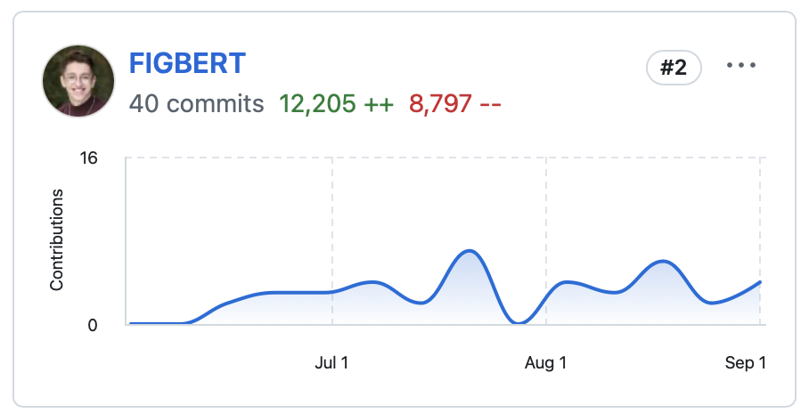

+++
title = "Envelope"
description = "The banking platform with built-in budgeting"
date = 2024-09-03
updated = 2024-09-14
[extra]
type = "work"
start = 2024-06-17
end = 2024-09-06
+++

YCombinator's [job board] has high signal to noise for interesting work,
but it's not every day that their internship tab has as compelling a
phrase as "SwiftUI Engineer." I've been in love with SwiftUI, Apple's
modern app-building framework, [for a long time]. Something about its
[declarative nature] just clicks with how I think. I sent in an
application, sat down for a live coding interview, and my summer plans
were sorted.

[Envelope] is a banking app. It serves as both your primary checking
account and your budgeting platform: the two are seamlessly integrated.
Every transaction that hits your bank is budgeted by default. Envelope
lowers the barrier to entry for your most important personal finance
habit: great budgeting.

It also helps that Envelope brings all the polish of a fancy Silicon
Valley company to banking, a field dominated by the jankiest apps known
to man.

## Tenure
One bullet point in the job description claimed that I would have code
live in production starting from my first day. This was not true. But
it was close! In my first week at the company, I built out a new feature
shown—to every user, on the front page of the app—when assigning a
transaction to an envelope. It is now one of the most used pieces of UI
in the app.

Over the rest of the summer, I continued building and iterating on
practically every facet of the application. By my count we shipped nine
long-requested major features and redesigns, touching everything from
transactions and envelopes to onboarding and the organization of screens
within the app. I took a look on my last day at our improvised Figma
kanban board, and was happy and more than a little bit surprised to see
the done column overflowing with projects we'd shipped.

One particularly fun piece of work that I'd like to immortalize here was
totally removed from feature development: we once spent two days
debugging the [Stytch] [JWT] that our app uses to authenticate users.
When we ultimately located the bug—a particularly nasty problem with
refreshing the token that rendered it invalid after using the app for
longer than five minutes at a time—we were able to fix it with one line.
We also got a DM from a co-founder of Stytch out of the whole
experience, and sent them some API design pointers that I sincerely hope
make it back to [their SDK] one day.

I'm excited to see Envelope grow, and for the additional features
that I didn't have time to put in your hands to see the light
of day. From closer integration with external money sources, certain
additional banking tools, and some cool UI we couldn't ship due to
dependency issues—I'll be keeping an eye on the future of the features I
built out and the future of the whole enterprise.

## Reflections
Josh, the CTO, is brilliant. I was the second engineer at the company—a
fun statement for me in its own right, but also formidable by
implication. Josh built out the entire backend, external integrations,
and SwiftUI application, and had been running them both as a serious
product for two years as the only technical person on the team. Josh is
deeply opinionated about how software should be developed and
maintained, employing a crazy effective philosophy breaking complex
problems down into distinct patterns. He is deeply talented, and I spent
a good part of my internship just trying to absorb some fraction of his
skill.

The realities of the job were also completely new to me. Working a 9-5
took some getting used to; at Stanford, I am surrounded by people doing
crazy and fun things from the moment I wake up until I pass out and in
class for maybe three hours of the day. In school, the day is for play
and work is confined to some fraction of the evenings, but at Envelope
this was flipped. I think I obviously appreciate the flexibility of how
work is done at Stanford over the more traditionally rigid hours. It's
nice to have time to ponder, to be free to meet with people for lunch
and tea throughout the day. My work at Envelope also helped me
contextualize the sort of programming I want to do in the future. Pure
frontend work, devoid of context, is just making a hundred buttons a
day—and when you've made one button, you've really made them all.
However, working with data, building out new functionality, reshaping
and redesigning the user experience: that is deeply fulfilling. My time
at Envelope allowed me to touch on all of these aspects of development
and take a holistic approach to my work.

My time at Envelope was a blast and a privilege. Every change I made
went out to thousands of people using our app on a daily basis. What an
incredible opportunity it was to be able to shape something like that so
directly.

[job board]: https://www.workatastartup.com
[for a long time]: @/projects/txtodo/index.md
[declarative nature]: https://en.wikipedia.org/wiki/Declarative_programming
[Envelope]: https://envelopebudgeting.com
[Stytch]: https://stytch.com
[JWT]: https://datatracker.ietf.org/doc/html/rfc7519
[their SDK]: https://github.com/stytchauth/stytch-ios
