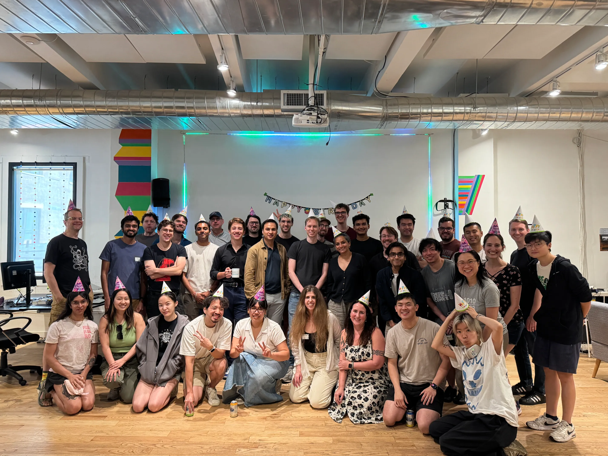

+++
title = "Recurse Center"
description = "The retreat where curious programmers grow"
date = 2026-01-03T20:20:00-08:00
[extra]
type = "work"
start = 2025-06-30
end = 2025-09-19
+++

Many people say the job market is a mess. Fewer people find themselves
on a layover relocating for a job only to have the second leg of the
trip cancelled as [a war broke out] mid-flight. This was the situation I
found myself in one evening in New York—and I began to form a new plan.
There was a mysterious place I had heard of, from [internet celebrities]
and [Stanford peers], where programmers could go to build... things. It
wasn't all that clear to me actually but everyone I knew who had done it
was very cool and I had yet to try living on the East Coast so I checked
the window for applications, saw there was about a week left before the
summer batch, and [the rest is history].

[Recurse] gave me the resources—both technical and personal—to do the
best work I've ever done. I was able to hack on projects I had long
imagined but never had the time for, and pursue new ideas with wild
abandon. On my first day in the office I showed up to a hackathon
partner-less, and said that I was looking to make progress on a [code
forge]. Someone else had shown up alone as well, and volunteered.
[Josh], fountain of `git` knowledge and the world's premier [ZIP
expert], became a good friend.  On my last day in the office, I one-shot
a prototype [dreidel game] at a hackathon for the [Playdate console]. In
between these bookending coding sprints, I discovered that everyone at
the Recurse Center had arrived with their own profound specialties and
interests. I was no exception: some [things][rc] [I][bdab] [made][rr]
[there][cord] [have][stick] [ended][cloud] [up][2p] on this site.

Some notable occurences and accomplishments from my time at the
Recurse Center have yet to make their way into the public eye. [Frank]
nerd-sniped me into a hardware project of grand scale that I [am still
working on]. When it's done it may very well be my magnum opus. [Keith]
tricked me into learning [Gleam], and I have gone on to become a huge
fan of the language. I also picked up Ruby and Rust, though I didn't end
up trying a Lisp as I had hoped. I met [Filippo], creator of  [`age`],
and he mailed me stickers that are now on my bike. [David] planted the
idea in my mind that "project people" should have a truck, and four
months later I test-drove a Rivian R1T...

Working at Recurse is a high-agency playground. If you enjoy shooting
off on [productive tangents]—as I do—there are enough toys there to keep
you entertained for a long time. Apply yourself and you can turn the
3D printers, retro computers, ESP32s, and ultrawide monitors around you
into something wonderful. Or _somethings_ wonderful! And while doing
so, you'll pair with incredible folks, present your work to a large
audience, and hopefully become a better maker yourself. You are the only
one in charge and there is no guide. I enjoyed that. In many ways it
felt like a natural extension of the d. school's philosophy of "learning
by doing."

I was chatting with a good friend of mine over summer, describing
Recurse, when she posed a good question: "How is this going to change
what you're looking for in a career?" It's true that I have yet to see
a job posting for _Person Who Builds Funky and Impactful Open-Source
Stuff and Eats at a New Restaurant Every Night_. But there are aspects
of Recurse that I will look for wherever I end up next. I enjoyed
the variety, the personal responsibility, the creative control, and
the balanced blend of impressive goals with relaxed attitude. These
qualities made the the work feel special. If you're working on something
with purpose and you think you can provide the above, [do reach out].

[a war broke out]: https://www.axios.com/2025/06/13/israel-strike-iran-trump-nuclear-talks
[internet celebrities]: https://eieio.games/
[Stanford peers]: https://miles.land/
[the rest is history]: https://www.recurse.com/apply
[Recurse]: https://www.recurse.com/scout/click?t=0d85c06dc14f97552f2130471d4e3086
[code forge]: @/posts/ideating-tragit.md
[Josh]: https://wolfesoftware.com/
[ZIP expert]: https://github.com/thejoshwolfe/poaf
[dreidel game]: https://github.com/FIGBERT/playspinz
[Playdate console]: http://play.date/
[rc]: @/projects/roll-call/index.md#eight-months-later
[bdab]: @/projects/blind-date-a-book/index.md
[rr]: @/projects/rapid-riter/index.md
[cord]: @/projects/cordially/index.md
[stick]: @/projects/stickies/index.md
[cloud]: @/projects/cloudlab/index.md
[2p]: @/projects/two-pockets/index.md
[productive tangents]: @/posts/tangible-deliverables.md
[Keith]: https://keithfrost.github.io/
[Gleam]: http://gleam.run/
[Frank]: https://www.frankchiarulli.com/
[am still working on]: https://github.com/figbert/scrollthingy
[Filippo]: https://filippo.io
[`age`]: https://age-encryption.org/
[David]: https://wobblybits.blog/
[do reach out]: mailto:figbert@figbert.com
